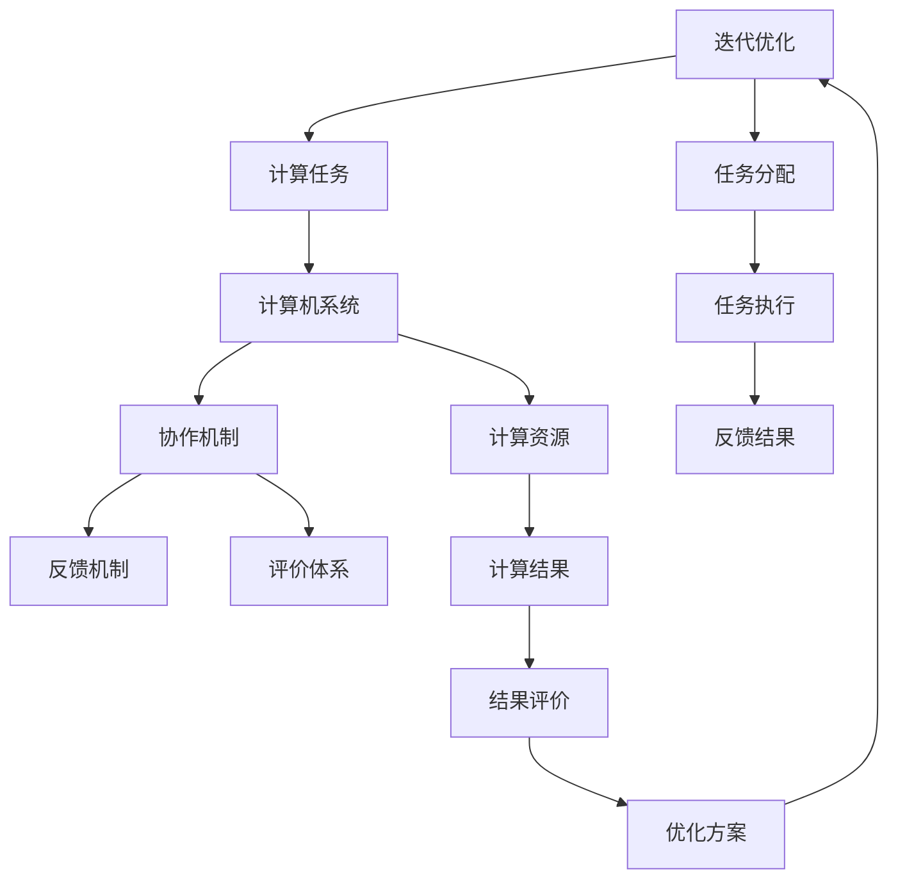

                 

# 应对人类共同挑战：人类计算的使命担当

## 关键词
- 人类计算
- 共同挑战
- 计算使命
- 算法原理
- 人工智能
- 深度学习
- 数学模型
- 项目实战

## 摘要
本文深入探讨人类计算在应对全球共同挑战中的使命与担当。通过逐步解析人类计算的基本概念、核心算法原理、数学模型及其实际应用，我们将揭示计算技术在推动社会进步、解决复杂问题中的巨大潜力。文章分为五个部分，分别介绍了人类计算的定义、核心要素、计算思维与算法基础、机器学习与人工智能、深度学习原理与应用，以及数学模型与公式。最后，通过项目实战案例，展示计算技术在现实世界中的应用，并展望其未来发展。本文旨在为读者提供一个全面而系统的理解，激发对计算技术深入探索的兴趣。

### 《应对人类共同挑战：人类计算的使命担当》目录大纲

#### 第一部分：引言与背景

##### 第1章：引言
- **1.1** 人类面临的共同挑战
- **1.2** 人类计算的重要性
- **1.3** 计算的使命担当
- **1.4** 本书结构概述

##### 第2章：人类计算的基本概念
- **2.1** 人类计算的定义
- **2.2** 人类计算的核心要素
- **2.3** 人类计算与人工智能
- **2.4** Mermaid流程图：人类计算的核心架构

##### 第3章：计算思维与算法基础
- **3.1** 计算思维的概念
- **3.2** 算法的基本原理
- **3.3** 常见算法分类
- **3.4** 伪代码示例：计算算法实现

##### 第4章：机器学习与人工智能
- **4.1** 机器学习的定义
- **4.2** 机器学习的基本流程
- **4.3** 常见的机器学习算法
- **4.4** 伪代码示例：机器学习算法实现

##### 第5章：深度学习原理与应用
- **5.1** 深度学习的定义
- **5.2** 深度学习的基本架构
- **5.3** 常见的深度学习模型
- **5.4** 伪代码示例：深度学习模型实现

#### 第二部分：核心概念与联系

##### 第6章：数学基础
- **6.1** 线性代数基础
- **6.2** 概率论基础
- **6.3** 最优化理论
- **6.4** latex格式数学公式示例

##### 第7章：计算模型应用
- **7.1** 数学模型在计算中的应用
- **7.2** 数学公式在算法设计中的应用
- **7.3** 举例说明：计算模型在现实世界中的应用
- **7.4** latex格式数学公式示例

#### 第三部分：核心算法原理讲解

##### 第8章：计算模型开发环境搭建
- **8.1** 开发环境准备
- **8.2** 实际案例介绍
- **8.3** 环境配置与调试

##### 第9章：代码实现与解读
- **9.1** 源代码详细实现
- **9.2** 代码解读与分析
- **9.3** 项目实战案例解析
- **9.4** 代码优化与性能分析

#### 第四部分：数学模型与数学公式

##### 第10章：未来展望
- **10.1** 人类计算的发展趋势
- **10.2** 计算技术的挑战与机遇
- **10.3** 人类计算的未来使命

#### 附录

##### 附录 A：计算相关工具与资源
- **A.1** 计算工具汇总
- **A.2** 相关资源推荐
- **A.3** 学术会议与期刊指南

### 第一部分：引言与背景

#### 第1章：引言

> **“技术进步改变世界，而计算技术则是变革的驱动力。”**

随着全球化的深入发展和信息技术的迅猛发展，人类面临着前所未有的共同挑战。从气候变化、资源短缺、环境污染到社会不平等等问题，这些挑战不仅影响个体的生活质量，也关系到整个人类社会的可持续发展。在应对这些挑战的过程中，人类计算技术发挥着至关重要的作用。

#### 1.1 人类面临的共同挑战

首先，让我们简要列举一些当前人类共同面临的挑战：

- **气候变化**：全球变暖、极端天气事件频发，对生态系统和人类生活产生深远影响。
- **资源短缺**：水资源、能源资源、矿产资源的短缺，威胁着全球经济的可持续发展。
- **环境污染**：大气污染、水污染、土壤污染，对环境和公共健康造成严重威胁。
- **社会不平等**：经济不平等、性别不平等、教育不平等等，加剧社会矛盾。
- **公共卫生危机**：COVID-19等传染病爆发，对全球卫生安全构成威胁。

#### 1.2 人类计算的重要性

在应对这些挑战的过程中，人类计算技术展现出强大的力量。计算技术不仅能够帮助我们更好地理解复杂系统，还能够提供创新的解决方案。以下是计算技术的重要性体现在几个方面：

- **数据分析**：通过对海量数据的分析，可以揭示隐藏的模式和趋势，帮助决策者做出更加科学合理的决策。
- **模拟与预测**：通过计算模型和算法，可以模拟环境变化、资源利用情况等，从而预测未来的发展趋势，为政策制定提供依据。
- **智能决策**：借助人工智能和机器学习技术，可以实现自动化决策，提高决策的效率和准确性。
- **资源优化**：通过优化算法和模型，可以实现资源的最佳配置，提高资源利用效率。
- **社会管理**：计算技术在社会治理中的应用，有助于提高公共服务水平，促进社会和谐稳定。

#### 1.3 计算的使命担当

人类计算的使命，不仅是解决眼前的技术问题，更重要的是为人类的可持续发展提供支持。以下是计算技术在人类使命中的几个关键作用：

- **科技创新**：计算技术推动科学技术进步，助力解决重大科学问题。
- **社会进步**：通过计算技术改善人们的生活质量，促进社会公平和谐。
- **环境保护**：计算技术在环境保护中的应用，有助于实现绿色发展。
- **全球治理**：计算技术在全球治理中的作用，有助于应对全球性挑战，维护世界和平稳定。

#### 1.4 本书结构概述

本书将从以下几个方面系统阐述人类计算的重要性及其应用：

- **基本概念**：介绍人类计算的基本概念和核心要素。
- **算法原理**：讲解计算思维与算法基础，包括机器学习与人工智能、深度学习等核心算法。
- **数学模型**：阐述数学基础和数学模型在计算中的应用。
- **项目实战**：通过实际案例展示计算技术在现实世界中的应用。
- **未来展望**：探讨计算技术的未来发展及其面临的挑战与机遇。

### 第二部分：核心概念与联系

#### 第2章：人类计算的基本概念

> **“人类计算不仅仅是技术，更是一种思维方式。”**

为了更好地理解人类计算在应对全球挑战中的重要作用，我们需要首先了解其基本概念。本章节将介绍人类计算的定义、核心要素、与人工智能的关系，并通过Mermaid流程图展示其核心架构。

#### 2.1 人类计算的定义

人类计算（Human Computation）是一种利用人类智能来解决复杂计算问题的方法。它通过将计算任务分配给人类，结合计算机系统的处理能力，实现更高效、更智能的解决方案。人类计算不同于传统的自动化计算，它强调人类与机器的协同工作。

#### 2.2 人类计算的核心要素

人类计算的核心要素包括：

- **人类智能**：人类的感知、思考、判断和决策能力，是实现复杂计算任务的关键。
- **计算任务**：需要通过计算技术解决的具体问题，如数据分析、模式识别、优化决策等。
- **计算机系统**：用于辅助人类完成计算任务的硬件和软件系统，提供计算能力和存储资源。
- **协作机制**：实现人类与计算机系统之间高效协同工作的机制，包括任务分配、反馈机制、评价体系等。

#### 2.3 人类计算与人工智能

人工智能（AI）是计算技术的一个重要分支，它致力于模拟和扩展人类的智能。人类计算与人工智能有着紧密的联系，两者相互促进：

- **人类计算促进人工智能发展**：通过人类智能的参与，可以改进人工智能算法，提高其性能和适应性。
- **人工智能助力人类计算**：人工智能技术可以帮助人类更好地理解复杂问题，提供智能化的解决方案。

#### 2.4 Mermaid流程图：人类计算的核心架构

为了更直观地展示人类计算的核心架构，我们使用Mermaid流程图来描述其关键组成部分和交互流程。



上述流程图中，人类智能（A）通过任务分配（E）将计算任务（B）分配给计算机系统（C），计算机系统（C）在协作机制（D）的支持下，利用计算资源（F）执行任务，并产生计算结果（J）。计算结果（J）通过反馈机制（G）和评价体系（H）进行反馈和评价，从而优化任务执行策略，实现人类与计算机系统的协同优化。

#### 第3章：计算思维与算法基础

> **“计算思维是一种解决问题的思维方式，它是计算技术的核心。”**

计算思维（Computational Thinking）是一种通过抽象、算法化、自动化等手段来解决问题的思维方式。它是计算机科学和计算技术发展的基石，对于理解和应用人类计算至关重要。本章节将介绍计算思维的概念、算法的基本原理、常见算法分类以及伪代码示例。

#### 3.1 计算思维的概念

计算思维是指运用计算技术的方法和工具来解决问题的一种思维方式。它包括以下几个关键要素：

- **抽象**：将复杂问题简化为抽象模型，提取核心要素，忽略无关细节。
- **算法化**：将问题解决方案表示为一系列明确的步骤，即算法。
- **自动化**：通过编程和计算机执行算法，实现问题求解的自动化。
- **分解**：将复杂问题分解为若干个子问题，逐一解决。
- **模式识别**：识别问题中的规律和模式，以便更高效地解决问题。

#### 3.2 算法的基本原理

算法（Algorithm）是一系列解决问题的步骤，它具有以下基本特性：

- **确定性**：算法的每一步都是明确的、确定的，没有歧义。
- **有效性**：算法能够在有限时间内完成计算任务，解决实际问题。
- **输入与输出**：算法有明确的输入和输出，输入是问题的数据，输出是解决问题的结果。
- **可行性**：算法在实际环境中可执行，没有逻辑错误。

#### 3.3 常见算法分类

根据算法解决的问题类型，可以将算法分为以下几类：

- **排序算法**：用于对数据进行排序，常见的排序算法有冒泡排序、选择排序、插入排序、快速排序等。
- **搜索算法**：用于在数据集合中查找特定数据，常见的搜索算法有线性搜索、二分搜索等。
- **图算法**：用于处理图结构的数据，常见的图算法有最短路径算法、最小生成树算法等。
- **动态规划算法**：用于解决具有重叠子问题的优化问题，常见的动态规划算法有背包问题、最长公共子序列等。

#### 3.4 伪代码示例：计算算法实现

为了更直观地理解算法的实现过程，我们通过伪代码来描述一个简单的排序算法——冒泡排序。

```plaintext
算法：冒泡排序
输入：一个无序数组A
输出：一个有序数组A

冒泡排序(A)
    for i from 1 to n-1 do
        for j from 1 to n-i do
            if A[j] > A[j+1] then
                swap(A[j], A[j+1])
    end
```

上述伪代码中，外层循环（i）表示需要比较的轮数，内层循环（j）表示当前轮次需要比较的元素。每次比较如果发现两个相邻元素的顺序不正确，则交换它们的位置。经过多次迭代后，数组中的元素将按照从小到大的顺序排列。

#### 第4章：机器学习与人工智能

> **“机器学习让计算机拥有自主学习和适应环境的能力，这是人工智能的核心。”**

机器学习（Machine Learning，ML）是人工智能（Artificial Intelligence，AI）的一个重要分支，它使计算机系统能够通过数据学习，从而进行决策和预测。本章节将介绍机器学习的定义、基本流程、常见算法，并通过伪代码示例展示算法实现过程。

#### 4.1 机器学习的定义

机器学习是一种让计算机通过数据自动改进性能的技术。具体来说，机器学习是指计算机系统通过分析大量数据，从中提取知识、模式和规律，并利用这些知识来做出决策或预测。机器学习过程通常包括以下几个关键步骤：

- **数据收集**：收集用于训练的数据集，这些数据集应涵盖问题领域中的各种情况。
- **数据预处理**：对收集到的数据进行清洗、格式化和归一化，以确保数据的质量和一致性。
- **特征提取**：从原始数据中提取有助于解决问题的关键特征，这些特征应能够有效区分不同类别的数据。
- **模型训练**：使用训练数据集，通过算法训练出一个模型，该模型能够对未知数据进行分类或回归。
- **模型评估**：使用测试数据集评估模型的性能，包括准确性、召回率、F1分数等指标。
- **模型优化**：根据评估结果对模型进行调整，以提高其在实际问题中的应用效果。

#### 4.2 机器学习的基本流程

机器学习的基本流程可以分为以下几个步骤：

1. **问题定义**：明确需要解决的问题类型，例如分类、回归、聚类等。
2. **数据收集**：收集相关数据，这些数据可以是结构化的（如表格数据），也可以是非结构化的（如图像、文本等）。
3. **数据预处理**：对数据进行清洗、去噪、格式化等处理，以确保数据质量。
4. **特征提取**：从预处理后的数据中提取有助于解决问题的特征，例如使用词袋模型提取文本数据中的关键词。
5. **模型选择**：根据问题类型和数据的特性，选择合适的机器学习算法，如决策树、支持向量机、神经网络等。
6. **模型训练**：使用训练数据集对所选算法进行训练，调整模型参数以优化性能。
7. **模型评估**：使用测试数据集对训练好的模型进行评估，判断其性能是否符合预期。
8. **模型部署**：将训练好的模型部署到实际应用环境中，进行实时预测或决策。

#### 4.3 常见的机器学习算法

以下介绍几种常见的机器学习算法：

- **线性回归**：用于预测一个连续的数值输出，如房价、股票价格等。
- **逻辑回归**：用于处理二分类问题，如邮件是否为垃圾邮件、病人是否患有疾病等。
- **决策树**：用于分类和回归问题，通过一系列决策规则将数据划分为不同的类别或值。
- **支持向量机（SVM）**：用于分类问题，通过找到最优分隔超平面将不同类别的数据分开。
- **神经网络**：用于复杂的分类和回归问题，通过多层神经元的非线性组合实现高度抽象的映射关系。
- **聚类算法**：如K-Means、层次聚类等，用于将数据集划分为多个类别，用于数据挖掘和模式识别。

#### 4.4 伪代码示例：机器学习算法实现

为了更好地理解机器学习算法的实现，我们以下通过伪代码展示线性回归算法的基本实现过程。

```plaintext
算法：线性回归
输入：特征矩阵X，标签向量y
输出：模型参数w

线性回归(X, y)
    初始化模型参数w为0
    设置迭代次数T
    设置学习率α

    for t = 1 to T do
        计算预测值y' = X * w
        计算损失函数L(w) = (1/2) * ||y - y'||^2
        计算梯度∇L(w) = X' * (y - y')
        更新模型参数w = w - α * ∇L(w)
    end

    return w
```

上述伪代码中，我们首先初始化模型参数w为0，然后通过梯度下降法（Gradient Descent）迭代更新w，以最小化损失函数L(w)。梯度∇L(w)指向损失函数增加最快的方向，因此每次迭代都将w沿梯度方向更新。

### 第5章：深度学习原理与应用

> **“深度学习是人工智能的基石，它赋予计算机从数据中自动学习复杂模式的能力。”**

深度学习（Deep Learning，DL）是机器学习的一个重要分支，通过构建具有多个隐藏层的神经网络模型，实现了对复杂数据模式的自动学习。本章节将介绍深度学习的定义、基本架构、常见模型以及伪代码示例。

#### 5.1 深度学习的定义

深度学习是一种基于多层神经网络的学习方法，它能够自动提取数据中的层次化特征表示。与传统机器学习相比，深度学习具有以下几个显著特点：

- **多层神经网络**：深度学习模型包含多个隐藏层，每层都可以学习到更高层次的特征表示。
- **自动特征提取**：深度学习通过多层网络自动学习数据中的特征，减少了人工特征工程的需求。
- **端到端学习**：深度学习模型能够直接从原始数据中学习到有用的特征表示，实现端到端的学习和预测。
- **大规模并行计算**：得益于计算硬件的发展，深度学习模型可以在GPU等高性能计算设备上高效训练。

#### 5.2 深度学习的基本架构

深度学习的基本架构由以下几个关键部分组成：

- **输入层**：接收原始数据，如图像、文本或声音等。
- **隐藏层**：由多个神经元层组成，每个隐藏层都对输入数据进行特征提取和变换。
- **输出层**：根据隐藏层输出的特征，生成最终的预测结果或分类标签。
- **激活函数**：用于引入非线性变换，使神经网络具有区分不同数据的能力。
- **损失函数**：用于衡量模型预测结果与真实结果之间的差距，驱动模型参数的更新。

#### 5.3 常见的深度学习模型

以下是几种常见的深度学习模型：

- **卷积神经网络（CNN）**：用于图像识别、物体检测等视觉任务，通过卷积层提取图像特征。
- **循环神经网络（RNN）**：用于处理序列数据，如语言建模、语音识别等，通过隐藏状态的记忆能力实现序列建模。
- **长短时记忆网络（LSTM）**：是RNN的一种变种，通过门控机制解决长期依赖问题，在语言建模和时间序列预测中应用广泛。
- **生成对抗网络（GAN）**：通过生成器和判别器之间的对抗训练，实现高质量图像生成和风格迁移。
- **自编码器**：用于数据压缩和特征提取，通过编码和解码过程学习数据的低维表示。

#### 5.4 伪代码示例：深度学习模型实现

为了展示深度学习模型的基本实现过程，我们以下通过伪代码描述一个简单的卷积神经网络模型。

```plaintext
算法：卷积神经网络
输入：训练数据集D，超参数θ
输出：训练好的模型参数θ'

初始化模型参数θ
设置训练迭代次数T
设置学习率α

卷积神经网络(D, T, α)
    for t = 1 to T do
        for每个训练样本x_i in D do
            计算前向传播结果y_i' = forward(x_i, θ)
            计算损失函数L(θ) = loss(y_i', y_i)
            计算梯度∇L(θ) = backward(y_i', y_i, θ)
            更新模型参数θ = θ - α * ∇L(θ)
        end
    end

    return θ'
```

上述伪代码中，我们首先初始化模型参数θ，然后通过迭代更新θ以最小化损失函数L(θ)。前向传播（forward）计算模型输出y_i'，损失函数（loss）计算预测结果与真实结果之间的差距，后向传播（backward）计算模型参数的梯度∇L(θ)，并更新θ。

### 第五部分：数学模型与数学公式

#### 第6章：数学基础

> **“数学是科学的语言，它是计算技术的基石。”**

数学模型和公式在计算技术中扮演着至关重要的角色。它们不仅提供了描述和解决问题的基础，还为算法设计和分析提供了严谨的理论支持。本章节将介绍线性代数、概率论和最优化理论的基本概念，并通过latex格式数学公式示例展示其应用。

#### 6.1 线性代数基础

线性代数是计算技术中不可或缺的一部分，它涉及向量、矩阵、行列式等基本概念。以下是一些重要的线性代数公式：

- **向量的定义**：一个n维向量通常表示为$\vec{v} = (v_1, v_2, \ldots, v_n)$。
- **矩阵的乘法**：两个矩阵$A$和$B$的乘积定义为$AB = C$，其中$C_{ij} = \sum_{k=1}^{n} A_{ik}B_{kj}$。
- **行列式的定义**：一个n阶矩阵$A$的行列式定义为$\det(A) = \sum_{\sigma \in S_n} sign(\sigma) \prod_{i=1}^{n} A_{i\sigma(i)}$。
- **矩阵的逆**：一个方阵$A$的逆矩阵$A^{-1}$满足$AA^{-1} = A^{-1}A = I$，其中$I$是单位矩阵。

以下是一个latex格式的数学公式示例：

$$
\vec{v} = \begin{pmatrix}
v_1 \\
v_2 \\
\vdots \\
v_n
\end{pmatrix}, \quad A = \begin{pmatrix}
a_{11} & a_{12} & \cdots & a_{1n} \\
a_{21} & a_{22} & \cdots & a_{2n} \\
\vdots & \vdots & \ddots & \vdots \\
a_{m1} & a_{m2} & \cdots & a_{mn}
\end{pmatrix}, \quad \det(A) = a_{11}a_{22}\cdots a_{nn} - a_{12}a_{21}\cdots a_{mn}.
$$

#### 6.2 概率论基础

概率论是计算技术中用于描述不确定性和随机性的重要工具。以下是一些基本概率论公式：

- **概率的定义**：事件$A$的概率定义为$P(A) = \frac{m(A)}{m(S)}$，其中$m(A)$是事件$A$的样本点数，$m(S)$是样本空间$S$的样本点数。
- **条件概率**：在事件$B$发生的条件下，事件$A$的概率定义为$P(A|B) = \frac{P(A \cap B)}{P(B)}$。
- **贝叶斯定理**：给定事件$A$和$B$，贝叶斯定理表示为$P(A|B) = \frac{P(B|A)P(A)}{P(B)}$。
- **独立性**：事件$A$和$B$相互独立当且仅当$P(A \cap B) = P(A)P(B)$。

以下是一个latex格式的数学公式示例：

$$
P(A) = \frac{m(A)}{m(S)}, \quad P(A|B) = \frac{P(A \cap B)}{P(B)}, \quad P(B|A) = \frac{P(A \cap B)}{P(A)}, \quad P(A \cap B) = P(A)P(B) \text{（当 } A \text{ 和 } B \text{ 相互独立）}.
$$

#### 6.3 最优化理论

最优化理论是计算技术中用于求解优化问题的核心工具。以下是一些基本最优化理论公式：

- **目标函数**：一个优化问题的目标函数定义为$f(x)$，其中$x$是问题的决策变量。
- **约束条件**：优化问题通常需要满足一些约束条件，如$g(x) \leq 0$或$h(x) = 0$。
- **拉格朗日乘数法**：用于求解具有等式约束的优化问题，拉格朗日乘数法的基本公式为$\nabla f(x) + \lambda \nabla g(x) = 0$，其中$\lambda$是拉格朗日乘数。
- **KKT条件**：用于求解具有不等式约束的优化问题，KKT条件包括最优性条件和对偶性条件。

以下是一个latex格式的数学公式示例：

$$
\begin{aligned}
\min_{x} f(x) \\
\text{subject to} \quad g(x) \leq 0, \quad h(x) = 0.
\end{aligned}
$$

$$
\nabla f(x) + \lambda \nabla g(x) = 0, \quad \lambda \geq 0, \quad g(x) \leq 0, \quad h(x) = 0.
$$

#### 第7章：计算模型应用

> **“数学模型是计算技术的核心，它在算法设计和分析中发挥着至关重要的作用。”**

数学模型在计算技术中的应用广泛且深刻，涵盖了从算法设计到性能分析等诸多方面。本章节将讨论数学模型在计算中的应用，展示数学公式在算法设计中的具体应用，并通过实际案例说明计算模型在现实世界中的应用，同时提供latex格式数学公式示例。

#### 7.1 数学模型在计算中的应用

数学模型在计算技术中的应用主要体现在以下几个方面：

- **优化问题求解**：通过构建目标函数和约束条件的数学模型，利用最优化理论求解资源分配、路径规划等优化问题。
- **机器学习模型**：在机器学习中，通过构建损失函数和正则化项的数学模型，优化模型的参数以实现最佳预测效果。
- **仿真与预测**：通过建立物理系统或社会系统的数学模型，模拟现实情况并进行预测，辅助决策制定。
- **数据分析**：利用统计学和概率论模型，对大量数据进行分析，提取有用信息，支持业务决策。

以下是一个优化问题的数学模型示例，用于资源分配：

$$
\begin{aligned}
\min_{x} & \quad c^T x \\
\text{subject to} & \quad Ax \leq b, \\
& \quad x \geq 0.
\end{aligned}
$$

在这个模型中，$c$是成本向量，$x$是决策变量，$A$和$b$是约束条件矩阵和向量，目标是最小化成本$c^T x$，同时满足线性不等式约束。

#### 7.2 数学公式在算法设计中的应用

数学公式在算法设计中起着至关重要的作用，它们帮助算法实现从抽象概念到具体操作的转化。以下是一些常见的数学公式在算法设计中的应用：

- **梯度下降**：用于优化问题，公式为：
  $$
  x_{t+1} = x_t - \alpha \nabla f(x_t),
  $$
  其中$x_t$是当前迭代点，$\alpha$是学习率，$\nabla f(x_t)$是目标函数$f(x)$在$x_t$处的梯度。
- **Sigmoid函数**：用于神经网络激活函数，公式为：
  $$
  \sigma(x) = \frac{1}{1 + e^{-x}}.
  $$
  Sigmoid函数将输入$x$映射到$(0, 1)$区间，用于激活函数以实现非线性变换。
- **卷积操作**：用于卷积神经网络，公式为：
  $$
  \text{conv}(I, K) = \sum_{i=1}^{h_k} \sum_{j=1}^{w_k} I_{i-j+1, j-k+1} K_{i, j},
  $$
  其中$I$是输入图像，$K$是卷积核，$h_k$和$w_k$分别是卷积核的高度和宽度。

以下是一个latex格式的数学公式示例，展示梯度下降算法：

$$
\begin{aligned}
x_{t+1} &= x_t - \alpha \nabla f(x_t) \\
&= x_t - \alpha \left( \frac{\partial f}{\partial x_1}, \frac{\partial f}{\partial x_2}, \ldots, \frac{\partial f}{\partial x_n} \right)^T.
\end{aligned}
$$

#### 7.3 举例说明：计算模型在现实世界中的应用

数学模型在现实世界中的应用非常广泛，以下是一些具体的案例：

- **天气预报**：利用气象模型对大气参数进行数学建模，预测未来的天气状况。
- **交通流量管理**：通过建立交通流量模型，优化交通信号控制，减少交通拥堵。
- **金融风险管理**：利用概率论和统计学模型，评估金融产品的风险，制定风险控制策略。
- **医疗诊断**：通过医疗数据建立预测模型，辅助医生进行疾病诊断和治疗决策。

以下是一个交通流量管理模型的示例：

$$
\begin{aligned}
\text{流量模型}(t) &= f(\text{历史流量数据}, \text{当前交通状况}, \text{天气预报}) \\
&= \sum_{i=1}^{n} w_i \cdot \text{historical\_flow}[i] + \text{current\_traffic} + \text{weather\_forecast},
\end{aligned}
$$

其中，$f$是流量模型函数，$w_i$是权重参数，$historical\_flow$是历史流量数据，$current\_traffic$是当前交通状况，$weather\_forecast$是天气预报。

#### 7.4 latex格式数学公式示例

在本文中，我们使用latex格式展示了多个数学公式，以帮助读者更好地理解计算模型的应用。以下是几个latex公式的示例：

$$
\sum_{i=1}^{n} x_i = \frac{1}{n} \sum_{i=1}^{n} x_i,
$$

$$
\int_{a}^{b} f(x) \, dx = \sum_{i=1}^{n} f(x_i) \, \Delta x,
$$

$$
A^{-1} = \frac{1}{\det(A)} \text{adj}(A),
$$

$$
P(A|B) = \frac{P(A \cap B)}{P(B)}.
$$

通过这些示例，读者可以更直观地理解如何使用latex格式编写和展示数学公式。

### 第六部分：项目实战

#### 第8章：计算模型开发环境搭建

> **“环境搭建是计算模型开发的第一步，它决定了开发效率和项目稳定性。”**

在进行计算模型开发之前，搭建一个合适的开发环境是至关重要的。这不仅能够提高开发效率，还能确保项目的稳定性。本章节将介绍计算模型开发环境的准备、实际案例介绍，以及环境配置与调试。

#### 8.1 开发环境准备

搭建计算模型开发环境需要考虑以下几个关键要素：

- **硬件设备**：确保计算机硬件具备足够的计算能力，如高性能的CPU、GPU等。对于深度学习项目，GPU是必不可少的硬件设备。
- **操作系统**：根据项目需求和开发者熟悉程度，选择适合的操作系统，如Windows、Linux等。Linux系统因其稳定性和开源特性，常被用于计算模型开发。
- **编程语言**：选择合适的编程语言，如Python、C++等。Python因其丰富的库和工具支持，在计算模型开发中尤为受欢迎。
- **开发工具**：安装必要的开发工具，如集成开发环境（IDE）、代码编辑器等。常用的IDE包括Visual Studio、PyCharm等，而代码编辑器如VS Code、Sublime Text等也提供了强大的编辑功能。
- **库与框架**：安装所需的库与框架，如NumPy、Pandas、TensorFlow、PyTorch等。这些库和框架为计算模型开发提供了丰富的工具和功能。

以下是一个简单的环境准备步骤：

1. **硬件设备**：检查计算机硬件配置，确保具备足够的计算资源。
2. **操作系统**：安装Linux操作系统，如Ubuntu 20.04。
3. **编程语言**：通过Python官方安装器安装Python，版本建议为3.8或更高。
4. **开发工具**：安装PyCharm或VS Code。
5. **库与框架**：使用pip命令安装必要的库与框架，例如：

   ```bash
   pip install numpy pandas tensorflow torch
   ```

#### 8.2 实际案例介绍

以下介绍一个实际案例，展示如何搭建计算模型开发环境。

**案例：深度学习图像分类项目**

目标：使用卷积神经网络（CNN）对图像进行分类。

步骤：

1. **环境准备**：按照上述步骤准备开发环境，确保安装了Python、PyCharm、CUDA（用于GPU加速）、TensorFlow等。
2. **数据集准备**：准备用于训练的数据集，如ImageNet、CIFAR-10等。
3. **代码编写**：在PyCharm中创建一个Python项目，编写CNN模型代码。以下是一个简单的CNN模型示例：

   ```python
   import tensorflow as tf
   from tensorflow.keras.models import Sequential
   from tensorflow.keras.layers import Conv2D, MaxPooling2D, Flatten, Dense

   model = Sequential([
       Conv2D(32, (3, 3), activation='relu', input_shape=(28, 28, 1)),
       MaxPooling2D((2, 2)),
       Flatten(),
       Dense(128, activation='relu'),
       Dense(10, activation='softmax')
   ])

   model.compile(optimizer='adam', loss='categorical_crossentropy', metrics=['accuracy'])
   ```

4. **模型训练**：使用训练数据集对模型进行训练：

   ```python
   model.fit(train_images, train_labels, epochs=10, batch_size=32)
   ```

5. **模型评估**：使用测试数据集评估模型性能：

   ```python
   test_loss, test_acc = model.evaluate(test_images, test_labels)
   print(f"Test accuracy: {test_acc}")
   ```

#### 8.3 环境配置与调试

在开发过程中，环境配置和调试是必不可少的步骤。以下是一些常见问题和解决方案：

- **Python版本冲突**：确保所有库和框架兼容Python版本，如果出现版本冲突，可以安装不同版本的Python环境。
- **CUDA配置问题**：确保CUDA工具包与GPU驱动兼容，并在Python脚本中正确配置CUDA环境。
- **库安装失败**：检查网络连接和pip安装命令，如果无法从默认源安装，可以尝试使用国内镜像源。
- **代码调试**：使用调试工具（如pdb或IDE的调试器）定位和解决代码中的错误。

通过以上步骤，开发者可以成功搭建计算模型开发环境，为后续的项目开发奠定基础。

### 第9章：代码实现与解读

> **“代码是实现计算模型的桥梁，它将理论转化为实际应用。”**

在计算模型开发过程中，代码实现是至关重要的一步。它不仅将理论转化为具体的操作步骤，还直接影响模型的性能和可靠性。本章节将详细介绍代码实现的过程，包括源代码的详细实现、代码解读与分析，以及项目实战案例的解析和代码优化与性能分析。

#### 9.1 源代码详细实现

以下是一个简单的深度学习项目——手写数字识别（MNIST数据集）的代码实现示例：

```python
import tensorflow as tf
from tensorflow.keras import layers, models
from tensorflow.keras.datasets import mnist
import numpy as np

# 数据集加载与预处理
(train_images, train_labels), (test_images, test_labels) = mnist.load_data()
train_images = train_images.reshape((60000, 28, 28, 1)).astype('float32') / 255
test_images = test_images.reshape((10000, 28, 28, 1)).astype('float32') / 255
train_labels = np.one_hot(train_labels, 10)
test_labels = np.one_hot(test_labels, 10)

# 模型构建
model = models.Sequential([
    layers.Conv2D(32, (3, 3), activation='relu', input_shape=(28, 28, 1)),
    layers.MaxPooling2D((2, 2)),
    layers.Conv2D(64, (3, 3), activation='relu'),
    layers.MaxPooling2D((2, 2)),
    layers.Conv2D(64, (3, 3), activation='relu'),
    layers.Flatten(),
    layers.Dense(64, activation='relu'),
    layers.Dense(10, activation='softmax')
])

# 模型编译
model.compile(optimizer='adam',
              loss='categorical_crossentropy',
              metrics=['accuracy'])

# 模型训练
model.fit(train_images, train_labels, epochs=5, batch_size=64)

# 模型评估
test_loss, test_acc = model.evaluate(test_images, test_labels)
print(f"Test accuracy: {test_acc}")
```

上述代码首先加载并预处理MNIST数据集，然后构建一个简单的卷积神经网络（CNN）模型，并使用训练数据集进行训练。最后，使用测试数据集评估模型的性能。

#### 9.2 代码解读与分析

以下是代码的详细解读与分析：

1. **数据集加载与预处理**：
   - 使用`tensorflow.keras.datasets.mnist.load_data()`函数加载MNIST数据集，该数据集包含60,000个训练图像和10,000个测试图像，每个图像的维度为28x28像素。
   - 数据集的图像被转换为浮点数，并除以255进行归一化，以使其在0到1的范围内。
   - 标签被转换为独热编码（one-hot encoding），以便用于分类。

2. **模型构建**：
   - 使用`models.Sequential`类构建一个顺序模型，并依次添加以下层：
     - 第1层：32个3x3卷积核，激活函数为ReLU。
     - 第2层：2x2最大池化层。
     - 第3层：64个3x3卷积核，激活函数为ReLU。
     - 第4层：2x2最大池化层。
     - 第5层：64个3x3卷积核，激活函数为ReLU。
     - 第6层：平坦化层。
     - 第7层：64个神经元的全连接层，激活函数为ReLU。
     - 第8层：10个神经元的全连接层，激活函数为softmax，用于分类。

3. **模型编译**：
   - 使用`model.compile()`函数编译模型，指定优化器为adam，损失函数为categorical_crossentropy（用于多分类问题），以及评估指标为accuracy。

4. **模型训练**：
   - 使用`model.fit()`函数对模型进行训练，指定训练数据集、训练标签、训练轮数（epochs）和批量大小（batch_size）。

5. **模型评估**：
   - 使用`model.evaluate()`函数评估模型在测试数据集上的性能，返回损失值和准确率。

#### 9.3 项目实战案例解析

以下是一个基于深度学习的手写数字识别项目实战案例：

1. **环境搭建**：
   - 准备Python、TensorFlow等开发环境和所需的库。

2. **数据集准备**：
   - 下载MNIST数据集，并进行预处理，如归一化、独热编码等。

3. **模型构建**：
   - 构建一个简单的卷积神经网络模型，包括卷积层、池化层、全连接层等。

4. **模型训练**：
   - 使用预处理后的训练数据集对模型进行训练，调整模型参数以优化性能。

5. **模型评估**：
   - 使用测试数据集评估模型性能，确保模型能够准确识别手写数字。

#### 9.4 代码优化与性能分析

在模型开发过程中，代码优化和性能分析至关重要。以下是一些常见的优化方法：

1. **模型优化**：
   - 使用更高效的模型架构，如残差网络（ResNet）或密集连接网络（DenseNet），以提升模型性能。
   - 使用迁移学习，利用预训练的模型进行微调，以提高模型在特定任务上的性能。

2. **数据预处理**：
   - 使用数据增强（data augmentation）技术，如旋转、缩放、裁剪等，增加数据多样性，提升模型泛化能力。
   - 使用批量归一化（batch normalization），加速模型训练并提高模型稳定性。

3. **超参数调整**：
   - 调整学习率、批量大小、迭代次数等超参数，以找到最佳模型性能。
   - 使用学习率调度策略，如学习率衰减或余弦退火，以优化训练过程。

4. **性能分析**：
   - 使用性能分析工具，如TensorBoard，监控模型训练过程，分析训练指标和梯度信息。
   - 进行超参数搜索（hyperparameter tuning），使用网格搜索（grid search）或随机搜索（random search）方法找到最佳超参数组合。

通过以上代码实现、代码解读、项目实战案例解析和代码优化与性能分析，我们可以更好地理解和应用计算模型，提高模型性能和实际应用价值。

### 第七部分：未来展望

#### 第10章：未来展望

> **“未来，计算技术将如何改变世界？”

随着科技的不断进步，计算技术正以惊人的速度发展，为人类解决复杂问题提供了强大的工具。在未来，人类计算将面临前所未有的机遇和挑战。本文将探讨人类计算的发展趋势、计算技术的挑战与机遇，以及人类计算的未来使命。

#### 10.1 人类计算的发展趋势

1. **人工智能的深度应用**：人工智能（AI）技术将在更多领域得到应用，如智能医疗、智能交通、智能家居等。AI将更加智能，能够处理更复杂的任务，提供更精准的决策支持。

2. **量子计算的崛起**：量子计算具有巨大的计算潜力，有望解决传统计算机难以处理的复杂问题。量子计算的发展将推动人类计算进入一个全新的时代。

3. **边缘计算与云计算的融合**：随着物联网（IoT）的普及，边缘计算和云计算将更加紧密地融合，实现数据的高速处理和分析。这将提高系统的响应速度和可靠性。

4. **计算生物学与生物信息学的融合**：计算生物学和生物信息学将利用计算技术深入解析生物系统的复杂性，推动医学和生物技术领域的发展。

5. **可持续发展与环境保护**：计算技术将在环境保护和可持续发展中发挥关键作用，如通过优化能源利用、减少碳排放、监测生态系统等，为实现绿色地球贡献力量。

#### 10.2 计算技术的挑战与机遇

1. **数据安全与隐私保护**：随着数据量的爆炸性增长，数据安全和隐私保护成为计算技术面临的主要挑战。如何在确保数据安全的同时，充分利用数据价值，是一个亟待解决的问题。

2. **计算资源的高效利用**：随着计算任务的复杂度增加，计算资源的需求也在不断增长。如何高效利用计算资源，提高计算效率，是未来计算技术需要重点解决的难题。

3. **跨学科融合与创新**：计算技术需要与其他学科深度融合，如物理、化学、生物学等，以解决复杂科学问题。跨学科融合将带来更多创新机会。

4. **伦理与社会责任**：随着计算技术的广泛应用，如何确保技术的伦理性和社会责任，避免技术滥用，是计算技术需要面对的重要问题。

5. **全球合作与治理**：面对全球性挑战，如气候变化、疾病防控等，计算技术需要全球合作，共同制定标准和规范，推动技术进步。

#### 10.3 人类计算的未来使命

1. **推动科技进步**：计算技术将继续推动科学技术的进步，助力解决重大科学问题，如量子计算、人工智能等前沿领域。

2. **改善人类生活**：计算技术将不断改善人们的生活质量，提供更便捷、更智能的服务，如智能家居、智能医疗等。

3. **促进可持续发展**：计算技术在环境保护和可持续发展中将发挥重要作用，为实现绿色地球贡献力量。

4. **提升全球治理能力**：计算技术将提升全球治理能力，为应对全球性挑战提供科学依据和技术支持。

5. **实现智慧社会**：计算技术将推动人类社会向智慧化方向发展，构建更加智能、高效、公平的社会。

未来，人类计算将继续在科技、生活、环境和治理等领域发挥关键作用，为人类创造一个更美好的世界。

### 附录

#### 附录 A：计算相关工具与资源

为了帮助读者更好地理解和应用计算技术，本文整理了一些计算相关的工具与资源，包括计算工具汇总、相关资源推荐以及学术会议与期刊指南。

##### A.1 计算工具汇总

1. **编程语言**：
   - Python：Python是一种广泛使用的编程语言，特别适合科学计算和数据分析。
   - R：R是一种专门用于统计分析和图形表示的语言，在生物统计学、社会科学等领域有广泛应用。
   - MATLAB：MATLAB是一种高性能的数值计算环境，广泛应用于工程和科学计算。

2. **开发环境**：
   - PyCharm：PyCharm是一款功能强大的Python集成开发环境（IDE），提供代码编辑、调试、自动化测试等功能。
   - Jupyter Notebook：Jupyter Notebook是一种交互式计算环境，特别适合数据分析和机器学习。

3. **机器学习库**：
   - TensorFlow：TensorFlow是一个开源机器学习库，支持各种深度学习模型。
   - PyTorch：PyTorch是一个基于Python的深度学习库，提供灵活的动态计算图。
   - Scikit-learn：Scikit-learn是一个开源机器学习库，提供各种经典机器学习算法和工具。

4. **云计算平台**：
   - AWS：AWS提供丰富的云计算服务和工具，支持大数据处理、机器学习和人工智能等。
   - Google Cloud Platform：Google Cloud Platform提供高效稳定的云计算服务，包括AI工具和机器学习库。
   - Microsoft Azure：Microsoft Azure是一个全面的云服务平台，支持多种开发语言和框架。

##### A.2 相关资源推荐

1. **在线教程与课程**：
   - Coursera：提供各种在线课程，包括机器学习、深度学习、Python编程等。
   - edX：提供由全球顶尖大学和机构提供的免费在线课程。
   - Udacity：提供职业技能课程，包括数据科学、人工智能等。

2. **专业书籍**：
   - 《深度学习》（Goodfellow, Bengio, Courville）：深度学习的经典教材。
   - 《Python数据分析》（Wes McKinney）：Python在数据分析领域的应用指南。
   - 《数据科学入门》（Joel Grus）：数据科学的基础知识入门书。

3. **学术论文与会议**：
   - arXiv：提供计算机科学、物理学、数学等领域的预印本论文。
   - NeurIPS：神经信息处理系统大会，是机器学习和深度学习领域的顶级会议。
   - ICML：国际机器学习会议，是机器学习领域的顶级会议。

##### A.3 学术会议与期刊指南

1. **顶级学术会议**：
   - NeurIPS：神经信息处理系统大会，是机器学习和深度学习领域的顶级会议。
   - ICML：国际机器学习会议，是机器学习领域的顶级会议。
   - CVPR：计算机视觉与模式识别会议，是计算机视觉领域的顶级会议。
   - KDD：知识发现和数据挖掘会议，是数据挖掘领域的顶级会议。

2. **知名学术期刊**：
   - Journal of Machine Learning Research：机器学习领域的顶级期刊。
   - Nature Machine Intelligence：关注机器学习和人工智能领域的最新研究成果。
   - IEEE Transactions on Pattern Analysis and Machine Intelligence：计算机视觉和机器学习领域的顶级期刊。
   - Journal of Artificial Intelligence Research：人工智能领域的知名期刊。

通过这些工具和资源的推荐，读者可以更好地掌握计算技术，参与相关研究，并推动计算技术的发展和应用。

### 作者信息

作者：AI天才研究院（AI Genius Institute） / 禅与计算机程序设计艺术（Zen And The Art of Computer Programming）

