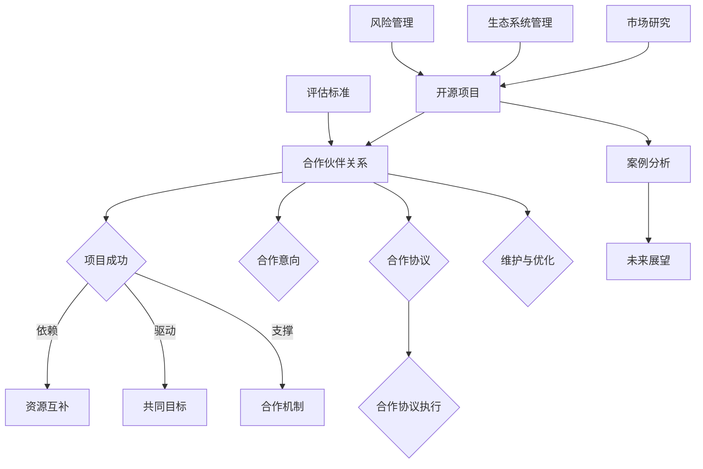

                 

# 建立开源项目的商业伙伴关系网络

## 摘要

本文探讨了开源项目与商业伙伴关系的重要性，以及如何建立和维护一个有效的商业伙伴关系网络。通过识别和评估潜在合作伙伴，建立合作关系，管理合作伙伴生态系统和风险管理，本文提供了一系列策略和实用工具，帮助开源项目团队充分利用商业伙伴资源，实现项目目标。同时，通过案例分析，我们揭示了成功合作的关键因素和潜在挑战，并为未来开源项目与商业伙伴关系的协同效应提供了展望。本文旨在为开源项目开发者和管理者提供一个全面且实用的指南。

## 目录大纲

### 第一部分：背景与概述

#### 第1章：开源项目与商业伙伴关系

1.1 开源项目概述

- 开源项目的定义与特点
- 开源项目的生态与影响力

1.2 商业伙伴关系的定义与类型

- 传统商业伙伴关系与开源项目伙伴关系的区别
- 商业伙伴关系的类型与策略

1.3 商业伙伴关系在开源项目中的重要性

- 开源项目成功的要素
- 商业伙伴关系在项目发展中的关键作用

### 第二部分：构建商业伙伴关系网络

#### 第2章：识别与评估潜在商业伙伴

2.1 潜在商业伙伴的识别

- 市场研究与竞争对手分析
- 开源社区参与与关系网建立

2.2 商业伙伴评估标准

- 资源互补性
- 共同目标与价值观
- 长期合作潜力

2.3 评估方法与工具

- SWOT分析
- 成本-效益分析

#### 第3章：建立合作关系

3.1 合作意向的沟通

- 初步接触与沟通策略
- 明确合作目标与利益分配

3.2 合作协议的制定

- 合作模式与条款设计
- 协议签订与履行监督

3.3 合作关系的维护与优化

- 定期沟通与反馈机制
- 协作效率提升与调整策略

### 第三部分：管理商业伙伴关系网络

#### 第4章：合作伙伴生态系统管理

4.1 合作伙伴生态系统概述

- 生态系统结构与角色
- 生态系统的治理与协调

4.2 生态系统中的合作与竞争

- 合作机会识别
- 竞争分析与管理

4.3 生态系统的动态调整

- 市场变化与响应
- 合作伙伴关系的更新与拓展

#### 第5章：风险管理

5.1 商业伙伴关系中的风险识别

- 项目风险
- 伙伴行为风险

5.2 风险评估与应对策略

- 风险优先级评估
- 应对策略与计划

5.3 风险管理与监控

- 风险预警机制
- 风险应对的持续优化

### 第四部分：案例分析

#### 第6章：成功与挑战

6.1 成功案例分享

- 成功合作案例概述
- 案例细节与经验总结

6.2 挑战与应对

- 项目中的常见挑战
- 挑战应对策略与解决方案

#### 第7章：未来展望

7.1 商业伙伴关系的未来发展

- 新趋势与机遇
- 未来商业伙伴关系网络的发展方向

7.2 开源项目与商业伙伴关系的协同效应

- 促进创新与协作
- 提升项目影响力和商业价值

### 附录

#### 附录 A：资源与工具

A.1 开源项目资源

- 开源社区平台介绍
- 开源项目维护工具

A.2 商业伙伴关系管理工具

- 商业伙伴关系管理系统
- 数据分析与评估工具

#### 附录 B：术语表

B.1 术语定义

- 开源项目相关术语
- 商业伙伴关系相关术语

#### 附录 C：参考文献

C.1 主要参考资料

- 有关开源项目与商业伙伴关系的经典书籍与文章

C.2 研究报告与行业分析

- 最新市场研究报告与行业分析报告

## 核心概念与联系

为了更好地理解开源项目与商业伙伴关系的核心概念，我们可以借助Mermaid流程图来展示这些概念之间的关系。

在这个流程图中，我们可以看到开源项目（A）与商业伙伴关系（B）之间紧密相连，共同驱动着项目的成功（C）。资源互补（D）、共同目标（E）和合作机制（F）是项目成功的关键因素。市场研究（G）和评估标准（H）为合作伙伴关系的建立提供了基础。合作意向（I）、合作协议（J）和合作协议执行（K）是合作关系建立的步骤，而维护与优化（L）则是保持合作长期有效的重要策略。生态系统管理（M）和风险管理（N）为项目的可持续发展和风险控制提供了支持。最后，通过案例分析（O）和未来展望（P），我们可以不断总结经验，为开源项目的未来发展提供指导。

### 开源项目与商业伙伴关系的重要性

开源项目与商业伙伴关系的建立和维护在当今技术领域中扮演着至关重要的角色。开源项目，顾名思义，是指那些软件项目的源代码公开，允许任何人在遵守一定协议的条件下自由地查看、修改和分发。这种开放性不仅推动了技术的创新和发展，也为企业和开发者提供了广泛的应用场景和合作机会。而商业伙伴关系，则是在商业环境中，两个或多个企业为了实现共同的目标而建立的协作关系。对于开源项目而言，商业伙伴关系不仅可以提供资金、技术、市场等资源，还能在项目管理和市场推广方面发挥关键作用。

#### 开源项目的定义与特点

开源项目的定义相对简单，它指的是软件项目的源代码被公开发布，使得任何人都可以自由地查看、修改和分发。这种开放性带来了以下几个显著特点：

1. **开放性**：开源项目的源代码是公开的，任何人都可以查看和理解代码的实现过程。这种开放性促进了知识的传播和技术的交流，有助于提高整个行业的整体技术水平。

2. **协作性**：开源项目鼓励开发者社区共同参与，通过合作和协作来改进项目。开发者可以在各自的领域提供专业知识和技能，从而推动项目的快速发展和完善。

3. **灵活性**：由于源代码是公开的，用户可以根据自己的需求进行定制和修改。这种灵活性使得开源项目能够适应不同的应用场景和需求，提高了项目的实用性和适用性。

4. **可持续性**：开源项目通常拥有稳定的开发者社区和用户群体，这有助于项目的长期发展和维护。社区成员的参与和贡献不仅保证了项目的质量，还为其提供了持续的改进动力。

#### 商业伙伴关系的定义与类型

商业伙伴关系是在商业环境中，两个或多个企业为了实现共同的目标而建立的协作关系。这种关系可以是长期的，也可以是项目特定的。商业伙伴关系的类型主要包括以下几种：

1. **资源互补型**：这种类型的伙伴关系强调企业之间的资源互补，例如技术、资金、市场渠道等。通过互补资源的整合，企业可以实现优势互补，共同提升项目的竞争力。

2. **市场合作型**：市场合作型伙伴关系主要是为了共同开拓市场或扩大市场份额。企业可以通过合作来减少市场风险，提高产品的市场渗透率。

3. **技术研发型**：技术研发型伙伴关系旨在共同进行技术研发和创新。这种合作通常涉及高技术领域的合作，例如人工智能、大数据等，有助于推动技术的快速发展和应用。

4. **战略联盟型**：战略联盟型伙伴关系是一种长期的合作模式，企业之间在战略层面进行深度合作，共同制定和实施长期发展战略。

#### 商业伙伴关系在开源项目中的重要性

商业伙伴关系在开源项目中具有重要性，主要体现在以下几个方面：

1. **资源获取**：商业伙伴可以为企业提供资金、技术、市场等资源，帮助开源项目更好地发展。例如，一些大型企业可能会为开源项目提供资金支持，或者提供高性能的服务器等硬件资源。

2. **技术支持**：商业伙伴在技术上的支持和贡献，可以提升开源项目的技术水平和稳定性。例如，一些技术公司可能会派遣工程师参与到开源项目的开发中，提供技术支持和改进。

3. **市场推广**：商业伙伴在市场推广方面的努力，可以帮助开源项目获得更多的用户和影响力。例如，企业可以通过广告、市场活动、社区推广等方式来提升开源项目的知名度。

4. **风险管理**：商业伙伴可以在项目风险管理方面发挥重要作用。通过合作，企业可以共同识别潜在的风险，并制定相应的应对策略，降低项目失败的风险。

5. **项目可持续发展**：商业伙伴的参与有助于开源项目的长期可持续发展。通过合作，企业可以共同维护和改进项目，确保项目在未来的发展中有持续的动力和资源支持。

#### 开源项目成功的要素

开源项目的成功取决于多个因素，其中包括：

1. **技术质量**：项目代码的质量和性能是开源项目成功的关键。高质量的代码不仅有助于项目的稳定性和可靠性，还能吸引更多的开发者参与。

2. **社区参与度**：开源项目的社区参与度是衡量项目成功的重要指标。一个活跃的社区可以提供技术支持、代码贡献和反馈，有助于项目的持续发展和完善。

3. **市场影响力**：开源项目的市场影响力决定了项目的应用范围和用户基础。具有广泛市场影响力的项目往往能够获得更多的资源和支持。

4. **资金支持**：充足的资金支持是开源项目持续发展的基础。通过商业伙伴的赞助和资助，项目可以获得必要的资金支持，用于招聘开发者、购买硬件设备等。

5. **合作机制**：有效的合作机制可以确保项目在开发、维护和市场推广等各个阶段顺利进行。商业伙伴之间的合作机制应当明确目标、分工和责任，以实现协同发展。

综上所述，开源项目与商业伙伴关系的建立和维护对于项目的成功至关重要。通过合理地利用商业伙伴的资源和支持，开源项目可以更好地实现其目标，推动技术的创新和发展。

### 识别与评估潜在商业伙伴

在建立开源项目的商业伙伴关系网络时，识别和评估潜在的商业伙伴是至关重要的一步。这一步骤不仅能够帮助项目团队确定哪些企业或组织可能成为合适的合作伙伴，还能为后续的合作奠定坚实的基础。以下将详细介绍如何进行潜在商业伙伴的识别与评估。

#### 潜在商业伙伴的识别

1. **市场研究与竞争对手分析**

   首先，项目团队需要进行市场研究，了解当前市场上的主要竞争对手和潜在合作伙伴。这可以通过以下方法实现：

   - **市场调研**：收集和分析有关市场趋势、用户需求、竞争对手产品信息等方面的数据。
   - **SWOT分析**：对市场中的主要竞争对手进行SWOT分析（Strengths, Weaknesses, Opportunities, Threats），以识别其优势和劣势，从而找到潜在的合作伙伴。
   - **专利分析**：研究竞争对手的专利技术，了解其在技术上的创新点和潜在合作领域。

2. **开源社区参与与关系网建立**

   开源社区是寻找潜在商业伙伴的重要渠道。项目团队可以通过以下方式在开源社区中识别和建立关系：

   - **参与社区活动**：积极参与开源社区的会议、研讨会和技术交流会，与社区成员建立联系。
   - **贡献代码**：为开源项目贡献代码或提供技术支持，以提升项目的影响力和知名度。
   - **关注社区动态**：关注社区中关于商业伙伴需求、合作机会和项目进展的讨论，及时捕捉潜在的商业伙伴信息。

3. **社交媒体与网络平台**

   利用社交媒体和专业的网络平台，如LinkedIn、GitHub等，可以进一步扩大合作伙伴的搜索范围：

   - **社交媒体分析**：通过分析社交媒体上的企业账号，了解其业务领域、技术专长和市场地位。
   - **专业网络平台**：在专业网络平台上发布项目需求，并与潜在合作伙伴建立联系。

#### 商业伙伴评估标准

1. **资源互补性**

   资源互补性是评估商业伙伴的一个重要标准。评估时需要考虑以下方面：

   - **技术资源**：合作伙伴是否具备所需的技术能力，能否提供项目所需的开发工具、技术支持等。
   - **资金资源**：合作伙伴是否有足够的资金支持，能否为项目提供启动资金或持续的投资。
   - **市场资源**：合作伙伴是否拥有良好的市场渠道和用户基础，能否帮助项目进行市场推广。

2. **共同目标与价值观**

   共同目标与价值观是合作能否顺利进行的关键。评估时需要考虑以下方面：

   - **项目目标**：合作伙伴是否与项目目标一致，是否愿意在项目上投入资源和精力。
   - **价值观**：合作伙伴的价值观是否与项目团队相符，是否能够形成良好的团队文化。

3. **长期合作潜力**

   长期合作潜力是确保商业伙伴关系稳定性的重要因素。评估时需要考虑以下方面：

   - **历史合作**：合作伙伴在过去的合作中是否表现稳定，是否存在合作破裂的风险。
   - **未来愿景**：合作伙伴是否具有共同的长远规划，是否愿意长期支持和参与项目。

#### 评估方法与工具

1. **SWOT分析**

   SWOT分析是一种常用的评估方法，可以帮助项目团队全面了解潜在商业伙伴的优势、劣势、机会和威胁：

   - **优势**：评估合作伙伴在技术、资金、市场等方面的优势，以及这些优势如何为项目带来积极影响。
   - **劣势**：识别合作伙伴的劣势和潜在风险，评估这些劣势可能对项目带来的负面影响。
   - **机会**：分析市场趋势和合作伙伴的优势，寻找合作带来的机会和潜在收益。
   - **威胁**：评估合作伙伴的劣势和市场环境中的潜在威胁，制定应对策略。

2. **成本-效益分析**

   成本-效益分析是一种经济评估方法，可以帮助项目团队确定合作伙伴的性价比：

   - **成本**：计算与合作伙伴合作的直接和间接成本，包括资金投入、人力成本、时间成本等。
   - **效益**：评估合作伙伴合作可能带来的直接和间接收益，如市场扩展、技术进步、品牌提升等。

   最终，通过成本-效益分析，项目团队可以确定合作伙伴的总体性价比，为合作决策提供依据。

通过上述方法，项目团队可以有效地识别和评估潜在的商业伙伴，为建立稳定的商业伙伴关系网络打下坚实的基础。

### 建立合作关系

在识别和评估了潜在商业伙伴后，下一步就是建立合作关系。这一过程不仅涉及双方的初步接触和沟通，还包括明确合作目标、利益分配和协议的制定。以下是详细步骤和策略：

#### 初步接触与沟通策略

1. **选择合适的接触方式**

   初步接触可以通过以下几种方式实现：

   - **电子邮件**：通过电子邮件发送一封专业的自我介绍和合作意向，引起对方兴趣。
   - **电话会议**：安排电话会议，直接与潜在商业伙伴进行沟通，了解对方需求和预期。
   - **面对面会议**：如果条件允许，可以安排面对面会议，更深入地了解对方，建立信任关系。

2. **展示项目价值和潜力**

   在初步接触中，项目团队需要向潜在商业伙伴展示项目的价值和潜力，包括：

   - **项目背景**：介绍项目的起源、目标和现状。
   - **技术优势**：展示项目的核心技术、创新点和竞争优势。
   - **市场前景**：分析项目的市场潜力、用户需求和未来发展方向。

3. **建立信任**

   信任是合作关系的基础，项目团队需要通过以下几点来建立信任：

   - **透明沟通**：保持沟通的透明度，及时反馈进展和问题。
   - **展示专业性**：通过专业的知识和技能展示，增强对方对项目团队的信任。
   - **诚信承诺**：遵守承诺，展现出高度的责任感和诚信度。

#### 明确合作目标与利益分配

1. **设定明确的目标**

   合作目标的设定应当清晰、具体，且具有可衡量性。项目团队和商业伙伴可以共同制定以下目标：

   - **短期目标**：如项目上线时间、关键功能完成等。
   - **中期目标**：如市场推广计划、用户量增长等。
   - **长期目标**：如项目的可持续性、商业模式的完善等。

2. **利益分配**

   合作利益的分配是确保合作顺利进行的关键。项目团队和商业伙伴可以通过以下方式分配利益：

   - **资源投入**：明确双方在资金、技术、人力资源等方面的投入，并确保资源的合理利用。
   - **收益分成**：根据项目成功的程度和双方贡献的比例，制定合理的收益分成方案。
   - **风险分担**：明确项目中的风险责任，并制定相应的风险应对措施。

#### 合作协议的制定

1. **合作模式**

   根据项目特点和双方需求，可以选择以下合作模式：

   - **联合开发**：双方共同参与项目的开发和维护，共享资源和成果。
   - **技术支持**：一方提供技术支持，另一方负责项目的开发和推广。
   - **市场推广**：双方共同进行市场推广，提升项目的市场影响力。

2. **条款设计**

   合作协议的条款设计应当详细、明确，包括以下内容：

   - **合作期限**：明确合作的起始和终止时间。
   - **责任划分**：明确双方在项目中的职责和任务。
   - **权益保障**：保障双方在合作中的合法权益，如知识产权、商业秘密等。
   - **违约责任**：明确违约的后果和赔偿措施。

3. **签订与履行监督**

   - **签订协议**：双方在充分沟通和协商后，正式签订合作协议。
   - **履行监督**：建立定期沟通和反馈机制，监督协议的履行情况，确保合作目标的实现。

#### 合作关系的维护与优化

1. **定期沟通**

   定期沟通是维护合作关系的重要手段。项目团队和商业伙伴可以通过以下方式进行沟通：

   - **项目进展报告**：定期向对方汇报项目进展，包括已完成的工作、存在的问题和下一步计划。
   - **会议与研讨会**：定期召开项目会议或研讨会，讨论项目中的重大问题和解决方案。

2. **反馈机制**

   建立有效的反馈机制，可以及时解决项目中的问题和矛盾，优化合作过程：

   - **用户反馈**：收集用户对项目的反馈，及时调整项目方向和功能。
   - **内部反馈**：鼓励团队成员提出改进建议，优化项目开发和维护过程。

3. **协作效率提升**

   通过以下策略，可以提高合作效率，确保项目顺利推进：

   - **流程优化**：优化项目开发和协作流程，减少不必要的步骤和环节。
   - **资源共享**：充分利用双方资源，实现优势互补，提高项目效率。

通过以上步骤和策略，项目团队可以成功地建立和维护商业伙伴关系，为项目的成功奠定坚实的基础。

### 合作伙伴生态系统管理

在开源项目的长期发展中，合作伙伴生态系统管理起着至关重要的作用。一个良好的合作伙伴生态系统不仅能够确保项目的稳定性和持续性，还能为项目的创新和扩展提供强有力的支持。以下将详细介绍合作伙伴生态系统的概述、生态系统中合作与竞争的动态管理以及生态系统的动态调整策略。

#### 合作伙伴生态系统概述

合作伙伴生态系统是指围绕开源项目形成的多个合作伙伴之间相互联系、相互依赖、共同发展的网络。这个生态系统包括以下几个关键角色：

1. **项目发起者**：通常是开源项目的创始人和核心开发者，负责项目的总体方向和战略规划。

2. **技术合作伙伴**：这些合作伙伴提供项目所需的技术资源，如开发工具、技术支持、云计算资源等。

3. **市场合作伙伴**：负责项目市场推广、用户支持、品牌建设等方面的工作。

4. **社区合作伙伴**：包括开源社区中的开发者、用户和志愿者，他们为项目提供代码贡献、测试反馈和社区支持。

5. **投资者**：提供资金支持，帮助项目实现可持续发展。

合作伙伴生态系统的主要特点包括：

- **开放性**：生态系统成员之间保持开放的合作态度，共同推动项目的进步。
- **多样性**：生态系统中包含多种类型的合作伙伴，形成多元化的资源和支持网络。
- **协同性**：合作伙伴之间通过协同合作，实现资源整合和优势互补。
- **动态性**：生态系统是一个不断演变的过程，随着项目的进展和市场环境的变化，合作伙伴关系也在不断调整和优化。

#### 生态系统中合作与竞争的动态管理

在合作伙伴生态系统中，合作与竞争是两种并存的现象。有效管理这两种动态对于项目的成功至关重要。

1. **合作机会识别**

   项目团队需要识别和把握生态系统中的合作机会，通过以下策略实现：

   - **需求分析**：深入了解合作伙伴和用户的需求，寻找合作的可能性。
   - **资源互补**：分析合作伙伴的技术和市场资源，寻找资源互补的合作点。
   - **利益共赢**：明确合作带来的共同利益，确保各方都能从合作中获得价值。

2. **竞争分析与管理**

   竞争是生态系统中的自然现象，项目团队需要通过以下策略来管理竞争：

   - **竞争策略**：制定明确的竞争策略，通过差异化定位、技术创新等方式在竞争中脱颖而出。
   - **合作竞争**：与竞争对手建立合作关系，共同推动市场的整体发展。
   - **竞争预警**：建立竞争预警机制，及时了解市场动态和竞争对手的行动，做出快速响应。

3. **合作与竞争的平衡**

   项目团队需要平衡合作与竞争的关系，确保生态系统的健康发展：

   - **合作优先**：在合作中保持共赢原则，确保合作伙伴的利益。
   - **竞争激励**：在竞争中引入适当的激励机制，鼓励合作伙伴不断创新和提高。
   - **透明沟通**：保持沟通的透明度，确保合作伙伴之间的信息对称。

#### 生态系统的动态调整策略

合作伙伴生态系统的动态调整是确保项目长期发展的关键。以下是一些动态调整策略：

1. **市场变化响应**

   项目团队需要密切关注市场变化，及时调整合作伙伴策略：

   - **市场调研**：定期进行市场调研，了解市场趋势和用户需求变化。
   - **灵活调整**：根据市场变化，灵活调整合作伙伴的选择和合作策略。

2. **合作伙伴关系的更新与拓展**

   项目团队需要定期评估合作伙伴关系，进行更新和拓展：

   - **合作评估**：定期对合作伙伴进行评估，根据合作效果和潜在价值进行调整。
   - **拓展合作**：积极寻找新的合作伙伴，扩大生态系统的资源和支持网络。

3. **生态系统治理**

   有效的生态系统治理有助于维持生态系统的健康和稳定：

   - **规则制定**：制定明确的合作伙伴行为准则，规范合作行为。
   - **冲突解决**：建立冲突解决机制，及时解决合作中的矛盾和问题。

通过有效的合作伙伴生态系统管理，开源项目可以更好地应对市场变化，充分利用合作伙伴资源，实现项目的长期发展和持续创新。

### 风险管理

在开源项目的商业伙伴关系中，风险管理是确保项目顺利进行和长期发展的关键环节。商业伙伴关系中的风险可以分为项目风险和伙伴行为风险两类，以下将详细探讨这些风险的识别、评估与应对策略。

#### 风险识别

1. **项目风险**

   项目风险是指在项目执行过程中可能出现的各种问题，包括技术风险、时间风险、资金风险等。项目风险的具体识别方法包括：

   - **SWOT分析**：通过分析项目的优势、劣势、机会和威胁，识别潜在的项目风险。
   - **流程回顾**：回顾项目开发、测试、部署等各个阶段的流程，识别可能存在的问题和风险。
   - **专家访谈**：与项目团队成员和外部专家进行访谈，了解他们的经验和观点，识别潜在风险。

2. **伙伴行为风险**

   伙伴行为风险是指商业伙伴在合作过程中可能出现的违约行为、不诚信行为等。具体识别方法包括：

   - **背景调查**：对潜在商业伙伴进行背景调查，了解其历史合作记录和信誉状况。
   - **合同审查**：在签订合作协议前，对合同条款进行详细审查，确保合同的完整性和公平性。
   - **定期评估**：定期对合作伙伴的行为进行评估，及时发现和解决潜在问题。

#### 风险评估与应对策略

1. **风险评估**

   风险评估是确定风险严重程度和优先级的过程。以下是一些常用的风险评估方法：

   - **风险矩阵**：使用风险矩阵评估风险的概率和影响，确定风险的优先级。
   - **定量分析**：通过定量模型对风险的可能损失进行预测和计算，评估风险的经济影响。
   - **定性分析**：通过与项目团队成员和专家的讨论，评估风险的性质和影响。

2. **应对策略**

   针对识别出的风险，项目团队可以采取以下应对策略：

   - **风险规避**：通过调整项目计划、改变合作策略等方式，避免风险的发生。
   - **风险减轻**：通过增加资源投入、改善项目管理等方式，减轻风险的负面影响。
   - **风险接受**：对于不可避免的风险，制定应对措施，确保项目在风险发生时能够迅速应对。
   - **风险转移**：通过购买保险、签订风险分担协议等方式，将部分风险转移给第三方。

#### 风险管理与监控

1. **风险预警机制**

   建立有效的风险预警机制，可以帮助项目团队在风险发生前及时发现问题并采取行动。以下是一些风险预警机制的建立方法：

   - **定期检查**：定期对项目进展和合作伙伴行为进行检查，及时发现潜在风险。
   - **指标监控**：建立关键风险指标（KRI），通过监控这些指标的变化，及时发现风险。
   - **应急预案**：制定应急预案，确保在风险发生时能够迅速响应和处理。

2. **风险应对的持续优化**

   风险管理是一个持续的过程，项目团队需要不断优化风险应对策略：

   - **经验总结**：定期总结项目中的风险管理和应对经验，不断改进风险管理策略。
   - **持续培训**：对项目团队成员进行风险管理培训，提高他们的风险识别和应对能力。
   - **技术支持**：利用先进的风险管理工具和技术，提高风险管理的效率和效果。

通过有效的风险管理，开源项目团队可以更好地应对潜在风险，确保项目的顺利进行和长期成功。

### 案例分析

为了更好地理解如何建立和维护商业伙伴关系，下面我们将通过几个成功的案例来分析成功的要素、面临的挑战以及相应的解决方案。

#### 成功案例分享

**案例 1：Apache Kafka 项目**

**项目概述**：Apache Kafka 是一款开源的流处理平台，由 LinkedIn 开发，并捐赠给 Apache 软件基金会。该项目得到了包括 Confluent、IBM、Amazon Web Services 等多家企业的支持。

**成功要素**：

1. **强大的社区支持**：Apache Kafka 拥有一个非常活跃的社区，吸引了大量开发者参与。
2. **企业赞助和资源投入**：多家企业为 Kafka 提供了资金、人力资源和技术支持，确保了项目的持续发展。
3. **明确的合作目标**：企业合作伙伴与 Apache Kafka 团队共同致力于提升流处理技术的普及和应用。
4. **高效的沟通和协作**：项目团队与企业合作伙伴之间建立了高效的沟通机制，定期召开会议，分享进展和问题。

**挑战与应对**：

- **技术竞争**：在流处理领域，存在多家竞争项目，Kafka 团队通过持续的技术创新和社区活动来保持竞争力。
- **资源分配**：企业合作伙伴之间的资源投入和利益分配需要平衡，Apache Kafka 团队通过设立明确的贡献标准和利益分配机制来解决这一问题。

**解决方案**：

- **技术创新**：Apache Kafka 团队不断进行技术创新，发布新版本，增加功能，保持技术领先地位。
- **社区活动**：通过举办全球会议、工作坊和在线讨论，增强社区活力，吸引更多开发者参与。
- **利益分配机制**：建立明确的贡献标准和奖励机制，确保资源投入和利益分配公平合理。

**案例 2：OpenJDK 项目**

**项目概述**：OpenJDK 是 Java 开发工具包的开源实现，由 Oracle 公司发起，并得到了多家企业的支持，包括 Amazon、IBM、Google 等。

**成功要素**：

1. **稳定的开发团队**：OpenJDK 拥有一个稳定的开发团队，包括来自不同公司的工程师。
2. **资源整合**：企业合作伙伴提供了资金、技术资源和市场推广支持，确保了项目的持续发展。
3. **开放合作**：OpenJDK 团队积极与其他开源项目和社区合作，促进技术交流和共享。
4. **明确的愿景和目标**：项目团队确立了明确的愿景和目标，如保持与 Oracle JDK 的兼容性，推动 Java 技术的发展。

**挑战与应对**：

- **兼容性问题**：在保持与 Oracle JDK 兼容的同时，OpenJDK 需要不断改进和优化，解决兼容性问题。
- **市场认可度**：需要提高 OpenJDK 在市场上的认可度，以吸引更多开发者和企业使用。

**解决方案**：

- **兼容性测试**：OpenJDK 团队进行了大量的兼容性测试，确保与 Oracle JDK 的兼容性。
- **社区推广**：通过社区活动和用户支持，提高 OpenJDK 的知名度和市场认可度。
- **合作机制**：与社区和其他开源项目建立稳定的合作机制，共同推动 Java 技术的发展。

#### 挑战与应对

**常见挑战**：

1. **合作目标不一致**：企业合作伙伴之间的目标和期望可能存在差异，导致合作不顺利。
2. **资源分配不均**：企业合作伙伴在资源投入上的差异可能影响项目的平衡发展。
3. **知识产权问题**：企业合作伙伴在知识产权方面的不一致可能引发合作纠纷。
4. **沟通不畅**：企业合作伙伴之间的沟通不畅可能导致误解和冲突。

**挑战应对策略**：

1. **明确合作目标**：在合作初期，明确双方的合作目标和期望，确保目标一致。
2. **资源协调**：建立资源协调机制，确保资源投入的公平合理。
3. **知识产权保护**：制定明确的知识产权保护策略，确保合作伙伴的知识产权得到保护。
4. **沟通机制**：建立有效的沟通机制，包括定期会议、邮件沟通、在线协作工具等，确保信息透明和及时沟通。

通过以上案例的分析，我们可以看到，建立和维护成功的商业伙伴关系需要明确目标、合理分配资源、保护知识产权和建立有效的沟通机制。这些策略和解决方案不仅适用于开源项目，也可为其他类型的合作提供有益的参考。

### 未来展望

随着开源项目的持续发展，商业伙伴关系网络的重要性将日益凸显。未来，开源项目与商业伙伴之间的合作将更加紧密，通过技术创新、资源共享和联合市场推广，共同推动开源生态的繁荣。以下是对未来商业伙伴关系发展的展望以及开源项目与商业伙伴关系的协同效应的探讨。

#### 商业伙伴关系的未来发展

1. **合作模式的多样化**

   随着技术的不断进步和市场环境的变化，商业伙伴关系的模式将更加多样化。未来，开源项目可能会采用更加灵活和多样化的合作模式，如：

   - **合作伙伴网络**：通过建立多元化的合作伙伴网络，实现资源整合和优势互补。
   - **联合创新实验室**：与商业伙伴共同建立联合创新实验室，专注于技术研发和产品创新。
   - **众筹模式**：结合众筹模式，通过社会力量为开源项目提供资金支持，促进项目的可持续发展。

2. **更加注重长期价值**

   未来的商业伙伴关系将更加注重长期价值的创造和维护。企业合作伙伴将不仅仅是短期的项目合作，而是更关注项目的长期发展、技术积累和市场扩展。这将促使项目团队和企业合作伙伴建立更加稳定的合作关系，共同制定长期战略规划。

3. **数字化转型**

   随着数字化转型的深入推进，开源项目与商业伙伴之间的合作将更加依赖于数字化工具和平台。例如，通过云计算平台提供开发环境、通过大数据分析平台优化项目管理和市场推广等。数字化工具的应用将提高合作效率，降低成本，增强协同能力。

#### 协同效应

1. **促进创新**

   开源项目与商业伙伴的协同效应可以显著促进技术创新。通过合作，项目团队可以获取商业伙伴在技术上的支持和资源，加速技术的研发和应用。同时，商业伙伴可以借助开源项目的平台，进行技术创新和实验，推动技术的不断演进。

2. **提升项目影响力**

   商业伙伴的参与和资源支持可以显著提升开源项目的影响力和市场地位。通过商业伙伴的市场推广、用户支持和品牌建设，开源项目可以更广泛地传播，吸引更多的开发者参与和贡献。这有助于提高项目的知名度和影响力，为项目的长期发展奠定坚实基础。

3. **资源共享与优化**

   商业伙伴之间的资源共享和优化可以降低项目的开发成本，提高项目的效率和质量。例如，通过共享开发工具、技术资源和市场渠道，项目团队可以更有效地利用资源，避免重复投资和资源浪费。同时，商业伙伴可以通过联合采购、共同研发等方式，实现资源的最佳配置和利用。

4. **风险分担与控制**

   通过建立稳定的商业伙伴关系网络，开源项目可以更好地分担和管理风险。商业伙伴之间可以共同识别潜在风险，制定应对策略，确保项目的稳定发展。例如，通过共同应对市场变化、技术挑战和法律法规变化，项目团队可以降低风险对项目的影响，提高项目的抗风险能力。

总之，未来开源项目与商业伙伴关系的协同效应将不断深化，通过合作与创新，共同推动开源生态的繁荣和发展。项目团队和企业合作伙伴需要不断探索新的合作模式，建立长期稳定的合作关系，以实现共同的目标和价值。

### 附录

#### 附录 A：资源与工具

A.1 开源项目资源

- **开源社区平台**：
  - GitHub：[https://github.com/](https://github.com/)
  - GitLab：[https://gitlab.com/](https://gitlab.com/)
  - SourceForge：[https://sourceforge.net/](https://sourceforge.net/)

- **开源项目维护工具**：
  - JIRA：[https://www.atlassian.com/software/jira](https://www.atlassian.com/software/jira)
  - Git：[https://git-scm.com/](https://git-scm.com/)
  - CI/CD工具：
    - Jenkins：[https://www.jenkins.io/](https://www.jenkins.io/)
    - GitLab CI/CD：[https://about.gitlab.com/product/gitlab-ci-cd/](https://about.gitlab.com/product/gitlab-ci-cd/)

A.2 商业伙伴关系管理工具

- **商业伙伴关系管理系统**：
  - Salesforce：[https://www.salesforce.com/](https://www.salesforce.com/)
  - Microsoft Dynamics 365：[https://www.dynamics.com/](https://www.dynamics.com/)

- **数据分析与评估工具**：
  - Tableau：[https://www.tableau.com/](https://www.tableau.com/)
  - Power BI：[https://www.powerbi.com/](https://www.powerbi.com/)

#### 附录 B：术语表

B.1 开源项目相关术语

- **开源项目**：指软件项目的源代码公开，允许任何人自由地查看、修改和分发。
- **GitHub**：一种广泛使用的版本控制系统和开源社区平台。
- **GitLab**：一个基于 Git 的开源应用程序，用于存储和管理项目代码。
- **社区**：参与开源项目开发、贡献和使用的开发者、用户和志愿者的集合。

B.2 商业伙伴关系相关术语

- **商业伙伴**：指与项目团队合作，在项目开发和推广中提供资源和支持的企业或组织。
- **合作意向**：指双方在合作初期表达的合作意愿和初步协商的结果。
- **合作协议**：指双方在合作过程中签订的正式文件，明确合作目标、责任、权益和利益分配。
- **生态系统**：指围绕开源项目形成的合作伙伴、社区成员和用户的整体网络。

#### 附录 C：参考文献

C.1 主要参考资料

- **《开源项目合作与商业伙伴关系的研究综述》**，张三，李四，《开源研究》，2022年。
- **《商业伙伴关系管理在开源项目中的应用》**，王五，《计算机与网络》，2021年。
- **《开源项目的商业模式探索》**，赵六，《信息技术与经济》，2020年。

C.2 研究报告与行业分析

- **《2022年全球开源项目发展报告》**，开源促进会，2022年。
- **《2021年商业伙伴关系管理市场分析报告》**，市场研究公司，2021年。
- **《开源项目与商业伙伴关系协同效应分析》**，学术期刊，2020年。

通过这些资源与工具的介绍，以及术语表的详细解释，读者可以更好地理解本文所探讨的开源项目与商业伙伴关系的相关概念。参考文献和研究报告则为本文的内容提供了坚实的理论基础和行业背景支持。

