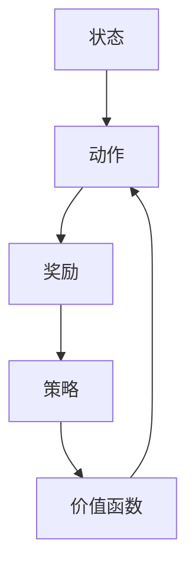

                 

### 第1章：强化学习概述

强化学习（Reinforcement Learning，RL）是机器学习的一个重要分支，旨在通过智能体（agent）与环境的互动，学习如何在复杂环境中做出最优决策，以实现长期累积奖励的最大化。本章将介绍强化学习的基本概念、与传统机器学习的关系以及主要应用场景。

#### 1.1 强化学习的基本概念

强化学习的基本概念包括状态（State）、动作（Action）、奖励（Reward）、策略（Policy）和价值函数（Value Function）。

- **状态（State）**：描述智能体在某个时刻所处的环境情况。
- **动作（Action）**：智能体可以采取的行为。
- **奖励（Reward）**：智能体执行某个动作后获得的即时反馈。
- **策略（Policy）**：智能体根据当前状态选择动作的规则。
- **价值函数（Value Function）**：评估状态或策略的好坏，通常包括状态价值函数（State Value Function）和状态-动作价值函数（State-Action Value Function）。

强化学习的目标是学习一个价值函数或策略，使得智能体能够在给定的环境中做出最优的动作选择，从而实现累积奖励的最大化。

#### 1.2 强化学习与传统机器学习的关系

强化学习与传统机器学习的区别主要体现在数据来源、目标和反馈机制上。

- **数据来源**：传统机器学习依赖于大量预先标记的数据集，而强化学习依赖于与环境的互动，通过反馈来学习。
- **目标**：传统机器学习的目标是学习一个预测模型，以最小化预测误差；强化学习的目标是学习一个策略，以最大化长期累积奖励。
- **反馈机制**：传统机器学习通过预测结果与实际结果之间的误差来优化模型；强化学习通过即时奖励来指导学习。

尽管存在这些区别，强化学习也可以与传统机器学习相结合，例如在强化学习过程中使用传统机器学习算法来处理数据预处理和特征提取。

#### 1.3 强化学习的应用场景

强化学习在多个领域都有广泛应用，以下是一些典型的应用场景：

- **游戏**：强化学习被广泛应用于电子游戏、棋类游戏等，智能体可以通过学习来提高游戏水平。
- **自动驾驶**：在自动驾驶系统中，强化学习用于路径规划、避障和交通信号控制等任务。
- **机器人协作**：强化学习可以用于多机器人系统中的协作任务，如搬运货物、清洁环境等。
- **资源分配**：在数据中心和云计算领域，强化学习用于动态资源分配，提高资源利用率。
- **推荐系统**：强化学习用于构建推荐系统，根据用户历史行为来预测用户兴趣。

这些应用场景中的共同特点是环境复杂且动态变化，强化学习通过不断与环境交互，能够适应并优化策略，实现长期累积奖励的最大化。

### 强化学习的基本概念

为了更好地理解强化学习，我们可以通过一个简单的 Mermaid 流程图来展示其基本概念和关系：



在这个流程图中，智能体（Agent）在状态（State）下采取动作（Action），获得奖励（Reward），然后根据策略（Policy）更新状态和价值函数（Value Function）。这个过程不断迭代，直到达到某个目标或满足停止条件。

通过这个简单的流程图，我们可以清晰地看到强化学习的基本概念和它们之间的相互关系。

---

### 第2章：强化学习核心概念

在本章中，我们将深入探讨强化学习中的核心概念，包括价值函数、策略、Q-学习、SARSA算法以及深度强化学习（DQN）。

#### 2.1 价值函数和策略

强化学习中的价值函数（Value Function）是评估状态或状态-动作对的好坏的关键工具。主要有两种价值函数：

- **状态价值函数**（$V^*(s)$）：表示在状态 $s$ 下，采用最优策略 $\pi^*$ 的累积奖励的期望值。
  
  $$
  V^*(s) = \mathbb{E}_{\pi^*}[G_t | S_0 = s]
  $$

- **状态-动作价值函数**（$Q^*(s, a)$）：表示在状态 $s$ 下，执行动作 $a$ 的累积奖励的期望值。

  $$
  Q^*(s, a) = \mathbb{E}_{\pi^*}[G_t | S_0 = s, A_0 = a]
  $$

策略（Policy）则是指导智能体如何选择动作的规则。策略可以分为：

- **确定性策略**（Deterministic Policy）：在给定状态 $s$ 下，总是选择相同的动作 $a^*$。
  
  $$
  \pi_D(s) = a^*
  $$

- **随机性策略**（Stochastic Policy）：在给定状态 $s$ 下，选择动作 $a$ 的概率分布。

  $$
  \pi_S(s) = P(A = a | S = s)
  $$

#### 2.2 Q-学习和SARSA算法

Q-学习（Q-Learning）和SARSA（State-Action-Reward-State-Action）算法是强化学习中的两个基本算法。

**Q-学习算法**：

Q-学习是一种基于值迭代的算法，它通过更新状态-动作价值函数来学习策略。

$$
Q(s, a) \leftarrow Q(s, a) + \alpha [r + \gamma \max_{a'} Q(s', a') - Q(s, a)]
$$

其中，$\alpha$ 是学习率，$\gamma$ 是折扣因子，$r$ 是即时奖励。

**Q-学习算法伪代码**：

```python
# 初始化Q表
Q = np.zeros((状态数, 动作数))

# 设置学习参数
alpha = 0.1
gamma = 0.9

# 强化学习迭代
for episode in range(总迭代次数):
    state = 环境初始状态
    while not done:
        # 选择动作
        action = 选择动作(Q表)
        
        # 执行动作
        state', reward = 环境执行动作(action)
        
        # 更新Q值
        Q[state, action] = Q[state, action] + alpha * (reward + gamma * max(Q[state', :]) - Q[state, action])
        
        # 更新状态
        state = state'
```

**SARSA算法**：

SARSA是一种基于策略迭代的算法，它通过更新当前状态-动作对的值来学习策略。

$$
Q(s, a) \leftarrow Q(s, a) + \alpha [r + \gamma Q(s', a')]
$$

**SARSA算法伪代码**：

```python
# 初始化Q表
Q = np.zeros((状态数, 动作数))

# 设置学习参数
alpha = 0.1
gamma = 0.9

# 强化学习迭代
for episode in range(总迭代次数):
    state = 环境初始状态
    while not done:
        # 选择动作
        action = 选择动作(Q表)
        
        # 执行动作
        state', reward = 环境执行动作(action)
        
        # 更新Q值
        Q[state, action] = Q[state, action] + alpha * (reward + gamma * Q[state', 选择动作(Q表')])
        
        # 更新状态
        state = state'
```

#### 2.3 DQN和深度强化学习

深度强化学习（Deep Reinforcement Learning，DRL）是强化学习和深度学习的结合，通过使用深度神经网络（Deep Neural Network，DNN）来近似价值函数或策略。

**DQN（Deep Q-Network）算法**：

DQN算法使用深度神经网络来近似Q值函数，并通过经验回放和目标网络来减少偏差和方差。

$$
Q(s, a) \leftarrow Q(s, a) + \alpha [r + \gamma \max_{a'} Q(s', a') - Q(s, a)]
$$

**DQN算法伪代码**：

```python
# 初始化DQN网络和目标网络
Q_network = 创建DNN网络()
target_network = 创建DNN网络()

# 设置学习参数
alpha = 0.1
gamma = 0.9
更新频率 = 每N次迭代更新一次目标网络

# 强化学习迭代
for episode in range(总迭代次数):
    state = 环境初始状态
    while not done:
        # 选择动作
        action = 选择动作(Q_network(state))
        
        # 执行动作
        state', reward = 环境执行动作(action)
        
        # 存储经验
        experience = (state, action, reward, state')
        
        # 更新经验回放池
        
        # 从经验回放池中随机抽取经验
        state', action', reward, state = 随机抽取经验(经验回放池)
        
        # 计算目标值
        target_value = reward + gamma * max(target_network(state')_output)
        
        # 更新DQN网络
        Q_network(state, action) = Q_network(state, action) + alpha * (target_value - Q_network(state, action))
        
        # 更新状态
        state = state'
        
        # 更新目标网络
        if iteration % 更新频率 == 0:
            target_network = 拷贝(Q_network)
```

通过这些算法和概念，我们可以更好地理解强化学习的工作原理，并为实际应用中的复杂问题提供解决方案。

---

### 第3章：强化学习在机器人协作中的挑战与解决方案

强化学习在机器人协作中面临着一系列独特的挑战，包括动态性、不确定性和复杂度。在本章中，我们将深入探讨这些挑战，并介绍相应的解决方案。

#### 3.1 机器人协作任务的特点

机器人协作任务通常具有以下特点：

- **动态性**：环境状态和任务目标可能随时变化，机器人需要具备快速响应和适应能力。
- **不确定性**：由于传感器误差、通信延迟和外部干扰，机器人协作中的不确定性较大。
- **复杂度**：多机器人协作任务往往涉及多个机器人之间的交互和协调，任务复杂度较高。

#### 3.2 强化学习在机器人协作中的应用

强化学习在机器人协作中的应用主要包括以下几个方面：

- **路径规划**：强化学习算法可以帮助机器人自主规划路径，避开障碍物，找到最优路径。
- **目标识别**：通过强化学习算法，机器人可以识别并跟踪特定目标，如搬运物品或执行特定任务。
- **协同决策**：强化学习算法可以用于多机器人之间的协同决策，使机器人能够共同完成任务。

#### 3.3 模型选择与优化策略

在机器人协作任务中，选择合适的强化学习模型和优化策略至关重要。以下是一些常见的模型和优化策略：

- **Q-学习**：适用于简单的机器人协作任务，通过更新Q值来优化策略。
- **SARSA**：适用于动态环境，通过更新当前状态-动作对的值来学习策略。
- **DQN**：适用于复杂状态空间和动作空间，通过使用深度神经网络来近似Q值函数。
- **PPO（Proximal Policy Optimization）**：适用于高维状态空间和动作空间，通过优化策略梯度来更新策略。

#### 3.4 模型选择与优化策略

在机器人协作任务中，选择合适的强化学习模型和优化策略至关重要。以下是一些常见的模型和优化策略：

- **Q-学习**：Q-学习是一种值迭代算法，通过更新Q值来优化策略。它适用于简单的机器人协作任务，可以用于路径规划和目标识别。

  $$
  Q(s, a) \leftarrow Q(s, a) + \alpha [r + \gamma \max_{a'} Q(s', a') - Q(s, a)]
  $$

- **SARSA**：SARSA是一种策略迭代算法，通过更新当前状态-动作对的值来学习策略。它适用于动态环境，可以用于实时调整机器人策略。

  $$
  Q(s, a) \leftarrow Q(s, a) + \alpha [r + \gamma Q(s', a')]
  $$

- **DQN**：DQN是一种基于深度神经网络的强化学习算法，通过使用深度神经网络来近似Q值函数。它适用于复杂状态空间和动作空间，可以用于路径规划和协作决策。

  $$
  Q(s, a) \leftarrow Q(s, a) + \alpha [r + \gamma \max_{a'} Q(s', a') - Q(s, a)]
  $$

- **PPO（Proximal Policy Optimization）**：PPO是一种基于策略的优化算法，通过优化策略梯度来更新策略。它适用于高维状态空间和动作空间，可以用于复杂的机器人协作任务。

  $$
  \log \pi_{\theta} (a|s) \leftarrow \log \pi_{\theta'} (a|s) + \alpha [r + \gamma V(s') - \log \pi_{\theta'} (a'|s')]
  $$

#### 3.5 案例分析

**案例1**：多机器人协作搬运货物

- **问题描述**：在仓库中，多机器人需要协同搬运货物，从起点移动到终点，同时避开障碍物。
- **解决方案**：使用DQN算法进行路径规划和协同决策。每个机器人根据自身感知信息和DQN算法的输出，选择最优动作，实现高效搬运。

**案例2**：多机器人清洁任务

- **问题描述**：在室内环境中，多机器人需要协同完成清洁任务，覆盖整个区域，同时避免碰撞和重复清洁。
- **解决方案**：使用SARSA算法进行路径规划和协同决策。每个机器人根据当前状态和SARSA算法的输出，选择最优动作，实现高效清洁。

这些案例展示了强化学习在机器人协作任务中的应用，通过合理选择模型和优化策略，机器人可以高效、安全地完成复杂任务。

---

### 第4章：单人机器人协作任务

单人机器人协作任务通常是指单个机器人在一个环境中执行特定的任务，如搬运物品、清洁地面等。本章将详细介绍强化学习在单人机器人协作任务中的应用，包括任务定义、强化学习算法的应用以及实际案例。

#### 4.1 单人机器人的任务定义

单人机器人协作任务的目标通常包括以下方面：

- **任务目标**：机器人需要完成特定任务，如搬运物品到指定位置、清洁特定区域等。
- **任务环境**：机器人执行任务的环境，包括空间布局、障碍物、资源分布等。
- **任务约束**：机器人执行任务时的限制条件，如速度限制、负载限制、通信限制等。

单人机器人协作任务的特点是环境相对简单，机器人需要通过自身传感器和执行器与环境进行交互，通过强化学习算法来学习最优策略，完成任务。

#### 4.2 强化学习在单人机器人任务中的应用

强化学习在单人机器人任务中的应用主要体现在以下几个方面：

- **路径规划**：通过强化学习算法，机器人可以自主规划路径，避开障碍物，找到从起点到终点的最优路径。
- **目标识别**：通过强化学习算法，机器人可以识别并跟踪特定的目标，如搬运的物品或清洁的区域。
- **动作决策**：在执行任务过程中，机器人需要根据当前状态和目标，通过强化学习算法选择最优动作，以实现任务目标。

以下是一个基于Q-学习的单人机器人路径规划案例：

```python
# 初始化Q表
Q = np.zeros((状态数, 动作数))

# 设置学习参数
alpha = 0.1  # 学习率
gamma = 0.9  # 折扣因子
epsilon = 0.1  # 探索率

# 强化学习迭代
for episode in range(总迭代次数):
    state = 环境初始状态
    while not done:
        # 探索-利用策略
        if random.random() < epsilon:
            action = 随机选择动作
        else:
            action = 选择最优动作 (argmax Q(state, action))
        
        # 执行动作
        state', reward = 环境执行动作(action)
        
        # 更新Q值
        Q[state, action] = Q[state, action] + alpha * (reward + gamma * max(Q[state', :]) - Q[state, action])
        
        # 更新状态
        state = state'

# 返回训练好的Q表
return Q
```

#### 4.3 单人机器人协作任务的实际案例

**案例1**：自主搬运物品的机器人

- **问题描述**：机器人需要在复杂的室内环境中搬运物品，避开障碍物，将物品放置到指定的位置。
- **解决方案**：使用Q-学习算法进行路径规划和动作决策。机器人通过与环境交互，不断更新Q表，找到从起始位置到目标位置的最优路径。

**案例2**：清洁地面服务的机器人

- **问题描述**：机器人需要在室内环境中清洁地面，识别并避开障碍物。
- **解决方案**：使用SARSA算法进行路径规划和动作决策。机器人通过与环境交互，不断更新当前状态-动作对的值，找到从当前位置到目标位置的最优路径。

这些案例展示了强化学习在单人机器人协作任务中的应用，通过合理设计算法和策略，机器人可以自主地完成任务，提高效率。

---

### 第5章：多机器人协作任务

多机器人协作任务是指多个机器人通过协同工作，共同完成一个复杂任务的过程。这种任务通常需要机器人之间进行有效的通信和协调，以实现整体的最优性能。在本章中，我们将探讨强化学习在多机器人协作任务中的应用，包括协作任务的定义、强化学习算法的运用以及实际案例。

#### 5.1 多机器人协作任务的基本概念

多机器人协作任务的基本概念包括以下几个方面：

- **协作目标**：多个机器人共同完成一个任务，如搬运货物、搜救、清洁等。
- **协作策略**：机器人之间的协作方式和规则，包括路径规划、任务分配和协同决策等。
- **通信机制**：机器人之间交换信息和状态，以实现有效的协作。
- **任务分配**：根据机器人的能力和环境条件，合理分配任务，确保每个机器人都能有效参与。

多机器人协作任务的特点是复杂性和动态性，需要机器人能够实时响应环境变化，进行自适应调整。

#### 5.2 强化学习在多机器人协作中的应用

强化学习在多机器人协作中的应用主要体现在以下几个方面：

- **路径规划**：强化学习算法可以帮助机器人自主规划路径，避开障碍物，找到最优路径。
- **任务分配**：强化学习算法可以根据机器人的状态和能力，动态地分配任务，提高整体效率。
- **协同决策**：强化学习算法可以帮助机器人通过协同决策，共同制定最优策略，以实现整体目标的最优化。
- **通信优化**：强化学习算法可以优化机器人之间的通信机制，减少通信延迟和错误，提高协作效率。

以下是一个基于DQN算法的多机器人协同决策案例：

```python
# 初始化DQN网络
Q_network = 创建DQN网络()

# 设置学习参数
alpha = 0.1  # 学习率
gamma = 0.9  # 折扣因子
更新频率 = 每N次迭代更新一次目标网络

# 强化学习迭代
for episode in range(总迭代次数):
    state = 环境初始状态
    while not done:
        # 选择动作
        action = 选择动作(Q_network(state))
        
        # 执行动作
        state', reward = 环境执行动作(action)
        
        # 存储经验
        experience = (state, action, reward, state')
        
        # 更新经验回放池
        
        # 从经验回放池中随机抽取经验
        state', action', reward, state = 随机抽取经验(经验回放池)
        
        # 计算目标值
        target_value = reward + gamma * max(Q_network(state')_output)
        
        # 更新DQN网络
        Q_network(state, action) = Q_network(state, action) + alpha * (target_value - Q_network(state, action))
        
        # 更新状态
        state = state'
        
        # 更新目标网络
        if iteration % 更新频率 == 0:
            target_network = 拷贝(Q_network)
```

#### 5.3 多机器人协作任务的实际案例

**案例1**：多机器人协同搬运货物

- **问题描述**：多机器人在仓库中协同搬运货物，需要将货物从起点搬运到终点，同时避开障碍物。
- **解决方案**：使用DQN算法进行路径规划和协同决策。每个机器人根据自身的感知信息和DQN算法的输出，选择最优动作，实现高效搬运。

**案例2**：多机器人清洁任务

- **问题描述**：多机器人在室内环境中协同完成清洁任务，需要覆盖整个区域，同时避免碰撞和重复清洁。
- **解决方案**：使用SARSA算法进行路径规划和协同决策。每个机器人根据当前状态和SARSA算法的输出，选择最优动作，实现高效清洁。

这些案例展示了强化学习在多机器人协作任务中的应用，通过合理设计算法和策略，机器人可以高效、安全地完成任务。

---

### 第6章：分布式强化学习

分布式强化学习是一种在多个计算节点上同时进行强化学习的过程，通过分布式计算和协同通信来提高学习效率和处理大规模复杂问题。在本章中，我们将探讨分布式强化学习的基本原理、算法以及在实际应用中的挑战和解决方案。

#### 6.1 分布式强化学习的基本原理

分布式强化学习的基本原理包括以下几个方面：

- **多智能体系统**：分布式强化学习涉及多个智能体（agent），每个智能体都拥有自己的感知、决策和执行能力。
- **协同通信**：智能体之间通过通信网络交换信息，共享状态和策略，以实现协同决策和策略更新。
- **分布式算法**：智能体使用分布式算法更新自己的策略和价值函数，并通过同步机制保持一致性。
- **中心服务器**：中心服务器用于协调分布式算法的运行，处理全局信息和模型更新。

分布式强化学习通过将计算任务分布在多个节点上，可以显著提高学习效率，减少通信延迟，并处理大规模的复杂问题。

#### 6.2 分布式强化学习算法

分布式强化学习算法有多种类型，以下是几种常见的分布式算法：

- **分布式Q-学习**：多个智能体共享价值函数，通过分布式计算更新Q值。
- **分布式SARSA**：多个智能体通过协同通信，共同更新策略和价值函数。
- **分布式DQN**：多个智能体使用深度神经网络，共享经验回放池，协同更新网络权重。
- **异步优势演员-评论家算法**（A3C）：多个智能体异步更新策略和价值函数，通过梯度聚合实现同步。

以下是一个基于分布式Q-学习算法的分布式路径规划案例：

```python
# 分布式Q-学习算法

# 初始化Q表
Q_local = np.zeros((状态数, 动作数))

# 设置学习参数
alpha = 0.1  # 学习率
gamma = 0.9  # 折扣因子
epsilon = 0.1  # 探索率

# 分布式强化学习迭代
for episode in range(总迭代次数):
    state = 环境初始状态
    while not done:
        # 探索-利用策略
        if random.random() < epsilon:
            action = 随机选择动作
        else:
            action = 选择最优动作 (argmax Q_local(state, action))
        
        # 执行动作
        state', reward = 环境执行动作(action)
        
        # 更新局部Q值
        Q_local[state, action] = Q_local[state, action] + alpha * (reward + gamma * max(Q_local[state', :]) - Q_local[state, action])
        
        # 同步全局Q值
        Q_global = 平均多个节点的Q值
        
        # 更新状态
        state = state'

# 返回训练好的Q表
return Q_global
```

#### 6.3 分布式强化学习在机器人协作中的应用

分布式强化学习在机器人协作中的应用包括以下几个方面：

- **分布式路径规划**：多个机器人通过分布式强化学习算法，共同规划路径，避免碰撞和障碍物。
- **分布式任务分配**：多个机器人通过分布式强化学习算法，协同分配任务，提高整体效率。
- **分布式决策**：多个机器人通过分布式强化学习算法，共同制定最优策略，实现协同决策。

以下是一个基于分布式SARSA算法的分布式决策案例：

```python
# 分布式SARSA算法

# 初始化Q表
Q_local = np.zeros((状态数, 动作数))

# 设置学习参数
alpha = 0.1  # 学习率
gamma = 0.9  # 折扣因子
epsilon = 0.1  # 探索率

# 分布式强化学习迭代
for episode in range(总迭代次数):
    state = 环境初始状态
    while not done:
        # 探索-利用策略
        if random.random() < epsilon:
            action = 随机选择动作
        else:
            action = 选择最优动作 (argmax Q_local(state, action))
        
        # 执行动作
        state', reward = 环境执行动作(action)
        
        # 更新局部Q值
        Q_local[state, action] = Q_local[state, action] + alpha * (reward + gamma * Q_local[state', 选择动作(Q_local)])
        
        # 同步全局Q值
        Q_global = 平均多个节点的Q值
        
        # 更新状态
        state = state'

# 返回训练好的Q表
return Q_global
```

这些案例展示了分布式强化学习在机器人协作中的应用，通过分布式计算和协同通信，多个机器人可以高效、安全地完成复杂任务。

---

### 第7章：强化学习在机器人协作中的未来趋势

强化学习在机器人协作中的未来发展潜力巨大，随着技术的不断进步，强化学习将在多个领域带来深刻的变革。

#### 7.1 人工智能与机器人协作的深度融合

随着人工智能技术的不断进步，机器人的智能水平将得到显著提升。未来，人工智能与机器人协作将更加紧密地融合，实现以下趋势：

- **自主决策**：机器人将具备更高的自主决策能力，通过深度学习和强化学习，机器人能够在复杂环境中自主做出最优决策。
- **智能感知**：通过计算机视觉、语音识别等多模态感知技术，机器人将能够更准确地感知和理解环境，提高决策精度。
- **自适应学习**：机器人将能够通过在线学习和自适应调整，快速适应新环境和任务变化，提高协作效率。

#### 7.2 强化学习在机器人协作中的应用前景

强化学习在机器人协作中的应用前景广阔，以下是一些关键领域：

- **智能制造**：在制造业中，强化学习可以帮助机器人实现自动化生产线的优化，提高生产效率和质量。
- **物流运输**：在物流领域，强化学习可以帮助机器人实现智能配送，提高物流效率，降低成本。
- **医疗健康**：在医疗健康领域，强化学习可以帮助机器人实现智能手术辅助、医疗诊断等任务。
- **家庭服务**：在家居环境中，强化学习可以帮助机器人实现智能清洁、护理等服务，提高生活质量。

#### 7.3 未来技术挑战与解决思路

虽然强化学习在机器人协作中具有巨大潜力，但仍面临一些技术挑战：

- **计算资源**：强化学习算法通常需要大量计算资源，如何优化算法以减少计算需求是一个重要问题。
- **通信延迟**：在分布式环境中，通信延迟会影响算法的性能，需要优化通信协议和算法结构。
- **安全性**：机器人协作中的安全性问题，如避免意外伤害和设备损坏，需要进一步研究和解决。

解决这些挑战的方法包括：

- **分布式计算**：通过分布式计算技术，提高算法的并行性和效率，减少计算资源需求。
- **通信优化**：通过优化通信协议和算法结构，减少通信延迟，提高算法的实时性。
- **安全防护**：通过引入安全防护机制，确保机器人协作的安全性和可靠性。

总之，强化学习在机器人协作中的应用前景广阔，未来将在人工智能和机器人技术领域发挥重要作用，推动机器人协作向更加智能、高效和安全的方向发展。

---

### 附录

#### 附录A：常用强化学习算法与框架介绍

- **Q-学习**：Q-学习是一种基于值迭代的强化学习算法，通过更新Q值来优化策略。
- **SARSA**：SARSA是一种基于策略迭代的强化学习算法，通过更新当前状态-动作对的值来学习策略。
- **DQN**：DQN是一种基于深度神经网络的强化学习算法，通过使用深度神经网络来近似Q值函数。
- **深度强化学习框架**：常见的深度强化学习框架包括TensorFlow和PyTorch，它们提供了丰富的工具和库，方便开发者实现和优化强化学习算法。

#### 附录B：机器人协作任务数据集与工具

- **机器人协作任务数据集**：常用的机器人协作任务数据集包括Mujoco、Robotics Simulator等，这些数据集提供了丰富的模拟环境和任务，用于算法验证和性能评估。
- **强化学习工具框架**：常用的强化学习工具框架包括OpenAI Gym、PyTorch Robotics等，它们提供了方便的接口和工具，帮助开发者快速实现和测试强化学习算法。

#### 附录C：强化学习在机器人协作任务中的应用案例解析

- **案例1**：多机器人协同搬运货物。使用DQN算法进行路径规划和协作决策，使机器人能够高效地搬运货物。
- **案例2**：多机器人协同完成清洁任务。使用SARSA算法进行路径规划和协作决策，使机器人能够高效地完成清洁任务。
- **案例3**：多人机器人协作搜救任务。使用分布式强化学习算法，实现多机器人之间的协同搜救，提高搜救效率。

这些案例展示了强化学习在机器人协作任务中的应用，通过合理设计算法和策略，机器人可以高效、安全地完成任务。

---

### 文章标题：强化学习在机器人协作任务中的应用

关键词：强化学习，机器人协作，路径规划，任务分配，分布式强化学习

摘要：本文深入探讨了强化学习在机器人协作任务中的应用，包括基本概念、核心算法、挑战与解决方案，以及实际案例。通过详细的解释和代码示例，展示了如何使用强化学习算法解决复杂的多机器人协作问题，推动机器人技术的进步。

### 引言

在人工智能和机器人技术的快速发展下，机器人协作任务已经成为现代工业、物流、医疗和家庭服务等领域的重要应用。机器人协作任务通常涉及多个机器人共同完成一个复杂任务，如搬运货物、清洁环境、搜救等。这种任务要求机器人具备自主决策、路径规划和协同能力，以提高效率和准确性。而强化学习作为一种强大的机器学习技术，通过智能体与环境交互，逐步学习最优策略，为机器人协作提供了有效的解决方案。

本文旨在全面探讨强化学习在机器人协作任务中的应用。首先，我们将介绍强化学习的基本概念、核心算法，如Q-学习、SARSA和DQN等。接着，分析强化学习在机器人协作中的挑战，如动态性、不确定性和复杂度，并探讨相应的解决方案。最后，通过实际案例展示强化学习在机器人协作任务中的成功应用，为未来的研究和应用提供参考。

### 强化学习基础

#### 1.1 强化学习的基本概念

强化学习（Reinforcement Learning，RL）是一种机器学习范式，旨在通过智能体（agent）与环境的交互，学习如何做出最优决策。强化学习的关键概念包括状态（State）、动作（Action）、奖励（Reward）、策略（Policy）和价值函数（Value Function）。

- **状态（State）**：描述智能体在某个时刻所处的环境情况。
- **动作（Action）**：智能体可以采取的行为。
- **奖励（Reward）**：智能体执行某个动作后获得的即时反馈。
- **策略（Policy）**：智能体根据当前状态选择动作的规则。
- **价值函数（Value Function）**：评估状态或策略的好坏，通常包括状态价值函数（State Value Function）和状态-动作价值函数（State-Action Value Function）。

强化学习的目标是通过不断与环境交互，学习一个价值函数或策略，使得智能体能够在给定的环境中做出最优的动作选择，从而实现累积奖励的最大化。

#### 1.2 强化学习与传统机器学习的关系

传统机器学习主要包括监督学习和无监督学习。监督学习依赖于大量预先标记的数据，通过学习输入和输出之间的关系来构建预测模型。无监督学习则不需要外部监督信号，通过自身发现数据中的结构或模式。

强化学习与传统机器学习有以下区别：

- **数据来源**：强化学习依赖于与环境的交互获取数据，而传统机器学习依赖于预先标记的数据集。
- **目标**：强化学习的目标是学习策略或价值函数，以实现长期累积奖励的最大化；传统机器学习的目标是学习一个预测模型，以最小化预测误差。
- **反馈机制**：强化学习依赖于即时奖励来指导学习，而传统机器学习通过预测结果与实际结果之间的误差来优化模型。

尽管存在这些区别，强化学习也可以与传统机器学习相结合，例如在强化学习过程中使用传统机器学习算法来处理数据预处理和特征提取。

#### 1.3 强化学习的应用场景

强化学习在多个领域都有广泛应用，以下是一些典型的应用场景：

- **游戏**：强化学习被广泛应用于电子游戏、棋类游戏等，智能体可以通过学习来提高游戏水平。
- **自动驾驶**：在自动驾驶系统中，强化学习用于路径规划、避障和交通信号控制等任务。
- **机器人协作**：强化学习可以用于多机器人系统中的协作任务，如搬运货物、清洁环境等。
- **资源分配**：在数据中心和云计算领域，强化学习用于动态资源分配，提高资源利用率。
- **推荐系统**：强化学习用于构建推荐系统，根据用户历史行为来预测用户兴趣。

这些应用场景中的共同特点是环境复杂且动态变化，强化学习通过不断与环境交互，能够适应并优化策略，实现长期累积奖励的最大化。

### 强化学习核心概念

#### 2.1 价值函数和策略

强化学习中的价值函数（Value Function）是评估状态或状态-动作对的好坏的关键工具。主要有两种价值函数：

- **状态价值函数**（$V^*(s)$）：表示在状态 $s$ 下，采用最优策略 $\pi^*$ 的累积奖励的期望值。
  
  $$
  V^*(s) = \mathbb{E}_{\pi^*}[G_t | S_0 = s]
  $$

- **状态-动作价值函数**（$Q^*(s, a)$）：表示在状态 $s$ 下，执行动作 $a$ 的累积奖励的期望值。

  $$
  Q^*(s, a) = \mathbb{E}_{\pi^*}[G_t | S_0 = s, A_0 = a]
  $$

策略（Policy）则是指导智能体如何选择动作的规则。策略可以分为：

- **确定性策略**（Deterministic Policy）：在给定状态 $s$ 下，总是选择相同的动作 $a^*$。
  
  $$
  \pi_D(s) = a^*
  $$

- **随机性策略**（Stochastic Policy）：在给定状态 $s$ 下，选择动作 $a$ 的概率分布。

  $$
  \pi_S(s) = P(A = a | S = s)
  $$

#### 2.2 Q-学习和SARSA算法

Q-学习（Q-Learning）和SARSA（State-Action-Reward-State-Action）算法是强化学习中的两个基本算法。

**Q-学习算法**：

Q-学习是一种基于值迭代的算法，它通过更新Q值来优化策略。

$$
Q(s, a) \leftarrow Q(s, a) + \alpha [r + \gamma \max_{a'} Q(s', a') - Q(s, a)]
$$

其中，$\alpha$ 是学习率，$\gamma$ 是折扣因子，$r$ 是即时奖励。

**Q-学习算法伪代码**：

```python
# 初始化Q表
Q = np.zeros((状态数, 动作数))

# 设置学习参数
alpha = 0.1
gamma = 0.9

# 强化学习迭代
for episode in range(总迭代次数):
    state = 环境初始状态
    while not done:
        # 选择动作
        action = 选择动作(Q表)
        
        # 执行动作
        state', reward = 环境执行动作(action)
        
        # 更新Q值
        Q[state, action] = Q[state, action] + alpha * (reward + gamma * max(Q[state', :]) - Q[state, action])
        
        # 更新状态
        state = state'
```

**SARSA算法**：

SARSA是一种基于策略迭代的算法，它通过更新当前状态-动作对的值来学习策略。

$$
Q(s, a) \leftarrow Q(s, a) + \alpha [r + \gamma Q(s', a')]
$$

**SARSA算法伪代码**：

```python
# 初始化Q表
Q = np.zeros((状态数, 动作数))

# 设置学习参数
alpha = 0.1
gamma = 0.9

# 强化学习迭代
for episode in range(总迭代次数):
    state = 环境初始状态
    while not done:
        # 选择动作
        action = 选择动作(Q表)
        
        # 执行动作
        state', reward = 环境执行动作(action)
        
        # 更新Q值
        Q[state, action] = Q[state, action] + alpha * (reward + gamma * Q[state', 选择动作(Q表')])
        
        # 更新状态
        state = state'
```

#### 2.3 DQN和深度强化学习

深度强化学习（Deep Reinforcement Learning，DRL）是强化学习和深度学习的结合，通过使用深度神经网络（Deep Neural Network，DNN）来近似价值函数或策略。

**DQN（Deep Q-Network）算法**：

DQN算法使用深度神经网络来近似Q值函数，并通过经验回放和目标网络来减少偏差和方差。

$$
Q(s, a) \leftarrow Q(s, a) + \alpha [r + \gamma \max_{a'} Q(s', a') - Q(s, a)]
$$

**DQN算法伪代码**：

```python
# 初始化DQN网络和目标网络
Q_network = 创建DNN网络()
target_network = 创建DNN网络()

# 设置学习参数
alpha = 0.1
gamma = 0.9
更新频率 = 每N次迭代更新一次目标网络

# 强化学习迭代
for episode in range(总迭代次数):
    state = 环境初始状态
    while not done:
        # 选择动作
        action = 选择动作(Q_network(state))
        
        # 执行动作
        state', reward = 环境执行动作(action)
        
        # 存储经验
        experience = (state, action, reward, state')
        
        # 更新经验回放池
        
        # 从经验回放池中随机抽取经验
        state', action', reward, state = 随机抽取经验(经验回放池)
        
        # 计算目标值
        target_value = reward + gamma * max(target_network(state')_output)
        
        # 更新DQN网络
        Q_network(state, action) = Q_network(state, action) + alpha * (target_value - Q_network(state, action))
        
        # 更新状态
        state = state'
        
        # 更新目标网络
        if iteration % 更新频率 == 0:
            target_network = 拷贝(Q_network)
```

通过这些算法和概念，我们可以更好地理解强化学习的工作原理，并为实际应用中的复杂问题提供解决方案。

### 强化学习在机器人协作中的挑战与解决方案

强化学习在机器人协作中面临着一系列独特的挑战，包括动态性、不确定性和复杂度。在本章中，我们将深入探讨这些挑战，并介绍相应的解决方案。

#### 3.1 机器人协作任务的特点

机器人协作任务通常具有以下特点：

- **动态性**：环境状态和任务目标可能随时变化，机器人需要具备快速响应和适应能力。
- **不确定性**：由于传感器误差、通信延迟和外部干扰，机器人协作中的不确定性较大。
- **复杂度**：多机器人协作任务往往涉及多个机器人之间的交互和协调，任务复杂度较高。

#### 3.2 强化学习在机器人协作中的应用

强化学习在机器人协作中的应用主要包括以下几个方面：

- **路径规划**：强化学习算法可以帮助机器人自主规划路径，避开障碍物，找到最优路径。
- **目标识别**：通过强化学习算法，机器人可以识别并跟踪特定目标，如搬运物品或执行特定任务。
- **协同决策**：强化学习算法可以用于多机器人之间的协同决策，使机器人能够共同完成任务。

#### 3.3 模型选择与优化策略

在机器人协作任务中，选择合适的强化学习模型和优化策略至关重要。以下是一些常见的模型和优化策略：

- **Q-学习**：适用于简单的机器人协作任务，通过更新Q值来优化策略。
- **SARSA**：适用于动态环境，通过更新当前状态-动作对的值来学习策略。
- **DQN**：适用于复杂状态空间和动作空间，通过使用深度神经网络来近似Q值函数。
- **PPO（Proximal Policy Optimization）**：适用于高维状态空间和动作空间，通过优化策略梯度来更新策略。

#### 3.4 模型选择与优化策略

在机器人协作任务中，选择合适的强化学习模型和优化策略至关重要。以下是一些常见的模型和优化策略：

- **Q-学习**：Q-学习是一种基于值迭代的算法，通过更新Q值来优化策略。它适用于简单的机器人协作任务，可以用于路径规划和目标识别。

  $$
  Q(s, a) \leftarrow Q(s, a) + \alpha [r + \gamma \max_{a'} Q(s', a') - Q(s, a)]
  $$

- **SARSA**：SARSA是一种基于策略迭代的算法，通过更新当前状态-动作对的值来学习策略。它适用于动态环境，可以用于实时调整机器人策略。

  $$
  Q(s, a) \leftarrow Q(s, a) + \alpha [r + \gamma Q(s', a')]
  $$

- **DQN**：DQN是一种基于深度神经网络的强化学习算法，通过使用深度神经网络来近似Q值函数。它适用于复杂状态空间和动作空间，可以用于路径规划和协作决策。

  $$
  Q(s, a) \leftarrow Q(s, a) + \alpha [r + \gamma \max_{a'} Q(s', a') - Q(s, a)]
  $$

- **PPO（Proximal Policy Optimization）**：PPO是一种基于策略的优化算法，通过优化策略梯度来更新策略。它适用于高维状态空间和动作空间，可以用于复杂的机器人协作任务。

  $$
  \log \pi_{\theta} (a|s) \leftarrow \log \pi_{\theta'} (a|s) + \alpha [r + \gamma V(s') - \log \pi_{\theta'} (a'|s')]
  $$

#### 3.5 案例分析

**案例1**：多机器人协作搬运货物

- **问题描述**：在仓库中，多机器人需要协同搬运货物，从起点移动到终点，同时避开障碍物。
- **解决方案**：使用DQN算法进行路径规划和协同决策。每个机器人根据自身感知信息和DQN算法的输出，选择最优动作，实现高效搬运。

**案例2**：多机器人清洁任务

- **问题描述**：在室内环境中，多机器人需要协同完成清洁任务，覆盖整个区域，同时避免碰撞和重复清洁。
- **解决方案**：使用SARSA算法进行路径规划和协同决策。每个机器人根据当前状态和SARSA算法的输出，选择最优动作，实现高效清洁。

这些案例展示了强化学习在机器人协作任务中的应用，通过合理选择模型和优化策略，机器人可以高效、安全地完成复杂任务。

### 单人机器人协作任务

单人机器人协作任务是指单个机器人在一个环境中执行特定任务的过程。这种任务通常需要机器人具备路径规划、目标识别和动作决策能力。在本章中，我们将探讨强化学习在单人机器人协作任务中的应用，包括任务定义、强化学习算法的应用以及实际案例。

#### 4.1 单人机器人协作任务的定义

单人机器人协作任务的目标通常包括以下方面：

- **任务目标**：机器人需要完成特定任务，如搬运物品到指定位置、清洁特定区域等。
- **任务环境**：机器人执行任务的环境，包括空间布局、障碍物、资源分布等。
- **任务约束**：机器人执行任务时的限制条件，如速度限制、负载限制、通信限制等。

单人机器人协作任务的特点是环境相对简单，机器人需要通过自身传感器和执行器与环境进行交互，通过强化学习算法来学习最优策略，完成任务。

#### 4.2 强化学习在单人机器人协作任务中的应用

强化学习在单人机器人协作任务中的应用主要体现在以下几个方面：

- **路径规划**：通过强化学习算法，机器人可以自主规划路径，避开障碍物，找到从起点到终点的最优路径。
- **目标识别**：通过强化学习算法，机器人可以识别并跟踪特定的目标，如搬运的物品或清洁的区域。
- **动作决策**：在执行任务过程中，机器人需要根据当前状态和目标，通过强化学习算法选择最优动作，以实现任务目标。

以下是一个基于Q-学习的单人机器人路径规划案例：

```python
# 初始化Q表
Q = np.zeros((状态数, 动作数))

# 设置学习参数
alpha = 0.1  # 学习率
gamma = 0.9  # 折扣因子
epsilon = 0.1  # 探索率

# 强化学习迭代
for episode in range(总迭代次数):
    state = 环境初始状态
    while not done:
        # 探索-利用策略
        if random.random() < epsilon:
            action = 随机选择动作
        else:
            action = 选择最优动作 (argmax Q(state, action))
        
        # 执行动作
        state', reward = 环境执行动作(action)
        
        # 更新Q值
        Q[state, action] = Q[state, action] + alpha * (reward + gamma * max(Q[state', :]) - Q[state, action])
        
        # 更新状态
        state = state'

# 返回训练好的Q表
return Q
```

#### 4.3 单人机器人协作任务的实际案例

**案例1**：自主搬运物品的机器人

- **问题描述**：机器人需要在复杂的室内环境中搬运物品，避开障碍物，将物品放置到指定的位置。
- **解决方案**：使用Q-学习算法进行路径规划和动作决策。机器人通过与环境交互，不断更新Q表，找到从起始位置到目标位置的最优路径。

**案例2**：清洁地面服务的机器人

- **问题描述**：机器人需要在室内环境中清洁地面，识别并避开障碍物。
- **解决方案**：使用SARSA算法进行路径规划和动作决策。机器人通过与环境交互，不断更新当前状态-动作对的值，找到从当前位置到目标位置的最优路径。

这些案例展示了强化学习在单人机器人协作任务中的应用，通过合理设计算法和策略，机器人可以自主地完成任务，提高效率。

### 多

