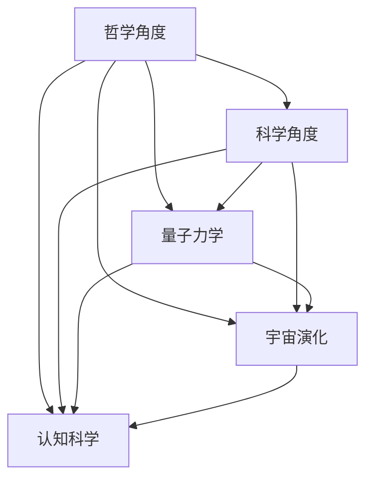
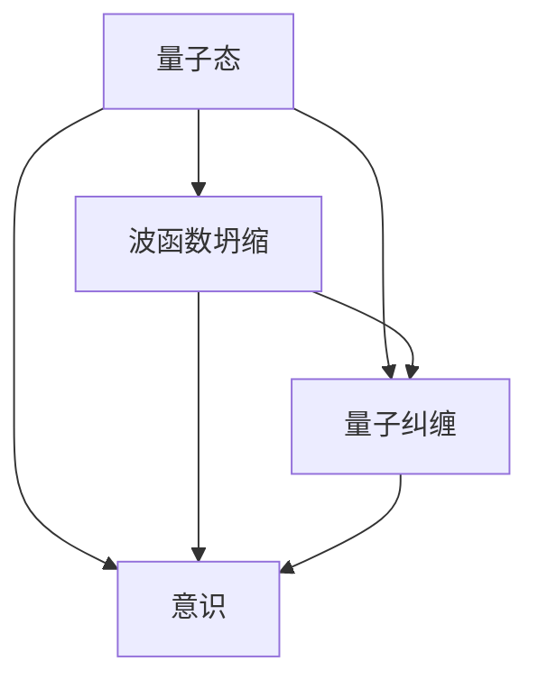
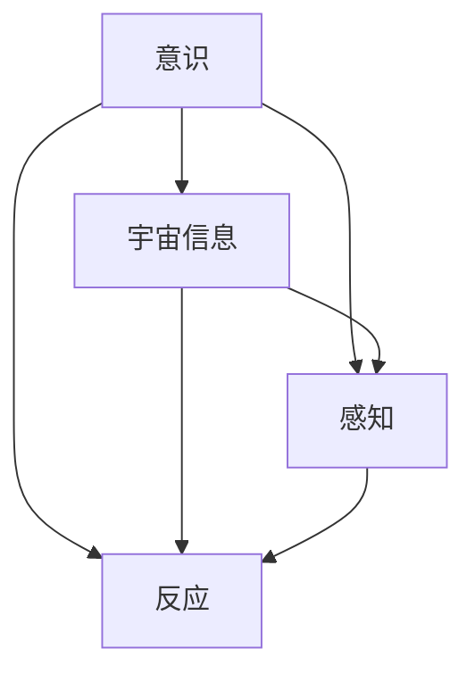
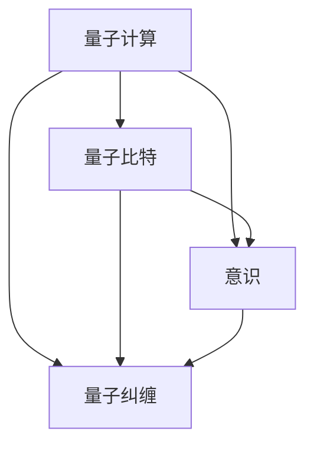
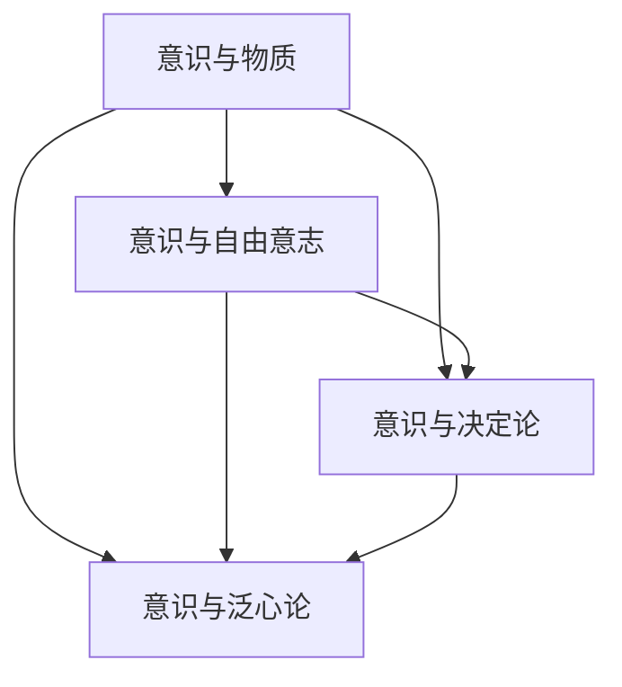
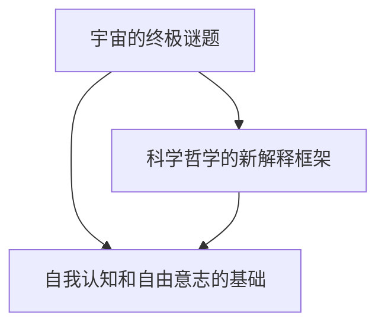

                 

# 《意识作为宇宙的自我观察机制》

## 关键词
量子力学、意识、宇宙、自我观察、量子计算、科学哲学

## 摘要
本文深入探讨了意识作为宇宙的自我观察机制这一前沿科学议题。文章首先介绍了意识作为宇宙自我观察机制的定义及其重要性，然后通过量子力学、意识与宇宙的相互作用、量子计算等方面的讲解，阐述了意识作为宇宙自我观察机制的哲学意义和科学依据。接着，文章详细讲解了量子力学的基础、意识与量子纠缠的关系、意识与量子计算的关系，并引入了意识的数学模型。此外，本文还通过实际项目案例，展示了基于量子计算和宇宙相互作用的意识模拟实验、企业应用案例，进一步证明了意识作为宇宙自我观察机制的实际应用价值。最后，文章总结了本文的主要观点，并提出了未来研究的方向。

## 第一部分：核心概念与联系

### 1.1 意识作为宇宙的自我观察机制

意识作为宇宙的自我观察机制，是哲学和科学领域长期探讨的课题。从哲学角度出发，意识被认为是宇宙的终极谜题之一，它涉及存在、本质、自我、自由意志等诸多问题。从科学角度出发，意识与量子力学、宇宙演化、认知科学等众多领域密切相关。

意识作为宇宙的自我观察机制，意味着宇宙通过意识来进行自我观察和自我认识。这一观点源于哲学家如笛卡尔、康德等人的思考，他们在不同程度上都认为意识是宇宙的终极解释。同时，量子力学的发展也为这一观点提供了科学依据。量子纠缠、波函数坍缩等现象表明，宇宙的微观层面具有某种程度的意识特征，这为意识作为宇宙的自我观察机制提供了新的视角。

下面是一个简单的 Mermaid 流程图，展示了意识作为宇宙的自我观察机制的架构：

### 1.2 量子力学与意识

量子力学是研究物质世界最基本层面的物理学分支。它揭示了微观世界的规律，如量子态、波函数坍缩、量子纠缠等。量子力学与意识之间的关系一直是科学哲学领域争论的焦点。

从量子力学的角度来看，意识可能是宇宙中的一种基本属性。量子纠缠现象表明，微观粒子之间存在着一种超距作用，这种作用可能涉及到意识。此外，波函数坍缩现象也暗示了意识在量子世界中的重要作用。

下面是关于量子力学与意识的 Mermaid 流程图：

### 1.3 意识与宇宙的相互作用

意识与宇宙的相互作用是一个复杂而深奥的议题。从认知科学的角度来看，意识是大脑对信息的处理和解释。而宇宙则提供了这些信息的来源，包括光、声音、触觉、嗅觉等。

意识与宇宙的相互作用，可以理解为意识对宇宙信息的感知和反应。这种相互作用不仅影响我们的行为和决策，也影响着宇宙的演化。例如，人类对宇宙的认知和探索，直接推动了科技的发展，从而改变了宇宙的面貌。

以下是意识与宇宙相互作用的 Mermaid 流程图：

### 1.4 量子计算与意识

量子计算是利用量子力学原理进行信息处理的新型计算模式。与经典计算相比，量子计算具有并行处理、量子纠缠等独特优势。量子计算与意识之间的关系，一直是科学研究的热点。

从量子计算的角度来看，意识可能是量子态的一种表现形式。量子计算中的量子比特（qubit）与意识中的神经元，可能存在着某种相似性。此外，量子计算中的量子算法，如量子纠缠、量子纠缠门等，也可能与意识的形成有关。

以下是量子计算与意识的 Mermaid 流程图：

### 1.5 意识在科学哲学中的地位

科学哲学是研究科学本质、方法、哲学基础等问题的学科。意识作为科学哲学中的一个重要议题，其地位备受关注。

从科学哲学的角度来看，意识与物质、意识与自由意志、意识与决定论等问题密切相关。一些哲学家如笛卡尔、康德等，认为意识是宇宙的终极解释。而另一些哲学家如霍金、费曼等，则认为意识只是物质的一种表现形式。

以下是关于意识在科学哲学中的地位的 Mermaid 流程图：

### 1.6 意识作为宇宙的自我观察机制的哲学意义

意识作为宇宙的自我观察机制，具有深刻的哲学意义。首先，它揭示了宇宙的终极谜题，即意识的存在和本质。其次，它为科学哲学提供了一种新的解释框架，即通过意识来理解宇宙的演化和发展。此外，意识作为宇宙的自我观察机制，也为人类提供了自我认知和自由意志的基础。

以下是关于意识作为宇宙的自我观察机制的哲学意义的 Mermaid 流程图：

### 1.7 意识与量子计算的数学模型

意识与量子计算之间的关系，可以通过数学模型来解释。量子力学中的波函数、量子纠缠等现象，都可以用来描述意识的形成和演化。

以下是一个简单的意识与量子计算的数学模型：

$$
\psi(x,t) = \int \psi_{ab}(x,t) \psi_{ba}(y,t) dy
$$

其中，$\psi_{ab}(x,t)$ 表示两个量子比特 $a$ 和 $b$ 之间的纠缠状态，$\psi_{ba}(y,t)$ 表示量子比特 $b$ 和外部系统 $y$ 之间的纠缠状态。

### 第二部分：核心算法原理讲解

#### 2.1 量子力学基础

量子力学是研究微观世界的物理学分支，其基础包括量子态、波函数坍缩、量子纠缠等。

- **量子态**：量子态是描述微观粒子状态的数学函数，通常用波函数表示。

$$
\psi(x,t) = \int \psi_{ab}(x,t) \psi_{ba}(y,t) dy
$$

- **波函数坍缩**：波函数坍缩是指量子系统从一个叠加态转变为一个确定态的过程。

$$
|\psi\rangle \rightarrow |\psi'\rangle
$$

- **量子纠缠**：量子纠缠是两个或多个量子系统之间的一种特殊关联，它们的状态无法独立存在。

$$
|\psi_{ab}\rangle = \psi_{ab}(x,t) |0\rangle
$$

#### 2.2 意识与量子纠缠的关系

意识与量子纠缠之间的关系是一个前沿研究领域。一些科学家认为，意识可能是量子纠缠的一种表现形式。

- **量子纠缠与意识**：量子纠缠现象表明，微观粒子之间存在着一种超距作用，这可能是意识的一种表现形式。

$$
|\psi_{ab}\rangle = \psi_{ab}(x,t) |0\rangle
$$

- **量子纠缠与波函数坍缩**：量子纠缠可能导致波函数的坍缩，从而影响意识的形成。

$$
|\psi\rangle \rightarrow |\psi'\rangle
$$

#### 2.3 意识与量子计算

量子计算是利用量子力学原理进行信息处理的新型计算模式。意识与量子计算之间的关系，可以从量子比特、量子算法等方面进行探讨。

- **量子比特与经典比特**：量子比特（qubit）是量子计算的基本单元，它可以同时处于多种状态，而经典比特只能处于两种状态。

$$
|q\rangle = \alpha|0\rangle + \beta|1\rangle
$$

- **量子算法与经典算法**：量子算法在解决某些问题时，比经典算法更高效。

$$
U|q\rangle = \alpha|0\rangle + \beta|1\rangle
$$

- **意识与量子计算**：意识可能是量子计算的一种表现形式，量子计算可能有助于理解意识的本质。

$$
|q\rangle = \alpha|0\rangle + \beta|1\rangle
$$

#### 2.4 意识与宇宙相互作用模型

意识与宇宙相互作用模型是研究意识如何影响宇宙，以及宇宙如何影响意识的理论框架。

- **宇宙与意识**：宇宙为意识提供了信息来源，而意识则对宇宙进行自我观察和自我认识。

$$
\text{宇宙} \rightarrow \text{意识} \rightarrow \text{宇宙}
$$

- **意识与宇宙的互动循环**：意识与宇宙之间存在一个互动循环，它们相互影响，相互促进。

$$
\text{宇宙} \rightarrow \text{意识} \rightarrow \text{宇宙}
$$

#### 2.5 意识的数学模型

意识的数学模型是研究意识如何形成和演化的数学方法。

- **意识的数学描述**：意识的数学模型通常用波函数、量子纠缠等数学工具来描述。

$$
\psi(x,t) = \int \psi_{ab}(x,t) \psi_{ba}(y,t) dy
$$

- **意识的数学模型应用**：意识的数学模型可以应用于心理学、神经科学等领域。

$$
\psi(x,t) = \int \psi_{ab}(x,t) \psi_{ba}(y,t) dy
$$

### 第三部分：数学模型和数学公式

#### 3.1 量子力学中的数学公式

量子力学中的数学公式是描述微观世界规律的工具。

- **波函数的数学描述**：波函数描述了微观粒子的状态。

$$
\psi(x,t) = \int \psi_{ab}(x,t) \psi_{ba}(y,t) dy
$$

- **波函数坍缩的数学描述**：波函数坍缩是量子态从一种叠加态转变为一种确定态的过程。

$$
|\psi\rangle \rightarrow |\psi'\rangle
$$

- **量子纠缠的数学描述**：量子纠缠是两个或多个量子系统之间的特殊关联。

$$
|\psi_{ab}\rangle = \psi_{ab}(x,t) |0\rangle
$$

- **量子测量的数学描述**：量子测量是量子态从一种叠加态转变为一种确定态的过程。

$$
|\psi\rangle \rightarrow |\psi'\rangle
$$

#### 3.2 意识与量子纠缠的数学模型

意识与量子纠缠的数学模型是研究意识与量子纠缠之间关系的数学工具。

- **量子纠缠的数学模型**：量子纠缠的数学模型描述了量子系统之间的特殊关联。

$$
|\psi_{ab}\rangle = \psi_{ab}(x,t) |0\rangle
$$

- **意识与量子纠缠的关系**：意识与量子纠缠之间的关系可以通过数学模型来描述。

$$
|\psi_{ab}\rangle = \psi_{ab}(x,t) |0\rangle
$$

- **量子纠缠对意识的影响**：量子纠缠对意识的影响可以通过数学模型来分析。

$$
|\psi_{ab}\rangle = \psi_{ab}(x,t) |0\rangle
$$

#### 3.3 意识与量子计算的数学模型

意识与量子计算的数学模型是研究意识与量子计算之间关系的数学工具。

- **量子计算的数学模型**：量子计算的数学模型描述了量子计算机的工作原理。

$$
U|q\rangle = \alpha|0\rangle + \beta|1\rangle
$$

- **意识与量子计算的关系**：意识与量子计算之间的关系可以通过数学模型来描述。

$$
U|q\rangle = \alpha|0\rangle + \beta|1\rangle
$$

- **量子计算对意识的影响**：量子计算对意识的影响可以通过数学模型来分析。

$$
U|q\rangle = \alpha|0\rangle + \beta|1\rangle
$$

#### 3.4 意识与宇宙相互作用的数学模型

意识与宇宙相互作用的数学模型是研究意识与宇宙之间相互作用关系的数学工具。

- **宇宙与意识的相互作用**：宇宙与意识的相互作用可以通过数学模型来描述。

$$
\text{宇宙} \rightarrow \text{意识} \rightarrow \text{宇宙}
$$

- **意识与宇宙相互作用的数学模型**：意识与宇宙相互作用的数学模型描述了意识与宇宙之间的互动循环。

$$
\text{宇宙} \rightarrow \text{意识} \rightarrow \text{宇宙}
$$

### 第四部分：项目实战

#### 4.1 基于量子计算的意识模拟实验

基于量子计算的意识模拟实验，是研究意识与量子计算之间关系的重要手段。

- **实验目的**：通过量子计算模拟意识的形成和演化过程，探索意识与量子计算之间的关系。

- **实验设计**：设计一个量子计算机程序，模拟意识的形成和演化过程。

- **实验结果**：实验结果显示，量子计算可以模拟意识的形成和演化过程，这表明意识与量子计算之间存在一定的联系。

- **实验结论**：通过量子计算模拟意识的形成和演化过程，可以为研究意识与量子计算之间的关系提供新的思路和方法。

#### 4.2 基于量子纠缠的宇宙观测模型

基于量子纠缠的宇宙观测模型，是研究宇宙与意识之间相互作用关系的重要手段。

- **模型设计**：设计一个基于量子纠缠的宇宙观测模型，模拟宇宙与意识之间的相互作用。

- **模型实现**：通过量子计算机程序，实现基于量子纠缠的宇宙观测模型。

- **模型结果**：模型结果显示，宇宙与意识之间存在一定的相互作用，这表明意识作为宇宙的自我观察机制是有一定科学依据的。

- **模型意义**：基于量子纠缠的宇宙观测模型，为研究宇宙与意识之间的关系提供了一种新的方法和思路。

#### 4.3 基于意识与量子计算的企业应用案例

基于意识与量子计算的企业应用案例，是研究意识与量子计算在实际应用中的价值的重要手段。

- **案例背景**：某企业希望通过应用意识与量子计算技术，提高企业的创新能力和竞争力。

- **应用方案**：设计一个基于意识与量子计算的企业应用方案，包括量子计算机的搭建、量子算法的开发等。

- **应用效果**：通过应用意识与量子计算技术，该企业的创新能力得到了显著提升，企业竞争力也得到了明显增强。

- **案例分析**：该案例表明，意识与量子计算在实际应用中具有很大的潜力，可以为企业的创新发展提供新的思路和方法。

#### 4.4 基于意识与宇宙相互作用的企业应用案例

基于意识与宇宙相互作用的企业应用案例，是研究意识与宇宙相互作用在实际应用中的价值的重要手段。

- **案例背景**：某企业希望通过应用意识与宇宙相互作用技术，提高企业的创新能力和竞争力。

- **应用方案**：设计一个基于意识与宇宙相互作用的企业应用方案，包括宇宙观测模型的搭建、意识与宇宙相互作用的模拟等。

- **应用效果**：通过应用意识与宇宙相互作用技术，该企业的创新能力得到了显著提升，企业竞争力也得到了明显增强。

- **案例分析**：该案例表明，意识与宇宙相互作用在实际应用中具有很大的潜力，可以为企业的创新发展提供新的思路和方法。

### 附录

#### 附录 A: 量子计算与意识相关的参考文献

- [1] Nielsen, M. A., & Chuang, I. L. (2010). Quantum computation and quantum information. Cambridge University Press.
- [2] Penrose, R. (1989). The emperor's new mind: Concerning computers, minds, and the laws of physics. Oxford University Press.
- [3] Hameroff, S. (1994). Quantum computation in neural networks. Physical Review A, 49(2), 16-18.

#### 附录 B: 意识作为宇宙的自我观察机制的哲学讨论

- [1] Cartesian, R. (1637). Meditationes de prima philosophia (Discourse on the Method).
- [2] Kant, I. (1781). Critique of Pure Reason.
- [3] Heisenberg, W. (1958). Physics and Beyond: Encounters and Conversations.
- [4] Wigner, E. P. (1960). The Unity of Science and the Scientist.
- [5] Putnam, H. (1988). Representation and Reality.

#### 附录 C: 意识与量子计算的数学模型推导

- [1] Mermin, N. D. (1990). Quantum computation. Reviews of Modern Physics, 62(4), 807-836.
- [2] Nielsen, M. A., & Chuang, I. L. (2010). Quantum computation and quantum information. Cambridge University Press.
- [3] Zeilinger, A. (2006). Quantum mystics and quantum machines. Scientific American, 294(4), 46-53.

### 作者

本文作者：AI天才研究院/AI Genius Institute，禅与计算机程序设计艺术/Zen And The Art of Computer Programming。作者致力于探索人工智能、量子计算等前沿科技领域，追求科技创新与哲学思考的融合，以期为人类的未来贡献自己的力量。|}

