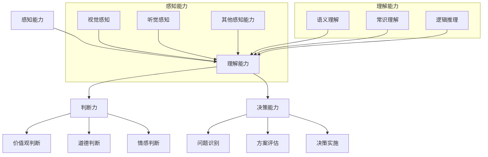

                 

# 《打造个人思维体系的意义》

## 引言

在信息爆炸的时代，个人思维体系的作用愈发凸显。它不仅影响个人的生活质量和职业发展，更决定了一个人在社会中的竞争力和影响力。因此，打造一个高效、系统的个人思维体系显得至关重要。本文将从多个维度深入探讨个人思维体系的构成、培养方法以及实践应用，帮助读者理解其重要性，并掌握构建个人思维体系的策略。

## 核心概念与联系

个人思维体系可以看作是一个由感知能力、理解能力、判断力和决策能力等多个模块组成的复杂系统。每个模块之间相互联系、相互作用，共同决定了个体的认知和行为方式。以下是一个用 Mermaid 画出的个人思维体系流程图：

通过这个流程图，我们可以更直观地看到个人思维体系的各个组成部分及其相互作用关系。

## 个人思维体系的构成

### 1.1 什么是个人思维体系

个人思维体系是指个体在长期的学习、生活、工作经历中，通过感知、理解、判断等认知活动，形成的独特的认知模式、思维方法和知识结构。它是个体大脑中的信息处理系统，决定了个体如何看待世界、解决问题和做出决策。

### 1.2 个人思维体系的构成

个人思维体系由多个组成部分构成，每个部分都扮演着关键的角色。以下是个人思维体系的几个核心构成部分：

#### 1.2.1 感知能力

感知能力是指个体通过视觉、听觉、嗅觉、味觉和触觉等感官获取外界信息的能力。这些感知能力是个人思维体系的基础，决定了个体对外界信息的接收和认知。

- **视觉感知**：视觉感知是人类获取信息的主要途径之一，包括对颜色、形状、大小、距离等信息的感知。
- **听觉感知**：听觉感知涉及对声音、语言、音调、节奏等信息的接收和理解。
- **其他感知能力**：如嗅觉、味觉和触觉，它们也在某些特定情境下对信息获取和决策产生影响。

#### 1.2.2 理解能力

理解能力是指个体对感知到的信息进行解读、分析和整合的能力。它包括以下几个子能力：

- **语义理解**：语义理解是指对语言文字的含义和逻辑关系的理解，是有效沟通和思考的基础。
- **常识理解**：常识理解是指对日常生活中的基本知识和常识的掌握，如时间、空间、因果关系的理解。
- **逻辑推理**：逻辑推理是指运用逻辑规则进行推理和判断的能力，是科学研究和问题解决的重要工具。

#### 1.2.3 判断力

判断力是指个体在面对复杂情况时，基于感知和理解，进行决策和评估的能力。判断力包括以下几个方面：

- **价值观判断**：价值观判断涉及对行为、决策和事件的道德、伦理评估。
- **道德判断**：道德判断是指对行为是否合乎道德标准的评估，是个人和社会行为规范的重要依据。
- **情感判断**：情感判断是指对情感状态和情绪反应的评估，如愉悦、愤怒、恐惧等。

#### 1.2.4 决策能力

决策能力是指个体在信息不完全、不确定的情境下，做出合理决策的能力。决策能力包括以下几个要素：

- **问题识别**：识别和明确问题的本质和关键因素。
- **方案评估**：评估不同的解决方案，考虑风险和收益。
- **决策实施**：选择最佳的方案并实施。

#### 1.2.5 沟通能力

沟通能力是指个体在信息传递、交流和理解过程中，运用语言、肢体语言、非语言符号等进行有效沟通的能力。良好的沟通能力有助于建立人际关系、解决冲突和促进团队合作。

- **语言沟通**：包括口头语言和书面语言，是沟通的主要形式。
- **非语言沟通**：包括面部表情、肢体语言、声音语调等，是沟通的辅助手段。

个人思维体系的这些组成部分相互作用，共同构成了个体的认知框架。了解和优化这些部分，有助于提高个人的思维能力和整体智力水平。

## 第一部分：认识个人思维体系

### 1.1 什么是个人思维体系

个人思维体系是指个体在长期的学习、生活、工作经历中，通过感知、理解、判断等认知活动，形成的独特的认知模式、思维方法和知识结构。它是个体大脑中的信息处理系统，决定了个体如何看待世界、解决问题和做出决策。

### 1.2 个人思维体系的构成

个人思维体系由多个组成部分构成，每个部分都扮演着关键的角色。以下是个人思维体系的几个核心构成部分：

#### 1.2.1 感知能力

感知能力是指个体通过视觉、听觉、嗅觉、味觉和触觉等感官获取外界信息的能力。这些感知能力是个人思维体系的基础，决定了个体对外界信息的接收和认知。

- **视觉感知**：视觉感知是人类获取信息的主要途径之一，包括对颜色、形状、大小、距离等信息的感知。
- **听觉感知**：听觉感知涉及对声音、语言、音调、节奏等信息的接收和理解。
- **其他感知能力**：如嗅觉、味觉和触觉，它们也在某些特定情境下对信息获取和决策产生影响。

#### 1.2.2 理解能力

理解能力是指个体对感知到的信息进行解读、分析和整合的能力。它包括以下几个子能力：

- **语义理解**：语义理解是指对语言文字的含义和逻辑关系的理解，是有效沟通和思考的基础。
- **常识理解**：常识理解是指对日常生活中的基本知识和常识的掌握，如时间、空间、因果关系的理解。
- **逻辑推理**：逻辑推理是指运用逻辑规则进行推理和判断的能力，是科学研究和问题解决的重要工具。

#### 1.2.3 判断力

判断力是指个体在面对复杂情况时，基于感知和理解，进行决策和评估的能力。判断力包括以下几个方面：

- **价值观判断**：价值观判断涉及对行为、决策和事件的道德、伦理评估。
- **道德判断**：道德判断是指对行为是否合乎道德标准的评估，是个人和社会行为规范的重要依据。
- **情感判断**：情感判断是指对情感状态和情绪反应的评估，如愉悦、愤怒、恐惧等。

#### 1.2.4 决策能力

决策能力是指个体在信息不完全、不确定的情境下，做出合理决策的能力。决策能力包括以下几个要素：

- **问题识别**：识别和明确问题的本质和关键因素。
- **方案评估**：评估不同的解决方案，考虑风险和收益。
- **决策实施**：选择最佳的方案并实施。

#### 1.2.5 沟通能力

沟通能力是指个体在信息传递、交流和理解过程中，运用语言、肢体语言、非语言符号等进行有效沟通的能力。良好的沟通能力有助于建立人际关系、解决冲突和促进团队合作。

- **语言沟通**：包括口头语言和书面语言，是沟通的主要形式。
- **非语言沟通**：包括面部表情、肢体语言、声音语调等，是沟通的辅助手段。

个人思维体系的这些组成部分相互作用，共同构成了个体的认知框架。了解和优化这些部分，有助于提高个人的思维能力和整体智力水平。

### 1.3 个人思维体系的影响因素

个人思维体系并非独立存在，它受到多种因素的影响和塑造。以下是一些主要的影响因素：

#### 1.3.1 个人经历

个人经历是塑造个人思维体系的重要因素之一。个体的成长背景、家庭环境、教育经历等都会对其思维模式产生深远影响。

- **家庭教育**：家庭教育的风格、内容和方法会影响个体的价值观、认知方式和行为习惯。例如，民主型家庭环境可能培养出独立性强的个体，而权威型家庭环境可能培养出遵从性强的个体。
- **社会环境**：社会环境包括社会制度、文化传统、社会风气等。这些因素会影响个体的思维方式和社会认知。例如，在一个重视创新和自由的社会环境中，个体可能更加开放和包容；在一个注重规范和稳定的社会环境中，个体可能更加守规矩和谨慎。
- **教育背景**：教育背景对个体的知识结构和思维能力有着直接的影响。不同的教育体制和教育方式会培养出不同类型的思维者。例如，以实践为导向的教育体系可能培养出更多具有创新能力的个体，而以理论为基础的教育体系可能培养出更多具有批判性思维的个体。

个人经历通过多种途径影响个人思维体系，使其成为一个复杂且动态的系统。

#### 1.3.2 心理因素

心理因素在塑造个人思维体系中起着关键作用。个体的自尊心、自我认知和情绪管理能力等心理因素都会影响其思维方式和决策过程。

- **自尊心**：自尊心是指个体对自己价值和能力的评价。高自尊心的个体可能更加自信和独立，倾向于采取积极的行动和冒险；而低自尊心的个体可能更加自卑和依赖，倾向于避免挑战和失败。
- **自我认知**：自我认知是指个体对自己性格、能力和价值观的理解。自我认知清晰的个体可能更加能够识别自己的优势和劣势，从而更好地制定目标和策略。
- **情绪管理**：情绪管理是指个体调节和控制情绪的能力。情绪管理良好的个体可能更加能够应对压力和挑战，保持冷静和理智；而情绪管理不佳的个体可能更容易受到情绪的影响，导致思维混乱和决策失误。

心理因素与个人经历相互作用，共同塑造个人思维体系。了解和优化这些心理因素，有助于提升个体的思维能力和生活质量。

## 第二部分：构建个人思维体系

### 2.1 培养思维能力

培养思维能力是构建个人思维体系的关键步骤。思维能力包括分析能力、创造力、批判性思维等多个方面，以下是一些具体的培养方法和策略。

#### 2.1.1 分析能力

分析能力是思维能力的重要组成部分，它涉及对信息、数据和现象的深入理解和分析。以下是一些培养分析能力的方法：

- **逻辑思维训练**：通过学习逻辑学、逻辑推理技巧等，提高逻辑思维能力。例如，可以通过解决逻辑谜题、参与逻辑辩论等方式进行训练。
- **数据分析技能提升**：学习数据分析方法和工具，如统计学、数据分析软件等，提高数据分析能力。可以通过参与数据分析项目、实际操作等方式进行实践。
- **案例学习**：通过研究经典案例，学习分析问题的方法和技巧。例如，可以分析历史事件、商业案例等，从中汲取经验。

#### 2.1.2 创造力

创造力是指个体在解决问题和创造价值时，能够产生新颖、独特想法的能力。以下是一些培养创造力的策略：

- **头脑风暴**：通过头脑风暴法，激发创意和灵感。可以在团队中开展头脑风暴会议，鼓励每个人自由地提出想法。
- **跨学科学习**：通过跨学科学习，拓宽思维视野，激发创新思维。可以选修与专业不相关的课程，阅读不同领域的书籍，参加跨学科研讨会等。
- **实践探索**：通过实际操作和探索，锻炼创意思维。可以参与项目实践、实验研究等，将创意转化为具体成果。

#### 2.1.3 批判性思维

批判性思维是指个体在思考和分析问题时，能够客观、理性地进行评估和质疑的能力。以下是一些培养批判性思维的方法：

- **阅读批判性作品**：通过阅读批判性思维书籍、文章等，学习批判性思维的方法和技巧。
- **反思和质疑**：在学习和生活中，不断反思和质疑自己的观点和假设。可以写反思日记，与他人讨论问题，挑战自己的思维。
- **讨论和辩论**：通过参与讨论和辩论，锻炼批判性思维。可以参加学术辩论、小组讨论等，学会从不同角度分析问题。

通过以上方法和策略，我们可以逐步培养和提升自己的思维能力，为构建高效的个人思维体系打下坚实基础。

### 2.2 建立知识体系

建立知识体系是构建个人思维体系的另一个重要方面。知识体系不仅包括专业知识，还包括通用知识和跨学科知识，以下是一些建立知识体系的方法。

#### 2.2.1 专业知识

专业知识是个人在特定领域中的知识和技能。以下是一些建立专业知识的方法：

- **系统学习**：选择一本权威的教材，系统地学习专业知识。从基础知识开始，逐步深入，掌握核心概念和原理。
- **动手实践**：理论联系实际，通过动手实践来加深对专业知识的理解。例如，编程语言的学习可以通过编写代码来实践。
- **在线课程**：参加在线课程，跟随专业讲师学习，获取最新的技术动态和应用案例。

#### 2.2.2 通用知识

通用知识是指适用于多种领域和情境的基本知识和技能。以下是一些学习通用知识的方法：

- **阅读经典著作**：选择经典的人文作品、科学著作等，通过阅读来深入理解通用知识。
- **参与文化课程**：参加大学的人文课程或在线文化课程，学习人文知识的历史背景和理论框架。
- **参观博物馆和文化遗址**：通过实地参观博物馆和文化遗址，体验历史和文化的魅力。

#### 2.2.3 跨学科知识

跨学科知识能够帮助我们更好地理解和解决复杂问题。以下是一些跨学科学习的建议：

- **选修跨学科课程**：在大学或在线教育平台选修跨学科课程，学习不同领域的知识和方法。
- **参与跨学科项目**：加入跨学科的研究团队或项目，通过实际操作来综合运用多学科知识。
- **开展跨学科研究**：尝试开展跨学科的研究项目，从不同角度探讨问题。

通过建立知识体系，我们可以系统地学习和掌握各种知识，为个人思维体系的发展打下坚实的基础。

### 2.3 提升认知能力

提升认知能力是构建个人思维体系的关键步骤。认知能力包括感知能力、理解能力、判断力和决策能力等多个方面，以下是一些提升认知能力的方法。

#### 2.3.1 深度阅读

深度阅读是一种有效提升认知能力的方法，它要求我们在阅读过程中进行深入的思考和分析，从而真正理解和吸收知识。以下是一些深度阅读的方法：

- **预读**：在正式阅读之前，快速浏览书籍的目录、摘要和结论，了解书籍的主要内容和结构。
- **分段阅读**：将阅读内容分成若干段落，逐一阅读和思考，避免一次性阅读过多内容。
- **标注和批注**：在阅读过程中，使用笔记、标记或批注来记录重要的观点、问题和疑问，便于后续回顾和思考。
- **主动思考**：在阅读过程中，主动提出问题、分析观点和论证方法，尝试理解作者的思想和逻辑。

#### 2.3.2 思考习惯

良好的思考习惯可以帮助我们更高效地处理信息和解决问题。以下是一些培养良好思考习惯的方法：

- **定期反思**：定期反思自己的行为、决策和思维方式，识别其中的不足和错误。
- **记录反思**：将思考和反思的过程记录下来，以便后续回顾和改进。
- **质疑和探索**：不盲目接受权威的观点，对权威的论断进行质疑和验证。
- **主动提问**：在学习和工作中，主动提问和解决问题，不回避困难和挑战。

#### 2.3.3 学习方法

优化学习方法对于提升学习效率和成果具有重要意义。以下是一些优化学习方法的方法：

- **目标明确**：在学习前明确学习目标，有助于提高学习动力和效率。
- **分阶段学习**：将学习内容分成若干阶段，逐一攻克，避免一次性学习过多内容。
- **主动学习**：积极参与课堂讨论和互动，主动提问和解决问题。
- **复习巩固**：定期复习所学内容，巩固记忆，避免遗忘。

通过提升认知能力，我们可以更高效地处理信息、解决问题，为个人成长和发展奠定基础。

## 第三部分：运用个人思维体系

### 3.1 解决问题的策略

在生活和工作中，我们经常需要面对各种问题。有效的问题解决策略可以帮助我们快速识别问题、分析问题并找到解决方案。以下是一些常见的问题解决策略：

#### 3.1.1 问题识别

问题识别是解决问题的第一步，它要求我们能够准确地识别问题的本质和关键因素。以下是一些问题识别的方法：

- **现象观察**：通过仔细观察现象，发现问题和异常情况。
- **用户反馈**：倾听用户的反馈和建议，了解他们的需求和困扰。
- **数据收集**：收集相关的数据和信息，通过数据分析来识别问题。

#### 3.1.2 问题分析

在识别问题后，我们需要对问题进行深入分析，以了解问题的根本原因和影响。以下是一些问题分析的方法：

- **因果分析**：通过分析问题的因果关系，找出问题的根本原因。
- **系统分析**：将问题视为一个系统，分析系统的各个部分以及它们之间的相互作用。
- **数据驱动分析**：利用数据工具，对问题进行定量和定性分析。

#### 3.1.3 问题解决

在分析问题后，我们需要采取具体的行动来解决问题。以下是一些问题解决的方法：

- **制定解决方案**：根据问题分析的结果，制定可行的解决方案。
- **优先级排序**：对解决方案进行优先级排序，先解决最重要和最紧急的问题。
- **实施和监控**：实施解决方案，并持续监控问题的解决效果。

通过以上策略，我们可以更高效地识别、分析和解决问题，从而提高个人和团队的工作效率。

### 3.2 决策能力提升

决策能力是个人思维体系中的一个重要组成部分，它决定了我们在面对各种选择和挑战时的应对能力。提升决策能力可以帮助我们做出更合理、更有效的决策。以下是一些提升决策能力的策略：

#### 3.2.1 决策模型

决策模型是帮助我们在复杂情境中做出合理决策的工具。以下是一些常见的决策模型：

- **成本-效益分析**：通过比较不同决策选项的成本和效益，选择最划算的选项。
- **决策树模型**：通过树状结构展示不同决策路径和结果，帮助分析不同决策的可能性。
- **SWOT分析**：通过分析优势、劣势、机会和威胁，帮助制定决策。

#### 3.2.2 决策分析工具

以下是一些常用的决策分析工具：

- **利益矩阵**：通过比较不同决策选项的利益和风险，帮助选择最优选项。
- **多标准决策**：考虑多个决策标准，如成本、时间、质量等，综合评估不同决策选项。
- **风险评估**：对决策选项进行风险分析，评估可能的负面影响和应对措施。

#### 3.2.3 决策实践

以下是一些决策实践的方法：

- **制定决策计划**：在做出决策前，制定详细的决策计划，明确决策的目标、标准和步骤。
- **咨询和反馈**：在决策过程中，向专业人士或相关人员进行咨询，获取他们的意见和建议。
- **执行和评估**：在决策实施后，对决策效果进行评估，总结经验和教训，为未来的决策提供参考。

通过提升决策能力，我们可以更明智地做出决策，提高个人和团队的工作效率和质量。

### 3.3 沟通技巧

沟通技巧是个人思维体系中的重要组成部分，它决定了我们在信息传递、交流和合作中的效率和质量。以下是一些提升沟通技巧的方法：

#### 3.3.1 沟通原则

以下是一些基本的沟通原则：

- **倾听**：在对方讲话时，保持专注，避免打断对方。
- **清晰表达**：使用简单、明确的语言表达自己的意思。
- **尊重对方**：尊重对方的观点和意见，避免使用指责性语言。
- **反馈**：在沟通结束后，询问对方的理解和反馈，确保信息的准确

