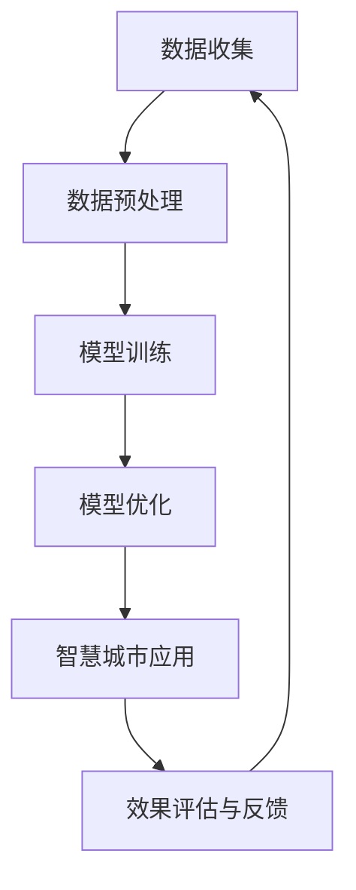

                 

## 第一部分：引言与背景

### 2.1 人工智能与城市规划

#### 2.1.1 人工智能的定义与核心技术

人工智能（Artificial Intelligence，简称AI）是指通过计算机模拟人类智能行为的技术。它涵盖了多个研究领域，包括机器学习、深度学习、自然语言处理、计算机视觉等。这些技术共同构成了人工智能的核心。

**机器学习**：机器学习是一种让计算机从数据中学习模式和规律的方法，分为监督学习、无监督学习和强化学习等类型。监督学习中的模型通过输入特征和标签来训练，而无监督学习则仅利用数据本身的内在结构，强化学习则依赖于与环境交互来学习最优策略。

**深度学习**：深度学习是机器学习的一个分支，通过多层神经网络进行特征提取和学习。它以大规模数据和高性能计算为支撑，取得了显著的成果，尤其在图像识别、语音识别和自然语言处理等领域。

**自然语言处理**：自然语言处理（Natural Language Processing，简称NLP）是研究如何让计算机理解和生成人类语言的技术。它涉及文本分类、情感分析、机器翻译等任务，近年来在人工智能领域取得了重要进展。

**计算机视觉**：计算机视觉是研究如何使计算机“看到”和理解图像或视频的技术。它包括目标检测、图像分类、图像分割等任务，是人工智能应用的重要方向。

#### 2.1.2 城市规划的定义与目标

城市规划是指为了实现特定区域的可持续发展，对土地利用、交通布局、公共设施等进行科学合理的设计和管理。它的目标是创造宜居、高效、可持续的城市环境，提升居民的生活品质。

**土地利用**：土地利用是城市规划的核心内容之一，涉及居住、商业、工业、公共设施等不同功能区域的划分和布局。

**交通布局**：交通布局是指如何设计城市道路、公共交通系统等，以实现交通的便捷和安全。

**公共设施**：公共设施包括学校、医院、公园、图书馆等，它们是城市规划的重要组成部分，直接影响居民的生活质量。

#### 2.1.3 AI在城市规划中的应用

人工智能在城市规划中的应用正在逐渐深入，它通过数据分析和预测，为城市规划提供科学依据。

**数据收集与处理**：城市规划需要大量的数据支持，包括地理信息、交通流量、环境监测数据等。AI技术可以帮助处理和分析这些数据，提取有用的信息。

**预测分析**：AI技术可以帮助预测未来的城市发展趋势，如人口增长、交通需求等，为城市规划提供前瞻性指导。

**决策支持**：AI技术可以通过模拟不同的城市规划方案，评估其效果，为城市规划师提供决策支持。

### 2.2 智慧城市的发展与挑战

#### 2.2.1 智慧城市的定义与特点

智慧城市是指利用信息技术、物联网、人工智能等手段，实现城市管理的智能化、精细化、协同化。智慧城市具有以下几个特点：

**数据驱动**：智慧城市通过大数据技术收集和管理城市运行数据，为城市管理提供数据支持。

**互联互通**：智慧城市通过物联网技术实现城市各个系统之间的互联互通，提高城市运行效率。

**智能决策**：智慧城市通过人工智能技术实现智能决策，提高城市管理的科学性和有效性。

**可持续发展**：智慧城市注重环境保护和资源节约，实现城市的可持续发展。

#### 2.2.2 智慧城市的发展历程

智慧城市的发展可以分为三个阶段：

**基础设施阶段**：这一阶段的重点是建设城市基础设施，如智能交通系统、智能电网、智能环保系统等。

**集成应用阶段**：这一阶段的重点是整合各类智能系统，实现城市管理的集成应用。

**创新驱动阶段**：这一阶段的重点是利用人工智能、大数据等先进技术，推动城市管理的创新和发展。

#### 2.2.3 智慧城市面临的挑战

智慧城市在发展过程中面临着一系列挑战：

**数据安全与隐私保护**：智慧城市涉及大量的个人信息和敏感数据，如何确保数据安全和个人隐私保护是一个重要问题。

**基础设施投资与建设**：智慧城市的建设需要大量的基础设施投资，如何合理规划和建设基础设施是一个挑战。

**跨部门协同管理**：智慧城市需要多个部门协同管理，如何实现跨部门的数据共享和协同工作是一个挑战。

**法律法规建设**：智慧城市的发展需要完善的法律法规支持，如何制定和实施相关的法律法规是一个挑战。

### 2.3 大模型在智慧城市中的角色与功能

#### 2.3.1 大模型的定义与核心特点

大模型是指具有大规模参数、能够处理海量数据的深度学习模型，如GPT、BERT等。大模型具有以下几个核心特点：

**强大的表征能力**：大模型通过多层神经网络结构，能够捕捉到复杂数据中的特征和规律，具有强大的表征能力。

**高效的计算能力**：大模型采用了先进的计算技术和算法，如分布式训练、并行计算等，能够高效地处理大规模数据。

**灵活的迁移能力**：大模型可以通过预训练和微调，在不同领域和任务中实现良好的迁移性能。

#### 2.3.2 大模型在智慧城市中的应用场景

大模型在智慧城市中的应用场景非常广泛，包括但不限于以下方面：

**智慧交通系统**：大模型可以用于交通流量预测、交通信号控制、公共交通调度等。

**智慧能源管理**：大模型可以用于能源需求预测、能源优化分配、电力调度等。

**智慧环境监测**：大模型可以用于空气质量预测、水质监测、环境异常检测等。

**公共安全**：大模型可以用于人脸识别、视频监控、犯罪预测等。

#### 2.3.3 大模型在智慧城市中的功能

大模型在智慧城市中的功能主要体现在以下几个方面：

**数据预处理**：大模型可以用于数据清洗、数据增强、特征提取等，提高数据质量，为后续分析提供支持。

**预测分析**：大模型可以用于时间序列预测、趋势预测等，帮助城市规划者做出科学决策。

**决策支持**：大模型可以通过模拟不同的城市规划方案，评估其效果，为城市规划师提供决策支持。

**智能优化**：大模型可以通过优化算法，实现城市资源的智能分配和优化，提高城市运行效率。

### 2.4 大模型在智慧城市中的应用前景

#### 2.4.1 大模型在智慧城市中的应用潜力

大模型在智慧城市中的应用具有巨大的潜力：

**提升城市运行效率**：通过预测分析和优化算法，大模型可以帮助城市实现智能运行，提高效率。

**改善居民生活质量**：通过智能交通、智慧能源等系统的应用，大模型可以改善居民的生活质量，提升城市宜居性。

**促进城市可持续发展**：通过优化资源配置、减少污染等，大模型可以促进城市的可持续发展。

#### 2.4.2 大模型在智慧城市中的应用挑战

尽管大模型在智慧城市中具有巨大的潜力，但其应用也面临一些挑战：

**数据质量**：大模型对数据质量要求较高，如何确保数据的质量是一个重要问题。

**计算资源**：大模型的训练和推理需要大量的计算资源，如何合理分配和使用计算资源是一个挑战。

**算法可解释性**：大模型通常具有黑盒特性，其决策过程难以解释，如何提高算法的可解释性是一个挑战。

#### 2.4.3 大模型在智慧城市中的应用趋势

随着人工智能技术的不断发展，大模型在智慧城市中的应用趋势将包括：

**应用领域扩展**：大模型的应用领域将不断扩展，从交通、能源扩展到环境保护、公共安全等更多领域。

**算法优化**：随着算法的进步，大模型的计算效率和性能将不断提升。

**多模态融合**：大模型将与其他传感器和数据源融合，实现更全面、更准确的智慧城市应用。

### 2.5 本章小结

本章介绍了人工智能与城市规划的关系、智慧城市的发展与挑战、大模型在智慧城市中的角色与功能以及应用前景。通过本章的学习，读者可以了解AI辅助城市规划的基本理论和实践方法。

## 1.1 人工智能与城市规划

### 1.1.1 人工智能的定义与核心技术

人工智能（Artificial Intelligence，简称AI）是指通过计算机模拟人类智能行为的一种技术。它包括机器学习、深度学习、自然语言处理、计算机视觉等多个领域。这些技术共同构成了人工智能的核心。

**机器学习**：机器学习是一种让计算机从数据中学习模式和规律的方法。它分为监督学习、无监督学习和强化学习等类型。

- **监督学习**：通过输入特征和标签来训练模型，常见的算法有线性回归、决策树、支持向量机等。
- **无监督学习**：仅利用数据本身的内在结构，常见的算法有聚类、降维等。
- **强化学习**：通过与环境交互来学习最优策略，常见的算法有Q学习、深度Q网络等。

**深度学习**：深度学习是机器学习的一个分支，通过多层神经网络进行特征提取和学习。它以大规模数据和高性能计算为支撑，取得了显著的成果。

- **卷积神经网络（CNN）**：适用于图像处理任务，通过卷积层提取图像特征。
- **循环神经网络（RNN）**：适用于序列数据处理任务，通过循环结构保持历史信息。
- **长短时记忆网络（LSTM）**：是RNN的一种变体，适用于长时间序列数据的建模。

**自然语言处理**：自然语言处理（Natural Language Processing，简称NLP）是研究如何让计算机理解和生成人类语言的技术。它包括文本分类、情感分析、机器翻译等任务。

- **词向量表示**：将单词映射到高维空间中的向量，常见的模型有Word2Vec、GloVe等。
- **序列模型**：用于处理文本序列，常见的模型有RNN、LSTM等。
- **语言模型**：用于预测下一个单词或句子，常见的模型有n-gram模型、Transformer等。

**计算机视觉**：计算机视觉是研究如何使计算机“看到”和理解图像或视频的技术。它包括目标检测、图像分类、图像分割等任务。

- **目标检测**：用于识别图像中的多个目标，常见的算法有YOLO、SSD、Faster R-CNN等。
- **图像分类**：用于将图像分为不同的类别，常见的算法有卷积神经网络、支持向量机等。
- **图像分割**：用于将图像划分为多个区域，常见的算法有FCN、U-Net等。

### 1.1.2 城市规划的定义与目标

城市规划是指为了实现特定区域的可持续发展，对土地利用、交通布局、公共设施等进行科学合理的设计和管理。它的目标是创造宜居、高效、可持续的城市环境，提升居民的生活品质。

**土地利用**：土地利用是城市规划的核心内容之一，涉及居住、商业、工业、公共设施等不同功能区域的划分和布局。

- **居住用地**：为居民提供居住空间，包括住宅、公寓、别墅等。
- **商业用地**：为商业活动提供空间，包括商场、市场、酒店等。
- **工业用地**：为工业活动提供空间，包括工厂、仓库、研发中心等。
- **公共设施用地**：为公共活动提供空间，包括学校、医院、公园、图书馆等。

**交通布局**：交通布局是指如何设计城市道路、公共交通系统等，以实现交通的便捷和安全。

- **道路系统**：包括城市主干道、次干道、支路等，形成合理的交通网络。
- **公共交通系统**：包括地铁、公交、出租车等，提供便捷的出行服务。
- **交通管理**：通过信号灯、交通监控等手段，优化交通流，减少拥堵。

**公共设施**：公共设施是城市规划的重要组成部分，直接影响居民的生活质量。

- **学校**：为居民提供教育资源，包括幼儿园、小学、中学、大学等。
- **医院**：为居民提供医疗服务，包括综合医院、专科医院、社区卫生服务中心等。
- **公园**：为居民提供休闲空间，改善城市生态环境。
- **图书馆**：为居民提供知识传播和文化交流的场所。

### 1.1.3 AI在城市规划中的应用

人工智能在城市规划中的应用正在逐渐深入，它通过数据分析和预测，为城市规划提供科学依据。

**数据收集与处理**：城市规划需要大量的数据支持，包括地理信息、交通流量、环境监测数据等。AI技术可以帮助处理和分析这些数据，提取有用的信息。

- **地理信息**：利用GIS（地理信息系统）技术，获取城市的地形、地貌、土地利用等地理信息。
- **交通流量**：通过交通监控设备，实时采集交通流量、速度、密度等数据。
- **环境监测**：通过传感器网络，实时监测空气质量、水质、噪声等环境参数。

**预测分析**：AI技术可以帮助预测未来的城市发展趋势，如人口增长、交通需求等，为城市规划提供前瞻性指导。

- **人口预测**：利用历史人口数据、经济增长、政策等因素，预测未来的人口增长趋势。
- **交通需求预测**：利用交通流量数据、城市规划方案等，预测未来交通需求的变化。

**决策支持**：AI技术可以通过模拟不同的城市规划方案，评估其效果，为城市规划师提供决策支持。

- **方案评估**：通过模拟不同的城市规划方案，评估其对交通、环境、经济效益的影响。
- **风险评估**：评估城市规划方案中可能存在的风险，如交通拥堵、环境污染等。

### 1.2 智慧城市的发展与挑战

#### 1.2.1 智慧城市的定义与特点

智慧城市是指利用信息技术、物联网、人工智能等手段，实现城市管理的智能化、精细化、协同化。智慧城市具有以下几个特点：

**数据驱动**：智慧城市通过大数据技术收集和管理城市运行数据，为城市管理提供数据支持。

- **数据采集**：利用传感器、摄像头等设备，实时采集城市运行数据。
- **数据管理**：建立数据平台，统一管理、存储和分析城市数据。

**互联互通**：智慧城市通过物联网技术实现城市各个系统之间的互联互通，提高城市运行效率。

- **物联网设备**：部署各种物联网设备，实现数据实时传输和共享。
- **信息共享**：构建城市信息共享平台，促进各部门间的信息交流。

**智能决策**：智慧城市通过人工智能技术实现智能决策，提高城市管理的科学性和有效性。

- **智能分析**：利用机器学习和深度学习技术，对海量数据进行智能分析。
- **智能决策**：基于数据分析结果，实现智能化的城市管理决策。

**可持续发展**：智慧城市注重环境保护和资源节约，实现城市的可持续发展。

- **绿色能源**：推广清洁能源，减少能源消耗和环境污染。
- **智能交通**：优化交通系统，减少交通拥堵和碳排放。

#### 1.2.2 智慧城市的发展历程

智慧城市的发展可以分为三个阶段：

**基础设施阶段**：这一阶段的重点是建设城市基础设施，如智能交通系统、智能电网、智能环保系统等。

- **智能交通系统**：建设智能交通控制系统，实现交通流量的实时监控和优化。
- **智能电网**：建设智能电网，实现电力供应的智能管理和调度。
- **智能环保系统**：建设智能环保监测系统，实现环境污染的实时监控和治理。

**集成应用阶段**：这一阶段的重点是整合各类智能系统，实现城市管理的集成应用。

- **城市管理平台**：构建城市信息管理平台，整合各类城市数据，实现数据共享和智能分析。
- **智能公共服务**：提供智能化的公共服务，如智能医疗、智能教育、智能养老等。

**创新驱动阶段**：这一阶段的重点是利用人工智能、大数据等先进技术，推动城市管理的创新和发展。

- **智能城市规划**：利用人工智能技术，实现城市规划的智能化和精准化。
- **智慧城市建设**：通过创新技术，推动城市治理体系和治理能力的现代化。

#### 1.2.3 智慧城市面临的挑战

智慧城市在发展过程中面临着一系列挑战：

**数据安全与隐私保护**：智慧城市涉及大量的个人信息和敏感数据，如何确保数据安全和个人隐私保护是一个重要问题。

- **数据安全**：防止数据泄露、篡改和破坏，确保城市数据的安全和完整。
- **隐私保护**：确保个人隐私不被泄露，避免个人信息被滥用。

**基础设施投资与建设**：智慧城市的建设需要大量的基础设施投资，如何合理规划和建设基础设施是一个挑战。

- **资金来源**：确保有足够的资金支持智慧城市的建设。
- **建设效率**：提高基础设施建设的效率，确保项目按时完成。

**跨部门协同管理**：智慧城市需要多个部门协同管理，如何实现跨部门的数据共享和协同工作是一个挑战。

- **数据共享**：建立数据共享机制，实现各部门间的数据互通。
- **协同工作**：明确各部门的职责和权限，确保协同工作的有效进行。

**法律法规建设**：智慧城市的发展需要完善的法律法规支持，如何制定和实施相关的法律法规是一个挑战。

- **法律法规制定**：制定符合智慧城市发展需要的法律法规。
- **法律法规实施**：确保法律法规的有效实施，加强对违法行为的打击力度。

### 2.3 大模型在智慧城市中的角色与功能

#### 2.3.1 大模型的定义与核心特点

大模型是指具有大规模参数、能够处理海量数据的深度学习模型，如GPT、BERT等。大模型具有以下几个核心特点：

**强大的表征能力**：大模型通过多层神经网络结构，能够捕捉到复杂数据中的特征和规律，具有强大的表征能力。

**高效的计算能力**：大模型采用了先进的计算技术和算法，如分布式训练、并行计算等，能够高效地处理大规模数据。

**灵活的迁移能力**：大模型可以通过预训练和微调，在不同领域和任务中实现良好的迁移性能。

#### 2.3.2 大模型在智慧城市中的角色

大模型在智慧城市中扮演着重要的角色，是智慧城市智能化、精细化和协同化的关键。

**数据驱动**：大模型通过大数据技术收集和管理城市运行数据，为城市管理提供数据支持。

**互联互通**：大模型通过物联网技术实现城市各个系统之间的互联互通，提高城市运行效率。

**智能决策**：大模型通过人工智能技术实现智能决策，提高城市管理的科学性和有效性。

#### 2.3.3 大模型在智慧城市中的功能

大模型在智慧城市中的功能主要体现在以下几个方面：

**数据预处理**：大模型可以用于数据清洗、数据增强、特征提取等，提高数据质量，为后续分析提供支持。

**预测分析**：大模型可以用于时间序列预测、趋势预测等，帮助城市规划者做出科学决策。

**决策支持**：大模型可以通过模拟不同的城市规划方案，评估其效果，为城市规划师提供决策支持。

**智能优化**：大模型可以通过优化算法，实现城市资源的智能分配和优化，提高城市运行效率。

### 2.4 大模型在智慧城市中的应用前景

#### 2.4.1 大模型在智慧城市中的应用潜力

大模型在智慧城市中的应用具有巨大的潜力：

**提升城市运行效率**：通过预测分析和优化算法，大模型可以帮助城市实现智能运行，提高效率。

**改善居民生活质量**：通过智能交通、智慧能源等系统的应用，大模型可以改善居民的生活质量，提升城市宜居性。

**促进城市可持续发展**：通过优化资源配置、减少污染等，大模型可以促进城市的可持续发展。

#### 2.4.2 大模型在智慧城市中的应用挑战

尽管大模型在智慧城市中具有巨大的潜力，但其应用也面临一些挑战：

**数据质量**：大模型对数据质量要求较高，如何确保数据的质量是一个重要问题。

**计算资源**：大模型的训练和推理需要大量的计算资源，如何合理分配和使用计算资源是一个挑战。

**算法可解释性**：大模型通常具有黑盒特性，其决策过程难以解释，如何提高算法的可解释性是一个挑战。

#### 2.4.3 大模型在智慧城市中的应用趋势

随着人工智能技术的不断发展，大模型在智慧城市中的应用趋势将包括：

**应用领域扩展**：大模型的应用领域将不断扩展，从交通、能源扩展到环境保护、公共安全等更多领域。

**算法优化**：随着算法的进步，大模型的计算效率和性能将不断提升。

**多模态融合**：大模型将与其他传感器和数据源融合，实现更全面、更准确的智慧城市应用。

## 第2章：AI辅助城市规划的核心概念与架构

### 2.1 人工智能核心概念

#### 2.1.1 人工智能的定义与范畴

人工智能（Artificial Intelligence，简称AI）是指通过计算机模拟人类智能行为的一门科学技术。它涵盖了多个领域，包括机器学习、深度学习、自然语言处理、计算机视觉、机器人技术等。

**机器学习**：机器学习是一种通过算法使计算机从数据中学习模式和规律的方法。它包括监督学习、无监督学习和强化学习等类型。

- **监督学习**：通过输入特征和标签来训练模型，常见算法有线性回归、决策树、支持向量机等。
- **无监督学习**：仅利用数据本身的内在结构，常见算法有聚类、降维等。
- **强化学习**：通过与环境交互来学习最优策略，常见算法有Q学习、深度Q网络等。

**深度学习**：深度学习是机器学习的一个分支，通过多层神经网络进行特征提取和学习。它以大规模数据和高性能计算为支撑，取得了显著的成果。

- **卷积神经网络（CNN）**：适用于图像处理任务，通过卷积层提取图像特征。
- **循环神经网络（RNN）**：适用于序列数据处理任务，通过循环结构保持历史信息。
- **长短时记忆网络（LSTM）**：是RNN的一种变体，适用于长时间序列数据的建模。

**自然语言处理**：自然语言处理（Natural Language Processing，简称NLP）是研究如何让计算机理解和生成人类语言的技术。它包括文本分类、情感分析、机器翻译等任务。

- **词向量表示**：将单词映射到高维空间中的向量，常见模型有Word2Vec、GloVe等。
- **序列模型**：用于处理文本序列，常见模型有RNN、LSTM等。
- **语言模型**：用于预测下一个单词或句子，常见模型有n-gram模型、Transformer等。

**计算机视觉**：计算机视觉是研究如何使计算机“看到”和理解图像或视频的技术。它包括目标检测、图像分类、图像分割等任务。

- **目标检测**：用于识别图像中的多个目标，常见算法有YOLO、SSD、Faster R-CNN等。
- **图像分类**：用于将图像分为不同的类别，常见算法有卷积神经网络、支持向量机等。
- **图像分割**：用于将图像划分为多个区域，常见算法有FCN、U-Net等。

#### 2.1.2 人工智能的发展历程

人工智能的发展历程可以追溯到20世纪50年代。以下是几个重要的发展阶段：

- **早期探索阶段（1950-1969）**：在这个阶段，人工智能的概念被提出，并开始了一系列的实验和研究。例如，1956年，约翰·麦卡锡（John McCarthy）在达特茅斯会议上提出了人工智能的概念。
- **理论建立阶段（1970-1989）**：在这个阶段，人工智能的理论体系逐渐建立，包括知识表示、推理、规划等领域的研究。
- **应用推动阶段（1990-2009）**：在这个阶段，随着计算机性能的提升和数据量的增加，人工智能在图像识别、语音识别等领域取得了显著的应用成果。
- **深度学习崛起阶段（2010至今）**：在这个阶段，深度学习技术的兴起，推动了人工智能的发展，使其在图像识别、自然语言处理等领域取得了重大突破。

#### 2.1.3 人工智能的优势与挑战

人工智能的优势包括：

- **强大的数据处理能力**：人工智能能够处理大量数据，并从中提取有用的信息。
- **自动化的决策过程**：人工智能可以通过学习数据，自动做出决策，减少人工干预。
- **提高工作效率**：人工智能可以在短时间内完成复杂的任务，提高工作效率。
- **拓展人类能力**：人工智能可以帮助人类完成一些难以或无法完成的任务，拓展人类的能力。

人工智能的挑战包括：

- **数据隐私和安全**：人工智能需要大量数据训练模型，如何保护数据隐私和安全是一个重要问题。
- **算法可解释性**：人工智能模型通常具有黑盒特性，其决策过程难以解释，如何提高算法的可解释性是一个挑战。
- **伦理和社会问题**：人工智能的应用可能引发一系列伦理和社会问题，如就业、隐私等。

### 2.2 智慧城市规划的架构

#### 2.2.1 智慧城市规划的基本架构

智慧城市规划的基本架构包括以下几个关键层次：

- **感知层**：通过传感器、摄像头、RFID等设备，实时收集城市运行数据，如交通流量、环境质量、公共安全等。
- **传输层**：将感知层收集到的数据传输到数据处理中心，可以通过有线或无线传输方式。
- **数据处理层**：对传输层的数据进行清洗、融合、分析，提取有用的信息，为决策层提供支持。
- **决策层**：基于数据处理层提供的信息，制定相应的城市管理策略，如交通调控、能源管理、环境治理等。
- **执行层**：执行决策层的策略，如控制信号灯、调节交通流量、发布交通信息等。
- **服务层**：为公众提供智能化的城市管理服务，如实时路况、公共交通信息、出行建议等。

#### 2.2.2 智慧城市规划的关键技术

智慧城市规划的关键技术包括：

- **物联网技术**：通过物联网设备实现城市运行数据的实时采集和传输，是智慧城市规划的基础。
- **大数据分析技术**：通过对海量数据进行存储、处理和分析，提取有用信息，为决策提供支持。
- **人工智能技术**：通过机器学习、深度学习等技术，实现智能化的城市管理决策，提高城市运行效率。
- **云计算技术**：通过云计算平台，实现数据的存储、处理和共享，提供强大的计算和存储能力。
- **区块链技术**：通过区块链技术，实现数据的安全存储和可信传输，提高城市管理的数据安全性。

#### 2.2.3 智慧城市规划的实施流程

智慧城市规划的实施流程通常包括以下几个步骤：

- **需求分析**：明确智慧城市建设的具体需求和目标，确定项目的范围和优先级。
- **方案设计**：根据需求分析结果，设计智慧城市规划的整体方案，包括技术架构、数据流、功能模块等。
- **技术选型**：选择合适的物联网技术、大数据分析技术、人工智能技术等，确保方案的可实施性。
- **系统开发**：根据设计方案，进行系统开发和实现，包括前端界面、后端服务、数据处理等。
- **测试与部署**：对系统进行功能测试、性能测试和安全测试，确保系统的稳定运行，然后进行部署和上线。
- **运营与维护**：对系统进行日常运营和维护，确保系统的正常运行，同时不断优化和升级系统，以适应城市发展的需求。

### 2.3 大模型在智慧城市中的角色与功能

#### 2.3.1 大模型的定义与核心特点

大模型是指具有大规模参数、能够处理海量数据的深度学习模型，如GPT、BERT等。大模型具有以下几个核心特点：

- **强大的表征能力**：大模型通过多层神经网络结构，能够捕捉到复杂数据中的特征和规律，具有强大的表征能力。
- **高效的计算能力**：大模型采用了先进的计算技术和算法，如分布式训练、并行计算等，能够高效地处理大规模数据。
- **灵活的迁移能力**：大模型可以通过预训练和微调，在不同领域和任务中实现良好的迁移性能。

#### 2.3.2 大模型在智慧城市中的角色

大模型在智慧城市中扮演着重要的角色，是智慧城市智能化、精细化和协同化的关键。

- **数据预处理**：大模型可以用于数据清洗、数据增强、特征提取等，提高数据质量，为后续分析提供支持。
- **预测分析**：大模型可以用于时间序列预测、趋势预测等，帮助城市规划者做出科学决策。
- **决策支持**：大模型可以通过模拟不同的城市规划方案，评估其效果，为城市规划师提供决策支持。
- **智能优化**：大模型可以通过优化算法，实现城市资源的智能分配和优化，提高城市运行效率。

#### 2.3.3 大模型在智慧城市中的功能

大模型在智慧城市中的功能主要体现在以下几个方面：

- **智慧交通系统**：大模型可以用于交通流量预测、交通信号控制、公共交通调度等。
- **智慧能源管理**：大模型可以用于能源需求预测、能源优化分配、电力调度等。
- **智慧环境监测**：大模型可以用于空气质量预测、水质监测、环境异常检测等。
- **公共安全**：大模型可以用于人脸识别、视频监控、犯罪预测等。

### 2.4 大模型在智慧城市中的流程

#### 2.4.1 数据收集与处理

数据收集与处理是智慧城市的基础。大模型在这一环节中发挥着重要作用：

- **数据收集**：通过传感器、摄像头、RFID等设备，实时收集城市运行数据，如交通流量、环境质量、公共安全等。
- **数据处理**：对收集到的数据进行清洗、融合、分析，提取有用的信息，为后续分析提供支持。

#### 2.4.2 模型训练与优化

模型训练与优化是智慧城市的关键。大模型在这一环节中发挥着核心作用：

- **模型训练**：使用收集到的数据进行模型训练，通过调整模型参数，使模型能够更好地拟合数据。
- **模型优化**：对训练好的模型进行优化，提高模型的性能，如减少误差、提高准确率等。

#### 2.4.3 智慧城市应用

智慧城市应用是智慧城市的最终目标。大模型在这一环节中发挥着关键作用：

- **智慧交通系统**：通过大模型进行交通流量预测、交通信号控制、公共交通调度等，提高交通运行效率。
- **智慧能源管理**：通过大模型进行能源需求预测、能源优化分配、电力调度等，提高能源利用效率。
- **智慧环境监测**：通过大模型进行空气质量预测、水质监测、环境异常检测等，改善环境质量。
- **公共安全**：通过大模型进行人脸识别、视频监控、犯罪预测等，提高公共安全水平。

#### 2.4.4 效果评估与反馈

效果评估与反馈是智慧城市的持续改进。大模型在这一环节中发挥着重要作用：

- **效果评估**：对智慧城市应用的效果进行评估，如交通运行效率、能源利用效率、环境质量改善等。
- **反馈**：根据评估结果，对模型进行调整和优化，提高智慧城市应用的性能。

### 2.5 大模型在智慧城市中的核心应用场景

#### 2.5.1 智慧交通系统

智慧交通系统是智慧城市的重要组成部分。大模型在智慧交通系统中发挥着关键作用：

- **交通流量预测**：通过大模型预测未来一段时间内的交通流量，帮助交通管理部门制定交通调控策略，如信号灯控制、道路容量管理等。
- **交通事件检测与预警**：通过大模型实时分析交通数据，检测交通事故、交通拥堵等异常事件，并及时发出预警，减少事故损失。
- **公共交通优化调度**：通过大模型优化公共交通线路和班次，提高公共交通的运营效率和服务质量。
- **智能停车管理**：通过大模型分析停车数据，提供停车建议，优化停车资源利用，提高停车效率。

#### 2.5.2 智慧能源管理

智慧能源管理是智慧城市的重要组成部分。大模型在智慧能源管理中发挥着关键作用：

- **能源需求预测**：通过大模型预测未来一段时间内的能源需求，帮助能源公司制定能源供应计划，以避免能源过剩或短缺。
- **能源优化分配**：通过大模型根据实时能源需求和供应情况，优化能源的分配策略，提高能源利用效率。
- **智能能源调度**：通过大模型实时分析能源供应和需求，优化能源调度策略，确保能源供应稳定。
- **分布式能源优化**：通过大模型优化分布式能源系统的运行策略，提高分布式能源系统的运行效率。

#### 2.5.3 智慧环境监测

智慧环境监测是智慧城市的重要组成部分。大模型在智慧环境监测中发挥着关键作用：

- **环境数据预测**：通过大模型预测未来一段时间内的环境质量变化，帮助环境管理部门及时采取治理措施，改善环境质量。
- **环境异常检测**：通过大模型实时分析环境数据，识别异常情况，如空气污染、水质污染等，并及时发出预警。
- **环境优化管理**：通过大模型根据实时环境数据，优化环境管理策略，提高环境治理效果。

### 2.6 本章小结

本章介绍了AI辅助城市规划的核心概念与架构，包括人工智能核心概念、智慧城市规划的基本架构、大模型在智慧城市中的角色与功能以及大模型在智慧城市中的流程和应用场景。通过本章的学习，读者可以了解AI辅助城市规划的基本理论和实践方法。

## 2.3 大模型在智慧城市中的角色与功能

### 2.3.1 大模型的定义与核心特点

大模型是指具有大规模参数、能够处理海量数据的深度学习模型，如GPT、BERT等。这些模型通过多层神经网络结构，能够捕捉到复杂数据中的特征和规律，具有以下几个核心特点：

1. **强大的表征能力**：大模型具有多层神经网络结构，能够从数据中提取深层特征，具有较强的表征能力。
2. **高效的计算能力**：大模型通常采用分布式训练、并行计算等技术，能够在短时间内处理海量数据。
3. **灵活的迁移能力**：大模型通过预训练和微调，可以迁移到不同的领域和任务中，具有良好的迁移能力。

### 2.3.2 大模型在智慧城市中的角色

大模型在智慧城市中扮演着至关重要的角色，是智慧城市智能化、精细化和协同化的核心驱动力。具体来说，大模型在智慧城市中具有以下几个方面的角色：

1. **数据预处理**：大模型能够对原始数据进行清洗、归一化和特征提取，提高数据质量，为后续分析提供可靠的数据支持。
2. **预测分析**：大模型能够基于历史数据预测未来趋势，如交通流量、能源需求等，为城市管理者提供科学依据。
3. **决策支持**：大模型能够模拟不同决策方案的效果，为城市管理者提供决策支持，优化城市管理策略。
4. **智能优化**：大模型能够基于实时数据，自动调整城市资源配置，如交通信号灯、能源分配等，提高城市运行效率。

### 2.3.3 大模型在智慧城市中的功能

大模型在智慧城市中的功能主要体现在以下几个方面：

1. **智慧交通系统**：大模型可以用于交通流量预测、交通信号控制、公共交通调度等，提高交通运行效率。
2. **智慧能源管理**：大模型可以用于能源需求预测、能源优化分配、电力调度等，提高能源利用效率。
3. **智慧环境监测**：大模型可以用于空气质量预测、水质监测、环境异常检测等，改善环境质量。
4. **公共安全**：大模型可以用于人脸识别、视频监控、犯罪预测等，提高公共安全水平。
5. **智能城市治理**：大模型可以用于城市安全监控、公共服务优化、城市灾害预警等，提升城市治理能力。

### 2.3.4 大模型在智慧城市中的核心应用场景

1. **智慧交通系统**：

   - **交通流量预测**：利用大模型对交通流量进行预测，帮助交通管理部门制定交通调控策略，如信号灯控制、道路容量管理等。
   - **交通事件检测与预警**：通过大模型实时分析交通数据，检测交通事故、交通拥堵等异常事件，并及时发出预警。
   - **公共交通优化调度**：利用大模型优化公共交通线路和班次，提高公共交通的运营效率和服务质量。
   - **智能停车管理**：通过大模型分析停车数据，提供停车建议，优化停车资源利用，提高停车效率。

2. **智慧能源管理**：

   - **能源需求预测**：利用大模型预测未来的能源需求，帮助能源公司制定能源供应计划，以避免能源过剩或短缺。
   - **能源优化分配**：通过大模型根据实时能源需求和供应情况，优化能源的分配策略，提高能源利用效率。
   - **智能能源调度**：利用大模型实时分析能源供应和需求，优化能源调度策略，确保能源供应稳定。
   - **分布式能源优化**：通过大模型优化分布式能源系统的运行策略，提高分布式能源系统的运行效率。

3. **智慧环境监测**：

   - **环境数据预测**：利用大模型预测未来的环境质量变化，帮助环境管理部门及时采取治理措施，改善环境质量。
   - **环境异常检测**：通过大模型实时分析环境数据，识别异常情况，如空气污染、水质污染等，并及时发出预警。
   - **环境优化管理**：通过大模型根据实时环境数据，优化环境管理策略，提高环境治理效果。

4. **公共安全**：

   - **人脸识别**：利用大模型进行人脸识别，提高公共安全监控的准确性。
   - **视频监控**：通过大模型分析视频数据，检测异常行为，如犯罪行为等，提高公共安全水平。
   - **犯罪预测**：利用大模型预测犯罪发生的概率和位置，帮助公安机关预防犯罪。

### 2.3.5 Mermaid流程图：大模型在智慧城市规划中的流程

下面是一个Mermaid流程图，展示了大模型在智慧城市规划中的基本流程：



在数据收集阶段，大模型通过传感器、摄像头等设备收集城市运行数据。随后，对数据进行预处理，包括清洗、归一化、特征提取等。预处理后的数据用于模型训练，大模型通过训练学习到数据的特征和规律。训练好的模型进行优化，以提高模型的性能。优化的模型应用于智慧城市的各个方面，如交通、能源、环境等。最后，对应用效果进行评估，根据评估结果对模型进行调整和优化，形成闭环，不断提升智慧城市的管理水平。

### 2.3.6 大模型在智慧城市规划中的核心应用场景

1. **智慧交通系统**：

   - **交通流量预测**：大模型可以通过历史交通数据预测未来交通流量，帮助交通管理部门制定交通调控策略。例如，通过GPT模型预测未来一段时间内的交通流量，交通管理部门可以根据预测结果调整信号灯周期、道路容量管理，从而缓解交通拥堵。

   ```mermaid
   graph TD
       A[历史交通数据] --> B[GPT模型]
       B --> C[未来交通流量预测]
       C --> D[交通调控策略]
   ```

   - **交通事件检测与预警**：大模型可以通过实时交通数据检测交通事件，如交通事故、交通拥堵等，并及时发出预警。例如，通过BERT模型实时分析交通数据，当检测到异常事件时，系统会发出预警通知相关部门进行处理。

   ```mermaid
   graph TD
       A[实时交通数据] --> B[BERT模型]
       B --> C[交通事件检测]
       C --> D[预警通知]
   ```

   - **公共交通优化调度**：大模型可以通过历史和实时数据优化公共交通线路和班次，提高公共交通的运营效率。例如，通过Transformer模型分析公共交通数据，优化公交车的运行路径和班次，从而减少乘客等待时间和交通拥堵。

   ```mermaid
   graph TD
       A[公共交通数据] --> B[Transformer模型]
       B --> C[线路和班次优化]
   ```

   - **智能停车管理**：大模型可以通过实时停车数据提供停车建议，优化停车资源利用。例如，通过BERT模型分析停车数据，为驾驶员提供最优的停车建议，提高停车效率。

   ```mermaid
   graph TD
       A[停车数据] --> B[BERT模型]
       B --> C[停车建议]
   ```

2. **智慧能源管理**：

   - **能源需求预测**：大模型可以通过历史和实时数据预测未来能源需求，帮助能源公司制定能源供应计划。例如，通过GPT模型预测未来一段时间内的能源需求，能源公司可以根据预测结果调整电力供应计划，避免能源过剩或短缺。

   ```mermaid
   graph TD
       A[历史能源数据] --> B[GPT模型]
       B --> C[未来能源需求预测]
   ```

   - **能源优化分配**：大模型可以通过实时数据优化能源的分配策略，提高能源利用效率。例如，通过BERT模型分析实时能源数据，能源公司可以优化电力分配策略，确保电网稳定运行。

   ```mermaid
   graph TD
       A[实时能源数据] --> B[BERT模型]
       B --> C[能源分配策略优化]
   ```

   - **智能能源调度**：大模型可以通过实时数据优化能源调度策略，确保能源供应稳定。例如，通过Transformer模型分析实时能源数据，能源公司可以优化电力调度策略，减少能源浪费。

   ```mermaid
   graph TD
       A[实时能源数据] --> B[Transformer模型]
       B --> C[能源调度策略优化]
   ```

   - **分布式能源优化**：大模型可以通过实时数据优化分布式能源系统的运行策略，提高分布式能源系统的运行效率。例如，通过BERT模型分析分布式能源数据，优化光伏发电和储能系统的运行模式。

   ```mermaid
   graph TD
       A[分布式能源数据] --> B[BERT模型]
       B --> C[分布式能源优化策略]
   ```

3. **智慧环境监测**：

   - **环境数据预测**：大模型可以通过历史和实时数据预测未来环境质量变化，帮助环境管理部门及时采取治理措施。例如，通过GPT模型预测未来一段时间内的空气质量变化，环境管理部门可以根据预测结果调整环境治理策略。

   ```mermaid
   graph TD
       A[历史环境数据] --> B[GPT模型]
       B --> C[未来空气质量预测]
   ```

   - **环境异常检测**：大模型可以通过实时数据检测环境异常情况，如空气污染、水质污染等，并及时发出预警。例如，通过BERT模型实时分析环境数据，当检测到异常情况时，系统会发出预警通知相关部门进行处理。

   ```mermaid
   graph TD
       A[实时环境数据] --> B[BERT模型]
       B --> C[环境异常检测]
       C --> D[预警通知]
   ```

   - **环境优化管理**：大模型可以通过实时数据优化环境管理策略，提高环境治理效果。例如，通过Transformer模型分析实时环境数据，环境管理部门可以优化环境治理策略，改善环境质量。

   ```mermaid
   graph TD
       A[实时环境数据] --> B[Transformer模型]
       B --> C[环境管理策略优化]
   ```

4. **公共安全**：

   - **人脸识别**：大模型可以通过实时视频数据识别人员身份，提高公共安全监控的准确性。例如，通过GPT模型分析实时视频数据，监控系统可以识别进入特定区域的人员身份，提高公共安全水平。

   ```mermaid
   graph TD
       A[实时视频数据] --> B[GPT模型]
       B --> C[人脸识别]
   ```

   - **视频监控**：大模型可以通过实时视频数据检测异常行为，提高公共安全水平。例如，通过BERT模型实时分析视频数据，监控系统可以检测到犯罪行为，及时发出预警通知相关部门。

   ```mermaid
   graph TD
       A[实时视频数据] --> B[BERT模型]
       B --> C[异常行为检测]
       C --> D[预警通知]
   ```

   - **犯罪预测**：大模型可以通过历史和实时数据预测犯罪发生的概率和位置，帮助公安机关预防犯罪。例如，通过Transformer模型分析犯罪数据，预测未来犯罪发生的概率和位置，公安机关可以提前部署警力，预防犯罪。

   ```mermaid
   graph TD
       A[历史犯罪数据] --> B[Transformer模型]
       B --> C[犯罪预测]
   ```

### 2.3.7 大模型在智慧城市规划中的核心应用场景：智慧交通系统

智慧交通系统是智慧城市的重要组成部分，大模型在智慧交通系统中发挥着关键作用。以下将详细介绍大模型在智慧交通系统中的核心应用场景，包括交通流量预测、交通事件检测与预警、公共交通优化调度和智能停车管理。

#### 2.3.7.1 交通流量预测

交通流量预测是智慧交通系统中的一个关键任务，它能够帮助交通管理部门制定科学合理的交通调控策略，从而缓解交通拥堵，提高道路通行效率。大模型在交通流量预测中的应用，主要包括以下几个步骤：

1. **数据收集**：通过传感器、摄像头、交通流量监测设备等，收集城市道路的交通流量数据，包括车流量、速度、密度等。
2. **数据预处理**：对收集到的交通流量数据进行清洗、归一化和特征提取，以便后续模型训练。
3. **模型训练**：使用训练数据集，训练大规模的深度学习模型，如GPT、BERT等。这些模型通过多层神经网络结构，能够从数据中提取深层特征，提高预测准确性。
4. **模型优化**：通过交叉验证和超参数调优，优化模型的性能，如减少预测误差、提高预测精度等。
5. **模型部署**：将训练好的模型部署到生产环境，实时接收交通流量数据，进行预测分析，为交通管理部门提供决策支持。

以下是一个简单的Mermaid流程图，展示了大

