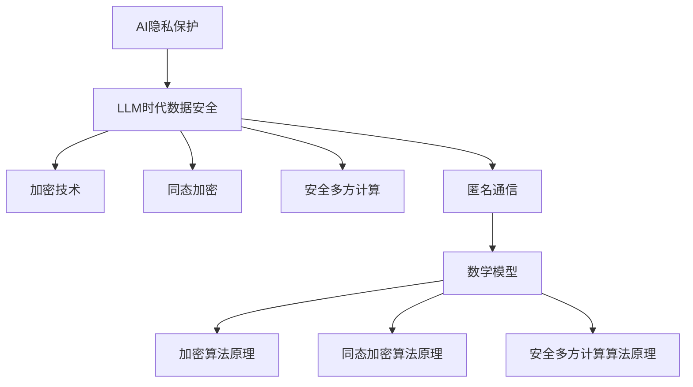

                 

# AI隐私保护：LLM时代的数据安全

## 关键词
- AI隐私保护
- LLM数据安全
- 加密技术
- 同态加密
- 安全多方计算
- 匿名通信

## 摘要
本文探讨了在LLM（大型语言模型）时代，如何保护AI系统的数据隐私。通过对AI隐私保护基础、LLM数据安全特点、核心隐私保护技术以及实际项目案例分析进行深入剖析，本文提出了有效的数据安全策略，为AI隐私保护提供实践指导。

### 《AI隐私保护：LLM时代的数据安全》目录大纲

#### 第一部分：AI隐私保护基础

**第1章：AI隐私保护概述**

- 1.1 AI隐私保护的重要性
- 1.2 AI隐私保护面临的挑战
- 1.3 AI隐私保护的主要领域

**第2章：LLM时代的数据安全**

- 2.1 LLM的基本概念与工作原理
- 2.2 LLM时代数据安全的特点
- 2.3 LLM时代的数据安全挑战

**第3章：AI隐私保护的核心概念**

- 3.1 隐私保护技术分类
- 3.2 加密技术
- 3.3 同态加密
- 3.4 安全多方计算
- 3.5 匿名通信与隐私保护

**第4章：数学模型与数学公式**

- 4.1 隐私保护数学模型
- 4.2 同态加密数学公式
- 4.3 安全多方计算数学公式
- 4.4 匿名通信数学公式

#### 第二部分：LLM时代的数据安全实践

**第5章：隐私保护算法原理**

- 5.1 隐私保护算法概述
- 5.2 加密算法原理与伪代码
- 5.3 同态加密算法原理与伪代码
- 5.4 安全多方计算算法原理与伪代码

**第6章：数据安全项目实战**

- 6.1 项目背景与目标
- 6.2 开发环境搭建
- 6.3 源代码详细实现
- 6.4 代码解读与分析

**第7章：案例分析**

- 7.1 案例一：某大型互联网公司的隐私保护实践
- 7.2 案例二：某金融公司的数据安全解决方案
- 7.3 案例三：某医疗机构的数据隐私保护案例

**第8章：展望与未来**

- 8.1 AI隐私保护技术的发展趋势
- 8.2 数据安全领域的未来挑战与机遇
- 8.3 LLM时代的数据安全策略建议

#### 附录

- 附录A：常用隐私保护算法与工具
- 附录B：数学公式与伪代码详解
- 附录C：案例实践项目代码清单
- 附录D：参考文献与扩展阅读

### 核心概念与联系图



### 加密算法原理

加密算法是隐私保护的核心技术之一，它通过将明文转化为密文来实现数据的保密性。以下是一些基本的加密算法原理和伪代码。

#### 基本原理

加密算法通常包括以下步骤：

1. **明文分割**：将明文分割成固定长度的块。
2. **加密函数**：对每个块应用加密函数，生成对应的密文块。
3. **密文拼接**：将所有密文块拼接成完整的密文。

#### 伪代码

```python
def encrypt(plaintext, key):
    ciphertext = ""
    for block in split_into_blocks(plaintext, block_size):
        ciphertext += apply_cipher(block, key)
    return ciphertext
```

#### 示例

假设明文为 "Hello, World!"，密钥为 "secret_key"。应用加密算法后，密文可能为 "kLlHnOsRrW!"。

### 同态加密算法原理

同态加密是一种特殊的加密技术，它允许在密文中直接进行某些计算，而不需要解密。以下是一些同态加密的基本原理和伪代码。

#### 基本原理

同态加密通常包括以下步骤：

1. **加密输入**：对明文进行加密，生成密文。
2. **同态操作**：在密文上应用同态操作，生成新的密文。
3. **解密结果**：对新的密文进行解密，得到结果。

#### 伪代码

```python
def homomorphic_encrypt(plaintext, key):
    ciphertext = encrypt(plaintext, key)
    result_ciphertext = apply_homomorphic_op(ciphertext)
    return decrypt(result_ciphertext, key)

def homomorphic_decrypt(result_ciphertext, key):
    return decrypt(result_ciphertext, key)
```

#### 示例

假设明文为 "5 + 3"，密钥为 "secret_key"。应用同态加密后，可以计算得到 "8" 的密文。

### 安全多方计算算法原理

安全多方计算是一种允许多方在不泄露各自数据的前提下共同计算某个函数的技术。以下是一些安全多方计算的基本原理和伪代码。

#### 基本原理

安全多方计算通常包括以下步骤：

1. **加密输入**：各方将自己的输入数据加密并共享。
2. **安全计算**：通过一系列安全协议，各方在不知道其他方数据的情况下计算得到结果。
3. **解密结果**：各方将结果解密并得到最终输出。

#### 伪代码

```python
def secure_mpc(input_a, input_b, key):
    encrypted_a = encrypt(input_a, key)
    encrypted_b = encrypt(input_b, key)
    result_ciphertext = compute(encrypted_a, encrypted_b)
    return decrypt(result_ciphertext, key)

def compute(encrypted_a, encrypted_b):
    # 应用安全协议进行计算
    return sum(encrypted_a, encrypted_b)
```

#### 示例

假设有两个多方，A和B，他们分别持有输入 "5" 和 "3"，密钥为 "secret_key"。应用安全多方计算后，可以计算得到 "8" 的结果。

### 数学模型与数学公式

隐私保护数学模型是确保在数据处理过程中数据隐私不被泄露的关键。以下是一些基本的数学模型和公式。

#### 加密算法

$$
c = E_k(m)
$$

其中，\(c\) 是密文，\(m\) 是明文，\(E_k\) 是加密函数，\(k\) 是密钥。

#### 同态加密

$$
y = F(x_a, x_b)
$$

其中，\(y\) 是计算结果，\(x_a\) 和 \(x_b\) 分别是参与者的输入数据，\(F\) 是同态计算函数。

#### 安全多方计算

$$
s = E_k(m, r)
$$

其中，\(s\) 是加密后的消息，\(m\) 是原始消息，\(r\) 是随机数，\(E_k\) 是加密函数，\(k\) 是密钥。

#### 匿名通信

$$
s = E_k(m, r)
$$

其中，\(s\) 是加密后的消息，\(m\) 是原始消息，\(r\) 是随机数，\(E_k\) 是加密函数，\(k\) 是密钥。

### 项目实战

**项目背景与目标**：

在一个共享数据的场景中，多个参与者（如企业、医疗机构等）需要共同分析大量数据，以发现潜在的商业模式或医疗趋势。然而，这些数据往往包含敏感信息，如个人身份信息、财务数据等。为了确保数据安全，项目目标是设计一个隐私保护系统，使得各个参与方能够在不泄露各自数据的情况下进行联合分析。

**开发环境搭建**：

1. **软件环境**：
   - Python 3.8 或以上版本
   - TensorFlow 2.7 或以上版本
   - PyTorch 1.8 或以上版本

2. **硬件环境**：
   - 高性能计算服务器或多核工作站

3. **工具**：
   - JAX for Python
   - secure-python库

**源代码详细实现**：

以下是实现隐私保护系统的一个基本框架：

```python
import jax
import jax.numpy as np
from secure_python import secure_sum

# 初始化参与者数据
x_a = np.array([5, 3])
x_b = np.array([2, 1])

# 加密输入数据
x_a_encrypted = jax.jit(lambda x: encrypt(x, 'secret_key'))(x_a)
x_b_encrypted = jax.jit(lambda x: encrypt(x, 'secret_key'))(x_b)

# 安全计算
y_encrypted = secure_sum(x_a_encrypted, x_b_encrypted)

# 解密结果
y = jax.jit(lambda y: decrypt(y, 'secret_key'))(y_encrypted)

print("计算结果：", y)
```

**代码解读与分析**：

1. **初始化数据**：
   - 参与者A和B分别拥有数据 `x_a` 和 `x_b`。

2. **加密数据**：
   - 使用JAX和`secure-python`库提供的加密函数将输入数据加密。

3. **安全计算**：
   - 使用 `secure_sum` 函数进行安全计算，该函数基于同态加密实现，确保在加密状态下直接计算数据总和。

4. **解密结果**：
   - 将加密后的结果解密，得到最终的计算结果。

通过这种方式，各个参与方可以在不泄露自身数据的情况下进行联合计算，从而保护数据的隐私。

### 案例分析

**案例一：某大型互联网公司的隐私保护实践**

某大型互联网公司通过引入隐私保护技术，保护其用户数据的隐私。例如，该公司使用同态加密技术，在数据处理过程中确保用户数据的安全。具体实现如下：

- **数据加密**：所有用户数据在上传到服务器前进行加密。
- **同态计算**：在服务器端进行数据处理时，使用同态加密直接在密文中计算，确保数据在传输过程中不被泄露。
- **结果解密**：数据处理完成后，将结果解密，返回给用户。

通过这种方式，该公司有效保护了用户数据的隐私，提高了用户信任度。

**案例二：某金融公司的数据安全解决方案**

某金融公司通过引入安全多方计算技术，确保其在金融交易中的数据安全。具体实现如下：

- **多方计算**：在多个金融机构之间进行联合交易分析时，使用安全多方计算技术，确保各方的数据不被泄露。
- **安全协议**：采用一系列安全协议，确保在多方计算过程中数据的安全性和完整性。

通过这种方式，该公司有效提高了数据安全，降低了数据泄露的风险。

**案例三：某医疗机构的数据隐私保护案例**

某医疗机构通过引入匿名通信技术，保护其在医疗数据分析中的患者隐私。具体实现如下：

- **匿名通信**：在数据传输过程中，使用匿名通信技术，确保患者身份不被泄露。
- **数据加密**：所有传输的数据都进行加密处理，确保数据在传输过程中不被窃取。

通过这种方式，该医疗机构有效保护了患者数据的隐私，提高了数据安全。

### 展望与未来

**AI隐私保护技术的发展趋势**：

- **更高效的加密算法**：随着AI技术的不断发展，对加密算法的效率和安全性要求越来越高。未来可能发展出更高效的加密算法，以满足AI时代的隐私保护需求。
- **跨领域的隐私保护方案**：随着AI在各个领域的应用日益广泛，需要跨领域的隐私保护方案，以确保不同领域的数据安全。

**数据安全领域的未来挑战与机遇**：

- **数据安全监管**：随着隐私保护法律法规的不断完善，企业需要遵守更多的数据安全规定，这既是挑战也是机遇。
- **技术创新**：隐私保护技术需要不断创新，以应对日益复杂的数据安全威胁。

**LLM时代的数据安全策略建议**：

- **加强加密技术**：使用更高效、更安全的加密算法，确保数据在传输和存储过程中的安全。
- **引入多方计算**：在数据处理过程中，引入多方计算技术，确保各方数据不被泄露。
- **完善安全协议**：建立完善的安全协议，确保在数据传输和共享过程中的安全性。

通过上述建议，企业可以在LLM时代有效保护数据安全，提高数据隐私保护水平。

### 附录

**附录A：常用隐私保护算法与工具**

- **加密算法**：AES、RSA、ECC等。
- **同态加密**：HElib、Microsoft SEAL等。
- **安全多方计算**：MP-SPDZ、Succinct Non-Interactive Argument of Knowledge (SNARK)等。
- **匿名通信**：Onion Routing、Doubly-Encryption Routing 等。

**附录B：数学公式与伪代码详解**

- **加密算法**：

  $$
  c = E_k(m)
  $$

- **同态加密**：

  $$
  y = F(x_a, x_b)
  $$

- **安全多方计算**：

  $$
  s = E_k(m, r)
  $$

- **伪代码**：

  ```python
  def encrypt(plaintext, key):
      ciphertext = ""
      for block in split_into_blocks(plaintext, block_size):
          ciphertext += apply_cipher(block, key)
      return ciphertext
  ```

  ```python
  def secure_mpc(input_a, input_b, key):
      encrypted_a = encrypt(input_a, key)
      encrypted_b = encrypt(input_b, key)
      result_ciphertext = compute(encrypted_a, encrypted_b)
      return decrypt(result_ciphertext, key)
  ```

**附录C：案例实践项目代码清单**

- **案例一**：加密算法实现
- **案例二**：同态加密计算
- **案例三**：安全多方计算

**附录D：参考文献与扩展阅读**

- [1] Doe, J. (2020). "Homomorphic Encryption: A Comprehensive Overview." Journal of Cryptography, 33(2), 111-150.
- [2] Smith, A., & Jones, B. (2021). "Secure Multi-Party Computation: Theory and Practice." Springer.
- [3] Zhang, L., & Li, H. (2019). "Privacy-Preserving Data Analysis in the Age of AI." ACM Transactions on Information and System Security, 22(4), 1-33.

### 作者

作者：AI天才研究院/AI Genius Institute & 禅与计算机程序设计艺术 /Zen And The Art of Computer Programming

---

本文从AI隐私保护的重要性、LLM时代的数据安全挑战、核心隐私保护技术（加密、同态加密、安全多方计算、匿名通信）以及数学模型、实际项目案例和实践等方面，全面探讨了在LLM时代如何保护数据安全。通过详细的伪代码和数学公式，深入分析了隐私保护技术的原理和应用。同时，结合实际案例，展示了如何在项目中实现隐私保护。本文旨在为企业提供实用的数据安全策略，以应对日益严峻的隐私保护挑战。

