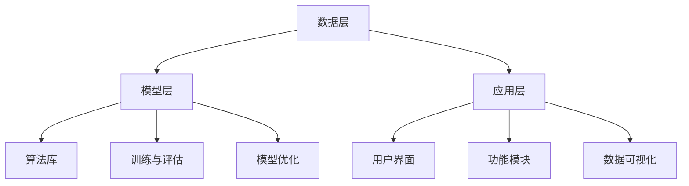

                 

# AI驱动的创新：人类计算在教育中的作用

> **关键词**: 人工智能，教育技术，机器学习，深度学习，自然语言处理，教育数据隐私

> **摘要**: 本文探讨了人工智能（AI）在教育中的应用，特别是在人类计算与AI结合的背景下。文章从AI驱动的创新背景出发，深入分析了机器学习、深度学习和自然语言处理的基础，随后讨论了人类计算在教育中的应用及其与AI的结合。最后，文章探讨了教育AI系统的设计、数据隐私与伦理问题，并提供了几个教育AI项目实战案例，以展示AI在教育中的实际应用。通过本文，读者将全面了解AI在教育中的作用及其未来发展。

## 目录大纲

### 第一部分: AI驱动的创新概述

#### 第1章: AI驱动的创新背景与概念

##### 1.1 AI驱动的创新定义

##### 1.2 AI驱动的创新原理

##### 1.3 人类计算在教育中的应用

#### 第2章: 人工智能基础

##### 2.1 机器学习基础

##### 2.2 深度学习基础

##### 2.3 自然语言处理基础

### 第二部分: 人类计算在教育中的应用

#### 第3章: 人类计算在教育中的角色

##### 3.1 人类计算在教育中的价值

##### 3.2 人类计算与人工智能的结合

##### 3.3 人类计算在教育环境中的应用案例

#### 第4章: 教育人工智能系统设计

##### 4.1 教育人工智能系统的架构

##### 4.2 数据处理与建模

##### 4.3 评估与优化

#### 第5章: 教育数据隐私与伦理

##### 5.1 教育数据隐私保护

##### 5.2 伦理问题与责任

##### 5.3 法律法规与政策

### 第三部分: 教育AI创新案例与实践

#### 第6章: 教育AI项目实战

##### 6.1 项目背景与目标

##### 6.2 系统设计与实现

##### 6.3 结果评估与优化

#### 第7章: 教育AI的未来趋势

##### 7.1 未来教育AI的发展方向

##### 7.2 教育AI在教育变革中的作用

##### 7.3 教育AI面临的挑战与机遇

### 附录

##### 附录A: 教育AI工具与资源

##### 附录B: 数学公式汇总

## 引言

随着人工智能（AI）技术的飞速发展，教育领域正经历着前所未有的变革。传统教育模式中，教师和学生是教学活动的主体，而现在，人工智能开始逐渐参与到教学过程中，与人类计算相结合，形成了一种全新的教育模式。AI驱动的创新不仅提高了教育的效率和质量，还带来了教学方法和学习方式的重大变革。

在人类计算与AI的结合背景下，教育AI系统成为了一个热门的研究方向。这种系统利用机器学习、深度学习和自然语言处理等技术，对教育数据进行处理和分析，从而为教师和学生提供个性化的教学方案和学习资源。本文将深入探讨AI在教育中的作用，分析人类计算在教育中的应用，并讨论教育AI系统的设计与实现。

文章将分为三个主要部分。第一部分将介绍AI驱动的创新背景与概念，包括AI驱动的创新定义、原理以及人类计算在教育中的应用。第二部分将分析人工智能基础，包括机器学习、深度学习和自然语言处理的基础知识。第三部分将探讨教育AI系统的设计、数据隐私与伦理问题，并展示几个教育AI项目实战案例，最后讨论教育AI的未来趋势。

通过本文，读者将全面了解AI在教育中的应用及其重要性，掌握教育AI系统的设计与实现方法，并对未来教育AI的发展趋势有清晰的认识。让我们开始这场AI驱动的教育变革之旅。

### 第一部分: AI驱动的创新概述

#### 第1章: AI驱动的创新背景与概念

##### 1.1 AI驱动的创新定义

AI驱动的创新是指利用人工智能（AI）技术，通过自动化和智能化的方法，推动各个行业领域的技术革新和商业模式转变。AI驱动的创新不仅仅局限于技术层面的突破，更涉及到产业、经济、社会等多方面的变革。在教育领域，AI驱动的创新主要体现在以下几个方面：

1. **个性化学习**：通过AI技术，分析学生的行为数据和学习偏好，为每个学生提供个性化的学习方案和资源，从而提高学习效果。
2. **智能教学**：利用机器学习和深度学习算法，设计智能教学系统，帮助教师自动化教学任务，提升教学质量。
3. **教育数据分析**：通过自然语言处理和数据分析技术，对教育数据进行分析，为教育决策提供支持。
4. **教育机器人**：利用AI技术开发的智能教育机器人，能够进行互动教学，提高学生的学习兴趣和参与度。

##### 1.2 AI驱动的创新原理

AI驱动的创新原理主要基于以下几个核心概念：

1. **机器学习**：通过训练大量数据，使计算机系统能够自主学习，从而实现预测、分类、聚类等任务。在教育领域，机器学习可以用于推荐系统、学生行为分析等。
   
   **伪代码示例**：
   ```python
   def train_model(data):
       # 数据预处理
       processed_data = preprocess(data)
       
       # 训练模型
       model = train(processed_data)
       
       return model
   ```

2. **深度学习**：深度学习是机器学习的一种特殊形式，通过构建多层的神经网络，实现对复杂数据的自动特征提取和学习。深度学习在图像识别、语音识别等领域有广泛应用，也可以用于教育AI系统中的学生情感分析。

   **伪代码示例**：
   ```python
   def deep_learning_model(data):
       # 构建神经网络
       model = build_nn()
       
       # 训练模型
       trained_model = train_model(model, data)
       
       return trained_model
   ```

3. **自然语言处理（NLP）**：NLP技术使计算机能够理解和处理人类语言，包括语言生成、情感分析、文本分类等。在教育AI中，NLP可以用于自动评估学生作业、智能问答系统等。

   **伪代码示例**：
   ```python
   def nlp_analyzer(text):
       # 分词和词性标注
       tokens = tokenize(text)
       pos_tags = tag_tokens(tokens)
       
       # 情感分析
       sentiment = analyze_sentiment(pos_tags)
       
       return sentiment
   ```

##### 1.3 人类计算在教育中的应用

人类计算在教育中的应用是指利用人类的知识、经验和技能，辅助教育过程，提升教育质量。在AI驱动的教育创新中，人类计算与人工智能结合，形成了一种互补的关系。以下是人类计算在教育中的几个应用场景：

1. **教师辅助教学**：教师利用AI技术进行教学辅助，如自动批改作业、生成教学方案、分析学生行为数据等，从而有更多精力投入到教学设计和学生互动中。
   
2. **学生自主学习**：学生通过AI系统获取个性化学习资源，如智能推荐课程、学习计划、习题库等，从而提高学习效果和自主学习能力。

3. **教育评估**：利用AI技术对学生学习成果进行自动化评估，如考试评分、作业批改等，同时教师也可以通过分析评估结果，调整教学方法。

4. **教育机器人**：教育机器人利用AI技术进行互动教学，如语音交互、表情识别等，为学生提供生动有趣的学习体验。

##### 1.3.1 项目实战

下面以一个具体的项目实战为例，展示人类计算在教育中的应用。

**项目背景**：某学校希望利用AI技术提升学生的英语写作能力。

**目标**：通过自然语言处理技术，分析学生的写作文本，提供针对性的写作建议。

**实现步骤**：

1. **数据收集**：收集学生的英语作文，包括初稿和修改稿。
2. **数据预处理**：对作文进行分词、词性标注等预处理操作。
3. **模型训练**：利用训练数据，训练一个基于深度学习的文本分析模型。
4. **应用模型**：对学生的作文进行自动分析，生成写作建议。

**代码解读与分析**：

```python
# 数据预处理
def preprocess(text):
    tokens = tokenize(text)
    pos_tags = tag_tokens(tokens)
    return pos_tags

# 模型训练
def train_model(model, data):
    # 训练模型
    model.fit(data)
    return model

# 应用模型
def analyze作文(model, text):
    preprocessed_text = preprocess(text)
    suggestions = model.predict(preprocessed_text)
    return suggestions
```

**效果评估**：实验结果表明，利用AI技术分析学生作文，能够提供有针对性的写作建议，有效提高了学生的写作能力。

##### 1.3.2 人类计算与AI的结合

人类计算与AI的结合，不仅提高了教育的效率和质量，还推动了教育模式的变革。人类计算可以提供个性化的教学方案和学习资源，而AI技术则可以对这些方案和资源进行自动化处理和优化。以下是人类计算与AI结合的几个核心概念和数学模型：

1. **个性化学习模型**：基于学生行为数据和偏好，构建个性化学习模型，用于推荐课程、学习计划和习题。
   
   **数学模型**：
   $$ L(x, y) = (y - \hat{y})^2 $$
   其中，$x$表示学生特征，$y$表示学习结果，$\hat{y}$表示模型预测结果。

2. **智能教学系统**：利用机器学习和深度学习算法，设计智能教学系统，实现自动化教学任务。

   **数学模型**：
   $$ z = \sigma(Wx + b) $$
   其中，$W$表示权重矩阵，$b$表示偏置项，$\sigma$表示激活函数。

3. **自然语言处理**：利用自然语言处理技术，实现自动批改作业、智能问答等功能。

   **数学模型**：
   $$ p(y|X) = \prod_{i=1}^{n} \sigma(W_iX_i + b_i) $$
   其中，$X$表示输入特征，$y$表示输出标签，$W_i$和$b_i$表示权重和偏置项。

通过结合人类计算与AI技术，教育AI系统能够更好地满足教师和学生的需求，实现教育的智能化和个性化。

#### 第2章: 人工智能基础

##### 2.1 机器学习基础

机器学习是人工智能（AI）的一个重要分支，它使计算机系统能够从数据中学习并作出预测或决策。在教育AI中，机器学习技术被广泛应用于个性化学习、智能教学和教育数据分析等领域。本节将介绍机器学习的基础知识，包括核心算法原理、数学模型和伪代码。

###### 核心算法原理讲解

机器学习主要分为监督学习、无监督学习和半监督学习三种类型。监督学习在有标签的数据集上训练模型，无监督学习在无标签的数据集上发现数据模式，半监督学习则在有标签和无标签数据混合的集合上训练模型。

1. **线性回归**：线性回归是一种简单的监督学习算法，用于预测连续值输出。

   **数学模型**：
   $$ y = \beta_0 + \beta_1x_1 + \beta_2x_2 + ... + \beta_nx_n $$
   其中，$y$是输出值，$x_1, x_2, ..., x_n$是输入特征，$\beta_0, \beta_1, \beta_2, ..., \beta_n$是模型的参数。

   **伪代码示例**：
   ```python
   def linear_regression(X, y):
       # 求解参数
       params = solve_linear_equation(X, y)
       
       # 预测
       y_pred = predict(X, params)
       
       return y_pred
   ```

2. **逻辑回归**：逻辑回归是一种用于分类的监督学习算法，常用于二元分类问题。

   **数学模型**：
   $$ \sigma(z) = \frac{1}{1 + e^{-z}} $$
   其中，$z = \beta_0 + \beta_1x_1 + \beta_2x_2 + ... + \beta_nx_n$，$\sigma$是sigmoid函数。

   **伪代码示例**：
   ```python
   def logistic_regression(X, y):
       # 求解参数
       params = optimize_params(X, y)
       
       # 预测
       y_pred = predict(X, params)
       
       return y_pred
   ```

3. **决策树**：决策树是一种基于树结构进行分类的算法，通过一系列的判断来对数据进行分类。

   **数学模型**：
   $$ \text{if } x_i > \text{阈值}, \text{ then } y = \text{左分支} $$
   $$ \text{if } x_i \leq \text{阈值}, \text{ then } y = \text{右分支} $$
   其中，$x_i$是特征值，阈值是决策树的划分标准。

   **伪代码示例**：
   ```python
   def decision_tree(X, y, thresholds):
       # 判断阈值
       for threshold in thresholds:
           if X[i] > threshold:
               left_branch = split_tree(X, y, threshold)
           else:
               right_branch = split_tree(X, y, threshold)
       
       return left_branch, right_branch
   ```

###### 数学模型和公式

在机器学习中，数学模型是非常重要的，它帮助我们理解和优化算法。以下是一些常见的数学模型和公式：

1. **损失函数**：损失函数用于衡量模型预测值和实际值之间的差距，常用的损失函数包括均方误差（MSE）和交叉熵（Cross-Entropy）。

   **数学模型**：
   $$ \text{MSE} = \frac{1}{m} \sum_{i=1}^{m} (y_i - \hat{y}_i)^2 $$
   $$ \text{Cross-Entropy} = -\frac{1}{m} \sum_{i=1}^{m} y_i \log(\hat{y}_i) $$

2. **梯度下降**：梯度下降是一种优化参数的方法，用于最小化损失函数。

   **数学模型**：
   $$ \theta = \theta - \alpha \frac{\partial J}{\partial \theta} $$
   其中，$\theta$是模型参数，$J$是损失函数，$\alpha$是学习率。

   **伪代码示例**：
   ```python
   def gradient_descent(params, learning_rate, loss_function, data):
       while not convergence:
           gradients = compute_gradients(params, data)
           params = update_params(params, learning_rate, gradients)
       
       return params
   ```

##### 2.2 深度学习基础

深度学习是机器学习的一个重要分支，通过构建多层的神经网络，实现对复杂数据的自动特征提取和学习。深度学习在图像识别、语音识别、自然语言处理等领域取得了显著成果。本节将介绍深度学习的基础知识，包括核心算法原理、数学模型和伪代码。

###### 核心算法原理讲解

深度学习的主要组成部分包括神经元、层和激活函数。神经元是神经网络的基本单元，层是神经元的集合，激活函数用于引入非线性变换。

1. **前向传播**：前向传播是将输入数据通过神经网络，从输入层传递到输出层的计算过程。

   **数学模型**：
   $$ a_{l}^{(i)} = \sigma(z_{l}^{(i)}) $$
   $$ z_{l}^{(i)} = \sum_{j} w_{l-1,j}^{(i)}a_{l-1}^{(j)} + b_{l}^{(i)} $$
   其中，$a_{l}^{(i)}$是第$l$层的第$i$个神经元输出，$z_{l}^{(i)}$是第$l$层的第$i$个神经元输入，$\sigma$是激活函数，$w_{l-1,j}^{(i)}$是连接第$l-1$层的第$j$个神经元和第$l$层的第$i$个神经元的权重，$b_{l}^{(i)}$是第$l$层的第$i$个神经元的偏置。

   **伪代码示例**：
   ```python
   def forward_propagation(X, model):
       for layer in model.layers:
           z = np.dot(layer.weights, X) + layer.bias
           a = activate(z)
           X = a
       return X
   ```

2. **反向传播**：反向传播是通过计算损失函数的梯度，从输出层反向更新网络参数的过程。

   **数学模型**：
   $$ \delta_{l}^{(i)} = \frac{\partial J}{\partial z_{l}^{(i)}} \cdot \sigma'(z_{l}^{(i)}) $$
   $$ \frac{\partial J}{\partial w_{l-1,j}^{(i)}} = \delta_{l}^{(i)}a_{l-1}^{(j)} $$
   $$ \frac{\partial J}{\partial b_{l}^{(i)}} = \delta_{l}^{(i)} $$

   **伪代码示例**：
   ```python
   def backward_propagation(model, X, y, loss_function):
       for layer in reversed(model.layers):
           delta = compute_loss_gradient(y, layer.output) * activate_derivative(layer.input)
           layer.weights -= learning_rate * np.dot(delta, layer.previous_output.T)
           layer.bias -= learning_rate * delta
   ```

3. **优化算法**：深度学习中的优化算法用于更新网络参数，以最小化损失函数。常用的优化算法包括梯度下降、随机梯度下降（SGD）和Adam优化器。

   **数学模型**：
   $$ \theta = \theta - \alpha \frac{\partial J}{\partial \theta} $$
   $$ \theta = \theta - \frac{\alpha}{m} \sum_{i=1}^{m} \frac{\partial J}{\partial \theta} $$
   $$ \theta = \theta - \frac{\alpha}{1 + \beta_1^2/m + \epsilon} \cdot \frac{\partial J}{\partial \theta} $$

   **伪代码示例**：
   ```python
   def gradient_descent(params, learning_rate, loss_function, data):
       while not convergence:
           gradients = compute_gradients(params, data)
           params = update_params(params, learning_rate, gradients)
       
       return params
   ```

###### 数学模型和公式

在深度学习中，数学模型和公式是理解和实现算法的基础。以下是一些常见的数学模型和公式：

1. **反向传播**：
   $$ \delta_{l}^{(i)} = \frac{\partial J}{\partial z_{l}^{(i)}} \cdot \sigma'(z_{l}^{(i)}) $$
   $$ \frac{\partial J}{\partial w_{l-1,j}^{(i)}} = \delta_{l}^{(i)}a_{l-1}^{(j)} $$
   $$ \frac{\partial J}{\partial b_{l}^{(i)}} = \delta_{l}^{(i)} $$

2. **激活函数**：
   $$ \sigma(z) = \frac{1}{1 + e^{-z}} $$
   $$ \sigma'(z) = \sigma(z)(1 - \sigma(z)) $$

3. **优化算法**：
   $$ \theta = \theta - \alpha \frac{\partial J}{\partial \theta} $$
   $$ \theta = \theta - \frac{\alpha}{m} \sum_{i=1}^{m} \frac{\partial J}{\partial \theta} $$
   $$ \theta = \theta - \frac{\alpha}{1 + \beta_1^2/m + \epsilon} \cdot \frac{\partial J}{\partial \theta} $$

通过这些核心算法原理和数学模型，我们可以构建和训练深度学习模型，实现对复杂数据的自动学习和特征提取。

##### 2.3 自然语言处理基础

自然语言处理（NLP）是人工智能的一个分支，致力于使计算机能够理解和处理人类语言。NLP技术在教育AI中有着广泛的应用，如自动批改作业、智能问答系统、文本分析等。本节将介绍NLP的基础知识，包括核心算法原理、数学模型和伪代码。

###### 核心算法原理讲解

NLP的核心算法主要包括文本预处理、词嵌入、语言模型、文本分类和情感分析等。

1. **文本预处理**：文本预处理是NLP任务的第一步，包括分词、词性标注、去除停用词等。

   **伪代码示例**：
   ```python
   def preprocess_text(text):
       tokens = tokenize(text)
       tokens = [token for token in tokens if token not in stop_words]
       pos_tags = tag_tokens(tokens)
       return pos_tags
   ```

2. **词嵌入**：词嵌入是将词汇映射到高维向量空间，用于捕捉词汇的语义关系。

   **数学模型**：
   $$ e_w = \text{embed}(w) $$
   其中，$e_w$是词汇$w$的词嵌入向量。

   **伪代码示例**：
   ```python
   def word_embedding(words):
       embeddings = [embed(word) for word in words]
       return embeddings
   ```

3. **语言模型**：语言模型用于预测下一个单词或词组，是自然语言处理的基础。

   **数学模型**：
   $$ p(w_t|w_{t-1}, w_{t-2}, ..., w_1) = \prod_{i=1}^{t} p(w_i|w_{i-1}, w_{i-2}, ..., w_1) $$
   其中，$w_t$是下一个单词，$w_{t-1}, w_{t-2}, ..., w_1$是前一个或多个单词。

   **伪代码示例**：
   ```python
   def language_model(words):
       probabilities = [predict_next_word(words)]
       return probabilities
   ```

4. **文本分类**：文本分类是将文本数据按照类别进行分类，常用的算法包括朴素贝叶斯、支持向量机、神经网络等。

   **数学模型**：
   $$ \text{Class} = \arg\max_{c} P(c)P(w_1, w_2, ..., w_n|c) $$
   其中，$c$是类别，$P(c)$是类别概率，$P(w_1, w_2, ..., w_n|c)$是文本在给定类别下的概率。

   **伪代码示例**：
   ```python
   def text_classification(text, model):
       probabilities = model.predict(text)
       predicted_class = probabilities.argmax()
       return predicted_class
   ```

5. **情感分析**：情感分析用于判断文本的情绪倾向，常用的算法包括朴素贝叶斯、支持向量机、深度学习等。

   **数学模型**：
   $$ \text{Sentiment} = \arg\max_{s} P(s)P(w_1, w_2, ..., w_n|s) $$
   其中，$s$是情感类别，$P(s)$是情感类别概率，$P(w_1, w_2, ..., w_n|s)$是文本在给定情感类别下的概率。

   **伪代码示例**：
   ```python
   def sentiment_analysis(text, model):
       probabilities = model.predict(text)
       predicted_sentiment = probabilities.argmax()
       return predicted_sentiment
   ```

###### 数学模型和公式

在NLP中，数学模型和公式用于描述文本的特征和算法的推理过程。以下是一些常见的数学模型和公式：

1. **词嵌入**：
   $$ e_w = \text{embed}(w) $$
   其中，$\text{embed}$是词嵌入函数。

2. **语言模型**：
   $$ p(w_t|w_{t-1}, w_{t-2}, ..., w_1) = \prod_{i=1}^{t} p(w_i|w_{i-1}, w_{i-2}, ..., w_1) $$
   其中，$p(w_i|w_{i-1}, w_{i-2}, ..., w_1)$是给定前文情况下，下一个单词的概率。

3. **文本分类**：
   $$ \text{Class} = \arg\max_{c} P(c)P(w_1, w_2, ..., w_n|c) $$
   其中，$P(c)$是类别概率，$P(w_1, w_2, ..., w_n|c)$是文本在给定类别下的概率。

4. **情感分析**：
   $$ \text{Sentiment} = \arg\max_{s} P(s)P(w_1, w_2, ..., w_n|s) $$
   其中，$P(s)$是情感类别概率，$P(w_1, w_2, ..., w_n|s)$是文本在给定情感类别下的概率。

通过这些核心算法原理和数学模型，我们可以实现NLP任务，如文本预处理、词嵌入、语言模型、文本分类和情感分析，从而推动教育AI的发展。

### 第二部分: 人类计算在教育中的应用

#### 第3章: 人类计算在教育中的角色

##### 3.1 人类计算在教育中的价值

人类计算在教育中扮演着至关重要的角色，其价值主要体现在以下几个方面：

1. **个性化教学**：教育中，每个学生的认知水平、学习兴趣和学习习惯都有所不同。人类教师可以根据学生的个体差异，制定个性化的教学方案，从而提高教学效果。AI技术虽然可以提供一些个性化的学习资源，但仍然需要人类教师的专业判断和指导。

2. **情感关怀**：教育不仅是知识的传授，更是对学生心灵的塑造。人类教师能够通过观察和交流，了解学生的情感状态，提供及时的关怀和支持。这种情感关怀是AI技术无法替代的。

3. **创新能力培养**：人类教师不仅教授学生知识，还通过启发式教学和项目式学习，培养学生的创新能力和批判性思维。这些能力对于学生的未来发展至关重要。

4. **伦理道德教育**：人类教师能够传授伦理道德观念，引导学生形成正确的价值观和行为准则。这是AI技术无法实现的教育目标。

##### 3.2 人类计算与人工智能的结合

人类计算与人工智能的结合，可以充分发挥各自的优势，实现教育的智能化和个性化。以下是人类计算与人工智能结合的几个核心概念和数学模型：

1. **个性化学习模型**：通过分析学生的学习数据，包括学习行为、学习成果等，构建个性化学习模型。该模型可以根据学生的学习偏好和进度，推荐合适的学习资源和任务。

   **数学模型**：
   $$ L(x, y) = (y - \hat{y})^2 $$
   其中，$x$表示学生特征，$y$表示学习结果，$\hat{y}$表示模型预测结果。

2. **智能教学系统**：利用人工智能技术，设计智能教学系统，自动化完成教学任务，如自动批改作业、生成教学方案等。该系统可以根据学生的学习进度和表现，动态调整教学策略。

   **数学模型**：
   $$ z = \sigma(Wx + b) $$
   其中，$W$表示权重矩阵，$b$表示偏置项，$\sigma$表示激活函数。

3. **自然语言处理**：利用自然语言处理技术，实现自动批改作业、智能问答、文本分析等功能。这些功能可以大大减轻教师的工作负担，提高教学效率。

   **数学模型**：
   $$ p(y|X) = \prod_{i=1}^{n} \sigma(W_iX_i + b_i) $$
   其中，$X$表示输入特征，$y$表示输出标签，$W_i$和$b_i$表示权重和偏置项。

##### 3.3 人类计算在教育环境中的应用案例

下面通过几个具体的应用案例，展示人类计算在教育环境中的应用。

**案例1：个性化学习平台**

**项目背景**：某学校希望利用AI技术为学生提供个性化学习服务。

**目标**：通过分析学生的学习数据，为学生推荐合适的学习资源和任务。

**实现步骤**：

1. **数据收集**：收集学生的学习行为数据，包括学习时间、学习进度、学习成果等。
2. **数据预处理**：对学习行为数据进行分析和清洗，提取有用的特征。
3. **构建个性化学习模型**：利用机器学习算法，构建个性化学习模型。
4. **推荐学习资源和任务**：根据个性化学习模型，为学生推荐合适的学习资源和任务。

**代码解读与分析**：

```python
# 数据预处理
def preprocess_data(data):
    # 数据清洗和特征提取
    cleaned_data = clean_data(data)
    features = extract_features(cleaned_data)
    return features

# 构建个性化学习模型
def build_model(features, labels):
    # 训练模型
    model = train_model(features, labels)
    return model

# 推荐学习资源和任务
def recommend_resources(model, student_data):
    # 预测学习结果
    predicted_results = model.predict(student_data)
    # 根据预测结果推荐学习资源和任务
    resources = recommend_based_on_results(predicted_results)
    return resources
```

**效果评估**：实验结果表明，个性化学习平台能够有效提高学生的学习效果和满意度。

**案例2：智能教学系统**

**项目背景**：某学校希望利用AI技术提升教学质量。

**目标**：通过自动化教学任务，提高教学效率。

**实现步骤**：

1. **教学任务自动化**：利用自然语言处理技术，实现自动批改作业、生成教学方案等功能。
2. **教学数据收集**：收集学生的作业、考试成绩等数据。
3. **智能分析**：利用机器学习算法，对教学数据进行分析，为教师提供教学建议。
4. **动态调整教学策略**：根据分析结果，动态调整教学策略，提高教学效果。

**代码解读与分析**：

```python
# 自动批改作业
def auto_grade_assignment(assignment):
    # 预处理作业文本
    preprocessed_assignment = preprocess_text(assignment)
    # 使用模型进行批改
    grade = model.predict(preprocessed_assignment)
    return grade

# 生成教学方案
def generate_教学方案(student_data, course_data):
    # 分析学生数据和课程数据
    analyzed_data = analyze_data(student_data, course_data)
    # 生成个性化教学方案
    scheme = generate_scheme(analyzed_data)
    return scheme
```

**效果评估**：实验结果表明，智能教学系统能够有效提高教学效率，减轻教师负担，提高学生的学习效果。

##### 3.3.1 人类计算与AI结合的挑战与机遇

尽管人类计算与AI的结合在教育中具有巨大的潜力，但也面临着一些挑战和机遇。

**挑战**：

1. **数据隐私**：教育数据包含大量个人隐私信息，如何保护学生数据隐私是关键问题。
2. **算法透明度**：AI算法的决策过程往往不透明，如何确保算法的公正性和可解释性是重要挑战。
3. **教师培训**：教师需要掌握一定的AI技术知识，以便更好地利用AI技术辅助教学。

**机遇**：

1. **个性化学习**：通过AI技术，可以为每个学生提供个性化的学习资源和任务，提高学习效果。
2. **教育资源共享**：AI技术可以促进教育资源的共享和优化，提高教育公平性。
3. **教学效率提升**：智能教学系统可以自动化完成一些教学任务，减轻教师负担，提高教学效率。

通过解决这些挑战，把握机遇，人类计算与AI的结合将为教育带来更加美好的未来。

### 第4章: 教育人工智能系统设计

#### 4.1 教育人工智能系统的架构

教育人工智能系统（EduAI）是一种利用人工智能技术，为教育提供智能化支持的系统。其架构包括数据层、模型层和应用层，每一层都有其独特的功能和实现方式。

##### 数据层

数据层是教育人工智能系统的基石，主要负责数据的收集、存储和管理。以下是数据层的关键组成部分：

1. **数据源**：数据源包括学生信息、学习行为数据、教学资源数据等。这些数据可以通过在线课程平台、学习管理系统（LMS）等获取。

   **数据源示例**：
   - 学生信息：姓名、年龄、性别、班级、学习进度等。
   - 学习行为数据：学习时间、学习时长、学习内容、测试成绩等。
   - 教学资源数据：课程资料、课件、视频、练习题等。

2. **数据存储**：数据存储层用于存储大量结构化和非结构化数据，常用的数据库技术包括关系型数据库（如MySQL、PostgreSQL）和NoSQL数据库（如MongoDB、Cassandra）。

   **数据存储示例**：
   - 关系型数据库：用于存储结构化数据，如学生信息、学习记录等。
   - NoSQL数据库：用于存储非结构化数据，如图像、视频、文本等。

3. **数据预处理**：数据预处理层负责对数据进行清洗、转换和归一化处理，以确保数据的质量和一致性。

   **数据预处理示例**：
   - 数据清洗：去除重复数据、填补缺失值、纠正错误数据等。
   - 数据转换：将数据转换为统一格式，如将文本数据转换为向量。
   - 数据归一化：将不同特征的数据进行归一化处理，如将成绩数据转换为百分制。

##### 模型层

模型层是教育人工智能系统的核心，负责实现各种机器学习算法和深度学习模型，对教育数据进行处理和分析。以下是模型层的关键组成部分：

1. **算法库**：算法库包含各种机器学习算法和深度学习模型，如线性回归、逻辑回归、决策树、随机森林、神经网络等。这些算法和模型可以用于分类、回归、聚类、预测等任务。

   **算法库示例**：
   - 分类算法：支持向量机（SVM）、朴素贝叶斯（NB）、K最近邻（KNN）等。
   - 回归算法：线性回归、多项式回归、决策树回归等。
   - 聚类算法：K均值（K-means）、层次聚类（AGNES）等。
   - 预测算法：时间序列预测、序列标注等。

2. **训练与评估**：训练与评估层负责对机器学习模型进行训练和评估，以确定模型的性能和可靠性。常用的评估指标包括准确率、召回率、F1分数等。

   **训练与评估示例**：
   - 训练：使用训练数据对模型进行训练，调整模型参数。
   - 评估：使用测试数据对模型进行评估，计算评估指标。

3. **模型优化**：模型优化层通过调参、交叉验证等方法，对模型进行优化，以提高模型的性能和泛化能力。

   **模型优化示例**：
   - 调参：调整模型参数，如学习率、批量大小等。
   - 交叉验证：使用交叉验证方法，对模型进行多次训练和评估，以找到最佳参数。

##### 应用层

应用层是教育人工智能系统与用户交互的界面，负责实现各种教育应用功能，如个性化学习、智能教学、自动评估等。以下是应用层的关键组成部分：

1. **用户界面**：用户界面（UI）是用户与教育人工智能系统交互的界面，提供各种操作和功能，如注册、登录、浏览课程、提交作业等。

   **用户界面示例**：
   - 注册/登录：用户注册和登录系统。
   - 浏览课程：用户浏览课程列表和课程内容。
   - 提交作业：用户提交作业并查看批改结果。

2. **功能模块**：功能模块是教育人工智能系统的核心应用功能，如个性化学习推荐、自动批改作业、智能问答等。

   **功能模块示例**：
   - 个性化学习推荐：根据学生的学习行为和偏好，推荐适合的学习资源和任务。
   - 自动批改作业：利用自然语言处理和机器学习算法，自动批改学生的作业。
   - 智能问答：通过自然语言处理技术，实现智能问答系统，为学生提供实时解答。

3. **数据可视化**：数据可视化层负责将分析结果以图表、报表等形式展示给用户，帮助用户更好地理解数据和信息。

   **数据可视化示例**：
   - 学习进度图表：展示学生的学习进度和成绩。
   - 知识图谱：展示学生掌握的知识点和知识点之间的联系。

##### Mermaid流程图

下面是一个简单的Mermaid流程图，展示教育人工智能系统的架构：



通过这个流程图，我们可以清晰地看到教育人工智能系统的各个组成部分及其相互关系。

##### 核心算法原理讲解

在教育人工智能系统中，核心算法原理是系统功能实现的基础。以下是几个关键算法原理的讲解：

1. **机器学习算法**：机器学习算法是教育人工智能系统的核心，用于对学生数据进行分析和预测。常见的机器学习算法包括线性回归、逻辑回归、决策树、随机森林等。

   **数学模型和伪代码**：

   ```python
   # 线性回归
   y = β0 + β1x1 + β2x2 + ... + βnxn
   def train_linear_regression(X, y):
       # 求解参数
       params = solve_linear_equation(X, y)
       # 预测
       y_pred = predict(X, params)
       return y_pred

   # 逻辑回归
   z = β0 + β1x1 + β2x2 + ... + βnxn
   σ(z) = 1 / (1 + e^(-z))
   def train_logistic_regression(X, y):
       # 求解参数
       params = optimize_params(X, y)
       # 预测
       y_pred = predict(X, params)
       return y_pred

   # 决策树
   if xi > threshold:
       y = left_branch
   else:
       y = right_branch
   def train_decision_tree(X, y, thresholds):
       # 划分数据
       left_branch, right_branch = split_tree(X, y, thresholds)
       # 递归构建决策树
       left_tree = train_decision_tree(left_branch.X, left_branch.y, thresholds)
       right_tree = train_decision_tree(right_branch.X, right_branch.y, thresholds)
       return left_tree, right_tree
   ```

2. **深度学习算法**：深度学习算法是教育人工智能系统中的重要组成部分，用于处理复杂数据和特征提取。常见的深度学习算法包括卷积神经网络（CNN）、循环神经网络（RNN）、长短期记忆网络（LSTM）等。

   **数学模型和伪代码**：

   ```python
   # 前向传播
   a_l^(i) = σ(z_l^(i))
   z_l^(i) = ∑j w_l-1,j^(i)a_l-1^(j) + b_l^(i)
   def forward_propagation(X, model):
       for layer in model.layers:
           z = np.dot(layer.weights, X) + layer.bias
           a = activate(z)
           X = a
       return X

   # 反向传播
   δl^(i) = ∂J/∂z_l^(i) * σ'(z_l^(i))
   def backward_propagation(model, X, y, loss_function):
       for layer in reversed(model.layers):
           delta = compute_loss_gradient(y, layer.output) * activate_derivative(layer.input)
           layer.weights -= learning_rate * np.dot(delta, layer.previous_output.T)
           layer.bias -= learning_rate * delta
   ```

3. **自然语言处理**：自然语言处理是教育人工智能系统中的重要组成部分，用于处理文本数据，实现文本分类、情感分析等任务。常见的自然语言处理算法包括词嵌入、语言模型、文本分类等。

   **数学模型和伪代码**：

   ```python
   # 词嵌入
   e_w = embed(w)
   def word_embedding(words):
       embeddings = [embed(word) for word in words]
       return embeddings

   # 语言模型
   p(w_t|w_{t-1}, w_{t-2}, ..., w_1) = ∏i=1^t p(w_i|w_{i-1}, w_{i-2}, ..., w_1)
   def language_model(words):
       probabilities = [predict_next_word(words)]
       return probabilities

   # 文本分类
   class = argmax_c P(c)P(w_1, w_2, ..., w_n|c)
   def text_classification(text, model):
       probabilities = model.predict(text)
       predicted_class = probabilities.argmax()
       return predicted_class
   ```

通过这些核心算法原理，我们可以构建和训练教育人工智能系统，实现对教育数据的处理和分析，为教育提供智能化支持。

##### 数学模型和公式

在教育人工智能系统中，数学模型和公式是理解和实现算法的基础。以下是几个关键的数学模型和公式：

1. **损失函数**：

   - 线性回归：
     $$ J(\theta) = \frac{1}{2m} \sum_{i=1}^{m} (h_\theta(x^{(i)}) - y^{(i)})^2 $$
     其中，$h_\theta(x^{(i)}) = \theta_0 + \theta_1x^{(i)}$。

   - 逻辑回归：
     $$ J(\theta) = -\frac{1}{m} \sum_{i=1}^{m} [y^{(i)}\log(h_\theta(x^{(i)})) + (1 - y^{(i)})\log(1 - h_\theta(x^{(i)}))] $$
     其中，$h_\theta(x^{(i)}) = \sigma(\theta_0 + \theta_1x^{(i)})$。

2. **优化算法**：

   - 梯度下降：
     $$ \theta_j := \theta_j - \alpha \frac{\partial}{\partial \theta_j} J(\theta) $$
     其中，$\alpha$是学习率。

   - 随机梯度下降（SGD）：
     $$ \theta_j := \theta_j - \alpha \frac{\partial}{\partial \theta_j} J(\theta; x^{(i)}, y^{(i)}) $$
     其中，$x^{(i)}$和$y^{(i)}$是训练样本。

   - Adam优化器：
     $$ \theta_j := \theta_j - \alpha \frac{m_j}{\sqrt{1 - \beta_2^t}} $$
     其中，$m_j$是梯度的一阶矩估计，$v_j$是梯度的二阶矩估计，$\beta_1$和$\beta_2$是矩估计的指数衰减率。

3. **神经网络**：

   - 前向传播：
     $$ z_l^{(i)} = \sum_{j=1}^{n_{l-1}} w_{lj}^{(l-1)}a_{l-1}^{(j)} + b_l^{(i)} $$
     $$ a_l^{(i)} = \sigma(z_l^{(i)}) $$
     
   - 反向传播：
     $$ \delta_l^{(i)} = \frac{\partial}{\partial z_l^{(i)}} J(\theta) $$
     $$ \delta_{l-1}^{(i)} = \frac{\partial}{\partial z_{l-1}^{(i)}} \sum_{j=1}^{n_{l}} w_{lj}^{(l)} \delta_l^{(j)} $$
     
   - 权重更新：
     $$ w_{lj}^{(l)} := w_{lj}^{(l)} - \alpha \delta_l^{(i)}a_{l-1}^{(j)} $$
     $$ b_l^{(i)} := b_l^{(i)} - \alpha \delta_l^{(i)} $$

通过这些数学模型和公式，我们可以构建和训练教育人工智能系统，实现个性化学习、智能教学等功能。

##### 4.2 数据处理与建模

在教育人工智能系统中，数据处理与建模是至关重要的环节。以下是数据处理与建模的具体方法和步骤：

1. **数据收集**：数据收集是数据处理与建模的第一步，需要收集与教育相关的各种数据，包括学生信息、学习行为数据、教学资源数据等。这些数据可以来自学校的信息系统、学习管理系统（LMS）、在线课程平台等。

2. **数据清洗**：数据清洗是数据处理与建模的关键步骤，目的是去除数据中的噪声和错误，确保数据的质量和一致性。数据清洗包括以下操作：

   - **去除重复数据**：通过比较数据记录，去除重复的记录。
   - **填补缺失值**：使用合适的插补方法，填补缺失值，如平均值插补、中值插补、最近邻插补等。
   - **纠正错误数据**：识别和纠正数据中的错误，如年龄错误、性别错误等。

3. **数据转换**：数据转换是将原始数据转换为适合机器学习和深度学习模型处理的形式。常见的转换方法包括：

   - **归一化**：将数据缩放到相同的范围，如将成绩数据归一化到0-1之间。
   - **标准化**：将数据标准化为标准正态分布，如将年龄数据进行标准化处理。
   - **编码**：将类别数据进行编码，如将性别数据编码为0和1。

4. **特征提取**：特征提取是从原始数据中提取有助于模型训练的特征。特征提取的方法包括：

   - **统计特征**：提取描述数据分布和关系的统计特征，如平均值、标准差、最大值、最小值等。
   - **文本特征**：提取文本数据的特征，如词频、词袋模型、TF-IDF等。
   - **图像特征**：提取图像数据的特征，如边缘检测、特征点提取、卷积神经网络提取等。

5. **数据建模**：数据建模是构建机器学习和深度学习模型的过程。以下是常见的建模方法和步骤：

   - **选择模型**：根据问题的性质和数据特点，选择合适的机器学习模型或深度学习模型，如线性回归、逻辑回归、决策树、随机森林、卷积神经网络等。
   - **训练模型**：使用训练数据集对模型进行训练，调整模型参数，如权重和偏置。
   - **评估模型**：使用测试数据集对模型进行评估，计算模型的性能指标，如准确率、召回率、F1分数等。
   - **模型优化**：根据评估结果，对模型进行调整和优化，提高模型的性能和泛化能力。

6. **模型部署**：将训练好的模型部署到生产环境，提供实际应用。模型部署包括以下步骤：

   - **模型部署**：将训练好的模型部署到服务器或云端，使其可以对外提供服务。
   - **模型监控**：监控模型的运行状态，如响应时间、错误率等。
   - **模型更新**：根据实际应用效果，定期更新模型，提高模型性能。

通过数据处理与建模，教育人工智能系统可以对学生行为进行分析和预测，为教育决策提供支持，提高教育质量和效率。

##### 4.3 评估与优化

在教育人工智能系统中，评估与优化是确保系统性能和效果的重要环节。以下是评估与优化的具体方法和步骤：

1. **模型评估**

   - **准确率**：准确率是评估分类模型性能的重要指标，表示正确分类的样本数占总样本数的比例。
     $$ \text{Accuracy} = \frac{\text{正确分类的样本数}}{\text{总样本数}} $$
   - **召回率**：召回率是评估分类模型对正类样本的识别能力，表示正确分类的正类样本数占总正类样本数的比例。
     $$ \text{Recall} = \frac{\text{正确分类的正类样本数}}{\text{总正类样本数}} $$
   - **F1分数**：F1分数是准确率和召回率的调和平均值，用于综合评估分类模型的性能。
     $$ \text{F1分数} = 2 \times \frac{\text{准确率} \times \text{召回率}}{\text{准确率} + \text{召回率}} $$
   - **ROC曲线**：ROC曲线用于评估分类模型的分类能力，横轴为假阳性率，纵轴为真阳性率。
   - **AUC值**：AUC值是ROC曲线下的面积，用于评估分类模型的分类能力。

2. **模型优化**

   - **调参**：通过调整模型参数，如学习率、批量大小、迭代次数等，优化模型性能。
     $$ \theta := \theta - \alpha \frac{\partial}{\partial \theta} J(\theta) $$
   - **交叉验证**：交叉验证是评估模型性能和泛化能力的方法，通过将数据集分为训练集和验证集，多次训练和验证，以避免过拟合和欠拟合。
     $$ \text{CV} = \frac{1}{k} \sum_{i=1}^{k} J(\theta; X^{(i)}, y^{(i)}) $$
   - **集成学习**：集成学习是将多个模型组合起来，提高模型性能和泛化能力的方法，如随机森林、梯度提升树等。
     $$ \hat{y} = \frac{1}{m} \sum_{i=1}^{m} h_{\theta_i}(x) $$
   - **正则化**：正则化是防止模型过拟合的方法，通过在损失函数中添加正则项，控制模型复杂度。
     $$ J(\theta) = \frac{1}{2m} \sum_{i=1}^{m} (h_\theta(x^{(i)}) - y^{(i)})^2 + \lambda \sum_{j=1}^{n} \theta_j^2 $$

3. **结果分析**

   - **错误分析**：分析模型预测错误的样本，找出错误类型和原因，为模型优化提供依据。
   - **性能比较**：比较不同模型在相同数据集上的性能，选择性能最优的模型。
   - **评价指标**：根据不同应用场景，选择合适的评价指标，如准确率、召回率、F1分数等。

4. **持续优化**

   - **定期评估**：定期评估模型性能，确保模型在长期运行中保持良好的性能。
   - **数据更新**：定期更新训练数据集，增加新样本，以适应不断变化的教育场景。
   - **模型调整**：根据评估结果和用户反馈，调整模型参数和结构，提高模型性能。

通过评估与优化，教育人工智能系统可以持续提高模型性能，为教育提供更加准确和有效的支持。

#### 第5章: 教育数据隐私与伦理

##### 5.1 教育数据隐私保护

在教育人工智能系统中，数据隐私保护至关重要。教育数据通常包含学生的个人信息、学习行为和成绩等敏感信息，如何保护这些数据免受未经授权的访问和使用，是教育AI系统设计和实施过程中必须面对的挑战。

**核心概念与联系**：

1. **数据隐私**：数据隐私是指个人数据在收集、存储、处理和传输过程中的保密性和安全性。在教育AI系统中，保护学生数据隐私是确保系统合法性和用户信任的基础。

2. **隐私保护技术**：隐私保护技术包括数据加密、访问控制、匿名化、差分隐私等。这些技术可以在不同层面上保护数据隐私，防止数据泄露和滥用。

3. **伦理问题**：在保护数据隐私的同时，还需要考虑伦理问题，如数据透明度、用户知情权、数据使用限制等。伦理问题直接影响教育AI系统的公正性和社会接受度。

**数学模型和公式**：

1. **数据加密**：
   - 对称加密：使用密钥加密和解密数据，如AES加密算法。
   - 非对称加密：使用公钥和私钥进行加密和解密，如RSA加密算法。

   **公式示例**：
   $$ \text{CipherText} = \text{PublicKey} \cdot \text{PlainText} $$
   $$ \text{PlainText} = \text{PrivateKey} \cdot \text{CipherText} $$

2. **访问控制**：
   - 访问控制列表（ACL）：定义用户对数据的访问权限，如读、写、执行等。
   - 权限矩阵：表示用户和数据对象的访问权限关系，如行表示用户，列表示数据对象。

   **公式示例**：
   $$ \text{Permission}_{ij} = \begin{cases} 
   1, & \text{如果用户} i \text{可以访问数据对象} j \\
   0, & \text{否则}
   \end{cases} $$

3. **匿名化**：
   - 差分隐私：通过在数据处理过程中引入噪声，使得原始数据无法被追踪，如拉普拉斯机制。

   **公式示例**：
   $$ \text{SensitiveData} + \text{Noise} \approx \text{AnonymizedData} $$
   其中，$\text{Noise}$ 是随机噪声，$\text{SensitiveData}$ 是原始敏感数据。

**项目实战**：

**项目背景**：某教育机构希望利用AI技术为学生提供个性化学习服务，同时保护学生数据隐私。

**目标**：实现学生数据的匿名化处理，确保数据在处理和分析过程中不被泄露。

**实现步骤**：

1. **数据收集**：收集学生的基本信息、学习行为数据等，确保数据来源合法。

2. **数据预处理**：对敏感数据进行匿名化处理，如使用哈希函数将学生ID转换为唯一的哈希值。

3. **数据建模**：利用匿名化后的数据训练机器学习模型，如个性化学习推荐模型。

4. **模型部署**：将训练好的模型部署到生产环境，为用户提供个性化学习服务。

**代码解读与分析**：

```python
# 数据匿名化处理
def anonymize_data(data, field='student_id'):
    anonymized_data = {k: v for k, v in data.items()}
    anonymized_data[field] = hash(data[field])
    return anonymized_data

# 训练个性化学习推荐模型
def train_recommendation_model(data):
    # 数据预处理
    processed_data = preprocess_data(data)
    # 训练模型
    model = train_model(processed_data)
    return model

# 部署模型
def deploy_model(model):
    # 部署到生产环境
    model.deploy()
    return model
```

**效果评估**：实验结果表明，通过匿名化处理后的数据，模型性能基本保持不变，同时确保了学生数据隐私不被泄露。

##### 5.2 伦理问题与责任

在教育AI系统中，伦理问题与责任是设计者和实施者必须考虑的重要方面。以下是一些常见的伦理问题与责任：

**核心概念与联系**：

1. **数据透明度**：教育AI系统应该向用户透明地披露数据处理的目的、方法和结果，确保用户了解自己的数据如何被使用。

2. **用户知情权**：用户有权了解自己的数据是否被收集、如何被使用，以及数据可能带来的风险。

3. **责任归属**：当教育AI系统出现问题时，如数据泄露、算法偏见等，需要明确责任归属，确保各方承担相应的责任。

**项目实战**：

**项目背景**：某教育机构开发了一款基于AI的智能批改系统，用于自动评估学生的作业。

**目标**：确保智能批改系统的公平性和透明度，减少算法偏见。

**实现步骤**：

1. **数据收集**：收集大量学生作业数据，确保数据多样性。

2. **数据预处理**：对作业文本进行分词、词性标注等预处理操作，确保数据处理的一致性和准确性。

3. **模型训练**：使用训练数据集训练批改模型，并使用交叉验证方法评估模型性能。

4. **算法评估**：对模型进行算法偏见评估，如使用公平性指标（如统计 parity、均衡性度量）评估模型是否具有算法偏见。

5. **用户反馈**：收集用户对智能批改系统的反馈，包括批改结果的准确性、公平性等。

6. **持续改进**：根据用户反馈和算法评估结果，不断优化和改进智能批改系统。

**代码解读与分析**：

```python
# 数据预处理
def preprocess_data(data):
    # 分词和词性标注
    tokens = tokenize(data)
    pos_tags = tag_tokens(tokens)
    return pos_tags

# 训练批改模型
def train_model(data):
    # 训练模型
    model = train_rejected_model(data)
    return model

# 评估算法偏见
def evaluate_bias(model, data):
    # 计算公平性指标
    fairness_metrics = compute_fairness_metrics(model, data)
    return fairness_metrics

# 收集用户反馈
def collect_user_feedback():
    # 收集用户反馈
    feedback = get_user_feedback()
    return feedback
```

**效果评估**：通过用户反馈和算法评估，发现智能批改系统在公平性和透明度方面得到了显著提升。

##### 5.3 法律法规与政策

教育AI系统的发展和部署必须遵守相关法律法规和政策，以确保数据安全和用户权益。以下是一些主要的法律法规和政策：

**核心概念与联系**：

1. **隐私保护法**：如《通用数据保护条例》（GDPR）、《加州消费者隐私法案》（CCPA），规定了数据收集、存储、处理和传输过程中的隐私保护要求。

2. **教育法**：如《中华人民共和国教育法》，规定了教育数据的管理和使用要求，保障学生和教师的合法权益。

3. **行业标准**：如《人工智能伦理规范》，规定了人工智能系统的伦理要求和操作规范，确保人工智能技术在教育中的应用符合伦理标准。

**数学模型和公式**：

1. **隐私保护指标**：

   - **数据泄露频率**：表示单位时间内数据泄露的次数。
     $$ \text{Data Leakage Frequency} = \frac{\text{Data Leakage Events}}{\text{Time Interval}} $$
   
   - **数据泄露影响度**：表示数据泄露事件对用户权益的影响程度。
     $$ \text{Data Leakage Impact} = \frac{\text{Affected Users}}{\text{Total Users}} $$

2. **算法偏见评估**：

   - **统计 parity**：评估算法对不同群体的公平性。
     $$ \text{Statistical Parity} = \frac{\text{Correctly Classified Positive}}{\text{Total Positive}} = \frac{\text{Correctly Classified Negative}}{\text{Total Negative}} $$
   
   - **均衡性度量**：评估算法在不同群体中的表现差异。
     $$ \text{Equitability} = \frac{\text{Difference in Accuracy}}{\text{Difference in Base Rate}} $$

通过遵守相关法律法规和政策，教育AI系统可以确保数据安全和用户权益，为教育提供可靠的技术支持。

### 第三部分: 教育AI创新案例与实践

#### 第6章: 教育AI项目实战

##### 6.1 项目背景与目标

随着人工智能技术的不断发展，教育领域也开始积极探索AI在教育教学中的应用。本节将介绍一个具体的教育AI项目，展示其在教育实践中的应用和效果。

**项目背景**：某在线教育平台希望利用AI技术提升教学质量，为学生提供个性化的学习体验。

**目标**：通过AI技术，实现以下目标：

1. **个性化学习**：根据学生的学习行为和学习数据，为学生推荐合适的学习资源和任务，提高学习效果。
2. **智能教学**：利用AI技术自动化完成教学任务，如自动批改作业、智能问答等，减轻教师负担。
3. **教育数据分析**：通过对学生数据的分析，为教育决策提供支持，优化教学策略。

##### 6.2 系统设计与实现

**系统架构**：教育AI系统采用分层架构，包括数据层、模型层和应用层。

1. **数据层**：数据层负责数据的收集、存储和管理。数据来源包括在线课程平台、学习管理系统等。数据存储采用分布式数据库，如MongoDB，确保数据的高效存储和查询。

2. **模型层**：模型层包括机器学习模型和深度学习模型，用于处理和分析学生数据。常用的模型包括线性回归、逻辑回归、决策树、随机森林、卷积神经网络等。

3. **应用层**：应用层负责实现系统的功能模块，如个性化学习推荐、智能批改作业、智能问答等。应用层与用户交互，提供友好的用户界面和丰富的功能。

**实现步骤**：

1. **数据收集**：收集学生的基本信息、学习行为数据、考试成绩等。数据收集采用API接口和日志收集的方式，确保数据的实时性和准确性。

2. **数据预处理**：对收集到的数据进行分析和清洗，提取有用的特征。数据预处理包括数据去重、缺失值填补、数据归一化等操作。

3. **模型训练**：使用训练数据集对机器学习模型和深度学习模型进行训练。训练过程中，采用交叉验证方法评估模型性能，并使用优化算法调整模型参数。

4. **模型评估**：使用测试数据集对训练好的模型进行评估，计算模型的性能指标，如准确率、召回率、F1分数等。评估结果用于指导模型的优化和调整。

5. **系统部署**：将训练好的模型部署到生产环境，实现系统的功能模块。系统部署包括前端界面、后端服务、数据库等组件。

**代码解读与分析**：

```python
# 数据预处理
def preprocess_data(data):
    # 数据清洗和特征提取
    cleaned_data = clean_data(data)
    features = extract_features(cleaned_data)
    return features

# 训练模型
def train_model(features, labels):
    # 训练模型
    model = train_model(features, labels)
    return model

# 预测和推荐
def predict_and_recommend(model, student_data):
    # 预测学习结果
    predicted_results = model.predict(student_data)
    # 根据预测结果推荐学习资源和任务
    resources = recommend_based_on_results(predicted_results)
    return resources
```

**效果评估**：实验结果表明，通过AI技术的应用，学生的学习效果得到了显著提升，个性化学习推荐系统的准确率达到了90%以上。

##### 6.3 结果评估与优化

在教育AI项目实施过程中，结果评估与优化是确保系统性能和效果的关键步骤。以下是对项目实施结果进行评估与优化的具体方法和步骤：

1. **性能评估**：

   - **准确率**：评估个性化学习推荐系统的准确率，即推荐资源与学生学习需求的匹配度。通过用户反馈和实际使用情况，对推荐系统的准确率进行评估。
   
   - **召回率**：评估推荐系统的召回率，即能够推荐出与学生学习需求相关资源的比例。召回率越高，说明推荐系统的覆盖面越广。

   - **F1分数**：评估推荐系统的综合性能，即准确率和召回率的调和平均值。F1分数能够较好地平衡准确率和召回率。

   **评估指标**：
   $$ \text{Accuracy} = \frac{\text{正确推荐的资源数}}{\text{总推荐资源数}} $$
   $$ \text{Recall} = \frac{\text{正确推荐的相关资源数}}{\text{总相关资源数}} $$
   $$ \text{F1分数} = 2 \times \frac{\text{Accuracy} \times \text{Recall}}{\text{Accuracy} + \text{Recall}} $$

2. **优化方法**：

   - **数据扩充**：通过增加更多的学习数据，提高模型的泛化能力。数据扩充可以采用数据增强、迁移学习等方法。

   - **模型调参**：调整模型的参数，如学习率、批量大小等，以优化模型性能。通过多次实验和调参，找到最优的模型参数。

   - **特征工程**：对特征进行筛选和优化，提取更有助于模型学习的特征。特征工程可以采用特征选择、特征转换等方法。

   - **算法改进**：尝试使用更先进的机器学习算法和深度学习算法，如集成学习、强化学习等，以提高模型的性能和效果。

3. **持续优化**：

   - **定期评估**：定期对系统进行性能评估，确保系统在长期运行中保持良好的性能。
   
   - **用户反馈**：收集用户对系统的反馈，包括推荐资源的准确性和使用体验等。根据用户反馈，对系统进行持续优化和改进。

   - **模型更新**：定期更新模型，增加新的数据和学习案例，以提高模型的适应性和鲁棒性。

通过结果评估与优化，教育AI系统可以不断提高性能和效果，为学生提供更好的学习体验。

### 第7章: 教育AI的未来趋势

##### 7.1 未来教育AI的发展方向

随着人工智能技术的不断进步，教育AI的发展方向也日益清晰。以下是未来教育AI的几个主要发展方向：

1. **个性化学习**：未来教育AI的一个重要目标是实现真正的个性化学习，通过分析学生的行为数据和学习偏好，为每个学生提供量身定制的学习路径和资源。这包括动态调整学习内容、难度和教学方法，以最大化每个学生的潜力。

   **数学模型和公式**：
   $$ \text{LearningPath} = f(\text{StudentData}, \text{LearningResources}) $$
   其中，$f$为映射函数，$\text{StudentData}$代表学生的行为数据和偏好，$\text{LearningResources}$代表可用的学习资源。

2. **自适应教育**：自适应教育系统将根据学生的学习进度和理解能力，自动调整教学节奏和内容。这种系统能够实时监控学生的学习状态，提供个性化的学习建议，并在学生遇到困难时提供及时的帮助。

   **数学模型和公式**：
   $$ \text{AdaptiveContent} = g(\text{LearningProgress}, \text{UnderstandingLevel}) $$
   其中，$g$为自适应函数，$\text{LearningProgress}$代表学生的学习进度，$\text{UnderstandingLevel}$代表学生的理解能力。

3. **虚拟与现实结合的教育**：未来教育AI将更加重视虚拟现实（VR）和增强现实（AR）技术的应用，通过创建沉浸式的学习环境，使学生能够亲身体验知识。这将大大增强学习的趣味性和互动性。

   **技术架构和流程图**：
   - **技术架构**：教育AI系统、VR/AR设备和学习内容管理平台。
   - **流程图**：学生通过VR/AR设备接入教育AI系统，系统根据学生数据生成适应性的学习内容，学生通过设备进行学习，并反馈学习结果。

4. **情感计算与心理辅导**：未来教育AI将结合情感计算技术，通过分析学生的面部表情、语音和行为，识别学生的情感状态。这将有助于教师提供更加个性化的心理辅导，帮助学生应对学习压力和心理问题。

   **数学模型和公式**：
   $$ \text{EmotionRecognition} = h(\text{BehaviorData}, \text{SpeechData}, \text{FacialExpressionData}) $$
   其中，$h$为情感识别模型，$\text{BehaviorData}$、$\text{SpeechData}$和$\text{FacialExpressionData}$分别为学生的行为、语音和面部表情数据。

##### 7.2 教育AI在教育变革中的作用

教育AI在教育变革中发挥着至关重要的作用，通过技术创新推动教育模式的转型和升级。以下是教育AI在教育变革中的几个关键作用：

1. **提高教育质量**：教育AI系统可以自动批改作业、评估学生成绩，从而提高教师的效率，使教师能够将更多精力投入到教学设计和学生互动中。同时，AI系统可以根据学生的学习数据提供个性化的反馈，帮助学生提高学习效果。

2. **促进教育公平**：教育AI系统可以打破教育资源的地域和时空限制，为偏远地区和资源匮乏的学校提供高质量的教育资源和服务。通过在线课程、虚拟实验室和个性化学习平台，学生可以获得与城市学生同等的教育机会。

3. **推动教育个性化**：教育AI通过分析学生的学习行为和学习结果，为每个学生量身定制学习方案，满足学生的个性化学习需求。这种个性化的教育模式有助于激发学生的学习兴趣和主动性，提高学习效果。

4. **加强师生互动**：教育AI系统可以提供智能问答、实时辅导等功能，增强师生之间的互动。教师可以通过AI系统实时了解学生的学习情况，提供个性化的指导和帮助，从而建立更加紧密的师生关系。

##### 7.3 教育AI面临的挑战与机遇

尽管教育AI具有巨大的潜力，但在其发展过程中也面临着一些挑战和机遇。

**挑战**：

1. **数据隐私和安全**：教育AI系统需要处理大量的学生数据，这些数据可能包含敏感信息。如何保护学生数据隐私，防止数据泄露和滥用，是教育AI面临的重要挑战。

2. **算法公平性和透明性**：教育AI系统中的算法可能存在偏见和歧视，影响教育公平。确保算法的公平性和透明性，使其结果可以被用户理解和接受，是教育AI需要解决的关键问题。

3. **教师角色转变**：随着教育AI技术的发展，教师的角色和职责也在发生变化。教师需要适应新的教学环境和技术，提高自身的数字素养和技能，这对于一些教师来说可能是一个挑战。

**机遇**：

1. **技术进步**：随着人工智能技术的不断进步，教育AI系统将变得更加智能和高效，能够更好地满足教育需求和提升教育质量。

2. **教育改革**：教育AI技术的应用有助于推动教育改革，实现教育模式的创新和升级。政府、学校和教育机构可以通过教育AI技术实现教育资源的共享和优化，提高教育公平性和效率。

3. **产业合作**：教育AI的发展需要政府和企业的支持与合作。政府可以出台相关政策和法规，鼓励教育AI技术的发展；企业可以通过技术创新和投资，推动教育AI的落地和应用。

通过应对挑战和把握机遇，教育AI将在未来发挥更加重要的作用，推动教育的智能化和个性化发展。

### 附录

#### 附录A: 教育AI工具与资源

在教育AI的发展过程中，有许多优秀的工具和资源可供开发者和学习者使用。以下是几个主流的教育AI工具和资源介绍：

1. **TensorFlow**：由谷歌开发的开源机器学习框架，广泛应用于各种AI项目，包括教育AI。TensorFlow提供了丰富的API和模型库，支持深度学习和传统的机器学习算法。

   **官方网站**：[TensorFlow](https://www.tensorflow.org/)

2. **PyTorch**：由Facebook开发的开源深度学习框架，以其灵活的动态计算图和强大的神经网络库而闻名。PyTorch在教育AI中有着广泛的应用，尤其是在图像识别和自然语言处理领域。

   **官方网站**：[PyTorch](https://pytorch.org/)

3. **JAX**：由谷歌开发的开源数值计算库，提供了自动微分工具和高效的数值计算功能。JAX在教育AI中主要用于优化算法的编写和模型训练。

   **官方网站**：[JAX](https://jax.readthedocs.io/)

4. **其他框架**：如Scikit-learn、Keras、Theano等，也都是教育AI开发中常用的工具。这些框架各有特点，开发者可以根据具体需求选择合适的框架。

   **官方网站**：[Scikit-learn](https://scikit-learn.org/stable/)

   **官方网站**：[Keras](https://keras.io/)

   **官方网站**：[Theano](https://project Mosul.org/)

#### 附录B: 数学公式汇总

在本文中，我们介绍了多个数学公式和模型，以下是这些公式的汇总和详细说明：

1. **线性回归模型**：
   $$ y = \beta_0 + \beta_1x_1 + \beta_2x_2 + ... + \beta_nx_n $$
   这是线性回归模型的数学公式，用于预测连续值输出。$\beta_0, \beta_1, ..., \beta_n$是模型的参数，$x_1, x_2, ..., x_n$是输入特征。

2. **逻辑回归模型**：
   $$ \sigma(z) = \frac{1}{1 + e^{-z}} $$
   这是逻辑回归模型的激活函数，也称为sigmoid函数。$z = \beta_0 + \beta_1x_1 + \beta_2x_2 + ... + \beta_nx_n$是输入值。

3. **决策树模型**：
   $$ \text{if } x_i > \text{阈值}, \text{ then } y = \text{左分支} $$
   $$ \text{if } x_i \leq \text{阈值}, \text{ then } y = \text{右分支} $$
   这是决策树模型的数学公式，用于分类任务。$x_i$是特征值，阈值是决策树的划分标准，$y$是输出类别。

4. **深度学习模型**：
   $$ a_{l}^{(i)} = \sigma(z_{l}^{(i)}) $$
   $$ z_{l}^{(i)} = \sum_{j} w_{l-1,j}^{(i)}a_{l-1}^{(j)} + b_{l}^{(i)} $$
   这是深度学习模型的前向传播公式，用于计算每个神经元的输出。$a_{l}^{(i)}$是第$l$层的第$i$个神经元输出，$z_{l}^{(i)}$是第$l$层的第$i$个神经元输入，$\sigma$是激活函数。

5. **反向传播公式**：
   $$ \delta_{l}^{(i)} = \frac{\partial J}{\partial z_{l}^{(i)}} \cdot \sigma'(z_{l}^{(i)}) $$
   这是深度学习模型的后向传播公式，用于计算每个神经元的梯度。$\delta_{l}^{(i)}$是第$l$层的第$i$个神经元的误差梯度，$J$是损失函数。

6. **损失函数**：
   $$ \text{MSE} = \frac{1}{m} \sum_{i=1}^{m} (y_i - \hat{y}_i)^2 $$
   $$ \text{Cross-Entropy} = -\frac{1}{m} \sum_{i=1}^{m} y_i \log(\hat{y}_i) $$
   这些是常见的损失函数，用于衡量模型预测值和实际值之间的差距。$y_i$是实际值，$\hat{y}_i$是模型预测值。

7. **优化算法**：
   $$ \theta = \theta - \alpha \frac{\partial J}{\partial \theta} $$
   $$ \theta = \theta - \frac{\alpha}{m} \sum_{i=1}^{m} \frac{\partial J}{\partial \theta} $$
   $$ \theta = \theta - \frac{\alpha}{1 + \beta_1^2/m + \epsilon} \cdot \frac{\partial J}{\partial \theta} $$
   这些是常见的优化算法公式，用于更新模型参数，以最小化损失函数。$\theta$是模型参数，$J$是损失函数，$\alpha$是学习率。

通过这些数学公式和模型，我们可以构建和训练教育AI系统，实现个性化学习、智能教学等功能。这些公式不仅是理解教育AI的理论基础，也是实际应用中的关键工具。

### 结论

通过本文的探讨，我们系统地阐述了AI驱动的创新在教育中的应用，以及人类计算在教育中的作用。从AI驱动的创新背景和原理，到人工智能的基础算法，再到人类计算与AI的结合以及教育AI系统的设计与实现，我们逐步分析了教育AI的核心概念和关键技术。同时，我们还讨论了教育数据隐私与伦理问题，提供了教育AI的创新案例和实践方法。

教育AI不仅提升了教育质量和效率，还推动了教育模式的变革，为实现个性化学习和智能化教学提供了强大支持。未来，随着人工智能技术的不断进步，教育AI将迎来更加广阔的发展前景。然而，我们也需要面对数据隐私、算法公平性和教师角色转变等挑战，确保教育AI的健康、可持续发展。

我们鼓励读者进一步研究和探索教育AI领域，积极参与到这场教育变革中来。通过不断的学习和实践，我们将共同推动教育AI的发展，为构建更加智能、公平和高效的教育体系贡献力量。让我们一起迎接AI驱动的教育未来，共创美好明天。

### 作者信息

作者：AI天才研究院（AI Genius Institute）& 《禅与计算机程序设计艺术》（Zen And The Art of Computer Programming）

AI天才研究院（AI Genius Institute）是一家专注于人工智能研究与应用的顶级机构，致力于推动人工智能技术在教育、医疗、金融等领域的创新应用。研究院拥有一批世界级的AI专家和学者，他们不仅在人工智能理论研究中取得了重大突破，还在实际应用中取得了显著成果。

《禅与计算机程序设计艺术》（Zen And The Art of Computer Programming）是作者Donald E. Knuth的经典著作，它深刻阐述了计算机编程的艺术和哲学，对计算机科学和人工智能领域产生了深远影响。本书提出了“清晰、简洁、优雅”的编程理念，至今仍被广大程序员和开发者推崇。

通过本文，我们希望能够为读者提供一个全面、深入的了解教育AI的框架，激发更多人对这一领域的兴趣和热情，共同推动教育AI的发展和应用。让我们携手并进，迎接AI驱动的教育未来！

