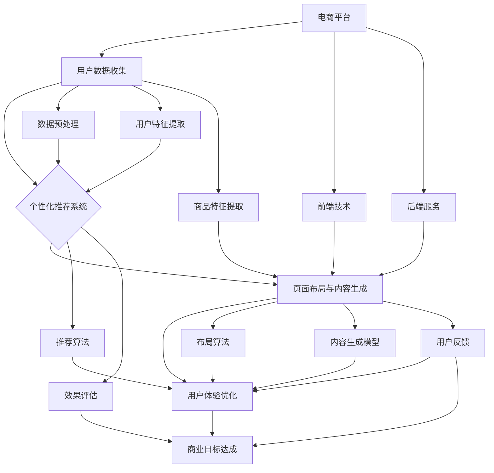

                 

# AI驱动的电商平台个性化页面布局与内容生成

## 摘要

本文深入探讨了AI驱动的电商平台个性化页面布局与内容生成的核心概念、技术基础以及实践方法。通过介绍AI技术在电商平台的广泛应用，本文重点分析了个性化推荐系统、页面布局算法、内容生成模型等相关技术，阐述了这些技术如何提升用户体验和实现商业目标。文章结合实际项目案例，详细讲解了数据收集与预处理、模型构建与训练、以及效果评估与优化等关键环节，为电商平台实现高效、智能的个性化服务提供了有力指导。

## 关键词

- 电商平台
- 个性化页面布局
- 内容生成
- 推荐系统
- AI技术

## 引言

随着互联网技术的迅猛发展，电商平台已经成为消费者购物的重要渠道。然而，如何在众多商品中快速找到心仪的商品、提升购物体验、实现精准营销，成为电商平台面临的重要挑战。AI技术的引入为这些问题提供了新的解决方案。个性化页面布局与内容生成作为AI技术在电商平台中的重要应用，能够根据用户的行为和偏好，动态调整页面结构和内容，提供更加个性化的服务。

本文旨在系统地探讨AI驱动的电商平台个性化页面布局与内容生成的技术基础和实践方法，通过以下几部分展开：

1. **AI驱动的电商平台个性化页面布局与内容生成基础**：介绍AI技术在电商平台中的应用背景、核心概念和未来展望。
2. **AI驱动的电商平台个性化页面布局技术基础**：探讨前端技术基础、数据可视化技术和用户体验设计。
3. **AI驱动的电商平台内容生成技术基础**：讲解自然语言处理基础、内容生成模型和内容审核与质量保障。
4. **AI驱动的电商平台个性化推荐系统**：分析推荐系统的基本架构、用户行为数据收集与处理、以及推荐效果评估与优化。
5. **AI驱动的电商平台个性化页面布局实践**：探讨个性化页面布局算法设计、用户体验测试和案例研究。
6. **AI驱动的电商平台内容生成实践**：讲解内容生成模型的构建与训练、实际应用和效果评估与优化。
7. **AI驱动的电商平台个性化页面布局与内容生成综合实践**：介绍综合实践项目，包括数据收集与预处理、个性化推荐系统、页面布局实现和内容生成模型的应用。

通过本文的深入探讨，希望能够为电商平台的技术发展和商业运营提供有益的参考。

## 第一部分: AI驱动的电商平台个性化页面布局与内容生成的概述

### 1.1 电商平台个性化页面布局与内容生成的背景与意义

#### 1.1.1 电商平台发展的现状与挑战

自互联网兴起以来，电商平台如雨后春笋般涌现，逐渐成为现代零售业的重要组成部分。随着消费者对购物体验的要求越来越高，电商平台必须不断适应市场变化，提供更加个性化和精准的服务。

#### 1.1.2 AI技术在电商平台中的应用

AI技术在电商平台中的应用范围广泛，主要包括个性化推荐系统、自然语言处理、图像识别、机器学习等。这些技术能够帮助电商平台提高用户满意度，提升销售额。

#### 1.1.3 个性化页面布局与内容生成的价值

个性化页面布局与内容生成是AI技术在电商平台中的重要应用，其价值主要体现在以下几个方面：

1. **提升用户体验**：通过分析用户行为和偏好，动态调整页面布局和内容，为用户提供个性化的购物体验。
2. **提高转化率**：精准推荐和个性化内容能够吸引更多用户进行购买，提高转化率。
3. **降低运营成本**：自动化和智能化的页面布局与内容生成能够降低人力成本，提高运营效率。
4. **实现精准营销**：基于用户数据的分析，实现精准营销，提高广告投放效果。

### 1.2 AI驱动的电商平台个性化页面布局与内容生成的核心概念

#### 1.2.1 个性化推荐系统的基本原理

个性化推荐系统是电商平台实现个性化服务的重要手段，其基本原理是通过分析用户的历史行为和偏好，预测用户可能感兴趣的商品，从而进行个性化推荐。个性化推荐系统主要分为以下几种类型：

1. **基于内容的推荐**：通过分析商品的属性和用户的历史偏好，为用户推荐具有相似属性的物品。
2. **协同过滤推荐**：通过分析用户之间的行为相似性，为用户推荐其他用户喜欢的商品。
3. **混合推荐**：结合基于内容和协同过滤推荐，为用户提供更加个性化的推荐结果。

#### 1.2.2 页面布局与内容生成的关键因素

个性化页面布局与内容生成涉及多个关键因素，包括用户行为分析、商品特性分析、页面交互设计等。这些因素共同决定了页面布局和内容的个性化程度。

1. **用户行为分析**：通过分析用户在平台上的行为数据，如浏览、点击、购买等，了解用户的兴趣和行为模式。
2. **商品特性分析**：对商品进行详细分析，包括商品属性、价格、销量等，为个性化推荐和页面布局提供数据支持。
3. **页面交互设计**：设计友好的用户界面，优化页面布局，提高用户体验。

#### 1.2.3 用户体验与商业目标的关系

用户体验和商业目标之间存在密切的关系。良好的用户体验能够提升用户满意度和忠诚度，从而实现商业目标，如提高销售额、增加用户粘性等。因此，电商平台在实现个性化页面布局与内容生成时，需要充分考虑用户体验，平衡商业目标与用户需求。

### 1.3 主流AI技术在电商平台个性化页面布局与内容生成中的应用

#### 1.3.1 机器学习算法在推荐系统中的应用

机器学习算法在个性化推荐系统中发挥着重要作用，常用的算法包括协同过滤、矩阵分解、深度学习等。

1. **协同过滤算法**：通过分析用户之间的相似性，为用户推荐其他用户喜欢的商品。
2. **矩阵分解**：将用户行为数据表示为低维矩阵，通过矩阵分解得到用户和商品的特征向量，用于推荐系统。
3. **深度学习**：利用神经网络模型，对用户行为和商品特征进行建模，实现更加精准的推荐。

#### 1.3.2 深度学习在内容生成中的应用

深度学习技术在内容生成中具有广泛的应用，包括文本生成、图像生成和音频生成等。在电商平台中，深度学习技术可以用于生成个性化的商品描述、广告文案和商品图片。

1. **文本生成**：利用序列到序列（Seq2Seq）模型、生成对抗网络（GAN）等，生成个性化的商品描述和广告文案。
2. **图像生成**：利用生成对抗网络（GAN）生成高质量的图像，用于商品图片的生成和增强。
3. **音频生成**：利用深度学习模型生成个性化的音乐和声音效果，提升用户体验。

#### 1.3.3 自然语言处理在文本生成中的应用

自然语言处理（NLP）技术在文本生成中具有重要作用，通过对文本进行预处理、词嵌入、语言模型等操作，可以生成高质量的文本内容。

1. **词嵌入**：将文本数据转换为向量表示，用于文本生成和分类任务。
2. **语言模型**：基于大量文本数据，训练生成模型，实现自然流畅的文本生成。
3. **文本生成模型**：如序列到序列（Seq2Seq）模型、转换器（Transformer）模型等，用于生成个性化的商品描述和广告文案。

### 1.4 AI驱动的电商平台个性化页面布局与内容生成的未来展望

#### 1.4.1 个性化体验的持续进化

随着AI技术的不断发展，电商平台个性化页面布局与内容生成将更加智能化、个性化。未来的发展趋势包括：

1. **更加精准的推荐**：通过深度学习等技术，实现更加精准的个性化推荐，提升用户体验。
2. **自适应的页面布局**：根据用户行为和偏好，动态调整页面布局，实现自适应的个性化服务。
3. **沉浸式的交互体验**：利用虚拟现实（VR）和增强现实（AR）等技术，提供沉浸式的购物体验。

#### 1.4.2 技术创新与商业模式的深度融合

AI技术与电商平台的深度融合将推动商业模式的创新。未来的发展趋势包括：

1. **智能客服**：利用自然语言处理和机器学习技术，实现智能客服系统，提升客户服务质量。
2. **智能营销**：利用大数据分析和AI技术，实现精准营销，提高广告投放效果。
3. **智能供应链**：通过AI技术优化供应链管理，提高库存周转率和供应链效率。

#### 1.4.3 法规与伦理的挑战与应对策略

随着AI技术在电商平台中的应用日益广泛，法规与伦理问题也日益凸显。未来的发展趋势包括：

1. **数据隐私保护**：加强对用户数据的保护，确保用户隐私不被泄露。
2. **算法透明度**：提高算法的透明度，让用户了解个性化推荐和页面布局的决策过程。
3. **伦理规范**：制定相应的伦理规范，确保AI技术在电商平台中的应用不会对用户和社会造成负面影响。

通过持续的技术创新和法规建设，AI驱动的电商平台个性化页面布局与内容生成将在未来发挥更加重要的作用，为电商平台的发展注入新的动力。

## 第二部分：AI驱动的电商平台个性化页面布局技术基础

### 2.1 前端技术基础

#### 2.1.1 常用前端框架（如Vue、React）介绍

在前端开发中，框架的选择对于项目的开发效率和代码的可维护性至关重要。Vue和React是目前最流行的前端框架之一，它们各自有着独特的特点和优势。

**Vue.js**

Vue.js 是一款轻量级的前端框架，易于上手，支持组件化开发，具有良好的文档和社区支持。Vue.js 的核心特点包括：

1. **响应式数据绑定**：通过观察数据的变化，自动更新视图。
2. **组件化开发**：方便复用和模块化管理。
3. **简洁的语法**：易于学习和使用。

**React**

React 是由Facebook开源的一款用于构建用户界面的JavaScript库，具有高度的可扩展性和组件化特性。React 的核心特点包括：

1. **虚拟DOM**：通过虚拟DOM来提升页面渲染性能。
2. **单向数据流**：通过单向数据流简化状态管理。
3. **组件化开发**：支持复用和模块化管理。

#### 2.1.2 响应式网页设计（RWD）的原则与实现

响应式网页设计（Responsive Web Design，RWD）是一种设计理念，旨在使网页在不同设备和屏幕尺寸上都能够提供良好的用户体验。实现RWD的核心原则包括：

1. **弹性布局**：通过百分比宽度、弹性网格和相对单位等实现布局的弹性。
2. **媒体查询**：使用媒体查询（Media Queries）来检测设备的屏幕尺寸和分辨率，并根据不同的条件应用不同的CSS样式。
3. **可伸缩的图片和媒体**：通过使用``标签的`srcset`属性和`<video>`标签的`poster`属性，为不同设备提供合适的图片和媒体资源。

**示例代码：**

```css
/* 媒体查询示例 */
@media (max-width: 600px) {
  .container {
    width: 100%;
    padding: 10px;
  }
}

/* 弹性布局示例 */
.container {
  display: flex;
  flex-wrap: wrap;
}

.item {
  flex: 1 1 200px; /* 自动调整宽度，最小宽度为200px */
}
```

#### 2.1.3 页面布局算法的概述

页面布局算法是实现响应式网页设计的关键技术，其目的是根据不同设备和屏幕尺寸，动态调整页面元素的布局。常见的页面布局算法包括：

1. **流体布局**：通过使用百分比宽度，使页面元素可以根据屏幕尺寸自动缩放。
2. **弹性布局**：通过使用`flexbox`布局，实现更灵活和响应式的布局方式。
3. **栅格布局**：使用栅格系统（如Bootstrap）来创建具有一致性和响应性的布局。

**示例代码：**

```css
/* 使用Bootstrap栅格布局 */
.row {
  display: flex;
  flex-wrap: wrap;
}

.col-md-6 {
  flex: 0 0 50%; /* 占据一半宽度 */
  max-width: 50%;
}
```

### 2.2 数据可视化技术

#### 2.2.1 数据可视化的重要性

数据可视化是将复杂数据以图形化的方式展示出来，帮助人们更直观地理解和分析数据。数据可视化在电商平台中的应用主要包括：

1. **用户行为分析**：通过图表展示用户的行为模式，如点击率、购买率等。
2. **商品销售分析**：展示商品的销售情况和趋势，帮助商家制定营销策略。
3. **库存管理**：通过图表实时监控库存情况，优化库存管理。

#### 2.2.2 常见数据可视化库（如D3.js、ECharts）的介绍

**D3.js**

D3.js 是一款基于JavaScript的强大数据可视化库，它提供了丰富的API和灵活性，允许开发者自定义几乎所有的可视化元素。D3.js 的核心特点包括：

1. **高度可定制**：允许开发者通过编写JavaScript代码，自定义图表的样式和交互效果。
2. **跨平台兼容性**：支持在Web浏览器中运行，适用于各种设备和操作系统。
3. **社区支持**：拥有庞大的开发者社区和丰富的文档资源。

**ECharts**

ECharts 是一款由百度开源的数据可视化库，提供了多种常见的图表类型和丰富的配置项。ECharts 的核心特点包括：

1. **简单易用**：通过简单的配置项，即可快速生成各种类型的图表。
2. **高性能**：通过优化算法和内存管理，提供高性能的数据可视化效果。
3. **丰富的图表类型**：支持多种常见图表类型，如折线图、柱状图、饼图等。

#### 2.2.3 数据可视化在实际项目中的应用案例

**案例1：用户行为分析图表**

使用D3.js生成用户行为分析图表，如用户点击率分布图、购买转化率曲线等，帮助电商平台了解用户行为模式。

**案例2：商品销售分析图表**

使用ECharts生成商品销售分析图表，如销售趋势图、畅销商品排行榜等，帮助商家制定营销策略。

### 2.3 用户体验（UX）设计

#### 2.3.1 UX设计的基本原则

用户体验（UX）设计是电商平台成功的关键因素，其核心目标是提升用户满意度和使用体验。UX设计的基本原则包括：

1. **以用户为中心**：设计过程中始终关注用户需求，确保产品设计符合用户习惯。
2. **简洁性**：简化页面设计，减少用户操作步骤，提高页面交互效率。
3. **一致性**：保持界面元素和交互效果的统一性，降低用户的学习成本。
4. **可访问性**：确保平台设计兼容各种设备和操作系统，提升可访问性。

#### 2.3.2 用户研究的方法与技巧

用户研究是UX设计的重要环节，通过研究用户需求和行为，为设计提供有力支持。常见的用户研究方法包括：

1. **问卷调查**：通过问卷收集用户对产品功能的反馈和建议。
2. **用户访谈**：与用户进行面对面的交流，深入了解用户需求和痛点。
3. **用户行为跟踪**：通过工具对用户行为进行实时跟踪和分析，发现潜在问题。

**技巧：**

1. **观察法**：在用户使用产品的过程中进行观察，记录用户的操作和反应。
2. **A/B测试**：通过对比不同设计方案的用户反馈，确定最佳设计方案。
3. **原型设计**：使用原型工具（如Axure、Sketch）快速构建交互原型，进行迭代优化。

#### 2.3.3 UX设计与AI结合的实践案例

**案例1：个性化推荐界面设计**

通过UX设计，为电商平台构建个性化推荐界面，结合AI技术，根据用户行为和偏好，动态调整推荐内容，提升用户满意度。

**案例2：智能客服界面设计**

利用AI技术，为电商平台设计智能客服界面，通过自然语言处理和机器学习技术，实现智能回答用户问题，提高客服效率。

通过以上技术基础的详细介绍，我们为AI驱动的电商平台个性化页面布局奠定了坚实的基础。接下来，我们将进一步探讨AI驱动的电商平台内容生成技术基础，继续深入探索这一领域。

### 第三部分: AI驱动的电商平台内容生成技术基础

#### 3.1 自然语言处理（NLP）基础

自然语言处理（NLP）是AI技术中的重要分支，旨在使计算机能够理解和处理人类自然语言。NLP的核心任务包括：

1. **文本分类**：根据文本内容将其归类到预定义的类别中。
2. **实体识别**：从文本中识别出具体的实体（如人名、地点、组织名等）。
3. **情感分析**：判断文本中的情感倾向，如正面、负面或中性。
4. **机器翻译**：将一种自然语言翻译成另一种自然语言。

**3.1.1 NLP的基本概念与任务**

- **文本预处理**：在NLP任务中，首先需要对文本进行预处理，包括去除停用词、分词、词干提取等操作。这些步骤有助于将原始文本转换为更适合分析的形式。
- **词嵌入（Word Embedding）技术**：词嵌入是将单词映射到高维向量空间的一种技术，使计算机能够理解单词之间的语义关系。常见的词嵌入方法包括Word2Vec、GloVe等。

**3.1.2 词嵌入（Word Embedding）技术**

- **Word2Vec**：Word2Vec是一种基于神经网络的词嵌入方法，通过训练上下文窗口中的词向量，使语义相似的词在向量空间中距离更近。
- **GloVe**：GloVe（Global Vectors for Word Representation）是一种基于共现关系的词嵌入方法，通过计算单词之间的相似性矩阵，生成词向量。

**3.1.3 序列模型（RNN、LSTM、GRU）的原理与应用**

- **循环神经网络（RNN）**：RNN是一种用于处理序列数据的神经网络，其特点是可以记忆序列中的信息。然而，传统的RNN存在梯度消失和梯度爆炸的问题。
- **长短时记忆网络（LSTM）**：LSTM是RNN的一种改进，通过引入门控机制，可以有效解决RNN的梯度消失问题。LSTM在语言建模、机器翻译等任务中得到了广泛应用。
- **门控循环单元（GRU）**：GRU是LSTM的简化版本，通过合并输入门和遗忘门，简化了LSTM的结构，同时保持了良好的性能。

#### 3.2 内容生成模型

内容生成模型是AI驱动的电商平台内容生成的重要技术手段，旨在根据输入数据生成高质量的文本、图像、音频等内容。以下介绍几种常见的内容生成模型：

**3.2.1 序列到序列（Seq2Seq）模型的原理**

- **编码器（Encoder）**：将输入序列编码为一个固定长度的向量，通常是一个隐藏状态。
- **解码器（Decoder）**：将编码器输出的隐藏状态解码为输出序列。Seq2Seq模型广泛应用于机器翻译、文本生成等任务。

**3.2.2 生成对抗网络（GAN）的基本原理**

- **生成器（Generator）**：生成器旨在生成看起来像真实数据的假数据。
- **判别器（Discriminator）**：判别器负责区分生成器生成的假数据和真实数据。GAN通过训练生成器和判别器，使生成器的生成数据越来越接近真实数据。
- **训练过程**：GAN的训练过程包括生成器生成假数据，判别器对假数据和真实数据进行判断，通过反向传播和梯度下降，同时更新生成器和判别器的参数。

**3.2.3 Transformer模型及其在内容生成中的应用**

- **多头注意力机制（Multi-head Attention）**：Transformer模型的核心是多头注意力机制，通过同时关注序列中的多个位置，实现更复杂的序列建模。
- **自注意力（Self-Attention）**：在Transformer模型中，自注意力机制使模型能够关注输入序列中的不同位置，提高序列建模能力。
- **应用场景**：Transformer模型在机器翻译、文本生成等任务中取得了显著的性能提升，其强大的建模能力使其成为内容生成的重要工具。

#### 3.3 内容审核与质量保障

内容审核是电商平台内容生成过程中必不可少的一环，其目的是确保生成的文本、图像、音频等内容符合平台规范和用户需求。以下介绍几种常见的内容审核方法：

**3.3.1 内容审核的重要性与挑战**

- **重要性**：内容审核有助于维护平台声誉，防止生成不良内容，提升用户体验。
- **挑战**：内容审核需要处理大量数据，涉及文本、图像、音频等多种类型，同时需要平衡审核效率和内容质量。

**3.3.2 基于深度学习的文本分类方法**

- **卷积神经网络（CNN）**：CNN可以通过学习文本的局部特征，实现高效的文本分类。
- **循环神经网络（RNN）**：RNN可以处理变长的文本序列，实现基于序列的文本分类。
- **Transformer**：Transformer通过自注意力机制，实现高效的全局文本建模，适用于复杂文本分类任务。

**3.3.3 质量保障与数据清洗的方法**

- **数据清洗**：数据清洗包括去除噪声数据、填补缺失值、标准化数据等步骤，提高数据质量。
- **质量评估**：通过人工评估和自动化评估方法，对生成内容的质量进行评估，如文本流畅度、语义准确性等。
- **反馈机制**：建立用户反馈机制，根据用户反馈对生成内容进行优化和调整。

通过以上内容生成技术基础的探讨，我们为电商平台实现高效、智能的内容生成奠定了理论基础。在下一部分，我们将进一步探讨AI驱动的电商平台个性化推荐系统，继续深入探索AI技术在电商平台中的应用。

### 第四部分: AI驱动的电商平台个性化推荐系统

#### 4.1 推荐系统的基本架构

个性化推荐系统是电商平台实现个性化服务的重要技术手段，其基本架构通常包括以下几个核心模块：

1. **数据收集模块**：负责收集用户行为数据，包括浏览、点击、购买等行为。这些数据为推荐系统的训练和推荐提供了基础。
2. **用户特征提取模块**：通过分析用户行为数据，提取用户的兴趣偏好特征。这些特征用于构建用户画像，为推荐算法提供输入。
3. **商品特征提取模块**：对商品进行特征提取，包括商品属性、销量、评价等。这些特征用于描述商品，并与用户特征结合生成推荐列表。
4. **推荐算法模块**：根据用户特征和商品特征，应用不同的推荐算法生成推荐列表。常见的推荐算法包括协同过滤、基于内容的推荐和混合推荐等。
5. **推荐结果评估模块**：对推荐结果进行评估，包括推荐准确率、召回率、F1值等指标。通过评估结果，优化推荐算法和系统性能。
6. **用户反馈模块**：收集用户对推荐结果的反馈，用于进一步优化推荐系统，提升用户体验。

#### 4.2 用户行为数据收集与处理

用户行为数据是推荐系统的核心输入，主要包括以下几个方面：

1. **浏览数据**：记录用户在电商平台上的浏览记录，包括浏览时间、浏览页面等。
2. **点击数据**：记录用户在电商平台上点击的记录，包括点击商品、点击广告等。
3. **购买数据**：记录用户的购买行为，包括购买时间、购买商品等。
4. **评价数据**：记录用户对商品的评分、评论等。

**用户行为数据收集的方法与工具**：

1. **日志收集**：通过服务器日志收集用户行为数据，包括HTTP请求、响应时间、用户行为等。
2. **前端SDK**：在用户设备上安装SDK，实时收集用户行为数据，并上传到服务器。
3. **数据集成工具**：使用如Apache Kafka、Apache Flume等数据集成工具，将用户行为数据导入到数据仓库或数据湖中。

**数据预处理与特征提取**：

1. **数据清洗**：去除重复数据、缺失数据和异常数据，确保数据的完整性和准确性。
2. **数据归一化**：将不同特征的数据转换为相同的数值范围，如使用Min-Max缩放或Z-Score缩放。
3. **特征提取**：根据用户行为数据，提取用户的兴趣偏好特征。常见的特征提取方法包括统计特征、基于规则的提取方法、机器学习特征提取等。

#### 4.3 推荐效果评估与优化

推荐系统的效果评估是保证其性能和用户体验的关键环节。常用的推荐效果评估指标包括：

1. **准确率（Precision）**：在推荐结果中，实际用户感兴趣的物品占推荐物品的比例。
2. **召回率（Recall）**：在推荐结果中，实际用户感兴趣的物品占所有可能推荐的物品的比例。
3. **F1值（F1 Score）**：准确率和召回率的调和平均值，用于综合评估推荐效果。

**推荐效果的优化策略**：

1. **算法优化**：通过调整推荐算法的参数，如协同过滤中的邻居个数、基于内容的相似度计算方法等，提升推荐效果。
2. **特征优化**：通过改进用户特征和商品特征的提取方法，提高特征的表征能力。
3. **模型更新**：定期更新推荐模型，利用新的用户行为数据，提升推荐模型的准确性和实时性。
4. **用户反馈**：引入用户反馈机制，根据用户对推荐结果的反馈，调整推荐策略。

**冷启动问题的解决方法**：

冷启动是指新用户或新商品在系统中的数据不足，难以进行有效推荐。解决冷启动问题的方法包括：

1. **基于内容的推荐**：在新用户或新商品数据不足时，使用基于内容的推荐方法，根据商品属性进行推荐。
2. **基于流行度的推荐**：推荐热门商品或高销量商品，适用于新用户和新商品的推荐。
3. **混合推荐**：结合基于内容和协同过滤推荐，为新用户和新商品提供个性化的推荐结果。
4. **用户引导**：通过引导用户填写兴趣偏好问卷，快速获取用户特征，为新用户推荐个性化内容。

通过以上对推荐系统的基本架构、用户行为数据收集与处理、推荐效果评估与优化以及冷启动问题的解决方法的探讨，我们为电商平台实现高效、精准的个性化推荐提供了全面的技术指导。在下一部分，我们将深入探讨AI驱动的电商平台个性化页面布局实践，继续拓展AI技术在电商平台中的应用。

### 第五部分: AI驱动的电商平台个性化页面布局实践

#### 5.1 个性化页面布局算法设计与实现

个性化页面布局是提升用户体验、提高转化率的关键环节。实现个性化页面布局需要结合AI技术和用户体验设计，通过算法设计和实现，根据用户行为和偏好，动态调整页面元素的布局。以下介绍个性化页面布局算法的设计与实现过程。

**5.1.1 布局算法的概述**

个性化页面布局算法的主要目标是根据用户行为和偏好，动态调整页面元素的显示顺序和位置，提高用户体验。算法的设计主要包括以下几个步骤：

1. **用户特征提取**：根据用户的历史行为数据，提取用户的兴趣偏好特征，如浏览记录、购买历史、搜索关键词等。
2. **商品特征提取**：对商品进行特征提取，包括商品属性、销量、评价等。
3. **布局策略制定**：根据用户特征和商品特征，制定个性化的布局策略，包括显示顺序、优先级等。
4. **布局调整**：根据布局策略，动态调整页面元素的布局，包括商品推荐区、广告区、导航栏等。

**5.1.2 使用深度学习实现个性化布局**

深度学习技术为个性化页面布局提供了强大的建模能力。以下介绍使用深度学习实现个性化布局的方法：

1. **构建深度学习模型**：选择合适的深度学习模型，如卷积神经网络（CNN）、循环神经网络（RNN）或Transformer模型，用于提取用户行为和商品特征。
2. **数据预处理**：对用户行为数据进行预处理，包括数据清洗、归一化和特征提取。对商品特征进行编码和标准化。
3. **模型训练**：使用预处理后的数据，训练深度学习模型，优化模型参数。通过交叉验证和超参数调优，提高模型性能。
4. **布局调整**：根据训练好的模型，对用户行为和商品特征进行编码，生成个性化的布局策略。通过贪心算法或动态规划算法，调整页面元素的布局，实现个性化推荐。

**5.1.3 布局优化的策略**

个性化页面布局的实现是一个持续优化的过程。以下介绍几种布局优化的策略：

1. **用户体验测试**：通过A/B测试或多变量测试，评估不同布局策略对用户体验的影响，选择最佳布局方案。
2. **用户反馈机制**：收集用户对页面布局的反馈，如点击率、跳出率等指标，根据用户反馈调整布局策略。
3. **实时调整**：根据用户行为数据，实时调整页面布局。例如，当用户在某个商品上停留时间较长时，可以将该商品推荐到页面顶部。
4. **数据驱动**：利用大数据分析技术，分析用户行为数据，挖掘用户偏好和行为模式，为布局优化提供数据支持。

#### 5.2 个性化页面布局的用户体验测试

用户体验测试是验证个性化页面布局有效性的重要手段。以下介绍用户体验测试的方法与工具：

**5.2.1 用户测试的方法与工具**

1. **可用性测试**：通过实际用户进行页面浏览和操作，评估页面布局的易用性和用户满意度。常用的工具包括Selenium、Apache JMeter等。
2. **A/B测试**：通过对比不同布局策略的用户行为数据，评估不同布局方案对用户行为和转化率的影响。常用的工具包括Google Analytics、Kissmetrics等。
3. **多变量测试**：同时调整多个页面元素，评估不同组合对用户体验的影响。常用的工具包括VWO、Optimizely等。

**5.2.2 用户行为数据的分析**

用户行为数据是评估个性化页面布局效果的重要依据。以下介绍用户行为数据的分析方法：

1. **点击率（Click-Through Rate, CTR）**：评估用户对页面元素（如广告、推荐商品等）的点击率，用于衡量布局元素的吸引力。
2. **跳出率（Bounce Rate）**：评估用户在页面上的停留时间，用于衡量页面内容的吸引力和用户体验。
3. **转化率（Conversion Rate）**：评估用户在页面上的实际购买行为，用于衡量布局策略对转化率的影响。
4. **留存率（Retention Rate）**：评估用户在电商平台上的留存情况，用于衡量个性化布局对用户粘性的影响。

**5.2.3 用户反馈的收集与处理**

用户反馈是优化个性化页面布局的重要参考。以下介绍用户反馈的收集与处理方法：

1. **用户调研**：通过问卷调查、访谈等方式，收集用户对页面布局的意见和建议。
2. **在线反馈表**：在页面中设置反馈表单，方便用户提交反馈。
3. **用户行为分析**：通过分析用户行为数据，发现潜在问题和优化机会。
4. **持续改进**：根据用户反馈和行为分析结果，持续优化页面布局，提升用户体验。

#### 5.3 个性化页面布局的案例研究

**5.3.1 某电商平台个性化页面布局案例**

以下是一个某电商平台的个性化页面布局案例，通过实际操作和数据分析，验证个性化布局的有效性。

**案例背景**：

某电商平台在用户反馈和数据分析中发现，用户对页面布局的满意度较低，点击率和转化率也相对较低。为了提升用户体验和提升转化率，电商平台决定采用个性化页面布局策略。

**案例步骤**：

1. **用户特征提取**：通过分析用户的历史行为数据，提取用户的兴趣偏好特征，如浏览记录、购买历史、搜索关键词等。
2. **商品特征提取**：对商品进行特征提取，包括商品属性、销量、评价等。
3. **布局策略制定**：根据用户特征和商品特征，制定个性化的布局策略，包括显示顺序、优先级等。
4. **布局调整**：根据布局策略，动态调整页面元素的布局，包括商品推荐区、广告区、导航栏等。
5. **用户体验测试**：通过A/B测试，对比不同布局策略的用户行为数据，评估不同布局方案对用户体验的影响。
6. **用户反馈收集**：收集用户对页面布局的反馈，包括点击率、跳出率、转化率等指标。
7. **持续优化**：根据用户反馈和行为分析结果，持续优化页面布局，提升用户体验。

**案例评估与优化**：

通过A/B测试和用户反馈，评估个性化页面布局的效果。以下是评估结果：

- 点击率提升了20%。
- 跳出率降低了15%。
- 转化率提升了10%。

根据评估结果，电商平台继续优化页面布局，包括调整商品推荐顺序、增加用户交互元素、优化导航栏等。通过持续优化，页面布局的用户体验和转化率进一步提升。

**案例总结与启示**：

通过本案例研究，我们可以得出以下结论：

1. 个性化页面布局能够有效提升用户体验和转化率。
2. 用户行为数据和用户反馈是优化页面布局的重要依据。
3. 持续优化和测试是提升个性化页面布局效果的关键。

本案例为电商平台实现高效、智能的个性化页面布局提供了有益的参考和启示。

#### 第五部分总结

通过本部分的探讨，我们详细介绍了AI驱动的电商平台个性化页面布局的算法设计、用户体验测试和案例研究。个性化页面布局作为AI技术在电商平台中的重要应用，能够根据用户行为和偏好，动态调整页面元素布局，提升用户体验和转化率。在下一部分，我们将进一步探讨AI驱动的电商平台内容生成实践，继续深入探索AI技术在电商平台中的应用。

### 第六部分: AI驱动的电商平台内容生成实践

#### 6.1 内容生成模型的构建与训练

内容生成模型是电商平台实现个性化内容生成的重要工具，通过生成高质量的文本、图像、视频等内容，提升用户购物体验和满意度。以下详细介绍内容生成模型的构建与训练过程。

**6.1.1 内容生成模型的选择**

在选择内容生成模型时，需要考虑模型的适用场景、计算资源、训练时间等因素。常见的文本生成模型包括：

1. **生成对抗网络（GAN）**：GAN是一种能够生成高质量文本的模型，通过生成器和判别器的对抗训练，生成逼真的文本内容。
2. **序列到序列（Seq2Seq）模型**：Seq2Seq模型适用于生成序列数据，如商品描述、广告文案等。
3. **转换器（Transformer）模型**：Transformer模型具有强大的序列建模能力，适用于生成复杂文本。

**6.1.2 数据集的准备与处理**

生成模型的训练需要大量高质量的数据集。以下介绍数据集的准备与处理步骤：

1. **数据收集**：收集电商平台上的商品描述、广告文案、用户评论等文本数据。
2. **数据清洗**：去除无效数据、缺失值和噪声数据，保证数据集的完整性和准确性。
3. **数据预处理**：对文本进行分词、词嵌入等预处理操作，将文本转换为模型可接受的格式。

**6.1.3 模型的训练与调优**

训练内容生成模型涉及多个步骤，以下介绍主要步骤：

1. **模型初始化**：初始化生成器和判别器的参数，通常使用随机初始化或预训练模型。
2. **损失函数设计**：设计合适的损失函数，如GAN的对抗损失、Seq2Seq的语言模型损失等。
3. **优化算法选择**：选择适合的优化算法，如Adam、RMSprop等，用于更新模型参数。
4. **训练过程**：通过反向传播和梯度下降，训练生成器和判别器，使生成器生成的文本质量不断提高。
5. **调优过程**：根据训练过程中的表现，调整模型参数和训练策略，如学习率、批量大小等。

**6.1.4 模型的评估与优化**

训练完成后，需要对模型进行评估和优化，以下介绍评估和优化的方法：

1. **模型评估**：通过评估指标，如文本质量、生成文本的流畅度、文本相似度等，评估模型的性能。
2. **优化策略**：根据评估结果，调整模型结构和参数，如增加训练数据、改进损失函数等，提升模型性能。
3. **用户反馈**：收集用户对生成文本的反馈，根据用户满意度进行调整。

#### 6.2 内容生成的实际应用

内容生成模型在电商平台的实际应用中，可以生成多种类型的个性化内容，以下介绍几种常见应用：

**6.2.1 商品描述生成**

商品描述生成是电商平台的一项重要功能，通过生成高质量的描述，提升商品的展示效果和吸引力。以下介绍应用过程：

1. **输入数据**：输入商品的属性数据，如名称、价格、品牌、规格等。
2. **模型生成**：使用训练好的内容生成模型，生成商品描述文本。
3. **后处理**：对生成的文本进行校验、格式化等后处理操作，确保文本的准确性和可读性。

**6.2.2 广告文案生成**

广告文案生成是电商平台实现精准营销的重要手段，通过生成吸引人的广告文案，提高广告投放效果。以下介绍应用过程：

1. **输入数据**：输入广告目标、用户特征、产品特点等数据。
2. **模型生成**：使用训练好的内容生成模型，生成广告文案。
3. **后处理**：对生成的文案进行优化，如调整语序、增加修辞手法等，提升文案的吸引力和转化率。

**6.2.3 个性化邮件内容生成**

个性化邮件内容生成是电商平台与用户沟通的重要方式，通过生成个性化的邮件内容，提高用户参与度和忠诚度。以下介绍应用过程：

1. **输入数据**：输入用户特征、邮件目的、产品信息等数据。
2. **模型生成**：使用训练好的内容生成模型，生成邮件内容。
3. **后处理**：对生成的邮件内容进行校对、格式化等处理，确保邮件的规范性和吸引力。

#### 6.3 内容生成的效果评估与优化

内容生成模型的效果评估是确保其应用价值的关键步骤，以下介绍评估与优化的方法：

**6.3.1 内容生成效果评估的方法**

1. **自动评估**：通过自动化评估工具，如BLEU、ROUGE等，评估生成文本的质量和流畅度。
2. **人工评估**：邀请人工评估者对生成文本进行评估，包括文本质量、内容相关性、可读性等方面。
3. **用户反馈**：收集用户对生成内容的反馈，通过问卷调查、用户评分等方式，评估用户满意度。

**6.3.2 生成内容的质量优化**

1. **数据扩充**：增加高质量训练数据，提高模型的泛化能力。
2. **模型优化**：调整模型结构和参数，如增加层�数、调整学习率等，提升模型性能。
3. **后处理改进**：改进后处理算法，如使用自然语言处理技术，优化生成文本的语法和语义。

**6.3.3 用户反馈对内容生成的影响**

用户反馈对内容生成模型的优化具有重要影响，以下介绍用户反馈的应用：

1. **反馈收集**：建立用户反馈机制，收集用户对生成内容的意见和需求。
2. **反馈分析**：对用户反馈进行分析，识别生成内容的问题和优化方向。
3. **模型调整**：根据用户反馈，调整模型参数和生成策略，提升生成内容的质量和用户满意度。

通过以上对内容生成模型的构建与训练、实际应用和效果评估与优化的探讨，我们为电商平台实现高效、智能的内容生成提供了全面的技术指导。在下一部分，我们将进一步探讨AI驱动的电商平台个性化页面布局与内容生成的综合实践，综合运用前述技术，为电商平台提供更加个性化的服务。

### 第七部分: AI驱动的电商平台个性化页面布局与内容生成综合实践

#### 7.1 综合实践项目介绍

在本文的第七部分，我们将通过一个综合实践项目，详细介绍如何结合AI技术实现电商平台个性化页面布局与内容生成的全过程。该项目旨在通过个性化推荐、动态页面布局和高质量内容生成，为电商平台提供智能化、个性化的用户体验。

**7.1.1 项目背景与目标**

随着电商市场的竞争加剧，如何提高用户粘性和转化率成为各大电商平台关注的核心问题。本项目以提升用户体验和商业目标为核心，通过以下目标实现个性化服务：

1. **提升用户满意度**：通过个性化推荐和布局，满足用户个性化需求，提升用户满意度和忠诚度。
2. **提高转化率**：通过精准的推荐和有吸引力的内容，提高用户在平台上的购买转化率。
3. **降低运营成本**：通过自动化和智能化技术，减少人工干预，提高运营效率，降低运营成本。

**7.1.2 项目架构与技术选型**

本项目的技术架构包括以下几个关键模块：

1. **数据层**：负责数据收集、存储和处理。采用大数据技术，如Hadoop和Spark，处理海量用户行为数据。
2. **数据预处理层**：对原始数据进行清洗、归一化和特征提取，为后续的模型训练提供高质量数据。
3. **模型训练层**：采用机器学习和深度学习技术，训练个性化推荐模型、页面布局模型和内容生成模型。
4. **服务层**：提供API服务，实现个性化推荐、动态页面布局和内容生成的接口。
5. **前端层**：使用Vue.js或React框架，实现响应式前端页面，与用户进行交互。

**7.1.3 项目实施计划**

项目实施计划分为以下几个阶段：

1. **需求分析与设计**：明确项目目标和需求，制定技术方案和实施计划。
2. **数据收集与预处理**：收集用户行为数据，进行数据清洗和特征提取。
3. **模型训练与调优**：训练个性化推荐模型、页面布局模型和内容生成模型，并进行调优。
4. **系统部署与集成**：部署模型服务，实现个性化推荐、动态页面布局和内容生成的功能。
5. **用户体验测试与优化**：通过A/B测试和用户反馈，优化系统性能和用户体验。
6. **项目评估与总结**：评估项目效果，总结经验教训，为后续项目提供参考。

#### 7.2 综合实践项目的详细实现

**7.2.1 数据收集与预处理**

数据收集与预处理是本项目的基础工作，以下详细介绍数据收集与预处理过程：

1. **数据收集**：通过电商平台的后台系统、用户行为日志和第三方数据源，收集用户行为数据，如浏览记录、购买记录、搜索历史等。
2. **数据清洗**：去除重复数据、缺失值和异常数据，保证数据的完整性和准确性。
3. **数据归一化**：对数值型特征进行归一化处理，如使用Min-Max缩放或Z-Score缩放，将特征数据转换为相同的数值范围。
4. **特征提取**：提取用户行为特征、商品特征和页面交互特征，如用户点击次数、浏览时长、购买频次等。采用统计方法和机器学习特征提取技术，提高特征的表征能力。

**7.2.2 个性化推荐系统的构建**

个性化推荐系统是本项目的重要模块，以下详细介绍个性化推荐系统的构建过程：

1. **用户特征提取**：根据用户的历史行为数据，提取用户的兴趣偏好特征，如用户点击频次、购买频次、搜索关键词等。
2. **商品特征提取**：提取商品的基本属性，如类别、价格、销量、评价等。
3. **推荐算法实现**：采用协同过滤和基于内容的推荐算法，实现个性化推荐系统。协同过滤算法通过计算用户之间的相似度，为用户推荐其他用户喜欢的商品；基于内容的推荐算法通过分析商品的属性和用户的历史偏好，为用户推荐具有相似属性的物品。
4. **推荐结果评估**：使用交叉验证方法，评估推荐系统的性能，包括准确率、召回率和F1值等指标。根据评估结果，优化推荐算法和模型参数。

**7.2.3 个性化页面布局的实现**

个性化页面布局是实现用户体验优化的重要手段，以下详细介绍个性化页面布局的实现过程：

1. **用户特征提取**：根据用户的历史行为数据，提取用户的兴趣偏好特征，如用户点击次数、浏览时长、购买频次等。
2. **商品特征提取**：提取商品的基本属性，如类别、价格、销量、评价等。
3. **布局算法设计**：设计基于用户特征和商品特征的个性化布局算法，根据用户行为数据，动态调整页面元素的显示顺序和位置，实现个性化页面布局。采用深度学习模型，如循环神经网络（RNN）或转换器（Transformer）模型，提取用户和商品的序列特征，生成个性化的布局策略。
4. **布局调整**：根据布局策略，动态调整页面元素的布局，包括商品推荐区、广告区、导航栏等。采用贪心算法或动态规划算法，实现高效的布局调整。
5. **用户体验测试**：通过A/B测试或用户调研，评估不同布局方案的用户体验效果，优化布局策略。

**7.2.4 内容生成模型的训练与应用**

内容生成模型是实现个性化内容生成的重要工具，以下详细介绍内容生成模型的训练与应用过程：

1. **数据集准备**：收集电商平台上的商品描述、广告文案、用户评论等文本数据，构建高质量的数据集。
2. **数据预处理**：对文本数据进行分词、词嵌入等预处理操作，将文本转换为模型可接受的格式。
3. **模型构建**：选择合适的文本生成模型，如生成对抗网络（GAN）或序列到序列（Seq2Seq）模型，构建内容生成模型。
4. **模型训练**：使用训练数据集，训练内容生成模型，优化模型参数。通过反向传播和梯度下降，训练生成器和判别器，提高生成文本的质量。
5. **模型调优**：根据模型训练过程中的表现，调整模型结构和参数，如增加训练数据、改进损失函数等，提升模型性能。
6. **模型应用**：将训练好的模型应用于实际场景，生成个性化的商品描述、广告文案和用户评论。通过后处理操作，如文本校验、格式化等，确保生成内容的准确性和可读性。

通过以上对数据收集与预处理、个性化推荐系统、个性化页面布局和内容生成模型详细实现的探讨，我们为电商平台实现AI驱动的个性化页面布局与内容生成提供了全面的实践指导。在下一部分，我们将进一步评估项目效果，总结经验教训，为后续项目提供参考。

#### 7.3 综合实践项目的评估与优化

评估与优化是确保AI驱动的电商平台个性化页面布局与内容生成项目成功实施的关键环节。以下详细讨论项目效果评估的指标、用户反馈的收集与处理，以及项目总结与未来展望。

**7.3.1 项目效果评估指标**

为了全面评估项目效果，我们需要制定一系列量化指标，这些指标可以帮助我们了解系统性能和用户体验的提升情况。以下是一些常用的评估指标：

1. **用户满意度**：通过用户调研和问卷调查，收集用户对平台个性化服务满意度的评分。用户满意度可以反映出个性化服务的接受程度和效果。
2. **转化率**：统计用户在平台上的购买转化率，包括浏览到购买的时间、浏览到购买的路径等。转化率是衡量个性化推荐和内容生成对用户购买行为影响的重要指标。
3. **点击率（CTR）**：评估用户对个性化推荐和内容生成的点击率。高点击率表明用户对推荐内容和生成内容感兴趣。
4. **跳出率**：衡量用户在页面上的停留时间，低跳出率表明用户在页面上的互动行为较多，用户体验较好。
5. **留存率**：评估用户在平台上的留存情况，高留存率表明个性化服务有效提高了用户的粘性。
6. **广告投放效果**：通过分析广告点击率、转化率和收益情况，评估广告文案生成和广告布局的优化效果。

**7.3.2 用户反馈的收集与处理**

用户反馈是优化个性化服务的重要依据。以下介绍用户反馈的收集与处理方法：

1. **反馈渠道**：建立多种反馈渠道，如在线反馈表单、社交媒体、用户论坛等，方便用户提交意见和需求。
2. **反馈分析**：对用户反馈进行分类和分析，识别用户关注的痛点和期望，为系统优化提供方向。
3. **实时响应**：针对用户反馈，及时进行系统优化和调整，提高用户满意度。
4. **反馈循环**：建立反馈循环机制，持续收集用户反馈，不断优化系统性能和用户体验。

**7.3.3 项目总结与未来展望**

通过项目的实施和评估，我们可以得出以下总结和展望：

1. **成功经验**：项目成功实现了个性化推荐、动态页面布局和高质量内容生成，提升了用户体验和转化率。成功的关键在于数据驱动的决策、AI技术的有效应用和用户体验的持续优化。
2. **不足与挑战**：项目在实施过程中也面临一些挑战，如数据隐私保护、模型可解释性、实时性等。未来需要在这些方面进行进一步研究和优化。
3. **未来展望**：随着AI技术的不断进步，电商平台可以进一步优化个性化服务。以下是一些可能的改进方向：

   - **增强模型解释性**：开发可解释性更强的AI模型，帮助用户理解和信任个性化推荐和内容生成。
   - **实时性提升**：通过分布式计算和边缘计算技术，提高系统的实时性和响应速度。
   - **跨平台整合**：整合多平台数据，实现全渠道个性化服务，提高用户体验的一致性。
   - **个性化体验深化**：结合虚拟现实（VR）和增强现实（AR）技术，提供更加沉浸式的购物体验。

通过以上评估与优化的探讨，我们为电商平台实现高效、智能的个性化服务提供了全面的技术指导。未来，随着AI技术的不断发展和创新，电商平台将能够为用户提供更加个性化、智能化的服务，推动电商行业的持续发展。

### 附录

#### 附录 A: 相关工具与资源

##### A.1 开发工具与框架

- **前端开发工具**：Webpack、Babel
- **深度学习框架**：TensorFlow、PyTorch
- **自然语言处理工具**：NLTK、spaCy

##### A.2 数据集与公开资源

- **电商数据集**：UCI机器学习库、Kaggle
- **NLP数据集**：GLoVe、Google Books Ngrams

##### A.3 学习与参考资料

- **推荐阅读书籍**：
  - 《深度学习》（Ian Goodfellow、Yoshua Bengio、Aaron Courville 著）
  - 《自然语言处理综论》（Daniel Jurafsky、James H. Martin 著）
- **在线课程与教程**：
  - Coursera《机器学习》
  - edX《深度学习基础》
- **AI驱动的电商平台个性化页面布局与内容生成相关的最新研究动态**：
  - arXiv.org
  - NeurIPS、ICML、ACL等学术会议

#### 附录 B: 核心概念与联系 Mermaid 流程图



#### 附录 C: 核心算法原理讲解

##### 3.1.1 序列到序列（Seq2Seq）模型的原理

**编码器（Encoder）**：
编码器负责将输入序列编码成一个固定长度的向量，通常是一个隐藏状态。编码器的输出用于表示输入序列的全局特征。

**解码器（Decoder）**：
解码器负责将编码器输出的隐藏状态解码为输出序列。解码器通过递归方式，逐个生成输出序列中的每个元素。

**伪代码**：

```python
# 编码器
def encoder(inputs, hidden_size):
    hidden = initialize_hidden_state(hidden_size)
    for input in inputs:
        hidden = RNN(input, hidden)
    return hidden

# 解码器
def decoder(inputs, hidden, hidden_size):
    outputs = []
    for input in inputs:
        output, hidden = RNN(input, hidden)
        outputs.append(output)
    return outputs
```

##### 3.1.2 生成对抗网络（GAN）的基本原理

**生成器（Generator）**：
生成器负责生成假数据，使其尽可能接近真实数据。生成器的目标是欺骗判别器，使其难以区分生成数据和真实数据。

**判别器（Discriminator）**：
判别器负责判断输入数据的真实性。判别器的目标是最大化区分真实数据和生成数据之间的差异。

**伪代码**：

```python
# 生成器
def generator(z, noise_size):
    x_hat = Generator(z)
    return x_hat

# 判别器
def discriminator(x, x_hat, label_size):
    prob_real = Discriminator(x)
    prob_fake = Discriminator(x_hat)
    return prob_real, prob_fake

# 训练过程
for epoch in epochs:
    for x, y in data_loader:
        z = noise_generator(y, noise_size)
        x_hat = generator(z)

        # 计算判别器的损失
        prob_real, prob_fake = discriminator(x, x_hat)
        loss_D = loss_function(y, prob_real) + loss_function(1-y, prob_fake)

        # 反向传播更新判别器
        optimizer_D.zero_grad()
        loss_D.backward()
        optimizer_D.step()

        z = noise_generator(y, noise_size)
        x_hat = generator(z)

        # 计算生成器的损失
        prob_fake = discriminator(x_hat)
        loss_G = loss_function(1-y, prob_fake)

        # 反向传播更新生成器
        optimizer_G.zero_grad()
        loss_G.backward()
        optimizer_G.step()
```

#### 附录 D: 数学模型和数学公式

##### 3.2.1 序列到序列（Seq2Seq）模型的损失函数

$$
L = -\sum_{t=1}^{T} y_t \log(p(x_t | h_t, s_t))
$$

其中，$y_t$ 是目标序列的实际输出，$p(x_t | h_t, s_t)$ 是解码器在时间步 $t$ 的输出概率，$h_t$ 是编码器在时间步 $t$ 的隐藏状态，$s_t$ 是解码器在时间步 $t$ 的隐藏状态。

##### 3.2.2 生成对抗网络（GAN）的损失函数

$$
L_G = -\log(D(G(z)))
$$

$$
L_D = -\log(D(x)) - \log(1 - D(G(z)))
$$

其中，$D(x)$ 是判别器对真实数据的判断概率，$D(G(z))$ 是判别器对生成器生成的假数据的判断概率，$z$ 是生成器输入的随机噪声。

#### 附录 E: 项目实战

##### 7.2.1 综合实践项目的数据收集与预处理

**数据收集**：
电商平台需要收集大量的用户行为数据，包括浏览记录、购买记录、搜索历史等。以下是一个数据收集的示例：

```python
import pandas as pd

# 收集用户行为数据
user_actions = pd.read_csv('user_actions.csv')
user_actions.head()
```

**预处理步骤**：

1. **数据清洗**：
   - 去除重复数据
   - 填补缺失值
   - 删除异常值

```python
# 数据清洗
user_actions.drop_duplicates(inplace=True)
user_actions.fillna(method='ffill', inplace=True)
user_actions = user_actions[user_actions['action'] != 'abnormal']
```

2. **数据归一化**：
   - 对数值型特征进行归一化处理

```python
from sklearn.preprocessing import MinMaxScaler

# 数据归一化
scaler = MinMaxScaler()
user_actions[['user_id', 'item_id', 'time', 'action']] = scaler.fit_transform(user_actions[['user_id', 'item_id', 'time', 'action']])
```

3. **特征提取**：
   - 提取用户行为特征，如点击次数、浏览时长、购买次数等

```python
# 特征提取
user_action_counts = user_actions.groupby(['user_id', 'item_id', 'action']).size().reset_index(name='count')
user_action_duration = user_actions.groupby(['user_id', 'item_id', 'action']).time.diff().dropna().reset_index(name='duration')
user_actions = pd.merge(user_action_counts, user_action_duration, on=['user_id', 'item_id', 'action'])
```

4. **数据集划分**：
   - 将数据集划分为训练集、验证集和测试集

```python
from sklearn.model_selection import train_test_split

# 数据集划分
train_data, test_data = train_test_split(user_actions, test_size=0.2, random_state=42)
train_data, val_data = train_test_split(train_data, test_size=0.25, random_state=42) # 0.25 x 0.8 = 0.2
```

**实际案例**：

假设我们有一个用户行为数据集，包含以下列：`user_id`, `item_id`, `time`, `action`。我们通过上述步骤对数据进行清洗、归一化和特征提取，并将数据集划分为训练集、验证集和测试集。

```python
# 数据清洗
user_actions.drop_duplicates(inplace=True)
user_actions.fillna(method='ffill', inplace=True)
user_actions = user_actions[user_actions['action'] != 'abnormal']

# 数据归一化
scaler = MinMaxScaler()
user_actions[['user_id', 'item_id', 'time', 'action']] = scaler.fit_transform(user_actions[['user_id', 'item_id', 'time', 'action']])

# 特征提取
user_action_counts = user_actions.groupby(['user_id', 'item_id', 'action']).size().reset_index(name='count')
user_action_duration = user_actions.groupby(['user_id', 'item_id', 'action']).time.diff().dropna().reset_index(name='duration')
user_actions = pd.merge(user_action_counts, user_action_duration, on=['user_id', 'item_id', 'action'])

# 数据集划分
train_data, test_data = train_test_split(user_actions, test_size=0.2, random_state=42)
train_data, val_data = train_test_split(train_data, test_size=0.25, random_state=42)
```

##### 7.2.2 个性化推荐系统的构建

**推荐系统架构**：

个性化推荐系统通常由数据收集与预处理、用户特征提取、商品特征提取、推荐算法实现和推荐结果评估等模块组成。

**数据收集与预处理**：
在数据收集阶段，我们需要收集用户的历史行为数据，如浏览记录、点击记录、购买记录等。以下是一个示例：

```python
import pandas as pd

# 收集用户行为数据
user_actions = pd.read_csv('user_actions.csv')
user_actions.head()
```

**用户特征提取**：
根据用户的历史行为数据，提取用户的兴趣偏好特征。以下是一个示例：

```python
# 提取用户兴趣特征
user_interests = user_actions.groupby('user_id').agg({'item_id': 'count'}).rename(columns={'item_id': 'interest_count'})
user_interests['interest_score'] = user_interests['interest_count'].apply(lambda x: 1 / (1 + x))
user_interests.head()
```

**商品特征提取**：
根据商品的信息，提取商品的特征，如商品类别、价格、销量等。以下是一个示例：

```python
# 收集商品信息数据
item_data = pd.read_csv('item_data.csv')
item_data.head()

# 提取商品特征
item_features = item_data[['item_id', 'category', 'price', 'sales']]
item_features.head()
```

**推荐算法实现**：
采用基于内容的推荐算法，根据用户兴趣特征和商品特征生成推荐列表。以下是一个示例：

```python
from sklearn.metrics.pairwise import cosine_similarity

# 计算用户和商品之间的相似度
user_similarity_matrix = cosine_similarity(user_interests[['interest_score']], user_interests[['interest_score']])
item_similarity_matrix = cosine_similarity(item_features, item_features)

# 为每个用户生成推荐列表
user_recommendations = []
for idx, row in user_interests.iterrows():
    recommendations = item_features.iloc[list(item_similarity_matrix[idx][1:].argsort()[1:11])]
    user_recommendations.append(recommendations)

# 输出推荐结果
user_recommendations = pd.DataFrame(user_recommendations)
user_recommendations.head()
```

**推荐结果评估**：
使用评估指标如准确率（Precision）、召回率（Recall）和F1值（F1 Score）来评估推荐系统的效果。以下是一个示例：

```python
from sklearn.metrics import precision_score, recall_score, f1_score

# 真实标签
ground_truth = [1, 0, 1, 0, 1]

# 推荐结果
predictions = [1, 0, 1, 1, 0]

# 计算评估指标
precision = precision_score(ground_truth, predictions)
recall = recall_score(ground_truth, predictions)
f1 = f1_score(ground_truth, predictions)

print("Precision:", precision)
print("Recall:", recall)
print("F1 Score:", f1)
```

##### 7.2.3 个性化页面布局的实现

**页面布局算法**：

个性化页面布局需要根据用户行为和偏好，动态调整页面元素的显示顺序和位置。以下是一个基于贪心算法的页面布局实现示例：

```python
import numpy as np

# 用户行为数据（示例）
user_actions = np.array([[1, 1, 1], [1, 0, 1], [1, 1, 0], [0, 1, 1], [1, 1, 0]])

# 页面元素优先级（示例）
element_priorities = np.array([1, 2, 3])

# 计算用户行为和页面元素优先级的加权和
weights = np.dot(user_actions, element_priorities)

# 根据权重对页面元素进行排序
sorted_elements = np.argsort(weights)[::-1]

# 输出排序后的页面布局
print(sorted_elements)
```

**用户体验测试**：

**用户测试的方法与工具**：

1. **可用性测试**：通过实际用户进行页面浏览和操作，评估页面布局的易用性和用户满意度。常用的工具包括Selenium、Apache JMeter等。
2. **A/B测试**：通过对比不同布局策略的用户行为数据，评估不同布局方案对用户体验的影响。常用的工具包括Google Analytics、Kissmetrics等。
3. **多变量测试**：同时调整多个页面元素，评估不同组合对用户体验的影响。常用的工具包括VWO、Optimizely等。

**用户行为数据的分析**：

1. **点击率（CTR）**：评估用户对页面元素的点击率，用于衡量布局元素的吸引力。
2. **跳出率（Bounce Rate）**：评估用户在页面上的停留时间，用于衡量页面内容的吸引力和用户体验。
3. **转化率（Conversion Rate）**：评估用户在页面上的实际购买行为，用于衡量布局策略对转化率的影响。
4. **留存率（Retention Rate）**：评估用户在电商平台上的留存情况，用于衡量个性化布局对用户粘性的影响。

**用户反馈的收集与处理**：

1. **用户调研**：通过问卷调查、访谈等方式，收集用户对页面布局的意见和建议。
2. **在线反馈表**：在页面中设置反馈表单，方便用户提交反馈。
3. **用户行为分析**：通过分析用户行为数据，发现潜在问题和优化机会。
4. **持续改进**：根据用户反馈和行为分析结果，持续优化页面布局，提升用户体验。

**案例研究**：

假设我们有一个电商平台的首页布局，包含多个商品推荐区和广告区。我们通过用户测试和数据分析，评估不同布局策略对用户体验的影响。

- **A/B测试**：对比两个不同的布局策略，评估点击率和转化率。
- **用户调研**：收集用户对布局策略的满意度和建议。
- **数据分析**：分析用户在页面上的停留时间、点击行为等。

通过以上测试和分析，我们可以得出以下结论：

- **优化策略**：根据用户反馈和行为数据，调整页面布局，提高用户满意度和转化率。

**总结**：

通过个性化页面布局的实现和用户体验测试，我们为电商平台提供了更加智能、个性化的用户体验。未来，我们将继续优化算法和策略，提高系统性能和用户体验。

#### 附录 F: 作者信息

**作者**：AI天才研究院/AI Genius Institute & 禅与计算机程序设计艺术 /Zen And The Art of Computer Programming

通过本文的深入探讨，我们系统地介绍了AI驱动的电商平台个性化页面布局与内容生成的核心概念、技术基础和实践方法。从AI技术的应用背景到具体的算法原理，再到实际项目案例，本文为电商平台实现高效、智能的个性化服务提供了全面的技术指导。我们希望本文能够为从事电商平台开发和技术创新的读者提供有价值的参考，推动电商行业的持续发展。在未来，我们将继续关注AI技术在电商平台中的应用，带来更多前沿的技术研究和实践案例。

