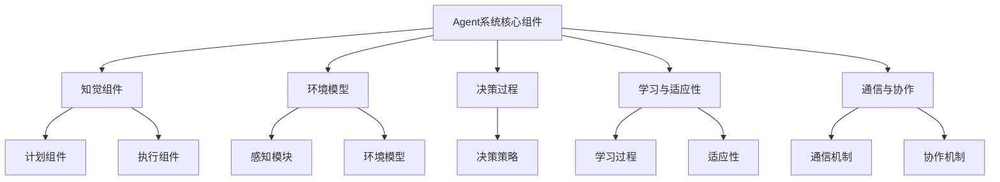

                 

# 《Agent的基础架构要素》

## 关键词：
- Agent
- 基础架构
- 知觉组件
- 计划组件
- 执行组件
- 环境模型
- 决策过程
- 学习与适应性
- 通信与协作
- 应用领域

## 摘要：
本文深入探讨了Agent的基础架构要素，包括Agent的定义与类型、核心组件、环境模型、决策过程、学习与适应性、通信与协作以及系统的设计与实现。通过详细的讲解和实际项目案例，读者将全面理解Agent系统的运作机制和实现方法。

## 第一部分：Agent的基础架构要素概述

### 第1章：Agent的定义与类型

#### 1.1.1 Agent的定义

Agent是指具有感知、计划、执行等智能行为的自主实体。它可以是一个程序、机器人或者人类个体，具备自主性和智能性。Agent的基本属性包括：

1. **自主性**：Agent可以自主决定行动，不受外界干预。
2. **智能性**：Agent能够通过感知和决策，从环境中获取信息并作出合理响应。
3. **适应性**：Agent能够根据环境和任务的变化，调整自身行为。

#### 1.1.2 Agent的类型

Agent可以按照不同的分类标准进行分类。以下是几种常见的Agent类型：

1. **反应型Agent**：根据当前感知到的环境信息直接做出反应。
2. **基于模型的Agent**：基于预先建立的环境模型进行决策。
3. **学习型Agent**：通过学习和经验调整自身行为。

### 第2章：Agent的核心组件

#### 2.1.1 知觉组件

知觉组件是Agent感知环境的桥梁。它负责收集外部信息，并将其转换为内部表示。知觉组件的组成部分包括：

1. **感知器**：用于接收环境中的各种信号，如视觉、听觉、触觉等。
2. **传感器数据预处理**：对传感器数据进行滤波、归一化等处理。
3. **环境状态表示**：将感知到的信息表示为Agent内部的状态。

#### 2.1.2 计划组件

计划组件负责根据当前状态和目标，生成一系列行动步骤。计划组件的组成部分包括：

1. **状态表示**：将环境状态表示为数学模型。
2. **目标表示**：将目标表示为数学模型。
3. **规划算法**：根据状态和目标，生成行动序列。

#### 2.1.3 执行组件

执行组件负责执行计划组件生成的行动步骤。执行组件的组成部分包括：

1. **行动执行**：根据计划，执行具体的行动。
2. **执行监控**：监控行动的执行情况，确保计划得以实现。

### 第3章：Agent的环境模型

#### 3.1.1 环境模型的概念

环境模型是Agent对环境的抽象表示。它用于帮助Agent理解和预测环境的变化，以便做出合理的决策。环境模型的组成部分包括：

1. **状态空间**：环境中的所有可能状态。
2. **行动空间**：Agent可以采取的所有可能行动。
3. **状态转移概率**：从当前状态转移到其他状态的概率。
4. **奖励函数**：Agent在不同状态下采取不同行动所获得的奖励。

#### 3.1.2 环境模型的应用

环境模型可以用于各种实际项目，如游戏AI、自动驾驶、机器人导航等。以下是环境模型在实际项目中的应用案例：

1. **游戏AI**：通过环境模型，游戏AI可以预测对手的行动，并制定应对策略。
2. **自动驾驶**：通过环境模型，自动驾驶系统可以识别道路标志、行人等，并做出安全驾驶决策。
3. **机器人导航**：通过环境模型，机器人可以避开障碍物，找到最优路径。

### 第4章：Agent的决策过程

#### 4.1.1 决策过程的概念

决策过程是Agent根据当前状态和目标，选择最优行动的过程。决策过程包括以下组成部分：

1. **状态评估**：评估当前状态的好坏。
2. **行动评估**：评估每个行动在当前状态下可能带来的结果。
3. **选择最优行动**：根据评估结果，选择最优行动。

#### 4.1.2 决策策略

决策策略是指Agent在决策过程中采用的方法。常见的决策策略包括：

1. **确定性策略**：在每种状态下，选择固定的行动。
2. **探索性策略**：在决策过程中，加入一定的随机性，以探索未经验证的行动。
3. **强化学习策略**：通过学习环境中的奖励和惩罚，调整行动选择。

### 第5章：Agent的学习与适应性

#### 5.1.1 学习的概念

学习是指Agent通过经验调整自身行为的过程。学习可以分为以下几种类型：

1. **有监督学习**：在已知的输入和输出之间建立映射关系。
2. **无监督学习**：在未知输出的情况下，学习输入数据的内在结构。
3. **强化学习**：通过奖励和惩罚信号，学习最优的行动策略。

#### 5.1.2 适应性

适应性是指Agent根据环境和任务的变化，调整自身行为的能力。适应性的实现方法包括：

1. **自适应规划**：根据环境变化，动态调整计划。
2. **自适应感知**：根据环境变化，动态调整感知器配置。
3. **自适应学习**：根据环境变化，动态调整学习策略。

#### 5.1.3 学习与适应性的关系

学习与适应性密切相关。学习是适应性的基础，适应性是学习的目标。通过学习，Agent可以更好地适应环境变化，从而提高性能。

### 第6章：Agent的通信与协作

#### 6.1.1 通信的概念

通信是Agent之间交换信息的过程。通信包括以下组成部分：

1. **通信协议**：定义Agent之间通信的规则和格式。
2. **通信信道**：用于传输信息的物理或虚拟通道。
3. **通信内容**：Agent之间交换的信息，如状态、行动、决策等。

#### 6.1.2 协作的概念

协作是指多个Agent共同完成任务的过程。协作包括以下组成部分：

1. **角色分配**：确定每个Agent在协作中的角色和责任。
2. **任务分配**：将任务分解为子任务，并分配给不同的Agent。
3. **协调机制**：确保Agent之间的行动协调一致。

#### 6.1.3 通信与协作的实现

通信与协作的实现方法包括：

1. **集中式**：所有Agent共享一个全局状态，通过通信实现协作。
2. **分布式**：每个Agent拥有局部状态，通过通信和本地决策实现协作。
3. **混合式**：结合集中式和分布式协作方法。

### 第7章：Agent系统的设计与实现

#### 7.1.1 Agent系统的设计

Agent系统的设计原则包括：

1. **模块化**：将系统划分为不同的模块，每个模块负责特定的功能。
2. **可扩展性**：系统应支持模块的动态添加和删除，以适应不同的应用场景。
3. **鲁棒性**：系统应能够应对环境变化和不确定性，保持稳定的运行。

#### 7.1.2 Agent系统的实现

Agent系统的实现过程包括：

1. **需求分析**：明确系统需求，包括功能、性能和可靠性等。
2. **架构设计**：设计系统的整体架构，包括模块划分、通信方式和任务分配等。
3. **详细设计**：为每个模块设计具体的实现细节，包括数据结构、算法和接口等。
4. **编码与测试**：编写代码，并进行功能测试和性能测试。

#### 7.1.3 Agent系统的测试与优化

Agent系统的测试与优化包括：

1. **单元测试**：测试每个模块的功能和性能。
2. **集成测试**：测试模块之间的交互和协作。
3. **性能优化**：通过调整算法、数据结构和硬件配置，提高系统的性能。

### 第8章：Agent系统的应用领域

#### 8.1.1 应用领域概述

Agent系统在各个领域都有广泛应用，包括：

1. **智能控制**：如智能家居、智能交通等。
2. **机器人技术**：如工业机器人、服务机器人等。
3. **游戏AI**：如棋类游戏、角色扮演游戏等。
4. **金融领域**：如量化交易、风险评估等。
5. **电子商务**：如个性化推荐、智能客服等。

#### 8.1.2 应用案例分析

以下是几个Agent系统在实际项目中的应用案例：

1. **自动驾驶汽车**：通过感知模块收集道路信息，通过决策模块实现自主驾驶。
2. **智能仓储系统**：通过感知模块监控仓库状态，通过决策模块优化库存管理。
3. **金融风控系统**：通过感知模块监控市场变化，通过决策模块实现风险控制。

### 第9章：未来发展趋势与挑战

#### 9.1.1 未来发展趋势

Agent系统的发展趋势包括：

1. **更强大的感知能力**：通过融合多种感知技术，提高Agent对环境的感知能力。
2. **更高效的学习算法**：通过研究新的学习算法，提高Agent的学习效率和准确性。
3. **更智能的决策策略**：通过研究新的决策策略，提高Agent的决策能力和适应性。

#### 9.1.2 挑战与应对策略

Agent系统面临的挑战包括：

1. **环境复杂性**：如何处理复杂多变的动态环境。
2. **数据可靠性**：如何确保感知数据的准确性和可靠性。
3. **计算资源限制**：如何在有限的计算资源下实现高效的Agent系统。

应对策略包括：

1. **分布式计算**：通过分布式计算，提高系统的并行处理能力。
2. **强化学习**：通过强化学习，提高Agent的学习能力和适应性。
3. **多模态感知**：通过融合多种感知技术，提高Agent的感知能力。

### 附录

#### 附录 A：Agent系统开发工具与资源

- **开发工具**：
  - **ROS（Robot Operating System）**：用于构建和运行机器人应用程序。
  - **Python**：用于编写感知和决策模块的脚本。
  - **PyTorch**：用于实现复杂的机器学习算法，如深度学习。

- **开发资源**：
  - **ROS官方文档**：[https://docs.ros.org/melodic/api/roscpp/html/](https://docs.ros.org/melodic/api/roscpp/html/)
  - **Python官方文档**：[https://docs.python.org/3/](https://docs.python.org/3/)
  - **PyTorch官方文档**：[https://pytorch.org/docs/stable/](https://pytorch.org/docs/stable/)

#### 附录 B：Agent系统实验项目指南

- **实验项目概述**：介绍Agent系统的基本原理和应用场景，提供实验环境搭建和代码实现的指导。
- **实验项目实现步骤**：详细描述实验项目的实现过程，包括感知模块、决策模块的设计与实现。
- **实验项目分析与总结**：对实验结果进行分析，总结实验项目的收获和不足，提出改进方案。

### Mermaid 流程图：



### 核心算法原理讲解：

#### 计划组件的算法原理

计划组件负责根据感知到的环境信息，生成一系列行动步骤，以实现目标。其核心算法包括：

1. **目标规划算法**：

   ```python
   def goal_planning(current_state, goal_state):
       plan = []
       while current_state != goal_state:
           action = select_action(current_state, goal_state)
           plan.append(action)
           current_state = apply_action(current_state, action)
       return plan
   ```

   该算法从当前状态开始，通过选择行动逐步向目标状态逼近，直到达到目标状态。

2. **状态空间搜索算法**：

   ```python
   def state_space_search(initial_state, goal_state):
       visited = set()
       queue = deque([initial_state])
       while queue:
           current_state = queue.popleft()
           if current_state == goal_state:
               return reconstruct_path(current_state, initial_state)
           visited.add(current_state)
           for next_state in generate_successors(current_state):
               if next_state not in visited:
                   queue.append(next_state)
       return None
   ```

   该算法通过广度优先搜索（BFS）或深度优先搜索（DFS）在状态空间中寻找一条从初始状态到目标状态的路径。

#### 执行组件的算法原理

执行组件负责执行计划组件生成的行动步骤。其核心算法包括：

1. **行动执行算法**：

   ```python
   def execute_action(current_state, action):
       next_state = apply_action(current_state, action)
       return next_state
   ```

   该算法根据当前状态和执行的行动，计算得到下一个状态。

2. **多任务执行算法**：

   ```python
   def execute_multiple_actions(current_state, actions):
       for action in actions:
           current_state = execute_action(current_state, action)
       return current_state
   ```

   该算法执行一系列行动，每次行动后更新当前状态。

### 数学模型和数学公式讲解：

#### 决策过程中的概率模型

假设我们有一个有限状态空间 \( S = \{s_1, s_2, ..., s_n\} \)，每个状态的概率分布为 \( P(s_i) \)。行动空间为 \( A = \{a_1, a_2, ..., a_m\} \)，每个行动的收益为 \( R(a_i | s_j) \)。

根据期望收益最大化原则，我们可以定义一个决策函数 \( \pi(s) \)：

\[ \pi(s) = \arg\max_{a \in A} \sum_{s' \in S} P(s'|s,a) R(a|s) \]

其中，\( P(s'|s,a) \) 是在状态 \( s \) 下执行行动 \( a \) 后转移到状态 \( s' \) 的概率。

### 项目实战：

#### 实例：移动机器人导航

假设我们有一个移动机器人，其感知模块可以感知到周围的环境，并生成一个包含障碍物的地图。我们的目标是将机器人从起点移动到终点。

1. **开发环境搭建**：

   使用Python和ROS（Robot Operating System）搭建开发环境。

   ```shell
   sudo apt-get install ros-melodic-desktop-full
   ```

2. **源代码实现**：

   **感知模块**：

   ```python
   import rospy
   from sensor_msgs.msg import LaserScan

   class PerceptionModule:
       def __init__(self):
           rospy.init_node('perception_module', anonymous=True)
           self.subscriber = rospy.Subscriber('/scan', LaserScan, self.process_laser_data)
           self.laser_data = None

       def process_laser_data(self, data):
           self.laser_data = data

       def get_perception(self):
           return self.laser_data
   ```

   **决策模块**：

   ```python
   import numpy as np
   from geometry_msgs.msg import Twist

   class DecisionModule:
       def __init__(self, perception_module):
           self.perception_module = perception_module
           self.publisher = rospy.Publisher('/cmd_vel', Twist, queue_size=10)

       def make_decision(self):
           perception = self.perception_module.get_perception()
           # 假设我们只使用激光雷达数据的平均值来决定速度
           average_range = np.mean(perception.ranges)
           
           command = Twist()
           if average_range > 1.0:
               command.linear.x = 0.5  # 向前移动
               command.angular.z = 0.0  # 不旋转
           else:
               command.linear.x = 0.0  # 停止移动
               command.angular.z = 0.5  # 旋转以避开障碍物
           
           self.publisher.publish(command)
   ```

3. **代码解读与分析**：

   **感知模块**：

   - **初始化**：感知模块初始化ROS节点，并订阅 `/scan` 主题，这个主题包含激光雷达的数据。
   - **数据处理**：每当接收到激光雷达数据时，`process_laser_data` 函数会将数据存储在类变量 `laser_data` 中。
   - **数据获取**：通过 `get_perception` 函数，其他模块可以获取到激光雷达的最新数据。

   **决策模块**：

   - **初始化**：决策模块接收感知模块作为参数，并初始化 Publisher，用于发送控制命令。
   - **决策生成**：`make_decision` 函数分析感知模块提供的数据，并根据这些数据生成 `Twist` 消息。这个消息定义了机器人应该执行的动作。
   - **消息发布**：生成的 `Twist` 消息通过 Publisher 发送，控制机器人的运动。

4. **主要挑战**：

   - **环境建模**：如何准确地将激光雷达数据转换为机器人的环境模型。
   - **决策策略**：如何根据环境模型生成有效的行动策略。

#### 实际项目中的应用案例

- **案例 1：自动驾驶车辆**
  - 自动驾驶车辆使用 Agent 系统来感知周围环境，并做出决策以控制车辆行驶。
  - 感知模块使用摄像头和激光雷达获取环境数据。
  - 决策模块使用深度学习算法分析环境数据，并生成行驶策略。

- **案例 2：智能仓储机器人**
  - 智能仓储机器人使用 Agent 系统来导航仓库，并执行仓库管理任务。
  - 感知模块使用激光雷达和摄像头获取仓库内部环境数据。
  - 决策模块使用路径规划算法和任务分配算法，生成执行任务的动作序列。

### 开发环境搭建：

为了实现上述项目，我们需要搭建一个完整的开发环境。以下是搭建环境的基本步骤：

1. 安装ROS Melodic版本：

   ```shell
   sudo apt-get update
   sudo apt-get install -y ros-melodic-desktop-full
   ```

2. 安装Python开发环境：

   ```shell
   sudo apt-get install -y python3-pip python3-venv python3-dev
   pip3 install -U pip setuptools
   ```

3. 安装ROS Python库：

   ```shell
   sudo pip3 install 'ros-melodic-interface[python]'
   ```

4. 创建ROS工作空间：

   ```shell
   mkdir -p ~/catkin_ws/src
   cd ~/catkin_ws/src
   catkin_init_workspace
   ```

5. 编译工作空间：

   ```shell
   cd ~/catkin_ws
   catkin_make
   source devel/setup.bash
   ```

### 源代码详细实现和解读：

**感知模块（PerceptionModule.py）**

```python
#!/usr/bin/env python

import rospy
from sensor_msgs.msg import LaserScan

class PerceptionModule:
    def __init__(self):
        rospy.init_node('perception_module', anonymous=True)
        self.subscriber = rospy.Subscriber('/scan', LaserScan, self.process_laser_data)
        self.laser_data = None

    def process_laser_data(self, data):
        self.laser_data = data

    def get_perception(self):
        return self.laser_data
```

- **解读**：这个模块用于订阅激光雷达的数据，并在处理数据后存储它，以便其他模块可以访问。

**决策模块（DecisionModule.py）**

```python
#!/usr/bin/env python

import rospy
from geometry_msgs.msg import Twist
from PerceptionModule import PerceptionModule

class DecisionModule:
    def __init__(self, perception_module):
        self.perception_module = perception_module
        self.publisher = rospy.Publisher('/cmd_vel', Twist, queue_size=10)

    def make_decision(self):
        perception = self.perception_module.get_perception()
        # 假设我们只使用激光雷达数据的平均值来决定速度
        average_range = np.mean(perception.ranges)
        
        command = Twist()
        if average_range > 1.0:
            command.linear.x = 0.5  # 向前移动
            command.angular.z = 0.0  # 不旋转
        else:
            command.linear.x = 0.0  # 停止移动
            command.angular.z = 0.5  # 旋转以避开障碍物
        
        self.publisher.publish(command)
```

- **解读**：这个模块根据感知模块提供的数据来生成`Twist`消息，这个消息用于控制机器人的运动。如果激光雷达的平均范围大于1米，机器人会向前移动；如果小于1米，机器人会停止并旋转。

### 主要挑战

- **环境建模**：将激光雷达数据转换为有用的环境模型是一个挑战。我们需要处理噪声和缺失数据，并从中提取有用的信息，如障碍物的位置和机器人的位置。
- **决策策略**：设计一个有效的决策策略来处理不同的环境情况，同时保证机器人的安全和效率是一个复杂的任务。我们需要考虑各种可能的场景，并设计相应的反应策略。

### 附录：开发工具与资源

- **开发工具**：
  - **ROS（Robot Operating System）**：用于构建和运行机器人应用程序。
  - **Python**：用于编写感知和决策模块的脚本。
  - **PyTorch**：用于实现复杂的机器学习算法，如深度学习。

- **开发资源**：
  - **ROS官方文档**：[https://docs.ros.org/melodic/api/roscpp/html/](https://docs.ros.org/melodic/api/roscpp/html/)
  - **Python官方文档**：[https://docs.python.org/3/](https://docs.python.org/3/)
  - **PyTorch官方文档**：[https://pytorch.org/docs/stable/](https://pytorch.org/docs/stable/)

