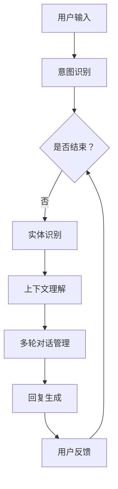

                 

### 《Dialogue Systems原理与代码实例讲解》

#### 关键词：对话系统，自然语言处理，意图识别，实体识别，对话管理，代码实例

> _本文将深入探讨对话系统的原理，涵盖基础知识、核心概念、自然语言处理、对话系统架构与设计、对话管理、对话系统的实现与部署，以及对话系统的应用与实践。最后，我们将展望对话系统的未来发展趋势，并解答常见问题。_

---

**本文目录大纲：**

### 第一部分：基础知识与核心概念

#### 第1章：对话系统概述

##### 1.1 对话系统的定义与分类

##### 1.2 对话系统的发展历程

##### 1.3 对话系统的核心概念

### Mermaid 流程图

### 第2章：对话系统中的自然语言处理

##### 2.1 语言模型

##### 2.2 词嵌入技术

##### 2.3 语义理解

### 伪代码：语义理解算法

#### 第3章：对话系统架构与设计

##### 3.1 对话系统架构

##### 3.2 对话系统设计原则

##### 3.3 对话系统实现策略

### 数学模型讲解

#### 第4章：对话系统中的对话管理

##### 4.1 对话状态跟踪

##### 4.2 对话策略学习

##### 4.3 对话系统评估

#### 第5章：对话系统的实现与部署

##### 5.1 对话系统开发环境搭建

##### 5.2 对话系统代码实例

##### 5.3 部署与运维

#### 第6章：对话系统的应用与实践

##### 6.1 对话系统在客服领域的应用

##### 6.2 对话系统在电子商务领域的应用

##### 6.3 对话系统在教育领域的应用

#### 第7章：对话系统的未来发展趋势

##### 7.1 深度学习在对话系统中的应用

##### 7.2 对话系统的伦理与隐私问题

##### 7.3 对话系统的挑战与展望

### 附录

#### 附录 A：资源与工具汇总

#### 附录 B：对话系统项目实战案例

#### 附录 C：对话系统常见问题解答

---

**正文内容撰写开始：**<|less|>### 第1章：对话系统概述

#### 1.1 对话系统的定义与分类

对话系统（Dialogue System），也常被称为聊天机器人或会话代理，是一种与人类用户进行自然语言交互的计算机系统。它能够理解用户的输入，根据对话上下文生成恰当的回复，并在多轮对话中持续互动，以满足用户的需求。

根据实现方式和能力，对话系统可以分为以下几类：

1. **基于规则的方法（Rule-Based Systems）**：
   这种方法依赖于预定义的规则和模板，对话流程和回复内容都由规则决定。当用户输入与规则匹配时，系统会自动生成相应的回复。

2. **基于机器学习的方法（Machine Learning-Based Systems）**：
   这类系统利用机器学习算法，从大量对话数据中学习模式，以生成更自然的对话。它们通常使用监督学习或无监督学习算法来训练模型。

3. **基于混合的方法（Hybrid Systems）**：
   结合了规则方法和机器学习方法，这类系统在规则和机器学习算法之间做出权衡，以提高对话的灵活性和准确性。

#### 1.2 对话系统的发展历程

对话系统的历史可以追溯到20世纪60年代，最早的对话系统是基于规则的自然语言理解系统。随着时间的推移，随着计算能力的提升和自然语言处理技术的进步，对话系统经历了多个发展阶段：

- **早期对话系统（1960s-1980s）**：
  这个阶段出现了许多经典的对话系统，如ELIZA和Parable，它们基于简单的模式匹配和预设的规则进行对话。

- **基于知识的对话系统（1980s-2000s）**：
  随着知识表示和推理技术的发展，对话系统开始引入更多的语义理解和推理能力。例如，专家系统和基于框架的方法在这个阶段得到了广泛应用。

- **基于统计的方法（2000s-2010s）**：
  自然语言处理技术的进步，特别是统计机器学习方法的兴起，使得对话系统能够通过大量数据自动学习对话模式。

- **深度学习时代的对话系统（2010s-至今）**：
  深度学习技术的发展，特别是神经网络和生成对抗网络（GANs）的引入，使得对话系统能够更准确地理解和生成自然语言。预训练语言模型（如GPT）的出现更是将对话系统的性能推向了新的高度。

#### 1.3 对话系统的核心概念

对话系统涉及多个核心概念，以下将简要介绍：

- **用户意图识别（User Intent Recognition）**：
  用户意图是指用户通过输入表达的需求或期望。识别用户意图是对话系统的关键任务，有助于确定系统如何响应用户。

- **实体识别（Entity Recognition）**：
  实体是指对话中具有特定意义的词语或短语，如人名、地名、日期等。实体识别是理解用户意图的重要步骤。

- **上下文理解（Context Understanding）**：
  上下文是对话中影响当前交互的背景信息。上下文理解有助于对话系统更好地理解和生成回复。

- **多轮对话管理（Dialogue Management）**：
  多轮对话管理是指系统在多轮对话中跟踪对话状态，调整对话策略，以实现有效的用户交互。

### Mermaid 流程图

以下是对话系统的基本流程图：

通过这个流程图，我们可以看出对话系统是如何从用户输入开始，通过意图识别、实体识别、上下文理解和多轮对话管理，最终生成回复，并反馈给用户的。

### 1.4 对话系统的核心挑战

尽管对话系统在过去几十年取得了显著进展，但仍然面临多个核心挑战：

- **自然语言理解的局限性**：
  对话系统在理解自然语言时存在局限性，特别是在处理歧义、隐含意义和非标准表达方面。

- **多轮对话的复杂性**：
  多轮对话管理复杂，需要系统在不同对话阶段保持对话一致性，并适应用户的不同需求和反馈。

- **性能和资源消耗**：
  高性能的对话系统通常需要大量的计算资源和数据支持，这对系统的部署和维护提出了挑战。

- **用户体验**：
  对话系统的用户体验直接影响到用户满意度。需要系统提供自然、流畅且准确的交互体验。

#### 结论

对话系统作为一种与人类用户进行自然语言交互的技术，具有广泛的应用前景。通过深入了解对话系统的定义、分类、发展历程和核心概念，我们可以更好地理解其工作原理和面临的挑战。在接下来的章节中，我们将进一步探讨对话系统中的自然语言处理、对话系统架构与设计、对话管理以及实现与部署等方面的内容。这将有助于我们更全面地掌握对话系统的技术细节和应用方法。

---

本文首先介绍了对话系统的定义与分类，从基于规则的系统到基于机器学习的方法，再到基于混合的方法，帮助读者理解不同类型的对话系统及其特点。随后，回顾了对话系统的发展历程，从早期基于规则的系统到现代深度学习驱动的系统，展示了技术的演变。接着，详细阐述了对话系统的核心概念，包括用户意图识别、实体识别、上下文理解和多轮对话管理，并通过Mermaid流程图展示了对话系统的基本工作流程。

接下来，我们将在第2章深入探讨对话系统中的自然语言处理，包括语言模型、词嵌入技术和语义理解，通过伪代码详细阐述语义理解算法的基本原理。第3章将介绍对话系统的架构与设计，包括对话管理模块、自然语言理解模块和自然语言生成模块，并讨论设计原则和实现策略。数学模型讲解将帮助我们理解模型评估指标的计算方法，如准确率、召回率和F1值。

在第4章，我们将聚焦于对话管理，详细讨论对话状态跟踪、对话策略学习和对话系统评估，探讨如何通过技术手段提升对话系统的性能和用户体验。第5章将介绍对话系统的实现与部署，包括开发环境搭建、代码实例和部署与运维。第6章将展示对话系统在不同领域的应用，如客服、电子商务和教育，并通过具体案例深入分析其实现方法和挑战。最后，第7章将展望对话系统的未来发展趋势，讨论深度学习、伦理与隐私问题以及对话系统的挑战与展望。

通过本文的阅读，读者将对对话系统的原理、实现和应用有更全面和深入的了解，为实际开发和部署对话系统奠定坚实的基础。

