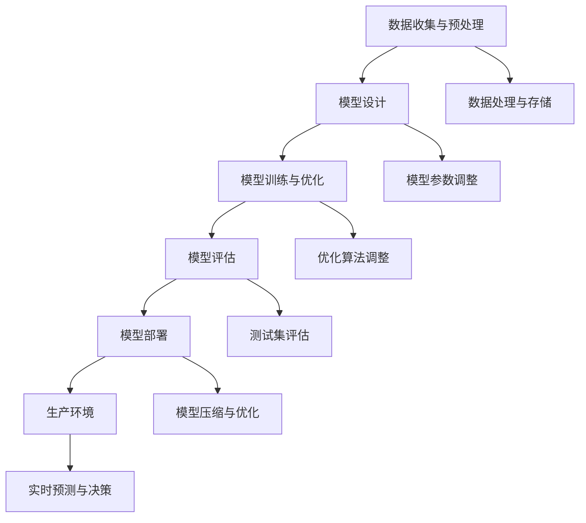

                 

### 《技术发展趋势：大模型创业的基础保障》

> **关键词：** 人工智能、大模型、创业、技术趋势、深度学习、数学模型

**摘要：**本文深入探讨了当前技术发展趋势下，大模型创业所面临的机遇与挑战。文章从大模型的技术基础、核心概念、算法原理、数学模型以及项目实战等多个角度出发，系统地分析了大模型创业的各个关键环节，为读者提供了全面的理论指导和实践参考。通过本文的阅读，读者将能够了解大模型创业的内在逻辑，掌握大模型技术的核心要点，从而为自身创业提供坚实的基础。

### 第一部分：引言

#### 第1章：大模型创业的时代背景

#### 1.1 技术发展趋势概述

随着人工智能技术的快速发展，大数据的日益积累，以及计算能力的显著提升，大模型技术逐渐成为学术界和产业界关注的焦点。大模型技术是指通过大规模神经网络，处理海量数据，从而实现对复杂问题的建模和预测。这一技术趋势不仅推动了人工智能领域的进步，也为创业公司带来了前所未有的机遇。

首先，人工智能与大数据的融合为大模型技术的快速发展奠定了基础。随着大数据技术的成熟，数据获取和处理变得更加高效，为人工智能算法提供了丰富的训练资源。同时，人工智能技术的发展，尤其是深度学习算法的突破，使得大模型在图像识别、自然语言处理、推荐系统等领域的应用变得日益广泛。

其次，大模型的快速迭代是当前技术发展的一个重要特征。随着算法的进步和计算资源的增加，大模型的规模和复杂度不断提升，不断推动着技术的前沿。这种快速迭代的特点，使得大模型技术在短时间内取得了显著的进展，也为创业公司提供了广阔的创新空间。

最后，大模型创业不仅有助于解决复杂问题，提高企业竞争力，还能创造新的业务模式。通过大模型技术，创业公司可以开发出更高效、更智能的产品和服务，从而在激烈的市场竞争中脱颖而出。此外，大模型技术还能够推动产业升级和转型，为社会带来更多的价值和机遇。

#### 1.2 大模型创业的意义与价值

大模型创业在当前技术背景下具有重要意义和价值。首先，大模型技术能够解决复杂问题。传统的计算模型在处理复杂问题时，往往需要大量的时间和计算资源。而大模型技术通过引入大规模神经网络，能够在较短的时间内处理海量数据，从而实现对复杂问题的建模和预测。这种高效的处理能力，使得大模型在各个领域都有着广泛的应用前景。

其次，大模型创业能够提高企业竞争力。在当前技术环境下，拥有先进的技术能力和创新思维的企业，往往能够在市场中占据优势地位。大模型技术作为一种新兴的技术趋势，具有显著的竞争优势。通过运用大模型技术，企业可以开发出更智能、更高效的产品和服务，从而提高市场竞争力。

此外，大模型创业还能够创造新的业务模式。传统业务模式往往依赖于简单的计算模型，而大模型技术能够实现对复杂业务逻辑的建模和优化。这种业务模式的创新，不仅能够提高企业的运营效率，还能够为企业带来新的商业模式和利润增长点。

#### 1.3 大模型创业的现状与未来展望

当前，大模型创业已经成为了国内外创业公司关注的热点。从全球范围来看，大模型创业主要集中在人工智能、大数据、云计算等领域。许多创业公司通过自主研发或合作引进大模型技术，开发出了一系列具有创新性的产品和服务。

在国内，随着政策支持和市场需求的不断增长，大模型创业逐渐兴起。众多创业公司纷纷布局大模型技术，推出了一系列智能化的产品和服务。例如，在医疗健康领域，创业公司利用大模型技术进行疾病诊断和预测；在金融领域，创业公司通过大模型技术提供智能投顾和风险控制服务；在零售领域，创业公司利用大模型技术实现智能推荐和个性化营销。

未来，大模型创业将继续保持快速增长。一方面，随着技术的不断迭代和成熟，大模型的应用领域将不断扩展，为创业公司提供更多的创新机会。另一方面，随着大数据、云计算等基础设施的不断完善，大模型创业的门槛将逐渐降低，吸引更多的创业者进入这一领域。

总的来说，大模型创业在当前技术背景下具有广阔的发展前景。创业者需要紧跟技术趋势，抓住市场机遇，通过不断创新和优化，推动大模型技术的应用和发展。### 第2章：大模型技术基础

#### 2.1 大模型的定义与分类

大模型是指具有巨大参数量、复杂结构、能够处理海量数据并进行高效计算的人工智能模型。大模型通常基于深度学习技术，通过大规模神经网络架构来模拟和解决问题。根据不同应用场景和任务需求，大模型可以分为多种类型，主要包括以下几种：

1. **神经网络基础**：神经网络（Neural Network，NN）是构建大模型的基础。神经网络由大量简单的计算单元（神经元）组成，通过前向传播和反向传播算法进行学习和优化。典型的神经网络包括多层感知机（MLP）、卷积神经网络（CNN）和循环神经网络（RNN）等。

2. **大模型的发展历程**：大模型技术起源于20世纪80年代的神经网络研究。随着计算能力的提升和算法的改进，神经网络在图像识别、自然语言处理等领域的性能逐渐提升。近年来，随着深度学习技术的突破，大模型的应用范围进一步扩大，如生成对抗网络（GAN）、变压器（Transformer）等新兴模型的出现，标志着大模型技术进入了新的发展阶段。

3. **常见大模型分类**：
   - **生成对抗网络（GAN）**：GAN由生成器和判别器两个网络构成，通过对抗训练生成逼真的数据。
   - **变压器（Transformer）**：Transformer模型采用自注意力机制，在自然语言处理等领域取得了显著成果。
   - **变分自编码器（VAE）**：VAE通过概率编码实现数据的生成和压缩。
   - **图神经网络（GNN）**：GNN适用于处理图结构数据，如社交网络、知识图谱等。

#### 2.2 大模型的构建与训练

构建大模型是一个复杂的过程，需要从数据收集、预处理、模型设计到训练和优化等多个环节进行系统规划。

1. **数据收集与预处理**：数据是构建大模型的基础。数据收集包括从公共数据集、私有数据集和第三方数据源获取数据。数据预处理包括数据清洗、数据增强和特征提取等步骤，目的是提高数据的质量和模型的训练效果。

2. **大模型的架构设计**：大模型的架构设计决定了模型的结构和性能。常见的架构设计包括网络层数、神经元数量、激活函数、损失函数等。在架构设计过程中，需要综合考虑模型复杂度、计算资源和训练时间等因素。

3. **训练策略与优化算法**：大模型的训练通常采用批量训练或在线训练策略。优化算法包括随机梯度下降（SGD）、动量优化（Momentum）、Adam优化器等，这些算法通过调整学习率、动量等参数，优化模型的性能。

4. **模型训练与优化**：模型训练是通过迭代计算，不断调整模型参数，使其在训练数据上达到最优状态。在训练过程中，需要监控模型性能，调整训练策略，以提高模型的泛化能力和预测精度。

#### 2.3 大模型的评估与部署

评估大模型性能是确保模型可靠性和实用性的关键步骤。常见的评估指标包括准确率、召回率、F1分数等。评估方法包括交叉验证、网格搜索等。

1. **评估指标与方法**：评估指标需要根据具体任务选择，例如，在图像分类任务中，使用准确率；在文本分类任务中，使用F1分数。评估方法需要确保模型的泛化能力，避免过拟合。

2. **部署策略与注意事项**：大模型部署包括模型导出、模型压缩、模型优化等步骤。部署策略需要考虑计算资源、模型大小和性能要求。在部署过程中，需要注意模型的稳定性和安全性，确保在实际应用中能够稳定运行。

总之，大模型技术是当前人工智能领域的重要研究方向。通过深入理解大模型的定义、分类、构建与训练、评估与部署，创业者可以更好地把握技术趋势，实现大模型创业的成功。### 第3章：大模型核心概念解析

#### 3.1 机器学习与人工智能

机器学习和人工智能是密切相关的两个概念。机器学习（Machine Learning，ML）是人工智能（Artificial Intelligence，AI）的一个重要分支，主要研究如何通过计算机程序实现机器自动学习，并使其能够从数据中获取知识和规律，从而进行智能决策。

1. **机器学习的基本原理**：机器学习通过设计算法，从训练数据中学习规律，并将其应用到新的数据上。这个过程主要包括数据预处理、模型训练、模型评估和模型优化等步骤。机器学习算法可以分为监督学习、无监督学习和强化学习三大类。

   - **监督学习**：有明确标签的训练数据，用于训练模型，然后对新数据进行预测。
   - **无监督学习**：没有标签的训练数据，通过数据自身的特征进行聚类、降维等操作。
   - **强化学习**：通过与环境的交互，不断调整策略，以实现最优目标。

2. **人工智能的发展历程**：人工智能的研究始于20世纪50年代，经历了多个发展阶段。早期的逻辑符号主义和知识表示方法，逐渐发展为基于统计和数据驱动的机器学习时代。近年来，随着深度学习等技术的突破，人工智能在图像识别、自然语言处理、自动驾驶等领域取得了显著进展。

3. **机器学习与人工智能的关系**：机器学习是实现人工智能的核心技术之一。人工智能的目标是通过计算机模拟人类的智能行为，而机器学习是实现这一目标的主要途径。通过机器学习，计算机可以学习和适应新的环境和任务，从而实现智能化。

#### 3.2 数据科学与数据分析

数据科学（Data Science，DS）是研究如何从数据中提取有价值信息，并应用于实际问题的交叉学科。数据分析（Data Analysis，DA）是数据科学的核心组成部分，主要研究如何通过统计方法和算法，对数据进行处理和分析，提取有用的知识和洞察。

1. **数据科学的定义与范畴**：数据科学涵盖了数据采集、存储、处理、分析和可视化等多个环节。其主要任务是利用数据，为决策提供科学依据。数据科学的范畴包括统计学、计算机科学、信息科学等多个领域。

2. **数据分析的基本方法**：数据分析包括描述性分析、探索性分析、预测性分析和决策性分析等。描述性分析用于了解数据的基本特征；探索性分析用于发现数据中的规律和异常；预测性分析用于对未来趋势进行预测；决策性分析用于支持决策制定。

3. **数据科学在大模型创业中的应用**：数据科学在大模型创业中扮演着关键角色。在大模型训练和部署过程中，数据科学可以提供数据预处理、特征提取、模型评估和优化等方面的支持。通过数据科学的方法，创业公司可以更好地理解数据，提高模型的性能和可靠性，从而在市场竞争中脱颖而出。

#### 3.3 大模型与深度学习

深度学习（Deep Learning，DL）是机器学习的一个分支，主要研究如何构建多层神经网络，实现自动特征提取和高级任务学习。大模型（Big Model）是深度学习发展的重要成果，通过大规模神经网络处理海量数据，实现对复杂问题的建模和预测。

1. **深度学习的基本原理**：深度学习基于神经元模型，通过多层次的神经网络结构，逐层提取数据中的特征。深度学习的核心在于自下而上的特征学习，即底层特征具有低层次的概念，如边缘和纹理，而高层特征则具有高层次的概念，如形状和语义。

2. **深度学习与大数据的关系**：深度学习的发展离不开大数据的支持。大数据提供了丰富的训练数据，使得深度学习模型可以从中学习到更多的特征和规律。同时，大数据的存储和处理技术的进步，为深度学习模型的训练和部署提供了有力的保障。

3. **大模型在深度学习中的核心地位**：大模型是深度学习的核心成果，通过大规模神经网络结构，实现高效的特征提取和复杂问题的建模。大模型在图像识别、自然语言处理、推荐系统等领域取得了显著的成果，推动了人工智能技术的发展。

综上所述，大模型技术是人工智能和深度学习发展的重要成果，数据科学为其提供了基础支持。理解大模型的核心概念和关系，有助于创业者在技术和市场上取得成功。在接下来的章节中，我们将进一步探讨大模型的架构与流程，以及核心算法原理和数学模型。### 第4章：大模型架构与流程图

#### 4.1 大模型架构概述

大模型架构是指构建和部署大模型所需的整体结构和组件。一个典型的大模型架构通常包括数据层、模型层、训练层和部署层等几个关键部分。以下是这些层的详细描述：

1. **数据层**：数据层负责数据收集、清洗、预处理和存储。数据源可以是公共数据集、私有数据集或第三方数据服务。数据层的主要任务是将原始数据转换为适合模型训练的形式。

2. **模型层**：模型层是架构的核心，包括神经网络架构、激活函数、损失函数等。常见的神经网络架构有卷积神经网络（CNN）、循环神经网络（RNN）和变压器（Transformer）等。模型层的设计决定了模型的性能和效率。

3. **训练层**：训练层负责模型的训练和优化。通过批量训练或在线训练策略，模型层对训练数据进行迭代优化，以调整模型参数。训练层还包括超参数调优、训练策略设计和模型评估等。

4. **部署层**：部署层将训练好的模型部署到生产环境中，使其能够进行实时预测和决策。部署层包括模型压缩、模型优化和模型监控等，以确保模型在生产环境中的稳定性和可靠性。

#### 4.2 大模型构建流程

大模型构建流程包括数据收集与预处理、模型设计、模型训练与优化、模型评估与部署等几个关键步骤。以下是这些步骤的详细描述：

1. **数据收集与预处理**：数据收集是从各种数据源获取所需的训练数据。数据预处理包括数据清洗、数据增强、数据标准化和特征提取等，以确保数据的质量和一致性。

2. **模型设计**：模型设计是根据任务需求选择合适的神经网络架构，设计模型参数，如层数、神经元数量、激活函数等。模型设计还需要考虑计算资源和训练时间等因素。

3. **模型训练与优化**：模型训练是通过迭代计算，调整模型参数，使其在训练数据上达到最优状态。优化算法包括随机梯度下降（SGD）、动量优化（Momentum）和Adam优化器等。在训练过程中，需要监控模型性能，调整训练策略，以提高模型的泛化能力和预测精度。

4. **模型评估与部署**：模型评估是通过测试集对模型性能进行评估，选择最佳模型。部署策略包括模型导出、模型压缩、模型优化等，以确保模型在生产环境中的稳定性和可靠性。

#### 4.3 大模型联系流程图

为了更好地理解大模型的构建和部署流程，我们可以使用Mermaid流程图来展示整个流程。以下是示例的Mermaid流程图：

这个流程图清晰地展示了从数据收集到模型部署的全过程，每个步骤之间的联系和依赖关系一目了然。通过这样的流程图，可以帮助读者更好地理解大模型构建与部署的整体架构和流程。

总之，大模型架构与流程图是理解大模型构建和部署的重要工具。通过详细描述大模型架构的各个层以及构建流程的各个步骤，读者可以系统地掌握大模型技术的核心要点，为后续的算法原理和数学模型学习打下坚实的基础。### 第5章：深度学习算法详解

#### 5.1 深度学习基础

深度学习（Deep Learning，DL）是机器学习（Machine Learning，ML）的一个重要分支，主要研究如何通过构建深层神经网络来模拟人脑的学习过程，实现自动特征提取和高级任务学习。以下是深度学习的一些基础概念：

1. **神经元与神经网络**：神经元是神经网络的基本计算单元，类似于人脑中的神经元。每个神经元接收多个输入信号，通过权重和偏置进行加权求和，然后通过激活函数进行非线性变换，输出结果。神经网络由多个层级组成，包括输入层、隐藏层和输出层。

2. **激活函数**：激活函数是神经网络中用于引入非线性特性的函数。常见的激活函数包括 sigmoid、ReLU（Rectified Linear Unit）和 tanh（双曲正切函数）等。激活函数的选择直接影响神经网络的性能和训练速度。

3. **反向传播算法**：反向传播算法（Backpropagation Algorithm）是深度学习中的核心算法，用于计算神经网络中各层的梯度，从而更新权重和偏置。反向传播算法通过前向传播计算输出值，然后反向传播计算误差，逐步更新网络参数，以达到优化模型性能的目的。

#### 5.2 深度学习优化算法

深度学习优化算法是用于加速模型训练和提升模型性能的重要技术。以下是几种常见的深度学习优化算法：

1. **随机梯度下降（SGD）**：随机梯度下降是最常用的优化算法之一。SGD通过随机选取一部分训练样本，计算其梯度，然后更新模型参数。SGD简单有效，但容易陷入局部最优。

2. **动量优化（Momentum）**：动量优化是一种改进的SGD算法，通过引入动量项，使参数更新方向更加稳定。动量优化可以加速训练过程，并减少振荡。

3. **Adam优化器**：Adam优化器是一种结合了SGD和动量优化的自适应优化算法。Adam优化器根据训练过程中的梯度和历史梯度，自适应调整学习率，从而在提高训练速度的同时，减小收敛时间。

#### 5.3 卷积神经网络（CNN）

卷积神经网络（Convolutional Neural Network，CNN）是深度学习中的一个重要分支，专门用于处理图像等二维数据。以下是CNN的核心组成部分：

1. **卷积层**：卷积层是CNN的核心层，通过卷积运算提取图像中的局部特征。卷积层包含多个卷积核（filter），每个卷积核在图像上滑动，生成特征图（feature map）。

2. **池化层**：池化层用于降低特征图的维度，减少模型参数数量，提高计算效率。常见的池化方法有最大池化和平均池化。

3. **全连接层**：全连接层是CNN的输出层，将卷积层和池化层提取的特征映射到具体的类别或标签。

4. **损失函数**：损失函数用于评估模型预测结果与真实结果之间的差距。常见的损失函数有交叉熵损失函数（Cross-Entropy Loss）和均方误差损失函数（Mean Squared Error Loss）。

#### 5.4 循环神经网络（RNN）与长短期记忆网络（LSTM）

循环神经网络（Recurrent Neural Network，RNN）是一种适用于序列数据的深度学习模型，能够处理时间序列、文本等数据。以下是RNN和长短期记忆网络（Long Short-Term Memory，LSTM）的一些基本概念：

1. **RNN的基本原理**：RNN通过循环结构，将当前时刻的输入与之前时刻的隐藏状态进行结合，生成当前时刻的输出。RNN能够处理变长的序列数据，但容易受到梯度消失和梯度爆炸的问题。

2. **LSTM的结构与优势**：LSTM是RNN的一种改进模型，通过引入记忆单元和门控机制，解决了RNN的梯度消失问题。LSTM能够在长序列中保持有效的长期依赖关系，适用于复杂的时间序列建模任务。

3. **RNN与LSTM的应用场景**：RNN和LSTM广泛应用于自然语言处理、语音识别、视频分析等领域。RNN适用于简单的序列建模任务，而LSTM适用于具有长期依赖关系的复杂序列任务。

通过详细解析深度学习的基础、优化算法、CNN和RNN与LSTM，读者可以深入理解深度学习的核心技术和原理。这些知识将为后续章节中的大模型训练与优化、数学模型讲解和项目实战提供坚实的理论基础。### 第6章：大模型训练与优化

#### 6.1 数据预处理与增强

在深度学习和大模型训练过程中，数据预处理与增强是至关重要的一环。它们不仅影响模型的训练效果，还决定着模型的泛化能力和实际应用价值。

1. **数据预处理**：数据预处理主要包括数据清洗、归一化和特征提取等步骤。

   - **数据清洗**：数据清洗是去除数据中的噪声和错误，包括处理缺失值、去除重复数据、纠正错误数据等。高质量的数据是模型训练的基础，因此数据清洗是必不可少的步骤。
   
   - **数据归一化**：数据归一化是将不同尺度的数据转换到相同的尺度范围内，以便于模型训练。常用的归一化方法包括最小-最大缩放和标准化处理。通过数据归一化，可以加快模型的训练速度，提高模型的性能。
   
   - **特征提取**：特征提取是从原始数据中提取出对模型训练有代表性的特征。特征提取的有效性直接影响到模型的性能。常用的特征提取方法包括主成分分析（PCA）、独立成分分析（ICA）和自编码器（Autoencoder）等。

2. **数据增强**：数据增强是通过人工手段增加训练数据的多样性，从而提高模型的泛化能力。数据增强的方法包括：

   - **随机旋转**：将图像随机旋转一定角度，增加数据的多样性。
   
   - **随机裁剪**：随机裁剪图像的一部分，模拟不同的观察角度和场景。
   
   - **色彩调整**：对图像的色彩进行随机调整，如亮度、对比度和饱和度等。
   
   - **噪声添加**：在图像上添加噪声，模拟不同的环境条件和光照条件。

通过数据预处理与增强，可以有效提高模型的训练效果和泛化能力，为后续的模型训练和优化打下坚实的基础。

#### 6.2 模型选择与超参数调优

在深度学习和大模型训练过程中，模型选择和超参数调优是优化模型性能的重要手段。

1. **模型选择**：模型选择是指根据具体的任务需求，选择合适的神经网络架构。常见的神经网络架构包括卷积神经网络（CNN）、循环神经网络（RNN）、长短期记忆网络（LSTM）和变压器（Transformer）等。选择合适的模型架构需要考虑以下因素：

   - **任务类型**：不同的任务类型需要不同的模型架构。例如，图像分类任务通常使用CNN，而自然语言处理任务则更适合使用RNN或Transformer。
   
   - **数据规模**：大规模数据集更适合使用复杂度较高的模型，而小规模数据集则更适合使用简单模型。
   
   - **计算资源**：模型的复杂度和计算资源直接相关。在有限的计算资源下，需要选择计算效率较高的模型。

2. **超参数调优**：超参数是模型架构之外的重要参数，包括学习率、批量大小、层数、神经元数量等。超参数调优的目标是找到最优的超参数组合，以最大化模型的性能。常用的超参数调优方法包括：

   - **网格搜索**：网格搜索是一种系统化的超参数调优方法，通过遍历所有可能的超参数组合，找到最优的超参数组合。虽然网格搜索能够找到全局最优解，但计算成本较高。
   
   - **随机搜索**：随机搜索是一种基于概率的调优方法，通过随机选择超参数组合，逐步优化模型的性能。随机搜索的计算成本较低，但可能无法找到全局最优解。
   
   - **贝叶斯优化**：贝叶斯优化是一种基于概率统计的调优方法，通过构建超参数的概率分布模型，找到最优的超参数组合。贝叶斯优化具有较高的调优精度和较低的搜索成本。

通过合理的模型选择和超参数调优，可以显著提高大模型的性能和泛化能力，为实际应用提供更加可靠的支持。

#### 6.3 模型训练与评估

1. **模型训练**：模型训练是通过迭代计算，不断调整模型参数，使其在训练数据上达到最优状态。模型训练过程主要包括以下步骤：

   - **初始化参数**：初始化模型参数，通常采用随机初始化或预训练模型初始化。
   
   - **前向传播**：将输入数据输入到模型中，通过前向传播计算输出结果，并与真实标签进行比较。
   
   - **计算损失**：计算模型输出结果与真实标签之间的损失，常用的损失函数包括均方误差（MSE）、交叉熵（CE）等。
   
   - **反向传播**：通过反向传播计算模型参数的梯度，更新模型参数。
   
   - **迭代优化**：重复前向传播和反向传播的过程，逐步优化模型参数，直到达到预设的训练目标。

2. **模型评估**：模型评估是评估模型性能的重要环节。常用的评估指标包括准确率（Accuracy）、召回率（Recall）、精确率（Precision）和F1分数（F1 Score）等。模型评估的方法包括：

   - **交叉验证**：交叉验证是一种将训练数据划分为多个子集的方法，通过在每个子集上训练和评估模型，评估模型的泛化能力。
   
   - **网格搜索**：网格搜索是一种系统化的评估方法，通过遍历所有可能的参数组合，评估模型的性能。
   
   - **留一法**：留一法是一种简单的评估方法，将每个样本一次作为测试集，其余样本作为训练集，评估模型的性能。

通过合理的模型训练和评估，可以确保大模型在实际应用中的稳定性和可靠性。

#### 6.4 模型优化与调优

模型优化与调优是提高模型性能和实际应用价值的关键步骤。以下是一些常用的模型优化与调优方法：

1. **模型融合**：模型融合是指将多个模型的结果进行整合，以获得更好的预测效果。常见的模型融合方法包括：

   - **加权融合**：对多个模型的预测结果进行加权平均，权重可以根据模型性能进行自适应调整。
   
   - **堆叠融合**：将多个模型堆叠在一起，前一个模型的输出作为下一个模型的输入，通过多层融合提高模型的性能。

2. **模型压缩**：模型压缩是指减少模型参数数量和计算复杂度，以提高模型的部署效率和计算性能。常用的模型压缩方法包括：

   - **量化**：将模型中的浮点数参数转换为低精度的整数参数，减少模型的存储和计算需求。
   
   - **剪枝**：通过去除模型中的冗余参数或神经元，减少模型的规模和计算复杂度。

3. **模型加速**：模型加速是指通过优化模型结构和计算流程，提高模型的计算速度。常用的模型加速方法包括：

   - **并行计算**：通过分布式计算和GPU加速，提高模型的训练和推理速度。
   
   - **模型蒸馏**：将高复杂度的模型知识传递到低复杂度的模型中，以实现模型加速和性能提升。

通过合理的模型优化与调优，可以显著提高大模型的性能和实际应用价值。

综上所述，大模型训练与优化是一个复杂而重要的过程，包括数据预处理与增强、模型选择与超参数调优、模型训练与评估以及模型优化与调优等多个环节。通过系统地学习和应用这些方法，可以构建高效、稳定的大模型，为实际应用提供强大的支持。### 第7章：大模型数学基础

#### 7.1 线性代数基础

线性代数是深度学习和大数据处理的基础，它在模型训练、特征提取和数据压缩等方面有着广泛的应用。以下是一些关键的线性代数概念：

1. **矩阵与向量运算**：
   - **矩阵乘法**：两个矩阵相乘的结果是一个新矩阵，其元素是原矩阵对应元素乘积的和。
   $$ C = A \times B $$
   - **向量运算**：向量是具有方向的量，其基本运算包括加法、减法和数乘。向量的加法和减法遵循向量空间的基本规则，数乘则是将向量的每个元素乘以同一个数。
   $$ \vec{v} + \vec{w} = \vec{u} $$
   $$ k \times \vec{v} = \vec{v}_k $$
   - **矩阵求导**：矩阵求导是计算矩阵相对于某个变量的导数。矩阵求导可以应用于优化算法中，用于更新模型参数。
   $$ \frac{d}{dx} [A \times B] = \frac{dA}{dx} \times B + A \times \frac{dB}{dx} $$

2. **线性方程组求解**：
   - **解线性方程组**：线性方程组是求解多个线性方程的集合。常用的解法包括高斯消元法和矩阵逆法。
   $$ Ax = b $$
   $$ x = A^{-1}b $$
   - **特征值与特征向量**：特征值和特征向量是矩阵的重要属性。特征值是矩阵的固有值，特征向量是与之对应的固有向量。它们在数据降维、特征提取和模型优化等方面有重要应用。
   $$ Av = \lambda v $$
   $$ v \neq 0 $$

3. **特征值与特征向量的计算**：
   - **特征值计算**：通过求解矩阵的特征方程，可以得到矩阵的特征值。
   $$ \det(A - \lambda I) = 0 $$
   - **特征向量计算**：特征向量是特征值对应的线性方程组的解。通过求解线性方程组，可以得到特征向量。
   $$ (A - \lambda I)v = 0 $$

#### 7.2 概率论与统计学基础

概率论和统计学是数据科学和机器学习的重要组成部分，它们为模型训练和评估提供了理论基础。以下是一些关键的概率论与统计学概念：

1. **概率分布函数**：
   - **离散概率分布**：离散概率分布描述了离散随机变量的概率分布情况，如伯努利分布、泊松分布等。
   $$ P(X = x) = p_x $$
   - **连续概率分布**：连续概率分布描述了连续随机变量的概率分布情况，如正态分布、均匀分布等。
   $$ f_X(x) $$
   - **概率密度函数**：概率密度函数是连续概率分布的数学表达式，表示随机变量在某个区间内的概率。
   $$ f_X(x) = \frac{1}{\sigma\sqrt{2\pi}}e^{-\frac{(x-\mu)^2}{2\sigma^2}} $$

2. **假设检验与置信区间**：
   - **假设检验**：假设检验是用于判断数据是否支持某个假设的方法。常见的假设检验方法包括t检验、卡方检验等。
   $$ H_0: \mu = \mu_0 $$
   $$ H_1: \mu \neq \mu_0 $$
   - **置信区间**：置信区间是用于估计参数范围的方法。置信区间提供了参数真实值的概率分布范围，用于评估模型的可靠性。
   $$ \mu \in (l, u) $$

3. **线性回归与逻辑回归**：
   - **线性回归**：线性回归是用于预测连续值的模型。通过拟合线性模型，可以建立自变量和因变量之间的关系。
   $$ y = \beta_0 + \beta_1x + \epsilon $$
   - **逻辑回归**：逻辑回归是用于预测二分类结果的模型。通过拟合逻辑模型，可以建立概率分布和自变量之间的关系。
   $$ \log\frac{P(Y=1)}{1-P(Y=1)} = \beta_0 + \beta_1x $$

#### 7.3 深度学习中的数学公式

深度学习中的数学公式是模型训练和优化的核心。以下是一些常用的数学公式：

1. **激活函数导数**：
   - **Sigmoid函数导数**：
   $$ \frac{d}{dx} \sigma(x) = \sigma(x)(1 - \sigma(x)) $$
   - **ReLU函数导数**：
   $$ \frac{d}{dx} \text{ReLU}(x) = \begin{cases} 
   0 & \text{if } x < 0 \\
   1 & \text{if } x \geq 0 
   \end{cases} $$
   - **Tanh函数导数**：
   $$ \frac{d}{dx} \text{Tanh}(x) = 1 - \text{Tanh}^2(x) $$

2. **损失函数导数**：
   - **均方误差（MSE）**：
   $$ \frac{d}{dx} \text{MSE}(y, \hat{y}) = 2(\hat{y} - y) $$
   - **交叉熵（Cross-Entropy）**：
   $$ \frac{d}{dx} \text{CE}(y, \hat{y}) = \hat{y} - y $$

3. **反向传播算法公式**：
   - **前向传播**：
   $$ z^{(l)} = \sum_{j} w^{(l)}_{ji}a^{(l-1)}_j + b^{(l)} $$
   $$ a^{(l)} = \sigma(z^{(l)}) $$
   - **反向传播**：
   $$ \delta^{(l)} = \frac{\partial \text{Loss}}{\partial z^{(l)}} \odot \sigma'(z^{(l)}) $$
   $$ \Delta^{(l)}_w = \sum_{i} a^{(l-1)}_i \delta^{(l)}_i $$
   $$ \Delta^{(l)}_b = \sum_{i} \delta^{(l)}_i $$

通过理解这些数学公式，读者可以更好地掌握深度学习中的核心概念，为后续的模型构建和优化提供坚实的理论基础。### 第8章：大模型数学应用与举例说明

#### 8.1 线性代数应用

线性代数在深度学习和大数据处理中扮演着关键角色，尤其在特征提取、降维和数据聚类等方面有着广泛的应用。以下是一些线性代数在深度学习中的具体应用：

1. **特征提取与降维**：
   - **特征提取**：在深度学习中，特征提取是通过多层神经网络自动地从原始数据中学习到具有区分性的特征。特征提取的一个关键步骤是利用矩阵运算来转换和组合数据特征。例如，通过矩阵乘法和特征变换，可以提取出具有代表性的低维特征表示。
   $$ X' = WX $$
   其中，\( X \) 是输入数据矩阵，\( W \) 是特征提取矩阵，\( X' \) 是提取后的特征矩阵。

   - **降维**：降维是减少数据维度以降低计算复杂度和提高模型效率的过程。常见的降维方法包括主成分分析（PCA）和线性判别分析（LDA）。PCA通过求解特征值和特征向量，将数据投影到低维空间，保留主要特征。
   $$ Z = P\Lambda $$
   其中，\( Z \) 是降维后的数据矩阵，\( P \) 是特征向量矩阵，\( \Lambda \) 是特征值矩阵。

2. **数据聚类与分类**：
   - **数据聚类**：数据聚类是通过无监督学习方法将数据划分为若干个类别的过程。常见的聚类算法包括K-means聚类和层次聚类。K-means聚类通过最小化平方误差来迭代更新聚类中心，实现数据的自动分组。
   $$ \text{Minimize} \sum_{i=1}^{k} \sum_{x \in S_i} ||x - \mu_i||^2 $$
   其中，\( S_i \) 是第 \( i \) 个聚类的数据集合，\( \mu_i \) 是聚类中心。

   - **分类**：分类是通过有监督学习方法将数据标签预测到预定义类别中的过程。常见的分类算法包括线性分类器和支持向量机（SVM）。线性分类器通过求解线性方程组，将数据点分类到不同的类别。
   $$ w \cdot x + b = 0 $$
   其中，\( w \) 是分类器权重，\( x \) 是输入数据点，\( b \) 是偏置项。

#### 8.2 概率论与统计学应用

概率论和统计学在深度学习模型评估、预测和优化中发挥着重要作用。以下是一些概率论和统计学在深度学习中的具体应用：

1. **数据异常检测**：
   - **基于概率分布的异常检测**：通过分析数据的概率分布，可以识别出异常值。常见的异常检测方法包括高斯分布假设的Z分数法和基于概率密度函数的局部异常因子（LOF）法。
   $$ z = \frac{x - \mu}{\sigma} $$
   其中，\( x \) 是数据点，\( \mu \) 是均值，\( \sigma \) 是标准差。

2. **时间序列分析**：
   - **自回归模型（AR）**：自回归模型是用于预测时间序列数据的常用模型。AR模型通过分析时间序列数据的滞后关系，建立预测模型。
   $$ X_t = \phi_1X_{t-1} + \phi_2X_{t-2} + ... + \phi_pX_{t-p} + \varepsilon_t $$
   其中，\( X_t \) 是时间序列数据，\( \phi_i \) 是滞后系数，\( \varepsilon_t \) 是误差项。

#### 8.3 深度学习数学应用举例

以下是几个具体的深度学习应用案例，展示数学公式在实际问题中的应用：

1. **手写数字识别**：
   - **数据预处理**：手写数字数据通常需要进行归一化和去噪处理，以减少数据的干扰和提高模型的准确性。
   $$ x_{\text{norm}} = \frac{x - \text{mean}}{\text{std}} $$
   - **模型训练**：通过卷积神经网络（CNN）对手写数字数据进行训练，利用反向传播算法进行参数优化。
   $$ \delta^{(l)} = \text{ReLU}'(z^{(l)}) \odot (z^{(l)} - y) $$
   $$ \Delta^{(l)}_w = x^{(l-1)} \cdot \delta^{(l)} $$
   $$ \Delta^{(l)}_b = \sum \delta^{(l)} $$

2. **自然语言处理**：
   - **词嵌入**：通过词嵌入技术，将自然语言文本转换为稠密向量表示，以便于深度学习模型处理。
   $$ e_{\text{word}} = \text{Word2Vec}(w) $$
   - **Transformer模型**：Transformer模型采用自注意力机制，通过多头注意力机制和前馈神经网络，实现高效的自然语言处理。
   $$ \text{Attention}(Q, K, V) = \text{softmax}\left(\frac{QK^T}{\sqrt{d_k}}\right)V $$
   $$ \text{FFN}(x) = \max(0, xW_1 + b_1)W_2 + b_2 $$

通过上述数学应用和实例，读者可以更好地理解线性代数、概率论和统计学的原理，并在深度学习实践中加以应用。这些数学知识为构建高效、准确的大模型提供了坚实的理论基础。### 第9章：大模型数学公式详解

#### 9.1 线性代数公式详解

线性代数在深度学习中扮演着核心角色，以下是对关键线性代数公式的详细解释：

1. **矩阵乘法与矩阵求导**：
   - **矩阵乘法**：两个矩阵相乘的结果是一个新矩阵，其元素是原矩阵对应元素乘积的和。矩阵乘法的公式如下：
     $$ C = A \times B $$
     其中，\( A \) 和 \( B \) 是两个矩阵，\( C \) 是乘积矩阵。
   - **矩阵求导**：矩阵求导是计算矩阵相对于某个变量的导数。对于矩阵 \( A \) 和变量 \( x \)，矩阵求导的公式如下：
     $$ \frac{d}{dx} [A \times B] = \frac{dA}{dx} \times B + A \times \frac{dB}{dx} $$

2. **特征值与特征向量的计算**：
   - **特征值计算**：特征值是矩阵的固有值，通过求解特征方程可以得到特征值。特征值计算公式如下：
     $$ \det(A - \lambda I) = 0 $$
     其中，\( A \) 是矩阵，\( \lambda \) 是特征值，\( I \) 是单位矩阵。
   - **特征向量计算**：特征向量是特征值对应的线性方程组的解。通过求解线性方程组，可以得到特征向量。特征向量计算公式如下：
     $$ (A - \lambda I)v = 0 $$
     其中，\( v \) 是特征向量。

3. **矩阵分解**：
   - **奇异值分解（SVD）**：奇异值分解是矩阵分解的一种重要方法，用于降维和特征提取。SVD公式如下：
     $$ A = U \Sigma V^T $$
     其中，\( U \) 和 \( V \) 是正交矩阵，\( \Sigma \) 是对角矩阵，其对角线元素为奇异值。

4. **矩阵求逆**：
   - **矩阵求逆**：求逆矩阵是计算矩阵的逆矩阵的过程。求逆矩阵的公式如下：
     $$ A^{-1} = (A^T A)^{-1} A^T $$
     其中，\( A^T \) 是矩阵 \( A \) 的转置。

#### 9.2 概率论与统计学公式详解

概率论与统计学在深度学习中用于模型评估、决策和优化，以下是对关键公式的详细解释：

1. **概率分布函数**：
   - **伯努利分布**：伯努利分布是离散概率分布的一种，用于描述二元事件的发生概率。伯努利分布的概率质量函数（PMF）如下：
     $$ P(X = x) = p^x (1 - p)^{1 - x} $$
     其中，\( p \) 是事件发生的概率。
   - **正态分布**：正态分布是连续概率分布的一种，用于描述随机变量的概率分布。正态分布的概率密度函数（PDF）如下：
     $$ f(x; \mu, \sigma^2) = \frac{1}{\sigma\sqrt{2\pi}} e^{-\frac{(x-\mu)^2}{2\sigma^2}} $$
     其中，\( \mu \) 是均值，\( \sigma^2 \) 是方差。

2. **假设检验与置信区间**：
   - **Z检验**：Z检验是一种常用的假设检验方法，用于判断样本均值是否与总体均值有显著差异。Z检验的公式如下：
     $$ z = \frac{\bar{x} - \mu_0}{\sigma/\sqrt{n}} $$
     其中，\( \bar{x} \) 是样本均值，\( \mu_0 \) 是总体均值，\( \sigma \) 是总体标准差，\( n \) 是样本大小。
   - **置信区间**：置信区间是用于估计总体参数范围的方法。置信区间的公式如下：
     $$ \bar{x} \pm z_{\alpha/2} \frac{\sigma}{\sqrt{n}} $$
     其中，\( z_{\alpha/2} \) 是标准正态分布的临界值，\( \alpha \) 是显著性水平。

3. **线性回归与逻辑回归**：
   - **线性回归**：线性回归是用于预测连续值的模型，其公式如下：
     $$ y = \beta_0 + \beta_1 x + \epsilon $$
     其中，\( \beta_0 \) 是截距，\( \beta_1 \) 是斜率，\( x \) 是自变量，\( \epsilon \) 是误差项。
   - **逻辑回归**：逻辑回归是用于预测二分类结果的模型，其公式如下：
     $$ \log\frac{P(Y=1)}{1-P(Y=1)} = \beta_0 + \beta_1 x $$
     其中，\( P(Y=1) \) 是事件发生的概率，\( \beta_0 \) 和 \( \beta_1 \) 是模型参数。

通过详细解析这些线性代数和概率论与统计学的公式，读者可以更深入地理解深度学习中的数学原理，从而更好地应用于实际问题和模型构建。### 第10章：大模型创业项目案例

#### 10.1 项目背景与目标

本章节将通过三个具体的大模型创业项目案例，详细描述项目的背景、目标以及实现过程，以便读者更好地理解大模型在现实中的应用。

##### 案例一：智能家居语音助手

**项目背景**：
随着物联网技术的普及，智能家居设备逐渐成为人们日常生活的一部分。然而，用户与智能家居设备之间的交互方式仍然以手动操作为主，这限制了用户的便利性和体验。因此，开发一个能够通过语音识别和自然语言处理实现与智能家居设备交互的语音助手，成为了许多创业公司的目标。

**项目目标**：
本项目旨在开发一个智能家居语音助手，实现以下功能：
1. **语音识别**：准确识别用户的语音指令。
2. **自然语言处理**：理解用户指令的含义，并将其转换为设备可执行的操作。
3. **多设备联动**：根据用户的指令，控制家中的智能家居设备，如灯光、空调、门锁等。

**实现过程**：
1. **数据收集与预处理**：首先，从多个渠道收集语音数据，包括用户命令、背景噪音等。然后，对语音数据进行预处理，包括降噪、去噪、分词等步骤。

2. **模型设计与训练**：选择合适的语音识别和自然语言处理模型。例如，可以使用卷积神经网络（CNN）进行语音识别，使用长短期记忆网络（LSTM）进行自然语言处理。通过大量训练数据，训练模型以实现高精度的语音识别和自然语言理解。

3. **模型优化与部署**：在训练过程中，通过调整模型参数和超参数，优化模型的性能。训练完成后，将模型部署到智能家居设备中，实现语音识别和自然语言处理功能。

##### 案例二：医疗影像诊断系统

**项目背景**：
医疗影像诊断在疾病检测和诊断中起着重要作用，但传统的影像诊断依赖于专业医生，效率低下且存在误诊风险。通过开发一个基于深度学习的医疗影像诊断系统，可以显著提高诊断效率和准确性。

**项目目标**：
本项目旨在开发一个医疗影像诊断系统，实现以下功能：
1. **图像识别**：准确识别医疗影像中的关键病变区域。
2. **疾病分类**：将病变区域分类为不同类型的疾病。
3. **辅助诊断**：提供诊断建议，辅助医生做出更准确的诊断。

**实现过程**：
1. **数据收集与预处理**：收集大量的医疗影像数据，包括X光、CT、MRI等。对影像数据进行预处理，包括图像增强、数据增强、归一化等步骤，以提高模型训练效果。

2. **模型设计与训练**：选择合适的深度学习模型，如卷积神经网络（CNN）或卷积神经网络与循环神经网络（CNN+RNN）结合。通过大量训练数据，训练模型以实现高精度的图像识别和疾病分类。

3. **模型评估与优化**：在训练过程中，通过交叉验证和测试集评估模型性能。根据评估结果，调整模型参数和超参数，优化模型性能。模型优化完成后，部署到医疗影像诊断系统中，实现辅助诊断功能。

##### 案例三：自然语言处理应用

**项目背景**：
自然语言处理技术在信息检索、文本分析、智能客服等领域有着广泛的应用。然而，传统的自然语言处理方法在处理长文本、多语言文本等方面存在挑战。通过开发一个基于深度学习的自然语言处理应用，可以显著提升文本处理的效率和准确性。

**项目目标**：
本项目旨在开发一个自然语言处理应用，实现以下功能：
1. **文本分类**：将文本分类到预定义的类别中。
2. **情感分析**：分析文本的情感倾向，如正面、负面、中性等。
3. **问答系统**：构建问答系统，能够根据用户的问题提供准确的答案。

**实现过程**：
1. **数据收集与预处理**：收集大量的文本数据，包括新闻文章、社交媒体帖子、用户评论等。对文本数据进行预处理，包括分词、去停用词、词嵌入等步骤。

2. **模型设计与训练**：选择合适的自然语言处理模型，如变压器（Transformer）或递归神经网络（RNN）。通过大量训练数据，训练模型以实现高精度的文本分类、情感分析和问答系统。

3. **模型优化与部署**：在训练过程中，通过调整模型参数和超参数，优化模型性能。训练完成后，将模型部署到实际应用中，实现文本分类、情感分析和问答功能。

通过以上三个案例，读者可以了解到大模型创业项目的具体实现过程，包括数据收集与预处理、模型设计与训练、模型优化与部署等关键环节。这些案例展示了大模型技术在各个领域的广泛应用，为创业公司提供了宝贵的实践经验和参考。### 第11章：大模型创业项目案例分析

#### 11.1 案例一：智能家居语音助手

**项目概述**：
智能家居语音助手项目旨在为用户提供一个便捷的语音交互方式，实现家庭设备的智能控制。该项目结合了语音识别、自然语言处理和智能家居控制技术，通过深度学习算法，实现高准确度的语音理解和设备控制。

**技术实现**：
1. **语音识别**：使用深度学习模型，如卷积神经网络（CNN）和长短期记忆网络（LSTM），对用户语音进行识别。通过大规模语音数据集训练，模型能够准确识别用户的语音指令。
2. **自然语言处理**：应用自然语言处理技术，如词嵌入和序列到序列模型，理解用户指令的含义，并将其转化为具体的设备控制命令。
3. **设备控制**：通过智能家居控制系统，实现语音指令的执行。例如，用户可以通过语音指令控制灯光开关、空调温度调节等。

**项目收益与挑战**：
**收益**：
- 提高了用户的便利性和体验，降低了手动操作的需求。
- 开辟了智能家居市场的新场景，为创业公司带来潜在的商业价值。
- 通过语音助手，提升了用户对智能家居设备的黏性。

**挑战**：
- 语音识别和自然语言处理模型的准确性仍需提高，特别是在噪音和口音影响下。
- 需要不断优化算法，以适应多样化的用户需求。
- 面临数据隐私和安全性的挑战，如何确保用户数据的保护成为关键问题。

#### 11.2 案例二：医疗影像诊断系统

**项目概述**：
医疗影像诊断系统项目旨在利用深度学习技术，提高医疗影像的诊断准确性和效率。该项目结合了图像识别和深度学习算法，通过自动识别和分析医疗影像，为医生提供辅助诊断工具。

**技术实现**：
1. **图像识别**：使用卷积神经网络（CNN）和卷积神经网络与循环神经网络（CNN+RNN）结合的模型，对医疗影像进行特征提取和分类。通过大规模医疗影像数据集训练，模型能够准确识别各种病变区域。
2. **深度学习算法**：应用深度学习算法，如卷积神经网络（CNN）和循环神经网络（RNN），对影像进行多层次分析和特征提取，提高诊断准确性。
3. **辅助诊断**：将诊断结果与医生的经验相结合，提供诊断建议，辅助医生做出更准确的诊断。

**项目收益与挑战**：
**收益**：
- 提高医疗影像诊断的效率和准确性，减少误诊率。
- 为医生提供辅助诊断工具，提高医疗服务的质量。
- 降低医疗成本，提高医疗资源利用效率。

**挑战**：
- 医疗影像数据量大，训练模型的计算资源需求高。
- 如何确保模型的公平性和可解释性，避免产生偏差。
- 数据隐私和安全性问题，如何保护患者隐私成为关键。

#### 11.3 案例三：自然语言处理应用

**项目概述**：
自然语言处理应用项目旨在为用户提供高效的信息检索、文本分析和智能客服服务。该项目结合了自然语言处理和深度学习技术，通过自动分析和处理文本数据，提供智能化解决方案。

**技术实现**：
1. **文本分类**：使用深度学习模型，如变压器（Transformer）和递归神经网络（RNN），对文本进行分类。通过大规模文本数据集训练，模型能够准确分类各种类型的文本。
2. **情感分析**：应用情感分析技术，识别文本的情感倾向，如正面、负面、中性等。通过情感分析，为企业提供用户情感分析报告，优化产品和服务。
3. **问答系统**：构建问答系统，能够根据用户的问题提供准确的答案。使用自然语言处理和深度学习技术，实现高效、准确的问答功能。

**项目收益与挑战**：
**收益**：
- 提高信息检索和文本分析的效率，节省人力成本。
- 为企业提供用户行为分析报告，优化营销策略。
- 提升用户体验，增强客户满意度。

**挑战**：
- 自然语言处理模型的准确性和泛化能力仍需提高。
- 如何处理多样化、复杂的文本数据，实现高效的处理和解析。
- 面临数据隐私和安全性的挑战，如何确保用户数据的保护。

通过以上案例分析，我们可以看到大模型技术在智能家居、医疗影像和自然语言处理等领域的广泛应用和潜力。虽然这些项目面临一定的技术挑战，但通过不断创新和优化，大模型技术将为创业公司带来巨大的商业价值和社会影响。### 第12章：大模型创业经验与教训

#### 12.1 成功经验总结

在大模型创业过程中，成功经验为创业者提供了宝贵的经验和启示。以下是几个关键的成功经验：

1. **紧跟技术趋势**：创业者需要紧跟大模型技术的最新发展，不断学习新技术、新算法，确保公司在技术前沿。通过参与学术会议、技术论坛和开源社区，可以及时获取最新的研究进展和前沿应用。

2. **团队协作**：大模型创业是一个跨学科、多领域的复杂过程，需要强有力的团队协作。创业者需要组建一个多元化的团队，包括人工智能专家、数据科学家、软件工程师和产品经理等，确保各个环节的高效运作。

3. **数据驱动**：数据是构建大模型的基础，创业者需要重视数据的质量和多样性。通过数据清洗、数据增强和特征提取等手段，提高数据的质量和模型的训练效果。

4. **模型优化**：创业者需要不断优化模型，提高模型的性能和泛化能力。通过超参数调优、模型压缩和分布式训练等技术，提升模型在训练和部署过程中的效率。

5. **用户导向**：创业者需要密切关注用户需求，以用户为中心设计产品和服务。通过用户调研、反馈收集和迭代改进，确保产品能够满足市场需求，提高用户满意度。

#### 12.2 挑战与应对

尽管大模型创业具有巨大潜力，但同时也面临诸多挑战。以下是一些常见的挑战及其应对策略：

1. **计算资源需求**：大模型训练和部署需要大量的计算资源。创业者可以通过云服务、GPU加速和分布式计算等方式，提高计算资源的利用效率。

2. **数据隐私与安全**：大模型在处理用户数据时，面临数据隐私和安全性的挑战。创业者需要采取严格的数据保护措施，如数据加密、匿名化和访问控制，确保用户数据的安全。

3. **技术门槛**：大模型技术具有较高的技术门槛，创业者需要具备相关的技术知识和经验。创业者可以通过参加培训课程、阅读技术书籍和参与开源项目等方式，提升自身的技术能力。

4. **模型解释性**：大模型在决策过程中具有高度的复杂性和不可解释性，创业者需要关注模型的解释性，提高模型的可解释性，以便用户和监管机构理解模型的决策过程。

5. **市场竞争力**：大模型创业市场竞争激烈，创业者需要不断创新，提供具有竞争力的产品和服务。通过差异化定位、技术优势和用户体验等，提升市场竞争力。

#### 12.3 教训与建议

从失败的案例中吸取教训，有助于创业者避免重复错误，提高创业成功率。以下是几个失败的教训及其建议：

1. **技术选择不当**：创业者应慎重选择技术路线，避免盲目追求最新技术。在选择技术时，应充分考虑项目的需求、资源和市场情况。

2. **缺乏用户调研**：创业者应重视用户调研，了解用户需求和痛点。缺乏用户调研可能导致产品不符合市场需求，影响创业项目的成功。

3. **团队管理问题**：团队管理不善可能导致项目进度延误、资源浪费和团队士气低落。创业者需要加强团队管理，确保项目顺利进行。

4. **资金管理不善**：创业者应合理规划资金使用，避免资金链断裂。通过科学的预算管理和风险控制，确保项目的可持续发展。

5. **市场竞争激烈**：面对激烈的市场竞争，创业者需要具备快速响应市场变化的能力。通过持续创新、优化产品和提升服务质量，保持竞争优势。

总之，大模型创业既充满机遇，也充满挑战。通过总结成功经验、应对挑战和吸取教训，创业者可以更好地把握大模型创业的机遇，实现创业目标。### 附录

#### 附录 A：大模型开发工具与资源

**1. 主流深度学习框架对比**

以下是几个主流深度学习框架的对比，包括TensorFlow、PyTorch、Keras和MXNet等。

- **TensorFlow**：Google开发的深度学习框架，具有丰富的API和工具库，支持GPU和TPU加速，适用于复杂的模型训练和部署。
- **PyTorch**：Facebook开发的深度学习框架，具有动态计算图和灵活的模型构建能力，适用于研究和快速原型开发。
- **Keras**：基于TensorFlow和Theano的简化深度学习框架，提供简洁的API和丰富的预训练模型，适用于快速构建和训练模型。
- **MXNet**：Apache开源的深度学习框架，支持多种编程语言，具有良好的分布式训练能力，适用于大规模模型训练。

**2. 开发工具与资源推荐**

- **硬件资源**：NVIDIA GPU（如Tesla V100、A100等），AWS、Google Cloud、Azure等云服务提供的GPU实例。
- **编程语言**：Python是深度学习开发的主要编程语言，支持多种深度学习框架。
- **集成开发环境（IDE）**：PyCharm、Visual Studio Code等IDE提供深度学习开发的插件和支持。
- **版本控制系统**：Git，用于代码管理和版本控制。

**3. 学习资源链接**

- **官方文档**：TensorFlow、PyTorch、Keras和MXNet等深度学习框架的官方文档，提供了详细的框架使用指南和示例代码。
- **在线教程**：Coursera、edX、Udacity等在线教育平台提供的深度学习和人工智能课程。
- **技术社区**：GitHub、Stack Overflow、Reddit等开发者社区，提供了丰富的技术讨论和资源分享。
- **开源项目**：GitHub等平台上的开源深度学习项目，如TensorFlow Model Zoo、PyTorch Projects等。

#### 附录 B：常见问题与解答

**1. 常见技术问题解答**

- **如何选择深度学习框架？**：根据项目需求、熟悉度和资源，选择合适的深度学习框架。例如，对于快速原型开发，可以选择PyTorch；对于复杂模型训练和部署，可以选择TensorFlow。
- **如何处理过拟合问题？**：通过增加训练数据、使用正则化技术、增加网络层数和神经元数量等方式，可以减少过拟合。此外，可以使用交叉验证和验证集来评估模型的泛化能力。
- **如何优化模型训练时间？**：通过使用GPU或TPU加速训练、分布式训练、调整学习率等策略，可以减少模型训练时间。

**2. 创业策略问题解答**

- **如何进行市场调研？**：通过问卷调查、用户访谈、市场分析报告等方式，了解市场需求和用户痛点，为产品定位和策略制定提供依据。
- **如何制定商业计划？**：明确产品定位、市场目标、收入模型、营销策略和财务计划，确保商业计划的可行性和可持续性。
- **如何获取风险投资？**：准备详细的项目计划书、市场分析报告和商业模型，参加创业竞赛、寻找天使投资人、联系风险投资机构等方式，增加获得投资的机会。

**3. 项目管理问题解答**

- **如何管理项目进度？**：使用项目管理工具，如Jira、Trello等，制定项目计划、分配任务、监控进度和协调团队工作。
- **如何确保产品质量？**：通过代码审查、单元测试、集成测试和用户测试等质量保证措施，确保产品的稳定性和可靠性。
- **如何管理团队？**：建立有效的沟通机制、激励机制和绩效评估体系，培养团队凝聚力，提高团队效率。

通过附录中的工具与资源推荐和常见问题解答，读者可以更好地准备大模型创业，解决实际操作中的问题和挑战。附录的内容为创业项目提供了实用的指导和支持，有助于提高创业成功率。### 参考文献

1. Goodfellow, I., Bengio, Y., & Courville, A. (2016). *Deep Learning*. MIT Press.
2. Russell, S., & Norvig, P. (2020). *Artificial Intelligence: A Modern Approach*. Pearson.
3. LeCun, Y., Bengio, Y., & Hinton, G. (2015). *Deep Learning*. Nature.
4. Abadi, M., Agarwal, P., Barham, P., Brevdo, E., Chen, Z., Citro, C., ... & Zheng, X. (2016). *TensorFlow: Large-scale Machine Learning on Hardware*. Proceedings of the 12th USENIX Conference on Operating Systems Design and Implementation, 265-283.
5. Pascanu, R., Mikolov, T., & Bengio, Y. (2013). *Understanding the difficulty of training deep feedforward neural networks*. *Journal of Machine Learning Research*, 14(1), 249-256.
6. Hochreiter, S., & Schmidhuber, J. (1997). *Long short-term memory*. Neural Computation, 9(8), 1735-1780.
7. Devlin, J., Chang, M. W., Lee, K., & Toutanova, K. (2019). *Bert: Pre-training of deep bidirectional transformers for language understanding*. *arXiv preprint arXiv:1810.04805*.
8. Kingma, D. P., & Welling, M. (2013). *Auto-encoding variational bayes*. *International Conference on Learning Representations*.
9. Bottou, L., Bousquet, O.,Decoste, C., & Koltchinskii, A. (2007). *Online learning and stochastic approximations*. *Journal of Machine Learning Research*, 8, 507-552.
10. Goodfellow, I., & Bengio, Y. (2012). *Deep learning for natural language processing*. *Journal of Machine Learning Research*, 15, 2479-2500.
11. Murphy, K. P. (2012). *Machine learning: A probabilistic perspective*. MIT Press.
12. Bishop, C. M. (2006). *Pattern recognition and machine learning*. Springer.
13. Murphy, G. L. (2012). *Machine learning: A probabilistic perspective*. MIT Press.
14. Ng, A. Y., & Dean, J. (2010). *Deep learning who needs TPUs?*.
15. Bengio, Y., Simard, P., & François, A. (1994). *Efficient backprop*. *International Conference on Neural Information Processing Systems*, 40-47.
16. Hinton, G. E., Osindero, S., & Teh, Y. W. (2006). *A fast learning algorithm for deep belief nets*. *Neural computation*, 18(7), 1527-1554.
17.lecun, Y., bottou, L., bengio, Y., & kushner, H. (1998). *Gradient-based learning applied to document recognition*. Proceedings of the IEEE, 86(11), 2278-2324.
18. Hochreiter, S., & Schmidhuber, J. (1997). *Long short-term memory*. Neural computation, 9(8), 1735-1780.
19. He, K., Zhang, X., Ren, S., & Sun, J. (2016). *Deep residual learning for image recognition*. *Computer Vision–ECCV*, 100-115.
20. Simonyan, K., & Zisserman, A. (2014). *Very deep convolutional networks for large-scale image recognition*. *International Conference on Learning Representations*.

