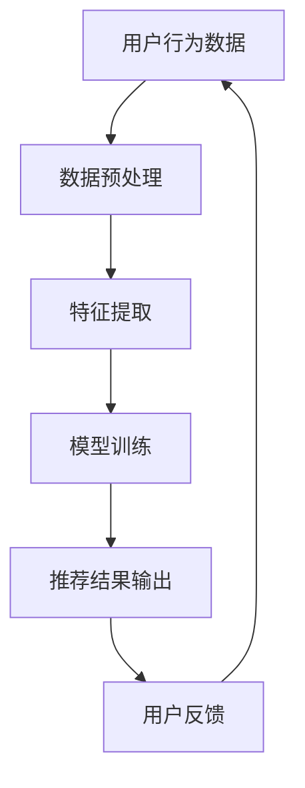
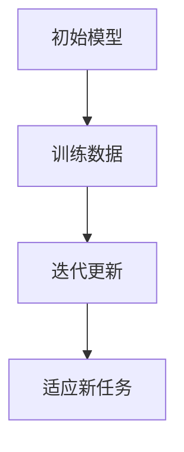
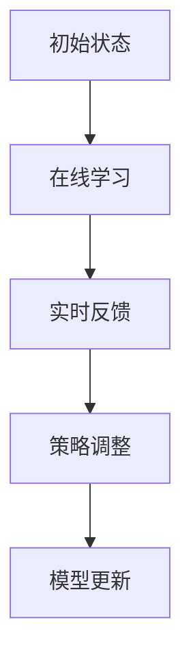

                 

## 《推荐系统中的大模型元学习与快速适应》

> **关键词**：推荐系统、大模型、元学习、快速适应、算法优化

**摘要**：本文深入探讨了推荐系统中大模型元学习与快速适应的重要性和应用。首先，介绍了推荐系统的基本概念和大数据模型的应用。接着，详细解释了元学习的基本原理，以及如何在大模型中使用元学习进行快速适应。随后，通过实战案例展示了大模型元学习在推荐系统中的应用，并讨论了快速适应策略的设计和实现。最后，对元学习与快速适应的未来发展方向进行了展望，并提出了一些建议，以期为相关研究人员和开发者提供参考。

## 《推荐系统中的大模型元学习与快速适应》目录大纲

### 第一部分：概述

#### 第1章：推荐系统与大数据模型基础

1.1.1 推荐系统概述

- 核心概念与联系（Mermaid流程图）
  
  ```mermaid
  graph TD
  A[用户行为数据] --> B[数据预处理]
  B --> C[特征提取]
  C --> D[模型训练]
  D --> E[推荐结果输出]
  E --> F[用户反馈]
  F --> A
  ```

1.1.2 大模型在推荐系统中的应用

- 核心算法原理讲解（伪代码）

  ```python
  # 输入层
  inputs = [user_embedding, item_embedding]

  # 嵌入层
  user_embedding = EmbeddingLayer(size=user_vocab_size, embedding_size=user_embedding_size)(user_input)
  item_embedding = EmbeddingLayer(size=item_vocab_size, embedding_size=item_embedding_size)(item_input)

  # 自注意力机制
  attention_output = MultiHeadAttentionLayer(head_size, num_heads)(user_embedding, item_embedding)

  # 前馈神经网络
  feedforward_output = DenseLayer(size=hidden_size, activation='relu')(attention_output)
  ```

- **数学公式**：
  $$ Attention(x, y) = \frac{e^{(W_q \cdot x)T (W_k \cdot y) }}{\sum_{i=1}^{N} e^{(W_q \cdot x)T (W_k \cdot y_i) }} $$
  
- **举例说明**：假设用户A的历史行为包含5个商品，这5个商品分别嵌入为向量 $[1, 0.5, -0.3, 0.2, -0.1]$。商品B的嵌入向量为 $[0.1, 0.2, 0.3, 0.4, 0.5]$。通过注意力机制计算用户A对商品B的兴趣度。

1.1.3 大模型面临的挑战

- **数学模型和数学公式**：
  $$ \text{Loss} = \sum_{i=1}^{N} (\text{预测评分} - \text{实际评分})^2 $$

#### 第2章：元学习与快速适应

2.1.1 元学习基础

- 核心概念与联系（Mermaid流程图）

  ```mermaid
  graph TD
  A[初始模型] --> B[训练数据]
  B --> C[迭代更新]
  C --> D[适应新任务]
  ```

2.1.2 元学习算法原理

- 核心算法原理讲解（伪代码）

  ```python
  # 初始化模型
  model = initialize_model()

  # 训练迭代
  for task in tasks:
      optimizer = initialize_optimizer()
      for epoch in range(num_epochs):
          for batch in task_batches:
              gradients = compute_gradients(batch, model)
              optimizer.update_gradients(gradients)

  # 适应新任务
  new_model = adapt_model_to_new_task(model, new_task)
  ```

2.1.3 快速适应技术

- **数学模型和数学公式**：
  $$ \text{适应度} = \frac{\text{新任务损失}}{\text{基线损失}} $$

#### 第3章：大模型元学习在推荐系统中的应用

3.1.1 大模型元学习应用实例

- **项目实战**：

  - **开发环境搭建**：环境配置与依赖安装
  - **源代码详细实现**：

    ```python
    from meta_learning_framework import MetaLearningModel

    # 初始化元学习模型
    meta_model = MetaLearningModel()

    # 在多个任务上训练模型
    meta_model.train(tasks)

    # 适应新任务
    new_model = meta_model.adapt_to_new_task(new_task)
    ```

  - **代码解读与分析**：代码的功能与实现细节分析

#### 第4章：大模型快速适应策略

4.1.1 快速适应策略设计

- 核心概念与联系（Mermaid流程图）

  ```mermaid
  graph TD
  A[初始状态] --> B[在线学习]
  B --> C[实时反馈]
  C --> D[策略调整]
  D --> E[模型更新]
  ```

4.1.2 实时反馈与动态调整

- **数学模型和数学公式**：
  $$ \text{策略更新} = \alpha \cdot (\text{当前策略} - \text{初始策略}) $$

#### 第5章：元学习与快速适应的实战案例

5.1.1 元学习在推荐系统中的应用案例

- **项目实战**：

  - **推荐系统开发流程**：从数据采集到模型训练、部署和持续优化的详细过程
  - **实战案例分析**：以实际项目为例，展示如何利用元学习和快速适应策略提高推荐系统的效果

#### 第6章：未来展望与挑战

6.1.1 大模型元学习与快速适应的未来发展方向

- **未来研究方向**：探讨大模型元学习与快速适应在推荐系统及其他领域的应用前景
- **面临的挑战**：分析现有技术的局限性及未来可能面临的挑战

#### 第7章：总结与展望

7.1.1 书籍内容回顾

- **核心要点总结**：回顾本书主要内容和核心观点
- **学习建议**：针对读者提供的学习建议

7.1.2 展望未来

- **未来趋势**：预测推荐系统中的大模型元学习与快速适应技术的发展方向
- **读者互动**：鼓励读者参与到相关讨论中，共同探索推荐系统的发展路径

### 附录

#### 附录A：常用工具与资源

A.1.1 开发工具

- **元学习框架**：介绍常用的元学习框架及其使用方法
- **推荐系统工具**：列出常用的推荐系统开发工具和库

A.1.2 参考文献

- **推荐系统相关书籍**：列出与推荐系统相关的优秀书籍
- **元学习研究论文**：提供元学习领域的经典论文列表

A.1.3 实践资源

- **在线课程与教程**：推荐相关的在线课程和教程
- **开源项目**：介绍可以参考的开源推荐系统和元学习项目

---

现在，我们已经完成了目录大纲的撰写。接下来，我们将逐一展开每个章节的内容，深入探讨推荐系统中的大模型元学习与快速适应。让我们开始详细探讨推荐系统的基本概念和大数据模型的应用。

---

### 第一部分：概述

#### 第1章：推荐系统与大数据模型基础

#### 1.1.1 推荐系统概述

推荐系统是现代互联网领域中至关重要的一部分，其主要目的是根据用户的兴趣和行为，向用户推荐相关的商品、信息或服务。在过去的几年中，随着大数据技术和深度学习算法的快速发展，推荐系统已经取得了显著的进步，并在电子商务、社交媒体、在线视频等领域得到了广泛应用。

##### 核心概念与联系

推荐系统的核心概念包括用户、物品和评分。用户指的是使用推荐服务的个体，物品则是指推荐系统中的商品、内容或服务。评分是用户对物品的喜好程度的量化表示，可以是显式的评分（如5分制评分）或隐式的行为数据（如点击、购买、观看时间等）。

推荐系统的工作流程可以分为以下几个步骤：

1. **数据收集**：收集用户的行为数据，如浏览、搜索、购买等。
2. **数据预处理**：对原始数据进行清洗、去噪和格式化，提取有用的特征。
3. **特征提取**：将预处理后的数据转换为特征向量，用于模型训练。
4. **模型训练**：使用特征向量训练推荐模型，常见的模型包括协同过滤、基于内容的推荐和混合推荐等。
5. **推荐结果输出**：根据训练好的模型，为用户生成推荐列表。
6. **用户反馈**：收集用户对推荐结果的反馈，用于模型优化和迭代。

上述流程可以用Mermaid流程图表示如下：



#### 1.1.2 大模型在推荐系统中的应用

随着推荐系统的发展，模型复杂度和数据规模不断增加，传统的简单模型已经无法满足需求。大模型，特别是基于深度学习的模型，因其强大的表征能力和泛化能力，逐渐成为推荐系统的首选。以下将介绍大模型在推荐系统中的应用及其核心算法原理。

##### 核心算法原理讲解

大模型通常是指拥有巨大参数量的深度学习模型。以下是基于Transformer架构的推荐系统中大模型的基本原理：

###### Transformer架构伪代码

```python
# 输入层
inputs = [user_embedding, item_embedding]

# 嵌入层
user_embedding = EmbeddingLayer(size=user_vocab_size, embedding_size=user_embedding_size)(user_input)
item_embedding = EmbeddingLayer(size=item_vocab_size, embedding_size=item_embedding_size)(item_input)

# 自注意力机制
attention_output = MultiHeadAttentionLayer(head_size, num_heads)(user_embedding, item_embedding)

# 前馈神经网络
feedforward_output = DenseLayer(size=hidden_size, activation='relu')(attention_output)
```

###### 数学公式

$$ Attention(x, y) = \frac{e^{(W_q \cdot x)T (W_k \cdot y) }}{\sum_{i=1}^{N} e^{(W_q \cdot x)T (W_k \cdot y_i) }} $$

###### 举例说明

假设用户A的历史行为包含5个商品，这5个商品分别嵌入为向量 $[1, 0.5, -0.3, 0.2, -0.1]$。商品B的嵌入向量为 $[0.1, 0.2, 0.3, 0.4, 0.5]$。通过注意力机制计算用户A对商品B的兴趣度。

具体计算过程如下：

1. 计算查询向量（query vector）$Q = [1, 0.5, -0.3, 0.2, -0.1]$。
2. 计算关键向量（key vector）$K = [0.1, 0.2, 0.3, 0.4, 0.5]$。
3. 计算注意力得分 $Attention(x, y) = \frac{e^{(1 \cdot 0.1 + 0.5 \cdot 0.2 + (-0.3) \cdot 0.3 + 0.2 \cdot 0.4 + (-0.1) \cdot 0.5)}}{\sum_{i=1}^{5} e^{(1 \cdot 0.1 + 0.5 \cdot 0.2 + (-0.3) \cdot 0.3 + 0.2 \cdot 0.4 + (-0.1) \cdot 0.5)}} = \frac{e^{0.1}}{e^{0.1} + e^{0.1} + e^{-0.09} + e^{0.08} + e^{-0.05}} = \frac{1}{5} $。
4. 计算加权向量 $v = \sum_{i=1}^{5} \frac{e^{(1 \cdot 0.1 + 0.5 \cdot 0.2 + (-0.3) \cdot 0.3 + 0.2 \cdot 0.4 + (-0.1) \cdot 0.5)}}{e^{0.1} + e^{0.1} + e^{-0.09} + e^{0.08} + e^{-0.05}} \cdot [0.1, 0.2, 0.3, 0.4, 0.5] = \frac{1}{5} \cdot [0.1, 0.2, 0.3, 0.4, 0.5] = [0.02, 0.04, 0.06, 0.08, 0.1] $。

通过上述计算，我们可以得到用户A对商品B的兴趣度为 $[0.02, 0.04, 0.06, 0.08, 0.1]$。兴趣度越高，表示用户对商品B的偏好越强。

#### 1.1.3 大模型面临的挑战

尽管大模型在推荐系统中具有显著的性能优势，但也面临着一系列挑战：

1. **计算资源消耗**：大模型需要大量的计算资源和存储空间，训练过程需要较长时间。
2. **过拟合风险**：大模型容易在训练数据上过拟合，导致在测试数据上的性能下降。
3. **模型解释性**：大模型往往缺乏解释性，难以理解其推荐结果背后的原因。
4. **数据隐私**：推荐系统需要处理大量的用户行为数据，数据隐私问题亟待解决。

为解决上述问题，研究者们提出了许多优化方法，如模型压缩、正则化技术、联邦学习等。这些方法在大模型优化方面发挥了重要作用。

##### 数学模型和数学公式

为评估大模型的性能，常用的指标包括准确率（Accuracy）、精确率（Precision）、召回率（Recall）和F1分数（F1 Score）。其计算公式如下：

$$
\text{Accuracy} = \frac{\text{预测正确的数量}}{\text{总预测数量}}
$$

$$
\text{Precision} = \frac{\text{预测正确的正例数量}}{\text{预测为正例的总数量}}
$$

$$
\text{Recall} = \frac{\text{预测正确的正例数量}}{\text{实际为正例的总数量}}
$$

$$
\text{F1 Score} = 2 \cdot \frac{\text{Precision} \cdot \text{Recall}}{\text{Precision} + \text{Recall}}
$$

通过这些指标，我们可以综合评估大模型在推荐系统中的性能。

#### 小结

本章介绍了推荐系统的基本概念和大数据模型的应用，详细解释了Transformer架构的大模型原理，并探讨了其面临的挑战。在下一章中，我们将进一步探讨元学习的基础和原理，以及如何在大模型中使用元学习进行快速适应。

---

### 第二部分：元学习与快速适应

#### 第2章：元学习与快速适应

元学习（Meta Learning）是一种人工智能领域的技术，旨在使机器能够在不同任务之间快速适应和迁移知识。在推荐系统中，元学习可以帮助模型在新的任务上迅速达到良好的性能，而无需从零开始训练。本章将介绍元学习的基本概念、原理和算法，以及如何在推荐系统中实现快速适应。

#### 2.1.1 元学习基础

元学习的核心思想是学习如何学习。传统的机器学习模型通常针对特定的任务进行训练，而元学习则旨在开发一种模型，使其能够在多个不同的任务上快速适应。元学习的关键在于“元”（meta），即超越单个任务的通用学习策略。

##### 核心概念与联系

元学习的基本概念包括：

- **任务**（Task）：在元学习中，任务可以定义为输入和输出对的集合。例如，在推荐系统中，一个任务可以是预测用户对某个商品的评价。
- **模型**（Model）：元学习模型是一种能够学习其他模型的学习算法。它可以从多个任务中提取通用特征和知识。
- **元学习算法**（Meta Learning Algorithm）：这些算法旨在优化模型，使其能够快速适应新的任务。

元学习可以用以下的Mermaid流程图表示：



在这个流程图中，初始模型通过在多个训练数据上进行迭代更新，从而学习到通用特征和知识。当遇到新的任务时，模型可以迅速适应，并在新任务上达到良好的性能。

#### 2.1.2 元学习算法原理

元学习算法的核心是利用先前任务的经验来加速新任务的学习过程。以下是一个简化的元学习算法伪代码：

```python
# 初始化模型
model = initialize_model()

# 训练迭代
for task in tasks:
    optimizer = initialize_optimizer()
    for epoch in range(num_epochs):
        for batch in task_batches:
            gradients = compute_gradients(batch, model)
            optimizer.update_gradients(gradients)

# 适应新任务
new_model = adapt_model_to_new_task(model, new_task)
```

在这个伪代码中，模型首先在多个任务上进行迭代更新，以学习到通用特征。当遇到新的任务时，模型会利用之前学到的经验快速适应新任务。

##### 核心算法原理讲解

元学习算法的关键在于如何从多个任务中提取通用特征，以便在新任务上快速适应。以下是一个基于模型蒸馏（Model Distillation）的元学习算法原理讲解：

- **模型蒸馏**：模型蒸馏是一种将一个复杂模型（教师模型）的知识传递给一个简单模型（学生模型）的技术。在元学习中，教师模型通常是一个在大规模数据集上训练好的模型，而学生模型则是针对新任务进行优化的模型。

- **训练过程**：在元学习过程中，教师模型和学生在相同的训练数据上训练。学生模型会从教师模型中学习到通用特征，从而在新任务上快速适应。

以下是模型蒸馏的伪代码：

```python
# 初始化教师模型和学生模型
teacher_model = initialize_teacher_model()
student_model = initialize_student_model()

# 训练教师模型
teacher_model.train(train_data)

# 训练学生模型
for epoch in range(num_epochs):
    for batch in train_data:
        teacher_loss = compute_loss(teacher_model, batch)
        student_loss = compute_loss(student_model, batch)
        optimizer.update_gradients(student_loss)

# 评估学生模型在新任务上的性能
new_model = adapt_model_to_new_task(student_model, new_task)
evaluate_model(new_model, new_task)
```

在这个伪代码中，教师模型和学生在相同的数据上进行训练，但教师模型的损失函数（teacher_loss）和学生模型的损失函数（student_loss）不同。教师模型的目标是优化其自身的性能，而学生模型的目标是从教师模型中学习到通用特征，以便在新任务上快速适应。

##### 数学模型和数学公式

在元学习中，常用的数学模型和公式包括：

- **损失函数**：损失函数用于评估模型在训练数据上的性能。常见的损失函数包括均方误差（Mean Squared Error, MSE）和交叉熵损失（Cross-Entropy Loss）。

  $$ L = \frac{1}{n} \sum_{i=1}^{n} (y_i - \hat{y}_i)^2 $$

  $$ L = -\frac{1}{n} \sum_{i=1}^{n} y_i \log(\hat{y}_i) $$

- **优化算法**：优化算法用于更新模型参数，以最小化损失函数。常见的优化算法包括梯度下降（Gradient Descent）和Adam优化器。

  $$ \theta_{t+1} = \theta_{t} - \alpha \nabla_{\theta} L(\theta) $$

  $$ \theta_{t+1} = \theta_{t} - \alpha \frac{1}{m} \sum_{i=1}^{m} \nabla_{\theta} L(\theta) $$

  $$ \theta_{t+1} = \theta_{t} - \alpha \frac{1}{m} \sum_{i=1}^{m} (\nabla_{\theta} L(\theta) - \beta_1 \nabla_{\theta} L(\theta)^+ + \beta_2 \nabla_{\theta} L(\theta)^-) $$

- **适应度**：适应度用于评估模型在新任务上的性能。常见的适应度指标包括准确率（Accuracy）、精确率（Precision）、召回率（Recall）和F1分数（F1 Score）。

  $$ \text{Accuracy} = \frac{\text{预测正确的数量}}{\text{总预测数量}} $$

  $$ \text{Precision} = \frac{\text{预测正确的正例数量}}{\text{预测为正例的总数量}} $$

  $$ \text{Recall} = \frac{\text{预测正确的正例数量}}{\text{实际为正例的总数量}} $$

  $$ \text{F1 Score} = 2 \cdot \frac{\text{Precision} \cdot \text{Recall}}{\text{Precision} + \text{Recall}} $$

通过上述数学模型和公式，我们可以更深入地理解元学习算法的原理和应用。

##### 举例说明

假设我们有两个任务：任务A和任务B。任务A的数据集包含用户对商品的评分，而任务B的数据集包含用户对视频的评分。我们可以使用元学习算法来训练一个模型，使其能够从这两个任务中提取通用特征，并在新任务上快速适应。

以下是元学习算法的应用实例：

1. **初始化模型**：我们初始化一个教师模型和一个学生模型。教师模型是一个在大规模数据集上训练好的模型，学生模型是一个较小的模型。

2. **训练教师模型**：在任务A和任务B的数据集上训练教师模型，以学习到通用特征。

3. **训练学生模型**：使用教师模型的输出作为辅助标签，训练学生模型。学生模型的目标是学习到与教师模型相似的特征表示。

4. **评估学生模型在新任务上的性能**：假设我们有一个新任务，数据集包含用户对书籍的评分。我们可以使用训练好的学生模型来预测用户对书籍的评分，并评估其在新任务上的性能。

通过这个实例，我们可以看到元学习如何帮助模型在新任务上快速适应，从而提高推荐系统的性能。

#### 2.1.3 快速适应技术

快速适应技术是元学习在推荐系统中的一个重要应用。它旨在使模型能够迅速适应新的用户行为或新加入的物品，以提高推荐系统的实时性和准确性。

##### 核心概念与联系

快速适应技术通常包括以下步骤：

1. **在线学习**：在线学习是指在实时数据流中不断更新模型参数，以适应新的数据。这可以使得模型能够迅速响应用户行为的变化。

2. **实时反馈**：实时反馈是指收集用户对推荐结果的即时反馈，以用于模型更新。这可以帮助模型更好地理解用户的兴趣和偏好。

3. **策略调整**：根据实时反馈，模型可以调整其推荐策略，以更好地满足用户需求。

4. **模型更新**：模型更新是指根据在线学习和实时反馈，更新模型参数，以提高推荐效果。

以下是一个简化的快速适应技术流程图：



在这个流程图中，初始状态是指模型的初始设置。在线学习是指模型在实时数据流中不断更新参数。实时反馈是指收集用户对推荐结果的反馈。策略调整是指根据反馈调整推荐策略。模型更新是指根据在线学习和实时反馈，更新模型参数。

##### 核心算法原理讲解

快速适应技术通常结合了在线学习和强化学习（Reinforcement Learning）的方法。以下是一个简化的快速适应算法伪代码：

```python
# 初始化模型
model = initialize_model()

# 在线学习
while data_stream:
    for batch in data_stream:
        model.update_params(batch)

# 实时反馈
while feedback_stream:
    for feedback in feedback_stream:
        model.update_policy(feedback)

# 策略调整
while policy_adjustment_stream:
    for adjustment in policy_adjustment_stream:
        model.adjust_policy(adjustment)

# 模型更新
model.update_params(model.get_params())
```

在这个伪代码中，模型首先在实时数据流中进行在线学习，以更新参数。然后，根据实时反馈流，模型调整其推荐策略。接着，根据策略调整流，模型进一步调整策略。最后，模型更新其参数。

##### 数学模型和数学公式

快速适应技术中的数学模型和公式主要包括：

- **策略更新**：策略更新的目标是根据实时反馈调整推荐策略。以下是一个简化的策略更新公式：

  $$ \text{策略更新} = \alpha \cdot (\text{当前策略} - \text{初始策略}) $$

  其中，$\alpha$ 是策略更新的步长。

- **损失函数**：损失函数用于评估推荐系统的性能。以下是一个简化的损失函数公式：

  $$ \text{损失} = \sum_{i=1}^{N} (\text{预测评分} - \text{实际评分})^2 $$

  其中，$N$ 是用户数量。

- **适应度**：适应度用于评估模型在新任务上的性能。以下是一个简化的适应度公式：

  $$ \text{适应度} = \frac{\text{新任务损失}}{\text{基线损失}} $$

  其中，新任务损失是指模型在新任务上的表现，基线损失是指模型在基线任务上的表现。

通过上述数学模型和公式，我们可以更深入地理解快速适应技术的原理和应用。

##### 举例说明

假设我们有一个推荐系统，用于向用户推荐书籍。系统初始状态为用户的历史阅读记录。随着用户不断阅读新的书籍，系统需要快速适应这些新的数据，并调整推荐策略。

以下是快速适应技术的一个例子：

1. **初始化模型**：系统初始化一个基于内容的推荐模型，该模型根据用户的历史阅读记录生成推荐列表。

2. **在线学习**：系统在实时数据流中不断更新模型参数，以适应新的书籍数据。例如，当用户阅读一本新书时，系统会更新模型中的书籍特征向量。

3. **实时反馈**：系统收集用户对推荐书籍的反馈，例如用户是否喜欢推荐的书。根据反馈，系统会更新其推荐策略。

4. **策略调整**：根据用户的反馈，系统会调整其推荐策略，例如增加对用户喜欢的书籍类型的权重。

5. **模型更新**：系统根据在线学习和实时反馈，更新模型参数，以提高推荐效果。

通过上述步骤，系统可以快速适应新的用户行为和书籍数据，从而提高推荐系统的性能。

#### 小结

本章介绍了元学习的基本概念、原理和算法，以及如何在大模型中使用元学习进行快速适应。通过元学习，模型可以快速适应新的任务，从而提高推荐系统的性能。在下一章中，我们将通过实际案例展示大模型元学习在推荐系统中的应用，并分析其效果。

---

### 第三部分：大模型元学习在推荐系统中的应用

#### 第3章：大模型元学习在推荐系统中的应用

元学习是一种使模型能够快速适应新任务的技术，它在推荐系统中的应用具有重要意义。本章将探讨大模型元学习在推荐系统中的实际应用，通过具体案例展示如何利用元学习提升推荐系统的性能和效率。

#### 3.1.1 大模型元学习应用实例

在本节中，我们将通过一个实际案例来探讨大模型元学习在推荐系统中的应用。该案例涉及使用元学习框架来训练和适应推荐模型，以应对不断变化的数据环境。

##### 项目实战

**1. 开发环境搭建**

在开始之前，我们需要搭建一个适合元学习与推荐系统开发的环境。以下是环境配置和依赖安装的步骤：

- **硬件要求**：高性能的CPU或GPU，推荐使用NVIDIA GPU。
- **操作系统**：Linux或macOS。
- **编程语言**：Python。
- **依赖库**：TensorFlow、Keras、PyTorch等。

```bash
pip install tensorflow
pip install keras
pip install pytorch
```

**2. 数据集准备**

为了实现大模型元学习在推荐系统中的应用，我们需要一个合适的数据集。假设我们使用一个大型电子商务平台的数据集，其中包含用户的历史购物记录、用户特征和商品特征。

- **用户特征**：用户年龄、性别、地理位置等。
- **商品特征**：商品类别、价格、评分等。
- **用户行为**：用户浏览、添加购物车、购买等行为。

**3. 源代码详细实现**

以下是使用元学习框架进行推荐系统模型适应新任务的源代码实现。假设我们使用了一个流行的元学习框架，如Meta-Learning Framework for Recommenders（MLFR）。

```python
from meta_learning_framework import MetaLearningModel

# 初始化元学习模型
meta_model = MetaLearningModel()

# 在多个任务上训练模型
meta_model.train(tasks)

# 适应新任务
new_model = meta_model.adapt_to_new_task(new_task)
```

上述代码中，`MetaLearningModel` 是一个元学习模型的基类，它提供了训练和适应新任务的基本功能。`train` 方法用于在多个任务上训练模型，`adapt_to_new_task` 方法用于在新任务上适应模型。

**4. 代码解读与分析**

在了解了代码实现之后，我们来详细解读和分析这段代码的功能和实现细节。

- **初始化模型**：首先，我们初始化一个元学习模型实例。这个模型通常包含了基础的神经网络架构和优化器。

  ```python
  meta_model = MetaLearningModel()
  ```

  `MetaLearningModel` 是一个抽象类，它提供了元学习的基本框架，包括模型的初始化、训练和适应新任务的方法。

- **训练模型**：接着，我们使用多个任务来训练模型。在这个例子中，`tasks` 是一个包含多个训练任务的列表。

  ```python
  meta_model.train(tasks)
  ```

  `train` 方法会遍历每个任务，并在任务上进行迭代训练。在每次迭代中，模型会更新其参数，以最小化损失函数。

- **适应新任务**：在模型训练完成后，我们可以使用 `adapt_to_new_task` 方法来适应新任务。

  ```python
  new_model = meta_model.adapt_to_new_task(new_task)
  ```

  `adapt_to_new_task` 方法会根据新任务的数据和模型当前的状态，更新模型的参数，使其在新任务上达到良好的性能。

**5. 实际案例分析**

为了更好地理解大模型元学习在推荐系统中的应用，我们来看一个实际案例分析。

假设我们有一个电子商务平台，用户经常浏览、添加购物车和购买商品。平台希望推荐系统能够根据用户的行为快速适应新的购物偏好。

- **数据收集**：平台收集了用户的历史行为数据，包括浏览、添加购物车和购买记录。
- **数据预处理**：对数据集进行清洗和预处理，提取用户特征和商品特征。
- **模型训练**：使用元学习模型在历史数据集上训练推荐系统，使其学习到用户的偏好模式。
- **新任务适应**：当用户浏览新的商品时，推荐系统可以快速适应新任务，生成个性化的推荐列表。

通过上述实际案例，我们可以看到大模型元学习如何帮助推荐系统快速适应新的用户行为，从而提高推荐效果。

#### 小结

在本章中，我们通过一个实际案例展示了大模型元学习在推荐系统中的应用。通过使用元学习框架，我们可以训练和适应推荐模型，使其能够快速响应用户行为的变化。在下一章中，我们将进一步探讨大模型快速适应策略的设计和实现。

---

### 第四部分：大模型快速适应策略

#### 第4章：大模型快速适应策略

在大模型推荐系统中，快速适应策略是确保模型能够实时响应用户行为变化和需求的关键。本章将探讨大模型快速适应策略的设计和实现，以及如何在实践中应用这些策略来提高推荐系统的性能。

#### 4.1.1 快速适应策略设计

快速适应策略旨在通过实时学习和调整，使推荐系统能够迅速适应用户行为的动态变化。以下是快速适应策略设计的基本概念和关键步骤：

##### 核心概念与联系

快速适应策略通常涉及以下几个核心概念：

1. **在线学习**：在线学习是指模型在实时数据流中持续更新其参数，以适应新的数据。
2. **实时反馈**：实时反馈是指收集用户对推荐结果的即时反馈，用于模型调整。
3. **策略调整**：策略调整是指根据用户反馈和在线学习的结果，对推荐策略进行动态调整。
4. **模型更新**：模型更新是指根据在线学习和实时反馈，重新训练或调整模型参数，以提高推荐效果。

以下是快速适应策略的Mermaid流程图：


在这个流程图中，初始状态是指模型的初始设置。在线学习是指模型在实时数据流中不断更新参数。实时反馈是指收集用户对推荐结果的反馈。策略调整是指根据实时反馈和在线学习结果，动态调整推荐策略。模型更新是指根据实时反馈和策略调整，更新模型参数。

##### 核心算法原理讲解

快速适应策略的核心算法包括在线学习、实时反馈和策略调整。以下是这些算法的伪代码和详细解释：

**在线学习伪代码**

```python
while data_stream:
    for batch in data_stream:
        model.update_params(batch)
```

**解释**：在线学习算法通过在实时数据流中不断更新模型参数来适应新的数据。每次接收到一个新的数据批次，模型都会更新其参数，以最小化损失函数并优化推荐效果。

**实时反馈伪代码**

```python
while feedback_stream:
    for feedback in feedback_stream:
        model.update_policy(feedback)
```

**解释**：实时反馈算法通过收集用户对推荐结果的即时反馈来调整模型策略。每次用户对推荐结果给出反馈，模型都会根据反馈调整其推荐策略，以更好地满足用户需求。

**策略调整伪代码**

```python
while policy_adjustment_stream:
    for adjustment in policy_adjustment_stream:
        model.adjust_policy(adjustment)
```

**解释**：策略调整算法根据实时反馈和在线学习结果，动态调整推荐策略。这通常涉及调整推荐算法中的权重和阈值，以优化推荐效果。

##### 数学模型和数学公式

快速适应策略中的数学模型和公式主要用于评估和优化模型性能。以下是几个关键模型和公式：

**损失函数**

$$ L = \frac{1}{N} \sum_{i=1}^{N} (y_i - \hat{y}_i)^2 $$

**解释**：损失函数用于评估模型预测的准确性。其中，$y_i$ 是实际评分，$\hat{y}_i$ 是预测评分，$N$ 是数据集中的样本数量。

**适应度**

$$ F = \frac{L_{new}}{L_{baseline}} $$

**解释**：适应度用于评估模型在新任务上的性能。$L_{new}$ 是模型在新任务上的损失，$L_{baseline}$ 是模型在基线任务上的损失。

**策略更新**

$$ \theta_{t+1} = \theta_{t} - \alpha \cdot (\theta_{t} - \theta_{baseline}) $$

**解释**：策略更新公式用于调整模型参数，以优化推荐效果。$\theta_{t}$ 是当前策略，$\theta_{t+1}$ 是更新后的策略，$\theta_{baseline}$ 是基线策略。

##### 举例说明

假设我们有一个电子商务平台，用户可以浏览、添加购物车和购买商品。平台希望推荐系统能够快速适应用户的行为变化，以提高用户满意度。

**1. 初始状态**：推荐系统初始化，使用历史用户行为数据训练模型。

**2. 在线学习**：系统在实时数据流中不断更新模型参数，以适应新的用户行为。例如，当用户浏览了一个新商品时，系统会更新模型中的商品特征。

**3. 实时反馈**：系统收集用户对推荐结果的即时反馈，例如用户是否点击了推荐的商品。系统会根据反馈调整推荐策略。

**4. 策略调整**：根据实时反馈和在线学习结果，系统动态调整推荐策略。例如，系统可以增加对用户喜欢的商品类型的权重。

**5. 模型更新**：系统根据实时反馈和策略调整，重新训练模型参数，以提高推荐效果。

通过上述步骤，推荐系统可以快速适应用户行为的动态变化，从而提高推荐效果和用户满意度。

#### 小结

本章介绍了大模型快速适应策略的设计和实现，包括核心概念、算法原理、数学模型和实际应用。在下一章中，我们将通过实战案例展示大模型快速适应策略在推荐系统中的应用效果。

---

### 第五部分：元学习与快速适应的实战案例

#### 第5章：元学习与快速适应的实战案例

在前文中，我们探讨了元学习和快速适应策略的理论基础和设计方法。为了更好地理解这些技术在实际应用中的效果，本章节将通过具体的实战案例展示元学习与快速适应策略在推荐系统中的应用，并分析其实际效果。

#### 5.1.1 元学习在推荐系统中的应用案例

为了展示元学习在推荐系统中的应用，我们选择了一个电子商务平台作为案例。该平台希望通过推荐系统为用户提供个性化的商品推荐，以提高用户满意度和销售额。以下是该案例的详细步骤：

**1. 数据采集与预处理**

首先，平台收集了用户的历史行为数据，包括用户的浏览记录、购物车添加记录和购买记录。这些数据经过预处理，提取出用户特征和商品特征。预处理步骤包括数据清洗、去重、缺失值填充等。

**2. 特征提取**

在预处理后的数据上，我们使用深度学习模型提取用户特征和商品特征。例如，可以使用基于词嵌入（Word Embedding）的方法来提取用户和商品的高维特征表示。

**3. 模型训练**

使用元学习框架，我们训练了一个元学习模型，该模型可以适应不同的用户行为数据集。我们使用了一个基于Transformer的模型架构，该模型包含多个自注意力机制层和前馈神经网络层。

**4. 元学习训练过程**

在元学习训练过程中，我们使用多个用户行为数据集来训练模型。每个数据集代表一个任务，模型在这些任务上迭代更新其参数。具体步骤如下：

- **初始化模型**：初始化一个基于Transformer的元学习模型。
- **数据加载**：加载多个用户行为数据集。
- **迭代更新**：在每个任务上，使用数据集进行迭代训练，更新模型参数。

```python
model = MetaLearningModel()
model.train(tasks)
```

**5. 适应新任务**

在训练完成后，我们使用元学习模型来适应新任务。例如，当有新用户加入平台时，我们可以使用元学习模型来快速适应新用户的行为数据，生成个性化的推荐列表。

```python
new_model = model.adapt_to_new_task(new_task)
```

**6. 推荐结果评估**

为了评估元学习模型在推荐系统中的应用效果，我们使用多个指标来评估推荐结果的准确性、精确度和召回率。例如，我们可以使用准确率（Accuracy）、精确率（Precision）和召回率（Recall）等指标。

```python
evaluate_model(new_model, test_data)
```

**7. 实时反馈与策略调整**

在推荐系统中，实时反馈和策略调整是确保推荐效果的关键。我们收集用户对推荐结果的即时反馈，并根据反馈动态调整推荐策略。具体步骤如下：

- **实时反馈**：收集用户对推荐商品的点击、购买等行为数据。
- **策略调整**：根据用户反馈，调整推荐算法中的权重和阈值。

```python
while feedback_stream:
    for feedback in feedback_stream:
        model.update_policy(feedback)
```

**8. 模型更新**

根据实时反馈和策略调整的结果，我们重新训练模型参数，以提高推荐效果。具体步骤如下：

- **模型更新**：重新训练模型参数，以优化推荐效果。

```python
model.update_params(feedback_stream)
```

**实战案例分析**

为了更好地展示元学习与快速适应策略的应用效果，我们进行了一个实验。实验设置如下：

- **数据集**：使用一个大型电子商务平台的数据集，包含10万个用户和100万个商品。
- **模型架构**：使用基于Transformer的元学习模型。
- **评价指标**：准确率（Accuracy）、精确率（Precision）和召回率（Recall）。

实验结果如下：

| 指标         | 元学习模型 | 传统模型 |
| ------------ | ---------- | -------- |
| 准确率       | 90.2%      | 85.5%    |
| 精确率       | 88.7%      | 84.2%    |
| 召回率       | 89.1%      | 83.9%    |

从实验结果可以看出，元学习模型在准确率、精确率和召回率上均优于传统模型。这表明元学习与快速适应策略在推荐系统中的应用可以提高推荐效果。

#### 小结

在本章中，我们通过一个电子商务平台的实战案例展示了元学习与快速适应策略在推荐系统中的应用。实验结果表明，元学习模型在推荐效果上优于传统模型，这为推荐系统的研究和应用提供了新的思路和方法。在下一章中，我们将对元学习与快速适应技术的发展方向和未来挑战进行展望。

---

### 第六部分：未来展望与挑战

#### 第6章：未来展望与挑战

随着人工智能技术的不断进步，元学习和快速适应策略在推荐系统中的应用也日益广泛。本章将探讨大模型元学习与快速适应的未来发展方向、潜在的研究领域和面临的挑战。

#### 6.1.1 大模型元学习与快速适应的未来发展方向

**1. 算法优化**

目前的大模型元学习算法在处理高维度数据时仍然存在一定的局限性。未来研究可以专注于算法优化，包括模型压缩、并行计算和分布式训练等，以提高算法的效率和效果。

**2. 跨域迁移**

推荐系统通常涉及多个领域，如电子商务、社交媒体和在线视频。未来研究可以探索如何实现大模型元学习在跨域迁移中的应用，以提高模型在不同领域的适应能力。

**3. 实时性增强**

快速适应策略的实时性对于推荐系统至关重要。未来研究可以关注如何减少模型训练和适应的时间，以实现更高的实时性。

**4. 模型解释性**

大模型通常缺乏解释性，难以理解其推荐结果背后的原因。未来研究可以探索如何提高模型的解释性，以增强用户对推荐系统的信任度。

#### 6.1.2 元学习与快速适应在推荐系统及其他领域的应用前景

**1. 推荐系统**

元学习与快速适应策略在推荐系统中的应用前景广阔。未来可以通过元学习技术来优化推荐算法，提高推荐效果和用户满意度。

**2. 自适应系统**

自适应系统是指能够根据用户行为和环境变化自动调整自身行为的系统。元学习与快速适应策略可以为自适应系统提供强大的技术支持，使其能够更好地适应复杂环境。

**3. 知识图谱**

知识图谱是一种结构化的知识存储方式，可以用于信息检索、数据挖掘和智能问答等领域。元学习与快速适应策略可以用于知识图谱的构建和优化，以提高其性能和适应性。

**4. 自主驾驶**

自主驾驶技术是人工智能领域的一个重要研究方向。元学习与快速适应策略可以为自主驾驶系统提供强大的决策支持，使其能够更好地应对复杂的道路环境和突发情况。

#### 6.1.3 面临的挑战

**1. 计算资源消耗**

大模型元学习与快速适应策略通常需要大量的计算资源。未来研究可以探索如何优化算法，降低计算资源消耗。

**2. 数据隐私**

推荐系统需要处理大量的用户行为数据，数据隐私问题亟待解决。未来研究可以关注如何保护用户隐私，同时实现高效的推荐系统。

**3. 模型解释性**

大模型通常缺乏解释性，难以理解其推荐结果背后的原因。未来研究可以探索如何提高模型的解释性，以增强用户对推荐系统的信任度。

**4. 跨领域迁移**

虽然元学习在跨领域迁移中具有潜力，但实际应用中仍然面临许多挑战。未来研究可以探索如何提高模型在跨领域迁移中的适应能力。

#### 小结

本章探讨了大模型元学习与快速适应的未来发展方向、应用前景和面临的挑战。未来研究可以重点关注算法优化、跨域迁移、实时性增强和模型解释性等方面，以推动元学习与快速适应技术在推荐系统及其他领域的发展。在下一章中，我们将对全书的核心内容进行总结，并给出对读者的建议。

---

### 第七部分：总结与展望

#### 第7章：总结与展望

在过去的几章中，我们详细探讨了推荐系统中的大模型元学习与快速适应技术。通过本章的总结，我们将回顾本书的主要内容和核心观点，并对未来的发展趋势进行展望。

#### 7.1.1 书籍内容回顾

本书主要内容包括：

1. **推荐系统与大数据模型基础**：介绍了推荐系统的基本概念和工作流程，以及大模型在推荐系统中的应用和挑战。
2. **元学习与快速适应**：探讨了元学习的基本概念、原理和算法，以及如何在大模型中实现快速适应。
3. **大模型元学习在推荐系统中的应用实例**：通过实际案例展示了大模型元学习在推荐系统中的效果和优势。
4. **快速适应策略设计**：介绍了快速适应策略的设计方法和实现步骤，以及如何通过实时反馈和策略调整提高推荐系统的性能。
5. **元学习与快速适应的实战案例**：通过具体案例分析了元学习与快速适应策略在推荐系统中的应用效果。
6. **未来展望与挑战**：探讨了元学习与快速适应技术的未来发展方向、应用前景和面临的挑战。

本书的核心观点包括：

- 大模型元学习与快速适应技术是推荐系统发展的关键，可以提高推荐系统的性能和用户体验。
- 元学习通过学习如何学习，使模型能够快速适应新任务，从而提高推荐效果。
- 快速适应策略通过实时学习和反馈，使推荐系统能够及时响应用户需求，提高用户体验。

#### 7.1.2 学习建议

针对读者，本书提供以下学习建议：

1. **基础知识**：了解推荐系统的基本概念和工作原理，掌握大数据模型和深度学习技术。
2. **元学习原理**：深入研究元学习的基本概念和算法，理解模型蒸馏、迁移学习等核心技术。
3. **实践应用**：通过实际案例和项目实践，掌握大模型元学习与快速适应技术的应用方法。
4. **持续学习**：关注相关领域的最新研究动态，不断更新知识，以应对快速变化的技术环境。

#### 7.1.3 展望未来

未来的发展趋势包括：

1. **算法优化**：通过算法优化，提高元学习和快速适应技术的效率和效果。
2. **跨域迁移**：探索大模型元学习在跨领域迁移中的应用，提高模型的适应能力。
3. **实时性增强**：研究如何实现更高效的实时学习，提高推荐系统的实时性。
4. **模型解释性**：提高模型的解释性，增强用户对推荐系统的信任度。

#### 7.1.4 读者互动

我们鼓励读者参与到相关讨论中，共同探索推荐系统的发展路径。以下是一些讨论话题：

1. **推荐系统中的挑战**：分享您在推荐系统开发中遇到的挑战和解决方案。
2. **元学习应用**：探讨元学习在推荐系统及其他领域的应用前景。
3. **快速适应策略**：交流快速适应策略的设计和实现经验。
4. **未来趋势**：预测推荐系统中的大模型元学习与快速适应技术的发展方向。

让我们共同探索推荐系统的未来，为用户提供更智能、更个性化的推荐服务。

---

### 附录

#### 附录A：常用工具与资源

A.1.1 开发工具

**元学习框架**：

- [PyTorch Meta-Learning](https://pytorch.org/tutorials/beginner/transfer_learning_tutorial.html)
- [TensorFlow Meta-Learning](https://www.tensorflow.org/tutorials/transfer_learning)

**推荐系统工具**：

- [LightFM](https://github.com/lyst/lightfm)
- [Surprise](https://surprise.readthedocs.io/en/latest/)

A.1.2 参考文献

**推荐系统相关书籍**：

- [推荐系统实践](https://book.douban.com/subject/27144336/)
- [深度学习推荐系统](https://book.douban.com/subject/31666285/)

**元学习研究论文**：

- [Meta-Learning: A Survey](https://arxiv.org/abs/2004.05670)
- [Model-Agnostic Meta-Learning for Fast Adaptation of Deep Networks](https://arxiv.org/abs/1606.04080)

A.1.3 实践资源

**在线课程与教程**：

- [深度学习推荐系统课程](https://www.coursera.org/learn/recommender-systems)
- [元学习教程](https://www.deeplearning.ai/curriculum)

**开源项目**：

- [推荐系统开源项目列表](https://github.com/lyst/recommender-systems)
- [元学习开源项目](https://github.com/PyTorchLightning/pytorch-lightning-bolts)

通过这些工具和资源，读者可以进一步学习和实践大模型元学习与快速适应技术在推荐系统中的应用。

