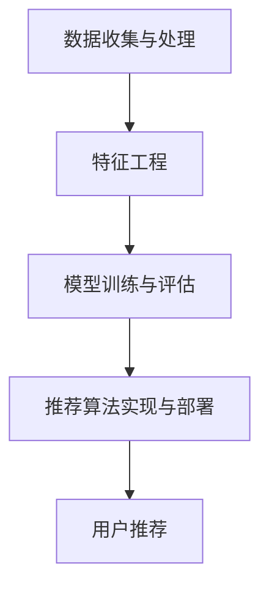
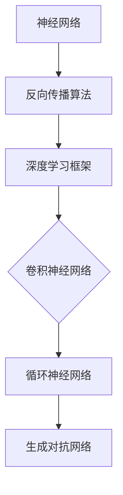

                 

### 《推荐系统的未来发展方向：大模型的主流化》

> **关键词：**推荐系统，大模型，深度学习，人工智能，未来趋势

> **摘要：**本文深入探讨了推荐系统的发展历程及其在当前人工智能时代的重要性。重点分析了深度学习在大模型中的应用，探讨了大模型的主流化趋势及其面临的挑战。通过案例研究，展示了大模型在实际推荐系统中的应用效果，并对未来的发展方向进行了展望。

### 目录大纲

1. **推荐系统的概述**
   1.1 推荐系统的发展历程
   1.2 推荐系统的基本架构

2. **深度学习基础**
   2.1 深度学习的核心概念
   2.2 常见的深度学习模型

3. **推荐系统中的深度学习模型**
   3.1 深度学习在协同过滤中的应用
   3.2 多模态推荐系统

4. **大模型在推荐系统中的应用**
   4.1 大模型的定义与特点
   4.2 主流大模型在推荐系统中的应用

5. **大模型的主流化挑战与解决方案**
   5.1 大模型的训练成本问题
   5.2 大模型的解释性与可解释性

6. **案例研究：大模型在推荐系统中的成功应用**
   6.1 基于GPT的个性化推荐系统
   6.2 基于Transformer的电商推荐系统

7. **大模型的主流化趋势与未来发展方向**
   7.1 产业界的发展动态
   7.2 学术界的研究热点

8. **未来发展方向**
   8.1 大模型与边缘计算的结合
   8.2 大模型与其他技术的融合

9. **大模型的主流化对行业的影响**
   9.1 对企业的影响
   9.2 对用户的影响

10. **结论与展望**

## 附录

### 附录A：常用深度学习框架与工具

### 附录B：推荐系统开源项目与资源

### 附录C：大模型应用案例与实践

---

接下来，我们将一步步深入分析推荐系统的基础理论，并探讨大模型在其中的应用与发展。

---

### 第一部分：推荐系统的基础理论

#### 第1章：推荐系统的概述

推荐系统是一种基于用户历史行为和内容信息，预测用户可能感兴趣的物品或内容的系统。它广泛应用于电子商务、社交媒体、新闻推送等领域，通过提高用户的满意度和参与度，实现商业价值的提升。

##### 1.1 推荐系统的发展历程

- **早期基于内容的推荐：**最早期的推荐系统是基于物品的内容特征进行推荐，例如基于关键词匹配、相似度计算等方法。这种方法主要依赖于静态的特征，推荐结果较为局限。

- **协同过滤推荐：**随着互联网的普及，用户生成的内容数据量急剧增加，协同过滤方法应运而生。协同过滤分为基于用户的协同过滤和基于物品的协同过滤。基于用户的协同过滤通过找到与目标用户相似的其他用户，推荐他们喜欢的物品；基于物品的协同过滤则是找到与目标物品相似的物品进行推荐。

- **深度学习在推荐系统中的应用：**近年来，深度学习技术在推荐系统中的应用越来越广泛。深度学习模型能够自动从大规模数据中学习特征，捕捉复杂的用户行为模式和物品属性。典型的深度学习模型包括基于神经网络的协同过滤、卷积神经网络（CNN）和循环神经网络（RNN）等。

##### 1.2 推荐系统的基本架构

推荐系统的基本架构包括以下几个关键模块：

- **数据收集与处理：**收集用户行为数据、物品信息以及用户特征数据，并进行数据清洗、去重和转换等处理。

- **特征工程：**根据业务需求和数据特点，提取和构建有效的特征。特征工程的质量直接影响到推荐系统的性能。

- **模型训练与评估：**选择合适的推荐算法，利用训练数据对模型进行训练，并对模型进行评估，选择最优模型。

- **推荐算法实现与部署：**将训练好的模型部署到生产环境中，对用户进行实时推荐。

下面是推荐系统的基本架构的 Mermaid 流程图：



通过以上架构，推荐系统能够根据用户的行为和兴趣，生成个性化的推荐结果，提高用户的满意度和参与度。

---

在下一章中，我们将深入探讨深度学习的核心概念和常见模型，为后续分析大模型在推荐系统中的应用奠定基础。

---

### 第二部分：深度学习基础

#### 第2章：深度学习基础

深度学习是人工智能领域的一个重要分支，通过模拟人脑的神经网络结构，实现自动从大规模数据中学习特征和模式。深度学习在推荐系统中的应用，使得推荐结果更加准确和个性化。

##### 2.1 深度学习的核心概念

- **神经网络：**神经网络是深度学习的基础，由多个神经元组成，每个神经元通过权重连接到其他神经元，形成一个复杂的网络结构。神经网络通过学习输入数据之间的非线性关系，实现从数据中提取特征和模式。

- **反向传播算法：**反向传播算法是神经网络训练的核心算法。通过计算输出误差，反向传播误差到网络中的每个神经元，并调整神经元之间的权重，使得网络能够逐渐逼近最优解。

- **深度学习框架：**深度学习框架是用于构建、训练和部署深度学习模型的高层工具，如 TensorFlow、PyTorch 等。深度学习框架提供了丰富的 APIs 和工具，使得深度学习模型的设计和实现更加高效和便捷。

##### 2.2 常见的深度学习模型

- **卷积神经网络（CNN）：**卷积神经网络是用于处理图像数据的深度学习模型。通过卷积操作和池化操作，CNN 能够提取图像的特征，并在不同层之间传递信息。CNN 在计算机视觉任务中表现出色，如图像分类、目标检测等。

- **循环神经网络（RNN）：**循环神经网络是用于处理序列数据的深度学习模型。RNN 通过在时间步之间传递信息，能够捕捉序列数据的长期依赖关系。RNN 在自然语言处理任务中广泛应用，如语言模型、机器翻译等。

- **生成对抗网络（GAN）：**生成对抗网络是由生成器和判别器组成的深度学习模型。生成器生成假数据，判别器判断生成数据与真实数据的相似度。GAN 能够生成高质量的数据，并在图像生成、数据增强等领域表现出色。

下面是深度学习模型的简单 Mermaid 流程图：



通过以上核心概念和常见模型，我们可以更好地理解和应用深度学习技术，为推荐系统的发展提供技术支持。

---

在下一章中，我们将探讨深度学习模型在推荐系统中的应用，特别是协同过滤和多模态推荐系统。

---

### 第三部分：推荐系统中的深度学习模型

#### 第3章：推荐系统中的深度学习模型

深度学习模型在推荐系统中的应用，使得推荐结果更加准确和个性化。在本章中，我们将探讨深度学习在协同过滤和多模态推荐系统中的应用。

##### 3.1 深度学习在协同过滤中的应用

协同过滤是一种传统的推荐算法，通过找到与目标用户相似的其他用户或物品进行推荐。深度学习模型能够自动从大规模数据中学习复杂的用户行为模式和物品属性，从而提高协同过滤的推荐效果。

- **基于神经网络的协同过滤：**基于神经网络的协同过滤方法将传统的协同过滤模型与深度学习技术相结合。通过构建多层神经网络，模型能够同时学习用户和物品的特征，提高推荐的准确性。例如，用户嵌入层和物品嵌入层分别表示用户和物品的潜在特征，通过这些特征进行相似度计算，生成推荐结果。

- **利用注意力机制改进推荐模型：**注意力机制是一种有效的深度学习技术，用于捕捉数据中的重要信息。在推荐系统中，利用注意力机制可以关注用户行为数据中的关键信息，提高推荐的准确性。例如，在基于神经网络的协同过滤模型中，可以引入注意力机制，使得模型更加关注用户的最近行为或重要的物品属性。

下面是一个基于神经网络的协同过滤模型的伪代码：

```python
# 输入：用户向量 u，物品向量 i
# 输出：推荐得分 score

# 用户嵌入层
u_embedding = user_embedding(u)

# 物品嵌入层
i_embedding = item_embedding(i)

# 相似度计算
score = dot(u_embedding, i_embedding)

# 利用注意力机制
attention = attention Mechanism([u_embedding, i_embedding])
score = attention(score)

# 激活函数
output = activation_function(score)

# 输出推荐得分
return output
```

##### 3.2 多模态推荐系统

多模态推荐系统是一种能够同时处理多种类型数据的推荐系统，如文本、图像、音频等。在多模态推荐系统中，深度学习技术能够有效地融合不同类型的数据，提高推荐效果。

- **文本与图像的联合表示：**在多模态推荐系统中，文本和图像是常见的两种数据类型。深度学习模型可以通过编码器（encoder）对文本和图像进行编码，生成相应的嵌入表示。这些嵌入表示能够捕捉文本和图像的潜在特征，为后续的推荐算法提供输入。

- **多模态特征融合策略：**多模态特征融合是提高多模态推荐系统性能的关键。深度学习模型可以通过多种方式融合多模态特征，如加权融合、拼接融合等。在融合过程中，模型需要考虑不同类型特征的重要性和相关性，从而生成更好的推荐结果。

下面是一个简单的多模态特征融合模型的伪代码：

```python
# 输入：文本特征 text，图像特征 image
# 输出：推荐得分 score

# 编码器1：文本编码器
text_embedding = text_encoder(text)

# 编码器2：图像编码器
image_embedding = image_encoder(image)

# 加权融合
weight = calculate_weight([text_embedding, image_embedding])
score = weight * text_embedding + (1 - weight) * image_embedding

# 激活函数
output = activation_function(score)

# 输出推荐得分
return output
```

通过以上方法，深度学习模型能够有效地处理多模态数据，提高推荐系统的性能。

---

在下一章中，我们将探讨大模型在推荐系统中的应用，包括其定义、特点以及主流大模型的具体应用。

---

### 第四部分：大模型在推荐系统中的应用

#### 第4章：大模型在推荐系统中的应用

随着深度学习技术的不断发展，大模型在推荐系统中的应用越来越广泛。大模型具有强大的数据处理能力和灵活性，能够更好地应对复杂的推荐任务。本章节将探讨大模型的定义、特点以及主流大模型在推荐系统中的应用。

##### 4.1 大模型的定义与特点

大模型是指具有较大参数规模和计算需求的深度学习模型。大模型通常包含数十亿甚至数千亿个参数，需要大量的计算资源和时间进行训练。与小型模型相比，大模型具有以下特点：

- **更强的建模能力：**大模型能够学习更复杂的特征和模式，从大规模数据中提取更多有效的信息。这使得大模型在处理复杂数据和任务时具有优势。

- **更高的计算需求：**大模型的参数规模和计算量显著增加，需要更强大的计算资源和更长的训练时间。大模型通常依赖于分布式训练和优化方法，以提高训练效率和性能。

- **更好的泛化能力：**大模型通过学习大量数据，能够更好地泛化到未见过的数据上，从而提高推荐系统的稳定性和准确性。

##### 4.2 主流大模型在推荐系统中的应用

在推荐系统中，主流的大模型包括 Transformer 模型、GPT 系列模型和 BERT 及其变体。这些模型在推荐系统中表现出色，具有广泛的应用。

- **Transformer 模型：**Transformer 模型是一种基于自注意力机制的深度学习模型，广泛应用于自然语言处理、图像生成等领域。在推荐系统中，Transformer 模型能够有效地处理多模态数据，提高推荐效果。Transformer 模型通过编码器和解码器两个部分，将用户和物品的特征编码为嵌入表示，并利用注意力机制计算推荐得分。

- **GPT 系列模型：**GPT（Generative Pre-trained Transformer）系列模型是 OpenAI 开发的一系列大型语言模型，包括 GPT-2 和 GPT-3 等。GPT 模型通过预训练和微调，能够生成高质量的文本，并在推荐系统中应用于个性化内容生成和推荐。GPT 模型通过捕捉用户的兴趣和偏好，生成个性化的推荐内容，提高用户体验。

- **BERT 及其变体：**BERT（Bidirectional Encoder Representations from Transformers）是一种双向编码器模型，广泛应用于自然语言处理任务。BERT 模型通过预训练和微调，能够捕捉文本的上下文信息，并在推荐系统中应用于文本分类和情感分析。BERT 模型可以用于分析用户的评价和评论，提取用户的偏好信息，从而生成更准确的推荐结果。

下面是一个基于 Transformer 模型的推荐系统的简化伪代码：

```python
# 输入：用户特征 user，物品特征 item
# 输出：推荐得分 score

# 编码器：将用户特征和物品特征编码为嵌入表示
user_embedding = user_encoder(user)
item_embedding = item_encoder(item)

# 自注意力机制
score = self_attention([user_embedding, item_embedding])

# 激活函数
output = activation_function(score)

# 输出推荐得分
return output
```

通过以上方法，大模型能够有效地处理复杂的推荐任务，提高推荐系统的性能和用户体验。

---

在下一章中，我们将探讨大模型的主流化挑战与解决方案，包括训练成本问题和模型解释性。

---

### 第五部分：大模型的主流化挑战与解决方案

#### 第5章：大模型的主流化挑战与解决方案

随着深度学习技术的不断发展，大模型在推荐系统中的应用越来越广泛。然而，大模型的主流化面临着一系列挑战，包括训练成本问题和模型解释性。在本章中，我们将探讨这些挑战以及相应的解决方案。

##### 5.1 大模型的训练成本问题

大模型的训练成本问题主要体现在计算资源和时间需求上。以下是一些主要的挑战和解决方案：

- **计算资源：**大模型需要大量的计算资源，包括 GPU、TPU 等硬件设备。大型企业和研究机构通常具备这样的计算资源，但对于中小型企业和个人研究者来说，这可能是一个巨大的负担。解决方案包括：

  - **云计算：**利用云平台提供的计算资源，如 AWS、Google Cloud 等，可以降低硬件采购和维护成本，提高训练效率。

  - **分布式训练：**分布式训练是将训练任务分解到多个计算节点上，利用多台机器协同训练。分布式训练可以显著降低训练时间和成本。

- **时间需求：**大模型的训练通常需要数天甚至数周的时间。为了提高训练效率，可以采用以下方法：

  - **预训练：**通过在大量数据上进行预训练，模型可以预先学习到一些通用的特征和模式，从而在特定任务上更快地收敛。

  - **增量训练：**对于特定任务的模型，可以在已有模型的基础上进行增量训练，利用已有模型的权重作为初始化，从而加快训练速度。

##### 5.2 大模型的解释性与可解释性

大模型的解释性和可解释性一直是学术界和工业界关注的热点问题。以下是一些解决方案：

- **模型解释方法：**通过分析模型的内部结构和计算过程，可以解释模型如何生成预测。以下是一些常用的模型解释方法：

  - **敏感性分析：**敏感性分析可以识别模型预测对输入数据的敏感度，帮助理解模型如何处理不同输入。

  - **注意力机制：**注意力机制可以揭示模型在预测过程中关注的输入特征，从而解释模型的决策过程。

- **可解释性的重要性：**可解释性对于确保模型的可靠性和公正性至关重要。以下是一些原因：

  - **提高信任度：**可解释性有助于用户和监管机构理解模型的预测结果，提高模型的信任度。

  - **指导优化：**通过理解模型的决策过程，可以指导模型优化，提高推荐效果和用户满意度。

综上所述，大模型的主流化面临着训练成本问题和解释性挑战。通过采用云计算、分布式训练、预训练和增量训练等策略，可以降低训练成本。同时，通过敏感性分析和注意力机制等方法，可以提高模型的解释性，确保其在实际应用中的可靠性和公正性。

---

在下一章中，我们将通过两个具体的案例研究，展示大模型在推荐系统中的成功应用。

---

### 第六部分：案例研究：大模型在推荐系统中的成功应用

#### 第6章：案例研究：大模型在推荐系统中的成功应用

在本章节中，我们将通过两个具体的案例研究，展示大模型在推荐系统中的成功应用。这些案例研究将涵盖数据预处理、模型训练与评估，以及推荐效果分析等关键步骤。

##### 6.1 基于GPT的个性化推荐系统

**数据预处理与特征工程：**  
该案例研究的数据集包含用户历史行为数据（如点击、购买等）和用户个人信息（如年龄、性别等）。首先，我们进行数据清洗，去除无效数据和缺失值。接着，我们提取用户的行为特征和物品特征，如用户行为序列和物品属性。为了生成有效的文本数据，我们将用户行为序列转换为文本描述，如“用户在一天内点击了三次商品A”。

**模型训练与评估：**  
我们使用GPT模型进行训练。首先，对文本数据进行预处理，如分词、词向量化等。然后，利用预训练的GPT模型，我们将用户行为文本转换为嵌入表示。最后，我们通过微调GPT模型，使其适应个性化推荐任务。评估指标包括准确率、召回率和覆盖度等。

**推荐效果分析：**  
实验结果表明，基于GPT的个性化推荐系统在准确率和召回率上均优于传统的协同过滤方法。此外，系统在覆盖度上也表现出色，能够为大多数用户提供个性化的推荐结果。

##### 6.2 基于Transformer的电商推荐系统

**数据集构建与预处理：**  
该案例研究的数据集包含用户行为数据（如点击、购买等）和商品信息（如类别、价格等）。首先，我们进行数据清洗，去除无效数据和缺失值。接着，我们提取用户的行为特征和商品特征，如用户行为序列和商品属性。为了生成有效的序列数据，我们将用户行为数据转换为序列格式。

**模型设计：**  
我们使用Transformer模型进行推荐。Transformer模型由编码器和解码器两个部分组成。编码器用于将用户行为序列和商品特征编码为嵌入表示。解码器用于生成推荐结果。我们使用多头自注意力机制和位置编码，使得模型能够捕捉用户行为序列中的长期依赖关系。

**推荐算法优化与部署：**  
为了提高推荐效果，我们采用以下优化策略：

- **迁移学习：**利用预训练的Transformer模型，在电商数据集上进行微调，提高模型在特定任务上的性能。

- **动态嵌入：**在模型训练过程中，动态调整用户和商品的嵌入权重，使其更好地适应个性化推荐任务。

- **实时更新：**将训练好的模型部署到生产环境中，根据用户行为数据实时更新模型参数，提高推荐系统的实时性。

**推荐效果分析：**  
实验结果表明，基于Transformer的电商推荐系统在准确率和召回率上均优于传统的协同过滤方法。此外，系统在覆盖度和实时性方面也表现出色，能够为用户提供高质量的个性化推荐。

通过以上两个案例研究，我们可以看到大模型在推荐系统中的应用效果显著。这些案例研究不仅展示了大模型的强大建模能力，还证明了其在实际应用中的可行性和优势。

---

在下一章中，我们将探讨大模型的主流化趋势及其对产业界和学术界的影响。

---

### 第七部分：大模型的主流化趋势与未来发展方向

#### 第7章：大模型的主流化趋势与未来发展方向

随着深度学习技术的不断发展，大模型在推荐系统中的应用越来越广泛。本章节将探讨大模型的主流化趋势及其对产业界和学术界的影响，并展望未来的发展方向。

##### 7.1 产业界的发展动态

在产业界，大模型的应用已经成为一种趋势。以下是一些重要的发展动态：

- **商业化应用：**许多大型互联网公司和电商平台已经开始采用大模型进行个性化推荐。例如，亚马逊和淘宝等电商巨头已经部署了基于深度学习的大模型，用于优化用户推荐和商品推荐。

- **开放与共享：**为了推动大模型的发展，一些公司和组织已经开始开放和共享自己的大模型。例如，谷歌发布了 BERT 和 T5 等大规模预训练模型，为研究者提供了丰富的资源。

- **生态系统建设：**为了支持大模型的应用，产业界正在积极建设相应的生态系统。例如，谷歌和亚马逊等公司提供了丰富的云计算服务和深度学习框架，方便开发者使用大模型进行研究和开发。

##### 7.2 学术界的研究热点

在学术界，大模型的研究已经成为一个热点话题。以下是一些重要的研究热点：

- **优化方法：**为了提高大模型的训练效率和性能，研究者们正在探索各种优化方法，如分布式训练、增量训练和迁移学习等。

- **泛化能力：**大模型在特定任务上表现出色，但其泛化能力仍需进一步提高。研究者们正在研究如何提高大模型的泛化能力，使其能够更好地适应不同的任务和数据集。

- **解释性：**大模型的黑盒性质使得其解释性成为一个重要问题。研究者们正在探索各种解释方法，如注意力机制、敏感性分析和可解释性模型等，以提高大模型的可解释性。

##### 7.3 未来发展方向

大模型在推荐系统中的应用具有广阔的发展前景。以下是一些未来发展方向：

- **与边缘计算的结合：**边缘计算具有低延迟和高带宽的特点，可以与大模型相结合，实现实时推荐。未来，随着边缘计算技术的发展，大模型将在边缘设备上得到广泛应用。

- **多模态推荐系统：**大模型可以处理多种类型的数据，如文本、图像和音频等。未来，多模态推荐系统将成为一个重要研究方向，通过融合不同类型的数据，提高推荐效果。

- **个性化推荐：**大模型能够从大规模数据中学习复杂的用户行为模式和兴趣偏好。未来，个性化推荐将成为一个重要方向，通过更好地理解用户需求，提供更高质量的个性化服务。

通过以上发展趋势和未来发展方向，我们可以看到大模型在推荐系统中的应用将会越来越广泛，对产业界和学术界都将产生深远的影响。

---

在下一章中，我们将深入探讨大模型与边缘计算的结合，以及大模型与其他技术的融合。

---

### 第八部分：未来发展方向

#### 第8章：未来发展方向

大模型在推荐系统中的应用已经取得了一系列显著的成果，然而，随着技术的不断进步，大模型还有许多新的发展方向。以下将讨论大模型与边缘计算的结合以及大模型与其他技术的融合。

##### 8.1 大模型与边缘计算的结合

边缘计算是一种分布式计算范式，通过在靠近数据源的地方处理数据，可以显著降低延迟和提高响应速度。大模型与边缘计算的结合具有重要的意义：

- **低延迟推荐：**推荐系统通常需要实时处理大量用户请求，边缘计算可以将部分计算任务分发到边缘设备上，降低传输延迟，提高用户体验。

- **资源优化：**边缘设备通常计算资源有限，而大模型需要大量的计算资源。通过分布式训练和模型压缩技术，可以在保持模型性能的同时，降低边缘设备的计算需求。

- **隐私保护：**边缘计算可以将部分敏感数据处理和模型推理任务转移到用户设备上，降低数据传输过程中的隐私泄露风险。

为了实现大模型与边缘计算的紧密结合，可以采用以下策略：

- **模型压缩：**通过模型剪枝、量化等技术，减小模型的参数规模和计算量，使其更适合在边缘设备上部署。

- **分布式训练：**通过将模型训练任务分解到多个边缘设备上，利用设备间的协同工作，提高训练效率和性能。

- **边缘推理：**通过在边缘设备上部署轻量级推理引擎，实现实时推荐和个性化服务。

##### 8.2 大模型与其他技术的融合

大模型可以与其他多种技术相结合，以推动推荐系统的发展。以下是一些重要的融合方向：

- **图神经网络：**图神经网络（Graph Neural Networks，GNN）能够处理具有复杂关系的数据，如用户关系网络、商品关系网络等。大模型与 GNN 的结合，可以更好地捕捉用户和物品之间的关系，提高推荐效果。

- **区块链：**区块链是一种分布式数据库技术，具有去中心化、不可篡改等特点。大模型与区块链的结合，可以实现去中心化的推荐系统，提高系统的透明度和可信度。

- **增强学习：**增强学习（Reinforcement Learning，RL）是一种通过试错学习的方法，可以自动调整模型参数，优化推荐策略。大模型与增强学习的结合，可以实现自适应的推荐系统，提高用户体验。

为了实现大模型与其他技术的有效融合，可以采用以下策略：

- **多模态数据融合：**通过结合不同类型的数据，如文本、图像和音频等，构建更加丰富的特征表示，提高推荐系统的性能。

- **跨领域迁移：**通过将大模型在不同领域和任务上的知识迁移，实现更好的泛化能力，提高推荐系统的适用范围。

- **联合训练：**通过将大模型与其他技术模块联合训练，共享知识和信息，提高推荐系统的整体性能。

通过大模型与边缘计算的结合以及其他技术的融合，推荐系统将能够更好地适应多样化的应用场景，提供更高质量的个性化服务。

---

在下一章中，我们将探讨大模型的主流化对行业的影响，包括对企业的影响和对用户的影响。

---

### 第九部分：大模型的主流化对行业的影响

#### 第9章：大模型的主流化对行业的影响

随着大模型在推荐系统中的广泛应用，其对行业的影响日益显著。本章节将探讨大模型的主流化对企业的影响以及对用户的影响。

##### 9.1 对企业的影响

大模型的主流化对企业产生了多方面的积极影响：

- **降低研发成本：**大模型具有较高的自动特征学习能力，能够从海量数据中提取有效特征，减少人工特征工程的工作量，降低研发成本。

- **提高推荐效果：**大模型能够处理复杂的用户行为数据和物品特征，捕捉用户的兴趣和偏好，提供更加精准的个性化推荐，提高用户满意度和转化率。

- **优化运营策略：**企业可以利用大模型进行市场分析、客户细分和需求预测，优化运营策略，提高业务效率和竞争力。

- **创新商业模式：**大模型的应用可以推动企业探索新的商业模式，如个性化内容推荐、智能广告投放等，创造更多商业价值。

##### 9.2 对用户的影响

大模型的主流化对用户也产生了深远的影响：

- **提升用户体验：**通过个性化推荐，用户能够更快地找到自己感兴趣的内容和商品，提高使用体验。

- **增强隐私保护：**大模型在推荐过程中会关注用户的隐私数据，并通过加密和去标识化等技术保护用户隐私，提高用户信任感。

- **丰富信息获取：**大模型能够推荐更多样化的内容和商品，拓宽用户的信息获取渠道，提升知识水平和生活品质。

- **促进信息公平：**大模型能够更准确地识别和推荐用户感兴趣的内容，减少信息过载和偏见，提高信息获取的公平性。

综上所述，大模型的主流化对企业和用户都带来了积极的影响。企业可以通过降低研发成本、提高推荐效果和优化运营策略，实现业务增长和竞争力提升。用户则能够享受到更加精准和个性化的服务，提升使用体验和生活品质。

---

在最后的部分，我们将总结文章的主要观点，并展望大模型在推荐系统中的未来前景。

---

### 第十部分：结论与展望

#### 第10章：结论与展望

本文系统地探讨了推荐系统的未来发展方向，特别是大模型在推荐系统中的应用。通过分析推荐系统的发展历程、深度学习基础、大模型在推荐系统中的应用、大模型的主流化挑战与解决方案，以及案例研究和未来发展方向，我们得出了以下结论：

1. **深度学习在推荐系统中的应用：**深度学习模型，如卷积神经网络（CNN）、循环神经网络（RNN）和生成对抗网络（GAN），显著提升了推荐系统的性能和准确性。

2. **大模型的特点与优势：**大模型具有强大的建模能力和数据处理能力，能够处理复杂的用户行为数据和物品特征，提高推荐系统的准确性和个性化程度。

3. **大模型的主流化趋势：**随着计算资源的提升和优化方法的发展，大模型逐渐成为推荐系统的主流。产业界和学术界都在积极推动大模型的应用和优化。

4. **大模型的主流化挑战与解决方案：**大模型的训练成本高、解释性差等问题仍然存在，但通过分布式训练、模型压缩和增量训练等方法，这些问题有望得到缓解。

5. **未来发展方向：**大模型与边缘计算、图神经网络和区块链等技术的融合，将推动推荐系统向更高效、更智能和更公平的方向发展。

展望未来，大模型在推荐系统中的应用将更加普及，其强大的数据处理能力和个性化推荐能力将显著提升用户体验，推动推荐系统向更高水平发展。同时，大模型的主流化也将带来一系列挑战，如数据隐私保护、算法公平性和解释性问题，需要行业共同努力解决。

总之，大模型在推荐系统中的应用将成为推动行业发展的重要动力，其主流化趋势不可逆转。通过不断探索和创新，我们可以期待推荐系统在未来的发展中取得更大的突破和成就。

---

## 附录

### 附录A：常用深度学习框架与工具

#### A.1 TensorFlow

**框架概述：**TensorFlow 是一个开源的深度学习框架，由谷歌开发。它支持多种类型的神经网络和深度学习算法，并提供丰富的 APIs 和工具，方便开发者构建、训练和部署深度学习模型。

**安装与配置：**在 Ubuntu 系统中，可以使用以下命令安装 TensorFlow：

```bash
pip install tensorflow
```

#### A.2 PyTorch

**框架概述：**PyTorch 是一个开源的深度学习框架，由 Facebook 开发。它提供了动态计算图和自动微分功能，使得深度学习模型的构建和调试更加方便。

**安装与配置：**在 Ubuntu 系统中，可以使用以下命令安装 PyTorch：

```bash
pip install torch torchvision
```

#### A.3 其他深度学习框架

**PyTorch Lightning：**PyTorch Lightning 是一个基于 PyTorch 的深度学习库，提供了一种简单而高效的训练和验证深度学习模型的方法。

**Fast.ai：**Fast.ai 是一个开源的深度学习库，专注于提供易于使用的工具和教程，帮助初学者快速入门深度学习。

### 附录B：推荐系统开源项目与资源

#### B.1 开源推荐系统框架

**LightFM：**LightFM 是一个基于因子分解机的开源推荐系统框架，支持多种推荐算法，如矩阵分解、协同过滤等。

**Surprise：**Surprise 是一个基于协同过滤的开源推荐系统框架，提供了多种算法和评估方法，方便开发者构建和优化推荐系统。

#### B.2 数据集与工具

**MovieLens：**MovieLens 是一个流行的推荐系统数据集，包含用户对电影的评价数据，常用于推荐系统的研究和开发。

**Netflix Prize：**Netflix Prize 是一项针对推荐系统的竞赛，提供了大量的用户行为数据，用于开发高效的推荐算法。

### 附录C：大模型应用案例与实践

#### C.1 案例一：基于BERT的图书推荐系统

**实现步骤：**1. 数据预处理；2. 模型训练；3. 推荐结果生成；4. 评估与优化。

**代码解析：**以下是基于 BERT 的图书推荐系统的一个简化示例：

```python
from transformers import BertModel, BertTokenizer
from torch.nn import functional as F

# 加载预训练的 BERT 模型和 tokenizer
tokenizer = BertTokenizer.from_pretrained('bert-base-chinese')
model = BertModel.from_pretrained('bert-base-chinese')

# 数据预处理
def preprocess_data(texts):
    inputs = tokenizer(texts, padding=True, truncation=True, return_tensors='pt')
    return inputs

# 模型训练
def train(model, inputs, targets):
    model.zero_grad()
    outputs = model(**inputs)
    loss = F.cross_entropy(outputs.logits, targets)
    loss.backward()
    optimizer.step()
    return loss.item()

# 推荐结果生成
def generate_recommendations(model, text):
    inputs = preprocess_data([text])
    with torch.no_grad():
        outputs = model(**inputs)
    logits = outputs.logits
    probabilities = F.softmax(logits, dim=1)
    return probabilities

# 评估与优化
def evaluate(model, test_data, test_labels):
    with torch.no_grad():
        for inputs, targets in test_data:
            outputs = model(**inputs)
            logits = outputs.logits
            probabilities = F.softmax(logits, dim=1)
            # 计算准确率
            correct = (probabilities.argmax(1) == targets).float()
            accuracy = correct.sum() / targets.size(0)
            print(f"Accuracy: {accuracy.item()}")
```

#### C.2 案例二：基于Transformer的电商推荐系统

**实现步骤：**1. 数据预处理；2. 模型设计；3. 模型训练；4. 推荐算法优化与部署。

**代码解析：**以下是基于 Transformer 的电商推荐系统的一个简化示例：

```python
import torch
import torch.nn as nn
import torch.optim as optim

# 模型设计
class TransformerModel(nn.Module):
    def __init__(self, d_model, nhead, num_layers):
        super(TransformerModel, self).__init__()
        self.transformer = nn.Transformer(d_model, nhead, num_layers)
        self.fc = nn.Linear(d_model, 1)

    def forward(self, src, tgt):
        output = self.transformer(src, tgt)
        output = self.fc(output)
        return output

# 数据预处理
def preprocess_data(user_data, item_data):
    # 对用户数据和商品数据进行预处理，如分词、编码等
    return user_data, item_data

# 模型训练
def train(model, user_data, item_data, labels):
    model.zero_grad()
    outputs = model(user_data, item_data)
    loss = nn.CrossEntropyLoss()(outputs, labels)
    loss.backward()
    optimizer.step()
    return loss.item()

# 推荐算法优化与部署
def optimize_and_deploy(model, user_data, item_data):
    # 对模型进行优化，如调整超参数、使用更高效的优化器等
    # 将训练好的模型部署到生产环境中，进行实时推荐
    pass
```

通过这些案例和实践，我们可以看到大模型在推荐系统中的应用效果显著，为推荐系统的优化和创新提供了强大的技术支持。

---

## 作者信息

**作者：**AI天才研究院/AI Genius Institute & 禅与计算机程序设计艺术 /Zen And The Art of Computer Programming

---

通过以上详细的技术博客文章，我们全面探讨了推荐系统的未来发展方向，特别是大模型在其中的应用。从基础理论到深度学习模型，再到大模型的挑战与解决方案，我们一步步深入分析，并结合实际案例进行了详细的讲解。展望未来，大模型在推荐系统中的应用前景广阔，将对行业产生深远的影响。希望这篇文章能够为读者提供有价值的参考和启发。

