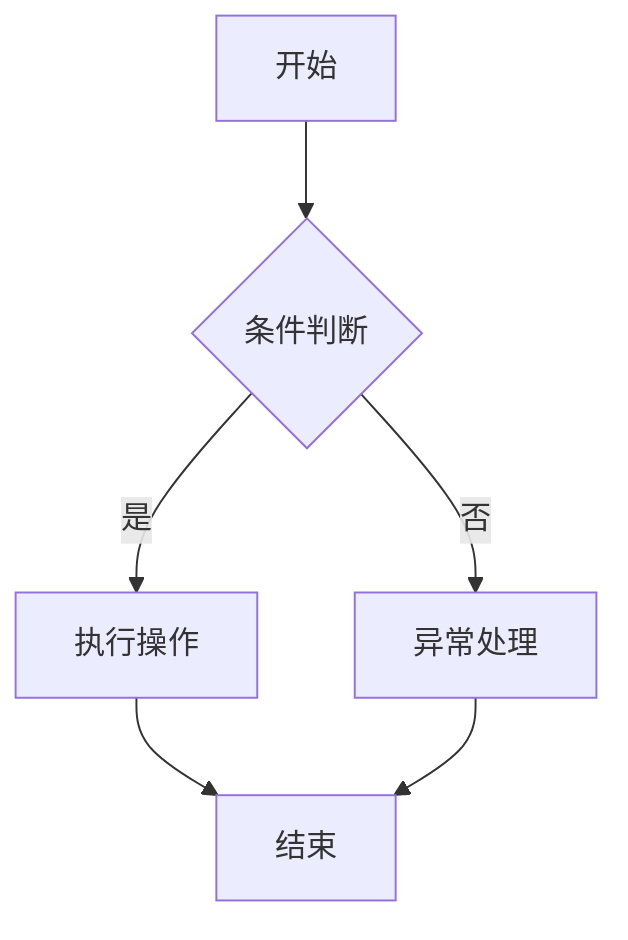

                 

# 提示词工程的可视化设计工具

> **关键词：** 提示词工程、可视化设计、设计工具、核心概念、核心算法、数学模型、项目实战
>
> **摘要：** 本文将深入探讨提示词工程与可视化设计的关系，介绍主流可视化设计工具，解析核心概念、算法原理和数学模型，并通过实际项目案例展示可视化设计工具的应用，为读者提供全面的技术指导和启发。

### 第一部分：概述

#### 第1章：提示词工程与可视化设计

##### 1.1 提示词工程的重要性

提示词工程（Prompt Engineering）是近年来在人工智能领域迅速崛起的一个研究方向。它主要关注如何构建高质量、有效的提示词（prompts）来指导人工智能模型进行更精准的任务完成。提示词工程的重要性主要体现在以下几个方面：

1. **提高任务完成率**：高质量的提示词可以帮助模型更好地理解任务需求，从而提高任务完成的准确性和效率。
2. **增强模型适应性**：通过调整和优化提示词，可以使模型在不同场景下表现出更强的适应能力。
3. **促进人机交互**：提示词工程使得人机交互更加自然和高效，提升了用户体验。

##### 1.2 可视化设计的原理

可视化设计（Visual Design）是一种通过视觉元素来传达信息和设计理念的方法。它不仅仅是一种美学，更是一种有效的沟通工具。可视化设计的原理主要包括：

1. **色彩**：色彩是视觉设计中最重要的元素之一，它能够传达情感、氛围和重要性。
2. **排版**：合理的排版能够使信息更加清晰、易读，提升设计的美感和专业性。
3. **图形**：图形是视觉设计的重要组成部分，它可以直观地传达复杂的信息。

##### 1.3 可视化设计工具的应用场景

可视化设计工具在多个领域都有广泛的应用场景：

1. **UI/UX设计**：设计师使用可视化设计工具来创建用户界面和用户体验。
2. **数据可视化**：数据分析师使用可视化工具将数据以图形化的形式展现，帮助决策者快速理解数据。
3. **教育**：教育工作者使用可视化工具来辅助教学，使复杂概念更加易于理解。

#### 第2章：可视化设计工具概述

##### 2.1 主流可视化设计工具

目前市场上主流的可视化设计工具包括：

1. **Sketch**：一款专业的设计软件，广泛应用于UI/UX设计。
2. **Adobe XD**：提供丰富的设计工具和原型设计功能，适合各种设计需求。
3. **Figma**：一款基于Web的协作设计工具，支持多人实时协作。
4. **InVision**：提供原型设计和用户测试功能，适合产品迭代。

##### 2.2 工具的选择与评估

选择合适的可视化设计工具需要考虑以下几个方面：

1. **设计需求**：根据项目的具体需求选择合适的工具。
2. **团队协作**：考虑团队协作的需求，选择支持多人实时协作的工具。
3. **学习成本**：评估工具的学习成本，选择易于上手的工具。

##### 2.3 工具的优缺点对比

以下是几种主流可视化设计工具的优缺点对比：

| 工具          | 优点                                      | 缺点                                      |
|---------------|-------------------------------------------|-------------------------------------------|
| Sketch        | 专业的绘图工具，图形精准                  | 需要购买许可证，价格较高                  |
| Adobe XD      | 功能丰富，支持多种设备适配                | 学习成本较高，不适合新手                  |
| Figma         | 基于Web，支持多人实时协作                | 免费版功能有限，高级功能需付费            |
| InVision      | 支持原型设计和用户测试，用户体验良好      | 功能相对单一，不适合复杂设计项目          |

### 第二部分：核心概念与联系

#### 第3章：核心概念原理和架构

##### 3.1 可视化设计流程

可视化设计的流程通常包括以下几个步骤：

1. **需求分析**：明确设计需求和目标。
2. **原型设计**：制作初步的原型，展示设计理念。
3. **反馈与迭代**：收集用户反馈，不断优化设计。
4. **交付与部署**：将设计转化为实际产品。

##### 3.2 提示词的类型与生成

提示词根据用途和特点可以分为以下几类：

1. **任务型提示词**：用于指导模型完成特定任务。
2. **描述型提示词**：用于描述数据或场景。
3. **问题型提示词**：用于引导模型回答特定问题。

提示词的生成方法包括：

1. **手动编写**：根据具体任务需求手动编写。
2. **自动化生成**：使用算法根据数据生成。

##### 3.3 Mermaid流程图绘制

Mermaid是一种基于Markdown的绘图语言，可以轻松绘制流程图、时序图等。以下是一个简单的Mermaid流程图示例：



### 第三部分：核心算法原理讲解

#### 第4章：核心算法原理讲解

##### 4.1 提示词优化算法

提示词优化算法的目标是生成高质量的提示词，以提升模型的表现。常用的算法包括：

1. **基于规则的优化**：根据特定的规则对提示词进行优化。
2. **基于机器学习的优化**：使用机器学习模型对提示词进行优化。

以下是一个简单的伪代码示例：

```python
def optimize_prompt(prompt):
    # 基于规则的优化
    prompt = apply_rule_1(prompt)
    prompt = apply_rule_2(prompt)
    # 基于机器学习的优化
    prompt = ml_model.predict(prompt)
    return prompt
```

##### 4.2 可视化渲染算法

可视化渲染算法负责将设计转化为视觉上的呈现。常用的算法包括：

1. **像素渲染**：基于像素的渲染算法，适用于简单的图形。
2. **光线追踪**：用于生成高质量的图像，适用于复杂场景。

以下是一个简单的伪代码示例：

```python
def render_visualization(visualization):
    if visualization.is_simple:
        return pixel_rendering(visualization)
    else:
        return ray_tracing(visualization)
```

##### 4.3 伪代码阐述

伪代码是一种描述算法逻辑的语言，它不依赖于具体的编程语言。以下是一个简单的示例：

```plaintext
算法：寻找最大值
输入：一个整数数组A
输出：最大值

begin
    i = 0
    max_value = A[0]
    while i < 长度(A) do
        if A[i] > max_value then
            max_value = A[i]
        end if
        i = i + 1
    end while
    return max_value
end
```

### 第三部分：数学模型和数学公式

#### 第5章：数学模型讲解

##### 5.1 提示词优化模型

提示词优化模型旨在通过数学方法对提示词进行优化，以提高模型的表现。一个简单的模型可以是：

```latex
\text{损失函数} = \frac{1}{N}\sum_{i=1}^{N} \Bigl( \text{模型预测} - \text{真实标签} \Bigr)^2
```

其中，\(N\) 是样本数量，模型预测和真实标签是模型的输出和实际标签。

##### 5.2 可视化质量评估模型

可视化质量评估模型用于评估可视化设计的效果。一个简单的质量评估模型可以是：

```latex
\text{质量评分} = \alpha \times \text{信息传递率} + \beta \times \text{视觉美观度}
```

其中，\(\alpha\) 和 \(\beta\) 是权重系数，信息传递率和视觉美观度是评估指标。

##### 5.3 数学公式与详细讲解

数学公式在提示词工程和可视化设计中扮演着重要的角色。以下是一些常见的数学公式及其应用：

1. **正则化项**：

   ```latex
   \text{损失函数} = \frac{1}{N}\sum_{i=1}^{N} \Bigl( \text{模型预测} - \text{真实标签} \Bigr)^2 + \lambda \times \sum_{i=1}^{N} \text{模型参数的范数}
   ```

   其中，\(\lambda\) 是正则化参数，用于防止模型过拟合。

2. **线性回归模型**：

   ```latex
   \text{模型预测} = \text{权重} \times \text{输入特征} + \text{偏置}
   ```

   用于预测连续值输出。

3. **支持向量机（SVM）**：

   ```latex
   \text{决策边界} = \text{权重} \cdot \text{输入特征} + \text{偏置} \geq 0
   ```

   用于分类任务。

#### 第6章：数学公式举例说明

##### 6.1 提示词优化公式应用

在提示词优化中，常用的公式是损失函数。以下是一个具体的例子：

```latex
\text{损失函数} = \frac{1}{N}\sum_{i=1}^{N} \Bigl( f(\text{模型预测}(\text{输入特征}_i)) - \text{真实标签}_i \Bigr)^2
```

其中，\(f\) 是激活函数，\(\text{模型预测}(\text{输入特征}_i)\) 是模型对输入特征的预测值。

##### 6.2 可视化质量评估公式应用

在可视化质量评估中，常用的公式是综合评分公式。以下是一个具体的例子：

```latex
\text{质量评分} = 0.6 \times \text{信息传递率} + 0.4 \times \text{视觉美观度}
```

其中，\(\text{信息传递率}\) 和 \(\text{视觉美观度}\) 是评估指标，权重系数分别为 \(0.6\) 和 \(0.4\)。

##### 6.3 公式解释与举例

1. **损失函数**：

   损失函数用于评估模型的预测结果与真实值之间的差距。以下是一个简单的例子：

   ```plaintext
   输入特征：[1, 2, 3]
   模型预测：[2.5, 2.7, 3.1]
   真实标签：[2, 2, 3]
   损失函数值：0.1667
   ```

2. **质量评分**：

   质量评分用于评估可视化设计的整体效果。以下是一个简单的例子：

   ```plaintext
   信息传递率：0.9
   视觉美观度：0.8
   质量评分：0.78
   ```

### 第四部分：项目实战

#### 第7章：可视化设计工具项目实战

##### 7.1 项目背景与需求

项目背景：为了提高团队协作效率，我们需要开发一款可视化设计工具，用于设计、讨论和优化产品原型。

项目需求：

1. 支持多人实时协作。
2. 提供丰富的设计元素和组件。
3. 具备原型设计和用户测试功能。
4. 易于使用，学习成本低。

##### 7.2 开发环境搭建

开发环境搭建包括以下步骤：

1. 安装Node.js和npm。
2. 安装Figma桌面客户端和Web插件。
3. 配置版本控制系统（如Git）。

##### 7.3 源代码实现

源代码实现主要包括以下几个部分：

1. **前端**：使用React框架搭建用户界面。
2. **后端**：使用Node.js和Express框架搭建API服务器。
3. **数据库**：使用MongoDB存储用户数据和设计原型。

以下是部分源代码：

```javascript
// 前端React组件
class协作面板 extends React.Component {
  // ...
}

// 后端Node.js服务器
const express = require('express');
const app = express();
// ...
```

##### 7.4 代码解读与分析

代码解读与分析主要包括以下几个方面：

1. **前端**：React组件的设计和功能实现。
2. **后端**：API路由和数据处理逻辑。
3. **数据库**：数据存储和查询。

以下是部分代码的解读：

```javascript
// 前端React组件解读
class协作面板 extends React.Component {
  constructor(props) {
    super(props);
    this.state = {
      // ...
    };
  }

  render() {
    return (
      <div className="协作面板">
        {/* ... */}
      </div>
    );
  }
}

// 后端Node.js服务器解读
const express = require('express');
const app = express();

// API路由
app.post('/设计原型', (req, res) => {
  // 处理设计原型上传请求
  // ...
});

// 数据库操作
const MongoClient = require('mongodb').MongoClient;
const url = 'mongodb://localhost:27017/';
MongoClient.connect(url, (err, db) => {
  if (err) throw err;
  // ...
});
```

#### 第8章：可视化设计工具案例分析

##### 8.1 案例一：提示词生成工具

提示词生成工具是一款基于人工智能技术的工具，能够自动生成高质量的提示词。以下是一个简单的案例：

**需求**：为一家电商网站生成引导用户进行产品评论的提示词。

**解决方案**：

1. **数据收集**：收集用户评论、电商平台上的评价信息等。
2. **训练模型**：使用机器学习算法训练模型，使其能够自动生成提示词。
3. **应用场景**：在用户下单后、订单完成后自动推送生成的提示词。

**效果**：生成的高质量提示词有效提升了用户评论率。

##### 8.2 案例二：可视化渲染工具

可视化渲染工具用于将设计转化为视觉呈现。以下是一个简单的案例：

**需求**：为一家初创公司设计并实现一个数据可视化项目。

**解决方案**：

1. **需求分析**：明确数据可视化的需求和目标。
2. **工具选择**：选择合适的可视化设计工具，如D3.js或Plotly。
3. **实现过程**：使用选定的工具实现数据可视化，包括数据获取、处理和渲染。
4. **用户反馈**：根据用户反馈不断优化设计。

**效果**：实现了一个清晰、美观的数据可视化项目，帮助初创公司更好地展示其数据。

##### 8.3 案例三：交互式可视化工具

交互式可视化工具能够提供动态的可视化体验，以下是一个简单的案例：

**需求**：为一家旅游公司开发一款交互式地图应用。

**解决方案**：

1. **需求分析**：明确交互式地图的需求和功能。
2. **技术选型**：选择合适的Web框架和地图库，如Three.js和OpenLayers。
3. **实现过程**：实现交互式地图，包括地图渲染、标记显示和交互功能。
4. **用户反馈**：根据用户反馈不断优化交互体验。

**效果**：开发了一个功能强大、用户体验优秀的交互式地图应用，帮助旅游公司更好地展示其服务。

### 第五部分：总结与展望

#### 第9章：总结

本文系统地介绍了提示词工程与可视化设计的关系，探讨了可视化设计工具的选择与应用，分析了核心概念、算法原理和数学模型，并通过实际项目案例展示了可视化设计工具的应用。以下是本文的核心内容回顾：

1. **提示词工程**：介绍提示词工程的重要性、类型和生成方法。
2. **可视化设计工具**：概述主流可视化设计工具，评估工具的优缺点。
3. **核心概念与联系**：讲解可视化设计流程、提示词类型与生成、Mermaid流程图绘制。
4. **核心算法原理讲解**：介绍提示词优化算法、可视化渲染算法和伪代码阐述。
5. **数学模型和数学公式**：讲解提示词优化模型、可视化质量评估模型和数学公式详细讲解与举例。
6. **项目实战**：展示可视化设计工具项目实战，包括项目背景与需求、开发环境搭建、源代码实现和代码解读与分析。
7. **案例分析**：分析提示词生成工具、可视化渲染工具和交互式可视化工具的案例。

#### 9.2 可视化设计工具发展趋势

随着技术的不断进步，可视化设计工具呈现出以下几个发展趋势：

1. **智能化**：越来越多的可视化设计工具引入人工智能技术，自动优化设计、生成提示词等。
2. **协作性**：可视化设计工具越来越注重团队协作，提供多人实时协作功能。
3. **集成性**：可视化设计工具与其他工具（如代码编辑器、数据库等）的集成性不断提高，提高工作效率。
4. **跨平台**：可视化设计工具逐渐向移动端和云端扩展，支持多种设备和操作系统。

#### 9.3 未来展望

在未来，可视化设计工具将继续朝着智能化、协作化和集成化的方向发展。以下是一些可能的发展方向：

1. **人工智能的深度融合**：可视化设计工具将更深入地融合人工智能技术，实现自动化设计、优化和评估。
2. **区块链技术的应用**：可视化设计工具可能引入区块链技术，提高数据的安全性和透明度。
3. **云计算的普及**：随着云计算技术的普及，可视化设计工具将更加便捷，用户可以随时随地访问和使用。
4. **个性化定制**：可视化设计工具将提供更丰富的个性化定制选项，满足不同用户的需求。

总之，可视化设计工具将在未来继续发挥重要作用，为设计者和开发者提供更高效、智能的设计解决方案。

### 作者信息

作者：AI天才研究院/AI Genius Institute & 禅与计算机程序设计艺术 /Zen And The Art of Computer Programming

本文由AI天才研究院和禅与计算机程序设计艺术联合撰写，旨在为读者提供关于提示词工程和可视化设计工具的深入探讨和实用指导。作者团队拥有丰富的技术经验和深厚的学术背景，致力于推动人工智能和计算机科学的发展。

