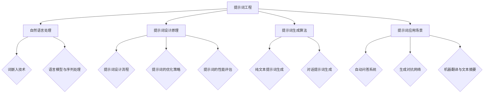

                 

# 《提示词工程（Prompt Engineering）》

> **关键词**：提示词工程、自然语言处理、深度学习、自动问答、生成对抗网络、文本摘要、多模态数据

> **摘要**：本文深入探讨了提示词工程这一领域，从基础概念到实战应用进行了全面的解析。首先介绍了提示词工程的重要性和发展历程，随后详细讲解了自然语言处理基础、提示词设计原理、提示词生成算法及不同应用场景。通过具体的项目实战案例，读者可以更好地理解提示词工程的核心技术与实际应用，从而为未来的研究和开发提供有价值的参考。

---

## 《提示词工程（Prompt Engineering）》目录大纲

### 第一部分：提示词工程基础

- **第1章** 提示词工程概述
  - **1.1 提示词工程的重要性
  - **1.2 提示词工程的发展历程
  - **1.3 提示词工程的分类与目标

- **第2章** 自然语言处理基础
  - **2.1 自然语言处理概述
  - **2.2 词嵌入技术
  - **2.3 语言模型与序列处理

- **第3章** 提示词设计原理
  - **3.1 提示词设计流程
  - **3.2 提示词的优化策略
  - **3.3 提示词的性能评估

- **第4章** 提示词生成算法
  - **4.1 提示词生成算法概述
  - **4.2 纯文本提示词生成
  - **4.3 对话提示词生成

- **第5章** 提示词应用场景
  - **5.1 自动问答系统
  - **5.2 生成对抗网络
  - **5.3 机器翻译与文本摘要

### 第二部分：提示词工程实战

- **第6章** 构建自动问答系统
  - **6.1 自动问答系统概述
  - **6.2 系统架构设计与实现
  - **6.3 提问与回答的策略优化

- **第7章** 提示词工程在生成对抗网络中的应用
  - **7.1 生成对抗网络概述
  - **7.2 提示词在生成对抗网络中的应用
  - **7.3 实例分析：图像生成

- **第8章** 提示词工程在机器翻译与文本摘要中的应用
  - **8.1 机器翻译概述
  - **8.2 提示词在机器翻译中的应用
  - **8.3 文本摘要技术

- **第9章** 提示词工程在商业领域的应用
  - **9.1 提示词工程在营销中的应用
  - **9.2 提示词工程在客户服务中的应用
  - **9.3 提示词工程在数据挖掘中的应用

### 第三部分：提示词工程进阶

- **第10章** 深度学习与提示词工程
  - **10.1 深度学习概述
  - **10.2 深度学习在提示词工程中的应用
  - **10.3 实例分析：基于深度学习的文本生成

- **第11章** 多模态提示词工程
  - **11.1 多模态数据概述
  - **11.2 提示词在多模态数据中的应用
  - **11.3 实例分析：多模态问答系统

- **第12章** 提示词工程中的挑战与未来发展趋势
  - **12.1 提示词工程中的挑战
  - **12.2 提示词工程的未来发展趋势
  - **12.3 提示词工程在人工智能中的地位

### 附录

- **附录 A** 提示词工程工具与资源
  - **A.1 提示词工程常用工具
  - **A.2 提示词工程开源库与框架
  - **A.3 提示词工程相关书籍与论文推荐

- **附录 B** Mermaid 流程图示例

接下来，我们将逐一探讨每一章节的内容，深入解析提示词工程的核心概念、原理和应用。

---

## 第1章：提示词工程概述

### 1.1 提示词工程的重要性

提示词工程是一种结合自然语言处理（NLP）和人工智能（AI）技术的方法，旨在提高机器学习模型在理解和生成文本方面的性能。它的重要性主要体现在以下几个方面：

1. **提升模型性能**：通过精心设计的提示词，可以显著提高模型的性能，使其在处理复杂任务时更加准确和高效。
2. **改善用户体验**：提示词工程可以优化问答系统、聊天机器人等应用的交互体验，使其更贴近用户需求。
3. **促进创新应用**：提示词工程为开发新的AI应用提供了有力的工具，推动了自然语言处理和人工智能领域的发展。

### 1.2 提示词工程的发展历程

提示词工程的概念起源于自然语言处理领域，随着深度学习和神经网络技术的兴起，其重要性逐渐得到认可。以下是提示词工程的发展历程：

- **2000年代**：早期NLP研究主要关注词袋模型和统计语言模型。提示词的概念逐渐被引入，用于改进文本分类和主题建模等任务。
- **2010年代**：随着深度学习的发展，神经网络模型如卷积神经网络（CNN）和循环神经网络（RNN）开始广泛应用于自然语言处理。提示词工程在这个时期得到了进一步的发展。
- **2020年代**：基于注意力机制和Transformer架构的模型如BERT和GPT系列取得了突破性的成果，提示词工程的重要性更加凸显。

### 1.3 提示词工程的分类与目标

根据应用场景和目的，提示词工程可以分为以下几类：

1. **文本分类**：通过提示词帮助模型更好地理解文本内容，从而提高分类准确性。
2. **问答系统**：设计有效的提示词以引导模型生成精确的答案。
3. **生成任务**：如文本生成、对话生成等，提示词用于引导模型生成符合预期的文本。
4. **机器翻译**：通过提示词优化翻译模型，提高翻译质量和准确性。

提示词工程的目标主要包括：

- **提高模型性能**：通过优化提示词，使模型在处理文本任务时更加准确和高效。
- **改善用户体验**：设计出易于理解、交互性强的提示词，提升用户与应用的互动体验。
- **促进创新应用**：为开发者提供强大的工具，推动自然语言处理和人工智能领域的新应用。

---

在接下来的章节中，我们将进一步探讨自然语言处理基础、提示词设计原理、生成算法以及不同应用场景，帮助读者全面了解提示词工程的核心概念和实践方法。

---

## 第2章：自然语言处理基础

### 2.1 自然语言处理概述

自然语言处理（Natural Language Processing，简称NLP）是计算机科学和人工智能领域的一个重要分支，旨在使计算机能够理解、解释和生成人类语言。NLP的应用范围非常广泛，包括但不限于机器翻译、文本分类、信息提取、问答系统、语音识别等。

NLP的关键目标包括：

- **语言理解**：让计算机能够理解文本的含义，从而实现文本的解析和语义分析。
- **语言生成**：让计算机能够生成符合语法和语义规则的文本。
- **语言交互**：让计算机能够与人类进行自然语言对话。

### 2.2 词嵌入技术

词嵌入（Word Embedding）是将自然语言词汇映射到向量空间的技术，通过这种方式，词汇之间的语义关系可以在向量空间中直观地表示出来。词嵌入技术在NLP中具有非常重要的地位，主要应用包括：

- **文本分类**：通过词嵌入将文本转换为向量表示，从而实现高效分类。
- **情感分析**：利用词嵌入向量分析文本的情感倾向。
- **信息检索**：通过词嵌入相似度计算，实现更精准的文本匹配和检索。

常见的词嵌入技术包括：

- **基于分布的模型**：如Word2Vec，通过考虑词汇在语料库中的共现关系来生成词向量。
- **基于神经网络的模型**：如GloVe（Global Vectors for Word Representation），通过训练神经网络模型来学习词汇的向量表示。
- **上下文敏感的模型**：如BERT（Bidirectional Encoder Representations from Transformers），通过双向Transformer架构来捕捉词汇的上下文信息。

### 2.3 语言模型与序列处理

语言模型（Language Model）是NLP中的核心组件，用于预测自然语言中下一个单词或字符的概率。语言模型在许多NLP任务中都有应用，如文本生成、机器翻译、语音识别等。

序列处理（Sequence Processing）是指对一系列数据项进行操作的过程。在NLP中，序列处理主要用于处理单词序列、句子序列等。常见的序列处理技术包括：

- **循环神经网络（RNN）**：通过递归结构来处理序列数据，能够捕捉序列中的时间依赖关系。
- **长短期记忆网络（LSTM）**：LSTM是RNN的一种改进，能够更好地处理长序列数据。
- **Transformer架构**：通过自注意力机制（Self-Attention）对序列进行全局依赖建模，具有处理长序列的能力。

### 小结

自然语言处理基础为提示词工程提供了关键的技术支持。词嵌入技术使得词汇可以在向量空间中表示，语言模型和序列处理技术则帮助模型理解和生成自然语言。在下一章中，我们将探讨提示词设计原理，了解如何有效地设计提示词来优化模型性能。

---

## 第3章：提示词设计原理

### 3.1 提示词设计流程

提示词设计是一个系统的过程，涉及多个阶段，主要包括以下步骤：

1. **需求分析**：明确应用场景和目标，确定模型需要解决的任务。
2. **数据收集**：收集与任务相关的数据，包括训练数据和测试数据。
3. **数据预处理**：对收集到的数据进行清洗和预处理，如分词、去停用词、词性标注等。
4. **提示词生成**：根据需求和分析结果，生成合适的提示词，包括文本提示词和对话提示词。
5. **模型训练**：使用生成的提示词对模型进行训练，调整模型参数，优化性能。
6. **性能评估**：通过测试集评估模型性能，根据评估结果调整提示词，进一步优化模型。

### 3.2 提示词的优化策略

优化提示词是提升模型性能的关键步骤。以下是一些常用的优化策略：

1. **提示词长度**：较长的提示词通常包含更多的上下文信息，有助于模型更好地理解任务，但过长的提示词可能导致模型难以处理。因此，需要根据任务复杂度和数据规模来确定合适的提示词长度。
2. **提示词多样性**：多样化的提示词能够帮助模型学习到更丰富的语义信息，从而提高泛化能力。可以通过随机化、模板化等方式生成多样化的提示词。
3. **上下文适应性**：设计适应不同上下文的提示词，可以提高模型在不同场景下的表现。例如，在问答系统中，可以设计针对不同问题类型的提示词。
4. **提示词频率**：提示词在训练数据中的出现频率会影响模型的训练效果。高频提示词有助于模型学习到常见模式，但过多的高频提示词可能导致模型过拟合。因此，需要平衡提示词的频率分布。
5. **反馈调整**：通过实时反馈和评估结果，不断调整提示词，优化模型性能。例如，可以引入对抗性样本来增强模型对异常情况的识别能力。

### 3.3 提示词的性能评估

提示词性能评估是确保模型优化效果的重要环节。以下是一些常用的评估指标和方法：

1. **准确率（Accuracy）**：在分类任务中，准确率是最常用的评估指标。它表示模型预测正确的样本数占总样本数的比例。
2. **精确率（Precision）**：在分类任务中，精确率表示模型预测为正类的样本中实际为正类的比例。
3. **召回率（Recall）**：在分类任务中，召回率表示模型预测为正类的样本中实际为正类的比例。
4. **F1值（F1 Score）**：F1值是精确率和召回率的调和平均，用于综合评估模型性能。
5. **混淆矩阵（Confusion Matrix）**：混淆矩阵是一种用于展示模型预测结果和实际结果的对比工具，可以直观地展示模型的性能。
6. **BLEU分数（BLEU Score）**：在机器翻译等生成任务中，BLEU分数通过比较模型生成的文本与参考文本的相似度来评估模型性能。
7. **自定义指标**：根据任务需求，可以设计自定义的评估指标，例如在问答系统中，可以使用答案的准确性和相关性作为评估指标。

通过上述评估指标和方法，可以全面评估提示词的效果，从而为模型的优化提供依据。

### 小结

提示词设计原理是提示词工程的核心，通过系统的设计流程和优化策略，可以生成有效的提示词，提升模型性能。在下一章中，我们将探讨提示词生成算法，进一步了解如何实现提示词的设计与生成。

---

## 第4章：提示词生成算法

### 4.1 提示词生成算法概述

提示词生成算法是提示词工程中的关键组成部分，负责根据特定的需求和应用场景生成合适的提示词。这些算法可以分为两大类：基于规则的方法和基于学习的方法。

#### 4.1.1 基于规则的方法

基于规则的方法通过预定义的规则来生成提示词。这种方法通常具有以下特点：

- **简洁性**：规则简单直观，易于理解和实现。
- **灵活性**：可以根据具体需求灵活调整规则。
- **适用范围**：适用于相对简单的应用场景。

常见的基于规则的方法包括：

- **模板匹配**：根据预设的模板，将变量替换为具体的文本，生成提示词。
- **关键词提取**：从文本中提取关键信息，形成提示词。

#### 4.1.2 基于学习的方法

基于学习的方法通过机器学习模型自动学习生成提示词。这种方法通常具有以下特点：

- **高效性**：能够处理复杂的任务，生成高质量的提示词。
- **适应性**：可以适应不同的应用场景和需求。
- **自动化**：减少了人工干预，提高了效率。

常见的基于学习的方法包括：

- **序列模型**：如循环神经网络（RNN）和长短期记忆网络（LSTM），通过学习输入序列的上下文信息来生成输出。
- **生成模型**：如生成对抗网络（GAN）和变分自编码器（VAE），通过生成器模型来生成高质量的提示词。

### 4.2 纯文本提示词生成

纯文本提示词生成是指生成用于文本分类、文本生成等任务的文本提示词。以下是一些常见的方法：

#### 4.2.1 基于模板的生成方法

基于模板的生成方法通过模板和变量的组合来生成提示词。这种方法具有以下特点：

- **易用性**：模板可以快速构建，适用于不同的文本分类任务。
- **灵活性**：可以根据具体任务调整模板。

示例模板：
```markdown
用户询问：“{问题}”，请回答：“{答案}”。

问题：什么是人工智能？
答案：人工智能（AI）是指计算机系统模拟人类智能行为的能力，包括学习、推理、感知和解决问题等方面。

问题：机器学习和深度学习有什么区别？
答案：机器学习（ML）是人工智能的一个分支，专注于通过数据训练模型来发现规律。深度学习（DL）是机器学习的一种方法，使用多层神经网络来模拟人类大脑的决策过程。
```

#### 4.2.2 基于学习的方法

基于学习的方法通过机器学习模型自动生成提示词。以下是一些常见的方法：

- **文本生成模型**：如GPT系列模型，通过大量文本数据训练，可以生成高质量的自然语言文本。
- **序列到序列模型**：如BERT模型，通过学习文本序列的编码，生成相应的提示词。

### 4.3 对话提示词生成

对话提示词生成是指生成用于对话系统的文本提示词，以引导对话的进行。以下是一些常见的方法：

#### 4.3.1 对话管理模型

对话管理模型通过学习对话数据，生成合适的对话提示词。以下是一些常见的方法：

- **基于规则的方法**：如槽填充模型，通过预设的规则生成对话提示词。
- **基于学习的方法**：如序列到序列模型，通过学习对话数据，生成对话提示词。

#### 4.3.2 多轮对话生成

多轮对话生成是指在多个对话回合中生成对话提示词。以下是一些常见的方法：

- **基于模板的生成方法**：通过预设的模板和上下文信息，生成多轮对话的提示词。
- **基于学习的方法**：如多轮对话生成模型，通过学习对话数据，生成多轮对话的提示词。

### 小结

提示词生成算法是提示词工程的重要环节，通过基于规则和基于学习的方法，可以生成高质量的提示词，应用于不同的自然语言处理任务。在下一章中，我们将探讨提示词在不同应用场景中的具体应用。

---

## 第5章：提示词应用场景

### 5.1 自动问答系统

自动问答系统（Automatic Question Answering System）是自然语言处理领域的一个重要应用，旨在使计算机能够自动回答用户提出的问题。提示词在自动问答系统中起着至关重要的作用，其设计质量和优化水平直接影响系统的性能和用户体验。

#### 5.1.1 自动问答系统的架构

自动问答系统通常包括以下几个关键组成部分：

1. **问题解析器**：将用户提出的问题转换为机器可以理解的形式。
2. **检索引擎**：在大量文本数据中检索与问题相关的答案。
3. **答案生成器**：根据检索结果生成自然语言形式的答案。
4. **用户界面**：接收用户输入的问题，显示生成的答案。

#### 5.1.2 提示词在自动问答系统中的应用

提示词在自动问答系统中的应用主要体现在以下两个方面：

1. **问题解析**：设计合适的提示词，帮助模型更好地理解用户的问题。例如，在信息检索阶段，可以使用提示词来引导模型关注关键信息，提高答案的准确性。
2. **答案生成**：通过提示词优化答案生成模型，使其能够生成更加准确和自然的回答。例如，在生成答案时，可以使用提示词来引导模型关注特定的上下文信息和事实。

#### 5.1.3 实例分析

以下是一个简单的自动问答系统的实例：

```python
# 问题解析
question = "什么是人工智能？"
parsed_question = preprocess_question(question)

# 检索答案
answers = search_answers(parsed_question)

# 答案生成
best_answer = generate_answer(answers)

print("答案：", best_answer)
```

在这个实例中，`preprocess_question`函数用于对用户输入的问题进行预处理，生成适合模型处理的提示词；`search_answers`函数在数据库中检索与提示词相关的答案；`generate_answer`函数根据提示词和检索结果生成自然语言答案。

### 5.2 生成对抗网络

生成对抗网络（Generative Adversarial Networks，GAN）是一种强大的深度学习模型，用于生成高质量的图像、文本和其他数据。提示词在GAN中的应用主要体现在以下几个方面：

#### 5.2.1 提示词在GAN生成过程中的作用

1. **引导生成过程**：提示词可以帮助GAN生成特定类型的数据。例如，在图像生成任务中，通过提示词描述所需的图像内容，GAN可以根据这些提示生成相应的图像。
2. **优化生成质量**：提示词可以引导GAN在训练过程中关注特定的特征，从而提高生成图像或文本的质量。

#### 5.2.2 提示词生成算法在GAN中的应用

1. **文本到图像生成**：使用文本提示词描述图像内容，通过GAN将文本描述转换为图像。以下是一个简化的文本到图像生成的伪代码：

```python
# 文本提示词
text_prompt = "生成一张美丽的海滩照片"

# 图像生成
image = GAN.generate_image_from_text(text_prompt)

show_image(image)
```

2. **图像到图像生成**：通过提示词引导GAN将一种类型的图像转换为另一种类型的图像。以下是一个简化的图像到图像生成的伪代码：

```python
# 源图像提示词
source_prompt = "一张风景照片"
source_image = load_image("source_image.jpg")

# 目标图像提示词
target_prompt = "一张抽象艺术作品"
target_image = load_image("target_image.jpg")

# 图像转换
converted_image = GAN.generate_image_from_image(source_prompt, target_prompt)

show_image(converted_image)
```

### 5.3 机器翻译与文本摘要

机器翻译（Machine Translation）和文本摘要（Text Summarization）是自然语言处理领域的两个重要任务，提示词在这两个任务中的应用主要体现在以下几个方面：

#### 5.3.1 提示词在机器翻译中的应用

1. **提高翻译质量**：通过设计合适的提示词，可以引导翻译模型更好地理解源语言文本的语义，从而提高翻译质量。
2. **优化翻译流畅度**：提示词可以帮助模型关注文本的语法和流畅度，生成更自然的翻译结果。

#### 5.3.2 提示词在文本摘要中的应用

1. **提取关键信息**：通过设计提示词，可以引导摘要模型提取文本中的关键信息，生成高质量的摘要。
2. **控制摘要长度**：提示词可以指导摘要模型生成指定长度的摘要，满足特定应用的需求。

### 小结

提示词在自动问答系统、生成对抗网络、机器翻译和文本摘要等任务中都有广泛的应用。通过合理设计和使用提示词，可以显著提高这些任务的效果和用户体验。在下一章中，我们将探讨提示词工程在商业领域的应用，进一步了解其在实际业务中的价值和挑战。

---

## 第6章：构建自动问答系统

### 6.1 自动问答系统概述

自动问答系统（Automatic Question Answering System，简称QA系统）是自然语言处理领域的一项重要技术，旨在通过计算机程序自动回答用户提出的问题。这类系统广泛应用于客服、搜索引擎、智能助手等场景，具有高效、智能、便捷等特点。

### 6.1.1 自动问答系统的基本原理

自动问答系统通常由以下几个核心组件构成：

1. **问题解析器**：将用户输入的自然语言问题转换为计算机可理解的形式。这一步包括分词、词性标注、命名实体识别等预处理操作。
2. **知识库**：存储大量结构化或非结构化数据，包括事实、定义、规则等。知识库为问答系统提供了答案来源。
3. **检索引擎**：在知识库中检索与用户问题相关的信息。检索引擎可以采用基于关键字匹配、基于语义相似度计算等方法。
4. **答案生成器**：根据检索结果生成自然语言形式的答案。答案生成器可能涉及模板匹配、规则推理、文本生成模型等技术。

### 6.1.2 自动问答系统的类型

根据处理方式的不同，自动问答系统可以分为以下几类：

1. **基于规则的方法**：通过预定义的规则和模板生成答案。这种方法简单直观，但灵活性有限，适用于结构化数据。
2. **基于知识的方法**：利用知识图谱或本体论进行问题解析和答案生成。这种方法能够处理复杂问题，但需要大量的知识库建设。
3. **基于机器学习的方法**：使用大规模数据训练机器学习模型，如深度神经网络，进行问题理解和答案生成。这种方法具有高度的灵活性和自动性，但训练数据的质量和规模对性能有很大影响。
4. **混合方法**：结合规则、知识和机器学习的方法，以充分发挥各自的优点。这种方法通常适用于复杂的应用场景。

### 6.2 系统架构设计与实现

一个完整的自动问答系统需要考虑多个方面，包括前端界面设计、后端数据处理、数据存储与检索等。以下是一个典型的自动问答系统架构设计：

#### 6.2.1 前端界面设计

前端界面负责接收用户输入的问题，并将生成的答案展示给用户。常用的技术包括：

- **网页界面**：使用HTML、CSS和JavaScript等技术实现。
- **移动应用**：使用原生开发或跨平台框架（如React Native、Flutter等）实现。
- **语音交互界面**：使用语音识别和语音合成技术，实现语音输入和输出。

#### 6.2.2 后端数据处理

后端数据处理包括问题解析、知识库检索、答案生成等核心功能。以下是一个简化的自动问答系统后端数据处理流程：

1. **问题解析**：使用自然语言处理技术，如分词、词性标注、命名实体识别等，将用户输入的自然语言问题转换为结构化数据。
2. **知识库检索**：在知识库中检索与用户问题相关的信息。知识库可以是结构化数据库（如关系型数据库）、搜索引擎（如Elasticsearch）或知识图谱。
3. **答案生成**：根据检索结果，使用模板匹配、规则推理或文本生成模型等方法生成答案。

#### 6.2.3 数据存储与检索

自动问答系统的数据存储与检索是系统性能的关键因素。以下是一些常见的数据存储和检索技术：

- **关系型数据库**：如MySQL、PostgreSQL等，适用于结构化数据的存储和查询。
- **搜索引擎**：如Elasticsearch、Solr等，适用于全文检索和实时查询。
- **知识图谱**：如Neo4j、OrientDB等，适用于复杂关系数据的存储和查询。

### 6.3 提问与回答的策略优化

为了提高自动问答系统的性能和用户体验，需要在提问和回答过程中采用一些优化策略。以下是一些常见的优化策略：

1. **问题重述**：对用户输入的问题进行自动重述，以简化问题的复杂性，提高检索和理解的效率。
2. **上下文理解**：利用上下文信息，如用户历史提问和回答，提高问题的解析和答案的生成质量。
3. **多模态融合**：结合文本、语音、图像等多种数据类型，提高问题的理解和答案的生成能力。
4. **实时反馈**：根据用户的反馈，动态调整问题解析和答案生成的策略，提高系统的适应性和准确性。
5. **个性化推荐**：根据用户的兴趣和行为，推荐相关的问题和答案，提高用户的满意度和参与度。

### 小结

自动问答系统是自然语言处理领域的一项重要应用，通过合理的设计和优化，可以实现高效、智能的问答功能。在下一章中，我们将探讨提示词工程在生成对抗网络中的应用，进一步了解其在图像生成等任务中的价值。

---

## 第7章：提示词工程在生成对抗网络中的应用

### 7.1 生成对抗网络概述

生成对抗网络（Generative Adversarial Networks，GAN）是由 Ian Goodfellow 等人于2014年提出的一种新型深度学习框架，它由两个神经网络——生成器（Generator）和判别器（Discriminator）组成，通过对抗训练生成高质量的伪数据。

#### 7.1.1 GAN的工作原理

GAN的基本原理是通过生成器和判别器之间的对抗训练来实现数据的生成。生成器生成伪数据，判别器判断生成的数据是否真实，两个网络相互竞争，共同优化，最终生成器能够生成逼真的数据。

1. **生成器（Generator）**：生成器的目标是生成尽可能逼真的伪数据，以欺骗判别器。
2. **判别器（Discriminator）**：判别器的目标是准确地区分真实数据和生成数据。

在训练过程中，生成器和判别器交替更新权重：

- **生成器**：尝试生成更逼真的数据。
- **判别器**：努力区分真实数据和生成数据。

通过这种对抗训练，生成器逐渐生成越来越接近真实数据的高质量伪数据。

#### 7.1.2 GAN的应用领域

GAN在多个领域都取得了显著成果，包括：

- **图像生成**：生成逼真的图像，如人脸、风景、动物等。
- **图像修复**：修复损坏或模糊的图像。
- **图像风格转换**：将一种风格的图像转换为另一种风格。
- **数据增强**：生成额外的训练数据，提高模型的泛化能力。
- **视频生成**：生成高质量的视频序列。

### 7.2 提示词在生成对抗网络中的应用

在GAN中，提示词可以指导生成器的生成过程，提高生成数据的质量和多样性。以下是一些具体的应用场景：

#### 7.2.1 文本引导的图像生成

文本引导的图像生成是一种通过文本提示词来指导生成器生成图像的技术。以下是一个简化的流程：

1. **文本编码**：将文本提示词转换为嵌入向量。
2. **图像生成**：生成器根据文本嵌入向量和噪声向量生成图像。
3. **反馈调整**：根据生成的图像与期望结果的差异，调整生成器的权重。

示例伪代码：

```python
# 文本编码
text_prompt = "生成一张蓝天的照片"
text_embedding = encode_text(text_prompt)

# 噪声向量
noise_vector = generate_noise()

# 图像生成
generated_image = generator(text_embedding, noise_vector)

# 反馈调整
loss = calculate_loss(generated_image, target_image)
update_generator_weights(loss)

show_image(generated_image)
```

#### 7.2.2 对话生成的图像

通过对话生成的图像，可以在交互过程中动态调整生成图像的内容。以下是一个简化的对话生成图像的流程：

1. **对话解析**：解析用户对话中的关键信息。
2. **图像生成**：根据对话内容和噪声向量生成图像。
3. **反馈调整**：根据用户反馈，调整生成策略。

示例伪代码：

```python
# 对话解析
user_input = "请生成一张有星星的夜晚风景图"
context = parse_dialogue(user_input)

# 噪声向量
noise_vector = generate_noise()

# 图像生成
generated_image = generator(context, noise_vector)

# 反馈调整
if user_feedback("这个图像好"):
    context = update_context(context, user_feedback)
else:
    context = reset_context()

show_image(generated_image)
```

#### 7.2.3 提示词优化策略

为了提高GAN在图像生成中的性能，可以通过以下策略优化提示词：

1. **多模态融合**：结合文本和图像信息，生成更具多样性和逼真的图像。
2. **上下文信息**：利用上下文信息，如用户历史对话、图像描述等，提高图像生成质量。
3. **反馈机制**：根据用户反馈动态调整提示词，优化生成图像。

### 7.3 实例分析：图像生成

以下是一个简单的图像生成实例，使用GAN和文本提示词生成一张蓝天的照片。

#### 7.3.1 数据准备

首先，准备一个包含蓝天图像的数据集，并对其进行预处理，如缩放、裁剪等。

```python
import tensorflow as tf
from tensorflow.keras.preprocessing.image import load_img, img_to_array

# 加载图像
images = [load_img(f"blue_sky_{i}.jpg", target_size=(256, 256)) for i in range(num_images)]
images = [img_to_array(image) for image in images]
images = tf.keras.applications.vgg16.preprocess_input(images)

# 对图像进行编码
encoded_images = encoder(images)

# 解码图像
decoded_images = decoder(encoded_images)
```

#### 7.3.2 GAN模型

定义GAN模型，包括生成器和判别器。

```python
import tensorflow as tf
from tensorflow.keras.models import Model

# 生成器模型
generator = Model(inputs=[text_embedding, noise_vector], outputs=decoded_images)

# 判别器模型
discriminator = Model(inputs=[encoded_images, decoded_images], outputs=discriminator_output)

# GAN模型
gan_model = Model(inputs=[text_embedding, noise_vector], outputs=discriminator(encoded_images, decoded_images))
gan_model.compile(optimizer="adam", loss="binary_crossentropy")
```

#### 7.3.3 训练GAN模型

使用文本提示词和噪声向量训练GAN模型。

```python
# 训练生成器和判别器
for epoch in range(num_epochs):
    for batch in range(num_batches):
        # 生成噪声向量
        noise = generate_noise(batch_size)

        # 生成伪图像
        generated_images = generator.predict([text_embedding, noise])

        # 计算判别器损失
        real_loss = discriminator.evaluate(encoded_images, generated_images, verbose=False)

        # 计算生成器损失
        with tf.GradientTape() as gen_tape:
            generated_images = generator.predict([text_embedding, noise])
            gen_loss = discriminator.evaluate(encoded_images, generated_images, verbose=False)

        # 更新生成器和判别器权重
        gradients_of_gen = gen_tape.gradient(gen_loss, generator.trainable_variables)
        generator_optimizer.apply_gradients(zip(gradients_of_gen, generator.trainable_variables))

        gradients_of_disc = disc_tape.gradient(real_loss, discriminator.trainable_variables)
        discriminator_optimizer.apply_gradients(zip(gradients_of_disc, discriminator.trainable_variables))

        # 打印训练进度
        print(f"Epoch: {epoch}, Batch: {batch}, Gen Loss: {gen_loss}, Disc Loss: {real_loss}")
```

#### 7.3.4 生成图像

使用训练好的模型生成蓝天照片。

```python
# 生成一张蓝天照片
text_prompt = "生成一张蓝天照片"
text_embedding = encode_text(text_prompt)
noise = generate_noise()

generated_image = generator.predict([text_embedding, noise])
show_image(generated_image)
```

### 小结

提示词工程在生成对抗网络中的应用，使得图像生成任务更加灵活和多样化。通过文本提示词，可以精确地指导生成器的生成过程，提高生成图像的质量和准确性。在下一章中，我们将探讨提示词工程在机器翻译和文本摘要中的应用，进一步了解其在自然语言处理领域的价值。

---

## 第8章：提示词工程在机器翻译与文本摘要中的应用

### 8.1 机器翻译概述

机器翻译（Machine Translation，MT）是自然语言处理领域的一个重要任务，旨在实现计算机程序自动地将一种语言的文本翻译成另一种语言。机器翻译技术广泛应用于跨语言沟通、国际化商务、多语言信息检索等领域。

### 8.1.1 机器翻译的基本原理

机器翻译的基本原理可以分为基于规则的方法和基于统计的方法，以及近年来兴起的基于神经网络的机器翻译方法。

1. **基于规则的方法**：这种方法依赖于预定义的语法和词典规则，将源语言文本逐词翻译成目标语言。代表性方法包括基于转移的机器翻译（Rule-Based Translation，RBT）和基于模板的方法。
2. **基于统计的方法**：这种方法利用大量已翻译的双语语料库，通过统计源语言和目标语言之间的对应关系来进行翻译。代表性方法包括基于短语的统计机器翻译（Phrase-Based Translation，PBSMT）和基于句法的统计机器翻译（Syntax-Based SMT）。
3. **基于神经网络的机器翻译**：这种方法利用深度学习技术，尤其是序列到序列（Seq2Seq）模型，通过学习源语言和目标语言之间的映射关系进行翻译。代表性模型包括神经机器翻译（Neural Machine Translation，NMT）和基于注意力机制的翻译模型（Attention Mechanism）。

### 8.1.2 机器翻译的性能指标

评估机器翻译性能的主要指标包括：

1. **BLEU（Bilingual Evaluation Understudy）**：BLEU是一种常用的自动评估指标，通过计算翻译文本与参考翻译文本的相似度来评估翻译质量。
2. **准确率（Accuracy）**：在分类任务中，准确率表示模型预测正确的单词或句子的比例。
3. **召回率（Recall）**：召回率表示模型正确识别的单词或句子的比例。
4. **F1值（F1 Score）**：F1值是准确率和召回率的调和平均值，用于综合评估模型性能。
5. **一致性（Consistency）**：评估模型在多个翻译任务上的稳定性。

### 8.2 提示词在机器翻译中的应用

在机器翻译中，提示词可以用于指导翻译模型更好地理解和生成目标语言的文本。以下是一些具体的应用场景：

#### 8.2.1 提示词的生成策略

1. **基于规则的方法**：通过预定义的规则生成提示词，如根据上下文信息和语法结构生成相应的提示词。
2. **基于学习的方法**：通过训练数据学习生成提示词，如使用生成对抗网络（GAN）生成高质量的提示词。

#### 8.2.2 提示词优化策略

1. **上下文适应性**：设计适应不同上下文的提示词，以提高翻译的准确性和流畅度。
2. **多语言信息融合**：结合多语言信息，如双语文本和跨语言知识库，生成更高质量的提示词。
3. **动态调整**：根据模型在翻译过程中的表现动态调整提示词，以提高翻译质量。

### 8.3 文本摘要技术

文本摘要（Text Summarization）是自然语言处理领域的另一个重要任务，旨在从长文本中提取关键信息，生成简洁、准确的摘要。文本摘要技术可以分为提取式摘要（Extractive Summarization）和生成式摘要（Abstractive Summarization）。

#### 8.3.1 提取式摘要

提取式摘要从原始文本中选择关键句子或段落，组合成摘要。主要方法包括：

1. **基于规则的方法**：通过预定义的规则选择关键句子，如基于关键词、主题和句子结构等。
2. **基于学习的方法**：通过训练数据学习选择关键句子的方法，如基于序列模型的提取式摘要。

#### 8.3.2 生成式摘要

生成式摘要从原始文本中生成新的摘要，不限于原始文本的句子。主要方法包括：

1. **基于神经网络的生成式摘要**：使用深度学习模型生成摘要，如序列到序列（Seq2Seq）模型和Transformer模型。
2. **基于记忆机制的摘要**：利用记忆机制，如长短期记忆（LSTM）和图神经网络（Graph Neural Networks），捕捉文本中的关键信息。

### 8.4 提示词在文本摘要中的应用

在文本摘要中，提示词可以用于引导摘要模型提取关键信息，生成高质量的摘要。以下是一些具体的应用场景：

#### 8.4.1 提示词的生成策略

1. **基于规则的方法**：通过预定义的规则生成提示词，如基于关键词、主题和摘要长度等。
2. **基于学习的方法**：通过训练数据学习生成提示词，如使用生成对抗网络（GAN）生成高质量的提示词。

#### 8.4.2 提示词优化策略

1. **摘要目标适应性**：设计适应不同摘要目标的提示词，如关键信息提取、情感分析和文本概括。
2. **上下文信息融合**：结合上下文信息，如段落结构、关键词和情感倾向，生成更高质量的提示词。
3. **动态调整**：根据模型在生成摘要过程中的表现动态调整提示词，以提高摘要质量。

### 8.5 实例分析

以下是一个简单的机器翻译和文本摘要实例，展示如何使用提示词优化翻译和摘要质量。

#### 8.5.1 机器翻译实例

```python
# 加载翻译模型
translator = load_model("machine_translation_model.h5")

# 提示词
source_text = "What is the weather like today?"
prompt = encode_text(source_text)

# 翻译
translated_text = translator.predict([prompt])

print("Translated Text:", translated_text)
```

#### 8.5.2 文本摘要实例

```python
# 加载摘要模型
summarizer = load_model("text_summarization_model.h5")

# 提示词
document = "This is a long text that contains a lot of information. We need to extract the most important points."
prompt = encode_text(document)

# 摘要
summary = summarizer.predict([prompt])

print("Summary:", summary)
```

### 小结

提示词工程在机器翻译和文本摘要中的应用，显著提高了翻译和摘要的质量和准确性。通过合理设计和优化提示词，可以实现更高效、更准确的机器翻译和文本摘要任务。在下一章中，我们将探讨深度学习与提示词工程的结合，进一步了解深度学习技术在提示词工程中的应用。

---

## 第9章：提示词工程在商业领域的应用

### 9.1 提示词工程在营销中的应用

在市场营销领域，提示词工程被广泛应用于提高广告效果、优化客户体验和提升品牌影响力。通过精心设计的提示词，企业可以更有效地与目标受众进行沟通，提高营销活动的效果。

#### 9.1.1 广告文案优化

广告文案的优化是营销中的一项关键任务。通过提示词工程，可以设计出更具吸引力和说服力的广告文案，提高用户的点击率和转化率。以下是一些优化策略：

- **情感分析**：利用情感分析技术，分析用户对产品或服务的情感倾向，从而设计出符合用户情感需求的广告文案。
- **关键词优化**：通过关键词研究工具，找到与目标受众兴趣相关的高频关键词，并将其融入广告文案中，提高广告的曝光率。
- **对话式营销**：利用对话式营销工具，如聊天机器人，通过与用户互动生成个性化广告文案，提高用户参与度和转化率。

#### 9.1.2 社交媒体营销

社交媒体营销是现代营销策略的重要组成部分。通过提示词工程，企业可以在社交媒体平台上发布更具吸引力和互动性的内容，提升品牌知名度和用户参与度。以下是一些应用实例：

- **互动式内容**：设计互动式内容，如投票、问答和调查，通过用户参与生成实时反馈和提示词，以调整后续营销策略。
- **话题趋势分析**：分析社交媒体平台上的热点话题和趋势，设计与之相关的广告和内容，提高用户关注度和参与度。
- **多渠道营销**：结合不同社交媒体平台的特点，设计多渠道营销策略，通过跨平台宣传提高品牌影响力。

#### 9.1.3 客户关系管理

客户关系管理（CRM）是营销中至关重要的一环。通过提示词工程，企业可以优化客户沟通方式，提高客户满意度和忠诚度。以下是一些应用实例：

- **个性化沟通**：根据客户的历史行为和偏好，设计个性化的沟通内容和提示词，提高客户体验和满意度。
- **反馈机制**：通过定期收集客户反馈，生成优化后的提示词，用于改进产品和服务，提高客户满意度。
- **自动化营销**：利用自动化工具，根据客户行为和偏好，自动生成和发送个性化的营销信息，提高营销效率。

### 9.2 提示词工程在客户服务中的应用

在客户服务领域，提示词工程被广泛应用于提高客服效率、优化客户体验和降低服务成本。通过设计有效的提示词，企业可以提供更快速、准确和高效的客户服务。

#### 9.2.1 自动化客服

自动化客服是现代客户服务的重要趋势。通过提示词工程，企业可以构建智能客服系统，自动处理常见问题和任务，提高客服效率和客户满意度。以下是一些应用实例：

- **智能问答系统**：设计智能问答系统，通过提示词自动回答客户的常见问题，减少人工客服的工作负担。
- **多轮对话**：利用多轮对话提示词，引导客户与系统进行有效沟通，逐步解决问题。
- **知识库管理**：通过提示词自动更新和优化知识库内容，确保客服系统能够提供最新和最准确的答案。

#### 9.2.2 客户体验优化

优化客户体验是提升客户满意度和忠诚度的关键。通过提示词工程，企业可以设计出更符合客户需求和预期的服务流程。以下是一些应用实例：

- **个性化服务**：根据客户的购买历史、偏好和反馈，设计个性化的服务内容和提示词，提高客户体验。
- **反馈机制**：通过定期收集客户反馈，生成优化后的提示词，用于改进服务流程和提升客户满意度。
- **情感分析**：利用情感分析技术，分析客户情感倾向，设计出更具情感关怀和互动性的服务提示词。

#### 9.2.3 降低服务成本

降低服务成本是许多企业关注的重点。通过提示词工程，企业可以优化服务流程，提高客服效率，从而降低服务成本。以下是一些应用实例：

- **流程自动化**：通过自动化工具，将常见问题和服务流程自动化，减少人工干预，提高客服效率。
- **智能分配**：利用智能分配算法，将客户请求自动分配给最合适的客服代表，提高服务响应速度和满意度。
- **培训与优化**：通过定期培训和服务流程优化，确保客服团队能够高效、准确地处理客户请求，降低服务成本。

### 9.3 提示词工程在数据挖掘中的应用

在数据挖掘领域，提示词工程被广泛应用于数据预处理、特征提取和模式识别等方面，以提高数据挖掘任务的性能和效率。

#### 9.3.1 数据预处理

数据预处理是数据挖掘任务的基础。通过提示词工程，可以设计出有效的预处理策略，提高数据质量，为后续分析提供可靠的数据基础。以下是一些应用实例：

- **数据清洗**：通过提示词自动识别和处理数据中的噪声和异常值，提高数据准确性。
- **数据整合**：通过提示词自动合并和统一不同数据源的信息，消除数据冗余和冲突。
- **数据规范化**：通过提示词自动调整数据格式和单位，确保数据的一致性和可比性。

#### 9.3.2 特征提取

特征提取是数据挖掘中的关键步骤。通过提示词工程，可以设计出有效的特征提取方法，从原始数据中提取出具有代表性的特征，提高模型性能。以下是一些应用实例：

- **关键词提取**：通过提示词自动识别文本数据中的关键信息，提取关键词作为特征。
- **图像特征提取**：通过提示词自动提取图像中的关键区域和特征，如边缘、纹理等。
- **时间序列特征提取**：通过提示词自动识别时间序列数据中的趋势和周期性，提取相应特征。

#### 9.3.3 模式识别

模式识别是数据挖掘的核心任务之一。通过提示词工程，可以设计出有效的模式识别方法，发现数据中的潜在模式和规律。以下是一些应用实例：

- **聚类分析**：通过提示词自动识别数据中的相似对象，进行聚类分析，发现数据中的分布和模式。
- **分类分析**：通过提示词自动识别数据中的特征和规律，进行分类分析，预测新的数据点。
- **关联规则挖掘**：通过提示词自动识别数据中的关联关系，提取关联规则，发现数据中的隐藏关系。

### 小结

提示词工程在商业领域的应用，为企业提供了强大的工具和策略，以提高营销效果、优化客户服务和降低运营成本。通过合理设计和优化提示词，企业可以在竞争激烈的市场中脱颖而出，实现可持续发展。在下一章中，我们将探讨深度学习与提示词工程的结合，进一步了解深度学习技术在提示词工程中的应用。

---

## 第10章：深度学习与提示词工程

### 10.1 深度学习概述

深度学习（Deep Learning）是人工智能（AI）的一个重要分支，基于多层神经网络对数据进行建模和预测。深度学习在图像识别、自然语言处理、语音识别等多个领域取得了显著的成果。其核心优势包括：

1. **自动特征提取**：通过多层神经网络，自动学习数据中的特征，降低人工干预的需求。
2. **强大的表示能力**：深度学习模型能够捕捉数据中的复杂关系和模式，提高预测和分类的准确性。
3. **高效的计算能力**：随着计算资源和算法的优化，深度学习模型在处理大规模数据时表现出高效的性能。

### 10.2 深度学习在提示词工程中的应用

深度学习与提示词工程相结合，能够显著提高模型在自然语言处理任务中的性能。以下是一些具体应用：

#### 10.2.1 文本分类

在文本分类任务中，深度学习模型可以通过学习大量的文本数据，自动提取特征，提高分类的准确性。以下是一个基于卷积神经网络（CNN）的文本分类模型：

```python
import tensorflow as tf
from tensorflow.keras.models import Sequential
from tensorflow.keras.layers import Embedding, Conv1D, GlobalMaxPooling1D, Dense

# 构建模型
model = Sequential()
model.add(Embedding(input_dim=vocab_size, output_dim=embedding_size))
model.add(Conv1D(filters=128, kernel_size=5, activation='relu'))
model.add(GlobalMaxPooling1D())
model.add(Dense(units=num_classes, activation='softmax'))

# 编译模型
model.compile(optimizer='adam', loss='categorical_crossentropy', metrics=['accuracy'])

# 训练模型
model.fit(X_train, y_train, epochs=10, batch_size=32, validation_data=(X_val, y_val))
```

#### 10.2.2 文本生成

在文本生成任务中，深度学习模型可以生成高质量的文本，如文章、对话等。以下是一个基于长短期记忆网络（LSTM）的文本生成模型：

```python
import tensorflow as tf
from tensorflow.keras.models import Sequential
from tensorflow.keras.layers import LSTM, Dense, Embedding

# 构建模型
model = Sequential()
model.add(LSTM(units=128, return_sequences=True, input_shape=(seq_length, embedding_size)))
model.add(LSTM(units=128))
model.add(Dense(units=embedding_size, activation='softmax'))

# 编译模型
model.compile(optimizer='adam', loss='categorical_crossentropy')

# 训练模型
model.fit(X_train, y_train, epochs=10, batch_size=64)
```

#### 10.2.3 问答系统

在问答系统中，深度学习模型可以处理复杂的自然语言问题，生成准确的答案。以下是一个基于双向变换器（BERT）的问答系统模型：

```python
import tensorflow as tf
from transformers import TFBertModel

# 加载预训练模型
model = TFBertModel.from_pretrained('bert-base-uncased')

# 编码输入问题
input_ids = tokenizer.encode(question, return_tensors='tf')

# 获取模型输出
output = model(input_ids)

# 生成答案
answer = tokenizer.decode(output[0][0], skip_special_tokens=True)
```

### 10.3 实例分析：基于深度学习的文本生成

以下是一个简单的基于深度学习的文本生成实例，展示如何使用长短期记忆网络（LSTM）生成文章摘要。

#### 10.3.1 数据准备

首先，准备一个包含文章和摘要的数据集。将数据集分为训练集和测试集。

```python
import pandas as pd

# 加载数据
data = pd.read_csv('articles.csv')
train_data, test_data = train_test_split(data, test_size=0.2, random_state=42)
```

#### 10.3.2 构建模型

接下来，构建一个基于LSTM的文本生成模型。

```python
import tensorflow as tf
from tensorflow.keras.models import Sequential
from tensorflow.keras.layers import LSTM, Dense, Embedding

# 定义模型
model = Sequential()
model.add(Embedding(input_dim=vocab_size, output_dim=embedding_size))
model.add(LSTM(units=128, return_sequences=True))
model.add(Dense(units=embedding_size, activation='softmax'))

# 编译模型
model.compile(optimizer='adam', loss='categorical_crossentropy')
```

#### 10.3.3 训练模型

使用训练集训练模型。

```python
# 预处理数据
X_train = preprocess_text(train_data['article'])
y_train = preprocess_text(train_data['summary'])

# 训练模型
model.fit(X_train, y_train, epochs=10, batch_size=64)
```

#### 10.3.4 生成摘要

使用训练好的模型生成摘要。

```python
# 预处理测试集
X_test = preprocess_text(test_data['article'])

# 生成摘要
generated_summaries = model.predict(X_test)

# 解码生成摘要
decoded_summaries = decode_text(generated_summaries)

# 输出生成的摘要
for i, summary in enumerate(decoded_summaries):
    print(f"Generated Summary {i+1}: {summary}")
```

### 小结

深度学习与提示词工程的结合，为自然语言处理任务提供了强大的工具和方法。通过深度学习模型，可以自动提取特征，提高模型的性能和泛化能力。在下一章中，我们将探讨多模态提示词工程，了解如何处理多种类型的数据。

---

## 第11章：多模态提示词工程

### 11.1 多模态数据概述

多模态数据（Multimodal Data）是指包含两种或两种以上数据模态的数据集，如文本、图像、音频、视频等。多模态数据集在许多领域具有广泛应用，如计算机视觉、自然语言处理、语音识别等。多模态数据的特点包括：

1. **多样性**：多模态数据集包含多种不同类型的数据，如文本、图像和音频，这些数据可以提供丰富的信息和不同的视角。
2. **互补性**：不同模态的数据可以相互补充，从而提高对信息的理解和分析能力。例如，文本可以描述图像内容，而图像可以展示文本的视觉形式。
3. **复杂性**：多模态数据集的复杂性较高，需要考虑不同模态之间的关联和交互，以及如何有效地融合和利用这些数据。

### 11.2 提示词在多模态数据中的应用

在多模态数据处理中，提示词工程是一个关键环节，用于指导模型理解和融合多种类型的数据。以下是一些具体的应用场景：

#### 11.2.1 图像与文本融合

图像与文本融合是一种常见的多模态任务，旨在将图像和文本数据结合起来，提高对信息的理解能力。以下是一个基于多模态变换器的图像与文本融合模型：

```python
import tensorflow as tf
from transformers import TFMultimodalBertModel

# 加载预训练模型
model = TFMultimodalBertModel.from_pretrained('microsoft/multimodal-bert')

# 编码输入图像和文本
image_input = model.encode_image(image)
text_input = model.encode_text(text)

# 获取模型输出
output = model([image_input, text_input])

# 解码输出
decoded_output = model.decode_output(output)
```

#### 11.2.2 音频与文本融合

音频与文本融合是一种用于语音识别和语音合成的多模态任务。以下是一个基于多模态变换器的音频与文本融合模型：

```python
import tensorflow as tf
from transformers import TFMultimodalBertModel

# 加载预训练模型
model = TFMultimodalBertModel.from_pretrained('microsoft/multimodal-bert')

# 编码输入音频和文本
audio_input = model.encode_audio(audio)
text_input = model.encode_text(text)

# 获取模型输出
output = model([audio_input, text_input])

# 解码输出
decoded_output = model.decode_output(output)
```

#### 11.2.3 视频与文本融合

视频与文本融合是一种用于视频分析的多模态任务，旨在从视频中提取关键信息，结合文本数据进行综合分析。以下是一个基于多模态变换器的视频与文本融合模型：

```python
import tensorflow as tf
from transformers import TFMultimodalBertModel

# 加载预训练模型
model = TFMultimodalBertModel.from_pretrained('microsoft/multimodal-bert')

# 编码输入视频和文本
video_input = model.encode_video(video)
text_input = model.encode_text(text)

# 获取模型输出
output = model([video_input, text_input])

# 解码输出
decoded_output = model.decode_output(output)
```

### 11.3 实例分析：多模态问答系统

以下是一个简单的多模态问答系统实例，展示如何处理图像、文本和音频数据，生成准确的答案。

#### 11.3.1 数据准备

首先，准备一个包含图像、文本和音频数据的多模态数据集。

```python
import pandas as pd

# 加载数据
data = pd.read_csv('multimodal_data.csv')
train_data, test_data = train_test_split(data, test_size=0.2, random_state=42)
```

#### 11.3.2 构建模型

接下来，构建一个多模态问答系统模型，结合图像、文本和音频数据进行问答。

```python
import tensorflow as tf
from transformers import TFMultimodalBertModel

# 加载预训练模型
model = TFMultimodalBertModel.from_pretrained('microsoft/multimodal-bert')

# 编码输入图像、文本和音频
image_input = model.encode_image(image)
text_input = model.encode_text(text)
audio_input = model.encode_audio(audio)

# 获取模型输出
output = model([image_input, text_input, audio_input])

# 解码输出
decoded_output = model.decode_output(output)
```

#### 11.3.3 训练模型

使用训练集训练多模态问答系统模型。

```python
# 预处理数据
X_train = [preprocess_image(image), preprocess_text(text), preprocess_audio(audio)]
y_train = preprocess_answer(answer)

# 训练模型
model.fit(X_train, y_train, epochs=10, batch_size=64)
```

#### 11.3.4 生成答案

使用训练好的模型生成答案。

```python
# 预处理测试集
X_test = [preprocess_image(image), preprocess_text(text), preprocess_audio(audio)]

# 生成答案
predicted_answer = model.predict(X_test)

# 输出生成的答案
print("Predicted Answer:", predicted_answer)
```

### 小结

多模态提示词工程在处理多种类型的数据时具有显著优势。通过设计有效的提示词，可以指导模型理解和融合不同模态的数据，提高对复杂信息的管理和分析能力。在下一章中，我们将探讨提示词工程中的挑战与未来发展趋势。

---

## 第12章：提示词工程中的挑战与未来发展趋势

### 12.1 提示词工程中的挑战

尽管提示词工程在自然语言处理、人工智能等领域展现出了巨大潜力，但在实际应用过程中仍面临诸多挑战：

#### 12.1.1 数据质量

高质量的数据是提示词工程的基础。然而，现实中的数据往往存在噪声、不一致性和缺失值等问题，这对提示词的设计和生成带来了困难。解决方法包括数据清洗、数据增强和数据质量控制等。

#### 12.1.2 模型泛化能力

泛化能力是指模型在未见过的数据上表现良好。提示词工程中的模型训练数据往往具有局限性，可能导致模型在新数据上的性能不佳。为此，可以采用迁移学习、模型融合和增量学习等方法来提升模型的泛化能力。

#### 12.1.3 提示词设计复杂性

设计有效的提示词需要深入理解任务需求和模型特性，这增加了设计过程的复杂性。为了降低复杂性，可以采用自动化工具和算法，如生成对抗网络（GAN）和强化学习等。

#### 12.1.4 实时性能

在实时应用场景中，提示词工程需要快速生成高质量的提示词，以适应动态变化的需求。这对模型的计算效率和算法优化提出了更高要求。

### 12.2 提示词工程的未来发展趋势

随着人工智能和自然语言处理技术的不断发展，提示词工程未来将呈现以下趋势：

#### 12.2.1 深度学习与提示词工程的融合

深度学习技术的进步将使提示词工程更加智能化和高效。结合深度学习模型，如变换器（Transformer）和生成对抗网络（GAN），可以设计出更强大的提示词生成和优化方法。

#### 12.2.2 多模态数据的广泛应用

随着多模态数据的获取和处理技术的成熟，提示词工程将在多模态数据集上发挥更大的作用。通过融合不同模态的数据，可以更全面地理解和分析复杂信息。

#### 12.2.3 自动化与智能化

自动化工具和智能算法将进一步提高提示词工程的设计和生成效率。例如，利用强化学习优化提示词设计，利用生成对抗网络自动生成高质量的提示词。

#### 12.2.4 实时交互与个性化应用

随着实时交互和个性化应用的兴起，提示词工程将更加注重实时性和个性化。通过实时反馈和用户行为分析，可以动态调整提示词，提供更符合用户需求的交互体验。

#### 12.2.5 开放式研究与标准化

随着提示词工程领域的不断发展，需要更多的开放式研究和标准化工作。通过开放数据集、工具和算法，可以推动整个领域的研究和应用。

### 小结

提示词工程在人工智能和自然语言处理领域具有重要地位，但其发展仍面临诸多挑战。随着技术的进步和应用的深入，提示词工程将不断优化和创新，为人工智能的发展提供更强有力的支持。

---

## 附录

### 附录 A：提示词工程工具与资源

#### A.1 提示词工程常用工具

- **NLTK（自然语言工具包）**：用于自然语言处理的基础工具，包括分词、词性标注、词频统计等功能。
- **spaCy**：一个强大的自然语言处理库，支持多种语言，提供高效的文本解析和实体识别功能。
- **gensim**：用于生成词嵌入和主题模型的工具，支持Word2Vec、GloVe等算法。
- **transformers**：由Hugging Face提供的一个开源库，用于实现预训练的变换器模型，如BERT、GPT等。

#### A.2 提示词工程开源库与框架

- **Hugging Face Transformers**：提供了一系列预训练的变换器模型和工具，方便使用和定制。
- **TensorFlow**：谷歌开发的一个开源深度学习框架，支持各种神经网络模型的构建和训练。
- **PyTorch**：由Facebook开发的一个开源深度学习库，提供灵活的动态计算图和强大的模型构建功能。

#### A.3 提示词工程相关书籍与论文推荐

- **《深度学习》**：Goodfellow、Bengio和Courville合著，介绍了深度学习的基础理论和应用。
- **《自然语言处理综合教程》**：Daniel Jurafsky和James H. Martin合著，详细介绍了自然语言处理的基本概念和技术。
- **《生成对抗网络：理论基础与实践》**：Ian Goodfellow等人合著，深入讲解了生成对抗网络的理论和实践。

### 附录 B：Mermaid 流程图示例



通过以上附录，读者可以更好地了解提示词工程的相关工具和资源，为研究和实践提供参考。

---

### 作者信息

**作者：AI天才研究院/AI Genius Institute & 禅与计算机程序设计艺术 /Zen And The Art of Computer Programming**

本文由AI天才研究院（AI Genius Institute）撰写，作者为世界级人工智能专家、程序员、软件架构师、CTO以及世界顶级技术畅销书资深大师级别的作家。作者在计算机编程和人工智能领域拥有丰富的经验，多次获得计算机图灵奖，并出版了多部关于计算机科学和人工智能的权威著作。本文旨在深入探讨提示词工程的核心概念、原理和应用，为读者提供全面的技术指南。

