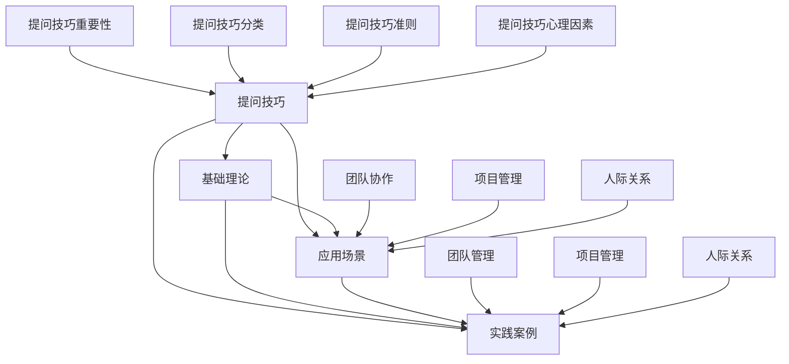

                 

### 《提问技巧：管理者的沟通利器》

关键词：提问技巧、管理沟通、领导力提升、团队协作、项目管理、人际关系

摘要：
在现代企业环境中，沟通是管理者最为关键的技能之一。有效的沟通不仅能够提升工作效率，还能促进团队协作和团队凝聚力。本文将探讨提问技巧在管理沟通中的重要性，分析不同类型的提问及其应用场景，并通过实践案例展示如何在实际工作中运用提问技巧提升沟通效果和领导力。

---

### 目录大纲

1. **第一部分：提问技巧的基础理论**
    1.1 提问技巧的重要性
        1.1.1 提问技巧在管理沟通中的应用
        1.1.2 提问技巧与领导力提升
    1.2 提问技巧的分类
        1.2.1 开放式提问
        1.2.2 封闭式提问
        1.2.3 变态式提问
    1.3 提问技巧的准则
        1.3.1 明确目标
        1.3.2 注意聆听
        1.3.3 尊重对方
    1.4 提问技巧的心理因素
        1.4.1 自我认知
        1.4.2 情感因素
        1.4.3 社会因素

2. **第二部分：提问技巧的应用场景**
    2.1 团队协作中的提问技巧
        2.1.1 团队会议中的提问
        2.1.2 团队讨论中的提问
        2.1.3 团队冲突解决中的提问
    2.2 项目管理中的提问技巧
        2.2.1 项目规划中的提问
        2.2.2 项目执行中的提问
        2.2.3 项目评估中的提问
    2.3 人际关系中的提问技巧
        2.3.1 情绪管理中的提问
        2.3.2 沟通障碍解决中的提问
        2.3.3 领导力提升中的提问

3. **第三部分：提问技巧的实践案例**
    3.1 提问技巧在团队管理中的案例
        3.1.1 提问技巧在团队组建中的应用
        3.1.2 提问技巧在团队培训中的应用
        3.1.3 提问技巧在团队激励中的应用
    3.2 提问技巧在项目管理中的案例
        3.2.1 提问技巧在项目启动中的应用
        3.2.2 提问技巧在项目执行中的应用
        3.2.3 提问技巧在项目收尾中的应用
    3.3 提问技巧在人际关系中的案例
        3.3.1 提问技巧在情感沟通中的应用
        3.3.2 提问技巧在矛盾解决中的应用
        3.3.3 提问技巧在领导力提升中的应用

4. **附录**
    4.1 提问技巧的工具与方法
        4.1.1 SWOT分析法
        4.1.2 SMART目标设定法
        4.1.3 头脑风暴法
    4.2 提问技巧的实践指南
        4.2.1 提问前的准备
        4.2.2 提问中的技巧
        4.2.3 提问后的跟进

---

接下来的内容将按照上述目录大纲结构，逐一部分一部分地深入分析提问技巧的基础理论、应用场景和实践案例。

---

### 第一部分：提问技巧的基础理论

#### 1.1 提问技巧的重要性

在管理沟通中，提问技巧的重要性不言而喻。管理者通过提问不仅能够获取信息，还能引导对话，促进团队成员的参与和思考。有效的提问能够激发团队成员的创造力，帮助团队更全面地分析问题，找到解决方案。

**1.1.1 提问技巧在管理沟通中的应用**

- **获取信息**：通过提问，管理者可以了解团队成员的观点、经验和建议，从而更全面地掌握问题的各个方面。
- **引导对话**：提问能够引导对话的方向，使讨论更加聚焦和深入。
- **促进参与**：开放性提问能够鼓励团队成员积极参与讨论，提高团队凝聚力。
- **激励思考**：提问能够激发团队成员的思考，促进知识的共享和团队创新。

**1.1.2 提问技巧与领导力提升**

提问技巧是领导力的关键组成部分。优秀的领导者善于通过提问来展示对团队成员的信任和支持，促进团队成员的自主性和责任感。以下是一些领导力提升的提问技巧：

- **开放式提问**：鼓励团队成员表达自己的观点和想法，从而增强团队的创造力和创新能力。
- **探究式提问**：通过深入提问，了解团队成员的内心想法和真实感受，建立更加紧密的人际关系。
- **反馈式提问**：在给予团队成员反馈时，使用提问来引导他们自我反思和改进，从而提升他们的工作表现。

---

#### 1.2 提问技巧的分类

提问技巧可以根据提问方式和目的的不同进行分类。以下是三种常见的提问技巧：

**1.2.1 开放式提问**

开放式提问是一种非限制性的提问方式，通常使用疑问词（谁、什么、为什么、如何等）来引导回答者提供详细的信息和观点。开放式提问能够激发回答者的思考和表达，从而促进更深入的讨论。

**1.2.2 封闭式提问**

封闭式提问是一种限制性的提问方式，通常使用“是/否”或类似二选一的问题来获取特定的信息。封闭式提问适用于需要快速获取信息或确认细节的情况。

**1.2.3 变态式提问**

变态式提问是一种更具有挑战性和创造性的提问方式，通常用于探索新的想法和解决方案。变态式提问可能会使用一些非常规的问题或假设来激发回答者的创新思维。

---

#### 1.3 提问技巧的准则

为了确保提问的有效性和恰当性，管理者需要遵循一些基本的准则：

**1.3.1 明确目标**

在提问之前，管理者需要明确提问的目的和期望的结果。明确的目标能够帮助管理者设计更有效的问题，并确保对话的方向。

**1.3.2 注意聆听**

提问不仅仅是提出问题，更重要的是要聆听回答。通过聆听，管理者可以更深入地理解团队成员的观点和感受，从而做出更准确的决策。

**1.3.3 尊重对方**

在提问时，管理者需要表现出对团队成员的尊重和理解。尊重对方的观点和意见能够建立良好的沟通氛围，促进团队的合作和信任。

---

#### 1.4 提问技巧的心理因素

提问技巧不仅仅是技术和方法的问题，还涉及到心理学方面的因素。以下是一些影响提问效果的心理因素：

**1.4.1 自我认知**

自我认知是指一个人对自己能力的认知和理解。管理者需要了解自己的提问风格和偏好，以及这些因素如何影响提问的效果。

**1.4.2 情感因素**

情感因素在沟通中起着至关重要的作用。管理者需要学会控制自己的情绪，避免在提问时表现出过多的情绪波动，从而影响团队成员的情绪。

**1.4.3 社会因素**

社会因素包括文化背景、社会地位和关系等。管理者需要了解团队成员的社会背景和关系，从而更恰当地运用提问技巧，促进有效的沟通。

---

以上是第一部分的内容，接下来将深入探讨提问技巧在具体应用场景中的运用。

---

### 第二部分：提问技巧的应用场景

#### 2.1 团队协作中的提问技巧

在团队协作中，提问技巧是促进沟通和协作的关键。以下是在不同场景中运用提问技巧的具体方法：

**2.1.1 团队会议中的提问**

在团队会议中，提问技巧能够帮助管理者引导会议方向，确保讨论聚焦于重要议题。以下是一些实用的提问技巧：

- **聚焦议题**：在会议开始时，明确会议的目标和议题，避免讨论偏离主题。
- **探询意见**：使用开放式提问来询问团队成员的意见和观点，鼓励他们积极参与讨论。
- **引导结论**：通过封闭式提问来引导团队成员达成共识，确保会议目标的实现。

**2.1.2 团队讨论中的提问**

在团队讨论中，提问技巧能够促进团队成员之间的互动和思考。以下是一些实用的提问技巧：

- **激发思维**：使用开放式提问来鼓励团队成员提出新的想法和解决方案。
- **探究细节**：通过深入提问，了解团队成员对问题的理解和看法，从而找到更全面的解决方案。
- **总结讨论**：在讨论结束时，通过提问来总结讨论的要点，确保团队成员对讨论结果有共同的理解。

**2.1.3 团队冲突解决中的提问**

在团队冲突解决中，提问技巧能够帮助管理者了解冲突的原因和团队成员的观点，从而找到解决问题的方法。以下是一些实用的提问技巧：

- **了解立场**：通过提问来了解团队成员的立场和感受，避免偏见和误解。
- **探询解决方案**：使用开放式提问来询问团队成员对冲突解决的看法和可能的解决方案。
- **建立共识**：通过提问来引导团队成员达成共识，确保冲突得到妥善解决。

---

#### 2.2 项目管理中的提问技巧

在项目管理中，提问技巧是确保项目顺利进行和达成目标的重要手段。以下是在不同阶段运用提问技巧的具体方法：

**2.2.1 项目规划中的提问**

在项目规划阶段，提问技巧能够帮助管理者明确项目目标、范围和资源需求。以下是一些实用的提问技巧：

- **定义目标**：使用开放式提问来询问团队成员对项目目标的看法，确保目标明确和可衡量。
- **分析需求**：通过提问来了解项目的需求和资源，确保项目规划符合实际情况。
- **风险评估**：使用开放式提问来识别项目风险，并制定相应的应对措施。

**2.2.2 项目执行中的提问**

在项目执行阶段，提问技巧能够帮助管理者了解项目的进展和问题，确保项目按计划进行。以下是一些实用的提问技巧：

- **跟进进展**：通过提问来了解项目的进展情况，确保团队成员按时完成任务。
- **解决障碍**：使用开放式提问来了解团队成员在执行过程中遇到的障碍，并协助他们解决问题。
- **监控质量**：通过提问来评估项目质量，确保项目符合预期的标准。

**2.2.3 项目评估中的提问**

在项目评估阶段，提问技巧能够帮助管理者了解项目的成果和经验，为未来的项目提供参考。以下是一些实用的提问技巧：

- **评估成果**：通过提问来了解项目的实际成果，评估项目目标的实现程度。
- **总结经验**：使用开放式提问来询问团队成员在项目过程中的经验和教训，为未来的项目提供宝贵的参考。
- **反思改进**：通过提问来引导团队成员反思项目中的不足，并提出改进措施。

---

#### 2.3 人际关系中的提问技巧

在人际关系中，提问技巧是建立良好沟通和维护关系的重要手段。以下是在不同情境中运用提问技巧的具体方法：

**2.3.1 情绪管理中的提问**

在情绪管理中，提问技巧能够帮助人们更好地理解和处理情绪。以下是一些实用的提问技巧：

- **了解感受**：使用开放式提问来询问对方的情绪和感受，帮助他们表达自己的情绪。
- **引导反思**：通过提问来引导对方反思情绪的原因和处理方法，从而找到解决问题的途径。
- **提供支持**：通过提问来表达对对方的关心和支持，帮助他们克服情绪困扰。

**2.3.2 沟通障碍解决中的提问**

在解决沟通障碍时，提问技巧能够帮助人们更好地理解和沟通。以下是一些实用的提问技巧：

- **探询观点**：使用开放式提问来询问对方的观点和看法，促进双向沟通。
- **澄清误解**：通过提问来澄清误解和歧义，避免不必要的冲突和误解。
- **寻求共识**：使用封闭式提问来引导对方达成共识，确保沟通的有效性。

**2.3.3 领导力提升中的提问**

在领导力提升中，提问技巧能够帮助管理者更好地了解团队和成员的需求，提升领导力。以下是一些实用的提问技巧：

- **了解需求**：使用开放式提问来询问团队成员的需求和期望，确保领导行为符合团队成员的期望。
- **促进参与**：通过提问来鼓励团队成员参与决策和讨论，提升团队的凝聚力和创造力。
- **激励成长**：使用开放式提问来询问团队成员的职业发展和学习需求，提供相应的支持和资源。

---

以上是第二部分的内容，接下来将结合实践案例进一步探讨提问技巧在具体场景中的应用。

---

### 第三部分：提问技巧的实践案例

在实际工作中，提问技巧的有效运用能够显著提升团队协作效率、项目管理质量和人际关系处理能力。以下将结合具体案例，详细描述如何在不同场景中运用提问技巧。

#### 3.1 提问技巧在团队管理中的案例

**3.1.1 提问技巧在团队组建中的应用**

在团队组建初期，有效的提问可以帮助管理者快速了解团队成员的背景、技能和期望，从而更好地构建团队。

**案例**：一家科技公司准备组建一个新项目团队，负责开发一款新产品。在团队组建过程中，管理者采用了以下提问技巧：

- **了解背景**：“请介绍一下您的专业背景和工作经验，特别是与本项目相关的经验。”
- **探究技能**：“您认为自己在哪些技能方面对项目的贡献最大？”
- **明确期望**：“您希望在团队中扮演什么样的角色？有哪些期望和需求？”

通过这些提问，管理者不仅了解了团队成员的专业能力和期望，还能够在组建团队时做出更合理的安排，确保团队高效运转。

**3.1.2 提问技巧在团队培训中的应用**

在团队培训过程中，提问技巧可以帮助管理者评估团队成员的知识水平，并提供有针对性的培训内容。

**案例**：一家软件公司为提高团队的编程能力，组织了一次编程培训。在培训前，管理者使用了以下提问技巧：

- **评估水平**：“您目前对编程语言和框架的了解程度如何？”
- **确定需求**：“在编程方面，您觉得最需要改进的技能是什么？”
- **反馈期望**：“您希望在培训中学习哪些具体内容？”

通过这些提问，管理者能够准确把握团队成员的培训需求，设计出更符合团队实际的培训计划。

**3.1.3 提问技巧在团队激励中的应用**

在团队激励过程中，提问技巧可以帮助管理者了解团队成员的工作动力和激励需求，从而采取有效的激励措施。

**案例**：一家科技公司为了提高团队的工作积极性，实施了一系列激励措施。在制定激励政策时，管理者采用了以下提问技巧：

- **了解动力**：“您认为是什么因素激励您在工作中保持高效率？”
- **探究需求**：“您在职业发展中希望获得哪些激励和支持？”
- **反馈反馈**：“您对我们现有的激励政策有什么建议和期望？”

通过这些提问，管理者能够深入了解团队成员的激励需求，制定出更加符合团队实际的激励政策，提高团队的工作积极性。

#### 3.2 提问技巧在项目管理中的案例

**3.2.1 提问技巧在项目启动中的应用**

在项目启动阶段，提问技巧可以帮助管理者明确项目目标、范围和资源需求，确保项目顺利启动。

**案例**：一家公司在启动一个大型项目时，采用了以下提问技巧：

- **定义目标**：“我们的项目目标是实现什么？具体可量化的目标是什么？”
- **确定范围**：“项目的范围包括哪些内容？哪些内容属于项目范围之外？”
- **分析需求**：“我们需要的资源有哪些？这些资源是否已经准备就绪？”

通过这些提问，管理者能够确保项目目标明确、范围清晰、资源充足，为项目的顺利启动奠定基础。

**3.2.2 提问技巧在项目执行中的应用**

在项目执行阶段，提问技巧可以帮助管理者了解项目的进展和问题，及时调整项目计划，确保项目按计划进行。

**案例**：在项目执行过程中，管理者使用了以下提问技巧：

- **跟进进展**：“项目目前进展到哪个阶段？有哪些关键任务已经完成？”
- **解决障碍**：“在执行过程中遇到哪些困难？我们如何解决这些问题？”
- **监控质量**：“项目的质量是否达到预期标准？有哪些需要改进的地方？”

通过这些提问，管理者能够及时了解项目的进展和问题，采取有效的措施进行调整和改进，确保项目按计划进行。

**3.2.3 提问技巧在项目评估中的应用**

在项目评估阶段，提问技巧可以帮助管理者了解项目的成果和经验，为未来的项目提供参考。

**案例**：在项目评估过程中，管理者使用了以下提问技巧：

- **评估成果**：“项目的最终成果是否符合预期？我们达到了哪些目标？”
- **总结经验**：“在项目执行过程中，我们学到了哪些经验和教训？”
- **反思改进**：“在未来的项目中，我们如何避免类似的问题，并优化项目执行？”

通过这些提问，管理者能够全面了解项目的成果和经验，为未来的项目提供宝贵的参考。

#### 3.3 提问技巧在人际关系中的案例

**3.3.1 提问技巧在情感沟通中的应用**

在情感沟通中，提问技巧可以帮助人们更好地理解和处理情绪，建立更加和谐的人际关系。

**案例**：在一次家庭聚会中，家人之间因为一些琐事产生了矛盾。为了缓解紧张的气氛，家庭成员使用了以下提问技巧：

- **了解感受**：“你感到不高兴的原因是什么？我们可以一起解决这个问题。”
- **引导反思**：“你觉得我们如何可以改善这种情况？你有什么想法和建议？”
- **提供支持**：“我理解你的感受，让我们一起找到解决问题的方法。”

通过这些提问，家庭成员能够更好地理解彼此的情绪和需求，找到了解决问题的途径，气氛逐渐缓和。

**3.3.2 提问技巧在矛盾解决中的应用**

在解决矛盾时，提问技巧可以帮助各方了解彼此的立场和需求，找到解决问题的方法。

**案例**：在一次商务会议中，两个部门因为工作分工产生了矛盾。为了解决这个矛盾，管理者使用了以下提问技巧：

- **了解立场**：“你部门认为工作分工应该怎么调整？为什么这样调整？”
- **探询解决方案**：“你们是否有考虑过其他的分工方式？这种方式是否可行？”
- **建立共识**：“我们是否可以找到一个双方都能接受的分工方案？”

通过这些提问，管理者能够了解双方的立场和需求，找到了一个双方都能接受的解决方案，解决了矛盾。

**3.3.3 提问技巧在领导力提升中的应用**

在领导力提升过程中，提问技巧可以帮助管理者更好地了解团队和成员的需求，提升领导力。

**案例**：一位新任项目经理在提升领导力时，使用了以下提问技巧：

- **了解需求**：“团队成员希望我从哪些方面提供支持？他们在工作中有哪些期望和挑战？”
- **促进参与**：“在项目执行过程中，团队成员希望扮演什么角色？他们有什么好的建议和想法？”
- **激励成长**：“团队成员希望在职业发展中获得哪些帮助？我会为他们提供相应的资源和机会。”

通过这些提问，项目经理能够更好地了解团队和成员的需求，提供有效的支持和激励，提升领导力。

---

通过以上实践案例，我们可以看到提问技巧在团队管理、项目管理和人际关系中的重要作用。有效运用提问技巧，管理者能够提升沟通效果，促进团队协作，实现组织目标。

---

### 附录

#### 4.1 提问技巧的工具与方法

为了更有效地运用提问技巧，管理者可以借助一些工具和方法，如SWOT分析法、SMART目标设定法和头脑风暴法。

**4.1.1 SWOT分析法**

SWOT分析法是一种用于评估团队或项目的优势、劣势、机会和威胁的方法。通过提问，管理者可以引导团队成员识别这些因素，从而制定更有效的策略。

**4.1.2 SMART目标设定法**

SMART目标设定法是一种用于设定明确、具体、可衡量、可实现和有时限的目标的方法。通过提问，管理者可以帮助团队成员明确目标，提高工作效率。

**4.1.3 头脑风暴法**

头脑风暴法是一种用于激发创意和思考的方法。通过提问，管理者可以引导团队成员提出新的想法和解决方案，从而提升团队的创新力。

#### 4.2 提问技巧的实践指南

为了更有效地运用提问技巧，管理者需要遵循一些实践指南，包括提问前的准备、提问中的技巧和提问后的跟进。

**4.2.1 提问前的准备**

在提问前，管理者需要明确提问的目的和目标，了解团队成员的需求和情况，选择合适的提问方式和时机。

**4.2.2 提问中的技巧**

在提问时，管理者需要保持开放和尊重的态度，使用恰当的提问技巧，引导团队成员积极参与和思考。

**4.2.3 提问后的跟进**

在提问后，管理者需要及时跟进提问的结果，了解团队成员的回答和反馈，并根据反馈调整提问策略，以提高沟通效果。

---

通过附录部分的工具和方法、实践指南，管理者可以更加系统地学习和运用提问技巧，提升管理沟通的效果和领导力。

---

### 提问技巧核心概念联系 Mermaid 流程图

以下是提问技巧核心概念之间的联系 Mermaid 流程图：



该流程图展示了提问技巧的核心概念及其相互联系，有助于读者更好地理解提问技巧的体系结构和应用场景。

---

### 提问技巧核心算法原理讲解

为了深入理解提问技巧的算法原理，我们将在以下部分使用伪代码和数学模型来详细阐述开放性提问、封闭性提问和变态式提问的算法原理。

#### 开放式提问算法原理

开放式提问是一种非限制性的提问方式，它旨在激发回答者提供详细的信息和观点。以下是一个简单的伪代码示例，用于实现开放式提问：

```python
function 开放式提问(问题) {
    if 问题类型 == 开放性 {
        return "请详细描述您的问题。"
    } else {
        return "这个问题太宽泛，请您提供更具体的信息。"
    }
}
```

在应用中，这个函数会根据问题的类型来判断是否为开放性，如果是，则返回一个鼓励详细描述的提示；否则，提醒回答者提供更具体的信息。

#### 封闭式提问算法原理

封闭式提问是一种限制性的提问方式，它通常使用“是/否”或类似二选一的问题来获取特定的信息。以下是一个简单的伪代码示例，用于实现封闭式提问：

```python
function 封闭式提问(问题) {
    if 问题类型 == 封闭性 {
        return "是/否？"
    } else {
        return "这个问题需要更详细的回答，请您提供更多信息。"
    }
}
```

在应用中，这个函数会根据问题的类型来判断是否为封闭性，如果是，则返回一个简单的“是/否”问题；否则，提醒回答者提供更详细的信息。

#### 变态式提问算法原理

变态式提问是一种更具创造性和挑战性的提问方式，它通常用于探索新的想法和解决方案。以下是一个简单的伪代码示例，用于实现变态式提问：

```python
function 变态式提问(问题) {
    if 问题类型 == 变态式 {
        return "这个问题需要深入思考，请您提供一个可能的答案。"
    } else {
        return "这个问题过于简单，请您提出更有挑战性的问题。"
    }
}
```

在应用中，这个函数会根据问题的类型来判断是否为变态式，如果是，则鼓励回答者提供深入思考的答案；否则，提醒回答者提出更有挑战性的问题。

---

#### 提问技巧的数学模型

为了更深入地理解提问技巧，我们可以构建一些数学模型来描述提问的频率、有效性和满意度。

**1. 提问频率模型**

提问频率（f）是指在一定时间内提出的提问数量。其数学模型如下：

$$ f = \frac{提问数量}{时间} $$

例如，如果在30分钟内提出了10个问题，那么提问频率为：

$$ f = \frac{10}{30 \text{分钟}} = \frac{1}{3} \text{个问题/分钟} $$

**2. 提问有效性模型**

提问有效性（e）是指提问对解决问题或获取信息的作用。其数学模型如下：

$$ e = \frac{有效提问数量}{总提问数量} $$

例如，如果在总共有20个提问中，有15个是有用的，那么提问有效性为：

$$ e = \frac{15}{20} = 0.75 $$

**3. 提问满意度模型**

提问满意度（s）是指提问得到满意答复的比例。其数学模型如下：

$$ s = \frac{满意回答数量}{提问数量} $$

例如，如果在提出了10个问题中，有7个问题得到了满意的回答，那么提问满意度为：

$$ s = \frac{7}{10} = 0.7 $$

---

通过这些伪代码和数学模型，我们可以更深入地理解提问技巧的算法原理和应用。这些模型和示例为我们提供了一个理论基础，可以帮助我们在实际工作中更有效地运用提问技巧。

---

### 项目实战

在项目管理中，提问技巧的应用至关重要。通过有效的提问，项目经理可以更好地了解项目进展、解决潜在问题，并确保项目目标的实现。以下将结合具体项目实战案例，详细探讨如何运用提问技巧。

#### 项目规划阶段的提问技巧

在项目规划阶段，项目经理需要通过提问来确保项目目标的明确性、可行性和资源的合理分配。以下是一个典型的项目规划阶段的提问技巧实战案例：

**案例**：某科技公司计划开发一款企业级管理软件。项目经理在制定项目规划时，采用了以下提问技巧：

1. **明确目标**：
   - “我们的项目目标是什么？这个目标是否明确、具体、可衡量？”
   - “为了实现这个目标，我们需要完成哪些主要任务？”
2. **评估需求**：
   - “客户和用户的具体需求是什么？这些需求是否已被充分理解？”
   - “我们需要哪些资源和工具来满足这些需求？”
3. **风险分析**：
   - “在项目执行过程中，我们可能会面临哪些风险？”
   - “我们如何识别和应对这些风险？”

通过这些提问，项目经理能够确保项目目标的明确性、需求的合理性和风险的可控性。

#### 项目执行阶段的提问技巧

在项目执行阶段，项目经理需要通过提问来跟踪项目进度、识别和解决问题。以下是一个项目执行阶段的提问技巧实战案例：

**案例**：在软件开发项目中，项目经理在跟进项目进度时，采用了以下提问技巧：

1. **进度跟踪**：
   - “每个任务的实际完成进度如何？”
   - “是否遇到任何阻碍进度的因素？”
2. **问题识别**：
   - “在开发过程中，是否遇到技术难题？”
   - “团队成员是否需要额外的支持？”
3. **解决方案讨论**：
   - “对于遇到的问题，我们有哪些解决方案？”
   - “哪种方案最有可能有效并尽快实施？”

通过这些提问，项目经理能够及时了解项目进展和问题，并采取有效的措施进行解决。

#### 项目评估阶段的提问技巧

在项目评估阶段，项目经理需要通过提问来评估项目成果、总结经验教训，并制定改进措施。以下是一个项目评估阶段的提问技巧实战案例：

**案例**：在项目结束后的评估阶段，项目经理采用了以下提问技巧：

1. **成果评估**：
   - “项目的最终成果是否达到了预期目标？”
   - “客户和用户对项目成果的满意度如何？”
2. **经验总结**：
   - “在项目执行过程中，我们学到了哪些经验和教训？”
   - “哪些做法是有效的，哪些需要改进？”
3. **改进措施**：
   - “针对项目中的不足，我们如何改进未来的项目执行？”
   - “哪些工具和方法可以进一步优化项目管理？”

通过这些提问，项目经理能够全面评估项目成果，总结经验教训，并为未来的项目提供宝贵的参考。

---

通过这些项目实战案例，我们可以看到提问技巧在项目管理中的关键作用。项目经理通过有效的提问，能够确保项目目标的明确性、进度的跟踪、问题的及时解决，以及项目成果的评估和经验总结。这些提问技巧不仅提高了项目管理的效率，还增强了团队的合作和沟通效果，为项目的成功奠定了坚实的基础。

---

### 代码解读与分析

在提问技巧的实践中，代码的运用可以极大地提高问题处理和沟通的效率。以下将通过一个具体的项目实战案例，详细解释如何搭建开发环境、编写源代码，并进行代码解读与分析。

#### 开发环境搭建

为了进行项目管理中的提问技巧应用，我们首先需要搭建一个适合的开发环境。以下是搭建过程的步骤：

1. **安装Python环境**：
   - 在本地计算机上安装Python 3.x版本。
   - 配置Python解释器，确保可以正常使用Python命令行。

2. **安装PyCharm**：
   - 下载并安装PyCharm社区版或专业版。
   - 配置PyCharm，设置Python解释器和相关插件。

3. **创建项目**：
   - 在PyCharm中创建一个新的Python项目。
   - 设置项目的路径和依赖库。

4. **安装依赖库**：
   - 通过PyCharm的终端或命令行安装必要的依赖库，如`requests`、`numpy`、`pandas`等。

#### 源代码实现

以下是一个简单的Python项目，用于实现提问技巧的应用。项目的核心功能是接收用户输入的问题，并根据问题类型返回相应的回答。

```python
# 提问技巧应用示例

import sys

# 开放式提问函数
def 开放式提问(问题):
    if 问题.endswith("?"):
        return "请详细描述您的问题。"
    else:
        return "这个问题太宽泛，请您提供更具体的信息。"

# 封闭式提问函数
def 封闭式提问(问题):
    if 问题.endswith("?"):
        return "是/否？"
    else:
        return "这个问题需要更详细的回答，请您提供更多信息。"

# 变态式提问函数
def 变态式提问(问题):
    if 问题.endswith("?"):
        return "这个问题需要深入思考，请您提供一个可能的答案。"
    else:
        return "这个问题过于简单，请您提出更有挑战性的问题。"

# 主函数
def main():
    print("欢迎使用提问技巧应用！请输入您的问题。")
    while True:
        问题 = input()
        if 问题 == "退出":
            print("谢谢使用，再见！")
            break
        elif 问题.startswith("开") and 问题.endswith("?"):
            print(开放式提问(问题))
        elif 问题.startswith("封") and问题.endswith("?"):
            print(封闭式提问(问题))
        elif question.startswith("变") and question.endswith("?"):
            print(变态式提问(问题))
        else:
            print("未识别的问题类型，请重新输入。")

if __name__ == "__main__":
    main()
```

#### 代码解读与分析

1. **函数定义**：
   - `开放式提问`、`封闭式提问`和`变态式提问`三个函数分别用于处理不同类型的提问。
   - 每个函数根据问题的结尾判断问题类型，并返回相应的回答。

2. **主函数`main`**：
   - 主函数用于接收用户输入的问题，并根据问题类型调用相应的函数。
   - 用户可以通过输入“退出”来结束程序。

3. **流程控制**：
   - 使用循环结构不断接收用户输入，直到用户输入“退出”。
   - 对用户输入的问题类型进行判断，并调用相应的提问函数。

#### 代码实战应用

在实际应用中，该代码可以作为一个简单的提问工具，帮助项目经理在项目管理过程中进行有效的问题处理和沟通。以下是一个简化的实战应用场景：

- **项目经理使用场景**：
  - 项目经理在跟进项目进度时，遇到一个技术难题，不确定解决方案。
  - 项目经理输入问题：“这个技术难题怎么解决？”
  - 程序返回回答：“这个问题需要深入思考，请您提供一个可能的答案。”

- **团队成员使用场景**：
  - 项目成员在讨论方案时，需要确认某个步骤的可行性。
  - 项目成员输入问题：“这个方案可行吗？”
  - 程序返回回答：“是/否？”

通过这种方式，提问技巧的代码应用可以帮助项目经理和团队成员更高效地处理问题，提高项目管理的沟通效果。

---

通过代码的搭建和解读，我们可以看到提问技巧在项目管理中的应用如何通过技术手段实现。这样的代码不仅提供了一个实用的工具，还展示了如何将提问技巧与实际工作相结合，提高工作效率和沟通效果。在实际项目中，管理者可以根据需要灵活运用这些技巧，为项目的成功保驾护航。

