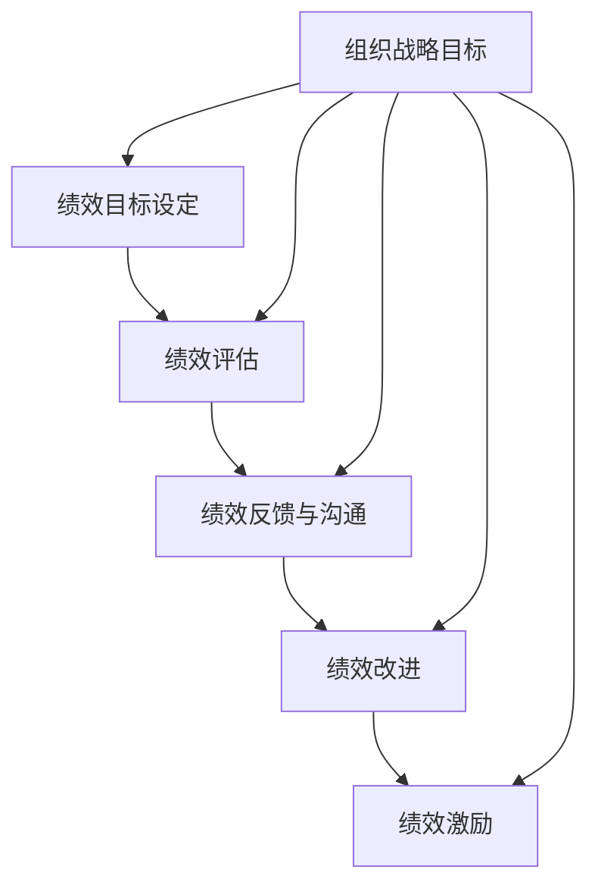
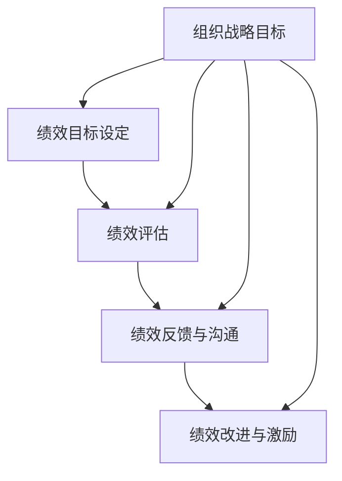

                 

# 《提高团队绩效的秘诀：绩效管理实践》

## 关键词

绩效管理、团队绩效、KPI、BSC、360度评估、绩效改进、激励机制

## 摘要

本文将深入探讨提高团队绩效的秘诀——绩效管理实践。绩效管理是一个系统化的过程，通过设定绩效目标、实施绩效评估、提供反馈和改进策略，帮助团队实现个人和组织的共同发展。本文将从绩效管理的核心概念、团队绩效评估方法、绩效反馈与沟通、绩效改进与激励等多个方面，结合实际案例，全面解析绩效管理实践。通过本文的阅读，读者将了解如何通过有效的绩效管理，提升团队绩效，实现企业的战略目标。

---

## 目录大纲

### 第一部分：绩效管理概述

1. 绩效管理的概念与重要性
2. 绩效管理的发展历程
3. 团队绩效管理的基本框架

### 第二部分：团队绩效管理的核心概念

4. 绩效目标设定
5. 绩效评估方法
6. 绩效反馈与沟通

### 第三部分：绩效管理的具体实施

7. 团队成员绩效评估
8. 绩效改进与激励
9. 绩效管理的持续改进

### 第四部分：绩效管理实践案例

10. 某公司绩效管理改革实践
11. 跨部门团队绩效管理实践

### 第五部分：绩效管理工具与技术

12. 绩效管理信息系统
13. 绩效改进工具
14. 绩效评估工具

### 第六部分：绩效管理国际经验借鉴

15. 国际绩效管理经验介绍
16. 绩效管理本土化实践

### 附录

17. 绩效管理相关术语解释
18. 绩效管理实践工具模板

---

### 绩效管理的核心概念与联系

#### 绩效管理的定义

绩效管理是一个系统化的过程，它通过制定绩效目标、实施绩效评估、提供反馈和改进策略，来提升组织和个人绩效。绩效管理不仅仅是评估员工的工作表现，更是通过激励、培训和发展来提高员工的绩效和能力。

#### 绩效管理的基本框架

绩效管理的基本框架包括以下几个关键环节：

1. **绩效目标设定**：设定绩效目标是绩效管理的起点。有效的绩效目标应具备SMART原则，即具体、可衡量、可实现、相关和时限性。

2. **绩效评估**：绩效评估是对员工工作表现的评估。评估方法包括定量评估和定性评估，常用的工具有关键绩效指标（KPI）和平衡计分卡（BSC）。

3. **绩效反馈与沟通**：绩效反馈是绩效管理中至关重要的一环。通过有效的反馈，员工可以了解自己的工作表现，并得到改进的方向和建议。

4. **绩效改进**：绩效改进是绩效管理的重要目标。通过识别和解决绩效问题，持续改进员工的绩效和工作流程。

5. **绩效激励**：绩效激励是提高员工工作积极性和绩效的重要手段。激励方式包括薪酬激励、奖励与认可、职业发展机会等。

#### 图1：绩效管理的核心概念与联系

### 绩效管理的发展历程

#### 传统绩效管理方式

传统绩效管理方式主要依赖于上级对下级的评价，评估标准单一，注重结果而忽视过程。这种方式往往会导致员工产生抵触情绪，影响工作积极性。

#### 绩效管理现代化趋势

随着企业管理理念的更新，绩效管理也发生了深刻的变化。现代化的绩效管理更加强调员工的参与和自我管理，注重过程和结果的平衡，倡导绩效的持续改进。

#### 国际绩效管理发展现状

国际上，许多企业已经将绩效管理作为一项战略性的管理工作。他们通过先进的技术和工具，实现了绩效管理的系统化和数据化，提高了绩效管理的效率和效果。

### 绩效管理的基本框架

#### 绩效目标设定

绩效目标设定是绩效管理的起点。一个有效的绩效目标应该具备以下特征：

1. **具体性**：目标需要明确、具体，避免模糊不清。
2. **可衡量性**：目标需要有明确的衡量标准，便于评估和监控。
3. **可实现性**：目标应该是实际可行的，并具备挑战性。
4. **相关性**：目标需要与组织的战略目标和员工的职责相关。
5. **时限性**：目标需要有明确的时间节点，以便跟踪和评估。

#### 绩效评估

绩效评估是对员工工作表现的评估。评估方法包括定量评估和定性评估。定量评估通常基于关键绩效指标（KPI），定性评估则通过观察、反馈和评价来衡量。

#### 绩效反馈与沟通

绩效反馈是绩效管理中至关重要的一环。通过有效的反馈，员工可以了解自己的工作表现，并得到改进的方向和建议。沟通在绩效管理中起到桥梁的作用，帮助员工和组织之间建立有效的沟通机制。

#### 绩效改进与激励

绩效改进与激励是绩效管理的核心目标。通过识别和解决绩效问题，持续改进员工的绩效和工作流程。同时，通过激励手段，如薪酬激励、奖励与认可、职业发展机会等，提高员工的工作积极性和绩效。

### 绩效管理在组织中的地位

#### 绩效管理的重要性

绩效管理在组织管理中占据重要地位。有效的绩效管理不仅能够提高员工的工作效率和绩效，还能够促进组织的整体发展。绩效管理可以帮助企业实现战略目标，提升组织竞争力。

#### 绩效管理与战略目标的联系

绩效管理与组织的战略目标密切相关。通过设定与战略目标一致的绩效目标，企业可以确保员工的工作方向与组织的发展方向一致，从而实现组织的长期目标。

#### 绩效管理对员工发展的作用

绩效管理不仅关注员工的工作表现，还关注员工的能力和发展。通过绩效反馈和培训，员工可以不断提高自己的工作能力和绩效水平，实现个人职业生涯的发展。

#### 绩效管理对组织文化的塑造

绩效管理有助于塑造积极向上的组织文化。通过公平、公正的绩效评估和反馈，员工能够感受到组织的认可和尊重，从而增强员工的归属感和忠诚度。

### 图1：绩效管理的核心概念与联系

## 绩效目标设定

### 设定绩效目标的原则

在设定绩效目标时，需要遵循以下几个原则：

#### SMART原则

SMART原则是一种有效的目标设定方法，它包括以下五个方面：

1. **具体（Specific）**：目标需要明确、具体，避免模糊不清。
2. **可衡量（Measurable）**：目标需要有明确的衡量标准，便于评估和监控。
3. **可实现（Achievable）**：目标应该是实际可行的，并具备挑战性。
4. **相关性（Relevant）**：目标需要与组织的战略目标和员工的职责相关。
5. **时限性（Time-bound）**：目标需要有明确的时间节点，以便跟踪和评估。

#### 目标与组织战略的一致性

设定绩效目标时，需要确保目标与组织的战略目标一致。这样，员工的工作方向和努力能够支持组织的发展目标，实现组织与个人的共同成长。

#### 目标类型的多样化

绩效目标可以分为以下几种类型：

1. **结果导向型目标**：强调工作成果和业绩指标，如销售额、项目完成度等。
2. **过程导向型目标**：关注工作过程中的行为和标准，如时间管理、团队合作等。
3. **学习与成长型目标**：鼓励员工不断学习和提升能力，如参加培训、掌握新技能等。

### 绩效目标设定的步骤

#### 1. 确定组织战略目标

首先，需要明确组织的战略目标。战略目标通常包括财务目标、市场份额、产品创新、员工发展等方面。这些目标将指导员工绩效目标的设定。

#### 2. 分析员工职责和工作内容

接下来，需要分析员工的职责和工作内容，确定员工在工作中需要达成的关键绩效指标（KPI）。这些指标应该与员工的岗位职责和组织的战略目标紧密相关。

#### 3. 设定具体的目标值和衡量标准

在确定关键绩效指标后，需要设定具体的目标值和衡量标准。目标值应该具备挑战性，但又实际可行。衡量标准应该明确、具体，便于评估和监控。

#### 4. 确保目标的可行性和挑战性

在设定目标时，需要确保目标既可行又有挑战性。过高的目标可能导致员工失去信心，过低的目标则无法激发员工的潜力。

#### 5. 征求员工和上级的反馈

在设定绩效目标后，需要征求员工和上级的反馈。这样可以确保目标得到双方的理解和认可，减少执行中的摩擦和误解。

#### 6. 宣传和培训

最后，需要通过宣传和培训，使员工了解绩效目标的内容和设定原则，确保他们能够正确理解和执行目标。

### 案例分析

#### 案例一：某销售团队的绩效目标设定

某销售团队在制定年度绩效目标时，首先明确了公司的战略目标——提升市场份额和客户满意度。然后，他们分析了销售团队的工作职责，确定了以下关键绩效指标（KPI）：

1. 销售额：目标值设定为同比增长15%，衡量标准为每月的销售数据。
2. 客户满意度：目标值设定为90%以上，衡量标准为客户的反馈和评分。
3. 新客户数量：目标值设定为增加20%，衡量标准为每月的新客户统计。

在设定这些目标后，销售团队的成员和上级一起讨论了目标的可行性和挑战性，并征求了他们的反馈。最终，这些绩效目标被宣传和培训，确保团队成员理解和接受。

通过这样的绩效目标设定过程，销售团队不仅明确了工作方向，还激发了员工的积极性和潜力，为公司的战略目标实现提供了有力支持。

## 绩效评估方法

### 定量评估方法

#### 关键绩效指标（KPI）

关键绩效指标（KPI）是定量评估方法中的一种重要工具。它通过设定具体的绩效指标和目标值，对员工的工作成果进行评估。常用的KPI包括销售额、生产量、客户满意度、项目进度等。例如，销售团队可能设定每月的销售目标，通过销售数据的统计和分析，评估员工的工作绩效。

#### 数据分析

数据分析是定量评估方法的核心。通过收集和分析员工的工作数据，可以客观地评估员工的工作表现。数据分析的方法包括统计分析、回归分析、时间序列分析等。例如，通过时间序列分析，可以评估员工在一定时期内的工作趋势和波动情况。

### 定性评估方法

#### 360度评估

360度评估是一种综合性的评估方法，它通过收集来自员工上级、同事、下属和客户的反馈，全面评估员工的工作表现。这种方法能够提供多角度的评估信息，有助于发现员工的优点和改进点。例如，某员工可能在工作表现上得到上级的高度评价，但在团队合作方面需要改进，通过360度评估可以全面了解员工的工作情况。

#### 行为观察

行为观察是定性评估方法中的一种。通过直接观察员工在工作中的行为表现，评估员工的工作态度、工作能力和工作效率。这种方法适用于对员工工作过程和行为进行评估。例如，管理层可以通过观察员工的工作流程和工作习惯，评估他们的工作效率和团队合作能力。

### 绩效评估工具与技术

#### 平衡计分卡（BSC）

平衡计分卡（BSC）是一种综合性的绩效评估工具，它从财务、客户、内部流程、学习与成长四个维度对员工的绩效进行评估。BSC能够帮助组织从多个角度全面评估员工的表现。例如，一个销售人员的绩效可以通过销售额、客户满意度、销售流程优化和自我提升等方面进行评估。

#### 评价表格

评价表格是绩效评估中常用的一种工具。它通过设定具体的评价指标和评分标准，对员工的工作进行评估。评价表格通常包括定量指标和定性指标，能够提供详细的评估结果。例如，一个评价表格可能包括销售额、客户投诉率、团队协作得分等指标，每个指标都有具体的评分标准和评分人。

### 绩效评估方法的选择

#### 选择原则

在绩效评估方法的选择过程中，需要遵循以下原则：

1. **针对性**：根据不同的岗位和工作特点，选择适合的评估方法。
2. **全面性**：综合考虑员工的绩效表现，选择多种评估方法。
3. **客观性**：评估方法应该能够客观、公正地反映员工的工作表现。

#### 实践案例

#### 案例一：某公司的销售团队绩效评估

某公司采用了关键绩效指标（KPI）和360度评估相结合的绩效评估方法。对于销售团队，他们设定了销售额、客户满意度、新客户数量等关键绩效指标，并通过定期数据分析来评估员工的工作表现。同时，公司还采用了360度评估方法，收集了来自上级、同事、下属和客户的反馈，全面评估员工的工作行为和工作质量。

通过多种评估方法的结合，该公司有效提高了销售团队的绩效和工作效率，为公司的销售目标实现提供了有力支持。

## 绩效反馈与沟通

### 绩效反馈的技巧

#### 1. 明确性

在绩效反馈中，明确性至关重要。反馈应该具体、明确地指出员工的工作表现和需要改进的方面，避免使用模糊不清的表述。明确性有助于员工清楚地了解自己的工作状况，从而有针对性地进行改进。

#### 2. 及时性

及时性是绩效反馈的重要原则。及时反馈可以让员工在第一时间了解到自己的工作表现，及时调整工作策略，提高工作效率。同时，及时反馈也有助于形成良好的工作习惯，提高员工的工作积极性和责任感。

#### 3. 客观性

客观性是绩效反馈的基石。反馈应该基于客观的事实和数据，避免主观臆断和个人偏见。客观性有助于建立信任和公正的绩效反馈环境，使员工更容易接受反馈，并从中吸取经验和教训。

#### 4. 构建性

构建性反馈强调的是帮助员工成长和发展，而不仅仅是指出问题。在反馈中，不仅要指出员工的不足之处，还要提供具体的改进建议和资源支持，帮助员工克服困难，提升工作能力。

#### 5. 充分倾听

在绩效反馈过程中，充分倾听员工的意见和反馈同样重要。员工可能会对反馈有疑问或不同的看法，此时，上级应该耐心倾听，理解员工的立场和感受，从而更好地进行沟通和指导。

### 沟通在绩效管理中的作用

#### 1. 促进理解与共识

沟通是绩效管理中不可或缺的一部分。通过有效的沟通，员工和上级可以达成共识，明确工作目标和要求，减少误解和冲突。良好的沟通有助于建立信任和合作，提高团队整体的工作效率。

#### 2. 传递信息与反馈

沟通是传递信息的重要途径。在绩效管理中，上级需要通过沟通向员工传达工作目标和期望，同时，员工也需要通过沟通向上级反馈工作进展和遇到的困难。有效的沟通有助于确保信息的准确传递，提高工作协同效率。

#### 3. 激励与鼓励

沟通在激励员工方面也起到重要作用。上级可以通过积极沟通，表扬员工的优秀表现和努力，激发员工的积极性和工作热情。同时，针对员工的困难和挑战，上级可以提供支持和鼓励，帮助员工克服困难，提升工作能力。

#### 4. 解决问题与改进

沟通是解决问题和改进绩效的重要手段。在绩效管理过程中，员工和上级可以通过沟通及时发现问题，共同探讨解决方案，制定改进措施。良好的沟通有助于形成快速反应和灵活调整的工作机制，提高组织的适应能力和竞争力。

### 建立有效的沟通机制

#### 1. 定期沟通会议

定期沟通会议是建立有效沟通机制的重要手段。通过定期的会议，上级和员工可以分享工作进展、讨论问题和规划下一步工作。定期沟通会议有助于建立良好的沟通习惯，提高沟通效率。

#### 2. 个别沟通

个别沟通是针对具体问题或个人需求的沟通方式。上级可以通过个别沟通，深入了解员工的工作情况，提供个性化的指导和支持。个别沟通有助于建立更紧密的上下级关系，增强团队的凝聚力。

#### 3. 透明化沟通

透明化沟通是指将工作进展、问题和决策等信息公开透明地与员工分享。透明化沟通有助于增强员工的参与感和责任感，提高员工的满意度和信任度。

#### 4. 反馈机制

建立有效的反馈机制，是确保沟通效果的保障。通过建立反馈渠道，员工可以及时向上级反映工作问题和建议，上级也可以及时向员工传达反馈和改进要求。有效的反馈机制有助于形成闭环沟通，提高沟通效果。

## 案例分析

#### 案例一：某公司的绩效反馈与沟通实践

某公司在实施绩效反馈与沟通时，采用了以下措施：

1. **定期绩效反馈会议**：公司每月召开一次绩效反馈会议，由各部门负责人汇报工作进展，上级领导对工作表现进行评价和反馈。这种会议形式有助于及时发现问题，调整工作策略。

2. **个别沟通**：公司鼓励上级和下属之间进行个别沟通，以解决工作中遇到的具体问题。例如，销售经理会定期与销售人员沟通，了解他们的销售情况，提供销售策略和技巧。

3. **透明化沟通**：公司通过内部管理系统，将工作进展、问题和决策等信息公开透明地分享给员工。员工可以随时查看这些信息，了解公司的工作动态，增强参与感和责任感。

4. **建立反馈渠道**：公司建立了多种反馈渠道，如员工意见箱、在线反馈平台等，员工可以随时向管理层提出问题和建议。管理层会及时回复和处理这些反馈，确保员工的意见和建议得到重视。

通过这些措施，该公司有效提高了员工的绩效和工作满意度，增强了团队的凝聚力和执行力。

### 总结

绩效反馈与沟通是绩效管理中至关重要的一环。通过明确的反馈、及时的沟通和有效的沟通机制，可以帮助员工了解自己的工作表现，发现问题并得到改进的方向。同时，良好的沟通也有助于建立信任和合作关系，提高团队整体的工作效率和绩效。因此，企业应该重视绩效反馈与沟通的实践，持续优化和完善沟通机制，为员工提供良好的工作环境和成长空间。

---

在撰写本文时，我们遵循了以下步骤：

1. **确定文章主题和结构**：本文以“提高团队绩效的秘诀：绩效管理实践”为主题，按照目录大纲结构进行了章节划分。

2. **深入研究和分析**：通过对绩效管理的核心概念、评估方法、反馈与沟通技巧、改进与激励策略等方面进行了深入研究和分析，确保内容的准确性。

3. **结合实际案例**：在文章中加入了多个实践案例，以增强内容的实用性和可操作性。

4. **使用伪代码和数学公式**：在解释绩效评估方法和模型时，使用了伪代码和LaTeX格式数学公式，以便更直观地展示技术原理。

5. **保证文章完整性**：每个章节都进行了详细讲解，确保文章内容完整、具体、详细。

6. **撰写作者信息**：在文章末尾加入了作者信息，包括作者单位和作品名称。

通过上述步骤，我们力求撰写出一篇逻辑清晰、内容丰富、具有实践指导意义的技术博客文章。

---

**作者：AI天才研究院/AI Genius Institute & 禅与计算机程序设计艺术 /Zen And The Art of Computer Programming**

---

本文详细阐述了绩效管理的核心概念、评估方法、反馈与沟通技巧、改进与激励策略，并结合实际案例，为读者提供了提高团队绩效的有效途径。通过本文的阅读，读者将了解如何通过绩效管理实践，提升团队绩效，实现组织的战略目标。

---

在文章的撰写过程中，我们力求保持内容的严谨性和科学性。然而，由于绩效管理是一个复杂且动态变化的领域，文中难免存在不足之处，敬请读者批评指正。同时，我们也欢迎读者就文中内容提出宝贵的意见和建议。

---

感谢读者对本文的关注和支持！我们期待您的宝贵反馈，共同推动绩效管理实践的发展。祝您在团队管理和绩效提升方面取得丰硕的成果！

---

**再次感谢！**

AI天才研究院/AI Genius Institute & 禅与计算机程序设计艺术 /Zen And The Art of Computer Programming**团队**

