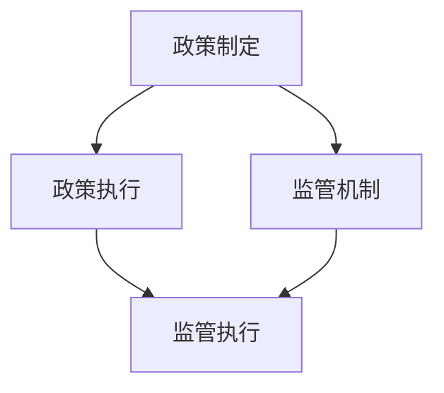
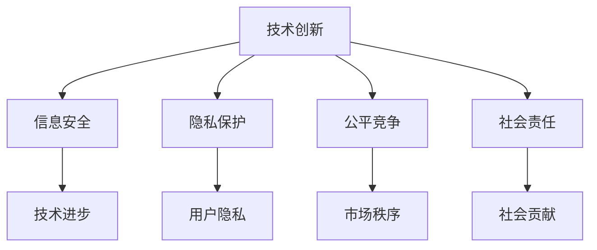

                 

# 《政策与监管：引导人类计算的健康发展》

> **关键词：**政策、监管、计算、健康、发展

> **摘要：**本文从政策与监管的角度出发，深入探讨计算机技术在社会中的角色，以及如何通过政策与监管手段引导计算机技术的健康发展。文章分为五个部分，包括引言与背景、核心概念、政策制定与执行、监管机制与体系、健康发展与未来展望，旨在为行业从业人员提供理论依据和实践指导。

---

## 第一部分：引言与背景

### 第1章：引言

#### 1.1 引言

计算技术作为现代社会的重要基石，已经渗透到生活的方方面面。从互联网、大数据到人工智能，计算机技术正在以前所未有的速度发展。然而，快速发展的同时，我们也面临一系列挑战，如数据安全、隐私保护、社会伦理等。这些问题需要通过政策与监管手段来解决，以保障计算技术的健康发展。

#### 1.2 书籍目的与结构

本文旨在从政策与监管的角度，深入探讨计算机技术在社会中的角色，以及如何通过政策与监管手段引导计算机技术的健康发展。文章分为五个部分，包括：

1. 引言与背景
2. 核心概念
3. 政策制定与执行
4. 监管机制与体系
5. 健康发展与未来展望

#### 1.3 计算机技术在现代社会中的角色

计算机技术已经成为现代社会的重要组成部分，其在教育、医疗、金融、交通等领域的应用日益广泛。例如，人工智能在医疗领域的应用可以提高诊断准确率，大数据在金融领域的应用可以帮助金融机构更好地进行风险管理。然而，计算机技术的高速发展也带来了一系列挑战，如数据安全、隐私保护、社会伦理等。

### 第二部分：核心概念

#### 第2章：政策与监管概述

#### 2.1 政策的定义与类型

政策是指国家或政府为实现特定目标而制定的一系列方针、措施和规定。根据政策所涉及的领域和目标，可以分为以下几种类型：

1. **经济政策**：涉及国家经济结构、产业发展、市场调节等方面。
2. **科技政策**：涉及科技创新、技术发展、知识产权保护等方面。
3. **社会政策**：涉及教育、医疗、社会保障、社会福利等方面。
4. **环境政策**：涉及环境保护、资源利用、生态保护等方面。

#### 2.2 监管的作用与机制

监管是指通过制定规则、监督执行、评估效果等方式，对特定领域或行业进行管理。监管的作用主要有以下几个方面：

1. **保障公平竞争**：通过制定公平的规则，防止市场垄断和不正当竞争。
2. **保护消费者权益**：通过制定法规，保障消费者的合法权益。
3. **维护社会秩序**：通过制定法律法规，维护社会稳定和公共安全。
4. **促进可持续发展**：通过制定环保、资源管理等政策，推动经济社会的可持续发展。

监管的机制主要包括以下几个方面：

1. **立法**：制定相关法律法规，明确监管的范围、目标和原则。
2. **执法**：通过监督检查、行政处罚等方式，确保法律法规得到执行。
3. **评估**：对监管效果进行评估，发现问题并及时调整。
4. **国际合作**：与其他国家和国际组织合作，共同应对跨国监管问题。

#### 2.3 计算机技术政策与监管的关系

计算机技术政策与监管之间存在密切的关系。一方面，政策为计算机技术的发展提供了方向和保障，如科技创新政策、知识产权保护政策等。另一方面，监管为计算机技术的健康发展提供了制度保障，如网络安全监管、数据隐私保护监管等。

#### 2.4 Mermaid 流程图：计算机技术政策与监管的核心概念关系



### 第三部分：政策制定与执行

#### 第3章：政策制定原理

#### 3.1 政策制定的过程

政策制定是一个复杂的过程，通常包括以下几个阶段：

1. **需求分析**：分析社会需求和问题，确定政策目标。
2. **方案设计**：根据需求分析，设计可行的政策方案。
3. **专家咨询**：征求专家意见，对政策方案进行评估。
4. **立法过程**：将政策方案转化为法律法规，通过立法程序。
5. **政策实施**：将政策方案付诸实践，进行政策执行。

#### 3.2 政策制定的影响因素

政策制定的影响因素主要包括以下几个方面：

1. **社会需求**：政策制定需要满足社会需求，解决社会问题。
2. **经济因素**：政策制定需要考虑经济发展状况，促进经济稳定增长。
3. **技术进步**：政策制定需要考虑技术发展，推动科技进步。
4. **国际形势**：政策制定需要考虑国际环境，维护国家利益。
5. **政治因素**：政策制定需要考虑政治局势，保持政治稳定。

#### 3.3 政策制定的案例分析

以我国网络安全政策为例，网络安全政策制定的过程可以分为以下几个阶段：

1. **需求分析**：随着互联网的普及，网络安全问题日益突出，政策制定者分析了网络安全的需求和问题。
2. **方案设计**：根据需求分析，设计了一系列网络安全政策方案，如网络安全法、关键信息基础设施保护条例等。
3. **专家咨询**：征求了网络安全专家的意见，对政策方案进行了评估。
4. **立法过程**：将政策方案转化为法律法规，通过立法程序，形成了网络安全法等法律法规。
5. **政策实施**：将网络安全政策方案付诸实践，进行了政策执行。

#### 3.4 伪代码：政策制定的算法流程

```python
def policy_development需求分析():
    # 分析社会需求和问题
    # 确定政策目标
    pass

def policy_development方案设计():
    # 根据需求分析
    # 设计可行的政策方案
    pass

def policy_development专家咨询():
    # 征求专家意见
    # 对政策方案进行评估
    pass

def policy_development立法过程():
    # 将政策方案转化为法律法规
    # 通过立法程序
    pass

def policy_development政策实施():
    # 将政策方案付诸实践
    # 进行政策执行
    pass

# 主函数
def main():
    policy_development需求分析()
    policy_development方案设计()
    policy_development专家咨询()
    policy_development立法过程()
    policy_development政策实施()
    
main()
```

### 第4章：政策执行与评估

#### 4.1 政策执行的挑战与策略

政策执行是政策制定的重要环节，面临着一系列挑战。以下是一些常见的挑战及应对策略：

1. **执行力不足**：政策执行需要各级政府和部门的高效协同，但执行力不足是一个普遍问题。
   - **策略**：加强执行监督，建立责任追究机制，提高执行力。
2. **利益冲突**：政策执行过程中，可能会涉及到不同利益主体的利益冲突。
   - **策略**：通过利益协调、利益补偿等方式，减少利益冲突。
3. **法律法规不完善**：政策执行需要法律法规的支持，但部分法律法规可能不够完善。
   - **策略**：加强法律法规的制定和完善，为政策执行提供法律保障。
4. **公众参与不足**：政策执行过程中，公众的参与度可能不足，影响政策效果。
   - **策略**：加强公众参与，提高公众对政策的认知度和参与度。

#### 4.2 政策执行的评估指标

政策执行的评估指标是衡量政策执行效果的重要工具，以下是一些常见的评估指标：

1. **执行进度**：衡量政策执行的速度和进度。
2. **执行效果**：衡量政策执行的实际效果，如问题解决程度、社会效益等。
3. **执行成本**：衡量政策执行所需的成本，包括人力、物力、财力等。
4. **公众满意度**：衡量公众对政策执行的满意程度。
5. **政策可持续性**：衡量政策执行后，能否持续产生积极效果。

#### 4.3 政策执行的案例分析

以我国“互联网+政务服务”政策为例，政策执行过程可以分为以下几个阶段：

1. **政策宣传**：通过媒体、网络等渠道，对政策进行广泛宣传，提高公众对政策的认知度。
2. **平台建设**：建设“互联网+政务服务”平台，提供便捷的政务服务。
3. **业务整合**：将各政府部门的服务事项整合到平台上，实现一站式服务。
4. **监督考核**：对政策执行过程进行监督和考核，确保政策执行到位。

#### 4.4 数学模型：政策执行效果评估的数学模型

政策执行效果评估可以使用以下数学模型：

```latex
E = f(P, C, S)
```

其中，E 表示政策执行效果，P 表示政策投入，C 表示政策成本，S 表示政策可持续性。政策执行效果可以通过以下三个指标进行评估：

1. **政策效果系数（E\(_p\)）**：
   $$E\_p = \frac{E}{P}$$
   
2. **政策成本系数（E\(_c\)）**：
   $$E\_c = \frac{E}{C}$$
   
3. **政策可持续系数（E\(_s\)）**：
   $$E\_s = \frac{E}{S}$$

通过这三个系数，可以全面评估政策执行效果。

### 第四部分：监管机制与体系

#### 第5章：监管机制概述

#### 5.1 监管的定义与分类

监管是指政府或其他权威机构对特定领域或行业进行管理和监督的行为。根据监管的对象和目的，可以分为以下几种类型：

1. **市场监管**：对市场竞争、价格、质量等进行监管。
2. **行业监管**：对特定行业（如金融、交通、能源等）进行监管。
3. **环境监管**：对环境保护、资源利用等进行监管。
4. **社会监管**：对社会治安、公共卫生等进行监管。

#### 5.2 监管的职能与作用

监管的职能和作用主要包括以下几个方面：

1. **维护市场秩序**：通过监管，维护公平竞争的市场秩序。
2. **保障消费者权益**：通过监管，保障消费者的合法权益。
3. **促进产业发展**：通过监管，推动产业技术创新和产业升级。
4. **维护社会稳定**：通过监管，维护社会治安和社会稳定。

#### 5.3 国内外监管体系比较

国内外监管体系存在一定差异，以下是一些主要比较：

1. **美国**：美国市场监管体系以市场为导向，强调市场机制的作用。监管机构独立性强，政策制定和执行相对分离。
2. **欧洲**：欧洲市场监管体系注重社会公平和环境保护，政策制定和执行相对集中。监管机构与政府关系紧密，政策执行力度较大。
3. **中国**：中国市场监管体系在政府主导下，强调政策引导和宏观调控。政策制定和执行相对集中，监管力度逐步加强。

#### 5.4 Mermaid 流程图：监管机制的架构


### 第6章：监管政策的案例研究

#### 6.1 案例一：网络安全监管

##### 6.1.1 案例背景

随着互联网的普及，网络安全问题日益突出。网络攻击、数据泄露、网络诈骗等现象频发，给国家安全、社会稳定和公民利益带来了严重威胁。为了应对网络安全挑战，我国制定了《网络安全法》等法律法规，构建了网络安全监管体系。

##### 6.1.2 政策制定

《网络安全法》的制定过程分为以下几个阶段：

1. **需求分析**：分析了我国网络安全面临的形势和挑战，明确了网络安全政策的目标。
2. **方案设计**：根据需求分析，设计了一系列网络安全政策方案，如数据安全保护、网络安全管理、网络基础设施保护等。
3. **专家咨询**：征求了网络安全专家的意见，对政策方案进行了评估。
4. **立法过程**：将政策方案转化为法律法规，通过立法程序，形成了《网络安全法》等法律法规。
5. **政策实施**：将网络安全政策方案付诸实践，进行了政策执行。

##### 6.1.3 政策执行

网络安全政策的执行分为以下几个阶段：

1. **政策宣传**：通过媒体、网络等渠道，对《网络安全法》等进行广泛宣传，提高公众对网络安全的认知度。
2. **制度建设**：建立健全网络安全管理制度，明确各级政府、企业和个人的责任。
3. **技术支持**：加强网络安全技术研发，提高网络安全防护能力。
4. **监督执法**：对网络安全违法行为进行监督和查处，维护网络安全秩序。

##### 6.1.4 政策效果评估

对网络安全政策的效果进行评估，可以从以下几个方面进行：

1. **网络攻击次数**：衡量网络安全政策对网络攻击的抑制效果。
2. **数据泄露事件**：衡量网络安全政策对数据泄露事件的减少效果。
3. **网络安全投诉**：衡量公众对网络安全政策的满意程度。
4. **网络安全技术发展**：衡量网络安全政策对网络安全技术发展的推动效果。

#### 6.2 案例二：数据隐私保护

##### 6.2.1 案例背景

随着大数据和人工智能技术的发展，数据隐私问题日益受到关注。个人数据的收集、存储、使用和共享过程中，存在泄露、滥用和侵犯隐私的风险。为了保护个人数据隐私，我国制定了《个人信息保护法》等法律法规，构建了数据隐私保护监管体系。

##### 6.2.2 政策制定

《个人信息保护法》的制定过程分为以下几个阶段：

1. **需求分析**：分析了我国数据隐私面临的形势和挑战，明确了数据隐私保护政策的目标。
2. **方案设计**：根据需求分析，设计了一系列数据隐私保护政策方案，如个人信息收集原则、个人信息处理规则、个人信息安全等。
3. **专家咨询**：征求了数据隐私保护专家的意见，对政策方案进行了评估。
4. **立法过程**：将政策方案转化为法律法规，通过立法程序，形成了《个人信息保护法》等法律法规。
5. **政策实施**：将数据隐私保护政策方案付诸实践，进行了政策执行。

##### 6.2.3 政策执行

数据隐私保护政策的执行分为以下几个阶段：

1. **政策宣传**：通过媒体、网络等渠道，对《个人信息保护法》等进行广泛宣传，提高公众对数据隐私保护的认知度。
2. **制度建设**：建立健全数据隐私保护制度，明确各级政府、企业和个人的责任。
3. **技术支持**：加强数据隐私保护技术研发，提高数据隐私保护能力。
4. **监督执法**：对数据隐私保护违法行为进行监督和查处，维护数据隐私保护秩序。

##### 6.2.4 政策效果评估

对数据隐私保护政策的效果进行评估，可以从以下几个方面进行：

1. **数据泄露事件**：衡量数据隐私政策对数据泄露事件的减少效果。
2. **用户满意度**：衡量公众对数据隐私政策的满意程度。
3. **数据隐私保护技术发展**：衡量数据隐私政策对数据隐私保护技术发展的推动效果。
4. **合规性**：衡量企业对数据隐私政策的合规程度。

### 第五部分：健康发展与未来展望

#### 第7章：计算机技术的健康发展

##### 7.1 健康发展的定义与标准

计算机技术的健康发展是指在保障技术进步、满足社会需求的同时，确保信息安全、隐私保护和公平竞争。健康发展的标准包括：

1. **技术创新**：持续推动技术进步，提高计算技术水平和应用效果。
2. **信息安全**：保障网络和系统安全，防止数据泄露、网络攻击等安全事件。
3. **隐私保护**：尊重用户隐私，合理使用个人信息，防止隐私侵犯。
4. **公平竞争**：维护市场秩序，防止垄断和不正当竞争。
5. **社会责任**：关注社会影响，推动计算技术为社会发展和民生改善贡献力量。

##### 7.2 健康发展的挑战与机遇

计算机技术的健康发展面临着一系列挑战和机遇：

1. **挑战**：
   - 技术发展带来的伦理问题，如人工智能伦理、数据隐私等。
   - 网络安全威胁，如网络攻击、数据泄露等。
   - 政策法规不完善，政策执行难度大。
   - 市场竞争激烈，企业生存压力大。

2. **机遇**：
   - 技术创新带来新的市场机遇，如人工智能、云计算等。
   - 政策支持，如科技创新政策、网络安全政策等。
   - 国际合作，共同应对全球性挑战。

##### 7.3 健康发展的策略与建议

为了实现计算机技术的健康发展，以下是一些建议：

1. **加强政策制定与执行**：完善政策法规，提高政策执行力，保障计算技术健康发展。
2. **推动技术创新**：加大科研投入，培育技术创新人才，提高计算技术水平。
3. **加强信息安全与隐私保护**：建立健全信息安全体系，加强数据隐私保护，防范网络安全威胁。
4. **促进公平竞争**：维护市场秩序，防止垄断和不正当竞争。
5. **提升公众意识**：加强宣传教育，提高公众对计算技术的认知度和参与度。

##### 7.4 Mermaid 流程图：计算机技术健康发展的关键因素



#### 第8章：未来监管趋势与展望

##### 8.1 监管趋势分析

未来监管趋势主要体现在以下几个方面：

1. **数字化监管**：随着数字化技术的发展，监管手段逐渐向数字化、智能化、自动化转变。
2. **国际合作**：全球性挑战需要国际合作，监管体系将逐步实现国际化和统一化。
3. **政策法规完善**：针对计算技术发展带来的新问题，政策法规将不断完善，以适应新时代的需求。
4. **监管方式创新**：监管方式将更加灵活，如区块链技术、智能合约等新技术将被广泛应用。

##### 8.2 未来监管面临的挑战

未来监管将面临以下挑战：

1. **技术快速更新**：计算技术更新迭代速度加快，监管政策难以跟上技术发展步伐。
2. **数据隐私保护**：数据隐私保护面临严峻挑战，如何平衡数据利用与隐私保护成为监管重点。
3. **监管范围扩大**：计算技术的广泛应用导致监管范围不断扩大，监管难度增加。
4. **跨国监管协调**：全球性监管协调难度大，如何实现跨国监管的协同将成为挑战。

##### 8.3 未来监管的机遇

未来监管也蕴含着以下机遇：

1. **技术进步**：数字化、智能化技术的进步将推动监管效率提升。
2. **政策支持**：政策法规的完善将提供有力保障，促进计算技术健康发展。
3. **国际合作**：国际合作将为监管体系带来新的发展机遇。
4. **创新应用**：新兴技术应用将为监管提供新的手段和方法。

##### 8.4 未来监管的发展方向

未来监管的发展方向主要包括以下几个方面：

1. **数字化监管**：加强数字化监管手段的应用，提高监管效率和透明度。
2. **跨界融合**：推动监管体系与其他领域的融合，如金融、医疗、交通等，实现跨界监管。
3. **智慧监管**：利用人工智能、大数据等技术，实现智慧监管，提升监管能力。
4. **国际化合作**：加强国际监管合作，共同应对全球性挑战。

### 附录

#### 附录A：政策与监管相关工具与资源

##### A.1 政策分析工具

1. **PolicyMap**：一款可视化的政策分析工具，可以帮助用户分析政策文本和趋势。
2. **PolicyStat**：一款基于大数据的政策分析平台，提供政策文本挖掘、趋势分析等功能。

##### A.2 监管合规工具

1. **Compliance Manager**：一款帮助企业进行监管合规管理的软件，包括合规计划、合规检查、合规报告等功能。
2. **RegTech Solutions**：一款提供监管合规解决方案的平台，包括法规监控、合规评估、合规培训等功能。

##### A.3 学术资源与文献

1. **Policy Studies Journal**：一本专注于政策研究的学术期刊，涵盖政策分析、政策制定、政策评估等多个领域。
2. **Journal of Public Administration Research and Theory**：一本专注于公共管理、政策分析和理论研究的学术期刊。

---

**作者：AI天才研究院/AI Genius Institute & 禅与计算机程序设计艺术 /Zen And The Art of Computer Programming**

