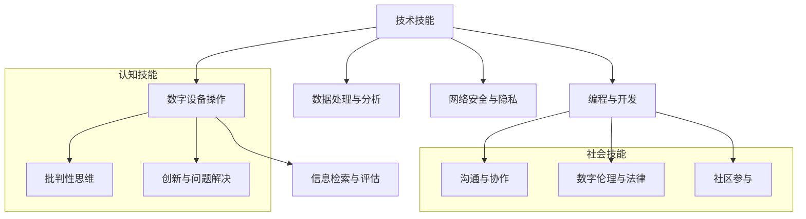

                 

# 数字素养：公民参与的基石

> **关键词：** 数字素养、公民参与、技术技能、信息素养、媒体素养、计算机素养、教育策略

> **摘要：** 本文深入探讨了数字素养的概念、重要性及其在教育、工作和社会参与中的应用。通过对技术素养、信息素养、媒体素养和计算机素养的详细解析，我们揭示了数字素养在现代社会中的基石作用。文章旨在帮助读者理解数字素养的各个方面，并认识到其在推动公民参与和促进社会发展中的关键作用。

### 《数字素养：公民参与的基石》目录大纲

#### 第一部分：数字素养的基本概念

##### 第1章：数字素养的定义与重要性

##### 第2章：数字素养的架构与理论基础

##### 第3章：数字素养的教育策略与实施

#### 第二部分：数字素养的核心技能

##### 第4章：技术素养

##### 第5章：信息素养

##### 第6章：媒体素养

##### 第7章：计算机素养

#### 第三部分：数字素养的实际应用

##### 第8章：数字素养在工作场景中的应用

##### 第9章：数字素养在社会参与中的作用

##### 第10章：数字素养的未来展望

### 附录

#### 附录A：数字素养教育资源与工具

#### 附录B：数字素养工具与应用指南

---

在接下来的章节中，我们将逐步深入探讨数字素养的各个方面，分析其在现代社会中的重要性，并探讨其教育策略和实践应用。通过这样的分析推理思考方式，我们希望读者能够更清晰地理解数字素养的核心概念和实际应用，从而更好地参与到现代社会中。

#### 第1章：数字素养的定义与重要性

##### 1.1 数字素养的概念解析

数字素养，简称数码素养（Digital Literacy），是一种综合能力，它涉及对数字技术、信息资源和媒体内容的理解、应用和管理能力。数字素养不仅关注技术层面的知识，还包括认知、社会和情感层面，旨在培养个体在数字环境中独立学习和有效沟通的能力。

**数字素养的核心要素：**

1. **技术技能**：了解并使用各种数字工具和软件，包括计算机、智能手机、平板电脑等。
2. **信息素养**：能够有效地检索、评估、利用和传播信息，具备信息伦理和版权意识。
3. **媒体素养**：理解媒体传播的机制，批判性地评估媒体内容，学会理性表达和参与公共讨论。
4. **计算机素养**：掌握基本的计算机操作，包括操作系统、网络、数据库和数据结构等。

**案例研究：全球数字素养标准的比较**

全球范围内，不同的国家和地区都制定了各自的数字素养标准。以美国、欧盟和中国为例：

- **美国**：美国教育部门将数字素养定义为“能够在数字化环境中进行有效、批判性和创造性思维的能力”。其标准涵盖了数字技能、信息素养、媒体素养和计算机素养等多个方面。
- **欧盟**：欧盟的数字素养框架包括基础知识、关键技能和应用技能三个层次。其强调通过终身学习来提升数字素养，以适应快速变化的数字环境。
- **中国**：中国的数字素养教育强调技术技能的培养，并关注信息素养和媒体素养的提升。例如，《中国学生数字素养发展指南》明确了数字学习、数字互动、数字生活和数字责任四个方面的素养标准。

通过比较全球数字素养标准，我们可以看到，尽管各国的侧重点有所不同，但共同的核心目标是培养个体在数字环境中的综合能力，以适应日益数字化的社会。

##### 1.2 数字素养的重要性

数字素养在现代社会中扮演着至关重要的角色。它不仅影响个人的生活质量和职业发展，还对社会的进步和民主治理产生深远的影响。

**数字素养对个人生活的影响：**

1. **提高生活质量**：数字素养使得个人能够更好地利用数字工具和资源，如在线教育、电子医疗服务和智能家居设备，从而提高生活便利性和幸福感。
2. **职业发展**：在数字化时代，掌握数字技能成为许多职业的基本要求。例如，编程、数据分析和数字营销等领域对数字素养有很高的要求。
3. **终身学习**：数字素养促使个体终身学习，保持知识更新，以适应快速变化的数字社会。

**数字素养对社会发展的作用：**

1. **经济贡献**：数字素养是驱动数字经济发展的重要动力。掌握数字技能的劳动力能够推动创新和创业，促进经济增长。
2. **社会包容性**：数字素养有助于减少数字鸿沟，提高社会包容性。通过数字素养教育，不同背景和社会群体都能更好地参与到数字社会中。
3. **民主治理**：数字素养是公民参与民主治理的基础。通过数字技能，公民能够更好地获取信息、参与公共事务和表达意见，从而增强社会透明度和治理效能。

**实例分析：数字素养与教育机会的联系**

以全球知名的在线学习平台“可汗学院”为例，该平台通过数字技术为全球学生提供免费的教育资源。这不仅打破了地域和经济的限制，使更多人有机会接受高质量的教育，也体现了数字素养在教育平等中的重要作用。研究表明，那些能够有效利用数字学习资源的学生，其学业成绩和学习动机都有显著提升。

##### 1.3 数字素养的分类

数字素养可以细分为多个方面，其中最常见的分类包括技术素养、信息素养、媒体素养和计算机素养。

1. **技术素养**：涉及使用和操作数字设备、软件和应用的能力。例如，了解计算机硬件和软件、掌握基本的编程技能、使用互联网等。
2. **信息素养**：强调有效地查找、评估、使用和传播信息的能力。信息素养还包括了解版权、隐私和信息安全等概念。
3. **媒体素养**：关注媒体内容的理解、评估和批判性思考能力。这包括理解媒体的运作机制、识别虚假信息和批判性地评估媒体内容。
4. **计算机素养**：涉及计算机基础知识，如操作系统、网络、数据库和数据结构等。计算机素养还包括对计算机安全性和网络伦理的理解。

**探讨：各类型素养之间的关联与区别**

虽然各类数字素养各有侧重，但它们之间存在紧密的关联。例如，技术素养是信息素养和媒体素养的基础，因为不了解数字工具和技术，就难以有效地利用和评估信息。同样，计算机素养是技术素养和媒体素养的延伸，它提供了在数字环境中进行深度学习和创新的能力。

然而，各类素养之间也存在一些区别。技术素养更注重实际操作能力，信息素养更侧重于信息管理和伦理，而媒体素养则强调对媒体内容的理解和批判性思考。计算机素养则涵盖了更广泛的计算机基础知识和技术应用。

总之，数字素养是一个多维度、综合性的概念，它要求个体在不同层面上具备相应的技能和能力。通过理解各类数字素养的关联与区别，我们可以更全面地培养和提升数字素养，以应对现代社会中的各种挑战。

---

通过上述对数字素养的定义、重要性及其分类的详细解析，我们可以看到数字素养在现代社会中的重要性不容忽视。它不仅影响个人的生活质量和职业发展，还对社会的发展和进步具有深远的影响。在接下来的章节中，我们将进一步探讨数字素养的架构与理论基础，分析其教育策略与实施方法，为培养和提高数字素养提供理论依据和实践指导。

#### 第2章：数字素养的架构与理论基础

##### 2.1 数字素养的架构模型

数字素养的架构模型是理解数字素养组成部分及其相互作用的重要工具。一个全面的数字素养架构应涵盖技术技能、认知技能和社会技能三个维度，每个维度都扮演着关键角色，共同构建个体的数字素养。

**技术技能维度**

技术技能维度关注个体对数字工具和技术的掌握。这些技能包括：

1. **数字设备操作**：熟练使用计算机、智能手机、平板电脑等数字设备。
2. **编程与开发**：掌握基本的编程语言和开发工具，能够编写简单的程序和应用程序。
3. **数据处理与分析**：了解如何使用电子表格、数据库和数据分析工具来处理和解释数据。
4. **网络安全与隐私**：具备保护个人数据和网络安全的基本知识，能够识别和防范网络威胁。

**认知技能维度**

认知技能维度强调个体在数字环境中思考和解决问题的能力。这些技能包括：

1. **信息检索与评估**：能够有效地使用搜索引擎和其他信息资源来查找信息，并评估其质量和可靠性。
2. **批判性思维**：具备分析、评估和批判性地思考数字信息的能力，能够识别偏见、误导性和虚假信息。
3. **创新与问题解决**：在数字环境中提出新想法、设计和实施解决方案，以应对复杂的问题和挑战。

**社会技能维度**

社会技能维度关注个体在数字社区中的互动和协作能力。这些技能包括：

1. **沟通与协作**：在数字平台上与他人进行有效沟通和协作，包括使用电子邮件、即时通讯和在线会议工具。
2. **数字伦理与法律**：了解数字伦理和法律法规，包括版权、隐私和数据保护等，能够遵守这些规定并保护自己的权益。
3. **社区参与**：在数字社区中积极参与讨论、分享知识和资源，以促进社区的共同发展和繁荣。

**Mermaid图：数字素养架构模型示意图**

以下是一个简单的Mermaid图，展示了数字素养的架构模型：



通过这个架构模型，我们可以更清晰地理解数字素养的各个组成部分及其相互关系。技术技能是数字素养的基础，认知技能和社会技能则是对基础技能的深化和应用。

##### 2.2 数字素养的理论基础

数字素养的发展离不开各种教育理论的支持。以下是一些对数字素养有重要影响的教育理论：

**建构主义学习理论**

建构主义学习理论强调学习者在学习过程中的主动性和建构性。建构主义者认为，知识不是通过教师的直接传授获得的，而是通过学习者与环境的互动，通过自己的经验和理解来构建的。在数字素养教育中，建构主义理论鼓励学生通过实际操作和项目学习来提升技能和知识。

**社会认知理论**

社会认知理论关注个体在社会环境中的认知和行为。它认为，学习不仅是个人内部的过程，还包括与他人的互动和社会经验的积累。在数字素养教育中，社会认知理论强调合作学习和社交互动的重要性，通过与他人合作和交流来提高学习效果。

**信息素养理论**

信息素养理论关注个体在信息环境中的能力。信息素养包括信息检索、信息评估、信息使用和信息传播的能力。信息素养理论在数字素养教育中起着基础作用，它帮助学习者理解和应用信息管理的基本原则，以应对数字化时代的信息爆炸。

**讨论：各理论在数字素养教育中的应用**

建构主义学习理论在数字素养教育中的应用体现在通过项目学习和实际操作来提升学生的技术技能和认知能力。例如，编程项目可以让学生通过实际编码来学习编程语言和算法，而不是仅仅依靠课本知识。

社会认知理论在数字素养教育中的应用则体现在通过合作学习和社交互动来提升学生的沟通和协作能力。例如，小组项目可以让学生在团队中共同解决问题，从而提高他们的团队合作和沟通技巧。

信息素养理论在数字素养教育中的应用体现在通过信息检索和评估训练来提高学生对数字信息的理解和应用能力。例如，通过搜索引擎使用训练，学生可以学会如何高效地查找和评估互联网上的信息。

总之，不同的教育理论为数字素养教育提供了不同的视角和方法。通过综合运用这些理论，我们可以更有效地设计和实施数字素养教育，以培养全面发展的人才。

---

通过对数字素养架构模型的详细解析和各种教育理论的讨论，我们不仅对数字素养的组成部分和理论基础有了更深入的理解，也为数字素养教育的实施提供了重要的理论依据。在接下来的章节中，我们将进一步探讨数字素养的教育策略与实施方法，以帮助读者更好地理解和实践数字素养教育。

#### 第3章：数字素养的教育策略与实施

##### 3.1 教育策略

数字素养教育的成功离不开科学合理的策略。以下是一些关键的教育策略，它们可以帮助教师和教育机构有效地提升学生的数字素养：

**终身学习理念**

终身学习强调个体在一生中不断学习和适应变化。在数字素养教育中，教师应鼓励学生养成持续学习的习惯，不断更新知识和技能，以应对数字化时代的挑战。例如，通过开设在线课程和提供职业培训，帮助学生适应不断变化的数字环境。

**合作学习方式**

合作学习强调学生通过团队合作和互动来学习。这种方式不仅有助于提高学生的沟通和协作能力，还能激发他们的学习兴趣和动力。例如，教师可以组织小组项目，让学生在团队中共同解决问题，从而提高他们的数字技能和团队协作能力。

**项目导向教学**

项目导向教学以实际项目为基础，通过完成具体项目来提升学生的技能和知识。这种方式有助于将理论知识与实际应用相结合，提高学生的实践能力。例如，教师可以设计编程项目，让学生通过实际编程任务来学习编程语言和算法。

**游戏化学习设计**

游戏化学习设计通过将游戏元素引入学习过程，提高学生的参与度和学习动机。例如，通过设计编程游戏或在线竞赛，学生可以在愉快的氛围中学习数字技能，从而提高学习效果。

**案例分享：成功的数字素养教育实践**

1. **芬兰的数字素养教育**：芬兰的教育体系强调学生的自主学习和创造力培养。学校通过开设信息技术课程和编程项目，帮助学生掌握数字技能。此外，芬兰还鼓励学生在课外活动中参与数字创作，如编程俱乐部和机器人竞赛，从而提高他们的数字素养。

2. **英国的“数字素养挑战”**：英国的“数字素养挑战”项目通过在线竞赛和实践活动，激发学生对数字素养的兴趣。该项目为不同年龄和背景的学生提供了学习数字技能的机会，从而提高了整个社会的数字素养水平。

3. **中国的“互联网+教育”**：中国的“互联网+教育”战略通过建设在线教育平台和推广数字化教学资源，推动了数字素养教育的普及。例如，通过“学习强国”平台，学生和教师可以方便地获取高质量的数字教育资源，从而提升他们的数字素养。

**探讨：不同教学方法与工具的有效性**

不同教学方法与工具在数字素养教育中具有各自的优势和适用场景。例如，项目导向教学和游戏化学习设计能够激发学生的兴趣和主动性，提高学习效果；而终身学习和合作学习方式则有助于培养学生的自主学习和团队合作能力。

总之，科学合理的教育策略是提升数字素养的关键。通过综合运用不同的教学方法和工具，教师和教育机构可以更好地培养和发展学生的数字素养，为他们的未来职业生涯和社会参与奠定坚实的基础。

##### 3.2 教学方法与工具

在数字素养教育中，选择合适的的教学方法与工具至关重要。以下是一些常见的方法与工具，及其在实际教学中的应用：

**编程与算法学习工具**

编程与算法是数字素养的核心组成部分。以下是一些常用的编程与算法学习工具：

1. **Scratch**：Scratch是一种图形化编程语言，适合初学者入门。通过拖拽代码块，学生可以创建简单但富有创意的程序。
2. **Code.org**：Code.org提供了一系列免费编程课程和挑战，旨在提高学生的编程能力。该平台包括针对不同年龄段和技能水平的学生设计的课程。
3. **Khan Academy**：Khan Academy提供了丰富的计算机科学课程，包括编程基础、数据结构和算法等。学生可以通过视频教程和编程练习来学习。

**数字资源库与在线平台**

数字资源库和在线平台是数字素养教育的重要支撑。以下是一些常用的资源库和平台：

1. **Coursera**：Coursera是一个在线学习平台，提供来自全球顶尖大学的课程。学生可以免费注册，学习各种数字素养相关的课程。
2. **edX**：edX是一个非营利性在线学习平台，提供各种课程，包括计算机科学、数据科学和人工智能等。该平台与许多知名大学合作，提供高质量的课程资源。
3. **YouTube**：YouTube是一个内容丰富的视频平台，许多专业人士和教育者在这里分享编程、算法和数据科学等领域的教程。学生可以通过观看这些视频来学习新技能。

**虚拟现实与增强现实技术**

虚拟现实（VR）和增强现实（AR）技术为数字素养教育提供了新的教学手段和体验。以下是一些VR和AR技术的应用：

1. **Google Cardboard**：Google Cardboard是一种低成本的VR设备，学生可以使用它来体验虚拟现实世界。通过虚拟现实应用，学生可以探索历史场景、参观博物馆和进行科学实验等。
2. **ARKit 和 ARCore**：ARKit和ARCore是苹果和谷歌开发的AR开发平台，教师可以创建AR应用程序来增强课堂互动。例如，通过AR技术，学生可以“亲眼”看到复杂的科学概念和工程原理。
3. **Unity**：Unity是一个强大的游戏和AR/VR开发平台，教师可以使用它来创建互动式的学习应用程序。通过Unity，学生可以参与虚拟实验室、模拟环境和游戏化的学习体验。

**探讨：不同教学方法与工具的有效性**

不同的教学方法与工具在数字素养教育中具有各自的优势和适用场景。例如，编程学习工具和在线平台提供了系统化和结构化的学习路径，适合学生自主学习；而VR和AR技术则通过沉浸式的学习体验，提高了学生的参与度和学习效果。

总之，选择合适的教学方法与工具是提升数字素养教育质量的关键。教师应根据学生的实际需求和学习目标，灵活运用各种教学资源和技术，为学生提供丰富的学习体验，从而有效提升他们的数字素养。

---

通过对教育策略和教学方法与工具的深入探讨，我们为数字素养教育提供了实用的指导和参考。在接下来的章节中，我们将进一步探讨数字素养的核心技能，包括技术素养、信息素养、媒体素养和计算机素养，以帮助读者更全面地理解数字素养的各个方面。

#### 第4章：技术素养

技术素养是数字素养的核心组成部分，它关乎个体在数字环境中使用和操作技术工具的能力。技术素养不仅包括对数字设备的熟悉，还涉及编程、算法和数据结构等方面的知识。在本章中，我们将详细探讨计算机基础知识、编程语言与开发工具，并通过具体的案例来展示这些技能的实际应用。

##### 4.1 计算机基础知识

计算机基础知识是技术素养的基础，它包括计算机硬件、操作系统、网络基础和数据库等基本概念。

**计算机硬件与软件**

计算机硬件是计算机系统的物理组成部分，包括中央处理器（CPU）、内存（RAM）、硬盘（HDD）和显卡等。了解硬件的基本工作原理和配置选择对于有效管理和维护计算机至关重要。

**操作系统与网络基础**

操作系统是计算机的核心软件，负责管理计算机硬件资源和提供用户接口。常见的操作系统有Windows、macOS和Linux。理解操作系统的工作原理和基本命令对于提高计算机使用效率至关重要。

网络基础包括了解互联网的工作原理、TCP/IP协议和网络安全等。掌握网络基础可以帮助我们更好地利用互联网资源，并确保网络安全。

**数据库与数据结构**

数据库是存储和管理数据的一种系统，常见的数据库管理系统（DBMS）包括MySQL、Oracle和MongoDB等。了解数据库的基本原理和SQL查询语言对于数据管理和分析至关重要。

**伪代码：数据库查询与排序算法**

以下是一个简单的伪代码示例，用于演示数据库查询和排序算法：

```plaintext
// 数据库查询伪代码
function query_database(table, condition) {
    result = []
    for each row in table {
        if row satisfies condition {
            append row to result
        }
    }
    return result
}

// 排序算法伪代码
function sort_array(array, sort_key) {
    sorted_array = []
    for each element in array {
        find element with highest value of sort_key
        append it to sorted_array
        remove it from array
    }
    return sorted_array
}
```

这个伪代码展示了如何从数据库中查询满足特定条件的数据，并使用排序算法对结果进行排序。

##### 4.2 编程语言与开发工具

编程语言是编写计算机程序的语法和规则。掌握一种或多种编程语言对于提升技术素养至关重要。以下是一些常用的编程语言和开发工具：

**Python编程语言**

Python是一种高级、易学的编程语言，广泛应用于数据科学、人工智能和Web开发等领域。以下是一个简单的Python代码示例：

```python
# 打印“Hello, World!”
print("Hello, World!")

# 计算两个数的和
a = 5
b = 10
sum = a + b
print(f"The sum of {a} and {b} is {sum}.")
```

**Java与C#等语言**

Java是一种面向对象的编程语言，广泛应用于企业级应用和Android开发。C#则是微软开发的编程语言，主要用于.NET框架。以下是一个简单的Java代码示例：

```java
public class HelloWorld {
    public static void main(String[] args) {
        System.out.println("Hello, World!");
    }
}
```

**集成开发环境（IDE）使用**

集成开发环境（IDE）提供了编写、调试和运行代码的工具。常见的IDE包括Visual Studio、Eclipse和PyCharm。以下是一个简单的Visual Studio使用示例：

1. 打开Visual Studio。
2. 创建一个新的C#项目。
3. 在代码编辑器中编写以下代码：

```csharp
using System;

class HelloWorld {
    static void Main() {
        Console.WriteLine("Hello, World!");
    }
}
```

4. 点击“开始”按钮运行程序，程序将输出“Hello, World！”。

##### 案例解析：Python脚本开发与调试

以下是一个简单的Python脚本案例，用于计算并输出一组数字的平均值：

```python
# 计算平均值
def calculate_average(numbers):
    total = sum(numbers)
    average = total / len(numbers)
    return average

# 主函数
def main():
    numbers = [1, 2, 3, 4, 5]
    avg = calculate_average(numbers)
    print(f"The average of the numbers is: {avg}")

# 程序入口
if __name__ == "__main__":
    main()
```

**步骤：**

1. 打开文本编辑器（如Notepad++或VS Code）。
2. 编写上述代码。
3. 保存文件为`average_calculator.py`。
4. 打开命令行，导航到保存文件的目录。
5. 运行`python average_calculator.py`。
6. 程序将输出`The average of the numbers is: 3.0`。

通过这个案例，我们展示了Python脚本的开发和调试过程。在实际开发中，可能需要使用调试工具（如PyCharm的调试器）来跟踪代码执行和识别错误。

##### 总结

技术素养是数字素养的重要组成部分，它涵盖了计算机基础知识、编程语言和开发工具等方面。通过掌握这些技能，个体能够更好地适应数字化时代的需求，提高工作效率和生活质量。在接下来的章节中，我们将进一步探讨信息素养、媒体素养和计算机素养，以全面理解数字素养的各个方面。

---

在了解了技术素养的基本概念和实际应用后，我们可以看到它对于提升个体在数字环境中的竞争力至关重要。在下一章中，我们将深入探讨信息素养，包括信息检索、信息评估和信息安全等方面的内容，帮助读者更全面地理解数字素养的各个方面。

#### 第5章：信息素养

信息素养是数字素养的核心要素之一，它涉及个体在信息环境中的能力，包括信息检索、信息评估、信息使用和信息传播等方面。信息素养不仅关乎个人的知识获取与利用，更影响着社会的信息传播与公共决策。在本章中，我们将详细探讨信息素养的各个方面，并通过具体的案例来展示这些技能的实际应用。

##### 5.1 信息检索与评估

信息检索与评估是信息素养的基础。在数字化时代，信息检索能力直接影响到个体获取所需信息的能力。以下是一些关键要素：

**搜索引擎的使用**

搜索引擎是获取信息的主要工具。掌握搜索引擎的用法对于高效获取信息至关重要。以下是一些搜索引擎使用的技巧：

1. **关键词优化**：选择合适的关键词可以大大提高搜索的准确性和效率。
2. **高级搜索**：大多数搜索引擎都提供了高级搜索选项，如筛选时间、特定网站搜索等，可以帮助用户更精确地找到所需信息。
3. **使用引号**：在关键词周围使用引号可以搜索精确匹配的内容。

**信息筛选与评估方法**

在大量信息中，筛选出有价值的信息是信息素养的重要体现。以下是一些信息筛选与评估的方法：

1. **来源评估**：评估信息来源的可靠性。官方网站、学术期刊和权威机构发布的信息通常更为可信。
2. **多角度评估**：从多个来源和不同角度获取信息，以验证其真实性和全面性。
3. **事实核查**：对关键信息进行核实，以避免受到虚假信息的误导。

**学术资源的获取与利用**

学术资源是专业学习和研究的重要基础。以下是一些学术资源的获取与利用技巧：

1. **图书馆资源**：利用图书馆的电子资源和数据库，可以方便地获取专业学术资料。
2. **学术期刊**：查阅学术期刊和会议论文，可以了解最新的学术研究成果。
3. **引用管理工具**：使用引用管理工具（如EndNote、Zotero等），可以方便地管理文献资料，提高学术写作的效率。

**数学模型：信息检索算法的评估指标**

信息检索算法的评估通常使用以下指标：

1. **准确率（Precision）**：检索到的相关结果与总检索结果的比例。
2. **召回率（Recall）**：检索到的相关结果与实际相关结果的比例。
3. **F1分数**：准确率和召回率的调和平均数，用于综合评估检索算法的性能。

以下是一个简单的数学模型示例，用于计算信息检索算法的准确率和召回率：

```latex
\text{准确率} = \frac{\text{检索到的相关结果}}{\text{检索到的总结果}}
\text{召回率} = \frac{\text{检索到的相关结果}}{\text{实际相关结果}}
F1 \text{分数} = 2 \times \frac{\text{准确率} \times \text{召回率}}{\text{准确率} + \text{召回率}}
```

通过这些数学模型，我们可以更客观地评估信息检索算法的性能，从而优化信息检索过程。

##### 5.2 信息伦理与版权保护

信息伦理与版权保护是信息素养的重要组成部分，涉及到个体在使用信息时应当遵循的道德规范和法律原则。以下是一些关键概念：

**信息伦理的基本原则**

1. **诚实与公正**：提供真实、准确的信息，不误导他人。
2. **尊重隐私**：保护个人和组织的隐私，不擅自泄露他人信息。
3. **公平使用**：合理使用他人信息，尊重知识产权。
4. **责任与诚信**：在使用信息时，明确个人责任，遵守法律法规。

**知识产权保护与版权法**

知识产权保护是确保创作者权益的重要手段。以下是一些基本的知识产权保护与版权法概念：

1. **版权**：版权是创作者对其原创作品的专有权利，包括复制、分发、展示和改编等权利。
2. **专利**：专利是发明者对其发明创造的专有权利，保护发明在市场上的独占性。
3. **商标**：商标是标识商品或服务来源的标志，保护品牌的独特性。
4. **版权法**：版权法是保护版权的法律体系，规定了创作者的权利和公众的权益平衡。

**网络隐私与网络安全**

网络隐私与网络安全是信息素养中的关键领域，涉及到个人数据和网络安全的问题。以下是一些关键概念：

1. **个人数据保护**：保护个人身份信息和隐私，不将其泄露给未经授权的第三方。
2. **网络安全**：采取措施保护计算机和网络免受恶意攻击和黑客入侵。
3. **数据加密**：使用加密技术保护敏感数据，防止未经授权的访问。
4. **网络安全意识**：提高对网络安全威胁的认识，采取预防措施保护个人和组织的网络安全。

**实例分析：社交媒体中的信息伦理问题**

社交媒体是信息传播的重要平台，但也存在许多信息伦理问题。以下是一些实例分析：

1. **虚假信息传播**：社交媒体上的虚假信息容易误导公众，影响公共决策和社会稳定。
2. **隐私泄露**：社交媒体平台可能收集用户的个人信息，将其用于广告投放或其他商业目的。
3. **网络欺凌**：社交媒体上的网络欺凌行为给受害者带来严重的心理伤害。

通过这些实例分析，我们可以看到信息伦理与版权保护在社交媒体中的重要性。只有遵循信息伦理原则，遵守版权法和网络安全法规，才能确保数字环境的健康和可持续发展。

##### 总结

信息素养是数字素养的重要组成部分，它关乎个体在信息环境中的能力。通过掌握信息检索、信息评估、信息伦理和版权保护等方面的技能，个体能够更有效地获取、利用和保护信息。在数字化时代，提升信息素养不仅对个人发展至关重要，也对社会进步和民主治理产生深远影响。在下一章中，我们将探讨媒体素养，进一步了解数字素养的各个方面。

---

通过本章对信息素养的详细探讨，我们看到了它在数字化社会中的重要性。在下一章中，我们将深入探讨媒体素养，关注数字时代媒体传播的特点和影响，帮助读者更好地理解和应对媒体素养方面的挑战。

#### 第6章：媒体素养

媒体素养是数字素养的重要组成部分，它关乎个体在数字环境中理解、评估和批判媒体内容的能力。随着互联网和社交媒体的普及，媒体信息充斥着我们的日常生活，提高媒体素养对于维护个人判断力、促进社会和谐具有重要意义。在本章中，我们将详细探讨媒体传播的特点与影响，以及如何通过批判性思维培养和多媒体制作工具来提升媒体素养。

##### 6.1 媒体传播的特点与影响

**传统媒体与新媒体的对比**

传统媒体包括报纸、电视、广播等，而新媒体则主要指的是互联网和社交媒体。两者在传播方式、传播速度和受众互动方面有显著差异：

1. **传播速度**：新媒体的信息传播速度快，几乎可以实现即时传递，而传统媒体则相对较慢。
2. **互动性**：新媒体平台高度互动，用户可以即时评论、分享和反馈，传统媒体则相对单向。
3. **多样性**：新媒体内容形式多样，包括文字、图片、视频等，传统媒体则更多依赖于文字和图像。

**社交媒体的影响力**

社交媒体在现代社会中扮演着越来越重要的角色，其影响力主要体现在以下几个方面：

1. **信息传播**：社交媒体是信息传播的主要渠道之一，各种新闻事件、社会现象和观点都在社交媒体上迅速传播。
2. **舆论形成**：社交媒体上的舆论力量不容小觑，公众观点和情绪可以在短时间内形成并产生影响。
3. **公共参与**：社交媒体为公众提供了参与公共事务和表达意见的平台，促进了民主和社会参与。

**虚假信息的传播与对策**

社交媒体上的虚假信息传播问题日益严重，以下是一些常见的虚假信息类型及对策：

1. **假新闻**：虚构的新闻事件，误导公众。对策：通过多方验证和事实核查，避免传播未经证实的消息。
2. **谣言**：未经证实的言论，散布恐慌和误解。对策：提高公众的批判性思维能力，学会辨别谣言和真相。
3. **深度伪造（Deepfake）**：通过人工智能技术生成的虚假视频或图像。对策：普及人工智能技术知识，提高对深度伪造的识别能力。

**讨论：社交媒体对公民素养的挑战**

社交媒体的普及带来了许多挑战，对公民素养提出了新的要求：

1. **信息过载**：社交媒体上的信息量庞大，公众需要具备筛选和评估信息的能力，避免被虚假信息误导。
2. **隐私保护**：社交媒体平台可能收集用户的个人信息，公民需要了解隐私保护知识，保护个人隐私。
3. **网络素养**：公民需要具备良好的网络行为习惯，尊重他人权利，避免网络暴力。

##### 6.2 媒体内容的创作与评估

**新闻写作与编辑技巧**

新闻写作和编辑技巧是媒体素养的重要方面，以下是一些关键要点：

1. **客观性**：新闻报道应保持客观公正，避免偏袒和主观臆断。
2. **准确性**：确保报道内容准确无误，避免传播错误信息。
3. **清晰性**：语言简练明了，逻辑清晰，便于读者理解。

**媒体批判性思维培养**

批判性思维是评估媒体内容的重要能力，以下是一些培养批判性思维的策略：

1. **问问题**：对新闻报道提出质疑，如“消息来源是什么？”“报道是否基于事实？”“有无其他观点？”等。
2. **多角度分析**：从不同角度和来源获取信息，以全面评估新闻事件。
3. **反思性思考**：反思自己的观点和立场，避免盲目接受或传播信息。

**多媒体制作工具与技术**

多媒体制作工具和技术是现代媒体创作的重要手段，以下是一些常用的工具：

1. **视频编辑软件**：如Adobe Premiere Pro、Final Cut Pro等，用于剪辑和制作视频内容。
2. **音频处理软件**：如Audacity、Adobe Audition等，用于编辑和增强音频效果。
3. **图像处理软件**：如Adobe Photoshop、GIMP等，用于处理和修饰图片。

**案例研究：新闻发布中的媒体素养问题**

以某次重大新闻事件为例，分析媒体素养在新闻发布中的重要性：

1. **新闻发布前的准备**：记者在发布新闻前应进行全面调查和事实核查，确保报道内容的准确性。
2. **新闻发布的过程**：记者应保持客观，避免过度渲染或夸大事实。
3. **新闻发布后的反馈**：媒体机构应对报道进行跟踪和评估，及时纠正错误信息，回应公众关切。

通过这个案例，我们可以看到媒体素养在新闻发布中的关键作用。只有具备良好的媒体素养，媒体机构才能提供准确、公正和透明的新闻报道，为社会传递真实的信息。

##### 总结

媒体素养是数字素养的重要组成部分，它关乎个体在数字环境中理解和评估媒体内容的能力。通过掌握媒体传播的特点与影响、批判性思维培养和多媒体制作工具等方面的技能，个体能够更好地应对社交媒体和信息过载带来的挑战，提高自身的媒体素养。在数字化时代，提升媒体素养不仅对个人发展至关重要，也对社会进步和公共参与具有重要意义。

---

通过本章对媒体素养的深入探讨，我们了解了其在数字时代的重要性。在下一章中，我们将探讨计算机素养，包括网络沟通与合作、数字时代法律与政策等方面的内容，帮助读者进一步理解计算机素养在现代社会中的作用和影响。

#### 第7章：计算机素养

计算机素养是数字素养的重要组成部分，它关乎个体在数字环境中使用和操作计算机及其相关工具的能力。计算机素养不仅包括基本的计算机操作，还涉及到网络安全、在线沟通与合作以及数字时代法律与政策等方面。在本章中，我们将详细探讨计算机素养的各个方面，并通过具体的实例来展示这些技能的实际应用。

##### 7.1 网络沟通与合作

**电子邮件与即时通讯工具**

电子邮件和即时通讯工具是现代工作中不可或缺的沟通工具。以下是一些关键要点：

1. **电子邮件**：电子邮件是一种正式的沟通方式，应注重邮件的结构和语言规范。以下是电子邮件的基本结构：

   ```plaintext
   发件人：[你的姓名]
   收件人：[收件人姓名]
   主题：[邮件主题]
   正文：
   ```

   电子邮件的语言应简明扼要，避免使用复杂或模糊的表达。例如：

   ```plaintext
   主题：会议议程

   李明，
   
   下周五下午3点，我们在会议室召开项目进度会议。请准备以下材料：
   - 项目概述
   - 已完成的任务列表
   - 下一步计划

   如果您有其他问题或建议，请随时与我联系。

   谢谢！

   张华
   ```

2. **即时通讯工具**：即时通讯工具如微信、Slack和Microsoft Teams等，提供了更加便捷的沟通方式。以下是使用即时通讯工具的一些技巧：

   - 保持简洁：发送简短的文字或链接，避免长篇大论。
   - 分享文件：使用附件功能分享文件或资料，提高沟通效率。
   - 通话和视频会议：对于复杂的问题，可以通过通话或视频会议进行实时沟通。

**虚拟团队协作平台**

虚拟团队协作平台如Trello、JIRA和Asana等，帮助团队有效地管理项目和任务。以下是这些平台的基本使用方法：

1. **任务分配**：将任务分配给团队成员，并设置截止日期。
2. **进度跟踪**：实时查看任务的完成情况和进度。
3. **沟通协作**：通过平台内的讨论区或即时通讯功能，团队成员可以随时交流和协作。

**实例解析：远程办公中的计算机素养应用**

以某企业远程办公为例，分析计算机素养在远程办公中的应用：

1. **电子邮件沟通**：企业内部采用电子邮件进行日常沟通，确保信息的正式性和可追溯性。
2. **即时通讯工具**：团队成员使用微信或Slack进行即时沟通，解决紧急问题和日常协作。
3. **虚拟团队协作平台**：使用Trello或Asana来管理项目进度，确保任务按时完成。

通过这些实例，我们可以看到计算机素养在远程办公中的重要性。只有具备良好的计算机素养，团队成员才能高效地进行沟通与合作，确保工作的顺利进行。

##### 7.2 数字时代的法律与政策

**网络安全法律框架**

网络安全法律框架是保护个人和组织数据安全的重要手段。以下是一些关键法律和规定：

1. **《网络安全法》**：我国《网络安全法》规定了网络运营者的责任和义务，包括用户信息保护、数据存储和传输安全等。
2. **《个人信息保护法》**：该法律规定了个人信息处理的基本原则和规范，保护个人信息的合法权益。
3. **《数据安全法》**：该法律规定了数据安全的基本要求和管理措施，确保数据的安全性和可用性。

**数字公民权利与责任**

数字公民权利与责任涉及到个体在数字环境中的权利和义务。以下是一些关键概念：

1. **隐私权**：个人有权保护自己的个人信息不被非法收集、使用和泄露。
2. **言论自由**：个人有权在法律允许的范围内表达自己的观点和意见。
3. **知识产权**：创作者对其作品享有知识产权，他人未经授权不得使用或复制。

**数字时代的数据隐私保护**

数据隐私保护是数字时代的重要课题，以下是一些关键策略：

1. **数据加密**：使用加密技术保护敏感数据，防止未经授权的访问。
2. **数据匿名化**：对数据进行匿名化处理，保护个人隐私。
3. **隐私政策**：制定明确的隐私政策，告知用户其数据如何被收集、使用和保护。

**案例探讨：数字政策对社会的影响**

以某国的数据隐私保护政策为例，探讨数字政策对社会的影响：

1. **数据隐私保护**：该政策加强了对个人数据的保护，减少了数据泄露和滥用风险，提高了公众的隐私意识。
2. **企业发展**：企业在处理用户数据时需遵守相关政策，这推动了数据安全和隐私保护技术的发展。
3. **公共利益**：数据隐私保护政策有助于维护公共利益，防止数据被滥用，提高社会透明度。

通过这个案例，我们可以看到数字政策在保护个人隐私、促进企业发展和维护公共利益方面的重要作用。

##### 总结

计算机素养是数字素养的重要组成部分，它关乎个体在数字环境中使用和操作计算机及其相关工具的能力。通过掌握网络沟通与合作、数字时代法律与政策等方面的技能，个体能够更高效地进行工作和生活，保护自身数据安全，并参与到数字社会的建设和发展中。在数字化时代，提升计算机素养不仅对个人发展至关重要，也对社会进步和公共参与产生深远影响。

---

通过本章对计算机素养的详细探讨，我们了解了其在现代社会中的重要性和实际应用。在下一章中，我们将探讨数字素养在工作场景中的应用，分析数字化转型中的技能需求，并通过具体案例展示数字素养在创新与创业中的作用。

#### 第8章：数字素养在工作场景中的应用

数字素养在现代社会的工作场景中扮演着至关重要的角色。随着全球数字化转型的加速，掌握数字技能不仅有助于提高工作效率，还能推动创新和创业。本章将探讨数字素养在工作场景中的应用，分析数字化转型中的技能需求，并通过具体案例展示数字素养在创新与创业中的作用。

##### 8.1 数字化转型的推动力

数字化转型是当今企业和组织面临的重大挑战和机遇。通过数字化转型，企业可以优化业务流程、提高运营效率，并开辟新的商业模式。以下是一些推动数字化转型的重要因素：

**数字化工作流程优化**

1. **自动化**：通过自动化工具和系统，企业可以减少手动操作，提高工作效率。例如，使用机器人流程自动化（RPA）技术，将重复性、规则性强的任务自动化处理，从而释放人力资源。
2. **数据分析**：利用大数据分析和人工智能技术，企业可以从大量数据中提取有价值的信息，用于决策支持。例如，通过分析销售数据，企业可以优化库存管理，减少库存成本。
3. **云计算**：云计算技术为企业提供了灵活的计算资源，帮助企业降低IT成本，提高业务灵活性。通过云计算，企业可以快速部署应用程序，实现全球范围内的数据共享和协作。

**数字化转型的技能需求**

数字化转型对员工技能提出了新的要求。以下是一些关键的技能需求：

1. **数据分析与人工智能**：掌握数据分析、机器学习和人工智能等技能，能够帮助企业在数据中提取有价值的信息，实现智能化运营。
2. **云计算与网络安全**：了解云计算技术、安全架构和网络安全策略，对于保障企业数据安全和业务连续性至关重要。
3. **编程与软件开发**：掌握编程和软件开发技能，有助于企业开发和部署数字化解决方案，提升竞争力。

**实战案例：企业数字化转型的实践**

以某大型零售企业为例，分析其数字化转型实践：

1. **自动化仓储系统**：企业引入了自动化仓储系统，通过机器人自动分拣和配送商品，大大提高了仓储效率，降低了人工成本。
2. **在线销售平台**：企业建立了在线销售平台，通过电子商务网站和移动应用，拓展了销售渠道，提高了销售额。
3. **客户关系管理系统（CRM）**：企业采用了CRM系统，通过数据分析客户行为，优化营销策略，提高了客户满意度。

通过这些实践，企业不仅提升了运营效率，还实现了业务的拓展和增长，为其他企业提供了宝贵的数字化转型经验。

##### 8.2 创新与创业中的数字素养

数字素养在创新和创业中发挥着重要作用。掌握数字技能的企业家和创新者能够更好地把握市场机遇，创造新的商业价值。以下是一些关键技能：

**创业项目策划与实施**

1. **市场研究**：通过大数据分析，了解市场需求和趋势，为创业项目提供科学依据。
2. **产品设计**：掌握用户体验（UX）设计技能，设计出满足用户需求的产品。
3. **营销策略**：运用数字营销工具，如社交媒体、搜索引擎优化（SEO）和内容营销等，提高品牌知名度。

**数字时代的创新思维培养**

1. **敏捷开发**：采用敏捷开发方法，快速迭代产品，不断优化和改进。
2. **跨学科合作**：结合不同领域的知识和技能，推动创新和突破。
3. **持续学习**：保持学习态度，关注行业动态，掌握最新技术和工具。

**案例研究：成功创业者的数字素养经验**

以某科技创业公司为例，分析其成功经验：

1. **创新产品**：公司通过大数据分析和人工智能技术，开发了智能化的物流管理系统，解决了传统物流行业的痛点，获得了市场的认可。
2. **灵活运营**：公司采用云计算和远程协作工具，实现了全球范围内的快速响应和灵活运营。
3. **数字营销**：公司运用社交媒体和搜索引擎营销，提高了品牌知名度，拓展了市场份额。

通过这个案例，我们可以看到数字素养在创新和创业中的重要性。只有具备良好的数字素养，企业家和创新者才能在激烈的市场竞争中脱颖而出，实现创业成功。

##### 总结

数字素养在工作场景中的应用广泛而深远。通过数字化转型，企业可以提高工作效率，实现业务的持续增长。在创新和创业中，数字素养是成功的关键因素，帮助企业家和创新者把握市场机遇，实现商业价值。在数字化时代，提升数字素养不仅对个人职业生涯具有重要意义，也对社会发展和经济增长产生深远影响。

---

在了解了数字素养在工作场景中的应用后，我们可以看到它在现代社会中的重要性。在下一章中，我们将探讨数字素养在社会参与中的作用，分析数字素养与公民参与的关系，并通过具体实例展示数字素养在社区发展中的作用。

#### 第9章：数字素养在社会参与中的作用

数字素养不仅是个人技能的提升，更是公民参与社会事务的重要基础。在数字时代，数字素养能够帮助公民更好地获取信息、参与公共事务和表达意见，从而增强社会透明度和治理效能。本章将探讨数字素养与公民参与的关系，并分析数字素养在社区发展中的作用。

##### 9.1 公民参与与数字素养

**数字公民的权利与义务**

数字公民是指那些在数字环境中积极参与社会事务、表达意见和行使权利的个体。数字素养是数字公民的重要素养，它包括以下权利和义务：

1. **信息获取权**：数字公民有权获取和利用公共信息资源，了解社会动态和公共事务。
2. **言论自由权**：数字公民有权在法律允许的范围内表达自己的观点和意见，参与公共讨论。
3. **隐私权**：数字公民有权保护自己的个人信息和隐私，不受非法收集、使用和泄露。
4. **参与权**：数字公民有权参与社会事务的决策和管理，通过民主途径影响公共政策的制定。

**数字素养在公共事务中的应用**

数字素养在公共事务中的应用体现在多个方面，包括信息检索、数据分析、在线参与和社交媒体使用等。以下是一些具体应用：

1. **在线投票与咨询**：数字素养使公民能够参与在线投票和公共咨询活动，通过数字平台表达自己的意见和需求。
2. **电子政务**：数字素养使公民能够便捷地办理各种政务事项，如缴纳税费、申请公共服务等。
3. **公民监督**：数字素养使公民能够通过网络平台监督政府行为，举报违法违规行为，维护社会公正。

**实例分析：在线公民投票的实践与挑战**

以某城市的在线公民投票为例，分析数字素养在公民参与中的应用和挑战：

1. **在线投票流程**：市民通过注册和登录投票系统，浏览投票事项和候选人信息，进行投票。
2. **数字素养要求**：市民需要掌握基本的计算机操作、网络安全知识和信息评估能力，确保投票的准确性和安全性。
3. **挑战与对策**：在线投票面临虚假信息传播、网络安全威胁和用户隐私保护等问题。为应对这些挑战，政府和企业需要加强网络安全防护，提高公民的信息素养，确保在线投票的公正性和可信度。

##### 9.2 数字素养与社区发展

**数字社区建设与管理**

数字社区是数字素养在社会参与中的具体体现，它通过数字平台连接和组织社区成员，促进社区交流和协作。以下是一些关键要素：

1. **在线社区平台**：数字社区通常建立在社交媒体、论坛和在线协作平台上，提供信息交流、活动组织和资源共享等功能。
2. **社区管理**：社区管理者负责维护社区秩序，管理内容发布，确保社区环境的健康和积极。
3. **数字参与**：社区成员通过数字平台参与社区活动、提出建议和解决问题，增强社区凝聚力和参与度。

**数字素养在社区服务中的应用**

数字素养在社区服务中的应用能够提高服务效率，增强服务质量和公民满意度。以下是一些具体应用：

1. **在线咨询服务**：社区通过建立在线咨询平台，提供居民医疗、法律、就业等方面的咨询服务，方便居民获取帮助。
2. **公益活动组织**：数字平台帮助社区组织公益活动，如慈善捐赠、社区清洁等，提高公益活动的影响力和参与度。
3. **社区教育**：数字平台提供在线教育资源，如课程、讲座和培训，帮助居民提高技能和知识，促进终身学习。

**实践分享：数字素养推动社区发展的案例**

以某社区为例，分享数字素养在社区发展中的应用：

1. **数字社区平台**：社区建立了数字社区平台，提供在线交流、活动发布和资源共享等功能，促进了社区成员之间的互动和协作。
2. **线上志愿服务**：社区通过线上志愿服务系统，组织居民参与环保、慈善等公益活动，提高了居民的参与度和社区凝聚力。
3. **在线教育项目**：社区合作教育机构，通过线上课程和培训项目，帮助居民提高职业技能和知识水平，促进了社区经济和社会发展。

通过这个案例，我们可以看到数字素养在社区发展中的重要作用。数字素养不仅提高了社区服务的效率和质量，还增强了居民的参与度和社区凝聚力，推动了社区的可持续发展。

##### 总结

数字素养在社会参与中的作用不可忽视。它不仅是公民参与公共事务和社区发展的基础，也是推动社会进步和民主治理的重要力量。通过提升数字素养，公民能够更好地获取信息、参与公共事务和表达意见，提高社会的透明度和治理效能。在数字化时代，政府和社会组织应重视数字素养的培养，为公民提供必要的数字技能和资源，促进数字素养在社会各个领域的广泛应用。

---

在探讨了数字素养在社会参与中的作用后，我们认识到它对社区发展和公民参与的重要性。在下一章中，我们将展望数字素养的未来发展趋势，分析个性化学习与智能化教育、跨学科整合与多元学习模式，以及数字素养教育对教育体系的挑战。

#### 第10章：数字素养的未来展望

随着科技的迅猛发展，数字素养正不断演变，成为现代社会不可或缺的素养。未来，数字素养的发展趋势将体现在个性化学习与智能化教育、跨学科整合与多元学习模式等方面，同时也将面临教育体系的挑战。以下是对数字素养未来发展趋势的展望。

##### 10.1 数字素养教育的未来趋势

**个性化学习与智能化教育**

未来的数字素养教育将更加注重个性化学习和智能化教学。随着人工智能和大数据技术的发展，教育机构将能够根据学生的兴趣、能力和学习进度，提供个性化的学习内容和路径。以下是一些具体趋势：

1. **个性化学习方案**：通过分析学生的学习数据，教育机构可以为学生定制个性化的学习计划，使每个学生都能在自己的节奏中学习。
2. **智能辅导系统**：智能辅导系统利用人工智能技术，为学生提供实时反馈和指导，帮助学生在学习过程中遇到问题时迅速得到解决。
3. **自适应学习平台**：自适应学习平台能够根据学生的学习行为和结果，自动调整教学内容和难度，使学习过程更加高效。

**跨学科整合与多元学习模式**

未来的数字素养教育将强调跨学科整合和多元学习模式。数字技术使得跨学科的学习和合作变得更加容易，教育将不再局限于单一的学科领域。以下是一些具体趋势：

1. **项目导向学习**：项目导向学习强调通过实际项目来培养学生的综合能力，项目可能涉及多个学科领域，有助于学生将所学知识应用于实际场景。
2. **合作学习**：在数字环境中，学生可以与全球各地的同学和专家进行合作，共同解决问题，提高协作能力和跨文化交流能力。
3. **虚拟现实（VR）与增强现实（AR）**：VR和AR技术为教育提供了新的互动方式，学生可以沉浸在虚拟或增强的现实中，体验和学习不同的知识和技能。

**讨论：数字素养教育对教育体系的挑战**

数字素养教育的快速发展对传统教育体系提出了新的挑战。以下是一些主要挑战：

1. **师资培训**：教育工作者需要不断提升自己的数字技能，以适应数字素养教育的新要求。这要求教育部门加强对教师的培训和支持。
2. **教育资源**：数字素养教育需要大量的数字化教育资源，包括教材、在线课程和工具等。教育部门需要投入更多的资源来开发和维护这些资源。
3. **教育评估**：传统的教育评估方式可能无法全面评估学生的数字素养水平。教育部门需要开发新的评估方法和工具，以更准确地衡量学生的能力。

##### 10.2 数字素养与社会发展的新挑战

**数字鸿沟与平等问题**

数字素养的发展也伴随着数字鸿沟和平等问题的挑战。以下是一些关键问题：

1. **数字鸿沟**：在城乡、贫富、年龄等不同群体之间，数字素养水平存在显著差异。这可能导致一部分人群在信息获取、就业机会和参与社会事务方面处于劣势。
2. **平等问题**：数字技术的应用可能加剧社会不平等，因为技术往往倾向于那些已有优势的群体。教育部门和社会组织需要采取措施，确保所有人都能获得数字素养教育的机会。

**人工智能与自动化对劳动力市场的影响**

人工智能（AI）和自动化技术的发展将对劳动力市场产生深远影响。以下是一些关键影响：

1. **就业变化**：AI和自动化技术将取代一些重复性、规则性强的工作，同时创造出新的工作岗位。教育部门需要培养适应这些变化的新技能。
2. **技能需求**：劳动力市场将更加重视数字技能和创新能力，教育部门需要调整课程设置，以培养这些技能。
3. **终身学习**：随着技术的快速发展，终身学习将成为应对劳动力市场变化的关键。教育部门和社会组织需要提供持续的教育和培训资源。

**预测：未来数字素养发展的可能方向**

基于上述分析，以下是对未来数字素养发展的预测：

1. **教育公平**：数字素养教育将更加注重公平，确保所有人都能获得必要的数字技能和资源。
2. **技术创新**：数字素养教育将紧密结合新兴技术，如人工智能、虚拟现实和区块链等，提供更加丰富和多样的学习体验。
3. **跨学科整合**：数字素养教育将不断融合不同学科的知识和技能，培养具有全面能力的人才。
4. **终身学习**：终身学习将成为数字素养教育的重要组成部分，适应不断变化的劳动力市场和社会需求。

##### 总结

数字素养的未来发展充满机遇和挑战。通过个性化学习与智能化教育、跨学科整合与多元学习模式，数字素养教育将不断改进，为社会培养更多具有全面能力和创新精神的人才。同时，数字鸿沟和平等问题仍将需要关注和解决。在数字化时代，提升数字素养不仅对个人发展具有重要意义，也对社会的进步和繁荣产生深远影响。

---

在展望了数字素养的未来发展趋势后，我们可以看到它对个人、社会和教育体系的深远影响。在附录部分，我们将提供一些数字素养教育资源与工具，以帮助读者进一步了解和提升数字素养。

#### 附录A：数字素养教育资源与工具

**A.1 数字素养教育资源推荐**

1. **Coursera**：提供来自全球顶尖大学的免费和付费课程，涵盖计算机科学、数据科学、人工智能等多个领域。
2. **edX**：由哈佛大学和麻省理工学院共同创办的在线学习平台，提供丰富的课程资源，涵盖计算机科学、工程、商业等领域。
3. **Khan Academy**：提供免费的在线课程，涵盖数学、科学、计算机科学等多个学科。
4. **Codecademy**：提供互动式的编程学习平台，适合初学者入门。
5. **MIT OpenCourseWare**：麻省理工学院提供的免费在线课程资源，涵盖计算机科学、物理学、经济学等多个学科。

**A.2 数字素养工具与应用指南**

1. **Visual Studio Code**：一款免费、开源的跨平台集成开发环境（IDE），适合编程学习和开发。
2. **Jupyter Notebook**：一款交互式的计算环境，适用于数据科学和机器学习项目。
3. **GitHub**：一个代码托管和协作平台，适合程序员学习和协作。
4. **Google Analytics**：一款免费的数据分析和报告工具，适用于网站和移动应用分析。
5. **Scratch**：一款图形化编程工具，适合儿童和初学者学习编程。

通过这些资源和工具，读者可以方便地获取数字素养的学习资料，并实践所学的技能。希望这些资源能够帮助读者在提升数字素养的道路上取得更好的成果。

---

### 附录B：数字素养工具与应用指南

**B.1 编程开发工具**

1. **Visual Studio Code**

   **概述**：Visual Studio Code 是一款由微软开发的免费、开源的跨平台集成开发环境（IDE），适用于各种编程语言。

   **安装与配置**：

   - **安装**：访问 [Visual Studio Code 官网](https://code.visualstudio.com/)，下载并安装适合操作系统的版本。
   - **配置**：安装后，用户可以通过插件市场安装各种编程语言的插件，如Python、JavaScript等。

   **使用指南**：

   - **编写代码**：打开 VS Code，选择合适的编程语言模板开始编写代码。
   - **调试**：使用内置的调试工具进行代码调试。
   - **插件**：通过插件市场安装插件，扩展 VS Code 的功能。

2. **Jupyter Notebook**

   **概述**：Jupyter Notebook 是一个交互式的计算环境，特别适合数据科学和机器学习项目。

   **安装与配置**：

   - **安装**：在命令行中执行 `pip install notebook` 命令，安装 Jupyter Notebook。
   - **配置**：启动 Jupyter Notebook，通过浏览器访问 `http://localhost:8888/`，开始使用。

   **使用指南**：

   - **创建笔记本**：在 Jupyter Notebook 中创建新的笔记本，输入 Python 代码或 Markdown 文本。
   - **运行与调试**：使用“运行”按钮执行代码，查看输出结果。
   - **分享与协作**：可以通过链接或导入导出功能，与他人分享和协作笔记本。

**B.2 信息检索与分析工具**

1. **Google Analytics**

   **概述**：Google Analytics 是一款免费的数据分析和报告工具，适用于网站和移动应用分析。

   **安装与配置**：

   - **安装**：在 [Google Analytics 官网](https://www.google.com/analytics/) 注册并创建账号。
   - **配置**：将跟踪代码添加到网站或应用的源代码中，开始收集和分析数据。

   **使用指南**：

   - **跟踪设置**：设置跟踪目标和事件，了解用户行为。
   - **分析报告**：查看用户流量、来源、页面浏览量等详细报告。
   - **自定义报告**：创建自定义报告，以更精确地分析数据。

2. **Tableau**

   **概述**：Tableau 是一款强大的数据可视化工具，适用于数据分析和报告。

   **安装与配置**：

   - **安装**：在 [Tableau 官网](https://www.tableau.com/) 下载并安装 Tableau 软件。
   - **配置**：通过数据连接器连接数据库，导入数据。

   **使用指南**：

   - **创建图表**：使用 Tableau 的拖放界面，轻松创建各种图表和仪表板。
   - **数据连接**：连接多种数据源，包括数据库、云服务和文件。
   - **交互性**：通过交互功能，如筛选、排序和过滤，探索和分析数据。

**B.3 媒体制作与传播工具**

1. **Adobe Premiere Pro**

   **概述**：Adobe Premiere Pro 是一款专业级的视频编辑软件，适用于电影、电视和在线视频制作。

   **安装与配置**：

   - **安装**：在 [Adobe 官网](https://www.adobe.com/) 下载并购买 Adobe Premiere Pro。
   - **配置**：安装后，可以通过 Adobe 官方教程学习基本操作。

   **使用指南**：

   - **剪辑视频**：使用时间线编辑视频，添加过渡效果和特效。
   - **调色与音频处理**：调整视频的色彩和音频，提高视频质量。
   - **输出与分享**：导出视频，分享到社交媒体平台或上传到视频网站。

2. **Final Cut Pro**

   **概述**：Final Cut Pro 是苹果公司开发的视频编辑软件，适用于专业级的视频制作。

   **安装与配置**：

   - **安装**：在 Mac 上安装 Final Cut Pro，通过 App Store 购买和下载。
   - **配置**：安装后，可以通过官方教程和教程网站学习基本操作。

   **使用指南**：

   - **剪辑视频**：使用 Final Cut Pro 的专业剪辑工具，快速编辑视频。
   - **调色与特效**：通过颜色校正和特效工具，提高视频视觉效果。
   - **音频处理**：调整音频，消除杂音，增强声音效果。

通过附录B提供的工具与应用指南，读者可以进一步了解和掌握数字素养的相关工具，提升自己在技术、信息、媒体等方面的能力。希望这些指南能够为读者的数字素养提升之路提供实用帮助。

### 总结

通过本文的详细探讨，我们深入了解了数字素养的概念、重要性及其在教育、工作和社会参与中的应用。数字素养不仅涵盖了技术素养、信息素养、媒体素养和计算机素养等方面，还强调了个体的终身学习和创新能力。

在文章中，我们分析了数字素养的定义、重要性、架构与理论基础，以及教育策略与实施方法。同时，我们详细探讨了技术素养、信息素养、媒体素养和计算机素养的核心技能，并通过实例展示了这些技能的实际应用。

此外，我们还探讨了数字素养在工作场景中的应用，分析了数字化转型中的技能需求，展示了数字素养在创新与创业中的作用。最后，我们探讨了数字素养在社会参与中的作用，包括公民参与与社区发展的具体实例。

展望未来，数字素养将继续演变，成为现代社会不可或缺的素养。个性化学习与智能化教育、跨学科整合与多元学习模式将推动数字素养教育的不断改进。同时，数字鸿沟和平等问题也需要我们关注和解决。

提升数字素养不仅对个人发展具有重要意义，也对社会进步和经济增长产生深远影响。希望本文能够为读者提供有价值的参考和启示，帮助读者更好地理解和提升数字素养。

### 作者

**作者：AI天才研究院/AI Genius Institute & 禅与计算机程序设计艺术 /Zen And The Art of Computer Programming**

AI天才研究院致力于推动人工智能和计算机科学的发展，通过研究、教育和实践，为数字素养的提升提供创新解决方案。我们的研究成果和教学实践在全球范围内产生了广泛的影响，为培养新一代数字人才做出了重要贡献。

《禅与计算机程序设计艺术》是一本经典的计算机科学著作，深入探讨了计算机程序设计的哲学和艺术。作者通过独特的视角和深入的分析，为读者提供了关于编程、算法和计算机科学的深刻见解，启发了无数程序员和计算机科学家的思考和探索。这本书不仅具有学术价值，也对实际编程实践产生了深远影响。

