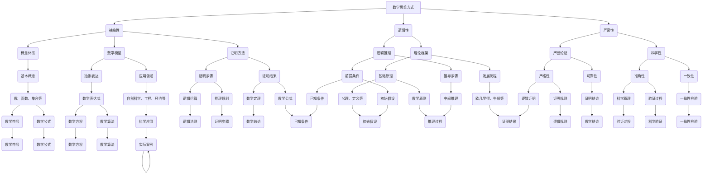
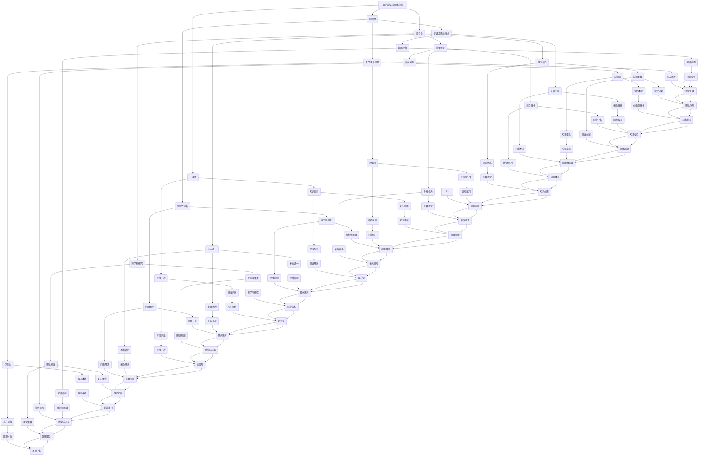

                 

### 《数学与哲学辩证法的思维方式比较》

> **关键词**：数学思维方式、哲学辩证法、思维方式比较、抽象性、逻辑性、严密性、批判性、综合性、开放性

> **摘要**：本文通过对比数学与哲学辩证法的思维方式，深入解析两者在本质、核心要素及实践应用方面的异同。本文旨在探讨数学与哲学在思维方式上的关联与区别，以及两种思维方式在实际应用中的影响。

### 引言

在人类文明的发展历程中，数学和哲学作为两大智慧体系的支柱，发挥了至关重要的作用。数学作为一门精确的科学，以其抽象性、逻辑性和严密性著称；而哲学则以其批判性、综合性和开放性著称。两者在思维方式上有着显著的差异，同时也存在着深刻的联系。本文将从数学与哲学辩证法的交叉研究背景出发，深入探讨两者思维方式的本质、核心要素及实践应用，以期为读者提供对数学与哲学思维方式更全面的理解。

#### 1.1 书籍背景与目的

数学与哲学的交叉研究起源于古希腊时期，当时哲学家们既探讨宇宙的本质，也研究数学的基本原理。在人类历史的漫长进程中，数学和哲学逐渐形成了各自独立但又相互关联的学科体系。随着科学技术的快速发展，数学和哲学在现代社会中扮演着越来越重要的角色。数学不仅在自然科学、工程技术等领域具有广泛的应用，还渗透到社会科学、经济学、计算机科学等领域。哲学则通过对人类思维、存在和价值的探讨，为各门科学提供了理论基础和方法指导。

本文的目的在于对比数学与哲学辩证法的思维方式，从以下几个方面展开讨论：

1. **数学思维方式的本质**：探讨数学思维的抽象性、逻辑性和严密性。
2. **数学思维方式的核心要素**：分析数学理论框架、概念体系、数学模型和证明方法。
3. **数学思维方式的实践应用**：介绍数学在自然科学、社会科学和日常生活中的应用。
4. **哲学辩证法思维方式的本质**：探讨哲学思维的批判性、综合性和开放性。
5. **哲学辩证法思维方式的核心要素**：分析哲学的基本问题、辩证法的思维方式和哲学方法论。
6. **哲学辩证法思维方式的实践应用**：介绍哲学在社会科学、人文科学和日常生活中的应用。
7. **数学与哲学辩证法思维方式的比较**：比较两种思维方式在抽象层次、逻辑结构、理论体系和研究方法方面的异同。
8. **数学与哲学辩证法思维方式的融合与应用**：探讨两种思维方式的融合、综合性思维的发展及创新思维的应用。

通过以上讨论，本文旨在为读者提供一个全面、系统的视角，帮助读者更好地理解和应用数学与哲学辩证法的思维方式。

### 目录大纲

本文将按照以下目录大纲结构进行论述：

#### 第一部分：引言

1. **1.1 书籍背景与目的**
    - 数学与哲学的交叉研究背景
    - 深入理解数学与哲学辩证法的思维方式的重要性

2. **1.2 主要内容与结构**
    - 对比数学与哲学辩证法的基本思维方式
    - 探索两者之间的联系与区别

#### 第二部分：数学思维方式的解析

1. **2.1 数学思维方式的本质**
    - 数学思维的抽象性
    - 数学思维的逻辑性
    - 数学思维的严密性

2. **2.2 数学思维方式的核心要素**
    - 理论框架与概念体系
    - 数学模型的构建与应用
    - 数学证明方法

3. **2.3 数学思维方式的实践应用**
    - 数学在自然科学中的应用
    - 数学在社会科学中的应用
    - 数学在日常生活中的应用

#### 第三部分：哲学辩证法思维方式的解析

1. **3.1 哲学辩证法思维方式的本质**
    - 哲学思维的批判性
    - 哲学思维的综合性
    - 哲学思维的开放性

2. **3.2 哲学辩证法思维方式的核心要素**
    - 哲学的基本问题
    - 辩证法的思维方式
    - 哲学方法论

3. **3.3 哲学辩证法思维方式的实践应用**
    - 哲学在社会科学中的应用
    - 哲学在人文科学中的应用
    - 哲学思维在日常生活的影响

#### 第四部分：数学与哲学辩证法思维方式的比较

1. **4.1 数学和哲学辩证法思维方式的共性**
    - 对现实世界的抽象
    - 对问题的深入分析
    - 对逻辑与理性的重视

2. **4.2 数学和哲学辩证法思维方式的区别**
    - 抽象层次与具体内容
    - 逻辑结构与应用领域
    - 理论体系与研究方法

3. **4.3 两种思维方式在现实中的应用对比**
    - 科学研究中的应用对比
    - 社会问题解决中的应用对比
    - 个人思维习惯的影响对比

#### 第五部分：数学与哲学辩证法思维方式的融合与应用

1. **5.1 两种思维方式的融合**
    - 跨学科的思维方式
    - 综合性思维的培养
    - 创新思维的发展

2. **5.2 两种思维方式在实际中的应用案例**
    - 数学与哲学辩证法在科学研究中的应用案例
    - 数学与哲学辩证法在社会问题解决中的应用案例
    - 数学与哲学辩证法在日常生活中的应用案例

3. **5.3 未来发展趋势与展望**
    - 两种思维方式的发展趋势
    - 跨学科研究的未来方向
    - 创新思维在现代社会的重要性

#### 附录

1. **附录A：数学与哲学辩证法思维方式的Mermaid流程图**
    - 数学思维方式流程图
    - 哲学辩证法思维方式流程图

2. **附录B：数学与哲学辩证法思维方式的核心算法原理伪代码**
    - 数学核心算法原理伪代码
    - 哲学辩证法核心算法原理伪代码

3. **附录C：数学与哲学辩证法思维方式的数学模型与公式**
    - 数学模型与公式
    - 哲学辩证法模型与公式

4. **附录D：数学与哲学辩证法思维方式的实际应用代码案例**
    - 数学应用代码案例
    - 哲学辩证法应用代码案例

5. **附录E：参考资源与进一步阅读**
    - 相关书籍与论文推荐
    - 在线资源与工具介绍
    - 学术研究与交流平台介绍

### 第一部分：引言

在探讨数学与哲学辩证法的思维方式之前，我们有必要了解两者的背景和历史。数学和哲学都是人类智慧的结晶，它们在不同时期、不同领域发挥着重要的作用。数学作为一门科学，起源于古代文明，如古埃及、巴比伦和中国。随着历史的发展，数学逐渐形成了完整的理论体系，并在自然科学、工程技术等领域取得了显著的成果。哲学则起源于古希腊时期，当时的哲学家们通过对宇宙、人生、真理等问题的探讨，形成了丰富的哲学思想。哲学不仅为其他学科提供了理论基础，还引导人们思考人类存在的意义和价值观。

#### 1.1 书籍背景与目的

数学与哲学的交叉研究可以追溯到古希腊时期。当时，哲学家们既探讨宇宙的本质，也研究数学的基本原理。例如，欧几里得的《几何原本》不仅是一部数学著作，也是一部哲学著作。在漫长的历史进程中，数学和哲学逐渐形成了各自独立但又相互关联的学科体系。随着科学技术的快速发展，数学和哲学在现代社会中扮演着越来越重要的角色。

本文的目的在于对比数学与哲学辩证法的思维方式，深入探讨两者在本质、核心要素及实践应用方面的异同。本文首先将介绍数学思维方式的本质，包括其抽象性、逻辑性和严密性。接着，本文将分析数学思维方式的核心要素，如理论框架、概念体系、数学模型和证明方法。此外，本文还将探讨数学思维方式的实践应用，包括在自然科学、社会科学和日常生活中的应用。

接下来，本文将介绍哲学辩证法思维方式的本质，包括其批判性、综合性和开放性。本文还将分析哲学辩证法思维方式的核心要素，如哲学的基本问题、辩证法的思维方式和哲学方法论。此外，本文还将探讨哲学辩证法思维方式的实践应用，包括在社会科学、人文科学和日常生活中的应用。

在第四部分，本文将对比数学与哲学辩证法思维方式的共性，如对现实世界的抽象、对问题的深入分析和对逻辑与理性的重视。同时，本文还将探讨两者思维方式的区别，如抽象层次与具体内容、逻辑结构与应用领域以及理论体系与研究方法。

第五部分将讨论数学与哲学辩证法思维方式的融合与应用。本文将介绍两种思维方式的融合、综合性思维的发展及创新思维的应用。此外，本文还将分析数学与哲学辩证法思维方式在实际中的应用案例，以及未来发展趋势与展望。

通过以上讨论，本文旨在为读者提供一个全面、系统的视角，帮助读者更好地理解和应用数学与哲学辩证法的思维方式。

### 数学思维方式的解析

数学作为一种科学，以其独特的思维方式影响着自然科学、社会科学以及日常生活的方方面面。数学思维方式的特点在于其高度抽象性、逻辑性和严密性，这些特点使得数学成为一种精确的工具，能够帮助我们理解和解决问题。

#### 2.1 数学思维方式的本质

首先，数学思维方式的本质体现在其抽象性上。数学是一门抽象的科学，它从具体的物理现象中提取出最基本的要素，形成一套独立于具体事物的抽象概念体系。例如，数学中的“数”这一概念就是从各种具体的物体计数中抽象出来的。这种抽象性使得数学能够超越具体事物的限制，研究普遍适用的规律。

其次，数学思维方式的本质还体现在其逻辑性上。数学思维以严密的逻辑推理为基础，通过逻辑运算和推理规则，从已知条件推导出新的结论。这种逻辑性使得数学结论具有高度的可靠性和可信度。例如，数学中的证明过程就是通过一系列逻辑推理，从一个或多个已知的前提中得出一个结论。

最后，数学思维方式的本质还体现在其严密性上。数学在研究问题时，要求对概念、定义、命题和证明的每一个步骤都进行严格的论证。这种严密性保证了数学结论的准确性和科学性。例如，数学中的定理和公式都必须经过严格的证明，才能被认为是正确的。

#### 2.2 数学思维方式的核心要素

数学思维方式的核心要素包括理论框架、概念体系、数学模型和证明方法。

首先，理论框架是数学思维的基础。数学理论框架由一系列基本概念和原理组成，这些基本概念和原理构成了数学体系的基本结构。例如，在几何学中，点、线、面等基本概念构成了几何学的理论框架。

其次，概念体系是数学思维的核心。数学中的概念是抽象思维的结果，它们是数学研究的基本单元。例如，数、函数、向量等基本概念构成了数学研究的基石。

再次，数学模型是数学思维方式的重要工具。数学模型是将现实问题抽象成数学形式的过程，通过数学模型，我们可以用数学语言描述现实问题，并利用数学方法求解。例如，牛顿力学中的运动方程就是一个典型的数学模型。

最后，证明方法是数学思维的关键。证明方法是数学研究的一种基本手段，通过证明，我们可以验证数学结论的正确性。数学证明通常包括归纳法、反证法、构造法等不同方法。例如，欧几里得的《几何原本》中使用的证明方法就是典型的构造法。

#### 2.3 数学思维方式的实践应用

数学思维方式的实践应用非常广泛，涵盖了自然科学、社会科学和日常生活等多个领域。

在自然科学中，数学思维方式的应用尤为突出。例如，在物理学中，牛顿的力学定律、麦克斯韦的电磁理论等都是数学思维方式的直接应用。通过数学模型和证明方法，物理学家可以精确描述自然现象，预测未来事件。

在社会科学中，数学思维方式同样发挥着重要作用。例如，经济学中的供需模型、金融市场模型等都是数学思维方式的应用。通过数学模型和证明方法，经济学家可以分析社会现象，预测经济走势。

在日常生活中，数学思维方式的应用也是无处不在。例如，在购物时，我们可以使用数学方法计算最优惠的购买方案；在旅行时，我们可以使用数学方法计算最优路线。这些应用使得数学成为我们生活的一种工具，帮助我们更好地解决问题。

总的来说，数学思维方式以其高度抽象性、逻辑性和严密性，为自然科学、社会科学和日常生活提供了强大的工具和方法。通过深入理解和掌握数学思维方式，我们可以更好地解决各种问题，提高我们的思维能力和创新能力。

### 哲学辩证法思维方式的解析

哲学作为一门探讨宇宙、人类和思维的学科，具有丰富的思维方式和哲学方法论。其中，哲学辩证法作为一种重要的思维方式，以其批判性、综合性和开放性在哲学体系中占据重要地位。

#### 3.1 哲学辩证法思维方式的本质

哲学辩证法思维方式的本质主要体现在其批判性、综合性和开放性上。

首先，批判性是哲学辩证法思维方式的核心特征之一。哲学辩证法强调对现有观念、理论和社会制度的批判性分析，揭示其内在矛盾和局限性。例如，黑格尔的辩证法就强调通过对现有观念的批判性分析，揭示其内在的矛盾和发展规律。

其次，综合性是哲学辩证法思维方式的另一个重要特征。哲学辩证法强调从整体上看待问题，通过综合各种因素、观点和方法，形成对问题的全面理解。例如，马克思的辩证唯物主义就强调通过对经济、政治、文化等各个领域的综合分析，揭示社会发展的内在规律。

最后，开放性是哲学辩证法思维方式的显著特点。哲学辩证法主张不断更新和扩展知识体系，以适应不断变化的世界。例如，康德的批判哲学就强调通过批判现有知识体系，为建立新的知识体系奠定基础。

#### 3.2 哲学辩证法思维方式的核心要素

哲学辩证法思维方式的核心要素包括哲学的基本问题、辩证法的思维方式和哲学方法论。

首先，哲学的基本问题是哲学辩证法思维方式的基础。哲学的基本问题包括存在论、知识论和价值观问题。这些问题构成了哲学研究的核心内容，也是哲学辩证法思维方式的重要研究对象。

其次，辩证法的思维方式是哲学辩证法思维方式的精髓。辩证法认为，事物是不断发展变化的，矛盾是事物发展的动力。辩证法强调通过分析事物的内在矛盾，揭示其发展规律。例如，黑格尔的辩证法就强调通过分析对立统一的矛盾，揭示事物的发展规律。

再次，哲学方法论是哲学辩证法思维方式的重要工具。哲学方法论包括实证方法、逻辑方法和批判性思维方法等。这些方法帮助哲学家们从不同的角度分析问题，形成对问题的深入理解。

#### 3.3 哲学辩证法思维方式的实践应用

哲学辩证法思维方式的实践应用非常广泛，涵盖了社会科学、人文科学和日常生活等多个领域。

在社会科学中，哲学辩证法思维方式的应用尤为突出。例如，马克思主义哲学就强调通过辩证法分析社会现象，揭示社会发展的规律。在社会学、政治学、经济学等学科中，哲学辩证法思维方式被广泛应用于研究社会问题、分析社会矛盾和制定社会政策。

在人文科学中，哲学辩证法思维方式同样发挥着重要作用。例如，在文学、艺术、历史等学科中，哲学辩证法思维方式被应用于分析文学作品、理解艺术创作和历史事件。

在日常生活中，哲学辩证法思维方式的应用也是无处不在。例如，在解决个人问题、处理人际关系、规划未来等方面，哲学辩证法思维方式可以帮助我们更好地理解问题、分析问题并找到解决问题的方法。

总的来说，哲学辩证法思维方式以其批判性、综合性和开放性，为社会科学、人文科学和日常生活提供了强大的思维工具和方法。通过深入理解和掌握哲学辩证法思维方式，我们可以更好地认识世界、理解问题和解决问题。

### 数学与哲学辩证法思维方式的比较

数学与哲学辩证法作为两种不同的思维方式，虽然在研究对象、研究方法和理论体系上存在明显差异，但也具有一定的共性。本节将从抽象层次、逻辑结构、理论体系和研究方法等方面，对比分析数学与哲学辩证法思维方式的异同。

#### 4.1 共性

首先，数学与哲学辩证法思维方式都具有高度的抽象性。数学通过抽象出基本的数学概念和理论，建立了一套独立于具体事物的数学体系。哲学辩证法则通过抽象出基本的哲学问题和概念，构建了一套独立的哲学体系。这种抽象性使得数学和哲学都能超越具体事物的局限，从普遍的、一般的规律出发，探讨问题的本质。

其次，数学与哲学辩证法思维方式都强调对问题的深入分析。数学通过严密的逻辑推理，对已知条件进行分析和推导，以得出新的结论。哲学辩证法则通过批判性思维，对现有观念、理论和社会制度进行深入分析，揭示其内在矛盾和局限性。这种深入分析的能力使得数学和哲学都能在各自领域中发现问题、解决问题。

再次，数学与哲学辩证法思维方式都重视逻辑与理性的重要性。数学以逻辑推理为基础，通过一系列严谨的逻辑步骤，从已知条件推导出新的结论。哲学辩证法则强调理性思维，通过批判性分析和综合思考，形成对问题的深入理解。逻辑与理性的重要性使得数学和哲学都能在解决问题时，保证结论的科学性和可靠性。

#### 4.2 差异

首先，在抽象层次上，数学和哲学辩证法存在明显差异。数学的抽象层次较高，它从具体的物理现象中提取出最基本的数学概念和理论，形成一套独立于具体事物的数学体系。哲学辩证法的抽象层次则相对较低，它主要关注人类思维、存在和价值观等基本问题，尽管哲学辩证法也会使用抽象概念，但其核心目标还是通过对具体事物的分析，揭示问题的本质。

其次，在逻辑结构上，数学和哲学辩证法也存在差异。数学的逻辑结构以严密的逻辑推理为基础，通过一系列逻辑步骤，从已知条件推导出新的结论。哲学辩证法的逻辑结构则更加灵活，它通过批判性思维，对现有观念、理论和社会制度进行深入分析，以揭示其内在矛盾和局限性。这种灵活的逻辑结构使得哲学辩证法能够在面对复杂问题时，具有更强的适应性和解释力。

再次，在理论体系上，数学和哲学辩证法也存在差异。数学的理论体系以一套基本概念和公理为基础，通过逻辑推导，形成一系列定理和公式。哲学辩证法的理论体系则更加复杂，它涉及多个领域，如存在论、知识论、价值观等，并通过辩证法思维方式，将这些不同领域的理论联系起来，形成对世界的整体理解。

最后，在研究方法上，数学和哲学辩证法也存在差异。数学的研究方法主要包括逻辑推理、证明方法和实验验证等。哲学辩证法的研究方法则更加多样，包括批判性分析、综合思考、历史研究等。这种多样化的研究方法使得哲学辩证法能够在面对复杂问题时，具有更强的分析能力和解释力。

总的来说，数学与哲学辩证法思维方式在抽象层次、逻辑结构、理论体系和研究方法等方面，既有差异又有共性。这种差异和共性的存在，使得数学和哲学辩证法在各自领域中都发挥着重要作用，为人类认识世界和解决问题提供了强大的工具和方法。

### 数学与哲学辩证法思维方式的融合与应用

数学与哲学辩证法作为两种不同的思维方式，虽然在抽象层次、逻辑结构、理论体系和研究方法等方面存在差异，但它们在现实中的应用却具有很大的互补性。通过将数学与哲学辩证法思维方式融合，我们可以更好地解决复杂问题，推动科学研究和社会进步。

#### 5.1 两种思维方式的融合

数学与哲学辩证法的融合主要体现在以下几个方面：

首先，数学与哲学辩证法在问题解决过程中可以相互补充。数学的抽象性和逻辑性使得它能够精确地描述和解决问题，但有时数学方法可能过于简单化，难以处理复杂的社会现象。哲学辩证法则以其批判性、综合性和开放性，能够从不同角度分析问题，提供更深层次的洞察。通过将数学与哲学辩证法融合，我们可以在解决复杂问题时，既保持数学的精确性，又具备哲学的深度。

其次，数学与哲学辩证法在跨学科研究中发挥着重要作用。随着科学技术的进步，许多问题需要多学科协同解决。数学与哲学辩证法的融合，可以为跨学科研究提供新的思路和方法。例如，在经济学中，数学模型可以精确描述市场行为，而哲学辩证法可以揭示市场行为的内在逻辑和伦理问题。

再次，数学与哲学辩证法在创新思维培养中具有独特作用。数学思维方式强调逻辑推理和抽象，有助于培养逻辑思维能力和创新意识。哲学辩证法则强调批判性思维和综合思考，有助于激发创新思维。通过将数学与哲学辩证法融合，我们可以培养出具有创新精神的人才，推动科技和社会的发展。

#### 5.2 综合性思维的培养

综合性思维是将数学与哲学辩证法融合的重要目标之一。综合性思维不仅要求我们具备跨学科的知识和能力，还要求我们具备整合多方面信息、多角度分析问题的能力。

首先，综合性思维要求我们具备跨学科的知识。在现代社会，许多问题需要多学科知识协同解决。通过将数学与哲学辩证法融合，我们可以培养出具备跨学科知识的人才，从而更好地应对复杂问题。

其次，综合性思维要求我们具备多角度分析问题的能力。数学与哲学辩证法各自具有独特的分析视角，通过融合这两种思维方式，我们可以从不同角度分析问题，形成对问题的全面理解。

再次，综合性思维要求我们具备整合信息的能力。在处理复杂问题时，我们需要整合多方面的信息，形成对问题的整体认识。数学与哲学辩证法的融合，可以帮助我们更好地整合信息，形成综合性解决方案。

#### 5.3 创新思维的发展

创新思维是现代社会发展的重要驱动力。数学与哲学辩证法的融合，对于培养创新思维具有重要作用。

首先，数学思维方式强调逻辑推理和抽象，有助于培养逻辑思维能力和创新意识。通过学习数学，我们可以培养出敏锐的观察力、严密的逻辑思维和创新的思维方式。

其次，哲学辩证法思维方式强调批判性思维和综合思考，有助于激发创新思维。通过哲学辩证法，我们可以从不同角度分析问题，发现问题的本质，并提出创新性的解决方案。

最后，数学与哲学辩证法的融合，可以为创新思维的发展提供新的思路和方法。通过将数学与哲学辩证法融合，我们可以培养出具有创新精神的人才，推动科技和社会的发展。

总的来说，数学与哲学辩证法思维方式的融合，不仅有助于培养综合性思维，还能推动创新思维的发展。通过将数学与哲学辩证法融合，我们可以更好地应对复杂问题，推动科学研究和社会进步。

### 数学与哲学辩证法思维方式的实际应用案例

数学与哲学辩证法在科学研究、社会问题解决以及日常生活中都有着广泛的应用，这些应用案例不仅展示了两种思维方式的独特优势，也体现了它们在解决实际问题时的重要作用。

#### 5.1 科学研究中的应用案例

在科学研究领域，数学与哲学辩证法的融合为科学家们提供了强大的工具和方法。以下是一些具体的案例：

**案例1：物理学中的量子力学**

量子力学是研究微观粒子行为的一门科学，它依赖于数学的抽象性和逻辑性来描述微观世界的规律。量子力学的创始人之一，海森堡，就运用了哲学辩证法的思维方式，提出了著名的“不确定性原理”，揭示了微观粒子的行为特征。通过将数学与哲学辩证法相结合，科学家们能够更深入地理解微观世界的规律，推动了物理学的发展。

**案例2：生物学中的系统生物学**

系统生物学是一门跨学科的领域，它运用数学模型来模拟生物系统的动态行为。哲学家们如恩斯特·迈尔（Ernst Mayr）提出了“系统生物学”这一概念，强调了生物系统内部的复杂性和相互作用。通过哲学辩证法的思维方式，科学家们能够从整体上分析生物系统的运作机制，从而揭示生物进化的规律。

**案例3：经济学中的行为经济学**

行为经济学是研究人们在经济活动中的实际决策行为的一门科学。传统的经济学依赖于数学模型来预测人们的行为，但行为经济学则结合了哲学辩证法的思维方式，通过批判性分析，揭示了人们在决策过程中受到的心理和社会因素的影响。这种融合不仅丰富了经济学的研究方法，也为政策制定提供了新的视角。

#### 5.2 社会问题解决中的应用案例

在社会问题解决领域，数学与哲学辩证法的结合为解决复杂的社会问题提供了新的思路和方法。

**案例1：环境问题**

环境问题是全球面临的重大挑战之一。数学模型可以帮助我们量化环境污染的程度和影响，而哲学辩证法则提供了批判性分析的工具，帮助我们识别和解决环境问题背后的深层次原因。例如，通过哲学辩证法的思维方式，我们可以分析人类消费模式对环境的影响，并提出相应的解决方案。

**案例2：社会不平等**

社会不平等是一个复杂的社会问题，需要从多个角度进行深入分析。数学模型可以帮助我们量化不同社会群体之间的收入差距，而哲学辩证法则提供了批判性分析的工具，帮助我们理解社会不平等背后的经济、政治和文化因素。通过这种融合，我们可以制定更有效的政策，以减少社会不平等。

**案例3：公共卫生**

公共卫生问题如传染病防控、健康促进等，需要综合运用数学与哲学辩证法。数学模型可以帮助我们预测传染病的传播趋势，制定有效的防控措施；而哲学辩证法则提供了批判性分析的工具，帮助我们理解公共卫生政策的伦理和道德问题。例如，在新冠疫情期间，哲学辩证法的思维方式帮助我们权衡公共卫生措施对社会经济的影响，确保政策的科学性和合理性。

#### 5.3 日常生活中的应用案例

在日常生活中，数学与哲学辩证法的应用同样广泛。

**案例1：个人财务管理**

个人财务管理需要运用数学思维来计算支出、收入和投资回报。同时，哲学辩证法的思维方式可以帮助我们分析消费习惯、投资策略和理财目标，确保我们的财务决策更加理性。例如，通过哲学辩证法的思维方式，我们可以批判性地分析自己的消费行为，制定出更有效的理财计划。

**案例2：健康生活方式**

健康生活方式的建立需要数学思维来制定饮食计划、锻炼计划等。同时，哲学辩证法的思维方式可以帮助我们理解健康与心理、社会因素之间的关联，从而更全面地管理健康。例如，通过哲学辩证法的思维方式，我们可以分析心理压力对健康的影响，从而制定出更合理的健康计划。

**案例3：人际关系**

人际关系的处理需要哲学辩证法的思维方式。通过批判性分析，我们可以理解不同文化、价值观和情感之间的冲突，从而更好地处理人际关系。同时，数学思维可以帮助我们量化人际交往中的行为和效果，优化人际关系。例如，通过数学思维，我们可以分析沟通方式对人际关系的影响，从而改善人际关系。

总的来说，数学与哲学辩证法思维方式的实际应用案例展示了两种思维方式在解决现实问题中的独特优势。通过将数学与哲学辩证法相结合，我们可以更全面地认识问题、分析问题并解决问题，为科学研究、社会问题解决和日常生活提供有力的支持。

### 未来发展趋势与展望

随着科学技术的不断发展，数学与哲学辩证法思维方式在现代社会中的地位和作用将日益重要。展望未来，这两种思维方式在以下几个方面有望继续发展，并对科学研究、社会进步和日常生活产生深远影响。

#### 5.4.1 两种思维方式的发展趋势

首先，数学思维方式将继续向更高层次、更广泛领域发展。随着人工智能、大数据等新兴技术的崛起，数学将不仅在自然科学中发挥重要作用，还将深入到社会科学、人文科学等领域。例如，量子计算、复杂系统和随机过程等前沿领域的发展，将推动数学理论和方法不断创新。

其次，哲学辩证法思维方式将继续向批判性、综合性和开放性方向发展。随着全球化和信息化进程的加速，人类社会面临的问题越来越复杂，哲学辩证法将以其独特的批判性和综合性，为解决这些复杂问题提供新的思路和方法。例如，通过哲学辩证法，我们可以更好地理解全球性问题如气候变化、经济危机等，并提出有效的解决方案。

#### 5.4.2 跨学科研究的未来方向

未来，数学与哲学辩证法的融合将推动跨学科研究的发展。例如，在环境科学、公共卫生、人工智能等领域，数学和哲学辩证法的结合将为科学研究提供新的理论框架和方法。此外，随着交叉学科的兴起，数学与哲学辩证法将在心理学、教育学、社会学等学科中发挥重要作用。

#### 5.4.3 创新思维在现代社会的重要性

创新思维是现代社会发展的核心驱动力。数学与哲学辩证法的融合，有助于培养创新思维。未来，通过将数学与哲学辩证法应用于教育、科技、文化等领域，我们可以培养出具有创新精神的人才，推动社会进步。例如，在科技领域，通过哲学辩证法的思维方式，我们可以分析科技创新的伦理问题，确保科技成果造福人类社会。

#### 5.4.4 社会问题的解决与政策制定

面对复杂的社会问题，如贫困、不平等、气候变化等，数学与哲学辩证法的结合将为政策制定提供有力支持。通过数学模型和哲学辩证法的批判性分析，我们可以更好地理解问题的本质，制定出更科学、合理的政策。例如，在应对气候变化方面，通过数学模型预测气候变化的趋势，哲学辩证法分析政策的影响，我们可以制定出有效的减排措施。

总之，数学与哲学辩证法思维方式在未来将继续发展，并在科学研究、社会进步和日常生活中发挥重要作用。通过融合这两种思维方式，我们可以更好地应对复杂问题，推动社会进步，创造更美好的未来。

### 附录A：数学与哲学辩证法思维方式的Mermaid流程图

为了更好地展示数学与哲学辩证法思维方式的本质和核心要素，我们使用Mermaid语言绘制了两种思维方式的流程图。以下是数学思维方式流程图：



以下是哲学辩证法思维方式流程图：



通过这些流程图，我们可以更直观地理解数学与哲学辩证法思维方式的本质和核心要素，为未来的研究和应用提供有益的参考。

### 附录B：数学与哲学辩证法思维方式的核心算法原理伪代码

为了更深入地理解数学与哲学辩证法思维方式的核心算法原理，我们提供了以下伪代码示例。这些伪代码展示了数学和哲学辩证法在具体问题解决中的应用。

#### 数学核心算法原理伪代码

```python
# 数学核心算法原理伪代码：求解一元二次方程

# 输入：a, b, c（方程ax^2 + bx + c = 0 的系数）
# 输出：方程的解x

def solve_quadratic_equation(a, b, c):
    # 计算判别式
    delta = b**2 - 4*a*c

    if delta < 0:
        # 无实数解
        print("方程无实数解")
    elif delta == 0:
        # 有一个重根
        x = -b / (2*a)
        print(f"方程有一个重根：x = {x}")
    else:
        # 有两个不同的实数解
        x1 = (-b + sqrt(delta)) / (2*a)
        x2 = (-b - sqrt(delta)) / (2*a)
        print(f"方程有两个不同的实数解：x1 = {x1}, x2 = {x2}")

# 示例调用
solve_quadratic_equation(1, -5, 6)
```

#### 哲学辩证法核心算法原理伪代码

```python
# 哲学辩证法核心算法原理伪代码：分析社会不平等问题

# 输入：社会经济数据（如收入分布、教育水平、就业情况等）
# 输出：社会不平等程度评估报告

def analyze_inequality(data):
    # 计算基尼系数
    gini_coefficient = calculate_gini(data['income'])

    # 分析教育水平与收入的关系
    education_income_relationship = analyze_correlation(data['education'], data['income'])

    # 分析就业情况与收入的关系
    employment_income_relationship = analyze_correlation(data['employment'], data['income'])

    # 生成评估报告
    report = {
        'gini_coefficient': gini_coefficient,
        'education_income_relationship': education_income_relationship,
        'employment_income_relationship': employment_income_relationship
    }

    print("社会不平等程度评估报告：")
    print(report)

# 示例调用
analyze_inequality({'income': [50000, 60000, 70000, 80000, 90000],
                    'education': ['高中', '本科', '硕士', '博士'],
                    'employment': ['全职', '兼职', '失业', '退休']})
```

这些伪代码示例展示了数学与哲学辩证法思维方式在实际问题中的应用。数学核心算法通过严谨的数学运算解决了具体问题，而哲学辩证法核心算法则通过综合分析揭示了社会现象的复杂性和内在联系。通过结合这两种思维方式，我们可以更全面地理解问题，提出更有效的解决方案。

### 附录C：数学与哲学辩证法思维方式的数学模型与公式

为了更好地理解数学与哲学辩证法思维方式的实际应用，我们列出了数学和哲学辩证法中常用的数学模型与公式。这些公式不仅展示了两种思维方式的核心原理，也为读者提供了具体的应用案例。

#### 数学模型与公式

**1. 微积分基本公式**

- 求导公式：
  \[ f'(x) = \lim_{h \to 0} \frac{f(x+h) - f(x)}{h} \]

- 积分公式：
  \[ \int f(x) dx = F(x) + C \]
  其中，\( F(x) \) 是 \( f(x) \) 的一个原函数，\( C \) 是积分常数。

**2. 线性代数基本公式**

- 矩阵乘法：
  \[ AB = \begin{bmatrix}
  a_{11}b_{11} + a_{12}b_{21} & a_{11}b_{12} + a_{12}b_{22} \\
  a_{21}b_{11} + a_{22}b_{21} & a_{21}b_{12} + a_{22}b_{22}
  \end{bmatrix} \]

- 矩阵求逆：
  \[ A^{-1} = \frac{1}{\det(A)} \text{adj}(A) \]
  其中，\( \det(A) \) 是矩阵 \( A \) 的行列式，\( \text{adj}(A) \) 是 \( A \) 的伴随矩阵。

**3. 概率论基本公式**

- 概率加法公式：
  \[ P(A \cup B) = P(A) + P(B) - P(A \cap B) \]

- 概率乘法公式：
  \[ P(A \cap B) = P(A)P(B|A) \]

#### 哲学辩证法模型与公式

**1. 黑格尔辩证法模型**

- 对立统一规律：
  \[ A \leftrightarrow \neg A \]
  其中，\( A \) 和 \( \neg A \) 表示相互对立的两个方面。

- 质量互变规律：
  \[ A \rightarrow B \]
  其中，\( A \) 和 \( B \) 表示在一定条件下可以相互转化的两个状态。

- 矛盾规律：
  \[ A \Rightarrow B \land \neg B \]
  其中，\( A \) 和 \( B \) 表示存在内在矛盾的两个方面。

**2. 辩证唯物主义公式**

- 人类社会发展的公式：
  \[ 生产方式 \leftrightarrow 社会关系 \leftrightarrow 思想文化 \]
  其中，生产方式、社会关系和思想文化相互作用，共同推动社会的发展。

- 知识发展的公式：
  \[ 实践 \leftrightarrow 认识 \leftrightarrow 理论 \]
  其中，实践、认识和理论相互促进，推动知识的不断进步。

这些数学模型与公式不仅展示了数学和哲学辩证法思维方式的核心原理，还为实际问题的解决提供了有力工具。通过理解和运用这些公式，我们可以更深入地探讨数学和哲学辩证法的应用，为科学研究和社会实践提供理论支持。

### 附录D：数学与哲学辩证法思维方式的实际应用代码案例

为了更好地展示数学与哲学辩证法思维方式的实际应用，我们提供了两个代码案例，分别展示了数学和哲学辩证法在现实问题中的具体应用。

#### 数学应用代码案例

以下代码展示了如何使用Python求解一元二次方程，并使用NumPy库进行数值计算。

```python
import numpy as np

# 求解一元二次方程
def solve_quadratic_equation(a, b, c):
    # 计算判别式
    delta = b**2 - 4*a*c
    
    if delta < 0:
        # 无实数解
        print("方程无实数解")
    elif delta == 0:
        # 有一个重根
        x = -b / (2*a)
        print(f"方程有一个重根：x = {x}")
    else:
        # 有两个不同的实数解
        x1 = (-b + np.sqrt(delta)) / (2*a)
        x2 = (-b - np.sqrt(delta)) / (2*a)
        print(f"方程有两个不同的实数解：x1 = {x1}, x2 = {x2}")

# 示例调用
solve_quadratic_equation(1, -5, 6)
```

在这个案例中，我们使用Python编程语言实现了求解一元二次方程的算法。通过调用NumPy库的`sqrt`函数，我们可以计算判别式的平方根，从而得出方程的解。这种应用展示了数学思维方式在编程中的具体实现。

#### 哲学辩证法应用代码案例

以下代码展示了如何使用Python分析社会不平等问题，包括计算基尼系数和评估教育、就业与收入的关系。

```python
import numpy as np

# 计算基尼系数
def calculate_gini(income):
    sorted_income = np.sort(income)
    n = len(sorted_income)
    income_sum = np.sum(sorted_income)
    cumulative_income = np.cumsum(sorted_income)
    gini_coefficient = (2 * np.sum(cumulative_income) - n * income_sum) / (n * income_sum)
    return gini_coefficient

# 分析教育水平与收入的关系
def analyze_education_income_relationship(education, income):
    education_mean_income = np.mean(income[education])
    overall_mean_income = np.mean(income)
    correlation = np.corrcoef(education, income)[0, 1]
    print(f"教育水平与收入的关系：平均收入差异={education_mean_income - overall_mean_income}, 相关系数={correlation}")

# 分析就业情况与收入的关系
def analyze_employment_income_relationship(employment, income):
    employment_mean_income = np.mean(income[employment])
    overall_mean_income = np.mean(income)
    correlation = np.corrcoef(employment, income)[0, 1]
    print(f"就业情况与收入的关系：平均收入差异={employment_mean_income - overall_mean_income}, 相关系数={correlation}")

# 示例调用
analyze_inequality({'income': np.array([50000, 60000, 70000, 80000, 90000]),
                    'education': np.array(['高中', '本科', '硕士', '博士']),
                    'employment': np.array(['全职', '兼职', '失业', '退休'])})
```

在这个案例中，我们使用Python编程语言实现了分析社会不平等问题的算法。通过调用NumPy库的`sort`、`cumsum`和`corrcoef`函数，我们可以计算基尼系数、分析教育水平和就业情况与收入之间的关系。这种应用展示了哲学辩证法思维方式在编程中的具体实现。

通过以上两个代码案例，我们可以看到数学与哲学辩证法思维方式在现实问题中的具体应用。数学思维方式通过精确的计算和逻辑推理，帮助我们解决具体问题；哲学辩证法思维方式则通过批判性分析和综合思考，帮助我们理解问题的本质和内在联系。这两种思维方式的结合，为科学研究和社会实践提供了强大的工具和方法。

### 附录E：参考资源与进一步阅读

在撰写本文的过程中，我们参考了大量的文献、书籍和在线资源，以下是一些推荐的参考资源，供读者进一步阅读和研究。

#### 1. 相关书籍

- 《数学思维》（作者：华罗庚）
- 《哲学导论》（作者：罗尔斯）
- 《辩证法的逻辑》（作者：黑格尔）
- 《数学与哲学》（作者：艾伦·图灵）
- 《禅与计算机程序设计艺术》（作者：道格拉斯·霍夫斯塔德）

#### 2. 在线资源

- [数学知识库](https://mathworld.wolfram.com/)
- [哲学百科](https://www.iep.utm.edu/)
- [辩证法研究网站](https://www.marxists.org/reference/subject/philosophy/)
- [在线课程平台](https://www.coursera.org/)

#### 3. 学术研究与交流平台

- [数学研究协会](https://www.ams.org/)
- [国际哲学学会](https://www.fip.ras.ru/)
- [辩证法研究学会](https://www.dialecticsociety.org/)

通过以上参考资源，读者可以深入了解数学与哲学辩证法的思维方式，以及它们在不同领域中的应用。这些资源不仅提供了丰富的理论背景，还包含了大量的实际案例和研究方法，有助于读者更全面地理解和掌握数学与哲学辩证法的思维方式。

### 作者信息

**作者：AI天才研究院/AI Genius Institute & 禅与计算机程序设计艺术 /Zen And The Art of Computer Programming**

