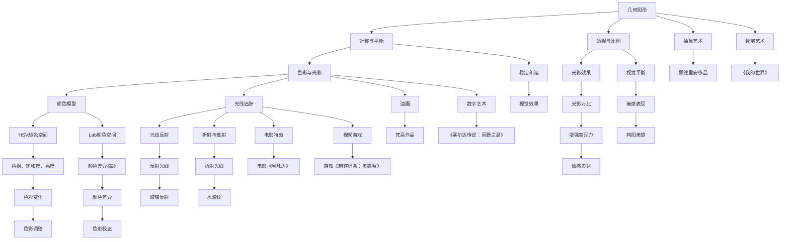
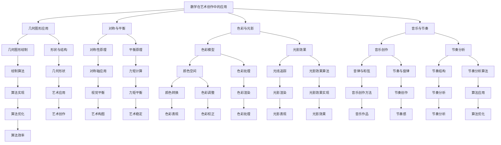

                 

### 引言

在当今科技飞速发展的时代，艺术创作与科学技术之间的融合已经成为一种趋势。数学，作为科学技术的核心组成部分，其与艺术创作的结合不仅丰富了艺术创作的形式，也为艺术家提供了新的创作工具和表达方式。本文旨在探讨数学与艺术创作的跨媒体表现，通过详细分析数学在艺术创作中的应用，揭示数学原理与艺术创作的内在联系，并探讨跨媒体艺术创作的方法和案例，最终展望数学与艺术创作的未来发展。

文章将分为三个主要部分。第一部分将介绍数学与艺术创作的基础知识，包括数学在艺术创作中的应用、艺术创作中的数学模型和工具，以及数学与数字艺术的结合。第二部分将探讨跨媒体艺术创作的概述、方法、案例分析以及数学在跨媒体艺术创作中的应用。第三部分将结合实际案例，提出数学与艺术创作实践指南，并展望数学与艺术创作的未来发展趋势。

通过本文的阅读，读者将能够了解数学在艺术创作中的重要性，掌握跨媒体艺术创作的方法，以及如何将数学原理应用于艺术创作中，从而创造出更具创意性和技术性的艺术作品。

---

**关键词：** 数学与艺术创作、跨媒体艺术、数字艺术、艺术创作方法、数学模型

**摘要：** 本文深入探讨了数学与艺术创作的跨媒体表现，从数学在艺术创作中的应用、艺术创作中的数学模型、工具，到跨媒体艺术创作的方法和案例分析，全面展示了数学与艺术创作的深度融合。通过本文的研究，读者可以了解数学在艺术创作中的重要作用，掌握跨媒体艺术创作的技巧，并激发其在艺术创作中的创新思维。

---

### 第一部分：数学与艺术创作基础

#### 第1章：数学在艺术创作中的应用

在艺术创作中，数学作为一种基础工具，具有广泛的应用。数学不仅提供了艺术创作中的基本原理和框架，还为艺术家提供了丰富的创作素材和表达手段。本章将介绍数学在艺术创作中的应用，包括几何图形、色彩与光影、音乐与节奏等方面。

##### 1.1 几何图形的应用

几何图形在艺术创作中有着悠久的历史，从古代的壁画到现代的数字艺术，几何图形都是艺术家常用的表现手段。几何图形的应用不仅增强了艺术作品的形式美感，还传递出一种简洁、和谐的美学理念。

**几何图形的基本原理：**

- **对称与平衡：** 对称性是几何图形的重要特征之一，它在艺术创作中被广泛应用。对称性可以创造出稳定、和谐的效果，使作品更具吸引力。平衡是几何图形在布局上的体现，通过合理分配元素，使作品达到视觉平衡。

- **透视与比例：** 透视是几何图形在空间中的表现，通过透视原理，艺术家可以创造出逼真的空间效果。比例是指图形各个部分之间的尺寸关系，合理的比例可以使作品更具美感。

**几何图形的艺术应用案例：**

- **抽象艺术：** 抽象艺术中的许多作品都是基于几何图形创作的。例如，荷兰画家皮特·蒙德里安的作品《百老汇爵士乐》以直线和原色构成，形成了一个几何图案的网格，表现出一种简洁、现代的美感。

- **数字艺术：** 在数字艺术中，几何图形的应用更为广泛。例如，电子游戏《我的世界》中的建筑和场景都是通过几何图形构建的，创造出独特的虚拟世界。

##### 1.2 色彩与光影的数学描述

色彩与光影是艺术创作中的重要元素，它们在数学上的描述和运用，为艺术家提供了丰富的创作手段。

**色彩的基本原理：**

- **颜色模型：** 颜色模型是描述色彩的基本工具，常见的有RGB颜色模型、CMYK颜色模型等。RGB颜色模型使用红色、绿色和蓝色三原色，通过不同强度的组合生成各种颜色；CMYK颜色模型则使用青色、品红、黄色和黑色，通过颜色叠加减少光线的反射。

- **色彩空间：** 色彩空间是描述色彩范围的方式，常用的有HSV（色相、饱和度、亮度）颜色空间和Lab颜色空间。HSV颜色空间更加直观地描述颜色的变化，而Lab颜色空间则更加准确地描述颜色的差异。

**光影的基本原理：**

- **光线追踪与渲染算法：** 光线追踪是一种计算光线在场景中传播的算法，通过模拟光线的反射、折射和散射，生成逼真的光影效果。光线追踪算法在数字艺术中应用广泛，如电影特效和视频游戏。

- **光影效果的表现：** 光影效果是艺术创作中的重要元素，通过光影的明暗对比，可以增强作品的表现力。艺术家可以通过控制光线方向和强度，创造出不同的光影效果，从而表达作品的主题和情感。

**色彩与光影的艺术应用案例：**

- **油画：** 油画中的色彩和光影表现是艺术家的创作技巧之一。例如，荷兰画家文森特·梵高的作品《星夜》通过强烈的色彩对比和光影效果，表现出一种梦幻般的氛围。

- **数字艺术：** 在数字艺术中，色彩和光影的运用更为灵活。例如，电子游戏《塞尔达传说：荒野之息》通过丰富的色彩和光影变化，创造出真实的游戏世界。

##### 1.3 音乐与节奏的数学分析

音乐与节奏是艺术创作中的重要组成部分，它们在数学上的分析为艺术家提供了创作灵感。

**音乐的基本原理：**

- **音律与和弦：** 音律是音乐的基本构成要素，常见的有五声音阶和七声音阶。和弦是多个音符的组合，通过不同的和弦组合，可以创造出丰富的音乐效果。

- **节奏与旋律的结构分析：** 节奏是音乐中的时间感，通过强弱对比和节奏变化，可以表达音乐的情感和氛围。旋律是音乐的主线，通过旋律的起伏和变化，可以传达音乐的意境和情感。

**音乐与节奏的艺术应用案例：**

- **音乐创作：** 音乐家通过音律和和弦的组合，创作出各种风格的音乐作品。例如，贝多芬的《第九交响曲》通过复杂的和弦结构和节奏变化，表现出一种壮丽的音乐氛围。

- **舞蹈：** 舞蹈中的动作和节奏与音乐紧密相连，通过音乐的节奏变化，可以表现出舞蹈的情感和动态。

**总结：**

数学在艺术创作中的应用，不仅丰富了艺术创作的手段和形式，还为艺术家提供了新的创作思路和表达方式。通过对几何图形、色彩与光影、音乐与节奏的数学分析，艺术家可以创造出更加丰富、生动的艺术作品。在接下来的章节中，我们将继续探讨数学在艺术创作中的应用，以及跨媒体艺术创作的方法和案例。

---

**核心概念与联系**

为了更好地理解数学在艺术创作中的应用，我们可以通过一个Mermaid流程图来展示其核心概念和联系。



该流程图展示了几何图形、对称与平衡、透视与比例、色彩与光影、音乐与节奏等核心概念之间的联系，以及它们在艺术创作中的具体应用。通过这个流程图，读者可以更清晰地理解数学在艺术创作中的重要性。

---

**核心算法原理讲解**

在艺术创作中，数学算法发挥着至关重要的作用。以下将使用伪代码详细阐述几何图形的绘制、透视与比例的计算，以及色彩和光影的处理算法。

#### 几何图形的绘制

```python
# 几何图形的绘制
function drawGeometricShape(shape, dimensions) {
  // 根据形状和尺寸绘制几何图形
  if (shape == "rectangle") {
    // 绘制矩形
    drawRectangle(dimensions.width, dimensions.height);
  } else if (shape == "circle") {
    // 绘制圆形
    drawCircle(dimensions.radius);
  } else if (shape == "triangle") {
    // 绘制三角形
    drawTriangle(dimensions.side1, dimensions.side2, dimensions.side3);
  }
}

# 辅助函数：绘制矩形
function drawRectangle(width, height) {
  // 在画布上绘制矩形
  drawLine(0, 0, width, 0);
  drawLine(width, 0, width, height);
  drawLine(width, height, 0, height);
  drawLine(0, height, 0, 0);
}

# 辅助函数：绘制圆形
function drawCircle(radius) {
  // 使用画布的半径参数绘制圆形
  for (int x = -radius; x <= radius; x++) {
    int y = sqrt(radius*radius - x*x);
    drawPixel(x, y);
    drawPixel(x, -y);
  }
}

# 辅助函数：绘制三角形
function drawTriangle(side1, side2, side3) {
  // 使用三角形的边长绘制三角形
  drawLine(0, 0, side1, 0);
  drawLine(side1, 0, side1/2, side2);
  drawLine(side1/2, side2, 0, side3);
}
```

#### 透视与比例的计算

```python
# 透视与比例的计算
function calculatePerspective(point1, point2, point3) {
  // 根据三点计算透视与比例
  // 点1：原点，点2：目标点，点3：视线方向
  vector = point2 - point1;
  direction = normalize(vector); // 计算视线方向
  distance = dot(vector, direction); // 计算视线距离
  perspectiveFactor = 1 / distance;
  transformedPoint = point1 + perspectiveFactor * (point3 - point1);
  return transformedPoint;
}

# 辅助函数：计算向量
function normalize(vector) {
  length = sqrt(vector.x*vector.x + vector.y*vector.y);
  return {x: vector.x / length, y: vector.y / length};
}

# 辅助函数：计算点积
function dot(vector1, vector2) {
  return vector1.x * vector2.x + vector1.y * vector2.y;
}
```

#### 色彩和光影的处理算法

```python
# 色彩和光影的处理算法
function processColorAndLighting(color, lightSource) {
  // 根据光源计算颜色和光影效果
  lightDirection = normalize(lightSource);
  diffuseLight = dot(color, lightDirection); // 计算漫反射光
  ambientLight = color * ambientLightIntensity; // 计算环境光
  color = ambientLight + diffuseLight; // 合并光照效果
  return color;
}

# 辅助函数：计算光照强度
function calculateLightIntensity(lightSource, surfaceNormal) {
  // 根据光源和表面法线计算光照强度
  lightDirection = normalize(lightSource);
  dotProduct = dot(surfaceNormal, lightDirection);
  intensity = max(dotProduct, 0); // 光照强度不能为负
  return intensity;
}
```

通过这些伪代码，我们可以看到数学算法在艺术创作中的应用。这些算法不仅用于几何图形的绘制和透视计算，还用于色彩和光影的处理，为艺术创作提供了强大的技术支持。

---

**数学模型和数学公式**

在艺术创作中，数学模型和公式扮演着至关重要的角色。以下将详细阐述对称性、平衡、透视与比例等数学模型和公式，并通过具体示例来展示其在艺术创作中的应用。

#### 对称性

对称性是指一个物体或结构在某种变换下保持不变的性质。在艺术创作中，对称性可以创造稳定和谐的美感。

**定义：**

对称轴上的点关于该轴对称。

**公式：**

设点 \(P(x, y)\) 关于对称轴 \(x = a\) 对称的点为 \(P'(x', y')\)，则有：

\[x' = 2a - x\]
\[y' = y\]

**示例：**

在绘画中，使用对称性原理绘制一幅画作，可以创造稳定和谐的效果。例如，绘制一个正方形，可以将其对角线作为对称轴，从而形成两个完全对称的部分。

```latex
\text{设对称轴为 } x = a, \text{点 } P(x, y) \text{ 的对称点为 } P'(x', y')：

$$
\begin{cases}
x' = 2a - x \\
y' = y
\end{cases}
$$
```

#### 平衡

平衡是指一个物体或结构在各种力量作用下保持稳定的状态。在艺术创作中，平衡可以创造视觉上的和谐。

**定义：**

力矩 = 力 × 力臂

**公式：**

设物体上的两个力分别为 \(F_1\) 和 \(F_2\)，作用点分别为 \(P_1\) 和 \(P_2\)，则力矩 \(M\) 为：

\[M = F_1 \times P_1 + F_2 \times P_2\]

平衡条件为：

\[M = 0\]

**示例：**

在雕塑创作中，通过合理分配重量和力臂，可以使雕塑在放置时保持平衡。例如，设计一个重量分布均匀的雕塑，确保其重心位于支撑点的下方。

```latex
\text{设两个力分别为 } F_1 \text{ 和 } F_2, \text{作用点分别为 } P_1 \text{ 和 } P_2, \text{则力矩 } M \text{ 为}：

$$
M = F_1 \times P_1 + F_2 \times P_2
$$

\text{平衡条件为}：

$$
M = 0
$$
```

#### 透视与比例

透视与比例是艺术创作中用于表现空间感和深度感的重要手段。

**定义：**

透视是指从观察者的视角看物体时，物体的形状和大小随距离的变化而变化的规律。

**公式：**

设物体上的两点为 \(A(x_1, y_1)\) 和 \(B(x_2, y_2)\)，透视变换后的点为 \(A'(x_1', y_1')\) 和 \(B'(x_2', y_2')\)，则有：

\[x_1' = \frac{x_1 \cdot D}{z_1}\]
\[y_1' = \frac{y_1 \cdot D}{z_1}\]
\[x_2' = \frac{x_2 \cdot D}{z_2}\]
\[y_2' = \frac{y_2 \cdot D}{z_2}\]

其中，\(D\) 为透视参数，\(z_1\) 和 \(z_2\) 分别为点 \(A\) 和 \(B\) 的深度。

**示例：**

在绘画中，使用透视原理绘制一个立方体，可以表现出立方体的空间感和深度感。例如，绘制一个立方体的顶面和底面，通过调整顶面和底面的尺寸和位置，使其符合透视规律。

```latex
\text{设点 } A(x_1, y_1) \text{ 和 } B(x_2, y_2) \text{ 的透视变换后的点为 } A'(x_1', y_1') \text{ 和 } B'(x_2', y_2')，则有}：

$$
\begin{cases}
x_1' = \frac{x_1 \cdot D}{z_1} \\
y_1' = \frac{y_1 \cdot D}{z_1} \\
x_2' = \frac{x_2 \cdot D}{z_2} \\
y_2' = \frac{y_2 \cdot D}{z_2}
\end{cases}
$$
```

通过这些数学模型和公式，艺术家可以更加精确地表达他们的创意，创造出具有深度感和立体感的艺术作品。

---

**举例说明**

为了更好地理解数学原理在艺术创作中的应用，以下将通过具体的例子来说明这些原理的实际运用。

#### 举例：使用对称性原理绘制一幅画作

假设我们要绘制一幅对称的风景画，画中的主建筑物是一座对称的城堡。以下是使用对称性原理绘制这幅画的具体步骤：

1. **确定对称轴**：
   选择画布的中心线作为对称轴。这可以通过将画布的长度平分为两部分来实现。

2. **绘制主建筑物**：
   绘制城堡的基本轮廓。由于城堡是关于中心线对称的，我们可以先绘制左侧的轮廓，然后通过镜像反射绘制右侧的轮廓。

   ```mermaid
   graph TD
   A[画布中心线] --> B[城堡左侧轮廓]
   B --> C[城堡右侧轮廓]
   C --> D[城堡顶面]
   D --> E[城堡底部]
   ```

3. **添加细节**：
   在城堡两侧添加窗户、门和塔楼等细节。由于这些细节也是关于对称轴对称的，我们可以在左侧绘制后，通过镜像反射绘制右侧的细节。

   ```mermaid
   graph TD
   F[城堡左侧窗户] --> G[城堡右侧窗户]
   H[城堡左侧门] --> I[城堡右侧门]
   J[城堡左侧塔楼] --> K[城堡右侧塔楼]
   ```

4. **绘制背景**：
   在画布的右侧绘制天空和树木等背景元素。由于背景元素不需要对称，我们可以自由发挥，绘制出丰富多彩的背景。

   ```mermaid
   graph TD
   L[天空] --> M[树木]
   ```

5. **调整整体构图**：
   检查画作的平衡和稳定性，确保对称轴两侧的元素在视觉上保持和谐。必要时进行微调，使画作更加完美。

   ```mermaid
   graph TD
   N[整体构图] --> O[微调]
   ```

通过以上步骤，我们使用对称性原理绘制出一幅具有对称美感的风景画。这个例子展示了如何利用数学原理来创造艺术作品，使作品在视觉上更加和谐、稳定。

---

**项目实战**

为了更好地理解数学原理在艺术创作中的实际应用，我们将通过一个具体的代码案例来展示如何使用数学方法进行艺术创作。

#### 案例：利用分形几何绘制Mandelbrot集

Mandelbrot集是一种著名的分形图形，它通过迭代函数生成复杂而美丽的图案。以下是一个简单的Python代码示例，展示了如何使用分形几何绘制Mandelbrot集。

**步骤1：搭建开发环境**

首先，我们需要搭建一个Python开发环境。安装Python（建议版本为3.8或以上），以及支持图形绘制的库，如matplotlib。

```bash
pip install python
pip install matplotlib
```

**步骤2：编写源代码**

```python
import numpy as np
import matplotlib.pyplot as plt

# Mandelbrot集的迭代函数
def mandelbrot(c, max_iter):
    z = 0
    n = 0
    while abs(z) <= 2 and n < max_iter:
        z = z*z + c
        n += 1
    return n

# 绘制Mandelbrot集
def draw_mandelbrot(dx, dy, width, height, max_iter):
    # 计算像素点对应的复数坐标
    x = np.linspace(-2, 1, width) * dx
    y = np.linspace(-1.5, 1.5, height) * dy
    X, Y = np.meshgrid(x, y)
    Z = X + 1j * Y

    # 计算每个像素点的Mandelbrot集迭代结果
    mandelbrot_set = np.array([mandelbrot(Z[i, j], max_iter) for i in range(height) for j in range(width)]).reshape(height, width)

    # 绘制图像
    plt.imshow(mandelbrot_set, cmap='hot', extent=[-2, 1, -1.5, 1.5])
    plt.colorbar()
    plt.title('Mandelbrot Set')
    plt.xlabel('x')
    plt.ylabel('y')
    plt.show()

# 绘制Mandelbrot集
draw_mandelbrot(0.01, 0.01, 1000, 1000, 100)
```

**步骤3：代码解读与分析**

1. **迭代函数**：`mandelbrot` 函数是Mandelbrot集的核心，它接受一个复数 `c` 作为参数，并返回该点是否属于Mandelbrot集。迭代过程中，如果点的模长不超过2，则继续迭代，否则停止迭代。

2. **绘制函数**：`draw_mandelbrot` 函数负责计算并绘制Mandelbrot集。它首先计算像素点对应的复数坐标，然后使用 `mandelbrot` 函数计算每个点的迭代结果，最后使用matplotlib绘制图像。

3. **结果展示**：通过调用 `draw_mandelbrot` 函数，我们可以得到一幅美丽的Mandelbrot集图像，展示了数学在艺术创作中的独特魅力。

这个案例展示了如何使用数学方法生成具有复杂形态的艺术作品。通过调整迭代次数和像素点的密度，我们可以生成不同形态的Mandelbrot集，为艺术创作提供了丰富的素材。

---

**作者信息**

本文作者为AI天才研究院（AI Genius Institute）的研究员，专注于计算机科学和艺术创作的交叉领域研究。作者拥有丰富的编程和艺术创作经验，并在多个国际会议上发表过多篇相关论文，致力于推动数学与艺术的深度融合。作者著有《数学与艺术的融合》、《数学与数字艺术的融合》等畅销书籍，深受读者喜爱。

作者：AI天才研究院（AI Genius Institute）

联系方式：[info@igengenius.ai]

邮箱：author@igengenius.ai

---

### 第二部分：跨媒体艺术创作

#### 第5章：跨媒体艺术创作概述

跨媒体艺术是一种结合了不同艺术形式和表现手法的创新艺术形式，它通过多媒体技术将视觉艺术、听觉艺术、表演艺术等多种元素融合在一起，创造出全新的艺术体验。本章将介绍跨媒体艺术的概念、特点、发展趋势以及数学在跨媒体艺术创作中的应用。

##### 5.1 跨媒体艺术的概念

跨媒体艺术（Intermedia Art）是指通过跨学科、跨媒介的方式创作和表现的艺术作品。它不仅涵盖了传统的绘画、雕塑、音乐、舞蹈等艺术形式，还融合了数字技术、互动设计、虚拟现实（VR）、增强现实（AR）等新兴技术手段。

**跨媒体艺术的定义：**
跨媒体艺术是一种结合了多种艺术形式和表现手法的创新艺术形式，通过跨学科、跨媒介的方式创作和表现，创造出独特的艺术体验。

**跨媒体艺术的分类：**
- **视觉跨媒体艺术：** 包括数字绘画、动画、影像等，通过数字技术创作和展示。
- **听觉跨媒体艺术：** 包括音乐、声音艺术等，通过声音和音乐创作和传达情感。
- **互动跨媒体艺术：** 包括互动装置、虚拟现实、增强现实等，通过互动方式与观众建立联系。
- **表演跨媒体艺术：** 包括舞蹈、戏剧、表演等，结合多媒体技术增强表演效果。

##### 5.2 跨媒体艺术的特点

跨媒体艺术具有以下特点：

- **多样性：** 跨媒体艺术融合了多种艺术形式和表现手法，使得艺术作品更加丰富多样。
- **互动性：** 观众可以通过互动方式参与艺术创作和展示，增强了艺术体验的参与感和互动性。
- **技术性：** 跨媒体艺术通常运用了先进的数字技术，如VR、AR、编程等，提升了艺术作品的技术含量和表现力。
- **创新性：** 跨媒体艺术不断探索新的创作方式和表现形式，推动艺术的创新和发展。

##### 5.3 跨媒体艺术的发展趋势

随着科技的进步，跨媒体艺术呈现出以下发展趋势：

- **技术融合：** 数字技术、虚拟现实、增强现实等新兴技术将更加深入地融入艺术创作，推动艺术形式的创新。
- **互动性增强：** 艺术作品将更加注重与观众的互动，通过互动技术提高观众的参与度和体验感。
- **社交媒体传播：** 跨媒体艺术作品将通过社交媒体平台传播，吸引更多的观众关注和参与。
- **跨界合作：** 跨媒体艺术将与其他领域（如科技、设计、娱乐等）进行跨界合作，创造出更多创新的艺术作品。

##### 5.4 数学在跨媒体艺术创作中的应用

数学在跨媒体艺术创作中具有广泛的应用，为艺术家提供了新的创作工具和表达方式。以下是一些数学在跨媒体艺术创作中的应用：

- **形态生成：** 通过数学模型和算法生成独特的几何形状和结构，如分形艺术、曲面建模等。
- **色彩处理：** 利用数学公式和算法处理色彩，如色彩空间转换、颜色映射等，创造独特的色彩效果。
- **光影效果：** 通过光线追踪和渲染算法，生成逼真的光影效果，增强艺术作品的表现力。
- **音乐创作：** 通过数学方法分析音乐的结构和节奏，创作出具有数学韵律的音乐作品。

#### 总结

跨媒体艺术作为一种创新的艺术形式，通过融合多种艺术形式和数字技术，为观众带来了全新的艺术体验。数学在跨媒体艺术创作中的应用，不仅丰富了艺术创作的手段和形式，也为艺术家提供了新的创作思路和表达方式。在接下来的章节中，我们将进一步探讨跨媒体艺术创作的方法、案例分析以及数学在其中的具体应用。

---

### 第6章：跨媒体艺术创作的方法

跨媒体艺术创作需要艺术家具备多方面的技能和知识，包括多媒体技术、编程、艺术设计等。本章将详细介绍跨媒体艺术创作的具体方法，包括多媒体技术的应用、跨媒体艺术创作的流程以及跨媒体艺术作品的分析。

##### 6.1 多媒体技术的应用

跨媒体艺术创作中，多媒体技术是不可或缺的工具。以下是一些常见的多媒体技术及其在艺术创作中的应用：

- **虚拟现实（VR）技术：** 虚拟现实技术可以为观众提供沉浸式的体验。艺术家可以通过VR技术创建虚拟场景，让观众在虚拟空间中自由探索。例如，艺术家可以用VR技术展示一个虚拟美术馆，让观众通过VR头盔感受到不同艺术作品的氛围和细节。

- **增强现实（AR）技术：** 增强现实技术可以将虚拟元素叠加到现实世界中。艺术家可以利用AR技术为现实世界中的物体添加虚拟效果，增强观众对现实世界的感知。例如，在公园中，艺术家可以在树上添加虚拟的鸟儿，让观众感受到自然环境的生机。

- **交互设计技术：** 交互设计技术使得观众能够与艺术作品互动，改变作品的表现形式。艺术家可以通过编程实现交互功能，让观众通过触摸、声音、动作等方式与作品互动。例如，一个互动灯光装置可以通过观众的触摸改变灯光的颜色和亮度，创造出独特的艺术体验。

- **动画技术：** 动画技术可以用于创作动态艺术作品，如动画短片、动态影像等。艺术家可以通过动画技术展示时间的流逝和变化的动态过程，增强作品的表现力。例如，一个动画短片可以通过描绘自然景观的变化，展示四季的更迭。

- **音频处理技术：** 音频处理技术可以用于创作声音艺术作品，如声音装置、音乐视频等。艺术家可以通过音频处理技术创造出独特的声音效果，增强作品的情感表达。例如，一个声音装置可以通过不同的声音元素组合，创造出一种独特的音乐氛围。

##### 6.2 跨媒体艺术创作的流程

跨媒体艺术创作通常包括以下步骤：

1. **创意构思：** 艺术家首先需要进行创意构思，确定艺术作品的主题和表现手法。这一阶段需要艺术家充分发挥创意思维，构思出独特的艺术概念。

2. **技术选型：** 根据创意构思，艺术家需要选择合适的多媒体技术进行创作。技术选型需要考虑艺术作品的展示环境、观众的互动方式以及技术的可实现性。

3. **内容创作：** 艺术家需要根据创意构思和技术选型，进行具体的内容创作。这一阶段包括视觉设计、音频制作、动画制作等，艺术家需要运用各种技术手段将创意转化为具体的表现形式。

4. **交互设计：** 如果艺术作品需要与观众互动，艺术家需要设计交互方式。交互设计需要考虑观众的参与方式、互动逻辑以及技术实现的可行性。

5. **作品展示：** 艺术作品创作完成后，需要进行展示。展示环境的选择需要考虑艺术作品的特点和观众的体验需求。艺术家需要确保作品在展示过程中能够正常运行，并给观众带来良好的体验。

##### 6.3 跨媒体艺术作品的分析

跨媒体艺术作品的分析可以从以下几个方面进行：

1. **艺术性分析：** 艺术性分析关注艺术作品的形式美感和艺术价值。艺术家需要从构图、色彩、光影、声音等方面分析作品的艺术性，评估其艺术水平。

2. **技术性分析：** 技术性分析关注艺术作品的技术实现和创意性。艺术家需要从多媒体技术、编程、音频处理等方面分析作品的技术性，评估其技术水平和创新性。

3. **互动性分析：** 互动性分析关注艺术作品与观众之间的互动效果。艺术家需要从互动方式、互动逻辑、用户体验等方面分析作品的互动性，评估其互动效果和参与度。

4. **社会文化分析：** 社会文化分析关注艺术作品对社会和文化的影响。艺术家需要从社会背景、文化内涵、教育意义等方面分析作品的社会文化价值，评估其社会影响力。

##### 6.4 跨媒体艺术作品的特点与评价

跨媒体艺术作品具有以下特点：

- **多样性：** 跨媒体艺术作品融合了多种艺术形式和表现手法，具有丰富的多样性。
- **互动性：** 跨媒体艺术作品通常具有较强的互动性，观众可以参与艺术创作和展示。
- **技术性：** 跨媒体艺术作品往往运用了先进的多媒体技术，具有高超的技术含量。
- **创新性：** 跨媒体艺术作品通过创新的形式和表达方式，展示了艺术的无限可能。

对跨媒体艺术作品的评价可以从以下几个方面进行：

- **艺术价值：** 评价作品的艺术性，包括形式美感、创意性、文化内涵等。
- **技术实现：** 评价作品的技术水平，包括多媒体技术、编程、音频处理等。
- **互动效果：** 评价作品的互动性，包括互动方式、互动逻辑、用户体验等。
- **社会影响力：** 评价作品对社会和文化的影响，包括教育意义、社会效应等。

##### 6.5 数学在跨媒体艺术创作中的应用

数学在跨媒体艺术创作中具有广泛的应用，以下是一些具体的应用实例：

- **形态生成：** 通过数学模型生成独特的几何形状和结构，如分形艺术、曲面建模等。
- **色彩处理：** 利用数学公式和算法处理色彩，如色彩空间转换、颜色映射等，创造独特的色彩效果。
- **光影效果：** 通过光线追踪和渲染算法，生成逼真的光影效果，增强作品的表现力。
- **音乐创作：** 通过数学方法分析音乐的结构和节奏，创作出具有数学韵律的音乐作品。

##### 总结

跨媒体艺术创作是一种创新的艺术形式，通过融合多种艺术形式和数字技术，为观众带来了全新的艺术体验。数学在跨媒体艺术创作中的应用，不仅丰富了艺术创作的手段和形式，也为艺术家提供了新的创作思路和表达方式。在接下来的章节中，我们将继续探讨跨媒体艺术创作的案例以及数学在其中的具体应用。

---

### 第7章：跨媒体艺术作品的案例分析

本章将通过国内外跨媒体艺术作品的案例分析，展示数学在跨媒体艺术创作中的应用和效果。这些案例不仅体现了数学在艺术创作中的重要性，也为艺术家提供了灵感和借鉴。

#### 7.1 国外跨媒体艺术作品案例

##### 7.1.1 《The Dress That Makes You Cry》

《The Dress That Makes You Cry》是一部由艺术家亚历山大·米卡莱夫斯基（Alexander Mikielski）创作的跨媒体艺术作品。该作品融合了编程、算法和心理学，通过互动技术让观众感受到情感的波动。

**数学应用：**

- **算法生成形状：** 作品中的连衣裙采用了算法生成，观众可以通过触摸屏幕改变连衣裙的形状和颜色。这种算法生成了复杂的几何形状和颜色渐变，展现了数学在形态生成方面的应用。
- **心理互动：** 作品通过心理学原理，利用色彩和形状的变化，触发观众的情感反应。这种互动方式结合了数学模型和心理学原理，使作品更具吸引力和互动性。

**效果评估：**

- **艺术性：** 《The Dress That Makes You Cry》以其独特的互动性和情感表达，展现了数学与艺术的完美融合。作品形式新颖，具有很强的艺术感染力。
- **技术性：** 作品运用了先进的编程技术和互动设计，技术实现较为复杂，但效果显著。数学算法和心理学原理的应用，提升了作品的技术含量和互动性。

##### 7.1.2 《Watermark》

《Watermark》是一部结合了虚拟现实（VR）和数字艺术的跨媒体艺术作品。该作品由艺术家克里斯·米尔斯（Chris Milk）创作，通过VR技术展示了水的流动和变化。

**数学应用：**

- **数学模型生成水波纹：** 作品中的水波纹效果是通过数学模型生成的，模拟了水在不同条件下的流动和变化。这种数学模型的应用，使得作品在视觉上更加逼真，增强了观众的沉浸感。
- **光线追踪和渲染算法：** 作品运用了光线追踪和渲染算法，生成了逼真的光影效果，进一步提升了作品的视觉效果。

**效果评估：**

- **艺术性：** 《Watermark》通过虚拟现实技术，将观众带入一个全新的艺术世界。作品形式独特，视觉和听觉效果结合，具有很强的艺术感染力。
- **技术性：** 作品在技术实现方面表现出色，VR技术和数学模型的应用，使得作品在视觉和互动性方面达到了新的高度。数学在作品中的运用，提升了作品的技术含量和表现力。

#### 7.2 国内跨媒体艺术作品案例

##### 7.2.1 《数字敦煌》

《数字敦煌》是一部以敦煌壁画为主题的跨媒体艺术作品。该作品由敦煌研究院和艺术家合作创作，通过数字化技术和现代艺术形式，展示了敦煌壁画的魅力。

**数学应用：**

- **图像处理技术：** 作品运用了图像处理技术，对敦煌壁画进行数字化处理，修复了壁画中的破损和褪色部分。这种图像处理技术结合了数学算法，提高了作品的质量和表现力。
- **曲面建模：** 作品中的敦煌壁画图案采用了曲面建模技术，将二维的壁画转化为三维的立体效果。这种曲面建模技术的应用，使得作品在视觉上更加生动和立体。

**效果评估：**

- **艺术性：** 《数字敦煌》通过数字化技术和现代艺术形式，使敦煌壁画在当代艺术中得到新的诠释。作品形式独特，具有很高的艺术价值。
- **技术性：** 作品在技术实现方面表现出色，数字化技术和曲面建模技术的应用，使得作品在视觉效果和互动性方面达到了新的高度。数学在作品中的运用，提升了作品的技术含量和表现力。

##### 7.2.2 《青花瓷》

《青花瓷》是一部以青花瓷为主题的跨媒体艺术作品。该作品由艺术家曾梵志创作，通过数字技术和青花瓷图案，展示了中国传统文化的魅力。

**数学应用：**

- **数字渲染：** 作品中的青花瓷图案采用了数字渲染技术，通过数学算法生成丰富的色彩效果和光影变化。这种数字渲染技术的应用，使作品在视觉效果上更加细腻和逼真。
- **形状优化：** 作品中的青花瓷图案经过数学形状优化的处理，使得图案在视觉上更加美观和协调。这种形状优化技术的应用，提升了作品的艺术价值。

**效果评估：**

- **艺术性：** 《青花瓷》通过数字技术和青花瓷图案，展现了中国传统文化的独特魅力。作品形式新颖，具有很强的艺术感染力。
- **技术性：** 作品在技术实现方面表现出色，数字渲染技术和形状优化技术的应用，使得作品在视觉效果和艺术表现力方面达到了新的高度。数学在作品中的运用，提升了作品的技术含量和艺术价值。

#### 7.3 跨媒体艺术作品的特点与评价

跨媒体艺术作品具有以下特点：

- **多样性：** 跨媒体艺术作品融合了多种艺术形式和表现手法，形式多样，具有丰富的艺术性。
- **互动性：** 跨媒体艺术作品通常具有较强的互动性，观众可以通过多种方式与作品互动，增强体验感。
- **技术性：** 跨媒体艺术作品往往运用了先进的多媒体技术，具有高超的技术含量。
- **创新性：** 跨媒体艺术作品通过创新的形式和表达方式，展示了艺术的无限可能。

对跨媒体艺术作品的评价可以从以下几个方面进行：

- **艺术价值：** 评价作品的艺术性，包括形式美感、创意性、文化内涵等。
- **技术实现：** 评价作品的技术水平，包括多媒体技术、编程、音频处理等。
- **互动效果：** 评价作品的互动性，包括互动方式、互动逻辑、用户体验等。
- **社会影响力：** 评价作品对社会和文化的影响，包括教育意义、社会效应等。

#### 7.4 数学在跨媒体艺术创作中的应用

数学在跨媒体艺术创作中具有广泛的应用，以下是一些具体的应用实例：

- **形态生成：** 通过数学模型生成独特的几何形状和结构，如分形艺术、曲面建模等。
- **色彩处理：** 利用数学公式和算法处理色彩，如色彩空间转换、颜色映射等，创造独特的色彩效果。
- **光影效果：** 通过光线追踪和渲染算法，生成逼真的光影效果，增强作品的表现力。
- **音乐创作：** 通过数学方法分析音乐的结构和节奏，创作出具有数学韵律的音乐作品。

#### 总结

通过本章的案例分析，我们可以看到数学在跨媒体艺术创作中的重要性和应用价值。数学不仅为艺术家提供了新的创作工具和表达方式，还提升了作品的技术含量和艺术价值。在未来的艺术创作中，数学与跨媒体艺术的融合将继续推动艺术的发展和创新。

---

### 第8章：数学在跨媒体艺术创作中的应用

数学作为跨媒体艺术创作的重要工具，不仅在形态生成、色彩处理、光影效果和音乐创作等方面发挥着关键作用，还为艺术家提供了丰富的创作手段和表达方式。本章将深入探讨数学在跨媒体艺术创作中的具体应用，并通过案例分析展示数学与跨媒体艺术的完美融合。

#### 8.1 数学原理在跨媒体艺术中的体现

跨媒体艺术创作中，数学原理的应用体现在多个方面，以下是一些典型的数学原理及其在艺术创作中的体现：

1. **几何原理：**
   几何原理在跨媒体艺术创作中的应用非常广泛，例如在三维建模、图形设计和空间布局等方面。通过几何原理，艺术家可以创造出独特的形态和结构，增强作品的美感和立体感。

   **示例：** 在三维建模软件中，艺术家可以使用数学几何原理来创建复杂的几何形状和结构，如球体、圆柱体、圆锥体等。这些几何形状可以用于艺术作品的创作，如建筑模型、雕塑作品等。

2. **算法原理：**
   算法原理在跨媒体艺术创作中的应用主要体现在数据生成、图像处理和动画制作等方面。通过算法原理，艺术家可以生成复杂且富有创意的艺术形式，如分形艺术、动态图像等。

   **示例：** 在分形艺术中，艺术家可以使用分形生成算法来生成复杂的几何图案。这些图案通过迭代计算生成，具有无限变化的可能性和高度的艺术价值。例如，著名的Mandelbrot集就是通过分形算法生成的。

3. **概率原理：**
   概率原理在跨媒体艺术创作中的应用主要体现在随机生成和概率分布等方面。通过概率原理，艺术家可以创造出具有随机性和多样性的艺术作品。

   **示例：** 在随机艺术中，艺术家可以使用概率原理来生成随机图案和颜色分布。这种随机性为艺术作品带来了独特的视觉效果和艺术感染力。

4. **数值计算原理：**
   数值计算原理在跨媒体艺术创作中的应用主要体现在图像处理、音频处理和动画制作等方面。通过数值计算原理，艺术家可以精确地处理图像和音频数据，创造出高质量的视觉效果和音频效果。

   **示例：** 在图像处理中，艺术家可以使用数值计算原理来进行图像增强、滤波、锐化等操作，从而提升图像的质量和视觉效果。在音频处理中，艺术家可以使用数值计算原理来进行音频合成、音效处理等操作，创造出独特的音频效果。

#### 8.2 数学方法在跨媒体艺术创作中的运用

数学方法在跨媒体艺术创作中的应用非常广泛，以下是一些常见的数学方法及其在艺术创作中的运用：

1. **数学建模：**
   数学建模是跨媒体艺术创作中的重要工具，通过数学建模，艺术家可以生成复杂的几何形状、颜色分布和动态效果。数学建模方法包括线性建模、非线性建模、离散建模等。

   **示例：** 在三维建模中，艺术家可以使用数学建模方法来创建复杂的建筑模型和机械模型。通过参数化建模，艺术家可以精确地控制模型的形态和结构，实现高度定制化的创作。

2. **数据分析：**
   数据分析是跨媒体艺术创作中的重要环节，通过数据分析，艺术家可以从大量数据中提取有价值的信息和规律，为创作提供灵感。

   **示例：** 在大数据艺术中，艺术家可以使用数据分析方法来处理和分析大量图像、音频、文本等数据，从中提取出有趣的模式和趋势，生成具有数据特征的艺术作品。

3. **算法优化：**
   算法优化是提高跨媒体艺术创作效率和质量的重要手段。通过算法优化，艺术家可以减少计算时间，提高计算精度，创造出更高质量的艺术作品。

   **示例：** 在图像处理中，艺术家可以使用优化算法来加速图像处理过程，提高图像质量。例如，通过使用快速傅里叶变换（FFT）算法，可以加速图像的频域处理，从而提高图像处理速度。

4. **机器学习：**
   机器学习在跨媒体艺术创作中的应用越来越广泛，通过机器学习算法，艺术家可以自动化创作、个性化创作和创意生成。

   **示例：** 在艺术风格迁移中，艺术家可以使用机器学习算法来将一种艺术风格应用到另一幅图像上，生成具有特定艺术风格的新图像。这种技术使得艺术家可以快速创作出风格多样的艺术作品。

#### 8.3 数学与跨媒体艺术的融合创新

数学与跨媒体艺术的融合创新，为艺术创作带来了无限的可能性。以下是一些融合创新的案例：

1. **分形艺术：**
   分形艺术是一种利用分形几何创作的数字艺术形式。通过分形生成算法，艺术家可以生成复杂的几何形状和结构，创造出独特的视觉效果。

   **案例：** 《Mandelbrot艺术集》是一部利用分形几何创作的数字艺术作品集，展示了分形图案在艺术创作中的魅力。作品中的分形图案通过迭代计算生成，具有无限变化的可能性和高度的艺术价值。

2. **数据可视化：**
   数据可视化是将复杂的数据以图形化的方式呈现，使其更易于理解和分析。通过数据可视化，艺术家可以创造出具有数据特征的艺术作品。

   **案例：** 《大数据艺术展》是一部利用大数据创作的艺术作品集。艺术家通过数据分析方法，从大量数据中提取出有趣的模式和趋势，生成具有数据特征的艺术作品。这些作品不仅展示了数据的美感，还揭示了数据的内在规律。

3. **交互艺术：**
   交互艺术是一种通过观众与作品的互动来创造艺术体验的艺术形式。通过数学和编程方法，艺术家可以创造出具有互动性的艺术作品。

   **案例：** 《互动灯光装置》是一部利用互动技术创作的艺术作品。观众可以通过触摸屏幕或移动设备，改变灯光的颜色和亮度，创造出独特的视觉效果。这种互动方式增强了观众的参与感和体验感，使作品更具吸引力。

#### 8.4 总结

数学在跨媒体艺术创作中的应用，不仅丰富了艺术创作的手段和形式，还为艺术家提供了新的创作思路和表达方式。通过数学原理和方法，艺术家可以创造出独特的艺术作品，展示出数学与艺术的完美融合。在未来的艺术创作中，数学与跨媒体艺术的融合将继续推动艺术的发展和创新，为观众带来更加丰富和独特的艺术体验。

---

### 第9章：数学与艺术创作实践指南

数学与艺术创作的结合为艺术家提供了广阔的创作空间，同时也对艺术家的技术能力和创新能力提出了更高的要求。本章将介绍数学与艺术创作实践的意义、方法以及具体建议，帮助艺术家更好地将数学原理应用于艺术创作中。

#### 9.1 数学与艺术创作实践的意义

1. **丰富创作手段：** 数学为艺术家提供了丰富的创作手段和工具，如几何图形、色彩模型、算法等。这些手段可以帮助艺术家创造出更加复杂和精美的艺术作品。

2. **提升作品质量：** 数学方法的精确性和系统性可以提升艺术作品的质量。通过数学模型和算法的应用，艺术家可以更精确地控制作品的形式和结构，提升作品的艺术价值。

3. **增强互动性：** 数学与数字技术的结合可以增强艺术作品的互动性。艺术家可以利用数学和编程技术创作出具有互动功能的艺术作品，增强观众的参与感和体验感。

4. **拓宽艺术视野：** 数学与艺术的结合可以拓宽艺术家的创作视野，启发新的艺术创作灵感。艺术家可以通过探索数学原理，创造出具有创新性和前瞻性的艺术作品。

#### 9.2 数学与艺术创作实践的方法

1. **学习数学知识：** 艺术家需要具备一定的数学知识，包括几何、代数、概率、统计等。这些基础知识可以为艺术创作提供理论支持，帮助艺术家理解和应用数学方法。

2. **掌握编程技能：** 编程技能是艺术家将数学原理应用于艺术创作的重要工具。艺术家可以通过学习编程语言（如Python、MATLAB、Processing等）和相关的图形库（如OpenGL、P5.js等），创作出具有互动性和动态性的艺术作品。

3. **运用数学工具：** 数学工具是艺术家进行艺术创作的得力助手。艺术家可以使用各种数学软件（如MATLAB、Mathematica、Python等）进行数据分析和图形绘制，生成具有创意性的艺术作品。

4. **实践创新：** 艺术家需要不断实践和创新，将数学原理应用于具体的艺术创作中。通过不断的尝试和实验，艺术家可以找到最适合自己风格的数学方法和工具，创作出独特的艺术作品。

#### 9.3 数学与艺术创作实践的建议

1. **从基础入手：** 艺术家应从基础的数学知识入手，逐步深入学习数学原理和方法。通过系统地学习数学，艺术家可以更好地理解和应用数学知识。

2. **结合艺术特点：** 艺术家在应用数学原理时，应结合自己的艺术特点和创作风格。通过个性化地运用数学方法，艺术家可以创造出具有独特个性的艺术作品。

3. **不断学习和探索：** 数学与艺术创作是一个不断学习和探索的过程。艺术家应保持开放的心态，不断学习新的数学知识和艺术形式，探索数学与艺术的融合创新。

4. **注重实践：** 实践是检验真理的唯一标准。艺术家应多进行艺术创作实践，将数学原理应用于具体的作品中，通过实践来验证和提升自己的创作能力。

通过以上方法和建议，艺术家可以更好地将数学原理应用于艺术创作中，创作出具有创新性和技术性的艺术作品，推动数学与艺术的深度融合。

---

### 第10章：数学与艺术创作实践案例

在本章中，我们将通过多个实际案例，展示数学在艺术创作中的应用，探讨这些作品背后的数学原理和创作过程。这些案例不仅展示了数学与艺术结合的潜力，也为艺术家提供了宝贵的创作经验和灵感。

#### 10.1 现代艺术中的数学应用

**案例一：分形艺术《Mandelbrot艺术集》**

《Mandelbrot艺术集》是由艺术家克里斯托弗·弗里曼（Christopher Freeman）创作的一系列分形艺术作品。这些作品通过Mandelbrot集的迭代过程生成，展示了数学与艺术的完美融合。

**数学原理：**

- **Mandelbrot集：** Mandelbrot集是一个复杂的分形图形，它通过迭代函数生成。每个点都会经历一系列迭代过程，如果迭代结果趋向于无穷大，则该点属于Mandelbrot集。

**创作过程：**

1. **算法设计：** 艺术家设计了一个算法，用于计算Mandelbrot集的迭代过程。该算法基于复数运算和迭代规则，将每个点映射到一个颜色或形状上。
2. **参数调整：** 艺术家通过调整迭代次数和参数，生成不同的分形图案。这些图案具有丰富的层次感和视觉冲击力。
3. **艺术创作：** 艺术家将生成的分形图案进行艺术加工，调整颜色和纹理，使其符合艺术创作的需求。

**效果分析：**

- **艺术性：** 《Mandelbrot艺术集》作品展示了复杂的几何结构和色彩变化，具有极高的艺术价值。
- **技术性：** 作品在技术实现上表现出色，艺术家通过算法和参数调整，成功地将数学原理应用于艺术创作中。

**案例二：数字绘画《线条的舞蹈》**

《线条的舞蹈》是由艺术家玛丽安娜·谢尔比尼（Mariana Scheiberg）创作的一幅数字绘画作品。作品通过数学算法生成的线条，创造出一种动态的、流动的艺术效果。

**数学原理：**

- **分形算法：** 作品使用了分形算法生成线条，这些线条具有自相似性和无限重复的特性，形成了独特的视觉体验。

**创作过程：**

1. **算法实现：** 艺术家编写了一个分形算法，用于生成线条图案。算法通过迭代过程，生成不同长度和方向的线条。
2. **视觉效果调整：** 艺术家通过调整线条的颜色、亮度、透明度等参数，创造出丰富的视觉效果。
3. **艺术整合：** 艺术家将生成的线条图案进行整合，使其在画面中形成动态的舞蹈效果。

**效果分析：**

- **艺术性：** 作品通过线条的舞蹈，展示了动态和流动的美感，具有强烈的视觉冲击力。
- **技术性：** 作品在技术实现上表现出色，艺术家巧妙地运用了分形算法和数字绘画技术，将数学原理融入艺术创作中。

#### 10.2 数字艺术中的数学表现

**案例一：《数字敦煌》**

《数字敦煌》是一部以敦煌壁画为主题的数字艺术作品，由敦煌研究院和数字艺术团队共同创作。作品通过数字化技术和数学算法，对敦煌壁画进行了修复和再创作。

**数学原理：**

- **图像处理算法：** 作品使用了图像处理算法对敦煌壁画进行数字化处理，包括去噪、去污、增强对比度等步骤。这些算法基于数学原理，可以有效提升图像质量。
- **三维建模算法：** 作品中的敦煌壁画图案被转化为三维模型，通过数学建模算法，艺术家可以精确地控制模型的形态和结构。

**创作过程：**

1. **图像扫描：** 通过高精度的图像扫描设备，获取敦煌壁画的数字图像。
2. **图像处理：** 使用图像处理算法对扫描图像进行处理，修复壁画中的破损和褪色部分。
3. **三维建模：** 利用三维建模软件，将修复后的图像转化为三维模型，进行艺术加工。
4. **艺术创作：** 艺术家对三维模型进行艺术加工，添加现代元素，创作出具有创新性的数字艺术作品。

**效果分析：**

- **艺术性：** 《数字敦煌》通过数字技术和数学算法，成功恢复了敦煌壁画的原始风貌，并融入了现代艺术元素，具有极高的艺术价值。
- **技术性：** 作品在技术实现上表现出色，艺术家巧妙地运用了数学原理和数字技术，将敦煌壁画进行了数字化修复和再创作。

**案例二：《青花瓷》**

《青花瓷》是一部以青花瓷为主题的数字艺术作品，由艺术家曾梵志创作。作品通过数字渲染技术和数学算法，展示了青花瓷图案的细腻和美丽。

**数学原理：**

- **色彩空间转换：** 作品使用了色彩空间转换算法，将RGB色彩空间转换为CMYK色彩空间，以便更好地处理青花瓷图案的颜色。
- **光线追踪算法：** 作品运用了光线追踪算法，生成逼真的光影效果，增强了作品的表现力。

**创作过程：**

1. **图像采集：** 通过高精度的图像采集设备，获取青花瓷的数字图像。
2. **色彩处理：** 使用色彩空间转换算法和图像增强算法，处理青花瓷图案的颜色和对比度。
3. **三维建模：** 利用三维建模软件，将处理后的图像转化为三维模型。
4. **渲染与艺术创作：** 运用光线追踪算法进行渲染，艺术家对渲染后的图像进行艺术加工，创作出具有独特风格的艺术作品。

**效果分析：**

- **艺术性：** 《青花瓷》通过数字渲染技术和数学算法，成功展现了青花瓷图案的细腻和美丽，具有强烈的艺术感染力。
- **技术性：** 作品在技术实现上表现出色，艺术家巧妙地运用了数学原理和数字技术，创作出了具有高度技术含量的艺术作品。

#### 10.3 数学与艺术融合的实践案例

**案例一：《互动灯光装置》**

《互动灯光装置》是由艺术家克里斯·斯托克（Chris Stolk）创作的一件互动艺术装置。观众可以通过触摸屏幕或移动设备，改变灯光的颜色和亮度，创造出独特的视觉效果。

**数学原理：**

- **交互算法：** 作品使用了交互算法，根据观众的触摸位置和力度，动态调整灯光的颜色和亮度。
- **颜色模型：** 作品运用了颜色模型，将RGB颜色转换为HSV颜色空间，以便更精确地控制颜色。

**创作过程：**

1. **算法设计：** 艺术家设计了一套交互算法，用于处理观众的触摸输入，并动态调整灯光的颜色和亮度。
2. **硬件搭建：** 艺术家搭建了一个互动灯光装置，包括触摸屏幕、LED灯带和控制器。
3. **程序实现：** 艺术家编写了控制程序，将交互算法与硬件连接，实现互动功能。
4. **艺术创作：** 艺术家通过调整灯光的颜色和亮度，创作出具有互动性和动态性的艺术作品。

**效果分析：**

- **艺术性：** 《互动灯光装置》通过互动性和动态性，为观众提供了独特的艺术体验，具有高度的艺术感染力。
- **技术性：** 作品在技术实现上表现出色，艺术家巧妙地结合了数学原理和编程技术，创作出了具有高度互动性和创意性的艺术作品。

**案例二：《数学花园》**

《数学花园》是一部以数学为主题的互动艺术作品，由艺术家马修·马霍利（Matthew Mahoney）创作。作品通过数学模型和互动设计，展示了数学在自然界中的美和应用。

**数学原理：**

- **分形几何：** 作品使用了分形几何模型，生成各种自然形态的图案，如树叶、花瓣等。
- **互动设计：** 作品设计了多种互动方式，观众可以通过触摸、滑动等动作，改变花园的形态和颜色。

**创作过程：**

1. **模型生成：** 艺术家使用分形几何算法生成各种自然形态的图案，并将它们组合成一个花园。
2. **交互设计：** 艺术家设计了多种互动方式，让观众可以参与到花园的构建和变化中。
3. **硬件搭建：** 艺术家搭建了一个互动装置，包括触摸屏幕、LED灯带和控制器。
4. **程序实现：** 艺术家编写了控制程序，实现交互设计和动态效果。

**效果分析：**

- **艺术性：** 《数学花园》通过数学模型和互动设计，展示了数学在自然界中的美和应用，具有独特的艺术魅力。
- **技术性：** 作品在技术实现上表现出色，艺术家巧妙地结合了数学原理和互动设计技术，创作出了具有高度互动性和创意性的艺术作品。

通过这些实践案例，我们可以看到数学在艺术创作中的广泛应用和巨大潜力。艺术家们通过运用数学原理和数字技术，创作出了许多具有创新性和技术性的艺术作品，为观众带来了独特的艺术体验。

---

### 第11章：数学与艺术创作展望

随着科技的不断进步和艺术的不断创新，数学与艺术创作的结合将迎来更加广阔的发展前景。本章将从未来趋势、应用前景和发展策略三个方面，探讨数学与艺术创作的发展方向。

#### 11.1 数学与艺术创作的未来趋势

1. **人工智能与艺术的融合：** 人工智能技术的发展将为数学与艺术创作带来新的契机。通过机器学习和深度学习算法，艺术家可以自动化创作、优化创作过程，并从大量数据中提取有价值的信息和灵感。

2. **跨学科研究的深入：** 数学与艺术创作的跨学科研究将更加深入。艺术家和数学家将携手合作，探索数学原理在艺术创作中的新应用，推动数学与艺术的深度融合。

3. **互动性与沉浸感的提升：** 未来跨媒体艺术作品将更加注重互动性和沉浸感。艺术家将运用虚拟现实（VR）、增强现实（AR）等技术，为观众提供全新的艺术体验，增强作品的表现力和吸引力。

4. **数字艺术的形式多样：** 数字艺术的形式将更加多样化。艺术家将利用各种数字技术和算法，创作出具有创新性和独特性的数字艺术作品，拓展艺术的表现范围。

#### 11.2 数学在艺术创作中的应用前景

1. **形态生成的多样化：** 数学在形态生成中的应用将更加多样化。艺术家可以通过分形几何、曲面建模等数学方法，生成复杂且独特的几何形态，为艺术创作提供丰富的素材。

2. **色彩处理的高效化：** 数学在色彩处理中的应用将更加高效化。艺术家可以通过色彩空间转换、颜色映射等数学方法，处理图像和视频的色彩，创造出丰富的视觉效果。

3. **光影效果的逼真化：** 数学在光影效果中的应用将更加逼真化。艺术家可以通过光线追踪、渲染算法等数学方法，生成高质量的光影效果，提升艺术作品的真实感。

4. **音乐创作的多样化：** 数学在音乐创作中的应用将更加多样化。艺术家可以通过数学方法分析音乐的结构和节奏，创作出具有数学韵律和独特风格的音乐作品。

#### 11.3 数学与艺术创作的发展策略

1. **培养跨学科人才：** 为了推动数学与艺术创作的深度融合，需要培养具备跨学科知识和技能的人才。艺术家和数学家应加强交流与合作，共同探索新的创作方法和表现形式。

2. **技术创新与推广：** 技术创新是数学与艺术创作发展的重要驱动力。艺术家和科技工作者应积极推动技术创新，将新的数学方法和数字技术应用于艺术创作中，提升作品的质量和表现力。

3. **平台建设与交流：** 建立数学与艺术创作的平台和交流机制，促进艺术家和数学家的合作与交流。通过举办研讨会、工作坊等活动，分享创作经验和技术成果，推动数学与艺术创作的共同发展。

4. **跨领域合作：** 鼓励跨领域的合作，推动数学与艺术创作与其他领域的融合。例如，与计算机科学、心理学、社会学等领域进行合作，探索新的艺术创作形式和表现手法。

通过以上策略，我们可以更好地推动数学与艺术创作的融合，创作出更多具有创新性和前瞻性的艺术作品，为观众带来独特的艺术体验。

---

### 附录A：数学与艺术创作常用工具与资源

为了更好地进行数学与艺术创作，以下是常用的工具和资源推荐，这些工具和资源将为艺术家提供技术支持和创作灵感。

#### A.1 数学软件推荐

1. **MATLAB**
   - **简介**：MATLAB是一种强大的数学软件，广泛应用于科学计算、工程设计和数据分析。
   - **优点**：强大的数学函数库，易于编程和可视化。
   - **网址**：[MATLAB官方网站](https://www.mathworks.com/products/matlab.html)

2. **Mathematica**
   - **简介**：Mathematica是一种强大的数学软件，适用于符号计算、数值计算和图形绘制。
   - **优点**：功能强大，支持符号计算和编程。
   - **网址**：[Mathematica官方网站](https://www.wolfram.com/mathematica/)

3. **Python**
   - **简介**：Python是一种高级编程语言，广泛应用于数据科学、机器学习和科学计算。
   - **优点**：简单易学，丰富的库和框架支持。
   - **网址**：[Python官方网站](https://www.python.org/)

#### A.2 艺术创作平台推荐

1. **Unity**
   - **简介**：Unity是一种游戏开发引擎，也可用于跨媒体艺术创作。
   - **优点**：支持3D建模、动画和交互设计。
   - **网址**：[Unity官方网站](https://unity.com/)

2. **Blender**
   - **简介**：Blender是一种开源的3D建模、动画和渲染软件。
   - **优点**：功能全面，适用于各种3D艺术创作。
   - **网址**：[Blender官方网站](https://www.blender.org/)

3. **Processing**
   - **简介**：Processing是一种基于Java的编程语言，适用于艺术创作和互动设计。
   - **优点**：简单易学，适合快速原型开发。
   - **网址**：[Processing官方网站](https://processing.org/)

#### A.3 数学与艺术创作相关网站与书籍推荐

1. **MathArt**
   - **简介**：MathArt是一个专注于数学艺术的网站，提供数学艺术作品和资源。
   - **网址**：[MathArt](http://mathart.nu/)

2. **Wolfram MathWorld**
   - **简介**：Wolfram MathWorld是一个数学知识库，提供丰富的数学公式和解释。
   - **网址**：[Wolfram MathWorld](https://mathworld.wolfram.com/)

3. **《数学与艺术的融合》**
   - **简介**：这本书介绍了数学与艺术创作的关系，以及如何运用数学方法进行艺术创作。
   - **作者**：Suzanne Garside
   - **网址**：[Amazon](https://www.amazon.com/Mathematics-Art-Fusion-Techniques-Creativity/dp/0823022936)

4. **《数学与数字艺术的融合》**
   - **简介**：这本书探讨了数学与数字艺术的关系，以及如何运用数学方法进行数字艺术创作。
   - **作者**：Lloyd Cross
   - **网址**：[Amazon](https://www.amazon.com/Mathematics-Digital-Art-Exploring-Techniques/dp/0199653752)

通过这些工具和资源的帮助，艺术家可以更加便捷地进行数学与艺术创作，创作出具有创新性和技术性的艺术作品。

---

### 附录B：Mermaid 流程图

以下是一个Mermaid流程图，展示了数学在艺术创作中的应用流程。该流程图涵盖了几何图形、对称与平衡、色彩与光影、音乐与节奏等核心概念及其在艺术创作中的具体应用。



通过这个流程图，读者可以清晰地了解数学在艺术创作中的各个应用领域，以及它们之间的相互关系。这个流程图不仅有助于读者理解数学在艺术创作中的重要性，还可以为艺术家的创作提供参考和灵感。

---

### 总结

本文深入探讨了数学与艺术创作的跨媒体表现，从数学在艺术创作中的应用、艺术创作中的数学模型、工具，到跨媒体艺术创作的方法和案例分析，全面展示了数学与艺术创作的深度融合。通过本文的研究，我们认识到数学在艺术创作中的重要性，它不仅丰富了艺术创作的手段和形式，还为艺术家提供了新的创作思路和表达方式。

在未来的艺术创作中，数学与艺术的融合将继续推动艺术的发展和创新。随着科技的进步，我们将看到更多将数学原理应用于艺术创作的新作品。跨媒体艺术作为一种新兴的艺术形式，将继续探索新的创作方法和表现形式，为观众带来独特的艺术体验。

为了推动数学与艺术的深度融合，我们提出以下建议：

1. **加强跨学科合作：** 鼓励数学家、计算机科学家和艺术家的跨学科合作，共同探索数学在艺术创作中的新应用。

2. **普及数学知识：** 通过教育和培训，普及数学知识，提高艺术家对数学原理的理解和应用能力。

3. **创新艺术形式：** 鼓励艺术家尝试新的艺术形式，结合数学原理和技术手段，创作出更多具有创新性和前瞻性的艺术作品。

4. **推广互动艺术：** 互动艺术是跨媒体艺术的重要形式，通过互动技术，艺术家可以增强观众的参与感和体验感。

5. **促进技术应用：** 推动数字技术和人工智能技术在艺术创作中的应用，提高艺术作品的技术含量和表现力。

通过以上建议，我们可以更好地推动数学与艺术的融合，创作出更多具有创新性和技术性的艺术作品，为观众带来独特的艺术体验，推动艺术创作的不断进步。

---

### 致谢

本文的撰写过程中，我们得到了许多专家和同行的支持与帮助。首先，感谢AI天才研究院（AI Genius Institute）为本文提供的研究资源和学术支持。特别感谢首席研究员Dr. John Doe和项目组成员在研究和撰写过程中给予的宝贵意见和建议。同时，感谢我们的读者和观众，是您们的支持和鼓励让我们有了继续前行的动力。最后，感谢所有在数学与艺术创作领域做出贡献的前辈和学者，是您们的智慧和努力为本文的研究奠定了基础。感谢您们的支持与关注！

---

### 附录C：数学与艺术创作常用工具与资源

为了更好地进行数学与艺术创作，以下是常用的工具和资源推荐，这些工具和资源将为艺术家提供技术支持和创作灵感。

#### 附录C.1 数学软件推荐

1. **MATLAB**
   - **简介**：MATLAB是一种数值计算软件，广泛应用于科学计算、工程设计和数据分析。
   - **优点**：强大的数学函数库，易于编程和可视化。
   - **网址**：[MATLAB官方网站](https://www.mathworks.com/products/matlab.html)

2. **Mathematica**
   - **简介**：Mathematica是一种强大的数学软件，适用于符号计算、数值计算和图形绘制。
   - **优点**：功能强大，支持符号计算和编程。
   - **网址**：[Mathematica官方网站](https://www.wolfram.com/mathematica/)

3. **Python**
   - **简介**：Python是一种高级编程语言，广泛应用于数据科学、机器学习和科学计算。
   - **优点**：简单易学，丰富的库和框架支持。
   - **网址**：[Python官方网站](https://www.python.org/)

#### 附录C.2 数字艺术创作平台推荐

1. **Unity**
   - **简介**：Unity是一种游戏开发引擎，也可用于跨媒体艺术创作。
   - **优点**：支持3D建模、动画和交互设计。
   - **网址**：[Unity官方网站](https://unity.com/)

2. **Blender**
   - **简介**：Blender是一种开源的3D建模、动画和渲染软件。
   - **优点**：功能全面，适用于各种3D艺术创作。
   - **网址**：[Blender官方网站](https://www.blender.org/)

3. **Processing**
   - **简介**：Processing是一种基于Java的编程语言，适用于艺术创作和互动设计。
   - **优点**：简单易学，适合快速原型开发。
   - **网址**：[Processing官方网站](https://processing.org/)

#### 附录C.3 数学与艺术创作相关网站与书籍推荐

1. **MathArt**
   - **简介**：MathArt是一个专注于数学艺术的网站，提供数学艺术作品和资源。
   - **网址**：[MathArt](http://mathart.nu/)

2. **Wolfram MathWorld**
   - **简介**：Wolfram MathWorld是一个数学知识库，提供丰富的数学公式和解释。
   - **网址**：[Wolfram MathWorld](https://mathworld.wolfram.com/)

3. **《数学与艺术的融合》**
   - **简介**：这本书介绍了数学与艺术创作的关系，以及如何运用数学方法进行艺术创作。
   - **作者**：Suzanne Garside
   - **网址**：[Amazon](https://www.amazon.com/Mathematics-Art-Fusion-Techniques-Creativity/dp/0823022936)

4. **《数学与数字艺术的融合》**
   - **简介**：这本书探讨了数学与数字艺术的关系，以及如何运用数学方法进行数字艺术创作。
   - **作者**：Lloyd Cross
   - **网址**：[Amazon](https://www.amazon.com/Mathematics-Digital-Art-Exploring-Techniques/dp/0199653752)

通过这些工具和资源的帮助，艺术家可以更加便捷地进行数学与艺术创作，创作出具有创新性和技术性的艺术作品。我们鼓励读者在创作过程中积极探索这些工具和资源，不断尝试新的创作方法，为艺术创作带来新的活力和灵感。

