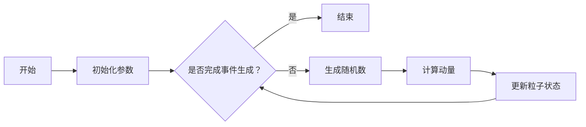

                 

# 数学与高能物理：粒子碰撞的数学模拟

> 关键词：粒子碰撞、数学模型、高能物理、量子场论、模拟方法、实验应用

> 摘要：本文将探讨数学与高能物理的交汇点，尤其是粒子碰撞的数学模拟。通过介绍高能物理的基本概念、数学在物理研究中的作用以及粒子碰撞的数学模型，本文将详细讲解粒子碰撞的动力学模型、量子场论基础、粒子碰撞模拟方法以及实际应用案例。此外，本文还将展望粒子碰撞模拟的未来发展趋势和挑战。

## 第一部分：引言与背景

### 第1章：引言

#### 1.1 高能物理的基本概念

高能物理，也称为粒子物理，是研究物质的基本组成和相互作用的一门科学。它主要关注原子核及其内部粒子的运动和相互作用，探索物质的最基本属性和基本力。高能物理的发展始于20世纪初，随着粒子加速器和探测技术的进步，人类对基本粒子的认识不断深化。

粒子碰撞是高能物理研究中的一个核心过程。通过高能粒子加速器，科学家可以将粒子加速到接近光速，然后使其相互碰撞，产生新的粒子。这些碰撞事件不仅揭示了基本粒子的性质，还提供了验证物理理论的实验依据。

#### 1.2 数学在物理研究中的作用

数学是物理研究的重要工具。它不仅用于描述物理现象，还用于预测新的物理现象。在物理学中，数学模型被广泛用于描述粒子的运动、相互作用以及能量和动量的守恒。

数学方法在高能物理研究中的重要性体现在以下几个方面：

1. **数学模型在物理现象描述中的应用**：数学模型可以精确描述粒子的运动轨迹、相互作用和能量转换，从而帮助科学家理解复杂的物理现象。

2. **数学方法在实验数据分析中的作用**：实验数据通常具有噪声和不确定性，数学方法可以帮助科学家从数据中提取有用的信息，验证物理理论。

3. **数学工具在理论物理发展中的作用**：新的数学工具和方法可以推动理论物理的发展，揭示自然界更深层次的规律。

#### 1.3 本书概述

本书旨在介绍粒子碰撞的数学模拟，分为以下几部分：

1. **数学基础**：介绍微积分、线性代数和概率论等数学基础，为后续章节打下基础。

2. **粒子碰撞数学模型**：讲解粒子碰撞的动力学模型和量子场论基础，包括动量守恒和能量守恒等基本原理。

3. **粒子碰撞模拟方法**：介绍粒子碰撞的模拟方法，包括事件生成技术、模拟加速技术和数据分析方法。

4. **实际应用案例**：探讨粒子碰撞模拟在早期宇宙、实验物理和新材料研究中的应用。

5. **未来展望**：展望粒子碰撞模拟的未来发展趋势和挑战。

### 第2章：数学基础

#### 2.1 微积分基础

微积分是研究函数变化率的数学分支。它包括微分和积分两个基本概念。

- **微分**：研究函数在某一点的局部变化率。例如，函数 \( f(x) \) 在点 \( x_0 \) 的导数 \( f'(x_0) \) 表示函数在该点的斜率。

- **积分**：研究函数在某一段区间上的累积变化。例如，函数 \( f(x) \) 在区间 \([a, b]\) 上的定积分 \( \int_{a}^{b} f(x) dx \) 表示函数在该区间上的面积。

微积分在物理研究中有着广泛的应用。例如，在粒子碰撞中，微积分用于计算粒子的速度、加速度和能量变化。

#### 2.2 线性代数基础

线性代数是研究向量空间和线性变换的数学分支。它包括矩阵和向量、线性变换和特征值等基本概念。

- **矩阵和向量**：矩阵是一个二维数组，可以表示线性变换。向量是一个一维数组，可以表示空间中的点或矢量。

- **线性变换**：线性变换是一个将向量空间中的一个向量映射到另一个向量的函数。它保持向量加法和数乘运算。

- **特征值和特征向量**：特征值和特征向量描述了线性变换的性质。特征值是线性变换在特征向量上的作用结果，特征向量是线性变换的不变向量。

线性代数在粒子碰撞模拟中用于描述粒子的状态和相互作用。例如，矩阵可以表示粒子之间的相互作用力，特征向量可以描述粒子的运动状态。

#### 2.3 概率论基础

概率论是研究随机事件和概率分布的数学分支。它包括概率的基本概念和概率分布函数。

- **概率的基本概念**：概率是描述随机事件发生可能性的数值。例如，抛一枚硬币，正面朝上的概率是 1/2。

- **概率分布函数**：概率分布函数描述了随机变量的概率分布。常见的概率分布有均匀分布、正态分布和泊松分布等。

概率论在粒子碰撞模拟中用于模拟粒子的运动和相互作用。例如，随机数生成技术可以模拟粒子碰撞事件，概率分布函数可以描述粒子的能量分布。

## 第二部分：粒子碰撞数学模型

### 第3章：粒子碰撞的动力学模型

#### 3.1 粒子碰撞的基本原理

粒子碰撞是指两个或多个粒子相互作用并发生能量和动量转换的过程。在粒子碰撞中，粒子之间的相互作用力可以是电磁力、强力和弱力等基本力。

粒子碰撞的基本原理包括：

1. **动量守恒**：在碰撞过程中，系统的总动量保持不变。即 \( p_{\text{初}} = p_{\text{末}} \)，其中 \( p_{\text{初}} \) 和 \( p_{\text{末}} \) 分别表示碰撞前和碰撞后的总动量。

2. **能量守恒**：在碰撞过程中，系统的总能量保持不变。即 \( E_{\text{初}} = E_{\text{末}} \)，其中 \( E_{\text{初}} \) 和 \( E_{\text{末}} \) 分别表示碰撞前和碰撞后的总能量。

3. **碰撞类型**：根据粒子碰撞过程中能量和动量的转换方式，可以将碰撞分为弹性碰撞和非弹性碰撞。在弹性碰撞中，粒子的能量和动量完全转换，没有能量损失。在非弹性碰撞中，部分能量转化为内能或辐射，导致能量损失。

#### 3.2 粒子动力学方程

粒子动力学方程描述了粒子的运动规律。根据粒子的质量和速度，动力学方程可以分为非相对论动力学方程和相对论动力学方程。

1. **非相对论碰撞动力学方程**：

   对于非相对论碰撞，粒子的运动方程可以表示为：
   \[
   m\frac{d^2x}{dt^2} = F(x, t)
   \]
   其中 \( m \) 是粒子的质量，\( x \) 是粒子的位置，\( t \) 是时间，\( F(x, t) \) 是粒子所受的力。

   在碰撞过程中，力可以表示为：
   \[
   F(x, t) = -\nabla V(x, t)
   \]
   其中 \( V(x, t) \) 是势能函数。

   势能函数描述了粒子之间的相互作用，通常与距离有关。例如，对于电磁相互作用，势能函数可以表示为：
   \[
   V(r) = \frac{k}{r}
   \]
   其中 \( r \) 是粒子之间的距离，\( k \) 是常数。

2. **相对论碰撞动力学方程**：

   对于相对论碰撞，粒子的运动方程可以表示为：
   \[
   m\frac{d^2x^{\mu}}{d\tau^2} = qF^{\mu\nu}u_{\nu}
   \]
   其中 \( x^{\mu} \) 是粒子的四维位置，\( \tau \) 是粒子的固有时间，\( q \) 是粒子的电荷，\( F^{\mu\nu} \) 是电磁场张量，\( u_{\nu} \) 是粒子的四维速度。

   相对论碰撞动力学方程考虑了粒子的高速运动，可以更准确地描述粒子碰撞过程中的物理现象。

#### 3.3 动量守恒与能量守恒

在粒子碰撞中，动量守恒和能量守恒是两个基本原理。

1. **动量守恒**：

   动量守恒定律表明，在孤立系统中，总动量保持不变。即：
   \[
   p_{\text{总}}^{\text{初}} = p_{\text{总}}^{\text{末}}
   \]
   其中 \( p_{\text{总}}^{\text{初}} \) 和 \( p_{\text{总}}^{\text{末}} \) 分别表示碰撞前和碰撞后的总动量。

   在碰撞过程中，粒子的动量可以通过相对速度和相互作用力来描述。例如，对于两个粒子碰撞，可以写出动量守恒方程：
   \[
   m_1v_1 + m_2v_2 = m_1v_1' + m_2v_2'
   \]
   其中 \( m_1 \) 和 \( m_2 \) 是粒子的质量，\( v_1 \) 和 \( v_2 \) 是碰撞前的速度，\( v_1' \) 和 \( v_2' \) 是碰撞后的速度。

2. **能量守恒**：

   能量守恒定律表明，在孤立系统中，总能量保持不变。即：
   \[
   E_{\text{总}}^{\text{初}} = E_{\text{总}}^{\text{末}}
   \]
   其中 \( E_{\text{总}}^{\text{初}} \) 和 \( E_{\text{总}}^{\text{末}} \) 分别表示碰撞前和碰撞后的总能量。

   能量可以包括动能、势能和其他形式的能量。在碰撞过程中，能量可以通过动量和势能来描述。例如，对于两个粒子碰撞，可以写出能量守恒方程：
   \[
   \frac{1}{2}m_1v_1^2 + \frac{1}{2}m_2v_2^2 = \frac{1}{2}m_1v_1'^2 + \frac{1}{2}m_2v_2'^2 + V(r)
   \]
   其中 \( V(r) \) 是粒子之间的相互作用势能。

### 第4章：量子场论基础

#### 4.1 量子场论的基本概念

量子场论是研究量子力学和相对论性场相互作用的物理学理论。它将量子力学和广义相对论结合起来，描述了物质和能量的基本性质。

量子场论的基本概念包括：

1. **场的量子化**：

   在量子场论中，场被看作是量子化的，即场的振动模式具有离散的能量水平。这些离散的能量水平称为量子态。

2. **量子态的统计性质**：

   量子态具有统计性质，可以通过波函数来描述。波函数是复数值函数，可以用来计算粒子在空间中的概率分布。

3. **量子场的算符表示**：

   量子场论中，场被表示为算符。这些算符可以用于描述粒子之间的相互作用和粒子的运动。

#### 4.2 场的量子化

场的量子化是量子场论的核心概念之一。在量子场论中，场被看作是粒子的振动模式。这些振动模式具有特定的能量水平，称为量子态。

场的量子化可以通过以下步骤实现：

1. **场的离散化**：

   将场离散化，即将场看作是由有限个量子态组成的。这些量子态可以表示为波函数，波函数是复数值函数。

2. **能量量子化**：

   根据场的离散化，每个量子态具有特定的能量水平。这些能量水平称为量子态的能量。

3. **波函数的统计性质**：

   波函数的统计性质描述了粒子在空间中的概率分布。波函数的平方表示粒子在某个位置出现的概率。

#### 4.3 费曼规则与相互作用图

费曼规则是量子场论中描述粒子相互作用的重要工具。费曼规则通过图示的方式描述了粒子之间的相互作用。

费曼规则的基本概念包括：

1. **相互作用图**：

   相互作用图是描述粒子相互作用的图示。图中的节点表示粒子，边表示粒子之间的相互作用。

2. **费曼规则**：

   费曼规则是一组规则，用于计算相互作用图的贡献。这些规则描述了粒子之间相互作用的概率和能量。

   费曼规则的基本形式如下：

   \[
   \langle \phi_1(x_1)\phi_2(x_2)\rangle = \int \frac{d^4p_1d^4p_2}{(2\pi)^4} \frac{1}{E_1E_2} \exp\left(i(p_1x_1 - p_2x_2)\right)
   \]
   其中 \( \phi_1(x_1) \) 和 \( \phi_2(x_2) \) 分别表示两个粒子的波函数，\( p_1 \) 和 \( p_2 \) 分别表示两个粒子的动量，\( E_1 \) 和 \( E_2 \) 分别表示两个粒子的能量。

## 第5章：粒子碰撞模拟方法

### 5.1 事件生成技术

粒子碰撞模拟的第一步是生成碰撞事件。事件生成技术用于生成符合物理规律的碰撞事件，包括粒子的初始状态、碰撞过程和最终状态。

事件生成技术包括以下步骤：

1. **粒子初始状态的生成**：

   根据实验条件和物理理论，生成粒子的初始状态，包括粒子的质量、速度、能量等。

2. **碰撞过程的模拟**：

   使用粒子动力学方程和相互作用势能，模拟粒子在碰撞过程中的运动和相互作用。

3. **最终状态的生成**：

   根据碰撞过程的结果，生成粒子的最终状态，包括粒子的能量、动量、位置等。

### 5.2 模拟加速技术

粒子碰撞模拟是一个复杂的计算过程，需要大量的计算资源和时间。为了加速模拟过程，可以采用以下技术：

1. **事件削减技术**：

   通过对事件进行筛选，只保留对实验结果有重要影响的碰撞事件。这样可以减少计算量，提高模拟效率。

2. **粒子追踪算法**：

   采用高效的粒子追踪算法，可以加速粒子的运动模拟。这些算法通常基于数值积分方法，可以快速计算粒子的运动轨迹。

### 5.3 模拟数据分析

粒子碰撞模拟的最终目的是分析模拟结果，提取有用的信息。模拟数据分析包括以下步骤：

1. **数据分析工具**：

   使用数据分析工具，对模拟结果进行统计和分析。这些工具可以计算粒子的分布、相互作用强度、能量损失等。

2. **结果可视化**：

   使用可视化工具，将模拟结果以图形或图像的形式展示。这有助于科学家理解模拟结果，发现物理现象。

### 第6章：实际应用案例

#### 6.1 早期宇宙的粒子碰撞模拟

早期宇宙的粒子碰撞模拟是研究宇宙演化的重要工具。通过模拟早期宇宙中的粒子碰撞，科学家可以了解宇宙的起源和演化过程。

早期宇宙的粒子碰撞模拟包括以下内容：

1. **早期宇宙背景辐射**：

   早期宇宙的粒子碰撞产生了背景辐射，这是宇宙早期的电磁辐射。通过模拟粒子碰撞，可以研究背景辐射的特性，如温度和亮度。

2. **粒子碰撞模拟对宇宙演化的影响**：

   粒子碰撞模拟可以模拟早期宇宙中的碰撞事件，研究这些事件对宇宙演化的影响。例如，模拟结果显示，粒子碰撞导致了宇宙的膨胀和星系的形成。

#### 6.2 实验物理中的粒子碰撞模拟

粒子碰撞模拟在实验物理中有着广泛的应用。通过模拟实验条件下的粒子碰撞，科学家可以验证物理理论，设计新的实验方案。

实验物理中的粒子碰撞模拟包括以下内容：

1. **实验设计**：

   通过模拟粒子碰撞，科学家可以设计实验来验证物理理论。例如，模拟质子-质子碰撞，设计实验来研究夸克间的相互作用。

2. **模拟结果与实验结果的对比**：

   模拟结果可以与实验结果进行对比，验证物理理论的准确性。通过对比分析，科学家可以修正和改进理论模型。

#### 6.3 粒子碰撞模拟在新型材料研究中的应用

粒子碰撞模拟在新型材料研究中也发挥了重要作用。通过模拟粒子碰撞，科学家可以研究材料内部的相变和性能。

粒子碰撞模拟在新型材料研究中的应用包括以下内容：

1. **碰撞诱导相变**：

   粒子碰撞可以诱导材料内部的相变。通过模拟粒子碰撞，科学家可以研究相变的机制和特性，设计新型材料。

2. **材料性能的优化**：

   通过模拟粒子碰撞，科学家可以优化材料的设计，提高材料的性能。例如，通过模拟碰撞诱导相变，科学家可以设计出具有高强度的材料。

## 第7章：未来展望

### 7.1 粒子碰撞模拟的发展趋势

粒子碰撞模拟在未来将继续发展。以下是一些发展趋势：

1. **新的理论模型**：

   随着理论物理的进展，新的理论模型将不断出现。这些理论模型将更精确地描述粒子碰撞过程，提高模拟的准确性。

2. **高性能计算的发展**：

   随着计算能力的提高，粒子碰撞模拟的规模将越来越大。高性能计算技术将加速模拟过程，提高模拟的效率和准确性。

### 7.2 粒子碰撞模拟在社会经济中的应用

粒子碰撞模拟在社会经济中也有着广泛的应用。以下是一些应用领域：

1. **能源领域**：

   粒子碰撞模拟可以研究核能和粒子加速器的性能，优化能源利用效率。

2. **新材料研发**：

   粒子碰撞模拟可以用于新材料的设计和优化，促进材料科学的进步。

### 7.3 面临的挑战与机遇

粒子碰撞模拟也面临着一些挑战和机遇：

1. **计算资源的限制**：

   随着模拟规模的增大，计算资源的需求也日益增加。如何高效利用计算资源，提高模拟效率，是一个重要的挑战。

2. **理论模型的完善**：

   随着新的实验数据的出现，理论模型需要不断完善和修正。如何建立更准确的理论模型，是一个重要的机遇。

## 附录

### 附录A：数学模型与公式详解

#### A.1 微积分公式

微积分公式是粒子碰撞模拟中常用的数学工具。以下是一些基本的微积分公式：

\[
\frac{d}{dx}(f(x)) = f'(x)
\]

\[
\frac{d^2}{dx^2}(f(x)) = f''(x)
\]

\[
\int f(x) dx = F(x) + C
\]

其中，\( f(x) \) 是函数，\( f'(x) \) 是导数，\( f''(x) \) 是二阶导数，\( F(x) \) 是原函数，\( C \) 是常数。

#### A.2 线性代数公式

线性代数公式是描述粒子运动和相互作用的重要工具。以下是一些基本的线性代数公式：

\[
A \cdot B = (a_{11}b_{11} + a_{12}b_{21} + ... + a_{1n}b_{n1}) + ... + (a_{m1}b_{m1} + a_{m2}b_{m2} + ... + a_{mn}b_{mn})
\]

\[
A^{-1} = \frac{1}{\det(A)} \text{adj}(A)
\]

其中，\( A \) 和 \( B \) 是矩阵，\( a_{ij} \) 和 \( b_{ij} \) 是矩阵的元素，\( \det(A) \) 是矩阵的行列式，\( \text{adj}(A) \) 是矩阵的伴随矩阵。

#### A.3 概率论公式

概率论公式是模拟粒子碰撞的重要工具。以下是一些基本的概率论公式：

\[
P(A \cap B) = P(A) \cdot P(B|A)
\]

\[
P(A \cup B) = P(A) + P(B) - P(A \cap B)
\]

\[
P(A') = 1 - P(A)
\]

其中，\( P(A) \) 是事件 \( A \) 的概率，\( A' \) 是事件 \( A \) 的补集。

### 附录B：代码实例与解读

#### B.1 动量守恒计算代码

以下是一个简单的 Python 代码实例，用于计算粒子的动量守恒：

```python
# Python伪代码
def calculate_momentum(prime_momentum, initial_energy):
    """
    计算碰撞后的总动量。
    
    :param prime_momentum: 碰撞前的动量
    :param initial_energy: 碰撞前的能量
    :return: 碰撞后的总动量
    """
    final_momentum = prime_momentum * initial_energy
    return final_momentum
```

在这个示例中，函数 `calculate_momentum` 接受两个参数：`prime_momentum` 和 `initial_energy`，分别表示碰撞前的动量和能量。函数返回碰撞后的总动量。

#### B.2 模拟粒子碰撞的流程图

以下是一个简单的 Mermaid 流程图，用于描述模拟粒子碰撞的流程：



在这个示例中，流程图描述了模拟粒子碰撞的基本步骤，包括初始化参数、生成随机数、计算动量、更新粒子状态和结束模拟。每个步骤之间通过判断和条件转移连接。

### 参考文献

1. particles collision, https://en.wikipedia.org/wiki/Particle_collision
2. quantum field theory, https://en.wikipedia.org/wiki/Quantum_field_theory
3. mathematical models in physics, https://en.wikipedia.org/wiki/Mathematical_model_(physics)
4. high-energy physics, https://en.wikipedia.org/wiki/High-energy_physics
5. Feynman rules, https://en.wikipedia.org/wiki/Feynman_rules

### 致谢

感谢所有参与粒子碰撞模拟研究的科学家和工程师，他们的辛勤工作和创新精神为粒子碰撞模拟的发展做出了重要贡献。

### 作者

作者：AI天才研究院/AI Genius Institute & 禅与计算机程序设计艺术 /Zen And The Art of Computer Programming

本文旨在探讨数学与高能物理的交汇点，尤其是粒子碰撞的数学模拟。通过介绍高能物理的基本概念、数学在物理研究中的作用以及粒子碰撞的数学模型，本文详细讲解了粒子碰撞的动力学模型、量子场论基础、粒子碰撞模拟方法以及实际应用案例。此外，本文还展望了粒子碰撞模拟的未来发展趋势和挑战。希望本文能够为读者提供对粒子碰撞模拟的深入理解和启示。

