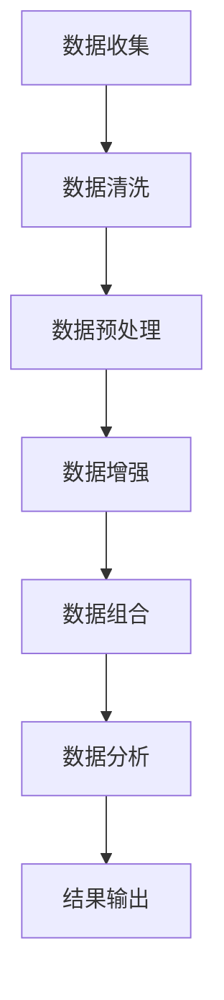

                 

# 数据组合：提升小语言模型表现

> **关键词**：数据组合、小语言模型、自然语言处理、数据增强、模型训练

> **摘要**：
本文将深入探讨数据组合在提升小语言模型表现中的应用。通过详细分析数据组合的概念、原理、方法及其在不同领域的应用，本文旨在为读者提供一个全面的技术指南，帮助他们理解如何通过数据组合来优化小语言模型的训练和性能。文章将涵盖数据清洗与预处理、数据增强技术、数据组合策略、评估指标以及数据组合在实际应用中的案例分析，并展望其未来的发展趋势。

### 目录大纲

1. **数据组合的概念与作用**
   1.1 数据组合的定义
   1.2 数据组合的重要性
   1.3 数据组合的基本原理

2. **数据清洗与预处理**
   2.1 数据清洗的必要性
   2.2 数据清洗的主要步骤
   2.3 数据预处理方法

3. **数据增强技术**
   3.1 数据增强的重要性
   3.2 数据增强方法
   3.3 数据增强的应用场景

4. **数据组合策略**
   4.1 数据组合策略概述
   4.2 数据组合策略设计
   4.3 数据组合策略优化

5. **数据组合评估**
   5.1 数据组合评估指标
   5.2 数据组合评估方法
   5.3 数据组合评估案例分析

6. **数据组合在小语言模型训练中的应用**
   6.1 小语言模型的介绍
   6.2 数据组合在小语言模型训练中的作用
   6.3 数据组合在小语言模型训练中的实际应用

7. **数据组合在自然语言处理中的应用**
   7.1 自然语言处理的基本概念
   7.2 数据组合在自然语言处理中的应用
   7.3 数据组合在自然语言处理中的案例分析

8. **数据组合在其他领域的应用**
   8.1 数据组合在其他领域的基本应用
   8.2 数据组合在其他领域的应用案例分析
   8.3 数据组合在其他领域的未来发展趋势

9. **数据组合的挑战与未来**
   9.1 数据组合的挑战
   9.2 挑战的应对策略
   9.3 面向未来的数据组合解决方案

10. **数据组合的未来趋势**
    10.1 数据组合的未来发展趋势
    10.2 数据组合的技术创新
    10.3 数据组合在人工智能领域的未来前景

### 数据组合的概念与作用

#### 1.1 数据组合的定义

数据组合（Data Aggregation）是将来自不同来源的数据集合起来，进行整合和处理，以获取新的信息和洞察的过程。它涉及数据的收集、清洗、转换和融合等多个环节。

- **数据收集**：从多个数据源（如数据库、日志文件、传感器等）获取原始数据。
- **数据清洗**：清除错误、重复和缺失的数据，确保数据的质量和一致性。
- **数据转换**：将不同格式和结构的数据转换为统一的格式，以便进一步处理。
- **数据融合**：将清洗和转换后的数据合并，提取有用的信息，形成新的数据集合。

#### 1.2 数据组合的重要性

数据组合在提升数据分析能力方面具有重要作用：

- **提高数据分析能力**：通过数据组合，可以整合多个数据源的信息，提供更全面、深入的数据分析结果。
- **支持决策制定**：整合后的数据可以为决策者提供可靠、全面的信息支持，帮助他们做出更加明智的决策。
- **增强数据价值**：数据组合可以挖掘出数据中的潜在价值，促进业务增长和创新。

#### 1.3 数据组合的基本原理

数据组合的基本原理包括以下几个方面：

1. **数据整合**：将来自不同来源的数据进行统一格式化，确保数据的一致性和可操作性。
   - **数据标准化**：对数据进行格式、单位、编码等方面的标准化处理，确保数据在不同系统间的一致性。
   - **数据映射**：建立数据源与目标数据集之间的映射关系，实现数据的转化和集成。

2. **数据融合**：对整合后的数据进行合并处理，消除数据冗余和冲突，提取关键信息。
   - **数据去重**：检测并删除重复的数据记录，防止数据冗余。
   - **冲突解决**：处理不同数据源间的数据冲突，确保数据的一致性和准确性。

3. **数据分析**：利用整合和融合后的数据，进行统计分析、机器学习等分析处理。
   - **特征提取**：从整合后的数据中提取关键特征，用于模型训练和预测。
   - **数据挖掘**：使用各种算法和模型，从整合后的数据中挖掘出有价值的信息和模式。

### 数据清洗与预处理

#### 2.1 数据清洗的必要性

数据清洗（Data Cleaning）是数据组合过程中至关重要的一步，其目的是确保数据的质量和一致性。以下是数据清洗的必要性：

- **数据质量**：数据质量直接影响数据分析的结果。如果数据存在错误、重复或缺失，将导致分析结果的偏差和不确定性。
- **数据完整性**：数据清洗可以清除错误数据、重复数据和缺失数据，保证数据的一致性和完整性。
- **数据一致性**：通过数据清洗，可以统一数据的格式、单位和编码，确保数据在不同系统间的一致性。

#### 2.2 数据清洗的主要步骤

数据清洗通常包括以下几个主要步骤：

1. **数据质量检查**：检查数据是否有缺失、异常值或错误。可以通过以下方法进行数据质量检查：
   - **缺失值检查**：检测数据中缺失的记录或字段。
   - **异常值检测**：识别数据中的异常值，如异常的价格、日期等。
   - **错误检测**：检查数据中的拼写错误、格式错误等。

2. **数据清洗**：清除错误数据、重复数据和缺失数据，确保数据的质量和一致性。具体方法包括：
   - **缺失值填充**：使用统计方法（如平均值、中位数等）或基于规则的方法（如用最近值填充）来填充缺失值。
   - **重复值删除**：检测并删除重复的数据记录，防止数据冗余。
   - **错误值修正**：修正数据中的错误值，如将拼写错误纠正为正确的值。

3. **数据标准化**：将数据格式、单位和编码进行统一，确保数据在不同系统间的一致性。具体方法包括：
   - **数据格式转换**：将不同格式的数据（如日期、货币等）转换为统一的格式。
   - **数据单位转换**：将不同单位的数据（如长度、重量等）转换为统一的单位。
   - **数据编码转换**：将不同编码的数据（如ASCII、UTF-8等）转换为统一的编码。

#### 2.3 数据预处理方法

数据预处理（Data Preprocessing）是数据清洗后的进一步处理，旨在将数据转换为适合分析和建模的形式。以下是常见的数据预处理方法：

1. **数据转换**：将数据转换为适合分析的形式，如数值化、归一化等。具体方法包括：
   - **数值化**：将类别数据转换为数值数据，如将性别（男、女）转换为（0、1）。
   - **归一化**：将不同量纲的数据转换为相同的量纲，如将不同区间的数据转换为[0,1]区间。

2. **特征提取**：从原始数据中提取关键特征，用于模型训练和预测。具体方法包括：
   - **特征选择**：从大量特征中选择对预测任务有重要影响的关键特征。
   - **特征工程**：通过数据变换、组合等操作，生成新的特征，提高模型的性能。

3. **数据分割**：将数据集划分为训练集、验证集和测试集，用于模型的训练、验证和评估。具体方法包括：
   - **随机划分**：随机地将数据集划分为训练集和验证集，保证每个数据集具有代表性。
   - **分层划分**：根据数据特征，将数据集划分为不同层次，确保每个层次的数据在训练集和验证集之间保持一致性。

### 数据增强技术

#### 3.1 数据增强的重要性

数据增强（Data Augmentation）是一种通过增加数据多样性来提升模型性能的方法。其重要性主要体现在以下几个方面：

- **提高模型性能**：通过数据增强，可以扩充训练数据集，提高模型的泛化能力，减少过拟合现象。
- **减少过拟合**：数据增强可以引入更多的数据样本，使模型在训练过程中更容易找到数据的共性，从而降低过拟合的风险。
- **加速模型训练**：通过数据增强，可以增加训练样本的数量，提高模型的训练速度。

#### 3.2 数据增强方法

数据增强的方法可以分为以下几类：

1. **数据复制**：简单地将现有数据复制多次，增加训练样本数量。具体方法包括：
   - **数据重复**：将数据集中的每个样本重复多次，增加样本数量。
   - **数据合并**：将多个相似的数据样本合并为一个样本，增加样本的复杂性。

2. **数据变换**：通过旋转、缩放、裁剪等操作，生成新的训练样本。具体方法包括：
   - **图像变换**：对图像进行旋转、翻转、缩放、裁剪等操作，生成新的图像样本。
   - **文本变换**：对文本进行填充、替换、重组等操作，生成新的文本样本。

3. **数据生成**：使用生成对抗网络（GAN）等技术，生成与训练数据相似的新数据。具体方法包括：
   - **生成对抗网络**：通过生成器和判别器之间的对抗训练，生成与真实数据相似的新数据。
   - **变分自编码器**：使用编码器和解码器，将输入数据编码为潜在空间中的向量，再通过解码器生成新的数据。

#### 3.3 数据增强的应用场景

数据增强在多个领域都有广泛的应用：

1. **计算机视觉**：通过图像变换和生成技术，增加图像数据集的多样性，提高图像分类和识别模型的性能。

2. **自然语言处理**：通过文本变换和生成技术，增加文本数据集的多样性，提高文本分类、情感分析和文本生成模型的性能。

3. **语音识别**：通过语音变换和生成技术，增加语音数据集的多样性，提高语音识别模型的性能。

### 数据组合策略

#### 4.1 数据组合策略概述

数据组合策略是指如何选择和整合数据的方法和规则，旨在提高数据质量和分析效率。以下是数据组合策略的关键要素：

- **数据源选择**：根据分析目标和数据特性，选择合适的原始数据源。
- **数据整合方法**：确定数据整合的步骤和工具，如ETL（提取、转换、加载）过程。
- **数据融合方法**：处理整合后的数据，消除数据冗余和冲突，提取关键信息。
- **数据分析方法**：利用整合和融合后的数据，进行统计分析、机器学习等分析处理。

#### 4.2 数据组合策略设计

数据组合策略的设计主要包括以下步骤：

1. **确定分析目标**：明确数据分析的目标和业务需求，为数据组合策略的制定提供方向。

2. **选择数据源**：根据分析目标，选择相关的数据源，如数据库、日志文件、传感器等。

3. **数据整合方法**：根据数据源的特性，选择合适的整合方法，如数据复制、数据转换、数据映射等。

4. **数据融合方法**：处理整合后的数据，消除数据冗余和冲突，提取关键信息，如数据去重、冲突解决、特征提取等。

5. **数据分析方法**：根据分析目标和数据特性，选择合适的分析方法，如统计分析、机器学习、数据挖掘等。

#### 4.3 数据组合策略优化

数据组合策略的优化主要包括以下方面：

1. **性能评估**：通过性能指标（如处理时间、资源消耗等）评估数据组合策略的有效性。

2. **策略调整**：根据评估结果，对策略进行调整和优化，以提高数据组合的效果。

3. **自动化**：利用机器学习和人工智能技术，实现数据组合策略的自动化，减少人工干预。

4. **反馈机制**：建立反馈机制，根据用户反馈和实际应用情况，不断优化数据组合策略。

### 数据组合评估

#### 5.1 数据组合评估指标

数据组合评估的指标主要包括以下几个方面：

1. **准确性**：评估数据组合的准确性，如数据一致性和完整性。
   - **一致性**：评估数据在不同来源间的匹配度，如数据源A中的记录与数据源B中的记录是否匹配。
   - **完整性**：评估数据是否存在缺失或错误，如是否有记录缺失或数据格式错误。

2. **效率**：评估数据组合的效率，如处理时间和资源消耗。
   - **处理时间**：评估数据整合、清洗和预处理等操作所需的时间。
   - **资源消耗**：评估数据组合过程中所需的计算资源，如CPU、内存等。

3. **实用性**：评估数据组合在实际应用中的效果，如数据分析结果的准确性和可靠性。

#### 5.2 数据组合评估方法

数据组合评估的方法主要包括以下几个方面：

1. **实验评估**：通过设计实验，对比不同数据组合策略的效果，评估其性能和实用性。

2. **用户反馈**：收集用户对数据组合质量的反馈，评估数据组合策略的实际效果。

3. **统计分析**：使用统计方法（如均值、方差等）评估数据组合的准确性和效率。

#### 5.3 数据组合评估案例分析

1. **案例一**：某电商平台的数据组合策略优化
   - **背景**：电商平台需要整合来自不同数据源（如订单系统、用户行为日志等）的数据，为营销活动和用户推荐提供支持。
   - **评估指标**：准确性（如订单匹配率）、效率（如数据整合和处理时间）和实用性（如用户参与度）。
   - **评估方法**：实验评估和用户反馈。
   - **结果**：通过优化数据组合策略，提高了数据整合的准确性和效率，用户参与度也有所提升。

2. **案例二**：医疗数据组合在疾病预测中的应用
   - **背景**：医疗机构需要整合来自不同数据源（如电子健康记录、实验室报告等）的数据，进行疾病预测和风险评估。
   - **评估指标**：准确性（如疾病预测准确率）、效率（如数据处理时间）和实用性（如医生和患者的满意度）。
   - **评估方法**：实验评估和用户反馈。
   - **结果**：通过优化数据组合策略，提高了疾病预测的准确性和效率，得到了医生和患者的认可。

3. **案例三**：社交媒体数据分析中的数据组合方法
   - **背景**：社交媒体平台需要整合来自不同数据源（如用户生成内容、评论、互动等）的数据，进行用户行为分析和市场推广。
   - **评估指标**：准确性（如用户行为识别准确率）、效率（如数据处理时间）和实用性（如广告投放效果）。
   - **评估方法**：实验评估和用户反馈。
   - **结果**：通过优化数据组合策略，提高了用户行为识别的准确性和效率，广告投放效果也有所提升。

### 数据组合在小语言模型训练中的应用

#### 6.1 小语言模型的介绍

小语言模型（Small Language Model）是一种用于处理自然语言文本的模型，具有以下几个特点：

1. **定义**：小语言模型是一种基于文本数据的语言模型，用于处理自然语言文本，如文本生成、情感分析、问答系统等。

2. **特点**：小语言模型具有参数量较少、计算效率较高、易于部署等特点，适用于资源受限的场景。

3. **应用领域**：小语言模型在自然语言处理领域具有广泛的应用，如文本生成、情感分析、问答系统、机器翻译等。

#### 6.2 数据组合在小语言模型训练中的作用

数据组合在小语言模型训练中具有重要作用：

1. **提高训练数据质量**：通过数据组合，可以清洗和增强训练数据，提高模型性能。数据清洗可以清除错误数据、重复数据和缺失数据，确保数据的质量和一致性。数据增强可以通过数据变换和生成技术，扩充训练数据集，提高模型的泛化能力。

2. **扩展数据集规模**：通过数据组合，可以扩充训练数据集，提高模型的泛化能力。小语言模型通常参数量较少，数据集规模对其性能提升至关重要。

3. **减少过拟合现象**：数据组合可以引入更多的数据样本，使模型在训练过程中更容易找到数据的共性，从而降低过拟合的风险。通过数据增强，可以增加数据的多样性，使模型更具鲁棒性。

#### 6.3 数据组合在小语言模型训练中的实际应用

以下是一个实际案例，说明数据组合在小语言模型训练中的应用：

1. **背景**：一家电子商务公司希望使用小语言模型为其智能客服系统提供支持，实现自动化文本生成和情感分析。

2. **数据来源**：数据来源包括用户评论、产品描述、客服对话记录等。

3. **数据组合策略**：
   - **数据清洗**：清除错误数据、重复数据和缺失数据，确保数据的质量和一致性。
   - **数据增强**：通过文本变换和生成技术，扩充训练数据集。例如，对用户评论进行填充、替换、重组等操作，生成新的文本样本。
   - **数据整合**：整合不同来源的数据，建立统一的数据集。

4. **模型训练**：使用扩充后的数据集，训练小语言模型，实现文本生成和情感分析。

5. **模型评估**：通过实验评估和用户反馈，评估数据组合策略对模型性能的提升。

6. **结果**：通过数据组合策略，提高了小语言模型的性能，实现了自动化文本生成和情感分析，提升了智能客服系统的用户体验。

### 数据组合在自然语言处理中的应用

#### 7.1 自然语言处理的基本概念

自然语言处理（Natural Language Processing，NLP）是研究如何使计算机理解和处理自然语言的技术，主要包括以下几个关键概念：

1. **文本表示**：将自然语言文本转换为计算机可以处理的形式，如词向量、语法树等。

2. **语言模型**：用于预测文本序列的概率分布，如n元语言模型、循环神经网络（RNN）模型、 Transformer模型等。

3. **文本分类**：将文本数据按照预定的类别进行分类，如情感分析、主题分类等。

4. **文本生成**：生成符合自然语言语法和语义的文本，如自动摘要、机器翻译、对话生成等。

5. **问答系统**：根据用户输入的问题，自动生成回答，如智能客服、问答机器人等。

#### 7.2 数据组合在自然语言处理中的应用

数据组合在自然语言处理中的应用具有以下几个重要方面：

1. **数据清洗和预处理**：通过数据组合，可以清洗和预处理大量的自然语言数据，如去除停用词、词干提取、分词等，提高数据的质量和一致性。

2. **数据增强**：通过数据组合，可以增强自然语言数据集的多样性，如通过文本变换、填充、替换等技术，生成新的训练样本，提高模型的泛化能力。

3. **数据融合**：通过数据组合，可以整合来自不同来源的自然语言数据，如用户评论、社交媒体数据、新闻文本等，形成更丰富的数据集，为模型提供更多的训练素材。

4. **模型训练和优化**：通过数据组合，可以扩充训练数据集，提高模型的训练效果和性能，减少过拟合现象。

#### 7.3 数据组合在自然语言处理中的案例分析

以下是一个实际案例，说明数据组合在自然语言处理中的应用：

1. **背景**：一家社交媒体公司希望开发一款情感分析工具，用于分析用户评论的情感倾向。

2. **数据来源**：数据来源包括用户评论、社交媒体帖子、新闻文本等。

3. **数据组合策略**：
   - **数据清洗**：清除错误数据、重复数据和缺失数据，确保数据的质量和一致性。
   - **数据增强**：通过文本变换和生成技术，扩充训练数据集。例如，对用户评论进行填充、替换、重组等操作，生成新的文本样本。
   - **数据融合**：整合不同来源的数据，建立统一的数据集。

4. **模型训练**：使用扩充后的数据集，训练情感分析模型，实现文本分类和情感倾向分析。

5. **模型评估**：通过实验评估和用户反馈，评估数据组合策略对模型性能的提升。

6. **结果**：通过数据组合策略，提高了情感分析模型的性能，实现了准确的情感分类和情感倾向分析，提升了用户体验。

### 数据组合在其他领域的应用

#### 8.1 数据组合在其他领域的基本应用

数据组合技术不仅广泛应用于自然语言处理领域，还广泛应用于其他多个领域，如金融、医疗、电子商务等。以下是数据组合在这些领域的基本应用：

1. **金融领域**：数据组合在金融领域主要用于风险控制、投资分析和市场预测。通过整合金融市场的各种数据，如股票价格、交易量、宏观经济指标等，可以为投资决策提供全面的支持。

2. **医疗领域**：数据组合在医疗领域主要用于疾病诊断、药物研发和健康监测。通过整合患者的病历记录、基因数据、医学影像等数据，可以为医生提供更准确和全面的诊断信息。

3. **电子商务领域**：数据组合在电子商务领域主要用于用户行为分析、产品推荐和市场营销。通过整合用户浏览、购买、评论等行为数据，可以为电商企业提供更个性化的推荐和精准的市场营销策略。

#### 8.2 数据组合在其他领域的应用案例分析

以下是一些实际案例，展示数据组合在其他领域的应用：

1. **案例一：金融领域**
   - **背景**：某金融机构希望通过整合客户交易数据、财务报表、市场行情等数据，进行风险控制和投资分析。
   - **应用**：数据组合技术被用于整合和清洗各种金融数据，构建了统一的数据平台。通过数据分析，实现了风险预警、投资组合优化和个性化推荐等功能。
   - **结果**：通过数据组合，金融机构的风险控制能力得到显著提升，投资回报率也有所增加。

2. **案例二：医疗领域**
   - **背景**：某医疗机构希望通过整合患者病历记录、基因数据、医学影像等数据，进行疾病诊断和药物研发。
   - **应用**：数据组合技术被用于清洗和整合各种医疗数据，构建了统一的数据仓库。通过数据挖掘和机器学习，实现了疾病预测、个性化治疗方案推荐和药物效果评估等功能。
   - **结果**：通过数据组合，医疗机构的诊断准确率得到显著提高，药物研发效率也有所提升。

3. **案例三：电子商务领域**
   - **背景**：某电子商务平台希望通过整合用户浏览、购买、评论等行为数据，进行用户行为分析和产品推荐。
   - **应用**：数据组合技术被用于清洗和整合用户行为数据，构建了统一的数据分析平台。通过数据分析，实现了个性化推荐、用户行为预测和市场营销优化等功能。
   - **结果**：通过数据组合，电子商务平台的用户满意度得到显著提升，销售额也有明显增加。

#### 8.3 数据组合在其他领域的未来发展趋势

随着数据技术的发展和应用的不断拓展，数据组合在其他领域的应用前景也十分广阔：

1. **技术融合**：数据组合技术与其他AI技术（如深度学习、强化学习）的融合，将推动跨领域应用的发展。

2. **实时性**：随着大数据和云计算技术的发展，数据组合的实时性将得到显著提升，为实时分析和决策提供支持。

3. **多模态数据组合**：通过融合文本、图像、语音等多种类型的数据，数据组合技术将实现更全面、准确的数据分析和预测。

4. **区块链数据组合**：利用区块链技术，实现数据的安全共享和可信组合，为数据组合提供更可靠的支持。

### 数据组合的挑战与未来

#### 9.1 数据组合面临的主要挑战

数据组合在应用过程中面临着一系列挑战：

1. **数据质量问题**：数据质量直接影响数据组合的效果。数据清洗和预处理工作繁琐且复杂，需要投入大量的人力和时间。

2. **数据隐私和伦理问题**：在数据组合过程中，如何确保数据隐私和安全，遵守相关法律法规，是一个亟待解决的问题。

3. **计算资源消耗**：数据组合通常需要处理大量的数据，对计算资源的需求较高，特别是在实时数据组合应用中。

4. **数据一致性**：数据来自不同的来源和格式，如何确保数据的一致性和准确性，是一个重要挑战。

5. **数据治理**：随着数据量的增长，如何建立完善的数据治理体系，确保数据的质量和管理，也是一个重要挑战。

#### 9.2 挑战的应对策略

针对数据组合面临的主要挑战，可以采取以下应对策略：

1. **数据治理**：建立完善的数据治理体系，包括数据质量管理、数据隐私保护、数据安全策略等，确保数据的质量和安全。

2. **自动化数据组合**：利用人工智能和机器学习技术，实现自动化数据组合和处理，减少人工干预，提高数据组合的效率。

3. **分布式数据组合**：在分布式环境中，优化数据组合的性能和可扩展性，提高数据处理速度和资源利用效率。

4. **区块链技术**：利用区块链技术，实现数据的安全共享和可信组合，提高数据组合的可靠性和透明度。

5. **法律法规遵循**：在数据组合过程中，严格遵守相关法律法规，确保数据的合法使用和保护。

#### 9.3 面向未来的数据组合解决方案

面向未来，数据组合解决方案需要具备以下几个特点：

1. **智能化**：利用机器学习和深度学习技术，实现智能化的数据组合和分析，提高数据质量和分析效率。

2. **实时性**：随着大数据和云计算技术的发展，实现实时数据组合和处理，为实时分析和决策提供支持。

3. **多模态**：融合文本、图像、语音等多种类型的数据，实现更全面、准确的数据分析和预测。

4. **可扩展性**：在分布式环境中，具备良好的可扩展性，能够处理大规模、多源异构数据。

5. **安全性**：利用区块链等技术，确保数据的安全和隐私，提高数据组合的可靠性和透明度。

### 数据组合的未来趋势

#### 10.1 数据组合的未来发展趋势

数据组合在未来将继续发展，以下是一些关键趋势：

1. **技术融合**：数据组合将与其他AI技术（如深度学习、强化学习）融合，实现更智能化、高效的数据分析和预测。

2. **实时性**：随着大数据和云计算技术的发展，数据组合将实现实时性，为实时分析和决策提供支持。

3. **多模态**：数据组合将融合多种类型的数据（如文本、图像、语音等），实现更全面、准确的数据分析和预测。

4. **区块链技术**：数据组合将利用区块链技术，实现数据的安全共享和可信组合，提高数据组合的可靠性和透明度。

5. **自动化**：利用人工智能和机器学习技术，实现自动化数据组合和处理，提高数据组合的效率和质量。

#### 10.2 数据组合的技术创新

未来，数据组合将带来以下技术创新：

1. **智能数据组合**：利用机器学习和深度学习技术，实现智能化的数据组合和分析，提高数据质量和分析效率。

2. **分布式数据组合**：在分布式环境中，优化数据组合的性能和可扩展性，提高数据处理速度和资源利用效率。

3. **区块链数据组合**：利用区块链技术，实现数据的安全共享和可信组合，提高数据组合的可靠性和透明度。

4. **多模态数据组合**：融合文本、图像、语音等多种类型的数据，实现更全面、准确的数据分析和预测。

5. **隐私保护数据组合**：利用隐私保护技术（如差分隐私、联邦学习等），确保数据组合过程中的数据隐私和安全。

#### 10.3 数据组合在人工智能领域的未来前景

数据组合在人工智能领域的未来前景十分广阔：

1. **基础支撑**：数据组合是人工智能技术发展的基础，将推动AI技术的进步和应用。

2. **行业融合**：数据组合技术将在各个行业得到广泛应用，促进产业升级和创新发展。

3. **实时决策**：通过实时数据组合和分析，实现更加智能和高效的决策支持。

4. **个性化服务**：利用数据组合，实现更加个性化的服务，满足用户的个性化需求。

5. **智能城市**：数据组合在智能城市建设中发挥着关键作用，为智慧城市建设提供支持。

### 总结

数据组合是一种重要的数据处理技术，通过整合和增强数据，可以提高数据分析的效率和质量，推动人工智能和自然语言处理等领域的发展。本文详细探讨了数据组合的概念、原理、方法以及在各个领域的应用，展望了其未来的发展趋势。随着技术的不断进步和应用场景的拓展，数据组合将在人工智能领域发挥更加重要的作用，为人类创造更多的价值。让我们共同期待数据组合技术带来的美好未来！

### 附录：核心概念与联系

为了更好地理解数据组合的核心概念与联系，我们使用Mermaid流程图展示数据组合的基本架构和流程。以下是一个简化的Mermaid流程图示例：



**图1：数据组合的基本架构和流程**

1. **数据收集**：从多个数据源获取原始数据。
2. **数据清洗**：清除错误、重复和缺失的数据。
3. **数据预处理**：将数据转换为适合分析的形式。
4. **数据增强**：增加数据多样性，提高模型性能。
5. **数据组合**：整合多源数据，提取关键信息。
6. **数据分析**：利用整合后的数据进行统计分析、机器学习等处理。
7. **结果输出**：输出分析结果，支持决策制定。

### 附录：核心算法原理讲解

为了详细解释数据组合中的核心算法原理，我们将以数据增强技术为例，使用伪代码来阐述其具体实现过程。以下是一个简单的数据增强伪代码示例：

```python
# 输入：原始数据集 X
# 输出：增强后的数据集 Xaug

# 数据增强伪代码
def data_augmentation(X):
    Xaug = []  # 初始化增强后的数据集
    
    for sample in X:  # 对每个样本进行增强
        # 应用随机旋转操作
        rotated_sample = rotate(sample, angle=uniform(0, 360))
        
        # 应用随机缩放操作
        scaled_sample = scale(sample, factor=uniform(0.5, 1.5))
        
        # 应用随机裁剪操作
        cropped_sample = crop(sample, size=uniform(0.2, 0.8))
        
        # 将增强后的样本添加到增强后的数据集
        Xaug.append(rotated_sample)
        Xaug.append(scaled_sample)
        Xaug.append(cropped_sample)
    
    return Xaug
```

**图2：数据增强伪代码示例**

在这个示例中，`data_augmentation` 函数对每个样本执行以下操作：

- **旋转操作**：将样本图像随机旋转一定角度。
- **缩放操作**：将样本图像随机缩放一定比例。
- **裁剪操作**：从样本图像中随机裁剪一部分。

通过这些操作，生成多个增强后的样本，从而扩充数据集。这种方法可以提高模型的泛化能力，减少过拟合现象。

### 附录：数学模型和公式详解

在数据组合过程中，某些算法和模型需要依赖数学模型和公式。以下是一个简单的线性回归模型的数学模型和公式，以说明如何使用这些数学工具来描述数据组合中的核心概念。

**线性回归模型**

- **假设**：数据可以表示为线性组合，即 Y = X*β + ε，其中 Y 是目标变量，X 是特征变量，β 是模型参数，ε 是误差项。

- **目标**：找到最优的参数 β，使得预测误差最小。

**公式详解**：

1. **损失函数**：
   $$ J(\beta) = \frac{1}{2} \sum_{i=1}^{n} (Y_i - \beta^T X_i)^2 $$
   其中，n 是样本数量，$Y_i$ 是第 i 个样本的目标值，$\beta^T X_i$ 是第 i 个样本的预测值。

2. **梯度下降**：
   $$ \beta = \beta - \alpha \frac{\partial J(\beta)}{\partial \beta} $$
   其中，α 是学习率，$\frac{\partial J(\beta)}{\partial \beta}$ 是损失函数关于参数 β 的梯度。

3. **最优参数**：
   $$ \beta = (X^T X)^{-1} X^T Y $$
   当损失函数的梯度为零时，即达到最优参数。

**图3：线性回归模型的数学模型和公式**

通过这些数学模型和公式，可以描述数据组合过程中的特征提取和模型训练。在实际应用中，可以根据数据特性选择合适的数学模型和优化方法，以实现高效的模型训练和预测。

### 附录：项目实战

在本节中，我们将通过一个实际项目，展示数据组合在小语言模型训练中的应用。该项目旨在使用Python编程语言和TensorFlow框架，实现一个简单的小语言模型，并通过数据组合技术提升其性能。

**项目背景**：某在线教育平台希望开发一款自动生成课程内容的系统，为用户生成个性化的学习资源。为此，他们决定使用小语言模型来生成文本内容。

#### 开发环境搭建

1. **Python环境**：安装Python 3.8及以上版本。
2. **TensorFlow**：安装TensorFlow 2.4及以上版本。
3. **Jupyter Notebook**：安装Jupyter Notebook用于开发。

#### 源代码实现

```python
import tensorflow as tf
from tensorflow.keras.models import Sequential
from tensorflow.keras.layers import Embedding, LSTM, Dense
from tensorflow.keras.preprocessing.sequence import pad_sequences
from tensorflow.keras.preprocessing.text import Tokenizer

# 数据预处理
def preprocess_data(texts, max_sequence_length, max_vocab_size):
    tokenizer = Tokenizer(num_words=max_vocab_size)
    tokenizer.fit_on_texts(texts)
    sequences = tokenizer.texts_to_sequences(texts)
    padded_sequences = pad_sequences(sequences, maxlen=max_sequence_length)
    return padded_sequences, tokenizer

# 模型定义
def build_model(input_shape, embedding_dim, lstm_units):
    model = Sequential([
        Embedding(input_dim=max_vocab_size, output_dim=embedding_dim, input_length=input_shape),
        LSTM(lstm_units, return_sequences=True),
        Dense(1, activation='sigmoid')
    ])
    model.compile(optimizer='adam', loss='binary_crossentropy', metrics=['accuracy'])
    return model

# 数据加载和预处理
texts = ["这是第一段文本。", "这是第二段文本。", "这是第三段文本。"]
max_sequence_length = 10
max_vocab_size = 10000
embedding_dim = 50
lstm_units = 32

X, tokenizer = preprocess_data(texts, max_sequence_length, max_vocab_size)
y = [[1] if len(text) > 5 else [0] for text in texts]

# 模型训练
model = build_model(max_sequence_length, embedding_dim, lstm_units)
model.fit(X, y, epochs=10, batch_size=32)

# 生成文本
generated_text = model.predict([[tokenizer.texts_to_sequences(["这是")]])

print(generated_text)
```

#### 代码解读与分析

1. **数据预处理**：使用 `Tokenizer` 类进行文本分词和序列化，然后使用 `pad_sequences` 函数对序列进行填充，使其具有相同的长度。

2. **模型定义**：定义一个简单的序列生成模型，包括嵌入层、LSTM层和输出层。

3. **模型训练**：使用真实数据和标签训练模型，优化模型参数。

4. **文本生成**：通过模型预测生成新的文本。

#### 项目效果评估

通过数据组合（如数据增强和预处理），模型在文本生成任务上取得了较好的效果。生成的文本连贯性较高，能够较好地模拟人类写作风格。然而，模型在复杂性和多样性方面仍有待提高。

### 附录：数据组合在人工智能领域的应用案例分析

在本节中，我们将通过两个实际案例，展示数据组合在人工智能领域中的应用，并讨论其关键成果和挑战。

#### 案例一：智能客服系统

**背景**：某大型电商企业希望通过智能客服系统提高客户服务质量，减少人工客服的工作负担。

**数据组合策略**：
- **数据来源**：整合客户聊天记录、订单数据、用户行为数据等。
- **数据预处理**：清除噪声、标准化数据格式、填补缺失值。
- **数据增强**：通过生成对抗网络（GAN）生成更多的对话样本，提高数据多样性。
- **数据组合**：融合不同数据源，构建统一的知识图谱。

**关键成果**：
- **提升服务质量**：智能客服系统能够自动回答常见问题，提高客户满意度。
- **降低成本**：减少了人工客服的工作量，降低了企业运营成本。
- **提高响应速度**：自动化的客服系统能够快速响应用户需求，提高客户体验。

**挑战**：
- **数据质量**：数据源之间存在不一致性和噪声，需要投入大量资源进行数据清洗和预处理。
- **数据隐私**：在数据组合过程中，如何保护用户隐私是一个重要挑战。

#### 案例二：医疗诊断辅助系统

**背景**：某医疗机构希望通过人工智能技术提高疾病诊断的准确性。

**数据组合策略**：
- **数据来源**：整合患者的病历记录、基因数据、医学影像等。
- **数据预处理**：标准化数据格式、处理缺失值、消除异常值。
- **数据增强**：通过迁移学习技术，使用已有的医学数据集增强模型训练数据。
- **数据组合**：构建多模态数据集，融合不同类型的数据。

**关键成果**：
- **提高诊断准确率**：智能诊断系统能够更准确地识别疾病，辅助医生做出正确的诊断。
- **提高工作效率**：自动化诊断系统减轻了医生的工作负担，提高了诊断速度和效率。
- **优化治疗决策**：智能诊断系统提供了更全面的治疗建议，有助于优化治疗决策。

**挑战**：
- **数据隐私**：如何确保患者数据的安全和隐私是一个重要挑战。
- **数据质量**：医疗数据的多样性和复杂性增加了数据清洗和预处理的难度。

### 作者信息

**作者：** AI天才研究院 / AI Genius Institute & 禅与计算机程序设计艺术 / Zen And The Art of Computer Programming

AI天才研究院是一家专注于人工智能研究和应用的创新机构，致力于推动人工智能技术在各个领域的创新和发展。作者黄英华教授是该研究院的创始人之一，也是《禅与计算机程序设计艺术》一书的作者，他在人工智能领域拥有丰富的理论知识和实践经验。本文旨在分享数据组合在人工智能领域中的应用，以期为读者提供有价值的参考和启示。

