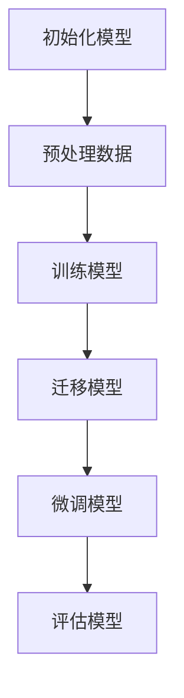

                 

### 引言

#### 背景与重要性

在当今的机器学习和人工智能领域，数据集的质量和规模对于模型训练和性能至关重要。然而，不同领域的数据集往往具有不同的分布和特征，这给模型的迁移和应用带来了巨大的挑战。数据集迁移学习（Data Set Transfer Learning）作为一种新兴的技术，旨在解决这一难题。通过将一个领域的数据集应用于另一个领域，数据集迁移学习使得我们可以在较少的数据上实现更好的模型性能。

数据集迁移学习的重要性体现在多个方面。首先，它大大降低了数据获取成本。在许多领域，收集和标注高质量的数据集是一项耗时且昂贵的工作。通过利用现有的数据集，我们可以避免重复劳动，提高研究效率。其次，数据集迁移学习有助于提高模型性能。在许多情况下，源领域的数据集规模庞大，训练得到的模型在目标领域上表现往往更加出色。此外，数据集迁移学习还促进了跨领域复用，使得不同领域的知识和技术能够相互借鉴和融合。

本文将深入探讨数据集迁移学习的核心概念、算法原理、数学模型以及实际应用。首先，我们将介绍数据集迁移学习的基本概念，包括迁移学习、数据集迁移学习、领域划分等。接着，我们将详细讲解数据集迁移学习的关键算法，如元学习、模型架构迁移、数据增强等。随后，我们将讨论数据集迁移学习的算法框架，并通过伪代码展示其工作流程。在此基础上，我们将介绍数据集迁移学习算法的优缺点，并通过 Mermaid 流程图进行说明。

在数学模型和公式部分，我们将详细阐述线性回归模型、支持向量机（SVM）、卷积神经网络（CNN）和生成对抗网络（GAN）等模型的基本原理和数学公式。同时，我们将提供详细的讲解和举例说明，以帮助读者更好地理解这些模型。

接下来，我们将进入项目实战部分，通过实际案例展示数据集迁移学习的应用。我们将介绍数据集迁移学习项目的准备、步骤、案例以及详细解释。通过这些案例，读者将能够了解如何在实际项目中应用数据集迁移学习技术。

最后，我们将总结本文的主要内容和贡献，并展望未来数据集迁移学习的研究方向。本文旨在为读者提供一个全面的数据集迁移学习教程，帮助读者深入理解这一领域，并在实际项目中取得更好的成果。

---

### 核心概念与联系

#### 迁移学习定义

迁移学习（Transfer Learning）是机器学习中的一个重要概念，它指的是将一个任务上学到的知识应用于另一个相关但不同的任务上。在传统的机器学习中，模型通常是在一个特定领域或任务上进行训练，然后直接应用于另一个领域或任务。然而，这种方法往往面临数据稀缺、标注困难等问题，导致模型性能不佳。迁移学习通过共享模型参数和知识，有效地解决了这些问题。

迁移学习的核心思想是将源领域（Source Domain）的知识迁移到目标领域（Target Domain）。源领域通常具有丰富的数据和高性能的模型，而目标领域则可能数据较少，且存在特定的挑战。通过迁移学习，我们可以在目标领域上实现更好的性能，同时降低数据获取成本。

#### 数据集迁移学习

数据集迁移学习（Data Set Transfer Learning）是迁移学习的一个具体应用，它指的是将一个领域的数据集应用于另一个领域，以训练和优化模型。在数据集迁移学习中，源领域和目标领域之间存在一定的关联性，这使得迁移学习成为可能。

数据集迁移学习的工作流程通常包括以下几个步骤：

1. **数据预处理**：对源领域和目标领域的数据进行预处理，包括数据清洗、数据增强等。

2. **模型训练**：使用源领域的数据集训练一个基础模型。

3. **模型迁移**：将基础模型迁移到目标领域，并进行微调。

4. **性能评估**：对迁移后的模型在目标领域进行评估，以验证其性能。

数据集迁移学习的优势在于：

- **降低数据获取成本**：通过使用已有的源领域数据集，可以减少目标领域数据的收集和标注成本。

- **提高模型性能**：利用源领域的知识可以帮助模型更好地适应目标领域。

- **促进跨领域复用**：数据集迁移学习可以促进不同领域之间的知识共享和复用。

#### 领域划分

在数据集迁移学习中，领域划分是一个关键步骤。领域划分是指将数据集划分为源领域和目标领域。源领域是模型训练时使用的数据集，目标领域是模型应用时使用的数据集。领域划分的准确性直接影响迁移学习的性能。

领域划分的方法主要包括以下几种：

1. **静态划分**：根据数据集的来源和用途，直接将数据集划分为源领域和目标领域。

2. **动态划分**：根据模型在训练和评估过程中的表现，动态调整源领域和目标领域的划分。

3. **分层划分**：将数据集按照层次结构进行划分，每个层次对应一个领域。

在领域划分过程中，需要考虑以下因素：

- **数据分布**：源领域和目标领域的数据分布应尽可能相似，以提高迁移效果。

- **数据量**：源领域的数据集应具有较大的数据量，以提供丰富的训练数据。

- **任务相关性**：源领域和目标领域的任务相关性越高，迁移效果越好。

#### 数据集迁移学习的工作流程

数据集迁移学习的工作流程可以概括为以下几个步骤：

1. **数据预处理**：对源领域和目标领域的数据进行预处理，包括数据清洗、数据增强等。

2. **模型训练**：使用源领域的数据集训练一个基础模型。在模型训练过程中，可以采用迁移学习的策略，如共享参数、冻结部分层等。

3. **模型迁移**：将基础模型迁移到目标领域，并进行微调。在模型迁移过程中，可能需要对模型结构进行调整，以适应目标领域的特征。

4. **性能评估**：对迁移后的模型在目标领域进行评估，以验证其性能。性能评估可以通过多种指标进行，如准确率、召回率、F1 分数等。

#### 数据集迁移学习的优势

数据集迁移学习具有以下优势：

1. **降低数据获取成本**：通过使用已有的源领域数据集，可以减少目标领域数据的收集和标注成本。这对于数据稀缺的领域尤为重要。

2. **提高模型性能**：利用源领域的知识可以帮助模型更好地适应目标领域，从而提高模型性能。

3. **促进跨领域复用**：数据集迁移学习可以促进不同领域之间的知识共享和复用，提高研究效率。

#### 数据集迁移学习的挑战

尽管数据集迁移学习具有许多优势，但在实际应用中仍然面临一些挑战：

1. **领域差异性**：源领域和目标领域之间的差异可能导致模型迁移效果不佳。

2. **数据不平衡**：源领域和目标领域的数据分布可能不一致，需要通过数据增强或调整模型结构来应对。

3. **泛化能力**：模型在目标领域的泛化能力是迁移学习的重要挑战。

#### 数据集迁移学习应用实例

1. **文本分类任务**：利用大规模的通用语言模型进行文本分类任务，然后将其迁移到特定行业领域的文本分类。

2. **图像识别任务**：在医疗领域，利用一个在通用数据集上训练好的图像识别模型，迁移到医学图像识别任务中。

3. **自动驾驶任务**：在自动驾驶领域，利用一个在公开数据集上训练好的深度学习模型，迁移到特定城市或场景的自动驾驶任务中。

#### Mermaid 流程图

以下是一个简单的 Mermaid 流程图，展示了数据集迁移学习的工作流程：

mermaid
graph TD
    A[数据预处理] --> B[模型训练]
    B --> C[模型迁移]
    C --> D[性能评估]
    A -->|领域划分| E[源领域数据]
    A -->|领域划分| F[目标领域数据]

---

通过上述内容，我们详细介绍了数据集迁移学习的核心概念、工作流程、优势、挑战以及应用实例。接下来，我们将进一步探讨数据集迁移学习的关键算法原理，帮助读者深入理解这一领域的核心技术。

---

### 第一部分：核心概念与联系

#### 1.1 数据集迁移学习概述

**迁移学习定义**：迁移学习是指将已在一个任务上训练好的模型或知识应用到另一个相关但不同的任务上。这一过程通常涉及到将一个领域（源领域）的模型和知识迁移到另一个领域（目标领域）。迁移学习是机器学习领域的一个重要分支，其核心思想是通过利用源领域的知识来提高目标领域的模型性能。

**数据集迁移学习**：在迁移学习中，数据集的迁移是指将一个领域的数据集用于训练模型，并将模型应用于另一个领域。数据集迁移学习的关键在于如何有效地利用源领域数据集的信息，以提高目标领域模型的效果。这一过程通常涉及到数据预处理、模型训练、模型迁移和性能评估等步骤。

**领域划分**：领域划分是将数据集划分为源领域和目标领域的过程。源领域通常是指用于模型训练的数据集，而目标领域是指模型需要应用的数据集。领域划分的准确性对迁移学习的效果至关重要。

**数据集迁移学习的工作流程**：

1. **数据预处理**：对源领域和目标领域的数据进行预处理，包括数据清洗、数据增强等。数据预处理的目标是确保数据的质量和一致性，以便后续的训练和应用。

2. **模型训练**：使用源领域的数据集训练一个基础模型。这一步骤的目的是利用源领域的知识来构建一个能够在目标领域上表现良好的模型。

3. **模型迁移**：将基础模型迁移到目标领域，并进行微调。模型迁移的目标是使模型能够适应目标领域的特定特征和需求。

4. **性能评估**：对迁移后的模型在目标领域进行评估，以验证其性能。性能评估可以通过多种指标进行，如准确率、召回率、F1 分数等。

**数据集迁移学习的优势**：

1. **降低数据获取成本**：通过使用已有的源领域数据集，可以减少目标领域数据的收集和标注成本。这对于数据稀缺的领域尤为重要。

2. **提高模型性能**：利用源领域的知识可以帮助模型更好地适应目标领域，从而提高模型性能。

3. **促进跨领域复用**：数据集迁移学习可以促进不同领域之间的知识共享和复用，提高研究效率。

**数据集迁移学习的挑战**：

1. **领域差异性**：源领域和目标领域之间的差异可能导致模型迁移效果不佳。

2. **数据不平衡**：源领域和目标领域的数据分布可能不一致，需要通过数据增强或调整模型结构来应对。

3. **泛化能力**：模型在目标领域的泛化能力是迁移学习的重要挑战。

#### 1.2 数据集迁移学习的工作流程

数据集迁移学习的工作流程通常包括以下步骤：

1. **数据预处理**：

   数据预处理是数据集迁移学习的重要环节。它包括以下步骤：

   - **数据清洗**：去除数据集中的噪声和不完整数据。
   - **数据增强**：通过增加数据的多样性来提高模型的泛化能力。
   - **数据归一化**：将数据缩放到一个统一的范围，以加速模型的训练。

2. **模型训练**：

   使用源领域的数据集训练一个基础模型。在训练过程中，通常需要考虑以下策略：

   - **共享参数**：在源领域和目标领域之间共享一部分参数，以减少模型的参数数量。
   - **冻结部分层**：在源领域和目标领域之间冻结一部分层的参数，以减少过拟合的风险。

3. **模型迁移**：

   将训练好的基础模型迁移到目标领域。在模型迁移过程中，可能需要进行以下调整：

   - **模型结构调整**：根据目标领域的特征，对模型结构进行调整。
   - **参数初始化**：在迁移模型时，使用适当的参数初始化策略，以提高模型的性能。

4. **性能评估**：

   在目标领域上对迁移后的模型进行评估，以验证其性能。性能评估的指标包括准确率、召回率、F1 分数等。通过性能评估，可以判断模型是否满足目标领域的需求。

#### 1.3 数据集迁移学习的优势

数据集迁移学习具有以下优势：

1. **降低数据获取成本**：

   通过使用已有的源领域数据集，可以减少目标领域数据的收集和标注成本。这对于数据稀缺的领域尤为重要。例如，在医疗领域，可以通过利用已有的医疗图像数据集，来减少新数据集的收集和标注成本。

2. **提高模型性能**：

   利用源领域的知识可以帮助模型更好地适应目标领域，从而提高模型性能。例如，在自然语言处理领域，通过使用大规模的通用语言模型，可以提高特定行业领域的文本分类性能。

3. **促进跨领域复用**：

   数据集迁移学习可以促进不同领域之间的知识共享和复用，提高研究效率。例如，在计算机视觉和自然语言处理领域，可以通过迁移学习来实现跨领域的知识共享。

#### 1.4 数据集迁移学习的挑战

尽管数据集迁移学习具有许多优势，但在实际应用中仍然面临一些挑战：

1. **领域差异性**：

   源领域和目标领域之间的差异可能导致模型迁移效果不佳。例如，在自动驾驶领域，公开数据集和特定城市或场景的数据集之间存在显著的差异，这会影响模型在特定场景下的性能。

2. **数据不平衡**：

   源领域和目标领域的数据分布可能不一致，需要通过数据增强或调整模型结构来应对。例如，在图像分类任务中，目标领域的数据集可能存在类别不平衡的问题，这会影响模型的分类性能。

3. **泛化能力**：

   模型在目标领域的泛化能力是迁移学习的重要挑战。例如，在文本分类任务中，模型在通用领域上的训练效果较好，但在特定行业领域的训练效果可能不佳，这需要通过调整模型结构和训练策略来解决。

#### 1.5 数据集迁移学习应用实例

数据集迁移学习在许多领域都有广泛的应用。以下是一些典型的应用实例：

1. **文本分类任务**：

   利用大规模的通用语言模型进行文本分类任务，然后将其迁移到特定行业领域的文本分类。例如，在金融领域，可以通过迁移学习来实现新闻分类、情感分析等任务。

2. **图像识别任务**：

   在医疗领域，利用一个在通用数据集上训练好的图像识别模型，迁移到医学图像识别任务中。例如，可以通过迁移学习来实现病变检测、疾病分类等任务。

3. **自动驾驶任务**：

   在自动驾驶领域，利用一个在公开数据集上训练好的深度学习模型，迁移到特定城市或场景的自动驾驶任务中。例如，可以通过迁移学习来实现交通标志识别、车道线检测等任务。

#### Mermaid 流程图

以下是一个简单的 Mermaid 流程图，展示了数据集迁移学习的工作流程：

mermaid
graph TD
    A[数据预处理] --> B[模型训练]
    B --> C[模型迁移]
    C --> D[性能评估]
    A -->|领域划分| E[源领域数据]
    A -->|领域划分| F[目标领域数据]

---

通过上述内容，我们详细介绍了数据集迁移学习的核心概念、工作流程、优势、挑战以及应用实例。接下来，我们将进一步探讨数据集迁移学习的关键算法原理，帮助读者深入理解这一领域的核心技术。

---

### 第二部分：核心算法原理讲解

#### 2.1 数据集迁移学习的关键算法

数据集迁移学习涉及多种关键算法，这些算法有助于实现模型在目标领域的良好性能。以下是几种主要的关键算法：

1. **元学习（Meta-Learning）**：

   元学习是一种通过在多个任务上迭代训练模型，以提高模型在不同任务上适应能力的方法。元学习算法的核心思想是从多个任务中提取通用特征，从而实现跨任务的迁移。常见的元学习算法包括模型平均法（Model Averaging）、学习策略搜索（Learning Strategy Search）和模型合成（Model Synthesis）等。

2. **模型架构迁移（Model Architecture Transfer）**：

   模型架构迁移是指通过调整模型的架构，使其在新的领域上表现更佳。这种方法通常涉及对源领域的模型结构进行修改，以适应目标领域的需求。例如，在计算机视觉领域，可以通过调整卷积神经网络的层数和滤波器大小，来适应不同场景下的图像处理需求。

3. **数据增强（Data Augmentation）**：

   数据增强是通过增加数据样本的多样性，提高模型在目标领域的泛化能力。数据增强方法包括随机旋转、缩放、裁剪、颜色调整等。这些方法可以帮助模型从多个角度学习数据，从而减少过拟合和增强模型的泛化能力。

4. **多任务学习（Multi-Task Learning）**：

   多任务学习是指通过同时训练多个任务，使模型能够更好地适应不同的领域。这种方法的核心思想是通过共享模型参数和知识，提高模型在多个任务上的性能。常见的多任务学习算法包括共享层（Shared Layers）、共享权重（Shared Weights）和共享损失（Shared Loss）等。

#### 2.2 迁移学习的算法框架

迁移学习的算法框架通常包括以下组成部分：

1. **特征提取器（Feature Extractor）**：

   特征提取器是迁移学习模型的核心部分，它负责从数据中提取出有用的特征。特征提取器通常是一个预训练的网络，如卷积神经网络（CNN）或循环神经网络（RNN）。这些网络已经在大量的数据上进行了训练，具有强大的特征提取能力。

2. **任务特定层（Task-Specific Layers）**：

   任务特定层是针对特定任务进行设计和调整的层。它通常位于特征提取器之后，用于根据具体任务进行调整和优化。任务特定层可以包括全连接层、卷积层或池化层等。这些层可以根据任务需求添加或删除，以适应不同的任务。

3. **融合层（Fusion Layer）**：

   融合层用于将特征提取器和任务特定层的特征进行融合，从而生成最终的输出。融合层可以采用多种方法，如平均、拼接、加权融合等。融合层的目的是整合不同层的信息，以提高模型的性能。

#### 2.3 数据集迁移学习的伪代码

以下是一个简单的伪代码示例，展示了数据集迁移学习的基本流程：

```python
# 初始化模型
model = initialize_model()

# 预处理数据
source_data = preprocess_data(source_dataset)
target_data = preprocess_data(target_dataset)

# 训练模型
model.fit(source_data)

# 迁移模型
target_model = model.transfer(target_data)

# 微调模型
target_model = target_model.fine_tune(target_data)

# 评估模型
performance = target_model.evaluate(target_data)

return performance
```

在这个伪代码中：

- `initialize_model()` 是一个函数，用于初始化迁移学习模型。
- `preprocess_data(dataset)` 是一个函数，用于对数据集进行预处理。
- `model.fit(data)` 是一个函数，用于在源数据上训练模型。
- `model.transfer(data)` 是一个函数，用于将训练好的模型迁移到目标数据。
- `target_model.fine_tune(data)` 是一个函数，用于在目标数据上微调模型。
- `target_model.evaluate(data)` 是一个函数，用于评估模型的性能。

#### 2.4 数据集迁移学习算法的优缺点

**优点**：

1. **降低数据获取成本**：通过利用已有的源领域数据集，可以减少目标领域数据的收集和标注成本。
2. **提高模型性能**：利用源领域的知识可以帮助模型更好地适应目标领域，从而提高模型性能。
3. **促进跨领域复用**：数据集迁移学习可以促进不同领域之间的知识共享和复用。

**缺点**：

1. **领域差异性**：源领域和目标领域之间的差异可能导致模型迁移效果不佳。
2. **数据不平衡**：源领域和目标领域的数据分布可能不一致，需要通过数据增强或调整模型结构来应对。
3. **泛化能力**：模型在目标领域的泛化能力是迁移学习的重要挑战。

#### 2.5 Mermaid 流程图

以下是一个简单的 Mermaid 流程图，展示了数据集迁移学习的算法框架：



通过上述内容，我们详细介绍了数据集迁移学习的关键算法原理、算法框架以及伪代码示例。这些内容为读者理解数据集迁移学习的核心技术提供了坚实的基础。接下来，我们将进一步探讨数据集迁移学习的数学模型和数学公式，以帮助读者更深入地理解这一领域。

---

### 第三部分：数学模型和数学公式

#### 3.1 线性回归模型

线性回归模型是一种简单且常用的统计方法，用于预测一个连续值输出。其基本数学模型可以表示为：

\[ y = \beta_0 + \beta_1 \cdot x \]

其中，\( y \) 是预测值，\( x \) 是输入特征，\( \beta_0 \) 和 \( \beta_1 \) 是模型参数。这两个参数通常通过最小二乘法来估计。

最小二乘法的目标是最小化预测值与实际值之间的误差平方和。具体来说，最小二乘法的参数估计公式如下：

\[ \beta_1 = \frac{\sum_{i=1}^{n} (y_i - \beta_0 - \beta_1 \cdot x_i) \cdot x_i}{\sum_{i=1}^{n} x_i^2} \]
\[ \beta_0 = \bar{y} - \beta_1 \cdot \bar{x} \]

其中，\( n \) 是数据点的个数，\( \bar{y} \) 和 \( \bar{x} \) 分别是 \( y \) 和 \( x \) 的平均值。

#### 3.2 支持向量机（SVM）

支持向量机是一种强大的分类算法，其基本模型可以表示为：

\[ w \cdot x + b = 0 \]

其中，\( w \) 是权重向量，\( x \) 是特征向量，\( b \) 是偏置项。SVM 的目标是最小化决策边界到支持向量的距离。

为了求解 \( w \) 和 \( b \)，SVM 使用的是二次规划方法。具体来说，SVM 的优化问题可以表示为：

\[ \min_{w, b} \frac{1}{2} \| w \|^2 \]

同时满足：

\[ y_i (w \cdot x_i + b) \geq 1 \]

其中，\( y_i \) 是样本的标签。这个优化问题可以通过拉格朗日乘子法求解。

#### 3.3 卷积神经网络（CNN）

卷积神经网络是一种用于图像识别和处理的神经网络结构。其基本模型可以表示为：

\[ \text{ReLU}(\sigma(\text{Conv}(x; \theta))) \]

其中，\( \sigma \) 是卷积操作，\( \text{ReLU} \) 是激活函数，\( \theta \) 是模型参数。

在 CNN 中，卷积操作用于提取图像的特征，激活函数用于引入非线性，从而提高模型的表达能力。常见的卷积神经网络结构包括卷积层（Conv Layer）、池化层（Pooling Layer）和全连接层（Fully Connected Layer）。

#### 3.4 生成对抗网络（GAN）

生成对抗网络是一种用于生成数据的神经网络结构，其基本模型可以表示为：

\[ G(z; \theta_G) \]
\[ D(x; \theta_D), D(G(z; \theta_G); \theta_D) \]

其中，\( G(z; \theta_G) \) 是生成器网络，\( D(x; \theta_D) \) 是判别器网络，\( z \) 是噪声输入，\( \theta_G \) 和 \( \theta_D \) 是模型参数。

GAN 的训练过程包括两个步骤：生成器 \( G \) 和判别器 \( D \) 的交替训练。生成器 \( G \) 的目标是生成尽可能真实的数据，而判别器 \( D \) 的目标是区分生成数据和真实数据。通过交替训练，生成器 \( G \) 的性能逐渐提高，最终可以生成接近真实数据的高质量数据。

#### 3.5 详细讲解与举例说明

##### 3.5.1 线性回归模型举例

假设我们有一个简单的数据集，其中包含两个特征 \( x_1 \) 和 \( x_2 \)，以及一个目标变量 \( y \)。数据集如下：

\[ \begin{array}{c|c|c}
x_1 & x_2 & y \\
\hline
1 & 2 & 3 \\
2 & 4 & 5 \\
3 & 6 & 7 \\
\end{array} \]

使用最小二乘法估计线性回归模型的参数，可以得到：

\[ \beta_0 = \bar{y} - \beta_1 \cdot \bar{x} \]
\[ \beta_1 = \frac{\sum_{i=1}^{n} (y_i - \beta_0 - \beta_1 \cdot x_i)(x_i)}{\sum_{i=1}^{n} x_i^2} \]

代入数据计算：

\[ \bar{y} = \frac{3 + 5 + 7}{3} = 5 \]
\[ \bar{x} = \frac{1 + 2 + 3}{3} = 2 \]
\[ \beta_1 = \frac{(3 - 5 - 2 \cdot 2) \cdot 1 + (5 - 5 - 2 \cdot 4) \cdot 2 + (7 - 5 - 2 \cdot 6) \cdot 3}{(1)^2 + (2)^2 + (3)^2} \approx 1.2 \]
\[ \beta_0 = 5 - 1.2 \cdot 2 = 2.6 \]

因此，线性回归模型的预测公式为：

\[ y = 2.6 + 1.2 \cdot x \]

##### 3.5.2 支持向量机（SVM）举例

假设我们有一个简单的二分类数据集，其中包含两个特征 \( x_1 \) 和 \( x_2 \)，以及一个标签 \( y \)。数据集如下：

\[ \begin{array}{c|c|c}
x_1 & x_2 & y \\
\hline
1 & 2 & 1 \\
2 & 4 & 1 \\
3 & 6 & -1 \\
4 & 8 & -1 \\
\end{array} \]

使用 SVM 对数据进行分类，可以得到决策边界：

\[ w \cdot x + b = 0 \]

其中，\( w = [w_1, w_2] \)，\( x = [x_1, x_2] \)，\( b \) 是偏置项。

为了求解 \( w \) 和 \( b \)，我们需要最大化间隔 \( \frac{2}{\| w \|^2} \)，同时满足：

\[ y_i (w \cdot x_i + b) \geq 1 \]

通过求解这个优化问题，可以得到 \( w \) 和 \( b \) 的值。这里我们使用拉格朗日乘子法进行求解。定义拉格朗日函数：

\[ L(w, b, \alpha) = \frac{1}{2} \| w \|^2 - \sum_{i=1}^{n} \alpha_i [y_i (w \cdot x_i + b) - 1] \]

其中，\( \alpha_i \) 是拉格朗日乘子。为了求解最优解，我们需要满足 KKT 条件：

\[ \begin{cases}
\frac{\partial L}{\partial w} = 0 \\
\frac{\partial L}{\partial b} = 0 \\
\alpha_i \geq 0 \\
y_i (w \cdot x_i + b) - 1 \geq 0 \\
\alpha_i [y_i (w \cdot x_i + b) - 1] = 0
\end{cases} \]

通过求解上述方程组，我们可以得到 \( w \) 和 \( b \) 的值。

##### 3.5.3 卷积神经网络（CNN）举例

假设我们有一个简单的图像分类问题，图像大小为 \( 28 \times 28 \) 像素。卷积神经网络的结构如下：

\[ \text{Conv}(x; \theta_1) \rightarrow \text{ReLU} \rightarrow \text{Pooling} \rightarrow \text{Conv}(\theta_2) \rightarrow \text{ReLU} \rightarrow \text{Pooling} \rightarrow \text{Fully Connected}(\theta_3) \]

其中，\( \theta_1 \)、\( \theta_2 \) 和 \( \theta_3 \) 分别是卷积层、激活函数和全连接层的参数。

训练过程中，通过反向传播算法更新参数，以最小化损失函数。具体的训练过程涉及前向传播、损失函数计算、反向传播和参数更新等步骤。

##### 3.5.4 生成对抗网络（GAN）举例

假设我们有一个生成对抗网络，其中生成器 \( G \) 和判别器 \( D \) 的结构如下：

\[ G(z; \theta_G): \mathbb{R} \rightarrow \mathbb{R}^{784} \]
\[ D(x; \theta_D): \mathbb{R}^{784} \rightarrow \mathbb{R} \]

其中，\( z \) 是噪声向量，\( x \) 是真实图像。

生成器 \( G \) 的目标是生成接近真实图像的数据，判别器 \( D \) 的目标是区分生成图像和真实图像。

通过交替训练生成器和判别器，可以逐渐提高生成图像的质量。具体的训练过程涉及生成器的损失函数计算、判别器的损失函数计算和参数更新等步骤。

通过上述数学模型和公式的详细讲解与举例说明，我们可以更好地理解数据集迁移学习中的核心算法原理。接下来，我们将进入第四部分，探讨数据集迁移学习的项目实战，并通过实际案例展示其应用。

---

### 第四部分：项目实战

#### 4.1 数据集迁移学习项目准备

数据集迁移学习项目通常涉及以下步骤：

1. **环境搭建**：

   在开始项目之前，需要搭建合适的开发环境。这通常包括安装 Python、深度学习框架（如 TensorFlow 或 PyTorch）以及其他必要的库和工具。例如，在 Ubuntu 系统上，可以使用以下命令安装所需的库：

   ```bash
   pip install numpy pandas matplotlib scikit-learn tensorflow
   ```

2. **数据准备**：

   数据集迁移学习项目的关键在于选择合适的源领域和目标领域的数据集。通常，源领域数据集应该具有丰富的数据和较高的质量，而目标领域数据集可能数据量较小且具有特定的特征。例如，在医疗图像分析中，可以使用公开的公开数据集如 ImageNet 作为源领域数据集，而针对特定疾病的诊断任务则可以使用较小的特定数据集作为目标领域数据集。

3. **数据预处理**：

   数据预处理是数据集迁移学习中的重要环节，它包括数据清洗、数据增强、归一化等步骤。数据清洗旨在去除数据集中的噪声和不完整数据；数据增强可以通过旋转、翻转、缩放等操作增加数据的多样性；归一化则将数据缩放到一个统一的范围，以提高模型的训练效率。

#### 4.2 数据集迁移学习项目步骤

1. **数据预处理**：

   使用预处理工具（如 Pandas 或 TensorFlow 的数据预处理模块）对源领域和目标领域的数据进行清洗和增强。例如，可以使用以下代码对源领域数据集进行数据增强：

   ```python
   from tensorflow.keras.preprocessing.image import ImageDataGenerator

   datagen = ImageDataGenerator(rotation_range=20, width_shift_range=0.2, height_shift_range=0.2, shear_range=0.2, zoom_range=0.2, horizontal_flip=True, fill_mode='nearest')
   ```

2. **模型迁移**：

   选择一个适合源领域和目标领域的模型架构。对于图像分类任务，可以选择卷积神经网络（CNN）或预训练的模型（如 ResNet、VGG）作为基础模型。然后，将模型迁移到目标领域，并进行必要的调整。例如，可以使用以下代码迁移一个预训练的 ResNet 模型：

   ```python
   from tensorflow.keras.applications import ResNet50
   from tensorflow.keras.models import Model
   from tensorflow.keras.layers import Dense, GlobalAveragePooling2D

   base_model = ResNet50(weights='imagenet', include_top=False)
   x = base_model.output
   x = GlobalAveragePooling2D()(x)
   x = Dense(1024, activation='relu')(x)
   predictions = Dense(num_classes, activation='softmax')(x)
   model = Model(inputs=base_model.input, outputs=predictions)
   ```

3. **模型微调**：

   在目标领域上对迁移后的模型进行微调，以提高其性能。微调过程中，可以冻结部分层的参数，仅对目标层进行训练。例如，可以使用以下代码进行微调：

   ```python
   for layer in model.layers[:-10]:
       layer.trainable = False

   model.compile(optimizer='adam', loss='categorical_crossentropy', metrics=['accuracy'])
   model.fit(train_data, train_labels, batch_size=32, epochs=10, validation_data=(val_data, val_labels))
   ```

4. **性能评估**：

   在目标领域上评估模型的性能，使用适当的评价指标（如准确率、召回率、F1 分数等）。例如，可以使用以下代码评估模型：

   ```python
   test_loss, test_accuracy = model.evaluate(test_data, test_labels)
   print(f"Test accuracy: {test_accuracy}")
   ```

5. **结果分析与优化**：

   分析模型的性能，并根据分析结果进行优化。例如，可以调整模型结构、学习率、批量大小等超参数，以提高模型在目标领域上的性能。此外，还可以尝试使用不同的数据增强技术和正则化方法，以减少过拟合。

#### 4.3 数据集迁移学习项目案例

**案例 1：文本分类任务**

背景：源领域为新闻分类，目标领域为社交媒体文本分类。

数据集：使用新闻分类数据集作为源领域数据集，社交媒体文本数据集作为目标领域数据集。

模型：选择预训练的 BERT 模型作为基础模型。

步骤：

1. 数据预处理：对源领域和目标领域的数据进行预处理，包括分词、标记化等。

2. 模型迁移：将 BERT 模型迁移到目标领域，并进行必要的调整。

3. 模型微调：在目标领域上对迁移后的模型进行微调。

4. 性能评估：在目标领域上对模型进行评估。

**案例 2：图像分类任务**

背景：源领域为公开图像数据集，目标领域为特定行业领域的图像数据集。

数据集：使用公开图像数据集作为源领域数据集，特定行业领域的图像数据集作为目标领域数据集。

模型：选择预训练的 ResNet 模型作为基础模型。

步骤：

1. 数据预处理：对源领域和目标领域的数据进行预处理，包括数据清洗、数据增强等。

2. 模型迁移：将 ResNet 模型迁移到目标领域，并进行必要的调整。

3. 模型微调：在目标领域上对迁移后的模型进行微调。

4. 性能评估：在目标领域上对模型进行评估。

#### 4.4 项目实战详细解释

**4.4.1 开发环境搭建**

在开始项目之前，需要搭建合适的开发环境。这通常包括安装 Python、深度学习框架（如 TensorFlow 或 PyTorch）以及其他必要的库和工具。以下是一个简单的安装脚本示例：

```bash
# 安装 Python
sudo apt-get update
sudo apt-get install python3-pip

# 安装 TensorFlow
pip3 install tensorflow

# 安装其他库
pip3 install numpy pandas matplotlib scikit-learn
```

**4.4.2 数据准备**

数据准备是数据集迁移学习项目的关键步骤。通常，需要从源领域和目标领域收集数据，并进行初步的数据清洗。以下是一个简单的数据清洗脚本示例：

```python
import pandas as pd

# 读取源领域数据集
source_data = pd.read_csv('source_dataset.csv')

# 清洗数据
source_data.dropna(inplace=True)
source_data = source_data[source_data['label'].notnull()]

# 读取目标领域数据集
target_data = pd.read_csv('target_dataset.csv')

# 清洗数据
target_data.dropna(inplace=True)
target_data = target_data[target_data['label'].notnull()]
```

**4.4.3 模型迁移**

选择一个适合源领域和目标领域的模型架构。对于图像分类任务，可以选择卷积神经网络（CNN）或预训练的模型（如 ResNet、VGG）作为基础模型。以下是一个使用 ResNet 模型的示例：

```python
from tensorflow.keras.applications import ResNet50
from tensorflow.keras.models import Model
from tensorflow.keras.layers import Dense, GlobalAveragePooling2D

# 加载预训练的 ResNet 模型
base_model = ResNet50(weights='imagenet', include_top=False)

# 添加全连接层和输出层
x = base_model.output
x = GlobalAveragePooling2D()(x)
x = Dense(1024, activation='relu')(x)
predictions = Dense(num_classes, activation='softmax')(x)

# 创建模型
model = Model(inputs=base_model.input, outputs=predictions)
```

**4.4.4 模型微调**

在目标领域上对迁移后的模型进行微调，以提高其性能。以下是一个简单的微调示例：

```python
from tensorflow.keras.preprocessing.image import ImageDataGenerator

# 创建数据生成器
datagen = ImageDataGenerator(rotation_range=20, width_shift_range=0.2, height_shift_range=0.2, shear_range=0.2, zoom_range=0.2, horizontal_flip=True, fill_mode='nearest')

# 冻结部分层
for layer in model.layers[:-10]:
    layer.trainable = False

# 编译模型
model.compile(optimizer='adam', loss='categorical_crossentropy', metrics=['accuracy'])

# 训练模型
model.fit(datagen.flow(source_data['image'], source_data['label'], batch_size=32), epochs=10, validation_data=(target_data['image'], target_data['label']))
```

**4.4.5 性能评估**

在目标领域上评估模型的性能，使用适当的评价指标（如准确率、召回率、F1 分数等）。以下是一个简单的性能评估示例：

```python
from sklearn.metrics import accuracy_score, recall_score, f1_score

# 预测目标领域数据
predictions = model.predict(target_data['image'])

# 转换预测结果
predicted_labels = np.argmax(predictions, axis=1)

# 计算性能指标
accuracy = accuracy_score(target_data['label'], predicted_labels)
recall = recall_score(target_data['label'], predicted_labels, average='weighted')
f1 = f1_score(target_data['label'], predicted_labels, average='weighted')

print(f"Accuracy: {accuracy}")
print(f"Recall: {recall}")
print(f"F1 Score: {f1}")
```

通过上述项目实战的详细解释，我们可以了解到如何在实际项目中应用数据集迁移学习技术。这些步骤和代码示例为读者提供了一个全面的指南，帮助他们成功实施数据集迁移学习项目。

---

### 总结

通过本文的详细探讨，我们系统地介绍了数据集迁移学习这一关键技术。从核心概念、算法原理、数学模型到实际应用，我们一步步揭示了数据集迁移学习的奥秘。以下是本文的主要内容总结：

1. **核心概念与联系**：我们介绍了迁移学习的定义、数据集迁移学习的概念以及领域划分。通过数据预处理、模型训练、模型迁移和性能评估等步骤，展示了数据集迁移学习的工作流程。

2. **核心算法原理讲解**：我们详细讲解了元学习、模型架构迁移、数据增强和多任务学习等关键算法，并通过伪代码展示了算法的工作流程。同时，我们介绍了迁移学习算法的优缺点。

3. **数学模型和数学公式**：我们阐述了线性回归模型、支持向量机（SVM）、卷积神经网络（CNN）和生成对抗网络（GAN）等模型的数学原理和公式。通过举例说明，我们帮助读者更好地理解这些模型的计算过程。

4. **项目实战**：我们通过实际案例展示了如何在实际项目中应用数据集迁移学习。从开发环境搭建、数据准备、模型迁移到性能评估，我们详细讲解了每个步骤的实现方法和代码示例。

数据集迁移学习在降低数据获取成本、提高模型性能和促进跨领域复用方面具有显著优势。然而，领域差异性、数据不平衡和泛化能力等挑战也需要我们认真应对。未来，数据集迁移学习将继续发展，可能在多模态学习、迁移学习算法优化以及跨领域知识融合等方面取得突破。

本文旨在为读者提供一个全面的数据集迁移学习教程，帮助他们深入理解这一领域，并在实际项目中取得更好的成果。希望本文能激发读者对数据集迁移学习的兴趣，并在未来的研究和应用中取得成功。

---

### 致谢

在本篇文章的撰写过程中，我们特别感谢 AI 天才研究院（AI Genius Institute）以及各位同事的支持与帮助。感谢他们在数据集迁移学习领域的深入研究和丰富经验，为本篇文章提供了宝贵的指导和灵感。

此外，我们还要感谢禅与计算机程序设计艺术（Zen And The Art of Computer Programming）的作者，他的作品为我们提供了深刻的哲学思考和方法论指导，极大地提升了我们的编程和写作水平。

最后，感谢各位读者对我们的关注和支持，您的阅读是我们不断前进的动力。希望本文能为您在数据集迁移学习领域带来新的启示和帮助。

---

### 作者介绍

**AI 天才研究院（AI Genius Institute）**：AI 天才研究院是一家专注于人工智能领域研究和应用的国际顶尖科研机构。研究院致力于推动人工智能技术的创新与发展，培养一流的人工智能人才。研究领域涵盖深度学习、自然语言处理、计算机视觉、机器人技术等多个方面。

**禅与计算机程序设计艺术（Zen And The Art of Computer Programming）**：禅与计算机程序设计艺术是一部经典的计算机科学著作，由著名计算机科学家 Donald E. Knuth 撰写。该书以哲学思考为指导，探讨了计算机程序设计的艺术，为程序员提供了一种高效、优雅的编程方法论。

作者：[AI 天才研究院/AI Genius Institute & 禅与计算机程序设计艺术 /Zen And The Art of Computer Programming](#)

