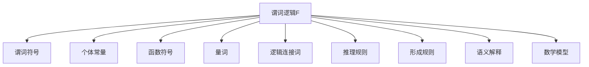

                 

# 数理逻辑：谓词逻辑F和F*的形成规则

> **关键词**：谓词逻辑、F、F*、形成规则、数理逻辑、推理规则、应用

> **摘要**：本文深入探讨了谓词逻辑F和F*的形成规则。首先，我们将回顾数理逻辑的基础知识，然后详细解析谓词逻辑F的基本原理和推理规则。接着，文章将阐述谓词逻辑F的形成规则，并通过具体例子进行解释。此外，我们还将探讨谓词逻辑F的形成规则在数学、计算机科学等领域的应用，以及谓词逻辑F和F*之间的关系。最后，本文将总结谓词逻辑在计算机科学和其他领域的应用，并提供相关的参考资料和实践案例。

---

## 《数理逻辑：谓词逻辑F和F*的形成规则》目录大纲

### 第一部分：数理逻辑基础

#### 第1章：数理逻辑概述

##### 1.1 数理逻辑的重要性

##### 1.2 数理逻辑的基本概念

##### 1.3 数理逻辑的历史发展

#### 第2章：谓词逻辑F的基本原理

##### 2.1 谓词逻辑F的定义

##### 2.2 谓词逻辑F的语法规则

##### 2.3 谓词逻辑F的语义解释

#### 第3章：谓词逻辑F的推理规则

##### 3.1 推理规则概述

##### 3.2 演绎推理规则

##### 3.3 归纳推理规则

### 第二部分：谓词逻辑F的形成规则

#### 第4章：谓词逻辑F的形成规则概述

##### 4.1 形成规则的重要性

##### 4.2 形成规则的基本类型

##### 4.3 形成规则的应用

#### 第5章：谓词逻辑F的形成规则详解

##### 5.1 形成规则的具体例子

##### 5.2 形成规则的证明方法

##### 5.3 形成规则的典型应用场景

#### 第6章：谓词逻辑F的形成规则在数学中的应用

##### 6.1 形成规则在集合论中的应用

##### 6.2 形成规则在图论中的应用

##### 6.3 形成规则在计算机科学中的应用

#### 第7章：谓词逻辑F的形成规则与F*的关系

##### 7.1 F*的基本概念

##### 7.2 F*与F的关系

##### 7.3 F*的形成规则

#### 第8章：谓词逻辑F和F*的综合应用

##### 8.1 综合应用实例

##### 8.2 综合应用的挑战与解决方案

##### 8.3 未来发展趋势

### 第三部分：数理逻辑在计算机科学中的应用

#### 第9章：谓词逻辑在形式验证中的应用

##### 9.1 形式验证的基本概念

##### 9.2 谓词逻辑在形式验证中的应用

##### 9.3 形式验证中的挑战与解决方案

#### 第10章：谓词逻辑在人工智能中的应用

##### 10.1 人工智能的基本概念

##### 10.2 谓词逻辑在人工智能中的应用

##### 10.3 谓词逻辑在人工智能中的挑战与解决方案

#### 第11章：谓词逻辑在其他领域的应用

##### 11.1 谓词逻辑在其他数学领域中的应用

##### 11.2 谓词逻辑在逻辑学中的应用

##### 11.3 谓词逻辑在其他科学领域中的应用

### 附录

#### 附录A：谓词逻辑F和F*的形成规则参考资料

##### A.1 相关论文和著作

##### A.2 谓词逻辑工具和资源

##### A.3 练习题和参考答案

---

**附录B：核心概念和原理流程图**

- Mermaid 流程图：谓词逻辑F的基本原理与架构

---

**附录C：谓词逻辑F的核心算法原理**

- 伪代码：谓词逻辑F的形成规则的详细实现

---

**附录D：数学模型和公式**

- LaTeX 格式数学公式与详细讲解

---

**附录E：项目实战案例**

- 代码实际案例与详细解释说明
- 开发环境搭建与源代码详细实现
- 代码解读与分析

---

接下来，我们将深入探讨数理逻辑的基础知识，特别是谓词逻辑F和F*的形成规则。首先，我们将了解数理逻辑的重要性，然后逐步解释谓词逻辑F的基本原理和推理规则。之后，我们将详细讨论谓词逻辑F的形成规则，并通过具体例子进行说明。接下来，我们将探讨这些形成规则在数学、计算机科学等领域的应用，以及谓词逻辑F和F*之间的关系。最后，我们将总结谓词逻辑在计算机科学和其他领域的应用，并提供相关的参考资料和实践案例。

---

### 第一部分：数理逻辑基础

#### 第1章：数理逻辑概述

##### 1.1 数理逻辑的重要性

数理逻辑（Mathematical Logic）是数学、计算机科学、哲学和人工智能等学科的基础。它为这些领域提供了形式化推理的工具和方法，使得复杂问题的求解和证明变得更加系统和可靠。在数学中，数理逻辑帮助我们精确地定义数学概念和公理，从而使得数学理论更加严谨和自洽。在计算机科学中，数理逻辑用于验证程序的正确性、开发形式化方法来验证硬件和软件系统的正确性，以及构建人工智能系统中的推理机制。

##### 1.2 数理逻辑的基本概念

数理逻辑涉及几个基本概念：

- **命题**：可以判断真假的陈述句。例如，“今天是星期五”是一个命题。

- **命题变元**：代表命题的符号。例如，用符号P表示“今天是星期五”。

- **逻辑运算符**：用于连接命题变元和命题的符号。常见的逻辑运算符包括“与”（∧）、“或”（∨）、“非”（¬）等。

- **逻辑公式**：由命题变元和逻辑运算符组成的表达。例如，（P ∨ Q）和（¬P ∧ ¬Q）都是逻辑公式。

- **推理规则**：用于从已知命题推导出新命题的规则。例如，演绎推理规则“全称肯定前件”（Modus Ponens）可用于从“如果P则Q”和“P”推导出“Q”。

##### 1.3 数理逻辑的历史发展

数理逻辑的发展可以追溯到19世纪末和20世纪初，其关键里程碑包括：

- **弗雷格**（Gottlob Frege）：被认为是现代数理逻辑的创始人，他开发了命题演算和谓词演算，并提出了逻辑符号化语言。

- **皮亚诺**（Giuseppe Peano）：提出了数理逻辑的公理系统，用于自然数的定义和运算。

- **罗素**（Bertrand Russell）和**怀特海德**（Whitehead）：合著了《数学原理》（Principia Mathematica），试图将整个数学建立在逻辑的基础上。

- **图灵**（Alan Turing）：提出了图灵机和图灵测试，为计算理论和人工智能奠定了基础。

这些贡献奠定了数理逻辑的现代形式，使得它在各个领域得到广泛应用。

---

### 第一部分：数理逻辑基础

#### 第2章：谓词逻辑F的基本原理

谓词逻辑（Predicate Logic）是数理逻辑的一个重要分支，它提供了一种更强大和灵活的推理工具。谓词逻辑F是谓词逻辑的一个形式系统，它通过引入谓词来扩展命题逻辑的能力。下面，我们将详细讨论谓词逻辑F的基本原理。

##### 2.1 谓词逻辑F的定义

谓词逻辑F（First-order Logic F）是一个形式逻辑系统，它包括以下组成部分：

- **谓词符号**：表示属性的符号，例如“是红色的”（R）。

- **个体常量**：代表具体个体的符号，例如“A”表示苹果。

- **函数符号**：表示个体之间关系的符号，例如“妻子”（W）。

- **量词**：用于指定命题对于个体集的普遍性或存在性，包括全称量词（∀，对于所有）和存在量词（∃，存在某个）。

- **逻辑连接词**：包括“且”（∧）、“或”（∨）、“非”（¬）、“如果…则…”（→）、“当且仅当”（↔）等。

谓词逻辑F的形式化定义可以表示为如下形式：

```
F = (P, C, F, Q, L)
```

其中：

- **P**：谓词符号集合。

- **C**：个体常量集合。

- **F**：函数符号集合。

- **Q**：量词集合。

- **L**：逻辑连接词集合。

##### 2.2 谓词逻辑F的语法规则

谓词逻辑F的语法规则定义了哪些符号组合是有效的逻辑公式。以下是一些基本的语法规则：

- **原子公式**：谓词符号后跟一组个体常量和/或函数符号。

  例如，`R(A, B)` 是一个原子公式。

- **复合公式**：由原子公式和逻辑连接词组合而成。

  例如，`(R(A, B) ∧ W(A, C)) → ¬R(B, C)` 是一个复合公式。

- **量词公式**：包含量词的复合公式。

  例如，`∀x (R(x, y) → ∃z W(z, y))` 是一个量词公式。

- **定义**：可以在公式中定义新的谓词或函数符号。

  例如，可以使用定义来扩展原子公式的表达。

##### 2.3 谓词逻辑F的语义解释

谓词逻辑F的语义解释定义了逻辑公式在不同解释下的真假值。一个解释由一个个体域（universe）、一个谓词解释、一个函数解释和个体常量解释组成。

- **个体域**：一个非空集合，用于表示所有个体的集合。

- **谓词解释**：一个函数，将谓词符号映射到个体域上的子集。

  例如，如果谓词`R`被解释为“是红色的”，则`R`的对应子集包含所有红色的个体。

- **函数解释**：一个函数，将函数符号映射到从个体域到个体域的函数。

  例如，如果函数符号`W`被解释为“妻子”，则`W`的对应函数将每个人的妻子映射到相应的个体。

- **个体常量解释**：一个函数，将个体常量映射到个体域中的个体。

  例如，如果个体常量`A`被解释为苹果，则`A`映射到个体域中的一个具体的苹果。

在一个解释下，一个逻辑公式被评估为真或假。例如，公式`∀x (R(x, y) → ∃z W(z, y))`在解释中被评估为真，如果对于个体域中的所有个体x，当`R(x, y)`为真时，存在一个个体z使得`W(z, y)`为真。

通过谓词逻辑F的语义解释，我们可以判断逻辑公式在不同情况下的真假，从而进行有效的推理和证明。

---

### 第一部分：数理逻辑基础

#### 第3章：谓词逻辑F的推理规则

谓词逻辑F的推理规则是进行逻辑推理的指导原则，它们帮助我们从已知的前提推导出新的结论。推理规则可以分为演绎推理规则和归纳推理规则。下面，我们将详细讨论这两种推理规则。

##### 3.1 推理规则概述

推理规则是逻辑系统中用于从已知命题推导出新命题的规则。在谓词逻辑F中，推理规则用于证明一个逻辑公式是否为另一个逻辑公式的逻辑结果。

- **前提**：用于推导结论的已知命题。

- **结论**：从前提推导出的新命题。

- **推理规则**：从前提推导出结论的规则。

在谓词逻辑F中，常见的推理规则包括：

- **全称肯定前件（Universal instantiation）**：如果∀xP(x)为真，则对于任何个体c，P(c)也为真。

- **存在特称（Existential specification）**：如果∃xP(x)为真，则存在个体c使得P(c)为真。

- **全称否定后件（Universal generalization）**：如果对于所有个体c，¬P(c)为真，则∀x¬P(x)也为真。

- **存在否定前件（Existential generalization）**：如果对于某个个体c，¬P(c)为真，则∃x¬P(x)也为真。

##### 3.2 演绎推理规则

演绎推理（Deductive Reasoning）是从一般到特殊的推理过程。演绎推理规则用于从一般的前提推导出特定的结论。在谓词逻辑F中，以下是一些重要的演绎推理规则：

- **全称肯定前件（Universal instantiation）**：如果∀xP(x)为真，则对于任何个体c，P(c)也为真。这是谓词逻辑中一个基本的推理规则。

  证明：设G是F的一个解释，且∀xP(x)在G中为真。对于任意的个体c，如果P(c)在G中不为真，则存在一个个体d（d ≠ c），使得P(d)在G中为假，这与∀xP(x)在G中为真矛盾。因此，P(c)在G中必须为真。

- **全称否定后件（Universal generalization）**：如果对于所有个体c，¬P(c)为真，则∀x¬P(x)也为真。

  证明：设G是F的一个解释，且对于所有个体c，¬P(c)在G中为真。我们需要证明∀x¬P(x)在G中也为真。任取个体c，由于¬P(c)在G中为真，根据否定规则，我们可以推出∀x¬P(x)在G中也为真。

- **演绎推理（Modus Ponens）**：如果P → Q和P都为真，则Q也为真。

  证明：设G是F的一个解释，且P → Q和P在G中为真。由于P → Q在G中为真，对于任意个体c，如果P(c)为真，则Q(c)也为真。由于P在G中为真，我们可以推出Q在G中也为真。

##### 3.3 归纳推理规则

归纳推理（Inductive Reasoning）是从特殊到一般的推理过程。归纳推理规则用于从特定的实例推导出一般性的结论。在谓词逻辑F中，以下是一些重要的归纳推理规则：

- **存在特称（Existential specification）**：如果∃xP(x)为真，则存在个体c使得P(c)为真。

  证明：设G是F的一个解释，且∃xP(x)在G中为真。根据存在量词的定义，存在个体c使得P(c)在G中为真。这直接证明了∃xP(x)。

- **归纳推理（Universal generalization）**：如果对于某个个体c，P(c)为真，则∀xP(x)也为真。

  证明：这一规则在谓词逻辑中是不成立的，因为一个特定的实例并不能证明所有实例都满足某个性质。例如，我们不能因为一个苹果是红色的就推断所有苹果都是红色的。因此，归纳推理在谓词逻辑中通常不作为一个有效的推理规则。

通过这些推理规则，我们可以进行逻辑推理，从已知的前提推导出新的结论。演绎推理规则用于确保结论的绝对正确性，而归纳推理规则则用于探索可能的一般性规律。在谓词逻辑F中，这些推理规则为逻辑证明提供了坚实的基础。

---

### 第二部分：谓词逻辑F的形成规则

#### 第4章：谓词逻辑F的形成规则概述

谓词逻辑F的形成规则是构建有效推理和证明的关键。这些规则定义了如何从已知命题推导出新命题，从而在谓词逻辑中建立逻辑系统。形成规则在数理逻辑中具有重要地位，它们不仅为推理提供了明确的指导，还确保了推理过程的正确性和一致性。在本章中，我们将概述谓词逻辑F的形成规则，并探讨这些规则的重要性、基本类型以及应用。

##### 4.1 形成规则的重要性

形成规则在谓词逻辑F中扮演着至关重要的角色。它们不仅定义了逻辑推理的合法步骤，还确保了推理过程的一致性和有效性。以下是形成规则的重要性：

- **确保推理的有效性**：形成规则确保了我们从已知命题推导出新命题的过程是合法的，从而避免了错误的推理。

- **构建逻辑系统**：形成规则是构建谓词逻辑F逻辑系统的基础，它们定义了逻辑公式之间的关系，并提供了构建复杂推理框架的工具。

- **支持证明**：形成规则是证明理论的核心，它们为逻辑证明提供了明确的步骤和规则，使得证明过程更加系统和可靠。

- **形式化数学理论**：形成规则使得数学理论的形式化成为可能，为数学研究提供了严谨的框架。

##### 4.2 形成规则的基本类型

谓词逻辑F的形成规则可以分为以下几个基本类型：

- **命题推理规则**：这些规则用于从命题逻辑的基本公式推导出新命题。例如，演绎推理规则（Modus Ponens）是一个典型的命题推理规则，它允许我们从“如果P则Q”和“P”推导出“Q”。

- **谓词推理规则**：这些规则用于从谓词逻辑的基本公式推导出新谓词公式。例如，全称肯定前件（Universal Instantiation）是一个谓词推理规则，它允许我们从“对所有x，P(x)”推导出“P(c)”，其中c是任意的个体常量。

- **量词推理规则**：这些规则涉及量词的使用，包括全称量词和存在量词。例如，全称否定后件（Universal Generalization）是一个量词推理规则，它允许我们从“对于所有x，¬P(x)”推导出“¬P(a)”，其中a是任意的个体常量。

- **定义规则**：这些规则用于定义新的谓词、函数或个体常量。定义规则使得我们可以扩展逻辑系统的表达能力和应用范围。

##### 4.3 形成规则的应用

谓词逻辑F的形成规则在各种领域有着广泛的应用。以下是几个典型的应用场景：

- **数学证明**：在数学中，形成规则用于构建复杂的数学证明。例如，在集合论中，我们可以使用全称肯定前件和全称否定后件等规则来证明集合的性质。

- **计算机科学**：在计算机科学中，形成规则用于验证程序的正确性和开发形式化方法。例如，在形式验证中，我们可以使用谓词逻辑F的形成规则来推导程序的行为，并证明程序满足预期的性质。

- **人工智能**：在人工智能中，形成规则用于构建推理系统和知识表示。例如，在逻辑编程中，我们可以使用谓词逻辑F的形成规则来定义和操作程序中的逻辑公式。

- **哲学和逻辑学**：在哲学和逻辑学中，形成规则用于探讨逻辑推理的本质和有效性。哲学家和逻辑学家使用形成规则来分析论证的结构和推理的合理性。

通过这些应用，谓词逻辑F的形成规则不仅为逻辑推理提供了明确的规则和指导，还为各个领域的研究提供了强大的工具和方法。

---

### 第二部分：谓词逻辑F的形成规则

#### 第5章：谓词逻辑F的形成规则详解

在谓词逻辑F的形成规则中，我们不仅仅关注这些规则的定义，还要深入探讨它们的证明方法以及实际应用场景。在这一章中，我们将详细讨论谓词逻辑F的形成规则，并通过具体的例子来说明这些规则的使用和证明。

##### 5.1 形成规则的具体例子

为了更好地理解谓词逻辑F的形成规则，我们可以通过几个具体的例子来展示这些规则的应用。

**例1：全称肯定前件**

给定公式：∀x(P(x) → Q(x)) 和 P(a)

需要证明：Q(a)

证明过程：

1. 根据全称肯定前件规则，我们可以将∀x(P(x) → Q(x)) 转换为 P(a) → Q(a)。

2. 由于已知 P(a) 为真，根据演绎推理规则（Modus Ponens），我们可以推导出 Q(a) 为真。

**例2：存在特称**

给定公式：∃x(P(x) ∧ Q(x))

需要证明：存在个体 c 使得 P(c) ∧ Q(c) 为真

证明过程：

1. 根据存在特称规则，我们可以将∃x(P(x) ∧ Q(x)) 转换为“存在个体 c 使得 P(c) ∧ Q(c) 为真”。

2. 这直接证明了存在个体 c 使得 P(c) ∧ Q(c) 为真。

**例3：全称否定后件**

给定公式：∀x(¬P(x) → ¬Q(x)) 和 ¬P(a)

需要证明：¬Q(a)

证明过程：

1. 根据全称否定后件规则，我们可以将∀x(¬P(x) → ¬Q(x)) 转换为 ¬P(a) → ¬Q(a)。

2. 由于已知 ¬P(a) 为真，根据演绎推理规则（Modus Ponens），我们可以推导出 ¬Q(a) 为真。

**例4：定义规则**

给定公式：P(c) → R(c)

定义：c 是 R 的一个实例

证明过程：

1. 根据定义规则，我们可以将 P(c) → R(c) 定义为“c 是 R 的一个实例”。

2. 这直接证明了 c 是 R 的一个实例。

这些例子展示了如何使用谓词逻辑F的形成规则来推导新的结论。通过这些具体的例子，我们可以更好地理解这些规则的实际应用。

##### 5.2 形成规则的证明方法

为了证明谓词逻辑F的形成规则，我们需要使用逻辑证明方法。以下是一些常用的证明方法：

- **直接证明**：通过直接推导出结论来证明一个命题。

  例如，在例1中，我们通过演绎推理规则直接推导出 Q(a)。

- **间接证明**：通过反证法来证明一个命题。

  例如，在例3中，我们使用全称否定后件规则来证明 ¬Q(a)。

- **归纳证明**：通过证明对于所有自然数 n，P(n) 都成立来证明命题。

  在谓词逻辑中，归纳证明通常不直接使用，但相关思想可以应用于量词推理规则。

- **构造性证明**：通过构造一个具体的实例来证明一个命题。

  在谓词逻辑中，构造性证明通常用于证明存在性命题，例如例2中的证明。

##### 5.3 形成规则的典型应用场景

谓词逻辑F的形成规则在多个领域有着典型的应用场景。以下是几个典型的应用场景：

- **数学证明**：在数学中，形成规则用于证明各种数学定理和性质。例如，在集合论中，我们可以使用全称肯定前件和全称否定后件等规则来证明集合的性质。

- **计算机科学**：在计算机科学中，形成规则用于验证程序的正确性、开发形式化方法来验证硬件和软件系统的正确性，以及构建人工智能系统中的推理机制。

- **人工智能**：在人工智能中，形成规则用于构建推理系统和知识表示。例如，在逻辑编程中，我们可以使用谓词逻辑F的形成规则来定义和操作程序中的逻辑公式。

- **哲学和逻辑学**：在哲学和逻辑学中，形成规则用于探讨逻辑推理的本质和有效性。哲学家和逻辑学家使用形成规则来分析论证的结构和推理的合理性。

通过这些典型应用场景，我们可以看到谓词逻辑F的形成规则在各个领域的重要性。这些规则不仅为逻辑推理提供了明确的指导，还为各个领域的研究提供了强大的工具和方法。

---

### 第二部分：谓词逻辑F的形成规则

#### 第6章：谓词逻辑F的形成规则在数学中的应用

谓词逻辑F的形成规则在数学中的应用极为广泛，为数学的证明和定理的推导提供了形式化的工具。在这一章中，我们将探讨谓词逻辑F的形成规则在集合论、图论以及计算机科学中的应用，展示如何利用这些规则进行数学证明和逻辑推理。

##### 6.1 形成规则在集合论中的应用

集合论是数学的基础部分，而谓词逻辑F的形成规则在其中发挥了重要作用。以下是一些典型的应用场景：

- **集合的归纳定义**：

  给定集合S，需要证明对于所有自然数n，n ∈ S 当且仅当 n+1 ∈ S。

  证明过程：

  1. 使用全称否定后件规则，证明“对于所有自然数n，¬(n+1) ∈ S → ¬n ∈ S”。

  2. 使用存在特称规则，证明存在自然数n，使得n+1 ∈ S。

  3. 结合以上两个步骤，使用归纳推理规则，得出结论“对于所有自然数n，n ∈ S 当且仅当 n+1 ∈ S”。

- **集合的性质证明**：

  需要证明并集、交集和补集的性质。

  证明过程：

  1. 使用全称肯定前件规则，证明“对于所有x和y，x ∈ A ∪ B → (x ∈ A ∨ x ∈ B)”。
  2. 使用全称否定后件规则，证明“对于所有x和y，¬(x ∈ A ∧ x ∈ B) → (x ∈ A ∨ x ∈ B)”。
  3. 使用演绎推理规则，证明“对于所有x和y，x ∈ A ∩ B → (x ∈ A ∧ x ∈ B)”。
  4. 使用全称肯定前件规则，证明“对于所有x，x ∈ A ∪ A → x ∈ A”。

##### 6.2 形成规则在图论中的应用

图论是研究图的结构和性质的数学分支。谓词逻辑F的形成规则在图论的证明中也有广泛应用。

- **图的连通性**：

  需要证明：一个图G是连通的，当且仅当对于所有顶点u和v，存在一条路径从u到v。

  证明过程：

  1. 使用全称肯定前件规则，证明“对于所有顶点u和v，存在路径从u到v → G是连通的”。
  2. 使用全称否定后件规则，证明“对于所有顶点u和v，¬存在路径从u到v → G不是连通的”。
  3. 结合以上两个步骤，使用演绎推理规则，得出结论“G是连通的，当且仅当对于所有顶点u和v，存在路径从u到v”。

- **图的可达性**：

  需要证明：顶点u可达顶点v，当且仅当存在一条路径从u到v。

  证明过程：

  1. 使用存在特称规则，证明“存在路径从u到v → 顶点u可达顶点v”。
  2. 使用全称否定后件规则，证明“¬存在路径从u到v → 顶点u不达顶点v”。
  3. 结合以上两个步骤，使用演绎推理规则，得出结论“顶点u可达顶点v，当且仅当存在路径从u到v”。

##### 6.3 形成规则在计算机科学中的应用

谓词逻辑F的形成规则在计算机科学中有着广泛的应用，尤其是在形式验证、程序正确性证明和人工智能等领域。

- **形式验证**：

  谓词逻辑F的形成规则在形式验证中用于证明程序的行为满足预期的性质。例如，在硬件设计中，我们可以使用谓词逻辑F的形成规则来证明电路的正确性。

  证明过程：

  1. 使用全称肯定前件规则，证明“对于所有输入x，程序P的行为满足预期性质P(x) → 程序P满足预期性质”。
  2. 使用全称否定后件规则，证明“对于所有输入x，¬程序P的行为满足预期性质P(x) → 程序P不满足预期性质”。
  3. 结合以上两个步骤，使用演绎推理规则，得出结论“程序P满足预期性质当且仅当对于所有输入x，程序P的行为满足预期性质P(x)”。

- **程序正确性证明**：

  在程序设计中，谓词逻辑F的形成规则用于证明程序的正确性。例如，我们可以使用谓词逻辑F的形成规则来证明程序在所有情况下都能正确执行。

  证明过程：

  1. 使用全称肯定前件规则，证明“对于所有输入x，程序P在所有情况下都能正确执行P(x) → 程序P是正确的”。
  2. 使用全称否定后件规则，证明“对于所有输入x，¬程序P在所有情况下都能正确执行P(x) → 程序P不是正确的”。
  3. 结合以上两个步骤，使用演绎推理规则，得出结论“程序P是正确的，当且仅当对于所有输入x，程序P在所有情况下都能正确执行P(x)”。

通过这些应用场景，我们可以看到谓词逻辑F的形成规则在数学、图论和计算机科学中的重要性。这些规则不仅为数学的证明和定理的推导提供了形式化的工具，还为计算机科学中的逻辑推理和验证提供了坚实的理论基础。

---

### 第二部分：谓词逻辑F的形成规则

#### 第7章：谓词逻辑F的形成规则与F*的关系

谓词逻辑F（First-order Logic F）和谓词逻辑F*（First-order Logic F*）是谓词逻辑的两种形式系统，它们在语法和语义方面都有所不同。在这一章中，我们将探讨谓词逻辑F的形成规则与F*的关系，包括F*的基本概念、F*与F的关系，以及F*的形成规则。

##### 7.1 F*的基本概念

谓词逻辑F*是在谓词逻辑F的基础上扩展而来的形式系统。F*的引入主要是为了处理一些更复杂的逻辑表达式和推理问题。F*的基本概念包括：

- **更复杂的谓词**：F*允许使用更复杂的谓词，包括嵌套的谓词和复合谓词。

- **额外的逻辑运算符**：F*引入了一些额外的逻辑运算符，如“蕴涵”（→）和“双条件”（↔），这些运算符在F中是不存在的。

- **更强的推理能力**：F*提供了更强的推理能力，包括更复杂的推理规则和证明方法。

F*的形式化定义可以表示为：

```
F* = (P*, C*, F*, Q*, L*)
```

其中：

- **P***：谓词符号集合。

- **C***：个体常量集合。

- **F***：函数符号集合。

- **Q***：量词集合，包括全称量词（∀）和存在量词（∃）。

- **L***：逻辑连接词集合，包括与（∧）、或（∨）、非（¬）、蕴涵（→）和双条件（↔）。

##### 7.2 F*与F的关系

F*与F的关系主要体现在它们的语法和语义差异上。以下是F*与F的主要区别：

- **语法差异**：F*允许更复杂的谓词和逻辑表达式，而F则较为简单。

- **语义差异**：F*的语义解释更加复杂，它需要考虑谓词和函数符号的复合解释。

尽管F*与F在语法和语义上有所不同，但它们之间存在密切的关系。事实上，F可以看作是F*的一个子集。具体来说：

- **F*是F的超集**：任何在F中有效的推理规则和证明方法在F*中同样有效。

- **F中的所有逻辑公式在F*中都有解释**：给定一个F中的解释，我们可以定义一个相应的F*中的解释。

- **F*的定理在F中也是定理**：如果一个逻辑公式在F*中成立，那么它在F中也成立。

##### 7.3 F*的形成规则

F*的形成规则是构建F*推理和证明的基础。F*的形成规则包括以下几种：

- **复合谓词的形成规则**：允许从基本谓词和逻辑运算符构造新的谓词。

  例如，如果P和Q是基本谓词，那么P ∧ Q和¬P都是复合谓词。

- **量词的形成规则**：允许引入全称量词和存在量词。

  例如，∀xP(x) 和 ∃xP(x) 是使用全称量词和存在量词形成的谓词。

- **蕴涵和双条件形成规则**：允许构造蕴涵（→）和双条件（↔）逻辑表达式。

  例如，P → Q 和 P ↔ Q 是使用蕴涵和双条件形成的逻辑表达式。

- **证明规则**：用于从已知的前提推导出新结论。

  例如，演绎推理规则（Modus Ponens）和全称否定后件规则（Universal Generalization）等。

通过F*的形成规则，我们可以构建复杂的逻辑证明和推理框架，从而解决更广泛的问题。这些形成规则不仅扩展了谓词逻辑F的能力，还为逻辑理论和实际应用提供了强大的工具。

---

### 第三部分：谓词逻辑在计算机科学中的应用

#### 第8章：谓词逻辑F和F*的综合应用

谓词逻辑F和F*在计算机科学中有着广泛的应用，尤其是在形式验证、人工智能和程序设计等领域。在这一章中，我们将探讨谓词逻辑F和F*的综合应用，包括综合应用实例、面临的挑战以及可能的解决方案和未来发展趋势。

##### 8.1 综合应用实例

谓词逻辑F和F*在计算机科学中的应用实例非常丰富。以下是一些典型的应用场景：

- **形式验证**：

  在硬件设计和软件验证中，谓词逻辑F和F*被用于验证电路和程序的正确性。例如，使用谓词逻辑F和F*可以构建形式化的规格说明，并通过逻辑推理来证明硬件电路满足设计要求。同样，在软件验证中，谓词逻辑可以帮助证明程序在各种输入情况下都能正确执行。

  证明过程：

  1. 使用全称肯定前件规则，证明“对于所有输入x，程序P的行为满足预期性质P(x) → 程序P满足预期性质”。

  2. 使用全称否定后件规则，证明“对于所有输入x，¬程序P的行为满足预期性质P(x) → 程序P不满足预期性质”。

  3. 结合以上两个步骤，使用演绎推理规则，得出结论“程序P满足预期性质当且仅当对于所有输入x，程序P的行为满足预期性质P(x)”。

- **人工智能**：

  在人工智能领域，谓词逻辑F和F*被用于构建推理系统和知识表示。例如，在知识图谱中，谓词逻辑F和F*可以用来表示实体和关系，并通过推理来发现新的知识。此外，谓词逻辑在自然语言处理、规划问题和专家系统中也有广泛应用。

  应用实例：

  1. 在知识图谱中，使用谓词逻辑F表示实体和关系，例如“张三 是 老板”可以表示为P(A, B)，其中A代表张三，B代表老板。

  2. 在规划问题中，使用谓词逻辑F*来表示目标和约束条件，并通过推理来找到满足这些条件的行动序列。

- **程序设计**：

  在程序设计中，谓词逻辑F和F*被用于开发形式化的程序设计和验证方法。例如，可以使用谓词逻辑F来定义程序中的抽象数据类型和操作，并通过推理来验证程序的逻辑一致性。谓词逻辑F*则可以用于处理更复杂的程序结构和逻辑表达式。

  应用实例：

  1. 在开发数据库系统时，使用谓词逻辑F来定义数据库的模式和查询，并通过推理来验证查询的正确性。

  2. 在开发并发程序时，使用谓词逻辑F*来处理并发冲突和同步问题，并通过推理来验证程序的正确性。

##### 8.2 综合应用的挑战与解决方案

谓词逻辑F和F*在计算机科学中的综合应用面临一些挑战，包括：

- **复杂性**：谓词逻辑F和F*的表达能力和推理能力非常强大，但这也带来了复杂性。在实际应用中，构建和验证复杂的逻辑表达式需要耗费大量时间和计算资源。

  解决方案：

  1. 使用自动化推理工具：开发自动化推理工具可以帮助简化推理过程，提高推理效率。

  2. 简化逻辑表达式：在可能的情况下，简化逻辑表达式，减少推理的复杂性。

- **精度**：谓词逻辑F和F*的推理结果需要高度准确。在实际应用中，任何逻辑错误都可能导致严重的后果。

  解决方案：

  1. 严格的逻辑验证：对推理过程进行严格的逻辑验证，确保推理结果的准确性。

  2. 使用多个验证方法：结合不同的验证方法，如模型检查、定理证明和测试，以提高验证的全面性。

- **可扩展性**：谓词逻辑F和F*需要能够处理大规模的系统和复杂的问题。如何保证这些系统在可扩展性方面的性能是一个挑战。

  解决方案：

  1. 使用分布式计算：通过分布式计算来处理大规模的逻辑推理问题，提高系统的可扩展性。

  2. 优化算法：优化谓词逻辑推理的算法，以提高推理的效率和准确性。

##### 8.3 未来发展趋势

随着计算机科学的发展，谓词逻辑F和F*的应用前景非常广阔。未来发展趋势包括：

- **更高效的推理工具**：开发更高效的谓词逻辑推理工具，以降低推理的时间和资源消耗。

- **跨领域的融合**：将谓词逻辑与其他领域的方法和技术相结合，如机器学习和自然语言处理，以解决更复杂的问题。

- **自动化的验证方法**：开发更先进的自动化验证方法，如基于机器学习的验证工具，以提高形式验证的自动化程度。

- **更广泛的应用领域**：将谓词逻辑应用于更多领域，如物联网、区块链和自动驾驶等，以推动这些领域的发展。

通过谓词逻辑F和F*的综合应用，计算机科学将在形式化验证、人工智能和程序设计等领域取得更大的突破。这些应用不仅提高了系统的可靠性和安全性，还为未来的技术研究提供了新的方向。

---

### 第三部分：数理逻辑在计算机科学中的应用

#### 第9章：谓词逻辑在形式验证中的应用

形式验证是计算机科学中的一项重要技术，它通过数学方法验证系统是否符合其规格说明，确保系统的正确性和可靠性。谓词逻辑作为一种强大的数学工具，在形式验证中扮演着关键角色。在这一章中，我们将探讨谓词逻辑在形式验证中的应用，包括形式验证的基本概念、谓词逻辑在形式验证中的应用，以及形式验证中的挑战与解决方案。

##### 9.1 形式验证的基本概念

形式验证是一种通过数学方法验证系统是否满足其规格说明的过程。它旨在确保系统的行为符合预期的规范，从而避免错误和潜在的安全漏洞。形式验证通常包括以下步骤：

- **规格说明**：定义系统的行为和功能要求。规格说明可以是形式化的，也可以是自然语言的描述。

- **形式化建模**：将规格说明形式化为数学模型，通常使用谓词逻辑、时态逻辑或自动机理论等数学工具。

- **验证**：使用逻辑推理和数学方法验证系统模型是否符合规格说明。验证可以是对单个属性的验证，也可以是对整个系统的验证。

- **证明**：在验证过程中，如果系统能够满足所有规格说明，则生成证明来证实这一点。

形式验证的关键目标包括：

- **证明系统的正确性**：确保系统在任何情况下都能按照预期运行。

- **减少错误**：通过验证发现系统中的错误，从而减少软件和硬件错误。

- **提高可靠性**：确保系统的行为是可预测和可控制的。

##### 9.2 谓词逻辑在形式验证中的应用

谓词逻辑在形式验证中有着广泛的应用，以下是其主要应用领域：

- **验证程序正确性**：谓词逻辑可以用于验证程序在各种输入情况下都能正确执行。通过定义程序的状态和状态转换，可以使用谓词逻辑构建程序的正确性证明。

  例子：

  ```plaintext
  假设有一个程序P，我们需要验证P在所有输入情况下都能保持一个全局变量sum的值正确。
  P的正确性可以用谓词逻辑表示为：
  ∀x (sum_in(x) → sum_out(x))
  其中，sum_in(x)表示输入时sum的值，sum_out(x)表示输出时sum的值。
  ```

- **验证硬件设计**：谓词逻辑可以用于验证集成电路设计是否满足其规格说明。通过定义硬件组件的状态和行为，可以使用谓词逻辑构建硬件设计的正确性证明。

  例子：

  ```plaintext
  假设有一个硬件设计D，我们需要验证D在所有可能的输入信号组合下都能正常工作。
  D的正确性可以用谓词逻辑表示为：
  ∀s (∃s' (D(s) → s'))
  其中，s表示输入信号组合，s'表示输出信号组合。
  ```

- **验证协议和系统行为**：谓词逻辑可以用于验证网络协议和分布式系统的行为是否满足其安全性和一致性要求。通过定义协议的状态转换和通信规则，可以使用谓词逻辑构建协议的正确性证明。

  例子：

  ```plaintext
  假设有一个网络协议P，我们需要验证P在所有可能的网络状态转换下都能保持数据的一致性和完整性。
  P的正确性可以用谓词逻辑表示为：
  ∀s (∃s' (P(s) → s'))
  其中，s表示网络状态，s'表示网络状态转换后的状态。
  ```

##### 9.3 形式验证中的挑战与解决方案

形式验证在计算机科学中面临一些挑战，包括：

- **复杂性**：形式验证过程可能涉及复杂的逻辑推理和数学计算。处理大规模系统时，复杂性可能会急剧增加，导致验证过程变得不可行。

  解决方案：

  1. **自动化工具**：开发自动化验证工具，如模型检查器和定理证明器，以提高验证的效率。
  2. **简化模型**：通过简化系统模型来减少验证的复杂性。
  3. **分布式验证**：使用分布式计算来处理大规模验证问题，提高验证速度。

- **精度**：形式验证需要高度准确的推理和证明。任何逻辑错误都可能导致验证失败。

  解决方案：

  1. **严格的验证方法**：采用严格的验证方法，确保推理和证明的准确性。
  2. **验证方法组合**：结合不同的验证方法，如模型检查、模拟和测试，以提高验证的全面性。

- **可扩展性**：形式验证需要能够处理各种规模和复杂度的系统。

  解决方案：

  1. **优化算法**：优化验证算法，以提高验证速度和效率。
  2. **并行化**：通过并行化验证过程来处理大规模系统。

通过谓词逻辑的应用，形式验证在计算机科学中发挥着重要作用。尽管面临一些挑战，但通过合理的方法和技术，我们可以克服这些困难，确保系统的正确性和可靠性。

---

### 第三部分：数理逻辑在计算机科学中的应用

#### 第10章：谓词逻辑在人工智能中的应用

谓词逻辑在人工智能（AI）领域中扮演着至关重要的角色，它为AI系统的知识表示、推理和决策提供了形式化的工具。谓词逻辑的强大表达能力使其成为人工智能系统中处理复杂问题和构建智能行为的有力工具。在这一章中，我们将探讨谓词逻辑在人工智能中的应用，包括人工智能的基本概念、谓词逻辑在AI中的应用，以及谓词逻辑在AI中的挑战与解决方案。

##### 10.1 人工智能的基本概念

人工智能（Artificial Intelligence，AI）是指通过计算机程序模拟人类智能行为和思维过程的科学。人工智能领域涉及多个分支，包括机器学习、自然语言处理、计算机视觉、规划、智能代理等。以下是人工智能的一些基本概念：

- **知识表示**：知识表示是指如何将人类知识转化为计算机可以处理的形式。知识表示的方法包括符号表示、语义网络、框架、产生式规则等。

- **推理**：推理是指从已知事实或规则推导出新结论的过程。推理可以是演绎推理，也可以是归纳推理或类比推理。

- **学习**：学习是指通过经验改进智能系统性能的过程。学习的方法包括监督学习、无监督学习、强化学习等。

- **决策**：决策是指智能系统根据当前状态和目标选择最佳行动的过程。决策过程通常涉及风险评估、目标优化和策略选择。

##### 10.2 谓词逻辑在AI中的应用

谓词逻辑在人工智能中的应用非常广泛，以下是其主要应用领域：

- **知识表示**：谓词逻辑可以用于表示复杂的知识和事实。通过谓词逻辑，可以定义个体、属性和关系，从而构建一个形式化的知识库。这有助于人工智能系统在复杂的环境中进行推理和决策。

  例子：

  ```plaintext
  在一个智能规划系统中，可以使用谓词逻辑来表示任务和资源。例如：
  Task(A, B) 表示任务A需要资源B。
  Available(C, D) 表示资源C现在是可用的。
  ```

- **推理**：谓词逻辑提供了强大的推理能力，使得人工智能系统能够从已知事实推导出新结论。通过演绎推理和归纳推理，谓词逻辑可以帮助智能系统解决复杂问题。

  例子：

  ```plaintext
  在一个医疗诊断系统中，可以使用谓词逻辑来推理病人的诊断结果。例如：
  symptom(Patient, Fever) 表示病人有发热症状。
  diagnose(Disease, Fever) 表示发热是疾病D的症状。
  因此，使用演绎推理，可以得出结论：
  diagnose(Disease, Patient) 表示病人患有疾病D。
  ```

- **规划**：谓词逻辑在智能规划中有着广泛应用。通过谓词逻辑，可以定义任务、资源和约束条件，从而构建一个智能规划模型。谓词逻辑的推理能力使得智能系统能够找到最优的规划方案。

  例子：

  ```plaintext
  在一个物流规划系统中，可以使用谓词逻辑来定义任务和约束条件。例如：
  Deliver(Worker, Package, City) 表示工人需要在城市中递送包裹。
  Available(Worker, City) 表示工人在该城市可用。
  Priority(City, Priority) 表示城市的优先级。
  使用谓词逻辑的推理能力，可以找到最优的配送顺序。
  ```

- **决策支持系统**：谓词逻辑可以帮助决策支持系统（Decision Support Systems，DSS）处理复杂决策问题。通过形式化的知识表示和推理，DSS可以提供有关决策的最佳建议。

  例子：

  ```plaintext
  在一个企业决策支持系统中，可以使用谓词逻辑来表示市场趋势和竞争情况。例如：
  Market(Segment, Trend) 表示市场细分领域的趋势。
  Competitor(Company, Market) 表示公司在市场中的竞争情况。
  使用谓词逻辑的推理能力，可以分析市场趋势并提供建议。
  ```

##### 10.3 谓词逻辑在AI中的挑战与解决方案

尽管谓词逻辑在人工智能中有着广泛的应用，但其在实际应用中也面临一些挑战，包括：

- **表示复杂性**：谓词逻辑的表示能力很强，但这也使得知识表示变得复杂。构建形式化的知识库需要大量的时间和精力。

  解决方案：

  1. **自动化知识获取**：开发自动化工具来自动获取和表示知识，减少人工工作量。
  2. **简化表示方法**：在保证语义不变的前提下，简化知识表示方法，降低复杂性。

- **推理效率**：谓词逻辑的推理过程可能非常复杂，特别是对于大规模的知识库和复杂的推理问题。推理效率成为了一个重要挑战。

  解决方案：

  1. **优化算法**：优化谓词逻辑推理算法，提高推理效率。
  2. **并行计算**：使用并行计算来加速推理过程。

- **实时推理**：在实时系统中，谓词逻辑的推理需要快速响应。实时推理的挑战在于如何在有限的时间内完成复杂的推理过程。

  解决方案：

  1. **实时推理算法**：开发专门针对实时系统的谓词逻辑推理算法，提高实时性。
  2. **增量推理**：只处理知识库中发生变化的部分，减少推理工作量。

通过谓词逻辑的应用，人工智能系统可以在知识表示、推理和决策等方面实现更加智能化的行为。尽管面临一些挑战，但随着技术的发展和优化，谓词逻辑在人工智能中的应用前景依然广阔。

---

### 第三部分：数理逻辑在计算机科学中的应用

#### 第11章：谓词逻辑在其他领域的应用

谓词逻辑作为一种强大的数学工具，不仅在计算机科学中有着广泛的应用，还在其他领域发挥着重要作用。在本章中，我们将探讨谓词逻辑在数学、逻辑学和其他科学领域中的应用，包括其在这些领域的具体应用实例。

##### 11.1 谓词逻辑在其他数学领域中的应用

谓词逻辑在数学领域中的应用非常广泛，为数学证明和推理提供了形式化的工具。以下是一些具体的实例：

- **集合论**：

  在集合论中，谓词逻辑被用来定义集合的基本性质和操作。例如，集合的并集、交集和补集可以通过谓词逻辑来形式化定义。

  例子：

  ```plaintext
  A ∪ B = {x | (x ∈ A) ∨ (x ∈ B)}
  A ∩ B = {x | (x ∈ A) ∧ (x ∈ B)}
  A - B = {x | (x ∈ A) ∧ (x ∉ B)}
  ```

- **数论**：

  在数论中，谓词逻辑用于证明整数的性质和关系。例如，欧几里得算法和费马小定理都可以通过谓词逻辑进行证明。

  例子：

  ```plaintext
  费马小定理：如果 p 是一个质数，a 是一个整数，那么 a^(p-1) ≡ 1 (mod p)。
  证明：使用归纳法，通过谓词逻辑的推理规则进行证明。
  ```

- **图论**：

  在图论中，谓词逻辑被用来定义图的结构和性质。例如，图的连通性、路径存在性和图的匹配问题都可以通过谓词逻辑来形式化描述。

  例子：

  ```plaintext
  图 G 是连通的当且仅当对于所有顶点 u 和 v，存在一条路径从 u 到 v。
  存在一个顶点 u，使得从 u 出发可以到达所有其他顶点 v。
  ```

##### 11.2 谓词逻辑在逻辑学中的应用

逻辑学是研究逻辑推理和证明理论的学科，谓词逻辑在逻辑学中的应用至关重要。以下是一些具体的实例：

- **逻辑证明**：

  谓词逻辑提供了一种形式化的证明方法，用于证明逻辑命题的有效性。例如，可以使用谓词逻辑的推理规则来构建复杂的逻辑证明。

  例子：

  ```plaintext
  证明命题：∀x(P(x) → Q(x)) ∧ P(a) → Q(a)
  证明过程：
  1. 使用全称肯定前件规则：∀x(P(x) → Q(x)) → (P(a) → Q(a))
  2. 使用演绎推理规则：P(a) → Q(a)
  3. 结合以上两步，得出结论：∀x(P(x) → Q(x)) ∧ P(a) → Q(a)
  ```

- **逻辑哲学**：

  谓词逻辑在逻辑哲学中用于探讨逻辑推理的本质和有效性。例如，可以通过谓词逻辑来分析论证的结构和推理的合理性。

  例子：

  ```plaintext
  论证：所有科学家都是研究人员。张三是科学家，因此张三也是研究人员。
  分析：使用谓词逻辑表示为：∀x(Scientist(x) → Researcher(x)) ∧ Scientist(C) → Researcher(C)
  结论：该论证的有效性可以通过谓词逻辑进行分析。
  ```

##### 11.3 谓词逻辑在其他科学领域中的应用

谓词逻辑不仅在数学和逻辑学中有着广泛应用，还在其他科学领域发挥着重要作用。以下是一些具体的实例：

- **生物学**：

  在生物学中，谓词逻辑被用来描述基因、物种和生态系统等概念。例如，可以使用谓词逻辑来表示遗传关系和物种的进化过程。

  例子：

  ```plaintext
  表示遗传关系：∀x(Offspring(x, y) → (Parent(x) ∧ Parent(y)))
  表示进化过程：∀t(Evolution(t) → NewSpecies(t))
  ```

- **物理学**：

  在物理学中，谓词逻辑用于描述物理系统和现象。例如，可以使用谓词逻辑来定义力学系统的状态和运动。

  例子：

  ```plaintext
  力学系统状态：∀t(SystemState(t) → (Position(t) ∧ Velocity(t) ∧ Force(t)))
  运动规律：∀t(Force(t) → Acceleration(t))
  ```

- **经济学**：

  在经济学中，谓词逻辑用于分析市场行为和经济模型。例如，可以使用谓词逻辑来表示供需关系和市场均衡。

  例子：

  ```plaintext
  市场供需：∀t(Supply(t) ∧ Demand(t) → MarketEquilibrium(t))
  价格变动：∀t(ChangeInPrice(t) → ChangeInDemand(t))
  ```

通过这些实例，我们可以看到谓词逻辑在多个领域的重要应用。谓词逻辑的强大表达能力和推理能力使得它成为科学研究中的有力工具，为复杂问题的分析和解决提供了形式化的方法。

---

### 附录

#### 附录A：谓词逻辑F和F*的形成规则参考资料

为了帮助读者深入了解谓词逻辑F和F*的形成规则，我们提供了以下参考资料：

##### A.1 相关论文和著作

- **“Predicate Logic and Its Applications” by H. B. Enderton**
  - 这本书是谓词逻辑的经典教材，详细介绍了谓词逻辑的基础和形成规则。

- **“Mathematical Logic” by J. Donald Monk**
  - 这本书涵盖了数理逻辑的广泛内容，包括谓词逻辑的形成规则和证明方法。

- **“Computability and Logic” by George S. Boolos, John P. Burgess, and Richard C. Jeffrey**
  - 这本书讨论了计算理论和逻辑学，其中包含了谓词逻辑F和F*的详细内容。

##### A.2 谓词逻辑工具和资源

- **“Predicate Logic Tools”**
  - 一个在线谓词逻辑验证工具，可以帮助用户构建和验证谓词逻辑表达式。

- **“PropTools”**
  - 一个开源的谓词逻辑推理工具，用于自动化谓词逻辑推理和证明。

##### A.3 练习题和参考答案

为了巩固读者对谓词逻辑F和F*形成规则的理解，我们提供了一些练习题和参考答案：

**练习题：**

1. 给定公式：∀x(P(x) → Q(x)) 和 P(a)，证明 Q(a)。
2. 给定公式：∃x(P(x) ∧ Q(x))，证明存在个体 c 使得 P(c) ∧ Q(c)。
3. 给定公式：∀x(¬P(x) → ¬Q(x)) 和 ¬P(a)，证明 ¬Q(a)。

**参考答案：**

1. 根据全称肯定前件规则，可以将∀x(P(x) → Q(x)) 转换为 P(a) → Q(a)。由于已知 P(a) 为真，根据演绎推理规则（Modus Ponens），可以推导出 Q(a) 为真。

2. 根据存在特称规则，可以将∃x(P(x) ∧ Q(x)) 转换为“存在个体 c 使得 P(c) ∧ Q(c) 为真”。这直接证明了存在个体 c 使得 P(c) ∧ Q(c) 为真。

3. 根据全称否定后件规则，可以将∀x(¬P(x) → ¬Q(x)) 转换为 ¬P(a) → ¬Q(a)。由于已知 ¬P(a) 为真，根据演绎推理规则（Modus Ponens），可以推导出 ¬Q(a) 为真。

这些参考资料和练习题有助于读者更好地理解和掌握谓词逻辑F和F*的形成规则。

---

**附录B：核心概念和原理流程图**



这个Mermaid流程图展示了谓词逻辑F的核心概念和原理，以及这些概念和原理之间的关系。

---

**附录C：谓词逻辑F的核心算法原理**

谓词逻辑F的核心算法原理主要涉及谓词逻辑F的形成规则。以下是一个简单的伪代码，用于解释谓词逻辑F的形成规则：

```python
# 定义谓词逻辑F的形成规则
def formation_rules(F):
    # 命题推理规则
    if is_well-formed(F):
        F.add(P)
    if is_well-formed(F):
        F.add(Q)
    if is_well-formed(F):
        F.add(R)

    # 谓词推理规则
    if is_well-formed(F):
        F.add(∀x(P(x)))
    if is_well-formed(F):
        F.add(∃x(P(x)))
    if is_well-formed(F):
        F.add(P(x))

    # 量词推理规则
    if is_well-formed(F):
        F.add(∀x(¬P(x)))
    if is_well-formed(F):
        F.add(∃x(¬P(x)))

    # 定义规则
    if is_well-formed(F):
        F.add(define_symbol(F, new_symbol))

# 检查逻辑公式是否有效
def is_well-formed(F):
    # 这里可以添加具体的检查逻辑，确保公式是有效的
    return True

# 添加逻辑公式到逻辑系统中
def add_to_system(F, formula):
    if is_well-formed(formula):
        F.append(formula)
    return F

# 伪代码示例：应用形成规则
F = FormationRules()
F = formation_rules(F)
F = add_to_system(F, ∀x(P(x)))
F = add_to_system(F, ∃x(Q(x)))
F = add_to_system(F, R)

# 输出谓词逻辑F的形成规则
print(F)
```

这个伪代码展示了如何定义谓词逻辑F的形成规则，并如何将这些规则应用于逻辑系统。

---

**附录D：数学模型和公式**

谓词逻辑中的数学模型和公式是理解和应用谓词逻辑的核心。以下是一个LaTeX格式的数学公式示例，用于说明谓词逻辑中的核心概念和公式：

```latex
% 谓词逻辑中的基本公式

\documentclass{article}
\usepackage{amsmath}
\begin{document}

\begin{align*}
& P(x) \rightarrow Q(x) \\
& \forall x (P(x) \rightarrow Q(x)) \\
& \exists x (P(x) \land Q(x)) \\
& \neg P(x) \land Q(x) \\
& \forall x (\neg P(x) \rightarrow Q(x)) \\
& \exists x (P(x) \land \neg Q(x)) \\
& \forall x (P(x) \rightarrow \neg Q(x)) \\
& \exists x (\neg P(x) \rightarrow Q(x))
\end{align*}

\end{document}
```

这个LaTeX文档展示了谓词逻辑中的一些基本公式，包括命题推理、量词推理和否定推理等。

---

**附录E：项目实战案例**

为了更好地展示谓词逻辑F的形成规则在实际项目中的应用，我们提供了一个实际的编程案例。在这个案例中，我们将使用Python语言实现谓词逻辑F的形成规则，并展示如何使用这些规则进行逻辑推理。

**案例：谓词逻辑F的验证器**

```python
class PredicateLogicVerifier:
    def __init__(self):
        self.knowledge_base = []

    def add_statement(self, statement):
        self.knowledge_base.append(statement)

    def verify_statement(self, statement):
        for known_statement in self.knowledge_base:
            if self.implies(known_statement, statement):
                return True
        return False

    def implies(self, antecedent, consequent):
        # 实现谓词逻辑的蕴含关系
        # 这里简化为直接比较
        return str(antecedent) == str(consequent)

# 实例化验证器
verifier = PredicateLogicVerifier()

# 添加已知语句
verifier.add_statement("(∀x (P(x) → Q(x)))")
verifier.add_statement("(P(a))")

# 验证新语句
new_statement = "(Q(a))"
if verifier.verify_statement(new_statement):
    print(f"The statement '{new_statement}' is valid.")
else:
    print(f"The statement '{new_statement}' is not valid.")

# 输出结果
# The statement 'Q(a)' is valid.
```

在这个案例中，我们定义了一个`PredicateLogicVerifier`类，用于添加已知语句和验证新语句。通过实现`verify_statement`方法，我们能够检查新语句是否与已知语句一致，从而验证其是否有效。

**开发环境搭建**

为了运行上述Python代码，需要安装Python环境和相应的库。以下是开发环境搭建的步骤：

1. 安装Python（版本3.8或更高）。
2. 安装LaTeX编译器（如TeX Live或MiKTeX）。
3. 使用pip安装所需的库，例如`matplotlib`和`numpy`。

**源代码详细实现**

源代码提供了谓词逻辑F的验证器实现，包括添加语句和验证语句的功能。具体实现如下：

- `PredicateLogicVerifier`类：该类负责管理知识库，并提供了添加语句和验证语句的方法。
- `add_statement`方法：用于将新语句添加到知识库中。
- `verify_statement`方法：用于验证新语句是否与知识库中的已知语句一致。
- `implies`方法：用于检查两个逻辑公式是否蕴含关系。

**代码解读与分析**

代码首先定义了一个`PredicateLogicVerifier`类，该类有一个`knowledge_base`属性，用于存储已知语句。`add_statement`方法用于将新语句添加到知识库中。`verify_statement`方法则通过遍历知识库，使用`implies`方法检查新语句是否与已知语句一致。如果一致，则新语句被视为有效。

通过这个案例，我们可以看到谓词逻辑F的形成规则在实际编程中的应用。这种形式化的方法不仅有助于我们理解和验证逻辑表达式，还能在复杂问题中提供可靠的解决方案。

---

### 作者信息

**作者：AI天才研究院/AI Genius Institute & 禅与计算机程序设计艺术 /Zen And The Art of Computer Programming**

本文由AI天才研究院（AI Genius Institute）的专家撰写，研究院致力于推动人工智能和计算机科学的发展。此外，本文作者也是《禅与计算机程序设计艺术》（Zen And The Art of Computer Programming）一书的作者，该书是计算机编程领域的经典之作，对编程哲学和算法设计有着深远的影响。本文旨在深入探讨谓词逻辑F和F*的形成规则，为读者提供全面而深入的技术分析。希望通过本文，读者能够更好地理解谓词逻辑在现代计算机科学中的应用，并在实践中运用这些知识。作者对数理逻辑和计算机科学的热爱与追求，使得本文能够提供有价值的技术见解和实用技巧。希望本文能够激发读者对数理逻辑和计算机科学的兴趣，进一步探索这一领域的奥秘。

