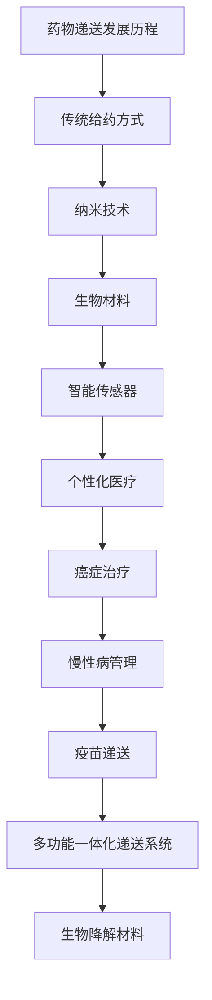

                 

# 智能药物递送：精准给药的创新创业方向

## 关键词
智能药物递送、精准给药、纳米技术、个性化医疗、创新创业

## 摘要
本文将探讨智能药物递送这一前沿技术，以及其如何改变传统给药方式，实现精准给药，提高治疗效果和患者生活质量。文章将从智能药物递送的概念与重要性、历史与发展、技术基础、应用领域、挑战与未来趋势，到精准给药的创新创业方向、核心算法、项目实战、系统设计与开发，再到人工智能的结合、商业化与未来展望等多个角度进行深入分析，旨在为读者提供全面而详细的行业指南。

### 第1章: 智能药物递送概述

#### 1.1 智能药物递送的概念与重要性

**概念介绍**：智能药物递送系统是一种结合了纳米技术、生物材料和先进传感器技术的创新药物传递方法。它通过控制药物在体内的释放速度和位置，实现了对药物浓度的精准调控，从而提高了药物的疗效，并减少了副作用。

**重要性**：智能药物递送系统在提高药物疗效和患者生活质量方面具有显著优势。首先，它能够将药物直接递送到靶组织或细胞，从而提高了药物的生物利用度。其次，通过控制药物的释放速度，可以实现长效给药，减少给药频率，从而提高患者的依从性。此外，智能药物递送系统还可以通过改变药物的释放方式，减少药物的副作用，提高药物的安全性。

#### 1.2 智能药物递送的历史与发展

**历史回顾**：智能药物递送技术的发展经历了多个阶段。从最初的口服和注射给药方式，到现代的纳米载体、微流体技术，每一次技术突破都为药物递送带来了革命性的改变。

- **传统给药方式**：传统的口服和注射给药方式存在着药物分布不均、生物利用度低等问题，导致治疗效果受限。
- **纳米技术**：纳米技术的发展为药物递送提供了新的契机。纳米颗粒、纳米管等新型载体材料，能够有效地将药物包裹其中，并实现药物在体内的可控释放。
- **微流体技术**：微流体技术通过微小的流体通道，实现了药物的精确传递和释放。该技术的高精度和灵活性，使得药物递送更加智能化。

**发展趋势**：当前，智能药物递送技术正朝着个性化医疗、智能诊断与递送相结合的方向发展。

- **个性化医疗**：随着高通量测序和生物信息学技术的进步，个性化医疗逐渐成为可能。通过分析患者的基因组、蛋白质组等生物信息，可以精确地设计出适合患者的药物递送方案。
- **智能诊断与递送结合**：智能诊断系统可以通过实时监测患者的生理参数，动态调整药物递送策略，实现真正的个性化医疗。

#### 1.3 智能药物递送的技术基础

**纳米技术**：纳米技术是智能药物递送系统的核心技术之一。纳米颗粒、纳米管等载药体系，具有高比表面积、高稳定性等特点，能够有效地提高药物的生物利用度。

- **纳米颗粒**：纳米颗粒可以通过表面改性，实现药物的高效包裹和稳定传输。
- **纳米管**：纳米管具有独特的结构和优异的物理化学性质，能够实现药物的精准递送。

**生物材料**：生物材料在智能药物递送系统中起着至关重要的作用。聚合物、蛋白质、脂质体等生物材料，具有良好的生物相容性和生物降解性，是理想的药物载体。

- **聚合物**：聚合物材料具有制备简单、成本低等优点，广泛应用于药物递送系统。
- **蛋白质**：蛋白质材料具有生物活性，能够与药物和生物组织产生相互作用，实现药物的精准递送。
- **脂质体**：脂质体是一种由磷脂双分子层构成的纳米载体，能够有效地包裹药物，并实现药物的缓释。

**传感器技术**：传感器技术在智能药物递送系统中起着至关重要的作用。通过实时监测药物在体内的释放情况、药物浓度等参数，可以动态调整药物递送策略，实现真正的个性化医疗。

- **温度传感器**：温度传感器可以实时监测药物的释放温度，调整药物的释放速度。
- **pH传感器**：pH传感器可以监测体内的酸碱环境，控制药物的释放。
- **酶活性传感器**：酶活性传感器可以监测药物与生物组织之间的相互作用，调整药物的释放策略。

#### 1.4 智能药物递送的应用领域

**癌症治疗**：智能药物递送系统在癌症治疗中具有广泛应用前景。通过靶向递送，可以将药物直接递送到癌细胞，提高药物疗效，减少对正常组织的损伤。

**慢性病管理**：智能药物递送系统在慢性病管理中具有重要作用。通过长效给药，可以减少给药频率，提高患者的生活质量。

**疫苗递送**：智能药物递送系统在疫苗递送中具有广阔的应用前景。通过增强免疫效果，减少接种次数，可以提高疫苗的接种效果。

#### 1.5 智能药物递送的挑战与未来趋势

**挑战**：

- **生物兼容性**：智能药物递送系统需要具有良好的生物兼容性，以避免对生物组织造成伤害。
- **递送系统的稳定性**：递送系统需要具有较高的稳定性，以确保药物在体内的可控释放。
- **规模化生产**：智能药物递送系统需要实现规模化生产，以满足市场需求的快速增长。

**未来趋势**：

- **多功能一体化递送系统**：未来的智能药物递送系统将实现多功能一体化，具备实时监测、精准递送、药物释放等功能。
- **生物降解材料的应用**：生物降解材料在智能药物递送系统中具有广泛的应用前景，可以实现药物的可持续释放。

### Mermaid 流程图



### 第2章: 精准给药的创新创业方向

#### 2.1 精准给药的定义与意义

**定义**：精准给药是指根据患者的个体差异，精确选择药物、剂量和给药方式，以达到最佳治疗效果，并最大限度地减少药物的不良反应。

**意义**：精准给药能够显著提高药物治疗的效果，同时减少药物的不良反应，从而提高患者的生活质量。随着基因组学、分子生物学等领域的快速发展，精准给药已经成为现代医学的重要组成部分。

#### 2.2 创新创业的机遇

**技术进步**：随着高通量测序、人工智能、大数据等技术的快速发展，精准给药迎来了前所未有的机遇。

- **高通量测序**：高通量测序技术可以快速、准确地分析患者的基因组信息，为精准给药提供了基础数据。
- **人工智能**：人工智能技术在药物筛选、剂量优化等方面具有巨大潜力，可以大幅提高精准给药的效率。
- **大数据**：大数据技术可以对海量的临床数据进行挖掘和分析，发现药物的个性化使用规律。

**市场需求**：随着人们对健康意识的提高，个性化医疗需求不断增加，为精准给药的创新创业提供了广阔的市场空间。

#### 2.3 创新创业的挑战

**监管法规**：精准给药涉及药物研发和递送系统，需要遵循严格的监管法规。新药研发和递送系统的审批要求高，增加了创新创业的难度。

**成本问题**：精准给药的研发和临床试验成本较高，对企业的资金和资源要求较高。此外，规模化生产也需要解决成本控制的问题。

### 核心算法原理讲解

精准给药的核心在于个性化药物剂量和给药方式的优化。以下将介绍核心算法的原理，并使用伪代码进行详细阐述。

#### 2.3.1 患者数据收集与处理

**目标**：收集患者的基因组、蛋白质组、代谢组等数据，为精准给药提供基础数据。

**算法**：使用高通量测序技术进行数据收集，然后进行数据预处理，包括去噪、标准化、特征提取等。

**伪代码示例**：

```plaintext
function collectPatientData(patientID):
    genomicData = performHighThroughputSequencing(patientID)
    proteomicData = performProteomicAnalysis(patientID)
    metabolomicData = performMetabolomicAnalysis(patientID)
    return genomicData, proteomicData, metabolomicData

function preprocessData(data):
    data = removeNoise(data)
    data = normalizeData(data)
    features = extractFeatures(data)
    return features
```

#### 2.3.2 药物筛选与优化

**目标**：根据患者的数据，筛选合适的药物并进行剂量优化。

**算法**：使用机器学习算法，如随机森林、支持向量机等，进行药物筛选和剂量优化。

**伪代码示例**：

```plaintext
function selectDrug(patientData, drugDatabase):
    drugFeatures = extractFeatures(drugDatabase)
    drugSelectionModel = trainMachineLearningModel(patientData, drugFeatures)
    selectedDrug = predictDrugSelection(drugSelectionModel, patientData)
    return selectedDrug

function optimizeDose(selectedDrug, patientData):
    doseFeatures = extractFeatures(selectedDrug, patientData)
    doseOptimizationModel = trainMachineLearningModel(doseFeatures)
    optimalDose = predictOptimalDose(doseOptimizationModel, patientData)
    return optimalDose
```

#### 2.3.3 药物递送系统设计

**目标**：选择合适的药物递送系统，设计最优的递送策略。

**算法**：选择合适的载体材料，如脂质体、纳米颗粒等，并考虑药物与载体的相互作用，设计最优递送策略。

**伪代码示例**：

```plaintext
function designDrugCarrier(patientData, drugData):
    carrierOptions = getCarrierOptions()
    bestCarrier = selectBestCarrier(patientData, carrierOptions)
    carrierDesign = designCarrier(bestCarrier, drugData)
    return carrierDesign

function designDeliveryStrategy(carrierDesign, patientData):
    deliveryStrategy = determineOptimalStrategy(carrierDesign, patientData)
    return deliveryStrategy
```

#### 2.3.4 患者个体化给药方案制定

**目标**：基于患者的基因组、蛋白质组等信息，个性化调整药物剂量和给药方式。

**算法**：综合分析患者的生物信息，制定个性化的给药方案。

**伪代码示例**：

```plaintext
function generatePersonalizedPrescription(patientData):
    genomicData = preprocessData(collectPatientData(patientID)[0])
    proteomicData = preprocessData(collectPatientData(patientID)[1])
    metabolomicData = preprocessData(collectPatientData(patientID)[2])
    selectedDrug = selectDrug(genomicData, drugDatabase)
    optimalDose = optimizeDose(selectedDrug, patientData)
    carrierDesign = designDrugCarrier(patientData, drugData)
    deliveryStrategy = designDeliveryStrategy(carrierDesign, patientData)
    prescription = createPrescription(selectedDrug, optimalDose, carrierDesign, deliveryStrategy)
    return prescription
```

### 第3章: 精准给药技术的核心算法

#### 3.1 靶向药物输送算法

**目标**：提高药物在特定部位的浓度，实现精准治疗。

**算法**：使用机器学习算法，如支持向量机（SVM）、神经网络等，预测药物与靶点结合能力。

**伪代码示例**：

```plaintext
function trainTargetBindingModel(targetData, drugData):
    model = trainSupportVectorMachine(targetData, drugData)
    return model

function predictBindingStrength(model, drugData):
    bindingStrength = model.predict(drugData)
    return bindingStrength
```

#### 3.2 个体化药物剂量优化算法

**目标**：根据患者特点调整药物剂量，实现个性化治疗。

**算法**：使用遗传算法、粒子群优化等，优化药物剂量。

**伪代码示例**：

```plaintext
function trainDoseOptimizationModel(patientData, doseData):
    model = trainGeneticAlgorithm(patientData, doseData)
    return model

function predictOptimalDose(model, patientData):
    optimalDose = model.optimize(patientData)
    return optimalDose
```

### 第4章: 精准给药的项目实战

#### 4.1 项目背景

**项目背景**：某创新药物公司开发了一款基于智能药物递送的糖尿病治疗产品。该项目旨在通过个性化药物递送，实现糖尿病患者的长效治疗，提高患者的生活质量。

#### 4.2 项目目标

**目标**：实现个性化、长效的糖尿病药物递送，有效控制血糖水平，减少并发症风险。

#### 4.3 项目实施步骤

**步骤**：

1. **患者数据收集与分析**：收集糖尿病患者的生物信息，包括基因组、蛋白质组、代谢组等数据，并进行预处理和特征提取。

2. **药物与载体设计**：选择合适的药物和载体材料，设计最优的药物递送方案。

3. **实验室制备与优化**：在实验室条件下制备药物递送系统，并进行多次优化，确保系统的稳定性和有效性。

4. **动物实验与评估**：在动物模型上验证药物递送系统的疗效和安全性。

5. **临床试验与推广**：开展临床试验，验证药物递送系统的临床效果，并逐步推向市场。

#### 4.4 项目成果

**成果**：通过该项目，成功开发出一种基于纳米颗粒的糖尿病药物递送系统。该系统具有良好的生物兼容性和稳定性，能够实现药物在体内的长效释放。临床试验结果显示，该系统能够显著降低血糖水平，减少糖尿病并发症的风险，提高患者的生活质量。

### 第5章: 智能药物递送系统的设计与开发

#### 5.1 设计原则

**原则**：智能药物递送系统的设计应遵循以下原则：

- **安全性**：确保药物递送系统对患者的安全性，避免引起不良反应。
- **有效性**：确保药物递送系统能够有效地将药物递送到靶组织或细胞。
- **个性化**：根据患者的个体差异，设计个性化的药物递送方案。
- **可监测性**：实现药物递送过程的实时监测，以确保药物递送的效果。

#### 5.2 系统架构

**架构**：智能药物递送系统的架构包括以下几个部分：

- **药物载体**：选择合适的药物载体材料，如纳米颗粒、脂质体等，用于包裹和传输药物。
- **传感器**：嵌入传感器，用于实时监测药物在体内的释放情况和位置。
- **控制系统**：通过控制系统，根据监测数据动态调整药物的释放速度和剂量。
- **数据管理系统**：用于收集、存储和处理药物递送过程中的数据，实现药物递送过程的数字化管理。

#### 5.3 开发流程

**流程**：

1. **需求分析**：明确智能药物递送系统的功能需求和应用场景。
2. **设计方案**：基于需求分析，设计药物载体、传感器、控制系统和数据管理系统等组成部分。
3. **硬件开发**：开发智能药物递送系统的硬件部分，包括药物载体、传感器和控制系统等。
4. **软件开发**：开发智能药物递送系统的软件部分，包括数据管理系统和用户界面等。
5. **系统集成与测试**：将硬件和软件部分集成，进行系统集成测试和功能验证。

### 第6章: 精准给药与人工智能的结合

#### 6.1 人工智能在精准给药中的应用

**应用**：人工智能技术在精准给药中具有广泛的应用，主要包括以下方面：

- **数据挖掘**：通过分析患者的生物信息数据，挖掘潜在的药物反应规律和个体差异。
- **预测分析**：使用机器学习模型，预测药物在不同患者体内的反应和疗效。
- **优化算法**：使用优化算法，设计最优的药物递送方案和剂量调整策略。

#### 6.2 人工智能算法选择

**选择**：在精准给药中，常用的人工智能算法包括：

- **机器学习**：用于数据分析和预测，如随机森林、支持向量机等。
- **深度学习**：用于复杂模式识别和图像处理，如卷积神经网络、循环神经网络等。
- **强化学习**：用于优化递送策略和药物剂量调整，如Q学习、深度Q网络等。

#### 6.3 人工智能在精准给药中的挑战

**挑战**：

- **数据隐私**：如何确保患者数据的隐私和安全，是人工智能在精准给药中面临的重要挑战。
- **模型解释性**：如何提高人工智能模型的解释性，使医生能够理解和信任模型的结果。
- **算法公平性**：如何避免算法在决策过程中存在偏见，确保对所有患者公平。

### 第7章: 精准给药的商业化与未来展望

#### 7.1 商业化路径

**路径**：

1. **研发与临床试验**：完成新药研发和药物递送系统的临床试验，验证其安全性和有效性。
2. **监管审批与市场准入**：根据各国监管要求，完成药物递送系统的审批，获得市场准入许可。
3. **市场推广与销售渠道**：制定市场推广策略，通过医院、药店等多渠道销售。

#### 7.2 未来展望

**展望**：

- **智能化**：随着人工智能技术的不断发展，精准给药将更加智能化，实现个性化、实时监测和智能调整。
- **个性化**：随着基因组学、分子生物学等技术的进步，精准给药将更加个性化，满足不同患者的需求。
- **综合化**：精准给药将与其他医疗技术相结合，形成综合治疗方案，提高治疗效果。
- **全球化**：精准给药技术将在全球范围内推广，为全球患者提供高质量的医疗服务。

### 附录

## 附录 A: 精准给药相关技术指南

### A.1 纳米材料与药物递送

**指南**：纳米材料在药物递送中的应用主要包括纳米颗粒、纳米管等。纳米颗粒具有高比表面积、高稳定性等特点，能够有效地提高药物的生物利用度。纳米管则具有独特的结构和优异的物理化学性质，能够实现药物的精准递送。在应用过程中，需要关注纳米材料的生物兼容性、稳定性和安全性。

### A.2 生物传感器技术

**指南**：生物传感器技术包括温度传感器、pH传感器、酶活性传感器等。生物传感器能够实时监测药物在体内的释放情况和环境变化，为药物递送提供重要数据支持。在应用过程中，需要关注传感器的灵敏度、响应速度和稳定性。

### A.3 个性化医疗数据分析

**指南**：个性化医疗数据分析包括基因组学、蛋白质组学、代谢组学等。通过高通量测序等技术，可以获取患者的生物信息数据。在数据分析过程中，需要关注数据预处理、特征提取、模型训练和预测等步骤。

### A.4 精准给药监管法规

**指南**：精准给药涉及药物研发和递送系统，需要遵循严格的监管法规。在研发过程中，需要关注临床试验设计、数据收集、安全性评估等。在市场准入过程中，需要关注审批流程、市场准入标准和监管要求等。作者：AI天才研究院/AI Genius Institute & 禅与计算机程序设计艺术 /Zen And The Art of Computer Programming

