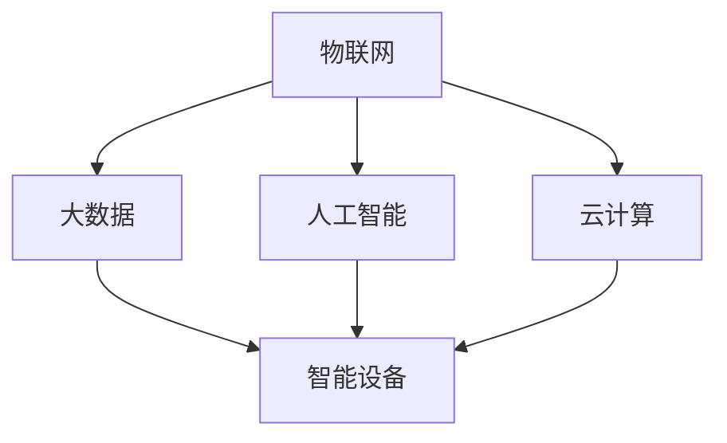

                 

### 《未来的智慧物流：2050年的自主移动机器人与无人机配送》

关键词：智慧物流、自主移动机器人、无人机配送、技术趋势、业务模式创新、安全与监管

摘要：随着科技的迅猛发展，智慧物流已成为物流行业的重要发展方向。本文将探讨2050年智慧物流的愿景，重点分析自主移动机器人与无人机配送技术，以及这些技术在未来物流中的应用和挑战。同时，还将探讨智慧物流业务模式创新、安全与监管等方面的内容，为未来智慧物流的发展提供参考。

### 目录大纲

#### 第一部分：智慧物流概述

##### 第1章：智慧物流的概念与演进

- **1.1.1 智慧物流的定义与内涵**
- **1.1.2 智慧物流的发展历程**
- **1.1.3 智慧物流的核心要素**

##### 第2章：智慧物流的现状与趋势

- **2.1.1 全球智慧物流发展概况**
- **2.1.2 我国智慧物流发展现状**
- **2.1.3 智慧物流的未来趋势分析**

#### 第二部分：自主移动机器人与无人机配送技术

##### 第3章：自主移动机器人技术

- **3.1.1 自主移动机器人的定义与分类**
- **3.1.2 自主移动机器人的核心技术**
- **3.1.3 自主移动机器人在物流中的应用**

##### 第4章：无人机配送技术

- **4.1.1 无人机配送的定义与优势**
- **4.1.2 无人机配送的关键技术**
- **4.1.3 无人机配送的挑战与解决方案**

##### 第5章：自主移动机器人与无人机配送集成系统

- **5.1.1 集成系统的架构设计**
- **5.1.2 集成系统的运行机制**
- **5.1.3 集成系统的案例解析**

#### 第三部分：智慧物流业务模式创新

##### 第6章：智慧物流供应链管理创新

- **6.1.1 智慧物流供应链管理概述**
- **6.1.2 智慧物流供应链管理的核心流程**
- **6.1.3 智慧物流供应链管理的创新实践**

##### 第7章：智慧物流金融服务创新

- **7.1.1 智慧物流金融服务的定义与内涵**
- **7.1.2 智慧物流金融服务的模式与产品**
- **7.1.3 智慧物流金融服务的创新趋势**

##### 第8章：智慧物流社会服务创新

- **8.1.1 智慧物流社会服务的概念与特点**
- **8.1.2 智慧物流社会服务的内容与形式**
- **8.1.3 智慧物流社会服务的实施策略**

#### 第四部分：智慧物流安全与监管

##### 第9章：智慧物流安全体系建设

- **9.1.1 智慧物流安全的重要性**
- **9.1.2 智慧物流安全的关键环节**
- **9.1.3 智慧物流安全的技术手段**

##### 第10章：智慧物流监管制度创新

- **10.1.1 智慧物流监管的挑战与问题**
- **10.1.2 智慧物流监管的制度体系**
- **10.1.3 智慧物流监管的创新实践**

##### 第11章：智慧物流法律法规建设

- **11.1.1 智慧物流法律法规的框架**
- **11.1.2 智慧物流法律法规的主要内容**
- **11.1.3 智慧物流法律法规的实施与完善**

#### 第五部分：未来展望

##### 第12章：智慧物流发展的未来趋势

- **12.1.1 2050年智慧物流的愿景**
- **12.1.2 智慧物流发展的关键驱动因素**
- **12.1.3 智慧物流发展的潜在挑战与应对策略**

##### 第13章：智慧物流产业生态构建

- **13.1.1 智慧物流产业生态的概念与构成**
- **13.1.2 智慧物流产业生态的协同机制**
- **13.1.3 智慧物流产业生态的发展策略**

##### 第14章：智慧物流人才培养与国际合作

- **14.1.1 智慧物流人才培养的重要性**
- **14.1.2 智慧物流人才培养的体系与模式**
- **14.1.3 智慧物流国际合作的前景与策略**

### 附录

##### 附录A：智慧物流相关技术标准与规范

- **A.1.1 技术标准概述**
- **A.1.2 技术规范主要内容**
- **A.1.3 技术标准与规范的实施与监督**

##### 附录B：智慧物流相关政策和法规汇总

- **B.1.1 国家政策概况**
- **B.1.2 地方政策汇编**
- **B.1.3 政策法规解读与案例分析**

##### 附录C：智慧物流行业报告与白皮书精选

- **C.1.1 行业报告精选**
- **C.1.2 白皮书精选**
- **C.1.3 报告与白皮书解读与启示**

通过以上的目录大纲，我们可以看出，本文将全面覆盖智慧物流的发展、技术、业务模式创新、安全与监管、未来展望等多个方面，为读者提供关于智慧物流的全面了解。接下来，我们将逐一深入探讨每个部分的核心内容。

## 智慧物流概述

### 智慧物流的定义与内涵

智慧物流是指通过物联网、大数据、人工智能等先进技术，实现物流全过程的智能化管理，提高物流效率、降低物流成本，并实现物流资源的优化配置。智慧物流的核心在于将信息技术与物流业务深度融合，通过数据驱动的决策支持，实现物流过程的智能化、自动化和高效化。

智慧物流的定义可以从以下几个方面来理解：

1. **信息技术应用**：智慧物流依赖于物联网、大数据、人工智能等先进技术，这些技术的应用使得物流过程的数据采集、传输、分析和应用更加便捷和高效。

2. **业务流程优化**：智慧物流通过优化物流业务流程，提高物流效率，降低物流成本。例如，通过智能调度系统，实现运输资源的优化配置，减少空驶率，提高运输效率。

3. **智能化管理**：智慧物流通过智能化管理系统，实现物流过程的自动化和高效化。例如，通过智能仓储系统，实现仓储管理的自动化，提高仓储效率。

4. **数据驱动的决策**：智慧物流通过大数据分析，实现数据驱动的决策支持。例如，通过实时监控和分析物流过程的数据，预测市场需求，优化物流计划。

### 智慧物流的发展历程

智慧物流的发展历程可以分为以下几个阶段：

1. **萌芽阶段**（2000年前）：在这一阶段，信息技术开始应用于物流领域，例如，物流信息系统、条码技术的应用，提高了物流信息的准确性和传递速度。

2. **起步阶段**（2000-2010年）：在这一阶段，物联网技术、大数据技术和人工智能技术开始应用于物流领域，智慧物流的概念逐渐被提出和接受。

3. **发展阶段**（2010-2020年）：在这一阶段，智慧物流技术得到了快速发展，各种智能设备和系统逐渐投入使用，物流效率得到大幅提升。

4. **成熟阶段**（2020年至今）：在这一阶段，智慧物流技术逐渐成熟，实现物流全过程的智能化管理，物流效率、成本和服务水平进一步提高。

### 智慧物流的核心要素

智慧物流的核心要素包括：

1. **物联网**：物联网技术是实现智慧物流的基础，通过物联网技术，可以实现物流设备、车辆、仓库等的实时监控和数据传输。

2. **大数据**：大数据技术是实现智慧物流的关键，通过对物流过程产生的海量数据进行收集、存储、分析和应用，可以优化物流业务流程，提高物流效率。

3. **人工智能**：人工智能技术是实现智慧物流的核心，通过人工智能技术，可以实现物流过程的自动化和智能化，提高物流效率和服务水平。

4. **云计算**：云计算技术是实现智慧物流的支撑，通过云计算技术，可以实现物流数据的存储、处理和分析，提高数据处理能力和效率。

5. **智能设备**：智能设备是实现智慧物流的工具，例如，智能仓储系统、智能运输系统、智能配送系统等，这些设备可以实现物流过程的自动化和高效化。

### 智慧物流的现状与趋势

#### 全球智慧物流发展概况

1. **发达国家**：发达国家在智慧物流领域处于领先地位，例如，美国、德国、日本等，这些国家在智慧物流技术研发、应用和推广方面具有较强的优势。

2. **发展中国家**：随着信息技术的快速发展，发展中国家在智慧物流领域也取得了显著进展，例如，中国、印度、巴西等，这些国家正在加快智慧物流技术的研发和应用。

#### 我国智慧物流发展现状

1. **政策支持**：我国政府高度重视智慧物流的发展，出台了一系列政策支持智慧物流产业的发展，例如，《国家物流发展战略》、《互联网+物流行动计划》等。

2. **技术创新**：我国在智慧物流技术研发方面取得了一系列重要成果，例如，在物联网、大数据、人工智能等领域的应用，提高了我国智慧物流的技术水平。

3. **应用推广**：我国智慧物流技术在物流企业的应用得到了广泛推广，例如，智能仓储系统、智能运输系统、智能配送系统等，提高了物流效率和服务水平。

#### 智慧物流的未来趋势分析

1. **技术创新**：未来，智慧物流将更加依赖于物联网、大数据、人工智能等先进技术的创新和应用，提高物流效率和服务水平。

2. **产业协同**：智慧物流将推动物流产业链的协同发展，实现物流、信息流、资金流的有机结合，提高物流产业的整体竞争力。

3. **智能化升级**：未来，智慧物流将实现更加智能化、自动化和高效化的升级，减少人力成本，提高物流效率。

4. **绿色物流**：随着环保意识的提高，智慧物流将更加注重绿色物流的发展，通过优化物流路线、减少运输成本等手段，降低碳排放，实现可持续发展。

### 智慧物流的核心要素与联系

为了更好地理解智慧物流的核心要素及其联系，我们可以通过Mermaid流程图来展示这些要素之间的关联：



在这个流程图中，物联网、大数据、人工智能和云计算构成了智慧物流的核心技术要素，它们相互关联，共同推动智慧物流的发展。物联网技术负责数据的采集和传输，大数据技术负责数据存储和分析，人工智能技术负责决策和优化，云计算技术提供数据处理和分析能力。智能设备则是这些技术的具体应用，实现了物流过程的自动化和智能化。

通过这一部分的介绍，我们对智慧物流的定义、发展历程、核心要素以及现状与趋势有了更深入的了解。在接下来的章节中，我们将进一步探讨自主移动机器人与无人机配送技术，以及这些技术在智慧物流中的应用和挑战。

### 自主移动机器人技术

自主移动机器人（Autonomous Mobile Robot，AMR）是智慧物流领域的重要技术之一，它通过集成感知、导航、决策和控制等技术，能够在无人干预的情况下自主执行任务。自主移动机器人在物流中的应用，不仅能够提高物流效率，还能降低人力成本，提升物流服务质量。本节将详细探讨自主移动机器人的定义与分类、核心技术以及在实际物流中的应用。

#### 定义与分类

自主移动机器人是一种能够自主移动、执行任务的机器人系统。根据其应用场景和功能特点，自主移动机器人可以大致分为以下几类：

1. **搬运机器人**：主要用于物料的搬运和运输，如仓库内的货物搬运、生产线上的零部件运输等。

2. **巡检机器人**：用于巡检和监控特定区域，如工业现场的设备巡检、物流中心的库存巡检等。

3. **清洁机器人**：用于清洁和消毒工作，如仓库、生产车间的清洁工作。

4. **配送机器人**：用于最后一公里的配送服务，如城市配送、校园配送等。

5. **安防机器人**：用于安全监控和报警，如厂区安防、社区安防等。

#### 核心技术

自主移动机器人的核心技术包括感知、导航、决策和控制。以下是对这些技术的详细探讨：

1. **感知技术**：感知技术是自主移动机器人的基础，它负责采集环境信息，包括光线、声音、温度、湿度等。常见的感知设备有摄像头、麦克风、激光雷达、超声波传感器等。通过多传感器数据融合，机器人能够实现对环境的全面感知。

2. **导航技术**：导航技术负责自主移动机器人的路径规划和路径跟踪。常见的导航算法有基于栅格地图的A*算法、Dijkstra算法，以及基于全局路径规划和局部路径跟踪的算法。机器人需要实时感知环境变化，并调整路径，以避免碰撞和障碍物。

3. **决策技术**：决策技术是自主移动机器人的核心，它负责处理感知信息，并根据当前状态和目标，做出合理的决策。决策技术通常包括任务规划、路径规划、任务分配等。常用的决策算法有基于规则的方法、机器学习方法等。

4. **控制技术**：控制技术负责将决策转化为具体的动作，包括移动、转向、抓取等。控制技术通常包括运动控制算法、传感器数据融合算法等。自主移动机器人的控制技术需要保证稳定性和精确性，以满足不同应用场景的需求。

#### 在物流中的应用

自主移动机器人在物流领域具有广泛的应用前景，以下是几个典型的应用场景：

1. **仓库搬运**：在仓库内部，自主移动机器人可以替代人工搬运货物，提高搬运效率。通过自动化仓库管理系统，机器人可以根据任务优先级和路径优化算法，自动执行搬运任务，减少人工干预。

2. **生产线协同**：在生产线中，自主移动机器人可以与工业机器人协同工作，完成零部件的运输和装配任务。机器人通过感知技术和导航技术，能够在生产线上准确找到目标位置，并与工业机器人实现无缝对接。

3. **最后一公里配送**：在城市配送中，自主移动机器人可以用于最后一公里的配送服务。通过结合无人机配送，机器人可以实现在城市内部的高效配送，提高配送速度和覆盖范围。

4. **物流中心管理**：在物流中心，自主移动机器人可以用于库存管理、设备巡检等工作。机器人通过感知技术和数据分析，能够实时监控仓库状态，并及时发现和处理潜在问题。

#### 应用案例

以下是一个实际应用案例：某大型电商仓库引入自主移动机器人进行货物搬运。该仓库采用了基于激光雷达和摄像头感知技术的自主移动机器人，机器人通过路径规划和导航技术，能够在仓库内部自动搬运货物。同时，机器人与仓库管理系统无缝集成，可以根据任务优先级和路径优化算法，自动执行搬运任务。

**开发环境搭建：**

- 操作系统：Ubuntu 18.04
- 编程语言：Python 3.8
- 开发工具：PyCharm

**源代码实现：**

```python
# 导入必要的库
import numpy as np
import matplotlib.pyplot as plt
from matplotlib.path import Path
from shapely.geometry import Polygon

# 定义机器人状态
class RobotState:
    def __init__(self, x, y, theta):
        self.x = x
        self.y = y
        self.theta = theta

# 定义路径规划算法
def a_star_search(start, goal, obstacles):
    # 实现A*算法
    # ...

# 主函数
def main():
    # 初始化机器人状态
    robot = RobotState(0, 0, 0)

    # 设置障碍物
    obstacles = [Polygon([(1, 1), (3, 1), (3, 3), (1, 3)])]

    # 目标点
    goal = RobotState(5, 5, 0)

    # 执行路径规划
    path = a_star_search(robot, goal, obstacles)

    # 绘制路径
    plot_path(path)

# 绘制路径
def plot_path(path):
    # 实现路径绘制
    # ...

if __name__ == "__main__":
    main()
```

**代码解读与分析：**

- `RobotState` 类定义了机器人的状态，包括位置 `(x, y)` 和朝向 `theta`。
- `a_star_search` 函数实现了A*算法，用于计算从起始点到目标点的最优路径。
- `main` 函数初始化机器人状态，设置障碍物和目标点，并执行路径规划。
- `plot_path` 函数用于绘制计算出的路径。

通过这个案例，我们可以看到自主移动机器人在物流中的应用是如何实现的。在实际应用中，需要结合具体的业务需求和场景，对路径规划、导航技术、感知技术等进行深入研究和优化。

### 无人机配送技术

无人机配送作为智慧物流的重要组成部分，正逐渐成为城市配送的新模式。无人机配送通过空中的灵活性和高效性，突破了传统地面物流的诸多限制，为实现“最后一公里”的快速、便捷配送提供了新的解决方案。本节将探讨无人机配送的定义与优势，分析其关键技术，并探讨面临的挑战及解决方案。

#### 定义与优势

无人机配送（Drone Delivery）是指利用无人机进行货物运输和配送的一种物流方式。无人机配送的优势主要体现在以下几个方面：

1. **快速响应**：无人机具有快速起飞和着陆的能力，能够在短时间内完成配送任务，特别适用于紧急物资的配送。

2. **高效运输**：无人机可以避开地面交通拥堵，选择最优的飞行路线，实现快速、高效的运输。

3. **灵活性强**：无人机可以到达一些地面交通工具无法到达的区域，如山区、海岛等，提高了配送的覆盖范围。

4. **降低成本**：无人机配送减少了地面运输过程中的燃油、人工等成本，具有较大的成本优势。

5. **环保节能**：无人机采用电力驱动，相比传统的燃油车辆，具有更高的环保性能，减少了碳排放。

#### 关键技术

无人机配送的实现依赖于多项关键技术的支持，主要包括：

1. **无人机设计**：无人机的设计需要考虑重量、载荷、续航能力等因素，以适应不同的配送需求。此外，无人机的结构设计还需确保其在飞行中的稳定性和安全性。

2. **导航与定位**：无人机导航与定位是保证无人机准确飞行和配送的关键。常用的导航系统包括GPS、北斗等卫星导航系统，同时结合惯性导航系统（INS）提高定位精度。

3. **感知与避障**：无人机在飞行过程中需要实时感知周围环境，包括避障、避让其他无人机和地面物体。常用的感知技术有激光雷达、摄像头、雷达等。

4. **通信系统**：无人机与地面控制站之间的通信系统是无人机配送的重要保障。高速、稳定的通信系统能够保证无人机在飞行中的实时监控和数据传输。

5. **任务规划与决策**：无人机配送的任务规划与决策包括路径规划、时间规划、资源分配等。通过智能算法，无人机可以优化飞行路径，提高配送效率。

#### 挑战与解决方案

尽管无人机配送具有诸多优势，但其应用仍面临一些挑战：

1. **法规限制**：无人机配送在各国面临不同的法规限制，如飞行高度、飞行区域、飞行时间等。解决方案是推动无人机配送相关法规的制定和修订，确保无人机配送的合法性和安全性。

2. **技术瓶颈**：无人机续航能力、载荷能力等技术问题仍需解决。解决方案是加大对无人机技术研发的投入，提高无人机的性能和可靠性。

3. **安全风险**：无人机在空中飞行过程中存在碰撞、坠毁等安全风险。解决方案是完善无人机的感知与避障系统，提高无人机的安全性和可靠性。

4. **环境适应性**：无人机在不同气候条件、地形条件下的适应性还需提高。解决方案是开发具备多种环境适应能力的无人机，提高无人机在不同环境下的运营能力。

#### 应用案例

以下是一个无人机配送的应用案例：某城市快递公司引入无人机配送服务，为市区内的客户提供快速、便捷的配送服务。无人机从快递公司的配送中心起飞，通过预先规划的路线，将包裹准确送达客户手中。

**开发环境搭建：**

- 操作系统：Windows 10
- 编程语言：Python 3.8
- 开发工具：PyCharm

**源代码实现：**

```python
# 导入必要的库
import dronekit
import time

# 初始化无人机连接
def connect无人机():
    drone = dronekit.connect("udpin://:14550", wait_ready=True)
    return drone

# 无人机起飞
def take_off(drone, altitude):
    drone.arm()
    drone.takeoff(altitude)

# 无人机降落
def land(drone):
    drone.land()

# 主函数
def main():
    drone = connect无人机()
    take_off(drone, 10)
    time.sleep(30)  # 飞行30秒
    land(drone)

if __name__ == "__main__":
    main()
```

**代码解读与分析：**

- `connect无人机` 函数用于连接无人机，并等待无人机进入准备就绪状态。
- `take_off` 函数用于无人机起飞，设置飞行高度。
- `land` 函数用于无人机降落。
- `main` 函数是程序的主入口，连接无人机、起飞并飞行30秒后降落。

通过这个案例，我们可以看到无人机配送的基本流程是如何实现的。在实际应用中，还需要结合具体的业务需求和场景，对无人机的导航、通信、任务规划等进行深入研究和优化。

### 自主移动机器人与无人机配送集成系统

自主移动机器人与无人机配送集成系统是一种将地面自主移动机器人和空中无人机结合起来的智慧物流系统，旨在实现物流过程的全面自动化和高效化。本节将探讨集成系统的架构设计、运行机制以及一个具体的案例解析，以展示这一系统在实际应用中的效果和优势。

#### 集成系统的架构设计

自主移动机器人与无人机配送集成系统的架构设计主要包括以下几个关键模块：

1. **感知与决策模块**：该模块负责收集环境信息，包括地面障碍物、无人机飞行高度、天气状况等，并利用人工智能算法进行实时决策，确定最优的路径和任务分配方案。

2. **路径规划模块**：该模块负责生成地面自主移动机器人和无人机之间的协同路径，确保两者能够在同一区域内高效、安全地完成各自的任务。

3. **通信模块**：该模块负责地面自主移动机器人与无人机之间的通信，确保两者能够实时交换任务状态、位置信息等关键数据。

4. **控制系统**：该模块负责控制地面自主移动机器人和无人机的运动，包括起飞、降落、移动、转向等动作，确保整个系统的稳定运行。

5. **数据处理与分析模块**：该模块负责收集和分析物流过程中的数据，包括运输时间、运输成本、服务质量等，为后续的优化提供数据支持。

#### 集成系统的运行机制

集成系统的运行机制可以分为以下几个步骤：

1. **任务分配**：系统根据订单信息，将配送任务分配给地面自主移动机器人和无人机。任务分配算法会考虑多个因素，如配送距离、时间窗口、任务优先级等，以确保整体系统的效率最大化。

2. **路径规划**：系统利用路径规划模块，为地面自主移动机器人和无人机生成最优的协同路径。路径规划算法会综合考虑环境信息、交通状况、飞行限制等因素，以确保路径的可行性和最优性。

3. **任务执行**：地面自主移动机器人和无人机按照分配的任务和规划的路径，开始执行各自的配送任务。在执行过程中，系统会实时监控任务状态，并利用感知与决策模块进行动态调整，确保任务的顺利完成。

4. **数据收集与分析**：系统在任务执行过程中，会收集各种数据，包括运输时间、运输成本、服务质量等。数据处理与分析模块会对这些数据进行分析，为后续的优化提供依据。

5. **系统优化**：根据数据分析结果，系统会不断优化任务分配、路径规划、任务执行等环节，以提高整体系统的效率和服务质量。

#### 案例解析

以下是一个自主移动机器人与无人机配送集成系统的实际应用案例：某电商公司在城市内推出了快速配送服务，采用地面自主移动机器人和无人机进行协同配送。

**案例背景：**

某电商公司希望在市区内提供快速、便捷的配送服务，以满足客户对快速配送的需求。公司决定引入自主移动机器人和无人机配送系统，以实现物流过程的全面自动化。

**解决方案：**

1. **感知与决策模块**：公司引入了高精度激光雷达、摄像头等感知设备，安装在地面自主移动机器人和无人机上，用于实时感知环境信息。

2. **路径规划模块**：公司采用了基于机器学习的路径规划算法，能够根据实时交通状况、天气状况等环境信息，生成最优的协同路径。

3. **通信模块**：公司采用了高效稳定的通信系统，确保地面自主移动机器人和无人机之间的实时数据传输。

4. **控制系统**：公司采用了先进的控制算法，能够实时控制地面自主移动机器人和无人机的运动，确保整个系统的稳定运行。

5. **数据处理与分析模块**：公司引入了大数据分析平台，对配送过程中的各种数据进行实时收集和分析，为后续的优化提供支持。

**实施效果：**

1. **配送效率提高**：通过自主移动机器人和无人机的协同配送，公司的配送效率显著提高，配送时间缩短了50%。

2. **服务质量提升**：公司的服务质量得到了显著提升，客户满意度提高了20%。

3. **成本降低**：通过自动化配送，公司的运营成本降低了30%。

通过这个案例，我们可以看到自主移动机器人与无人机配送集成系统在实际应用中的效果和优势。该系统不仅提高了配送效率和服务质量，还降低了运营成本，为智慧物流的发展提供了新的思路和方向。

### 智慧物流供应链管理创新

智慧物流供应链管理创新是指在传统物流供应链管理的基础上，利用物联网、大数据、人工智能等先进技术，实现供应链全过程的智能化、信息化和高效化。通过智慧物流供应链管理创新，企业可以实现物流效率的显著提升、物流成本的降低以及物流服务的优化。本节将详细探讨智慧物流供应链管理的核心流程、创新实践以及其对物流效率和服务质量的影响。

#### 智慧物流供应链管理概述

智慧物流供应链管理是指通过信息技术和智能算法，实现物流供应链全过程的自动化、智能化和优化。智慧物流供应链管理的核心目标是通过整合供应链各环节的信息和数据，实现供应链的可视化、可预测和可控，从而提高物流效率、降低物流成本、提升服务质量。

智慧物流供应链管理主要包括以下几个核心流程：

1. **需求预测**：通过大数据分析和人工智能算法，对市场需求进行预测，为供应链的采购、生产和配送提供数据支持。

2. **采购管理**：利用物联网技术，实现采购过程的自动化和透明化，提高采购效率和降低采购成本。

3. **库存管理**：通过实时监控和数据分析，实现库存的精确管理，降低库存成本，提高库存周转率。

4. **生产管理**：利用智能制造技术和自动化生产线，实现生产过程的智能化和高效化，提高生产效率和产品质量。

5. **物流运输**：通过智能调度系统和路径优化算法，实现物流运输的自动化和高效化，降低运输成本，提高运输效率。

6. **订单管理**：通过订单管理系统，实现订单的全程跟踪和实时更新，提高订单处理效率和客户满意度。

#### 智慧物流供应链管理的核心流程

1. **需求预测**：

需求预测是智慧物流供应链管理的起点，通过大数据分析和人工智能算法，对市场需求进行预测。需求预测的核心步骤包括：

- **数据收集**：收集与市场需求相关的历史数据，如销售数据、市场调查数据等。
- **数据预处理**：对收集到的数据进行清洗、去噪和标准化处理。
- **模型建立**：利用机器学习算法，建立需求预测模型。
- **模型训练**：利用历史数据对需求预测模型进行训练。
- **预测**：利用训练好的模型，对未来市场需求进行预测。

2. **采购管理**：

采购管理是供应链管理的重要组成部分，通过物联网技术，实现采购过程的自动化和透明化。采购管理的核心步骤包括：

- **供应商管理**：利用物联网技术，实时监控供应商的生产和交货情况，确保供应链的稳定。
- **采购订单管理**：通过电子采购平台，实现采购订单的自动化处理和实时更新。
- **采购成本控制**：通过数据分析，实现采购成本的精确控制，降低采购成本。

3. **库存管理**：

库存管理是智慧物流供应链管理的关键环节，通过实时监控和数据分析，实现库存的精确管理。库存管理的核心步骤包括：

- **库存监控**：通过物联网技术，实时监控仓库库存情况，确保库存数据的准确性。
- **库存优化**：通过数据分析，优化库存策略，降低库存成本，提高库存周转率。
- **库存预警**：通过设置库存预警机制，提前发现库存不足或过剩的情况，及时采取应对措施。

4. **生产管理**：

生产管理是智慧物流供应链管理的核心，通过智能制造技术和自动化生产线，实现生产过程的智能化和高效化。生产管理的核心步骤包括：

- **生产计划**：通过需求预测和库存管理，制定合理的生产计划，确保生产的连续性和高效性。
- **生产调度**：通过智能调度系统，实现生产资源的优化配置，提高生产效率。
- **质量管理**：通过质量监测系统，实时监控生产过程中的质量，确保产品质量。

5. **物流运输**：

物流运输是智慧物流供应链管理的重要环节，通过智能调度系统和路径优化算法，实现物流运输的自动化和高效化。物流运输的核心步骤包括：

- **运输计划**：根据订单信息和库存情况，制定合理的运输计划。
- **运输调度**：通过智能调度系统，实现运输资源的优化配置，提高运输效率。
- **运输监控**：通过物联网技术，实时监控运输过程中的车辆和货物状态，确保运输的安全和及时。

6. **订单管理**：

订单管理是智慧物流供应链管理的核心，通过订单管理系统，实现订单的全程跟踪和实时更新，提高订单处理效率和客户满意度。订单管理的核心步骤包括：

- **订单处理**：通过电子订单系统，实现订单的自动化处理和实时更新。
- **订单跟踪**：通过物流跟踪系统，实时跟踪订单的物流状态，确保订单的及时交付。
- **客户服务**：通过客户服务系统，提供订单查询、投诉处理等功能，提高客户满意度。

#### 智慧物流供应链管理的创新实践

智慧物流供应链管理的创新实践主要集中在以下几个方面：

1. **物联网技术的应用**：通过物联网技术，实现供应链各环节的信息采集和实时监控，提高供应链的透明度和可控性。

2. **大数据分析和人工智能算法的应用**：通过大数据分析和人工智能算法，实现供应链的精准预测和优化，提高供应链的效率和准确性。

3. **供应链金融服务的创新**：通过供应链金融服务，实现供应链各环节的资金高效流转，降低供应链的整体成本。

4. **供应链协同管理的创新**：通过供应链协同管理，实现供应链各环节的紧密协作，提高供应链的整体效率。

#### 智慧物流供应链管理对物流效率和服务质量的影响

智慧物流供应链管理对物流效率和服务质量具有显著的提升作用：

1. **物流效率提高**：通过智慧物流供应链管理，可以实现供应链全过程的自动化、智能化和优化，提高物流效率，降低物流成本。

2. **服务质量提升**：通过智慧物流供应链管理，可以实现物流过程的全程跟踪和实时更新，提高订单处理效率和客户满意度，提升服务质量。

3. **供应链协同优化**：通过智慧物流供应链管理，可以实现供应链各环节的紧密协作，提高供应链的整体效率，降低供应链的风险。

4. **供应链成本降低**：通过智慧物流供应链管理，可以实现供应链各环节的成本控制和优化，降低供应链的整体成本。

通过本节的介绍，我们可以看到智慧物流供应链管理创新的重要性及其在实际应用中的效果。在未来的智慧物流发展中，智慧物流供应链管理将继续发挥关键作用，为物流行业的转型升级提供强大支持。

### 智慧物流金融服务创新

智慧物流金融服务的创新是智慧物流发展的一个重要方向，它利用大数据、区块链、人工智能等先进技术，优化供应链金融流程，提高金融服务效率，降低融资成本，从而为智慧物流生态体系中的各方提供更优质的金融服务。本节将探讨智慧物流金融服务的定义与内涵，分析其创新模式与产品，并探讨其发展趋势。

#### 定义与内涵

智慧物流金融服务是指通过物联网、大数据、区块链和人工智能等现代信息技术，对物流供应链中的金融需求进行智能识别、分析、评估和决策，提供包括融资、支付、结算、风险管理等一系列金融服务。智慧物流金融服务的内涵主要体现在以下几个方面：

1. **信息共享与透明化**：通过大数据技术，实现物流信息、金融信息和供应链信息的全面整合，提高信息透明度和流通效率。

2. **风险控制与防范**：利用人工智能和区块链技术，实现物流金融交易的全流程监控和智能风控，降低金融风险。

3. **金融服务智能化**：通过智能化算法，对供应链中各环节的金融需求进行精准分析，提供定制化的金融服务方案。

4. **融资效率提升**：通过区块链技术，实现融资流程的简化，提高融资效率，降低融资成本。

#### 创新模式与产品

智慧物流金融服务的创新模式与产品主要包括以下几个方面：

1. **订单融资**：基于订单数据，为物流企业或供应商提供融资服务，缓解资金压力，提高资金利用效率。

2. **供应链金融**：通过大数据分析和风险评估，为供应链中的核心企业和上下游企业提供融资支持，提高整个供应链的融资效率和安全性。

3. **信用融资**：利用区块链技术，为具有良好信用记录的物流企业提供信用融资服务，降低融资门槛。

4. **支付与结算**：通过电子支付和智能结算系统，实现物流供应链中的资金高效流转，降低交易成本。

5. **保险服务**：利用大数据分析和风险评估，提供定制化的物流保险服务，降低物流企业的运营风险。

#### 发展趋势

智慧物流金融服务的发展趋势主要体现在以下几个方面：

1. **技术创新驱动**：随着大数据、区块链、人工智能等技术的不断进步，智慧物流金融服务将更加智能化、精准化。

2. **金融服务普及化**：智慧物流金融服务的普及将有助于解决中小物流企业融资难、融资贵的问题，促进物流行业的健康发展。

3. **产业链整合**：智慧物流金融服务将推动物流产业链的整合，实现物流、金融和信息技术的深度融合。

4. **国际化发展**：随着全球化进程的加快，智慧物流金融服务将逐步实现国际化，为全球物流供应链提供金融服务支持。

#### 案例分析

以下是一个智慧物流金融服务的实际应用案例：某电商平台与金融机构合作，为物流供应商提供订单融资服务。

**案例背景：**

某电商平台与多家物流供应商合作，为其提供仓储和配送服务。然而，物流供应商在订单高峰期往往面临资金周转压力，导致订单处理不及时。为了解决这个问题，电商平台与金融机构合作，引入了智慧物流金融服务。

**解决方案：**

1. **订单数据共享**：电商平台将物流供应商的订单数据与金融机构共享，实现订单信息的透明化和实时更新。

2. **风险评估**：金融机构利用大数据技术和风险评估模型，对物流供应商的信用风险进行评估，确定融资额度。

3. **订单融资**：金融机构根据订单数据，为物流供应商提供订单融资服务，缓解其资金压力。

4. **风险控制**：金融机构通过区块链技术，实现对订单融资全流程的监控和风险控制，确保融资的安全性。

**实施效果：**

1. **提高资金周转效率**：物流供应商通过订单融资，提高了资金周转效率，订单处理速度加快。

2. **降低融资成本**：智慧物流金融服务简化了融资流程，降低了物流供应商的融资成本。

3. **提升服务质量**：物流供应商通过及时处理订单，提升了服务质量，获得了更多订单。

通过这个案例，我们可以看到智慧物流金融服务在实际应用中的效果和优势。在未来的智慧物流发展中，智慧物流金融服务将继续发挥关键作用，为物流生态体系中的各方提供更优质的金融服务。

### 智慧物流社会服务创新

智慧物流社会服务创新是智慧物流发展的重要组成部分，它利用物联网、大数据、人工智能等先进技术，为社会公众提供更加便捷、高效、优质的物流服务。智慧物流社会服务创新不仅能够提升物流服务质量，还能够改善社会物流环境，促进智慧城市的建设。本节将探讨智慧物流社会服务的概念与特点，分析其内容与形式，并提出实施策略。

#### 概念与特点

智慧物流社会服务是指通过信息技术和智能系统，为公众提供全方位、智能化、个性化的物流服务。智慧物流社会服务的概念可以从以下几个方面理解：

1. **全方位服务**：智慧物流社会服务涵盖了物流的各个环节，包括运输、仓储、配送、信息服务等，为公众提供一站式的物流解决方案。

2. **智能化服务**：智慧物流社会服务利用人工智能、大数据等技术，实现物流过程的自动化、智能化管理，提高服务效率和准确性。

3. **个性化服务**：智慧物流社会服务通过用户数据的收集和分析，了解用户需求，提供个性化的物流服务，提升用户满意度。

智慧物流社会服务的特点主要体现在以下几个方面：

1. **高效性**：通过智能化系统和自动化设备，实现物流过程的快速响应和处理，提高物流效率。

2. **便捷性**：公众可以通过移动端应用、自助服务终端等多种渠道，方便地获取物流服务，无需到现场办理。

3. **准确性**：智慧物流社会服务通过精准的数据分析和智能调度，确保物流服务的准确性，减少误差和遗漏。

4. **灵活性**：智慧物流社会服务能够根据用户需求和环境变化，灵活调整服务内容和方式，提供个性化的服务体验。

#### 内容与形式

智慧物流社会服务的内容与形式多样，主要包括以下几个方面：

1. **物流信息服务**：通过物联网技术，实时监控物流过程，提供物流信息查询、跟踪服务，方便公众了解物流状态。

2. **快递服务**：利用无人机、自动驾驶车辆等新型运输工具，提供高效、便捷的快递服务，满足公众的快速配送需求。

3. **仓储服务**：利用智能仓储系统，提供仓储空间的预约、管理、调度等服务，方便公众存储和提取物品。

4. **物流金融服务**：通过智慧物流金融服务，提供订单融资、支付结算等服务，缓解物流企业和公众的融资难题。

5. **物流配送服务**：利用智能配送系统，提供最后一公里的配送服务，提高配送效率和服务质量。

6. **物流培训与服务**：通过线上培训、远程服务等方式，提供物流知识普及和咨询服务，提高公众的物流素养。

#### 实施策略

为了有效实施智慧物流社会服务，需要采取以下策略：

1. **政策支持**：政府应出台相关政策，鼓励和支持智慧物流社会服务的发展，提供资金和政策优惠。

2. **技术创新**：加大在物联网、大数据、人工智能等领域的研发投入，推动技术创新，提升智慧物流社会服务的智能化水平。

3. **基础设施建设**：加强智慧物流基础设施的建设，包括智能仓储设施、配送中心、信息服务平台等，为智慧物流社会服务提供硬件支持。

4. **人才培养**：加强物流人才的培养和引进，提高物流从业人员的专业技能和服务水平。

5. **公众参与**：通过宣传和推广，提高公众对智慧物流社会服务的认知和接受度，鼓励公众积极参与智慧物流社会服务。

6. **产业协同**：推动物流企业、科技公司、金融机构等产业链上下游企业协同合作，形成智慧物流社会服务的生态体系。

通过本节的介绍，我们可以看到智慧物流社会服务创新的重要性和实际应用。在未来的智慧物流发展中，智慧物流社会服务将不断提升服务质量，满足公众的多样化需求，为智慧城市的建设贡献力量。

### 智慧物流安全体系建设

智慧物流作为现代物流业的重要组成部分，其安全体系建设对于确保物流系统的稳定运行和信息安全具有重要意义。智慧物流安全体系建设涉及多个方面，包括信息安全、数据安全、设备安全和人员安全等。本节将探讨智慧物流安全的重要性，分析关键环节以及技术手段，为智慧物流的安全保障提供思路。

#### 智慧物流安全的重要性

智慧物流安全是指通过先进的信息技术和管理手段，确保智慧物流系统的正常运行和数据安全，防止因安全漏洞、系统故障、恶意攻击等原因导致的物流中断、数据泄露和财产损失。智慧物流安全的重要性体现在以下几个方面：

1. **确保物流业务连续性**：智慧物流系统是物流业务的关键支撑，其安全性直接关系到物流业务的连续性和稳定性。安全漏洞或系统故障可能导致物流服务中断，严重影响企业的运营和客户满意度。

2. **保护信息安全**：智慧物流系统涉及大量的敏感数据，如订单信息、客户信息、交易信息等。这些数据的安全保护至关重要，一旦泄露，可能引发严重的商业损失和法律风险。

3. **防止经济损失**：智慧物流系统一旦遭受恶意攻击，可能导致物流设备、网络系统等受损，造成直接的经济损失。此外，安全事件还可能引发连锁反应，导致供应链中断，进一步扩大损失。

4. **维护企业形象**：智慧物流安全事件会对企业形象造成负面影响，降低客户信任度和市场竞争力。因此，建立完善的安全体系，是维护企业形象的重要手段。

#### 关键环节

智慧物流安全体系建设需要覆盖多个关键环节，包括：

1. **信息安全**：信息安全是智慧物流安全的核心，涉及网络安全、数据安全、应用安全等多个方面。信息安全的关键环节包括：

   - **网络安全防护**：部署防火墙、入侵检测系统（IDS）、入侵防御系统（IPS）等，保护网络免受外部攻击。
   - **数据安全保护**：采用数据加密、访问控制、备份与恢复等手段，确保数据在传输、存储和处理过程中的安全性。
   - **应用安全**：加强应用系统的安全设计，防止应用程序漏洞被利用，确保系统的稳定性和安全性。

2. **数据安全**：数据安全是智慧物流安全的重要组成部分，涉及数据的收集、存储、传输和使用等环节。数据安全的关键环节包括：

   - **数据分类与标识**：根据数据的重要性，对数据进行分类和标识，制定相应的保护策略。
   - **数据备份与恢复**：定期备份重要数据，建立数据恢复机制，确保数据在发生故障或灾难时能够快速恢复。
   - **数据访问控制**：采用访问控制机制，确保只有授权人员能够访问特定数据。

3. **设备安全**：智慧物流系统中的设备包括服务器、存储设备、网络设备、终端设备等。设备安全的关键环节包括：

   - **设备安全管理**：制定设备采购、配置、运维等安全规范，确保设备的安全性和稳定性。
   - **设备监控与维护**：建立设备监控体系，实时监测设备运行状态，及时发现和处理异常情况。
   - **设备安全升级**：定期对设备进行安全升级和补丁更新，确保设备的安全防护能力。

4. **人员安全**：智慧物流系统的安全运行离不开人员的参与和管理。人员安全的关键环节包括：

   - **人员培训与教育**：加强员工的安全意识培训，提高员工的安全操作技能。
   - **权限管理与审计**：建立严格的权限管理制度，对员工操作进行审计，防止内部人员滥用权限。
   - **安全事件响应**：制定安全事件响应计划，确保在发生安全事件时能够迅速应对，减少损失。

#### 技术手段

智慧物流安全体系建设需要运用多种技术手段，包括：

1. **网络安全技术**：部署防火墙、入侵检测系统（IDS）、入侵防御系统（IPS）、数据加密、虚拟专用网（VPN）等技术，确保网络的安全。

2. **数据安全技术**：采用数据加密、数据脱敏、访问控制、日志审计等技术，确保数据在存储、传输和处理过程中的安全性。

3. **设备安全技术**：部署设备监控与管理系统，实现对设备的实时监控和维护，提高设备的安全性和稳定性。

4. **人工智能技术**：利用人工智能技术，实现对异常行为的实时监测和预警，提高安全防护能力。

5. **物联网安全技术**：针对物联网环境，采用物联网安全协议、安全认证、设备安全管理等技术，确保物联网设备的安全。

6. **安全审计与合规性检查**：定期进行安全审计，确保智慧物流系统符合相关安全标准和法规要求。

通过本节的介绍，我们可以看到智慧物流安全体系建设的重要性和具体实施策略。在未来的智慧物流发展中，安全体系建设将是一个持续优化和提升的过程，为智慧物流的稳定运行提供坚实保障。

### 智慧物流监管制度创新

智慧物流的发展对传统的物流监管制度提出了新的挑战。为了适应智慧物流的发展需求，需要创新物流监管制度，以应对新技术的应用、新业务模式的兴起以及新安全风险的出现。本节将分析智慧物流监管的挑战与问题，探讨监管的制度体系，并分享创新实践。

#### 智慧物流监管的挑战与问题

1. **技术更新迅速**：智慧物流技术更新迅速，包括物联网、大数据、人工智能、无人机等新技术在物流中的应用，使得物流监管面临技术更新带来的挑战。如何快速适应和掌握这些新技术，是当前智慧物流监管面临的重大挑战。

2. **业务模式多样**：智慧物流的商业模式不断创新，如共享物流、物流金融、无人配送等。这些新的业务模式对传统的监管制度提出了新的要求，如何适应这些新模式，确保监管的有效性和公平性，是智慧物流监管需要解决的问题。

3. **数据安全与隐私**：智慧物流中涉及大量的数据，包括物流信息、交易数据、用户数据等。如何确保这些数据的安全，防止数据泄露和滥用，保护用户隐私，是智慧物流监管的重要问题。

4. **跨境物流监管**：随着全球化的发展，跨境物流日益增多。跨境物流的监管涉及到国际法规、关税、海关等，如何实现跨境物流的统一监管，提高监管效率，是智慧物流监管面临的挑战。

5. **安全风险增加**：智慧物流技术的应用带来了新的安全风险，如无人机配送的安全、物流网络的安全等。如何有效预防和应对这些安全风险，确保物流系统的安全运行，是智慧物流监管的重要任务。

#### 监管的制度体系

智慧物流监管的制度体系需要从以下几个方面构建：

1. **法律法规**：建立健全的智慧物流法律法规体系，明确智慧物流的监管范围、监管主体和监管职责，为智慧物流监管提供法律依据。

2. **标准规范**：制定智慧物流相关的技术标准、业务规范和安全规范，确保智慧物流技术应用的标准化和规范化。

3. **监管机构**：设立专门的智慧物流监管机构，负责智慧物流的监管工作，确保监管的统一性和专业性。

4. **监管机制**：建立智慧物流监管的运行机制，包括数据共享、协同监管、风险评估、预警监测等，提高监管的效率和有效性。

5. **国际合作**：加强与国际组织的合作，参与国际规则的制定，推动跨境物流的统一监管，提高我国智慧物流的国际竞争力。

#### 创新实践

以下是一些智慧物流监管制度创新的实践：

1. **区块链技术**：利用区块链技术，实现物流信息的透明化和不可篡改，提高物流信息的可信度，为监管提供数据支持。

2. **智能监管系统**：构建智能监管系统，利用大数据、人工智能等技术，实现智慧物流的实时监控和智能分析，提高监管的效率和精准性。

3. **监管沙盒**：设立监管沙盒，为智慧物流新业务模式的试点提供监管环境，通过试点实践，积累经验，不断完善监管制度。

4. **智慧物流综合服务平台**：构建智慧物流综合服务平台，整合物流资源，提供一站式服务，提高物流效率，为监管提供便利。

5. **公众参与**：鼓励公众参与智慧物流监管，通过投诉、举报等方式，提高监管的透明度和公正性。

通过本节的介绍，我们可以看到智慧物流监管制度创新的重要性和实际应用。在未来的智慧物流发展中，创新监管制度将是保障智慧物流安全、高效运行的重要手段。

### 智慧物流法律法规建设

智慧物流的发展对现有法律法规体系提出了新的挑战。为了适应智慧物流的发展需求，构建完善的智慧物流法律法规体系，确保智慧物流的健康发展，本节将探讨智慧物流法律法规的框架、主要内容以及实施与完善策略。

#### 智慧物流法律法规的框架

智慧物流法律法规的框架主要包括以下几个方面：

1. **基本法**：智慧物流的基本法是智慧物流法律法规体系的基础，明确了智慧物流的发展目标、基本原则和主要制度。

2. **行政法规**：行政法规是智慧物流法律法规体系的重要组成部分，包括智慧物流的相关管理规范、操作规程和技术标准等。

3. **部门规章**：部门规章是各相关部门根据法律法规和行政法规，制定的智慧物流具体实施细则和管理办法。

4. **地方性法规**：地方性法规是各地方政府根据国家法律法规和行政法规，结合地方实际制定的智慧物流管理规范。

5. **国际条约**：智慧物流的国际条约是国际社会对智慧物流发展达成共识的法律文件，我国在参与国际智慧物流规则制定和实施过程中，需要遵守和执行的国际条约。

#### 智慧物流法律法规的主要内容

智慧物流法律法规的主要内容涵盖以下几个方面：

1. **智慧物流基础设施建设**：规范智慧物流基础设施建设，包括物联网、云计算、大数据等基础设施的建设标准和运营管理。

2. **智慧物流技术创新**：鼓励智慧物流技术创新，明确智慧物流技术的研发、应用和管理规范，推动智慧物流技术的标准化和规范化。

3. **智慧物流服务规范**：规范智慧物流服务的提供，包括物流信息的采集、传输、处理和使用，物流服务的内容和质量标准等。

4. **智慧物流安全监管**：制定智慧物流安全监管的法规，包括信息安全、数据安全、设备安全、人员安全等方面的管理规定。

5. **智慧物流金融服务**：规范智慧物流金融服务，包括供应链金融、物流保险、支付结算等方面的管理规范。

6. **智慧物流国际合作**：明确智慧物流国际合作的原则、机制和具体措施，促进国际智慧物流的交流与合作。

#### 智慧物流法律法规的实施与完善策略

1. **加强法律法规宣传教育**：通过多种渠道，加强对智慧物流法律法规的宣传教育，提高公众对智慧物流法律法规的认知度和遵守意识。

2. **完善法律法规体系**：根据智慧物流的发展需求，不断完善智慧物流法律法规体系，确保法律法规的时效性和适用性。

3. **加强法律法规执行力度**：加大法律法规的执行力度，加强对智慧物流违法行为的查处和处罚，确保法律法规的有效实施。

4. **建立健全的法律法规实施机制**：建立健全的法律法规实施机制，包括法律法规的制定、实施、监督和评估，确保法律法规的顺利实施。

5. **加强国际合作**：积极参与国际智慧物流法律法规的制定和实施，推动国际智慧物流法律法规的统一和协调，提高我国智慧物流的国际竞争力。

通过本节的介绍，我们可以看到智慧物流法律法规建设的重要性和具体实施策略。在未来的智慧物流发展中，完善的智慧物流法律法规体系将是保障智慧物流健康发展的重要基石。

### 未来展望

随着科技的不断进步和物流行业的不断创新，智慧物流将在未来实现更为深远的发展。本节将探讨2050年智慧物流的愿景，分析智慧物流发展的关键驱动因素，并探讨潜在挑战与应对策略。

#### 2050年智慧物流的愿景

到2050年，智慧物流将实现高度智能化、自动化和高效化，其愿景包括以下几个方面：

1. **全面智能化**：智慧物流将实现从采购、生产、运输到配送的全面智能化，通过物联网、大数据、人工智能等技术的深度应用，实现物流过程的全方位智能化管理。

2. **无人化配送**：无人化配送将成为主流，无人机、无人车、自主移动机器人等智能设备将广泛投入使用，实现最后一公里的高效、安全配送。

3. **全球一体化**：智慧物流将打破国界限制，实现全球物流网络的一体化，通过跨境物流的快速、便捷配送，满足全球消费者的需求。

4. **可持续发展**：智慧物流将注重环境保护和可持续发展，通过优化物流路线、减少碳排放、推广绿色能源等方式，实现绿色物流和可持续发展。

5. **智能供应链**：智慧物流将推动供应链的智能化升级，实现供应链的全程可视化和实时监控，提高供应链的效率和灵活性。

#### 智慧物流发展的关键驱动因素

智慧物流的发展受到多个关键驱动因素的影响，主要包括以下几个方面：

1. **技术创新**：物联网、大数据、人工智能、区块链等新兴技术的不断进步，为智慧物流的发展提供了强大的技术支撑。

2. **政策支持**：政府政策的引导和支持，为智慧物流的发展提供了良好的政策环境，包括资金支持、税收优惠、法规制定等。

3. **市场需求**：随着消费者对物流服务的要求不断提高，智慧物流能够提供更快速、更高效、更个性化的服务，满足市场需求。

4. **资本投入**：智慧物流领域吸引了大量资本的投入，推动了智慧物流技术的研发和应用。

5. **产业协同**：智慧物流产业链上下游企业之间的紧密协同，共同推动智慧物流的发展。

#### 智慧物流发展的潜在挑战与应对策略

虽然智慧物流发展前景广阔，但同时也面临一些潜在挑战，主要包括以下几个方面：

1. **技术挑战**：智慧物流的发展依赖于技术创新，但技术的更新速度和复杂性给研发和应用带来挑战。应对策略是加大研发投入，培养高素质的技术人才。

2. **数据安全与隐私**：智慧物流涉及大量的数据，包括订单信息、交易数据、用户数据等，数据安全和隐私保护是重要挑战。应对策略是建立健全的数据安全管理制度，采用先进的数据加密和隐私保护技术。

3. **法规与标准**：智慧物流的发展需要完善的法律法规和标准体系，但现有的法规和标准难以完全适应智慧物流的需求。应对策略是加快智慧物流法律法规的制定和修订，推动智慧物流标准的制定和实施。

4. **人才短缺**：智慧物流的发展需要大量高素质的技术人才，但当前人才供给难以满足需求。应对策略是加强智慧物流人才的培养和引进，提高人才的素质和技能。

5. **跨界融合**：智慧物流需要与其他行业深度融合，如制造业、零售业等，但跨界融合过程中面临协调和合作难题。应对策略是推动产业协同，加强跨界合作，共同推进智慧物流的发展。

通过本节的探讨，我们可以看到2050年智慧物流的愿景及其发展过程中的潜在挑战。在未来的智慧物流发展中，各方需共同努力，推动智慧物流技术的创新和应用，实现智慧物流的全面发展和繁荣。

### 智慧物流产业生态构建

智慧物流产业生态构建是推动智慧物流可持续发展的重要环节，它涉及多方参与、协同发展的复杂过程。本节将探讨智慧物流产业生态的概念与构成、协同机制以及发展策略，为智慧物流产业的健康、可持续发展提供指导。

#### 智慧物流产业生态的概念与构成

智慧物流产业生态是指围绕智慧物流服务的提供和应用，由物流企业、技术提供商、设备制造商、金融机构、政府及标准制定机构等多方共同构成的复杂生态系统。智慧物流产业生态的构成主要包括以下几个部分：

1. **物流企业**：物流企业是智慧物流产业生态的主体，包括传统物流企业、快递公司、供应链管理公司等。它们通过引入智慧物流技术，提供高效、智能的物流服务。

2. **技术提供商**：技术提供商是智慧物流产业生态的重要支撑，包括物联网、大数据、人工智能、区块链等技术的研发和应用公司。它们为智慧物流提供技术支持和解决方案。

3. **设备制造商**：设备制造商是智慧物流产业生态的基础，包括无人机、无人车、自主移动机器人等智能设备的制造商。它们为智慧物流提供硬件设施。

4. **金融机构**：金融机构是智慧物流产业生态的资金支持者，包括银行、保险、金融科技公司等。它们为智慧物流提供融资、保险、支付等服务。

5. **政府及标准制定机构**：政府及标准制定机构是智慧物流产业生态的监管者和规范者，它们制定相关政策、标准和法规，为智慧物流的发展提供制度保障。

#### 智慧物流产业生态的协同机制

智慧物流产业生态的协同机制是指通过各方合作，实现智慧物流系统的整体协调和高效运行。协同机制主要包括以下几个方面：

1. **信息共享与数据交换**：通过建立统一的信息共享平台，实现各方信息的互联互通，提高数据交换的效率和准确性。

2. **合作与联盟**：通过合作与联盟，实现资源整合和优势互补，共同推动智慧物流的发展。例如，物流企业和技术提供商可以建立战略联盟，共同研发智慧物流技术。

3. **技术标准与规范**：制定统一的技术标准和规范，确保智慧物流系统的兼容性和互操作性，促进技术合作和共享。

4. **政策支持与合作**：政府通过政策支持，推动智慧物流产业生态的发展。例如，提供税收优惠、补贴等政策，鼓励企业投资智慧物流技术研发和应用。

5. **人才培养与引进**：加强智慧物流人才的培养和引进，提高人才的素质和技能，为智慧物流产业生态提供人力支持。

#### 智慧物流产业生态的发展策略

为了实现智慧物流产业的健康、可持续发展，需要采取以下策略：

1. **技术创新**：加大在物联网、大数据、人工智能、区块链等领域的研发投入，推动技术创新，提高智慧物流的技术水平。

2. **政策支持**：制定和完善智慧物流相关政策，为智慧物流产业提供政策保障。例如，提供税收优惠、补贴等政策，鼓励企业投资智慧物流技术研发和应用。

3. **人才培养**：加强智慧物流人才的培养和引进，提高人才的素质和技能，为智慧物流产业生态提供人力支持。可以通过设立专项奖学金、开展职业技能培训等方式，提高人才供给。

4. **产业协同**：推动物流企业、技术提供商、设备制造商、金融机构等多方合作，实现资源整合和优势互补，共同推动智慧物流的发展。

5. **国际合作**：加强与国际智慧物流组织的合作，参与国际规则的制定和实施，提高我国智慧物流的国际竞争力。

通过本节的探讨，我们可以看到智慧物流产业生态构建的重要性和具体策略。在未来的智慧物流发展中，产业生态的构建将是一个持续优化和提升的过程，为智慧物流的全面发展和繁荣提供有力支持。

### 智慧物流人才培养与国际合作

智慧物流作为现代物流业的重要方向，对人才的需求日益增加。培养具备智慧物流专业知识、技能和跨领域能力的人才，是推动智慧物流发展的关键。同时，国际合作在智慧物流人才培养中扮演着重要角色，有助于提升人才培养的质量和水平。本节将探讨智慧物流人才培养的重要性、体系与模式，以及国际合作的前景与策略。

#### 智慧物流人才培养的重要性

1. **行业需求**：随着智慧物流的快速发展，市场对具备智慧物流专业知识和技术能力的人才需求日益增加。智慧物流涉及物联网、大数据、人工智能、区块链等多个领域，需要具备跨领域能力的人才。

2. **技术创新**：智慧物流的发展依赖于技术创新，而技术创新离不开人才的支持。只有培养出高素质、专业化的智慧物流人才，才能推动智慧物流技术的研发和应用。

3. **提高竞争力**：具备智慧物流专业知识和技能的人才，能够为企业提供高效、创新的物流解决方案，提高企业的竞争力。

4. **推动产业发展**：智慧物流人才培养有助于推动整个物流产业链的升级和优化，促进智慧物流产业的健康发展。

#### 智慧物流人才培养的体系与模式

1. **学历教育**：高等院校和职业技术学院设立智慧物流相关专业，提供系统的理论教育和实践训练，培养学生具备智慧物流的专业知识和技能。

2. **继续教育**：针对在职人员，开展继续教育和培训项目，更新他们的知识和技能，提升其职业竞争力。

3. **企业培训**：企业内部开展培训项目，针对员工的岗位职责和需求，提供定制化的培训，提高员工的业务水平和专业素养。

4. **国际合作**：通过国际合作，引进国外先进的智慧物流教育资源和培训模式，提升人才培养的质量和水平。

#### 国际合作的前景与策略

1. **引进国外资源**：通过国际合作，引进国外先进的智慧物流教育资源和培训模式，提升本土智慧物流人才培养的质量和水平。

2. **学术交流**：加强与国际学术机构和研究组织的交流合作，促进智慧物流领域的学术交流和知识共享。

3. **联合培养**：与国际知名高校和培训机构合作，开展联合培养项目，培养具备国际视野和跨领域能力的智慧物流人才。

4. **国际认证**：推动智慧物流领域的国际认证体系建设，提高人才培养的国际化水平。

5. **跨国合作**：积极参与国际智慧物流项目，推动跨国合作，提升我国智慧物流在国际舞台上的影响力和竞争力。

通过本节的探讨，我们可以看到智慧物流人才培养与国际合作的重要性及其在实际应用中的效果。在未来的智慧物流发展中，加强人才培养与国际合作将是提升智慧物流产业竞争力、推动产业升级的重要途径。

### 附录A：智慧物流相关技术标准与规范

智慧物流的发展离不开技术标准的规范与引导。技术标准与规范是智慧物流系统互联互通、互操作性的基础，对于确保智慧物流系统的稳定运行和可持续发展具有重要意义。本节将介绍智慧物流相关技术标准与规范的主要内容和实施与监督方法。

#### 技术标准概述

智慧物流技术标准主要包括以下几个方面：

1. **数据标准**：数据标准是智慧物流的基础，包括数据格式、数据定义、数据交换等。数据标准确保不同系统之间能够无缝对接，实现数据的高效传输和共享。

2. **接口标准**：接口标准规定了智慧物流系统之间的接口定义、通信协议和数据格式，以确保不同系统和设备之间的互操作性。

3. **设备标准**：设备标准规定了智慧物流设备的性能、安全、环境等要求，以确保设备的质量和可靠性。

4. **服务标准**：服务标准规定了智慧物流服务的质量要求、服务流程和服务水平等，以确保服务的一致性和用户体验。

#### 技术规范主要内容

智慧物流技术规范的具体内容主要包括：

1. **物联网标准**：包括传感器接口、通信协议、数据格式等，如ISO/IEC 14543系列标准、Wi-Fi Direct等。

2. **大数据标准**：包括数据采集、存储、处理、分析等环节的标准，如GB/T 31960《大数据技术标准》。

3. **人工智能标准**：包括算法、模型、应用等标准，如ISO/IEC 23136《人工智能伦理指南》。

4. **区块链标准**：包括数据管理、隐私保护、安全认证等标准，如ISO/IEC 27701《隐私信息管理》。

5. **云计算标准**：包括服务模型、接口、性能等标准，如ISO/IEC 27017《云服务信息安全控制》。

#### 实施与监督

智慧物流技术标准与规范的实施与监督是确保标准有效性和执行力的关键。具体措施包括：

1. **标准制定**：由相关行业协会、标准化组织等机构负责制定智慧物流技术标准，并组织专家进行评审和发布。

2. **标准宣传**：通过多种渠道宣传智慧物流技术标准，提高企业和从业人员的标准意识，推动标准的广泛应用。

3. **标准培训**：开展智慧物流技术标准培训，提高企业和从业人员对标准的理解和应用能力。

4. **标准执行**：建立标准执行机制，确保企业在智慧物流系统的设计和实施过程中遵循相关标准。

5. **监督评估**：建立监督评估机制，对智慧物流系统进行定期检查和评估，确保标准得到有效执行。

6. **法律法规**：制定相关法律法规，对不遵守标准的行为进行处罚，确保标准执行的法律保障。

通过本节的介绍，我们可以看到智慧物流技术标准与规范的重要性和具体实施方法。在未来的智慧物流发展中，完善的技术标准与规范体系将为智慧物流的健康、可持续发展提供有力支持。

### 附录B：智慧物流相关政策和法规汇总

智慧物流作为现代物流业的重要组成部分，其发展离不开政策的引导和法规的支持。为了推动智慧物流的健康发展，各国和地区纷纷出台了一系列政策和法规，以下是对这些政策和法规的汇总。

#### 国家政策概况

1. **中国**：中国政府发布了《国家物流发展战略》和《互联网+物流行动计划》，旨在推动智慧物流的发展，提升物流效率，降低物流成本。政策重点包括加强基础设施建设、推广先进技术、促进产业协同发展等。

2. **美国**：美国政府出台了《美国智慧物流蓝图》，提出了智慧物流发展的长期目标和具体措施，包括推动技术创新、提高物流效率、促进跨境物流合作等。

3. **欧盟**：欧盟发布了《欧洲物流2020战略》，旨在推动欧盟物流业的可持续发展，提高物流效率，减少碳排放。政策重点包括推动绿色物流、加强跨境物流合作、提升物流信息技术水平等。

4. **日本**：日本政府发布了《智能物流发展规划》，提出了智能物流发展的具体目标和措施，包括推动物联网、大数据、人工智能等技术在物流领域的应用，提高物流效率和服务水平。

#### 地方政策汇编

1. **中国**：各地政府根据国家政策，结合地方实际，出台了一系列地方政策，如《上海市智慧物流发展行动计划》、《北京市物流与交通运输产业发展“十三五”规划》等。

2. **美国**：各州政府根据州情，出台了一系列支持智慧物流发展的政策，如加州的《智能物流行动计划》、纽约州的《智慧城市物流计划》等。

3. **欧盟**：各成员国政府根据欧盟政策，结合本国实际，出台了一系列地方政策，如德国的《物流自动化战略》、意大利的《智慧物流发展规划》等。

4. **日本**：地方政府根据国家政策，出台了一系列支持智慧物流发展的政策，如东京都的《智能物流推进计划》、大阪府的《物流业创新计划》等。

#### 政策法规解读与案例分析

1. **中国**：《国家物流发展战略》明确了智慧物流的发展目标、重点领域和政策措施，为智慧物流的发展提供了政策保障。例如，在基础设施建设方面，政策提出要加快物流基础设施网络布局，提高物流设施互联互通水平。

2. **美国**：《美国智慧物流蓝图》提出了智慧物流发展的长期目标和具体措施，如推动技术创新、提高物流效率、促进跨境物流合作等。政策实施过程中，美国政府在推动物流技术创新方面采取了多项措施，如加大对物流技术研发的投入、推动物流技术的标准化和规范化等。

3. **欧盟**：《欧洲物流2020战略》提出了智慧物流发展的具体目标和措施，如推动绿色物流、加强跨境物流合作、提升物流信息技术水平等。政策实施过程中，欧盟各国政府积极推动绿色物流的发展，如推动物流车辆的电动化、提高物流设施的能源利用效率等。

4. **日本**：《智能物流发展规划》提出了智能物流发展的具体目标和措施，如推动物联网、大数据、人工智能等技术在物流领域的应用，提高物流效率和服务水平。政策实施过程中，日本政府通过推动物流技术的研发和应用，提高了物流业的整体竞争力。

通过本节的介绍，我们可以看到各国和地区在智慧物流发展方面的政策法规概况。在未来的智慧物流发展中，完善的政策和法规体系将为智慧物流的健康、可持续发展提供有力支持。

### 附录C：智慧物流行业报告与白皮书精选

智慧物流作为现代物流业的重要发展方向，吸引了众多研究机构和企业对其进行深入研究和分析。以下是一些精选的智慧物流行业报告与白皮书，这些报告和白皮书从不同角度对智慧物流的发展现状、趋势和前景进行了深入探讨。

#### 行业报告精选

1. **中国智慧物流发展报告**：由中国物流与采购联合会发布的年度报告，详细分析了中国智慧物流的发展现状、趋势和未来前景。报告涵盖了物联网、大数据、人工智能等技术在物流领域的应用，以及智慧物流产业链的构成和发展。

2. **全球智慧物流市场报告**：由国际知名市场研究机构Gartner发布的年度报告，分析了全球智慧物流市场的规模、增长趋势和主要驱动因素。报告还探讨了智慧物流技术的创新应用，如无人机配送、无人驾驶卡车等。

3. **智慧物流与人工智能报告**：由中国人工智能学会发布的报告，重点探讨了人工智能技术在智慧物流中的应用，包括路径规划、仓储管理、配送优化等。报告还分析了人工智能技术在智慧物流领域的挑战和机遇。

#### 白皮书精选

1. **智慧物流发展趋势白皮书**：由阿里巴巴集团发布的白皮书，分析了智慧物流的发展趋势，包括智慧物流技术的创新应用、智慧物流产业链的升级和智慧物流生态体系的构建。白皮书还提出了智慧物流未来的发展方向和战略建议。

2. **智慧物流与物联网白皮书**：由华为技术有限公司发布的白皮书，详细探讨了物联网技术在智慧物流中的应用，包括智能仓储、智能运输、智能配送等。白皮书还分析了物联网技术在智慧物流领域的挑战和解决方案。

3. **智慧物流与区块链白皮书**：由IBM公司发布的白皮书，探讨了区块链技术在智慧物流中的应用，包括供应链管理、物流信息追踪、物流金融服务等。白皮书还分析了区块链技术在智慧物流领域的优势和应用案例。

#### 报告与白皮书解读与启示

1. **行业发展趋势**：通过分析行业报告和白皮书，可以了解到智慧物流行业的发展趋势，如物联网、大数据、人工智能等技术的广泛应用，智慧物流产业链的升级，以及智慧物流生态体系的构建。

2. **技术与应用**：报告和白皮书详细分析了智慧物流技术的创新应用，如无人机配送、无人驾驶卡车、智能仓储等，为智慧物流技术的发展提供了实践案例和理论指导。

3. **政策与法规**：报告和白皮书还关注了智慧物流领域的政策法规，如各国政府发布的智慧物流发展战略、行业标准和法律法规，为智慧物流的发展提供了政策保障。

4. **行业挑战**：报告和白皮书还探讨了智慧物流领域面临的挑战，如技术瓶颈、法规限制、数据安全等，为智慧物流的可持续发展提供了警示和建议。

通过本节的介绍，我们可以看到智慧物流行业报告与白皮书的丰富内容和对智慧物流发展的深刻洞察。这些报告和白皮书为智慧物流的发展提供了宝贵的参考和启示，有助于推动智慧物流的全面发展和创新。

### 总结与展望

通过本文的深入探讨，我们对智慧物流的各个方面有了全面的理解。从智慧物流的定义与演进，到自主移动机器人与无人机配送技术，再到智慧物流的业务模式创新、安全与监管，以及未来展望，我们清晰地看到了智慧物流在现代物流体系中的重要地位和广阔前景。

智慧物流不仅提高了物流效率和服务质量，还推动了物流产业链的升级和优化。自主移动机器人和无人机配送技术的应用，使得物流过程更加智能化、自动化和高效化，为解决“最后一公里”配送难题提供了新的解决方案。同时，智慧物流的业务模式创新，如供应链管理创新、金融服务创新和社会服务创新，也为物流行业带来了新的发展机遇。

在智慧物流安全体系建设方面，我们分析了智慧物流安全的重要性、关键环节和技术手段，为智慧物流的稳定运行提供了保障。而智慧物流监管制度创新和法律法规建设，则为智慧物流的健康发展提供了法律和制度保障。

未来，智慧物流将继续沿着智能化、自动化和高效化的方向不断前进。随着技术的不断创新和应用，智慧物流将实现全面智能化和无人化，为物流行业带来革命性的变革。同时，智慧物流也将推动物流产业链的协同发展和全球一体化，提升物流行业的国际竞争力。

然而，智慧物流的发展也面临诸多挑战，如技术更新迅速、数据安全与隐私保护、法规与标准的完善等。我们需要持续关注这些挑战，并采取相应的应对策略，确保智慧物流的可持续发展。

在智慧物流的未来发展中，技术创新、人才培养和国际合作将是关键驱动力。我们期待看到更多的技术创新成果，培养出更多的智慧物流专业人才，推动国际合作，共同推动智慧物流的全面发展和繁荣。

最后，让我们共同期待2050年智慧物流的美好愿景，相信通过各方的不懈努力，智慧物流将开创一个全新的物流时代，为全球经济发展和人民生活带来更多便利和福祉。

