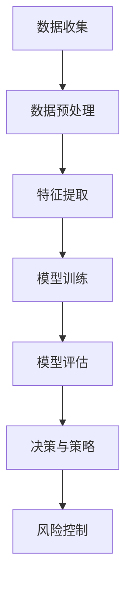
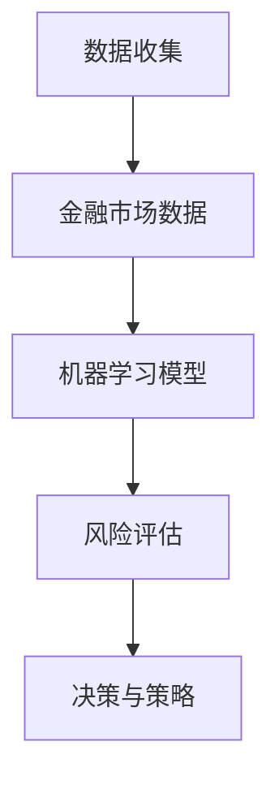

                 

### 第一部分：基础概念与背景

在这部分中，我们将首先介绍机器学习的基本概念及其在金融市场中的应用背景。接下来，我们将详细探讨金融市场的组成和功能，并阐述风险评估的重要性及其目标。

#### 第1章：机器学习与金融市场概述

##### 1.1.1 机器学习的基本概念

**定义**：机器学习是一种使计算机系统能够从数据中学习并自动改进其性能的技术。它通过利用统计学、概率论和优化算法，使计算机系统能够识别数据中的模式并作出预测或决策。

**分类**：机器学习主要分为三大类，即监督学习、无监督学习和强化学习。

- **监督学习**：在有标记数据集的指导下进行学习，目标是通过输入输出对来训练模型，使其能够对新数据进行预测。常见的算法包括线性回归、逻辑回归、决策树和随机森林等。
  
- **无监督学习**：在没有标记数据集的情况下进行学习，主要关注数据本身的分布和结构。常见的算法包括聚类分析和降维技术，如K均值、层次聚类、主成分分析等。

- **强化学习**：通过与环境的交互来学习最优策略，目标是通过不断尝试和反馈来提高系统的性能。常见的算法包括Q学习、深度强化学习等。

##### 1.1.2 金融市场的组成与功能

**金融市场概述**：金融市场是指进行金融资产交易的市场，包括股票、债券、期货、期权等多种金融工具。它们为投资者提供了多样化的投资选择，也为企业提供了筹集资金的机会。

**金融市场的功能**：

- **资本配置**：金融市场为资金需求者和资金提供者提供了一个平台，使资金能够有效地从一方转移到另一方，从而实现社会资源的最佳配置。

- **风险分散**：投资者可以通过持有不同类型的金融资产来分散风险，降低投资组合的整体波动性。

- **价格发现**：金融市场通过买卖双方之间的交易，形成了金融资产的真实价格，从而为市场参与者提供了定价参考。

##### 1.1.3 风险评估的重要性

**风险评估的定义**：风险评估是指对潜在风险进行识别、分析和量化，以便为决策提供依据的过程。

**风险评估的目标**：

- **降低损失**：通过风险评估，投资者可以识别可能的风险因素，并采取相应的措施来降低潜在损失。

- **提高决策效率**：风险评估可以帮助投资者更准确地评估投资机会，从而做出更加明智的决策，提高投资效率。

#### 第2章：机器学习在金融领域的应用

##### 2.1.1 机器学习在金融预测中的应用

**股价预测**：机器学习在股价预测中具有重要的应用价值。通过分析历史股价数据，可以提取出一些有用的特征，如交易量、开盘价、收盘价等，并利用时间序列分析等技术进行预测。

**信用评分**：信用评分是指通过分析个人或企业的信用历史，评估其违约风险的过程。机器学习可以有效地处理大量非结构化数据，提取出关键特征，从而提高信用评分的准确性和效率。

##### 2.1.2 机器学习在风险管理中的应用

**风险因子分析**：风险因子分析是指通过识别和量化影响金融资产收益的主要风险因素，以便进行有效的风险管理和投资决策。机器学习算法可以自动识别和提取风险因子，提高风险因子分析的效果。

**风险度量**：风险度量是指对金融资产或投资组合的潜在损失进行量化评估。常见的风险度量方法包括VaR（价值在风险）和CVaR（条件价值损失）等。机器学习算法可以有效地预测金融资产的波动性，从而提高风险度量的准确性。

#### Mermaid 流程图：

下面是一个简单的 Mermaid 流程图，用于展示机器学习在金融市场风险评估中的应用流程：



#### 核心概念与联系

在机器学习在金融市场风险评估中的应用中，核心概念主要包括：

- **机器学习**：通过对历史数据的学习，自动提取特征并建立模型。
- **金融市场**：金融市场的数据是机器学习算法的重要输入，用于训练和测试模型。
- **风险评估**：通过机器学习模型对金融市场的风险进行量化，为决策提供依据。

这些概念之间相互关联，共同构成了机器学习在金融市场风险评估中的应用框架。下面是一个简单的 Mermaid 流程图，用于展示这些核心概念之间的联系：



#### 核心算法原理讲解

在机器学习在金融市场风险评估中的应用中，常用的算法包括：

- **线性回归**：用于预测金融资产的收益，通过最小化误差平方和来拟合数据。
- **逻辑回归**：用于分类问题，如信用评分，通过计算概率分布来预测结果。
- **决策树**：用于分类和回归问题，通过构建决策树来划分数据并预测结果。
- **随机森林**：用于分类和回归问题，通过构建多个决策树并平均预测结果来提高准确性。
- **神经网络**：用于复杂的非线性预测问题，通过多层神经网络来拟合数据。

以下是线性回归的伪代码：

```python
# 线性回归伪代码
def linear_regression(X, y):
    # 计算斜率和截距
    theta = (X.T @ X)^-1 @ (X.T @ y)
    # 预测结果
    y_pred = X @ theta
    # 返回模型参数和预测结果
    return theta, y_pred
```

#### 数学模型和公式

在机器学习中，常用的数学模型包括线性回归、逻辑回归和神经网络等。

- **线性回归**：假设模型为 $y = \beta_0 + \beta_1x_1 + \beta_2x_2 + \cdots + \beta_nx_n$，其中 $x_1, x_2, \cdots, x_n$ 是特征变量，$y$ 是目标变量，$\beta_0, \beta_1, \beta_2, \cdots, \beta_n$ 是模型参数。

- **逻辑回归**：假设模型为 $y = \sigma(\beta_0 + \beta_1x_1 + \beta_2x_2 + \cdots + \beta_nx_n)$，其中 $\sigma$ 是 sigmoid 函数，用于将线性组合映射到概率分布。

- **神经网络**：假设模型为 $y = f(W_1 \cdot x + b_1; W_2 \cdot f(W_1 \cdot x + b_1) + b_2; \cdots; W_n \cdot f(\cdots) + b_n)$，其中 $f$ 是激活函数，$W$ 和 $b$ 分别是权重和偏置。

#### 举例说明

假设我们要预测一只股票的未来价格，我们可以使用线性回归模型来拟合历史数据。给定一组历史股票价格数据 $(x_1, y_1), (x_2, y_2), \cdots, (x_n, y_n)$，我们可以建立如下线性回归模型：

$$
y_i = \beta_0 + \beta_1x_i + \epsilon_i
$$

其中，$x_i$ 是第 $i$ 天的股票价格，$y_i$ 是第 $i$ 天的预测价格，$\beta_0$ 和 $\beta_1$ 是模型参数，$\epsilon_i$ 是误差项。

通过最小化误差平方和，我们可以求解出模型参数 $\beta_0$ 和 $\beta_1$：

$$
\beta_0 = \frac{1}{n}\sum_{i=1}^{n}(y_i - \beta_1x_i)
$$

$$
\beta_1 = \frac{1}{n}\sum_{i=1}^{n}(x_i - \bar{x})(y_i - \bar{y})
$$

其中，$\bar{x}$ 和 $\bar{y}$ 分别是 $x_i$ 和 $y_i$ 的平均值。

通过这个线性回归模型，我们可以预测未来股票价格。给定一个未知的股票价格 $x$，我们可以计算预测价格 $y$：

$$
y = \beta_0 + \beta_1x
$$

#### 项目实战

假设我们要使用 Python 编写一个线性回归模型来预测股票价格。首先，我们需要安装相关的库：

```python
!pip install numpy pandas matplotlib
```

然后，我们可以编写以下代码来加载和处理数据：

```python
import numpy as np
import pandas as pd
import matplotlib.pyplot as plt

# 加载数据
data = pd.read_csv('stock_price_data.csv')
x = data['close'].values.reshape(-1, 1)
y = data['open'].values.reshape(-1, 1)

# 分割数据集
x_train, x_test, y_train, y_test = train_test_split(x, y, test_size=0.2, random_state=42)
```

接下来，我们可以使用线性回归模型来训练和评估模型：

```python
from sklearn.linear_model import LinearRegression

# 创建模型
model = LinearRegression()

# 训练模型
model.fit(x_train, y_train)

# 预测测试集
y_pred = model.predict(x_test)

# 评估模型
score = model.score(x_test, y_test)
print(f'Model accuracy: {score:.2f}')
```

最后，我们可以绘制训练集和测试集的散点图，以及拟合的线性回归曲线：

```python
plt.scatter(x_train, y_train, label='Training set')
plt.scatter(x_test, y_test, label='Test set')
plt.plot(x_test, y_pred, color='red', label='Regression line')
plt.xlabel('Close price')
plt.ylabel('Open price')
plt.title('Stock price prediction')
plt.legend()
plt.show()
```

通过这个项目实战，我们可以看到如何使用线性回归模型来预测股票价格，并评估模型的准确性。这样的项目可以帮助投资者更好地了解股票市场的走势，从而做出更加明智的投资决策。

### 文章作者信息

作者：AI天才研究院/AI Genius Institute & 禅与计算机程序设计艺术 /Zen And The Art of Computer Programming

---

以上是第一部分的基础概念与背景的撰写内容。接下来，我们将进一步探讨机器学习算法的原理与实现，以及实践应用与案例分析。敬请期待。让我们继续一步一步分析推理思考，深入探讨机器学习在金融市场风险评估中的应用。

