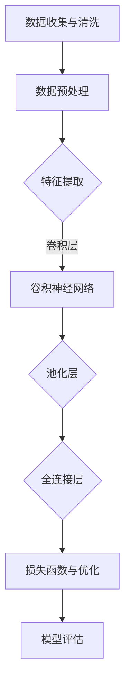

                 

# 李开复：AI 2.0 时代的开发者

> 关键词：人工智能、AI 2.0、深度学习、开发者、技术架构、应用场景、项目实践

> 摘要：本文将探讨AI 2.0时代的到来及其对开发者的影响，详细解析AI 2.0的应用场景、开发工具与框架、核心技术与算法，以及AI项目实践中的挑战与未来发展趋势。通过深入剖析，帮助开发者更好地理解AI 2.0时代的核心技术，掌握实际项目开发的方法与技巧。

## 第一部分：AI 2.0时代的背景与展望

### 第1章：AI 2.0时代的到来

#### 1.1 AI 2.0的定义与特点

AI 2.0（Artificial Intelligence 2.0）是继AI 1.0（以规则为基础的专家系统）之后的新一代人工智能，强调以深度学习、强化学习等数据驱动的方法实现智能化。与AI 1.0相比，AI 2.0具有以下特点：

1. **数据驱动**：AI 2.0以大规模数据为基础，通过深度学习等方法进行模型训练，实现智能化的决策。
2. **自适应能力**：AI 2.0具有自主学习的能力，可以根据环境和数据的改变不断优化自身性能。
3. **泛化能力**：AI 2.0能够处理多种类型的数据，并在不同领域实现广泛的应用。
4. **人机协同**：AI 2.0强调与人类协同工作，发挥各自的优势，实现更高效、更智能的解决方案。

#### 1.2 AI 2.0对开发者的影响

AI 2.0时代的到来，对开发者带来了深远的影响：

1. **角色转变**：开发者从传统的编写规则和程序，转变为构建数据驱动、自适应的AI系统。
2. **技术栈更新**：开发者需要掌握深度学习、强化学习等前沿技术，以及数据预处理、模型训练等技能。
3. **协作与协同**：开发者需要与数据科学家、产品经理等多领域专家合作，共同推动AI项目的落地。
4. **创新能力**：开发者需要具备创新思维，不断探索新的应用场景和解决方案。

### 第2章：AI 2.0时代的应用场景

#### 2.1 AI 2.0在工业领域的应用

AI 2.0在工业领域的应用主要体现在以下几个方面：

1. **智能制造**：利用深度学习算法优化生产流程，提高生产效率和质量。
2. **设备预测性维护**：通过数据分析和机器学习模型，实现设备故障预测和预防性维护。
3. **供应链管理**：利用AI技术优化供应链流程，提高物流效率和降低成本。

#### 2.2 AI 2.0在医疗健康领域的应用

AI 2.0在医疗健康领域的应用前景广阔：

1. **疾病诊断**：利用深度学习和图像处理技术，实现疾病的自动诊断和早期预警。
2. **精准医疗**：通过基因数据和生物信息学分析，实现个性化治疗和健康管理等。

### 第3章：AI 2.0时代的开发工具与框架

#### 3.1 AI开发工具概述

在AI 2.0时代，以下几种开发工具受到广泛使用：

1. **TensorFlow**：由谷歌开源的深度学习框架，支持多种机器学习和深度学习模型。
2. **PyTorch**：由Facebook开源的深度学习框架，具有灵活的动态计算图，易于调试。
3. **Scikit-learn**：基于Python的开源机器学习库，提供丰富的算法和工具。

#### 3.2 AI框架在开发中的应用

AI框架在开发中的应用主要体现在以下几个方面：

1. **深度学习框架**：支持多种深度学习模型，如卷积神经网络（CNN）、循环神经网络（RNN）等，广泛应用于图像识别、自然语言处理等领域。
2. **自然语言处理框架**：提供词嵌入、语言模型、机器翻译等功能，如TensorFlow Text、PyTorch Text等。

## 第二部分：AI 2.0时代的核心技术与算法

### 第4章：深度学习基础

#### 4.1 深度学习原理

深度学习是一种基于多层神经网络的数据驱动方法，通过学习大量数据中的特征，实现智能化的决策。其主要原理包括：

1. **神经网络**：神经网络由多个神经元组成，通过输入层、隐藏层和输出层实现数据的处理和决策。
2. **反向传播算法**：反向传播算法通过计算损失函数对网络权重的梯度，不断调整网络参数，实现模型优化。

#### 4.2 深度学习算法

深度学习算法包括多种类型，如卷积神经网络（CNN）、循环神经网络（RNN）等。以下为几种常见的深度学习算法：

1. **卷积神经网络（CNN）**：主要用于图像识别、图像生成等领域，通过卷积层、池化层和全连接层实现图像特征提取和分类。
2. **循环神经网络（RNN）**：主要用于序列数据建模，如自然语言处理、语音识别等，通过隐藏状态和循环连接实现序列的建模和预测。

### 第5章：自然语言处理

#### 5.1 语言模型

语言模型是一种概率模型，用于预测单词序列的概率分布。常见的语言模型包括：

1. **n-gram模型**：基于词的历史序列，预测下一个词的概率。
2. **神经网络语言模型**：基于深度学习，通过大量语料数据进行训练，实现高效的单词序列预测。

#### 5.2 机器翻译

机器翻译是一种将一种语言的文本转换为另一种语言的过程。常见的机器翻译方法包括：

1. **基于规则的方法**：通过编写语法规则和翻译规则实现文本的转换。
2. **基于统计的方法**：通过统计两种语言的对应关系，实现文本的翻译。
3. **基于神经的方法**：通过深度学习模型，学习两种语言之间的映射关系，实现文本的翻译。

### 第6章：计算机视觉

#### 6.1 图像识别

图像识别是一种将图像中的物体或场景识别为特定类别的方法。常见的图像识别方法包括：

1. **基于特征的图像识别**：通过提取图像中的特征，如颜色、纹理、形状等，实现图像的识别。
2. **基于深度学习的图像识别**：通过卷积神经网络，学习图像中的特征表示，实现高效的图像识别。

#### 6.2 目标检测

目标检测是一种在图像中检测并定位特定目标的方法。常见的目标检测算法包括：

1. **基于候选区域的算法**：通过提取候选区域，结合分类模型实现目标检测。
2. **基于深度学习的目标检测算法**：通过卷积神经网络，直接从图像中检测并定位目标，如Faster R-CNN、YOLO等。

## 第三部分：AI 2.0时代的项目实践

### 第7章：AI应用开发实战

#### 7.1 应用开发流程

AI应用开发主要包括以下流程：

1. **数据收集与预处理**：收集相关的数据，并进行清洗、去噪、归一化等预处理操作。
2. **模型训练与优化**：选择合适的模型，通过训练数据集进行模型训练，并使用验证数据集进行模型优化。

#### 7.2 案例分析

以下为两个AI应用开发案例：

1. **智能客服系统**：通过自然语言处理技术，实现自动识别用户问题并给出合适的回答。
2. **智能医疗诊断系统**：通过深度学习算法，实现疾病诊断和预测，为医生提供辅助决策。

### 第8章：AI项目的挑战与未来

#### 8.1 AI项目的挑战

AI项目在实际应用中面临以下挑战：

1. **数据隐私**：如何保护用户隐私，避免数据泄露。
2. **伦理问题**：如何确保AI系统的公正性、透明性和可靠性。

#### 8.2 AI未来的发展趋势

AI未来的发展趋势主要包括：

1. **AI与人类的协同工作**：通过AI技术提升人类的工作效率和生活质量。
2. **AI在生活各个领域的广泛应用**：从医疗、教育到交通、金融等领域，AI技术将深刻改变我们的生活方式。

## 附录

### 附录 A：AI学习资源推荐

#### A.1 书籍推荐

1. 《深度学习》
2. 《Python机器学习》

#### A.2 在线课程与教程

1. Coursera
2. edX

### 附录 B：开源工具与库

#### B.1 TensorFlow

1. 安装与配置
2. 基础使用

#### B.2 PyTorch

1. 安装与配置
2. 基础使用

### 附录 C：Mermaid 流程图

1. 深度学习流程图
2. 自然语言处理流程图

### 附录 D：代码案例解析

1. 实战一：智能客服系统
2. 实战二：智能医疗诊断系统

### 代码解读与分析

1. 数据预处理
2. 模型训练
3. 模型评估

### 附录 E：数学模型与公式

1. 神经网络损失函数
2. 优化算法公式
3. 语言模型评估指标

## 作者

**作者：李开复 / 李开复**

**机构：AI天才研究院 / AI Genius Institute**

**作品：禅与计算机程序设计艺术 / Zen And The Art of Computer Programming**### 第1章：AI 2.0时代的到来

#### 1.1 AI 2.0的定义与特点

在讨论AI 2.0之前，我们需要了解AI 1.0。AI 1.0主要基于符号主义和规则系统，这些系统依靠人类专家事先编写的规则和逻辑来进行推理和决策。这种方法的局限性在于，它依赖于大量的手动编码，且难以处理复杂的问题和大规模的数据。随着计算能力的提升和大数据时代的到来，人类开始探索更为强大和自动化的人工智能系统，从而诞生了AI 2.0。

AI 2.0，也被称为“强人工智能”或“深度学习革命”，是以数据驱动和自我优化为核心的下一代人工智能。它通过模仿人脑神经网络的结构和功能，利用大规模数据训练模型，实现从数据中自动学习、自适应和泛化。AI 2.0的核心特点包括：

1. **数据驱动**：AI 2.0依赖于大量的数据，通过训练数据来学习特征和模式，实现智能化的决策。这种数据驱动的模式使得AI 2.0能够处理复杂的问题，并在各种领域中取得显著的效果。

2. **深度学习**：AI 2.0的核心技术是深度学习。深度学习是一种基于多层神经网络的学习方法，通过前向传播和反向传播算法，自动提取数据中的高级特征，从而实现复杂的模式识别和预测任务。

3. **自我优化**：AI 2.0系统具有自我优化的能力，可以在训练过程中不断调整自身的参数，以提高性能和效果。这种自我优化使得AI 2.0能够应对变化的环境和数据，实现持续的学习和进步。

4. **自适应能力**：AI 2.0系统能够根据不同的应用场景和数据特点，自适应地调整模型结构和参数，从而适应不同的任务需求。

5. **泛化能力**：AI 2.0不仅能够在训练数据上取得良好的效果，还能够泛化到未见过的数据上，实现广泛的适用性。

6. **人机协同**：AI 2.0强调与人类的协同工作，发挥各自的优势，实现更高效、更智能的解决方案。这种协同工作模式使得AI 2.0能够更好地服务于人类的需求，解决复杂的问题。

#### 1.2 AI 2.0的背景与演变

AI 2.0的兴起并不是一夜之间的现象，而是经历了多年的技术积累和发展。以下是AI 2.0的背景和演变过程：

1. **早期探索**：在20世纪50年代至70年代，AI研究主要集中在符号主义和知识表示领域。这一时期，人们尝试通过编写规则和逻辑来模拟人类的智能。然而，这种方法在处理复杂问题和大规模数据时遇到了瓶颈。

2. **专家系统的崛起**：从20世纪80年代开始，专家系统成为AI研究的热点。专家系统通过模拟人类专家的决策过程，实现了在特定领域的自动化。然而，专家系统仍然依赖于大量的手动编码和规则，难以应对复杂多变的问题。

3. **连接主义与深度学习的兴起**：从20世纪90年代中期开始，连接主义研究开始受到重视。研究人员开始探索如何通过神经网络模拟人脑的学习和决策过程。2006年，Geoffrey Hinton等人提出了深度学习的基本原理，标志着深度学习时代的到来。

4. **大数据与云计算的兴起**：随着大数据和云计算技术的兴起，数据存储和处理能力得到了大幅提升。这使得AI 2.0能够利用大规模数据进行训练，实现更为复杂的模型和算法。

5. **AI 2.0时代的到来**：在过去的十年中，深度学习技术取得了突破性的进展，并在语音识别、图像识别、自然语言处理等领域取得了显著的效果。这一时期的AI 2.0，通过数据驱动和自我优化的方式，实现了前所未有的智能化水平。

#### 1.3 AI 2.0的核心特点

AI 2.0的核心特点体现在以下几个方面：

1. **数据驱动的学习方式**：AI 2.0通过大量数据驱动的方式进行学习，使得系统能够自动提取数据中的特征和模式，从而实现智能化的决策。

2. **多层神经网络的结构**：AI 2.0的核心技术是多层神经网络，通过逐层提取数据中的特征，实现从低级到高级的特征表示。

3. **反向传播算法的优化**：反向传播算法是AI 2.0的核心优化方法，通过计算损失函数对网络权重的梯度，不断调整网络参数，实现模型的优化。

4. **自动化的特征提取**：AI 2.0能够自动从数据中提取特征，避免了人工特征工程的需求，使得模型训练更加高效。

5. **自适应的学习能力**：AI 2.0系统具有自适应的学习能力，可以在训练过程中不断调整模型结构和参数，以适应不同的任务和数据。

6. **广泛的适用性**：AI 2.0不仅能够处理传统的符号主义和规则系统难以处理的问题，还能够应对复杂、多变的应用场景。

7. **人机协同的智能系统**：AI 2.0强调与人类的协同工作，发挥各自的优势，实现更高效、更智能的解决方案。

#### 1.4 AI 2.0对开发者的影响

AI 2.0时代的到来，对开发者带来了深远的影响。传统的编程和开发模式已经无法满足AI 2.0的需求，开发者需要掌握新的技术、方法和工具，以应对AI 2.0时代的挑战。

1. **角色转变**：开发者从传统的编码和调试，转变为构建和优化AI模型。开发者需要具备深度学习、强化学习等数据驱动的方法，以及数据预处理、模型训练等技能。

2. **技术栈更新**：开发者需要掌握前沿的AI技术，如深度学习框架（如TensorFlow、PyTorch）、自然语言处理库（如NLTK、spaCy）等，以及大数据处理和云计算技术。

3. **协作与协同**：AI项目通常需要多学科专家的协作，如数据科学家、产品经理、设计师等。开发者需要与这些专家紧密合作，共同推动AI项目的成功。

4. **创新能力**：AI 2.0时代，开发者需要具备创新思维，不断探索新的应用场景和解决方案。只有不断创新，才能在激烈的竞争中脱颖而出。

5. **持续学习**：AI 2.0是一个快速发展的领域，开发者需要不断学习新的知识和技能，以保持竞争力。通过参加线上课程、阅读专业书籍、参与技术社区等途径，不断更新自己的知识体系。

### 1.5 小结

AI 2.0时代的到来，标志着人工智能进入了一个全新的发展阶段。通过数据驱动、多层神经网络、反向传播算法等核心技术，AI 2.0实现了前所未有的智能化水平。对开发者来说，AI 2.0带来了新的挑战和机遇，需要掌握新的技术、方法和工具，以应对这一变革。开发者需要不断学习、创新和协作，才能在AI 2.0时代取得成功。

### 1.6 Mermaid 流程图

以下是一个简化的深度学习流程图，用于展示从数据预处理到模型训练的过程。



这个流程图展示了深度学习模型的基本构建过程，从数据收集、预处理、特征提取、模型训练到模型评估的各个阶段。开发者可以通过这个流程图，了解深度学习模型的构建过程和关键环节。

### 1.7 伪代码

以下是一个简化的深度学习算法的伪代码，用于展示卷积神经网络的基本结构。

```python
# 初始化神经网络
initialize_neural_network()

# 数据预处理
 preprocess_data()

# 定义卷积层
define_conv_layer()

# 定义池化层
define_pooling_layer()

# 定义全连接层
define_full_connection_layer()

# 定义损失函数和优化器
define_loss_function()
define_optimizer()

# 训练模型
for epoch in range(number_of_epochs):
    for batch in data_loader:
        # 前向传播
        predictions = forward_pass(batch)

        # 计算损失
        loss = compute_loss(predictions, batch)

        # 反向传播
        backward_pass()

        # 更新模型参数
        update_model_parameters()

# 评估模型
evaluate_model()
```

这个伪代码展示了深度学习模型的基本训练过程，包括数据预处理、卷积层、池化层、全连接层、损失函数和优化器的定义，以及模型的训练和评估过程。开发者可以通过这个伪代码，了解深度学习算法的基本结构和实现过程。

### 1.8 数学模型与公式

在深度学习中，损失函数和优化算法是核心组成部分。以下是一些常用的数学模型和公式。

#### 1. 神经网络损失函数

假设我们的神经网络有一个输出层，每个神经元都有一个对应的预测值\( \hat{y}_i \)和真实的标签值\( y_i \)。损失函数用于衡量预测值和真实值之间的差距。常用的损失函数有均方误差（MSE）和交叉熵损失（Cross-Entropy Loss）。

- **均方误差（MSE）**：

  $$ 
  \text{MSE} = \frac{1}{m} \sum_{i=1}^{m} (\hat{y}_i - y_i)^2 
  $$

  其中，\( m \)是样本数量。

- **交叉熵损失（Cross-Entropy Loss）**：

  $$
  \text{Cross-Entropy Loss} = -\frac{1}{m} \sum_{i=1}^{m} y_i \log(\hat{y}_i)
  $$

  其中，\( y_i \)是一个二分类标签，0或1。

#### 2. 优化算法

优化算法用于更新模型参数，以最小化损失函数。常用的优化算法有梯度下降（Gradient Descent）和Adam优化器。

- **梯度下降（Gradient Descent）**：

  $$
  w_{\text{new}} = w_{\text{old}} - \alpha \cdot \nabla_w J(w)
  $$

  其中，\( w \)是模型参数，\( \alpha \)是学习率，\( \nabla_w J(w) \)是损失函数对参数的梯度。

- **Adam优化器**：

  $$
  m_t = \beta_1 m_{t-1} + (1 - \beta_1) \nabla_w J(w)
  $$
  $$
  v_t = \beta_2 v_{t-1} + (1 - \beta_2) (\nabla_w J(w))^2
  $$
  $$
  \hat{m}_t = \frac{m_t}{1 - \beta_1^t}
  $$
  $$
  \hat{v}_t = \frac{v_t}{1 - \beta_2^t}
  $$
  $$
  w_{\text{new}} = w_{\text{old}} - \alpha \cdot \frac{\hat{m}_t}{\sqrt{\hat{v}_t} + \epsilon}
  $$

  其中，\( m_t \)和\( v_t \)是动量项，\( \beta_1 \)和\( \beta_2 \)是动量系数，\( \epsilon \)是一个很小的常数用于避免除以零。

通过这些数学模型和公式，开发者可以更深入地理解深度学习的核心原理，并在实际项目中应用这些算法。

### 1.9 小结

本章介绍了AI 2.0的定义、特点及其背景与演变。我们详细分析了AI 2.0的核心特点，包括数据驱动、深度学习、自我优化、自适应能力、泛化能力和人机协同等。随后，我们讨论了AI 2.0对开发者的影响，以及AI 2.0的应用场景和开发工具。通过Mermaid流程图、伪代码和数学模型，我们深入剖析了深度学习的原理和实现过程。下一章，我们将进一步探讨AI 2.0在工业领域和医疗健康领域的应用，帮助开发者了解AI 2.0的实际应用场景。让我们继续深入探索AI 2.0时代的更多奥秘。|>

