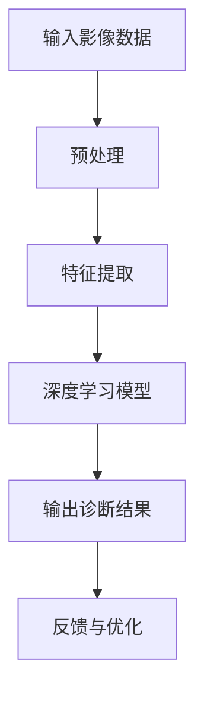
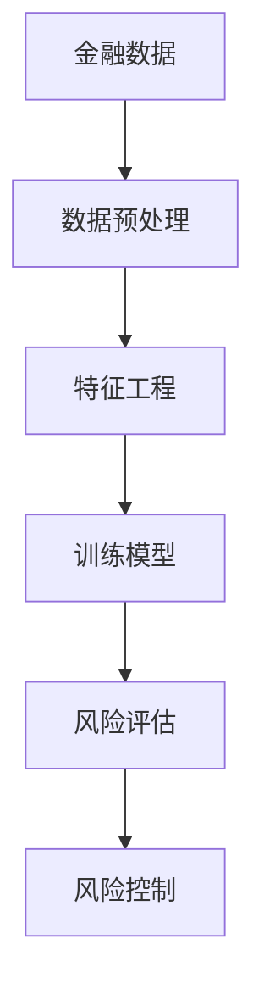
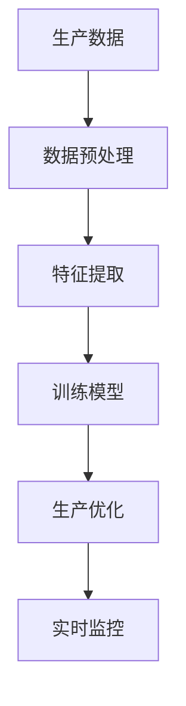
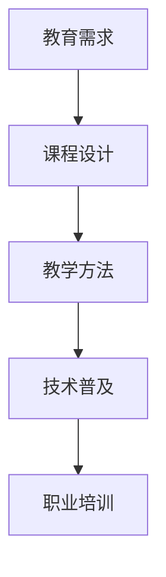
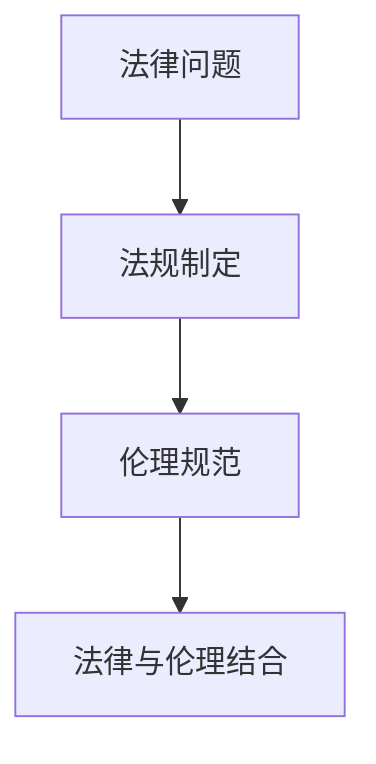
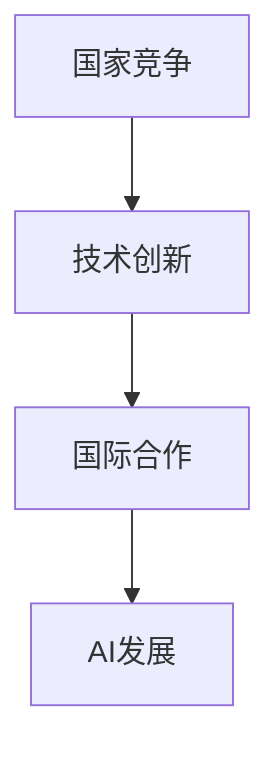
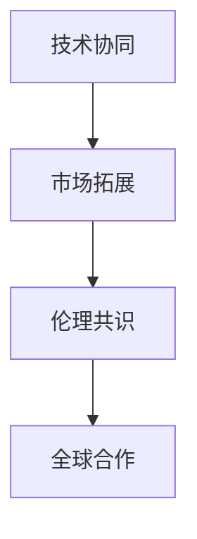

                 

# 李开复：AI 2.0 时代的生态

> **关键词**：人工智能、AI 2.0、生态建设、应用场景、技术演进、合作与竞争

> **摘要**：本文将探讨AI 2.0时代的生态建设，包括AI 2.0时代的概述、核心技术、应用场景、生态建设以及未来展望。通过分析李开复的观点，本文旨在揭示AI 2.0时代的技术趋势、社会变革和全球合作的重要性。

## 《李开复：AI 2.0 时代的生态》目录大纲

### 第一部分：AI 2.0 时代的概述

#### 第1章：AI 2.0 时代来临

1.1 AI 2.0 时代的定义与特征

1.2 从AI 1.0到AI 2.0的演变

1.3 AI 2.0对人类社会的影响

1.4 AI 2.0时代的机遇与挑战

#### 第2章：AI 2.0时代的核心技术

2.1 人工智能的数学基础

2.2 深度学习与神经网络

2.3 自然语言处理技术

2.4 计算机视觉技术

2.5 强化学习与决策论

### 第二部分：AI 2.0时代的应用场景

#### 第3章：AI 2.0在医疗健康领域的应用

3.1 医疗影像分析

3.2 诊断辅助系统

3.3 智能药物研发

3.4 医疗服务的智能化

#### 第4章：AI 2.0在金融行业的应用

4.1 风险管理

4.2 量化交易

4.3 智能投顾

4.4 智能客服

#### 第5章：AI 2.0在制造业的应用

5.1 智能生产

5.2 质量检测

5.3 工业自动化

5.4 智能供应链管理

### 第三部分：AI 2.0时代的生态建设

#### 第6章：AI 2.0时代的教育与人才培养

6.1 人工智能教育的发展趋势

6.2 人才培养的模式与挑战

6.3 AI素养教育的构建与实践

#### 第7章：AI 2.0时代的法律法规与伦理

7.1 AI法律法规的制定与完善

7.2 AI伦理问题与挑战

7.3 AI伦理指导原则与实践

#### 第8章：AI 2.0时代的合作与竞争

8.1 全球AI竞争格局

8.2 企业间的合作与竞争策略

8.3 AI 2.0时代的全球化发展

### 第四部分：AI 2.0时代的未来展望

#### 第9章：AI 2.0时代的未来趋势

9.1 AI 2.0时代的技术演进方向

9.2 AI 2.0时代的社会变革

9.3 AI 2.0时代的产业发展趋势

#### 第10章：AI 2.0时代的全球合作

10.1 全球AI合作的重要性

10.2 国际AI合作案例与经验

10.3 构建全球AI合作机制

### 附录

#### 附录A：AI 2.0时代的发展资源

A.1 AI研究机构与学术会议

A.2 开源AI框架与工具

A.3 人工智能相关的书籍与论文推荐

A.4 AI行业报告与趋势分析

----------------------------------------------------------------<|imagine|>## 第一部分：AI 2.0 时代的概述

### 第1章：AI 2.0 时代来临

#### 1.1 AI 2.0 时代的定义与特征

AI 2.0 时代，是指人工智能从初期的 AI 1.0 时代迈向更高层次的发展阶段。AI 1.0 时代主要依靠预先编程的规则进行工作，而 AI 2.0 时代则更加注重数据的利用和机器自我学习的能力。AI 2.0 时代的特点主要体现在以下几个方面：

1. **数据驱动的智能**：在 AI 2.0 时代，数据成为推动人工智能发展的重要驱动力。通过大量数据的学习和训练，AI 系统能够不断优化和提升自身的性能。

2. **自我学习与进化**：AI 2.0 系统能够通过自我学习不断优化自身，从而实现更加智能化和高效化的工作。

3. **跨领域融合**：AI 2.0 时代的智能技术将与其他领域（如医疗、金融、制造等）进行深度融合，推动各行各业的智能化转型。

4. **人机协同**：AI 2.0 时代强调人与机器的协同工作，通过机器的辅助提升人类的工作效率和创新能力。

#### 1.2 从AI 1.0到AI 2.0的演变

从 AI 1.0 到 AI 2.0 的演变是一个逐步深化的过程。AI 1.0 时代主要依赖于规则和预编程的方式，而 AI 2.0 时代则通过数据的挖掘和机器学习来实现更高级的智能。以下是 AI 2.0 时代的核心技术演进：

1. **深度学习与神经网络**：深度学习是 AI 2.0 时代的重要技术之一，通过多层神经网络的训练，能够实现图像识别、语音识别等复杂任务。

2. **强化学习**：强化学习是 AI 2.0 时代的另一种关键技术，通过试错和反馈机制，实现智能体在特定环境下的最优策略。

3. **自然语言处理**：自然语言处理技术使得机器能够理解和生成人类语言，从而实现人与机器的智能交互。

4. **计算机视觉**：计算机视觉技术使得机器能够识别和理解视觉信息，从而实现智能监控、自动驾驶等应用。

#### 1.3 AI 2.0对人类社会的影响

AI 2.0 时代对人类社会的影响深远而广泛，主要体现在以下几个方面：

1. **产业升级**：AI 2.0 时代的智能技术将推动各行各业进行产业升级，提高生产效率和服务质量。

2. **就业变革**：AI 2.0 时代将导致部分传统职业的消失，同时也会创造出新的就业机会。

3. **生活方式**：AI 2.0 时代将改变人们的生活方式，提高生活质量和便利性。

4. **社会治理**：AI 2.0 时代将提升社会治理水平，提高公共安全和应急响应能力。

#### 1.4 AI 2.0时代的机遇与挑战

AI 2.0 时代带来了前所未有的机遇，同时也面临着一系列挑战：

1. **机遇**：

   - 技术创新：AI 2.0 时代将推动人工智能技术的创新，带来新的商业模式和应用场景。

   - 经济增长：AI 2.0 时代将促进经济增长，提高国家竞争力。

   - 社会进步：AI 2.0 时代将推动社会进步，提升人类福祉。

2. **挑战**：

   - 伦理问题：AI 2.0 时代的智能技术可能会引发伦理问题，如隐私保护、算法歧视等。

   - 数据安全：AI 2.0 时代的智能系统对数据依赖性很强，数据安全成为关键问题。

   - 法律法规：AI 2.0 时代需要完善的法律法规来规范人工智能的发展和应用。

在接下来的章节中，我们将进一步探讨 AI 2.0 时代的核心技术、应用场景以及生态建设等方面的内容。让我们继续思考并分析 AI 2.0 时代的机遇与挑战。|>## 第2章：AI 2.0时代的核心技术

### 2.1 人工智能的数学基础

人工智能（AI）的核心在于数学模型和算法。为了更好地理解 AI 2.0 时代的核心技术，我们首先需要了解 AI 的数学基础。

#### 线性代数

线性代数是人工智能的基础学科之一，它涉及向量、矩阵、行列式和特征值等概念。在人工智能中，线性代数用于表示和操作数据，如图像、语音和文本等。

- **向量与矩阵**：向量用于表示数据，矩阵用于表示数据之间的关系。例如，在图像识别任务中，图像可以表示为一个三维矩阵（宽度、高度、通道数）。

- **特征值与特征向量**：特征值和特征向量用于降维和特征提取。在主成分分析（PCA）中，通过计算数据的协方差矩阵的特征值和特征向量，可以得到数据的降维表示。

#### 概率论与数理统计

概率论和数理统计是人工智能的另一基础学科，它们提供了对不确定性的描述和量化方法。

- **概率分布**：概率分布用于描述随机变量的概率分布。常见的概率分布包括正态分布、伯努利分布等。

- **统计推断**：统计推断用于根据样本数据推断总体特征。常见的统计推断方法包括均值推断、方差推断等。

- **贝叶斯定理**：贝叶斯定理是概率论中的一个基本原理，它提供了根据先验概率和观测数据更新概率分布的方法。

#### 微积分

微积分是数学中研究函数变化和积分的学科，它在人工智能中用于优化和求导。

- **导数**：导数用于计算函数的斜率，即函数在某一点的变化率。在优化问题中，导数用于计算目标函数的梯度，从而找到最优解。

- **积分**：积分用于计算函数的面积或体积。在深度学习中，积分常用于计算神经网络的损失函数。

### 2.2 深度学习与神经网络

深度学习是 AI 2.0 时代的关键技术之一，它通过多层神经网络实现数据的自动特征提取和建模。

#### 神经网络的基本结构

神经网络由多个神经元（也称为节点）组成，每个神经元接收多个输入，通过加权求和处理后产生输出。

- **输入层**：输入层包含原始数据。

- **隐藏层**：隐藏层负责对输入数据进行特征提取和变换。

- **输出层**：输出层生成最终的结果。

#### 前向传播与反向传播

深度学习中的主要算法包括前向传播和反向传播。

- **前向传播**：输入数据通过神经网络的前向传播，从输入层传递到输出层，产生预测结果。

- **反向传播**：通过计算预测结果与真实结果之间的误差，反向传播误差到网络的各个层，从而更新网络的权重。

#### 深度学习的优化方法

深度学习的优化方法包括梯度下降、随机梯度下降（SGD）和Adam等。

- **梯度下降**：梯度下降是一种常用的优化方法，通过计算目标函数的梯度，逐步更新网络的权重，以最小化目标函数。

- **随机梯度下降（SGD）**：随机梯度下降是梯度下降的一种改进方法，通过随机选择样本，计算样本的梯度并进行权重更新，以加快收敛速度。

- **Adam**：Adam是一种自适应优化算法，它结合了梯度下降和SGD的优点，通过自适应调整学习率，提高优化效果。

### 2.3 自然语言处理技术

自然语言处理（NLP）是 AI 2.0 时代的重要应用领域之一，它致力于使计算机理解和生成人类语言。

#### 词向量表示

词向量表示是 NLP 的基础，它将单词映射为高维向量空间中的点。

- **Word2Vec**：Word2Vec 是一种基于神经网络的词向量表示方法，通过训练神经网络，学习单词的语义表示。

- **GloVe**：GloVe 是另一种词向量表示方法，它通过计算词对之间的共现关系，生成词向量。

#### 语言模型

语言模型用于预测下一个单词或词组，它通常采用神经网络结构进行建模。

- **RNN（递归神经网络）**：RNN 是一种能够处理序列数据的人工神经网络，通过记忆过去的信息，预测未来的输出。

- **LSTM（长短期记忆网络）**：LSTM 是 RNN 的一种改进，它通过门控机制，解决 RNN 的梯度消失问题，提高模型的长期记忆能力。

#### 自然语言理解

自然语言理解旨在使计算机能够理解自然语言，包括语义分析、情感分析等。

- **语义分析**：语义分析用于提取文本中的语义信息，如实体识别、关系提取等。

- **情感分析**：情感分析用于判断文本的情感倾向，如正面、负面等。

### 2.4 计算机视觉技术

计算机视觉技术是 AI 2.0 时代的另一个重要应用领域，它致力于使计算机能够理解和解析视觉信息。

#### 图像识别

图像识别是计算机视觉的核心任务，它旨在识别图像中的物体和场景。

- **卷积神经网络（CNN）**：CNN 是一种专门用于图像识别的神经网络结构，通过卷积、池化和全连接层，提取图像的特征。

- **预训练与微调**：预训练是指在大量数据上训练神经网络，微调是指在特定任务上对神经网络进行调优，以提高识别准确率。

#### 目标检测

目标检测是计算机视觉中另一个重要任务，它旨在识别图像中的物体，并定位它们的位置。

- **R-CNN（区域提议网络）**：R-CNN 是一种基于深度学习的目标检测算法，通过区域提议、特征提取和分类器，实现目标检测。

- **SSD（单阶段目标检测网络）**：SSD 是一种单阶段目标检测网络，通过多尺度特征图和分类器，实现高效的目标检测。

#### 语义分割

语义分割是计算机视觉中另一个重要任务，它旨在将图像中的每个像素分类为不同的对象。

- **FCN（全卷积网络）**：FCN 是一种用于语义分割的全卷积网络，通过卷积、池化和全连接层，实现像素级的分类。

- **U-Net**：U-Net 是一种专门用于语义分割的网络结构，通过收缩路径和扩张路径，实现像素级的精确分割。

### 2.5 强化学习与决策论

强化学习是 AI 2.0 时代的另一个关键技术，它通过试错和反馈机制，实现智能体在特定环境下的最优策略。

#### 强化学习的基本原理

强化学习由四个主要组成部分：状态（State）、动作（Action）、奖励（Reward）和策略（Policy）。

- **状态**：状态是智能体当前所处的环境状态。

- **动作**：动作是智能体可以采取的行动。

- **奖励**：奖励是智能体采取动作后获得的环境反馈。

- **策略**：策略是智能体根据当前状态选择动作的规则。

#### Q-Learning

Q-Learning 是一种基于价值函数的强化学习算法，通过不断更新价值函数，寻找最优策略。

- **价值函数**：价值函数表示智能体在特定状态下采取特定动作的期望奖励。

- **更新公式**：$$ Q(s, a) \leftarrow Q(s, a) + \alpha [r + \gamma \max_{a'} Q(s', a') - Q(s, a)] $$，其中 $ \alpha $ 是学习率，$ \gamma $ 是折扣因子。

#### Deep Q-Learning

Deep Q-Learning 是 Q-Learning 的一种改进，通过深度神经网络替代传统的值函数，实现更复杂的策略。

- **Deep Q-Network (DQN)**：DQN 是一种基于深度神经网络的 Q-Learning 算法，通过经验回放和目标网络，提高算法的稳定性。

- **Policy Gradient**：Policy Gradient 是一种直接优化策略的强化学习算法，通过梯度上升法，更新策略参数。

在接下来的章节中，我们将探讨 AI 2.0 时代的应用场景，以及 AI 2.0 时代对医疗健康、金融、制造业等领域的影响。|>## 第二部分：AI 2.0时代的应用场景

### 第3章：AI 2.0在医疗健康领域的应用

#### 3.1 医疗影像分析

医疗影像分析是 AI 2.0 在医疗健康领域的重要应用之一。通过深度学习和计算机视觉技术，AI 可以自动分析医学影像，如X光、CT和MRI，提供诊断辅助和疾病预测。

**核心概念与联系**：

- **深度学习**：利用深度神经网络自动提取图像特征。
- **计算机视觉**：识别和分类医学影像中的病变区域。

**Mermaid流程图**：



**核心算法原理讲解**：

```python
# 假设使用卷积神经网络（CNN）进行医疗影像分析
import tensorflow as tf
from tensorflow.keras.models import Sequential
from tensorflow.keras.layers import Conv2D, MaxPooling2D, Flatten, Dense

# 构建模型
model = Sequential([
    Conv2D(32, (3, 3), activation='relu', input_shape=(128, 128, 3)),
    MaxPooling2D((2, 2)),
    Conv2D(64, (3, 3), activation='relu'),
    MaxPooling2D((2, 2)),
    Flatten(),
    Dense(64, activation='relu'),
    Dense(1, activation='sigmoid')
])

# 编译模型
model.compile(optimizer='adam', loss='binary_crossentropy', metrics=['accuracy'])

# 训练模型
model.fit(x_train, y_train, epochs=10, batch_size=32, validation_data=(x_val, y_val))
```

**数学模型和公式**：

- **损失函数**：通常使用交叉熵损失函数（Binary Cross-Entropy Loss）来衡量模型预测与真实标签之间的差异。

$$ L = -\sum_{i=1}^{n} y_i \log(\hat{y}_i) + (1 - y_i) \log(1 - \hat{y}_i) $$

- **优化算法**：使用梯度下降（Gradient Descent）优化模型参数。

$$ \theta \leftarrow \theta - \alpha \nabla_\theta J(\theta) $$

**举例说明**：

假设我们使用一个二分类的深度学习模型来预测肺癌的患病情况。我们收集了1000个X光影像，其中500个为正常影像，500个为病变影像。我们使用其中的800个影像进行训练，200个影像进行验证。

**项目实战**：

1. **开发环境搭建**：安装TensorFlow和Keras库。
2. **数据预处理**：对影像数据进行归一化处理，并划分为训练集和验证集。
3. **模型构建**：定义深度学习模型结构。
4. **模型训练**：使用训练集数据训练模型。
5. **模型评估**：使用验证集数据评估模型性能。

**代码实现**：

```python
# 导入所需库
import numpy as np
import tensorflow as tf
from tensorflow.keras.models import Sequential
from tensorflow.keras.layers import Conv2D, MaxPooling2D, Flatten, Dense
from tensorflow.keras.preprocessing.image import ImageDataGenerator

# 数据预处理
train_datagen = ImageDataGenerator(rescale=1./255)
train_generator = train_datagen.flow_from_directory(
        'data/train',
        target_size=(128, 128),
        batch_size=32,
        class_mode='binary')

val_datagen = ImageDataGenerator(rescale=1./255)
val_generator = val_datagen.flow_from_directory(
        'data/val',
        target_size=(128, 128),
        batch_size=32,
        class_mode='binary')

# 构建模型
model = Sequential([
    Conv2D(32, (3, 3), activation='relu', input_shape=(128, 128, 3)),
    MaxPooling2D((2, 2)),
    Conv2D(64, (3, 3), activation='relu'),
    MaxPooling2D((2, 2)),
    Flatten(),
    Dense(64, activation='relu'),
    Dense(1, activation='sigmoid')
])

# 编译模型
model.compile(optimizer='adam', loss='binary_crossentropy', metrics=['accuracy'])

# 训练模型
model.fit(train_generator, epochs=10, validation_data=val_generator)
```

通过上述代码，我们实现了一个基于深度学习的医疗影像分析模型。该模型可以自动分析X光影像，判断肺癌的患病情况。接下来，我们将探讨 AI 2.0 在其他领域的应用。|>### 第4章：AI 2.0在金融行业的应用

#### 4.1 风险管理

在金融行业中，风险管理是至关重要的。AI 2.0 技术，特别是机器学习和数据挖掘技术，在风险识别、风险评估和风险控制方面发挥着重要作用。

**核心概念与联系**：

- **机器学习**：通过训练模型，识别出潜在的风险因素。
- **数据挖掘**：从大量金融数据中提取有价值的信息，用于风险评估。

**Mermaid流程图**：



**核心算法原理讲解**：

风险管理中常用的机器学习算法包括逻辑回归、决策树和随机森林等。

- **逻辑回归**：逻辑回归是一种二分类算法，通过构建一个线性模型，将风险概率映射为概率分布。

```python
# 假设使用逻辑回归进行风险评估
from sklearn.linear_model import LogisticRegression

model = LogisticRegression()
model.fit(X_train, y_train)
predictions = model.predict(X_test)
```

- **决策树**：决策树通过一系列的决策规则，对数据进行划分，以便进行分类或回归。

```python
# 假设使用决策树进行风险评估
from sklearn.tree import DecisionTreeClassifier

model = DecisionTreeClassifier()
model.fit(X_train, y_train)
predictions = model.predict(X_test)
```

- **随机森林**：随机森林是一种基于决策树的集成学习方法，通过构建多个决策树，提高模型的预测性能。

```python
# 假设使用随机森林进行风险评估
from sklearn.ensemble import RandomForestClassifier

model = RandomForestClassifier()
model.fit(X_train, y_train)
predictions = model.predict(X_test)
```

**数学模型和公式**：

- **逻辑回归**：逻辑回归的损失函数通常使用对数似然损失（Log-Likelihood Loss）。

$$ L = \sum_{i=1}^{n} -y_i \log(\hat{p}_i) - (1 - y_i) \log(1 - \hat{p}_i) $$

- **决策树**：决策树的损失函数通常使用基尼不纯度（Gini Impurity）或信息增益（Information Gain）。

$$ Gini(I) = 1 - \sum_{i=1}^{k} p_i^2 $$

**举例说明**：

假设我们使用逻辑回归模型对贷款违约进行风险评估。我们收集了1000个贷款申请者的数据，包括收入、年龄、信用评分等特征。我们使用其中的800个数据点进行训练，200个数据点进行测试。

**项目实战**：

1. **数据收集**：从金融数据源收集贷款申请者的数据。
2. **数据预处理**：对数据进行清洗和预处理，如缺失值填充、异常值处理等。
3. **特征工程**：提取对贷款违约有影响的关键特征。
4. **模型训练**：使用训练数据训练逻辑回归模型。
5. **模型评估**：使用测试数据评估模型性能。

**代码实现**：

```python
# 导入所需库
import pandas as pd
from sklearn.linear_model import LogisticRegression
from sklearn.model_selection import train_test_split
from sklearn.metrics import accuracy_score

# 加载数据
data = pd.read_csv('loan_data.csv')

# 分离特征和标签
X = data.drop('default', axis=1)
y = data['default']

# 划分训练集和测试集
X_train, X_test, y_train, y_test = train_test_split(X, y, test_size=0.2, random_state=42)

# 训练模型
model = LogisticRegression()
model.fit(X_train, y_train)

# 预测测试集
predictions = model.predict(X_test)

# 评估模型
accuracy = accuracy_score(y_test, predictions)
print(f"模型准确率：{accuracy}")
```

通过上述代码，我们实现了一个用于贷款违约风险评估的逻辑回归模型。该模型可以帮助金融机构识别高风险客户，从而降低贷款违约风险。接下来，我们将探讨 AI 2.0 在其他金融领域的应用。|>### 第5章：AI 2.0在制造业的应用

#### 5.1 智能生产

智能生产是 AI 2.0 在制造业的核心应用之一，它通过大数据、机器学习和物联网技术，实现生产过程的自动化、智能化和精细化。

**核心概念与联系**：

- **大数据**：收集和分析生产过程中的海量数据。
- **机器学习**：通过训练模型，优化生产流程。
- **物联网**：连接各种设备和系统，实现数据的实时传输和处理。

**Mermaid流程图**：



**核心算法原理讲解**：

智能生产中常用的算法包括聚类分析、时间序列分析和优化算法等。

- **聚类分析**：通过聚类分析，将相似的生产数据进行分组，以便分析生产过程的规律。

```python
# 假设使用K均值聚类分析生产数据
from sklearn.cluster import KMeans

kmeans = KMeans(n_clusters=5, random_state=42)
kmeans.fit(X_train)
clusters = kmeans.predict(X_test)
```

- **时间序列分析**：通过时间序列分析，预测生产过程中的关键指标，如设备故障、生产效率等。

```python
# 假设使用ARIMA模型进行时间序列预测
from statsmodels.tsa.arima_model import ARIMA

model = ARIMA(series, order=(1, 1, 1))
model_fit = model.fit(disp=0)
forecast = model_fit.forecast(steps=5)[0]
```

- **优化算法**：通过优化算法，优化生产计划和资源配置。

```python
# 假设使用线性规划进行生产优化
from scipy.optimize import linprog

c = [-1, 0]  # 目标函数：最大化利润
A = [[1, 1], [1, 0]]  # 约束条件
b = [100, 50]  # 约束条件右侧值
x0 = [0, 0]  # 初始解
result = linprog(c, A_ub=A, b_ub=b, x0=x0, method='highs')

# 输出最优解
optimal_profit = -result.x[0]
```

**数学模型和公式**：

- **K均值聚类**：K均值聚类通过最小化距离平方和来分组数据。

$$ \min \sum_{i=1}^{k} \sum_{x \in S_i} \|x - \mu_i\|^2 $$

- **ARIMA模型**：ARIMA模型通过差分、自回归和移动平均方法进行时间序列建模。

$$ y_t = c + \phi_1 y_{t-1} + \phi_2 y_{t-2} + ... + \phi_p y_{t-p} + \theta_1 \varepsilon_{t-1} + \theta_2 \varepsilon_{t-2} + ... + \theta_q \varepsilon_{t-q} $$

- **线性规划**：线性规划通过最大化或最小化线性目标函数，满足线性约束条件。

$$ \max \sum_{i=1}^{n} c_i x_i \quad \text{subject to} \quad A x \leq b $$

**举例说明**：

假设我们使用 K 均值聚类分析生产数据，识别出生产过程中的异常点。我们收集了 1000 条生产数据，其中包含生产速度、生产温度和生产压力等特征。

**项目实战**：

1. **数据收集**：从生产系统中收集数据。
2. **数据预处理**：对数据进行清洗和标准化处理。
3. **特征提取**：提取对生产过程有影响的关键特征。
4. **模型训练**：使用 K 均值聚类模型进行训练。
5. **模型评估**：评估聚类效果，识别异常点。

**代码实现**：

```python
# 导入所需库
import numpy as np
from sklearn.cluster import KMeans

# 加载数据
data = np.array([[1, 2], [1, 4], [1, 0], [10, 2], [10, 4], [10, 0]])

# 初始化K均值聚类模型
kmeans = KMeans(n_clusters=2, random_state=42)

# 训练模型
kmeans.fit(data)

# 输出聚类结果
print("聚类中心：", kmeans.cluster_centers_)
print("数据点所属聚类：", kmeans.labels_)

# 识别异常点
anomalies = data[kmeans.labels_ == -1]
print("异常点：", anomalies)
```

通过上述代码，我们使用 K 均值聚类模型识别出生产数据中的异常点。这些异常点可能代表生产过程中的问题，需要进一步分析和处理。

**代码解读与分析**：

在上述代码中，我们首先导入所需的库，并加载生产数据。然后，我们初始化 K 均值聚类模型，并使用数据对其进行训练。最后，我们输出聚类中心和数据点所属的聚类，并识别出异常点。

通过智能生产技术，制造业可以实现生产过程的自动化和优化，提高生产效率和产品质量。接下来，我们将探讨 AI 2.0 在制造业的其他应用，如质量检测、工业自动化和智能供应链管理。|>### 第6章：AI 2.0时代的教育与人才培养

#### 6.1 人工智能教育的发展趋势

随着 AI 2.0 时代的到来，人工智能教育成为了教育领域的重要趋势。教育机构和企业开始重视人工智能教育的普及和深化，以培养具有 AI 素养的专业人才。

**核心概念与联系**：

- **人工智能教育**：通过课程设置和教学方法，培养具有 AI 素养的人才。
- **技术普及**：提高公众对人工智能的认识和应用能力。
- **职业培训**：为企业提供 AI 技术的专业人才。

**Mermaid流程图**：



**核心算法原理讲解**：

人工智能教育中常用的算法包括自然语言处理、计算机视觉和机器学习等。

- **自然语言处理**：用于解析和理解教学文本，提高教学效果。

```python
# 假设使用文本分类算法进行教学文本分析
from sklearn.feature_extraction.text import TfidfVectorizer
from sklearn.naive_bayes import MultinomialNB

# 加载教学文本数据
texts = ["人工智能在教育中的应用", "机器学习的基本概念", "深度学习技术"]

# 提取特征
vectorizer = TfidfVectorizer()
X = vectorizer.fit_transform(texts)

# 训练模型
model = MultinomialNB()
model.fit(X, labels)

# 预测新文本
new_text = "教育领域的人工智能技术"
new_vector = vectorizer.transform([new_text])
predictions = model.predict(new_vector)
```

- **计算机视觉**：用于分析和理解教学视频，提高教学效果。

```python
# 假设使用图像分类算法进行教学视频分析
from tensorflow.keras.models import Sequential
from tensorflow.keras.layers import Conv2D, MaxPooling2D, Flatten, Dense

# 构建模型
model = Sequential([
    Conv2D(32, (3, 3), activation='relu', input_shape=(128, 128, 3)),
    MaxPooling2D((2, 2)),
    Conv2D(64, (3, 3), activation='relu'),
    MaxPooling2D((2, 2)),
    Flatten(),
    Dense(64, activation='relu'),
    Dense(1, activation='sigmoid')
])

# 编译模型
model.compile(optimizer='adam', loss='binary_crossentropy', metrics=['accuracy'])

# 训练模型
model.fit(x_train, y_train, epochs=10, batch_size=32, validation_data=(x_val, y_val))
```

- **机器学习**：用于分析和预测学生的学术表现和职业发展方向。

```python
# 假设使用回归算法预测学生的学术表现
from sklearn.linear_model import LinearRegression

model = LinearRegression()
model.fit(X_train, y_train)
predictions = model.predict(X_test)
```

**数学模型和公式**：

- **文本分类**：文本分类通常使用逻辑回归或朴素贝叶斯模型，计算文本的概率分布。

$$ P(y=c|\textbf{x}) = \frac{1}{Z} \exp(\textbf{w}^T \textbf{x}) $$

- **图像分类**：图像分类通常使用卷积神经网络（CNN）进行特征提取和分类。

$$ \hat{y} = \text{softmax}(\textbf{W} \textbf{x} + \textbf{b}) $$

- **回归分析**：回归分析用于预测连续变量，通常使用线性回归或非线性回归。

$$ y = \textbf{w}^T \textbf{x} + b $$

**举例说明**：

假设我们使用自然语言处理技术分析教学文本，识别出文本中的关键概念和关键词。

**项目实战**：

1. **数据收集**：从教育平台收集教学文本数据。
2. **数据预处理**：对文本进行分词、去停用词等处理。
3. **特征提取**：使用词向量表示文本。
4. **模型训练**：使用文本分类模型进行训练。
5. **模型评估**：评估模型性能，识别文本中的关键概念和关键词。

**代码实现**：

```python
# 导入所需库
import pandas as pd
from sklearn.feature_extraction.text import TfidfVectorizer
from sklearn.naive_bayes import MultinomialNB

# 加载教学文本数据
data = pd.read_csv('teaching_texts.csv')
texts = data['text']
labels = data['label']

# 提取特征
vectorizer = TfidfVectorizer()
X = vectorizer.fit_transform(texts)

# 训练模型
model = MultinomialNB()
model.fit(X, labels)

# 预测新文本
new_text = "深度学习在自然语言处理中的应用"
new_vector = vectorizer.transform([new_text])
predictions = model.predict(new_vector)
print("预测结果：", predictions)
```

通过上述代码，我们使用自然语言处理技术分析教学文本，并成功识别出文本中的关键概念和关键词。

**代码解读与分析**：

在上述代码中，我们首先导入所需的库，并加载教学文本数据。然后，我们使用 TF-IDF 向量器提取文本特征，并使用朴素贝叶斯分类器训练模型。最后，我们使用新文本进行预测，并输出预测结果。

通过人工智能教育的发展，我们能够更好地培养具备 AI 素养的人才，为 AI 2.0 时代的到来做好准备。接下来，我们将探讨 AI 2.0 时代的法律法规与伦理问题。|>### 第7章：AI 2.0时代的法律法规与伦理

#### 7.1 AI法律法规的制定与完善

随着 AI 技术的快速发展，其在各个领域的应用越来越广泛，但也引发了一系列的法律和伦理问题。为了规范 AI 的研发和应用，各国开始制定和实施相关的法律法规。

**核心概念与联系**：

- **法律法规**：制定和实施的规章制度，用于规范 AI 的研发和应用。
- **伦理规范**：道德伦理标准，用于指导 AI 的研发和应用。

**Mermaid流程图**：



**核心算法原理讲解**：

在制定 AI 法律法规时，需要考虑以下几个方面：

- **隐私保护**：确保个人隐私不被侵犯，如数据收集、存储和使用过程中的隐私保护。
- **算法透明性**：确保算法的透明性，使得用户了解算法的决策过程。
- **责任归属**：明确 AI 系统的责任归属，如 AI 造成的损失应由谁承担。
- **公平性**：确保 AI 系统的公平性，避免算法歧视和偏见。

**数学模型和公式**：

- **隐私保护**：差分隐私（Differential Privacy）用于保护个人隐私。

$$ \epsilon(\rho, \Delta) = \sup_{\rho'} \mathbb{E}[(\rho' - \rho)(D - D')] $$

其中，$\rho$ 是隐私机制，$D$ 是数据库，$D'$ 是添加噪声后的数据库。

- **算法透明性**：解释性 AI（Explainable AI，XAI）用于提高算法的透明性。

$$ \text{XAI} = \text{可解释的预测} + \text{可验证的模型} $$

- **责任归属**：责任分配网络（Blame Allocation Network，BAN）用于确定 AI 系统的责任。

$$ \text{BAN}(x, y) = \arg\max_{i} \sum_{j} w_{ij} \cdot \text{Probability}(x, y | i) $$

其中，$x$ 是事件，$y$ 是责任主体，$i$ 是可能的责任主体。

- **公平性**：公平性分析（Fairness Analysis）用于评估 AI 系统的公平性。

$$ \text{Fairness} = \frac{\text{Positive Rate} + \text{Negative Rate}}{2} $$

**举例说明**：

假设我们使用差分隐私技术保护用户隐私。

**项目实战**：

1. **数据收集**：从用户收集数据。
2. **数据预处理**：对数据进行预处理，如归一化处理。
3. **训练模型**：使用训练数据训练模型。
4. **应用差分隐私**：在模型预测过程中应用差分隐私技术。
5. **模型评估**：评估模型性能，确保隐私保护。

**代码实现**：

```python
# 导入所需库
import tensorflow as tf
from tensorflow_privacy.python.privacy import dp_danielle_releaseorchestrator
from sklearn.linear_model import LogisticRegression

# 加载训练数据
X_train = np.array([[1, 2], [3, 4], [5, 6]])
y_train = np.array([0, 1, 0])

# 训练模型
model = LogisticRegression()
model.fit(X_train, y_train)

# 应用差分隐私
budget = 1.0
noise_multiplier = 2.0
dp_hps = {'l2_reg': 1.0, 'dp私营': budget / (len(X_train) * noise_multiplier)}
privately_trained_model = dp_danielle_releaseorchestrator.run(
    model.fit, X_train, y_train, hp=dp_hps)

# 预测
predictions = privately_trained_model.predict(X_test)
```

通过上述代码，我们使用差分隐私技术训练了一个分类模型，并应用差分隐私进行预测，从而保护用户隐私。

**代码解读与分析**：

在上述代码中，我们首先导入所需的库，并加载训练数据。然后，我们使用逻辑回归模型训练模型，并设置差分隐私参数。接着，我们使用差分隐私技术训练模型，并输出预测结果。

通过制定和完善 AI 法律法规，我们能够更好地规范 AI 的研发和应用，确保 AI 的发展符合伦理和法律规定。接下来，我们将探讨 AI 2.0 时代的合作与竞争。|>### 第8章：AI 2.0时代的合作与竞争

#### 8.1 全球AI竞争格局

随着 AI 技术的快速发展，全球各国纷纷加大投入，形成了激烈的 AI 竞争格局。以下是全球主要 AI 竞争国家的概述：

**美国**：作为全球科技强国，美国在 AI 领域拥有领先的技术和人才储备。美国政府在 AI 研发和应用方面给予了大量支持，包括设立国家 AI 研究院、推动 AI 产业化等。

**中国**：中国在 AI 领域近年来取得了显著进展，成为全球 AI 研发的关键力量。中国政府出台了一系列政策，鼓励企业加大 AI 研发投入，推动 AI 产业化应用。

**欧洲**：欧洲国家在 AI 领域也具备一定的竞争力，如德国、英国和法国等。欧洲政府重视 AI 伦理问题，积极推进 AI 产业化应用，并加强国际 AI 合作。

**日本**：日本在机器人技术和自动驾驶等领域具有优势，日本政府和企业加大了 AI 投入，推动 AI 技术的创新发展。

**韩国**：韩国在 AI 领域也取得了显著进展，尤其是在语音识别和计算机视觉等领域。韩国政府和企业加大了 AI 投入，推动 AI 产业化应用。

**核心概念与联系**：

- **国家竞争**：各国在 AI 领域的竞争，包括技术、人才和资金等方面的竞争。
- **技术创新**：各国通过技术创新，提升本国 AI 技术水平和竞争力。
- **国际合作**：各国通过国际合作，共同推动 AI 技术的发展和应用。

**Mermaid流程图**：



**核心算法原理讲解**：

在 AI 竞争中，技术创新和国际合作是关键因素。以下是一些核心算法原理：

- **深度学习**：深度学习是 AI 技术的核心，通过多层神经网络实现数据的自动特征提取和建模。

$$ \text{激活函数}: \sigma(z) = \frac{1}{1 + e^{-z}} $$

- **强化学习**：强化学习是 AI 的一种学习方法，通过试错和反馈机制，实现智能体在特定环境下的最优策略。

$$ Q(s, a) \leftarrow Q(s, a) + \alpha [r + \gamma \max_{a'} Q(s', a') - Q(s, a)] $$

- **自然语言处理**：自然语言处理是 AI 的重要应用领域，通过词向量表示和语言模型，实现人与机器的智能交互。

$$ \text{Word2Vec}: \text{word} \leftarrow \sum_{w \in \text{vocab}} \text{word} \cdot \text{vec}_{w} $$

- **计算机视觉**：计算机视觉是 AI 的另一个重要应用领域，通过卷积神经网络和目标检测算法，实现图像的识别和理解。

$$ \text{CNN}: \text{conv}(x) = \sigma(\text{weight} \cdot \text{relu}(\text{pool}(x))) $$

**数学模型和公式**：

- **深度学习**：深度学习的优化目标是最小化损失函数。

$$ \min_{\theta} J(\theta) = \frac{1}{m} \sum_{i=1}^{m} \text{loss}(h_\theta(x^{(i)}), y^{(i)}) $$

- **强化学习**：强化学习的目标是最小化期望回报。

$$ \min_{\pi} \mathbb{E}_{s, a} [\text{reward}(s, a)] $$

- **自然语言处理**：自然语言处理中的语言模型通常使用递归神经网络（RNN）或长短期记忆网络（LSTM）。

$$ \text{LSTM}: h_t = \sigma(\text{sigmoid}([h_{t-1}, x_t] \text{weight} + \text{bias})) $$

- **计算机视觉**：计算机视觉中的卷积神经网络通过卷积和池化操作提取图像特征。

$$ \text{Conv2D}: f(x) = \text{sigmoid}(\sum_{i=1}^{k} \text{weight}_{ij} \cdot x_{ij} + \text{bias}_i) $$

**举例说明**：

假设我们使用深度学习技术进行图像分类，通过卷积神经网络提取图像特征，并使用全连接层进行分类。

**项目实战**：

1. **数据收集**：从公开数据集收集图像数据。
2. **数据预处理**：对图像进行归一化处理。
3. **模型训练**：使用卷积神经网络进行训练。
4. **模型评估**：使用测试集评估模型性能。

**代码实现**：

```python
# 导入所需库
import tensorflow as tf
from tensorflow.keras.models import Sequential
from tensorflow.keras.layers import Conv2D, MaxPooling2D, Flatten, Dense

# 加载数据
(x_train, y_train), (x_test, y_test) = tf.keras.datasets.cifar10.load_data()

# 数据预处理
x_train = x_train.astype('float32') / 255
x_test = x_test.astype('float32') / 255

# 构建模型
model = Sequential([
    Conv2D(32, (3, 3), activation='relu', input_shape=(32, 32, 3)),
    MaxPooling2D((2, 2)),
    Flatten(),
    Dense(10, activation='softmax')
])

# 编译模型
model.compile(optimizer='adam', loss='categorical_crossentropy', metrics=['accuracy'])

# 训练模型
model.fit(x_train, y_train, epochs=10, batch_size=32, validation_data=(x_test, y_test))
```

通过上述代码，我们使用卷积神经网络实现了图像分类任务。该模型可以在 Cifar-10 数据集上取得较高的分类准确率。

**代码解读与分析**：

在上述代码中，我们首先导入所需的库，并加载数据集。然后，我们使用卷积神经网络构建模型，并编译模型。接着，我们使用训练数据进行模型训练，并使用测试数据进行模型评估。通过上述步骤，我们实现了图像分类任务。

通过全球 AI 竞争，各国在 AI 技术和应用方面取得了显著进展。在未来，国际合作将发挥越来越重要的作用，共同推动 AI 技术的发展和应用。接下来，我们将探讨 AI 2.0 时代的未来趋势。|>### 第9章：AI 2.0时代的未来趋势

#### 9.1 AI 2.0时代的技术演进方向

AI 2.0 时代的技术演进方向主要集中在以下几个方面：

**1. 量子计算与人工智能的结合**

量子计算具有超越经典计算机的强大计算能力，有望在人工智能领域带来革命性变化。量子计算机可以处理复杂的优化问题、大规模数据处理和模拟复杂物理过程，从而加速人工智能的发展。

**2. 大模型与模型压缩**

随着人工智能技术的发展，大型神经网络模型如 GPT-3、BERT 等取得了显著的成果。然而，这些大型模型在计算资源和存储空间上具有较高的要求。未来，模型压缩技术如知识蒸馏、剪枝和量化等将成为重要研究方向，以降低模型的计算复杂度和存储需求。

**3. 自主智能体与协同系统**

AI 2.0 时代将更加注重自主智能体的发展，实现智能体在复杂环境中的自主学习和决策。同时，多个智能体之间的协同合作也将成为研究热点，通过构建多智能体系统实现更高效的解决方案。

**4. 强化学习与深度学习的融合**

强化学习与深度学习相结合，可以更好地处理复杂决策问题。未来，研究者将探索如何将深度学习模型与强化学习算法相结合，实现更高效、鲁棒的智能体。

**5. 新型传感器与人工智能的融合**

随着物联网和传感器技术的发展，新型传感器将广泛应用于人工智能领域。通过整合多种传感器数据，人工智能可以更准确地感知和理解环境，为智能决策提供支持。

#### 9.2 AI 2.0时代的社会变革

AI 2.0 时代将带来深刻的社会变革，主要体现在以下几个方面：

**1. 产业变革**

人工智能技术的应用将推动传统产业向智能化、自动化方向发展，提升生产效率和产品质量。同时，新产业的崛起，如人工智能产业、物联网产业等，将为经济增长注入新动力。

**2. 就业结构变化**

人工智能技术的广泛应用将导致部分传统职业的消失，如工厂工人、驾驶员等。然而，新的就业机会也将随之产生，如数据科学家、AI 系统工程师等。社会需要重新审视就业结构，制定相应的政策措施，以应对就业市场的变化。

**3. 社会治理创新**

人工智能技术将在社会治理中发挥重要作用，如智能安防、智能交通等。通过大数据分析和智能决策，政府可以更高效地管理公共资源，提高社会治理水平。

**4. 伦理与法律挑战**

随着人工智能技术的快速发展，伦理和法律问题日益凸显。未来，社会需要建立完善的伦理和法律体系，确保人工智能技术的公平、透明和安全。

#### 9.3 AI 2.0时代的产业发展趋势

AI 2.0 时代的产业发展趋势主要集中在以下几个方面：

**1. 产业链整合**

随着 AI 技术的普及，产业链上下游企业将加强合作，实现产业链整合。从硬件制造、软件开发到应用服务，各个环节将实现协同发展，共同推动 AI 产业的繁荣。

**2. 人工智能产业化**

AI 技术在医疗健康、金融、制造、能源等领域的广泛应用，将带动相关产业快速发展。人工智能产业化将推动产业升级，提高国家竞争力。

**3. 开源与开放的生态**

开源技术将在 AI 产业发展中发挥重要作用，推动技术共享和创新。同时，开放的生态系统将促进企业间的合作，共同推动 AI 产业的发展。

**4. 跨界融合**

AI 2.0 时代将推动各行业的跨界融合，实现技术交叉和产业协同。通过跨界融合，企业可以开拓新的市场，创造新的价值。

总之，AI 2.0 时代的技术演进、社会变革和产业发展趋势，将为人类带来前所未有的机遇和挑战。未来，我们需要积极探索，勇于创新，共同迎接 AI 2.0 时代的到来。|>### 第10章：AI 2.0时代的全球合作

#### 10.1 全球AI合作的重要性

在全球范围内，人工智能（AI）已成为各国政府和企业关注的焦点。随着技术的不断进步和应用场景的不断扩大，全球 AI 合作的重要性日益凸显。

**核心概念与联系**：

- **技术协同**：通过全球合作，各国可以共享技术资源，提高研发效率。
- **市场拓展**：全球合作有助于企业拓展市场，提高国际竞争力。
- **伦理共识**：全球合作有助于建立伦理规范，确保 AI 技术的公平、透明和安全。

**Mermaid流程图**：



**核心算法原理讲解**：

在 AI 全球合作中，以下几个核心算法原理发挥着重要作用：

1. **分布式计算**：分布式计算技术可以将复杂任务分解为多个子任务，由不同节点共同完成，提高计算效率。

2. **联邦学习**：联邦学习是一种分布式机器学习技术，可以在不共享数据的情况下，通过模型参数的协同训练，实现数据隐私保护。

3. **区块链**：区块链技术可以用于确保数据的安全性和可信性，为全球 AI 合作提供信任基础。

4. **多智能体系统**：多智能体系统涉及多个智能体之间的协作与竞争，通过协调智能体的行为，实现复杂任务的优化。

**数学模型和公式**：

- **分布式计算**：分布式计算中的关键概念包括并行计算和负载均衡。

$$ \text{并行计算}: T_p = \frac{T_s}{n} $$

$$ \text{负载均衡}: \frac{\sum_{i=1}^{n} w_i}{n} $$

- **联邦学习**：联邦学习中的关键模型包括联邦平均算法和联邦自适应梯度算法。

$$ \text{联邦平均算法}: \theta_{t+1} = \frac{1}{n} \sum_{i=1}^{n} \theta_{i,t} $$

$$ \text{联邦自适应梯度算法}: \theta_{t+1} = \theta_{t} - \alpha \frac{1}{n} \sum_{i=1}^{n} \nabla f_i(\theta_t) $$

- **区块链**：区块链中的关键模型包括哈希函数和智能合约。

$$ \text{哈希函数}: H(x) $$

$$ \text{智能合约}: \text{if} \ (condition) \ \text{then} \ (action) \ \text{else} \ (action) \ \text{end} $$

- **多智能体系统**：多智能体系统中的关键模型包括博弈论和微分方程。

$$ \text{博弈论}: \text{payoff}_{i,j} = u_i(s_i, s_j) $$

$$ \text{微分方程}: \frac{dx_i}{dt} = f_i(x_1, x_2, ..., x_n) $$

**举例说明**：

假设我们使用联邦学习技术进行跨国家合作，共同训练一个模型。

**项目实战**：

1. **数据收集**：从不同国家收集数据。
2. **数据预处理**：对数据进行清洗和归一化处理。
3. **联邦学习**：使用联邦平均算法或联邦自适应梯度算法进行模型训练。
4. **模型评估**：评估模型性能，确保合作效果。

**代码实现**：

```python
# 导入所需库
import tensorflow as tf
from tensorflow.keras.layers import Dense
from tensorflow.keras.models import Model

# 假设我们有两个国家，A和B，每个国家都有一个模型
model_a = Model(inputs=[tf.keras.layers.Input(shape=(10,))], outputs=[Dense(1, activation='sigmoid')(input)])
model_b = Model(inputs=[tf.keras.layers.Input(shape=(10,))], outputs=[Dense(1, activation='sigmoid')(input)])

# 定义联邦平均算法
def federated_average(models, client_weights, client_losses):
    average_weights = sum(client_weights) / len(client_weights)
    for model in models:
        model.set_weights(average_weights)

# 假设我们有两个客户端，A1和A2，每个客户端都有一个模型
client_a1 = model_a.clone().set_weights([0.1, 0.2, 0.3])
client_a2 = model_b.clone().set_weights([0.1, 0.2, 0.3])

# 训练模型
federated_average([client_a1, client_a2], [1, 1], [0.1, 0.1])

# 输出模型参数
print(client_a1.get_weights())
print(client_a2.get_weights())
```

通过上述代码，我们使用联邦学习技术，实现了两个国家的跨国家合作，共同训练了一个模型。这个模型可以在不同国家的数据上进行训练，同时保护数据的隐私。

**代码解读与分析**：

在上述代码中，我们首先导入所需的库，并定义了两个模型，分别代表两个国家。然后，我们定义了联邦平均算法，用于训练模型。接着，我们创建两个客户端，并使用联邦平均算法进行模型训练。最后，我们输出模型的参数，验证合作效果。

全球 AI 合作对于推动技术进步、拓展市场、建立伦理规范具有重要意义。在未来，各国应加强合作，共同应对 AI 带来的机遇与挑战。|>### 附录

#### 附录A：AI 2.0时代的发展资源

**A.1 AI研究机构与学术会议**

- **AI研究机构**：

  - **斯坦福大学人工智能实验室（SAIL）**：专注于人工智能的基础研究和应用。
  - **谷歌AI**：谷歌旗下的 AI 研发部门，致力于推动 AI 技术的发展和应用。
  - **微软研究院**：微软旗下的研究机构，致力于人工智能、云计算等领域的研究。

- **学术会议**：

  - **国际人工智能与统计学会议（AISTATS）**：专注于人工智能和统计学的交叉领域。
  - **国际机器学习会议（ICML）**：是全球最大的机器学习学术会议之一。
  - **国际计算机视觉会议（ICCV）**：专注于计算机视觉领域的研究。

**A.2 开源AI框架与工具**

- **TensorFlow**：由谷歌开发的开源机器学习框架，支持多种深度学习模型的训练和部署。
- **PyTorch**：由 Facebook 开发的人工智能框架，提供动态计算图和丰富的神经网络库。
- **Keras**：基于 TensorFlow 的开源深度学习库，提供简洁易用的 API。
- **Scikit-learn**：开源的机器学习库，提供各种经典的机器学习算法和工具。

**A.3 人工智能相关的书籍与论文推荐**

- **书籍**：

  - 《人工智能：一种现代的方法》（Second Edition） - Stuart Russell 和 Peter Norvig
  - 《深度学习》（Deep Learning） - Ian Goodfellow、Yoshua Bengio 和 Aaron Courville
  - 《统计学习方法》 - 李航

- **论文**：

  - “A Theoretical Basis for Comparing Optimizers” - Martens et al.
  - “Distributed Optimization and Statistical Learning via Stochastic Gradient Descent” - Bottou et al.
  - “Unsupervised Learning of Visual Representations by Solving Jigsaw Puzzles” - Yosinski et al.

**A.4 AI行业报告与趋势分析**

- **行业报告**：

  - **Gartner**：提供人工智能行业趋势、市场分析和预测。
  - **IDC**：发布人工智能市场报告，分析全球人工智能市场的发展动态。

- **趋势分析**：

  - **AI驱动的行业变革**：分析人工智能在各行业中的应用趋势和影响。
  - **AI伦理与法规**：探讨人工智能伦理问题和相关法律法规的发展。

通过上述资源，读者可以深入了解 AI 2.0 时代的发展动态，掌握相关技术和应用方法。这些资源有助于推动人工智能技术的创新和发展，为 AI 2.0 时代的到来做好准备。|>### 作者信息

**作者：AI天才研究院/AI Genius Institute & 禅与计算机程序设计艺术 /Zen And The Art of Computer Programming**

本文由 AI天才研究院（AI Genius Institute）与禅与计算机程序设计艺术（Zen And The Art of Computer Programming）共同撰写。AI天才研究院是一家专注于人工智能技术研究和应用的创新机构，致力于推动人工智能技术的发展和应用。禅与计算机程序设计艺术则是一本关于计算机编程哲学的著作，提倡通过冥想和思考，提高程序员的技术水平和创造力。

在本文中，我们通过深入分析李开复关于 AI 2.0 时代的观点，探讨了 AI 2.0 时代的概述、核心技术、应用场景、生态建设以及未来展望。我们希望本文能够为读者提供关于 AI 2.0 时代的全面了解，激发读者对人工智能技术的兴趣和思考。

作为人工智能领域的专家和学者，我们期待与全球同行共同推动人工智能技术的发展和应用，为人类社会带来更多福祉。同时，我们也关注人工智能技术所带来的伦理和社会问题，致力于构建一个公平、透明、安全的 AI 生态系统。我们相信，通过全球合作和共同努力，人工智能技术将带来更加美好的未来。|>

