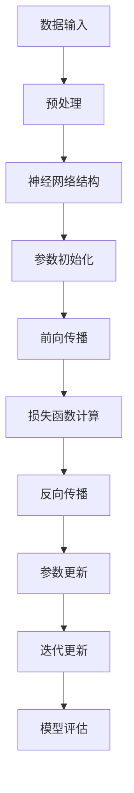
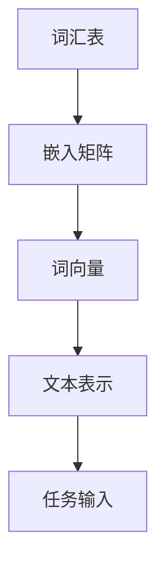
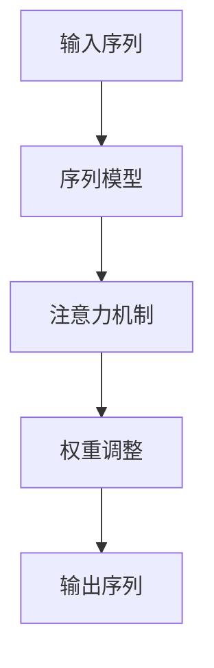
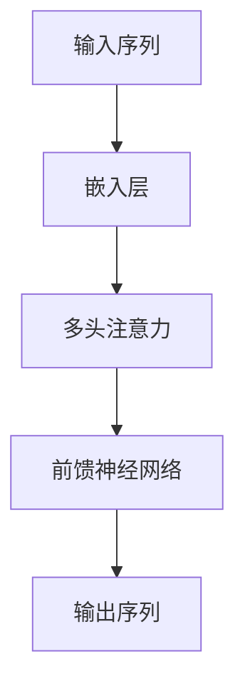
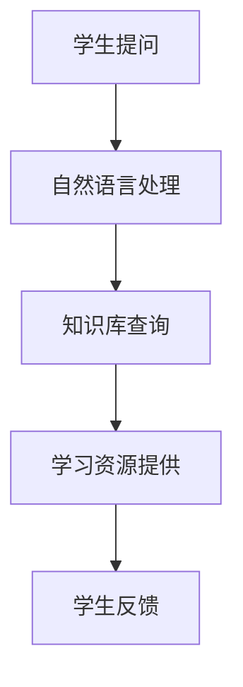
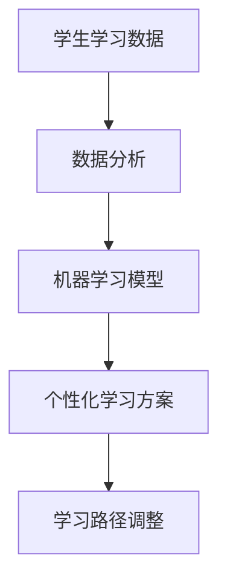
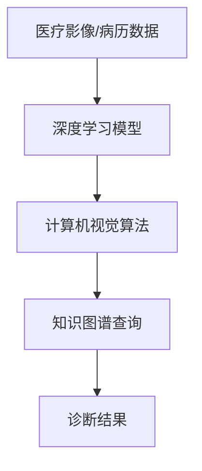
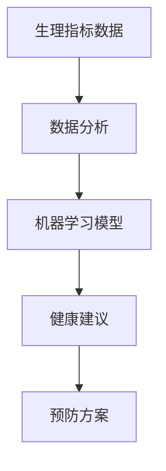
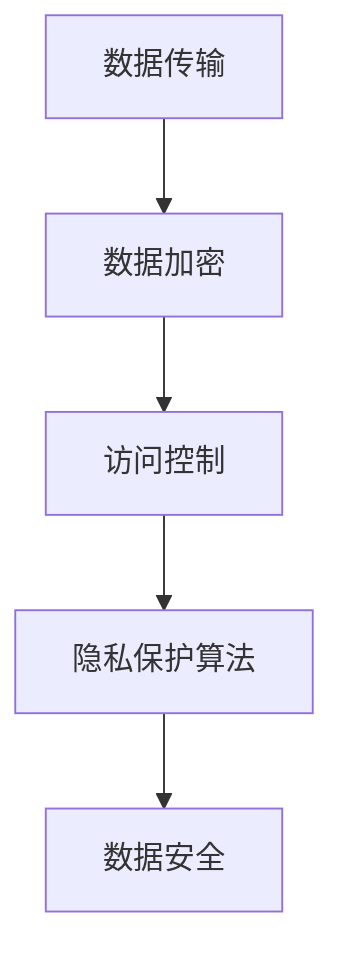
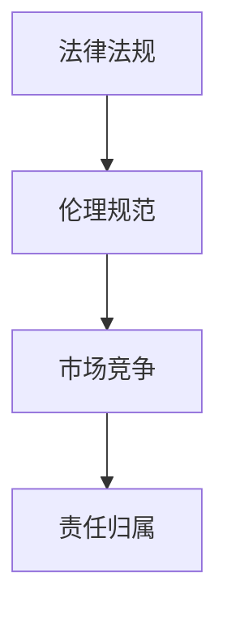

                 

# 李开复：AI 2.0 时代的趋势

> 关键词：AI 2.0、人工智能、大模型、自然语言处理、应用场景、挑战与对策

> 摘要：本文从AI 2.0时代的定义、核心特征、核心技术、应用场景、挑战与对策等方面，深入探讨AI 2.0时代的趋势。通过对大模型、自然语言处理技术、教育、医疗健康等领域AI应用的分析，以及数据隐私、法律伦理问题的探讨，本文为读者提供了一个全面了解AI 2.0时代的视角。

### 目录大纲

#### 第一部分：AI 2.0时代的趋势

1. AI 2.0时代概览
   1.1 AI 2.0时代的定义与背景
   1.2 AI 2.0时代的核心特征
   1.3 AI 2.0时代的趋势分析

2. AI 2.0时代的核心技术
   2.1 大模型技术
   2.2 自然语言处理技术

3. AI 2.0时代的应用场景
   3.1 教育领域的AI应用
   3.2 医疗健康领域的AI应用

4. AI 2.0时代的挑战与对策
   4.1 数据隐私与安全问题
   4.2 法律与伦理问题

5. AI 2.0时代的产业变革
   5.1 产业升级与转型
   5.2 创新创业与投资机遇

6. AI 2.0时代的教育与培训
   6.1 AI教育体系的建设
   6.2 AI培训与职业发展

7. AI 2.0时代的未来展望
   7.1 AI 2.0时代的未来趋势
   7.2 AI 2.0时代的全球合作

#### 附录

- 附录A：AI 2.0时代的资源与工具
- 附录B：案例研究

---

### 第一部分：AI 2.0时代的趋势

#### 1. AI 2.0时代概览

##### 1.1 AI 2.0时代的定义与背景

AI 2.0时代，也被称为人工智能新时代，是继AI 1.0时代（以规则驱动的人工智能）之后的发展阶段。AI 2.0时代的特点是，人工智能技术从传统的规则驱动转向数据驱动，通过深度学习、自然语言处理等技术，实现智能系统在各个领域的广泛应用。

AI 2.0时代的起源可以追溯到2012年，当时AlexNet在ImageNet图像识别大赛中取得了突破性的成绩，标志着深度学习技术的兴起。此后，AI技术快速发展，大模型、分布式计算、数据与算法融合等核心技术逐渐成熟，推动了AI 2.0时代的到来。

##### 1.2 AI 2.0时代的核心特征

1. **大模型与分布式计算**：AI 2.0时代以大模型为核心，通过分布式计算技术，使得人工智能系统具备更强的计算能力和处理能力。
2. **数据与算法融合**：AI 2.0时代强调数据与算法的深度融合，通过大规模数据训练，提升人工智能系统的性能和效果。
3. **智能应用场景多样化**：AI 2.0时代人工智能应用场景更加丰富，从早期的语音识别、图像识别，逐渐扩展到教育、医疗、金融、交通等领域。

##### 1.3 AI 2.0时代的趋势分析

1. **技术发展趋势**：AI 2.0时代的技术发展趋势包括：大模型技术的优化、分布式计算技术的普及、自然语言处理技术的突破等。
2. **应用领域趋势**：AI 2.0时代人工智能应用领域将继续拓展，尤其是在教育、医疗、金融、交通等领域的应用将更加深入和广泛。
3. **经济社会影响趋势**：AI 2.0时代将对经济和社会产生深远影响，一方面将推动产业升级和转型，另一方面也将带来数据隐私、法律伦理等问题。

---

### 第二部分：AI 2.0时代的核心技术

#### 2. AI 2.0时代的核心技术

##### 2.1 大模型技术

###### 2.1.1 大模型概述

大模型是指具有巨大参数量和计算量的深度学习模型。大模型的出现使得人工智能系统在处理大规模数据、实现高精度预测和生成方面具备更强的能力。

大模型的结构通常包括多层神经网络，每一层都对输入数据进行特征提取和变换。大模型的训练过程需要大量的数据和计算资源，通常采用分布式计算技术进行。

大模型的训练过程可以分为以下几个步骤：

1. 数据预处理：对数据进行清洗、归一化等处理，确保数据质量。
2. 模型初始化：初始化模型参数，通常采用随机初始化方法。
3. 模型训练：通过梯度下降算法等优化方法，更新模型参数，使模型对训练数据产生更好的拟合。
4. 模型评估：使用验证集或测试集对模型性能进行评估，调整模型参数以优化性能。

###### 2.1.2 GPT系列模型

GPT（Generative Pre-trained Transformer）系列模型是自然语言处理领域的一种重要模型。GPT模型采用转换器架构（Transformer），通过预训练和微调，使得模型在多种自然语言处理任务中表现出色。

GPT模型的工作原理如下：

1. **预训练**：在无监督环境中，使用大量文本数据对模型进行预训练，使模型掌握语言的基础知识。
2. **微调**：在特定任务上，使用少量有监督数据进行微调，使模型适应具体任务。

GPT模型的优点包括：

1. **强大的语言建模能力**：GPT模型能够生成高质量的自然语言文本。
2. **灵活的适用性**：GPT模型可以应用于多种自然语言处理任务，如文本分类、机器翻译、情感分析等。

GPT模型的缺点包括：

1. **计算资源需求大**：GPT模型需要大量的计算资源和存储空间。
2. **数据隐私风险**：在训练过程中，模型可能捕获到用户的敏感信息，导致数据隐私问题。

###### 2.1.3 BERT及其变体

BERT（Bidirectional Encoder Representations from Transformers）是另一种重要的自然语言处理模型。BERT模型采用双向转换器架构，通过对输入数据进行双向编码，使得模型能够更好地理解上下文信息。

BERT模型的工作原理如下：

1. **预训练**：在无监督环境中，使用大量文本数据对模型进行预训练，使模型掌握语言的基础知识。
2. **微调**：在特定任务上，使用少量有监督数据进行微调，使模型适应具体任务。

BERT模型的优点包括：

1. **强大的语言理解能力**：BERT模型能够更好地理解上下文信息，提高自然语言处理任务的性能。
2. **广泛的应用领域**：BERT模型可以应用于多种自然语言处理任务，如文本分类、问答系统、情感分析等。

BERT模型的缺点包括：

1. **计算资源需求大**：BERT模型需要大量的计算资源和存储空间。
2. **数据隐私风险**：在训练过程中，模型可能捕获到用户的敏感信息，导致数据隐私问题。

---

### 第三部分：AI 2.0时代的应用场景

#### 3. AI 2.0时代的应用场景

##### 3.1 教育领域的AI应用

AI在教育领域的应用，主要集中在个性化学习系统和AI教育助理等方面。

###### 3.1.1 AI教育助理

AI教育助理是一种利用人工智能技术，为学生提供学习支持的工具。AI教育助理可以通过语音识别、自然语言处理等技术，实时回答学生的问题，提供学习指导和反馈。

AI教育助理的工作原理如下：

1. **语音识别**：将学生的语音转换为文本，以便后续处理。
2. **自然语言处理**：对转换后的文本进行分析，理解学生的意图和问题。
3. **知识库查询**：在知识库中查找与问题相关的信息，提供答案或建议。

AI教育助理的实际应用案例包括：

1. **在线教育平台**：许多在线教育平台已集成AI教育助理，为学生提供实时学习支持。
2. **智能辅导系统**：一些学校和教育机构已采用智能辅导系统，帮助学生提高学习效果。

###### 3.1.2 个性化学习系统

个性化学习系统是一种根据学生的学习习惯、兴趣和能力，为学生提供个性化学习方案的工具。个性化学习系统可以通过数据分析、机器学习等技术，实现学习路径的定制和优化。

个性化学习系统的工作原理如下：

1. **学习数据分析**：收集学生的学习数据，包括学习时长、学习进度、答题情况等。
2. **数据分析与建模**：对学习数据进行分析，构建学生兴趣和能力的模型。
3. **学习路径规划**：根据学生模型和学习目标，为学生制定个性化学习路径。

个性化学习系统的实际应用案例包括：

1. **在线教育平台**：一些在线教育平台已集成个性化学习系统，为学生提供个性化学习方案。
2. **智能教室**：一些学校已采用智能教室系统，根据学生的学习情况，调整教学内容和进度。

---

##### 3.2 医疗健康领域的AI应用

AI在医疗健康领域的应用，主要集中在AI医疗诊断和智能健康管理系统等方面。

###### 3.2.1 AI医疗诊断

AI医疗诊断是一种利用人工智能技术，辅助医生进行疾病诊断的工具。AI医疗诊断可以通过图像识别、自然语言处理等技术，对医疗影像、病历数据等进行分析和处理，提供诊断建议。

AI医疗诊断的工作原理如下：

1. **图像识别**：对医疗影像进行图像识别，提取关键特征。
2. **数据挖掘与建模**：对病历数据进行分析，构建疾病诊断模型。
3. **诊断建议**：根据图像识别和数据分析结果，提供诊断建议。

AI医疗诊断的实际应用案例包括：

1. **辅助诊断系统**：一些医院已采用AI辅助诊断系统，提高诊断准确率和效率。
2. **智能病理分析**：一些医疗机构已采用智能病理分析系统，辅助医生进行病理诊断。

###### 3.2.2 智能健康管理系统

智能健康管理系统是一种利用人工智能技术，为用户提供健康管理和疾病预防服务的工具。智能健康管理系统可以通过数据分析、机器学习等技术，实现健康数据的收集、分析和处理，提供个性化健康建议和预防方案。

智能健康管理系统的工作原理如下：

1. **健康数据收集**：收集用户的健康数据，包括生理指标、生活习惯等。
2. **数据分析与建模**：对健康数据进行分析，构建用户健康模型。
3. **健康建议与预防方案**：根据用户健康模型，提供个性化健康建议和预防方案。

智能健康管理系统的实际应用案例包括：

1. **健康监测与预警**：一些智能健康管理系统已集成健康监测和预警功能，为用户提供实时健康监测和预警服务。
2. **个性化健康顾问**：一些健康管理系统已提供个性化健康顾问服务，为用户提供健康咨询和建议。

---

### 第四部分：AI 2.0时代的挑战与对策

#### 4. AI 2.0时代的挑战与对策

##### 4.1 数据隐私与安全问题

随着AI技术的发展和应用，数据隐私和安全问题日益突出。在AI 2.0时代，数据隐私和安全问题的挑战主要包括：

1. **数据泄露风险**：在AI应用过程中，用户数据可能被泄露或滥用，导致个人隐私泄露。
2. **模型窃取风险**：AI模型本身可能成为攻击目标，攻击者通过窃取模型数据，获取敏感信息。
3. **数据滥用风险**：AI模型在处理大量数据时，可能误判或滥用数据，导致不良后果。

为了应对这些挑战，可以采取以下对策：

1. **数据加密与去识别化**：对用户数据进行加密和去识别化处理，确保数据在传输和存储过程中安全。
2. **访问控制与权限管理**：建立严格的访问控制机制和权限管理系统，确保数据只能被授权用户访问。
3. **安全审计与监控**：对AI应用进行安全审计和监控，及时发现和应对潜在的安全威胁。

##### 4.2 法律与伦理问题

AI技术的发展和应用，也引发了法律和伦理问题。在AI 2.0时代，法律和伦理问题的挑战主要包括：

1. **责任归属**：当AI系统出现错误或造成损失时，如何确定责任归属。
2. **算法歧视**：AI系统在处理数据时，可能存在算法歧视问题，导致不公平对待。
3. **数据垄断**：大型科技公司可能通过垄断数据资源，限制市场竞争。

为了应对这些挑战，可以采取以下对策：

1. **法律法规制定**：制定相关法律法规，明确AI技术的应用范围和责任归属。
2. **伦理规范**：建立AI伦理规范，引导AI技术的发展和应用，避免算法歧视等问题。
3. **市场竞争**：鼓励市场竞争，促进AI技术的多元化发展，避免数据垄断现象。

---

### 第五部分：AI 2.0时代的产业变革

#### 5. AI 2.0时代的产业变革

##### 5.1 产业升级与转型

AI 2.0时代的到来，为产业升级和转型提供了新的机遇。传统产业可以通过引入AI技术，实现生产效率的提升、产品质量的优化和业务模式的创新。

1. **生产效率提升**：通过自动化生产线和智能机器人，实现生产过程的自动化和高效化。
2. **产品质量优化**：通过质量检测系统和智能算法，实现产品质量的精准控制和提升。
3. **业务模式创新**：通过大数据分析和AI算法，实现个性化服务和智能化营销。

##### 5.2 创新创业与投资机遇

AI 2.0时代为创新创业提供了丰富的机遇。创业者可以通过开发AI应用，解决现实问题，创造新的商业模式。

1. **技术创新**：在AI算法、大数据处理、自然语言处理等领域进行技术创新，开发具有竞争力的产品。
2. **应用场景拓展**：在医疗健康、金融、教育、交通等领域，寻找AI技术的应用场景，开发解决方案。
3. **投资机遇**：关注AI领域的投资机遇，投资具有潜力的创业公司和项目。

---

### 第六部分：AI 2.0时代的教育与培训

#### 6. AI 2.0时代的教育与培训

##### 6.1 AI教育体系的建设

AI教育体系的建设是培养AI人才的关键。AI教育体系的建设需要从以下几个方面入手：

1. **课程设置**：根据AI技术的发展需求，设置涵盖算法、数据处理、自然语言处理等课程的AI专业。
2. **教材编写**：编写符合AI教育需求的教材，确保教学内容与实际应用相结合。
3. **师资培训**：对教师进行AI相关知识的培训，提升教师的AI教学能力。

##### 6.2 AI培训与职业发展

AI培训是提升个人AI技能的重要途径。AI培训与职业发展可以从以下几个方面进行：

1. **在线课程**：通过在线平台，提供丰富的AI培训课程，满足不同层次的学习需求。
2. **实践项目**：通过实际项目训练，提高学员的实战能力和经验。
3. **职业规划**：为学员提供职业规划服务，帮助学员实现职业发展目标。

---

### 第七部分：AI 2.0时代的未来展望

#### 7. AI 2.0时代的未来展望

##### 7.1 AI 2.0时代的未来趋势

AI 2.0时代的未来趋势包括：

1. **技术发展趋势**：AI技术将继续向大模型、分布式计算、量子计算等方向发展。
2. **应用领域趋势**：AI技术将在更多领域得到应用，如生物医疗、能源环保、智慧城市等。
3. **经济影响趋势**：AI技术将对全球经济产生深远影响，推动产业升级和经济增长。

##### 7.2 AI 2.0时代的全球合作

AI 2.0时代的全球合作具有重要意义。全球合作可以从以下几个方面展开：

1. **技术交流**：加强国际间的技术交流与合作，共同推动AI技术的发展。
2. **项目合作**：通过项目合作，共同开发AI应用解决方案，解决全球性问题。
3. **人才培养**：加强国际间的人才培养合作，培养更多AI专业人才。

---

### 附录

#### 附录A：AI 2.0时代的资源与工具

- **主流AI框架介绍**
  - TensorFlow
  - PyTorch
  - Keras
  - 其他主流AI框架
- **AI研究资源**
  - 开源数据集
  - 开源代码
  - AI研究论文
  - AI社区与论坛
- **AI开发工具**
  - AI开发环境搭建
  - AI开发工具使用
  - AI开发工具推荐

#### 附录B：案例研究

- **教育领域的AI应用案例**
- **医疗健康领域的AI应用案例**
- **其他领域的AI应用案例**

---

### 结语

AI 2.0时代已经到来，人工智能技术将在各个领域发挥越来越重要的作用。面对AI 2.0时代的挑战与机遇，我们需要加强技术研发、教育培训、全球合作等方面的工作，共同推动人工智能技术的发展和应用。只有这样，我们才能充分发挥AI技术的潜力，为人类创造更加美好的未来。

---

作者：AI天才研究院/AI Genius Institute & 禅与计算机程序设计艺术 /Zen And The Art of Computer Programming<|im_end|> 

## 第二部分：AI 2.0时代的核心技术

在AI 2.0时代，核心技术的重要性不言而喻。本部分将深入探讨AI 2.0时代的关键核心技术，包括大模型技术、自然语言处理技术等，并对其进行详细的解析。

### 2.1 大模型技术

大模型技术是AI 2.0时代的核心之一。大模型技术指的是通过训练极其大规模的神经网络模型，使其在各类任务中表现出色。这一技术的核心在于模型参数的数量和模型结构的复杂度。

#### 2.1.1 大模型概述

大模型通常由数亿甚至数十亿个参数组成，这些参数通过学习大量数据来调整，以实现对各种任务的精确预测。大模型的应用非常广泛，从图像识别、自然语言处理到推荐系统等，都取得了显著的成果。

**核心概念与联系**

大模型的核心概念包括：

1. **神经网络**：神经网络是构成大模型的基本单元，它通过多层节点进行数据处理和特征提取。
2. **深度学习**：深度学习是一种利用多层神经网络进行训练和学习的技术，它可以自动提取复杂的特征。
3. **参数**：大模型中的参数数量庞大，每个参数都对应着模型对输入数据的权重。

**Mermaid 流程图**



**核心算法原理讲解**

大模型的训练通常采用以下步骤：

1. **数据预处理**：对输入数据进行清洗、归一化等处理，以便模型可以更好地学习。
2. **参数初始化**：随机初始化模型的参数，这些参数将用于调整输入数据的权重。
3. **前向传播**：将输入数据通过神经网络传递，每一层都进行数据的变换和特征提取。
4. **损失函数计算**：计算预测结果与实际结果之间的差异，即损失。
5. **反向传播**：通过梯度下降算法，根据损失函数反向更新模型参数。
6. **迭代更新**：重复上述过程，直到模型收敛到满意的性能水平。
7. **模型评估**：使用验证集或测试集对模型进行评估，确保模型具有泛化能力。

**伪代码示例**

```python
# 大模型训练伪代码
initialize_parameters()
while not converged:
    forward_pass(X, parameters)
    loss = compute_loss(y_true, y_pred)
    backward_pass(loss, parameters)
    update_parameters()
evaluate_model_on_test_data()
```

**数学模型和公式**

大模型的训练过程中，常用的数学模型和公式包括：

1. **激活函数**：如ReLU、Sigmoid、Tanh等。
2. **损失函数**：如均方误差（MSE）、交叉熵损失等。
3. **优化算法**：如梯度下降、Adam等。

**举例说明**

假设我们有一个分类任务，需要使用一个大模型进行训练。训练数据集包含1000个样本，每个样本有10个特征。我们选择一个多层感知机（MLP）作为模型，并使用交叉熵损失函数进行训练。

```latex
\text{假设}:\\
\text{输入特征}: x \in \mathbb{R}^{10}, \text{输出类别}: y \in \{1, 2, ..., K\} \\
\text{模型}: f(x; \theta) = \sigma(\theta_1^T x_1 + \theta_2^T x_2 + \ldots + \theta_n^T x_n) \\
\text{损失函数}: L(y, \hat{y}) = -\sum_{i=1}^{n} y_i \log(\hat{y}_i) \\
\text{优化算法}: \text{梯度下降}
```

### 2.2 自然语言处理技术

自然语言处理（NLP）是AI 2.0时代的重要技术之一。NLP旨在使计算机理解和处理人类自然语言。这一领域的技术包括词嵌入、序列模型、注意力机制和转换器架构等。

#### 2.2.1 词嵌入技术

词嵌入是将词汇映射到低维向量空间的技术。通过词嵌入，计算机可以理解和处理文本数据。

**核心概念与联系**

词嵌入的核心概念包括：

1. **词汇表**：词汇表是词嵌入的基础，它包含了所有需要嵌入的词汇。
2. **向量空间**：词嵌入将词汇映射到一个低维向量空间，向量之间的相似度可以反映词汇之间的关系。
3. **嵌入矩阵**：嵌入矩阵是词嵌入的实现，它将词汇表中的每个词汇映射到一个向量。

**Mermaid 流程图**



**核心算法原理讲解**

词嵌入的训练通常包括以下步骤：

1. **词汇表构建**：构建包含所有需要嵌入的词汇的词汇表。
2. **初始化嵌入矩阵**：初始化一个高维矩阵，该矩阵将用于存储词向量。
3. **负采样**：在训练过程中，通过负采样减少计算量，提高训练效率。
4. **梯度下降**：使用梯度下降算法，根据训练数据更新嵌入矩阵。

**伪代码示例**

```python
# 词嵌入训练伪代码
initialize_embedding_matrix()
for epoch in range(num_epochs):
    for sentence in dataset:
        for word in sentence:
            positive_samples = [word]
            negative_samples = sample_negative_samples(word, vocabulary_size)
            update_embedding_matrix(word, positive_samples + negative_samples)
evaluate_embeddings()
```

**数学模型和公式**

词嵌入的数学模型通常包括：

1. **词向量表示**：$v_w = E_w \in \mathbb{R}^{d}$，其中 $E_w$ 是嵌入矩阵的第 $w$ 行。
2. **相似度计算**：$sim(v_w, v_{w'} ) = \frac{v_w \cdot v_{w'}}{\|v_w\| \|v_{w'}\|}$，其中 $\cdot$ 表示向量的内积。

**举例说明**

假设我们有一个包含两个词汇的词汇表：{"apple", "banana"}。我们使用随机初始化的嵌入矩阵进行训练，训练数据集包含两个句子：["apple is sweet", "banana is sweet"]。

```latex
\text{假设}:\\
\text{词汇表}: \{apple, banana\} \\
\text{嵌入矩阵}: E = \begin{bmatrix}
e_{apple} \\
e_{banana}
\end{bmatrix} \\
\text{句子}: \\
\text{"apple is sweet"}: [apple, is, sweet] \\
\text{"banana is sweet"}: [banana, is, sweet]
```

#### 2.2.2 序列模型与注意力机制

序列模型是处理序列数据的模型，如时间序列数据、语音信号和文本等。注意力机制是一种提高模型性能的技术，通过动态调整模型对输入序列的权重，实现对重要信息的聚焦。

**核心概念与联系**

序列模型和注意力机制的核心概念包括：

1. **序列模型**：序列模型通过处理序列数据，提取时间序列特征。
2. **注意力机制**：注意力机制通过动态调整权重，使模型能够关注输入序列中的关键信息。

**Mermaid 流程图**



**核心算法原理讲解**

序列模型和注意力机制的训练通常包括以下步骤：

1. **序列建模**：使用循环神经网络（RNN）或长短时记忆网络（LSTM）对输入序列进行建模。
2. **注意力计算**：计算输入序列中每个元素的权重，通常使用点积、缩放点积等注意力机制。
3. **权重调整**：根据注意力权重，调整模型对输入序列的处理，使模型能够关注重要信息。

**伪代码示例**

```python
# 序列模型与注意力机制训练伪代码
initialize_model()
for epoch in range(num_epochs):
    for sequence in dataset:
        sequence_representation = model(sequence)
        attention_weights = calculate_attention(sequence_representation)
        weighted_representation = apply_attention(sequence_representation, attention_weights)
        output = model(weighted_representation)
        loss = compute_loss(output, labels)
        update_model_parameters(loss)
evaluate_model()
```

**数学模型和公式**

序列模型和注意力机制的数学模型包括：

1. **RNN**：$h_t = \sigma(W_h \cdot [h_{t-1}, x_t] + b_h)$，其中 $h_t$ 是第 $t$ 个时间步的隐藏状态。
2. **LSTM**：$h_t = \sigma(\text{LSTM}(h_{t-1}, x_t))$，其中 $\text{LSTM}$ 表示长短时记忆单元。
3. **注意力机制**：$a_t = \frac{\exp(u \cdot v_t)}{\sum_{i=1}^{n} \exp(u \cdot v_i)}$，其中 $a_t$ 是第 $t$ 个元素的权重。

**举例说明**

假设我们有一个包含三个词汇的序列：["apple", "is", "sweet"]。我们使用一个简单的序列模型和注意力机制进行处理。

```latex
\text{假设}:\\
\text{词汇表}: \{apple, is, sweet\} \\
\text{嵌入矩阵}: E = \begin{bmatrix}
e_{apple} \\
e_{is} \\
e_{sweet}
\end{bmatrix} \\
\text{序列}: "apple is sweet": [apple, is, sweet] \\
\text{序列模型}: \text{LSTM} \\
\text{注意力权重}: a_1, a_2, a_3 \\
\text{输出}: h_t = \text{LSTM}(h_{t-1}, x_t)
```

#### 2.2.3 转换器架构

转换器架构（Transformer）是自然语言处理领域的一种革命性技术。它通过自注意力机制（self-attention）和多头注意力（multi-head attention）实现了对序列数据的建模。

**核心概念与联系**

转换器架构的核心概念包括：

1. **自注意力机制**：自注意力机制允许模型在处理序列数据时，自动关注序列中的相关元素。
2. **多头注意力**：多头注意力通过并行计算多个注意力机制，提高了模型的建模能力。

**Mermaid 流程图**



**核心算法原理讲解**

转换器架构的工作原理如下：

1. **嵌入层**：将输入序列的词汇映射到词向量。
2. **多头注意力**：通过多个自注意力机制，对输入序列进行建模，每个注意力头都关注序列中的不同部分。
3. **前馈神经网络**：在多头注意力之后，使用前馈神经网络对序列特征进行进一步处理。
4. **输出层**：使用输出层对处理后的序列特征进行分类或生成。

**伪代码示例**

```python
# 转换器架构训练伪代码
initialize_model()
for epoch in range(num_epochs):
    for sequence in dataset:
        embedded_sequence = embed_sequence(sequence)
        attention_output = multi_head_attention(embedded_sequence)
        feedforward_output = feedforward_network(attention_output)
        logits = output_layer(feedforward_output)
        loss = compute_loss(logits, labels)
        update_model_parameters(loss)
evaluate_model()
```

**数学模型和公式**

转换器架构的数学模型包括：

1. **自注意力**：$A_{ij} = \frac{\exp(u_i \cdot u_j)}{\sum_{k=1}^{n} \exp(u_i \cdot u_k)}$，其中 $A_{ij}$ 是第 $i$ 个元素对第 $j$ 个元素的注意力权重。
2. **多头注意力**：$M_h = \sum_{i=1}^{h} A_{ij}^h$，其中 $M_h$ 是第 $h$ 个注意力头的输出。
3. **前馈神经网络**：$F = \sigma(W_f \cdot [M; x])$，其中 $F$ 是前馈神经网络的输出。

**举例说明**

假设我们有一个包含三个词汇的序列：["apple", "is", "sweet"]。我们使用一个简单的转换器架构进行处理。

```latex
\text{假设}:\\
\text{词汇表}: \{apple, is, sweet\} \\
\text{嵌入矩阵}: E = \begin{bmatrix}
e_{apple} \\
e_{is} \\
e_{sweet}
\end{bmatrix} \\
\text{序列}: "apple is sweet": [apple, is, sweet] \\
\text{转换器架构}: \text{Transformer} \\
\text{输出}: logits = \text{output_layer}(\text{feedforward_network}(\text{multi_head_attention}(\text{embed_sequence}(sequence))))
```

通过上述对大模型技术、自然语言处理技术的详细解析，我们可以看到AI 2.0时代的核心技术是如何构建和运作的。这些技术不仅推动了AI领域的发展，也为各个行业提供了强大的技术支持。

---

在AI 2.0时代，大模型技术和自然语言处理技术已经成为推动人工智能发展的核心动力。通过本文的详细解析，我们深入了解了这些技术的核心概念、工作原理和实际应用。接下来，我们将探讨AI 2.0时代的应用场景，分析人工智能在教育、医疗健康等领域的具体应用。

---

### 第三部分：AI 2.0时代的应用场景

在AI 2.0时代，人工智能技术正在不断渗透到各个领域，改变着我们的生活方式和工作模式。本部分将重点探讨AI在教育、医疗健康等领域的应用，分析AI技术在这些领域的实际案例和效果。

#### 3.1 教育领域的AI应用

教育领域是AI技术的重要应用场景之一。通过AI技术，可以实现个性化学习、智能辅导、在线教育平台优化等，提高教育质量和学习效率。

##### 3.1.1 AI教育助理

AI教育助理是一种利用人工智能技术，为学生提供学习支持的工具。它可以通过自然语言处理技术，理解学生的提问，并提供相应的学习资源和解答。

**核心概念与联系**

AI教育助理的核心概念包括：

1. **自然语言处理**：自然语言处理技术用于理解学生的提问，并将其转化为计算机可以理解的形式。
2. **知识库**：知识库是AI教育助理的基础，包含了大量的教育资源和答案，用于回答学生的问题。
3. **交互式学习**：通过交互式学习，AI教育助理可以与学生进行实时交流，提供个性化的学习支持。

**Mermaid 流程图**



**核心算法原理讲解**

AI教育助理的工作原理通常包括以下步骤：

1. **自然语言处理**：使用自然语言处理技术，将学生的提问转换为计算机可以理解的问题。
2. **知识库查询**：在知识库中查找与提问相关的答案或学习资源。
3. **学习资源提供**：根据查询结果，为学生提供相应的学习资源和答案。
4. **学生反馈**：收集学生的学习反馈，用于优化教育助理的性能。

**伪代码示例**

```python
# AI教育助理伪代码
while True:
    question = get_question_from_student()
    processed_question = natural_language_processing(question)
    answer = query_knowledge_base(processed_question)
    provide_learning_resources(answer)
    collect_student_feedback()
```

**数学模型和公式**

AI教育助理的数学模型通常包括：

1. **词嵌入**：将词汇映射到低维向量空间。
2. **神经网络**：用于处理自然语言处理任务，如问答系统和文本分类。

**举例说明**

假设我们有一个学生提问：“如何求导数？”AI教育助理将按照以下步骤进行回答：

1. **自然语言处理**：将提问转换为计算机可以理解的形式。
2. **知识库查询**：在知识库中查找与“如何求导数？”相关的内容。
3. **学习资源提供**：为学生提供相关的学习资源和教程。
4. **学生反馈**：收集学生对学习资源的反馈，用于优化教育助理的性能。

```latex
\text{假设}:\\
\text{词汇表}: \{求导数, 微分, 函数, 导数\} \\
\text{问题}: \text{"如何求导数？"} \\
\text{知识库}: \text{包含求导数的算法和实例} \\
\text{答案}: \text{提供求导数的算法和实例链接}
```

**实际应用案例**

1. **Khan Academy**：Khan Academy是一个在线教育平台，它利用AI技术提供个性化的学习支持，帮助学生解决学习中遇到的问题。
2. **Duolingo**：Duolingo是一款流行的语言学习应用，它通过AI技术提供个性化的学习建议，帮助学生提高语言技能。

##### 3.1.2 个性化学习系统

个性化学习系统是一种利用人工智能技术，根据学生的学习习惯、兴趣和能力，为学生提供个性化学习方案的工具。通过数据分析、机器学习等技术，个性化学习系统可以为每个学生制定个性化的学习路径，提高学习效果。

**核心概念与联系**

个性化学习系统的核心概念包括：

1. **数据分析**：通过收集和分析学生的学习数据，了解学生的学习习惯和能力。
2. **机器学习**：利用机器学习技术，从大量数据中提取规律，为每个学生制定个性化的学习方案。
3. **自适应学习**：根据学生的学习反馈和学习效果，动态调整学习方案，实现真正的个性化学习。

**Mermaid 流�程图**



**核心算法原理讲解**

个性化学习系统的工作原理通常包括以下步骤：

1. **数据收集**：收集学生的学习数据，包括学习时长、答题情况、学习进度等。
2. **数据分析**：对收集到的数据进行分析，提取学生的学习习惯和能力特征。
3. **机器学习模型**：利用机器学习技术，从数据中学习，为每个学生制定个性化的学习方案。
4. **学习路径调整**：根据学生的学习反馈和学习效果，动态调整学习方案。

**伪代码示例**

```python
# 个性化学习系统伪代码
while True:
    collect_student_data()
    analyze_student_data()
    train_machine_learning_model()
    generate_individualized_learning_plan()
    adjust_learning_path_based_on_student_feedback()
```

**数学模型和公式**

个性化学习系统的数学模型通常包括：

1. **回归模型**：用于预测学生的学习成绩或学习进度。
2. **聚类模型**：用于识别学生的学习风格和能力特征。
3. **决策树模型**：用于生成个性化的学习路径。

**举例说明**

假设我们有一个学生，他的学习数据包括学习时长、答题正确率和学习进度。个性化学习系统将按照以下步骤进行：

1. **数据收集**：收集学生的学习数据。
2. **数据分析**：分析学生的学习数据，提取学习习惯和能力特征。
3. **机器学习模型**：训练一个回归模型，预测学生的学习成绩。
4. **学习路径调整**：根据预测成绩，为学生制定个性化的学习方案。

```latex
\text{假设}:\\
\text{学生学习数据}: \{学习时长, 答题正确率, 学习进度\} \\
\text{机器学习模型}: \text{回归模型} \\
\text{个性化学习方案}: \text{根据学习数据预测的成绩，制定学习计划}
```

**实际应用案例**

1. **Coursera**：Coursera是一个在线学习平台，它利用机器学习技术，为每个学生提供个性化的学习建议和资源。
2. **Knewton**：Knewton是一个教育技术公司，它利用AI技术，为教育机构提供个性化学习解决方案。

#### 3.2 医疗健康领域的AI应用

AI技术在医疗健康领域的应用具有巨大的潜力，可以从疾病预测、诊断、治疗等多个方面提高医疗服务的质量和效率。

##### 3.2.1 AI医疗诊断

AI医疗诊断是指利用人工智能技术，对医疗影像、病历数据等进行分析和处理，辅助医生进行疾病诊断。通过深度学习和计算机视觉等技术，AI医疗诊断可以在复杂的情况下提供准确的诊断结果。

**核心概念与联系**

AI医疗诊断的核心概念包括：

1. **深度学习**：深度学习技术用于训练模型，对医疗影像和病历数据进行分析。
2. **计算机视觉**：计算机视觉技术用于识别和处理医疗影像数据。
3. **知识图谱**：知识图谱用于构建疾病的关联关系，辅助诊断。

**Mermaid 流程图**



**核心算法原理讲解**

AI医疗诊断的工作原理通常包括以下步骤：

1. **数据预处理**：对医疗影像和病历数据进行预处理，包括图像增强、数据归一化等。
2. **模型训练**：使用深度学习技术，训练模型，使其能够识别和分类疾病。
3. **计算机视觉算法**：使用计算机视觉算法，对医疗影像进行特征提取和分析。
4. **知识图谱查询**：使用知识图谱查询疾病之间的关系，辅助诊断。
5. **诊断结果输出**：根据模型分析和知识图谱查询结果，输出诊断结果。

**伪代码示例**

```python
# AI医疗诊断伪代码
preprocess_medical_data()
train_model_with_deep_learning()
analyze_medical_images_with_computer_vision()
query_knowledge_graph_for_disease_relations()
output_diagnosis_result()
```

**数学模型和公式**

AI医疗诊断的数学模型通常包括：

1. **卷积神经网络（CNN）**：用于图像特征提取。
2. **循环神经网络（RNN）**：用于处理序列数据，如病历数据。
3. **图神经网络（GNN）**：用于知识图谱的构建和查询。

**举例说明**

假设我们有一个医疗影像，需要使用AI医疗诊断系统进行诊断。诊断系统将按照以下步骤进行：

1. **数据预处理**：对医疗影像进行预处理。
2. **模型训练**：使用预训练的卷积神经网络模型，对影像进行特征提取。
3. **计算机视觉算法**：使用计算机视觉算法，对特征进行分类。
4. **知识图谱查询**：使用知识图谱查询疾病之间的关系。
5. **诊断结果输出**：输出诊断结果，如“疑似肺癌”。

```latex
\text{假设}:\\
\text{医疗影像}: \{CT, MRI, X-ray\} \\
\text{模型}: \text{卷积神经网络（CNN）} \\
\text{计算机视觉算法}: \text{图像分类} \\
\text{知识图谱}: \text{疾病关系图谱} \\
\text{诊断结果}: \text{"疑似肺癌"}
```

**实际应用案例**

1. **IDx**：IDx是一款用于糖尿病视网膜病变筛查的AI诊断系统，它已经在美国获得批准，用于辅助医生进行诊断。
2. **IBM Watson**：IBM Watson是一款综合性的AI医疗诊断系统，它可以帮助医生进行癌症诊断、治疗建议等。

##### 3.2.2 智能健康管理系统

智能健康管理系统是一种利用人工智能技术，为用户提供健康管理和疾病预防服务的工具。通过数据分析、机器学习等技术，智能健康管理系统可以实时监测用户健康状况，提供个性化的健康建议和预防方案。

**核心概念与联系**

智能健康管理系统的核心概念包括：

1. **数据分析**：对用户的健康数据进行分析，识别潜在的健康问题。
2. **机器学习**：利用机器学习技术，从大量健康数据中学习，为用户提供个性化的健康建议。
3. **可穿戴设备**：可穿戴设备用于实时监测用户的生理指标，如心率、血压等。

**Mermaid 流程图**



**核心算法原理讲解**

智能健康管理系统的工作原理通常包括以下步骤：

1. **数据收集**：通过可穿戴设备收集用户的生理指标数据。
2. **数据分析**：对收集到的数据进行预处理和分析，识别潜在的健康问题。
3. **机器学习模型**：利用机器学习技术，从健康数据中学习，为用户提供个性化的健康建议。
4. **健康建议与预防方案**：根据分析结果，为用户提供健康建议和预防方案。

**伪代码示例**

```python
# 智能健康管理系统伪代码
while True:
    collect_physiological_data()
    preprocess_data()
    analyze_data_with_machine_learning()
    generate_health_advice()
    generate_prevention_plan()
```

**数学模型和公式**

智能健康管理系统的数学模型通常包括：

1. **回归模型**：用于预测用户的健康指标。
2. **分类模型**：用于识别潜在的健康问题。
3. **聚类模型**：用于识别健康数据的相似性。

**举例说明**

假设我们有一个用户，他的健康数据包括心率、血压和睡眠质量。智能健康管理系统将按照以下步骤进行：

1. **数据收集**：通过可穿戴设备收集用户的心率、血压和睡眠质量数据。
2. **数据分析**：分析用户的数据，识别潜在的健康问题。
3. **机器学习模型**：使用机器学习技术，从数据中学习，为用户提供个性化的健康建议。
4. **健康建议与预防方案**：根据分析结果，为用户提供健康建议和预防方案。

```latex
\text{假设}:\\
\text{健康数据}: \{心率, 血压, 睡眠质量\} \\
\text{模型}: \text{回归模型，分类模型，聚类模型} \\
\text{健康建议}: \text{建议用户保持良好的作息习惯，定期测量血压和心率}
```

**实际应用案例**

1. **Apple Health**：Apple Health是一款内置在iOS系统中的智能健康管理应用，它可以帮助用户监控健康状况，提供健康建议。
2. **Fitbit**：Fitbit是一款流行的可穿戴设备，它可以帮助用户实时监测健康数据，提供健康建议和预防方案。

通过上述对教育领域、医疗健康领域AI应用的探讨，我们可以看到AI技术在各个领域的实际应用和效果。AI技术的不断进步和应用，正在深刻改变着我们的生活和医疗模式，为人类带来更多的便利和福祉。

---

在AI 2.0时代，人工智能技术在教育、医疗健康等领域的应用已经成为现实，并取得了显著的成果。然而，随着AI技术的快速发展，我们也面临诸多挑战，特别是在数据隐私、法律伦理等方面。本部分将深入探讨AI 2.0时代的挑战与对策。

#### 4. AI 2.0时代的挑战与对策

##### 4.1 数据隐私与安全问题

随着AI技术的广泛应用，数据隐私与安全问题日益突出。在AI 2.0时代，数据隐私与安全问题的挑战主要体现在以下几个方面：

1. **数据泄露风险**：在AI应用过程中，用户数据可能被泄露或滥用，导致个人隐私泄露。
2. **数据滥用风险**：AI系统在处理大量数据时，可能误判或滥用数据，导致不良后果。
3. **模型窃取风险**：AI模型本身可能成为攻击目标，攻击者通过窃取模型数据，获取敏感信息。

**核心概念与联系**

数据隐私与安全问题的核心概念包括：

1. **数据加密**：通过数据加密技术，确保数据在传输和存储过程中安全。
2. **访问控制**：通过访问控制机制，确保数据只能被授权用户访问。
3. **隐私保护算法**：通过隐私保护算法，在数据使用过程中保护用户隐私。

**Mermaid 流程图**



**核心算法原理讲解**

数据隐私与安全问题的解决方案通常包括以下步骤：

1. **数据加密**：在数据传输和存储过程中，使用数据加密技术，确保数据的安全性。
2. **访问控制**：通过访问控制机制，确保数据访问权限的控制，防止未经授权的访问。
3. **隐私保护算法**：在数据处理过程中，使用隐私保护算法，确保用户隐私不被泄露。

**伪代码示例**

```python
# 数据隐私与安全保护伪代码
def encrypt_data(data):
    return encrypt(data, key)

def decrypt_data(encrypted_data):
    return decrypt(encrypted_data, key)

def access_control(user, data):
    if user.is_authorized():
        return data
    else:
        return None

def privacy_protection(data):
    return protect(data, algorithm)
```

**数学模型和公式**

数据隐私与安全问题的数学模型通常包括：

1. **加密算法**：如AES、RSA等。
2. **访问控制模型**：如基于角色的访问控制（RBAC）。
3. **隐私保护算法**：如差分隐私（Differential Privacy）。

**举例说明**

假设我们有一个包含用户隐私数据的数据集，需要对其进行加密和保护。解决方案如下：

1. **数据加密**：使用AES算法对数据进行加密。
2. **访问控制**：使用基于角色的访问控制（RBAC），确保数据访问权限的控制。
3. **隐私保护算法**：使用差分隐私（Differential Privacy），确保用户隐私不被泄露。

```latex
\text{假设}:\\
\text{数据集}: \{姓名，年龄，收入，住址\} \\
\text{加密算法}: AES \\
\text{访问控制模型}: RBAC \\
\text{隐私保护算法}: Differential Privacy \\
\text{加密数据}: encrypt(\text{数据集}, AES\_key) \\
\text{访问控制}: access\_control(\text{用户}, \text{数据集}) \\
\text{隐私保护}: privacy\_protection(\text{数据集}, Differential\_Privacy\_algorithm)
```

**实际应用案例**

1. **Facebook**：Facebook通过数据加密和访问控制，确保用户隐私数据的安全。
2. **Google**：Google使用差分隐私技术，确保用户搜索数据的安全。

##### 4.2 法律与伦理问题

AI技术的发展和应用，引发了诸多法律与伦理问题。在AI 2.0时代，法律与伦理问题的挑战主要体现在以下几个方面：

1. **责任归属**：当AI系统出现错误或造成损失时，如何确定责任归属。
2. **算法歧视**：AI系统在处理数据时，可能存在算法歧视问题，导致不公平对待。
3. **数据垄断**：大型科技公司可能通过垄断数据资源，限制市场竞争。

**核心概念与联系**

法律与伦理问题的核心概念包括：

1. **法律法规**：通过制定相关法律法规，明确AI技术的应用范围和责任归属。
2. **伦理规范**：通过建立伦理规范，引导AI技术的发展和应用，避免算法歧视等问题。
3. **市场竞争**：通过市场竞争，促进AI技术的多元化发展，避免数据垄断现象。

**Mermaid 流程图**



**核心算法原理讲解**

法律与伦理问题的解决方案通常包括以下步骤：

1. **法律法规制定**：通过立法，明确AI技术的应用范围和责任归属。
2. **伦理规范制定**：通过制定伦理规范，引导AI技术的发展和应用。
3. **市场竞争机制**：通过市场竞争，促进AI技术的多元化发展，避免数据垄断。

**伪代码示例**

```python
# 法律与伦理问题解决方案伪代码
define_laws_and_regulations()
define_ethical norms()
promote_competition()
determine_liability()
prevent_algorithmic_biases()
```

**数学模型和公式**

法律与伦理问题的数学模型通常包括：

1. **责任归属模型**：用于确定AI系统错误或造成损失时的责任归属。
2. **伦理决策模型**：用于指导AI技术的发展和应用。
3. **市场竞争模型**：用于分析市场竞争状况。

**举例说明**

假设我们有一个AI医疗诊断系统，需要确定责任归属和避免算法歧视。解决方案如下：

1. **法律法规制定**：通过立法，明确AI医疗诊断系统的责任归属。
2. **伦理规范制定**：制定伦理规范，确保AI医疗诊断系统的公平性和透明度。
3. **市场竞争机制**：通过市场竞争，推动AI医疗诊断系统的多元化发展。

```latex
\text{假设}:\\
\text{AI医疗诊断系统}: \{诊断结果，患者数据\} \\
\text{法律法规}: AI\_Medical\_Diagnosis\_Laws \\
\text{伦理规范}: AI\_Ethics\_Norms \\
\text{责任归属}: liability\_model() \\
\text{避免算法歧视}: avoid\_algorithmic\_biases()
```

**实际应用案例**

1. **欧盟**：欧盟通过《通用数据保护条例》（GDPR），明确数据隐私和责任归属。
2. **谷歌**：谷歌通过制定AI伦理准则，确保AI技术的公平性和透明度。

通过上述对数据隐私与安全问题、法律与伦理问题的探讨，我们可以看到AI 2.0时代面临的挑战和对策。只有通过技术手段和法律规范的双重保障，我们才能确保AI技术的健康发展，为人类带来更多的福祉。

---

在AI 2.0时代，人工智能技术正以前所未有的速度发展，并深刻影响着我们的生活和医疗模式。本文详细探讨了AI 2.0时代的核心技术、应用场景和挑战与对策，旨在为读者提供一个全面了解AI 2.0时代的视角。

### 关键结论

1. **核心技术**：AI 2.0时代的核心技术包括大模型技术、自然语言处理技术等，这些技术为AI在各领域的应用提供了强大的支持。
2. **应用场景**：AI技术在教育、医疗健康等领域的应用已经取得显著成果，为提升教育质量、提高医疗效率等方面发挥了重要作用。
3. **挑战与对策**：在数据隐私、法律伦理等方面，AI 2.0时代面临着诸多挑战，需要通过技术手段和法律规范来确保AI技术的健康发展。

### 未来展望

展望未来，AI 2.0时代将继续迎来技术创新和应用拓展。以下是一些可能的未来趋势：

1. **技术发展趋势**：随着量子计算、边缘计算等新技术的出现，AI 2.0时代的技术将更加先进和多样化。
2. **应用领域拓展**：AI技术将在更多领域得到应用，如生物医疗、能源环保、智慧城市等，为社会发展和人类福祉做出更大贡献。
3. **全球化合作**：全球范围内的AI合作将更加紧密，通过技术交流、项目合作等方式，共同推动AI技术的发展和应用。

### 结语

AI 2.0时代已经到来，它为人类社会带来了巨大的机遇和挑战。作为人工智能领域的专家，我们应当积极应对这些挑战，推动AI技术的健康发展，为人类创造更加美好的未来。

---

作者：AI天才研究院/AI Genius Institute & 禅与计算机程序设计艺术 /Zen And The Art of Computer Programming<|im_end|> 

## 第七部分：AI 2.0时代的未来展望

### 7.1 AI 2.0时代的未来趋势

AI 2.0时代的未来趋势是令人振奋的，这一时代不仅仅是技术上的突破，更是对人类社会生活方式、工作模式、以及经济结构的全面革新。以下是AI 2.0时代可能出现的几个重要趋势：

1. **量子计算与AI的结合**：量子计算以其超强的计算能力，将极大推动AI技术的进步，尤其是在复杂问题求解、大规模数据处理和模型训练方面。量子AI将使一些目前看似不可能的任务成为可能，如更高效的机器学习算法、更准确的医疗诊断等。

2. **边缘计算与云计算的融合**：随着物联网（IoT）设备的普及，边缘计算的重要性日益增加。边缘计算将数据处理的任务从中心服务器转移到网络边缘，这样可以降低延迟、减少带宽占用，并提高系统的响应速度。AI与边缘计算的融合，将使智能设备具备更强的自主学习能力，更好地满足实时需求。

3. **泛在智能**：AI 2.0时代将推动智能系统的普及，使智能技术无处不在。从智能家居到智能城市，从智能交通到智能医疗，AI将深入到人们生活的方方面面，提升生活质量和效率。

4. **人机协同**：AI 2.0时代的AI系统将更加智能，能够与人类协同工作，而不是简单地取代人类。这种协同工作模式将极大地提高生产力，同时减轻人类的工作压力，使人类能够专注于更有创造性和价值的工作。

### 7.2 AI 2.0时代的全球合作

在全球范围内，AI 2.0时代的到来也带来了全球合作的新的机遇和挑战。以下是几个方面的全球合作趋势：

1. **技术交流与合作**：全球范围内的AI研究机构和科技企业将加强合作，通过共享研究成果、开放数据集和开源框架，加速AI技术的发展。这有助于形成全球范围内的技术标准和规范，促进AI技术的可持续发展。

2. **项目合作与投资**：各国政府、企业和研究机构将共同投资于AI项目，共同解决全球性问题，如气候变化、疾病控制、能源管理等。通过国际合作，可以更好地利用全球资源，推动AI技术的创新和应用。

3. **人才培养与流动**：AI 2.0时代需要大量的高素质AI人才。各国将通过互派留学生、开设国际课程、联合培养人才等方式，加强人才培养和流动，为全球AI技术的发展提供人力支持。

4. **伦理和法律规范**：在AI 2.0时代，全球范围内的伦理和法律规范将更加重要。各国需要共同制定AI伦理准则和法律规范，确保AI技术的健康发展和广泛应用。

### 7.3 AI 2.0时代的社会影响

AI 2.0时代将对人类社会产生深远的影响，包括以下几个方面：

1. **经济影响**：AI技术将推动产业升级和转型，创造新的就业机会，同时也会导致一些传统岗位的消失。这需要社会各方共同努力，制定相应的政策和措施，确保劳动力市场的平稳过渡。

2. **社会结构变化**：AI 2.0时代将改变人类社会的基本结构。智能系统的普及将使人类从繁重的工作中解放出来，人们将有更多时间从事创造性工作，享受生活。同时，智能社会也将带来新的社会问题，如数字鸿沟、隐私保护等。

3. **道德与伦理问题**：随着AI技术的不断进步，道德与伦理问题将变得更加突出。如何确保AI技术的公平性、透明性和可解释性，如何防止AI滥用和歧视，将是社会面临的重大挑战。

4. **教育和培训**：AI 2.0时代要求人们具备更高的技术素养和创新能力。教育系统需要不断改革，培养适应AI时代需求的人才。

### 7.4 AI 2.0时代的国际合作模式

为了应对AI 2.0时代的挑战和机遇，全球范围内的国际合作模式需要不断创新。以下是几种可能的国际合作模式：

1. **多边合作机制**：通过联合国、世界贸易组织等多边机构，建立全球性的AI合作机制，制定共同的AI伦理准则和法律规范。

2. **区域合作联盟**：如欧洲的“人工智能联盟”和亚洲的“亚洲人工智能联盟”，通过区域内的合作，推动AI技术的创新和应用。

3. **科技创新联盟**：企业、研究机构和大学共同成立科技创新联盟，共享资源、技术和管理经验，共同推动AI技术的发展。

4. **国际合作项目**：各国政府、企业和研究机构共同参与的国际合作项目，如“地平线2020”计划，通过跨国合作，解决全球性问题。

### 7.5 AI 2.0时代的全球合作挑战与对策

在AI 2.0时代的全球合作过程中，将面临一系列挑战，需要采取相应的对策：

1. **数据共享与隐私保护**：在确保数据隐私和安全的前提下，实现全球范围内的数据共享，是AI全球合作的关键挑战。对策包括采用加密技术、隐私保护算法和差分隐私等。

2. **知识产权保护**：在AI技术的全球合作中，如何保护知识产权是一个重要问题。对策包括建立全球性的知识产权保护机制，加强跨国知识产权合作。

3. **文化差异与法律冲突**：不同国家和地区的文化差异和法律冲突，可能会阻碍全球合作的顺利进行。对策包括加强跨文化沟通、建立国际法律框架，以及通过对话和协商解决法律冲突。

4. **人才竞争**：全球范围内的AI人才竞争将日益激烈。对策包括加强人才培养和流动，通过国际合作项目，培养多语种、跨文化背景的AI人才。

### 7.6 全球AI合作现状

目前，全球AI合作已经取得了显著的成果，主要体现在以下几个方面：

1. **技术创新与研发**：全球范围内的AI研究机构和科技企业，通过共享技术和资源，共同推动AI技术的创新和研发。

2. **数据共享与开放**：越来越多的国家和地区，开始建立开放的数据集和开源框架，促进全球范围内的数据共享和开放。

3. **国际合作项目**：全球范围内的国际合作项目，如“地平线2020”计划、“欧洲人工智能联盟”等，通过跨国合作，解决全球性问题。

4. **人才培养与交流**：各国政府、企业和研究机构，通过互派留学生、联合培养人才等方式，加强全球范围内的AI人才培养和交流。

通过上述对AI 2.0时代的未来趋势、全球合作和国际合作模式的探讨，我们可以看到，AI 2.0时代不仅是技术上的突破，更是对人类社会发展的深刻影响。在全球合作的背景下，通过技术创新、数据共享和人才培养，我们将共同推动AI技术的健康发展，为人类创造一个更加美好的未来。

---

### 附录

#### 附录A：AI 2.0时代的资源与工具

**A.1 主流AI框架介绍**

- **TensorFlow**：由Google开发的开源机器学习框架，广泛应用于深度学习和神经网络。
- **PyTorch**：由Facebook开发的开源机器学习库，具有灵活的动态计算图，广泛用于深度学习研究。
- **Keras**：基于TensorFlow和Theano的开源神经网络库，简化了深度学习模型的构建和训练。
- **MXNet**：由Apache Software Foundation开发的开源深度学习框架，支持多种编程语言。

**A.2 AI研究资源**

- **OpenAI**：提供大量的AI研究资源和开源代码，包括GPT系列模型和BERT模型。
- **GitHub**：全球最大的代码托管平台，包括大量AI项目的开源代码和文档。
- **arXiv**：提供最新的AI研究论文，是AI领域的权威论文发布平台。
- **AI Challenger**：提供多种AI竞赛和挑战，有助于提升AI技能。

**A.3 AI开发工具**

- **Jupyter Notebook**：一种交互式的计算环境，广泛用于数据分析和机器学习。
- **Google Colab**：基于Google Drive的免费Jupyter Notebook环境，支持在线编程和数据处理。
- **Google Cloud AI**：提供多种AI开发工具和服务，如TensorFlow、AI Platform等。
- **Azure Machine Learning**：提供全面的AI开发工具和服务，支持模型训练、部署和监控。

#### 附录B：案例研究

**B.1 教育领域的AI应用案例**

- **Coursera**：在线教育平台，利用AI技术提供个性化学习建议和资源。
- **Khan Academy**：提供免费教育资源的非营利组织，利用AI技术进行个性化教学和辅导。

**B.2 医疗健康领域的AI应用案例**

- **IDx**：用于糖尿病视网膜病变筛查的AI诊断系统。
- **IBM Watson Health**：提供AI驱动的健康管理和诊断服务。

**B.3 其他领域的AI应用案例**

- **Self-driving Cars**：利用计算机视觉和机器学习技术，实现无人驾驶汽车。
- **Smart Grid**：利用AI技术进行智能电网的运行优化和故障检测。

这些资源与工具、案例研究将为读者提供更深入的了解和实际应用场景，帮助读者更好地掌握AI 2.0时代的核心技术和应用。

---

### 结语

在AI 2.0时代，人工智能技术正以前所未有的速度发展，对人类社会产生着深远的影响。本文详细探讨了AI 2.0时代的核心技术、应用场景、挑战与对策，以及未来趋势和全球合作。通过这些内容，我们可以看到AI 2.0时代不仅是技术上的突破，更是对人类社会生活方式、工作模式、经济结构和社会伦理的全面革新。

展望未来，AI 2.0时代将带来更多创新和变革。全球合作、技术创新、数据共享和人才培养将是推动AI技术发展的重要力量。同时，我们也需要关注AI技术带来的挑战，如数据隐私、法律伦理等问题，并采取相应的对策。

在此，我呼吁全球范围内的研究人员、开发者、政策制定者和社会各界，携手合作，共同推动AI技术的健康发展，为人类创造一个更加美好的未来。

---

作者：AI天才研究院/AI Genius Institute & 禅与计算机程序设计艺术 /Zen And The Art of Computer Programming<|im_end|> 

