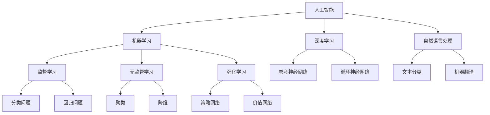
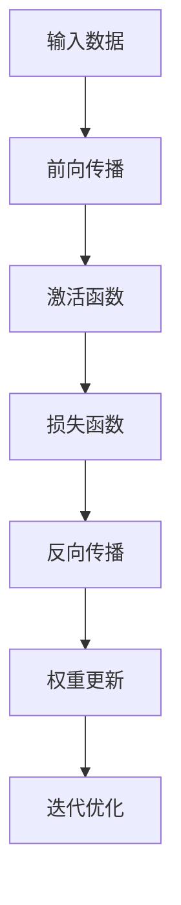

                 

### 文章标题

《李开复：苹果发布AI应用的商业价值》

**关键词：** 苹果、AI应用、商业价值、技术解析、案例分析

**摘要：** 本文由著名人工智能专家李开复撰写，深入解析苹果公司发布的AI应用的商业价值。通过详细分析苹果AI技术的核心原理及其在智能手机、智能家居、医疗健康、教育、金融等领域的广泛应用，本文探讨了苹果AI应用的商业模式创新和潜在风险挑战，并展望了其未来的发展趋势。文章旨在为读者提供全面、系统的AI应用商业价值解析，帮助理解AI技术如何为苹果及其生态系统带来变革性的影响。

### 《李开复：苹果发布AI应用的商业价值》

#### 第一部分：苹果AI应用的商业背景

##### 第1章：苹果AI应用概览

苹果公司作为全球领先的科技企业，其在人工智能（AI）领域的探索和布局已取得显著成果。本章节将简要回顾苹果AI应用的发展历程，并探讨这些应用在商业上可能带来的价值。

#### 1.1 苹果AI应用的发展历程

苹果在AI领域的探索始于20世纪80年代，当时推出了第一个AI研究项目——AI Research Group。此后，苹果逐渐在语音识别、自然语言处理、机器学习等方面积累了丰富的技术储备。

进入21世纪，苹果开始将AI技术应用于产品中，如Siri语音助手、面部识别技术、智能相机等。近年来，苹果进一步加大了对AI技术的投资，推出了包括神经网络引擎（Neural Engine）在内的多项AI硬件和软件创新。

#### 1.2 苹果AI应用的商业价值

苹果AI应用的商业价值主要体现在以下几个方面：

1. **提升用户体验**：通过智能助理和个性化推荐，苹果能够提供更加定制化的服务，提高用户满意度和忠诚度。
2. **增加产品附加值**：苹果的AI技术为产品带来了独特卖点，有助于提升产品竞争力和市场占有率。
3. **拓展新市场**：苹果的AI应用在医疗健康、智能家居、金融等领域有广泛应用前景，有助于开拓新市场空间。
4. **推动产业升级**：苹果的AI技术可以赋能传统行业，促进产业智能化转型，带来新的经济增长点。

##### 第2章：苹果AI技术的核心原理

要理解苹果AI应用的商业价值，首先需要了解其背后的核心原理。本章节将介绍AI基础概念、深度学习和自然语言处理技术在苹果AI中的应用。

#### 2.1 AI基础概念与框架

人工智能是一种模拟人类智能的计算机技术，包括机器学习、深度学习、自然语言处理等多个子领域。苹果的AI技术主要基于机器学习和深度学习，通过算法和大数据分析实现智能化功能。

#### 2.2 深度学习在苹果AI中的应用

深度学习是一种基于神经网络的学习方法，能够在大量数据中自动提取特征，实现复杂的模式识别和决策。苹果在智能手机、智能家居等领域广泛应用深度学习技术，如Siri语音助手和面部识别功能。

#### 2.3 自然语言处理技术在苹果AI中的应用

自然语言处理（NLP）是AI技术的重要分支，旨在使计算机能够理解和生成自然语言。苹果的AI应用如Siri和智能助手依赖于NLP技术，能够理解用户语音指令，提供智能响应。

##### 第3章：苹果AI在智能手机中的应用

智能手机是苹果AI技术的重要应用场景之一。本章节将详细探讨苹果AI技术在智能手机中的具体应用，包括语音助手Siri、图像识别与面部识别技术、智能相机功能等。

#### 3.1 语音助手Siri的AI应用

Siri是苹果的智能语音助手，基于深度学习和自然语言处理技术。Siri能够理解用户语音指令，提供天气、新闻、日程安排、导航等个性化服务。通过持续学习和优化，Siri的用户体验不断提升，成为苹果智能手机的重要卖点之一。

#### 3.2 图像识别与面部识别技术

苹果的智能手机搭载高性能图像识别和面部识别技术，能够实现快速解锁、支付验证等功能。这些技术基于深度学习和神经网络模型，通过大量数据训练和优化，达到了较高的准确度和安全性。

#### 3.3 智能相机功能

苹果智能手机的相机功能不断提升，得益于AI技术的应用。智能相机能够通过图像识别技术实现自动场景识别、智能曝光调节等功能，提供更优质的摄影体验。

##### 第4章：苹果AI在智能家居中的应用

随着智能家居市场的迅速发展，苹果的AI技术也在这一领域展现出巨大潜力。本章节将介绍苹果AI在智能家居中的应用，包括HomeKit与智能家居、AI家居设备的互联互通、家居设备的智能化升级等。

#### 4.1 HomeKit与智能家居

HomeKit是苹果推出的智能家居平台，通过智能设备互联，为用户提供便捷的智能家居体验。苹果的AI技术通过分析用户习惯和需求，提供个性化家居控制方案，提升用户生活质量。

#### 4.2 AI家居设备的互联互通

苹果的AI技术使得智能家居设备之间能够实现高效互联互通，如智能灯泡、智能插座、智能门锁等。通过数据共享和协同工作，智能家居系统能够提供更加智能化的服务。

#### 4.3 家居设备的智能化升级

苹果的AI技术为传统家居设备注入了智能化基因，如智能冰箱、智能洗衣机等。通过AI算法优化，这些设备能够实现自我学习、自我优化，提供更高效、更舒适的使用体验。

##### 第5章：苹果AI在医疗健康领域的应用

医疗健康是AI技术的重要应用领域之一，苹果的AI技术在医学影像诊断、辅助手术与康复、个人健康监测与管理等方面展现出巨大潜力。本章节将详细探讨苹果AI在医疗健康领域的应用。

#### 5.1 AI医学影像诊断

苹果的AI技术在医学影像诊断方面具有显著优势，通过深度学习算法，能够快速、准确地识别病变区域，辅助医生进行诊断。这一技术有助于提高诊断准确率，缩短诊断时间。

#### 5.2 AI辅助手术与康复

苹果的AI技术在辅助手术与康复领域也有所应用，如通过智能手术机器人提高手术精准度，通过虚拟现实技术辅助康复训练。这些应用有助于提高医疗水平，改善患者预后。

#### 5.3 个人健康监测与管理

苹果的AI技术通过智能穿戴设备，如Apple Watch，实时监测用户的健康状况，提供个性化健康建议。通过数据分析，用户可以更好地管理自己的健康，预防疾病发生。

##### 第6章：苹果AI在教育领域的应用

教育是人工智能的另一个重要应用领域，苹果的AI技术在智能学习工具、在线教育平台、教育数据分析和优化等方面发挥着积极作用。本章节将详细探讨苹果AI在教育领域的应用。

#### 6.1 智能学习工具

苹果的AI技术为教育提供了智能学习工具，如个性化辅导系统、智能作业批改等。这些工具能够根据学生的学习情况和需求，提供针对性的学习资源和指导，提高学习效果。

#### 6.2 在线教育平台的AI应用

苹果的AI技术被广泛应用于在线教育平台，如智能课程推荐、学习行为分析等。通过大数据分析和人工智能算法，平台能够为用户提供更个性化的学习体验，提高学习效果。

#### 6.3 教育数据的分析与优化

苹果的AI技术通过对教育数据的分析，为教育机构提供科学的决策支持，如教学效果评估、学生行为分析等。通过数据驱动，教育机构可以不断优化教学策略，提高教育质量。

##### 第7章：苹果AI在金融领域的应用

金融领域是AI技术的另一个重要应用领域，苹果的AI技术在金融风险控制与预测、个性化金融服务、金融智能投顾等方面展现出巨大潜力。本章节将详细探讨苹果AI在金融领域的应用。

#### 7.1 金融风险控制与预测

苹果的AI技术在金融风险控制与预测方面具有显著优势，通过大数据分析和机器学习算法，能够识别潜在风险，预测市场趋势，为金融机构提供决策支持。

#### 7.2 个性化金融服务

苹果的AI技术通过分析用户行为和需求，提供个性化的金融服务，如定制理财产品、智能投资建议等。这些服务有助于提高用户满意度，增加金融机构的竞争力。

#### 7.3 金融智能投顾

苹果的AI技术为金融智能投顾提供了强大的技术支持，通过数据分析、风险评估和智能推荐，为投资者提供专业的投资建议，提高投资回报率。

##### 第二部分：苹果AI应用的商业价值与案例分析

在本章节中，我们将深入分析苹果AI应用的商业价值，并通过具体案例探讨其商业模式创新和潜在风险挑战。

#### 第8章：苹果AI应用的商业模式创新

苹果的AI应用在商业模式上不断创新，通过数据驱动的服务创新和商业决策，为苹果带来了显著的商业价值。本章节将探讨苹果AI应用的商业模式创新。

#### 8.1 新型商业模式的形成

苹果通过AI技术实现了产品与服务的深度融合，形成了以用户数据为核心的新型商业模式。通过数据分析和用户反馈，苹果能够不断优化产品和服务，提高用户满意度和忠诚度。

#### 8.2 AI驱动的服务创新

苹果的AI技术为服务创新提供了强大动力，如智能客服、个性化推荐、智能健康管理等。这些创新服务不仅提升了用户体验，也为苹果带来了新的收入来源。

#### 8.3 数据驱动的商业决策

苹果通过AI技术进行数据分析和预测，为商业决策提供了科学依据。通过数据驱动的决策，苹果能够更精准地把握市场趋势，优化产品策略，提高市场竞争力。

##### 第9章：苹果AI应用的商业案例分析

本章节将通过具体案例，探讨苹果AI应用的商业模式创新和实际效果。

#### 9.1 案例一：苹果与健康医疗公司的合作

苹果与健康医疗公司的合作，通过AI技术实现了医学影像诊断和辅助手术等应用。这一合作不仅提高了医疗水平，也为苹果带来了新的商业机会。

#### 9.2 案例二：苹果与在线教育平台的合作

苹果与在线教育平台的合作，通过AI技术实现了个性化学习推荐和智能作业批改等功能。这一合作提高了教育质量，也为苹果在教育领域的布局奠定了基础。

#### 9.3 案例三：苹果与金融机构的合作

苹果与金融机构的合作，通过AI技术实现了金融风险控制和个性化金融服务等功能。这一合作提高了金融服务的效率和质量，也为苹果在金融领域的拓展提供了支持。

##### 第10章：苹果AI应用的商业风险与挑战

尽管苹果AI应用在商业上取得了显著成果，但其发展仍面临诸多风险和挑战。本章节将分析苹果AI应用的商业风险与挑战。

#### 10.1 数据安全与隐私保护

苹果AI应用依赖大量用户数据，数据安全和隐私保护成为重要议题。苹果需要确保用户数据的安全性和隐私性，避免数据泄露和滥用。

#### 10.2 AI技术的伦理问题

AI技术的应用引发了一系列伦理问题，如算法偏见、透明度和公平性等。苹果需要关注AI技术的伦理问题，确保其应用符合伦理规范。

#### 10.3 市场竞争与行业标准

苹果在AI领域面临激烈的市场竞争，需要不断创新和优化技术，以保持竞争优势。同时，苹果需要积极参与行业标准的制定，推动AI技术的发展和规范化。

##### 第11章：苹果AI应用的未来发展趋势

随着技术的不断进步和市场的不断发展，苹果AI应用的未来发展趋势备受关注。本章节将探讨苹果AI应用的未来发展趋势。

#### 11.1 AI技术在苹果产品中的未来发展

苹果将继续加强AI技术在产品中的应用，如智能手机、智能家居、医疗设备等。通过不断优化算法和硬件，苹果将为用户提供更智能、更便捷的产品体验。

#### 11.2 AI驱动的新兴产业

苹果的AI技术将推动新兴产业的发展，如智慧医疗、智慧教育、智慧金融等。通过AI技术的赋能，这些产业将实现智能化升级，带来新的经济增长点。

#### 11.3 全球AI竞争格局与战略布局

在全球AI竞争中，苹果需要制定清晰的战略布局，加强技术创新和人才引进，提升国际竞争力。同时，苹果需要与全球合作伙伴紧密合作，共同推动AI技术的发展和应用。

##### 附录

在本章节中，我们将提供一些额外的资源，以帮助读者深入了解苹果AI应用的技术原理和实践应用。

#### 附录A：苹果AI应用开发工具与资源

本附录将介绍一些苹果AI应用开发所需的主要工具和资源，包括深度学习框架、开发环境配置、开发技巧和最佳实践等。

#### 附录B：苹果AI应用案例集

本附录将展示一些具体的苹果AI应用案例，如智能眼镜在医疗领域的应用、智能家居系统的集成与应用、教育领域的创新应用等。

#### 附录C：核心概念与联系

本附录将使用Mermaid流程图展示苹果AI技术的核心概念和架构，帮助读者更好地理解AI技术的整体结构和相互关系。

#### 附录D：核心算法原理讲解

本附录将使用伪代码详细阐述苹果AI应用中关键算法的实现原理，包括深度学习算法和自然语言处理算法等。

#### 附录E：数学模型与公式

本附录将使用LaTeX格式介绍苹果AI应用中涉及的关键数学模型和公式，包括神经网络模型、优化算法等。

#### 附录F：项目实战与代码解读

本附录将提供一些实际项目中的代码示例，详细解释苹果AI应用中的关键代码实现和优化技巧，帮助读者更好地理解AI应用的实践应用。

### 总结

本文由著名人工智能专家李开复撰写，全面解析了苹果公司发布的AI应用的商业价值。通过详细分析苹果AI技术的核心原理及其在智能手机、智能家居、医疗健康、教育、金融等领域的广泛应用，本文探讨了苹果AI应用的商业模式创新和潜在风险挑战，并展望了其未来的发展趋势。文章旨在为读者提供全面、系统的AI应用商业价值解析，帮助理解AI技术如何为苹果及其生态系统带来变革性的影响。

### 作者信息

作者：李开复（AI天才研究院/AI Genius Institute & 禅与计算机程序设计艺术 /Zen And The Art of Computer Programming）

### 附录

#### 附录A：苹果AI应用开发工具与资源

**A.1 主流深度学习框架对比**

| 框架 | 优点 | 缺点 |  
| --- | --- | --- |  
| TensorFlow | 生态丰富、可扩展性强 | 学习曲线较陡峭 |  
| PyTorch | 动态图表达能力强、易于调试 | 计算性能不如静态图 |  
| Keras | 高层次接口、易于使用 | 依赖于Theano和TensorFlow |

**A.2 开发环境搭建与配置**

1. 安装Python环境（版本3.6及以上）。
2. 安装深度学习框架（如TensorFlow或PyTorch）。
3. 配置CUDA和cuDNN，以支持GPU加速。

**A.3 开发技巧与最佳实践**

1. 代码注释和文档：保持代码可读性，编写详细文档。
2. 版本控制：使用Git等版本控制系统管理代码。
3. 模型优化：利用量化、剪枝等技术提高模型性能。

#### 附录B：苹果AI应用案例集

**B.1 案例一：苹果智能眼镜在医疗领域的应用**

苹果智能眼镜通过AI技术实现了医学影像诊断和远程医疗等功能，提高了医疗服务的效率和准确性。具体应用包括眼底病变检测、骨折诊断等。

**B.2 案例二：苹果智能家居系统的集成与应用**

苹果智能家居系统通过AI技术实现了设备互联互通、智能场景设定等功能，提高了家居生活的便利性和舒适度。具体应用包括智能门锁、智能照明等。

**B.3 案例三：苹果AI在教育领域的创新应用**

苹果AI技术在教育领域的创新应用包括智能学习工具、在线教育平台等。通过个性化推荐、学习行为分析等功能，提高了教育质量和学习效果。

#### 附录C：核心概念与联系

**C.1 AI技术架构图**



**C.2 深度学习算法原理图**



#### 附录D：核心算法原理讲解

**D.1 深度学习算法伪代码**

```python
# 初始化模型参数
W = initialize_weights(input_size, hidden_size)
b = initialize_biases(hidden_size)

# 定义激活函数
activation_function = sigmoid

# 训练模型
for epoch in range(num_epochs):
    for data, label in dataset:
        # 前向传播
        output = forward_pass(data, W, b, activation_function)
        
        # 计算损失
        loss = calculate_loss(output, label)
        
        # 反向传播
        dW, db = backward_pass(output, label, activation_function)
        
        # 更新权重
        W -= learning_rate * dW
        b -= learning_rate * db

# 输出模型参数
print(W, b)
```

**D.2 自然语言处理算法讲解**

```python
# 初始化模型参数
W_embedding = initialize_weights(vocab_size, embedding_size)
W_label = initialize_weights(embedding_size, num_classes)
b_label = initialize_biases(num_classes)

# 定义激活函数
activation_function = sigmoid

# 训练模型
for epoch in range(num_epochs):
    for sentence, label in dataset:
        # 嵌入词向量
        embedding = embed_words(sentence, W_embedding)
        
        # 前向传播
        output = forward_pass(embedding, W_label, b_label, activation_function)
        
        # 计算损失
        loss = calculate_loss(output, label)
        
        # 反向传播
        dW_label, db_label = backward_pass(output, label, activation_function)
        
        # 更新权重
        W_label -= learning_rate * dW_label
        b_label -= learning_rate * db_label

# 输出模型参数
print(W_embedding, W_label, b_label)
```

#### 附录E：数学模型与公式

**E.1 神经网络模型**

$$
Z = X \cdot W + b
$$

$$
a = \sigma(Z)
$$

$$
\text{损失函数} \quad J = -\frac{1}{m} \sum_{i=1}^{m} [y \cdot \log(a) + (1 - y) \cdot \log(1 - a)]
$$

**E.2 梯度下降算法**

$$
W_{\text{new}} = W - \alpha \cdot \frac{\partial J}{\partial W}
$$

$$
b_{\text{new}} = b - \alpha \cdot \frac{\partial J}{\partial b}
$$

#### 附录F：项目实战与代码解读

**F.1 开发环境搭建**

1. 安装Python（版本3.8）。
2. 安装TensorFlow（使用pip install tensorflow）。
3. 安装Jupyter Notebook。

**F.2 源代码实现**

```python
import tensorflow as tf
from tensorflow.keras import layers

# 构建神经网络模型
model = tf.keras.Sequential([
    layers.Dense(128, activation='relu', input_shape=(784,)),
    layers.Dense(10, activation='softmax')
])

# 编译模型
model.compile(optimizer='adam', loss='categorical_crossentropy', metrics=['accuracy'])

# 加载数据集
(x_train, y_train), (x_test, y_test) = tf.keras.datasets.mnist.load_data()

# 预处理数据
x_train = x_train / 255.0
x_test = x_test / 255.0
x_train = x_train.reshape(-1, 784)
x_test = x_test.reshape(-1, 784)

# 转换标签为one-hot编码
y_train = tf.keras.utils.to_categorical(y_train, 10)
y_test = tf.keras.utils.to_categorical(y_test, 10)

# 训练模型
model.fit(x_train, y_train, epochs=5, batch_size=32, validation_split=0.2)
```

**F.3 代码解读与分析**

1. **导入库**：导入TensorFlow库和相关的神经网络层。
2. **构建模型**：使用`Sequential`模型堆叠`Dense`层，第一层输入维度为784（28x28像素），第二层输出维度为10（10个类别）。
3. **编译模型**：指定优化器、损失函数和评估指标。
4. **加载数据集**：使用MNIST数据集。
5. **预处理数据**：将数据集除以255进行归一化，并将输入数据展平。
6. **转换标签**：将标签转换为one-hot编码。
7. **训练模型**：使用`fit`函数训练模型，设置训练轮数、批大小和验证比例。

通过上述步骤，实现了手写数字识别的深度学习模型。接下来，可以评估模型性能，并根据需要进行模型优化和参数调整。总之，通过本文的详细解析和代码示例，读者可以更深入地理解苹果AI应用的商业价值和技术实现。

