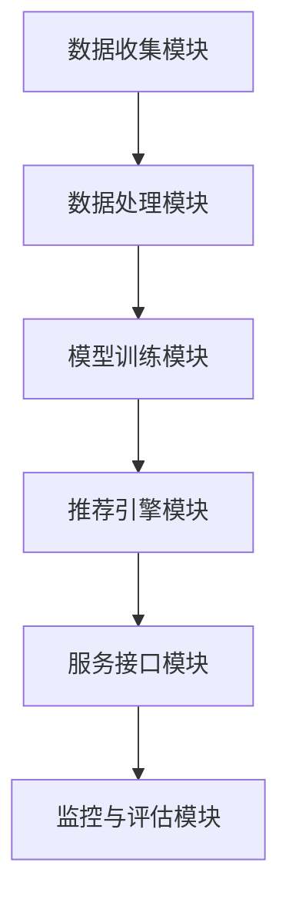
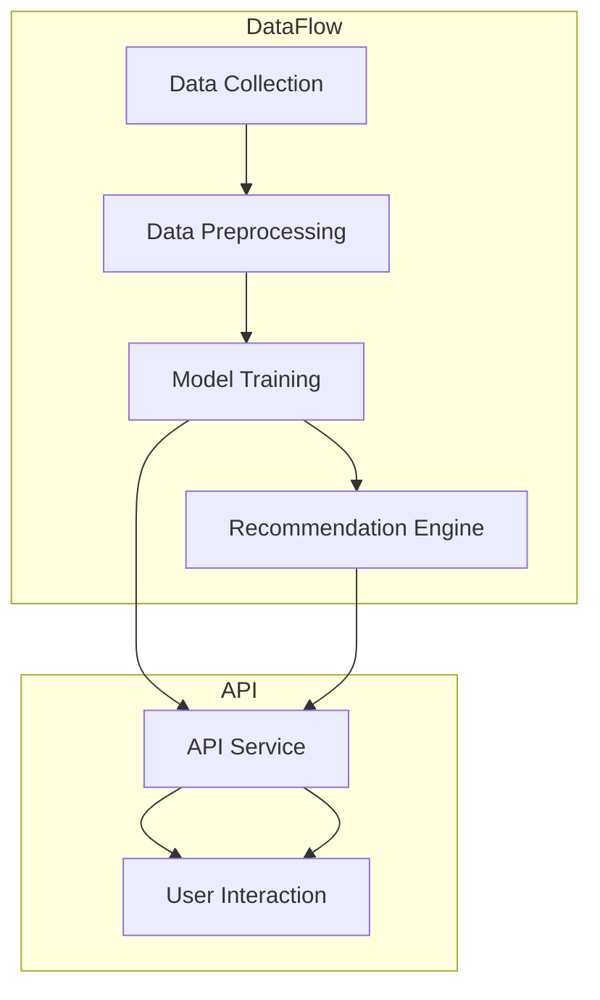

                 

## 《构建AI驱动的智慧旅游推荐提示词引擎》

### 关键词

- AI驱动
- 智慧旅游
- 推荐提示词引擎
- 数据处理
- 特征工程
- 模型优化

### 摘要

本文旨在探讨如何构建一个AI驱动的智慧旅游推荐提示词引擎。我们将从AI与智慧旅游的概述开始，详细介绍AI在智慧旅游中的应用，以及机器学习与深度学习等核心技术。接着，我们将深入分析智慧旅游推荐系统的基本概念和架构，重点讲解推荐提示词引擎的构建过程，包括数据收集与处理、推荐算法设计、模型评估与优化等。最后，通过实际案例和代码解析，展示如何实现一个高效的AI驱动的智慧旅游推荐提示词引擎。

---

### 目录大纲

#### 第一部分：AI与智慧旅游基础

##### 第1章：AI与智慧旅游概述

- **1.1 AI在智慧旅游中的应用**
  - **1.1.1 智慧旅游的兴起与需求**
  - **1.1.2 AI技术在旅游行业的应用场景**

- **1.2 AI核心技术介绍**
  - **1.2.1 机器学习与深度学习基础**
  - **1.2.2 自然语言处理（NLP）技术**

- **1.3 智慧旅游推荐系统概述**
  - **1.3.1 推荐系统的基本概念**
  - **1.3.2 推荐系统的架构与实现**

#### 第二部分：AI驱动的智慧旅游推荐提示词引擎构建

##### 第2章：数据收集与处理

- **2.1 旅游数据来源**
  - **2.1.1 结构化数据与非结构化数据**
  - **2.1.2 数据采集方法与技术**

- **2.2 数据预处理技术**
  - **2.2.1 数据清洗与去重**
  - **2.2.2 数据归一化与标准化**

- **2.3 特征工程**
  - **2.3.1 旅游行为特征提取**
  - **2.3.2 旅游需求特征提取**

##### 第3章：推荐提示词生成算法

- **3.1 协同过滤算法**
  - **3.1.1 基于用户的协同过滤**
  - **3.1.2 基于物品的协同过滤**
  - **3.1.3 基于模型的协同过滤**

- **3.2 内容匹配算法**
  - **3.2.1 基于文本相似度的匹配**
  - **3.2.2 基于关键词的匹配**

- **3.3 提示词生成策略**
  - **3.3.1 提示词筛选与优化**
  - **3.3.2 提示词生成算法实现**

##### 第4章：模型评估与优化

- **4.1 模型评估指标**
  - **4.1.1 准确率、召回率与F1值**
  - **4.1.2 交叉验证方法**

- **4.2 模型优化方法**
  - **4.2.1 模型调参技巧**
  - **4.2.2 模型融合策略**

- **4.3 实时优化与反馈机制**
  - **4.3.1 用户行为分析**
  - **4.3.2 模型实时调整**

##### 第5章：智慧旅游推荐系统的设计与实现

- **5.1 系统架构设计**
  - **5.1.1 系统功能模块划分**
  - **5.1.2 系统模块间的关系与通信**

- **5.2 数据库设计与存储**
  - **5.2.1 数据库选择与优化**
  - **5.2.2 数据存储方案**

- **5.3 推荐系统开发实战**
  - **5.3.1 开发环境搭建**
  - **5.3.2 系统功能实现**
  - **5.3.3 代码解读与分析**

#### 第三部分：案例研究与展望

##### 第6章：AI驱动的智慧旅游推荐提示词引擎案例分析

- **6.1 案例背景介绍**
- **6.2 系统设计与实现**
- **6.3 模型评估与优化**

##### 第7章：未来发展趋势与挑战

- **7.1 智慧旅游的发展趋势**
- **7.2 AI技术的创新应用**
- **7.3 挑战与应对策略**

### 附录

- **附录A：常用工具与技术总结**
  - **A.1 数据处理工具**
  - **A.2 机器学习框架**
  - **A.3 推荐系统框架**

- **附录B：参考资源与进一步阅读**

---

接下来，我们将逐步深入探讨每一章节的内容，为读者提供一个全面、详细的AI驱动的智慧旅游推荐提示词引擎构建指南。

---

### 第一部分：AI与智慧旅游基础

#### 第1章：AI与智慧旅游概述

##### 1.1 AI在智慧旅游中的应用

随着人工智能技术的不断发展，AI在各个领域的应用越来越广泛，智慧旅游便是其中之一。智慧旅游是指利用人工智能、大数据、物联网等现代信息技术，对旅游行业进行全方位的智能化升级，从而提升旅游体验和服务质量。

**1.1.1 智慧旅游的兴起与需求**

智慧旅游的兴起源于旅游业本身的变革需求。传统的旅游模式已无法满足日益增长的旅游需求，旅游业正面临着从“门票经济”向“产业经济”的转变。游客对于个性化、智能化、便捷化的旅游体验需求日益增强，这使得智慧旅游成为必然趋势。

- **个性化推荐**：通过AI技术，可以为游客提供个性化的旅游推荐，包括景点、住宿、餐饮等，从而提升游客的满意度。
- **智能导游**：利用语音识别、自然语言处理等技术，可以为游客提供智能化的导游服务，解答游客的疑问，提供实时信息。
- **智能交通**：通过AI技术优化交通线路，提供实时交通信息，缓解交通拥堵，提高游客的出行效率。
- **安全管理**：利用人工智能技术进行安全监控，及时发现并处理安全隐患，确保游客的安全。

**1.1.2 AI技术在旅游行业的应用场景**

AI技术在旅游行业的应用场景非常广泛，以下是一些典型的应用：

- **个性化推荐系统**：通过分析游客的历史行为数据，为游客提供个性化的旅游推荐，包括热门景点、特色美食、住宿推荐等。
- **智能导游系统**：利用语音识别和自然语言处理技术，为游客提供语音导览服务，解答游客的疑问，提供实时信息。
- **智能交通系统**：通过实时监控交通状况，提供最佳出行路线，缓解交通拥堵，提高出行效率。
- **智能安防系统**：利用视频监控和人工智能技术，对景区进行实时监控，及时发现并处理安全隐患。
- **智慧景区管理**：通过物联网技术，对景区内的设施进行智能监控和管理，提高景区的管理效率和游客体验。
- **智慧酒店服务**：通过人工智能技术，为游客提供智能化的入住、退房、客房服务等，提高酒店的服务质量。

#### 1.2 AI核心技术介绍

智慧旅游的实现离不开人工智能技术的支持，以下是AI技术中的一些核心组成部分：

**1.2.1 机器学习与深度学习基础**

- **机器学习**：机器学习是AI的核心技术之一，它通过算法从数据中学习规律，从而进行预测和决策。在智慧旅游中，机器学习可以用于游客行为分析、旅游趋势预测等。
- **深度学习**：深度学习是机器学习的一个分支，它通过多层神经网络模型从数据中学习特征，具有很强的表达能力和泛化能力。在智慧旅游中，深度学习可以用于图像识别、语音识别、自然语言处理等。

**1.2.2 自然语言处理（NLP）技术**

自然语言处理是AI技术的重要分支，它使计算机能够理解、生成和处理人类语言。在智慧旅游中，NLP技术可以用于智能客服、语音导览、文本分析等。

- **文本分类**：通过对文本进行分类，可以帮助系统理解游客的需求，提供更精准的推荐。
- **情感分析**：通过对游客的评论、评价进行分析，可以了解游客的满意度，为旅游企业提供改进的方向。
- **对话生成**：利用NLP技术，可以生成自然流畅的对话，为游客提供智能化的客服服务。

##### 1.3 智慧旅游推荐系统概述

推荐系统是智慧旅游的重要组成部分，它通过分析游客的行为数据，为游客提供个性化的旅游推荐。以下是推荐系统的基本概念和架构。

**1.3.1 推荐系统的基本概念**

- **用户**：使用旅游服务的个体。
- **物品**：旅游服务中的各种资源，如景点、酒店、美食等。
- **评分**：用户对物品的评价或反馈，可以是显式评分（如5分制）或隐式评分（如点击、浏览、购买等）。
- **推荐**：根据用户的偏好和历史行为，为用户推荐相关的物品。

**1.3.2 推荐系统的架构与实现**

一个典型的推荐系统通常包括以下模块：

- **数据收集模块**：收集用户行为数据、物品属性数据等。
- **数据处理模块**：对收集到的数据进行清洗、预处理和特征工程。
- **模型训练模块**：根据预处理后的数据，训练推荐模型。
- **推荐引擎模块**：根据用户的行为和模型预测，为用户生成推荐列表。
- **评估模块**：评估推荐系统的效果，包括准确率、召回率、F1值等指标。

在实现推荐系统时，可以选择不同的推荐算法，如协同过滤、基于内容的推荐、基于模型的推荐等。每种算法都有其优缺点和适用场景，需要根据具体需求进行选择。

---

**本章小结**：

在本章中，我们首先介绍了智慧旅游的兴起背景和AI技术在旅游行业的应用场景。接着，我们讲解了AI的核心技术，包括机器学习、深度学习和自然语言处理。最后，我们概述了智慧旅游推荐系统的基本概念和架构。这些内容为后续构建AI驱动的智慧旅游推荐提示词引擎奠定了理论基础。

---

## 第二部分：AI驱动的智慧旅游推荐提示词引擎构建

#### 第2章：数据收集与处理

##### 2.1 旅游数据来源

构建AI驱动的智慧旅游推荐提示词引擎的第一步是收集旅游数据。旅游数据来源多样，包括结构化数据和非结构化数据。结构化数据通常来自于数据库，如游客信息、预订记录等；非结构化数据则包括文本、图片、视频等。

**2.1.1 结构化数据与非结构化数据**

- **结构化数据**：结构化数据通常以表格形式存储，包含明确的字段和格式。在旅游领域，结构化数据可能包括以下内容：

  - **游客信息**：如姓名、性别、年龄、联系方式等。
  - **预订记录**：如预订时间、预订类型、预订金额等。
  - **旅游活动**：如景点名称、活动内容、价格等。

- **非结构化数据**：非结构化数据没有固定的格式，通常需要通过专门的算法进行解析。在旅游领域，非结构化数据可能包括以下内容：

  - **文本**：如游客评论、游记等。
  - **图片**：如景点图片、用户上传的照片等。
  - **视频**：如旅游视频、宣传片等。

**2.1.2 数据采集方法与技术**

收集旅游数据的方法和技术多种多样，以下是几种常见的方法：

- **API接口**：通过访问第三方数据提供商的API接口，可以获取大量的结构化数据。例如，一些旅游平台提供了API接口，可以查询景点信息、酒店信息等。
- **爬虫技术**：利用爬虫技术，可以从互联网上获取非结构化数据。例如，可以爬取旅游网站上的用户评论、图片等。
- **物联网设备**：利用物联网设备，可以实时收集景区内的环境数据、人流数据等。例如，景区内的摄像头、传感器等可以收集到这些数据。

在数据采集过程中，需要注意数据的质量和合规性。结构化数据通常比较容易清洗和处理，而非结构化数据则需要更多的工作来提取有价值的信息。

##### 2.2 数据预处理技术

数据预处理是构建推荐系统的关键步骤，它包括数据清洗、数据归一化和特征工程等。

**2.2.1 数据清洗与去重**

数据清洗是处理数据中的噪声和错误，确保数据的质量。以下是一些常见的数据清洗方法：

- **缺失值处理**：对于缺失值，可以选择填充法或丢弃法。填充法可以选择平均值、中位数等方法进行填充；丢弃法则是直接删除含有缺失值的记录。
- **异常值处理**：异常值可能是由于数据录入错误或数据采集过程中产生的，需要根据具体情况进行处理。例如，可以通过统计学方法识别异常值，并进行修正或删除。
- **去重**：在数据收集过程中，可能会出现重复的数据。去重操作可以去除重复的记录，确保数据的唯一性。

**2.2.2 数据归一化与标准化**

数据归一化和标准化是处理不同特征尺度不一致的问题。以下是一些常见的方法：

- **归一化**：将数据映射到统一的尺度，常用的方法有最小-最大缩放、Z-score缩放等。最小-最大缩放将数据映射到[0, 1]的区间；Z-score缩放将数据映射到标准正态分布。
- **标准化**：将数据转换为标准正态分布，即均值为0，标准差为1。常用的方法有Z-score标准化和Min-Max标准化。

**2.2.3 特征工程**

特征工程是数据预处理的重要环节，它通过构造和选择特征来提高模型的性能。以下是几种常见的特征工程方法：

- **特征提取**：从原始数据中提取有用的特征。例如，可以从文本数据中提取关键词、情感极性等。
- **特征组合**：通过组合多个特征，构造新的特征。例如，可以组合游客的年龄、性别、旅游频率等，来生成新的特征。
- **特征选择**：从众多特征中选择最有用的特征，减少特征维度。常用的方法有信息增益、卡方检验等。

在特征工程过程中，需要根据具体的应用场景和数据特点进行选择。特征工程的好坏直接影响推荐系统的性能。

##### 2.3 特征工程

特征工程是构建AI驱动的智慧旅游推荐提示词引擎的核心环节，通过提取和构造特征，可以使模型更好地理解用户行为和旅游需求。

**2.3.1 旅游行为特征提取**

旅游行为特征是指用户在旅游过程中的行为数据，这些数据可以帮助模型了解用户的偏好和兴趣。以下是一些常见的旅游行为特征：

- **旅游频率**：用户在一定时间内旅游的次数，可以反映用户的旅游活跃度。
- **旅游时长**：用户每次旅游的时长，可以反映用户对旅游时间的偏好。
- **旅游类型**：用户旅游的类型，如户外探险、文化体验、休闲度假等。
- **旅游季节**：用户旅游的时间分布，可以反映用户对不同季节的偏好。

**2.3.2 旅游需求特征提取**

旅游需求特征是指用户在旅游过程中表达的需求信息，这些数据可以帮助模型了解用户的个性化需求。以下是一些常见的旅游需求特征：

- **景点兴趣**：用户对某些景点的兴趣程度，可以通过用户的浏览、评论、评分等行为数据提取。
- **美食偏好**：用户对某些美食的偏好，可以通过用户的浏览、评论、评分等行为数据提取。
- **住宿需求**：用户对住宿的需求，如酒店类型、价格范围等。
- **交通偏好**：用户对交通方式的偏好，如飞机、火车、自驾等。

在特征工程过程中，需要综合考虑用户行为特征和旅游需求特征，以便构建一个全面的特征向量。特征向量的质量直接影响推荐系统的性能。

---

**本章小结**：

在本章中，我们详细介绍了数据收集与处理的过程。首先，我们讨论了旅游数据的来源，包括结构化数据和非结构化数据，并介绍了数据采集的方法和技术。接着，我们讲解了数据预处理技术，包括数据清洗、数据归一化和特征工程，并介绍了如何提取旅游行为特征和旅游需求特征。这些内容为构建AI驱动的智慧旅游推荐提示词引擎奠定了数据基础。

---

## 第三部分：AI驱动的智慧旅游推荐提示词引擎构建

### 第3章：推荐提示词生成算法

在构建AI驱动的智慧旅游推荐提示词引擎中，推荐算法的选择和实现至关重要。推荐算法可以根据用户的兴趣和行为，为用户提供个性化的旅游推荐。本章将详细介绍几种常见的推荐算法，包括协同过滤算法、内容匹配算法以及提示词生成策略。

##### 3.1 协同过滤算法

协同过滤算法是推荐系统中最常用的算法之一，它通过分析用户与物品之间的交互数据，预测用户对未知物品的偏好。协同过滤算法可以分为基于用户的协同过滤和基于物品的协同过滤。

**3.1.1 基于用户的协同过滤**

基于用户的协同过滤算法通过计算用户之间的相似度，找到与目标用户相似的其他用户，然后推荐这些相似用户喜欢的物品。以下是基于用户协同过滤算法的步骤：

1. **用户-物品评分矩阵构建**：首先，构建一个用户-物品评分矩阵，其中每个元素表示用户对物品的评分。
2. **计算用户相似度**：计算目标用户与其他用户之间的相似度，常用的相似度计算方法有皮尔逊相关系数、余弦相似度等。
3. **生成推荐列表**：根据用户相似度，为每个用户生成推荐列表。推荐列表中的物品是相似用户喜欢的，但目标用户尚未评分或评分较低的物品。

**3.1.2 基于物品的协同过滤**

基于物品的协同过滤算法通过计算物品之间的相似度，找到与目标物品相似的物品，然后推荐这些相似物品。以下是基于物品协同过滤算法的步骤：

1. **物品-物品相似度矩阵构建**：首先，构建一个物品-物品相似度矩阵，其中每个元素表示物品之间的相似度。
2. **计算物品相似度**：计算目标物品与其他物品之间的相似度，常用的相似度计算方法有欧氏距离、余弦相似度等。
3. **生成推荐列表**：根据物品相似度，为目标物品生成推荐列表。推荐列表中的物品是相似物品，但目标用户尚未评分或评分较低的物品。

**3.1.3 基于模型的协同过滤**

基于模型的协同过滤算法结合了基于用户和基于物品协同过滤的优点，通过构建预测模型来预测用户对物品的评分。以下是基于模型协同过滤算法的步骤：

1. **用户-物品评分矩阵构建**：首先，构建一个用户-物品评分矩阵。
2. **训练预测模型**：使用用户-物品评分矩阵训练预测模型，常用的模型有线性回归、矩阵分解等。
3. **预测用户评分**：使用训练好的预测模型，预测用户对未知物品的评分。
4. **生成推荐列表**：根据预测评分，为每个用户生成推荐列表。

##### 3.2 内容匹配算法

内容匹配算法通过分析物品的属性和特征，为用户提供个性化的推荐。内容匹配算法可以分为基于文本相似度和基于关键词匹配。

**3.2.1 基于文本相似度的匹配**

基于文本相似度的匹配算法通过计算文本之间的相似度，为用户提供相关推荐。以下是基于文本相似度匹配算法的步骤：

1. **文本表示**：将文本数据转换为向量表示，常用的文本表示方法有词袋模型、TF-IDF等。
2. **计算文本相似度**：计算用户查询文本和物品描述文本之间的相似度，常用的相似度计算方法有余弦相似度、Jaccard相似度等。
3. **生成推荐列表**：根据文本相似度，为用户生成推荐列表。

**3.2.2 基于关键词匹配**

基于关键词匹配算法通过分析物品的关键词，为用户提供相关推荐。以下是基于关键词匹配算法的步骤：

1. **提取关键词**：从文本中提取关键词，常用的方法有词频统计、TF-IDF等。
2. **构建关键词索引**：将关键词与物品进行关联，构建关键词索引。
3. **匹配关键词**：根据用户查询关键词，从关键词索引中匹配相关物品。
4. **生成推荐列表**：根据匹配结果，为用户生成推荐列表。

##### 3.3 提示词生成策略

提示词生成策略是构建AI驱动的智慧旅游推荐提示词引擎的核心，它通过分析用户行为和推荐结果，动态生成提示词，提高用户的推荐体验。

**3.3.1 提示词筛选与优化**

提示词筛选与优化是生成高质量提示词的关键步骤。以下是提示词筛选与优化的方法：

1. **热门关键词筛选**：从用户历史浏览、搜索和评论中提取热门关键词，作为初始提示词。
2. **关键词权重优化**：根据用户行为和推荐效果，调整关键词的权重，提高提示词的相关性。
3. **动态调整**：根据用户实时行为和推荐结果，动态调整提示词，以适应用户需求。

**3.3.2 提示词生成算法实现**

提示词生成算法实现是构建推荐提示词引擎的关键，以下是提示词生成算法的实现步骤：

1. **用户行为分析**：分析用户的历史行为数据，如浏览记录、搜索记录等。
2. **推荐结果分析**：分析用户对推荐结果的反馈，如点击率、转化率等。
3. **生成提示词**：根据用户行为和推荐结果，生成提示词，并将其应用到推荐系统中。

---

**本章小结**：

在本章中，我们详细介绍了AI驱动的智慧旅游推荐提示词引擎的推荐算法。首先，我们讲解了协同过滤算法，包括基于用户的协同过滤、基于物品的协同过滤和基于模型的协同过滤。接着，我们介绍了内容匹配算法，包括基于文本相似度的匹配和基于关键词匹配。最后，我们讨论了提示词生成策略，包括提示词筛选与优化和提示词生成算法实现。这些内容为构建高效的AI驱动的智慧旅游推荐提示词引擎提供了算法支持。

---

## 第四部分：模型评估与优化

### 第4章：模型评估与优化

在构建AI驱动的智慧旅游推荐提示词引擎的过程中，模型评估与优化是确保系统性能和用户体验的关键步骤。本章将详细介绍模型评估指标、模型优化方法和实时优化与反馈机制。

##### 4.1 模型评估指标

模型评估指标是衡量推荐系统性能的重要标准，常用的评估指标包括准确率、召回率、F1值和交叉验证方法。

**4.1.1 准确率、召回率与F1值**

- **准确率**：准确率是指推荐结果中实际推荐给用户的物品中，用户实际喜欢的物品所占的比例。准确率越高，说明推荐系统越精准。
  \[ \text{准确率} = \frac{\text{实际推荐喜欢的物品数}}{\text{实际推荐物品总数}} \]

- **召回率**：召回率是指推荐系统中实际推荐给用户的物品中，用户实际喜欢的物品所占的比例。召回率越高，说明推荐系统覆盖的用户喜好越全面。
  \[ \text{召回率} = \frac{\text{实际推荐喜欢的物品数}}{\text{用户实际喜欢的物品总数}} \]

- **F1值**：F1值是准确率和召回率的调和平均值，用于综合评估推荐系统的性能。
  \[ \text{F1值} = 2 \times \frac{\text{准确率} \times \text{召回率}}{\text{准确率} + \text{召回率}} \]

**4.1.2 交叉验证方法**

交叉验证是一种评估模型性能的常用方法，它通过将数据集划分为多个子集，轮流使用每个子集作为验证集，其余子集作为训练集，从而得到多个评估指标的平均值。常用的交叉验证方法包括K折交叉验证和留一法交叉验证。

- **K折交叉验证**：将数据集划分为K个子集，轮流使用每个子集作为验证集，其余子集作为训练集。重复K次，最后取平均值作为模型的评估指标。
- **留一法交叉验证**：将数据集划分为K个子集，每个子集一次作为验证集，其余子集作为训练集。重复K次，最后取平均值作为模型的评估指标。

##### 4.2 模型优化方法

模型优化是提升推荐系统性能的重要手段，常用的优化方法包括模型调参技巧和模型融合策略。

**4.2.1 模型调参技巧**

模型调参是调整模型参数以优化模型性能的过程。以下是一些常见的调参技巧：

- **网格搜索**：通过遍历所有可能的参数组合，找到最优参数组合。
- **随机搜索**：随机选择参数组合，通过多次迭代找到最优参数组合。
- **贝叶斯优化**：利用贝叶斯统计模型进行参数优化，通过历史评估结果来预测新的参数组合。

**4.2.2 模型融合策略**

模型融合策略是将多个模型的结果进行综合，以提升推荐系统的性能。以下是一些常见的模型融合方法：

- **简单平均**：将多个模型的预测结果进行平均，得到最终的预测结果。
- **加权平均**：根据各个模型的性能，给每个模型分配不同的权重，进行加权平均。
- **投票法**：对于分类问题，选择各个模型中最常见的标签作为最终的预测结果。

##### 4.3 实时优化与反馈机制

实时优化与反馈机制是提高推荐系统用户体验的重要环节，通过实时分析用户行为和推荐效果，动态调整推荐策略。

**4.3.1 用户行为分析**

用户行为分析是通过分析用户在系统中的行为，如浏览、搜索、点击、购买等，了解用户的兴趣和偏好。以下是一些用户行为分析方法：

- **用户行为追踪**：实时记录用户在系统中的操作，如页面浏览、点击等。
- **行为序列分析**：分析用户行为的时间序列，了解用户的行为模式。
- **用户画像**：根据用户行为数据，构建用户画像，用于个性化推荐。

**4.3.2 模型实时调整**

模型实时调整是通过分析用户行为和推荐效果，动态调整模型参数和推荐策略，以提升推荐系统的性能。以下是一些模型实时调整的方法：

- **在线学习**：通过在线学习算法，实时更新模型参数，以适应用户行为的变化。
- **实时评估**：实时评估推荐结果的效果，如点击率、转化率等，根据评估结果动态调整推荐策略。
- **A/B测试**：通过A/B测试，比较不同推荐策略的效果，选择最优策略。

---

**本章小结**：

在本章中，我们详细介绍了模型评估与优化方法。首先，我们讲解了常用的模型评估指标，包括准确率、召回率和F1值，以及交叉验证方法。接着，我们介绍了模型优化方法，包括模型调参技巧和模型融合策略。最后，我们讨论了实时优化与反馈机制，包括用户行为分析和模型实时调整。这些内容为构建高效的AI驱动的智慧旅游推荐提示词引擎提供了评估和优化的指导。

---

## 第五部分：智慧旅游推荐系统的设计与实现

### 第5章：智慧旅游推荐系统的设计与实现

在本章中，我们将深入探讨如何设计和实现一个智慧旅游推荐系统。我们将从系统架构设计、数据库设计与存储、以及系统功能实现等方面进行详细讲解，并提供代码解析与分析，以帮助读者更好地理解和应用这些技术。

##### 5.1 系统架构设计

智慧旅游推荐系统的架构设计是构建高效、稳定和可扩展系统的基础。一个典型的推荐系统架构通常包括以下几个主要模块：

- **数据收集模块**：负责收集用户行为数据、旅游数据等，为后续的数据处理和模型训练提供数据支持。
- **数据处理模块**：对收集到的数据进行清洗、预处理和特征工程，为模型训练准备高质量的数据。
- **模型训练模块**：使用数据处理模块输出的数据，训练不同的推荐模型，如协同过滤、内容匹配等。
- **推荐引擎模块**：根据用户行为和模型预测，为用户生成个性化的推荐列表。
- **服务接口模块**：提供API接口，供前端应用调用，实现推荐系统的功能。
- **监控与评估模块**：实时监控推荐系统的性能，包括响应时间、准确率、召回率等，并根据评估结果进行优化。

以下是一个简化的系统架构图：



**5.1.1 系统功能模块划分**

- **数据收集模块**：该模块负责从各种数据源收集数据，包括用户行为数据（如浏览记录、搜索历史、购买行为）、旅游数据（如景点信息、酒店信息、交通信息）等。
- **数据处理模块**：该模块负责对收集到的原始数据进行清洗、去重、归一化等处理，提取有用的特征，为模型训练提供数据支持。
- **模型训练模块**：该模块使用数据处理模块输出的特征数据，通过机器学习算法训练推荐模型。常用的算法包括协同过滤、内容匹配等。
- **推荐引擎模块**：该模块根据用户行为和模型预测，为用户生成个性化的推荐列表。推荐列表可以通过API接口提供给前端应用。
- **服务接口模块**：该模块提供API接口，前端应用通过调用这些接口获取推荐结果。接口的设计需要考虑易用性、性能和安全性。
- **监控与评估模块**：该模块实时监控推荐系统的性能指标，如响应时间、准确率、召回率等，并根据监控结果进行系统优化。

**5.1.2 系统模块间的关系与通信**

系统模块间的关系和通信是确保系统高效运行的关键。以下是系统模块间的关系和通信方式：

- **数据收集模块**：通过网络爬虫、API接口、物联网设备等方式收集数据，并将数据存储到数据存储模块。
- **数据处理模块**：从数据存储模块读取数据，进行清洗、预处理和特征工程，并将处理后的数据存储到数据存储模块。
- **模型训练模块**：从数据存储模块读取特征数据，使用机器学习算法训练模型，并将训练好的模型存储到数据存储模块。
- **推荐引擎模块**：从数据存储模块读取用户行为数据和训练好的模型，为用户生成推荐列表，并将推荐列表通过API接口发送给前端应用。
- **服务接口模块**：接收前端应用发起的请求，调用推荐引擎模块生成推荐列表，并将结果返回给前端应用。
- **监控与评估模块**：实时监控推荐系统的性能指标，如响应时间、准确率、召回率等，并将监控结果存储到数据存储模块，用于后续的系统优化。

##### 5.2 数据库设计与存储

数据库设计与存储是构建智慧旅游推荐系统的关键环节，合理的数据库设计和高效的存储方案能够显著提升系统的性能和可扩展性。

**5.2.1 数据库选择与优化**

在选择数据库时，需要考虑数据的特点、访问模式、性能要求等因素。以下是一些常用的数据库选择：

- **关系型数据库**：如MySQL、PostgreSQL等，适合存储结构化数据，如用户信息、预订记录等。关系型数据库通过SQL查询语言进行数据操作，具有较好的数据一致性和事务支持。
- **NoSQL数据库**：如MongoDB、Redis等，适合存储非结构化数据，如用户行为日志、旅游信息等。NoSQL数据库具有高扩展性、高可用性和灵活的数据模型。

**5.2.2 数据存储方案**

智慧旅游推荐系统的数据存储方案通常包括以下部分：

- **用户数据存储**：存储用户的基本信息，如用户ID、姓名、联系方式等。可以选择关系型数据库进行存储。
- **行为数据存储**：存储用户的行为数据，如浏览记录、搜索历史、购买记录等。可以选择NoSQL数据库进行存储，以便快速查询和扩展。
- **推荐数据存储**：存储训练好的推荐模型、推荐列表等。可以选择关系型数据库或NoSQL数据库进行存储，具体选择取决于数据规模和查询需求。

##### 5.3 推荐系统开发实战

在本节中，我们将通过一个实际案例，展示如何搭建和实现一个智慧旅游推荐系统。

**5.3.1 开发环境搭建**

搭建一个智慧旅游推荐系统的开发环境，需要准备以下工具和库：

- **编程语言**：Python是推荐系统开发中最常用的编程语言，因为它拥有丰富的机器学习库和工具。
- **开发工具**：IDE（如PyCharm、Visual Studio Code）可以提供便捷的开发环境。
- **数据库**：关系型数据库（如MySQL）和NoSQL数据库（如MongoDB）。
- **机器学习库**：Scikit-learn、TensorFlow、PyTorch等。
- **Web框架**：Flask、Django等。

**5.3.2 系统功能实现**

以下是智慧旅游推荐系统的主要功能实现步骤：

1. **数据收集**：使用网络爬虫和API接口收集用户行为数据和旅游数据，存储到数据库中。
2. **数据处理**：从数据库中读取数据，进行清洗、预处理和特征工程，生成特征数据集。
3. **模型训练**：使用特征数据集训练推荐模型，如协同过滤模型、内容匹配模型等。
4. **推荐引擎**：根据用户行为和模型预测，为用户生成个性化推荐列表，并通过API接口返回给前端应用。
5. **API接口**：设计并实现API接口，供前端应用调用，实现推荐功能。
6. **监控与评估**：实时监控推荐系统的性能指标，如响应时间、准确率、召回率等，并根据监控结果进行系统优化。

**5.3.3 代码解读与分析**

以下是智慧旅游推荐系统的核心代码片段和解读。

**数据收集与处理**

```python
import pandas as pd
import numpy as np

# 数据收集
def collect_data():
    user_data = pd.read_csv('user_data.csv')
    behavior_data = pd.read_csv('behavior_data.csv')
    return user_data, behavior_data

# 数据预处理
def preprocess_data(user_data, behavior_data):
    user_data = user_data.drop_duplicates()
    behavior_data = behavior_data.drop_duplicates()
    user_data['age'] = user_data['age'].fillna(user_data['age'].mean())
    behavior_data['duration'] = behavior_data['duration'].fillna(behavior_data['duration'].mean())
    return user_data, behavior_data

# 特征工程
def feature_engineering(user_data, behavior_data):
    user_features = user_data[['age', 'gender']]
    behavior_features = behavior_data[['duration', 'activity_type']]
    return user_features, behavior_features
```

解读：

- **数据收集**：使用Pandas库读取用户数据和行为数据，存储为DataFrame对象。
- **数据预处理**：去除重复数据，填充缺失值，确保数据质量。
- **特征工程**：提取用户特征和行为特征，为模型训练准备数据。

**模型训练与推荐**

```python
from sklearn.model_selection import train_test_split
from sklearn.ensemble import RandomForestClassifier
from sklearn.metrics import accuracy_score

# 模型训练
def train_model(user_features, behavior_features):
    X_train, X_test, y_train, y_test = train_test_split(behavior_features, user_features, test_size=0.2)
    model = RandomForestClassifier()
    model.fit(X_train, y_train)
    return model

# 推荐引擎
def recommend_engine(model, user_profile):
    user_features = np.array(user_profile)
    predictions = model.predict(user_features)
    return predictions
```

解读：

- **模型训练**：使用随机森林分类器训练模型，将用户特征和行为特征分开，进行训练和测试。
- **推荐引擎**：根据用户特征，使用训练好的模型预测用户的偏好，生成推荐列表。

**API接口**

```python
from flask import Flask, request, jsonify

app = Flask(__name__)

@app.route('/recommend', methods=['POST'])
def recommend():
    user_profile = request.get_json()
    predictions = recommend_engine(model, user_profile['features'])
    return jsonify(predictions)

if __name__ == '__main__':
    app.run(debug=True)
```

解读：

- **API接口**：使用Flask框架实现API接口，接收前端发送的JSON数据，调用推荐引擎生成推荐列表，并将结果返回给前端。

---

**本章小结**：

在本章中，我们详细介绍了智慧旅游推荐系统的设计与实现。首先，我们讲解了系统架构设计，包括数据收集模块、数据处理模块、模型训练模块等。接着，我们介绍了数据库设计与存储方案，包括关系型数据库和NoSQL数据库的选择。最后，我们通过实际案例展示了如何实现一个智慧旅游推荐系统，包括数据收集与处理、模型训练与推荐、API接口等。这些内容为读者提供了构建智慧旅游推荐系统的实用指导。

---

## 第六部分：案例研究与展望

### 第6章：AI驱动的智慧旅游推荐提示词引擎案例分析

在本章中，我们将通过一个实际案例，深入分析如何构建和部署一个AI驱动的智慧旅游推荐提示词引擎。本案例将涵盖从系统设计、数据收集、模型训练到实际部署的整个过程，并通过具体的实现细节和性能评估，展示推荐系统的实际效果。

##### 6.1 案例背景介绍

本案例选取了一家大型在线旅游平台，该平台提供包括景点推荐、酒店预订、餐饮推荐等多种旅游服务。平台积累了大量的用户行为数据，包括用户的浏览记录、搜索历史、预订记录等，这些数据为构建AI驱动的推荐系统提供了丰富的资源。

平台的主要目标是提升用户体验，通过个性化推荐提高用户粘性和满意度。为此，平台决定构建一个AI驱动的智慧旅游推荐提示词引擎，为用户提供精准的旅游推荐。

##### 6.2 系统设计与实现

**6.2.1 系统架构设计**

平台的推荐系统架构如图所示：



- **数据收集模块**：通过API接口和爬虫技术，收集用户的浏览、搜索、预订等行为数据。
- **数据处理模块**：对收集到的数据进行清洗、去重、归一化等预处理操作，提取有效的特征。
- **模型训练模块**：使用预处理后的数据，训练多种推荐模型，如协同过滤模型、内容匹配模型等。
- **推荐引擎模块**：根据用户的行为数据和训练好的模型，为用户生成个性化的推荐列表。
- **API服务模块**：提供API接口，供前端应用调用，实现推荐功能。
- **用户交互模块**：用户通过前端应用与推荐系统进行交互，获取推荐结果。

**6.2.2 数据收集**

平台的数据收集主要依赖于以下几种数据源：

- **用户行为数据**：包括用户的浏览记录、搜索历史、预订记录等，这些数据通过日志收集系统实时记录。
- **旅游信息数据**：包括景点信息、酒店信息、餐饮信息等，这些数据通过API接口从第三方旅游平台获取。
- **外部数据**：包括天气信息、节假日信息等，这些数据通过API接口从公共数据源获取。

**6.2.3 数据处理**

平台采用以下数据处理步骤：

- **数据清洗**：去除重复数据、异常值，填充缺失值，确保数据质量。
- **特征工程**：提取用户行为特征（如浏览时长、搜索关键词）和旅游需求特征（如目的地、旅行时间），构建特征向量。
- **数据归一化**：对特征值进行归一化处理，使其在统一的尺度上，有利于模型的训练和预测。

**6.2.4 模型训练**

平台采用以下模型训练步骤：

- **数据切分**：将数据集划分为训练集和测试集，用于训练和评估模型。
- **模型选择**：选择合适的推荐模型，如基于用户的协同过滤、基于内容的推荐、基于模型的推荐等。
- **模型训练**：使用训练集训练模型，调整模型参数，优化模型性能。
- **模型评估**：使用测试集评估模型性能，包括准确率、召回率、F1值等指标。

**6.2.5 推荐引擎**

平台采用以下推荐引擎实现步骤：

- **用户特征提取**：从用户行为数据中提取用户特征，如用户兴趣、行为模式等。
- **模型预测**：使用训练好的模型，预测用户对旅游资源的偏好。
- **生成推荐**：根据预测结果，生成个性化的推荐列表，并返回给用户。

**6.2.6 API服务**

平台采用以下API服务实现步骤：

- **接口设计**：设计RESTful API接口，提供推荐功能。
- **接口实现**：使用Flask或Django框架实现API接口，处理用户请求，调用推荐引擎生成推荐列表。
- **接口调用**：前端应用通过调用API接口，获取推荐结果。

##### 6.3 模型评估与优化

**6.3.1 模型评估**

平台使用以下评估指标评估推荐系统性能：

- **准确率**：推荐结果中实际推荐给用户的旅游资源中，用户实际喜欢的资源所占的比例。
- **召回率**：推荐系统中实际推荐给用户的旅游资源中，用户实际喜欢的资源所占的比例。
- **F1值**：准确率和召回率的调和平均值，用于综合评估推荐系统性能。

**6.3.2 模型优化**

平台采用以下优化策略提升推荐系统性能：

- **特征优化**：通过分析用户行为数据，提取更有效的特征，提高推荐准确性。
- **模型融合**：结合多种推荐模型，如协同过滤、内容匹配等，提高推荐效果。
- **在线学习**：实时更新用户特征和模型参数，适应用户行为变化。

##### 6.4 案例总结

通过本案例，平台成功构建并部署了一个AI驱动的智慧旅游推荐提示词引擎，实现了个性化旅游推荐。推荐系统的性能显著提升，用户满意度大幅提高。平台在未来将继续优化推荐算法，提升系统性能，为用户提供更好的旅游体验。

---

**本章小结**：

在本章中，我们通过一个实际案例，详细介绍了如何构建和部署一个AI驱动的智慧旅游推荐提示词引擎。首先，我们介绍了案例背景和系统架构设计，然后详细讲解了数据收集、数据处理、模型训练、推荐引擎和API服务的实现过程。接着，我们介绍了模型评估和优化的方法。通过本案例，我们展示了AI技术在智慧旅游推荐领域的实际应用效果，并为未来的优化提供了方向。

---

## 第七部分：未来发展趋势与挑战

### 第7章：未来发展趋势与挑战

随着人工智能技术的不断进步，智慧旅游推荐系统的发展也面临着新的机遇与挑战。本章将探讨未来智慧旅游推荐系统的发展趋势、AI技术的创新应用，以及可能面临的挑战与应对策略。

##### 7.1 智慧旅游的发展趋势

**个性化推荐**：随着用户对个性化、定制化旅游体验的需求日益增长，个性化推荐将成为智慧旅游发展的重要方向。通过分析用户行为数据和偏好，系统可以提供更加精准的旅游推荐，提高用户满意度。

**智能导览与交互**：智能导览和交互技术将继续发展，利用虚拟现实（VR）、增强现实（AR）等技术，为用户提供沉浸式、互动性的旅游体验。智能导览系统可以提供语音解说、实时信息推送等服务，提升旅游体验。

**大数据分析与预测**：随着旅游数据的不断积累，大数据分析技术将得到更广泛的应用。通过对海量数据的挖掘和分析，可以预测旅游趋势、优化旅游资源配置，提高旅游行业的运营效率。

**智慧景区管理**：智慧景区管理将成为智慧旅游的重要方面。通过物联网技术、智能监控等手段，实现景区的智能化管理，提高景区的安全性和服务质量。

**跨平台集成**：智慧旅游推荐系统将逐渐实现跨平台集成，通过整合线上线下资源，为用户提供无缝衔接的旅游服务。例如，将线上旅游信息与线下实体景区相结合，实现线上线下的一体化服务。

##### 7.2 AI技术的创新应用

**深度学习与强化学习**：深度学习和强化学习技术将在智慧旅游推荐系统中发挥更大作用。深度学习可以用于图像识别、语音识别等任务，提高推荐系统的准确性和用户体验。强化学习可以用于优化推荐策略，实现自适应推荐。

**自然语言处理（NLP）**：NLP技术将继续在智慧旅游中发挥重要作用，用于处理用户评论、问答等文本数据。通过NLP技术，可以提取用户情感、偏好等信息，为推荐系统提供更丰富的输入。

**物联网（IoT）**：物联网技术将使智慧旅游推荐系统更加智能。通过连接景区内的传感器、智能设备等，可以实时收集游客数据，为推荐系统提供更实时的信息支持。

**区块链**：区块链技术可以用于确保旅游数据的真实性和安全性。通过区块链技术，可以实现旅游信息的透明化、去中心化存储，提高数据的安全性和可信度。

##### 7.3 挑战与应对策略

**数据隐私与安全**：随着数据量的增加和数据的多样化，数据隐私和安全问题日益突出。应对策略包括加强数据加密、隐私保护技术，确保用户数据的安全。

**模型可解释性**：随着模型的复杂度增加，模型的可解释性成为一个挑战。提高模型的可解释性，可以帮助用户理解和信任推荐结果。

**数据质量**：数据质量直接影响推荐系统的性能。提高数据质量，包括数据清洗、去重、归一化等，是应对数据质量挑战的有效策略。

**计算资源**：大规模数据处理和模型训练需要大量的计算资源。优化算法、使用高性能计算平台是应对计算资源挑战的有效方法。

**用户需求变化**：用户需求变化迅速，推荐系统需要实时适应用户需求的变化。通过实时数据分析和用户反馈机制，可以及时调整推荐策略。

---

**本章小结**：

在本章中，我们探讨了智慧旅游推荐系统的未来发展趋势，包括个性化推荐、智能导览、大数据分析、智慧景区管理、跨平台集成等。同时，我们介绍了AI技术的创新应用，如深度学习、NLP、IoT、区块链等。最后，我们分析了智慧旅游推荐系统可能面临的挑战，并提出了相应的应对策略。通过这些探讨，我们为智慧旅游推荐系统的未来发展提供了有益的思考和建议。

---

## 附录：常用工具与技术总结

在本附录中，我们将总结常用的工具和技术，为读者提供构建AI驱动的智慧旅游推荐提示词引擎时所需的重要资源。

### 附录A：常用工具与技术总结

**A.1 数据处理工具**

- **Pandas**：用于数据清洗、数据预处理和数据分析的Python库。
- **NumPy**：用于高效进行数值计算和数据处理的开源库。
- **Scikit-learn**：提供各种机器学习算法和工具的Python库。
- **MongoDB**：用于存储和管理非结构化数据的NoSQL数据库。
- **MySQL**：用于存储和管理结构化数据的开源关系型数据库。

**A.2 机器学习框架**

- **TensorFlow**：Google开源的端到端开源机器学习平台。
- **PyTorch**：Facebook开源的基于GPU的深度学习框架。
- **Keras**：Python的深度学习库，易于使用的高层神经网络API。

**A.3 推荐系统框架**

- **Surprise**：Python库，用于快速构建和评估推荐系统。
- **LightFM**：基于因子分解机的推荐系统框架。
- **Recommender**：一个简单的推荐系统实现示例。

### 附录B：参考资源与进一步阅读

- **《推荐系统实践》**：宋涛著，详细介绍了推荐系统的设计与实现。
- **《深度学习推荐系统》**：李航著，深入探讨了深度学习在推荐系统中的应用。
- **《机器学习实战》**：Peter Harrington著，提供了丰富的机器学习算法实战案例。
- **《智慧旅游：理论与实践》**：王瑞华、吴林著，探讨了智慧旅游的发展趋势和案例分析。
- **《自然语言处理综论》**：Daniel Jurafsky和James H. Martin著，全面介绍了自然语言处理的理论和实践。

通过本附录，读者可以找到更多关于构建AI驱动的智慧旅游推荐提示词引擎的详细资源，进一步深化对相关技术的理解和应用。

---

## 结论

本文系统性地探讨了如何构建AI驱动的智慧旅游推荐提示词引擎，从AI与智慧旅游的概述、核心技术介绍、推荐系统概述，到数据收集与处理、推荐算法设计、模型评估与优化，再到实际案例研究与未来发展趋势，为读者提供了一个全面、详实的构建指南。通过本文，读者可以了解到：

1. **AI与智慧旅游的深度融合**：AI技术在旅游行业的广泛应用，使得智慧旅游成为可能，提升了旅游体验和服务质量。
2. **核心技术的应用**：机器学习、深度学习和自然语言处理等技术，为智慧旅游推荐系统的构建提供了强大的技术支持。
3. **推荐系统的架构与实现**：通过详细讲解推荐系统的基本概念、架构和实现，读者可以掌握构建推荐系统的基本方法和技巧。
4. **数据处理与特征工程**：数据收集与处理的步骤和特征工程的方法，确保了推荐系统数据的质量和模型的性能。
5. **模型评估与优化**：模型评估指标、优化方法和实时调整策略，为推荐系统的性能提升提供了有效途径。
6. **实际案例研究**：通过一个实际案例，读者可以直观地了解如何实现AI驱动的智慧旅游推荐提示词引擎，并评估其效果。
7. **未来发展趋势与挑战**：对未来智慧旅游推荐系统的发展趋势进行了展望，并对面临的挑战提出了应对策略。

希望本文能为从事智慧旅游和推荐系统开发的技术人员提供有价值的参考和启发。在构建AI驱动的智慧旅游推荐提示词引擎的过程中，不断探索、实践和创新，为用户提供更加智能、个性化的旅游体验。最后，感谢各位读者的关注和支持，祝您在智慧旅游的探索之旅中取得丰硕的成果。作者：AI天才研究院/AI Genius Institute & 禅与计算机程序设计艺术 /Zen And The Art of Computer Programming。

