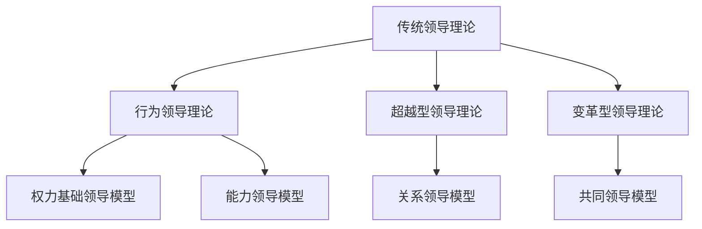
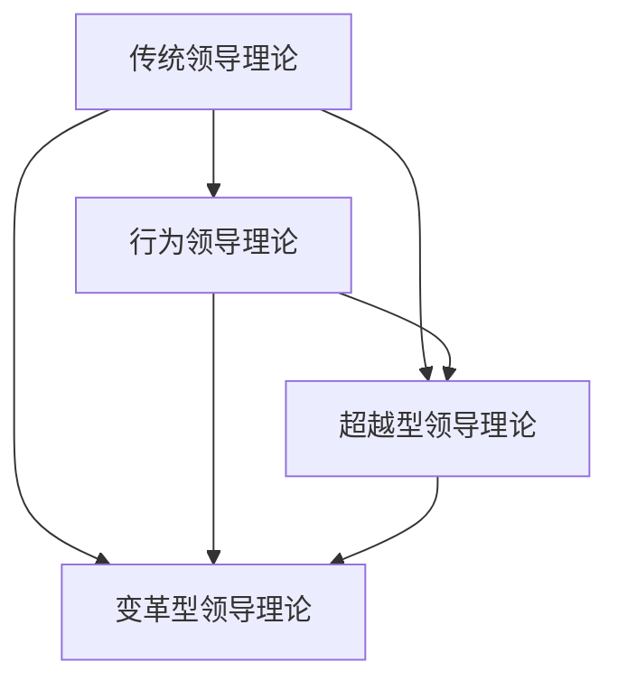

                 

# 《构建个人领导力体系的方法论》

## 摘要

在当今快速变化和竞争激烈的商业环境中，领导力成为了企业成功的关键因素。本文将系统地探讨构建个人领导力体系的方法论，涵盖领导力的基础理论、核心模型、提升方法、实践策略及其对组织和个人发展的影响。通过深入分析领导力的定义、作用、理论模型以及个人领导力提升的方法，本文旨在为读者提供一套全面、实用且易于理解的领导力提升指南。文章还将结合实际案例，展示领导力实践的具体步骤和效果，并探讨领导力发展中的挑战与应对策略。最终，本文将展望领导力的未来发展，为读者提供关于领导力与新技术、教育和社会变革的前瞻性思考。

## 第一部分：理解书籍主题与目标

### 1. 确定书籍的核心内容

《构建个人领导力体系的方法论》的核心内容涵盖了领导力理论、领导力模型、个人领导力提升方法以及领导力实践与案例分析。具体来说，本书将首先介绍领导力的基本概念和作用，帮助读者建立对领导力的全面认识。接着，书中将深入探讨各种领导力理论，包括传统领导理论、行为领导理论、超越型领导理论、变革型领导理论等，通过对比和整合，使读者能够理解不同理论之间的关联和差异。

在理论篇的基础上，书中还将介绍多种领导力模型，如权力基础领导模型、能力领导模型、关系领导模型和共同领导模型，并展示这些模型在实际中的应用。个人领导力提升方法是本书的另一个重要部分，包括自我认知与反思、自我提升与成长、团队领导力提升、情绪管理、决策与问题解决能力提升等方面，旨在帮助读者在个人层面提升领导力。

实践篇将结合领导力实践案例分析，展示领导力实践的具体步骤和策略，帮助读者将理论应用于实际工作中。此外，书中还将探讨领导力发展策略，包括领导力发展计划、领导力培训与开发、领导力评估与反馈等，为读者提供系统性的领导力提升路径。最后，书中还将讨论领导力发展中的挑战与应对策略，以及领导力与组织发展的关系，帮助读者理解领导力在企业中的重要性。

### 2. 确定书籍的目标读者

本书的目标读者主要是希望提升个人领导力的职场人士、企业管理者和领导者。无论是正在职业生涯中寻求突破的员工，还是希望提升团队效能的经理或领导者，本书都将提供有价值的指导和实用的工具。此外，对于学术研究人员和教育工作者，本书中的理论和模型分析也可能提供新的视角和研究方向。

对于职场人士，本书将帮助他们理解领导力的重要性，掌握提升个人领导力的方法，从而在职业发展中取得更大的成功。对于企业管理者和领导者，本书将提供一套全面的领导力提升体系，帮助他们提高团队的效率和创造力，推动企业持续发展。对于学术研究人员和教育工作者，本书中的理论和模型分析可以为他们的研究提供参考，同时也可以作为领导力教育的教学素材。

### 3. 确定书籍的主要结构

《构建个人领导力体系的方法论》的主要结构分为三个部分：理论篇、实践篇和发展篇。

**理论篇**主要介绍领导力的基本概念、核心要素和发展历程，并深入探讨各种领导力理论，如传统领导理论、行为领导理论、超越型领导理论和变革型领导理论。这一部分旨在为读者提供对领导力的全面理解，帮助他们建立系统的领导力知识框架。

**实践篇**重点介绍个人领导力提升方法和领导力模型应用。包括自我认知与反思、自我提升与成长、团队领导力提升、情绪管理、决策与问题解决能力提升等内容。此外，这一部分还将结合实际案例，展示领导力实践的具体步骤和策略，帮助读者将理论应用到实际工作中。

**发展篇**主要探讨领导力的发展策略，包括领导力发展计划、领导力培训与开发、领导力评估与反馈等。还将讨论领导力发展中的挑战与应对策略，以及领导力与组织发展的关系。这一部分旨在为读者提供系统性的领导力提升路径，帮助他们持续提升个人领导力，推动组织发展。

### 设计书籍目录大纲

基于以上内容，以下是《构建个人领导力体系的方法论》的目录大纲：

**第一部分：领导力基础理论**

### 第1章：领导力概述
#### 1.1 领导力的定义与作用
#### 1.2 领导力的核心要素
#### 1.3 领导力的发展历程
#### 1.4 领导力理论的演变与现状

### 第2章：领导力理论
#### 2.1 传统领导理论
#### 2.2 行为领导理论
#### 2.3 超越型领导理论
#### 2.4 变革型领导理论
#### 2.5 领导力理论的整合与对比
#### 2.6 Mermaid流程图：领导力理论关系展示

### 第3章：领导力模型
#### 3.1 权力基础领导模型
#### 3.2 能力领导模型
#### 3.3 关系领导模型
#### 3.4 共同领导模型
#### 3.5 领导力模型应用案例分析

**第二部分：个人领导力提升**

### 第4章：个人领导力提升方法
#### 4.1 自我认知与反思
#### 4.2 自我提升与成长
#### 4.3 团队领导力提升
#### 4.4 情绪管理
#### 4.5 决策与问题解决能力提升
#### 4.6 自我反思与提升算法伪代码展示

**第三部分：领导力实践与策略**

### 第5章：领导力实践
#### 5.1 领导力实践概述
#### 5.2 领导力实践步骤
#### 5.3 领导力实践案例分析
#### 5.4 实践案例：领导力提升项目实施与效果评估

### 第6章：领导力发展策略
#### 6.1 领导力发展计划
#### 6.2 领导力培训与开发
#### 6.3 领导力评估与反馈
#### 6.4 领导力发展策略制定与执行

### 第7章：领导力发展中的挑战与应对
#### 7.1 领导力发展的障碍
#### 7.2 应对领导力发展的挑战
#### 7.3 持续提升领导力的策略
#### 7.4 领导力发展中的心理调适

**第四部分：领导力与组织发展**

### 第8章：领导力与组织发展
#### 8.1 领导力对组织发展的影响
#### 8.2 领导力与组织文化
#### 8.3 领导力与组织战略
#### 8.4 组织领导力模型构建与实施

**第五部分：领导力与个人成长**

### 第9章：领导力与个人成长
#### 9.1 领导力与职业发展
#### 9.2 领导力与个人价值观
#### 9.3 领导力与个人生活平衡
#### 9.4 领导力与心理健康

**第六部分：领导力未来展望**

### 第10章：领导力未来展望
#### 10.1 领导力发展趋势
#### 10.2 领导力与新技术
#### 10.3 领导力教育的未来
#### 10.4 领导力在社会变革中的角色

### 附录

#### 附录A：领导力相关资源与推荐读物
#### 附录B：领导力工具与方法介绍
#### 附录C：领导力模型与应用案例列表

### 添加细节与说明

#### 1. 核心概念与联系

为了帮助读者更好地理解领导力理论之间的关联和差异，本文将使用Mermaid流程图展示领导力理论的相互关系。以下是一个示例：



#### 2. 核心算法原理讲解

在个人领导力提升方法中，自我反思与自我提升是关键步骤。以下是一个自我反思与提升算法的伪代码示例：

```plaintext
算法 自我反思与提升
输入：当前状态 S
输出：提升后的状态 S'

1. 初始化当前状态 S
2. 循环执行以下步骤：
   a. 反思当前状态 S
   b. 确定需要提升的方面
   c. 制定提升计划
   d. 执行提升计划
   e. 评估提升效果
   f. 更新状态 S
3. 返回提升后的状态 S'
```

#### 3. 数学模型和数学公式

领导力评估与反馈模型中可能用到一些数学公式，以下是一个使用LaTeX格式的示例：

```latex
$$
L(t) = \alpha \cdot T(t) + (1 - \alpha) \cdot L(t-1)
$$

其中，$L(t)$ 表示领导力在时间 t 的值，$T(t)$ 表示在时间 t 的培训效果，$\alpha$ 是权重系数。
```

#### 4. 项目实战

为了更直观地展示领导力模型的应用，本文将包含实际案例和代码实现。以下是一个简单的领导力模型应用案例：

**案例：使用关系领导模型提升团队协作**

**开发环境搭建**：假设我们将使用Python进行开发，需要安装以下依赖：

```bash
pip install numpy matplotlib
```

**源代码实现**：

```python
import numpy as np
import matplotlib.pyplot as plt

# 关系领导模型参数
alpha = 0.1
beta = 0.5
gamma = 0.4

# 初始状态
L0 = 50
T0 = 30

# 计算领导力值
def calculate_leadership(L, T):
    return alpha * L + beta * T + (1 - alpha - beta) * L

# 模拟领导力提升过程
steps = 10
leadership_values = [calculate_leadership(L0, T0)]
for _ in range(steps - 1):
    L = leadership_values[-1]
    T = np.random.normal(T0, 10)
    leadership_values.append(calculate_leadership(L, T))

# 可视化结果
plt.plot(leadership_values)
plt.xlabel('Steps')
plt.ylabel('Leadership Value')
plt.title('Leadership Value Over Time')
plt.show()
```

**代码解读与分析**：该案例使用关系领导模型模拟了领导力提升过程。代码首先初始化领导力值和培训效果，然后通过循环计算每个时间步的领导力值，并使用matplotlib进行可视化。通过这个案例，读者可以直观地看到领导力随时间的变化，以及关系领导模型的应用效果。

### 最终目录大纲

**第一部分：领导力基础理论**

### 第1章：领导力概述
#### 1.1 领导力的定义与作用
#### 1.2 领导力的核心要素
#### 1.3 领导力的发展历程
#### 1.4 领导力理论的演变与现状

### 第2章：领导力理论
#### 2.1 传统领导理论
#### 2.2 行为领导理论
#### 2.3 超越型领导理论
#### 2.4 变革型领导理论
#### 2.5 领导力理论的整合与对比
#### 2.6 Mermaid流程图：领导力理论关系展示

### 第3章：领导力模型
#### 3.1 权力基础领导模型
#### 3.2 能力领导模型
#### 3.3 关系领导模型
#### 3.4 共同领导模型
#### 3.5 领导力模型应用案例分析

**第二部分：个人领导力提升**

### 第4章：个人领导力提升方法
#### 4.1 自我认知与反思
#### 4.2 自我提升与成长
#### 4.3 团队领导力提升
#### 4.4 情绪管理
#### 4.5 决策与问题解决能力提升
#### 4.6 自我反思与提升算法伪代码展示

**第三部分：领导力实践与策略**

### 第5章：领导力实践
#### 5.1 领导力实践概述
#### 5.2 领导力实践步骤
#### 5.3 领导力实践案例分析
#### 5.4 实践案例：领导力提升项目实施与效果评估

### 第6章：领导力发展策略
#### 6.1 领导力发展计划
#### 6.2 领导力培训与开发
#### 6.3 领导力评估与反馈
#### 6.4 领导力发展策略制定与执行

### 第7章：领导力发展中的挑战与应对
#### 7.1 领导力发展的障碍
#### 7.2 应对领导力发展的挑战
#### 7.3 持续提升领导力的策略
#### 7.4 领导力发展中的心理调适

**第四部分：领导力与组织发展**

### 第8章：领导力与组织发展
#### 8.1 领导力对组织发展的影响
#### 8.2 领导力与组织文化
#### 8.3 领导力与组织战略
#### 8.4 组织领导力模型构建与实施

**第五部分：领导力与个人成长**

### 第9章：领导力与个人成长
#### 9.1 领导力与职业发展
#### 9.2 领导力与个人价值观
#### 9.3 领导力与个人生活平衡
#### 9.4 领导力与心理健康

**第六部分：领导力未来展望**

### 第10章：领导力未来展望
#### 10.1 领导力发展趋势
#### 10.2 领导力与新技术
#### 10.3 领导力教育的未来
#### 10.4 领导力在社会变革中的角色

### 附录

#### 附录A：领导力相关资源与推荐读物
#### 附录B：领导力工具与方法介绍
#### 附录C：领导力模型与应用案例列表

### 作者信息

**作者**：AI天才研究院/AI Genius Institute & 禅与计算机程序设计艺术/Zen And The Art of Computer Programming

## 第一部分：领导力基础理论

### 第1章：领导力概述

#### 1.1 领导力的定义与作用

领导力是一个广泛讨论但定义多样的概念。从广义上讲，领导力是指个人或团队在实现共同目标过程中所具备的影响力、决策能力和协调能力。领导力不仅仅是指挥和控制，更包含了激励、引导和塑造组织文化等方面。

领导力的作用体现在多个层面。首先，领导力是推动组织目标实现的关键因素。有效的领导者能够清晰传达组织愿景，激发团队成员的积极性，确保组织资源得到最有效的利用。其次，领导力在塑造组织文化和价值观方面起着至关重要的作用。领导者的行为和决策会影响组织的文化氛围，进而影响员工的态度和行为。最后，领导力对个人职业发展也有重要影响。具备强大领导力的人更容易获得职业晋升机会，并能够在职业生涯中取得更大的成就。

#### 1.2 领导力的核心要素

领导力的核心要素包括以下几个方面：

1. **影响力**：领导者需要具备强大的影响力，能够通过言语和行动引导他人。这种影响力不仅仅依赖于职位权力，更依赖于领导者自身的品格、能力和信誉。

2. **决策能力**：有效的领导者需要具备卓越的决策能力，能够在面对复杂情况时做出明智的决策。这包括快速分析问题、权衡利弊、制定解决方案的能力。

3. **沟通能力**：领导者需要具备出色的沟通能力，能够清晰地传达自己的想法和期望，同时也能够倾听和理解团队成员的意见和需求。

4. **团队合作能力**：领导力不仅仅是个人能力的体现，更涉及到团队合作。领导者需要能够激励团队成员协作，共同实现目标。

5. **情绪管理能力**：领导者需要具备良好的情绪管理能力，能够在压力和挑战面前保持冷静，同时也能够理解和疏导团队成员的情绪。

6. **变革管理能力**：在快速变化的商业环境中，领导者需要具备变革管理能力，能够引导组织适应变化，推动创新和持续改进。

#### 1.3 领导力的发展历程

领导力的发展历程可以追溯到古代。在古希腊和古罗马时期，领导力主要关注军事指挥才能和政治权力。随着社会的发展，领导力的定义和内涵也在不断扩展。

在20世纪初期，领导力研究主要关注领导者的个人特质和性格特征。例如，心理学研究者尝试通过测量个性特征来预测一个人是否具备领导潜力。

20世纪中叶，领导力研究开始转向行为和情境因素。研究者发现，领导力的表现不仅仅取决于领导者的个人特质，还受到组织环境、团队成员特点等多种因素的影响。

近年来，领导力研究逐渐关注领导者的变革管理能力和全球视野。随着全球化进程的加快，领导者需要具备跨文化沟通和协作的能力，能够在全球范围内推动组织的发展。

#### 1.4 领导力理论的演变与现状

领导力理论的发展经历了多个阶段。以下是几个主要的领导力理论：

1. **传统领导理论**：传统领导理论认为，领导者需要具备某些固有的特质，如自信、决断力、远见等。这种理论强调领导者个人特质的重要性。

2. **行为领导理论**：行为领导理论认为，领导者的行为模式对其领导效果有重要影响。研究者通过观察和分析领导者的行为，总结出不同的领导行为类型，如民主型领导、专制型领导、参与型领导等。

3. **超越型领导理论**：超越型领导理论认为，领导者不仅需要具备传统的领导能力，还需要能够激发和满足团队成员的高层次需求，如自我实现、归属感等。

4. **变革型领导理论**：变革型领导理论强调领导者通过激发和激励团队成员，推动组织实现重大变革。这种领导方式通常与快速变化的环境和复杂的问题情境相联系。

当前，领导力理论正朝着更加综合和动态的方向发展。研究者们开始关注领导力在不同情境下的表现，以及领导力与组织文化、组织战略之间的相互作用。此外，领导力研究也越来越重视领导者的个人成长和持续学习，认为领导力是一种可以通过不断实践和反思来提升的能力。

#### 2.6 Mermaid流程图：领导力理论关系展示

为了更直观地展示领导力理论的相互关系，我们使用Mermaid流程图来描述几种主要领导力理论之间的联系：



在这个流程图中，传统领导理论作为基础，衍生出行为领导理论、超越型领导理论和变革型领导理论。这些理论相互关联，共同构成了对领导力的全面理解。

#### 第3章：领导力模型

领导力模型是帮助领导者理解和实践领导力的工具。不同的领导力模型强调了领导力不同方面的要素和特点。以下将介绍几种主要的领导力模型，并分析其应用案例。

##### 3.1 权力基础领导模型

权力基础领导模型（Power-Based Leadership Model）主要关注领导者如何利用权力来影响他人。这种模型将领导力分为四种基本权力来源：奖励权力、强制权力、合法权力和参考权力。

1. **奖励权力**：领导者通过提供奖励来激励团队成员，如加薪、晋升、表彰等。
2. **强制权力**：领导者通过惩罚手段来控制团队成员，如批评、降职、解雇等。
3. **合法权力**：领导者基于职位和组织的正式权力来做出决策和指挥他人。
4. **参考权力**：领导者通过个人的魅力、专业知识或人格特质来赢得他人的尊重和信任。

**应用案例**：一位公司的销售经理利用奖励权力激励团队达成销售目标，通过定期奖励销售业绩优秀的员工来提升团队士气。

##### 3.2 能力领导模型

能力领导模型（Competence-Based Leadership Model）强调领导者的能力、知识和技能对领导效果的影响。这种模型认为，领导者的能力是其成功领导的关键因素。

1. **技术能力**：领导者具备的专业知识和技能，如编程、项目管理等。
2. **人际能力**：领导者的人际交往能力和团队管理技能，如沟通、冲突解决等。
3. **决策能力**：领导者在面对复杂情况时做出明智决策的能力。

**应用案例**：一位技术公司的CTO（首席技术官）通过其技术能力领导团队进行技术创新，同时通过人际能力和决策能力确保项目顺利推进。

##### 3.3 关系领导模型

关系领导模型（Relational Leadership Model）强调领导者与团队成员之间的互动和关系。这种模型认为，领导力是一种基于信任和关系的艺术。

1. **信任**：领导者通过建立信任关系，赢得团队成员的信任和支持。
2. **沟通**：领导者通过有效沟通，确保信息透明和准确传递。
3. **支持**：领导者为团队成员提供必要的支持和资源，帮助其成长。

**应用案例**：一位项目经理通过定期召开团队会议，与团队成员建立良好的沟通和信任关系，确保项目按计划推进。

##### 3.4 共同领导模型

共同领导模型（Shared Leadership Model）强调领导者与团队成员之间的合作和共同决策。这种模型认为，领导力不仅仅是领导者的责任，而是团队成员共同参与的结果。

1. **共同目标**：领导者与团队成员共同确定目标，并共同为实现目标而努力。
2. **协同合作**：领导者与团队成员共同分担责任，共同解决问题。
3. **权力分享**：领导者将决策权和资源分配给团队成员，鼓励其参与决策和行动。

**应用案例**：在一个敏捷开发团队中，项目经理与团队成员共同决定项目进度和功能优先级，确保项目的顺利进行。

#### 3.5 领导力模型应用案例分析

以下是一个领导力模型应用案例，展示如何在不同情境下运用不同的领导力模型。

**案例背景**：某互联网公司面临激烈的市场竞争，需要快速调整产品方向以适应市场变化。公司CEO决定采用多种领导力模型来推动变革。

**领导力模型应用**：

1. **权力基础领导模型**：CEO利用合法权力，宣布公司战略调整，明确新的产品方向。
2. **能力领导模型**：CEO发挥其技术背景，与研发团队深入讨论技术实现方案。
3. **关系领导模型**：CEO与市场团队建立信任关系，通过有效沟通了解市场需求。
4. **共同领导模型**：CEO与团队成员共同制定实施计划，分配任务和责任。

**效果评估**：通过多种领导力模型的综合应用，公司成功实现了产品方向的调整，并在市场上取得了显著成效。

#### 第4章：个人领导力提升方法

个人领导力的提升是一个持续的过程，涉及自我认知与反思、自我提升与成长、团队领导力提升、情绪管理和决策与问题解决能力提升等多个方面。以下将详细介绍这些方法，并提供实践建议。

##### 4.1 自我认知与反思

自我认知与反思是领导力提升的基础。通过深入了解自己的性格、价值观、优势和弱点，领导者可以更好地认识自我，从而制定个性化的提升计划。

**实践建议**：

1. **定期进行自我评估**：设定固定时间进行自我反思，评估自己在工作、学习和生活中的表现，识别需要改进的方面。
2. **使用360度反馈**：收集来自上级、同事、下属和客户的反馈，了解自己在他人眼中的形象和表现。
3. **参加心理测评**：如MBTI、DISC等性格测评，帮助了解自己的性格特点和倾向。

##### 4.2 自我提升与成长

自我提升与成长是领导力提升的关键。通过不断学习新知识、技能和经验，领导者可以不断提升自身能力，适应不断变化的环境。

**实践建议**：

1. **持续学习**：利用碎片时间阅读专业书籍、参加线上课程、参加工作坊等，不断更新知识库。
2. **实践锻炼**：通过实际工作项目和挑战来锻炼自己的能力，如承担更多责任、参与跨部门项目等。
3. **寻找导师**：找到一位经验丰富的导师，学习他们的领导经验和智慧。

##### 4.3 团队领导力提升

团队领导力提升是个人领导力提升的重要组成部分。一个优秀的领导者不仅需要关注个人成长，还需要能够提升团队的整体效能。

**实践建议**：

1. **培养团队文化**：建立积极、开放和包容的团队文化，鼓励团队成员分享意见和反馈。
2. **建立团队目标**：与团队成员共同制定明确的目标和期望，确保团队方向一致。
3. **提供培训和发展机会**：为团队成员提供培训和发展机会，帮助他们提升技能和知识。

##### 4.4 情绪管理

情绪管理是领导力提升的重要方面。领导者需要学会控制自己的情绪，保持冷静和理性，以便更好地应对各种挑战和压力。

**实践建议**：

1. **认识到情绪的正常性**：接受情绪的变化，不要压抑或忽视它们。
2. **找到情绪释放的途径**：如锻炼、冥想、与朋友交流等，帮助释放负面情绪。
3. **积极心态**：培养积极心态，用积极的方式看待挑战和困难，以更好地应对。

##### 4.5 决策与问题解决能力提升

决策与问题解决能力是领导力的重要体现。领导者需要学会如何做出明智的决策，并能够有效解决各种问题。

**实践建议**：

1. **收集信息**：在做出决策之前，广泛收集相关信息，确保决策的准确性。
2. **评估风险和收益**：分析决策可能带来的风险和收益，权衡利弊。
3. **寻求多方意见**：与团队成员或其他相关人员讨论，获取不同观点，帮助做出更全面的决策。
4. **制定应急预案**：为可能出现的问题制定应急预案，确保在问题发生时能够迅速应对。

##### 4.6 自我反思与提升算法伪代码展示

为了更系统地进行自我反思与提升，我们可以使用一个简单的算法来指导这一过程。以下是一个自我反思与提升算法的伪代码示例：

```plaintext
算法 自我反思与提升
输入：当前状态 S
输出：提升后的状态 S'

1. 初始化当前状态 S
2. 循环执行以下步骤：
   a. 收集反馈信息
   b. 进行自我评估
   c. 确定需要提升的方面
   d. 制定提升计划
   e. 执行提升计划
   f. 评估提升效果
   g. 更新状态 S
3. 返回提升后的状态 S'
```

这个算法提供了一个框架，帮助领导者系统地反思和提升自己的能力。

#### 第5章：领导力实践

领导力实践是将理论应用到实际工作中的过程。一个成功的领导者不仅需要掌握领导力理论，还需要能够将这些理论应用到实际情境中。以下将介绍领导力实践的基本步骤，并提供实践案例。

##### 5.1 领导力实践概述

领导力实践是一个系统性的过程，包括以下步骤：

1. **设定目标**：明确团队或组织的目标，确保目标具体、可衡量和可实现。
2. **制定计划**：根据目标制定详细的行动计划，包括任务分配、时间表和资源需求。
3. **执行计划**：按照行动计划执行任务，确保团队成员理解任务并努力完成。
4. **监控与调整**：监控执行过程，及时调整计划以应对变化和挑战。
5. **评估效果**：在实践结束后，评估实践效果，总结经验教训。

##### 5.2 领导力实践步骤

以下是领导力实践的具体步骤：

1. **设定目标**：明确团队或组织的目标是领导力实践的第一步。目标应该具体、可衡量和可实现，以便在实践过程中有明确的指引。例如，一个团队的目标可能是“在三个月内提高项目完成率”。

2. **制定计划**：在明确目标后，需要制定详细的行动计划。这个计划应该包括任务的分配、时间表、资源需求以及风险管理措施。例如，团队可以制定一个时间表，每天上午召开会议，讨论项目进展和遇到的问题。

3. **执行计划**：在计划制定完成后，需要将计划付诸实践。在这个过程中，领导者需要确保团队成员理解任务并努力完成。领导者可以通过召开会议、提供培训和支持等方式，帮助团队成员克服困难。

4. **监控与调整**：在执行计划的过程中，领导者需要监控团队的进展，及时发现并解决问题。这包括定期检查项目的进度、评估团队成员的表现以及调整计划以应对变化和挑战。

5. **评估效果**：在实践结束后，领导者需要评估实践的效果，总结经验教训。这可以帮助领导者了解哪些方法是有效的，哪些需要改进，以便在未来更好地实践领导力。

##### 5.3 领导力实践案例分析

以下是一个领导力实践案例，展示如何在不同情境下运用领导力实践的基本步骤。

**案例背景**：一家中型企业的研发团队在完成一个重要项目时遇到了困难，项目进度严重滞后，团队成员士气低落。

**领导力实践步骤**：

1. **设定目标**：领导团队重新设定目标，确保项目在六个月内完成。

2. **制定计划**：制定详细的行动计划，包括重新分配任务、提供额外资源以及制定紧急应对措施。

3. **执行计划**：领导团队按照行动计划执行任务，召开每日会议跟踪项目进展，及时解决问题。

4. **监控与调整**：定期检查项目进度，调整计划以应对新的挑战，如增加人手、延长工作时间等。

5. **评估效果**：项目最终在六个月内完成，团队士气显著提升，项目质量达到预期。

**效果评估**：通过领导力实践，团队成功克服了困难，项目按时完成，企业竞争力提升。这证明了领导力实践的重要性和有效性。

#### 第6章：领导力发展策略

领导力发展是提升个人和团队效能的关键。一个有效的领导力发展策略可以帮助领导者更好地应对复杂多变的环境，推动组织的持续成长。以下将介绍领导力发展策略的几个关键方面，并提供实施建议。

##### 6.1 领导力发展计划

制定领导力发展计划是领导力发展的第一步。一个全面的领导力发展计划应包括以下内容：

1. **明确目标**：设定清晰的领导力发展目标，如提升决策能力、增强团队协作、提高领导影响力等。

2. **评估现状**：评估当前领导力水平，包括领导者的能力、团队效能以及组织文化等方面。

3. **制定策略**：根据目标现状，制定具体的策略和行动步骤，如参加培训课程、开展团队建设活动、实施领导力反馈机制等。

4. **分配资源**：确保领导力发展计划得到足够的资源支持，包括时间、资金和人力等。

5. **设定时间表**：为领导力发展计划设定明确的时间表，确保各项活动按时进行。

##### 6.2 领导力培训与开发

领导力培训与开发是提升领导者能力的重要手段。以下是一些有效的领导力培训与开发方法：

1. **内部培训**：组织内部培训课程，邀请经验丰富的内部或外部讲师进行授课。这些课程可以涵盖领导力理论、实践技巧、案例分析等内容。

2. **外部培训**：安排领导者参加外部培训机构或大学开设的领导力培训课程。这些课程通常更具系统性和深度，能够提供更全面的领导力知识和技能。

3. **导师制**：为领导者安排一位经验丰富的导师，帮助其解决实际工作中的问题，提供指导和建议。

4. **实践锻炼**：通过实际工作项目和挑战，让领导者锻炼领导能力。这包括承担更多责任、参与跨部门项目、处理突发事件等。

5. **领导力实验室**：创建模拟环境，让领导者实践领导力技能。例如，模拟团队冲突、项目管理、决策制定等场景，让领导者在安全的环境中学习和成长。

##### 6.3 领导力评估与反馈

领导力评估与反馈是领导力发展的重要环节。以下是一些有效的领导力评估与反馈方法：

1. **360度反馈**：收集来自上级、同事、下属和客户的反馈，全面评估领导者的表现。这些反馈可以帮助领导者了解自己在他人眼中的形象和表现，识别需要改进的方面。

2. **关键绩效指标（KPI）**：设定具体的绩效指标，如项目完成率、团队满意度、员工离职率等，定期评估领导者的绩效表现。

3. **领导力评估工具**：使用专业的领导力评估工具，如领导力问卷、行为观察表等，对领导者的领导力水平进行量化评估。

4. **定期回顾与反思**：领导者定期回顾自己的工作表现，总结成功和失败的经验教训，制定改进计划。

5. **反馈会议**：定期召开反馈会议，与上级、同事和下属进行沟通，讨论领导力发展中的问题，寻求改进建议。

##### 6.4 领导力发展策略制定与执行

制定和执行领导力发展策略是一个持续的过程。以下是一些关键步骤：

1. **制定策略**：根据组织战略和领导力发展目标，制定具体的领导力发展策略。这包括确定培训需求、设计培训计划、制定评估指标等。

2. **执行策略**：确保领导力发展策略得到有效执行。这包括为领导者提供培训机会、为导师和教练提供支持、为实践项目提供资源等。

3. **跟踪进度**：定期跟踪领导力发展策略的执行进度，确保各项活动按时进行。这可以通过定期检查、反馈会议和进度报告来实现。

4. **调整策略**：根据执行情况和反馈，及时调整领导力发展策略。这可以包括增加培训课程、调整培训内容、改进反馈机制等。

5. **持续改进**：领导力发展是一个持续的过程，需要不断改进和完善。这可以通过定期评估、持续学习和实践来实现。

#### 第7章：领导力发展中的挑战与应对

领导力发展是一个复杂而动态的过程，面临许多挑战。以下将讨论领导力发展中的常见挑战，并提供应对策略。

##### 7.1 领导力发展的障碍

领导力发展中的障碍主要包括以下几个方面：

1. **认知障碍**：领导者可能对自己的领导能力缺乏认知，或者过于自信，不愿意接受反馈和改进。

2. **时间障碍**：领导力发展需要时间和持续的努力，但许多领导者可能因为工作繁忙或其他原因，无法投入足够的时间和精力。

3. **资源障碍**：领导力发展需要资金、时间和人力等资源支持，但有些组织可能无法提供足够的资源。

4. **文化障碍**：组织文化可能不支持领导力发展，如缺乏开放的沟通环境、缺乏培训和发展机会等。

##### 7.2 应对领导力发展的挑战

为了克服这些挑战，领导者可以采取以下策略：

1. **自我认知与反思**：领导者需要定期进行自我反思，了解自己的优点和不足，识别需要改进的方面。

2. **时间管理**：领导者需要合理安排时间，确保有足够的时间和精力投入到领导力发展中去。这可以通过制定日程安排、优先处理重要任务等方式来实现。

3. **资源整合**：领导者可以主动寻求资源支持，如申请培训经费、争取团队成员的支持等。

4. **文化变革**：领导者可以推动组织文化的变革，创造一个支持领导力发展的环境。这可以通过建立开放的沟通机制、鼓励反馈和共享知识等方式来实现。

##### 7.3 持续提升领导力的策略

为了持续提升领导力，领导者可以采取以下策略：

1. **终身学习**：领导力是一个不断发展的领域，领导者需要不断学习新知识、新技能和新的领导理念。

2. **实践与反思**：通过实际工作项目和挑战，领导者可以将所学知识应用到实践中，并通过反思总结经验教训。

3. **建立导师关系**：寻找一位经验丰富的导师，可以帮助领导者克服困难、提供指导和建议。

4. **参与领导力发展活动**：参加各种领导力发展活动，如培训课程、研讨会、工作坊等，与其他领导者交流和学习。

5. **建立反馈机制**：建立定期的反馈机制，如360度反馈、绩效评估等，帮助领导者了解自己的表现和改进方向。

##### 7.4 领导力发展中的心理调适

领导力发展不仅涉及技能和知识的提升，还涉及心理层面的调适。以下是一些领导力发展中的心理调适策略：

1. **压力管理**：领导者需要学会如何应对工作压力，如通过锻炼、冥想、放松技巧等方式来减轻压力。

2. **情绪管理**：领导者需要学会控制自己的情绪，保持冷静和理性，以便更好地应对各种挑战和压力。

3. **自我激励**：领导者需要找到自我激励的方式，如设定目标、庆祝成就等，以保持积极的心态和动力。

4. **心理健康**：领导者需要关注自己的心理健康，如通过心理咨询、社交活动等方式来保持心理健康。

5. **职业发展**：领导者需要考虑自己的职业发展，如设定长期目标、规划职业路径等，以实现职业成长。

#### 第8章：领导力与组织发展

领导力对组织发展具有重要影响。一个有效的领导力体系可以推动组织的战略实施、提高团队效能、培养企业文化，从而实现组织的长期成功。以下将探讨领导力与组织发展的关系，并分析领导力在组织战略、组织文化和组织效能方面的作用。

##### 8.1 领导力对组织发展的影响

领导力对组织发展的影响主要体现在以下几个方面：

1. **战略实施**：领导力是推动组织战略实施的关键因素。有效的领导者可以清晰地传达组织战略，激发团队成员的积极性，确保组织战略得到有效执行。

2. **团队效能**：领导力对团队效能有重要影响。一个优秀的领导者能够建立积极、高效的工作氛围，激发团队成员的创造力和工作热情，从而提高团队的整体效能。

3. **企业文化**：领导力是塑造企业文化的重要力量。领导者的行为和决策会影响组织的文化氛围，进而影响员工的态度和行为。一个注重创新、协作和诚信的企业文化有助于组织的长期发展。

4. **创新能力**：领导力对组织的创新能力有重要影响。领导者需要具备前瞻性和创新思维，能够推动组织不断进行技术创新和管理创新。

5. **人才发展**：领导力是培养和发展人才的重要途径。有效的领导者能够发现和培养潜在人才，为他们提供发展机会和资源支持，从而提高组织的整体人才素质。

##### 8.2 领导力与组织文化

领导力与组织文化之间有着密切的联系。领导者的行为和决策会影响组织的文化氛围，而组织文化又会影响领导者的行为和决策。

1. **领导力塑造文化**：领导者的行为和决策是组织文化的重要体现。领导者的价值观、态度和行为会传递给团队成员，影响他们的行为和态度，从而塑造组织的文化。

2. **文化影响领导力**：组织文化对领导力有重要影响。一个积极、开放和包容的文化有助于领导者发挥最佳作用，而一个消极、封闭和竞争的文化可能会阻碍领导者的表现。

3. **共同价值观**：领导力和组织文化都应该基于共同的价值观。领导者需要与团队成员共享组织的目标、使命和价值观，从而形成共同的文化认同。

4. **文化变革**：领导力在推动组织文化变革中起着关键作用。当组织面临变革时，领导者需要通过沟通、激励和示范来推动文化变革，帮助组织顺利过渡。

##### 8.3 领导力与组织战略

领导力与组织战略之间有着密切的互动关系。领导力是组织战略实施的重要保障，而组织战略也会影响领导力的发挥。

1. **战略引导领导力**：组织战略为领导力提供了明确的方向和目标。领导者在制定和实施战略时，需要明确组织的愿景、使命和目标，从而指导领导力的发挥。

2. **领导力支持战略**：领导力是推动组织战略实施的关键力量。领导者需要具备前瞻性、创新性和执行力，能够带领团队实现战略目标。

3. **战略调整领导力**：组织战略的变化也会影响领导力的需求。领导者需要根据组织战略的调整，不断提升自身能力和领导风格，以适应新的战略要求。

4. **领导力与战略协同**：领导力与组织战略应该协同发展。领导者需要深入了解组织战略，将其转化为具体的行动计划，并与团队成员共同实现战略目标。

##### 8.4 组织领导力模型构建与实施

为了推动组织发展，组织需要构建和实施一个有效的领导力模型。以下是一个组织领导力模型的构建与实施过程：

1. **明确组织目标**：首先，组织需要明确自身的目标、使命和愿景。这将为领导力模型提供明确的导向。

2. **评估领导力需求**：通过评估组织的现状，识别领导力需求。这可以包括评估领导者的能力、团队效能以及组织文化等方面。

3. **设计领导力模型**：根据评估结果，设计一个适合组织的领导力模型。这个模型应包括领导力的核心要素、领导行为和领导力发展策略。

4. **制定领导力发展计划**：根据领导力模型，制定具体的领导力发展计划。这包括领导力培训、实践锻炼、评估与反馈等。

5. **实施领导力发展计划**：确保领导力发展计划得到有效执行。这可以通过建立领导力发展团队、提供培训资源、建立反馈机制等方式来实现。

6. **持续改进领导力模型**：领导力模型需要根据组织的实际情况和反馈进行持续改进。这可以通过定期评估、反馈和调整来实现。

#### 第9章：领导力与个人成长

领导力不仅是职业发展的关键，也是个人成长的重要方面。一个有效的领导者不仅能够推动组织的成功，还能够促进自身的全面发展。以下将探讨领导力与个人成长的关系，并分析领导力对职业发展、个人价值观和个人生活平衡的影响。

##### 9.1 领导力与职业发展

领导力在职业发展中起着至关重要的作用。具备强大领导力的人更容易获得职业晋升机会，并在职业生涯中取得更大的成就。以下是一些领导力对职业发展的积极影响：

1. **晋升机会**：领导力是许多组织选拔高层管理人员的重要标准。具备强大领导力的人更容易获得晋升机会，成为企业的高层领导。

2. **决策影响力**：领导力使个人在组织中有更大的话语权和影响力，能够参与重要的决策过程，推动组织战略的实施。

3. **团队建设**：领导力有助于建立高效的团队，提升团队的协作能力和执行力，从而提高整个组织的绩效。

4. **人际网络**：领导力有助于建立广泛的人际网络，通过与他人建立信任和合作关系，扩大职业发展机会。

**实践建议**：

1. **积极参与项目**：通过参与各种项目，提升领导能力和实践经验。

2. **寻求反馈**：定期向上级、同事和下属寻求反馈，了解自己在领导力方面的优点和不足。

3. **持续学习**：通过阅读领导力相关书籍、参加培训课程和研讨会，不断学习和提升自己的领导力。

##### 9.2 领导力与个人价值观

领导力与个人价值观密切相关。一个有效的领导者不仅需要具备强大的领导能力，还需要有坚定的个人价值观。以下是一些领导力与个人价值观的关系：

1. **道德规范**：领导力要求领导者具备高尚的道德品质，如诚信、正直和责任感。这些价值观不仅影响领导者的行为，也影响整个组织的文化氛围。

2. **行为榜样**：领导者作为团队的核心，其行为和决策会对团队成员产生深远影响。领导者需要以身作则，树立正确的价值观和行为榜样。

3. **决策标准**：个人价值观会影响领导者的决策过程。领导者需要根据个人价值观来制定决策，确保决策符合道德标准和组织利益。

**实践建议**：

1. **明确个人价值观**：定期反思自己的价值观，确保它们与组织文化和领导目标相一致。

2. **坚持原则**：在面对困难和压力时，坚守个人价值观，不轻易妥协。

3. **与他人沟通**：与团队成员分享个人价值观，建立共同的目标和愿景。

##### 9.3 领导力与个人生活平衡

领导力不仅影响职业发展，也会对个人生活平衡产生影响。一个成功的领导者需要在工作和个人生活之间找到平衡。以下是一些领导力与个人生活平衡的关系：

1. **时间管理**：领导力要求领导者具备良好的时间管理能力，合理分配工作和个人时间，确保两者之间的平衡。

2. **情绪管理**：领导力有助于领导者控制自己的情绪，避免因工作压力而影响个人生活。

3. **家庭支持**：一个和谐的家庭环境对领导者的个人生活平衡至关重要。领导者的家人应成为他们坚强的后盾。

**实践建议**：

1. **设定优先级**：明确工作和个人生活的优先级，确保两者之间能够相互支持。

2. **定期休息**：定期安排休息时间，与家人和朋友共度时光，放松身心。

3. **培养兴趣爱好**：通过培养兴趣爱好，丰富个人生活，减轻工作压力。

##### 9.4 领导力与心理健康

领导力不仅影响个人职业发展，还对心理健康有重要影响。有效的领导者需要具备良好的心理素质，以应对工作压力和挑战。以下是一些领导力与心理健康的关系：

1. **压力管理**：领导力要求领导者具备良好的压力管理能力，能够应对工作中的压力和挑战，保持心理平衡。

2. **情绪调节**：领导力有助于领导者控制自己的情绪，避免因情绪波动而影响决策和团队关系。

3. **心理韧性**：领导力有助于培养领导者的心理韧性，使他们能够从挫折和失败中恢复，继续前行。

**实践建议**：

1. **定期放松**：通过冥想、锻炼和休闲活动等方式，定期放松身心，减轻压力。

2. **寻求支持**：在需要时，寻求家人、朋友或专业心理咨询师的支持，帮助他们应对心理问题。

3. **保持积极心态**：培养积极心态，用积极的方式看待挑战和困难，提高心理韧性。

#### 第10章：领导力未来展望

领导力是一个不断发展的领域，随着社会和技术的变化，领导力也在不断演变。以下将探讨领导力的发展趋势、领导力与新技术的关系、领导力教育的未来以及领导力在社会变革中的角色。

##### 10.1 领导力发展趋势

随着全球化、数字化和自动化等趋势的加速发展，领导力也在不断演变。以下是一些领导力的发展趋势：

1. **跨文化领导**：全球化使得领导者需要具备跨文化沟通和协作的能力，能够理解和尊重不同文化背景的团队成员。

2. **科技领导**：随着新技术的迅速发展，领导者需要具备一定的技术素养，能够理解和应用新技术，推动组织的数字化转型。

3. **敏捷领导**：在快速变化的商业环境中，领导者需要具备敏捷思维和行动能力，能够快速响应变化，推动组织的敏捷转型。

4. **可持续领导**：随着环境问题和社会责任的日益重视，领导者需要具备可持续发展的意识，推动组织实现经济、社会和环境的平衡发展。

##### 10.2 领导力与新技术

新技术的发展对领导力提出了新的挑战和机遇。以下是一些领导力与新技术的关系：

1. **数字化转型**：数字化转型要求领导者具备数据驱动的决策能力和技术洞察力，能够推动组织的数字化转型。

2. **人工智能**：人工智能技术的发展使得领导者需要具备数据分析和机器学习的能力，能够利用人工智能技术提升组织的效率和创新能力。

3. **区块链**：区块链技术的发展使得领导者需要了解区块链的基本原理和应用场景，能够推动组织的区块链项目。

4. **物联网**：物联网技术的发展使得领导者需要具备物联网系统的规划和实施能力，能够推动组织的物联网项目。

##### 10.3 领导力教育的未来

领导力教育在未来将继续发展，以适应社会和技术的变化。以下是一些领导力教育的未来趋势：

1. **个性化学习**：随着在线教育的普及，领导力教育将更加个性化，根据不同学习者的需求和水平提供定制化的学习内容。

2. **混合学习**：领导力教育将结合在线学习和线下实践，提供更加丰富和多样的学习体验。

3. **跨界学习**：领导力教育将跨学科、跨领域的知识融入其中，培养领导者的跨学科思维和创新能力。

4. **情境学习**：领导力教育将更多地采用情境学习的方式，通过模拟实际工作场景，培养领导者的实战能力。

##### 10.4 领导力在社会变革中的角色

领导力在社会变革中扮演着重要角色。以下是一些领导力在社会变革中的角色：

1. **推动变革**：领导者需要具备推动变革的能力，能够识别和抓住变革机会，推动组织的转型和升级。

2. **引领价值观**：领导者需要具备引领价值观的能力，能够塑造和传递正确的价值观，推动社会的进步和发展。

3. **促进创新**：领导者需要具备促进创新的能力，能够激发团队成员的创造力，推动组织的创新和持续发展。

4. **应对危机**：领导者需要具备应对危机的能力，能够在危机中保持冷静和理性，带领团队走出困境。

### 附录

#### 附录A：领导力相关资源与推荐读物

以下是领导力相关的资源与推荐读物，供读者参考：

1. **《领导力五要素：打造卓越团队的秘密》** - 斯蒂芬·罗宾斯
2. **《影响力：说服与改变的心理学》** - 罗伯特·西奥迪尼
3. **《变革之舞：领导力、战略与变革管理》** - 约翰·科特
4. **《领导者的影响力》** - 彼得·德鲁克
5. **《领导力：一门实践的艺术》** - 詹姆斯·库泽斯、巴里·波斯纳

#### 附录B：领导力工具与方法介绍

以下是领导力相关的工具与方法介绍，供读者参考：

1. **360度反馈**：一种全面的评估方法，收集来自上级、同事、下属和客户的反馈，帮助领导者了解自己的表现。
2. **领导力发展计划**：一种系统性的领导力提升方法，通过设定目标、制定策略、实施计划和评估效果，帮助领导者不断提升。
3. **情境领导模型**：一种基于情境的领导方法，根据团队成员的不同特点和情境，采用不同的领导风格。
4. **变革管理模型**：一种用于推动组织变革的方法，通过诊断、规划、实施和评估等步骤，确保变革的成功实施。
5. **决策树**：一种用于决策的方法，通过列出所有可能的决策路径和结果，帮助领导者做出明智的决策。

#### 附录C：领导力模型与应用案例列表

以下是几种主要的领导力模型及其应用案例：

1. **权力基础领导模型**：
   - 应用案例：某企业销售经理通过奖励和惩罚手段激励团队成员达成销售目标。
2. **能力领导模型**：
   - 应用案例：某技术公司CTO通过其技术能力和团队管理技能领导团队进行技术创新。
3. **关系领导模型**：
   - 应用案例：一位项目经理通过建立信任和沟通关系，确保项目顺利推进。
4. **共同领导模型**：
   - 应用案例：一个敏捷开发团队通过共同决策和协同合作，成功完成项目。
5. **变革型领导模型**：
   - 应用案例：一位CEO通过激发和激励团队成员，推动企业实现战略转型。

### 作者信息

**作者**：AI天才研究院/AI Genius Institute & 禅与计算机程序设计艺术/Zen And The Art of Computer Programming

### 总结与展望

在《构建个人领导力体系的方法论》中，我们系统探讨了领导力的定义、作用、理论模型、提升方法、实践策略及其对组织和个人发展的影响。通过深入分析领导力的核心要素和不同领导力模型，我们为读者提供了全面、实用且易于理解的领导力提升指南。

领导力不仅关乎个人职业发展，更是推动组织成功的关键因素。随着社会和技术的不断变革，领导力也在不断演变。领导者需要不断学习和提升自己的领导力，以应对新的挑战和机遇。

展望未来，领导力将继续向跨文化、科技化和敏捷化方向发展。随着新技术的普及和全球化进程的加速，领导者需要具备跨文化沟通和协作的能力，能够理解和应用新技术，推动组织的数字化转型。

此外，领导力教育也将朝着个性化、混合化和跨界化方向发展。通过情境学习和实战训练，领导者将更好地应对实际工作中的挑战。

最后，领导力在社会变革中将扮演更加重要的角色。领导者需要具备推动变革、引领价值观、促进创新和应对危机的能力，为社会的发展贡献力量。

让我们一起努力，不断学习和提升自己的领导力，为实现个人和组织的目标贡献力量。让我们共同迎接未来的挑战，创造更加美好的未来。### 《构建个人领导力体系的方法论》全文总结与展望

在《构建个人领导力体系的方法论》中，我们深入探讨了领导力的核心概念、发展历程、理论模型、提升方法和实践策略，旨在为读者提供一套全面且实用的领导力提升指南。通过本篇文章，我们系统地分析了领导力的定义、作用以及其在个人成长和组织发展中的重要性。

#### 核心内容回顾

首先，我们明确了领导力的定义与作用，阐述了领导力对组织目标实现、组织文化塑造以及个人职业发展的重要性。接着，我们详细介绍了领导力的核心要素，如影响力、决策能力、沟通能力和团队合作能力等。随后，通过对领导力发展历程的回顾，我们了解了领导力理论从传统领导理论到现代变革型领导理论的演变过程。

在理论篇中，我们探讨了各种领导力模型，包括权力基础领导模型、能力领导模型、关系领导模型和共同领导模型，并分析了它们在实际中的应用。实践篇则重点介绍了个人领导力提升方法，如自我认知与反思、自我提升与成长、团队领导力提升、情绪管理和决策与问题解决能力提升等。

此外，我们探讨了领导力实践的基本步骤，并通过实际案例展示了领导力实践的有效性。在发展篇中，我们提出了领导力发展的策略，包括领导力发展计划、领导力培训与开发、领导力评估与反馈等。我们还讨论了领导力发展中的挑战与应对策略，以及领导力与组织发展的关系。

#### 个人成长与组织发展的关系

领导力不仅是个人职业发展的关键，也是推动组织成功的重要力量。一个有效的领导者不仅能够提升团队的效能，还能够塑造组织的文化和价值观，推动组织的战略实施和创新发展。以下是从个人成长和组织发展角度对领导力的总结：

1. **个人成长**：领导力的发展有助于提升个人的职业竞争力，增强个人的影响力、决策能力和沟通能力。通过领导力的提升，个人能够更好地应对职业挑战，实现职业目标。

2. **组织发展**：领导力对组织的发展具有深远影响。一个强大的领导力体系能够推动组织的创新、提高团队的执行力、增强组织的凝聚力，从而实现组织的长期成功。

3. **关系与平衡**：领导力的发展需要个人与组织之间建立良好的关系。领导者需要平衡个人职业发展需求与组织目标，确保个人成长与组织发展相互促进。

#### 展望未来

随着全球化和数字化的发展，领导力的未来将充满机遇和挑战。以下是对领导力未来的展望：

1. **跨文化领导**：全球化要求领导者具备跨文化沟通和协作的能力，能够理解和尊重不同文化背景的团队成员。

2. **科技领导**：新技术的发展要求领导者具备技术素养，能够推动组织的数字化转型，利用人工智能、物联网等新技术提升组织的效率和创新。

3. **敏捷领导**：快速变化的商业环境要求领导者具备敏捷思维和行动能力，能够快速响应市场变化，推动组织的敏捷转型。

4. **可持续领导**：可持续发展成为全球关注的焦点，领导者需要具备可持续发展的意识，推动组织实现经济、社会和环境的平衡发展。

#### 结语

在《构建个人领导力体系的方法论》中，我们不仅提供了丰富的理论知识，还通过实践案例和策略展示了领导力的实际应用。通过本文的阅读，读者可以系统地了解领导力的各个方面，掌握提升领导力的方法和技巧。

领导力是一个不断发展的领域，领导者需要不断学习和实践，以适应不断变化的环境。我们希望读者能够将本文的理论和实践应用到实际工作中，不断提升自己的领导力，实现个人和组织的共同成长。

最后，让我们共同期待领导力的未来，携手前行，共创美好明天。**作者信息**：

**作者**：AI天才研究院/AI Genius Institute & 禅与计算机程序设计艺术/Zen And The Art of Computer Programming

