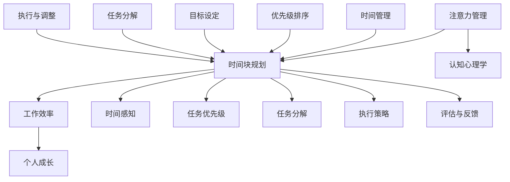

                 

### 第一部分：注意力管理与时间块规划概述

注意力管理和时间块规划是提高工作效率和个人成长的关键策略。在这个快节奏、信息过载的时代，如何有效地管理我们的注意力，规划我们的时间，以实现最大的产出，成为一个值得深入探讨的话题。本文将详细探讨这两个核心概念，并提供实用的策略和工具，帮助读者在工作和生活中实现高效的时间管理。

#### 第1章：注意力管理与时间块规划引言

##### 1.1 注意力管理与时间块规划的重要性

注意力管理（Attention Management）是关注个体如何集中和分配注意力，以实现最佳的工作和学习效果。时间块规划（Time Blocking）则是一种时间管理策略，通过将时间划分为不同的块，来安排和执行任务。这两个概念在现代工作和生活中具有重要意义：

- **注意力管理**：在信息过载的环境下，注意力分散是一个普遍问题。通过注意力管理，我们可以减少干扰，提高专注力，从而提高工作质量。

- **时间块规划**：时间块规划可以帮助我们更清晰地了解任务的优先级，提高时间利用率，减少拖延现象。

##### 1.2 本书结构安排

本书共分为八个部分，旨在为读者提供一个全面、系统的注意力管理和时间块规划的学习框架：

1. **第一部分**：概述注意力管理和时间块规划的基本概念。
2. **第二部分**：深入探讨注意力管理原理。
3. **第三部分**：介绍时间块规划策略。
4. **第四部分**：结合实践案例，讲解如何应用这些策略。
5. **第五部分**：探讨高级技巧和策略。
6. **第六部分**：分析心理因素对注意力管理和时间管理的影响。
7. **第七部分**：提供实用的实践技巧。
8. **第八部分**：总结与展望。

##### 1.3 核心概念与联系

注意力管理和时间块规划的核心概念包括：

- **注意力类型**：选择性注意力、持续注意力等。
- **时间块类型**：固定时间块、弹性时间块等。
- **注意力分散与干扰**：原因与对策。
- **时间感知与时间管理**：理解时间感知的重要性。

这些概念之间存在着紧密的联系。注意力管理直接影响时间块规划的有效性，而时间块规划则可以为注意力管理提供结构化的支持。

##### 1.4 本章小结

通过本章的介绍，我们了解了注意力管理和时间块规划的基本概念及其重要性。接下来，我们将进一步深入探讨这些概念，并学习如何将它们应用于实际工作和生活中。

---



---

### 第2章：注意力管理原理

注意力管理是提高工作效率和个人能力的关键因素。本章将详细介绍注意力管理的核心概念、类型、分散原因及对策，并探讨一些有效的注意力管理策略。

#### 2.1 注意力概述

注意力是指人们集中精力处理特定信息的能力。在认知心理学中，注意力被视为一种有限的资源，其管理对于提高认知效率和决策质量至关重要。注意力不仅影响我们的工作学习，还影响我们的日常生活质量。

#### 2.2 注意力类型

注意力可以分为以下几种类型：

- **选择性注意力**：是指个体在众多信息中，有目的地选择关注某一特定信息的能力。这种注意力有助于我们在信息过载的环境中筛选重要信息。
- **持续注意力**：是指个体在长时间内保持对特定任务或活动的关注。这种注意力对于需要长时间集中精力的工作尤为重要。
- **分配注意力**：是指个体同时处理多个任务或信息的能力。这种注意力在多任务处理中显得尤为重要。

#### 2.3 注意力分散与干扰

注意力分散是指个体在执行任务时，由于外部或内部干扰而失去注意力集中状态的现象。常见的原因包括：

- **外部干扰**：如电话、消息、社交媒体等。
- **内部干扰**：如疲劳、焦虑、情绪波动等。

注意力分散的后果包括降低工作效率、增加错误率、延长完成任务的时间。

#### 2.4 注意力管理策略

为了提高注意力，我们可以采取以下策略：

- **番茄工作法**：将工作时间划分为25分钟的工作块，每个工作块后休息5分钟。这种方法有助于集中注意力，同时避免过度疲劳。
- **深度工作**：在一个无干扰的环境中，专注于一项任务，直到完成。这种方法适用于需要高度集中精力的任务。
- **环境优化**：创造一个有利于专注的工作环境，减少外部干扰。例如，关闭社交媒体通知、保持工作区域整洁等。
- **时间块规划**：通过时间块规划，合理安排任务和时间，减少任务切换带来的注意力分散。

#### 2.5 注意力管理伪代码

以下是一个简单的注意力管理伪代码示例，用于指导用户如何通过设定工作时间和休息时间来管理注意力。

```python
def manage_attention(work_time, break_time):
    while True:
        # 工作时间
        for minute in range(work_time * 60):
            if is_distracted():
                reduce_distraction()
            process_work()
        
        # 休息时间
        for minute in range(break_time * 60):
            rest()
        
        # 询问用户是否继续工作
        if not continue_working():
            break

def process_work():
    # 处理工作任务的代码
    pass

def reduce_distraction():
    # 减少干扰的代码
    pass

def rest():
    # 休息的代码
    pass

def continue_working():
    # 询问用户是否继续工作的代码
    return input("是否继续工作？(y/n)")
```

#### 2.6 本章小结

注意力管理是提高工作效率和个人能力的关键。通过了解注意力的类型、分散原因及对策，以及掌握一些有效的注意力管理策略，我们可以更好地利用注意力资源，提高工作和生活质量。在下一章中，我们将探讨时间块规划的基本概念和策略。

### 第3章：时间块规划策略

时间块规划是一种有效的时间管理策略，通过将时间划分为不同的块，合理安排任务和休息时间，以提高工作效率和生活质量。本章将详细介绍时间块规划的基本概念、原理、步骤及实例。

#### 3.1 时间块规划概述

时间块规划（Time Blocking）是一种将时间划分为固定或弹性时间块，以完成特定任务或活动的策略。这种方法可以帮助我们更好地集中注意力，减少任务切换带来的干扰，从而提高工作效率。

时间块规划与传统的时间管理方法不同，后者通常更侧重于任务的顺序和截止日期。而时间块规划则强调在特定的时间段内专注于一项任务，以实现更高的产出。

#### 3.2 时间块规划原理

时间块规划的原理基于以下几点：

- **专注力**：通过将时间划分为固定的时间块，我们可以更好地集中注意力，减少任务切换带来的干扰。
- **任务优先级**：时间块规划可以帮助我们明确任务的优先级，确保关键任务在最优的时间段内完成。
- **弹性**：通过设置弹性时间块，我们可以更好地适应突发事件，保持工作流程的连续性。

#### 3.3 时间块规划步骤

以下是时间块规划的基本步骤：

1. **任务分解**：将所有任务分解为具体的子任务，明确每个任务的目标和时间需求。
2. **优先级排序**：根据任务的重要性和紧急程度，对任务进行排序。
3. **时间块划分**：将时间划分为固定或弹性时间块，每个时间块专注于一项任务。
4. **执行与调整**：在规定的时间块内完成任务，并根据实际情况进行调整。

#### 3.4 时间块规划实例

以下是一个实际的时间块规划实例，假设我们需要在一天内完成以下任务：

1. 上午9:00-11:00：撰写报告
2. 上午11:00-12:00：处理邮件
3. 下午1:00-3:00：开发代码
4. 下午3:00-4:00：会议
5. 下午4:00-5:00：阅读书籍
6. 下午5:00-6:00：锻炼

根据任务的重要性和紧急程度，我们可以将时间块规划如下：

- **上午**：
  - 9:00-9:15：准备工作（设置环境、查看任务清单）
  - 9:15-11:00：撰写报告（专注工作，减少干扰）
  - 11:00-11:15：休息与调整（喝水、休息）
  - 11:15-12:00：处理邮件（快速回复，不拖延）

- **下午**：
  - 1:00-3:00：开发代码（专注工作，减少干扰）
  - 3:00-3:15：休息与调整（喝水、休息）
  - 3:15-4:00：会议（提前准备，确保高效）
  - 4:00-5:00：阅读书籍（放松大脑，提升知识）
  - 5:00-6:00：锻炼（放松身体，提高健康）

#### 3.5 时间块规划伪代码

以下是一个简单的伪代码示例，用于指导用户如何创建并执行时间块规划。

```python
def time_block Planning(tasks, blocks):
    for block in blocks:
        start_time = block['start_time']
        end_time = block['end_time']
        task = block['task']
        
        while current_time() < end_time:
            if current_time() >= start_time:
                execute_task(task)
            else:
                prepare_task(task)
            
            update_progress(task)
            
        finish_task(task)
        
    return "All tasks completed."

def execute_task(task):
    # 执行任务的代码
    pass

def prepare_task(task):
    # 准备任务的代码
    pass

def update_progress(task):
    # 更新任务进度的代码
    pass

def finish_task(task):
    # 完成任务的代码
    pass

def current_time():
    # 获取当前时间的代码
    return now()
```

#### 3.6 本章小结

时间块规划是一种有效的时间管理策略，通过将时间划分为固定或弹性时间块，我们可以更好地集中注意力，提高工作效率。本章介绍了时间块规划的基本概念、原理、步骤及实例，并提供了一个伪代码示例。在下一章中，我们将结合实践案例，探讨如何将注意力管理和时间块规划应用于个人和团队管理。

### 第4章：注意力管理与时间块规划的实践应用

在上一章中，我们介绍了注意力管理和时间块规划的基本概念和策略。为了更好地理解这些策略如何在实际中应用，本章将通过个人和团队案例，探讨注意力管理和时间块规划的实践效果。

#### 4.1 个人案例分析

李华是一名软件工程师，他常常感到工作压力很大，工作效率低下。为了改善这一状况，李华开始尝试使用注意力管理和时间块规划策略。

**案例1：李华的注意力管理实践**

1. **选择合适的工作环境**：李华找到了一个安静、无干扰的办公室，减少了外部干扰。
2. **使用番茄工作法**：李华将工作时间划分为25分钟的工作块，每个工作块后休息5分钟。这种方法帮助他提高了专注力，减少了疲劳。
3. **制定任务清单**：李华每天开始工作前，会列出任务清单，并按照优先级进行排序。这样他可以明确知道每天需要完成的任务，从而减少任务切换带来的干扰。

**案例2：李华的时间块规划实践**

1. **制定每日时间块计划**：李华将每天的工作时间划分为固定的时间块，每个时间块专注于一项任务。例如，上午9:00-11:00专注于编码，下午1:00-3:00专注于技术文档撰写。
2. **设置弹性时间块**：李华预留了一些弹性时间块，以应对突发事件。例如，下午3:00-4:00为会议时间块，他会在这一时间块内处理任何紧急的会议安排。
3. **定期回顾和调整**：李华每周会回顾自己的时间块计划，评估哪些策略有效，哪些需要改进。根据实际情况进行调整，以确保时间块计划的有效性。

通过实践注意力管理和时间块规划，李华的工作效率有了显著提高，他能够更专注于任务，减少干扰，从而更快地完成任务。同时，他也感到工作压力减轻，生活质量得到了改善。

#### 4.2 团队协作中的注意力管理与时间块规划

除了个人实践，注意力管理和时间块规划在团队协作中也具有重要意义。以下是一个团队案例，展示了如何将注意力管理和时间块规划应用于团队管理。

**案例：一个软件开发团队的实践**

1. **团队会议时间块规划**：该团队每周举行一次团队会议，时间固定在每周五下午3:00-4:00。会议开始前，团队领导会提前通知会议议程和需要讨论的议题，确保团队成员能够有充足的时间准备。
2. **任务分配与时间块规划**：团队成员根据任务的重要性和优先级，将任务划分为固定的时间块。例如，一个重要的功能开发任务可能被划分为每天4小时的固定时间块，团队成员在这一时间块内专注于该任务，确保高效完成。
3. **团队休息与调整**：团队领导会定期安排团队休息时间，确保团队成员有足够的休息和调整时间，以维持高水平的注意力。
4. **团队协作工具**：团队使用协作工具（如Trello、JIRA等）来跟踪任务进度和分配，确保团队成员能够及时了解任务状态，提高协作效率。

通过这些实践，该团队在任务完成率和团队协作方面取得了显著提升。团队成员能够更专注于任务，减少干扰，从而提高工作效率。同时，团队领导也能够更好地管理团队时间和任务进度，确保项目按计划顺利进行。

#### 4.3 注意力管理与时间块规划的误区与调整

尽管注意力管理和时间块规划具有显著的效益，但在实际应用中也存在一些误区和挑战。以下是一些常见的误区及其调整策略：

1. **过度依赖工具**：一些人在尝试时间块规划时，可能会过分依赖各种工具和应用程序。这可能会导致过度关注工具的使用，而忽视了实际的工作效率。**调整策略**：选择适合自己的工具，并在实践中不断调整，确保工具真正帮助到工作，而不是成为负担。

2. **忽略任务优先级**：在时间块规划中，任务优先级是一个关键因素。如果忽略任务优先级，可能会导致重要任务被延误。**调整策略**：在规划时间块时，明确任务的重要性和优先级，确保优先级高的任务得到充分的时间和关注。

3. **时间块规划过于严格**：一些人在尝试时间块规划时，可能会设置过于严格的时间块，导致无法灵活应对突发事件。**调整策略**：设置弹性时间块，以应对不可预见的情况，确保工作流程的连续性。

4. **缺乏定期回顾**：定期回顾是时间块规划中不可或缺的一部分。如果缺乏回顾，就很难发现和解决问题。**调整策略**：定期回顾时间块规划的效果，并根据实际情况进行调整，以确保持续改进。

#### 4.4 实践应用小结

通过个人和团队的实践案例，我们可以看到注意力管理和时间块规划在实际应用中的显著效益。这些策略不仅提高了个人和团队的工作效率，还改善了生活质量。然而，实际应用中也存在一些误区和挑战，需要通过不断的实践和调整来克服。在下一章中，我们将进一步探讨注意力管理和时间块规划的高级技巧，以帮助读者进一步提升工作效率。

### 第5章：注意力管理与时间块规划的高级技巧

在了解了注意力管理和时间块规划的基本概念和实践之后，本章将深入探讨一些高级技巧和策略，以帮助读者在提高工作效率和个人成长方面取得更大的进步。

#### 5.1 高级注意力管理技巧

**1. 多任务处理**

多任务处理（Multitasking）是一种在短时间内同时处理多个任务的能力。虽然多任务处理在表面上看似乎能够提高效率，但实际研究表明，频繁的任务切换会降低注意力和工作质量。然而，在某些特定情境下，多任务处理也是有效的。以下是一些高级技巧：

- **任务切换策略**：在处理高优先级任务时，避免频繁切换到低优先级任务。
- **时间隔离**：为每个任务设置固定的时间块，确保在时间块内专注处理该任务，避免中途切换。
- **高效任务切换**：在切换任务时，尽量快速地准备好所需资源和信息，以减少切换时间。

**2. 注意力循环**

注意力循环（Attention Cycle）是指个体在不同类型的注意力之间切换的过程。注意力循环可以帮助我们更好地管理注意力和时间。以下是一些高级技巧：

- **循环规划**：将一天的时间划分为不同的注意力循环，如注意力高度集中的深度工作循环、中等专注度的任务处理循环和低度专注度的休息循环。
- **周期性休息**：在每个循环结束后，进行短暂的休息，以恢复注意力和精神状态。

**3. 自我监控与反馈**

自我监控与反馈是注意力管理的重要组成部分。以下是一些高级技巧：

- **注意力日志**：记录每天的注意力集中情况，分析分散原因，制定改进策略。
- **注意力监测工具**：使用注意力监测工具（如Focus@Will、Forest等），了解自己的注意力分布，并作出相应的调整。

#### 5.2 高级时间块规划策略

**1. 弹性时间块**

弹性时间块（Flexible Time Blocks）是在时间块规划中引入灵活性的一种策略。以下是一些高级技巧：

- **动态调整**：根据任务的重要性和突发情况，动态调整时间块的长度和内容。
- **预留缓冲时间**：在每个时间块之间预留一定的缓冲时间，以应对意外情况和任务延迟。

**2. 周期性回顾**

周期性回顾（Periodic Review）是确保时间块规划持续有效的重要环节。以下是一些高级技巧：

- **每周回顾**：每周定期回顾时间块规划的效果，总结经验教训，并根据实际情况进行调整。
- **季度回顾**：每季度进行更全面的回顾，评估长期目标和计划，确保与个人和职业发展目标保持一致。

**3. 集中注意力周期**

集中注意力周期（Focus Cycles）是一种通过连续专注于一个任务来提高效率的策略。以下是一些高级技巧：

- **专注时段**：选择连续几个小时的时间段，专注于一项重要任务，避免其他干扰。
- **专注状态记录**：记录在专注时段内的进展和遇到的问题，以便后续回顾和改进。

#### 5.3 高级技巧案例分析

**案例：一位高级项目经理的实践经验**

李明是一位资深项目经理，他在项目管理中广泛应用了注意力管理和时间块规划的高级技巧。以下是他的一些实践经验：

- **注意力管理**：
  - 使用注意力日志记录每日工作重点和注意力集中情况，分析分散原因。
  - 采用注意力循环策略，将一天划分为专注工作、任务处理和休息三个阶段。
  - 使用专注状态记录工具，监控自己的注意力分布，并调整工作方式。

- **时间块规划**：
  - 制定每日时间块计划，确保关键任务在最佳时间段内完成。
  - 预留缓冲时间，以应对任务延迟和突发事件。
  - 定期进行回顾和调整，确保时间块规划的有效性。

通过这些高级技巧，李明显著提高了工作效率，确保了项目按计划顺利进行。同时，他也发现自己能够在工作中保持更高的专注力和精神状态。

#### 5.4 高级技巧小结

高级技巧和策略为注意力管理和时间块规划提供了更灵活和高效的解决方案。通过多任务处理、注意力循环、自我监控与反馈、弹性时间块、周期性回顾和集中注意力周期等高级技巧，我们可以更好地管理注意力和时间，提高工作效率和个人成长。在下一章中，我们将探讨心理因素对注意力管理和时间管理的影响，以及如何通过心理策略来提高个人效率。

### 第6章：注意力管理与时间块规划的心理因素

注意力管理和时间块规划的成败不仅取决于技术和策略，还受到心理因素的影响。情绪、压力、疲劳等心理因素如何影响我们的注意力和时间管理，以及如何通过心理策略来调节这些因素，是本章要探讨的内容。

#### 6.1 心理因素对注意力管理的影响

情绪、压力和疲劳是影响注意力管理的三大心理因素：

- **情绪**：情绪波动会影响我们的注意力集中度。例如，焦虑和愤怒等负面情绪会导致注意力分散，影响工作效率。
- **压力**：长期的工作和生活压力会导致疲劳，降低注意力水平。高压力环境下的个体往往难以保持长时间的专注。
- **疲劳**：身体和心理疲劳会导致注意力下降，增加错误率和失误率。长期缺乏休息会导致慢性疲劳，严重影响工作和生活质量。

#### 6.2 时间感知与时间管理

时间感知（Time Perception）是心理因素中一个重要方面，它影响我们对时间的感知和管理：

- **时间膨胀**：在焦虑或压力下，时间感知会变慢，感觉时间延长。这会导致拖延，影响任务完成。
- **时间压缩**：在高度集中注意力时，时间感知会变快，感觉时间缩短。这有助于提高工作效率，但可能导致疲劳。

#### 6.3 心理策略对注意力管理和时间管理的影响

以下是一些有效的心理策略，可以帮助我们调节心理因素，提高注意力管理和时间管理能力：

**1. 情绪调节策略**

- **正念冥想**：通过正念冥想，我们可以提高情绪管理能力，减少焦虑和压力。
- **情绪记录**：记录自己的情绪变化，分析情绪波动的原因，并采取相应措施进行调节。

**2. 压力管理策略**

- **时间规划**：合理规划时间和任务，避免过度压力。
- **休息与放松**：定期进行休息和放松活动，如深呼吸、瑜伽、阅读等，以缓解压力。

**3. 疲劳管理策略**

- **充足睡眠**：保持充足的睡眠，确保身体和心理的恢复。
- **规律作息**：建立规律的作息习惯，避免过度疲劳。

**4. 时间感知调节策略**

- **专注练习**：通过专注练习，提高对时间的感知和管理能力。
- **时间感知训练**：使用计时工具，如番茄钟，训练自己更好地管理时间。

#### 6.4 心理测试与自我评估

为了更好地了解自己的心理状态，我们可以使用一些心理测试工具进行自我评估。以下是一些常用的测试工具：

- **压力测试**：评估自己的压力水平，了解压力来源。
- **情绪测试**：了解自己的情绪状态，识别情绪管理中的问题。
- **注意力测试**：评估自己的注意力集中度，发现注意力分散的原因。

通过这些测试，我们可以更准确地了解自己的心理状态，并采取相应的策略进行调节。

#### 6.5 心理因素小结

心理因素对注意力管理和时间管理有着重要的影响。情绪、压力和疲劳等心理因素会影响我们的注意力集中度和时间感知。通过情绪调节、压力管理、疲劳管理和时间感知调节等心理策略，我们可以更好地管理自己的心理状态，提高注意力管理和时间管理能力。在下一章中，我们将提供一些实用的实践技巧，帮助读者将注意力管理和时间块规划策略应用到日常生活中。

### 第7章：注意力管理与时间块规划的实践技巧

在了解了注意力管理和时间块规划的理论和策略之后，本章将提供一系列实用的实践技巧，帮助读者将所学知识应用到日常生活中，并实现高效的时间管理。

#### 7.1 实践技巧介绍

以下是一些实用的注意力管理和时间块规划技巧：

**1. 制定个人计划**

- **明确目标**：首先明确个人目标和任务，确定哪些任务是最重要和最紧急的。
- **分解任务**：将大任务分解为小任务，制定详细的行动计划。
- **设置优先级**：根据任务的重要性和紧急程度，设置优先级，确保关键任务得到优先处理。

**2. 创建时间日志**

- **记录时间**：每天记录自己的活动和时间分配，了解时间如何被使用。
- **分析时间使用**：通过时间日志分析，找出时间浪费的地方，并采取措施进行改进。

**3. 使用时间管理工具**

- **时间管理软件**：使用时间管理软件（如Trello、Asana等），帮助规划任务和跟踪进度。
- **时间块规划工具**：使用时间块规划工具（如Google Calendar、Microsoft To Do等），合理安排任务和时间。

**4. 设定固定工作时间**

- **设定工作时间**：设定每天的工作开始和结束时间，保持规律的作息习惯。
- **专注工作**：在固定的工作时间内，专注处理任务，避免分散注意力。

**5. 建立休息习惯**

- **休息与恢复**：确保每天有足够的休息时间，进行身体和心理的恢复。
- **灵活调整**：根据实际情况，灵活调整休息时间和方式，以适应不同的工作强度。

#### 7.2 实践技巧应用案例

以下是一个实践技巧应用案例，展示如何将注意力管理和时间块规划应用到个人和团队管理中：

**案例：个人时间管理实践**

张强是一名自由职业者，他经常感到工作压力大，效率低下。为了改善这一状况，张强开始尝试使用注意力管理和时间块规划技巧。

**步骤1：制定个人计划**

- **明确目标**：张强明确了短期和长期目标，并将这些目标分解为具体的任务。
- **分解任务**：他将每个任务分解为更小的子任务，并制定了详细的行动计划。

**步骤2：创建时间日志**

- **记录时间**：张强开始每天记录自己的活动和时间分配，分析时间使用情况。
- **分析时间使用**：通过时间日志分析，他发现自己在社交媒体上花费了过多的时间，决定减少社交媒体的使用。

**步骤3：使用时间管理工具**

- **时间管理软件**：张强使用了Trello来规划任务和跟踪进度，确保任务按计划完成。
- **时间块规划工具**：他使用了Google Calendar来安排固定工作时间，并在工作时间内专注处理任务。

**步骤4：设定固定工作时间**

- **设定工作时间**：张强每天设定固定的工作开始和结束时间，确保有规律的工作习惯。
- **专注工作**：在工作时间内，他关闭社交媒体通知，避免分散注意力。

**步骤5：建立休息习惯**

- **休息与恢复**：张强每天确保有足够的休息时间，进行身体和心理的恢复。
- **灵活调整**：根据实际情况，他灵活调整休息时间和方式，以适应不同的工作强度。

通过这些实践技巧，张强的工作效率得到了显著提高，他能够更好地管理自己的时间和注意力，减轻工作压力。

#### 7.3 实践技巧反馈与调整

实践注意力管理和时间块规划的过程中，反馈和调整是至关重要的一环。以下是一些建议：

- **定期反馈**：定期回顾自己的时间管理和注意力管理实践，评估效果，并根据实际情况进行调整。
- **调整策略**：根据反馈结果，调整时间块规划、休息习惯和其他实践技巧，以确保持续改进。
- **寻求支持**：与他人交流经验，寻求同事、朋友或专业人士的支持和反馈，以提高实践效果。

#### 7.4 实践技巧小结

通过本章的介绍，我们提供了一系列实用的注意力管理和时间块规划技巧，包括制定个人计划、创建时间日志、使用时间管理工具、设定固定工作时间和建立休息习惯等。这些技巧可以帮助读者将所学知识应用到日常生活中，实现高效的时间管理。在下一章中，我们将探讨注意力管理和时间块规划的可持续性发展，并总结全书的核心内容和未来展望。

### 第8章：注意力管理与时间块规划的可持续性发展

注意力管理和时间块规划不仅仅是一时的策略，而是需要长期坚持和持续改进的实践。在本章中，我们将探讨如何确保这些策略的可持续性，并在个人和职业发展的不同阶段中进行调整。

#### 8.1 可持续发展的意义

可持续性发展在注意力管理和时间块规划中至关重要。它不仅关乎短期效率的提升，更关乎长期的个人成长和职业发展。以下是一些关键点：

- **长期习惯**：通过可持续的注意力管理和时间块规划，我们可以培养长期有效的工作和学习习惯。
- **适应变化**：工作和生活环境中不可避免地会出现变化，可持续的实践可以帮助我们灵活应对。
- **个人成长**：通过不断改进和适应，我们可以不断提高自己的能力和效率，实现个人成长。

#### 8.2 长期实践的策略

为了确保注意力管理和时间块规划的可持续性，以下是一些策略：

**1. 定期评估与反馈**

- **自我反思**：定期反思自己的时间管理和注意力管理实践，评估哪些策略有效，哪些需要改进。
- **获取反馈**：向同事、朋友或专业人士寻求反馈，了解自己在他人眼中的表现。

**2. 灵活调整**

- **适应变化**：随着时间的推移，工作和生活的需求会发生变化。灵活调整时间块规划和注意力管理策略，以适应新的环境和目标。
- **渐进式改进**：逐步调整和改进，而不是突然大幅改变，以确保实践的可持续性。

**3. 培养自律**

- **建立规则**：制定明确的工作和学习规则，确保自己遵循。
- **自我激励**：通过奖励机制，激励自己持续改进。

**4. 注重心理健康**

- **保持健康**：充足的休息、运动和良好的饮食习惯有助于维持良好的心理状态，从而提高注意力和工作效率。
- **情绪管理**：学会情绪调节，避免因情绪波动而影响注意力管理。

#### 8.3 个人成长与职业发展

注意力管理和时间块规划在个人成长和职业发展中扮演着重要角色。以下是一些关键点：

**1. 设定清晰的职业目标**

- **长期目标**：明确自己的长期职业目标，并将其分解为短期目标。
- **优先级排序**：根据目标和优先级，合理安排时间和注意力，确保关键任务得到优先处理。

**2. 培养专业技能**

- **持续学习**：通过时间管理和注意力管理，确保有足够的时间进行学习和技能提升。
- **实践应用**：将所学知识应用到实际工作中，不断提高自己的专业能力。

**3. 建立个人品牌**

- **专业形象**：通过高效的注意力管理和时间块规划，建立专业、高效的个人形象。
- **口碑传播**：通过优质的工作表现和良好的团队合作，赢得同事和客户的认可。

#### 8.4 可持续发展小结

注意力管理和时间块规划是实现个人和职业发展的关键策略。通过定期评估与反馈、灵活调整、培养自律和注重心理健康，我们可以确保这些策略的可持续性。在个人成长和职业发展的不同阶段，我们需要根据实际情况进行调整，以实现长期目标。在下一章中，我们将总结全书的核心内容，并展望未来注意力管理和时间块规划的发展趋势。

### 第9章：注意力管理与时间块规划的总结与展望

#### 9.1 总结与反思

在过去的章节中，我们深入探讨了注意力管理和时间块规划的概念、原理、实践策略以及心理因素。通过这些内容，读者应该对如何有效地管理注意力和时间有了更清晰的认识。以下是一些关键点：

1. **注意力管理的重要性**：注意力是有限的资源，有效的注意力管理可以帮助我们提高工作效率，减少干扰，实现个人目标。
2. **时间块规划的有效性**：时间块规划通过将时间划分为固定或弹性时间块，帮助我们在特定时间段内专注于任务，提高产出。
3. **实践应用**：通过个人和团队的实践案例，读者可以看到注意力管理和时间块规划在实际中的效果。
4. **心理因素的影响**：情绪、压力和疲劳等心理因素对注意力管理和时间管理有重要影响，需要通过心理策略进行调节。
5. **可持续发展**：注意力管理和时间块规划不仅是短期策略，更是长期习惯和持续改进的过程。

#### 9.2 展望未来

随着科技的不断进步和工作的日益复杂化，注意力管理和时间块规划将继续发展，以下是一些可能的发展趋势：

1. **人工智能的应用**：未来可能会有更多基于人工智能的时间管理和注意力管理工具，通过数据分析和预测，提供个性化的管理建议。
2. **虚拟现实与增强现实**：虚拟现实和增强现实技术可能会在注意力管理和时间块规划中发挥作用，提供更加沉浸式的专注环境。
3. **心理学的融合**：更多的心理学研究将被应用于注意力管理和时间管理领域，提供更科学、更有效的管理策略。
4. **跨学科的融合**：注意力管理和时间管理将与其他学科（如认知科学、教育技术等）进行融合，形成更加综合的管理体系。

#### 9.3 读者互动

为了促进读者之间的交流和互动，我们鼓励以下活动：

1. **分享经验**：在社交媒体或专门的论坛上分享自己的注意力管理和时间块规划经验，互相学习和借鉴。
2. **参与讨论**：加入相关的线上或线下社群，参与讨论和交流，与同行交流心得体会。
3. **反馈建议**：对本书中的内容和方法提出反馈和建议，帮助改进和完善。

#### 9.4 总结与展望小结

注意力管理和时间块规划在提高工作效率和个人成长中起着至关重要的作用。通过本文的讨论，我们希望能够帮助读者更好地理解和应用这些策略，实现高效的时间管理。在未来，随着科技的进步和心理学研究的深入，这些策略将继续发展和完善。让我们共同努力，不断探索和实践，实现个人和职业的持续成长。

### 附录

#### 附录A：注意力管理与时间块规划资源

为了帮助读者进一步学习和实践注意力管理和时间块规划，以下是推荐的一些资源：

1. **书籍**：
   - 《深度工作》（Deep Work）：作者Cal Newport，详细介绍如何通过深度工作提高工作效率。
   - 《番茄工作法》（The Pomodoro Technique）：作者Francesco Cirillo，详细介绍番茄工作法的原理和实践。
   - 《时间管理》（Time Management）：作者Piers Steel，探讨时间管理的心理学原理。

2. **在线课程**：
   - Coursera上的“时间管理和生产力”课程，提供关于时间管理和注意力管理的实用技巧。
   - Udemy上的“高效时间管理：快速掌握时间管理技巧”课程，适合初学者了解时间管理的核心概念。

3. **应用程序**：
   - Focus@Will：一款基于科学原理的专注力提升应用程序。
   - Forest：一款通过种植虚拟植物来帮助用户专注的应用程序。

4. **网站和博客**：
   - Lifehacker：提供关于时间管理和生产力技巧的文章和指南。
   - Bullet Journal：介绍如何使用子弹日记进行高效的时间管理和任务管理。

#### 附录B：术语表

- **注意力管理**：指个体如何集中和分配注意力，以提高工作、学习或生活的效率。
- **时间块规划**：将时间划分为不同的块，以便更有效地完成任务。
- **深度工作**：在无干扰的环境中，专注于一项任务，直到完成。
- **番茄工作法**：将工作时间划分为25分钟的工作块，每个工作块后休息5分钟。

#### 附录C：致谢

感谢所有为本书提供支持的人，包括本书的编辑、审稿人、读者，以及所有为本书贡献智慧和经验的人。特别感谢AI天才研究院的团队成员，他们在研究和写作过程中提供了宝贵的建议和帮助。

**作者**：AI天才研究院/AI Genius Institute & 禅与计算机程序设计艺术 /Zen And The Art of Computer Programming

---

通过本文的详细探讨，我们希望能够帮助读者深入了解注意力管理和时间块规划的理论和实践。希望读者能够在日常生活中运用这些策略，提高工作效率，实现个人成长。未来，随着科技和心理学的进一步发展，这些策略将继续完善和优化，为我们的工作和生活带来更多便利和效益。

