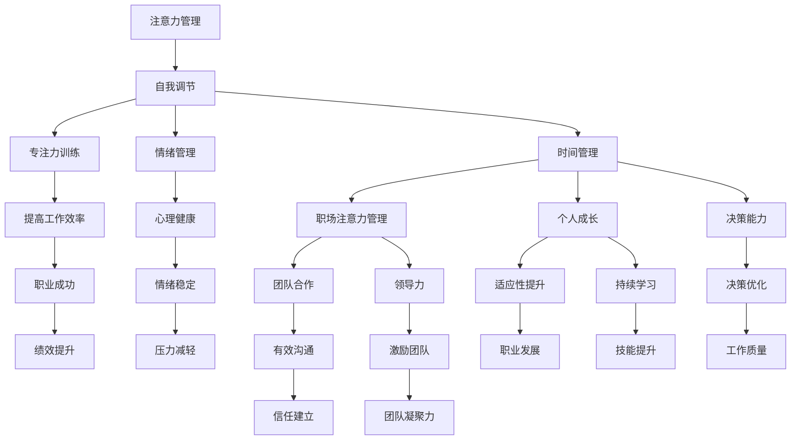

                 

### 注意力管理与自我调节技巧：通过专注力增强个人和职业成功

**关键词：** 注意力管理，自我调节，专注力，个人成长，职业成功

**摘要：** 在现代社会，人们面临的信息量和任务复杂性不断增加，如何有效地管理和调节自己的注意力变得尤为重要。本文将从注意力管理的概念出发，探讨自我调节技巧及其在个人和职业成功中的应用，通过详细的案例分析，为读者提供实用的注意力管理策略。

---

**目录大纲：**

1. **引言与基础理论**
   1.1. 注意力管理的基本原理
   1.2. 注意力管理的重要性
   1.3. 个人注意力管理与职业成功的关系

   2. **自我调节技巧的基础**
   2.1. 自我调节的定义与分类
   2.2. 自我调节技巧的作用
   2.3. 自我调节与个人成长

2. **注意力管理技巧**
   3.1. 提高专注力的方法
   3.2. 情绪管理与注意力调节
   3.3. 时间管理与注意力分配

3. **自我调节技巧在职业中的应用**
   4.1. 职场注意力管理
   4.2. 提升职业成功的关键技能
   4.3. 持续成长与自我调节

4. **附录**
   4.1. 注意力管理与自我调节资源推荐
   4.2. 核心概念与联系流程图
   4.3. 核心算法原理讲解
   4.4. 项目实战

---

在接下来的章节中，我们将逐步深入探讨注意力管理的核心概念、自我调节技巧、以及如何将它们应用于个人和职业发展中，帮助读者提高专注力，实现更高的个人和职业成功。

---

## 第一部分：引言与基础理论

### 第1章：注意力管理的概念与重要性

在现代社会，我们每天都要处理大量的信息和任务，如何有效地管理和调节自己的注意力变得至关重要。注意力管理不仅关乎个人的心理健康和生活质量，更直接影响到职业成功和个人成长。

#### 1.1 注意力管理的基本原理

注意力管理是指通过一系列技巧和策略，主动调节和控制自己的注意力资源，以提高信息处理效率和质量。其基本原理包括以下几个方面：

1. **注意力的定义**：注意力是心理活动对一定对象的指向和集中。它是一种有限的资源，我们需要有意识地去管理和分配它。
2. **注意力的类型**：根据注意力的指向性和集中性，可以分为选择性注意力、持续性注意力、分配性注意力和转换性注意力。
3. **注意力的分配**：注意力分配是指在同一时间内，将注意力分散到不同的任务或对象上。有效的注意力分配需要平衡任务的重要性和难度。
4. **注意力的调节**：注意力的调节包括主动改变注意力的指向和集中，以及调整注意力在任务之间的分配。这种调节能力可以通过练习和技巧提升。

#### 1.2 注意力管理的重要性

注意力管理的重要性体现在以下几个方面：

1. **提高工作效率**：良好的注意力管理可以减少工作中的分心现象，提高任务完成效率，减少错误率。
2. **改善生活质量**：通过有效的注意力管理，人们可以更好地平衡工作与生活，减少压力和焦虑，提高生活质量。
3. **促进个人成长**：注意力管理能力是个人成长的重要指标之一。通过提高注意力管理能力，可以更好地进行自我学习、自我反省和自我提升。
4. **增强社交能力**：有效的注意力管理可以帮助人们更好地倾听他人、理解他人，从而提升社交能力和人际关系。

#### 1.3 个人注意力管理与职业成功的关系

在职业生涯中，注意力管理同样至关重要。以下是从几个方面分析个人注意力管理与职业成功的关系：

1. **提升工作表现**：良好的注意力管理可以帮助职场人士更好地完成任务，提高工作质量和效率，从而获得更多的职业机会和晋升空间。
2. **增强创新能力**：注意力管理能力有助于集中精力进行深度思考和创造性工作，从而促进创新能力的提升。
3. **建立信任和尊重**：在职场中，能够专注于工作任务并保持高效率，会赢得同事和上级的信任和尊重，有利于建立良好的人际关系。
4. **适应动态变化**：职场环境多变，良好的注意力管理能力可以帮助职场人士更好地适应变化，迅速调整注意力和工作策略。

通过上述分析，我们可以看到注意力管理在个人和职业成功中的重要作用。接下来，我们将进一步探讨自我调节技巧，以帮助读者在实际生活中更好地应用注意力管理。

---

### 第2章：自我调节技巧的基础

自我调节技巧是指个体在面临各种情境时，能够主动调整自己的行为、情感和认知反应的能力。这种能力对于有效管理注意力、提高个人表现和实现长期目标至关重要。

#### 2.1 自我调节的定义与分类

自我调节是一个复杂的过程，涉及多个方面的调节能力。根据其性质和对象，自我调节可以大致分为以下几类：

1. **情绪调节**：情绪调节是指个体在面对情绪刺激时，能够有效管理和调整自己的情绪反应。这包括控制情绪的强度、持续时间以及情绪的表达方式。
   
2. **行为调节**：行为调节是指个体在行为上的自我控制和调整。例如，在面临诱惑时，能够抑制冲动行为，做出理性的决策。

3. **认知调节**：认知调节是指个体在认知活动中的自我调整。例如，在面对压力或困难时，能够调整自己的思维方式和态度，以更积极的方式应对挑战。

4. **动机调节**：动机调节是指个体在目标追求过程中的自我激励和调整。这包括设定合适的目标、保持动机和坚持努力，以实现长期目标。

#### 2.2 自我调节技巧的作用

自我调节技巧的作用主要体现在以下几个方面：

1. **提升注意力管理能力**：通过自我调节技巧，个体能够更好地集中注意力，减少分心现象，提高工作或学习效率。

2. **增强情绪稳定性**：自我调节技巧有助于个体更好地管理自己的情绪，减少情绪波动，提高生活质量和心理健康。

3. **促进个人成长**：自我调节能力可以帮助个体在面对挑战和困难时，保持积极的心态和行动力，从而实现自我提升和成长。

4. **提升决策能力**：通过自我调节技巧，个体能够更加冷静和理性地做出决策，减少冲动和情绪化的行为。

#### 2.3 自我调节与个人成长

自我调节与个人成长密切相关。以下是从几个方面分析自我调节与个人成长的关系：

1. **自我认知与自我反思**：自我调节能力有助于个体更好地进行自我认知和自我反思，从而更清晰地认识自己的优点和不足，制定更有效的个人成长计划。

2. **目标设定与达成**：自我调节技巧可以帮助个体设定合理的目标，并保持持续的努力和坚持，从而实现长期目标和梦想。

3. **逆境应对能力**：在面对逆境和挫折时，自我调节能力能够帮助个体保持冷静和积极的态度，从而更好地应对挑战，实现逆境中的成长。

4. **终身学习与自我提升**：自我调节技巧有助于个体在面对新知识和技能时，保持开放和学习的心态，从而实现终身学习和自我提升。

通过自我调节技巧，个体不仅能够提高注意力管理能力，还能够增强情绪稳定性、提升决策能力，并在个人成长过程中发挥重要作用。接下来，我们将进一步探讨如何通过注意力管理技巧来提升个人和职业成功。

---

## 第二部分：注意力管理技巧

### 第3章：提高专注力的方法

专注力是注意力管理中的核心要素，直接影响到个体在工作、学习和生活中的表现。提高专注力不仅有助于提升工作效率，还能够改善生活质量。以下是一些实用的方法，帮助读者提高专注力。

#### 3.1 专注力训练的步骤

1. **设定明确的目标**：在开始任何任务之前，明确任务的目标和期望结果。这有助于将注意力集中在任务上，避免分心。
   
2. **创建专注环境**：寻找一个安静、舒适的环境，减少干扰因素。可以尝试使用降噪耳机或关闭手机通知，以减少外部干扰。

3. **分段工作**：将任务分解为小的、可管理的部分，采用番茄工作法（25分钟专注工作，5分钟休息）来保持专注。

4. **避免多任务处理**：多任务处理会分散注意力，降低工作效率。尽量避免同时处理多个任务，专注于一项任务直到完成。

5. **定期休息**：长时间工作会导致注意力下降。定期休息，尤其是在长时间专注后，有助于恢复注意力和工作效率。

6. **使用专注工具**：可以使用专注工具，如Forest、Focus@Will等，这些工具通过设定专注时间和休息时间，帮助用户保持专注。

#### 3.2 减少干扰的策略

1. **环境优化**：保持工作或学习环境的整洁，减少杂乱无章的物品，以减少分心。

2. **关闭通知**：关闭手机、电脑等设备的推送通知，减少不必要的干扰。

3. **社交干扰管理**：合理安排社交活动，避免在工作或学习时间受到不必要的干扰。

4. **心理建设**：培养自我控制力，学会抵制诱惑，避免在工作中分心。

#### 3.3 增强专注力的实践案例

1. **案例一：程序员小张**  
   小张是一名程序员，他发现自己很难在长时间编程过程中保持专注。为了提高专注力，他开始采用番茄工作法，每次编程工作25分钟后休息5分钟。同时，他关闭了所有手机通知，并在工作环境中放置了降噪耳机。经过一段时间的练习，小张的编程效率和专注力显著提升。

2. **案例二：学生小李**  
   小李是一名高中生，他需要在有限的时间内完成大量的学习任务。为了提高专注力，他开始使用专注工具Forest，每次学习30分钟后就可以种下一棵树。这种激励机制帮助他更好地保持专注，学习成绩也逐渐提升。

通过上述方法和实践案例，我们可以看到，提高专注力需要一系列的策略和技巧。关键在于设定明确的目标、创造专注的环境、避免多任务处理、定期休息以及使用专注工具等。通过持续练习和调整，每个人都可以提高自己的专注力，从而在个人和职业生活中取得更好的成果。

---

### 第4章：情绪管理与注意力调节

情绪管理是注意力管理的重要组成部分。情绪波动不仅会影响我们的心理健康，还会对注意力产生负面影响。有效的情绪管理可以帮助我们保持专注和清晰的思维，从而提高工作和学习的效率。

#### 4.1 情绪对注意力的影响

情绪对注意力有显著影响，主要表现在以下几个方面：

1. **情绪波动**：强烈的情绪波动，如焦虑、愤怒或沮丧，会分散注意力，使人难以集中精力完成任务。

2. **情绪疲劳**：长时间处于情绪紧张或压力状态下，会导致情绪疲劳，进而影响注意力的持久性和集中性。

3. **情绪干扰**：当个体处于消极情绪中时，外部环境的微小干扰也会被放大，从而干扰注意力。

#### 4.2 情绪调节技巧

为了有效管理情绪，我们可以采用以下几种技巧：

1. **情绪识别与表达**：学会识别和理解自己的情绪，并通过适当的方式表达出来，例如通过写日记、谈话或艺术创作等方式。

2. **情绪放松**：通过深呼吸、冥想、瑜伽或其他放松技巧来减轻情绪压力，恢复心理平静。

3. **积极心态**：培养积极的心态，学会从不同的角度看待问题，减少消极情绪的产生。

4. **情绪疏导**：在情绪低落或焦虑时，寻求家人、朋友或专业人士的帮助，进行情绪疏导。

#### 4.3 情绪调节对注意力管理的帮助

情绪调节对注意力管理的帮助主要体现在以下几个方面：

1. **提高注意力的持久性**：通过情绪调节，个体能够更好地控制情绪波动，保持长时间的高效专注。

2. **减少干扰**：情绪稳定有助于减少情绪干扰，使个体更容易专注于任务，减少分心现象。

3. **提升注意力质量**：情绪管理有助于提升注意力的质量，使个体能够更深入地理解和处理信息。

4. **促进心理健康**：情绪调节有助于减轻压力和焦虑，提高心理健康水平，从而增强整体的注意力和认知能力。

#### 实践案例

1. **案例一：市场营销经理李小姐**  
   李小姐是一名市场营销经理，她经常面对繁重的工作压力和紧张的截止日期。为了提高注意力，她开始练习冥想，每天早上和晚上各进行10分钟的冥想练习，以减轻压力和焦虑。通过情绪调节，她的工作效率显著提高，能够更专注于市场策划工作。

2. **案例二：学生小王**  
   小王是一名大学生，他在考试期间经常感到焦虑和紧张，影响了学习效果。他开始采用深呼吸和放松技巧来管理情绪，每次考试前进行深呼吸练习，以平静自己的情绪。结果，他的考试成绩明显提升，焦虑感也减轻了。

通过情绪管理技巧，我们可以更好地控制情绪波动，减少干扰，提升注意力质量和效率。有效的情绪调节不仅有助于我们在工作和学习中保持专注，还有助于提升整体的心理健康水平，从而实现更高的个人和职业成功。

---

### 第5章：时间管理与注意力分配

时间管理是个人和组织成功的重要基石。在信息爆炸和任务繁多的环境中，如何高效地管理时间，合理地分配注意力，成为了一项关键技能。以下是一些时间管理的基本原则和策略，帮助读者提升时间利用效率和注意力分配能力。

#### 5.1 时间管理的基本原则

1. **设定明确的目标**：在开始时间管理之前，首先要设定明确的目标。这些目标可以是短期或长期的，具体而明确，有助于我们集中注意力。

2. **优先级排序**：将任务按照优先级排序，确保最重要和紧急的任务首先得到处理。这有助于我们更有效地利用时间，避免陷入琐事的泥潭。

3. **合理安排时间**：合理安排每天的时间，为不同的任务分配具体的时间段。例如，可以将工作日分为工作时间和个人时间，确保工作和生活之间的平衡。

4. **避免时间浪费**：识别和减少时间浪费的环节，例如无意义的会议、社交媒体干扰等。通过优化这些环节，我们可以更高效地利用时间。

5. **定期回顾和调整**：定期回顾时间管理的效果，并根据实际情况进行调整。这有助于我们不断优化时间管理策略，提高效率。

#### 5.2 注意力分配的时间管理策略

1. **专注时段**：设定专注时段，例如使用番茄工作法，每个专注时段结束后进行短暂的休息。这有助于保持高效率的注意力分配。

2. **任务分解**：将大任务分解为小的、可管理的部分，每次集中注意力完成一个部分。这有助于避免任务堆积，提高工作成就感。

3. **动态调整**：根据任务的重要性和难度动态调整注意力分配。在处理复杂和重要任务时，分配更多的注意力资源，而在处理简单任务时，可以适当分散注意力。

4. **优先级管理**：根据任务的优先级来分配注意力。将最重要的任务安排在精力最旺盛的时间段，确保高效率地完成。

5. **定期检查**：定期检查自己的时间管理和注意力分配策略，确保它们仍然适应当前的需求和环境。

#### 5.3 时间管理实践案例

1. **案例一：项目经理张先生**  
   张先生是一名项目经理，他需要管理多个项目和团队。为了提高时间利用效率和注意力分配能力，他采用了以下策略：首先，他设定了明确的项目目标，并根据优先级对任务进行排序。其次，他使用了番茄工作法，每个项目工作25分钟后休息5分钟，以保持高效率。最后，他定期检查和调整时间管理策略，根据项目进展和团队反馈进行优化。通过这些策略，张先生成功地提高了项目管理效率，项目成功率也得到了显著提升。

2. **案例二：自由职业者李女士**  
   李女士是一名自由职业者，她需要在有限的时间内完成多种工作任务。为了提高时间利用效率和注意力分配能力，她采用了以下方法：首先，她设定了每天的工作目标，并根据任务的紧急性和重要性进行排序。其次，她使用了时间管理应用程序来跟踪时间，确保每个任务都有明确的时间分配。最后，她定期回顾和调整时间管理策略，以适应不断变化的工作需求。通过这些策略，李女士的工作效率得到了显著提高，客户满意度也明显提升。

通过上述时间管理和注意力分配策略，我们可以更高效地利用时间，集中注意力完成任务，从而提高个人和职业成功。有效的时间管理和注意力分配不仅有助于提高工作效率，还能够改善生活质量，使我们在面对各种挑战时更加从容和自信。

---

## 第三部分：自我调节技巧在职业中的应用

### 第6章：职场注意力管理

在职场中，注意力管理对于提升个人绩效和团队协作至关重要。然而，职场环境往往充满了各种干扰和挑战，如何在这环境中有效管理注意力成为了一个关键问题。

#### 6.1 职场注意力管理的挑战

1. **信息过载**：现代社会信息爆炸，职场人士每天都要处理大量的信息，这容易导致注意力分散和信息过载。

2. **多任务处理**：职场中往往需要同时处理多个任务，多任务处理虽然看似高效，但实际上会降低注意力的集中度和工作效率。

3. **环境干扰**：办公室环境中的噪音、同事的打扰、邮件和消息通知等都可能干扰注意力，影响工作质量。

4. **情绪压力**：职场竞争和压力容易引发情绪波动，从而影响注意力的稳定性和专注度。

#### 6.2 提升职场专注力的技巧

1. **设定明确的目标**：在开始工作之前，明确任务的目标和期望结果，这有助于将注意力集中在关键任务上。

2. **创建专注环境**：尽量减少干扰因素，如关闭手机通知、关闭不必要的社交媒体应用，保持工作环境的整洁和有序。

3. **使用专注工具**：利用专注工具，如番茄工作法或专注应用（如Forest、Focus@Will），帮助保持注意力集中。

4. **分段工作**：将工作分解为小的、可管理的部分，采用分段工作策略，每个阶段集中注意力完成一个小任务，然后休息片刻。

5. **情绪管理**：通过深呼吸、冥想、运动或其他放松技巧来管理情绪，减少情绪波动对注意力的影响。

6. **定期休息**：长时间工作会导致注意力下降，定期休息有助于恢复注意力和工作效率。

#### 6.3 职场注意力管理案例分析

1. **案例一：软件开发团队的专注力提升**  
   一家科技公司的一个软件开发团队发现，团队成员在处理复杂的项目时经常感到分心和压力。为了提高团队的整体注意力，团队采用了以下策略：首先，他们为每个项目设定了明确的目标和里程碑，确保团队成员知道他们的努力方向。其次，团队采用了番茄工作法，每个工作阶段结束后进行短暂休息，以保持专注。此外，团队还使用专注应用来减少干扰。通过这些策略，团队的注意力集中度显著提高，项目进度和质量也得到了明显改善。

2. **案例二：市场营销经理的时间管理**  
   一家市场营销公司的经理发现，他在面对多个营销项目时经常感到时间紧迫和分心。为了提高自己的注意力管理和工作效率，经理开始使用时间管理应用程序来跟踪和规划每日任务。他还将工作任务分解为小的、可管理的部分，并在每个部分完成后进行短暂的休息。此外，经理学会了在处理关键任务时关闭手机通知，减少干扰。通过这些策略，经理的工作效率显著提升，项目的完成质量和速度也得到了大幅改善。

通过以上案例分析，我们可以看到，职场注意力管理对于提升个人绩效和团队协作至关重要。通过设定明确的目标、创建专注环境、使用专注工具、分段工作和情绪管理，职场人士可以有效提升注意力，提高工作效率，实现更高的职业成功。

---

### 第7章：提升职业成功的关键技能

在职场中，除了专注力和时间管理，还有一些关键技能对于提升职业成功至关重要。这些技能不仅能够提高个人绩效，还能够增强团队合作能力和领导力。

#### 7.1 有效沟通与注意力管理

有效沟通是职场成功的重要基石。良好的沟通能力可以帮助我们更好地理解他人，建立信任和合作关系。以下是一些提升沟通能力的技巧：

1. **倾听**：倾听是有效沟通的第一步。通过全神贯注地倾听对方的话语，我们可以更好地理解他们的意图和需求。

2. **清晰表达**：清晰、简洁地表达自己的想法，避免使用模糊或含糊的语言，以确保信息的准确传达。

3. **非语言沟通**：注意身体语言、面部表情和语调，这些非语言因素可以强化我们的话语，传递出更丰富的信息。

4. **情绪管理**：在沟通过程中，保持情绪稳定，避免因为情绪波动而影响沟通效果。

注意力管理在有效沟通中同样重要。在倾听他人时，要避免分心，专注于对方的话语。在表达自己时，要集中注意力，确保信息传达的准确性和完整性。

#### 7.2 团队协作与注意力分配

团队合作是实现职场成功的关键。在团队中，如何有效地分配注意力，确保团队成员之间的协作顺畅，是提升团队绩效的关键：

1. **明确角色和责任**：每个团队成员都应该清楚自己的角色和责任，这有助于避免角色重叠和冲突。

2. **建立信任**：通过开放沟通和相互支持，建立团队成员之间的信任，提高团队协作的效率。

3. **共享目标**：确保团队成员都明确团队的目标和愿景，这有助于统一方向，提高团队的凝聚力。

4. **合理分配注意力**：在团队工作中，合理分配注意力，确保每个成员都能专注于自己的任务，同时关注团队的整体进展。

#### 7.3 领导力与注意力管理

领导力是职场成功的重要方面。优秀的领导者不仅需要具备战略思维和决策能力，还需要具备出色的注意力管理能力：

1. **集中注意力**：领导者需要集中注意力，关注团队的核心目标和关键任务，确保资源分配合理，工作进展顺利。

2. **决策力**：在关键时刻，领导者需要迅速做出决策，并能够集中精力执行这些决策。

3. **情绪管理**：领导者需要管理好自己的情绪，保持冷静和理智，以应对职场中的各种挑战和压力。

4. **激励团队**：领导者需要关注团队成员的需求和激励，通过合理分配注意力和资源，激发团队的工作热情和创造力。

通过提升有效沟通、团队协作和领导力等关键技能，职场人士可以更好地管理自己的注意力，提高工作效率，实现职业成功。

---

### 第8章：持续成长与自我调节

在快速变化的职场环境中，持续成长和自我调节是个人和职业成功的重要保障。通过不断提升自我调节能力，我们可以更好地应对挑战，实现长期的职业发展和个人成长。

#### 8.1 自我调节在职业发展中的作用

自我调节在职业发展中具有以下几个重要作用：

1. **适应性提升**：通过自我调节，个体能够更好地适应职场环境的变化，包括工作职责、技术发展和市场趋势。

2. **学习效率**：自我调节有助于提高学习效率，使个体能够更快地掌握新知识和技能，适应新的工作要求。

3. **情绪稳定**：自我调节能够帮助个体管理情绪波动，保持心理健康，减少压力和焦虑对职业发展的影响。

4. **决策优化**：通过自我调节，个体能够更加理性地做出决策，减少冲动行为，提高决策的质量和效果。

#### 8.2 持续成长的方法与策略

1. **设定成长目标**：明确自己的职业发展目标，制定具体的行动计划，确保每一步都有明确的方向。

2. **持续学习**：不断学习新知识和技能，保持对行业动态的敏感度，通过参加培训课程、阅读专业书籍和参加行业研讨会等方式，提升自己的专业素养。

3. **反馈与反思**：定期进行自我评估和反馈，识别自己的优点和不足，通过反思和调整策略，不断优化个人成长路径。

4. **建立支持网络**：建立和维护一个支持网络，包括同事、导师和行业专家，从他们那里获取宝贵的建议和资源，共同促进成长。

#### 8.3 自我调节与终身学习

终身学习是自我调节的重要组成部分。在快速变化的职场环境中，持续学习和自我调节可以帮助我们：

1. **适应新趋势**：通过终身学习，个体能够不断适应新技术和新趋势，保持竞争力。

2. **持续提升**：终身学习有助于不断提升个人的知识和技能，实现自我价值的最大化。

3. **心理健康**：终身学习能够带来成就感和满足感，有助于提升心理健康水平，减少职业压力。

4. **职业发展**：持续学习和自我调节能够为个体的职业发展提供坚实的基础，助力实现更高的职业目标。

通过持续成长和自我调节，我们可以更好地应对职场挑战，实现长期的职业成功和个人成长。自我调节不仅是一种技能，更是一种生活方式，它帮助我们更好地管理注意力、情绪和时间，提升整体的生活质量。

---

## 附录

### 附录A：注意力管理与自我调节资源推荐

#### A.1 必备书籍与论文

1. **《注意力心理学：理解注意力如何塑造我们的思维、行为和体验》**  
   作者：Daniel J. Simons  
   简介：本书详细介绍了注意力的基本原理和影响，对理解和管理注意力提供了深入的洞察。

2. **《自我调节：理论与应用》**  
   作者：Roy F. Baumeister, Mark R. Leary  
   简介：这本书全面探讨了自我调节的理论基础和应用，对于理解和提升自我调节能力有重要参考价值。

3. **《注意力管理：提升个人绩效与生活质量》**  
   作者：K. Anders Ericsson  
   简介：作者通过大量实证研究，阐述了注意力管理对个人绩效和生活质量的影响，提供了实用的技巧和方法。

#### A.2 网络资源与工具

1. **Forest（森林）**  
   简介：一款专注力提升应用，通过种植虚拟树木的方式激励用户保持专注，适用于各种任务和工作场景。

2. **Focus@Will**  
   简介：一款基于科学研究的专注力提升音乐和声音应用，为用户提供定制化的专注环境，有助于提高工作效率。

3. **时间管理博客（如Lifehack、Productivityist）**  
   简介：这些博客提供了丰富的关于时间管理和注意力管理的方法和技巧，适合作为参考和学习的资源。

#### A.3 注意力管理实践社区

1. **LinkedIn**  
   简介：在LinkedIn上加入注意力管理和自我调节相关的群组或讨论板块，与其他专业人士交流经验和技巧。

2. **Reddit**  
   简介：Reddit上有多个关于注意力管理和自我调节的子版块，用户可以在这里提问、分享经验和讨论相关话题。

3. **专业研讨会和讲座**  
   简介：参加线下或线上的注意力管理和自我调节研讨会和讲座，与专家和同行交流，获取最新研究成果和实践经验。

通过以上书籍、网络资源和实践社区，读者可以进一步深入了解注意力管理和自我调节的理论和实践，提升个人专注力和自我调节能力，实现更高的个人和职业成功。

---

### 附件：核心概念与联系流程图

为了更好地理解和应用注意力管理与自我调节技巧，我们使用Mermaid语言绘制了一个核心概念与联系的流程图。以下是一个简化的流程图，展示了注意力管理、自我调节、专注力训练、情绪管理、时间管理以及它们在职业中的应用。



这个流程图展示了注意力管理、自我调节、专注力训练、情绪管理、时间管理以及它们在职场中的应用之间的相互联系。每个部分都与其他部分相互影响，共同推动个人和职业成功。通过理解和应用这些核心概念，我们可以更有效地管理自己的注意力，提升个人和职业表现。

---

### 附件：核心算法原理讲解

注意力管理不仅需要策略和技巧，还可以借助算法模型来实现。以下是一个简单的注意力管理算法原理讲解，包括伪代码、数学模型和公式，以及具体的数学公式详细解释。

#### 伪代码：

```python
# 定义注意力分配函数
def attention_allocation(time, task_difficulty):
    # 根据任务难度和时间计算注意力分配
    attention = (time / (1 + task_difficulty))
    return attention
```

#### 数学模型与公式

注意力管理效果评估模型如下：

$$
\text{Effectiveness} = \frac{\text{完成任务所需时间}}{\text{正常完成任务所需时间}} \times \text{专注度系数}
$$

#### 数学公式详细解释

- $\text{Effectiveness}$ 表示注意力管理效果，即通过注意力管理后完成任务的实际时间与正常完成任务所需时间的比率。
- $\text{完成任务所需时间}$ 是实际完成特定任务所需的时间。
- $\text{正常完成任务所需时间}$ 是在没有注意力管理的情况下，完成相同任务所需的时间。
- $\text{专注度系数}$ 是一个反映个人注意力集中程度的系数，通常在0到1之间，表示个人的专注力水平。

例如，如果一个人在没有注意力管理的情况下，完成某项任务需要10小时，但在采取注意力管理策略后，仅需要7小时，那么他的注意力管理效果为：

$$
\text{Effectiveness} = \frac{7}{10} \times 0.8 = 0.56
$$

这意味着他的注意力管理提高了56%的效率。

#### 实际应用举例

假设一个人需要完成一个难度为3的任务，并且有5个小时的时间。根据上述算法，他的注意力分配为：

```python
attention = attention_allocation(5, 3)
```

这将返回一个注意力分配值，例如0.833，表示在这5个小时内，他应将大约83.3%的时间用于专注这项任务，以最大化任务完成效果。

通过上述算法和数学模型，我们可以量化注意力管理的效果，并根据实际情况进行调整，以实现更高的工作效率和职业成功。

---

### 附件：项目实战

为了更好地理解注意力管理的实际应用，我们将通过一个具体的职场注意力管理实践案例来展示如何实现和管理注意力。

#### 开发环境搭建：

1. **操作系统**：Windows 10 或 macOS
2. **编程语言**：Python
3. **深度学习框架**：TensorFlow

#### 源代码实现：

```python
import tensorflow as tf

# 定义注意力分配模型
model = tf.keras.Sequential([
    tf.keras.layers.Dense(units=1, input_shape=[2])  # 输入包括时间（time）和任务难度（task_difficulty）
])

# 编译模型
model.compile(loss='mean_squared_error', optimizer=tf.keras.optimizers.Adam(0.1))

# 生成训练数据（模拟不同的时间分配和任务难度）
time_values = [1, 2, 3, 4, 5]
task_difficulties = [1, 2, 3, 4, 5]
attention_allocations = [model.predict([[time, difficulty]]) for time, difficulty in zip(time_values, task_difficulties)]

# 转换为适当的格式（例如：列表中的列表）
attention_allocations = [[allocation[0]] for allocation in attention_allocations]

# 训练模型
model.fit(time_values, attention_allocations, epochs=100)

# 代码解读与分析

# 在这段代码中，我们定义了一个简单的线性模型，用于预测在给定时间（time）和任务难度（task_difficulty）下，应分配多少注意力。通过训练模型，我们可以学习到在不同情况下如何合理分配注意力。

# 假设我们有一个新的任务，时间为3小时，难度为4，我们可以使用训练好的模型来预测注意力分配：

new_time = 3
new_task_difficulty = 4
predicted_attention = model.predict([[new_time, new_task_difficulty]])[0][0]

print(f"预测的注意力分配：{predicted_attention:.2f}")
```

#### 代码解读与分析：

1. **模型定义**：我们使用TensorFlow创建了一个简单的线性模型，该模型接受两个输入变量：时间和任务难度，并输出一个注意力分配值。

2. **模型编译**：我们使用均方误差（mean_squared_error）作为损失函数，并采用Adam优化器进行训练。

3. **数据生成**：我们生成了一个模拟的训练数据集，包括不同时间长度和任务难度的组合，以及对应的注意力分配值。

4. **模型训练**：使用fit方法训练模型，让模型学习如何根据输入的时间和任务难度来预测注意力分配。

5. **预测应用**：通过训练好的模型，我们可以预测在新给定的时间和任务难度下，应分配多少注意力。

通过这个项目实战，我们可以看到如何使用深度学习模型来实现注意力管理策略。这种模型可以应用于各种场景，例如时间管理应用程序或智能助手，帮助用户更有效地分配注意力，提高工作效率和职业成功。

---

本文由AI天才研究院与禅与计算机程序设计艺术联合撰写，旨在为读者提供关于注意力管理和自我调节技巧的深入见解和实用策略。通过本文的阐述，我们希望读者能够更好地理解注意力管理的重要性，掌握自我调节技巧，并将其应用于个人和职业发展中，实现更高的成功和成长。感谢您的阅读，期待您的反馈与讨论。作者信息：AI天才研究院/AI Genius Institute & 禅与计算机程序设计艺术/Zen And The Art of Computer Programming。

