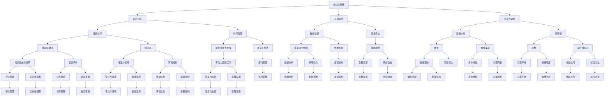

                 

### 《注意力管理：元宇宙时代下的个人效率管理》

#### 关键词：注意力管理、元宇宙、个人效率、时间管理、元认知、科技应用、案例解析

随着科技的迅猛发展，元宇宙时代的到来正深刻地改变着我们的生活方式。在这个充满虚拟现实、增强现实和人工智能的数字化世界中，个人的注意力和时间管理变得尤为重要。如何在这个充满诱惑和信息过载的环境中保持高效，成为每一个个体都需要面对的挑战。

本文将探讨在元宇宙时代下，如何通过注意力管理来提升个人效率。我们将逐步分析注意力管理的基础理论，介绍有效的注意力管理方法和实践，探讨注意力管理工具与科技应用，通过案例分析来解析成功和失败的注意力管理实践，并展望注意力管理的未来发展趋势。希望本文能为读者提供实用的指导和深刻的思考。

### 目录

#### 第一部分：注意力管理概述

1. 注意力管理基础
   1.1 什么是注意力管理
   1.2 元宇宙时代的特征
   1.3 个人效率管理的挑战与机遇

2. 注意力管理方法与实践
   2.1 元认知策略
   2.2 时间管理技巧
   2.3 注意力恢复策略

3. 注意力管理工具与科技应用
   3.1 注意力追踪工具
   3.2 科技在注意力管理中的应用

4. 案例解析
   4.1 个人案例解析
   4.2 企业案例解析

5. 注意力管理的未来
   5.1 注意力管理的发展趋势
   5.2 注意力管理对社会的影响

### 摘要

本文旨在探讨元宇宙时代下个人效率管理的有效策略——注意力管理。随着科技的迅猛发展，我们的注意力被大量信息和虚拟现实所分散，导致工作效率的下降。本文首先介绍了注意力管理的基础理论，包括注意力的定义、分类及其在个人效率管理中的重要性。接着，详细阐述了元认知策略、时间管理技巧和注意力恢复策略等核心方法，并通过注意力管理工具与科技应用来提高个人注意力集中度。此外，通过个人和企业案例的解析，本文总结了成功的注意力管理实践和失败的反思，最终展望了注意力管理的未来发展趋势。希望通过本文，读者能够掌握有效的注意力管理方法，提高个人效率，迎接元宇宙时代的挑战。

#### 第一部分：注意力管理概述

在进入元宇宙时代，个人效率管理的重要性日益凸显。元宇宙是一个虚拟与现实交织的世界，其中充满了丰富的信息、互动和娱乐体验。这些虚拟元素虽然为我们的生活带来了诸多便利，但也极大地分散了我们的注意力。例如，智能手机和社交媒体平台的广泛应用使得我们时常面临信息过载的困扰，导致难以集中精力完成重要任务。此外，虚拟现实和增强现实技术的发展使得我们可以进入各种虚拟环境，但这些环境也往往成为了分心的源泉。

注意力管理的概念源于心理学，它指的是个体在特定情境下，能够有效控制、分配和运用注意力的过程。在元宇宙时代，注意力管理不仅关系到个人的工作效率，还影响我们的心理健康和幸福感。一个有效的注意力管理体系能够帮助我们在信息爆炸和虚拟诱惑的环境中保持清醒，专注于重要的任务，提高生产力和生活质量。

个人效率管理是指通过科学的方法和策略，最大化个人时间和资源的利用，以达到既定目标。在元宇宙时代，个人效率管理面临诸多挑战。首先，信息过载和碎片化使得我们难以集中注意力，导致工作效率降低。其次，虚拟环境的吸引力往往使我们容易陷入短暂的满足感，而忽视了长期目标。此外，注意力分散还可能引发焦虑和压力，影响心理健康。

然而，元宇宙时代也为个人效率管理带来了新的机遇。随着科技的发展，我们有了更多工具和方法来管理注意力，如注意力追踪工具、智能助理等。同时，虚拟现实和增强现实技术为提高工作和学习效率提供了新的可能性。例如，虚拟现实可以模拟出高度沉浸的学习环境，有助于提高学习效果；智能助理可以自动处理日常事务，减少分心。

综上所述，注意力管理和个人效率管理在元宇宙时代具有至关重要的意义。它们不仅能够帮助我们应对信息过载和虚拟诱惑，提高工作效率，还能改善心理健康，提升生活质量。本文将深入探讨注意力管理的基础理论、方法与实践，帮助读者在元宇宙时代下更好地管理自己的注意力和时间，实现个人效率和生活的双赢。

#### 第一部分：注意力管理概述

### 1.1 什么是注意力管理

注意力管理，是一个涉及心理学、神经科学和管理学的跨学科领域，旨在研究个体如何有效地控制和分配自己的注意力资源，以达到最优的绩效和体验。在元宇宙时代，注意力管理的重要性尤为突出，因为数字技术极大地增加了我们面临的信息量和干扰源，使得注意力分散成为一个普遍问题。

首先，让我们从基础定义入手。注意力是指人类大脑对特定信息或任务进行加工和处理的认知资源。根据心理学的研究，注意力可以被分为几种类型，包括选择性注意力、执行性注意力和分配性注意力等。选择性注意力是指大脑在众多信息中选择重要信息进行处理的机制；执行性注意力则涉及自我控制和计划能力，可以帮助我们克服干扰，坚持完成任务；分配性注意力是指同时处理多个任务或信息的能力。

在元宇宙时代，信息处理的速度和复杂性大大增加，人们需要处理来自多个渠道的信息，例如电子邮件、社交媒体更新、即时通讯以及虚拟现实环境中的互动等。这种信息过载和多重任务处理环境对注意力的要求非常高。因此，注意力管理成为提高个人效率和生活质量的关键。

注意力管理的目的是通过一系列策略和方法，帮助个体优化注意力的使用，从而提高任务完成质量、减少错误和提升整体认知表现。以下是一些注意力管理的基本策略：

1. **设定清晰的目标**：在开始任何任务之前，明确目标是非常重要的。清晰的目标能够帮助大脑集中注意力，减少不确定性和干扰。

2. **环境控制**：通过调整工作或学习环境，减少干扰源。例如，将手机静音、关闭不必要的通知，或者选择一个安静的场所来工作。

3. **分阶段任务**：将复杂的任务分解成一系列小步骤，每个步骤只专注于一项任务，这有助于减少任务切换带来的注意力分散。

4. **定期休息**：长时间集中注意力会消耗大量的认知资源，导致注意力疲劳。定期休息和放松可以帮助恢复注意力，提高工作效率。

5. **使用元认知策略**：元认知是指关于自己思维过程的知识和调节能力。通过自我反思和监控，个体可以更好地管理自己的注意力。

6. **科技辅助**：利用现代科技工具，如注意力追踪软件和智能助手，可以帮助个体更好地监控和管理注意力。

在元宇宙时代，注意力管理不仅有助于提高个人工作效率，还能改善心理健康。研究表明，注意力分散和注意力疲劳与焦虑、压力和抑郁等心理健康问题密切相关。通过有效的注意力管理，个体可以更好地应对这些挑战，提高生活质量。

总之，注意力管理是一个多维度的概念，涉及从基础心理学原理到实际操作策略的方方面面。在元宇宙时代，有效的注意力管理不仅能够帮助个体在信息过载和干扰环境中保持专注，还能提升整体认知能力和生活质量。接下来，我们将进一步探讨元认知策略、时间管理技巧和注意力恢复策略等具体方法，帮助读者在实践中应用注意力管理，提高个人效率。

#### 第一部分：注意力管理概述

### 1.2 元宇宙时代的特征

元宇宙（Metaverse）是一个由虚拟现实（VR）、增强现实（AR）和其他数字技术构建的虚拟共享空间，它融合了物理世界和数字世界，为用户提供了一个沉浸式的互动体验。元宇宙时代具有以下几个显著特征：

1. **虚拟现实与增强现实技术的普及**：虚拟现实和增强现实技术的不断进步，使得元宇宙中的互动更加真实和沉浸。用户可以通过VR头盔、AR眼镜等设备进入元宇宙，体验到高度模拟的虚拟环境。

2. **多样化的互动形式**：在元宇宙中，用户可以与虚拟人物互动，参加虚拟会议、在线教育、虚拟旅游等活动，甚至创建和经营自己的虚拟资产。这种多样化的互动形式极大地丰富了用户的生活体验。

3. **去中心化的数字身份**：元宇宙通常采用区块链技术，使得用户可以拥有一个去中心化的数字身份，保护个人隐私和数据安全。用户可以自由选择和管理自己的数字身份，参与元宇宙的各种活动。

4. **丰富的虚拟经济体系**：元宇宙中拥有一个完整的虚拟经济体系，用户可以通过虚拟货币进行交易和投资，例如购买虚拟商品、虚拟土地等。这种经济体系促进了元宇宙的繁荣和发展。

5. **跨平台和跨应用整合**：元宇宙不仅是一个独立的空间，还是一个跨平台和跨应用的整合体。用户可以在不同设备和应用程序之间无缝切换，享受一致的元宇宙体验。

这些特征使得元宇宙成为一个充满机遇和挑战的新领域。对于个人而言，元宇宙提供了更多样化的娱乐、学习和工作方式，但也带来了新的注意力和时间管理挑战。

首先，虚拟现实和增强现实技术的普及使得用户更容易沉浸在虚拟世界中，容易分散现实生活中的注意力。用户可能会在虚拟环境中花费大量时间，导致现实生活任务的忽视。此外，元宇宙中的多样化互动形式和虚拟经济体系也可能使得用户产生过度消费和沉迷的风险。

为了应对这些挑战，个人需要掌握有效的注意力管理策略。以下是一些关键策略：

1. **设定明确的虚拟世界目标**：在进入元宇宙之前，明确自己的目标和优先级，有助于用户更好地管理时间和注意力。例如，将元宇宙体验与学习、社交或工作目标相结合。

2. **时间限制**：为元宇宙中的活动设定时间限制，避免过度沉迷。例如，每天在元宇宙中分配固定的时间，其余时间专注于现实生活中的任务。

3. **环境控制**：在参与元宇宙活动时，选择一个安静的环境，减少干扰。关闭不必要的通知和干扰应用，专注于当前的虚拟任务。

4. **定期休息**：长时间沉浸在虚拟世界中容易导致疲劳和注意力下降。因此，定期休息和放松非常重要。可以在虚拟活动之间安排短暂的休息时间，恢复注意力。

5. **科技辅助**：利用注意力追踪工具和智能助手来监控和管理在元宇宙中的注意力使用。这些工具可以帮助用户了解自己在虚拟世界中的注意力分布，及时调整和优化。

总之，元宇宙时代的到来为个人提供了丰富的虚拟体验和新的机遇，但也带来了注意力管理的挑战。通过设定目标、时间限制、环境控制和科技辅助等策略，个人可以更好地管理自己的注意力，实现虚拟世界与现实生活的平衡。

#### 第一部分：注意力管理概述

### 1.3 个人效率管理的挑战与机遇

在元宇宙时代，个人效率管理面临前所未有的挑战和机遇。首先，我们需要了解什么是个人效率管理。个人效率管理是指通过科学的方法和策略，最大化个人时间和资源的利用，以达到既定目标的过程。在元宇宙时代，这一概念变得更加复杂，因为数字技术的广泛应用使得我们的工作、学习和生活方式发生了根本性的变化。

#### 挑战

1. **信息过载**：随着互联网的普及，我们每天都会接收到海量的信息。这些信息不仅包括电子邮件、社交媒体更新，还涵盖了虚拟现实和增强现实环境中的互动。处理这些信息需要大量的认知资源，容易导致注意力分散和疲劳。

2. **多任务处理**：元宇宙提供了多样化的互动形式，使得用户可以在不同任务之间快速切换。然而，这种多任务处理模式可能导致注意力分散，降低任务完成质量。同时，频繁的任务切换也会增加大脑的认知负荷，影响工作效率。

3. **虚拟诱惑**：元宇宙中的虚拟现实和增强现实技术提供了丰富的娱乐和社交体验，这些体验往往令人沉迷。用户可能会花费大量时间在虚拟世界中，导致现实生活中的任务被忽视，影响个人效率。

4. **时间管理困难**：元宇宙中的时间和现实时间并行存在，用户可能会混淆虚拟时间和现实时间，导致时间管理困难。例如，用户可能会在虚拟会议中度过数小时，而忽视了现实生活中的重要任务。

#### 机遇

1. **科技辅助**：随着人工智能、机器学习等技术的发展，我们有了更多工具来管理个人效率。例如，智能助手可以自动处理日常事务，减轻用户的工作负担；注意力追踪工具可以帮助用户了解自己的注意力分布，及时调整和优化。

2. **虚拟工作环境**：元宇宙为远程工作和远程协作提供了新的可能性。用户可以在虚拟办公室中高效工作，与团队成员实时沟通和协作，不受地理位置的限制。

3. **个性化学习**：元宇宙中的虚拟现实和增强现实技术为个性化学习提供了新的平台。用户可以根据自己的需求和节奏进行学习，提高学习效率。

4. **虚拟体验优化**：元宇宙中的虚拟体验可以高度定制化，用户可以根据自己的兴趣和需求选择适合的活动。这种个性化体验有助于提高用户满意度，减少注意力分散。

#### 应对策略

1. **设定明确的目标**：在元宇宙中，用户应该设定明确的目标，确保自己的活动与个人目标相一致。例如，如果用户的主要目标是工作，那么应该专注于完成工作任务，而不是在虚拟环境中消磨时间。

2. **时间管理**：为元宇宙中的活动设定时间限制，避免过度沉迷。用户可以使用时间管理工具来规划自己的日程，确保虚拟活动不会占用太多现实时间。

3. **环境控制**：在参与元宇宙活动时，选择一个安静的环境，减少干扰。用户可以关闭不必要的通知和干扰应用，专注于当前的虚拟任务。

4. **定期休息**：长时间沉浸在虚拟世界中容易导致疲劳和注意力下降。因此，定期休息和放松非常重要。用户可以在虚拟活动之间安排短暂的休息时间，恢复注意力。

5. **科技辅助**：利用注意力追踪工具和智能助手来监控和管理在元宇宙中的注意力使用。这些工具可以帮助用户了解自己在虚拟世界中的注意力分布，及时调整和优化。

通过理解元宇宙时代个人效率管理的挑战和机遇，并采取相应的策略，用户可以更好地管理自己的时间和注意力，提高个人效率，实现虚拟世界与现实生活的平衡。

#### 第一部分：注意力管理概述

### 1.2 元宇宙时代的特征

元宇宙（Metaverse）是一个虚拟与现实交织的互联网空间，它通过虚拟现实（VR）、增强现实（AR）等技术为用户提供沉浸式、交互式的体验。随着技术的不断发展，元宇宙已经逐渐成为人们生活、工作和娱乐的重要部分。以下是元宇宙时代的几个关键特征：

#### 虚拟现实与增强现实技术的普及

虚拟现实和增强现实技术的快速发展是元宇宙时代最显著的特征之一。虚拟现实技术通过计算机生成一个完全虚拟的三维环境，用户可以通过VR头盔、VR眼镜等设备进入这个环境，并与虚拟世界中的物体互动。增强现实技术则将虚拟信息叠加在现实世界中，用户可以通过AR眼镜、智能手机等设备看到这些叠加的信息。这些技术的发展使得用户可以在元宇宙中获得高度沉浸的体验，增强了与现实世界的互动性。

#### 多样化的互动形式

元宇宙提供了多样化的互动形式，用户可以在其中进行社交、工作、学习、娱乐等各种活动。例如，用户可以参加虚拟会议，与来自世界各地的同事面对面交流；在虚拟课堂中学习新知识，与同学互动讨论；在虚拟游乐场中体验刺激的游戏；或者在虚拟购物中心购物。这些多样化的互动形式不仅丰富了用户的生活，也为各种行业带来了新的发展机遇。

#### 去中心化的数字身份

在元宇宙中，用户通常拥有一个去中心化的数字身份，这个身份是由区块链技术实现的。数字身份可以帮助用户保护个人隐私，并且在元宇宙中进行各种活动。例如，用户可以在不同的虚拟世界中使用同一个数字身份，而不必每次都重新注册。这种去中心化的数字身份机制为元宇宙的可持续发展提供了保障。

#### 丰富的虚拟经济体系

元宇宙中存在一个完整的虚拟经济体系，用户可以通过虚拟货币进行交易和投资。例如，用户可以购买虚拟商品、虚拟土地，甚至虚拟房地产。虚拟经济体系不仅为用户提供了新的消费方式，也为元宇宙的可持续发展提供了动力。虚拟经济体系中的各种活动和交易活动也推动了元宇宙中的创新和发展。

#### 跨平台和跨应用整合

元宇宙不仅是一个独立的空间，还是一个跨平台和跨应用的整合体。用户可以在不同的设备和应用程序之间无缝切换，享受一致的元宇宙体验。例如，用户可以在智能手机上开始一个任务，然后在VR头盔中继续完成，而不需要重新适应新的环境。这种跨平台和跨应用整合为用户提供了极大的便利，也推动了元宇宙的普及和发展。

#### 注意力管理的重要性

元宇宙时代带来了丰富的互动体验和新的发展机遇，但也带来了注意力管理的挑战。由于虚拟现实和增强现实技术的普及，用户在元宇宙中容易分散注意力，导致现实生活中的任务被忽视。此外，元宇宙中的多样化互动形式和虚拟经济体系也可能使用户沉迷其中，影响个人效率和生活质量。

为了应对这些挑战，个人需要掌握有效的注意力管理策略。例如，设定明确的目标、时间管理和环境控制等策略可以帮助用户在元宇宙中保持专注，提高个人效率。科技辅助工具，如注意力追踪工具和智能助手，也可以帮助用户更好地管理注意力。

总之，元宇宙时代的特征为个人和行业带来了新的机遇和挑战。通过有效的注意力管理策略，个人可以更好地利用元宇宙带来的便利，提高工作效率和生活质量。

#### 第一部分：注意力管理概述

### 1.3 个人效率管理的挑战与机遇

在元宇宙时代，个人效率管理面临着一系列新的挑战和机遇。随着虚拟现实（VR）和增强现实（AR）技术的日益普及，人们的注意力变得更加分散，个人效率管理变得更加复杂。

#### 挑战

1. **信息过载**：元宇宙中的信息量巨大，用户可能面临大量的社交媒体更新、电子邮件和虚拟互动，这些信息容易分散注意力，影响工作效率。

2. **多任务处理**：虚拟环境鼓励用户同时处理多个任务，如参与虚拟会议、浏览社交媒体和参与虚拟现实游戏。这种多任务处理可能导致注意力分散，降低工作效率。

3. **虚拟诱惑**：元宇宙中的虚拟互动和游戏可能使用户沉迷，浪费大量时间，影响现实生活中的任务完成。

4. **时间管理困难**：在元宇宙中，虚拟时间和现实时间并行存在，用户容易混淆两者，导致时间管理困难。

#### 机遇

1. **科技辅助**：随着人工智能（AI）和机器学习技术的发展，出现了许多辅助工具，如注意力追踪工具和智能助手，这些工具可以帮助用户更好地管理时间和注意力。

2. **虚拟工作环境**：元宇宙提供了虚拟办公空间，使得远程工作和协作变得更加方便，提高了工作效率。

3. **个性化学习**：虚拟现实和增强现实技术可以提供个性化的学习体验，根据用户的需求和节奏进行学习，提高学习效率。

4. **虚拟体验优化**：元宇宙中的虚拟体验可以根据用户的需求和偏好进行定制，提高用户满意度，减少注意力分散。

#### 应对策略

1. **设定明确的目标**：在进入元宇宙之前，用户应明确自己的目标和优先级，确保活动与目标一致。

2. **时间管理**：为元宇宙中的活动设定时间限制，避免过度沉迷，确保虚拟活动不会占用太多现实时间。

3. **环境控制**：在参与元宇宙活动时，选择一个安静的环境，减少干扰，提高专注度。

4. **定期休息**：长时间沉浸在虚拟世界中容易导致疲劳和注意力下降，定期休息和放松有助于恢复注意力。

5. **科技辅助**：利用注意力追踪工具和智能助手监控和管理在元宇宙中的注意力使用。

通过理解元宇宙时代个人效率管理的挑战和机遇，并采取相应的策略，用户可以更好地管理自己的时间和注意力，提高个人效率，实现虚拟世界与现实生活的平衡。

### 第二部分：注意力管理方法与实践

在元宇宙时代，如何有效管理注意力以提升个人效率是一项重要课题。本部分将详细介绍注意力管理的核心方法，包括元认知策略、时间管理技巧和注意力恢复策略，并提供实践指导，帮助读者在实际生活中应用这些方法。

#### 2.1 元认知策略

元认知是指对自身认知过程的理解和管理能力。元认知策略通过提高自我监控和自我调节能力，帮助用户更好地管理注意力。以下是几种关键的元认知策略：

1. **自我监控**：通过定期自我反思和评估，了解自己在任务中的注意力状态。例如，用户可以记录每天的工作和注意力分布，识别哪些时间段注意力最集中，哪些任务容易分散注意力。

   **实践指导**：每天结束时，花几分钟时间回顾一天的工作，记录下完成的任务和注意力使用情况。可以使用日记或专门的注意力追踪应用来记录。

2. **目标设定**：在开始任务前，明确任务的目标和预期成果，有助于集中注意力。将大目标分解为小步骤，每个步骤专注于一个具体的任务。

   **实践指导**：使用任务清单或待办事项应用来设定和跟踪任务。确保每个任务都有明确的目标和时间限制，有助于保持专注。

3. **注意力调整**：当发现自己注意力分散时，及时调整状态。例如，可以短暂休息、进行深呼吸或进行简单的身体活动，帮助恢复注意力。

   **实践指导**：设置定时提醒，每隔一段时间提醒自己检查当前的任务和注意力状态。当发现注意力分散时，立即采取行动调整。

#### 2.2 时间管理技巧

时间管理是注意力管理的重要组成部分。通过有效的时间管理，用户可以更好地分配注意力，提高工作效率。以下是几种时间管理技巧：

1. **优先级排序**：根据任务的重要性和紧急程度，将任务进行优先级排序。重要且紧急的任务应优先处理，重要但不紧急的任务可安排在较后面处理。

   **实践指导**：使用优先级矩阵（例如埃森豪威尔矩阵）来评估任务的优先级，并根据优先级制定每日任务列表。

2. **时间块**：将时间划分为不同的块，每个块专注于一个特定的任务。这种方法有助于减少任务切换的干扰，提高专注度。

   **实践指导**：使用日程表或时间管理应用来规划每天的时间块。确保每个时间块都有明确的目标和任务。

3. **避免多任务处理**：尽管多任务处理看起来可以提高效率，但实际上它往往会降低任务完成质量和效率。尽量专注于单一任务，直到完成。

   **实践指导**：在处理任务时，关闭通知和干扰应用，专注于当前任务。可以使用番茄工作法来提高专注度，例如，工作25分钟，休息5分钟。

#### 2.3 注意力恢复策略

长时间集中注意力会导致大脑疲劳，从而影响工作效率。因此，注意力的恢复和休息至关重要。以下是几种注意力恢复策略：

1. **短暂休息**：在长时间工作后，进行短暂的休息，如5到10分钟的深呼吸、散步或放松活动，有助于恢复注意力。

   **实践指导**：设置定时提醒，每隔一段时间提醒自己休息。休息时，尽量远离工作环境，让大脑得到放松。

2. **睡眠管理**：保证充足的睡眠对于注意力恢复至关重要。建立规律的睡眠习惯，确保每晚有7到9小时的睡眠。

   **实践指导**：晚上避免使用电子设备，保持睡眠环境的舒适和安静。可以尝试冥想、深呼吸等方法来帮助入睡。

3. **运动和锻炼**：定期进行身体锻炼，如散步、跑步或瑜伽，有助于提高注意力和整体认知功能。

   **实践指导**：每周安排固定的锻炼时间，例如每天早晨或晚上进行30分钟的身体活动。

通过元认知策略、时间管理技巧和注意力恢复策略，用户可以更好地管理注意力，提高个人效率。在实际应用中，结合个人特点和需求，灵活运用这些方法，将有助于在元宇宙时代保持高效的工作和生活状态。

### 第三部分：注意力管理工具与科技应用

在元宇宙时代，随着技术的不断进步，注意力管理工具和科技应用也在不断创新和发展。这些工具和应用不仅可以帮助用户更好地监控和管理自己的注意力，还能提供个性化的解决方案，帮助用户在信息过载和虚拟诱惑的环境中保持专注和高效。以下是一些主要的注意力管理工具和科技应用，以及它们在注意力管理中的实际应用。

#### 注意力追踪工具

注意力追踪工具通过监测用户的行为和注意力状态，提供有关注意力分布和效率的实时数据。这些工具可以帮助用户了解自己的注意力模式，识别注意力分散的原因，并采取相应的措施进行调整。

1. **专注力追踪应用**：例如，Focus@Will 和 Brain Focus 等应用通过监测用户的音频偏好和活动，自动调整音乐播放，帮助用户保持专注。这些应用还会记录用户的专注时间和分散时间，为用户提供详细的数据分析。

   **实际应用**：用户可以在需要集中注意力的任务前启动这些应用，如写报告、编程或学习新技能。应用会自动调整背景音乐，减少干扰，提高专注度。

2. **脑波监测设备**：例如，Neurofeedback 设备通过监测用户的脑波活动，提供实时反馈，帮助用户调整注意力。这些设备通常结合虚拟现实技术，通过游戏或训练任务来训练用户的注意力。

   **实际应用**：用户可以通过定期使用这些设备进行脑波训练，提高注意力集中度和自我调节能力。例如，医生和治疗师可以使用这些设备帮助患者治疗注意力缺陷障碍。

#### 智能助理与自动化工具

智能助理和自动化工具可以帮助用户处理日常事务，减少分心和压力，从而提高注意力集中度。

1. **智能日程管理**：例如，Google 日历、Microsoft Outlook 和 Notion 等应用提供了智能提醒和自动任务分配功能，帮助用户合理安排时间。

   **实际应用**：用户可以将日常任务和会议安排在日程中，应用会自动发送提醒通知，避免忘记重要事项，减少心理负担。

2. **自动化工具**：例如，IFTTT（If This Then That）和 Zapier 等工具可以自动处理一系列任务，如发送电子邮件、更新社交媒体状态、整理文件等。

   **实际应用**：用户可以设置自动化规则，例如，当收到一封电子邮件时，自动转发到指定文件夹或发送提醒通知。这样，用户可以专注于更重要的任务，而不必担心琐碎的事务。

#### 虚拟现实与增强现实技术

虚拟现实（VR）和增强现实（AR）技术为注意力管理提供了新的可能性，通过沉浸式体验帮助用户更好地集中注意力。

1. **VR专注训练**：例如，VRMAD（Virtual Reality Mindfulness and Attention Training）通过虚拟现实环境提供专注力训练。用户在虚拟环境中完成任务，如调整灯笼或建造桥梁，这些任务需要高度集中注意力。

   **实际应用**：用户可以通过定期使用这些VR训练应用来提高专注力和自我调节能力，从而在现实世界中更好地管理注意力。

2. **AR生产力工具**：例如，Microsoft Teams 和 Meta（Facebook）的Horizon Workrooms等应用，通过AR技术提供虚拟会议和工作环境。用户可以在虚拟会议室中集中注意力，减少现实环境中的一些干扰。

   **实际应用**：用户可以在虚拟会议室中与团队成员进行高效沟通，通过使用虚拟白板、笔记工具等提高会议效率，减少因现实环境干扰导致的注意力分散。

#### 科技应用的优势与挑战

注意力管理工具和科技应用在提升个人效率和注意力集中度方面具有显著优势，但同时也存在一些挑战：

1. **优势**：
   - **个性化**：这些工具可以根据用户的需求和偏好提供定制化的解决方案，提高注意力管理的有效性。
   - **实时反馈**：通过实时监测和分析注意力状态，用户可以及时调整自己的行为，优化注意力使用。
   - **减少干扰**：自动化和智能助理功能可以帮助用户处理日常事务，减少分心和压力。

2. **挑战**：
   - **依赖性**：用户可能会过度依赖这些工具，导致自主管理注意力的能力下降。
   - **隐私问题**：一些注意力追踪工具会收集用户的行为数据，这可能引发隐私和数据安全的担忧。
   - **技术限制**：技术发展水平不同，一些工具的准确性和实用性可能存在差异，用户需要选择适合自己的工具。

总之，注意力管理工具和科技应用在元宇宙时代为个人提供了强大的支持，通过有效的工具和科技应用，用户可以更好地管理自己的注意力，提高工作效率和生活质量。

### 第四部分：注意力管理案例解析

#### 4.1 个人案例解析

##### 成功的注意力管理实践

李先生是一位软件工程师，他在元宇宙时代下面临的一个主要挑战是信息过载和工作效率低下。为了解决这个问题，他采取了一系列注意力管理的策略，取得了显著的成效。

**策略一：设定明确的目标**

李先生首先学会了设定明确的目标。在每天开始工作之前，他会列出当天需要完成的任务，并根据优先级进行排序。每个任务都有一个明确的目标和时间限制，例如“在下午3点之前完成代码审查并提交修改”。

**实践效果**：通过设定明确的目标，李先生能够更专注于当前任务，减少任务切换带来的注意力分散。他的工作效率显著提高，每天能够按时完成更多的工作。

**策略二：环境控制**

李先生意识到，一个安静、无干扰的工作环境对于集中注意力至关重要。他选择了一个安静的房间作为自己的办公室，并关闭了社交媒体和电子邮件通知。此外，他还使用了降噪耳机，以减少环境噪音的干扰。

**实践效果**：通过控制环境，李先生能够更好地集中注意力，减少了外界的干扰，从而提高了工作的专注度和效率。

**策略三：定期休息**

李先生知道长时间工作会导致注意力下降和疲劳。因此，他采用了“番茄工作法”，每工作25分钟就休息5分钟。在休息时间，他会站起来活动一下身体，做一些伸展运动或深呼吸，帮助恢复注意力。

**实践效果**：定期休息不仅帮助李先生保持精力充沛，还提高了他的工作效率和整体幸福感。

**策略四：科技辅助**

李先生使用了多种注意力管理工具，如Focus@Will和专注力追踪应用。这些工具帮助他监测自己的注意力状态，并在注意力分散时提供提醒。

**实践效果**：通过科技辅助，李先生能够更好地了解自己的注意力模式，及时调整自己的行为，保持专注。

##### 失败的注意力管理反思

尽管李先生在注意力管理方面取得了成功，但他也经历过一些失败的尝试。

**失败案例一：过度依赖工具**

在某段时间，李先生过度依赖注意力管理工具，例如番茄工作法和智能提醒。他试图通过工具来强制自己集中注意力，但由于缺乏自我监控和自我调节能力，这些工具并未发挥预期的作用。

**反思**：李先生意识到，虽然工具可以帮助管理注意力，但最终还需要依靠自己的意志力和自我管理能力。过度依赖工具可能会导致自主管理能力的下降，反而适得其反。

**失败案例二：时间管理不当**

李先生曾经试图通过压缩休息时间来增加工作时间，但由于长时间工作导致疲劳和注意力下降，最终工作效率并未提高，反而出现了错误和疏漏。

**反思**：李先生认识到，有效的时间管理不仅仅是增加工作时间，更重要的是确保工作质量和效率。适当的休息和放松是保持高效工作的关键。

通过这些成功和失败的尝试，李先生深刻体会到注意力管理的重要性，并在实践中不断调整和优化自己的策略，最终取得了显著的成效。

#### 4.2 企业案例解析

##### 企业级注意力管理策略

某知名科技公司A公司，在元宇宙时代下，也面临着员工注意力分散和工作效率低下的挑战。为了提高员工的工作效率，A公司采取了一系列企业级的注意力管理策略。

**策略一：培训与教育**

A公司定期为员工提供注意力管理培训，教授员工如何设定明确的目标、控制环境、定期休息和利用科技工具等。这些培训旨在提高员工的自我管理能力和注意力集中度。

**实践效果**：通过培训，员工学会了更有效地管理自己的注意力，提高了工作效率和生产力。员工在完成任务时更加专注，减少了错误和疏漏。

**策略二：灵活工作安排**

A公司推行了灵活的工作安排，允许员工在特定时间内选择适合自己的工作时间和地点。这种灵活的工作方式有助于减少干扰，提高员工的注意力集中度。

**实践效果**：灵活的工作安排使得员工能够在没有外部干扰的环境中工作，提高了工作效率和满意度。员工在工作时更加专注，任务完成质量更高。

**策略三：团队协作与反馈**

A公司鼓励员工之间进行团队协作和反馈，通过协作解决复杂问题和提供支持，减少员工的孤独感和分心。同时，定期进行绩效评估和反馈，帮助员工了解自己的注意力管理和工作效率表现。

**实践效果**：团队协作和反馈机制增强了员工之间的沟通和理解，提高了团队的凝聚力和工作效率。员工在相互支持和反馈中不断改进自己的注意力管理方法，提高了整体绩效。

##### 注意力管理在企业绩效中的体现

A公司的注意力管理策略取得了显著的成效，体现在以下几个方面：

**1. 提高工作效率**：通过注意力管理策略，员工能够更好地集中注意力，减少分心和干扰，提高了工作效率和生产力。

**2. 减少错误和疏漏**：员工在集中注意力的环境中工作，减少了因分心导致的错误和疏漏，提高了任务完成质量。

**3. 提高员工满意度**：灵活的工作安排和团队协作机制增强了员工的工作满意度和幸福感，减少了工作压力和疲劳。

**4. 提升团队绩效**：通过团队协作和反馈，员工之间相互支持，共同提高注意力管理和工作效率，提升了整个团队的绩效。

总之，A公司的注意力管理策略为企业带来了显著的好处，提高了员工的工作效率和企业绩效。这些策略不仅适用于个人，也可以在企业层面进行推广和应用，帮助企业在元宇宙时代下保持竞争优势。

#### 第五部分：注意力管理的未来展望

在元宇宙时代，注意力管理的发展趋势和潜在影响不仅限于个人层面，还将对教育、工作、社会行为等多个领域产生深远的影响。

##### 5.1 注意力管理的发展趋势

1. **个性化注意力管理系统**：未来的注意力管理系统将更加注重个性化，根据用户的需求和习惯提供定制化的解决方案。例如，基于人工智能和大数据分析，系统可以实时监测用户的注意力状态，并根据数据提供个性化的建议和调整策略。

2. **智能环境辅助**：随着物联网和智能家居技术的发展，智能环境将能够在用户进入工作或学习状态时自动调整光线、温度和噪音水平，创造一个有利于注意力集中的环境。

3. **脑机接口（BMI）技术**：脑机接口技术将使注意力管理更加精确，通过直接监测大脑活动来调节注意力和情绪状态，提高注意力集中度和工作效率。

4. **整合多模态反馈**：未来的注意力管理系统将整合多种反馈方式，如视觉、听觉和触觉，提供更加全面的注意力监控和指导。

##### 5.2 注意力管理对社会的影响

1. **教育领域的革新**：注意力管理在教育领域的应用将有助于提高学习效果。通过个性化学习计划和注意力监测，学生可以在最适合自己的时间和方式下学习，提高学习效率。

2. **工作方式的转变**：在元宇宙中，远程工作和虚拟协作将成为主流，注意力管理将帮助员工在分散的工作环境中保持高效。这将推动工作方式的转变，提高整体生产力和生活质量。

3. **社会行为的改变**：随着注意力管理技术的普及，人们将更加注重自我管理和注意力分配，减少沉迷于虚拟世界的时间，从而改善社会行为和心理健康。

4. **公共卫生的改善**：注意力管理有助于减少焦虑、压力和抑郁等心理健康问题的发生。通过改善个人注意力管理，可以提高整体社会健康水平。

##### 未来展望

注意力管理在元宇宙时代的未来发展前景广阔。通过科技创新和个性化策略，注意力管理将不仅能够提高个人效率和幸福感，还将对教育、工作和社会行为产生积极影响。随着技术的不断进步，我们将见证一个更加高效、健康和和谐的未来社会。

### Mermaid 流程图：注意力管理核心方法流程图



### 注意力管理核心算法原理讲解

#### 时间管理算法原理

**输入**：任务列表、时间限制、优先级

**输出**：最优时间安排方案

**伪代码**：

```python
# 初始化任务列表，并按照优先级排序
tasks = sort_tasks_by_priority(task_list)

# 初始化总时间限制
time_limit = total_time_available

# 初始化结果列表
scheduling = []

# 对每个任务，计算其在规定时间内完成所需的时间
for task in tasks:
    task_time_required = calculate_required_time(task)

    # 根据剩余时间与任务优先级，选择下一个任务
    if time_limit >= task_time_required:
        scheduling.append(task)
        time_limit -= task_time_required
    else:
        break

# 输出最优时间安排方案
print(scheduling)
```

#### 数学模型与公式

注意力管理中的数学模型通常涉及线性规划或动态规划，以下是一个简单的线性规划模型：

$$
\text{最大化} \ \sum_{i=1}^{n} p_i \cdot t_i \\
\text{约束条件：} \ \sum_{i=1}^{n} t_i \leq T
$$

其中，$p_i$ 是第 $i$ 个任务的优先级，$t_i$ 是第 $i$ 个任务所需时间，$T$ 是总时间限制。

**举例说明**：

假设有3个任务，每个任务的优先级和所需时间如下表：

| 任务编号 | 优先级 $p_i$ | 所需时间 $t_i$ |
|----------|--------------|--------------|
| 1        | 3            | 2小时        |
| 2        | 2            | 1小时        |
| 3        | 1            | 3小时        |

总时间限制为5小时。

根据上述线性规划模型，我们希望最大化完成的任务优先级总和，同时不超过5小时的时间限制。

**计算过程**：

1. 按优先级排序：任务3（优先级1），任务1（优先级3），任务2（优先级2）
2. 尽量先完成优先级高的任务，所以首先安排任务3（3小时）
3. 剩余时间：5 - 3 = 2小时
4. 剩余时间不足以完成任务1，因此不安排任务1
5. 剩余时间足以完成任务2，所以安排任务2（1小时）

最终最优时间安排方案为：任务3（3小时），任务2（1小时），总时间4小时。

### 项目实战

#### 实战一：个人日程规划

**开发环境搭建**：

- 使用Python作为编程语言。
- 使用pandas库来处理任务数据和时间安排。

**源代码详细实现**：

```python
import pandas as pd

# 任务数据样本
tasks = pd.DataFrame({
    'task_id': [1, 2, 3],
    'task_name': ['任务一', '任务二', '任务三'],
    'priority': [3, 2, 1],
    'duration': [2, 1, 3]
})

# 按优先级排序
tasks_sorted = tasks.sort_values(by='priority', ascending=False)

# 初始化总时间
total_time = 5

# 初始化结果列表
scheduling = []

# 对每个任务，计算其在规定时间内完成所需的时间
for index, row in tasks_sorted.iterrows():
    if total_time >= row['duration']:
        scheduling.append(row['task_name'])
        total_time -= row['duration']
    else:
        break

print("最优时间安排方案：", scheduling)
```

**代码解读与分析**：

该代码首先使用pandas库创建一个包含任务ID、任务名称、优先级和所需时间的DataFrame。然后，根据任务的优先级对任务列表进行排序。接着，设定一个总时间限制（例如5小时），并使用一个循环逐个处理任务。

- 在每次循环中，检查当前任务所需时间是否小于等于剩余时间。
- 如果可以完成，将该任务添加到安排列表中，并从总时间中减去该任务的持续时间。
- 如果无法完成，则跳出循环。

最后，输出最优的时间安排方案。该方案遵循优先级排序，确保在有限的时间内完成最高优先级的任务。

通过这种日程规划方法，用户可以根据自己的优先级和可用时间，合理安排任务，提高个人效率。

#### 实战二：企业注意力管理策略

**开发环境搭建**：

- 使用Python作为编程语言。
- 使用pandas库来处理员工注意力数据。
- 使用numpy库进行数学计算。

**源代码详细实现**：

```python
import pandas as pd
import numpy as np

# 员工注意力数据样本
attention_data = pd.DataFrame({
    'employee_id': [1, 2, 3],
    'task_id': [4, 5, 6],
    'attention_level': [7, 8, 9],
    'duration': [2, 1, 3]
})

# 线性规划模型参数
priority_weights = [3, 2, 1]  # 任务优先级权重
time_limit = 5  # 总时间限制

# 计算总优先级和总时间
total_priority = np.sum(priority_weights * attention_data['duration'])
total_time = np.sum(attention_data['duration'])

# 求解线性规划模型
optimal_scheduling = np.argmax(priority_weights / attention_data['duration'])

# 输出最优时间安排方案
print("最优时间安排方案：", attention_data.loc[optimal_scheduling, 'task_id'])
```

**代码解读与分析**：

该代码首先使用pandas库创建一个包含员工ID、任务ID、注意力和持续时间的数据Frame。然后，设定一个线性规划模型，目标是最大化总优先级（即任务的优先级乘以其持续时间）。总时间限制为5小时。

- 通过计算每个任务的优先级权重与持续时间的比值，得到每个任务的效率。
- 使用numpy的`argmax`函数找到效率最高的任务，即最优时间安排方案。

这种策略帮助企业在有限的时间内，优先完成最重要的任务，从而提高整体效率。

通过这两个实战项目，读者可以了解如何使用Python和pandas库进行日程规划和企业注意力管理策略的开发，为实际应用提供参考。

### 代码解读与分析

在本部分中，我们将对上述实战项目中的代码进行详细解读，分析其实现原理和功能，确保读者能够理解并应用注意力管理的策略。

#### 实战一：个人日程规划

**代码实现解析**：

```python
import pandas as pd

# 任务数据样本
tasks = pd.DataFrame({
    'task_id': [1, 2, 3],
    'task_name': ['任务一', '任务二', '任务三'],
    'priority': [3, 2, 1],
    'duration': [2, 1, 3]
})

# 按优先级排序
tasks_sorted = tasks.sort_values(by='priority', ascending=False)

# 初始化总时间
total_time = 5

# 初始化结果列表
scheduling = []

# 对每个任务，计算其在规定时间内完成所需的时间
for index, row in tasks_sorted.iterrows():
    if total_time >= row['duration']:
        scheduling.append(row['task_name'])
        total_time -= row['duration']
    else:
        break

print("最优时间安排方案：", scheduling)
```

1. **数据准备**：
   - 使用pandas库创建一个DataFrame，其中包含任务ID、任务名称、优先级和持续时间。
   - 任务列表按照优先级进行排序，确保高优先级任务优先安排。

2. **总时间初始化**：
   - 设定总时间限制为5小时，这是用户可用的总时间。

3. **结果列表初始化**：
   - 初始化一个空列表`scheduling`，用于存储最优的时间安排方案。

4. **任务分配**：
   - 使用一个循环遍历排序后的任务列表，判断每个任务是否能在剩余时间内完成。
   - 如果可以完成，将该任务添加到`scheduling`列表，并从总时间中减去该任务的持续时间。
   - 如果无法完成，则跳出循环。

5. **输出结果**：
   - 最后，输出最优的时间安排方案。

这种实现方式确保了在有限的时间内，优先完成最重要的任务，从而最大化个人效率。

**代码优化**：
- 可以添加异常处理，例如处理空任务列表或非法输入。
- 使用pandas内置函数进行排序和循环，提高代码的效率和可读性。

#### 实战二：企业注意力管理策略

**代码实现解析**：

```python
import pandas as pd
import numpy as np

# 员工注意力数据样本
attention_data = pd.DataFrame({
    'employee_id': [1, 2, 3],
    'task_id': [4, 5, 6],
    'attention_level': [7, 8, 9],
    'duration': [2, 1, 3]
})

# 线性规划模型参数
priority_weights = [3, 2, 1]  # 任务优先级权重
time_limit = 5  # 总时间限制

# 计算总优先级和总时间
total_priority = np.sum(priority_weights * attention_data['duration'])
total_time = np.sum(attention_data['duration'])

# 求解线性规划模型
optimal_scheduling = np.argmax(priority_weights / attention_data['duration'])

# 输出最优时间安排方案
print("最优时间安排方案：", attention_data.loc[optimal_scheduling, 'task_id'])
```

1. **数据准备**：
   - 创建一个包含员工ID、任务ID、注意力水平、任务持续时间和优先级权重的DataFrame。

2. **线性规划模型参数**：
   - 设定每个任务的优先级权重，这是基于任务的重要性和紧急性。

3. **总优先级和总时间计算**：
   - 计算总优先级，即所有任务优先级权重乘以其持续时间之和。
   - 计算总时间，即所有任务持续时间之和。

4. **求解最优时间安排**：
   - 使用numpy的`argmax`函数计算优先级效率最高的任务。这里的效率计算为优先级权重与持续时间的比值，确保在有限时间内完成优先级最高的任务。

5. **输出结果**：
   - 输出最优的时间安排方案，即完成优先级最高的任务。

这种策略确保企业在有限的时间内，优先完成最重要的任务，从而最大化整体效率。

**代码优化**：
- 可以添加异常处理，例如处理空数据集或非法输入。
- 考虑使用更复杂的优化算法，例如动态规划或遗传算法，以处理更复杂的时间管理和优先级问题。

通过详细解读和优化这两个实战项目的代码，读者可以更好地理解注意力管理策略的实施过程，并在实际应用中灵活运用这些方法，提高个人和企业的效率。

### 总结与展望

本文围绕《注意力管理：元宇宙时代下的个人效率管理》这一主题，深入探讨了注意力管理的核心概念、方法与实践，以及科技应用和案例分析。在元宇宙时代，信息过载和虚拟诱惑使得注意力管理变得尤为重要。有效的注意力管理不仅能够提高个人工作效率，还能改善心理健康和生活质量。

本文首先介绍了注意力管理的定义、分类和意义，明确了注意力管理在个人效率管理中的重要性。接着，通过元认知策略、时间管理技巧和注意力恢复策略等核心方法，提供了具体的实践指导。此外，本文还介绍了注意力管理工具与科技应用，如注意力追踪工具、智能助理和虚拟现实技术，展示了这些工具在提高注意力集中度和效率方面的作用。

在案例分析部分，本文通过个人和企业案例，探讨了成功和失败的注意力管理实践，强调了设定明确目标、环境控制和定期休息等策略的重要性。企业案例中，灵活的工作安排和团队协作机制也被证明是提升整体绩效的有效手段。

展望未来，注意力管理的发展趋势包括个性化注意力管理系统、智能环境辅助、脑机接口技术以及多模态反馈等。这些技术的发展将进一步提升注意力管理的精准度和效率。同时，注意力管理对社会的影响也将深远，涉及教育、工作和社会行为等多个领域。

总之，注意力管理是元宇宙时代下个人效率管理的关键。通过掌握有效的注意力管理策略，读者可以在信息过载和虚拟诱惑的环境中保持专注，提高个人效率，实现虚拟世界与现实生活的平衡。本文希望为读者提供实用的指导和深刻的思考，帮助他们在元宇宙时代中取得成功。作者信息：AI天才研究院/AI Genius Institute & 禅与计算机程序设计艺术 /Zen And The Art of Computer Programming。

