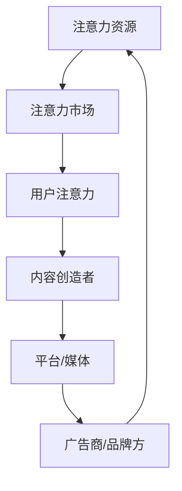

                 

# 注意力经济与内容创作策略：如何吸引并留住受众

## 摘要

在当今数字化时代，注意力已成为一种稀缺资源。本文将深入探讨注意力经济这一新兴领域，从概念、原理到实际应用，全面解析注意力经济对内容创作的影响。本文旨在为内容创作者和企业家提供有效的策略，以吸引并留住受众，提升内容价值，实现商业成功。

## 关键词

注意力经济、内容创作、受众吸引、留存策略、用户体验、算法推荐、品牌营销

### 目录大纲：注意力经济与内容创作策略

## 第一部分：注意力经济概述

### 第1章：注意力经济的概念与背景
#### 1.1 注意力经济的定义
#### 1.2 注意力经济的兴起背景
#### 1.3 注意力经济与传统经济模式的差异

### 第2章：注意力经济的核心原理
#### 2.1 注意力资源的特性
#### 2.2 注意力市场的运作机制
#### 2.3 注意力价值评估方法

### 第3章：注意力经济的模型与框架
#### 3.1 注意力经济的经典模型
#### 3.2 注意力经济的创新框架
#### 3.3 注意力经济在不同行业中的应用

## 第二部分：内容创作策略

### 第4章：内容创作的基本原则
#### 4.1 内容创作的目标与定位
#### 4.2 内容创作的核心要素
#### 4.3 内容创作的风格与风格选择

### 第5章：内容创作策略的制定
#### 5.1 目标受众分析
#### 5.2 内容策划与规划
#### 5.3 内容发布与推广

### 第6章：提高内容吸引力和留存率
#### 6.1 用户体验的重要性
#### 6.2 内容质量提升策略
#### 6.3 内容创新与持续更新

### 第7章：内容创作中的法律风险与合规性
#### 7.1 内容创作中的知识产权问题
#### 7.2 内容合规性审查
#### 7.3 应对法律风险的策略

## 第三部分：实战案例与应用

### 第8章：注意力经济与内容创作的成功案例
#### 8.1 案例一：某知名自媒体平台的内容策略
#### 8.2 案例二：某电商平台的用户互动策略
#### 8.3 案例三：某内容创业者的成长之路

### 第9章：注意力经济与内容创作在实践中的应用
#### 9.1 注意力经济在企业内部的应用
#### 9.2 内容创作在品牌营销中的策略
#### 9.3 注意力经济与内容创作在社交媒体中的应用

### 第10章：注意力经济与内容创作的未来发展趋势
#### 10.1 注意力经济的影响因素
#### 10.2 内容创作的新趋势
#### 10.3 注意力经济与内容创作的未来前景

## 附录

### 附录A：注意力经济与内容创作常用工具与资源
#### A.1 注意力经济研究工具
#### A.2 内容创作工具
#### A.3 注意力经济与内容创作相关网站和资源

### 核心概念与联系

#### 注意力经济模型

### 第一部分：注意力经济概述

### 第1章：注意力经济的概念与背景

#### 1.1 注意力经济的定义

注意力经济是指在经济活动中，以用户注意力作为核心资源进行价值交换和创造的一种新型经济模式。在这种经济模式中，用户的注意力被视为一种稀缺资源，可以用来交换有价值的信息、服务和产品。

#### 1.2 注意力经济的兴起背景

随着互联网和数字媒体的快速发展，人们获取信息的渠道变得多样化，注意力资源变得尤为珍贵。传统的商品和服务竞争已逐渐演变为对用户注意力的争夺。这一背景下，注意力经济应运而生。

#### 1.3 注意力经济与传统经济模式的差异

传统经济模式主要关注物质资源的交换，而注意力经济则强调用户注意力的价值。在注意力经济中，用户注意力成为企业竞争的关键资源，通过吸引和留住用户注意力来实现商业价值。

### 第2章：注意力经济的核心原理

#### 2.1 注意力资源的特性

注意力资源具有以下特性：

1. **稀缺性**：用户的注意力是有限的，无法同时关注多个内容。
2. **价值性**：注意力可以转化为经济效益，用户愿意为有价值的信息支付注意力。
3. **可交换性**：用户可以通过注意力交换获取有价值的信息或服务。

#### 2.2 注意力市场的运作机制

注意力市场的运作机制主要包括以下几个方面：

1. **需求方**：内容创造者通过提供有价值的信息和服务吸引用户注意力。
2. **供给方**：用户通过投入注意力来获取有价值的信息和服务。
3. **价格机制**：用户注意力的价值通过市场供求关系形成价格。

#### 2.3 注意力价值评估方法

评估注意力价值的方法有多种，以下列举几种常见的方法：

1. **用户参与度**：通过用户的点击率、评论数、分享量等指标衡量。
2. **用户留存率**：通过用户的重复访问次数、使用时长等指标衡量。
3. **转化率**：通过用户实际转化为购买、订阅或其他行为的情况衡量。

### 第3章：注意力经济的模型与框架

#### 3.1 注意力经济的经典模型

经典注意力经济模型主要包括以下几种：

1. **注意力市场模型**：将注意力视为一种商品，在市场中进行买卖。
2. **注意力流模型**：描述用户注意力在不同内容之间的流动过程。
3. **注意力回馈模型**：用户通过注意力投入获得相应回报。

#### 3.2 注意力经济的创新框架

随着科技的发展，注意力经济也在不断创新。以下列举几种创新框架：

1. **算法推荐框架**：利用算法推荐系统，将用户注意力引导到有价值的内容。
2. **用户参与式内容创作**：鼓励用户参与内容创作，提高用户注意力投入。
3. **注意力货币化**：将用户注意力转化为虚拟货币，进行交易。

#### 3.3 注意力经济在不同行业中的应用

注意力经济在各个行业中的应用日益广泛，以下列举几个典型案例：

1. **互联网行业**：通过算法推荐、用户互动等手段吸引和留住用户注意力。
2. **媒体行业**：通过内容创新和用户参与，提高用户粘性，实现注意力价值最大化。
3. **教育行业**：利用在线教育平台，提供有价值的学习资源，吸引学生注意力。

### 第二部分：内容创作策略

### 第4章：内容创作的基本原则

#### 4.1 内容创作的目标与定位

内容创作的目标在于吸引和留住目标受众，提升用户满意度和品牌价值。在进行内容创作时，需要明确目标受众的定位，了解他们的需求和兴趣，从而创作出符合他们期待的内容。

#### 4.2 内容创作的核心要素

内容创作的核心要素包括以下几个方面：

1. **内容质量**：高质量的内容是吸引和留住受众的关键，内容需要具有深度、权威性和实用性。
2. **内容形式**：多样化的内容形式有助于满足不同受众的阅读偏好，如图文、视频、直播等。
3. **用户体验**：优秀的用户体验能够提升用户满意度和忠诚度，包括页面加载速度、互动设计等。

#### 4.3 内容创作的风格与风格选择

内容创作的风格要符合目标受众的审美偏好和阅读习惯。常见的风格包括严肃、幽默、生动、简洁等。选择合适的风格有助于提升内容吸引力，实现目标受众的有效传达。

### 第5章：内容创作策略的制定

#### 5.1 目标受众分析

制定内容创作策略的首要步骤是进行目标受众分析。了解目标受众的年龄、性别、职业、兴趣爱好等信息，有助于制定更具针对性的内容策略。

#### 5.2 内容策划与规划

在明确目标受众后，需要进行内容策划与规划。包括确定内容主题、形式、发布频率等。合理的策划与规划有助于提升内容的价值和受众覆盖率。

#### 5.3 内容发布与推广

内容发布与推广是内容创作策略的关键环节。通过多渠道发布内容，利用社交媒体、搜索引擎等推广手段，提高内容的曝光度和受众参与度。

### 第6章：提高内容吸引力和留存率

#### 6.1 用户体验的重要性

用户体验是影响内容吸引力和留存率的重要因素。优化页面设计、提升加载速度、提供互动功能等，都能够提升用户满意度和忠诚度。

#### 6.2 内容质量提升策略

高质量的内容是提升内容吸引力和留存率的基础。通过深入调研、专业写作、严谨编辑等手段，确保内容的深度、权威性和实用性。

#### 6.3 内容创新与持续更新

内容创新和持续更新是吸引和留住受众的关键。定期发布新内容，关注行业动态，探索新形式、新话题，都能够提升内容的新鲜感和吸引力。

### 第7章：内容创作中的法律风险与合规性

#### 7.1 内容创作中的知识产权问题

知识产权是内容创作中不可忽视的问题。创作者需要尊重他人的知识产权，确保内容的原创性和合法性。同时，要保护自己的知识产权，避免侵权行为。

#### 7.2 内容合规性审查

在内容创作过程中，需要进行合规性审查，确保内容不违反相关法律法规，不涉及违法、违规行为。合规性审查包括版权、隐私、广告等各方面。

#### 7.3 应对法律风险的策略

为应对法律风险，创作者可以采取以下策略：

1. **了解相关法律法规**：了解内容创作相关的法律法规，确保内容合规。
2. **签署合作协议**：与合作伙伴签订协议，明确知识产权归属和责任。
3. **专业法律咨询**：在遇到法律问题时，及时寻求专业法律咨询。

### 第三部分：实战案例与应用

### 第8章：注意力经济与内容创作的成功案例

#### 8.1 案例一：某知名自媒体平台的内容策略

某知名自媒体平台通过以下策略吸引和留住用户注意力：

1. **内容多元化**：提供图文、视频、直播等多种形式的内容，满足不同受众的阅读偏好。
2. **用户参与式内容创作**：鼓励用户参与内容创作，提高用户粘性。
3. **算法推荐**：利用算法推荐系统，将用户感兴趣的内容推送给他们。

#### 8.2 案例二：某电商平台的用户互动策略

某电商平台通过以下策略提高用户互动和留存率：

1. **用户评价系统**：鼓励用户对商品进行评价，提高用户参与度。
2. **互动营销活动**：举办各种互动营销活动，吸引用户参与。
3. **个性化推荐**：根据用户行为和兴趣，提供个性化商品推荐。

#### 8.3 案例三：某内容创业者的成长之路

某内容创业者通过以下策略实现内容创作的成功：

1. **明确目标受众**：了解目标受众的需求和兴趣，创作符合他们期待的内容。
2. **持续创新**：定期发布新内容，关注行业动态，保持内容的新鲜感。
3. **品牌建设**：打造独特的内容品牌，提高用户忠诚度。

### 第9章：注意力经济与内容创作在实践中的应用

#### 9.1 注意力经济在企业内部的应用

企业可以利用注意力经济原理，提高员工的工作效率和创造力。例如：

1. **员工培训**：通过提供有价值的学习资源，提高员工的专业技能。
2. **团队合作**：鼓励团队成员参与项目讨论，提高团队协作效率。
3. **激励机制**：通过奖励机制，激发员工的工作热情和创造力。

#### 9.2 内容创作在品牌营销中的策略

品牌可以通过内容创作吸引和留住目标受众，提高品牌知名度和影响力。以下是一些策略：

1. **品牌故事**：通过讲述品牌故事，塑造品牌形象，提高用户情感认同。
2. **KOL合作**：与知名意见领袖合作，利用他们的关注度提升品牌曝光度。
3. **内容营销**：通过发布有价值的内容，引导用户关注品牌，提升品牌认知。

#### 9.3 注意力经济与内容创作在社交媒体中的应用

社交媒体平台可以利用注意力经济原理，提高用户活跃度和留存率。以下是一些策略：

1. **算法推荐**：利用算法推荐系统，将用户感兴趣的内容推送给他们。
2. **互动设计**：通过点赞、评论、分享等功能，增加用户互动，提高用户粘性。
3. **内容创新**：定期发布新形式、新话题的内容，保持用户兴趣。

### 第10章：注意力经济与内容创作的未来发展趋势

#### 10.1 注意力经济的影响因素

随着科技的不断发展，注意力经济将受到以下因素的影响：

1. **人工智能**：人工智能技术的应用将提高内容创作和推荐的效果，提升用户体验。
2. **大数据**：大数据分析有助于更精准地了解用户需求和兴趣，提高内容价值。
3. **区块链**：区块链技术将为注意力经济提供更安全、可信的交换机制。

#### 10.2 内容创作的新趋势

未来内容创作将呈现以下新趋势：

1. **个性化**：个性化内容将更加普及，满足用户个性化需求。
2. **多元化**：内容形式将更加多元化，满足不同受众的阅读偏好。
3. **互动性**：互动性内容将提高用户参与度和留存率。

#### 10.3 注意力经济与内容创作的未来前景

随着注意力经济的不断发展，内容创作将在未来发挥更加重要的作用。通过不断创新和优化，内容创作者和企业家将能够更好地吸引和留住受众，实现商业成功。

### 附录A：注意力经济与内容创作常用工具与资源

#### A.1 注意力经济研究工具

1. **Google Analytics**：分析用户行为，了解用户需求和兴趣。
2. **Tableau**：可视化数据，帮助制定内容策略。
3. **Google Trends**：了解关键词搜索趋势，把握市场动态。

#### A.2 内容创作工具

1. **Canva**：设计图文内容，提升视觉效果。
2. **Hippo Video**：制作视频内容，提高用户参与度。
3. **ContentCal**：内容策划与发布工具，提高内容效率。

#### A.3 注意力经济与内容创作相关网站和资源

1. **Content Marketing Institute**：提供内容营销的案例、策略和资源。
2. **Neil Patel**：分享内容营销和SEO的最佳实践。
3. **Udemy**：学习内容创作和数字营销的课程。

### 作者信息

**作者：** AI天才研究院/AI Genius Institute & 禅与计算机程序设计艺术 /Zen And The Art of Computer Programming

---

在撰写本文的过程中，我们深入探讨了注意力经济与内容创作的关系，从概念、原理到实际应用，全面分析了如何通过有效的策略吸引和留住受众。通过本文，读者可以了解到注意力经济的核心原理，掌握内容创作的基本原则和策略，并学会在实际项目中应用注意力经济与内容创作的方法。希望本文能为读者在数字化时代的商业竞争中提供有益的启示和指导。

