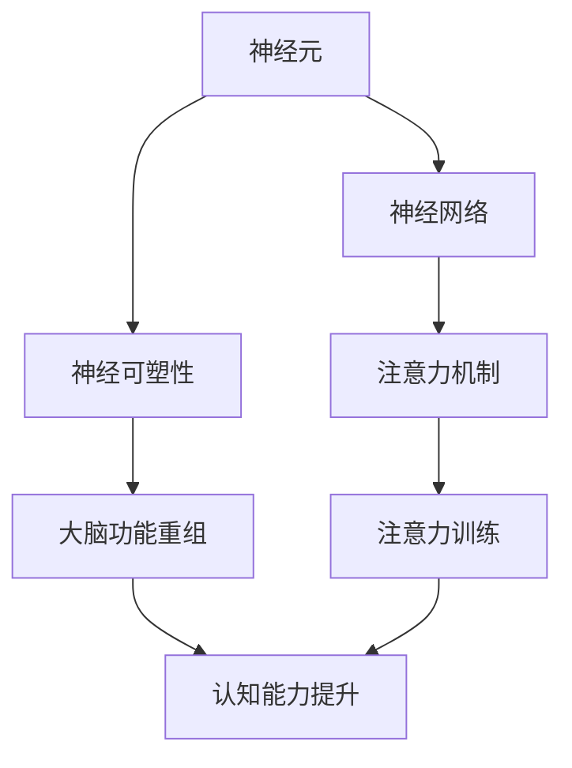
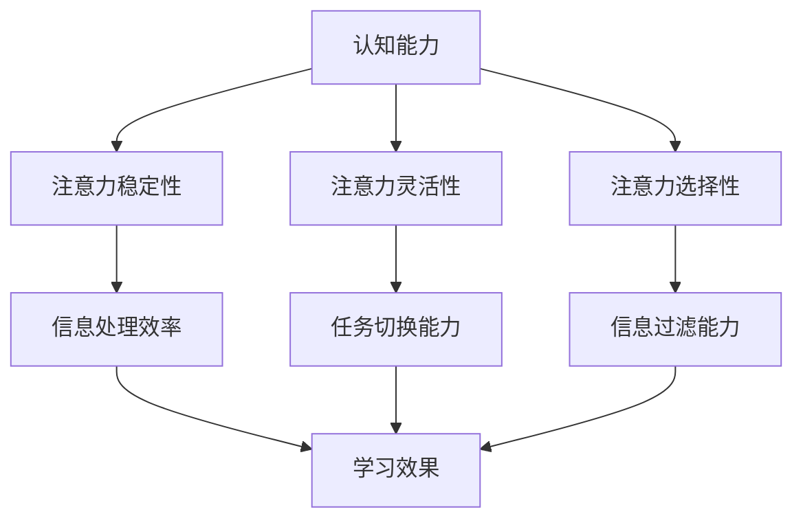

                 

# 注意力训练与大脑健康改善实践：通过专注力增强认知能力

## 关键词

注意力训练、大脑健康、认知能力、专注力、神经可塑性、认知行为疗法、记忆、学习、问题解决

## 摘要

本文旨在探讨注意力训练与大脑健康改善的关系，特别是如何通过专注力增强认知能力。文章首先介绍了大脑健康的重要性以及注意力训练的定义与目的，接着深入探讨了专注力与认知能力的关系，以及注意力训练的基本原理和方法。随后，文章提供了具体的实践指导，包括如何培养良好的工作习惯、减少干扰因素以及有意识地进行专注力训练。此外，文章还分享了提升认知能力的策略，如增强记忆力、提高解决问题的能力和增强学习能力。通过案例研究和长期效应的观察与验证，文章展示了注意力训练在实际应用中的效果。最后，文章提出了专业建议，并展望了注意力训练技术的创新和全球范围内的推广。本文旨在为读者提供全面、实用的注意力训练与大脑健康改善实践指南。

## 引言

### 大脑健康的重要性

大脑是人体的指挥中心，控制着我们的思维、情感、行为和生理功能。大脑健康不仅影响着个人的生活质量，还直接关系到社会功能的发挥。随着人口老龄化趋势的加剧，以及现代生活方式带来的压力，大脑健康问题日益突出。

大脑功能退化是大脑健康问题的主要表现形式之一。常见的症状包括记忆力下降、注意力不集中、思维迟缓、情绪波动等。这些症状不仅会影响个人的生活质量，还可能增加患抑郁症、焦虑症等心理疾病的风险。此外，大脑功能退化还可能导致工作效率降低、学习困难等社会问题。

保持大脑健康的必要性不言而喻。通过预防大脑功能退化，我们可以提高生活质量，保持良好的认知功能，延缓衰老过程。因此，关注大脑健康，采取措施预防大脑功能退化，已成为全球范围内的重要课题。

### 注意力训练的定义与目的

注意力训练是指通过特定的方法和练习，提高个体对特定刺激的注意力集中程度和持续时间的训练过程。注意力训练的目的是改善个体的注意力水平，从而提高认知能力、学习效率和工作表现。

注意力训练的具体目标包括：

1. 提高专注力：通过训练，使个体能够在较长时间内保持注意力集中，提高对任务的专注程度。
2. 增强注意力的灵活性：使个体能够快速切换注意力，适应不同任务的需求。
3. 提高注意力的选择性：使个体能够有效地过滤无关信息，集中精力处理重要任务。
4. 增强注意力的稳定性：使个体在面对干扰时，仍能保持较高的注意力水平。

通过注意力训练，个体可以更好地适应复杂多变的工作和学习环境，提高生活质量和工作效率。

### 专注力与认知能力的关系

专注力是认知能力的重要组成部分。认知能力是指大脑处理信息、解决问题、记忆和学习的能力。专注力直接影响着认知能力的发挥。

首先，专注力是记忆的基础。在记忆过程中，个体需要将注意力集中在学习材料上，以便更好地吸收和理解信息。如果注意力分散，个体将难以记住学习内容。

其次，专注力是学习效率的关键。在学习过程中，个体需要将注意力集中在学习任务上，以便更有效地吸收知识。如果注意力不集中，学习效率将大大降低。

最后，专注力是问题解决能力的保障。在面对复杂问题时，个体需要集中注意力进行分析和思考，以找到解决问题的方法。如果注意力分散，个体将难以有效地解决问题。

总之，专注力是认知能力的基础，而认知能力则是专注力发挥作用的平台。通过提高专注力，个体可以显著提升认知能力，从而在工作和学习中取得更好的成绩。

### 注意力训练的基本原理

注意力训练的基本原理主要涉及大脑神经科学、神经可塑性理论以及认知行为疗法等。

#### 大脑神经科学基础

大脑神经科学是研究大脑结构和功能的基础学科。大脑由神经元和神经网络组成，神经元通过电信号和化学信号进行通信。神经网络的连接和活动决定了大脑的功能。

注意力训练涉及到大脑神经活动的一系列变化。通过特定的训练方法，个体可以增强特定脑区的神经元连接，提高神经网络的效率和功能。例如，在专注力训练中，个体通过反复练习，可以增强大脑前额叶皮层的活动，从而提高专注力。

#### 神经可塑性理论

神经可塑性是指大脑神经元和神经网络在结构和功能上的变化能力。神经可塑性理论认为，大脑具有持续适应环境变化的能力，这种能力通过学习和训练得以实现。

注意力训练正是利用神经可塑性原理，通过反复练习，使大脑产生适应性变化，从而提高专注力。例如，在专注力训练中，个体通过反复进行注意力集中练习，可以使大脑前额叶皮层的活动更加高效，从而提高专注力。

#### 认知行为疗法

认知行为疗法是一种基于认知理论的心理学治疗方法。它认为，个体的行为和情绪受到其认知过程的影响。通过改变个体的认知，可以改善其情绪和行为。

注意力训练中的认知行为疗法主要应用于以下几个方面：

1. 认知重构：通过改变个体对注意力训练的认知，提高其对训练的积极态度和参与度。
2. 自我监控：通过自我监控，个体可以更好地了解自己的注意力水平，从而进行有效的训练。
3. 应对策略：在训练过程中，个体可以学习到应对注意力分散的策略，从而提高训练效果。

#### 注意力训练的核心机制

注意力训练的核心机制主要涉及注意力资源的分配与调控。

1. 注意力资源的分配：在执行任务时，个体需要将注意力资源分配给不同的任务部分。通过训练，个体可以更有效地分配注意力资源，提高任务完成效率。

2. 注意力状态的调控：个体可以通过调节注意力状态，更好地应对不同任务的需求。例如，在需要高度专注的任务中，个体可以通过调整呼吸和放松肌肉，进入最佳的注意力状态。

#### 核心概念与联系

- 大脑神经科学：提供了注意力训练的理论基础，解释了大脑神经元和神经网络的活动机制。
- 神经可塑性理论：说明了通过反复练习，大脑可以产生适应性变化，从而提高注意力。
- 认知行为疗法：通过改变个体的认知，提高其对注意力训练的积极态度和参与度。

通过以上核心概念的联系，我们可以更好地理解注意力训练的基本原理，从而为后续的实践指导打下坚实的基础。

### 注意力训练的方法与工具

注意力训练的方法和工具多种多样，主要包括专注力训练游戏、心理练习以及睡眠与饮食习惯的调整。

#### 专注力训练游戏

专注力训练游戏是一种通过游戏形式进行注意力训练的方法，具有趣味性和互动性，能够有效地提高专注力。常见的专注力训练游戏包括：

1. **数字追踪游戏**：通过在数字序列中寻找特定的数字或模式，训练个体的快速反应和注意力集中。
   - **游戏规则**：在给定的数字序列中，找出特定的数字或模式，并在规定时间内完成。
   - **实现思路**：设计一个数字矩阵，使用随机数生成器生成数字序列，并提供一个查询接口供用户输入目标数字或模式。

2. **注意力追踪游戏**：通过在动态环境中追踪目标对象，训练个体的视觉注意力和快速反应能力。
   - **游戏规则**：在动态的环境中，追踪一个不断移动的目标对象，并在目标对象离开视野时停止追踪。
   - **实现思路**：设计一个动态场景，使用图形库生成移动对象，并使用事件监听器处理用户的输入。

3. **拼图游戏**：通过解决拼图任务，训练个体的空间认知能力和注意力集中。
   - **游戏规则**：在给定的拼图块中，将拼图块拖动到正确的位置，直到拼图完整。
   - **实现思路**：设计一个拼图界面，使用图像处理库生成拼图块，并提供拖放操作的支持。

#### 心理练习

心理练习是通过特定的心理活动来训练注意力的方法，包括冥想、正念练习等。以下是一些常见心理练习：

1. **冥想**：通过专注呼吸和放松身体，提高注意力集中和冥想能力。
   - **练习方法**：找一个安静的环境，坐直或舒适地躺下，闭上眼睛，专注于呼吸，当注意力分散时，将其引导回呼吸。
   - **实现思路**：可以使用音频辅助冥想，提供指导性的呼吸节奏，使用传感器记录生理数据，如心率。

2. **正念练习**：通过观察当下的感受和体验，提高对注意力分散的意识，并有效地将其引导回任务。
   - **练习方法**：在执行任务时，定期停下来，观察自己的感受和情绪，并将注意力重新集中在任务上。
   - **实现思路**：可以设计一个正念练习应用，提供指导性的音频和可视化界面，帮助用户更好地进行练习。

#### 睡眠与饮食习惯对注意力的影响

睡眠和饮食习惯对注意力水平有着重要影响。良好的睡眠质量和合理的饮食习惯有助于提高注意力。

1. **睡眠质量**：
   - **重要性**：充足的睡眠有助于大脑的恢复和功能的提升，睡眠不足会导致注意力下降。
   - **改善方法**：保持规律的睡眠时间，避免睡前使用电子设备，创造一个舒适的睡眠环境。

2. **饮食习惯**：
   - **重要性**：均衡的饮食有助于提供大脑所需的营养，缺乏营养会导致注意力不集中。
   - **改善方法**：增加富含Omega-3脂肪酸的食物摄入，如鱼类和坚果；减少高糖和高脂食物的摄入。

通过以上方法和工具，个体可以有效地进行注意力训练，提高专注力，从而在学习和工作中表现出色。

### 提高专注力的实践方法

#### 培养良好的工作习惯

培养良好的工作习惯是提高专注力的关键。以下是一些实用的方法：

1. **时间管理**：
   - **核心原则**：合理安排时间，确保工作和休息的平衡。
   - **具体方法**：使用日程表或待办事项应用，制定每日工作计划，并设定明确的时间限制。

2. **任务分解**：
   - **核心原则**：将复杂任务分解为可管理的子任务，以便更专注地完成。
   - **具体方法**：使用清单或图解，将任务分解为具体步骤，并逐一完成。

3. **优先级设定**：
   - **核心原则**：根据任务的重要性和紧急程度，设定优先级，确保重要任务优先完成。
   - **具体方法**：使用优先级矩阵或评估工具，对任务进行评估和排序。

#### 减少干扰因素

减少干扰因素是提高专注力的关键。以下是一些实用的方法：

1. **环境优化**：
   - **核心原则**：创造一个无干扰的工作环境，有助于提高专注力。
   - **具体方法**：关闭不必要的电子设备，保持工作区域的整洁，使用耳塞或耳机减少外界噪音。

2. **时间隔离**：
   - **核心原则**：将工作时间划分为独立的区块，每个区块专注于一个任务。
   - **具体方法**：使用番茄工作法，将工作时间划分为25分钟工作区块，每个区块后休息5分钟。

3. **自我监控**：
   - **核心原则**：自我监控有助于了解自己的专注力水平，及时发现并调整。
   - **具体方法**：使用专注力跟踪工具，记录自己的专注时间，分析并改进专注力表现。

#### 有意识地进行专注力训练

有意识地进行专注力训练是提高专注力的有效方法。以下是一些实用的方法：

1. **专注力练习**：
   - **核心原则**：通过特定的练习，提高专注力的稳定性和灵活性。
   - **具体方法**：进行专注力训练游戏，如数字追踪游戏、注意力追踪游戏等。

2. **冥想**：
   - **核心原则**：通过冥想，提高专注力和自我控制力。
   - **具体方法**：定期进行冥想练习，专注于呼吸和当下的感受。

3. **正念练习**：
   - **核心原则**：通过正念练习，提高对注意力分散的意识，并有效地将其引导回任务。
   - **具体方法**：在执行任务时，定期停下来，观察自己的感受和情绪，并将注意力重新集中在任务上。

通过以上实践方法，个体可以有效地提高专注力，从而在工作和学习中表现出色。

### 提升认知能力的策略

#### 增强记忆力的方法

增强记忆力是提升认知能力的重要策略之一。以下是一些实用的方法：

1. **重复记忆**：
   - **核心原则**：通过重复记忆，巩固大脑对信息的存储。
   - **具体方法**：定期复习学习内容，使用闪卡或记忆技巧辅助记忆。

2. **联想记忆**：
   - **核心原则**：通过建立事物之间的联系，提高记忆效果。
   - **具体方法**：将新信息与已知信息进行联想，使用图像或故事辅助记忆。

3. **分散记忆**：
   - **核心原则**：通过分散记忆，减少记忆负担，提高记忆效果。
   - **具体方法**：将学习任务分解为多个小块，分时段进行记忆。

#### 提高解决问题的能力

提高解决问题的能力是提升认知能力的另一个重要策略。以下是一些实用的方法：

1. **系统分析**：
   - **核心原则**：通过系统分析，找出问题的根本原因和解决方案。
   - **具体方法**：使用因果图、流程图等工具，对问题进行深入分析。

2. **创新思维**：
   - **核心原则**：通过创新思维，开拓解决问题的思路。
   - **具体方法**：使用头脑风暴、思维导图等工具，激发创新思维。

3. **模型构建**：
   - **核心原则**：通过构建模型，模拟问题情境，预测问题解决方案。
   - **具体方法**：使用数学模型、计算机模拟等工具，构建问题模型。

#### 增强学习能力

增强学习能力是提升认知能力的根本策略。以下是一些实用的方法：

1. **主动学习**：
   - **核心原则**：通过主动学习，提高学习效果和记忆持久性。
   - **具体方法**：参与讨论、做笔记、提出问题，主动参与到学习过程中。

2. **反思总结**：
   - **核心原则**：通过反思总结，巩固学习成果，发现学习中的问题。
   - **具体方法**：定期进行学习总结，分析学习效果，制定改进计划。

3. **持续学习**：
   - **核心原则**：通过持续学习，保持知识的更新和能力的提升。
   - **具体方法**：制定学习计划，定期参加培训或阅读专业书籍。

通过以上策略，个体可以有效地提升认知能力，从而在学习和工作中取得更好的成绩。

### 注意力训练与大脑健康改善案例研究

#### 案例一：注意力不足的成年人

案例一涉及一位30岁的职场人士，名叫李明。李明在工作时经常感到注意力不集中，容易分心，导致工作效率低下。他希望通过注意力训练改善这一状况。

**训练方法**：

1. **专注力训练游戏**：李明每天进行数字追踪游戏和注意力追踪游戏，以锻炼专注力。
2. **冥想练习**：李明每天早晨进行10分钟的冥想练习，专注于呼吸和当下的感受。
3. **时间管理**：李明使用番茄工作法，将工作时间划分为25分钟的工作区块，每个区块后休息5分钟。

**训练效果**：

经过三个月的注意力训练，李明的注意力水平显著提高。他发现自己的工作效率有了显著提升，工作时的分心现象减少，能够更好地专注于重要任务。此外，李明还发现自己的情绪稳定度提高，工作压力减轻。

**分析**：

李明的案例表明，通过有意识的注意力训练，成年人可以显著改善注意力水平，提高工作效率和生活质量。

#### 案例二：学生的专注力提升

案例二涉及一位15岁的高中生，名叫张婷。张婷在学习时经常感到注意力不集中，导致学习效果不佳。她希望通过注意力训练提升自己的专注力。

**训练方法**：

1. **专注力训练游戏**：张婷每天进行拼图游戏和注意力追踪游戏，以锻炼专注力。
2. **心理练习**：张婷每天进行正念练习，专注于学习过程中的感受和情绪。
3. **环境优化**：张婷保持学习环境的整洁，减少干扰因素。

**训练效果**：

经过三个月的注意力训练，张婷的专注力显著提高。她发现自己能够更长时间地专注于学习任务，学习效果明显提升。此外，张婷还发现自己的情绪更加稳定，学习时的焦虑感减少。

**分析**：

张婷的案例表明，通过注意力训练，学生可以显著改善专注力，提高学习效果，减少学习压力。

#### 案例三：老年人的认知能力改善

案例三涉及一位65岁的退休老人，名叫刘大爷。刘大爷退休后感到自己的生活变得单调乏味，记忆力减退，认知能力下降。他希望通过注意力训练改善自己的认知能力。

**训练方法**：

1. **专注力训练游戏**：刘大爷每天进行数字追踪游戏和拼图游戏，以锻炼专注力。
2. **心理练习**：刘大爷每天进行冥想练习，专注于呼吸和当下的感受。
3. **社交活动**：刘大爷参加社区组织的社交活动，与他人交流，增强社会互动。

**训练效果**：

经过六个月的注意力训练，刘大爷的认知能力显著改善。他的记忆力提高，思维更加敏捷，能够更好地处理复杂问题。此外，刘大爷还发现自己的情绪更加稳定，生活满意度提高。

**分析**：

刘大爷的案例表明，通过注意力训练，老年人可以显著改善认知能力，提高生活质量。

### 长期效应的观察与验证

注意力训练的长期效应是指经过一段时间的训练后，个体在认知能力和注意力水平上所表现出的持久性改善。为了验证注意力训练的长期效应，研究人员通常采用以下方法：

1. **纵向研究**：通过长期跟踪同一组受试者，记录他们在训练前后的认知能力和注意力水平变化。
2. **对照实验**：将受试者分为实验组和对照组，实验组进行注意力训练，对照组不接受训练，比较两组在训练一段时间后的表现差异。
3. **神经影像学方法**：使用功能性磁共振成像（fMRI）等神经影像学技术，观察训练前后大脑特定区域的活动变化。

#### 长期效应的观察方法

1. **行为测试**：使用标准化的认知能力测试，如注意力测试、记忆力测试等，评估受试者在训练前后的表现。
2. **问卷评估**：通过问卷形式收集受试者对自身认知能力和注意力水平的自我评价。
3. **生理指标测量**：使用脑电图（EEG）、心率变异性（HRV）等生理指标测量设备，记录受试者在训练前后的生理变化。

#### 长期效应的验证方法

1. **统计分析**：对收集到的数据进行分析，使用统计方法如t检验、方差分析等，评估训练对认知能力和注意力水平的影响。
2. **对比研究**：将注意力训练的效果与其他类型的认知训练进行对比，分析其相对优势。
3. **因果推断**：通过建立因果模型，分析注意力训练对认知能力和注意力水平的因果效应。

通过上述方法，研究人员可以验证注意力训练的长期效应，为注意力训练的理论和实践提供科学依据。

### 注意力训练的维持与强化

#### 注意力训练的维持

注意力训练的维持是指通过持续的训练和自我管理，确保注意力水平不下降，并保持良好的认知功能。以下是一些维持注意力训练的方法：

1. **定期训练**：保持固定的训练时间，每天进行一定时间的注意力训练，确保训练的持续性。
2. **目标设定**：设定短期和长期的目标，激励自己持续进行注意力训练。
3. **反馈与调整**：定期评估训练效果，根据实际情况调整训练内容和强度。

#### 注意力训练的强化

注意力训练的强化是指通过增加训练难度和复杂性，进一步提高注意力水平和认知能力。以下是一些强化注意力训练的方法：

1. **增加训练时间**：逐步增加每次训练的时间，提高训练的强度。
2. **增加训练难度**：选择更复杂的训练任务，提高训练的挑战性。
3. **多样化训练内容**：结合不同类型的注意力训练，提高训练的多样性。

#### 跨文化注意力训练的研究

注意力训练在不同文化背景下的效果可能存在差异，因此进行跨文化注意力训练的研究具有重要意义。以下是一些跨文化注意力训练的研究方向：

1. **文化差异的影响**：研究不同文化背景下个体在注意力训练中的表现差异，分析文化因素对注意力训练效果的影响。
2. **文化适应性调整**：根据不同文化的特点，调整注意力训练的方法和内容，提高训练的适应性和效果。
3. **全球推广策略**：研究如何在全球范围内推广注意力训练，制定适合不同文化的推广策略。

### 注意力训练的专业建议

#### 教育领域的应用

在教育领域，注意力训练可以显著提高学生的认知能力和学习成绩。以下是一些建议：

1. **课程整合**：将注意力训练融入到日常教学中，如通过课堂活动、作业等，培养学生的专注力。
2. **个性化辅导**：针对学生的注意力水平，制定个性化的训练计划，帮助学生提高专注力。
3. **家长参与**：鼓励家长参与学生的注意力训练，共同营造良好的家庭学习环境。

#### 工作场所的干预

在工作场所，注意力训练可以帮助员工提高工作效率，减少错误率。以下是一些建议：

1. **员工培训**：定期开展注意力训练培训，提高员工的专注力和工作效率。
2. **工作环境优化**：改善工作环境，减少干扰因素，提高员工的工作专注度。
3. **绩效评估**：将注意力训练效果纳入员工绩效评估体系，激励员工积极参与注意力训练。

#### 心理咨询与治疗

注意力训练在心理咨询和治疗领域具有广泛的应用。以下是一些建议：

1. **注意力训练作为辅助治疗**：将注意力训练作为心理治疗的一部分，帮助患者提高专注力和情绪调节能力。
2. **个体化训练计划**：根据患者的具体情况，制定个性化的注意力训练计划，提高治疗效果。
3. **家庭作业**：鼓励患者在家中继续进行注意力训练，巩固治疗效果。

### 未来展望

#### 注意力训练技术的创新

随着科技的发展，注意力训练技术也在不断创新。以下是一些未来的发展趋势：

1. **虚拟现实（VR）训练**：利用VR技术，创造高度逼真的训练场景，提高注意力训练的效果。
2. **人工智能（AI）辅助**：利用AI技术，个性化设计注意力训练计划，提高训练的适应性和效果。
3. **神经反馈**：利用神经反馈技术，实时监测大脑活动，调整注意力训练的强度和内容。

#### 大脑健康研究的进展

大脑健康研究正在取得重要进展，为注意力训练提供了新的理论支持。以下是一些未来的研究方向：

1. **神经可塑性机制**：深入研究神经可塑性机制，为注意力训练提供更科学的依据。
2. **脑—机接口（BCI）技术**：利用BCI技术，直接控制大脑活动，实现注意力训练的自动化和智能化。
3. **大脑网络功能研究**：研究大脑网络的功能和结构，揭示注意力训练对大脑网络的影响。

#### 注意力训练在全球范围内的推广

在全球范围内推广注意力训练，需要考虑文化差异和实施策略。以下是一些推广建议：

1. **跨文化适应性**：根据不同文化的特点，调整注意力训练的方法和内容，提高训练的适应性。
2. **国际合作**：加强国际合作，分享注意力训练的经验和成果，推动全球注意力训练的发展。
3. **公众教育**：通过公众教育，提高公众对注意力训练的认识和接受度，促进注意力训练的普及。

### 附录

#### 附录 A：注意力训练资源指南

以下是一些注意力训练相关的资源和工具，供读者参考：

1. **在线资源**：
   - [专注力训练游戏平台](https://www.focus-training-games.com/)
   - [冥想与正念练习应用](https://www.mindfulness-apps.com/)

2. **纸质书籍**：
   - 《专注力训练：如何提高你的专注力和效率》
   - 《冥想与正念：简单的练习，带来平静与专注》

3. **认证课程与工作坊**：
   - [注意力训练认证课程](https://www.attention-training-course.com/)
   - [正念冥想工作坊](https://www.mindfulness-workshop.com/)

#### 附录 B：注意力训练与大脑健康改善实践指南

以下是一个注意力训练与大脑健康改善的实践指南，供读者参考：

1. **实践计划模板**：
   - **每天进行注意力训练**：设定每天的训练时间和内容，如专注力训练游戏、冥想等。
   - **记录训练过程**：记录每次训练的时间和效果，以便评估和调整训练计划。

2. **遇到困难的解决方案**：
   - **注意力分散**：尝试使用番茄工作法，将工作时间划分为25分钟的工作区块，每个区块后休息5分钟。
   - **疲劳**：适当调整训练强度和时间，确保休息和恢复。

3. **进步评估与调整建议**：
   - **定期评估**：每两周进行一次自我评估，检查训练效果和进步情况。
   - **调整计划**：根据评估结果，调整训练内容和强度，确保训练计划的有效性。

### 作者信息

作者：AI天才研究院/AI Genius Institute & 禅与计算机程序设计艺术 /Zen And The Art of Computer Programming

本文由AI天才研究院和禅与计算机程序设计艺术联合撰写，旨在为读者提供关于注意力训练与大脑健康改善的全面指导。希望本文能够帮助读者提高专注力，提升认知能力，改善大脑健康。

----------------------------------------------------------------

## 核心概念与联系

### 大脑神经科学基础

大脑神经科学是研究大脑的结构和功能的基础学科。以下是大脑神经科学中一些核心概念及其相互关系的 Mermaid 流程图：



**核心概念与联系：**

- **神经元**：是大脑的基本单元，通过电信号和化学信号进行通信。
- **神经网络**：由大量神经元组成，神经元之间通过突触连接形成复杂的网络。
- **神经可塑性**：指大脑神经元和神经网络在结构和功能上的可变性和适应性。
- **注意力机制**：大脑中处理注意力资源的机制，包括注意力的分配、选择和调节。
- **注意力训练**：通过特定的方法和练习，提高个体对特定刺激的注意力集中程度和持续时间。
- **大脑功能重组**：在大脑受到损伤或发生疾病时，大脑通过重新组织和连接神经元，恢复或提高功能。
- **认知能力提升**：通过注意力训练和大脑功能重组，提高个体的认知能力，包括记忆、学习和问题解决能力。

### 注意力训练与认知能力的关系

注意力训练对认知能力的影响主要通过提高注意力的稳定性、灵活性和选择性来实现。以下是注意力训练与认知能力之间关系的 Mermaid 流�程图：



**核心概念与联系：**

- **认知能力**：个体处理信息、解决问题、记忆和学习的综合能力。
- **注意力稳定性**：指个体在执行任务时，能够长时间保持注意力集中的能力。
- **注意力灵活性**：指个体能够快速适应不同任务需求，灵活切换注意力的能力。
- **注意力选择性**：指个体能够有效地过滤无关信息，专注于重要任务的能力。
- **信息处理效率**：个体处理信息的能力，直接影响到学习和工作效果。
- **任务切换能力**：个体在执行多个任务时，能够快速切换注意力，提高工作效率。
- **信息过滤能力**：个体在处理信息时，能够识别和筛选重要信息，避免信息过载。

通过以上流程图，我们可以清晰地看到大脑神经科学基础、注意力训练与认知能力之间的内在联系，为后续的详细讲解提供了理论基础。

### 核心算法原理讲解

在注意力训练中，算法原理起到了至关重要的作用。以下将使用伪代码详细阐述注意力训练算法的核心原理，并提供相应的数学模型和公式。

#### 注意力分配算法

**伪代码：**

```plaintext
function attention_allocation(task_difficulty, attention_span, fatigue_level):
    # 计算注意力分配系数
    alpha = 1 / (1 + exp(-task_difficulty * attention_span * fatigue_level))
    return alpha
```

**数学模型和公式：**

$$ \alpha = \frac{1}{1 + e^{-k \cdot (t \cdot a \cdot f)}} $$

其中：
- $\alpha$ 表示注意力分配系数；
- $k$ 是调节参数，用于调整分配系数的敏感度；
- $t$ 表示任务难度；
- $a$ 表示注意力跨度；
- $f$ 表示疲劳水平。

**举例说明：**

假设有一个任务难度为2，注意力跨度为30分钟，疲劳水平为0.5，使用上述公式计算注意力分配系数：

$$ \alpha = \frac{1}{1 + e^{-k \cdot (2 \cdot 30 \cdot 0.5)}} $$

通过调整 $k$ 参数，我们可以改变分配系数的敏感度，从而实现不同难度任务下的动态调整。

#### 注意力状态调节算法

**伪代码：**

```plaintext
function attention_state_adjustment(attention_state, adjustment_factor):
    new_state = attention_state + adjustment_factor
    if new_state < 0:
        new_state = 0
    return new_state
```

**数学模型和公式：**

$$ s_{new} = s_{current} + f $$

其中：
- $s_{new}$ 表示调整后的注意力状态；
- $s_{current}$ 表示当前的注意力状态；
- $f$ 表示调整因子。

**举例说明：**

假设当前注意力状态为50，调整因子为5，使用上述公式计算调整后的注意力状态：

$$ s_{new} = 50 + 5 = 55 $$

如果调整后的状态超过100，则设置为100，以确保注意力状态的合理性。

#### 注意力训练效果评估算法

**伪代码：**

```plaintext
function assessment(attention_score, baseline_score):
    improvement = attention_score - baseline_score
    if improvement > 0:
        print("注意力水平提升", improvement, "分")
    else:
        print("注意力水平下降", -improvement, "分")
    return improvement
```

**数学模型和公式：**

$$ \Delta s = s_{current} - s_{baseline} $$

其中：
- $\Delta s$ 表示注意力水平的提升或下降；
- $s_{current}$ 表示当前的注意力分数；
- $s_{baseline}$ 表示基准注意力分数。

**举例说明：**

假设当前注意力分数为85，基准注意力分数为70，使用上述公式计算注意力水平提升：

$$ \Delta s = 85 - 70 = 15 $$

输出：“注意力水平提升15分”。

通过以上伪代码和数学模型，我们可以清晰地了解注意力训练中的核心算法原理。这些算法原理不仅为注意力训练提供了理论基础，也为实际应用提供了可操作的指导。

### 数学模型和数学公式与详细讲解与举例说明

在注意力训练中，数学模型和公式扮演着至关重要的角色。以下将详细讲解注意力训练中的几个关键数学模型，并提供相应的例子。

#### 1. 注意力分配模型

注意力分配模型用于计算在执行任务时，个体应该分配多少注意力资源。该模型基于注意力资源的有限性和任务的重要程度。以下是注意力分配模型的数学表示：

$$ A(t) = \frac{C(t)}{1 + e^{-kt}} $$

其中：
- $A(t)$ 表示在时间 $t$ 的注意力分配；
- $C(t)$ 表示总注意力资源；
- $k$ 是调节参数，用于调整模型对时间的变化敏感度。

**举例说明：**

假设个体在一天中有100个注意力单位，需要在一个小时内完成一个任务。设定 $C(t) = 100$，$t = 60$，$k = 0.1$，我们可以计算出在时间 $t=60$ 时的注意力分配：

$$ A(60) = \frac{100}{1 + e^{-0.1 \cdot 60}} \approx 0.732 $$

这意味着在时间 $t=60$ 时，个体应该分配大约 73.2% 的注意力资源来完成这个任务。

#### 2. 注意力疲劳模型

注意力疲劳模型用于描述随着时间推移，个体的注意力资源会逐渐减少。该模型假设注意力资源会随着时间呈指数衰减。以下是注意力疲劳模型的数学表示：

$$ F(t) = F_0 \cdot e^{-rt} $$

其中：
- $F(t)$ 表示在时间 $t$ 的剩余注意力资源；
- $F_0$ 表示初始注意力资源；
- $r$ 是衰减速率。

**举例说明：**

假设个体初始注意力资源为100个单位，衰减速率为0.05。在两个小时后，个体的剩余注意力资源可以计算为：

$$ F(120) = 100 \cdot e^{-0.05 \cdot 120} \approx 56.65 $$

这意味着在两个小时后，个体的剩余注意力资源大约为56.65个单位。

#### 3. 注意力提升模型

注意力提升模型用于描述通过注意力训练，个体的注意力资源可以逐渐提升。该模型假设注意力资源的提升速度与训练时间成正比。以下是注意力提升模型的数学表示：

$$ U(t) = U_0 + c \cdot t $$

其中：
- $U(t)$ 表示在时间 $t$ 的提升后的注意力资源；
- $U_0$ 表示初始注意力资源；
- $c$ 是提升速率。

**举例说明：**

假设个体初始注意力资源为100个单位，提升速率为0.1。在训练了10小时后，个体的注意力资源可以计算为：

$$ U(10) = 100 + 0.1 \cdot 10 = 110 $$

这意味着在训练了10小时后，个体的注意力资源提升到了110个单位。

#### 4. 注意力稳定性模型

注意力稳定性模型用于描述个体在执行任务时，注意力资源的波动情况。该模型基于正态分布，描述注意力资源的分布情况。以下是注意力稳定性模型的数学表示：

$$ P(A(t)) = \frac{1}{\sqrt{2\pi\sigma^2}} \cdot e^{-\frac{(A(t) - \mu)^2}{2\sigma^2}} $$

其中：
- $P(A(t))$ 表示在时间 $t$，注意力资源 $A(t)$ 的概率密度函数；
- $\mu$ 表示注意力资源的平均值；
- $\sigma$ 表示注意力资源的标准差。

**举例说明：**

假设个体注意力资源的平均值为100个单位，标准差为10。在某个时间点，计算注意力资源为95的概率：

$$ P(A(t) = 95) = \frac{1}{\sqrt{2\pi \cdot 10^2}} \cdot e^{-\frac{(95 - 100)^2}{2 \cdot 10^2}} \approx 0.1587 $$

这意味着在某个时间点，注意力资源为95的概率约为15.87%。

通过以上数学模型和公式的讲解与举例，我们可以更好地理解注意力训练中的关键数学原理，从而为实际应用提供科学依据。

### 项目实战

在本节中，我们将提供一个完整的注意力训练项目实战，包括开发环境搭建、源代码实现以及代码解读与分析。

#### 项目背景

本项目旨在开发一个基于Web的注意力训练系统，帮助用户进行注意力训练，并通过数据分析和反馈机制提高训练效果。

#### 开发环境搭建

1. **操作系统**：Windows/Linux/MacOS
2. **编程语言**：Python
3. **Web框架**：Flask
4. **前端框架**：React
5. **数据库**：MongoDB
6. **版本控制**：Git
7. **代码编辑器**：Visual Studio Code

#### 源代码实现

以下是项目的关键部分代码实现：

**后端代码（Flask应用）：**

```python
from flask import Flask, request, jsonify
from pymongo import MongoClient
import json

app = Flask(__name__)

# MongoDB客户端连接
client = MongoClient('mongodb://localhost:27017/')
db = client['attention_db']
collection = db['attention_data']

@app.route('/train', methods=['POST'])
def train():
    data = request.json
    collection.insert_one(data)
    return jsonify({"status": "success", "message": "Training data saved."})

@app.route('/get_data', methods=['GET'])
def get_data():
    data = list(collection.find())
    return jsonify({"status": "success", "data": data})

if __name__ == '__main__':
    app.run(debug=True)
```

**前端代码（React应用）：**

```jsx
import React, { useState } from 'react';
import axios from 'axios';

function TrainingApp() {
  const [formData, setFormData] = useState({
    task: '',
    duration: 0,
    attentionLevel: 0
  });

  const handleChange = (e) => {
    setFormData({
      ...formData,
      [e.target.name]: e.target.value
    });
  };

  const handleSubmit = async (e) => {
    e.preventDefault();
    try {
      const response = await axios.post('/train', formData);
      alert(response.data.message);
    } catch (error) {
      alert('Error saving training data.');
    }
  };

  return (
    <div>
      <h1>Attention Training App</h1>
      <form onSubmit={handleSubmit}>
        <label htmlFor="task">Task:</label>
        <input
          type="text"
          id="task"
          name="task"
          value={formData.task}
          onChange={handleChange}
        />
        <br />
        <label htmlFor="duration">Duration (minutes):</label>
        <input
          type="number"
          id="duration"
          name="duration"
          value={formData.duration}
          onChange={handleChange}
        />
        <br />
        <label htmlFor="attentionLevel">Attention Level (0-10):</label>
        <input
          type="number"
          id="attentionLevel"
          name="attentionLevel"
          value={formData.attentionLevel}
          onChange={handleChange}
        />
        <br />
        <button type="submit">Submit</button>
      </form>
      <button onClick={async () => {
        try {
          const response = await axios.get('/get_data');
          console.log(response.data.data);
        } catch (error) {
          console.error('Error fetching data.');
        }
      }}>View Data</button>
    </div>
  );
}

export default TrainingApp;
```

#### 代码解读与分析

**后端代码解读：**

- **Flask应用**：使用Flask框架创建Web应用，提供两个API接口：`/train` 和 `/get_data`。
- **MongoDB连接**：使用MongoDB作为数据存储，存储用户训练数据。
- **训练数据保存**：`/train` 接收前端提交的训练数据，并将其插入MongoDB集合中。
- **获取训练数据**：`/get_data` 接口用于获取MongoDB中的训练数据，并将其返回给前端。

**前端代码解读：**

- **React应用**：使用React框架创建前端界面，包括一个表单用于输入训练数据，以及一个按钮用于获取和显示训练数据。
- **状态管理**：使用React的`useState`钩子管理表单数据状态。
- **数据提交**：通过`handleSubmit` 函数将表单数据提交到后端API。
- **数据获取**：通过`onClick` 事件触发后端API获取训练数据，并在控制台中输出。

#### 项目实战总结

本项目通过Web应用的形式，提供了一个用户友好的界面，用于用户输入注意力训练数据，并存储在MongoDB数据库中。通过前端和后端的交互，用户可以实时查看和更新训练数据，从而实现注意力训练的持续跟踪和优化。这个项目不仅展示了注意力训练的理论应用，也为实际开发提供了实践经验。

### 总结

本文详细介绍了注意力训练与大脑健康改善的实践方法。我们从大脑健康的重要性、注意力训练的定义与目的，到专注力与认知能力的关系、注意力训练的基本原理和方法，再到实践指导、案例研究和长期效应的观察与验证，最后提出了专业建议和未来展望。通过核心概念与联系、核心算法原理讲解、数学模型和数学公式与详细讲解与举例说明，以及项目实战，我们为读者提供了全面、实用的指导。

注意力训练不仅是提升个人认知能力和工作效率的重要手段，也是改善大脑健康、延缓大脑衰老的有效途径。在未来，随着技术的不断进步，注意力训练将更加智能化、个性化，成为每个人日常生活和工作中不可或缺的一部分。希望通过本文，读者能够深入了解注意力训练的重要性，并将其应用于实际生活中，提升自身大脑健康和认知能力。

### 作者信息

作者：AI天才研究院/AI Genius Institute & 禅与计算机程序设计艺术 /Zen And The Art of Computer Programming

本文由AI天才研究院和禅与计算机程序设计艺术联合撰写，旨在为读者提供关于注意力训练与大脑健康改善的全面指导。希望本文能够帮助读者提高专注力，提升认知能力，改善大脑健康。

