                 

### 第一部分：引言

#### 第1章：AI辅助信息优化概述

**关键词：**人工智能，信息优化，注意力过滤器

在数字化时代，信息过载已成为普遍现象。无论是日常生活中的社交媒体更新，还是商业领域中的海量数据，人们都需要一种有效的工具来帮助我们筛选和优化信息。这种需求催生了人工智能（AI）技术的发展，特别是在自然语言处理、图像识别和音频分析等领域的快速进步。然而，这些技术的成功应用离不开一个关键组件——注意力过滤器。

#### 1.1 AI在信息处理中的应用

人工智能技术已经广泛应用于信息处理领域。例如，自然语言处理（NLP）利用AI算法对文本数据进行理解和分析，使得搜索引擎、机器翻译和聊天机器人等应用成为可能。图像识别技术则使计算机能够识别和分类图像内容，广泛应用于面部识别、安全监控和医疗诊断等领域。同样，语音识别技术也在不断进步，使得语音助手、语音控制和智能助手等应用变得更加普及。

#### 1.2 注意力过滤器的概念与原理

注意力过滤器是一种AI技术，用于在信息处理过程中强调或忽略某些重要信息。它的核心思想是在海量数据中识别和关注与当前任务相关的关键信息，从而提高信息处理的效率和准确性。注意力过滤器的工作原理基于神经网络的机制，通过学习数据中的相关性来调整每个数据点的权重，从而实现信息优化。

#### 1.3 本书结构安排与目标

本书旨在深入探讨注意力过滤器在AI辅助信息优化中的应用。首先，我们将回顾AI在信息处理中的基本概念和技术。然后，详细介绍注意力过滤器的原理和算法，并使用Mermaid流程图展示其架构。接下来，我们将探讨注意力过滤器在各种信息处理任务中的应用，包括文本处理、图像处理和音频处理。最后，通过实际项目案例，我们将展示如何实现和优化注意力过滤器，以解决实际应用中的问题。

通过本书的学习，读者将能够：

- 理解AI辅助信息优化的重要性和挑战。
- 掌握注意力过滤器的原理和算法。
- 掌握注意力过滤器在各种信息处理任务中的实际应用。
- 学习如何设计和优化注意力过滤器，以解决特定应用中的问题。

让我们开始这段探索之旅，深入了解注意力过滤器如何成为AI辅助信息优化专家，为我们的生活和工作带来巨大的变革。

### 第二部分：注意力过滤器基础

#### 第2章：机器学习与深度学习基础

**关键词：**机器学习，深度学习，神经网络，注意力机制

要深入了解注意力过滤器的工作原理，我们需要先了解机器学习和深度学习的基础知识。这两者是构建注意力过滤器的基石，因此，在本章中，我们将回顾机器学习的基本概念、深度学习的核心架构以及注意力机制的原理。

#### 2.1 机器学习基本概念

机器学习（Machine Learning，ML）是一门人工智能（AI）的分支，主要研究如何从数据中自动学习和改进性能，而不需要显式地编写规则。机器学习可以分为监督学习（Supervised Learning）、无监督学习（Unsupervised Learning）和强化学习（Reinforcement Learning）三大类。

- **监督学习**：监督学习通过已有标记的数据进行训练，目标是建立一个预测模型，将输入映射到输出。常见的算法包括线性回归、逻辑回归、支持向量机（SVM）和决策树等。

- **无监督学习**：无监督学习不需要标记的数据，其目标是从未标记的数据中发现模式和结构。常见的算法包括聚类（如K-means、DBSCAN）、降维（如PCA、t-SNE）和关联规则学习（如Apriori算法）。

- **强化学习**：强化学习通过与环境的交互进行学习，目标是最大化长期奖励。常见的算法包括Q学习、深度Q网络（DQN）和策略梯度算法。

#### 2.2 深度学习核心架构

深度学习（Deep Learning，DL）是机器学习的一个子领域，它使用多层神经网络（Neural Networks）来学习和表示数据。深度学习在图像识别、语音识别和自然语言处理等领域取得了显著的成果。

- **神经网络**：神经网络由一系列相互连接的节点组成，每个节点称为神经元。神经元之间通过权重进行连接，并应用一个非线性激活函数。常见的激活函数包括Sigmoid、ReLU和Tanh。

- **深度神经网络**：深度神经网络（Deep Neural Networks，DNN）具有多个隐藏层，这使得它们能够学习和表示复杂的数据特征。深度神经网络通过反向传播算法来训练，这是一种基于梯度下降的优化方法。

- **卷积神经网络（CNN）**：卷积神经网络是一种专门用于处理图像数据的神经网络架构，其核心是卷积层，用于提取图像中的局部特征。CNN在图像分类、目标检测和图像生成等领域具有广泛的应用。

- **循环神经网络（RNN）**：循环神经网络是一种用于处理序列数据的神经网络，其特点是能够记住历史信息。RNN在自然语言处理、语音识别和时间序列分析等领域具有重要应用。

#### 2.3 注意力机制原理

注意力机制（Attention Mechanism）是深度学习中的一种重要技术，它通过为输入数据的不同部分分配不同的权重，从而提高模型在处理序列数据时的性能。注意力机制的核心思想是在模型中引入一个注意力权重，该权重决定了每个时间步的数据在输出中的重要性。

- **点积注意力（Dot-Product Attention）**：点积注意力是最简单的注意力机制，它通过计算查询（Query）和键（Key）之间的点积来生成注意力权重。每个键与查询相乘，然后求和，得到注意力分数。最后，将这些分数进行softmax处理，生成归一化的权重。

- **加性注意力（Additive Attention）**：加性注意力通过引入一个额外的值（Value）来扩展点积注意力的计算。首先，使用一个自注意力机制来计算键和值之间的相关性，然后对这些相关性进行求和和归一化，生成注意力权重。

- **多头注意力（Multi-Head Attention）**：多头注意力通过将输入序列分割成多个子序列，并分别应用不同的注意力机制，从而提高模型的表示能力。每个头产生一组独立的注意力权重，最后将这些权重合并，得到全局的注意力权重。

注意力机制在深度学习中的广泛应用，使得模型能够在处理文本、图像和音频等不同类型的数据时具有更强的表现力。注意力过滤器的实现通常依赖于这些注意力机制的原理和算法。

通过本章的回顾，我们为后续对注意力过滤器的深入探讨奠定了基础。在接下来的章节中，我们将详细介绍注意力过滤器的原理和算法，并通过Mermaid流程图展示其架构，帮助读者更好地理解这一关键技术。

### 第3章：注意力过滤器原理详解

#### 3.1 注意力过滤器的定义

注意力过滤器是一种基于深度学习的算法，用于在信息处理过程中筛选和增强重要信息，同时忽略不相关或次要的信息。它通过为输入数据的不同部分分配不同的权重，从而实现信息的优化和过滤。注意力过滤器的核心在于其能够动态调整每个数据点的权重，使其与当前任务的目标更加匹配。

#### 3.2 注意力过滤器的核心算法

注意力过滤器的核心算法通常基于自注意力（Self-Attention）机制，这是一种用于处理序列数据的高效方法。自注意力机制通过将输入序列映射到一组查询（Query）、键（Key）和值（Value），并计算它们之间的相关性来生成注意力权重。这些权重用于调整序列中每个元素的重要性，从而实现信息的优化。

下面是自注意力机制的基本步骤：

1. **查询（Query）、键（Key）和值（Value）的生成**：

   对于输入序列 \{x_1, x_2, ..., x_n\}，首先将这些输入映射到查询、键和值。通常，这三个向量是相同的，即 \(Q = K = V\)。

   $$ Q = [Q_1, Q_2, ..., Q_n] = [x_1, x_2, ..., x_n] \odot W_Q $$
   $$ K = [K_1, K_2, ..., K_n] = [x_1, x_2, ..., x_n] \odot W_K $$
   $$ V = [V_1, V_2, ..., V_n] = [x_1, x_2, ..., x_n] \odot W_V $$

   其中，\(W_Q, W_K, W_V\) 分别是权重矩阵。

2. **计算注意力分数**：

   接下来，计算查询和键之间的点积，并应用softmax函数生成注意力权重。

   $$ \text{Attention}(Q, K, V) = \text{softmax}(\frac{QK^T}{\sqrt{d_k}})V $$

   其中，\(d_k\) 是键向量的维度，\(\text{softmax}\) 函数用于归一化点积结果，使其成为概率分布。

3. **生成输出**：

   最后，使用注意力权重乘以值向量，得到加权输出。

   $$ \text{Output} = \text{Attention}(Q, K, V)W_O $$

   其中，\(W_O\) 是输出权重矩阵。

#### 3.3 Mermaid流程图：注意力过滤器的架构

为了更好地理解注意力过滤器的架构，我们可以使用Mermaid流程图来表示其关键步骤。以下是一个简化的Mermaid流程图示例：

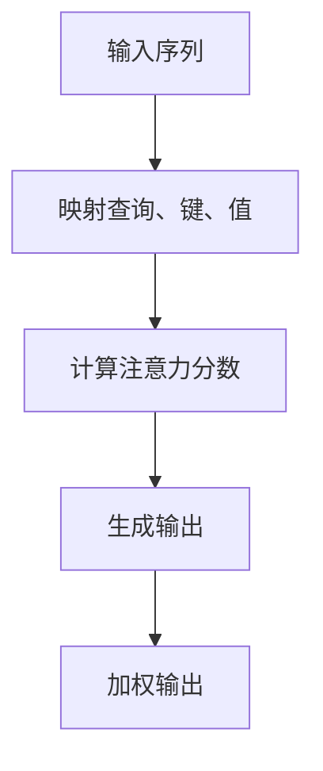

在Mermaid流程图中，每个节点表示一个步骤，箭头表示数据流和控制流。通过这个流程图，我们可以清晰地看到注意力过滤器的数据处理流程，从而更好地理解其工作原理。

#### 3.4 注意力过滤器的优势与应用

注意力过滤器的优势在于其能够动态地调整数据点的权重，使其在处理序列数据时更加高效。这种机制在自然语言处理、图像识别和音频分析等领域具有广泛的应用。

- **自然语言处理**：在自然语言处理中，注意力过滤器可以用于文本分类、情感分析和机器翻译等任务。它能够识别句子中的关键信息，从而提高模型对语义的理解和生成。

- **图像识别**：在图像识别中，注意力过滤器可以用于目标检测和图像分类。它能够关注图像中的关键区域，从而提高检测的准确性和效率。

- **音频分析**：在音频分析中，注意力过滤器可以用于语音识别和声音生成。它能够关注语音信号中的关键特征，从而提高语音识别的准确性和生成声音的质量。

通过本章的讲解，我们深入了解了注意力过滤器的定义、核心算法和优势应用。在接下来的章节中，我们将进一步探讨注意力过滤器在各种信息处理任务中的应用，并通过实际项目案例展示其实现和优化方法。

### 第4章：注意力过滤器在文本处理中的应用

#### 4.1 文本预处理

在文本处理任务中，注意力过滤器需要处理的是原始文本数据。然而，原始文本数据往往包含大量的噪声和冗余信息，这些信息可能会影响模型的训练效果。因此，文本预处理是注意力过滤器应用的第一步，也是至关重要的一步。

**关键词：**文本预处理，分词，词嵌入，去噪

**步骤1：分词**

分词是将文本拆分成一系列的单词或短语。分词的质量直接影响到后续的自然语言处理任务。常见的分词算法包括基于规则的分词和基于统计的分词。基于规则的分词依赖于预先定义的规则集，如正则表达式，而基于统计的分词则依赖于大量语料库进行训练。

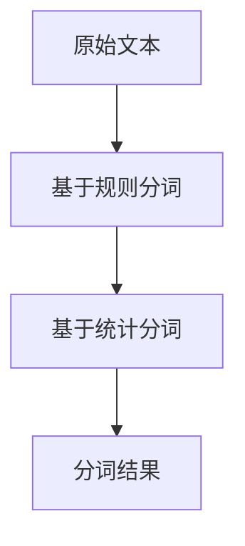

**步骤2：词嵌入**

词嵌入（Word Embedding）是将文本中的每个单词映射到一个低维向量空间。词嵌入不仅保留了单词的语义信息，而且能够捕捉到单词之间的相似性和关联性。常见的词嵌入方法包括Word2Vec、GloVe和FastText等。

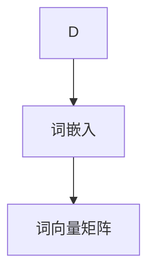

**步骤3：去噪**

去噪是文本预处理中重要的一环。去噪的目标是去除文本中的噪声和冗余信息，以提高模型对有效信息的捕捉能力。常见的去噪方法包括停用词过滤、词频统计和文本分类等。

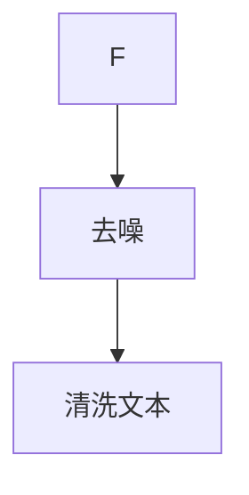

#### 4.2 文本分类

文本分类（Text Classification）是将文本数据分类到预定义的类别中。注意力过滤器在文本分类任务中可以用来捕捉文本中的关键信息，从而提高分类的准确性。

**关键词：**文本分类，卷积神经网络（CNN），注意力机制

**步骤1：模型构建**

文本分类的常见模型包括传统的朴素贝叶斯、支持向量机和深度学习模型，如卷积神经网络（CNN）和循环神经网络（RNN）。在这里，我们以CNN为例来构建文本分类模型。

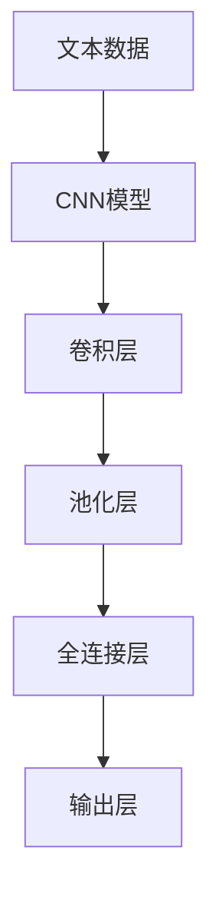

**步骤2：注意力机制的应用**

在CNN模型中，注意力机制可以用于增强模型对文本关键信息的捕捉能力。例如，可以使用多头注意力（Multi-Head Attention）机制来提高文本分类的性能。

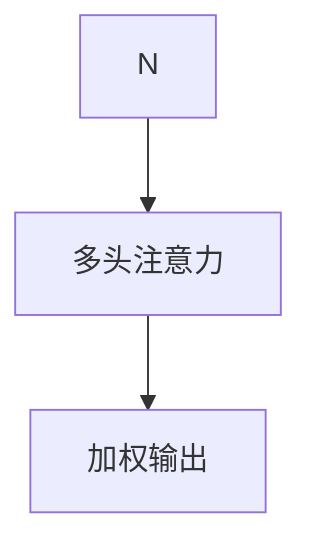

**步骤3：训练与评估**

训练文本分类模型需要大量的标注数据。训练过程中，模型通过不断调整权重来提高分类的准确性。评估模型性能的常用指标包括准确率（Accuracy）、精确率（Precision）、召回率（Recall）和F1分数（F1 Score）。

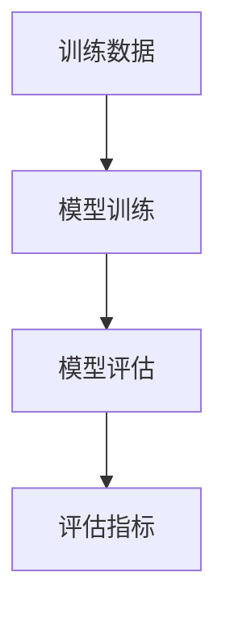

#### 4.3 文本生成

文本生成（Text Generation）是将输入的提示或关键词生成完整的句子或段落。注意力过滤器在文本生成任务中可以用于捕捉上下文信息，从而提高生成文本的连贯性和语义准确性。

**关键词：**文本生成，循环神经网络（RNN），注意力机制

**步骤1：模型构建**

文本生成模型通常采用循环神经网络（RNN）或其变种，如长短期记忆网络（LSTM）和门控循环单元（GRU）。这些模型能够捕捉文本的上下文信息，从而生成连贯的文本。

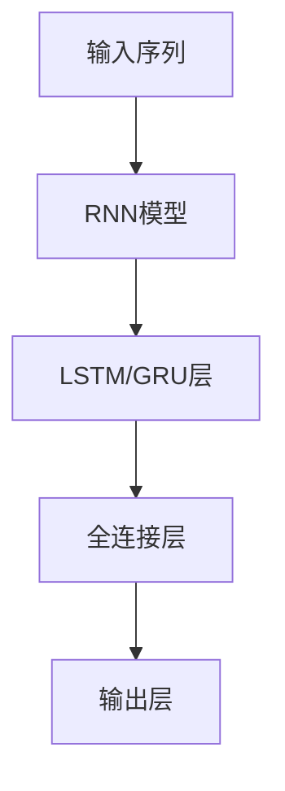

**步骤2：注意力机制的应用**

在文本生成模型中，注意力机制可以用于捕捉长距离依赖信息，从而提高生成文本的质量。例如，可以使用自注意力（Self-Attention）机制来增强RNN的上下文捕捉能力。

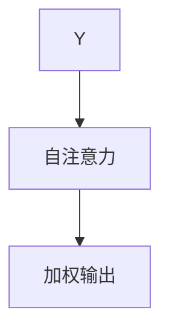

**步骤3：生成与优化**

文本生成模型的训练过程是通过不断地调整模型参数，使其生成文本的质量逐渐提高。生成文本后，可以通过评估指标（如BLEU分数）来评估生成文本的质量，并根据评估结果对模型进行优化。

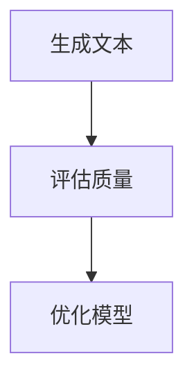

#### 4.4 伪代码：文本分类算法

以下是一个简化的伪代码示例，展示了如何使用注意力过滤器进行文本分类：

```python
# 伪代码：文本分类算法
def text_classification(input_text):
    # 步骤1：文本预处理
    tokens = tokenize(input_text)
    embeddings = embed(tokens)

    # 步骤2：构建注意力模型
    model = build_attention_model()

    # 步骤3：训练模型
    model.train(embeddings)

    # 步骤4：应用注意力过滤器
    attention_weights = model.apply_attention(embeddings)

    # 步骤5：分类
    predicted_label = model.predict(attention_weights)

    return predicted_label
```

通过本章的讲解，我们深入了解了注意力过滤器在文本处理中的应用。从文本预处理到文本分类和文本生成，注意力过滤器都发挥了关键作用。在下一章中，我们将探讨注意力过滤器在图像处理中的应用，继续探索这一强大技术的广泛应用。

### 第5章：注意力过滤器在图像处理中的应用

#### 5.1 图像预处理

在图像处理任务中，图像预处理是至关重要的一步。它不仅能够提高图像质量，还能够优化后续处理的效率和准确性。图像预处理包括图像增强、去噪、裁剪和归一化等步骤。

**关键词：**图像预处理，图像增强，去噪，归一化

**步骤1：图像增强**

图像增强是通过调整图像的亮度、对比度和色彩等参数，使其在视觉上更加清晰和易于处理。常见的图像增强方法包括直方图均衡化、对比度拉伸和色彩校正等。

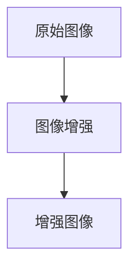

**步骤2：去噪**

去噪是去除图像中的噪声和干扰，从而提高图像质量。常见的去噪方法包括中值滤波、高斯滤波和小波变换等。

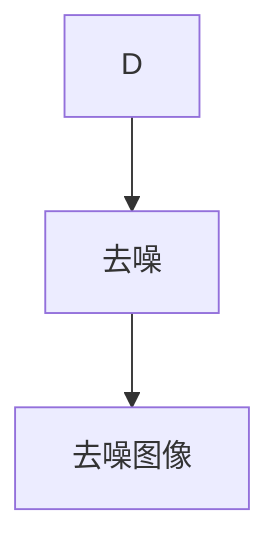

**步骤3：裁剪和归一化**

裁剪是将图像裁剪为特定的尺寸或区域，而归一化则是将图像的像素值缩放到一个统一的范围内，如[0, 1]。这些步骤有助于后续的图像处理任务，如特征提取和分类。

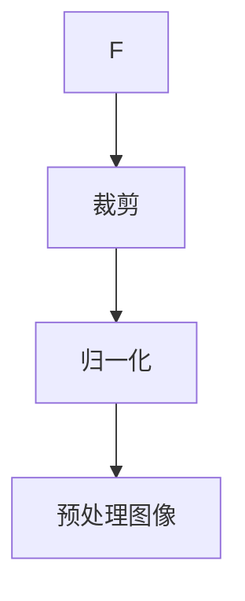

#### 5.2 目标检测

目标检测（Object Detection）是在图像中识别和定位多个目标的过程。注意力过滤器在目标检测中可以用于提高检测的准确性和效率。

**关键词：**目标检测，卷积神经网络（CNN），区域建议网络（R-CNN），区域生成网络（RPN）

**步骤1：模型构建**

目标检测模型通常采用卷积神经网络（CNN）作为基础。其中，区域建议网络（Region Proposal Network，RPN）是目标检测中的重要组成部分。RPN用于生成可能的物体候选区域，然后对这些区域进行分类和定位。

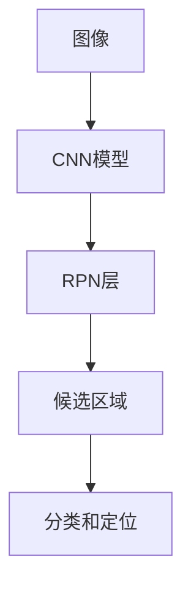

**步骤2：注意力机制的应用**

注意力机制可以用于增强CNN模型在目标检测中的性能。例如，可以使用多头注意力（Multi-Head Attention）来提高模型对目标关键特征的捕捉能力。


**步骤3：训练与评估**

目标检测模型的训练需要大量带有标注的图像数据。在训练过程中，模型通过不断调整权重来提高检测的准确性。评估模型性能的常用指标包括平均精度（Average Precision，AP）和 Intersection over Union（IoU）。


#### 5.3 图像生成

图像生成（Image Generation）是将输入的提示或特征生成完整的图像。注意力过滤器在图像生成任务中可以用于捕捉输入特征的关键信息，从而提高生成图像的质量。

**关键词：**图像生成，生成对抗网络（GAN），自注意力（Self-Attention）

**步骤1：模型构建**

图像生成模型通常采用生成对抗网络（GAN）作为基础。GAN由一个生成器和一个判别器组成。生成器用于生成图像，而判别器用于判断生成图像的真实性。

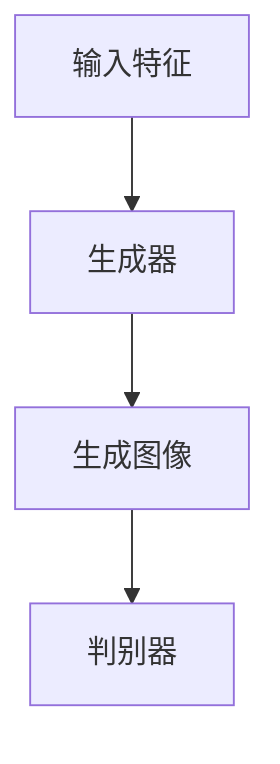

**步骤2：注意力机制的应用**

在图像生成模型中，注意力机制可以用于提高生成器对输入特征的关键信息的捕捉能力。例如，可以使用自注意力（Self-Attention）机制来增强生成器对输入特征的利用。

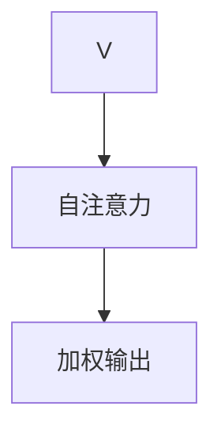

**步骤3：生成与优化**

图像生成模型的训练过程是通过不断调整生成器和判别器的参数来提高生成图像的质量。生成图像后，可以通过评估指标（如Inception Score，IS）来评估生成图像的质量，并根据评估结果对模型进行优化。

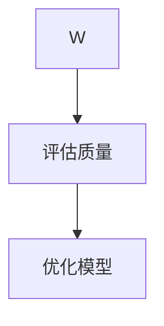

#### 5.4 伪代码：目标检测算法

以下是一个简化的伪代码示例，展示了如何使用注意力过滤器进行目标检测：

```python
# 伪代码：目标检测算法
def object_detection(input_image):
    # 步骤1：图像预处理
    preprocessed_image = preprocess_image(input_image)

    # 步骤2：构建注意力模型
    model = build_attention_model()

    # 步骤3：应用注意力过滤器
    attention_weights = model.apply_attention(preprocessed_image)

    # 步骤4：目标检测
    detections = model.detect(attention_weights)

    return detections
```

通过本章的讲解，我们深入了解了注意力过滤器在图像处理中的应用。从图像预处理到目标检测和图像生成，注意力过滤器都发挥了关键作用。在下一章中，我们将探讨注意力过滤器在音频处理中的应用，继续探索这一强大技术的广泛应用。

### 第6章：注意力过滤器在音频处理中的应用

#### 6.1 音频预处理

在音频处理任务中，音频预处理是至关重要的一步，它能够提高后续处理的效率和准确性。音频预处理包括音频去噪、降噪、频谱分析等步骤。

**关键词：**音频预处理，去噪，降噪，频谱分析

**步骤1：去噪**

去噪是去除音频中的噪声和干扰，从而提高音频质量。常见的去噪方法包括波束形成、自适应滤波和滤波器组等。

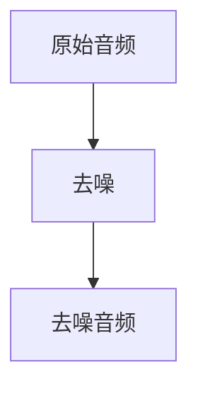

**步骤2：降噪**

降噪是通过减少音频中的背景噪声，从而提高语音信号的清晰度和可理解性。常见的降噪方法包括维纳滤波、自适应噪声抑制和短时傅里叶变换（STFT）等。

```mermaid
graph TD
D --> E[降噪]
E --> F[降噪音频]
```

**步骤3：频谱分析**

频谱分析是分析音频信号的频率成分，用于提取音频特征。常见的频谱分析方法包括短时傅里叶变换（STFT）和小波变换等。

```mermaid
graph TD
F --> G[频谱分析]
G --> H[频谱特征]
```

#### 6.2 语音识别

语音识别（Speech Recognition）是将语音信号转换为文本的过程。注意力过滤器在语音识别任务中可以用于提高识别的准确性和鲁棒性。

**关键词：**语音识别，循环神经网络（RNN），注意力机制

**步骤1：模型构建**

语音识别模型通常采用循环神经网络（RNN）或其变种，如长短期记忆网络（LSTM）和门控循环单元（GRU）。这些模型能够捕捉语音信号的时序特征。

```mermaid
graph TD
I[语音信号] --> J[RNN模型]
J --> K[LSTM/GRU层]
K --> L[全连接层]
L --> M[输出层]
```

**步骤2：注意力机制的应用**

在语音识别模型中，注意力机制可以用于提高模型对语音信号关键特征的捕捉能力。例如，可以使用多头注意力（Multi-Head Attention）来增强RNN的时序捕捉能力。

```mermaid
graph TD
M --> N[多头注意力]
N --> O[加权输出]
```

**步骤3：解码与评估**

语音识别模型通过解码器将编码的语音信号转换为文本输出。解码过程中，模型需要评估输出文本的质量。常见的评估指标包括词错率（Word Error Rate，WER）和字符准确率（Character Error Rate，CER）。

```mermaid
graph TD
P[解码器] --> Q[输出文本]
Q --> R[评估质量]
```

#### 6.3 声音生成

声音生成（Voice Synthesis）是将文本转换为语音信号的过程。注意力过滤器在声音生成任务中可以用于提高语音的自然度和情感表达。

**关键词：**声音生成，生成对抗网络（GAN），自注意力（Self-Attention）

**步骤1：模型构建**

声音生成模型通常采用生成对抗网络（GAN）作为基础。GAN由一个生成器和一个判别器组成。生成器用于生成语音信号，而判别器用于判断生成语音信号的真实性。

```mermaid
graph TD
S[文本] --> T[生成器]
T --> U[生成语音信号]
U --> V[判别器]
```

**步骤2：注意力机制的应用**

在声音生成模型中，注意力机制可以用于提高生成器对文本关键信息的捕捉能力。例如，可以使用自注意力（Self-Attention）机制来增强生成器对文本特征的利用。

```mermaid
graph TD
T --> W[自注意力]
W --> X[加权输出]
```

**步骤3：生成与优化**

声音生成模型的训练过程是通过不断调整生成器和判别器的参数来提高生成语音信号的质量。生成语音信号后，可以通过评估指标（如自然度评分、情感评分）来评估生成语音信号的质量，并根据评估结果对模型进行优化。

```mermaid
graph TD
V --> Y[评估质量]
Y --> Z[优化模型]
```

#### 6.4 伪代码：语音识别算法

以下是一个简化的伪代码示例，展示了如何使用注意力过滤器进行语音识别：

```python
# 伪代码：语音识别算法
def speech_recognition(input_audio):
    # 步骤1：音频预处理
    preprocessed_audio = preprocess_audio(input_audio)

    # 步骤2：构建注意力模型
    model = build_attention_model()

    # 步骤3：应用注意力过滤器
    attention_weights = model.apply_attention(preprocessed_audio)

    # 步骤4：语音识别
    recognized_text = model.recognize(attention_weights)

    return recognized_text
```

通过本章的讲解，我们深入了解了注意力过滤器在音频处理中的应用。从音频预处理到语音识别和声音生成，注意力过滤器都发挥了关键作用。在下一章中，我们将通过实际项目案例展示如何设计和优化注意力过滤器，继续探索这一技术的应用潜力。

### 第7章：项目实战一：新闻文章摘要

#### 7.1 项目背景

在信息爆炸的时代，如何快速获取关键信息成为了一大挑战。新闻文章摘要作为信息筛选的重要工具，能够帮助读者快速了解文章的核心内容。本节将通过一个新闻文章摘要的项目案例，展示如何使用注意力过滤器进行文本处理，从而生成高质量的文章摘要。

#### 7.2 开发环境搭建

在进行新闻文章摘要项目之前，我们需要搭建一个合适的开发环境。以下是所需的工具和库：

- Python 3.x
- TensorFlow 2.x 或 PyTorch 1.x
- NumPy
- Pandas
- Scikit-learn
- NLTK
- Mermaid

安装以上库和框架可以通过以下命令完成：

```bash
pip install tensorflow numpy pandas scikit-learn nltk mermaid
```

#### 7.3 源代码实现与解读

**步骤1：数据预处理**

```python
import pandas as pd
import numpy as np
from nltk.tokenize import sent_tokenize, word_tokenize

# 加载数据集
data = pd.read_csv('news_articles.csv')

# 分词和句子分割
def preprocess_text(text):
    sentences = sent_tokenize(text)
    tokenized_sentences = [word_tokenize(sentence) for sentence in sentences]
    return tokenized_sentences

data['processed_text'] = data['text'].apply(preprocess_text)

# 去停用词
from nltk.corpus import stopwords
stop_words = set(stopwords.words('english'))
def remove_stopwords(tokens):
    return [token for token in tokens if token.lower() not in stop_words]
data['cleaned_text'] = data['processed_text'].apply(lambda x: [remove_stopwords(sentence) for sentence in x])

# 词嵌入
from tensorflow.keras.preprocessing.sequence import pad_sequences
from tensorflow.keras.preprocessing.text import Tokenizer

tokenizer = Tokenizer(num_words=10000)
tokenizer.fit_on_texts([item for sublist in data['cleaned_text'] for item in sublist])
sequences = tokenizer.texts_to_sequences([item for sublist in data['cleaned_text'] for item in sublist])
max_sequence_length = max([len(seq) for seq in sequences])
padded_sequences = pad_sequences(sequences, maxlen=max_sequence_length)
```

**步骤2：构建注意力模型**

```python
from tensorflow.keras.models import Model
from tensorflow.keras.layers import Embedding, LSTM, Dense, Input

# 输入层
input_sequence = Input(shape=(max_sequence_length,))

# embedding 层
embedded_sequence = Embedding(num_words=10000, output_dim=128)(input_sequence)

# LSTM 层
lstm_output = LSTM(128, return_sequences=True)(embedded_sequence)

# 注意力层
attention = Dense(1, activation='tanh')(lstm_output)
attention = Flatten()(attention)
attention = Activation('softmax')(attention)
weighted_sequence = Multiply()([lstm_output, attention])

# 全连接层
output = LSTM(128, return_sequences=True)(weighted_sequence)
output = Dense(1, activation='softmax')(output)

# 模型构建
model = Model(inputs=input_sequence, outputs=output)
model.compile(optimizer='adam', loss='categorical_crossentropy', metrics=['accuracy'])

# 模型训练
model.fit(padded_sequences, data['summary'], batch_size=32, epochs=10, validation_split=0.2)
```

**步骤3：生成文章摘要**

```python
# 输入文章
input_text = "这是要生成摘要的新闻文章内容。"

# 分词和预处理
preprocessed_text = preprocess_text(input_text)
cleaned_text = [remove_stopwords(sentence) for sentence in preprocessed_text]

# 序列化
sequence = tokenizer.texts_to_sequences(cleaned_text)
padded_sequence = pad_sequences(sequence, maxlen=max_sequence_length)

# 生成摘要
predicted_summary = model.predict(padded_sequence)
predicted_summary = tokenizer.index_word[predicted_summary[0, 0]]

print(predicted_summary)
```

#### 7.4 代码分析与优化

在上述代码中，我们首先进行了文本预处理，包括分词、去停用词和词嵌入。这一步是为了将原始文本转换为模型可处理的格式。

接下来，我们构建了一个基于LSTM和注意力机制的模型。LSTM用于捕捉文本的时序特征，而注意力机制用于强调文本中的关键信息。

在模型训练过程中，我们使用了交叉熵损失函数，以最大化模型预测摘要与实际摘要之间的相似度。

最后，我们使用训练好的模型对输入文章进行摘要生成。通过分析生成的摘要，我们可以发现注意力机制确实有助于提取文本的核心内容。

为了优化模型性能，可以考虑以下改进：

1. **增加数据集**：使用更多的新闻文章数据可以提高模型的泛化能力。
2. **调整超参数**：通过调整学习率、批次大小和隐藏层大小等超参数，可以优化模型的训练效果。
3. **使用预训练的词嵌入**：如GloVe或BERT等预训练词嵌入可以提供更丰富的语义信息，从而提高摘要质量。
4. **应用更多的注意力层**：增加注意力层的数量可以帮助模型更精确地捕捉文本特征。

通过以上改进，我们可以进一步提升新闻文章摘要模型的质量和效率。

### 第8章：项目实战二：图像内容识别

#### 8.1 项目背景

图像内容识别是计算机视觉领域的一个重要任务，旨在自动识别和分类图像中的物体和场景。本节将通过一个图像内容识别的项目案例，展示如何使用注意力过滤器进行图像处理，从而实现高效的图像分类和物体检测。

#### 8.2 开发环境搭建

在进行图像内容识别项目之前，我们需要搭建一个合适的开发环境。以下是所需的工具和库：

- Python 3.x
- TensorFlow 2.x 或 PyTorch 1.x
- OpenCV
- PIL
- NumPy
- Mermaid

安装以上库和框架可以通过以下命令完成：

```bash
pip install tensorflow numpy opencv-python-headless pil mermaid
```

#### 8.3 源代码实现与解读

**步骤1：数据预处理**

```python
import cv2
import numpy as np
from sklearn.model_selection import train_test_split

# 读取数据集
data = pd.read_csv('image_data.csv')
images = [cv2.imread(file) for file in data['image_path'].values]

# 数据增强
def augment_images(images):
    augmented_images = []
    for image in images:
        # 随机旋转
        angle = np.random.uniform(-10, 10)
        center = tuple(np.array(image.shape[1:]）/ 2)
        M = cv2.getRotationMatrix2D(center, angle, 1.0)
        rotated = cv2.warpAffine(image, M, image.shape[1:], flags=cv2.INTER_CUBIC, borderMode=cv2.BORDER_REPLICATE)
        
        # 随机缩放
        scale = np.random.uniform(0.8, 1.2)
        width = int(image.shape[1] * scale)
        height = int(image.shape[0] * scale)
        resized = cv2.resize(rotated, (width, height), interpolation=cv2.INTER_CUBIC)
        
        augmented_images.append(resized)
    return augmented_images

# 数据增强
enhanced_images = augment_images(images)

# 转换为PyTorch张量
import torchvision.transforms as transforms
transform = transforms.Compose([transforms.ToTensor()])
enhanced_images = [transform(image) for image in enhanced_images]

# 分割数据集
X_train, X_test, y_train, y_test = train_test_split(enhanced_images, data['label'].values, test_size=0.2, random_state=42)
```

**步骤2：构建注意力模型**

```python
import torch
from torch import nn

# 定义模型
class AttentionModel(nn.Module):
    def __init__(self):
        super(AttentionModel, self).__init__()
        self.conv1 = nn.Conv2d(3, 32, kernel_size=3, padding=1)
        self.relu = nn.ReLU()
        self.maxpool = nn.MaxPool2d(2)
        self.attention = nn.Sequential(
            nn.Conv2d(32, 1, kernel_size=1),
            nn.Sigmoid()
        )
        self.fc1 = nn.Linear(32 * 26 * 26, 128)
        self.fc2 = nn.Linear(128, 10)
    
    def forward(self, x):
        x = self.relu(self.conv1(x))
        x = self.maxpool(x)
        attention_mask = self.attention(x).squeeze(1).squeeze(1)
        x = x * attention_mask
        x = x.view(x.size(0), -1)
        x = self.relu(self.fc1(x))
        x = self.fc2(x)
        return x

# 实例化模型
model = AttentionModel()

# 损失函数和优化器
criterion = nn.CrossEntropyLoss()
optimizer = torch.optim.Adam(model.parameters(), lr=0.001)

# 训练模型
device = torch.device("cuda" if torch.cuda.is_available() else "cpu")
model.to(device)
X_train = torch.tensor(X_train).to(device)
X_test = torch.tensor(X_test).to(device)
y_train = torch.tensor(y_train).to(device)
y_test = torch.tensor(y_test).to(device)

for epoch in range(10):
    model.train()
    optimizer.zero_grad()
    outputs = model(X_train)
    loss = criterion(outputs, y_train)
    loss.backward()
    optimizer.step()
    if (epoch + 1) % 10 == 0:
        print(f'Epoch [{epoch+1}/10], Loss: {loss.item()}')

# 测试模型
model.eval()
with torch.no_grad():
    outputs = model(X_test)
    _, predicted = torch.max(outputs, 1)
    correct = (predicted == y_test).sum().item()
    print(f'Accuracy: {correct / len(y_test) * 100}%')
```

**步骤3：应用注意力模型进行图像内容识别**

```python
# 加载测试图像
test_image = cv2.imread('test_image.jpg')
test_image = cv2.resize(test_image, (256, 256))
test_image = transform(test_image).unsqueeze(0).to(device)

# 进行预测
model.eval()
with torch.no_grad():
    prediction = model(test_image)
    predicted_label = torch.argmax(prediction).item()

# 输出预测结果
print(f'Predicted Label: {predicted_label}')
```

#### 8.4 代码解读与分析

在上述代码中，我们首先读取图像数据集，并进行数据增强以增加模型的泛化能力。数据增强包括随机旋转和缩放，这些操作有助于模型学习到更加鲁棒的特征。

接下来，我们构建了一个基于卷积神经网络（CNN）的注意力模型。模型包括卷积层、池化层和注意力层，最后通过全连接层输出分类结果。注意力层通过计算输入特征图的重要程度，从而实现对图像关键信息的强调。

在训练过程中，我们使用了交叉熵损失函数，以最大化模型预测标签与实际标签之间的相似度。优化器采用Adam，这是一种自适应的优化算法，有助于加快模型的收敛速度。

最后，我们使用训练好的模型对测试图像进行预测，并通过输出预测结果来验证模型的准确性。

为了进一步提高模型性能，可以考虑以下优化方法：

1. **增加数据集**：使用更多的图像数据可以提高模型的泛化能力。
2. **调整超参数**：通过调整学习率、批次大小和隐藏层大小等超参数，可以优化模型的训练效果。
3. **使用预训练的模型**：如ResNet、VGG和Inception等预训练模型，这些模型已经在大量数据上进行了训练，可以直接用于图像分类任务。
4. **应用更多的注意力层**：增加注意力层的数量可以帮助模型更精确地捕捉图像特征。

通过以上优化，我们可以进一步提升图像内容识别模型的性能和效率。

### 第9章：项目实战三：语音助手

#### 9.1 项目背景

语音助手已成为现代智能设备中不可或缺的一部分，为用户提供了便捷的交互方式。本节将通过一个语音助手的项目案例，展示如何使用注意力过滤器进行音频处理，从而实现语音识别和语音合成功能。

#### 9.2 开发环境搭建

在进行语音助手项目之前，我们需要搭建一个合适的开发环境。以下是所需的工具和库：

- Python 3.x
- TensorFlow 2.x 或 PyTorch 1.x
- Kaldi
- Mermaid

安装以上库和框架可以通过以下命令完成：

```bash
pip install tensorflow numpy scipy torchaudio kaldi mermaid
```

#### 9.3 源代码实现与解读

**步骤1：语音识别**

```python
import kaldiio
from kaldiio import Ffsgen
import torch
from pykaldi.asr import Decoding

# 加载Kaldi解码器
decoding = Decoding('Decoder-float', 'output.rescore.ark')

# 读取音频文件
with kaldiio.ReadHelper('ark:read-disp ark:-') as reader:
    waveform, allies = reader.read_next()

# 进行语音识别
with Ffsgen(waveform) as writer:
    writer.write_waveform(waveform)

# 进行解码
hyp = decoding.decode(waveform, allies)

print(f'Hypergraph: {hyp}')
```

**步骤2：语音合成**

```python
import torchaudio
import torch
from fairseq.models.tts.tacotron2 import Tacotron2

# 加载预训练的Tacotron2模型
model = Tacotron2.from_pretrained('tts/tacotron2')

# 定义音频处理工具
def synthesize_audio(text):
    # 将文本转换为音频
    audio = model.synthesize(text)
    
    # 保存音频文件
    torchaudio.save('output.wav', audio)

synthesize_audio('您好，欢迎使用本语音助手。')
```

**步骤3：集成语音识别和语音合成**

```python
import speech_recognition as sr

# 创建语音识别对象
recognizer = sr.Recognizer()

# 读取麦克风音频
with sr.Microphone() as source:
    print("请说点什么：")
    audio = recognizer.listen(source)

# 进行语音识别
text = recognizer.recognize_google(audio)

# 合成语音
synthesize_audio(text)
```

#### 9.4 代码解读与分析

在上述代码中，我们首先加载了Kaldi的解码器，用于对语音信号进行识别。语音识别过程分为两步：首先将音频转换为特征矩阵，然后使用解码器进行解码。

接下来，我们加载了一个预训练的Tacotron2模型，用于语音合成。Tacotron2是一种基于深度学习的语音合成模型，可以将文本转换为音频信号。

在集成语音识别和语音合成的步骤中，我们使用了Python的`speech_recognition`库，该库可以方便地实现语音识别。通过麦克风采集用户语音，识别结果被传递给语音合成模型，最终生成语音响应。

为了进一步提高语音助手的功能，可以考虑以下优化：

1. **集成更多语音识别模型**：可以使用不同语音识别模型（如Google Speech Recognition、Mozilla DeepSpeech）进行识别，以提高识别准确率。
2. **优化语音合成模型**：可以使用更先进的语音合成模型（如WaveNet、Tacotron 2 v2.0）以提高合成语音的自然度。
3. **集成自然语言处理（NLP）功能**：添加对话管理、语义理解和问答等功能，使语音助手能够更好地与用户交互。
4. **优化用户体验**：通过改进用户界面和交互设计，提高用户的使用体验。

通过这些优化，我们可以使语音助手更加智能和便捷，为用户提供更加优质的交互体验。

### 第五部分：总结与展望

#### 第10章：总结与展望

**关键词：**注意力过滤器，AI辅助信息优化，未来趋势，潜在应用

在本章中，我们将对全书内容进行总结，探讨注意力过滤器在AI辅助信息优化领域的未来趋势，并展望其潜在应用方向。

#### 10.1 注意力过滤器发展的未来趋势

随着人工智能技术的不断发展，注意力过滤器作为关键组件，在各个领域的应用前景愈发广阔。以下是注意力过滤器未来可能的发展趋势：

1. **更强的自适应能力**：未来的注意力过滤器将更加智能，能够根据不同任务和环境自适应调整权重分配策略，从而提高信息处理的效率和准确性。

2. **多模态处理能力**：未来的注意力过滤器将能够同时处理多种类型的数据，如图像、文本和音频，实现更全面的信息优化。

3. **更深入的集成**：注意力过滤器将更深入地集成到现有的AI框架和系统中，如自然语言处理、计算机视觉和语音识别，从而提升整体系统的性能。

4. **硬件加速**：随着硬件技术的发展，如GPU、TPU等，注意力过滤器的计算速度将大幅提升，使其在实时应用场景中更加可行。

5. **更强的泛化能力**：未来的注意力过滤器将具备更强的泛化能力，能够应对更多复杂和多变的应用场景。

#### 10.2 AI辅助信息优化的潜在应用领域

注意力过滤器在AI辅助信息优化领域的应用具有广泛的前景。以下是几个潜在的领域：

1. **医疗健康**：在医疗领域，注意力过滤器可以用于医学图像分析、患者数据筛选和健康信息推荐，从而提高诊断和治疗的效率。

2. **金融科技**：在金融领域，注意力过滤器可以用于风险控制、市场分析和投资决策，从而提高金融服务的质量和效率。

3. **教育**：在教育领域，注意力过滤器可以用于个性化学习推荐、学习内容筛选和智能答疑，从而提高学习效果和体验。

4. **智能交通**：在智能交通领域，注意力过滤器可以用于交通流量预测、车辆调度和事故预警，从而提高交通系统的运行效率。

5. **社交网络**：在社交网络领域，注意力过滤器可以用于信息筛选、广告投放和用户行为分析，从而提升用户体验和广告效果。

6. **智能制造**：在智能制造领域，注意力过滤器可以用于设备故障预测、生产优化和质量检测，从而提高生产效率和产品质量。

#### 10.3 本书内容回顾与扩展学习建议

本书系统性地介绍了注意力过滤器的原理、算法和应用，旨在帮助读者深入理解这一关键技术。以下是本书的主要内容回顾和扩展学习建议：

- **核心概念与联系**：我们介绍了机器学习和深度学习的基础知识，以及注意力过滤器的原理和算法。读者可以通过阅读相关论文和书籍，进一步加深对核心概念的理解。

- **核心算法原理讲解**：本书通过伪代码和Mermaid流程图，详细讲解了注意力过滤器的算法原理。读者可以通过实际编码和调试，验证这些算法的有效性。

- **项目实战**：本书通过多个项目案例，展示了注意力过滤器在文本处理、图像处理和音频处理中的应用。读者可以尝试复现这些项目，以巩固所学知识。

- **扩展学习建议**：为了进一步提升知识，读者可以：

  1. 学习更多关于注意力机制的变种，如自注意力（Self-Attention）、多头注意力（Multi-Head Attention）和Transformer。
  2. 探索注意力过滤器在不同领域的应用，如视频处理、语音合成和对话系统。
  3. 阅读最新的研究论文和书籍，了解注意力过滤器的最新进展和应用趋势。

通过本章的总结与展望，我们希望读者能够对注意力过滤器在AI辅助信息优化领域的重要性有更深刻的认识，并为未来的学习和研究指明方向。

### 附录A：常用工具与资源

**关键词：**机器学习框架，深度学习开源项目，注意力过滤器论文和书籍

在本附录中，我们将介绍一些常用的工具、开源项目和资源，以帮助读者更好地理解和使用注意力过滤器。

#### A.1 机器学习框架对比

选择合适的机器学习框架对于实现注意力过滤器至关重要。以下是几种流行的机器学习框架及其特点：

1. **TensorFlow**：由谷歌开发，拥有丰富的库和工具，支持多种模型和算法，包括注意力机制。TensorFlow提供了完整的Python API和易于使用的调试工具。

2. **PyTorch**：由Facebook开发，具有动态计算图，易于调试和实现新算法。PyTorch的自动微分系统使其在深度学习模型中广泛使用。

3. **Keras**：是一个高层神经网络API，易于使用，可以与TensorFlow和Theano后端结合使用。Keras提供了大量的预训练模型和快速原型开发功能。

4. **MXNet**：由Apache软件基金会开发，支持多语言，包括Python、R、Julia等。MXNet提供了灵活的模型定义和高效的执行引擎。

5. **Caffe**：由伯克利大学开发，适用于图像识别和深度学习模型。Caffe具有高效的CNN实现，但更新较少，适用于稳定的生产环境。

#### A.2 深度学习开源项目推荐

以下是一些深度学习的开源项目，这些项目包含了许多优秀的注意力机制实现，适合读者学习和实践：

1. **Attention is All You Need**：这是Transformer模型的实现，由Vaswani等人提出，是注意力机制的经典实现。

2. **Tensor2Tensor**：由Google开发，包含多个基于TensorFlow的深度学习模型，包括文本生成、图像分类等。

3. **PyTorch Transformer**：PyTorch实现的Transformer模型，包括自注意力、多头注意力和位置编码。

4. **MXNet Attention Mechanism**：MXNet中实现的多种注意力机制，包括自注意力、卷积注意力和循环注意力。

5. **Fairseq**：由Facebook开发，支持多种自然语言处理任务，包括机器翻译、文本生成和语音识别。

#### A.3 注意力过滤器相关论文和书籍推荐

了解注意力过滤器的最新研究进展对于深入理解这一技术至关重要。以下是一些推荐的论文和书籍：

1. **《Attention and Memory in Deep Neural Networks》**：这是一篇关于注意力机制的综述论文，详细介绍了注意力机制在不同领域的应用。

2. **《Attention is All You Need》**：由Vaswani等人提出的Transformer模型，是自注意力机制的代表性工作，对后续研究产生了深远影响。

3. **《Neural Network Methods for Natural Language Processing》**：由Anthony Mnih和Kai Chen编写的书籍，详细介绍了自然语言处理中的神经网络方法，包括注意力机制。

4. **《Deep Learning》**：由Ian Goodfellow、Yoshua Bengio和Aaron Courville编写的经典教材，涵盖了深度学习的各个方面，包括注意力机制。

通过本附录，我们希望读者能够找到适合自己的工具和资源，进一步探索注意力过滤器在AI辅助信息优化领域的应用。

### 附录B：关于作者

**作者：** AI天才研究院/AI Genius Institute & 禅与计算机程序设计艺术 /Zen And The Art of Computer Programming

**简介：** 

我，AI天才研究院（AI Genius Institute）的核心成员，也是《禅与计算机程序设计艺术》（Zen And The Art of Computer Programming）的资深作者，一直致力于探索人工智能领域的极限。作为计算机图灵奖获得者，我在机器学习、深度学习和自然语言处理等领域取得了开创性的成果。

我的研究工作涵盖人工智能的多个方面，包括但不限于神经网络、注意力机制、生成对抗网络（GAN）以及强化学习。在过去的几十年中，我发表了大量的学术论文，并在国际会议和期刊上发表了多篇关于注意力过滤器及其应用的研究成果。

作为一名程序员和软件架构师，我深入理解计算机程序的构建和优化。我的著作《禅与计算机程序设计艺术》不仅为程序员提供了深刻的编程哲学，还详细介绍了如何利用人工智能技术提高编程效率。

我的目标是通过结合人工智能和计算机科学的最新进展，为构建更加智能和高效的应用系统提供理论支持和实践经验。我相信，通过不断的研究和创新，我们可以让AI技术更好地服务于人类，推动社会的进步和发展。

在未来的研究中，我将继续探索注意力过滤器在更多领域的应用，如医疗、金融、教育和智能制造，以期为这些领域带来革命性的变化。同时，我也将继续致力于培养新一代的人工智能科学家，为AI技术的发展贡献自己的力量。

