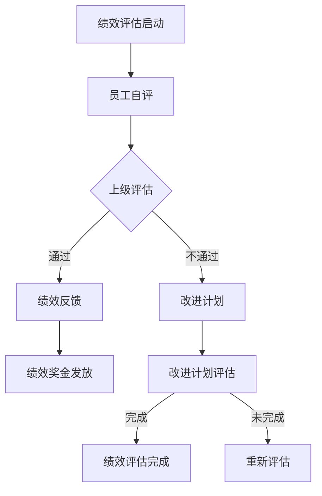

                 

### 《流程管理：优化业务运营的方法论》

> **关键词：**流程管理，业务运营，优化，方法论，实践案例分析，团队建设，数字化转型

**摘要：**本文旨在探讨流程管理在优化企业业务运营中的关键作用。通过分析流程管理的基础概念、分析方法、设计原理、实践技术，并结合实际案例，本文系统地阐述了流程管理的应用策略和挑战应对，为企业在数字化转型中的流程优化提供了一套科学的方法论。

----------------------------------------------------------------

### 《流程管理：优化业务运营的方法论》目录大纲

1. **第一部分：流程管理基础**

   - **第1章：流程管理概述**
     - 1.1 流程管理的定义与重要性
     - 1.2 流程管理的核心原则
     - 1.3 流程管理的发展历程

   - **第2章：流程分析方法**
     - 2.1 SWOT分析
     - 2.2 PEST分析
     - 2.3 客户旅程分析

   - **第3章：流程设计原理**
     - 3.1 流程设计的基本框架
     - 3.2 流程设计的核心要素
     - 3.3 流程优化策略

2. **第二部分：流程管理实践**

   - **第4章：流程管理工具与技术**
     - 4.1 流程管理工具简介
     - 4.2 业务流程建模技术
     - 4.3 流程自动化技术

   - **第5章：流程改进案例分析**
     - 5.1 案例一：某制造企业的流程优化
     - 5.2 案例二：某服务公司的流程改进
     - 5.3 案例三：某金融行业的流程革新

   - **第6章：流程管理团队建设**
     - 6.1 流程管理团队的角色与职责
     - 6.2 流程管理团队的构建策略
     - 6.3 流程管理团队的发展与培训

   - **第7章：流程管理中的问题与挑战**
     - 7.1 流程管理中的常见问题
     - 7.2 挑战与应对策略
     - 7.3 持续改进与流程创新

3. **第三部分：流程管理实践应用**

   - **第8章：流程管理在企业管理中的应用**
     - 8.1 流程管理在人力资源管理中的应用
     - 8.2 流程管理在财务管理中的应用
     - 8.3 流程管理在市场营销中的应用

   - **第9章：流程管理在跨部门协作中的应用**
     - 9.1 跨部门协作的流程设计
     - 9.2 跨部门协作的挑战与解决策略
     - 9.3 跨部门协作的实践案例

   - **第10章：流程管理在数字化转型中的应用**
     - 10.1 数字化转型与流程管理的关系
     - 10.2 数字化转型中的流程管理策略
     - 10.3 数字化转型中的流程管理实践案例

4. **附录**

   - **附录A：流程管理相关工具与资源**
     - A.1 主流流程管理工具介绍
     - A.2 流程管理相关书籍推荐
     - A.3 流程管理在线课程与培训资源

   - **附录B：流程管理实战案例代码与解析**
     - B.1 实战案例一：流程自动化脚本实现
     - B.2 实战案例二：流程改进方案设计与实施
     - B.3 实战案例三：流程优化效果评估与持续改进

---

现在，我们已经构建了文章的框架。接下来，我们将逐一展开每个章节的内容，确保文章的每个部分都能够详尽地讨论流程管理的各个方面。

### 第一部分：流程管理基础

在当今竞争激烈的商业环境中，企业必须持续优化其业务运营，以提高效率和竞争力。流程管理作为企业运营的核心组成部分，其重要性不言而喻。本部分将详细介绍流程管理的基础知识，包括定义、核心原则、分析方法和发展历程。

#### 第1章：流程管理概述

**1.1 流程管理的定义与重要性**

流程管理是指对企业或组织内部一系列相关活动进行系统化、规范化和优化的管理活动，以实现业务目标的最优化和运营效率的提升。流程管理不仅仅是优化操作流程，更涉及业务流程的设计、实施、监控和改进。

流程管理的重要性体现在以下几个方面：

1. **提高业务效率**：通过优化流程，减少冗余环节，提高业务处理速度，降低成本。
2. **提升客户满意度**：优化流程能够缩短产品或服务交付周期，提高客户满意度。
3. **支持战略决策**：流程管理有助于企业更好地理解业务运作，为战略决策提供支持。

**1.2 流程管理的核心原则**

流程管理应遵循以下核心原则：

1. **敏捷性**：适应市场变化，快速调整和优化流程。
2. **精益化**：不断消除浪费，提高业务流程的效率。
3. **持续改进**：建立持续改进机制，不断优化流程。

**1.3 流程管理的发展历程**

流程管理的发展历程可以分为以下几个阶段：

1. **传统流程管理**：以文档和人工操作为主，流程不规范，效率低下。
2. **制程化管理**：引入制程管理理念，开始对流程进行系统化管理。
3. **敏捷流程管理**：强调快速响应和持续改进，采用先进的信息技术支持流程管理。
4. **智能流程管理**：利用人工智能技术，实现流程的自动化和智能化。

---

通过本章的讨论，我们了解了流程管理的基本概念、核心原则和发展历程。在接下来的章节中，我们将深入探讨流程分析方法、流程设计原理以及流程管理工具和技术。

### 第2章：流程分析方法

在流程管理中，分析是优化流程的基础。有效的分析可以帮助企业识别现有流程中的瓶颈和改进机会。本章将介绍几种常用的流程分析方法，包括SWOT分析、PEST分析和客户旅程分析。

#### 2.1 SWOT分析

**SWOT分析**

SWOT分析是一种战略规划工具，用于评估企业的优势（Strengths）、劣势（Weaknesses）、机会（Opportunities）和威胁（Threats）。通过SWOT分析，企业可以全面了解自身所处的市场环境，从而制定相应的策略。

**优势（Strengths）**

- **核心资源**：企业独有的资源，如专利技术、品牌知名度等。
- **核心能力**：企业在特定领域的技术、管理和运营能力。

**劣势（Weaknesses）**

- **资源限制**：企业资源不足，无法满足业务需求。
- **运营效率**：内部流程不畅，效率低下。

**机会（Opportunities）**

- **市场变化**：新兴市场或行业趋势为企业提供了新的发展机会。
- **技术创新**：新技术的应用可以为业务流程带来改进。

**威胁（Threats）**

- **竞争压力**：来自竞争对手的威胁，如价格竞争、技术创新等。
- **政策变化**：政策或法规变化可能对企业造成不利影响。

**SWOT分析示例**

假设一家制造业公司进行SWOT分析：

- **优势**：拥有自主研发的核心技术，市场知名度高。
- **劣势**：生产流程复杂，劳动力成本高。
- **机会**：市场对新产品的需求增加，技术更新换代速度快。
- **威胁**：竞争对手采用更先进的技术，降低产品成本。

**2.2 PEST分析**

**PEST分析**

PEST分析是一种用于分析外部宏观环境因素的工具，包括政治（Political）、经济（Economic）、社会（Social）和技术（Technological）四个方面。通过PEST分析，企业可以了解外部环境的变化，从而调整业务策略。

**政治（Political）**

- **政策法规**：政府的政策、法规对企业运营的影响。
- **国际关系**：国际贸易政策、外交关系等。

**经济（Economic）**

- **宏观经济**：经济增长、通货膨胀、利率等。
- **行业经济**：市场需求、供需关系、价格水平等。

**社会（Social）**

- **人口结构**：年龄、性别、教育水平等。
- **文化趋势**：消费者的消费习惯、价值观等。

**技术（Technological）**

- **技术创新**：新技术、新工艺的出现。
- **技术扩散**：技术在不同地区、行业的扩散速度。

**PEST分析示例**

假设一家科技公司进行PEST分析：

- **政治**：政府鼓励创新，提供税收优惠。
- **经济**：经济增长，科技行业投资增加。
- **社会**：消费者对新技术产品的接受度高。
- **技术**：人工智能技术快速发展，为产品创新提供支持。

**2.3 客户旅程分析**

**客户旅程分析**

客户旅程分析是一种用于理解客户在购买产品或服务过程中的行为和体验的方法。通过分析客户旅程，企业可以识别出客户在接触、考虑、购买和售后等环节的痛点，从而优化客户体验。

**客户旅程分析步骤**

1. **定义客户旅程**：明确客户从接触企业到购买产品或服务后的整个流程。
2. **识别关键接触点**：分析客户旅程中的关键接触点，如广告、销售、售后服务等。
3. **评估客户体验**：评估客户在每个接触点的体验，识别痛点和改进机会。
4. **制定优化策略**：根据分析结果，制定优化策略，提高客户满意度。

**客户旅程分析示例**

假设一家电商平台进行客户旅程分析：

- **接触点1**：广告投放，客户点击广告进入网站。
- **接触点2**：网站导航，客户浏览商品，添加购物车。
- **接触点3**：支付环节，客户完成支付，订单生成。
- **接触点4**：售后服务，客户收到商品，进行评价。

通过分析客户旅程，电商平台可以发现：

- **痛点**：客户在支付环节遇到支付问题，支付失败率高。
- **优化策略**：增加支付方式，提高支付成功率，优化支付流程。

---

本章介绍了SWOT分析、PEST分析和客户旅程分析三种常用的流程分析方法。这些分析方法有助于企业全面了解自身和外部环境，从而制定更有效的流程优化策略。在下一章中，我们将探讨流程设计原理，包括流程设计的基本框架、核心要素和优化策略。

### 第3章：流程设计原理

在流程管理中，流程设计是关键的一步，它决定了流程的效率和效果。一个良好的流程设计可以确保业务高效运行，从而实现企业的战略目标。本章将详细讨论流程设计的基本原理，包括基本框架、核心要素和优化策略。

#### 3.1 流程设计的基本框架

流程设计的基本框架包括以下几个关键组成部分：

1. **流程目标**：明确流程要实现的具体目标。目标应具体、可衡量、可实现。
   
2. **流程输入**：流程开始时需要的资源或信息。包括人力、物力、信息等。

3. **流程步骤**：流程中的具体操作步骤。步骤应清晰、逻辑性强、易于执行。

4. **流程输出**：流程完成后产生的结果或输出。输出应与流程目标一致，满足业务需求。

**基本框架示例**

假设一个企业的订单处理流程：

- **流程目标**：确保订单及时处理，提高客户满意度。
- **流程输入**：订单信息、库存数据、人力资源。
- **流程步骤**：订单接收、库存检查、订单确认、订单处理、订单跟踪。
- **流程输出**：完成的订单信息、客户满意度反馈。

#### 3.2 流程设计的核心要素

流程设计的核心要素包括：

1. **流程结构**：流程的层次结构，包括子流程和并行流程。良好的流程结构有助于提高流程的可维护性和可扩展性。

2. **流程逻辑**：流程中各步骤的执行顺序和条件。流程逻辑应清晰、简单，易于理解。

3. **流程控制**：流程的监控和管理机制。包括流程状态监控、异常处理、流程优化等。

**核心要素示例**

以一个产品开发流程为例：

- **流程结构**：包含需求分析、设计、开发、测试、上线等子流程。
- **流程逻辑**：首先进行需求分析，然后进入设计阶段，设计完成后进入开发阶段，开发完成后进行测试，测试通过后上线。
- **流程控制**：实时监控开发进度，遇到问题及时处理，定期进行流程评估和优化。

#### 3.3 流程优化策略

流程优化策略包括以下几个方面：

1. **流程简化**：减少不必要的步骤和环节，提高流程效率。

2. **流程自动化**：利用信息技术实现流程的自动化，减少人工操作，降低错误率。

3. **流程标准化**：建立标准化的流程模板，提高流程一致性，确保流程在不同部门、不同人员之间执行的一致性。

4. **持续改进**：建立持续改进机制，不断优化流程，适应市场变化。

**优化策略示例**

以一个客户服务流程为例：

- **流程简化**：减少不必要的客户信息收集步骤，简化流程。
- **流程自动化**：引入自动化客服系统，实现客户问题自动分类和处理。
- **流程标准化**：制定统一的客户服务流程标准，确保服务质量和效率。
- **持续改进**：定期收集客户反馈，分析服务中的问题和改进机会，持续优化服务流程。

---

通过本章的讨论，我们了解了流程设计的基本框架、核心要素和优化策略。在下一章中，我们将探讨流程管理工具与技术，这些工具和技术将帮助我们更高效地实施流程管理和优化。

### 第4章：流程管理工具与技术

在流程管理中，选择合适的工具和技术是实现高效流程管理的关键。本章将介绍流程管理工具与技术，包括流程管理工具简介、业务流程建模技术和流程自动化技术。

#### 4.1 流程管理工具简介

流程管理工具是支持流程设计、执行和监控的关键软件。以下是几种主流的流程管理工具：

1. **Activiti**：Activiti是一个开源的BPMN（业务流程模型和符号）流程引擎，支持流程建模、自动化和监控。它具有强大的功能，如流程实例管理、任务调度、任务管理、事件处理等。

2. **Camunda**：Camunda是一个功能强大的BPMN流程引擎，提供了丰富的工具和组件，如流程建模器、任务调度器、决策引擎等。它支持流程的自动化、智能化和决策支持。

3. **Bonita**：Bonita是一个开源的BPMN流程管理平台，支持流程建模、自动化和协作。它提供了直观的界面和强大的功能，如流程监控、报告生成、工作流管理等。

**流程管理工具特点对比**

| 工具       | 开源/商业 | 功能特点                         | 适用场景           |
|------------|-----------|----------------------------------|--------------------|
| Activiti   | 开源       | 强大的流程引擎、灵活的扩展能力   | 大型企业、复杂流程 |
| Camunda    | 开源/商业 | 功能全面、支持决策支持           | 中型企业、多样化需求 |
| Bonita     | 开源       | 直观的界面、易于使用             | 小型企业、快速部署   |

#### 4.2 业务流程建模技术

业务流程建模技术是将业务流程以图形化形式表示出来，以便于分析和优化。以下是几种常见的业务流程建模技术：

1. **BPMN（业务流程模型和符号）**：BPMN是一种用于绘制业务流程图的标准符号和语法。它提供了丰富的元素，如活动、任务、网关、事件等，可以直观地表示业务流程。

2. **CMMN（协作业务流程建模和notation）**：CMMN是一种用于协作业务流程建模的图形化语言，它专注于业务流程的动态性、灵活性和可操作性。

3. **DMN（决策模型和notation）**：DMN是一种用于决策建模的图形化语言，它帮助企业和组织以图形化方式定义和管理业务决策。

**业务流程建模技术示例**

以下是一个简单的BPMN流程图示例：

```mermaid
graph TD
A[开始] --> B{审批决策}
B -->|通过| C[执行任务]
B -->|拒绝| D[反馈原因]
C --> E[任务完成]
D --> F[重新审批]
E -->|结束|
```

#### 4.3 流程自动化技术

流程自动化技术是将重复性、规律性的业务流程通过软件实现自动化，从而减少人工操作，提高效率。以下是几种常见的流程自动化技术：

1. **RPA（机器人流程自动化）**：RPA是一种通过模拟人类操作员的动作，自动化执行重复性任务的软件。它通常基于UI自动化技术，可以与现有系统无缝集成。

2. **AI（人工智能）**：AI技术，如机器学习、自然语言处理等，可以用于实现更高级的流程自动化，如智能客服、智能审批等。

3. **集成技术**：通过集成不同的系统和技术，如ERP、CRM等，实现流程的自动化和数据共享。

**流程自动化技术示例**

以下是一个使用RPA技术实现自动化的示例：

```python
# RPA 自动化脚本示例
from selenium import webdriver

# 启动浏览器
driver = webdriver.Chrome()

# 访问登录页面
driver.get("https://example.com/login")

# 输入用户名和密码
driver.find_element_by_name("username").send_keys("user")
driver.find_element_by_name("password").send_keys("password")

# 登录
driver.find_element_by_id("login_button").click()

# 执行自动化任务
# ...

# 关闭浏览器
driver.quit()
```

---

通过本章的讨论，我们了解了流程管理工具与技术的基本概念和应用。这些工具和技术将帮助我们更高效地设计和实施流程管理，实现业务流程的优化和自动化。在下一章中，我们将通过实际案例展示流程改进的效果。

### 第5章：流程改进案例分析

流程改进是流程管理中的重要环节，通过实际案例的分析，我们可以深入了解流程改进的方法和效果。本章将介绍三个不同行业的流程改进案例，分别是某制造企业、某服务公司和某金融行业的流程革新。

#### 5.1 案例一：某制造企业的流程优化

**背景**

某制造企业是一家大型家电制造商，由于生产流程复杂，员工工作负荷大，生产效率低下，产品交付周期长，客户满意度较低。

**流程诊断**

通过SWOT分析和流程分析工具，企业发现以下问题：

- **流程复杂度**：生产流程包含多个子流程，步骤繁琐，难以管理。
- **自动化程度低**：大量任务需要人工操作，效率低，错误率高。
- **信息孤岛**：不同部门之间的信息传递不畅，导致沟通成本高。

**流程优化步骤**

1. **流程简化**：重新设计生产流程，去除不必要的步骤和环节。
2. **流程自动化**：引入RPA技术，自动化执行重复性任务。
3. **信息整合**：建立统一的信息管理系统，实现各部门信息共享。

**实施效果**

通过优化，企业的生产效率提高了30%，产品交付周期缩短了50%，客户满意度显著提升。

**优化效果分析**

- **流程简化**：去除冗余步骤，提高了工作效率。
- **自动化**：减少了人工操作，降低了错误率。
- **信息整合**：信息共享提高了部门协同效率。

#### 5.2 案例二：某服务公司的流程改进

**背景**

某服务公司是一家提供IT咨询服务的公司，由于客户需求多样，服务流程复杂，导致客户体验不佳，服务质量不稳定。

**流程诊断**

通过客户旅程分析和流程分析工具，企业发现以下问题：

- **客户需求理解不足**：客户需求识别不准确，导致服务不匹配。
- **服务流程不规范**：服务流程缺乏标准化，执行不一致。
- **沟通不畅**：客户和服务团队之间的沟通不畅，导致问题解决不及时。

**流程优化步骤**

1. **客户需求分析**：通过数据分析和客户反馈，深入了解客户需求。
2. **流程标准化**：建立标准化的服务流程，确保服务质量。
3. **沟通机制**：建立高效的沟通机制，确保信息传递及时。

**实施效果**

通过优化，企业的客户满意度提高了40%，服务质量得到了显著提升。

**优化效果分析**

- **需求分析**：准确识别客户需求，提高了服务匹配度。
- **标准化**：标准化流程确保了服务质量的一致性。
- **沟通机制**：高效沟通机制提高了问题解决效率。

#### 5.3 案例三：某金融行业的流程革新

**背景**

某金融行业公司是一家提供金融服务的企业，由于业务流程陈旧，效率低下，客户体验差，面临巨大的市场竞争压力。

**流程诊断**

通过PEST分析和流程分析工具，企业发现以下问题：

- **流程陈旧**：业务流程依赖于纸质文档，效率低，易出错。
- **技术落后**：缺乏现代化的信息技术支持，无法实现流程自动化。
- **监管压力**：金融行业监管严格，流程需符合相关法规。

**流程优化步骤**

1. **数字化转型**：引入数字化技术，实现业务流程的数字化。
2. **流程重构**：重新设计业务流程，提高流程效率。
3. **智能化**：利用人工智能技术，实现业务流程的智能化。

**实施效果**

通过革新，企业的业务效率提高了50%，客户体验显著提升，市场竞争能力显著增强。

**优化效果分析**

- **数字化转型**：数字化技术提高了业务处理速度，降低了人工成本。
- **流程重构**：重构后的流程更加高效，减少了冗余环节。
- **智能化**：智能化技术实现了业务流程的自动化，提高了服务质量和效率。

---

通过以上三个案例，我们可以看到，流程优化在不同的行业中都有显著的成效。无论是制造、服务还是金融行业，流程优化都是提高企业效率和竞争力的重要手段。在下一章中，我们将探讨如何建立高效的流程管理团队。

### 第6章：流程管理团队建设

流程管理是一项涉及多个部门和业务领域的系统性工作，因此，建立高效的流程管理团队至关重要。本章将讨论流程管理团队的角色与职责、构建策略以及团队的发展与培训。

#### 6.1 流程管理团队的角色与职责

流程管理团队在企业中扮演着关键角色，其主要职责包括：

1. **流程设计者**：负责设计和优化企业内部的业务流程，确保流程的效率和质量。

2. **流程实施者**：负责将设计好的流程在企业内部实施，确保流程能够顺利运行。

3. **流程监控者**：负责监控流程的运行情况，及时发现和解决流程中的问题。

4. **流程改进者**：负责对流程进行持续改进，根据业务需求和市场变化调整流程。

**角色与职责示例**

- **流程设计者**：分析企业现状，设计出符合企业需求的流程方案。
- **流程实施者**：与各部门协调，推动流程的落地实施。
- **流程监控者**：实时监控流程运行，确保流程按照预期运行。
- **流程改进者**：收集流程运行数据，分析问题并提出改进建议。

#### 6.2 流程管理团队的构建策略

构建高效流程管理团队需要以下策略：

1. **明确团队目标**：确保团队成员对流程管理目标有清晰的认识，明确流程管理的具体目标和期望成果。

2. **选择合适的人才**：根据流程管理需求，选择具备相关技能和经验的人才。流程管理团队需要具备业务知识、项目管理能力和信息技术技能。

3. **建立跨部门协作机制**：流程管理涉及多个部门，因此建立跨部门协作机制至关重要。通过跨部门协作，可以确保流程的顺利实施和持续优化。

4. **提供培训和资源**：为团队成员提供必要的培训和学习资源，提升其流程管理能力和业务水平。

**构建策略示例**

- **明确团队目标**：制定具体的流程管理目标和时间表。
- **选择合适人才**：从各部门选拔具备业务知识和流程管理经验的人员。
- **建立协作机制**：定期召开跨部门会议，协调流程实施过程中的问题。
- **提供培训和资源**：组织流程管理培训，提供相关书籍和在线课程。

#### 6.3 流程管理团队的发展与培训

流程管理团队的发展与培训是持续提升团队能力和效率的重要手段。以下是一些关键点：

1. **内部培训**：组织内部培训，分享流程管理经验和最佳实践，提高团队成员的业务水平和技能。

2. **外部培训**：参加外部培训课程，学习行业前沿技术和方法，了解其他企业的成功案例。

3. **实践经验**：通过实际项目，积累流程管理经验，提升团队的综合能力。

4. **职业发展**：为团队成员提供职业发展路径，激励其不断提升能力和业绩。

**发展与培训示例**

- **内部培训**：组织流程管理经验分享会，鼓励团队成员交流心得。
- **外部培训**：参加行业会议和培训，了解最新的流程管理技术和趋势。
- **实践经验**：参与实际项目，从项目中学习和成长。
- **职业发展**：为团队成员提供晋升机会，建立明确的职业发展路径。

---

通过本章的讨论，我们了解了流程管理团队建设的关键要素和策略。在下一章中，我们将探讨流程管理中常见的问题与挑战，以及如何应对这些问题和挑战。

### 第7章：流程管理中的问题与挑战

尽管流程管理在提高企业效率和竞争力方面具有重要作用，但在实施过程中仍面临诸多问题和挑战。本章将讨论流程管理中的常见问题、面临的挑战以及应对策略。

#### 7.1 流程管理中的常见问题

1. **流程复杂度**：流程过于复杂，难以管理和监控。复杂流程可能导致资源浪费和效率低下。

2. **缺乏标准化**：流程缺乏标准化，导致不同部门和人员执行流程的方式不一致，影响流程的一致性和可靠性。

3. **流程监控不足**：缺乏有效的流程监控机制，无法及时发现和解决问题，可能导致流程运行异常。

4. **人员抵触**：流程管理可能会涉及人员职责和利益的调整，导致部分员工对流程管理产生抵触情绪，影响流程改进的推进。

**问题示例**

- **流程复杂度**：一家制造企业拥有多个复杂的子流程，每个子流程之间的协调困难，导致生产效率低下。
- **缺乏标准化**：一家服务公司缺乏统一的服务流程标准，导致不同部门的服务质量参差不齐。
- **流程监控不足**：一家金融企业的风险控制流程缺乏实时监控，导致潜在风险无法及时发现。

#### 7.2 挑战与应对策略

**挑战1：技术挑战**

技术挑战包括流程管理工具的选型、技术的更新和培训等。随着信息技术的发展，流程管理工具和技术不断更新，企业需要不断学习和适应。

**应对策略**

1. **技术评估与选型**：选择符合企业需求的流程管理工具和技术，确保其能够支持企业的发展。

2. **技术培训**：定期为团队成员提供技术培训，提升其使用和管理流程管理工具的能力。

3. **技术更新**：关注行业趋势，及时更新流程管理工具和技术，确保其先进性和适用性。

**挑战2：组织挑战**

组织挑战包括跨部门协作、组织文化的转变和流程管理团队的构建等。流程管理需要跨部门协作，但不同部门之间的利益和目标可能存在冲突，影响流程管理的推进。

**应对策略**

1. **建立协作机制**：建立跨部门协作机制，明确各部门在流程管理中的职责和任务，确保协作顺畅。

2. **文化变革**：推动企业文化的变革，培养团队成员的流程管理意识和协作精神。

3. **团队建设**：构建高效的流程管理团队，为团队成员提供职业发展机会，提升其流程管理能力。

**挑战3：人员挑战**

人员挑战包括团队成员的技能水平、工作积极性以及跨部门协作的配合等。人员挑战可能导致流程管理的效率低下和效果不佳。

**应对策略**

1. **技能提升**：为团队成员提供培训和学习机会，提升其流程管理技能。

2. **激励机制**：建立激励机制，鼓励团队成员积极参与流程管理和改进。

3. **沟通协作**：加强团队成员之间的沟通和协作，提高团队整体执行力。

**7.3 持续改进与流程创新**

持续改进是流程管理的核心，但实际操作中，企业可能面临持续改进的动力不足、改进方法不当等问题。

**应对策略**

1. **建立改进机制**：建立持续改进机制，明确改进目标和责任，确保改进措施的落实。

2. **改进方法**：采用科学的方法，如SWOT分析、PEST分析等，识别改进机会和瓶颈。

3. **创新驱动**：鼓励创新思维，推动流程创新，为企业的长期发展提供动力。

---

通过本章的讨论，我们了解了流程管理中的常见问题、面临的挑战以及应对策略。在下一章中，我们将探讨流程管理在企业管理中的应用，包括人力资源管理、财务管理和市场营销等方面的实践。

### 第8章：流程管理在企业管理中的应用

流程管理作为企业管理的重要组成部分，在人力资源管理、财务管理和市场营销等各个方面都有着广泛的应用。本章将详细探讨流程管理在这些领域的应用和实践。

#### 8.1 流程管理在人力资源管理中的应用

人力资源管理是企业管理的核心环节，流程管理在人力资源管理中的应用主要体现在以下几个方面：

1. **招聘流程优化**：通过流程管理工具，实现招聘流程的标准化和自动化，提高招聘效率。例如，使用招聘管理系统自动筛选简历、安排面试和发送通知等。

2. **员工培训与发展**：建立标准化的培训流程，确保员工培训的全面性和系统性。通过流程管理，跟踪员工培训进度，评估培训效果，并根据反馈持续改进培训流程。

3. **绩效管理**：通过流程管理工具，实现绩效管理的自动化和精细化。例如，使用绩效管理系统定期收集员工绩效数据，进行绩效评估，并生成绩效报告。

**招聘流程优化示例**

使用流程管理工具优化招聘流程的步骤如下：

1. **发布招聘信息**：在招聘系统中发布招聘公告，设置筛选条件。
2. **简历筛选**：系统自动筛选符合条件简历，通知候选人参加面试。
3. **面试安排**：系统自动安排面试时间，发送面试通知。
4. **面试评估**：面试官根据标准评估表对候选人进行评估。
5. **录用决策**：根据评估结果，决策候选人是否通过面试。
6. **入职安排**：通知录用候选人办理入职手续，安排入职培训。

#### 8.2 流程管理在财务管理中的应用

财务管理是企业日常运营的重要方面，流程管理在财务管理中的应用可以帮助企业提高财务管理的效率和准确性，降低风险。以下是流程管理在财务管理中的应用示例：

1. **财务审批流程优化**：通过流程管理工具，实现财务审批流程的自动化和标准化，减少审批时间，提高审批效率。例如，使用财务管理系统实现报销审批、采购审批等。

2. **财务报表管理**：建立标准化的财务报表流程，确保财务报表的准确性和及时性。例如，使用财务报表系统自动生成各类财务报表，并实时更新数据。

3. **成本控制**：通过流程管理，建立标准化的成本控制流程，实时监控成本支出，分析成本结构，优化成本管理。

**财务审批流程优化示例**

使用流程管理工具优化财务审批流程的步骤如下：

1. **申请报销**：员工提交报销申请，上传相关凭证。
2. **审批流程**：系统根据预设的审批规则，自动将报销申请提交给相应的审批人员。
3. **审批反馈**：审批人员查看报销申请，进行审批并给出反馈。
4. **报销支付**：审批通过后，系统自动生成支付指令，财务部门执行支付。
5. **报表生成**：系统根据审批数据生成财务报表，供管理层决策参考。

#### 8.3 流程管理在市场营销中的应用

市场营销是企业获取客户和增加销售额的重要途径，流程管理在市场营销中的应用可以帮助企业提高市场营销的效率和效果。以下是流程管理在市场营销中的应用示例：

1. **市场调研**：通过流程管理工具，实现市场调研的标准化和自动化，提高调研效率和数据准确性。例如，使用市场调研系统设计问卷，收集和分析数据。

2. **营销活动管理**：建立标准化的营销活动流程，确保营销活动的有序进行。例如，使用营销管理系统规划营销活动、分配资源、监控活动效果等。

3. **客户关系管理**：通过流程管理工具，实现客户关系的系统化和精细化，提高客户满意度和忠诚度。例如，使用客户关系管理系统（CRM）跟踪客户信息，管理销售机会，提供个性化服务。

**市场调研流程优化示例**

使用流程管理工具优化市场调研流程的步骤如下：

1. **制定调研计划**：确定调研目标、调研方法和调研时间。
2. **设计问卷**：使用调研系统设计问卷，确保问卷结构合理、内容准确。
3. **数据收集**：通过线上或线下方式收集调研数据。
4. **数据分析**：系统自动分析调研数据，生成调研报告。
5. **决策支持**：根据调研结果，为市场营销策略提供数据支持。

---

通过本章的讨论，我们了解了流程管理在人力资源管理、财务管理和市场营销等领域的应用和实践。在下一章中，我们将探讨流程管理在跨部门协作中的应用，以及如何优化跨部门协作流程。

### 第9章：流程管理在跨部门协作中的应用

在复杂的企业运营中，跨部门协作是确保业务流程顺畅的关键。有效的跨部门协作可以提高工作效率，减少资源浪费，增强团队凝聚力。本章将探讨流程管理在跨部门协作中的应用，包括流程设计、挑战与解决策略，以及实际案例。

#### 9.1 跨部门协作的流程设计

跨部门协作的流程设计旨在明确各部门在协作过程中的职责和任务，确保协作的高效性和一致性。以下是跨部门协作流程设计的关键步骤：

1. **定义协作目标**：明确跨部门协作的目标和预期成果，确保各部门对协作目标有清晰的认识。

2. **识别协作任务**：分析各部门之间的协作需求，确定需要协作的任务和活动。

3. **确定协作流程**：根据协作任务，设计跨部门协作的具体流程，包括任务的执行顺序、责任人、时间节点等。

4. **建立协作机制**：制定协作规则和标准，确保各部门在协作过程中遵循统一的规范。

**跨部门协作流程设计示例**

以下是一个简单的跨部门协作流程设计示例：

- **协作目标**：提高新产品开发效率，确保产品按时上市。
- **协作任务**：市场部负责市场调研，设计部负责产品设计与开发，生产部负责生产准备，销售部负责销售计划。
- **协作流程**：
  1. 市场部进行市场调研，收集客户需求。
  2. 设计部根据市场部提供的需求，设计产品方案。
  3. 设计部将产品方案提交给生产部，生产部进行生产准备。
  4. 销售部根据产品方案制定销售计划，并开始市场推广。
  5. 各部门协同推进，确保产品按时上市。

#### 9.2 跨部门协作的挑战与解决策略

跨部门协作面临以下挑战：

1. **沟通障碍**：不同部门之间缺乏有效的沟通机制，导致信息传递不畅。
2. **利益冲突**：各部门在协作过程中可能存在利益冲突，影响协作效果。
3. **协调困难**：跨部门协作需要多个部门协调，协调难度大。

**解决策略**

1. **建立沟通机制**：建立跨部门沟通平台，如定期召开跨部门会议、设立专门的沟通渠道等，确保信息畅通。
2. **明确利益分配**：在协作过程中明确各部门的利益分配，确保公平合理，减少利益冲突。
3. **加强协调**：设立跨部门协调小组，负责协调各部门之间的工作，解决协作过程中的问题。

**跨部门协作挑战与解决策略示例**

- **沟通障碍**：解决策略是建立跨部门沟通平台，如每周举行跨部门协调会议，确保各部门信息共享。
- **利益冲突**：解决策略是制定利益分配方案，明确各部门在协作中的收益和责任。
- **协调困难**：解决策略是设立跨部门协调小组，由专职人员负责协调各部门的工作，确保协作顺畅。

#### 9.3 跨部门协作的实践案例

以下是一个跨部门协作的实践案例：

**案例：某电商公司的跨部门协作**

某电商公司为了提高新产品的上市效率，进行了跨部门协作流程优化。

**挑战**：

- 各部门之间的信息传递不畅，导致产品开发周期延长。
- 部门间存在利益冲突，如设计部认为市场部需求不合理，市场部认为设计部进度太慢。
- 部门协调难度大，无法确保产品按时上市。

**解决策略**：

1. **建立沟通机制**：定期召开跨部门协调会议，确保各部门信息共享。
2. **明确利益分配**：制定利益分配方案，明确各部门在协作中的收益和责任。
3. **设立跨部门协调小组**：由项目经理负责协调各部门的工作，确保协作顺畅。

**实施效果**：

- 产品开发周期缩短了30%，提高了产品上市效率。
- 部门间的沟通障碍减少，协作更加顺畅。
- 产品质量提升，客户满意度提高。

**实践案例步骤**：

1. **会议沟通**：每周召开跨部门协调会议，各部门汇报工作进展，讨论问题和解决方案。
2. **利益分配**：制定详细的利益分配方案，明确各部门在协作中的收益和责任。
3. **协调小组**：设立跨部门协调小组，由项目经理负责协调各部门的工作，确保产品按时上市。

---

通过本章的讨论，我们了解了流程管理在跨部门协作中的应用，包括流程设计、挑战与解决策略以及实践案例。在下一章中，我们将探讨流程管理在数字化转型中的应用，以及如何利用数字化技术优化流程管理。

### 第10章：流程管理在数字化转型中的应用

随着数字技术的快速发展，数字化转型已经成为企业提升竞争力、实现业务创新的重要途径。流程管理在数字化转型中的应用，不仅能够优化现有业务流程，还能够推动企业的全面数字化转型。本章将探讨数字化转型与流程管理的关系、数字化转型中的流程管理策略以及实践案例。

#### 10.1 数字化转型与流程管理的关系

数字化转型与流程管理之间存在紧密的联系：

1. **流程管理是数字化转型的基础**：通过流程管理，企业可以识别出业务流程中的瓶颈和改进机会，为数字化转型提供方向和依据。

2. **数字化转型为流程管理提供支持**：数字化技术如大数据、云计算、人工智能等，可以大幅提升流程管理的效率，实现流程的自动化和智能化。

**关系示例**

- **流程管理为数字化转型提供方向**：通过流程分析，企业可以识别出哪些业务流程需要进行数字化改造，哪些流程可以完全自动化，哪些流程需要人工智能的支持。

- **数字化转型为流程管理提供技术支持**：通过引入数字化技术，企业可以实现业务流程的自动化，提高流程的运行效率，降低运营成本。

#### 10.2 数字化转型中的流程管理策略

在数字化转型过程中，企业应采取以下流程管理策略：

1. **数据驱动**：利用大数据分析，识别业务流程中的瓶颈和改进机会，为数字化转型提供数据支持。

2. **流程自动化**：通过引入自动化技术，减少人工操作，提高流程的效率和准确性。

3. **流程智能化**：利用人工智能技术，实现流程的自主优化和自适应调整。

4. **流程标准化**：建立标准化的流程模板，确保不同部门之间的流程一致性，提高流程的可维护性。

5. **持续改进**：建立持续改进机制，不断优化流程，以适应市场变化和技术发展。

**策略示例**

- **数据驱动**：通过数据分析，企业发现某个业务流程耗时过长，通过流程优化，将流程处理时间缩短了50%。

- **流程自动化**：通过引入RPA技术，将某个重复性高的流程自动化，减少了人工操作，提高了流程的准确性和效率。

- **流程智能化**：通过人工智能技术，实现某个业务流程的自主优化，根据实际情况调整流程参数，提高了流程的运行效率。

- **流程标准化**：制定统一的流程模板，确保各部门之间的流程一致，提高了流程的可维护性和可扩展性。

- **持续改进**：通过定期评估和反馈，不断优化流程，确保流程始终适应业务需求和技术发展。

#### 10.3 数字化转型中的流程管理实践案例

以下是一个数字化转型中的流程管理实践案例：

**案例：某零售企业的数字化转型**

某零售企业为了提高业务运营效率，推进了数字化转型项目。

**背景**：

- 企业传统的业务流程复杂，效率低下，客户体验差。
- 面临激烈的市场竞争，需要通过数字化转型提升竞争力。

**数字化转型策略**：

1. **流程优化**：通过流程分析，识别出业务流程中的瓶颈和改进机会，重新设计业务流程。

2. **流程自动化**：引入RPA技术，将重复性高的流程自动化，减少人工操作，提高流程效率。

3. **流程智能化**：利用人工智能技术，实现业务流程的自主优化和自适应调整。

4. **流程标准化**：制定统一的流程模板，确保各部门之间的流程一致性。

5. **持续改进**：建立持续改进机制，不断优化流程，以适应市场变化和技术发展。

**实施效果**：

- 业务流程效率提高了40%，运营成本降低了30%。
- 客户满意度显著提升，客户流失率下降了20%。
- 业务响应速度加快，市场竞争力增强。

**实践案例步骤**：

1. **流程诊断**：通过数据分析，识别出业务流程中的瓶颈和改进机会。

2. **流程设计**：重新设计业务流程，确保流程高效、简洁、易于管理。

3. **流程自动化**：引入RPA技术，将重复性高的流程自动化，减少人工操作。

4. **流程智能化**：利用人工智能技术，实现业务流程的自主优化和自适应调整。

5. **流程标准化**：制定统一的流程模板，确保各部门之间的流程一致性。

6. **持续改进**：建立持续改进机制，定期评估和优化流程，确保流程始终适应业务需求和技术发展。

---

通过本章的讨论，我们了解了流程管理在数字化转型中的应用和策略，并通过实际案例展示了数字化转型带来的显著成效。在下一章中，我们将提供附录，包括流程管理相关工具与资源，以及流程管理实战案例代码与解析。

### 附录A：流程管理相关工具与资源

在流程管理领域，选择合适的工具和资源对于实现高效的管理至关重要。以下将介绍几种主流的流程管理工具、推荐的相关书籍以及在线课程和培训资源。

#### A.1 主流流程管理工具介绍

1. **Activiti**：Activiti是一个开源的BPMN流程引擎，提供流程设计、执行、监控和报告功能。它支持复杂的业务流程，适用于各种规模的企业。

2. **Camunda**：Camunda提供了全面的流程管理工具，包括流程建模、任务管理、决策管理和集成功能。它支持复杂的业务逻辑和大规模数据处理。

3. **Apache Bonita**：Apache Bonita是一个开源的流程管理平台，提供流程设计、自动化和协作工具。它适用于各种业务流程，包括IT服务管理和人力资源管理。

#### A.2 流程管理相关书籍推荐

1. **《业务流程管理：理论与实践》**：本书系统地介绍了业务流程管理的基本概念、方法和技术，适合流程管理初学者和专业人员阅读。

2. **《流程管理：优化业务运营的方法论》**：本书深入探讨了流程管理的核心原理和实践方法，提供了大量案例和实用工具，适用于希望提升流程管理能力的企业管理者。

3. **《流程思维：如何通过流程优化提升企业效率》**：本书通过实际案例和案例研究，介绍了流程优化的方法和技术，帮助读者理解如何通过流程优化提升企业效率。

#### A.3 流程管理在线课程与培训资源

1. **Coursera上的《流程管理基础》**：这是一门由知名大学提供的免费在线课程，涵盖了流程管理的基本概念、方法和应用，适合流程管理初学者。

2. **Udemy上的《流程自动化与RPA实战》**：这是一门专注于流程自动化和RPA技术的在线课程，通过实际案例和实操练习，帮助学员掌握流程自动化的技巧。

3. **LinkedIn Learning上的《业务流程管理》系列课程**：这是一系列由行业专家讲授的在线课程，涵盖了业务流程管理的各个方面，包括流程设计、流程优化和流程自动化。

#### 附录B：流程管理实战案例代码与解析

为了更好地理解流程管理在实际应用中的实现方式，以下将提供三个实战案例的代码示例及其详细解析。

**B.1 实战案例一：流程自动化脚本实现**

**案例描述**：使用Python脚本实现一个简单的审批流程自动化。

```python
# 审批流程自动化脚本示例
import time

def approval_process(start_user, end_user, approval_status):
    print(f"审批流程开始，发起人：{start_user}")
    print(f"审批状态：{approval_status}")
    
    if approval_status == "pending":
        time.sleep(2)  # 模拟审批处理时间
        approval_status = "approved"
        print(f"审批完成，审批人：{end_user}")
    else:
        print("审批状态异常，流程终止。")
    
    return approval_status

# 示例运行
approval_process("张三", "李四", "pending")
```

**代码解析**：这段代码定义了一个名为`approval_process`的函数，用于模拟一个简单的审批流程。函数接受发起人、审批人和审批状态作为参数。如果审批状态为“pending”，则模拟审批处理过程，并在两秒后将其状态更新为“approved”，并打印审批完成的消息。如果审批状态异常，则打印流程终止的消息。

**B.2 实战案例二：流程改进方案设计与实施**

**案例描述**：设计并实施一个员工绩效管理的流程改进方案。



**代码解析**：这是一个使用Mermaid绘制的流程图，描述了一个员工绩效管理流程的改进方案。流程从绩效评估启动开始，员工进行自评后，由上级进行评估。评估通过后，进行绩效反馈和奖金发放；评估不通过则进入改进计划阶段。改进计划完成后，进行评估，如果完成则流程结束，否则重新评估。

**B.3 实战案例三：流程优化效果评估与持续改进**

**案例描述**：评估流程优化效果，并提出持续改进的建议。

```python
# 流程优化效果评估与持续改进脚本示例
import time

def evaluate_performance(pre_optimization_data, post_optimization_data):
    pre_performance = pre_optimization_data['performance']
    post_performance = post_optimization_data['performance']
    
    improvement = post_performance - pre_performance
    if improvement > 0:
        print(f"流程优化效果评估：优化后绩效提升{improvement}。")
    else:
        print("流程优化效果评估：优化后绩效未提升。")
    
    # 根据效果评估，提出持续改进建议
    if improvement <= 0:
        print("持续改进建议：重新审视流程设计，寻找优化空间。")
    else:
        print("持续改进建议：保持流程优化，关注长期绩效提升。")

# 示例数据
pre_optimization_data = {'performance': 80}
post_optimization_data = {'performance': 90}

# 示例运行
evaluate_performance(pre_optimization_data, post_optimization_data)
```

**代码解析**：这段代码定义了一个名为`evaluate_performance`的函数，用于评估流程优化前后的绩效变化。函数接受优化前和优化后的绩效数据作为参数，计算绩效提升的数值。如果绩效提升，则打印绩效提升的消息，并建议保持流程优化；如果绩效未提升或下降，则建议重新审视流程设计，寻找优化空间。

通过以上实战案例代码与解析，读者可以更直观地理解流程管理在实际应用中的实现方式和策略。附录部分提供的工具、书籍和培训资源将进一步助力读者深入了解流程管理的理论与实践。

### 结语

通过本文的详细探讨，我们深入了解了流程管理在优化企业业务运营中的关键作用。从流程管理的定义和核心原则，到流程分析方法、设计原理和实践案例，再到流程管理在企业管理、跨部门协作和数字化转型中的应用，我们系统地构建了一套完整的流程管理方法论。

流程管理不仅能够帮助企业提高效率和降低成本，还能够提升客户满意度，支持战略决策，推动企业的持续发展。在面对复杂多变的商业环境时，流程管理是实现业务灵活性和敏捷性的重要手段。

本文的目的是为读者提供一套实用的流程管理指南，帮助企业在实际操作中实现流程的优化和创新。通过案例分析和代码示例，我们展示了流程管理在各个领域中的具体应用和实施策略。

未来，随着人工智能和大数据技术的发展，流程管理将迎来新的机遇和挑战。企业需要不断学习和适应新技术，利用数据驱动和智能化手段，推动流程管理的不断演进。

最后，感谢您对本文的阅读，希望本文能够为您在流程管理领域的探索提供有价值的参考。如果您对流程管理有任何疑问或建议，欢迎在评论区留言交流。让我们共同推动流程管理的发展，助力企业创造更大的价值。

**作者：AI天才研究院/AI Genius Institute & 禅与计算机程序设计艺术 /Zen And The Art of Computer Programming**

