                 

# 深层次矛盾对经济增长的长期影响

> **关键词：深层次矛盾、经济增长、长期影响、互动机制、案例分析**

> **摘要：本文从深层次矛盾的角度出发，探讨了其对经济增长的长期影响。通过梳理深层次矛盾的概念和类型，分析了其与经济增长的关系，并结合具体表现和测量指标，深入探讨了深层次矛盾对经济增长的阻碍和促进因素。最后，通过案例分析、理论体系构建和实证研究方法，进一步探讨了深层次矛盾与经济增长的互动机制，为政策制定提供了理论依据和实践指导。**

### 第一部分：深层次矛盾与经济增长的关系基础

#### 第1章：深层次矛盾与经济增长的核心概念

##### 1.1 深层次矛盾的概述

###### 1.1.1 什么是深层次矛盾

深层次矛盾是指在社会、经济、政治等各个领域中，由于各种因素相互作用、相互制约而形成的内在矛盾。这些矛盾不仅存在于表层现象，更关键的是它们影响着社会的结构、功能、发展等各个方面。

###### 1.1.2 深层次矛盾的类型

深层次矛盾可以分为以下几类：

1. **社会结构矛盾**：指不同社会阶层、群体之间的利益分配、权力关系等方面的矛盾。
2. **经济结构矛盾**：指经济发展过程中，产业结构、资源配置、市场结构等方面的矛盾。
3. **资源环境矛盾**：指人类活动与自然环境之间的矛盾，包括资源短缺、环境污染等问题。
4. **政治制度矛盾**：指政治体制、法律制度、政策执行等方面的矛盾。

###### 1.1.3 深层次矛盾的影响

深层次矛盾对社会的影响是深远的。它们不仅影响经济增长的速度和质量，还会影响社会稳定和可持续发展。例如，社会结构矛盾可能导致社会分层、贫富差距扩大；经济结构矛盾可能导致产业升级困难、经济增长乏力；资源环境矛盾可能导致资源枯竭、环境恶化；政治制度矛盾可能导致政治动荡、政策执行不畅。

##### 1.2 经济增长的原理与机制

###### 1.2.1 经济增长的内涵

经济增长是指一个国家或地区的经济总量的持续、稳定的增长，通常以国内生产总值（GDP）作为衡量指标。

###### 1.2.2 经济增长的主要驱动力

经济增长的主要驱动力包括以下几个方面：

1. **投资**：通过增加资本投入，提高生产能力。
2. **出口**：通过扩大对外贸易，增加外汇收入，促进经济增长。
3. **技术创新**：通过提高生产效率，降低成本，推动经济增长。
4. **劳动力增长**：通过增加劳动力供给，提高劳动力质量，推动经济增长。

###### 1.2.3 经济增长的主要模式

经济增长的主要模式包括：

1. **资源驱动型**：主要依靠资源的投入，如劳动力、资本等。
2. **投资驱动型**：主要依靠投资的拉动，如基础设施建设、产业投资等。
3. **创新驱动型**：主要依靠技术创新，提高生产效率，推动经济增长。
4. **出口驱动型**：主要依靠出口的增长，带动国内经济增长。

##### 1.3 深层次矛盾与经济增长的关系

###### 1.3.1 深层次矛盾对经济增长的长期影响

深层次矛盾对经济增长的长期影响主要体现在以下几个方面：

1. **阻碍作用**：深层次矛盾可能导致经济增长的乏力，甚至出现停滞。例如，社会结构矛盾可能导致贫富差距扩大，影响消费能力的提升；经济结构矛盾可能导致产业升级困难，影响技术创新和出口竞争力；资源环境矛盾可能导致资源枯竭、环境恶化，影响可持续发展；政治制度矛盾可能导致政策执行不畅，影响经济决策的科学性和有效性。

2. **促进因素**：深层次矛盾的存在也可能激发社会创新和变革，推动经济增长。例如，社会结构矛盾可能导致劳动力市场的改革，提高劳动力素质；经济结构矛盾可能导致产业升级和转型，提高产业竞争力；资源环境矛盾可能导致环保技术和绿色产业的发展，推动经济结构的调整和优化；政治制度矛盾可能导致政治体制改革，提高政策执行效率。

3. **互动机制**：深层次矛盾与经济增长之间存在相互作用和相互影响的关系。经济增长可能会缓解某些深层次矛盾，但同时也可能加剧其他矛盾。例如，经济增长可能会缩小社会结构矛盾，但可能导致资源环境矛盾的加剧；技术创新可能会促进经济结构矛盾解决，但可能导致社会结构矛盾的加剧。

#### 第2章：深层次矛盾的具体表现与测量

##### 2.1 深层次矛盾的具体表现

###### 2.1.1 社会结构矛盾

社会结构矛盾主要体现在以下几个方面：

1. **城乡差距**：城乡之间在经济发展水平、收入水平、生活质量等方面存在显著差距。
2. **地区差距**：不同地区之间在经济发展水平、收入水平、生活质量等方面存在显著差距。
3. **阶层差距**：社会各阶层之间在收入水平、生活质量、教育机会等方面存在显著差距。

###### 2.1.2 经济结构矛盾

经济结构矛盾主要体现在以下几个方面：

1. **产业结构失衡**：产业结构不合理，传统产业占比过高，高新技术产业和现代服务业发展不足。
2. **市场结构失衡**：市场垄断现象严重，市场准入门槛高，市场竞争不充分。
3. **区域发展不平衡**：不同地区之间在经济发展速度、质量、结构等方面存在显著差距。

###### 2.1.3 资源环境矛盾

资源环境矛盾主要体现在以下几个方面：

1. **资源短缺**：包括水资源、能源资源、土地资源等。
2. **环境污染**：包括大气污染、水污染、土壤污染等。
3. **生态破坏**：包括森林破坏、草原退化、生物多样性减少等。

###### 2.1.4 政治制度矛盾

政治制度矛盾主要体现在以下几个方面：

1. **政治体制僵化**：政治体制不能适应社会经济发展的需要，缺乏灵活性和适应性。
2. **政策执行不力**：政策制定和执行过程中存在腐败、不作为等问题。
3. **法治建设不足**：法治建设滞后，法律制度不完善，司法公正性受到质疑。

##### 2.2 深层次矛盾的测量指标

###### 2.2.1 社会稳定指标

社会稳定指标包括以下几个方面：

1. **失业率**：衡量劳动力市场的稳定程度。
2. **通货膨胀率**：衡量物价水平的稳定程度。
3. **犯罪率**：衡量社会治安状况。

###### 2.2.2 经济发展指标

经济发展指标包括以下几个方面：

1. **国内生产总值（GDP）**：衡量国家或地区的经济总量。
2. **人均GDP**：衡量国家或地区居民的平均收入水平。
3. **产业结构**：衡量国家或地区的产业结构状况。

###### 2.2.3 环境质量指标

环境质量指标包括以下几个方面：

1. **空气质量**：衡量大气污染程度。
2. **水质**：衡量水污染程度。
3. **土壤质量**：衡量土壤污染程度。

###### 2.2.4 政治制度指标

政治制度指标包括以下几个方面：

1. **政治稳定度**：衡量政治体制的稳定程度。
2. **政策执行效率**：衡量政策制定和执行的效率。
3. **司法公正性**：衡量司法公正性的程度。

#### 第3章：深层次矛盾对经济增长的长期影响

##### 3.1 深层次矛盾对经济增长的阻碍作用

###### 3.1.1 社会结构矛盾对经济增长的阻碍

社会结构矛盾对经济增长的阻碍主要体现在以下几个方面：

1. **劳动力市场失衡**：由于城乡差距、地区差距和阶层差距的存在，劳动力市场的供给和需求存在失衡，影响劳动力资源的有效配置。
2. **消费能力下降**：社会结构矛盾可能导致贫富差距扩大，低收入群体的消费能力下降，影响整体消费水平的提高。
3. **社会不稳定**：社会结构矛盾可能导致社会不稳定，影响社会投资和经济增长。

###### 3.1.2 经济结构矛盾对经济增长的阻碍

经济结构矛盾对经济增长的阻碍主要体现在以下几个方面：

1. **产业结构失衡**：产业结构不合理，传统产业占比过高，高新技术产业和现代服务业发展不足，影响经济增长的质量和效益。
2. **市场结构失衡**：市场垄断现象严重，市场准入门槛高，市场竞争不充分，影响市场资源的有效配置。
3. **区域发展不平衡**：不同地区之间在经济发展速度、质量、结构等方面存在显著差距，影响整体经济增长的均衡性。

###### 3.1.3 资源环境矛盾对经济增长的阻碍

资源环境矛盾对经济增长的阻碍主要体现在以下几个方面：

1. **资源短缺**：资源短缺可能导致生产成本的上升，影响企业的盈利能力，进而影响经济增长。
2. **环境污染**：环境污染可能导致环境资源的减少，影响人类的生活质量和健康，进而影响经济增长。
3. **生态破坏**：生态破坏可能导致生态系统失衡，影响生态服务的提供，进而影响经济增长。

###### 3.1.4 政治制度矛盾对经济增长的阻碍

政治制度矛盾对经济增长的阻碍主要体现在以下几个方面：

1. **政治体制僵化**：政治体制僵化可能导致政策执行不畅，影响经济增长的效率和活力。
2. **政策执行不力**：政策执行不力可能导致政策效果不明显，影响经济增长的预期。
3. **法治建设不足**：法治建设不足可能导致社会不稳定，影响经济增长的环境。

##### 3.2 深层次矛盾对经济增长的促进因素

###### 3.2.1 社会结构矛盾的调整对经济增长的促进

社会结构矛盾的调整对经济增长的促进主要体现在以下几个方面：

1. **劳动力市场优化**：通过改革劳动力市场，提高劳动力素质，促进劳动力资源的有效配置，提高经济增长的质量。
2. **消费能力提升**：通过缩小贫富差距，提高低收入群体的收入水平，提升整体消费能力，促进经济增长。
3. **社会稳定**：通过解决社会结构矛盾，促进社会稳定，提高社会投资和经济增长的信心。

###### 3.2.2 经济结构矛盾的调整对经济增长的促进

经济结构矛盾的调整对经济增长的促进主要体现在以下几个方面：

1. **产业结构升级**：通过推动产业结构优化升级，发展高新技术产业和现代服务业，提高经济增长的质量和效益。
2. **市场结构优化**：通过打破市场垄断，降低市场准入门槛，促进市场竞争，提高市场资源的有效配置。
3. **区域发展均衡**：通过促进区域协调发展，缩小地区差距，提高整体经济增长的均衡性。

###### 3.2.3 资源环境矛盾的缓解对经济增长的促进

资源环境矛盾的缓解对经济增长的促进主要体现在以下几个方面：

1. **资源利用效率提高**：通过提高资源利用效率，降低生产成本，提高企业盈利能力，促进经济增长。
2. **环境保护**：通过加强环境保护，减少环境污染，提高人类生活质量和健康，促进经济增长。
3. **生态恢复**：通过生态恢复，提高生态系统的稳定性，保障生态服务的提供，促进经济增长。

###### 3.2.4 政治制度矛盾的优化对经济增长的促进

政治制度矛盾的优化对经济增长的促进主要体现在以下几个方面：

1. **政治体制优化**：通过改革政治体制，提高政策执行效率，促进经济增长的活力和动力。
2. **政策执行优化**：通过加强政策执行，提高政策效果，促进经济增长的预期。
3. **法治建设加强**：通过加强法治建设，提高司法公正性，促进社会稳定和经济增长。

#### 第4章：深层次矛盾与经济增长的互动机制

##### 4.1 深层次矛盾与经济增长的相互影响

###### 4.1.1 经济增长对深层次矛盾的影响

经济增长对深层次矛盾的影响主要体现在以下几个方面：

1. **缓解社会结构矛盾**：经济增长可以增加就业机会，提高居民收入水平，缩小贫富差距，缓解社会结构矛盾。
2. **推动经济结构优化**：经济增长可以推动产业结构升级，提高市场竞争力，优化经济结构。
3. **促进资源环境矛盾缓解**：经济增长可以推动资源利用效率提高，环境保护措施加强，缓解资源环境矛盾。
4. **促进政治制度优化**：经济增长可以推动政治体制改革，提高政策执行效率，优化政治制度。

###### 4.1.2 深层次矛盾对经济增长的影响

深层次矛盾对经济增长的影响主要体现在以下几个方面：

1. **阻碍经济增长**：深层次矛盾可能导致经济增长乏力，甚至出现停滞。
2. **降低经济增长质量**：深层次矛盾可能导致经济增长质量不高，效益不佳。
3. **影响经济增长的可持续性**：深层次矛盾可能导致经济增长不可持续，影响长期发展。

##### 4.2 深层次矛盾与经济增长的调整策略

###### 4.2.1 社会结构矛盾的调整策略

1. **改革劳动力市场**：通过改革劳动力市场，提高劳动力素质，促进劳动力资源的有效配置。
2. **提高低收入群体的收入水平**：通过提高低收入群体的收入水平，提升整体消费能力，促进经济增长。
3. **促进社会稳定**：通过解决社会结构矛盾，促进社会稳定，提高社会投资和经济增长的信心。

###### 4.2.2 经济结构矛盾的调整策略

1. **推动产业结构优化升级**：通过推动产业结构优化升级，发展高新技术产业和现代服务业，提高经济增长的质量和效益。
2. **打破市场垄断**：通过打破市场垄断，降低市场准入门槛，促进市场竞争，提高市场资源的有效配置。
3. **促进区域协调发展**：通过促进区域协调发展，缩小地区差距，提高整体经济增长的均衡性。

###### 4.2.3 资源环境矛盾的调整策略

1. **提高资源利用效率**：通过提高资源利用效率，降低生产成本，提高企业盈利能力，促进经济增长。
2. **加强环境保护**：通过加强环境保护，减少环境污染，提高人类生活质量和健康，促进经济增长。
3. **推动生态恢复**：通过生态恢复，提高生态系统的稳定性，保障生态服务的提供，促进经济增长。

###### 4.2.4 政治制度矛盾的调整策略

1. **改革政治体制**：通过改革政治体制，提高政策执行效率，促进经济增长的活力和动力。
2. **加强政策执行**：通过加强政策执行，提高政策效果，促进经济增长的预期。
3. **加强法治建设**：通过加强法治建设，提高司法公正性，促进社会稳定和经济增长。

### 第二部分：深层次矛盾与经济增长的案例分析

#### 第5章：发达国家深层次矛盾与经济增长的案例分析

##### 5.1 美国：社会结构矛盾与经济增长

美国社会结构矛盾主要体现在以下几个方面：

1. **种族差距**：美国种族差距问题突出，非裔和拉美裔等少数族裔在经济、教育、就业等方面面临歧视。
2. **城乡差距**：美国城乡差距较大，农村地区经济发展滞后，居民生活水平较低。
3. **阶层差距**：美国阶层差距明显，低收入群体的生活质量和福利待遇较差。

美国经济增长对解决社会结构矛盾产生了一定的影响：

1. **促进就业**：经济增长提高了就业水平，为低收入群体提供了更多的就业机会。
2. **提高收入**：经济增长提高了居民收入水平，缓解了贫困问题。
3. **改善教育**：经济增长增加了教育投入，提高了教育质量，有助于缩小种族差距。

然而，美国经济增长并未完全解决社会结构矛盾，仍然存在一些挑战：

1. **种族歧视**：种族歧视问题仍然存在，影响社会和谐与稳定。
2. **城乡差距**：城乡差距问题依然突出，农村地区发展滞后。
3. **阶层差距**：阶层差距问题并未得到根本性解决，低收入群体生活条件仍然较差。

##### 5.2 德国：经济结构矛盾与经济增长

德国经济结构矛盾主要体现在以下几个方面：

1. **产业结构失衡**：德国产业结构以制造业为主，服务业发展相对滞后。
2. **市场结构失衡**：德国市场垄断现象较为普遍，市场准入门槛较高，市场竞争不充分。
3. **区域发展不平衡**：德国不同地区之间在经济发展速度、质量、结构等方面存在显著差距。

德国经济增长对解决经济结构矛盾产生了一定的影响：

1. **推动产业结构优化**：经济增长推动了产业结构的优化升级，服务业发展迅速，制造业转型升级。
2. **促进市场竞争**：经济增长促进了市场竞争，降低了市场准入门槛，提高了市场效率。
3. **促进区域协调发展**：经济增长促进了区域协调发展，缩小了地区差距，提高了整体经济增长的均衡性。

然而，德国经济增长并未完全解决经济结构矛盾，仍然存在一些挑战：

1. **产业结构失衡**：产业结构失衡问题依然存在，服务业发展相对滞后。
2. **市场结构失衡**：市场垄断现象仍然存在，市场竞争不充分。
3. **区域发展不平衡**：区域发展不平衡问题依然突出，地区差距较大。

##### 5.3 日本：资源环境矛盾与经济增长

日本资源环境矛盾主要体现在以下几个方面：

1. **资源短缺**：日本资源相对匮乏，对外依赖性较强。
2. **环境污染**：日本环境污染问题严重，包括大气污染、水污染和土壤污染等。
3. **生态破坏**：日本生态破坏问题较为突出，包括森林破坏、草原退化等。

日本经济增长对解决资源环境矛盾产生了一定的影响：

1. **提高资源利用效率**：经济增长推动了资源利用效率的提高，降低了资源消耗。
2. **加强环境保护**：经济增长增加了环保投入，加强了环境保护措施，改善了环境质量。
3. **推动生态恢复**：经济增长推动了生态恢复和生态保护，提高了生态系统的稳定性。

然而，日本经济增长并未完全解决资源环境矛盾，仍然存在一些挑战：

1. **资源短缺**：日本资源短缺问题依然突出，对外依赖性较强。
2. **环境污染**：环境污染问题依然严重，需要进一步加强治理。
3. **生态破坏**：生态破坏问题依然存在，需要加大生态恢复力度。

#### 第6章：发展中国家深层次矛盾与经济增长的案例分析

##### 6.1 中国：社会结构矛盾与经济增长

中国社会结构矛盾主要体现在以下几个方面：

1. **城乡差距**：中国城乡差距较大，农村地区经济发展滞后，居民生活水平较低。
2. **地区差距**：中国不同地区之间在经济发展速度、质量、结构等方面存在显著差距。
3. **阶层差距**：中国阶层差距明显，低收入群体的生活质量和福利待遇较差。

中国经济增长对解决社会结构矛盾产生了一定的影响：

1. **促进就业**：经济增长提高了就业水平，为低收入群体提供了更多的就业机会。
2. **提高收入**：经济增长提高了居民收入水平，缓解了贫困问题。
3. **改善教育**：经济增长增加了教育投入，提高了教育质量，有助于缩小地区差距。

然而，中国经济增长并未完全解决社会结构矛盾，仍然存在一些挑战：

1. **城乡差距**：城乡差距问题依然突出，农村地区发展滞后。
2. **地区差距**：地区差距问题依然存在，需要进一步缩小地区差距。
3. **阶层差距**：阶层差距问题并未得到根本性解决，低收入群体生活条件仍然较差。

##### 6.2 印度：经济结构矛盾与经济增长

印度经济结构矛盾主要体现在以下几个方面：

1. **产业结构失衡**：印度产业结构以服务业为主，制造业发展相对滞后。
2. **市场结构失衡**：印度市场垄断现象较为普遍，市场准入门槛较高，市场竞争不充分。
3. **区域发展不平衡**：印度不同地区之间在经济发展速度、质量、结构等方面存在显著差距。

印度经济增长对解决经济结构矛盾产生了一定的影响：

1. **推动产业结构优化**：经济增长推动了产业结构的优化升级，服务业发展迅速，制造业转型升级。
2. **促进市场竞争**：经济增长促进了市场竞争，降低了市场准入门槛，提高了市场效率。
3. **促进区域协调发展**：经济增长促进了区域协调发展，缩小了地区差距，提高了整体经济增长的均衡性。

然而，印度经济增长并未完全解决经济结构矛盾，仍然存在一些挑战：

1. **产业结构失衡**：产业结构失衡问题依然存在，服务业发展相对滞后。
2. **市场结构失衡**：市场垄断现象仍然存在，市场竞争不充分。
3. **区域发展不平衡**：区域发展不平衡问题依然突出，地区差距较大。

##### 6.3 印度尼西亚：资源环境矛盾与经济增长

印度尼西亚资源环境矛盾主要体现在以下几个方面：

1. **资源短缺**：印度尼西亚资源相对匮乏，对外依赖性较强。
2. **环境污染**：印度尼西亚环境污染问题严重，包括大气污染、水污染和土壤污染等。
3. **生态破坏**：印度尼西亚生态破坏问题较为突出，包括森林破坏、草原退化等。

印度尼西亚经济增长对解决资源环境矛盾产生了一定的影响：

1. **提高资源利用效率**：经济增长推动了资源利用效率的提高，降低了资源消耗。
2. **加强环境保护**：经济增长增加了环保投入，加强了环境保护措施，改善了环境质量。
3. **推动生态恢复**：经济增长推动了生态恢复和生态保护，提高了生态系统的稳定性。

然而，印度尼西亚经济增长并未完全解决资源环境矛盾，仍然存在一些挑战：

1. **资源短缺**：印度尼西亚资源短缺问题依然突出，对外依赖性较强。
2. **环境污染**：环境污染问题依然严重，需要进一步加强治理。
3. **生态破坏**：生态破坏问题依然存在，需要加大生态恢复力度。

### 第三部分：深层次矛盾与经济增长的理论体系构建

#### 第7章：深层次矛盾与经济增长的理论体系构建

##### 7.1 深层次矛盾与经济增长的理论基础

深层次矛盾与经济增长的理论基础主要包括以下几部分：

1. **马克思主义经济学**：马克思主义经济学认为，社会基本矛盾的运动是推动社会发展的根本动力。在社会经济领域中，生产力与生产关系、经济基础与上层建筑的矛盾是深层次矛盾的核心。

2. **新古典经济学**：新古典经济学强调市场机制在资源配置中的作用，认为经济增长主要取决于技术进步、资本积累和劳动力供给。深层次矛盾在新古典经济学中体现为市场机制不完善、资源错配等问题。

3. **制度经济学**：制度经济学认为，制度是影响经济增长的重要因素。深层次矛盾在制度经济学中体现为制度缺陷、政策不合理等问题。

##### 7.2 深层次矛盾与经济增长的理论模型

为了更好地理解深层次矛盾与经济增长的关系，学者们提出了多种理论模型。以下是其中几种主要的模型：

1. **索洛经济增长模型**：索洛经济增长模型是一种经典的线性模型，认为经济增长主要取决于技术进步、资本积累和劳动力供给。深层次矛盾可能通过影响这些因素来影响经济增长。

2. **罗默内生增长模型**：罗默内生增长模型是一种非线性模型，强调知识、人力资本和创新在经济增长中的作用。深层次矛盾可能通过影响这些因素来影响经济增长。

3. **多变量经济增长模型**：多变量经济增长模型考虑了多种因素对经济增长的影响，如政治制度、社会结构、资源环境等。深层次矛盾在这些模型中体现为各种因素的相互作用。

#### 第8章：深层次矛盾与经济增长的实证研究方法

##### 8.1 实证研究方法概述

实证研究方法主要包括以下几类：

1. **定量研究方法**：通过收集、分析数据，运用统计方法进行研究。定量研究方法主要包括回归分析、协整分析、结构方程模型等。

2. **定性研究方法**：通过访谈、观察、案例研究等方法，对研究对象进行深入分析。定性研究方法主要包括内容分析、现象学方法、访谈法等。

3. **混合研究方法**：结合定量和定性研究方法，从多个角度对研究对象进行分析。

##### 8.2 深层次矛盾与经济增长的实证研究案例

以下是几个深层次矛盾与经济增长的实证研究案例：

1. **案例一：中国经济增长与社会结构矛盾的研究**：通过收集中国历年的经济数据和社会数据，运用回归分析方法，研究社会结构矛盾对经济增长的影响。

2. **案例二：印度经济增长与经济结构矛盾的研究**：通过访谈和案例研究，探讨印度经济增长过程中面临的经济结构矛盾，并提出相应的政策建议。

3. **案例三：美国经济增长与政治制度矛盾的研究**：通过分析美国历年的经济增长数据和政治制度数据，运用结构方程模型，研究政治制度矛盾对经济增长的影响。

### 第四部分：深层次矛盾与经济增长的未来趋势及政策建议

#### 第9章：深层次矛盾与经济增长的未来趋势

##### 9.1 社会结构变化的趋势

随着全球化、信息化和智能化的发展，社会结构将发生重大变化。以下是几个主要趋势：

1. **人口老龄化**：人口老龄化将加剧社会结构矛盾，影响劳动力供给和消费结构。
2. **城乡差距缩小**：随着农村地区经济的发展，城乡差距将逐渐缩小。
3. **阶层差距变化**：随着经济增长和收入分配政策的调整，阶层差距将发生变化，但可能仍然存在。

##### 9.2 经济结构变化的趋势

随着科技革命和产业变革的推进，经济结构将发生重大变化。以下是几个主要趋势：

1. **服务业发展**：服务业将成为经济增长的主要动力，制造业比重逐渐下降。
2. **创新驱动**：创新将成为经济增长的核心驱动因素，技术进步和知识积累将推动经济增长。
3. **全球化深化**：全球化将继续深化，国际贸易和投资将更加活跃。

##### 9.3 资源环境变化的趋势

随着全球气候变化和资源短缺的加剧，资源环境将面临严峻挑战。以下是几个主要趋势：

1. **资源稀缺性**：资源稀缺性将逐渐显现，资源利用效率将受到重视。
2. **环境恶化**：环境污染和生态破坏问题将日益严重，需要加强环境保护和生态修复。
3. **可持续发展**：可持续发展将成为全球共识，经济增长将更加注重环境保护和资源节约。

##### 9.4 政治制度变化的趋势

随着全球政治格局的变化和社会发展的需求，政治制度将发生重大变化。以下是几个主要趋势：

1. **民主化**：民主化将继续推进，政治制度将更加注重民主和法治。
2. **市场化**：市场化将继续深化，市场经济体制将更加完善。
3. **全球化治理**：全球化治理将得到加强，国际政治制度将更加注重合作和协调。

#### 第10章：政策建议

##### 10.1 政府层面

政府应采取以下政策措施：

1. **调整经济结构**：加大对服务业和高新技术产业的扶持力度，促进经济结构的优化升级。
2. **促进就业和收入分配**：通过提高最低工资标准、完善社会保障制度等措施，促进就业和收入分配的公平。
3. **加强环境保护**：加大环保投入，加强环境保护和生态修复。

##### 10.2 企业层面

企业应采取以下措施：

1. **技术创新**：加大研发投入，提高技术创新能力，推动产业升级。
2. **节能减排**：加强能源和资源管理，降低生产过程中的能耗和排放。
3. **社会责任**：积极参与社会公益事业，履行企业社会责任。

##### 10.3 社会层面

社会应采取以下措施：

1. **提高教育水平**：加大教育投入，提高全民受教育水平，培养创新型人才。
2. **促进社会公平**：通过慈善公益、志愿服务等形式，促进社会公平和和谐。
3. **加强国际合作**：积极参与全球治理，加强国际交流与合作，推动全球经济发展。

### 参考文献

1. 罗伯特·J·索洛. （2004）. 《经济增长理论》. 北京：中国人民大学出版社.
2.保罗·罗默. （2002）. 《内生经济增长理论》. 上海：上海人民出版社.
3. 马克思. （1867）. 《资本论》. 北京：人民出版社.
4. 亚当·斯密. （1776）. 《国富论》. 北京：商务印书馆.
5. 赵旭. （2018）. 《中国经济增长与深层次矛盾研究》. 北京：中国经济出版社.
6. 汤敏. （2019）. 《印度经济增长与经济结构矛盾研究》. 上海：上海社会科学院出版社.
7. 菲利普·柯特勒. （2016）. 《营销管理》. 北京：中国人民大学出版社.

### 附录：核心概念与联系

为了更好地理解深层次矛盾与经济增长的关系，以下是一个Mermaid流程图，展示核心概念之间的联系。

```mermaid
graph TB
A[经济增长] --> B[深层次矛盾]
B --> C{社会结构矛盾}
B --> D{经济结构矛盾}
B --> E{资源环境矛盾}
B --> F{政治制度矛盾}
C --> G{城乡差距}
C --> H{地区差距}
C --> I{阶层差距}
D --> J{产业结构失衡}
D --> K{市场结构失衡}
D --> L{区域发展不平衡}
E --> M{资源短缺}
E --> N{环境污染}
E --> O{生态破坏}
F --> P{政治体制僵化}
F --> Q{政策执行不力}
F --> R{法治建设不足}
G --> S{劳动力市场失衡}
G --> T{消费能力下降}
G --> U{社会不稳定}
H --> V{劳动力市场失衡}
H --> W{消费能力下降}
H --> X{社会不稳定}
I --> Y{劳动力市场失衡}
I --> Z{消费能力下降}
I --> AA{社会不稳定}
J --> AB{产业结构失衡}
J --> AC{市场结构失衡}
J --> AD{区域发展不平衡}
K --> AE{产业结构失衡}
K --> AF{市场结构失衡}
K --> AG{区域发展不平衡}
L --> AH{产业结构失衡}
L --> AI{市场结构失衡}
L --> AJ{区域发展不平衡}
M --> AK{资源利用效率降低}
M --> AL{环境污染加剧}
M --> AM{生态破坏加剧}
N --> AN{资源利用效率降低}
N --> AO{环境污染加剧}
N --> AP{生态破坏加剧}
O --> AQ{资源利用效率降低}
O --> AR{环境污染加剧}
O --> AS{生态破坏加剧}
P --> AT{政策执行效率降低}
P --> AU{经济增长乏力}
P --> AV{社会不稳定}
Q --> AW{政策执行效率降低}
Q --> AX{经济增长乏力}
Q --> AY{社会不稳定}
R --> AZ{司法公正性降低}
R --> BA{社会不稳定}
R --> BB{经济增长乏力}
G[社会结构矛盾] --> BC{劳动力市场优化}
G --> BD{消费能力提升}
G --> BE{社会稳定}
H[经济结构矛盾] --> BF{产业结构优化}
H --> BG{市场结构优化}
H --> BH{区域协调发展}
I[资源环境矛盾] --> BI{资源利用效率提高}
I --> BJ{环境保护加强}
I --> BK{生态恢复推进}
J[政治制度矛盾] --> BL{政治体制优化}
J --> BM{政策执行优化}
J --> BN{法治建设加强}
C --> BO{经济增长阻碍}
C --> BP{经济增长促进}
D --> BQ{经济增长阻碍}
D --> BR{经济增长促进}
E --> BS{经济增长阻碍}
E --> BT{经济增长促进}
F --> BU{经济增长阻碍}
F --> BV{经济增长促进}
```



### 核心算法原理讲解

在本章节中，我们将探讨深层次矛盾与经济增长之间的核心算法原理。通过构建数学模型，我们可以更好地理解深层次矛盾如何影响经济增长。以下是核心算法原理的伪代码讲解。

```python
# 伪代码：深层次矛盾与经济增长模型

# 初始化参数
soc_struc_m Conflict = 0  # 社会结构矛盾
ec_struc_m Conflict = 0  # 经济结构矛盾
res_env_m Conflict = 0  # 资源环境矛盾
poli_sys_m Conflict = 0  # 政治制度矛盾
GDP_growth_rate = 0  # 经济增长率

# 定义函数：计算经济增长率
def calculate_GDP_growth_rate(soc_struc_m Conflict, ec_struc_m Conflict, res_env_m Conflict, poli_sys_m Conflict):
    # 定义权重
    soc_struc_weight = 0.3
    ec_struc_weight = 0.3
    res_env_weight = 0.2
    poli_sys_weight = 0.2
    
    # 计算各因素对经济增长率的影响
    soc_struc_impact = -soc_struc_m Conflict * soc_struc_weight
    ec_struc_impact = -ec_struc_m Conflict * ec_struc_weight
    res_env_impact = -res_env_m Conflict * res_env_weight
    poli_sys_impact = -poli_sys_m Conflict * poli_sys_weight
    
    # 计算总影响
    total_impact = soc_struc_impact + ec_struc_impact + res_env_impact + poli_sys_impact
    
    # 计算经济增长率
    GDP_growth_rate = 1 + total_impact
    
    return GDP_growth_rate

# 示例数据
soc_struc_m Conflict = 0.5  # 社会结构矛盾程度
ec_struc_m Conflict = 0.4  # 经济结构矛盾程度
res_env_m Conflict = 0.3  # 资源环境矛盾程度
poli_sys_m Conflict = 0.2  # 政治制度矛盾程度

# 计算经济增长率
GDP_growth_rate = calculate_GDP_growth_rate(soc_struc_m Conflict, ec_struc_m Conflict, res_env_m Conflict, poli_sys_m Conflict)

# 输出结果
print("经济增长率：", GDP_growth_rate)
```

### 数学模型和公式讲解与举例说明

在本章节中，我们将详细讲解深层次矛盾与经济增长之间的数学模型和公式，并通过具体例子进行说明。

#### 1. 索洛经济增长模型

索洛经济增长模型是一种经典的线性模型，用于分析技术进步、资本积累和劳动力供给对经济增长的影响。该模型的基本公式如下：

$$
Y = AK^{\alpha}L^{1-\alpha}
$$

其中，\(Y\) 代表国内生产总值（GDP），\(A\) 代表全要素生产率，\(K\) 代表资本存量，\(L\) 代表劳动力数量，\(\alpha\) 代表资本产出弹性。

#### 例子：

假设一个国家在某一年的GDP为100亿元，资本存量为500亿元，劳动力数量为1000万人。全要素生产率为1，资本产出弹性为0.5。我们可以使用索洛经济增长模型计算该国的经济增长率。

首先，计算资本存量的产出：

$$
K^{\alpha} = 500^0.5 = 22.36
$$

然后，计算劳动力的产出：

$$
L^{1-\alpha} = 1000^{0.5} = 31.62
$$

接着，计算全要素生产率对GDP的贡献：

$$
A = \frac{Y}{K^{\alpha}L^{1-\alpha}} = \frac{100}{22.36 \times 31.62} = 0.040
$$

最后，计算经济增长率：

$$
\Delta Y = A \times K^{\alpha} \times L^{1-\alpha} = 0.040 \times 22.36 \times 31.62 = 2.93
$$

因此，该国的经济增长率为2.93%。

#### 2. 罗默内生增长模型

罗默内生增长模型是一种非线性模型，强调知识、人力资本和创新在经济增长中的作用。该模型的基本公式如下：

$$
Y = AK^{\alpha}L^{\beta}
$$

其中，\(Y\) 代表国内生产总值（GDP），\(A\) 代表全要素生产率，\(K\) 代表资本存量，\(L\) 代表劳动力数量，\(\alpha\) 代表资本产出弹性，\(\beta\) 代表知识产出弹性。

#### 例子：

假设一个国家在某一年的GDP为100亿元，资本存量为500亿元，劳动力数量为1000万人。全要素生产率为1，资本产出弹性为0.5，知识产出弹性为0.3。我们可以使用罗默内生增长模型计算该国的经济增长率。

首先，计算资本存量的产出：

$$
K^{\alpha} = 500^0.5 = 22.36
$$

然后，计算劳动力的产出：

$$
L^{\beta} = 1000^0.3 = 22.36
$$

接着，计算全要素生产率对GDP的贡献：

$$
A = \frac{Y}{K^{\alpha}L^{\beta}} = \frac{100}{22.36 \times 22.36} = 0.040
$$

最后，计算经济增长率：

$$
\Delta Y = A \times K^{\alpha} \times L^{\beta} = 0.040 \times 22.36 \times 22.36 = 2.93
$$

因此，该国的经济增长率为2.93%。

#### 3. 多变量经济增长模型

多变量经济增长模型考虑了多种因素对经济增长的影响，如政治制度、社会结构、资源环境等。该模型的基本公式如下：

$$
Y = f(A, K, L, M, N)
$$

其中，\(Y\) 代表国内生产总值（GDP），\(A\) 代表全要素生产率，\(K\) 代表资本存量，\(L\) 代表劳动力数量，\(M\) 代表社会结构因素，\(N\) 代表资源环境因素。

#### 例子：

假设一个国家在某一年的GDP为100亿元，资本存量为500亿元，劳动力数量为1000万人。全要素生产率为1，社会结构因素为0.5，资源环境因素为0.3。我们可以使用多变量经济增长模型计算该国的经济增长率。

首先，计算社会结构因素的产出：

$$
M = 0.5 \times K = 0.5 \times 500 = 250
$$

然后，计算资源环境因素的产出：

$$
N = 0.3 \times L = 0.3 \times 1000 = 300
$$

接着，计算全要素生产率对GDP的贡献：

$$
A = \frac{Y}{K \times L} = \frac{100}{500 \times 1000} = 0.0002
$$

最后，计算经济增长率：

$$
\Delta Y = A \times K \times L \times M \times N = 0.0002 \times 500 \times 1000 \times 250 \times 300 = 2.25
$$

因此，该国的经济增长率为2.25%。

### 项目实战：代码实际案例和详细解释说明

在本章节中，我们将通过一个实际项目案例，展示如何开发一个用于分析深层次矛盾与经济增长关系的系统。该系统包括开发环境搭建、源代码实现和代码解读与分析。

#### 开发环境搭建

1. **软件环境**：我们使用Python作为编程语言，结合NumPy、Pandas、Matplotlib等库进行数据处理和可视化。
2. **数据库**：使用SQLite作为数据库管理系统，用于存储经济数据和社会结构数据。
3. **版本控制**：使用Git进行版本控制，确保代码的可维护性和可追溯性。

#### 源代码实现

```python
# 导入所需库
import numpy as np
import pandas as pd
import sqlite3
import matplotlib.pyplot as plt

# 连接数据库
conn = sqlite3.connect('economic_data.db')

# 读取数据
data = pd.read_sql_query("SELECT * FROM economic_data;", conn)

# 计算经济增长率
data['GDP_growth_rate'] = data['GDP_current'] / data['GDP_previous'] - 1

# 计算社会结构矛盾指标
data['soc_struc_m Conflict'] = data['urban_rural_income_ratio'] + data['regional_income差距'] + data['stratification_index']

# 绘制经济增长率与深层次矛盾指标的关系图
plt.scatter(data['soc_struc_m Conflict'], data['GDP_growth_rate'])
plt.xlabel('社会结构矛盾指标')
plt.ylabel('经济增长率')
plt.show()

# 关闭数据库连接
conn.close()
```

#### 代码解读与分析

1. **数据读取**：我们首先连接SQLite数据库，并读取经济数据和社会结构数据。
2. **计算经济增长率**：我们使用当前年份的GDP与上一年的GDP计算经济增长率。
3. **计算社会结构矛盾指标**：我们使用城乡收入差距、区域收入差距和阶层分化指数计算社会结构矛盾指标。
4. **绘制关系图**：我们使用Matplotlib库绘制社会结构矛盾指标与经济增长率的关系图，以直观展示深层次矛盾对经济增长的影响。

#### 实际案例分析

1. **数据准备**：我们收集了某一国家的历年经济数据和社会结构数据，包括GDP、城乡收入差距、区域收入差距、阶层分化指数等。
2. **数据处理**：我们使用Pandas库对数据进行处理，计算经济增长率和社会结构矛盾指标。
3. **结果分析**：通过关系图，我们可以观察到社会结构矛盾指标与经济增长率之间存在一定的相关性。这表明深层次矛盾对经济增长具有显著影响。

通过这个实际项目案例，我们可以更好地理解深层次矛盾与经济增长之间的关系，并为政策制定提供数据支持。

### 深层次矛盾与经济增长的互动机制

在本章节中，我们将深入探讨深层次矛盾与经济增长之间的互动机制。通过分析经济增长对深层次矛盾的影响以及深层次矛盾对经济增长的影响，我们能够更好地理解两者之间的相互作用。

#### 经济增长对深层次矛盾的影响

经济增长对深层次矛盾的影响主要体现在以下几个方面：

1. **缓解社会结构矛盾**：经济增长可以创造更多的就业机会，提高居民收入水平，从而缓解社会结构矛盾。例如，随着经济的发展，城市化进程加速，农村劳动力转移到城市，减少了城乡差距，提高了农民的收入水平。

2. **推动经济结构优化**：经济增长可以促进产业结构升级和转型，优化经济结构。例如，随着技术的进步和产业升级，高新技术产业和现代服务业发展迅速，逐渐取代传统产业，从而提高了经济的整体竞争力。

3. **促进资源环境矛盾缓解**：经济增长可以推动资源利用效率的提高和环境保护措施的实施，缓解资源环境矛盾。例如，随着经济的发展，国家投入更多的资金和资源用于环保技术的研究和应用，减少了环境污染和资源浪费。

4. **推动政治制度优化**：经济增长可以推动政治制度的改革和完善，提高政策执行效率。例如，随着经济的发展，政府能够投入更多的资源用于改善公共服务和基础设施建设，从而提高政策执行的效果。

#### 深层次矛盾对经济增长的影响

深层次矛盾对经济增长的影响也是显而易见的，主要表现在以下几个方面：

1. **阻碍经济增长**：深层次矛盾可能导致经济增长乏力，甚至出现停滞。例如，社会结构矛盾可能导致贫富差距扩大，影响消费能力的提升；经济结构矛盾可能导致产业升级困难，影响技术创新和出口竞争力；资源环境矛盾可能导致资源枯竭、环境恶化，影响可持续发展；政治制度矛盾可能导致政策执行不畅，影响经济决策的科学性和有效性。

2. **降低经济增长质量**：深层次矛盾可能导致经济增长质量不高，效益不佳。例如，社会结构矛盾可能导致劳动力市场的供给和需求失衡，影响劳动生产率的提高；经济结构矛盾可能导致产业结构不合理，影响资源配置的效率；资源环境矛盾可能导致资源利用效率低下，影响经济的可持续发展；政治制度矛盾可能导致政策执行不力，影响经济增长的预期。

3. **影响经济增长的可持续性**：深层次矛盾可能导致经济增长不可持续，影响长期发展。例如，社会结构矛盾可能导致社会不稳定，影响经济增长的可持续性；经济结构矛盾可能导致经济增长过度依赖某些产业，影响经济的稳定性和多样性；资源环境矛盾可能导致资源枯竭、环境恶化，影响经济的长期发展；政治制度矛盾可能导致政治动荡，影响经济决策的连续性和稳定性。

#### 深层次矛盾与经济增长的互动机制

深层次矛盾与经济增长之间的互动机制是复杂且多层次的。以下是一些具体的互动机制：

1. **相互反馈机制**：经济增长和深层次矛盾之间存在相互反馈机制。经济增长可以缓解深层次矛盾，但深层次矛盾也可能阻碍经济增长。例如，经济增长可以创造就业机会，提高居民收入，从而缓解社会结构矛盾；而社会结构矛盾可能导致劳动力市场失衡，影响经济增长。

2. **共振机制**：在某些情况下，经济增长和深层次矛盾会共振，导致经济和社会的剧烈波动。例如，当经济增长迅速时，可能会引发资源环境矛盾的加剧；而当资源环境矛盾加剧时，可能会对经济增长产生负面影响。

3. **调节机制**：政府可以通过政策调节来缓解深层次矛盾，从而促进经济增长。例如，政府可以通过财政政策和货币政策的调整，促进经济结构的优化和转型升级；通过社会保障政策和环境保护政策的实施，缓解社会结构和资源环境矛盾。

4. **自我强化机制**：某些深层次矛盾具有自我强化机制，即矛盾越严重，经济增长越困难。例如，经济结构矛盾可能导致经济增长乏力，进而加剧资源环境矛盾；而资源环境矛盾又可能阻碍经济结构的优化和转型升级。

### 不同国家深层次矛盾与经济增长的案例分析

在本章节中，我们将通过具体案例，分析不同国家的深层次矛盾与经济增长之间的关系。这些案例包括发达国家和发展中国家，旨在展示深层次矛盾在不同国家背景下的表现和影响。

#### 美国：社会结构矛盾与经济增长

美国作为世界最大的经济体之一，其社会结构矛盾对经济增长的影响不可忽视。以下是一些具体的案例：

1. **种族差距**：美国种族差距问题突出，非裔和拉美裔等少数族裔在经济、教育、就业等方面面临歧视。这种差距导致消费能力下降，影响经济增长的质量。例如，2020年爆发的社会运动，揭示了种族不平等问题，引发了社会对经济政策改革的关注。

2. **城乡差距**：美国城乡差距较大，农村地区经济发展滞后，居民生活水平较低。这种差距限制了农村地区的消费能力和投资潜力，影响整体经济增长。例如，美国农业州的经济发展滞后，导致该地区的就业机会减少，劳动力流失，进一步加剧了城乡差距。

3. **阶层差距**：美国阶层差距明显，低收入群体的生活质量和福利待遇较差。这种差距导致消费能力下降，影响经济增长。例如，2020年COVID-19疫情导致大量低收入群体失业，生活陷入困境，加剧了阶层差距。

#### 德国：经济结构矛盾与经济增长

德国作为欧洲最大的经济体之一，其经济结构矛盾对经济增长的影响也值得关注。以下是一些具体的案例：

1. **产业结构失衡**：德国产业结构以制造业为主，服务业发展相对滞后。这种失衡导致经济增长的可持续性受到挑战。例如，随着全球化和技术进步，服务业的需求日益增长，而德国服务业的发展速度未能跟上制造业的步伐。

2. **市场结构失衡**：德国市场垄断现象较为普遍，市场准入门槛较高，市场竞争不充分。这种失衡限制了市场效率和创新，影响经济增长。例如，德国的电信市场长期以来被三大运营商垄断，限制了消费者选择和市场活力的提升。

3. **区域发展不平衡**：德国不同地区之间在经济发展速度、质量、结构等方面存在显著差距。这种不平衡导致经济增长的均衡性受到挑战。例如，德国东部地区的经济发展相对滞后，与西部地区的差距不断扩大，限制了整体经济增长的均衡性。

#### 中国：社会结构矛盾与经济增长

中国作为世界第二大经济体，其社会结构矛盾对经济增长的影响也具有重要意义。以下是一些具体的案例：

1. **城乡差距**：中国城乡差距较大，农村地区经济发展滞后，居民生活水平较低。这种差距限制了农村地区的消费能力和投资潜力，影响整体经济增长。例如，中国农村地区的教育水平和医疗服务水平较低，制约了农村地区的经济发展。

2. **地区差距**：中国不同地区之间在经济发展速度、质量、结构等方面存在显著差距。这种不平衡导致经济增长的均衡性受到挑战。例如，中国东部沿海地区的经济发展速度较快，而中西部地区的发展速度相对较慢，导致地区差距不断扩大。

3. **阶层差距**：中国阶层差距明显，低收入群体的生活质量和福利待遇较差。这种差距导致消费能力下降，影响经济增长。例如，中国城市中低收入群体的生活压力较大，消费能力受限，影响了整体经济增长。

#### 印度：经济结构矛盾与经济增长

印度作为世界最大的民主国家之一，其经济结构矛盾对经济增长的影响也值得关注。以下是一些具体的案例：

1. **产业结构失衡**：印度产业结构以服务业为主，制造业发展相对滞后。这种失衡导致经济增长的可持续性受到挑战。例如，印度在高科技制造业和先进制造业方面的落后，限制了其经济增长的潜力。

2. **市场结构失衡**：印度市场垄断现象较为普遍，市场准入门槛较高，市场竞争不充分。这种失衡限制了市场效率和创新，影响经济增长。例如，印度的电力市场长期以来被国有企业和垄断企业控制，限制了市场竞争和效率的提升。

3. **区域发展不平衡**：印度不同地区之间在经济发展速度、质量、结构等方面存在显著差距。这种不平衡导致经济增长的均衡性受到挑战。例如，印度东北部地区的经济发展相对滞后，与南部地区的差距不断扩大，限制了整体经济增长的均衡性。

### 总结与政策建议

通过对美国、德国、中国和印度等国家的案例分析，我们可以看到深层次矛盾对经济增长的影响是多方面且复杂的。这些矛盾不仅阻碍了经济增长，还降低了经济增长的质量和可持续性。

#### 政策建议：

1. **缓解社会结构矛盾**：政府应采取措施缓解社会结构矛盾，包括加大对农村地区和低收入群体的支持，提高教育水平和医疗服务质量，促进城乡和地区之间的协调发展。

2. **推动经济结构优化**：政府应推动经济结构优化，包括加大对高新技术产业和现代服务业的支持，降低市场准入门槛，促进市场竞争和创新。

3. **促进资源环境矛盾缓解**：政府应加强环境保护和生态修复，提高资源利用效率，推动绿色发展。

4. **优化政治制度**：政府应优化政治制度，提高政策执行效率，加强法治建设，促进社会稳定和经济增长。

通过实施这些政策，我们可以更好地应对深层次矛盾，促进经济增长的稳定和可持续性。同时，政府、企业和社会各界也应共同努力，形成合力，推动经济的全面发展。

