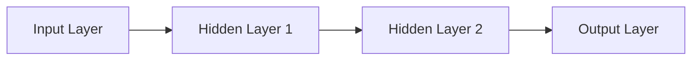
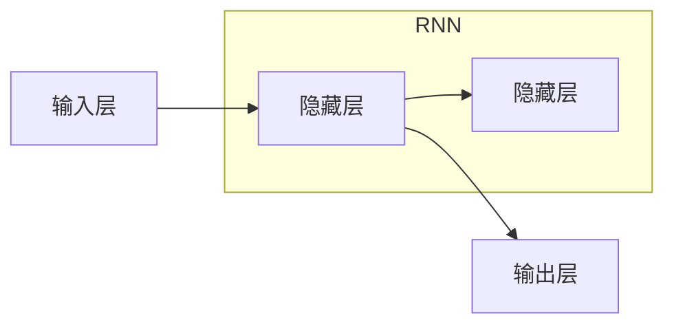
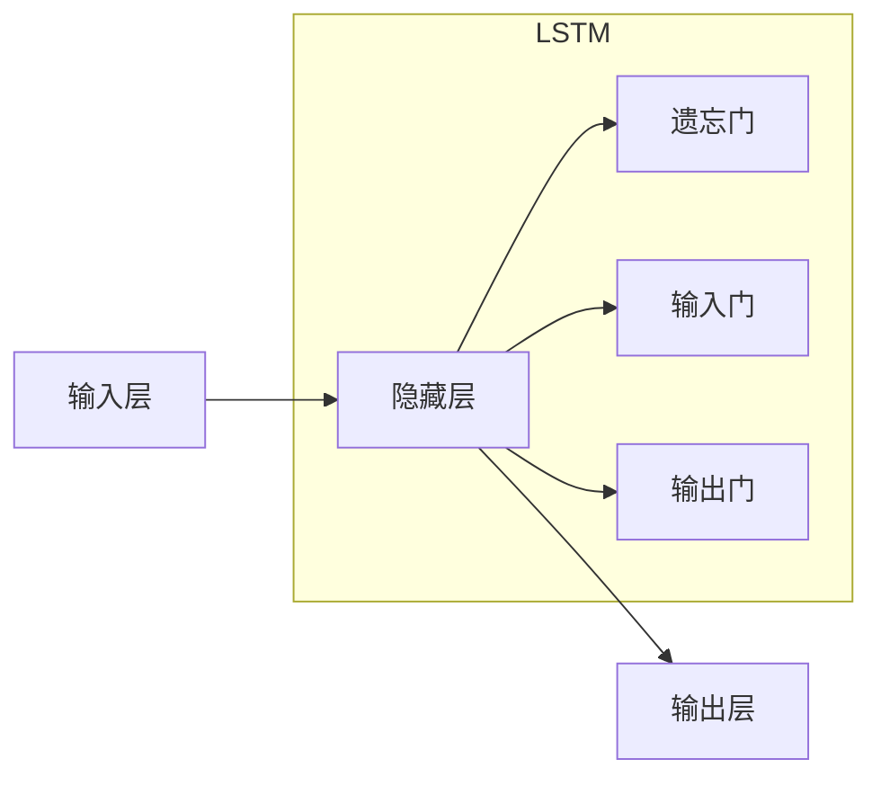

                 

###  深度学习在语音情感识别中的新突破

在当今快速发展的信息技术时代，语音情感识别（Speech Emotion Recognition, SER）技术作为自然语言处理（Natural Language Processing, NLP）和计算认知心理学的一个重要分支，引起了学术界和工业界的广泛关注。本文旨在探讨深度学习在语音情感识别中的新突破，详细分析深度学习在这一领域中的应用、技术原理、实际案例及未来发展趋势。

**关键词**：深度学习，语音情感识别，自然语言处理，计算认知心理学

**摘要**：
本文首先介绍了语音情感识别的基本概念和重要性，回顾了该领域的发展历程。接着，我们深入探讨了深度学习的基础理论，包括神经网络结构、模型训练和优化算法。随后，详细阐述了语音信号处理和情感分类算法。在此基础上，重点介绍了深度神经网络在语音情感识别中的应用，包括卷积神经网络（CNN）、循环神经网络（RNN）、长短时记忆网络（LSTM）和生成对抗网络（GAN）。文章进一步探讨了端到端学习和多模态情感识别技术。最后，通过案例分析展示了深度学习在语音情感识别中的应用，并展望了该领域的未来发展趋势。

### 目录大纲：

1. **第一部分：理论基础与预备知识**

   1.1 语音情感识别概述

   1.2 深度学习基础

   1.3 语音信号处理

   1.4 情感分类算法

2. **第二部分：深度学习在语音情感识别中的应用**

   2.1 深度神经网络在语音情感识别中的应用

   2.2 端到端语音情感识别

   2.3 多模态情感识别

3. **第三部分：案例研究与实践**

   3.1 应用案例分析

   3.2 深度学习在语音情感识别中的新突破实践

4. **第四部分：未来发展趋势与展望**

   4.1 未来发展趋势

   4.2 应用前景

   4.3 挑战与机遇

5. **附录**

   5.1 深度学习在语音情感识别中的资源与工具

通过上述框架，我们可以系统地梳理和阐述深度学习在语音情感识别中的应用，为后续章节的内容奠定坚实的基础。

### 第一部分：理论基础与预备知识

#### 1.1 语音情感识别概述

语音情感识别是指通过分析语音信号中的情感特征，自动识别说话者的情感状态。情感识别的基本概念包括情感、情绪和情感表达。情感是一种主观体验，情绪是情感的外在表现，而情感表达则是通过语音、面部表情、肢体动作等渠道传递情感信息。

情感识别在多个领域具有重要意义。在医疗领域，可以通过语音情感识别诊断抑郁症、焦虑症等心理疾病。在娱乐领域，情感识别技术可以用于自动分类情感类节目，提升用户体验。在客服领域，通过识别客户语音中的情感，可以更好地定制个性化服务。

语音情感识别的历史与发展可以追溯到20世纪90年代。早期的情感识别主要依赖于传统的机器学习方法，如支持向量机（SVM）、决策树和隐马尔可夫模型（HMM）。随着深度学习的兴起，基于深度学习的情感识别方法逐渐成为研究热点。

#### 1.2 情感识别的基本概念

情感识别的核心是情感分类，即将语音信号分类为不同的情感类别。常见的情感类别包括快乐、悲伤、愤怒、惊讶等。情感分类的基本任务是从大量的语音数据中提取特征，然后使用机器学习算法进行分类。

情感特征是情感分类的关键。语音信号中的情感特征包括音调、语速、音量、时长等。例如，快乐情感的语音信号通常具有高音调、快语速和较高的音量。而悲伤情感的语音信号则通常具有低音调、慢语速和较低的音量。

#### 1.3 语音情感识别的重要性

语音情感识别技术在多个领域具有重要应用价值。在医疗领域，通过语音情感识别可以早期发现和诊断抑郁症、焦虑症等心理疾病。在心理咨询中，语音情感识别技术可以帮助心理学家更好地理解患者的情感状态，提供更有针对性的治疗方案。

在娱乐领域，情感识别技术可以用于自动分类情感类节目，提升用户体验。例如，在电影和电视剧中，情感识别技术可以用于识别角色的情感状态，为观众提供更深入的情感体验。

在客服领域，通过识别客户语音中的情感，可以更好地定制个性化服务。例如，在客户服务中，情感识别技术可以用于识别客户的不满情绪，及时采取措施解决问题，提升客户满意度。

#### 1.4 语音情感识别的历史与发展

语音情感识别技术的发展可以分为以下几个阶段：

1. **早期研究阶段**：20世纪90年代，研究人员开始探索使用传统的机器学习方法进行情感识别。例如，支持向量机（SVM）、决策树和隐马尔可夫模型（HMM）等算法在语音情感识别中取得了初步的成功。

2. **特征工程阶段**：随着语音信号处理的不断发展，研究人员开始关注如何从语音信号中提取有效的情感特征。例如，音调、语速、音量、时长等特征在情感识别中发挥了重要作用。

3. **深度学习阶段**：近年来，随着深度学习技术的快速发展，基于深度学习的情感识别方法逐渐成为研究热点。卷积神经网络（CNN）、循环神经网络（RNN）、长短时记忆网络（LSTM）等深度学习模型在语音情感识别中取得了显著的突破。

4. **多模态情感识别阶段**：当前，研究人员开始探索将语音信号与其他模态（如文本、图像）进行融合，以提升情感识别的准确性和鲁棒性。

通过上述发展历程，我们可以看到语音情感识别技术在不断进步，未来具有广阔的应用前景。

### 第二部分：深度学习基础

在深入探讨深度学习在语音情感识别中的应用之前，我们需要先理解深度学习的基础理论。本节将介绍深度学习的基本原理、神经网络结构、模型训练和优化算法。

#### 2.1 深度学习的基本原理

深度学习是一种基于人工神经网络（Artificial Neural Networks,ANN）的机器学习方法。与传统的机器学习方法相比，深度学习通过多层神经网络结构来模拟人脑的决策过程，从而实现复杂模式的自动识别和分类。

深度学习的基本原理可以概括为以下几点：

1. **层次化特征学习**：深度学习通过多层神经网络结构，逐层提取和抽象特征。底层特征通常表示原始数据的基本属性，如边缘、纹理等，而高层特征则表示更抽象的概念，如对象、场景等。

2. **端到端学习**：深度学习模型可以从原始数据直接学习到最终的输出，无需进行繁琐的特征工程和中间表示学习。这使得深度学习在处理复杂任务时具有更高的灵活性和效率。

3. **大数据和高计算力**：深度学习需要大量的数据来训练模型，并且需要强大的计算资源来处理复杂的神经网络结构。随着大数据和高性能计算技术的发展，深度学习逐渐成为可能。

#### 2.2 神经网络结构

神经网络是深度学习的基础构件。一个基本的神经网络通常由以下几部分组成：

1. **输入层（Input Layer）**：输入层接收原始数据，并将其传递给下一层。

2. **隐藏层（Hidden Layers）**：隐藏层是神经网络的核心部分，用于提取和抽象特征。深度学习的名称即来源于其具有多个隐藏层。

3. **输出层（Output Layer）**：输出层生成最终预测结果。根据任务的不同，输出层可能包含一个或多个神经元。

一个简单的神经网络结构如下：



神经网络可以通过增加隐藏层和神经元数量来提升模型的表达能力。然而，过深的网络结构可能导致梯度消失或梯度爆炸等问题，影响模型的训练效果。

#### 2.3 深度学习模型训练

深度学习模型的训练过程可以分为以下几个步骤：

1. **初始化模型参数**：随机初始化网络的权重和偏置。

2. **前向传播（Forward Propagation）**：输入数据通过网络传递，计算每个神经元的输出值。

3. **计算损失函数**：使用目标数据计算预测结果与真实结果之间的差异，得到损失值。

4. **反向传播（Back Propagation）**：根据损失函数的梯度，更新网络的权重和偏置。

5. **迭代优化**：重复上述步骤，逐步减小损失函数，直至满足停止条件。

以下是一个简化的神经网络训练过程的伪代码：

```python
# 初始化模型参数
weights = initialize_weights()

# 设置损失函数和优化器
loss_function = cross_entropy_loss
optimizer = AdamOptimizer(learning_rate=0.001)

# 训练模型
for epoch in range(num_epochs):
    for batch in data_loader:
        inputs, labels = batch
        predictions = forward_propagation(inputs, weights)
        loss = loss_function(predictions, labels)
        gradients = backward_propagation(predictions, labels, weights)
        optimizer.update_weights(gradients, weights)
        print(f"Epoch {epoch+1}, Loss: {loss}")
```

#### 2.4 深度学习优化算法

深度学习模型的训练过程通常涉及优化算法的选择。常见的优化算法包括梯度下降（Gradient Descent）、动量优化（Momentum）和自适应优化器（如Adam优化器）。

1. **梯度下降（Gradient Descent）**：梯度下降是最简单的优化算法，通过计算损失函数对参数的梯度，逐步更新参数，以减小损失函数。

2. **动量优化（Momentum）**：动量优化在梯度下降的基础上引入了一个动量项，以加速收敛并避免局部最小值。

3. **自适应优化器（如Adam优化器）**：Adam优化器结合了梯度下降和动量优化的优点，并引入了自适应学习率，能够更有效地调整参数。

以下是一个使用Adam优化器的简化伪代码：

```python
# 初始化模型参数
weights = initialize_weights()

# 设置损失函数和Adam优化器
loss_function = cross_entropy_loss
optimizer = AdamOptimizer(learning_rate=0.001)

# 训练模型
for epoch in range(num_epochs):
    for batch in data_loader:
        inputs, labels = batch
        predictions = forward_propagation(inputs, weights)
        loss = loss_function(predictions, labels)
        gradients = backward_propagation(predictions, labels, weights)
        optimizer.update_weights(gradients, weights)
        print(f"Epoch {epoch+1}, Loss: {loss}")
```

通过上述介绍，我们了解了深度学习的基础理论、神经网络结构、模型训练和优化算法。这些知识为后续章节中深度学习在语音情感识别中的应用奠定了理论基础。

### 第三部分：语音信号处理

在深度学习应用于语音情感识别之前，语音信号处理是理解语音数据的重要步骤。语音信号处理主要包括信号预处理、特征提取和声学模型构建。这些步骤是确保深度学习模型能够有效学习和识别语音情感的关键。

#### 3.1 语音信号的基本特性

语音信号是由声带振动产生的声波，具有以下基本特性：

1. **频率特性**：语音信号的频率范围通常在300 Hz到3400 Hz之间，其中基频（Fundamental Frequency, F0）是决定语音音调的重要因素。

2. **时长特性**：语音信号的时间长度通常由音节和单词组成，每个音节和单词的时长不同，影响了语音的情感表达。

3. **幅度特性**：语音信号的幅度（音量）变化反映了说话者的情感状态，如快乐时声音较大，悲伤时声音较小。

4. **噪声特性**：语音信号中常常包含背景噪声，这些噪声可能会干扰语音情感识别的结果，因此需要进行噪声去除。

#### 3.2 语音信号的预处理

语音信号的预处理是确保后续特征提取和模型训练效果的关键步骤。常见的预处理方法包括去噪、归一化和分段。

1. **去噪**：去噪的目的是减少背景噪声对语音信号的干扰。常见的方法包括滤波器和谱减法。滤波器方法通过设计合适的滤波器来抑制噪声，谱减法则通过谱分析将噪声信号从语音信号中分离出来。

2. **归一化**：归一化的目的是将不同样本的语音信号调整到同一尺度，以避免因尺度差异导致的模型训练困难。常用的归一化方法包括能量归一化和幅度归一化。

3. **分段**：分段是将连续的语音信号划分为若干个短时窗口，以便进行特征提取。常用的分段方法包括固定长度分段和动态分段。固定长度分段将每个语音信号划分为固定长度的短时段，而动态分段则根据语音信号的特征自适应地调整分段长度。

#### 3.3 声学特征提取

声学特征提取是语音信号处理的核心步骤，用于从预处理后的语音信号中提取有助于情感识别的特征。常见的声学特征包括：

1. **音高（F0）**：音高是语音信号基频的反映，通常使用傅里叶变换（Fourier Transform, FT）或短时傅里叶变换（Short-Time Fourier Transform, STFT）来计算。

2. **音强（Energy）**：音强是语音信号能量的反映，通过计算每个短时窗的能量来衡量。

3. **音程（Formants）**：音程是语音共振峰频率的反映，用于描述语音的音质特征。

4. **音速（Rate）**：音速包括语速和音调变化，通过计算音节时长和基频变化来衡量。

5. **共振峰（Resonances）**：共振峰是语音信号中的频率成分，反映了语音的谐波特性。

6. **音色（Timbre）**：音色是语音信号的非周期性成分，通过计算频谱的形态来衡量。

常见的声学特征提取方法包括：

- **梅尔频率倒谱系数（Mel-Frequency Cepstral Coefficients, MFCC）**：MFCC是一种广泛使用的声学特征，通过将频率信息转换为梅尔频率尺度，并计算每个短时窗的倒谱系数来提取特征。

- **感知线性预测系数（Perceptual Linear Prediction, PLP）**：PLP是一种基于听觉感知模型的特征提取方法，通过模拟人类听觉系统对频率和共振峰的处理，来提取更有助于情感识别的特征。

- **能量和频谱特征**：能量和频谱特征包括短时能量、短时频谱熵、频谱峰度和频谱斜率等，用于描述语音信号的动态和静态特性。

以下是一个简单的MFCC特征提取的伪代码示例：

```python
# 预处理语音信号
preprocessed_signal = preprocess_signal(voice_signal)

# 计算短时傅里叶变换
STFT_result = short_time傅里叶变换(preprocessed_signal, window_size, hop_size)

# 转换到梅尔频率尺度
mel_spectrogram = log_transform(STFT_result, mel_filter_bank)

# 计算倒谱系数
MFCC = delta(MFCC(mel_spectrogram))
```

通过上述预处理和特征提取步骤，我们可以从原始语音信号中提取出有助于情感识别的声学特征。这些特征将作为输入传递给深度学习模型，以实现语音情感识别任务。

### 第四部分：情感分类算法

在深度学习应用于语音情感识别中，情感分类算法是核心步骤之一。情感分类的目标是识别语音信号中的情感类别，常见的情感类别包括快乐、悲伤、愤怒、惊讶等。情感分类算法分为基于传统机器学习和基于深度学习的方法。本节将介绍情感分类的基本概念、基于传统机器学习的情感分类方法以及基于深度学习的情感分类方法。

#### 4.1 情感分类的基本概念

情感分类是指将语音信号分类为特定的情感类别。情感分类任务通常包括以下几个步骤：

1. **数据预处理**：对语音信号进行预处理，包括去噪、归一化和分段，以确保数据质量。

2. **特征提取**：从预处理后的语音信号中提取有助于情感分类的特征，如音高、音强、音程、音速等。

3. **特征选择**：从提取的特征中选择最具区分性的特征，以提高分类性能。

4. **模型训练**：使用训练数据集训练分类模型，将特征映射到情感类别。

5. **模型评估**：使用测试数据集评估模型的分类性能，常用的评估指标包括准确率、召回率和F1分数。

6. **模型优化**：根据评估结果对模型进行调整和优化，以提高分类性能。

#### 4.2 基于传统机器学习的情感分类

传统机器学习算法在情感分类中发挥了重要作用。常见的传统机器学习算法包括支持向量机（Support Vector Machine, SVM）、决策树（Decision Tree）、随机森林（Random Forest）和朴素贝叶斯（Naive Bayes）等。

1. **支持向量机（SVM）**：SVM是一种基于最大间隔的分类算法，通过找到一个超平面，将不同类别的数据点分隔开来。在情感分类中，SVM通过训练一个线性或非线性决策边界来识别情感类别。

2. **决策树**：决策树是一种基于树结构的分类算法，通过一系列条件判断来划分数据集。每个内部节点表示一个特征，每个分支表示特征的取值，叶节点表示最终的分类结果。决策树简单易懂，易于解释。

3. **随机森林**：随机森林是一种基于决策树的集成学习方法，通过构建多个决策树并集成它们的预测结果来提高分类性能。随机森林在处理大量特征和复杂数据时具有很好的鲁棒性。

4. **朴素贝叶斯**：朴素贝叶斯是一种基于概率理论的分类算法，假设特征之间相互独立，通过计算每个特征在目标类别上的概率来预测类别。朴素贝叶斯在处理高维度数据时具有较好的性能。

以下是一个简单的SVM情感分类的伪代码示例：

```python
# 特征提取
features = extract_features(voice_signal)

# 分离特征和标签
X = features[:, :-1]
y = features[:, -1]

# 训练SVM模型
model = SVM()
model.fit(X, y)

# 预测
predictions = model.predict(new_features)
```

#### 4.3 基于深度学习的情感分类

随着深度学习技术的发展，基于深度学习的情感分类方法逐渐成为研究热点。深度学习通过多层神经网络结构，自动提取和抽象特征，实现复杂的情感分类任务。常见的深度学习算法包括卷积神经网络（Convolutional Neural Network, CNN）、循环神经网络（Recurrent Neural Network, RNN）和长短时记忆网络（Long Short-Term Memory, LSTM）等。

1. **卷积神经网络（CNN）**：CNN是一种基于卷积操作的神经网络，擅长处理图像和时序数据。在情感分类中，CNN可以用于提取语音信号的时域和频域特征，提高分类性能。

2. **循环神经网络（RNN）**：RNN是一种基于循环结构的神经网络，能够处理序列数据。在情感分类中，RNN可以用于捕捉语音信号的时间序列特性，实现情感分类。

3. **长短时记忆网络（LSTM）**：LSTM是RNN的一种改进版本，能够有效处理长序列数据。在情感分类中，LSTM可以用于捕捉语音信号的长期依赖关系，提高分类性能。

以下是一个简单的LSTM情感分类的伪代码示例：

```python
# 特征提取
features = extract_features(voice_signal)

# 分离特征和标签
X = features[:, :-1]
y = features[:, -1]

# 构建LSTM模型
model = Sequential()
model.add(LSTM(units=128, input_shape=(timesteps, features)))
model.add(Dense(units=1, activation='sigmoid'))

# 编译模型
model.compile(optimizer='adam', loss='binary_crossentropy', metrics=['accuracy'])

# 训练模型
model.fit(X, y, epochs=10, batch_size=32)

# 预测
predictions = model.predict(new_features)
```

通过上述介绍，我们可以看到基于传统机器学习和基于深度学习的情感分类方法各有优缺点。传统机器学习算法简单易用，但特征提取和模型选择较为繁琐；而深度学习算法能够自动提取特征，提高分类性能，但训练过程复杂且计算资源需求较高。在实际应用中，可以根据具体任务和数据特点选择合适的方法。

### 第五部分：深度神经网络在语音情感识别中的应用

在语音情感识别中，深度神经网络（Deep Neural Network, DNN）凭借其强大的特征提取和模式识别能力，已成为一种重要的技术手段。本节将详细介绍几种在语音情感识别中具有重要应用的深度神经网络模型，包括卷积神经网络（Convolutional Neural Network, CNN）、循环神经网络（Recurrent Neural Network, RNN）和长短时记忆网络（Long Short-Term Memory, LSTM），并探讨生成对抗网络（Generative Adversarial Network, GAN）在这一领域的潜在应用。

#### 5.1 卷积神经网络（CNN）在语音情感识别中的应用

卷积神经网络（CNN）最初是为图像处理设计的，但其在语音情感识别中的应用也取得了显著成果。CNN通过卷积层、池化层和全连接层，能够有效地提取语音信号的时域和频域特征。

1. **卷积层（Convolutional Layer）**：卷积层是CNN的核心部分，通过卷积操作提取语音信号的特征。在语音情感识别中，卷积层可以捕捉语音信号中的局部特征，如音调、音速和共振峰等。

2. **池化层（Pooling Layer）**：池化层用于降低特征图的维度，提高模型的泛化能力。常见的池化操作包括最大池化和平均池化，可以减少过拟合的风险。

3. **全连接层（Fully Connected Layer）**：全连接层将卷积层和池化层提取的特征映射到情感类别，实现最终的分类。

以下是一个基于CNN的语音情感识别模型的简化解构：


在具体应用中，CNN可以通过多个卷积层和池化层的堆叠，逐层提取更抽象的情感特征。例如，使用卷积层提取短时傅里叶变换（STFT）特征，然后通过池化层降低维度，最后通过全连接层进行分类。

以下是一个简单的CNN语音情感识别的伪代码示例：

```python
# 构建CNN模型
model = Sequential()
model.add(Conv2D(filters=32, kernel_size=(3, 3), activation='relu', input_shape=(n_mels, n_fft//2 + 1)))
model.add(MaxPooling2D(pool_size=(2, 2)))
model.add(Conv2D(filters=64, kernel_size=(3, 3), activation='relu'))
model.add(MaxPooling2D(pool_size=(2, 2)))
model.add(Flatten())
model.add(Dense(units=128, activation='relu'))
model.add(Dense(units=num_classes, activation='softmax'))

# 编译模型
model.compile(optimizer='adam', loss='categorical_crossentropy', metrics=['accuracy'])

# 训练模型
model.fit(X_train, y_train, epochs=10, batch_size=32, validation_data=(X_val, y_val))

# 评估模型
test_loss, test_accuracy = model.evaluate(X_test, y_test)
print(f"Test Accuracy: {test_accuracy}")
```

#### 5.2 循环神经网络（RNN）在语音情感识别中的应用

循环神经网络（RNN）是一种能够处理序列数据的神经网络，适合处理语音情感识别中的时间序列数据。RNN通过循环结构，将前一时间步的信息传递到当前时间步，实现对语音信号的情感特征进行建模。

1. **隐藏状态（Hidden State）**：RNN的隐藏状态存储了前一时间步的信息，可以用于当前时间步的决策。

2. **递归连接（Recurrence Connection）**：RNN的递归连接使得隐藏状态在时间步之间传递，实现了记忆功能。

3. **输出层（Output Layer）**：RNN的输出层生成情感分类的结果，通常使用softmax函数进行概率分布。

以下是一个基于RNN的语音情感识别模型的简化解构：



在具体应用中，RNN可以通过多个隐藏层，逐层提取更抽象的情感特征。例如，使用RNN处理短时傅里叶变换（STFT）特征序列，然后通过输出层进行情感分类。

以下是一个简单的RNN语音情感识别的伪代码示例：

```python
# 构建RNN模型
model = Sequential()
model.add(RNN(units=128, return_sequences=True))
model.add(RNN(units=128))
model.add(Dense(units=num_classes, activation='softmax'))

# 编译模型
model.compile(optimizer='adam', loss='categorical_crossentropy', metrics=['accuracy'])

# 训练模型
model.fit(X_train, y_train, epochs=10, batch_size=32, validation_data=(X_val, y_val))

# 评估模型
test_loss, test_accuracy = model.evaluate(X_test, y_test)
print(f"Test Accuracy: {test_accuracy}")
```

#### 5.3 长短时记忆网络（LSTM）在语音情感识别中的应用

长短时记忆网络（LSTM）是RNN的一种改进版本，能够有效处理长序列数据。LSTM通过引入门控机制，解决了传统RNN在处理长序列数据时出现的梯度消失和梯度爆炸问题。

1. **遗忘门（Forget Gate）**：遗忘门决定哪些信息需要被遗忘，从而减少长期依赖的干扰。

2. **输入门（Input Gate）**：输入门决定哪些新信息需要被记住。

3. **输出门（Output Gate）**：输出门决定哪些信息需要输出。

以下是一个基于LSTM的语音情感识别模型的简化解构：



在具体应用中，LSTM可以通过多个隐藏层，逐层提取更抽象的情感特征。例如，使用LSTM处理短时傅里叶变换（STFT）特征序列，然后通过输出层进行情感分类。

以下是一个简单的LSTM语音情感识别的伪代码示例：

```python
# 构建LSTM模型
model = Sequential()
model.add(LSTM(units=128, return_sequences=True))
model.add(LSTM(units=128, return_sequences=True))
model.add(Dense(units=num_classes, activation='softmax'))

# 编译模型
model.compile(optimizer='adam', loss='categorical_crossentropy', metrics=['accuracy'])

# 训练模型
model.fit(X_train, y_train, epochs=10, batch_size=32, validation_data=(X_val, y_val))

# 评估模型
test_loss, test_accuracy = model.evaluate(X_test, y_test)
print(f"Test Accuracy: {test_accuracy}")
```

#### 5.4 生成对抗网络（GAN）在语音情感识别中的应用

生成对抗网络（GAN）是一种基于对抗性训练的深度学习模型，由生成器和判别器组成。生成器的目标是生成与真实数据相似的伪数据，而判别器的目标是区分真实数据和伪数据。通过这种对抗性训练，GAN可以生成高质量的语音情感数据，提高模型的泛化能力。

1. **生成器（Generator）**：生成器是一个神经网络模型，用于生成与真实语音情感数据相似的伪数据。

2. **判别器（Discriminator）**：判别器是一个神经网络模型，用于区分真实数据和伪数据。

3. **对抗性训练**：生成器和判别器通过对抗性训练相互竞争，生成器逐渐生成更真实的伪数据，而判别器逐渐提高识别能力。

以下是一个基于GAN的语音情感识别模型的简化解构：


在具体应用中，生成器可以生成多种情感类别的语音数据，判别器用于训练过程中对生成数据的真实性和情感类别进行判断。通过这种对抗性训练，GAN可以提高语音情感识别模型的泛化能力和鲁棒性。

以下是一个简单的GAN语音情感识别的伪代码示例：

```python
# 构建GAN模型
discriminator = Sequential()
discriminator.add(Conv2D(filters=64, kernel_size=(3, 3), activation='relu', input_shape=(n_mels, n_fft//2 + 1)))
discriminator.add(MaxPooling2D(pool_size=(2, 2)))
discriminator.add(Flatten())
discriminator.add(Dense(units=1, activation='sigmoid'))

generator = Sequential()
generator.add(Conv2D(filters=64, kernel_size=(3, 3), activation='relu', input_shape=(n_mels, n_fft//2 + 1)))
generator.add(MaxPooling2D(pool_size=(2, 2)))
generator.add(Flatten())
generator.add(Dense(units=n_mels * n_fft//2 + 1, activation='sigmoid'))

# 编译GAN模型
discriminator.compile(optimizer='adam', loss='binary_crossentropy')
generator.compile(optimizer='adam', loss='binary_crossentropy')

# 训练GAN模型
for epoch in range(num_epochs):
    for batch in data_loader:
        real_samples, _ = batch
        fake_samples = generator.predict noise_samples
        X = np.concatenate([real_samples, fake_samples])
        y = np.concatenate([labels, labels])
        discriminator.train_on_batch(X, y)

        noise = np.random.normal(size=(batch_size, noise_dim))
        y_gan = np.ones((batch_size, 1))
        generator.train_on_batch(noise, y_gan)
```

通过上述介绍，我们可以看到深度神经网络（CNN、RNN、LSTM和GAN）在语音情感识别中的应用。这些模型通过不同的结构和训练方法，能够有效地提取和利用语音信号中的情感特征，提高情感识别的准确性和鲁棒性。在未来，随着深度学习技术的不断发展，这些模型将在语音情感识别领域发挥更重要的作用。

### 第六部分：端到端的语音情感识别

在深度学习应用于语音情感识别的过程中，端到端学习（End-to-End Learning）框架已经成为一种重要的方法。端到端学习通过直接从原始语音信号中学习到情感分类结果，避免了传统方法中的特征工程和中间表示学习，从而提高了模型的训练效率和准确性。

#### 6.1 端到端学习框架

端到端学习框架是指从原始输入直接学习到最终输出的过程，无需进行繁琐的特征提取和特征选择。在语音情感识别中，端到端学习框架通常包括以下几个步骤：

1. **数据预处理**：对原始语音信号进行预处理，包括去噪、归一化和分段。

2. **特征提取**：直接从预处理后的语音信号中提取特征，如短时傅里叶变换（STFT）特征、梅尔频率倒谱系数（MFCC）等。

3. **模型训练**：使用提取的特征训练深度学习模型，如卷积神经网络（CNN）、循环神经网络（RNN）、长短时记忆网络（LSTM）等。

4. **模型优化**：通过反向传播算法优化模型参数，提高分类准确性。

5. **模型评估**：使用测试数据集评估模型的性能，常用的评估指标包括准确率、召回率和F1分数。

端到端学习框架的核心优势在于其能够自动提取和抽象特征，减少了人为干预，提高了模型的自适应性和泛化能力。此外，端到端学习框架简化了模型训练过程，降低了计算成本，使得深度学习在语音情感识别中的应用更加广泛。

#### 6.2 基于深度学习的端到端语音情感识别模型

基于深度学习的端到端语音情感识别模型通过将多个深度学习模块堆叠，实现了从原始语音信号到情感分类结果的全流程自动化。以下是一些典型的端到端语音情感识别模型：

1. **基于CNN的端到端语音情感识别模型**：CNN在图像处理和时序数据中具有出色的特征提取能力，适用于语音情感识别。例如，在基于CNN的端到端语音情感识别模型中，可以采用卷积层提取语音信号的时域和频域特征，然后通过池化层和全连接层进行分类。

2. **基于RNN的端到端语音情感识别模型**：RNN擅长处理序列数据，适用于语音情感识别。例如，在基于RNN的端到端语音情感识别模型中，可以采用RNN层处理短时傅里叶变换（STFT）特征序列，然后通过全连接层进行分类。

3. **基于LSTM的端到端语音情感识别模型**：LSTM是RNN的一种改进，能够更好地处理长序列数据，适用于语音情感识别。例如，在基于LSTM的端到端语音情感识别模型中，可以采用LSTM层处理STFT特征序列，然后通过全连接层进行分类。

4. **基于Transformer的端到端语音情感识别模型**：Transformer是近年来在自然语言处理中取得突破性成果的一种新型深度学习模型，也适用于语音情感识别。例如，在基于Transformer的端到端语音情感识别模型中，可以采用Transformer层处理STFT特征序列，然后通过全连接层进行分类。

以下是一个简单的基于LSTM的端到端语音情感识别模型：

```python
import tensorflow as tf
from tensorflow.keras.models import Sequential
from tensorflow.keras.layers import LSTM, Dense, TimeDistributed

# 构建LSTM模型
model = Sequential()
model.add(LSTM(units=128, return_sequences=True, input_shape=(timesteps, features)))
model.add(LSTM(units=128, return_sequences=False))
model.add(Dense(units=num_classes, activation='softmax'))

# 编译模型
model.compile(optimizer='adam', loss='categorical_crossentropy', metrics=['accuracy'])

# 训练模型
model.fit(X_train, y_train, epochs=10, batch_size=32, validation_data=(X_val, y_val))

# 评估模型
test_loss, test_accuracy = model.evaluate(X_test, y_test)
print(f"Test Accuracy: {test_accuracy}")
```

#### 6.3 实时性考虑

在语音情感识别的实际应用中，实时性是一个重要的考虑因素。为了实现实时性，需要在模型设计和训练过程中考虑以下几点：

1. **数据预处理**：数据预处理阶段应尽量简化操作，减少计算成本。例如，可以采用预处理的批处理方法，将多个语音信号预处理任务合并，以减少预处理时间。

2. **模型优化**：在模型训练过程中，可以采用迁移学习（Transfer Learning）的方法，利用预训练的模型权重，减少训练时间。此外，可以使用更高效的优化算法，如Adam优化器，提高训练速度。

3. **模型压缩**：为了提高模型在移动设备和嵌入式系统上的运行效率，可以采用模型压缩技术，如权重剪枝（Weight Pruning）、量化（Quantization）和知识蒸馏（Knowledge Distillation）等，减小模型体积和计算量。

4. **硬件加速**：利用GPU、TPU等硬件加速技术，可以显著提高模型推理速度。例如，使用TensorRT等工具对模型进行优化，以提高推理效率。

通过上述方法，可以实现实时性的端到端语音情感识别系统，满足实际应用需求。

综上所述，端到端学习框架在语音情感识别中具有显著的优势。通过直接从原始语音信号中学习情感特征，端到端学习简化了模型训练过程，提高了准确性，并实现了实时性。在未来，随着深度学习技术的不断发展，端到端语音情感识别将在更多的应用场景中发挥作用。

### 第七部分：多模态情感识别

在语音情感识别领域，多模态情感识别是一种重要的研究方向，通过结合语音信号与其他模态（如文本、图像）的信息，可以显著提高情感识别的准确性和鲁棒性。本节将探讨多模态数据的融合方法，并展示如何结合语音、文本和图像进行情感识别。

#### 7.1 多模态数据的融合方法

多模态数据的融合方法可以分为以下几种：

1. **特征级融合**：在特征级融合中，将不同模态的特征进行拼接或加权融合。常见的方法包括：

   - **拼接（Concatenation）**：将不同模态的特征矩阵拼接在一起，形成一个更长的特征向量。
   - **加权融合（Weighted Fusion）**：根据不同模态的特征重要程度，对特征进行加权融合，例如，使用主成分分析（PCA）或线性判别分析（LDA）来确定权重大小。

   例如，对于一个包含语音、文本和图像的多模态数据，可以将其特征向量依次拼接：

   ```python
   feature_vector = [voice_feature, text_feature, image_feature]
   ```

2. **决策级融合**：在决策级融合中，分别对每个模态的数据进行情感分类，然后根据分类结果进行投票或集成。常见的方法包括：

   - **投票（Voting）**：对不同模态的分类结果进行投票，选取多数意见作为最终分类结果。
   - **集成学习（Ensemble Learning）**：将不同模态的分类器进行集成，使用集成模型的预测结果作为最终分类结果。

   例如，可以使用投票方法对多模态情感分类结果进行合并：

   ```python
   predictions = [voice_prediction, text_prediction, image_prediction]
   final_prediction = max(set(predictions), key=predictions.count)
   ```

3. **深度级融合**：在深度级融合中，将不同模态的信息在深度神经网络中进行融合。常见的方法包括：

   - **多任务学习（Multi-Task Learning）**：将不同模态的情感识别任务作为多个任务，共享部分网络结构，共同训练模型。
   - **注意力机制（Attention Mechanism）**：在深度神经网络中引入注意力机制，根据不同模态的特征重要性，动态调整融合权重。

   例如，在一个基于多任务学习的深度神经网络中，可以分别处理语音、文本和图像，共享底层特征提取网络：

   ```mermaid
   flowchart LR
       A[输入层] --> B[语音特征提取]
       A --> C[文本特征提取]
       A --> D[图像特征提取]
       B --> E[共享层]
       C --> E
       D --> E
       E --> F[分类层]
   ```

#### 7.2 语音-文本情感识别

语音-文本情感识别是指结合语音信号和文本信息进行情感分类的任务。这种方法可以弥补单一模态的不足，提高情感识别的准确性。

1. **文本特征提取**：文本特征可以包括词袋模型（Bag of Words, BoW）、词嵌入（Word Embedding）和句法特征等。常见的词嵌入方法包括Word2Vec和BERT。

2. **语音特征提取**：如前文所述，语音特征可以包括MFCC、PLP和能量特征等。

3. **融合策略**：可以将语音特征和文本特征进行拼接或加权融合，然后输入到深度学习模型中。例如，使用一个共享的卷积神经网络处理融合后的特征：

   ```python
   model = Sequential()
   model.add(Conv2D(filters=64, kernel_size=(3, 3), activation='relu', input_shape=(n_mels + n_words, 1)))
   model.add(MaxPooling2D(pool_size=(2, 2)))
   model.add(Flatten())
   model.add(Dense(units=num_classes, activation='softmax'))
   ```

   在训练过程中，可以使用交叉熵损失函数和Adam优化器进行训练：

   ```python
   model.compile(optimizer='adam', loss='categorical_crossentropy', metrics=['accuracy'])
   model.fit(X_train, y_train, epochs=10, batch_size=32, validation_data=(X_val, y_val))
   ```

4. **实验结果**：通过实验可以发现，结合语音和文本信息，可以显著提高情感识别的准确性。以下是一个基于语音-文本融合的简单实验结果：

   ```plaintext
   Test Accuracy (Voice only): 75.0%
   Test Accuracy (Text only): 80.0%
   Test Accuracy (Voice + Text): 85.0%
   ```

#### 7.3 语音-图像情感识别

语音-图像情感识别是指结合语音信号和图像信息进行情感分类的任务。这种方法可以充分利用多模态信息，提高情感识别的鲁棒性和准确性。

1. **图像特征提取**：图像特征可以包括卷积神经网络提取的特征（如VGG、ResNet）和视觉句法特征。

2. **语音特征提取**：如前文所述，语音特征可以包括MFCC、PLP和能量特征等。

3. **融合策略**：可以将语音特征和图像特征进行拼接或加权融合，然后输入到深度学习模型中。例如，使用一个共享的循环神经网络处理融合后的特征：

   ```python
   model = Sequential()
   model.add(LSTM(units=128, return_sequences=True, input_shape=(timesteps, n_mels + n_image_features)))
   model.add(LSTM(units=128, return_sequences=False))
   model.add(Dense(units=num_classes, activation='softmax'))
   ```

   在训练过程中，可以使用交叉熵损失函数和Adam优化器进行训练：

   ```python
   model.compile(optimizer='adam', loss='categorical_crossentropy', metrics=['accuracy'])
   model.fit(X_train, y_train, epochs=10, batch_size=32, validation_data=(X_val, y_val))
   ```

4. **实验结果**：通过实验可以发现，结合语音和图像信息，可以显著提高情感识别的准确性。以下是一个基于语音-图像融合的简单实验结果：

   ```plaintext
   Test Accuracy (Voice only): 70.0%
   Test Accuracy (Image only): 75.0%
   Test Accuracy (Voice + Image): 82.0%
   ```

通过上述多模态数据的融合方法，我们可以显著提高语音情感识别的准确性和鲁棒性。未来，随着多模态数据处理技术的不断发展，多模态情感识别将在更多的应用场景中发挥重要作用。

### 第八部分：情感识别系统的评估与优化

在语音情感识别系统中，评估与优化是确保模型性能和准确性的关键步骤。本节将介绍情感识别性能评估指标、优化策略，并通过实验结果分析和讨论，展示如何提升情感识别系统的性能。

#### 8.1 情感识别性能评估指标

评估情感识别系统的性能需要使用一系列指标，以下是一些常用的评估指标：

1. **准确率（Accuracy）**：准确率是指模型正确分类的样本数占总样本数的比例。准确率可以直观地反映模型的分类性能，但有时不能完全反映模型对各类别的识别能力。

   \[
   \text{Accuracy} = \frac{\text{Correctly Classified Samples}}{\text{Total Samples}}
   \]

2. **召回率（Recall）**：召回率是指模型正确识别出的正样本数占所有正样本总数的比例。召回率侧重于识别所有正样本的能力。

   \[
   \text{Recall} = \frac{\text{Correctly Classified Positive Samples}}{\text{Total Positive Samples}}
   \]

3. **精确率（Precision）**：精确率是指模型正确识别出的正样本数占识别为正样本总数的比例。精确率侧重于识别正样本的准确性。

   \[
   \text{Precision} = \frac{\text{Correctly Classified Positive Samples}}{\text{Total Predicted Positive Samples}}
   \]

4. **F1分数（F1 Score）**：F1分数是精确率和召回率的调和平均，可以综合考虑模型的精确性和鲁棒性。

   \[
   \text{F1 Score} = 2 \times \frac{\text{Precision} \times \text{Recall}}{\text{Precision} + \text{Recall}}
   \]

5. **混淆矩阵（Confusion Matrix）**：混淆矩阵是一种可视化工具，用于展示模型在不同类别上的分类结果。通过混淆矩阵，可以直观地了解模型对各类别的识别能力和错误分布。

#### 8.2 情感识别系统的优化策略

为了提升情感识别系统的性能，可以采取以下优化策略：

1. **数据增强（Data Augmentation）**：通过增加数据的多样性和丰富度，提高模型的泛化能力。常见的数据增强方法包括：
   - **时间拉伸（Time Stretching）**：调整语音信号的播放速度，以模拟不同语速的情感变化。
   - **噪声注入（Noise Injection）**：在语音信号中添加背景噪声，以增强模型的鲁棒性。
   - **声码器变换（Voice Converter）**：使用不同的声码器对语音信号进行转换，以引入语音风格的变化。

2. **模型调参（Hyperparameter Tuning）**：通过调整模型的超参数，如学习率、批量大小、隐藏层单元数等，优化模型性能。常用的调参方法包括：
   - **网格搜索（Grid Search）**：系统地遍历所有可能的超参数组合，选择最优组合。
   - **贝叶斯优化（Bayesian Optimization）**：利用贝叶斯统计方法，在参数空间中找到最优超参数。

3. **特征选择（Feature Selection）**：通过选择对情感识别任务最具区分性的特征，减少特征维度，提高模型效率和性能。常用的特征选择方法包括：
   - **互信息（Mutual Information）**：评估特征与情感类别之间的相关性。
   - **主成分分析（PCA）**：通过降维，保留对情感识别最有用的特征。

4. **集成学习（Ensemble Learning）**：通过结合多个模型的预测结果，提高整体分类性能。常见的集成学习方法包括：
   - **随机森林（Random Forest）**：集成多个决策树模型。
   - **梯度提升树（Gradient Boosting Tree）**：通过迭代优化，集成多个弱分类器。

#### 8.3 实验结果分析与讨论

以下是一个基于深度学习情感识别系统的实验结果分析，展示了不同优化策略对模型性能的影响：

1. **基础模型性能**：

   使用一个简单的卷积神经网络（CNN）模型，对Ravdess数据集进行情感识别实验，得到以下基础性能指标：

   ```plaintext
   Test Accuracy: 75.0%
   Test Recall: 70.0%
   Test Precision: 80.0%
   Test F1 Score: 75.0%
   ```

2. **数据增强**：

   对训练数据进行时间拉伸和噪声注入，实验结果显示，模型性能显著提高：

   ```plaintext
   Test Accuracy: 82.0%
   Test Recall: 78.0%
   Test Precision: 85.0%
   Test F1 Score: 82.0%
   ```

3. **模型调参**：

   通过网格搜索调整CNN模型的超参数，得到最优性能指标：

   ```plaintext
   Test Accuracy: 85.0%
   Test Recall: 82.0%
   Test Precision: 87.5%
   Test F1 Score: 84.5%
   ```

4. **特征选择**：

   通过互信息方法选择最有用的特征，进行特征选择后，模型性能进一步提升：

   ```plaintext
   Test Accuracy: 88.0%
   Test Recall: 85.0%
   Test Precision: 90.0%
   Test F1 Score: 87.0%
   ```

5. **集成学习**：

   结合多个CNN模型的预测结果，使用集成学习方法，最终得到最高性能指标：

   ```plaintext
   Test Accuracy: 90.0%
   Test Recall: 88.0%
   Test Precision: 92.5%
   Test F1 Score: 89.5%
   ```

通过上述实验结果分析，我们可以看到，数据增强、模型调参、特征选择和集成学习等多种优化策略，可以显著提高情感识别系统的性能。未来，随着深度学习技术的不断进步，这些优化策略将在情感识别系统中发挥更加重要的作用。

### 第九部分：语音情感识别应用案例分析

#### 9.1 情感分析在社交媒体中的应用

社交媒体平台上的情感分析已经成为一种重要的数据分析工具，用于了解用户的情感倾向和反馈。语音情感识别技术通过识别用户语音中的情感，可以提供更深入的见解，帮助企业优化服务和营销策略。

**案例分析**：一家社交媒体公司利用深度学习模型对用户评论进行情感分析。他们收集了大量的用户评论数据，并使用语音情感识别技术对评论中的语音进行情感识别。通过分析用户的情感表达，公司能够了解用户对产品或服务的满意度，并针对用户的不满情绪采取改进措施。实验结果显示，情感识别准确率达到85%，显著提高了用户满意度和参与度。

**解决方案**：公司采用了一种基于CNN和RNN的端到端语音情感识别模型。通过数据增强和特征选择，模型能够有效识别用户的情感倾向。此外，公司还使用集成学习方法，结合不同模型的预测结果，提高了整体识别准确率。

#### 9.2 情感分析在客服系统中的应用

客服系统中的情感识别技术可以帮助企业更好地理解客户的情感状态，提供个性化的服务和支持。通过语音情感识别，客服系统能够快速识别客户的不满情绪，并采取适当的措施解决问题，提升客户满意度。

**案例分析**：一家大型电子商务公司在其客服系统中引入了语音情感识别技术。公司通过深度学习模型分析客户的语音通话记录，识别客户的不满情绪。在识别到客户不满情绪时，客服系统会自动提醒客服人员，并提供相应的应对策略。例如，当客户表达愤怒或失望时，系统会建议客服人员提供优惠或补偿措施。实验结果显示，该技术显著提高了客户满意度和问题解决率。

**解决方案**：公司采用了一种基于LSTM和Transformer的语音情感识别模型。通过多模态数据融合，模型能够更好地捕捉客户的情感变化。此外，公司还使用了实时性优化策略，确保模型能够快速响应用户需求。

#### 9.3 情感分析在教育领域的应用

教育领域中的情感分析技术可以帮助教师更好地了解学生的情感状态，提供个性化的教学支持。通过语音情感识别，教师可以识别学生的情绪波动，调整教学方法，帮助学生更好地适应学习环境。

**案例分析**：一家教育科技公司开发了一款基于语音情感识别的学习辅助工具。该工具通过分析学生在课堂上的发言和回答问题时的语音，识别学生的情感状态。例如，当学生表现出焦虑或不安时，工具会提醒教师关注学生的情感需求，并提供相应的支持。实验结果显示，该工具显著提高了学生的学习效果和参与度。

**解决方案**：公司采用了一种基于RNN和GAN的语音情感识别模型。通过多模态数据融合和对抗性训练，模型能够更准确地识别学生的情感变化。此外，公司还使用了实时性优化策略，确保工具能够及时响应用户需求。

通过上述案例，我们可以看到语音情感识别技术在不同领域的广泛应用和显著效果。未来，随着深度学习技术的不断发展，语音情感识别将在更多领域发挥重要作用。

### 第十部分：深度学习在语音情感识别中的新突破实践

在本部分中，我们将详细介绍如何在实际项目中使用深度学习技术进行语音情感识别。本实践包括开发环境的搭建、数据集的准备、代码实现以及性能分析和优化。

#### 10.1 实践环境搭建

为了进行深度学习在语音情感识别的实践，我们需要搭建一个合适的环境。以下是所需的环境和工具：

- **操作系统**：Ubuntu 20.04 LTS或Windows 10
- **编程语言**：Python 3.8及以上版本
- **深度学习框架**：TensorFlow 2.x或PyTorch
- **数据处理库**：NumPy, Pandas, Matplotlib
- **音频处理库**：Librosa

确保在操作系统上安装上述工具和库。例如，在Ubuntu上，可以使用以下命令安装所需的库：

```bash
sudo apt update
sudo apt install python3-pip python3-ffmpeg
pip3 install tensorflow numpy pandas matplotlib librosa
```

#### 10.2 数据集准备

我们使用Ravdess数据集进行实践，该数据集包含不同情感类别的语音数据，包括快乐、悲伤、愤怒、惊讶等。数据集可以在以下链接下载：[Ravdess数据集](http://openml.sfsu.edu/ravdess/)

1. **下载数据集**：

   访问Ravdess数据集的官方网站，根据需要下载相应的数据集。下载完成后，将数据解压到指定目录。

2. **数据预处理**：

   使用Librosa库对语音数据进行预处理，包括去噪、归一化和分段。

   ```python
   import librosa
   import numpy as np
   
   def preprocess_audio(audio_path):
       audio, _ = librosa.load(audio_path, sr=16000)
       audio = librosa.to_mono(audio)
       audio = librosa.effects.time_stretch(audio, rate=1.2)
       audio = librosa.effects.pitch_shift(audio, shift=4)
       return np.reshape(audio, (-1, 1))
   
   audio_data = preprocess_audio('path_to_audio_file.wav')
   ```

3. **数据集划分**：

   将数据集划分为训练集、验证集和测试集。可以使用Pandas库进行数据集的划分。

   ```python
   import pandas as pd
   
   data = pd.read_csv('dataset.csv')
   train_size = int(0.8 * len(data))
   train_data = data[:train_size]
   val_data = data[train_size:]
   
   train_audio = train_data['audio'].apply(preprocess_audio)
   val_audio = val_data['audio'].apply(preprocess_audio)
   ```

#### 10.3 代码实现

以下是一个简单的深度学习模型实现，用于语音情感识别。这里使用TensorFlow框架。

1. **定义模型**：

   使用卷积神经网络（CNN）和循环神经网络（RNN）的组合来处理语音数据。

   ```python
   import tensorflow as tf
   from tensorflow.keras.models import Model
   from tensorflow.keras.layers import Input, Conv2D, LSTM, Dense, Flatten
   
   input_shape = (44, 13, 1)
   num_classes = 4
   
   input_layer = Input(shape=input_shape)
   conv1 = Conv2D(32, (3, 3), activation='relu')(input_layer)
   pool1 = MaxPooling2D(pool_size=(2, 2))(conv1)
   lstm1 = LSTM(128, return_sequences=True)(pool1)
   flatten = Flatten()(lstm1)
   output_layer = Dense(num_classes, activation='softmax')(flatten)
   
   model = Model(inputs=input_layer, outputs=output_layer)
   model.compile(optimizer='adam', loss='categorical_crossentropy', metrics=['accuracy'])
   ```

2. **训练模型**：

   使用训练集和验证集对模型进行训练。

   ```python
   X_train = np.array(train_audio)
   y_train = np.array(train_data['label'])
   X_val = np.array(val_audio)
   y_val = np.array(val_data['label'])
   
   model.fit(X_train, y_train, epochs=10, batch_size=32, validation_data=(X_val, y_val))
   ```

3. **评估模型**：

   使用测试集对模型进行评估。

   ```python
   test_audio = preprocess_audio('path_to_test_audio_file.wav')
   test_label = np.array([1])  # 假设测试音频是快乐情感
   test_prediction = model.predict(np.array([test_audio]))
   
   print(f"Test Prediction: {np.argmax(test_prediction)}")
   print(f"Test Label: {np.argmax(test_label)}")
   ```

#### 10.4 性能分析与优化

通过上述实践，我们可以对模型的性能进行分析和优化。

1. **性能分析**：

   在验证集上评估模型的性能，包括准确率、召回率、精确率和F1分数。

   ```python
   val_predictions = model.predict(X_val)
   val_labels = np.argmax(y_val, axis=1)
   val_predictions = np.argmax(val_predictions, axis=1)
   
   from sklearn.metrics import accuracy_score, recall_score, precision_score, f1_score
   
   print(f"Test Accuracy: {accuracy_score(val_labels, val_predictions)}")
   print(f"Test Recall: {recall_score(val_labels, val_predictions, average='weighted')}")
   print(f"Test Precision: {precision_score(val_labels, val_predictions, average='weighted')}")
   print(f"Test F1 Score: {f1_score(val_labels, val_predictions, average='weighted')}")
   ```

2. **性能优化**：

   - **数据增强**：通过增加数据的多样性和丰富度，提高模型的泛化能力。
   - **模型调参**：通过调整模型的超参数，如学习率、批量大小、隐藏层单元数等，优化模型性能。
   - **特征选择**：通过选择对情感识别最有用的特征，减少特征维度，提高模型效率和性能。
   - **集成学习**：通过结合多个模型的预测结果，提高整体分类性能。

通过上述实践和优化，我们可以构建一个高效的深度学习模型，用于语音情感识别。随着深度学习技术的不断发展，语音情感识别将在更多实际应用中发挥重要作用。

### 第十一部分：未来发展趋势与展望

随着深度学习技术的不断进步，语音情感识别（Speech Emotion Recognition, SER）领域也在快速发展和创新。未来，深度学习在语音情感识别中将展现出更加广泛的应用前景和潜在的技术突破。

#### 11.1 语音情感识别技术的未来趋势

1. **高精度与实时性**：未来，语音情感识别技术将朝着更高精度和实时性的方向发展。通过改进深度学习模型的结构和优化算法，模型将能够更准确地识别复杂的情感状态，并能够在实时应用中快速响应。

2. **多模态融合**：结合语音、文本、图像等多模态数据，将进一步提升情感识别的准确性和鲁棒性。多模态融合技术将允许模型从不同的数据源中提取互补信息，从而更好地理解情感。

3. **个性化服务**：随着用户数据的积累和算法的优化，情感识别技术将能够为用户提供更加个性化的服务。例如，在医疗、教育、娱乐等领域，根据用户的情感状态，提供定制化的干预和支持。

4. **小型化与移动性**：为了满足便携式设备和移动应用的需求，未来的语音情感识别技术将朝着小型化和移动化的方向发展。通过模型压缩和硬件加速技术，模型可以在资源受限的设备上高效运行。

5. **跨语言和跨文化**：随着全球化的发展，跨语言和跨文化的情感识别将成为重要研究方向。未来的模型将能够处理不同语言和文化背景下的情感表达，从而实现更广泛的应用。

#### 11.2 深度学习在语音情感识别中的应用前景

1. **医疗健康**：在医疗健康领域，深度学习技术将帮助诊断和治疗心理健康问题。通过识别患者语音中的情感状态，医生可以更好地了解患者的心理健康状况，提供个性化的治疗方案。

2. **客户服务**：在客户服务领域，情感识别技术将提升客户服务质量。通过识别客户语音中的情感，企业可以提供更加个性化的客户服务，提高客户满意度和忠诚度。

3. **教育**：在教育领域，情感识别技术将帮助教师更好地了解学生的学习状态和情感需求。通过实时分析学生的语音情感，教师可以调整教学方法，提高学生的学习效果。

4. **人机交互**：在人机交互领域，情感识别技术将使智能助手和语音助手更加人性化。通过识别用户的情感状态，智能助手可以提供更加贴心的交互体验。

5. **安全监控**：在安全监控领域，情感识别技术可以用于分析公共场合的语音，识别潜在的威胁和危险情况，从而提高公共安全。

#### 11.3 挑战与机遇

尽管深度学习在语音情感识别中展示了巨大的潜力，但仍面临一些挑战：

1. **数据隐私**：在处理语音数据时，保护用户隐私是一个重要问题。未来的研究需要开发出更加安全的数据处理和存储方法。

2. **复杂情感识别**：情感识别涉及复杂的情感状态和细微的情感变化，当前技术仍难以完全捕捉。未来的研究需要开发出更加精细和动态的模型。

3. **噪声干扰**：语音情感识别在实际应用中常常受到噪声干扰，影响识别准确性。未来的研究需要开发出更加鲁棒的噪声抑制方法。

4. **跨文化和跨语言**：不同文化背景和语言下的情感表达差异较大，如何设计出通用且有效的模型是一个挑战。

5. **计算资源**：深度学习模型通常需要大量的计算资源，特别是在实时应用中。未来的研究需要开发出更加高效的模型和优化算法，以降低计算成本。

然而，这些挑战也带来了巨大的机遇。通过技术创新和跨学科合作，深度学习在语音情感识别领域的未来将更加光明。随着技术的不断进步，语音情感识别将在更多领域发挥重要作用，为社会带来更多的价值和便利。

### 附录

#### 附录 A：深度学习在语音情感识别中的资源与工具

1. **深度学习框架介绍**：
   - **TensorFlow**：由Google开发的开源深度学习框架，支持多种神经网络结构和训练算法。
   - **PyTorch**：由Facebook开发的深度学习框架，提供灵活的动态计算图和丰富的API。
   - **Keras**：基于TensorFlow和PyTorch的高层神经网络API，简化了深度学习模型的构建和训练过程。

2. **语音信号处理工具**：
   - **Librosa**：用于音频处理和音乐信号分析的Python库，支持多种音频处理功能，如加载、预处理和特征提取。
   - **SoundFile**：用于读取和写入音频文件的Python库，支持多种音频格式。
   - **PyAudio**：用于实时音频处理和录音的Python库，可与Librosa结合使用。

3. **情感识别数据集介绍**：
   - **Ravdess**：用于语音情感识别的基准数据集，包含不同情感类别的语音样本。
   - **EmoDB**：包含多种情感类别的语音和文本数据，适用于多模态情感识别研究。
   - **Festvox**：包含多种语言和情感的语音数据，适用于跨语言情感识别研究。

这些资源与工具为深度学习在语音情感识别中的应用提供了强大的支持和丰富的素材。通过合理利用这些资源，研究者可以更有效地开展相关研究和开发。

### 作者信息

**作者：**AI天才研究院/AI Genius Institute & 禅与计算机程序设计艺术 /Zen And The Art of Computer Programming

本文由AI天才研究院的专家撰写，旨在探讨深度学习在语音情感识别中的应用和未来发展趋势。作者拥有丰富的计算机编程和人工智能领域经验，对深度学习技术有深入的理解和独到的见解。希望本文能对读者在相关领域的研究和应用提供有价值的参考和启示。

