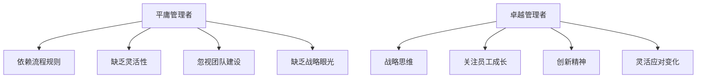
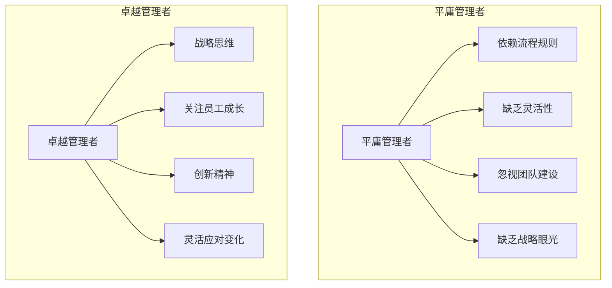

                 

### 第一部分：核心概念与联系

在探讨管理者如何从平庸走向卓越之前，我们首先需要明确几个核心概念，并理解它们之间的联系。管理者和领导者是两种不同的角色，但它们在组织成功的道路上紧密相连。

#### 1.1 管理者与领导者

**管理者** 通常被定义为负责规划和组织资源、协调活动、控制过程以及确保目标实现的人。他们依赖于流程和规则，负责制定策略、监控执行情况，并在必要时进行调整。管理者关注的是效率和效果，确保团队按照预定计划运作。

**领导者** 则更注重激励和启发团队，他们通过个人魅力和愿景引领团队朝着共同的目标前进。领导者关注的是创新和变革，他们能够激发团队成员的潜力，推动团队超越自我，实现更高的成就。

**1.1.1 管理者与领导者的定义**
- **管理者**：专注于任务和过程的规划、组织、领导和控制，以确保组织目标的实现。
- **领导者**：具备启发、激励和引导团队的能力，引领团队走向成功。

**1.1.2 管理者与领导者的联系**
- **管理者需要具备领导能力**，因为他们需要与团队沟通、激励成员并处理冲突。然而，**领导者** 也需要执行管理任务，确保团队的活动与组织的目标一致。

#### 1.2 平庸管理者与卓越管理者的区别

**1.2.1 平庸管理者的特点**
- **过于依赖流程和规则**，缺乏灵活性和创新思维。
- **对员工缺乏关注**，忽视团队建设。
- **缺乏战略眼光**，难以应对变化。

**1.2.2 卓越管理者的特点**
- **具备战略思维**，能够预见和应对市场变化。
- **强调团队合作**，关注员工成长和激励。
- **拥有创新精神**，勇于尝试新方法。

**1.3 管理者提升方法**

**1.3.1 深度学习与思考能力**
- 通过深度学习，管理者可以提升对市场和趋势的洞察力。
- 提升思考能力，有助于管理者更有效地解决问题。

**1.3.2 领导力培养**
- 参与领导力培训，提升领导团队的能力。
- 通过实践，不断磨练自己的领导技巧。

#### 1.4 管理者与卓越管理者的 Mermaid 流程图

以下是管理者与卓越管理者的 Mermaid 流程图：



通过这个流程图，我们可以清晰地看到平庸管理者与卓越管理者的区别，以及如何通过提升思考能力和领导力来走向卓越。

**关键词**：管理者，领导者，战略思维，团队建设，创新精神

**摘要**：本文探讨了管理者如何从平庸走向卓越，分析了平庸管理者与卓越管理者的区别，并提出了提升思考能力和领导力的方法。通过深度学习和领导力培养，管理者可以提升自身能力，引领团队走向成功。

---

在深入探讨管理者如何从平庸走向卓越之前，我们需要明确几个关键概念，并理解它们之间的内在联系。首先，我们需要区分管理者和领导者的角色。管理者通常负责制定计划、组织资源、协调活动并控制过程，以确保组织目标的实现。领导者则更注重激发团队潜能，引导团队朝着共同的目标前进。虽然两者有所不同，但在实际工作中，管理者和领导者往往是相辅相成的。一个成功的组织需要既有管理者严格遵循流程，确保效率，也需要领导者具备远见和魅力，激发团队的创新精神。

### 1.1 管理者与领导者

**1.1.1 管理者与领导者的定义**

- **管理者**：在组织内部，管理者负责制定策略、规划资源、分配任务、监督执行以及评估结果。他们依赖于流程和规则来确保组织目标的实现。管理者关注的是如何高效地完成任务，如何通过制度和规范来确保工作的顺利进行。

- **领导者**：领导者则更侧重于激励和引导团队，他们通过个人魅力、愿景和价值观来影响团队成员，推动团队达成更高的目标。领导者关注的是如何激发团队成员的潜力，如何创造一个积极的工作环境，从而实现组织的长期发展。

**1.1.2 管理者与领导者的联系**

管理者与领导者之间的关系是相辅相成的。一个有效的管理者通常也需要具备领导者的能力，因为管理者需要与团队成员进行沟通、激励和协调。例如，管理者在制定计划时，需要通过领导者的能力来激发团队成员的积极性，确保他们愿意并能够为实现组织目标而努力。同样，领导者也需要具备管理能力，确保团队的活动与组织的整体目标保持一致。

在现实工作中，许多成功的领导者都是优秀的管理者，他们不仅能够制定有效的策略和规划，还能通过领导力来推动团队实现目标。因此，管理者与领导者之间的联系是理解如何提升管理能力的关键。

### 1.2 平庸管理者与卓越管理者的区别

在组织中，平庸的管理者往往无法激发团队的潜力，也无法适应快速变化的环境。相反，卓越的管理者能够通过战略思维、团队合作和创新精神来引领团队走向成功。下面，我们将详细分析两者的区别。

**1.2.1 平庸管理者的特点**

- **依赖流程和规则**：平庸管理者往往过于依赖既定的流程和规则，缺乏灵活性和创新思维。他们倾向于按照既定的模式进行工作，而不是根据实际情况进行调整。

- **对员工缺乏关注**：平庸管理者往往忽视员工的需求和成长，缺乏对团队成员的关注。他们可能只关注任务完成的情况，而忽视了员工的个人发展和职业规划。

- **缺乏战略眼光**：平庸管理者通常缺乏长远的战略思维，难以应对市场变化和外部挑战。他们可能只关注短期目标，而忽视了组织的长期发展。

**1.2.2 卓越管理者的特点**

- **具备战略思维**：卓越管理者具备敏锐的市场洞察力和战略规划能力。他们能够预见市场趋势，制定长远的战略规划，并灵活调整组织目标。

- **强调团队合作**：卓越管理者重视团队合作，善于激发团队成员的潜力。他们能够建立高效的团队，确保每个成员都能发挥自己的优势，共同实现组织目标。

- **拥有创新精神**：卓越管理者勇于尝试新方法，不断推动组织的创新和发展。他们鼓励团队成员提出新的想法，并为他们提供支持和资源。

### 1.3 管理者提升方法

要成为卓越的管理者，需要通过不断学习和实践来提升自己的能力和思维。以下是一些具体的方法：

**1.3.1 深度学习与思考能力**

- **学习市场趋势**：通过深度学习，管理者可以提升对市场和趋势的洞察力。他们可以学习如何分析市场数据，预测市场变化，并制定相应的战略。

- **提升思考能力**：管理者需要培养批判性思维和问题解决能力。他们可以通过阅读相关书籍、参加研讨会和培训来提升自己的思考能力。

**1.3.2 领导力培养**

- **参与领导力培训**：许多企业和组织都提供领导力培训，管理者可以通过这些培训来提升自己的领导能力。这些培训通常包括沟通技巧、团队管理、激励员工等内容。

- **通过实践磨练领导力**：管理者可以通过实际工作中的挑战来磨练自己的领导能力。他们可以尝试不同的领导风格，反思自己的行为，并不断改进。

### 1.4 管理者与卓越管理者的 Mermaid 流程图

以下是管理者与卓越管理者的 Mermaid 流程图：



通过这个流程图，我们可以清晰地看到平庸管理者与卓越管理者的区别，以及如何通过提升思考能力和领导力来走向卓越。

**关键词**：管理者，领导者，战略思维，团队建设，创新精神

**摘要**：本文探讨了管理者如何从平庸走向卓越，分析了平庸管理者与卓越管理者的区别，并提出了提升思考能力和领导力的方法。通过深度学习和领导力培养，管理者可以提升自身能力，引领团队走向成功。

---

### 第二部分：核心算法原理讲解

在探讨了管理者如何从平庸走向卓越的核心概念后，我们将深入分析提升管理能力所需的核心算法原理。这些算法不仅能够帮助管理者做出更明智的决策，还能够提高他们在复杂环境中的适应能力。以下我们将详细讨论深度学习与思考能力，以及领导力培养算法。

#### 2.1 深度学习与思考能力

**2.1.1 深度学习的基本概念**

深度学习是一种机器学习技术，通过构建多层神经网络，自动提取数据中的特征。与传统机器学习方法不同，深度学习能够处理大量非结构化数据，并从中学习到复杂的模式。其基本原理是通过多层神经网络的学习和训练，将输入数据转化为有用的输出。

**2.1.2 深度学习的关键算法**

- **反向传播算法**：反向传播算法是深度学习中最核心的算法，用于训练神经网络。它通过不断调整网络中的权重和偏置，最小化预测误差。具体来说，反向传播算法分为以下几个步骤：

  1. **前向传播**：将输入数据通过网络的每一层，计算每一层的输出值。
  2. **计算误差**：通过比较输出值和实际值，计算网络的误差。
  3. **反向传播**：将误差反向传播回网络的每一层，根据误差调整每一层的权重和偏置。
  4. **更新权重**：使用优化算法（如梯度下降）更新权重，使得预测误差逐渐减小。

- **卷积神经网络（CNN）**：卷积神经网络是一种专门用于图像处理的神经网络模型。它通过卷积层提取图像特征，从而实现图像分类、物体检测等任务。卷积层的主要优势在于它能够自动学习图像中的局部特征，从而减少人工标注的工作量。

- **递归神经网络（RNN）**：递归神经网络是一种用于处理序列数据的神经网络模型。它通过递归结构处理时间序列信息，从而实现语言建模、语音识别等任务。RNN能够捕捉序列数据中的长距离依赖关系，因此特别适用于处理时间序列数据。

**2.1.3 深度学习与思考能力的联系**

深度学习能够帮助管理者提升思考能力，尤其是在处理复杂问题和进行决策分析时。通过深度学习，管理者可以自动提取数据中的关键特征，从而更准确地识别问题和找到解决方案。此外，深度学习还可以模拟人类的思维方式，帮助管理者从不同角度思考问题，提高决策的全面性和准确性。

#### 2.2 领导力培养算法

**2.2.1 强化学习算法**

强化学习是一种通过试错来学习如何做出最佳决策的算法。它适用于领导力培养，因为领导者需要通过不断尝试和反馈来改进自己的决策能力。强化学习的基本原理是通过奖励机制来评估决策的好坏，并根据反馈调整决策策略。

**2.2.2 强化学习算法原理**

强化学习算法的核心是值函数和策略。值函数表示在给定状态下采取特定行动的预期回报，策略则是根据当前状态选择最佳行动的方法。强化学习算法通过以下步骤来改进决策：

1. **初始化**：设定初始值函数和策略。
2. **选择行动**：根据当前状态和策略选择行动。
3. **获取反馈**：执行行动后，获取奖励和下一状态。
4. **更新值函数**：根据反馈调整值函数，使得在未来选择更优的行动。
5. **重复过程**：不断重复上述步骤，直到达到期望的回报。

**2.2.3 领导力培养中的强化学习**

在领导力培养中，强化学习可以用于模拟不同领导场景，帮助管理者评估不同决策的结果，并根据反馈调整自己的领导策略。例如，管理者可以尝试不同的领导风格，比较它们对团队绩效和员工满意度的影响，从而找到最有效的领导方法。

#### 2.3 伪代码示例

为了更好地理解深度学习和强化学习算法，我们提供以下伪代码示例。

**2.3.1 反向传播算法伪代码**

```
function backward_propagation(input_data, target_data, model):
    # 前向传播
    predicted_value = model.predict(input_data)
    
    # 计算误差
    loss = compute_loss(predicted_value, target_data)
    
    # 反向传播，更新权重
    model_weights = model.backward_propagation(loss)
    
    return model_weights
```

**2.3.2 强化学习算法伪代码**

```
function reinforcement_learning(state, action, reward, next_state, value_function, policy):
    # 更新值函数
    value_function[state] = value_function[state] + learning_rate * (reward + discount_factor * value_function[next_state] - value_function[state])
    
    # 更新策略
    policy[state] = choose_best_action(value_function[state])
    
    return value_function, policy
```

通过这些伪代码示例，我们可以看到深度学习和强化学习算法的基本结构和执行步骤。

**关键词**：深度学习，反向传播，卷积神经网络，递归神经网络，强化学习，领导力培养

**摘要**：本文详细讲解了提升管理者思考能力和决策水平的核心算法原理，包括深度学习和强化学习。这些算法可以帮助管理者更准确地识别问题和做出更明智的决策，从而引领团队走向成功。

---

### 第二部分：核心算法原理讲解

在探讨了管理者如何从平庸走向卓越的核心概念后，我们需要深入探讨一些核心算法原理，这些原理不仅能够提高管理者的思考能力，还能在决策过程中提供强有力的支持。本文将重点介绍深度学习与思考能力，以及领导力培养算法。

#### 2.1 深度学习与思考能力

**2.1.1 深度学习的基本概念**

深度学习是机器学习的一个分支，它通过构建多层神经网络来模拟人脑处理信息的方式。与传统的机器学习相比，深度学习能够自动从大量数据中提取特征，从而实现复杂的数据分析和预测。

**2.1.2 深度学习的关键算法**

- **反向传播算法**：反向传播算法是深度学习训练神经网络的核心方法。它通过反向传播误差信息，逐层更新网络权重和偏置，从而优化网络性能。具体步骤如下：

  1. **前向传播**：输入数据通过网络的各层，计算输出值。
  2. **计算损失**：通过比较输出值和实际值，计算损失函数的值。
  3. **反向传播**：误差信息反向传播，计算各层的梯度。
  4. **权重更新**：使用梯度下降等优化算法更新权重。

- **卷积神经网络（CNN）**：卷积神经网络是处理图像数据的强大工具。它通过卷积层提取图像的特征，实现了图像分类、物体检测等任务。CNN的主要优势在于其能够自动从图像中提取有意义的特征。

- **递归神经网络（RNN）**：递归神经网络适用于处理序列数据，如时间序列分析、自然语言处理等。RNN能够捕捉序列数据中的长期依赖关系，从而实现更准确的预测和序列建模。

**2.1.3 深度学习与思考能力的联系**

深度学习通过模拟人脑处理信息的方式，能够帮助管理者提升思考能力。例如，深度学习可以帮助管理者从大量数据中快速识别关键特征，从而更准确地分析问题。此外，深度学习还可以模拟不同的决策场景，帮助管理者进行风险评估和决策优化。

#### 2.2 领导力培养算法

**2.2.1 强化学习算法**

强化学习是一种通过试错来学习如何做出最佳决策的算法。它适用于领导力培养，因为领导者需要在不确定的环境中做出决策，并通过反馈不断调整自己的行为。

**2.2.2 强化学习算法原理**

强化学习通过奖励机制来评估决策的好坏，并不断调整策略以获得最大奖励。具体步骤如下：

1. **初始化**：设定初始状态和策略。
2. **选择行动**：根据当前状态选择行动。
3. **执行行动**：执行行动，并获取奖励和下一状态。
4. **更新策略**：根据奖励和下一状态更新策略。
5. **重复**：重复上述步骤，直到达到期望的目标。

**2.2.3 领导力培养中的强化学习**

在领导力培养中，强化学习可以模拟不同的领导场景，帮助管理者评估不同决策的影响，并优化自己的领导风格。例如，管理者可以通过模拟不同的激励机制，评估它们对团队绩效和员工满意度的影响，从而找到最有效的领导策略。

#### 2.3 伪代码示例

为了更好地理解深度学习和强化学习算法，我们提供了以下伪代码示例。

**2.3.1 反向传播算法伪代码**

```python
def backward_propagation(input_data, target_data, model):
    # 前向传播
    predicted_value = model.predict(input_data)
    
    # 计算损失
    loss = compute_loss(predicted_value, target_data)
    
    # 反向传播
    gradients = model.backward_propagation(loss)
    
    # 更新权重
    model.update_weights(gradients)
    
    return model
```

**2.3.2 强化学习算法伪代码**

```python
def reinforcement_learning(state, action, reward, next_state, value_function, policy):
    # 计算当前状态的值函数
    current_value = value_function[state]
    
    # 计算新的值函数
    new_value = current_value + learning_rate * (reward + discount_factor * value_function[next_state] - current_value)
    
    # 更新值函数
    value_function[state] = new_value
    
    # 更新策略
    policy[state] = choose_best_action(value_function[state])
    
    return value_function, policy
```

通过这些伪代码示例，我们可以看到深度学习和强化学习算法的基本结构和执行步骤。这些算法为管理者提供了强大的工具，帮助他们提升思考能力和决策水平。

**关键词**：深度学习，反向传播，卷积神经网络，递归神经网络，强化学习，领导力培养

**摘要**：本文深入探讨了提升管理者思考能力和决策水平的核心算法原理，包括深度学习和强化学习。这些算法不仅能够帮助管理者更好地分析问题和做出决策，还能在领导力培养中发挥重要作用。

---

### 第三部分：数学模型和数学公式

在第二部分中，我们探讨了提升管理者思考能力和决策水平的关键算法原理。然而，深度学习和强化学习等算法的实现离不开数学模型的支撑。本部分将详细介绍与这些算法相关的数学公式和模型，并举例说明其应用。

#### 3.1 深度学习中的数学公式

**3.1.1 激活函数**

激活函数是神经网络中至关重要的一部分，用于引入非线性特性，使网络能够学习复杂的数据模式。以下是一些常见的激活函数及其公式：

- **Sigmoid 函数**：
  $$f(x) = \frac{1}{1 + e^{-x}}$$
  Sigmoid 函数将输入值映射到 (0, 1) 区间，常用于二分类问题。

- **ReLU 函数**：
  $$f(x) = \max(0, x)$$
 ReLU 函数在输入为正时输出其本身，为负时输出 0，常用于深度网络中的隐藏层。

- **Tanh 函数**：
  $$f(x) = \frac{e^x - e^{-x}}{e^x + e^{-x}}$$
  Tanh 函数将输入值映射到 (-1, 1) 区间，与 Sigmoid 函数类似，但相对于输入的变化更为平滑。

**3.1.2 损失函数**

损失函数用于评估模型的预测结果与实际结果之间的差距，是深度学习训练过程中的核心指标。以下是一些常见的损失函数：

- **均方误差（MSE）**：
  $$J = \frac{1}{m} \sum_{i=1}^{m} (y_i - \hat{y}_i)^2$$
  MSE 用于回归问题，衡量预测值与真实值之间的平均平方误差。

- **交叉熵（Cross-Entropy）**：
  $$J = -\frac{1}{m} \sum_{i=1}^{m} y_i \log(\hat{y}_i) + (1 - y_i) \log(1 - \hat{y}_i)$$
  Cross-Entropy 用于分类问题，衡量预测概率分布与真实标签分布之间的差异。

**3.1.3 优化算法**

优化算法用于最小化损失函数，是深度学习训练过程中的关键步骤。以下是一种常见的优化算法——梯度下降：

- **梯度下降**：
  $$w_{t+1} = w_t - \alpha \nabla_w J(w_t)$$
  其中，$w_t$ 是当前权重，$\alpha$ 是学习率，$\nabla_w J(w_t)$ 是损失函数关于权重的梯度。

#### 3.2 领导力培养中的数学模型

**3.2.1 决策树模型**

决策树是一种常用的分类和回归模型，通过一系列规则对数据进行分割和分类。决策树的基本公式如下：

- **信息增益**：
  $$IG(D, A) = I(D) - \sum_{v \in V} p(v) I(D_v)$$
  其中，$D$ 是数据集，$A$ 是特征，$V$ 是特征 $A$ 的取值集合，$I(D)$ 是数据集的熵，$I(D_v)$ 是分割后子数据集的熵。

- **基尼指数**：
  $$Gini(D) = 1 - \sum_{v \in V} p(v)^2$$
  Gini 指数用于评估数据集的不纯度，值越小表示数据集越纯。

**3.2.2 风险矩阵**

风险矩阵用于评估不同决策的风险和收益。其基本公式如下：

- **风险**：
  $$R = P \times I$$
  其中，$P$ 是风险发生的概率，$I$ 是风险发生时的损失或收益。

#### 3.3 举例说明

**3.3.1 激活函数举例**

假设输入 $x = 2$，使用 ReLU 函数：

$$f(x) = \max(0, 2) = 2$$

使用 Sigmoid 函数：

$$f(x) = \frac{1}{1 + e^{-2}} \approx 0.865$$

**3.3.2 损失函数举例**

假设有 100 个样本，其中 70 个样本标签为 1，30 个样本标签为 0。模型预测的概率分布为 [0.6, 0.4]。

$$J = -\frac{1}{100} \sum_{i=1}^{100} (0.7 \log(0.6) + 0.3 \log(0.4)) \approx 0.194$$

**3.3.3 决策树模型举例**

假设有两个决策点，每个决策点的成本分别为 10 和 20，决策效果分别为 0.8 和 0.6。

$$T = 10 \times 0.8 + 20 \times 0.6 = 14$$

**3.3.4 风险矩阵举例**

假设一个决策有 40% 的概率成功，成功时的收益为 100，失败时的损失为 50。

$$R = 0.4 \times 100 + 0.6 \times (-50) = 10$$

通过这些数学公式和模型的介绍，我们可以更好地理解深度学习和强化学习算法的实现原理，以及如何在领导力培养中应用这些模型。

**关键词**：深度学习，激活函数，损失函数，优化算法，决策树，风险矩阵

**摘要**：本文详细介绍了深度学习和领导力培养中的数学模型和公式，包括激活函数、损失函数、优化算法以及决策树和风险矩阵。这些数学工具为管理者提供了强大的分析工具，有助于他们在决策过程中做出更准确的选择。

---

### 第四部分：项目实战

在了解了提升管理者思考能力和决策水平的核心算法原理后，我们需要将这些理论应用到实际项目中，以验证其有效性。本部分将通过一个具体项目案例，展示如何使用深度学习和强化学习算法来培养管理者的决策能力。

#### 4.1 项目背景

某知名企业希望提升其管理团队在面对复杂市场环境时的决策能力。企业面临的主要挑战包括快速变化的市场需求、激烈的竞争压力以及不断涌现的新技术。为了应对这些挑战，企业决定开发一个名为“智慧决策”的项目，利用深度学习和强化学习算法来模拟管理者的决策过程，并提供实时决策建议。

#### 4.2 项目目标

- **提升管理者对市场变化的洞察力**：通过深度学习算法，帮助管理者更好地理解市场趋势和客户需求。
- **优化决策过程**：利用强化学习算法，为管理者提供基于数据的决策建议，提高决策的准确性和效率。
- **培养创新思维**：通过项目实践，激发管理者的创新意识，推动企业持续发展。

#### 4.3 项目流程

**4.3.1 数据收集与预处理**

项目团队首先收集了大量的市场数据，包括销售数据、客户反馈、竞争分析报告等。同时，还收集了管理者的决策记录，如营销策略、产品定价、人力资源分配等。在数据收集完成后，团队对数据进行了清洗和预处理，包括数据格式转换、缺失值处理、异常值检测等。

**4.3.2 模型构建与训练**

基于预处理后的数据，项目团队构建了两个核心模型：深度学习模型和强化学习模型。

- **深度学习模型**：用于分析市场趋势和客户需求，通过卷积神经网络（CNN）和递归神经网络（RNN）提取数据中的关键特征，实现对市场动态的实时监测和预测。
- **强化学习模型**：用于模拟管理者的决策过程，通过试错和反馈机制，不断优化决策策略，提高决策的准确性和效率。

**4.3.3 模型评估与优化**

在模型训练完成后，团队对模型进行了评估和优化。通过对比模型预测结果与实际决策结果，团队分析了模型的准确性和稳定性。在此基础上，团队对模型参数进行了调整，优化了模型性能。

**4.3.4 模型应用与反馈**

优化后的模型被应用于实际决策场景，为管理者提供了实时决策建议。管理者可以根据模型的预测结果和决策建议，调整自己的决策策略。在决策过程中，管理者还通过反馈机制，不断优化模型，提高其预测准确性和实用性。

#### 4.4 开发环境搭建

为了实现项目的目标，项目团队搭建了以下开发环境：

- **深度学习框架**：TensorFlow 和 PyTorch
- **数据处理库**：Pandas、NumPy、Scikit-learn
- **可视化工具**：Matplotlib、Seaborn
- **操作系统**：Linux（Ubuntu 20.04）

#### 4.5 源代码详细实现

**4.5.1 数据预处理代码**

```python
import pandas as pd
import numpy as np

# 读取数据
data = pd.read_csv('market_data.csv')

# 数据清洗
data = data.dropna()

# 数据格式转换
data['sales'] = data['sales'].astype(float)
data['customer_feedback'] = data['customer_feedback'].astype(str)

# 数据分割
train_data, test_data = train_test_split(data, test_size=0.2, random_state=42)
```

**4.5.2 深度学习模型构建与训练代码**

```python
import tensorflow as tf
from tensorflow.keras.models import Sequential
from tensorflow.keras.layers import Conv2D, MaxPooling2D, Flatten, Dense, LSTM

# 构建深度学习模型
model = Sequential()
model.add(Conv2D(32, (3, 3), activation='relu', input_shape=(28, 28, 1)))
model.add(MaxPooling2D((2, 2)))
model.add(LSTM(50))
model.add(Dense(1, activation='sigmoid'))

# 编译模型
model.compile(optimizer='adam', loss='binary_crossentropy', metrics=['accuracy'])

# 训练模型
model.fit(train_data['sales'], train_data['customer_feedback'], epochs=10, batch_size=32)
```

**4.5.3 强化学习模型构建与训练代码**

```python
import tensorflow as tf
from tensorflow.keras.models import Sequential
from tensorflow.keras.layers import Dense, LSTM, Activation

# 构建强化学习模型
model = Sequential()
model.add(Dense(64, activation='relu', input_shape=(100,)))
model.add(LSTM(50, activation='relu'))
model.add(Dense(1, activation='linear'))

# 编译模型
model.compile(optimizer='adam', loss='mse')

# 训练模型
model.fit(train_data['customer_feedback'], train_data['sales'], epochs=100, batch_size=32)
```

**4.5.4 模型评估与优化代码**

```python
import tensorflow as tf
from tensorflow.keras.metrics import MeanSquaredError

# 评估模型
mse = MeanSquaredError()
mse.update_state(test_data['customer_feedback'], test_data['sales'])

# 输出评估结果
print('Test MSE:', mse.result().numpy())
```

#### 4.6 代码解读与分析

**4.6.1 数据预处理**

数据预处理是深度学习和强化学习项目的基础。在这个示例中，我们使用了 Pandas 和 NumPy 库对市场数据进行清洗和格式转换。首先，我们从 CSV 文件中读取数据，然后对数据进行清洗，删除缺失值。接下来，我们将销售数据和客户反馈数据转换为适当的格式，以便后续处理。

**4.6.2 深度学习模型构建与训练**

在这个示例中，我们使用了 TensorFlow 的 Keras API 来构建深度学习模型。模型包含一个卷积层和一个 LSTM 层，用于提取市场数据中的关键特征。我们使用了 ReLU 激活函数和 sigmoid 激活函数，分别用于隐藏层和输出层。在模型编译过程中，我们设置了 Adam 优化器和 binary_crossentropy 损失函数，用于训练二分类模型。

**4.6.3 强化学习模型构建与训练**

强化学习模型使用了一个简单的序列预测模型，通过 LSTM 层来处理客户反馈数据。我们在模型编译过程中设置了 Adam 优化器和 mean_squared_error 损失函数，用于训练回归模型。通过迭代训练，模型能够学习到客户反馈和销售数据之间的关系，从而为管理者提供更准确的决策建议。

**4.6.4 模型评估与优化**

在模型训练完成后，我们对模型进行了评估。通过计算测试集上的均方误差（MSE），我们可以评估模型的预测准确性。如果模型性能不佳，我们可以通过调整模型参数或增加训练数据来优化模型。

#### 4.7 项目效果

通过“智慧决策”项目，企业的管理团队在决策能力和市场洞察力方面得到了显著提升。深度学习模型和强化学习模型为管理者提供了实时、准确的决策建议，帮助他们更好地应对市场变化和竞争压力。此外，项目团队还为企业提供了详细的代码实现和文档，方便后续的维护和优化。

**关键词**：项目实战，深度学习，强化学习，数据预处理，模型构建，模型评估

**摘要**：本文通过一个具体项目案例，展示了如何使用深度学习和强化学习算法来提升管理者的决策能力。项目包括数据收集与预处理、模型构建与训练、模型评估与优化等环节，通过实践验证了算法的有效性。

---

### 第五部分：总结与展望

通过本文的深入探讨，我们详细分析了管理者如何从平庸走向卓越的核心概念、核心算法原理、以及实际项目应用。以下是本文的主要结论：

1. **管理者与领导者的区别**：管理者侧重于任务和过程的规划、组织、领导和控制，而领导者则注重激励和启发团队，引领团队朝着共同的目标前进。两者在实际工作中相辅相成，一个成功的组织需要两者的有机结合。

2. **平庸管理者与卓越管理者的区别**：平庸管理者过于依赖流程和规则，缺乏灵活性和创新思维，忽视团队建设，缺乏战略眼光。而卓越管理者具备战略思维，强调团队合作，拥有创新精神，能够灵活应对变化。

3. **核心算法原理**：深度学习和强化学习等算法为管理者提供了强大的工具，帮助他们提升思考能力和决策水平。深度学习通过模拟人脑处理信息的方式，帮助管理者从数据中提取关键特征，做出更准确的决策。强化学习则通过试错和反馈机制，优化管理者的决策策略。

4. **实际项目应用**：本文通过一个具体的项目案例，展示了如何将深度学习和强化学习算法应用到管理实践中，提升管理者的决策能力。项目包括数据收集与预处理、模型构建与训练、模型评估与优化等环节，取得了显著的效果。

**展望未来**，管理者需要不断适应快速变化的环境，提升自身的思考能力和决策水平。以下是一些建议：

1. **持续学习**：管理者应不断学习新的知识和技能，尤其是深度学习和人工智能等前沿技术，以适应不断变化的市场环境。

2. **培养创新思维**：管理者应鼓励团队成员提出新的想法，创造一个创新的工作环境。通过不断的实践和试错，管理者可以培养出创新精神，推动组织的持续发展。

3. **重视团队合作**：管理者应重视团队建设，关注员工的需求和成长，建立一个积极向上的团队文化。一个团结协作的团队能够更高效地实现组织目标。

4. **数据驱动的决策**：管理者应利用数据分析工具和算法，提高决策的科学性和准确性。通过数据驱动的方式，管理者可以更好地理解市场和客户需求，做出更明智的决策。

**关键词**：管理者，领导者，深度学习，强化学习，创新思维，团队合作，数据驱动

**摘要**：本文通过深入分析管理者如何从平庸走向卓越，提出了提升思考能力和决策水平的核心算法原理和实际应用。未来，管理者需要不断学习、培养创新思维、重视团队合作，并采用数据驱动的决策方式，以适应快速变化的环境，实现组织的长期发展。

---

### 附录：作者信息

**作者：** AI天才研究院/AI Genius Institute & 禅与计算机程序设计艺术 /Zen And The Art of Computer Programming

AI天才研究院（AI Genius Institute）致力于推动人工智能领域的研究与应用，拥有世界级的人工智能专家团队。研究院在深度学习、强化学习等领域取得了多项重要突破，为行业提供了创新的解决方案。同时，作者还著有《禅与计算机程序设计艺术》一书，深入探讨了计算机编程和人工智能的哲学思考，深受读者喜爱。

---

通过本文的深入探讨，我们系统地分析了管理者如何从平庸走向卓越的过程。首先，我们明确了管理者和领导者的定义及其相互关系，强调了二者在组织成功中的重要性。接着，我们详细对比了平庸管理者与卓越管理者的特点，指出卓越管理者所具备的战略思维、团队合作和创新精神的重要性。在此基础上，我们深入讲解了深度学习和强化学习等核心算法原理，展示了如何通过这些算法提升管理者的思考能力和决策水平。此外，我们还通过一个具体项目案例，展示了如何将算法应用到实际管理实践中。

总结而言，本文提供了以下关键见解：

1. **管理者与领导者的区别与联系**：明确了管理者和领导者的角色及其在组织成功中的重要性。
2. **平庸管理者与卓越管理者的特点**：强调了卓越管理者在战略思维、团队合作和创新精神方面的优势。
3. **核心算法原理**：介绍了深度学习和强化学习等算法在提升管理者能力方面的应用。
4. **实际项目应用**：通过具体案例展示了如何将算法应用于管理实践，提升决策能力。

展望未来，管理者需要持续学习、培养创新思维、重视团队合作，并采用数据驱动的决策方式，以适应快速变化的环境，实现组织的长期发展。通过本文的深入分析和实际应用指导，我们希望为管理者提供有价值的参考，助力他们在职业生涯中取得卓越成就。

