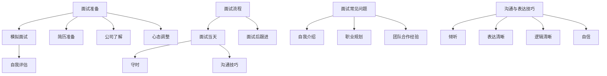

                 

### 文章标题

《滴滴橙心优选2025社召社区团购算法面试题集》

> **关键词**：社区团购、算法面试、排序算法、搜索算法、动态规划、图算法、机器学习、数据分析

> **摘要**：本文旨在为广大希望进入社区团购行业或正在准备社区团购算法面试的读者提供一份详尽的面试题集。通过梳理和解析社区团购领域的核心算法和面试题，本文将帮助读者深入理解相关算法原理和应用，提高面试竞争力。

### 目录大纲

- **第一部分：社区团购与算法基础**
  - **第1章：社区团购行业概述**
    - **1.1.1 社区团购的定义与发展历程**
    - **1.1.2 社区团购的核心模式与特点**
    - **1.1.3 社区团购的市场前景与挑战**
  - **第2章：算法基础**
    - **2.1.1 算法概述与分类**
    - **2.1.2 数据结构与算法分析**
    - **2.1.3 算法设计原则与优化方法**
  - **第3章：算法应用案例解析**
    - **3.1.1 社区团购用户行为分析**
    - **3.1.2 社区团购商品推荐系统**
    - **3.1.3 社区团购订单优化与配送路径规划**

- **第二部分：算法面试题解析**
  - **第4章：排序算法面试题**
    - **4.1.1 快速排序与归并排序**
    - **4.1.2 插入排序与选择排序**
    - **4.1.3 堆排序与计数排序**
  - **第5章：搜索算法面试题**
    - **5.1.1 二分搜索与插值搜索**
    - **5.1.2 暴力搜索与回溯搜索**
    - **5.1.3 A*搜索算法与Dijkstra算法**
  - **第6章：动态规划面试题**
    - **6.1.1 斐波那契数列与最长递增子序列**
    - **6.1.2 最小路径覆盖与最长公共子序列**
    - **6.1.3 最小生成树与最长公共子串**
  - **第7章：图算法面试题**
    - **7.1.1 深度优先搜索与广度优先搜索**
    - **7.1.2 最短路径算法与单源最短路径算法**
    - **7.1.3 最小生成树与网络流算法**
  - **第8章：机器学习面试题**
    - **8.1.1 监督学习与无监督学习**
    - **8.1.2 线性回归与逻辑回归**
    - **8.1.3 决策树与随机森林**
  - **第9章：数据分析与优化面试题**
    - **9.1.1 数据清洗与预处理**
    - **9.1.2 数据可视化与统计分析**
    - **9.1.3 优化策略与性能评估**

- **第三部分：面试技巧与策略**
  - **第10章：面试准备与心态调整**
    - **10.1.1 面试流程与注意事项**
    - **10.1.2 面试常见问题与应对策略**
    - **10.1.3 面试中的沟通与表达技巧**
  - **第11章：实战演练与案例分析**
    - **11.1.1 模拟面试与自我评估**
    - **11.1.2 面试题库与解析**
    - **11.1.3 面试实战案例与经验分享**

- **附录**
  - **附录A：常用算法与数据结构**
    - **A.1 算法复杂度分析**
    - **A.2 数据结构基础**
    - **A.3 算法应用示例**
  - **附录B：面试资源推荐**
    - **B.1 面试书籍推荐**
    - **B.2 在线课程推荐**
    - **B.3 面试题库推荐**

### 第一部分：社区团购与算法基础

#### 第1章：社区团购行业概述

##### 1.1.1 社区团购的定义与发展历程

社区团购，作为一种新兴的电子商务模式，其核心在于通过社交网络和社区平台，将居民们聚集在一起，以团购的形式购买商品。这一模式的出现，不仅满足了消费者对价格敏感的需求，也大大提升了商家的销售效率和利润率。

**定义**：社区团购是指通过社交网络或社区平台，将消费者以团购的形式组织起来，以更低的价格购买同一商品。它通常包括以下特点：

1. **团购组织**：消费者通过微信群、QQ群等社交平台加入团购活动。
2. **价格优势**：团购能够通过大量集中采购，获得更优惠的价格。
3. **社区互动**：消费者可以在团购过程中与其他成员互动，形成一定的社区氛围。

**发展历程**：

- **初期**：社区团购最早起源于20世纪90年代的“团购网”，以互联网为媒介，通过线上组织线下团购。
- **快速发展**：随着移动互联网的普及，2014年后，社区团购模式得到快速推广，涌现出诸如“拼多多”、“京东到家”等知名平台。
- **市场成熟**：近年来，社区团购市场逐渐走向成熟，不仅包括生鲜食品，还扩展到日用品、家居用品等多个品类。

##### 1.1.2 社区团购的核心模式与特点

社区团购的核心模式主要包括以下几个方面：

1. **团购组织**：平台通过社交媒体或社区组织，引导消费者参与团购活动。
2. **预售模式**：消费者在团购活动开始前支付部分或全部货款，平台根据预售情况向商家下单。
3. **批量采购**：平台通过大规模采购，降低商品成本，从而提供更具竞争力的价格。

社区团购的特点如下：

1. **低成本**：通过社交网络和社区平台，减少了广告和市场推广成本。
2. **高效率**：预售模式使得商家可以提前了解需求，减少库存压力，提高运营效率。
3. **社区互动**：消费者在团购过程中形成社区，增加了用户粘性。

##### 1.1.3 社区团购的市场前景与挑战

**市场前景**：

- **用户需求**：随着居民生活水平的提高，对品质和价格的双重需求日益增长，社区团购正好满足了这一需求。
- **竞争格局**：虽然市场已经出现众多玩家，但市场集中度仍然较低，尚未形成绝对的市场领导者。
- **政策支持**：政府对电子商务和社区团购的发展持支持态度，出台了一系列优惠政策。

**挑战**：

- **供应链管理**：社区团购的快速发展对供应链管理提出了更高要求，包括库存管理、物流配送等。
- **服务质量**：社区团购需要提供优质的客户服务，包括售后服务、问题处理等。
- **竞争激烈**：社区团购市场存在激烈的市场竞争，如何获取用户、提高用户满意度成为关键。

#### 第2章：算法基础

##### 2.1.1 算法概述与分类

算法是解决问题的一系列明确指令。在计算机科学中，算法不仅用于解决问题，还用于数据分析和优化。

**算法概述**：

- **定义**：算法是解决问题的步骤集合，具有一定的确定性、有限性和可行性。
- **目的**：通过高效地处理数据和问题，提高计算效率和准确性。

**算法分类**：

1. **按处理问题的方式分类**：
   - **确定性算法**：每一步都是确定的，没有不确定性。
   - **随机算法**：包含随机元素，解决某些问题时更有效。

2. **按数据结构分类**：
   - **排序算法**：对数据进行排序，如快速排序、归并排序等。
   - **搜索算法**：在数据结构中查找特定元素，如二分搜索、深度优先搜索等。

3. **按应用领域分类**：
   - **基础算法**：如动态规划、贪心算法等，广泛应用于各个领域。
   - **领域特定算法**：针对特定领域的问题设计，如机器学习算法、优化算法等。

##### 2.1.2 数据结构与算法分析

数据结构是算法的基础，决定了算法的性能和效率。

**数据结构**：

- **线性结构**：如数组、链表、栈、队列。
- **树形结构**：如二叉树、红黑树、B树。
- **图形结构**：如图、有向图。

**算法分析**：

- **时间复杂度**：衡量算法执行时间与数据规模的关系，常用大O表示法。
- **空间复杂度**：衡量算法占用内存与数据规模的关系。

**常见算法分析**：

1. **排序算法**：分析其平均时间复杂度和最坏情况下的性能。
2. **搜索算法**：分析其在不同数据结构上的性能。

##### 2.1.3 算法设计原则与优化方法

算法设计应遵循以下原则：

- **正确性**：算法能够正确解决给定问题。
- **健壮性**：算法能够处理各种异常情况和边界条件。
- **可读性**：代码结构清晰，易于理解和维护。

**优化方法**：

1. **时间优化**：通过减少循环次数、优化数据结构等方法提高算法效率。
2. **空间优化**：减少内存占用，提高算法的空间利用率。
3. **贪心算法**：在某些情况下，采用局部最优解来达到全局最优解。
4. **动态规划**：通过保存中间结果，避免重复计算。

#### 第3章：算法应用案例解析

##### 3.1.1 社区团购用户行为分析

社区团购的用户行为分析是优化团购活动、提高用户满意度的重要手段。

**用户行为分析**：

1. **用户画像**：通过用户数据，分析用户的基本信息、购买习惯等。
2. **行为轨迹**：记录用户在团购平台上的活动路径，分析其偏好和行为模式。
3. **互动分析**：分析用户在社交平台上的互动情况，如评论、分享等。

**应用场景**：

1. **个性化推荐**：根据用户画像和行为轨迹，为用户提供个性化推荐。
2. **营销策略**：根据用户行为数据，设计有针对性的营销活动。
3. **服务优化**：根据用户反馈和行为数据，优化用户服务和体验。

##### 3.1.2 社区团购商品推荐系统

商品推荐系统是提高用户粘性和转化率的重要手段。

**系统设计**：

1. **推荐算法**：采用协同过滤、基于内容的推荐等算法，为用户推荐商品。
2. **推荐策略**：根据用户行为数据、商品属性等，设计多种推荐策略。
3. **推荐结果**：将推荐结果以可视化方式展示给用户。

**应用场景**：

1. **首页推荐**：根据用户偏好和热门商品，为用户推荐首页内容。
2. **商品详情页推荐**：根据用户浏览和购买历史，为用户推荐相关商品。
3. **购物车推荐**：为用户推荐购物车中其他相关商品。

##### 3.1.3 社区团购订单优化与配送路径规划

订单优化与配送路径规划是提高运营效率和降低成本的重要环节。

**订单优化**：

1. **订单合并**：将多个小订单合并成一个大订单，减少配送次数。
2. **优先级排序**：根据订单的紧急程度、配送距离等因素，对订单进行优先级排序。
3. **库存管理**：根据订单情况，及时调整库存策略，确保商品供应。

**配送路径规划**：

1. **最短路径算法**：使用Dijkstra算法或A*搜索算法，计算最优配送路径。
2. **多目标优化**：考虑时间、成本、服务质量等多个目标，进行配送路径优化。
3. **实时调整**：根据实时交通情况、天气等因素，动态调整配送路径。

**应用场景**：

1. **高峰期配送**：在高峰期优化配送路线，提高配送效率。
2. **紧急订单处理**：对于紧急订单，采用快速配送策略，确保订单按时送达。
3. **跨区域配送**：对于跨区域的订单，优化配送路径，降低物流成本。

### 第二部分：算法面试题解析

#### 第4章：排序算法面试题

##### 4.1.1 快速排序与归并排序

快速排序和归并排序是两种常用的排序算法，各有优缺点。

**快速排序**：

1. **基本思想**：选取一个基准元素，将数组划分为两个子数组，一个包含小于基准的元素，另一个包含大于基准的元素，递归地对两个子数组进行快速排序。
2. **时间复杂度**：平均情况下的时间复杂度为\(O(n\log n)\)，最坏情况下的时间复杂度为\(O(n^2)\)。
3. **空间复杂度**：空间复杂度为\(O(\log n)\)。

**归并排序**：

1. **基本思想**：将数组分为若干个子数组，每个子数组包含一个或两个元素，然后将子数组两两合并，直到整个数组有序。
2. **时间复杂度**：时间复杂度为\(O(n\log n)\)，与数据规模无关。
3. **空间复杂度**：空间复杂度为\(O(n)\)。

**面试题示例**：

1. **实现快速排序算法**：编写一个快速排序算法的实现，并分析其时间复杂度和空间复杂度。
2. **比较快速排序和归并排序的优劣**：讨论快速排序和归并排序在各种情况下的性能表现。

##### 4.1.2 插入排序与选择排序

插入排序和选择排序是两种简单但有效的排序算法。

**插入排序**：

1. **基本思想**：将数组分为已排序部分和未排序部分，每次将未排序部分的一个元素插入到已排序部分的合适位置。
2. **时间复杂度**：平均情况下的时间复杂度为\(O(n^2)\)，最坏情况下的时间复杂度为\(O(n^2)\)。
3. **空间复杂度**：空间复杂度为\(O(1)\)。

**选择排序**：

1. **基本思想**：每次从未排序部分选择最小（或最大）的元素，将其放到已排序部分的末尾。
2. **时间复杂度**：平均情况下的时间复杂度为\(O(n^2)\)，最坏情况下的时间复杂度为\(O(n^2)\)。
3. **空间复杂度**：空间复杂度为\(O(1)\)。

**面试题示例**：

1. **实现插入排序算法**：编写一个插入排序算法的实现，并分析其时间复杂度和空间复杂度。
2. **讨论插入排序和选择排序的应用场景**：比较两种排序算法在不同场景下的适用性。

##### 4.1.3 堆排序与计数排序

堆排序和计数排序是两种具有特定应用场景的排序算法。

**堆排序**：

1. **基本思想**：将数组构造成一个大顶堆或小顶堆，每次取出堆顶元素，然后将剩余元素重新调整为堆，重复此过程直到堆为空。
2. **时间复杂度**：时间复杂度为\(O(n\log n)\)。
3. **空间复杂度**：空间复杂度为\(O(1)\)。

**计数排序**：

1. **基本思想**：将输入的元素映射到一个固定范围的数组中，统计每个元素出现的次数，然后根据计数结果将元素放入输出数组中。
2. **时间复杂度**：时间复杂度为\(O(n+k)\)，其中\(k\)为固定范围的数组大小。
3. **空间复杂度**：空间复杂度为\(O(n+k)\)。

**面试题示例**：

1. **实现堆排序算法**：编写一个堆排序算法的实现，并分析其时间复杂度和空间复杂度。
2. **比较堆排序和计数排序的适用场景**：讨论两种排序算法在处理大数据集合和小数据集合时的表现。

#### 第5章：搜索算法面试题

##### 5.1.1 二分搜索与插值搜索

二分搜索和插值搜索是两种高效的搜索算法。

**二分搜索**：

1. **基本思想**：将有序数组分为两部分，判断目标值位于哪一部分，然后递归地在该部分进行搜索。
2. **时间复杂度**：时间复杂度为\(O(\log n)\)。
3. **空间复杂度**：空间复杂度为\(O(1)\)。

**插值搜索**：

1. **基本思想**：根据目标值与已知边界值的关系，估算目标值可能的位置，并逐步缩小搜索范围。
2. **时间复杂度**：时间复杂度为\(O(\log \log n)\)。
3. **空间复杂度**：空间复杂度为\(O(1)\)。

**面试题示例**：

1. **实现二分搜索算法**：编写一个二分搜索算法的实现，并分析其时间复杂度和空间复杂度。
2. **讨论二分搜索和插值搜索的适用场景**：比较两种搜索算法在不同场景下的适用性。

##### 5.1.2 暴力搜索与回溯搜索

暴力搜索和回溯搜索是两种用于解决组合问题的搜索算法。

**暴力搜索**：

1. **基本思想**：逐个枚举所有可能的解，直到找到满足条件的解。
2. **时间复杂度**：时间复杂度为\(O(n!)\)或更高。
3. **空间复杂度**：空间复杂度为\(O(n)\)。

**回溯搜索**：

1. **基本思想**：通过递归尝试所有可能的解，并在不满足条件时回溯到上一个状态。
2. **时间复杂度**：时间复杂度为\(O(n!)\)，但通过剪枝可以显著降低实际时间复杂度。
3. **空间复杂度**：空间复杂度为\(O(n)\)。

**面试题示例**：

1. **实现暴力搜索算法**：编写一个暴力搜索算法的实现，并分析其时间复杂度和空间复杂度。
2. **讨论暴力搜索和回溯搜索的适用场景**：比较两种搜索算法在不同场景下的适用性。

##### 5.1.3 A*搜索算法与Dijkstra算法

A*搜索算法和Dijkstra算法是两种用于图搜索的算法。

**A*搜索算法**：

1. **基本思想**：使用启发式函数估算从当前节点到目标节点的距离，并优先选择启发式值最小的节点进行扩展。
2. **时间复杂度**：时间复杂度为\(O((V+E)\log V)\)，其中\(V\)为顶点数，\(E\)为边数。
3. **空间复杂度**：空间复杂度为\(O(V)\)。

**Dijkstra算法**：

1. **基本思想**：使用优先队列选择最短路径，逐步扩展节点，直到找到目标节点。
2. **时间复杂度**：时间复杂度为\(O((V+E)\log V)\)，适用于非负权重图。
3. **空间复杂度**：空间复杂度为\(O(V)\)。

**面试题示例**：

1. **实现A*搜索算法**：编写一个A*搜索算法的实现，并分析其时间复杂度和空间复杂度。
2. **比较A*搜索算法和Dijkstra算法**：讨论两种算法在各种场景下的适用性和性能。

#### 第6章：动态规划面试题

##### 6.1.1 斐波那契数列与最长递增子序列

动态规划是一种用于解决最优子结构问题的算法技术。

**斐波那契数列**：

1. **基本思想**：利用递归或循环，计算斐波那契数列的第\(n\)项。
2. **递归实现**：
    ```python
    def fib(n):
        if n <= 1:
            return n
        return fib(n-1) + fib(n-2)
    ```
3. **动态规划实现**：
    ```python
    def fib_dp(n):
        dp = [0] * (n+1)
        dp[1] = 1
        for i in range(2, n+1):
            dp[i] = dp[i-1] + dp[i-2]
        return dp[n]
    ```
4. **时间复杂度**：\(O(n)\)。
5. **空间复杂度**：\(O(n)\)。

**最长递增子序列**：

1. **基本思想**：利用动态规划，找到数组的最长递增子序列。
2. **实现方法**：
    ```python
    def longest_increasing_subsequence(nums):
        n = len(nums)
        dp = [1] * n
        for i in range(1, n):
            for j in range(i):
                if nums[i] > nums[j]:
                    dp[i] = max(dp[i], dp[j] + 1)
        return max(dp)
    ```
3. **时间复杂度**：\(O(n^2)\)。
4. **空间复杂度**：\(O(n)\)。

**面试题示例**：

1. **求解斐波那契数列的第\(n\)项**：编写一个动态规划算法求解斐波那契数列的第\(n\)项，并分析其时间复杂度和空间复杂度。
2. **求解最长递增子序列的长度**：编写一个动态规划算法求解数组的最长递增子序列的长度，并分析其时间复杂度和空间复杂度。

##### 6.1.2 最小路径覆盖与最长公共子序列

**最小路径覆盖**：

1. **问题定义**：在无向图中，选择最少的边，使得图中所有的顶点都至少包含一条选中的边。
2. **基本思想**：使用动态规划，找到最小的边集。
3. **实现方法**：
    ```python
    def minimum_path_cover(graph):
        n = len(graph)
        dp = [[0] * n for _ in range(n)]
        for i in range(1, n):
            for j in range(i):
                if graph[i][j] == 1:
                    dp[i][j] = dp[j][i] = 1
                for k in range(n):
                    if dp[i][k] == 0 and dp[j][k] == 1:
                        dp[i][k] = dp[k][i] = 1
        cover = [False] * n
        for i in range(n):
            if any(cover[j] for j in range(n) if dp[i][j]):
                cover[i] = True
        return sum(cover)
    ```
4. **时间复杂度**：\(O(n^3)\)。
5. **空间复杂度**：\(O(n^2)\)。

**最长公共子序列**：

1. **问题定义**：给定两个序列，找出它们最长的公共子序列。
2. **基本思想**：使用动态规划，构建一个二维矩阵，记录子序列的最长公共子序列长度。
3. **实现方法**：
    ```python
    def longest_common_subsequence(seq1, seq2):
        m, n = len(seq1), len(seq2)
        dp = [[0] * (n+1) for _ in range(m+1)]
        for i in range(1, m+1):
            for j in range(1, n+1):
                if seq1[i-1] == seq2[j-1]:
                    dp[i][j] = dp[i-1][j-1] + 1
                else:
                    dp[i][j] = max(dp[i-1][j], dp[i][j-1])
        return dp[m][n]
    ```
4. **时间复杂度**：\(O(mn)\)。
5. **空间复杂度**：\(O(mn)\)。

**面试题示例**：

1. **求解最小路径覆盖问题**：编写一个动态规划算法求解最小路径覆盖问题，并分析其时间复杂度和空间复杂度。
2. **求解最长公共子序列问题**：编写一个动态规划算法求解最长公共子序列问题，并分析其时间复杂度和空间复杂度。

##### 6.1.3 最小生成树与最长公共子串

**最小生成树**：

1. **问题定义**：在一个无向加权图中，选择若干条边，使得图仍然连通，且所选边的总权重最小。
2. **基本思想**：使用Prim算法或Kruskal算法，逐步构建最小生成树。
3. **Prim算法**：
    ```python
    def prim_mst(graph):
        n = len(graph)
        mst = []
        visited = [False] * n
        for _ in range(n):
            min_weight = float('inf')
            min_index = -1
            for i in range(n):
                if not visited[i] and graph[i][0] < min_weight:
                    min_weight = graph[i][0]
                    min_index = i
            visited[min_index] = True
            mst.append(graph[min_index])
            for j in range(1, n):
                if not visited[j] and graph[min_index][j] < min_weight:
                    min_weight = graph[min_index][j]
            graph[min_index] = (0, float('inf'))
        return mst
    ```
4. **时间复杂度**：\(O(n^2)\)。
5. **空间复杂度**：\(O(n^2)\)。

**最长公共子串**：

1. **问题定义**：给定两个字符串，找出它们最长的公共子串。
2. **基本思想**：使用动态规划，构建一个二维矩阵，记录子串的最长公共子串长度。
3. **实现方法**：
    ```python
    def longest_common_substring(s1, s2):
        m, n = len(s1), len(s2)
        dp = [[0] * (n+1) for _ in range(m+1)]
        max_len = 0
        for i in range(1, m+1):
            for j in range(1, n+1):
                if s1[i-1] == s2[j-1]:
                    dp[i][j] = dp[i-1][j-1] + 1
                    max_len = max(max_len, dp[i][j])
                else:
                    dp[i][j] = 0
        return max_len
    ```
4. **时间复杂度**：\(O(mn)\)。
5. **空间复杂度**：\(O(mn)\)。

**面试题示例**：

1. **求解最小生成树问题**：编写一个Prim算法或Kruskal算法求解最小生成树问题，并分析其时间复杂度和空间复杂度。
2. **求解最长公共子串问题**：编写一个动态规划算法求解最长公共子串问题，并分析其时间复杂度和空间复杂度。

### 第三部分：面试技巧与策略

#### 第10章：面试准备与心态调整

##### 10.1.1 面试流程与注意事项

面试是求职过程中的关键环节，良好的面试准备和心态调整对于成功取得面试机会至关重要。

**面试流程**：

1. **前期准备**：
   - **了解公司和职位**：研究公司的背景、文化和业务，了解职位的要求和职责。
   - **简历准备**：确保简历内容准确、完整，突出自己的优势和经验。

2. **面试前的准备**：
   - **模拟面试**：找朋友或家人模拟面试，提前适应面试环境。
   - **穿着打扮**：选择正式、得体的服装，展现专业形象。

3. **面试当天**：
   - **守时**：提前到达面试地点，避免迟到。
   - **沟通技巧**：保持自信、诚恳的态度，注意听问题和表达清晰。

4. **面试后的跟进**：
   - **感谢信**：面试结束后，发送感谢信或邮件，表达对面试机会的感激。

**注意事项**：

- **面试礼仪**：保持礼貌，注意言谈举止。
- **准备问题**：提前准备一些可能被问到的问题，如职业规划、团队合作经验等。
- **面试反馈**：及时关注面试结果，对面试过程中的不足进行总结和改进。

#### 10.1.2 面试常见问题与应对策略

面试中常见的问题包括自我介绍、职业规划、团队合作经验等。以下是一些常见问题的应对策略：

**自我介绍**：

- **核心要点**：简洁明了地介绍个人背景、专业知识和工作经验。
- **应对策略**：突出自己的优势和特长，用具体事例支持。

**职业规划**：

- **核心要点**：表达对职业发展的明确目标，展示自己的职业规划。
- **应对策略**：结合公司的发展方向，说明如何为公司贡献价值。

**团队合作经验**：

- **核心要点**：分享自己在团队中的角色和贡献，强调协作精神和沟通能力。
- **应对策略**：用具体案例展示自己的团队合作能力和解决问题的能力。

#### 10.1.3 面试中的沟通与表达技巧

面试中的沟通与表达技巧对于成功面试至关重要。以下是一些建议：

- **倾听**：认真倾听面试官的问题，确保理解问题的核心。
- **表达清晰**：用简洁明了的语言表达自己的观点，避免使用复杂的术语。
- **逻辑清晰**：回答问题时，确保思路清晰，逻辑连贯。
- **自信**：保持自信的态度，展示自己的专业素养和信心。

### 第四部分：实战演练与案例分析

#### 11.1.1 模拟面试与自我评估

模拟面试是提高面试技巧和自我评估的有效方法。以下是一些建议：

- **选择模拟对象**：找朋友、家人或专业的面试辅导人员担任面试官。
- **模拟场景**：模拟真实的面试环境，包括面试地点、时间和问题。
- **反馈与改进**：面试结束后，收集模拟对象的反馈，分析自己的表现，进行改进。

#### 11.1.2 面试题库与解析

建立一套全面的面试题库对于面试备考至关重要。以下是一些建议：

- **分类整理**：将题目按照算法、数据结构、机器学习等分类整理。
- **解题思路**：为每个题目提供详细的解题思路和解题步骤。
- **练习与总结**：定期练习题目，总结解题经验和技巧。

#### 11.1.3 面试实战案例与经验分享

通过面试实战案例和经验分享，可以了解面试的实际情况和应对策略。以下是一些建议：

- **分享经验**：邀请有经验的面试者分享面试经验和心得。
- **案例解析**：分析面试中的成功案例和失败案例，总结经验和教训。
- **互动讨论**：组织面试讨论会，让参与者互动交流，共同进步。

### 附录

#### 附录A：常用算法与数据结构

- **算法复杂度分析**：介绍算法的时间复杂度和空间复杂度分析。
- **数据结构基础**：介绍常用数据结构，如数组、链表、树等。
- **算法应用示例**：提供一些具体的算法应用示例，帮助读者理解和掌握算法。

#### 附录B：面试资源推荐

- **面试书籍推荐**：推荐一些经典的面试书籍，如《算法导论》、《面试宝典》等。
- **在线课程推荐**：推荐一些优质的在线课程，帮助读者系统地学习和提升。
- **面试题库推荐**：推荐一些知名的面试题库网站，如LeetCode、牛客网等。

### 流程图



### 伪代码

```plaintext
// 快速排序算法伪代码
QuickSort(Array, low, high) {
    if (low < high) {
        pivot = Partition(Array, low, high);
        QuickSort(Array, low, pivot - 1);
        QuickSort(Array, pivot + 1, high);
    }
}

// Partition 函数伪代码
Partition(Array, low, high) {
    pivot = Array[high];
    i = low;
    for j = low to high - 1 {
        if (Array[j] < pivot) {
            Swap(Array[i], Array[j]);
            i = i + 1;
        }
    }
    Swap(Array[i], Array[high]);
    return i;
}
```

### 数学模型与公式

$$
\text{线性回归公式：} y = \beta_0 + \beta_1x + \epsilon
$$

### 项目实战案例

#### 代码实现

```python
# 简单线性回归模型实现
import numpy as np

def linear_regression(X, y):
    # X: 特征矩阵，y: 标签向量
    X_transpose = np.transpose(X)
    XTX = np.dot(X_transpose, X)
    XTY = np.dot(X_transpose, y)
    
    # 解线性方程组
    theta = np.linalg.inv(XTX).dot(XTY)
    return theta

# 举例：简单线性回归模型训练
X = np.array([[1], [2], [3], [4], [5]])
y = np.array([1, 2, 2.5, 4, 5])

theta = linear_regression(X, y)
print("回归系数：", theta)
```

#### 代码解读与分析

该线性回归模型的实现分为以下几个步骤：

1. **特征矩阵与标签向量**：首先定义特征矩阵\(X\)和标签向量\(y\)，其中\(X\)包含自变量，\(y\)包含因变量。

2. **计算特征矩阵的转置**：使用`np.transpose(X)`计算特征矩阵\(X\)的转置，以便后续计算。

3. **计算特征矩阵与转置矩阵的乘积**：使用`np.dot(X_transpose, X)`计算\(X\)与\(X\)的转置矩阵的乘积，得到\(X^TX\)。

4. **计算特征矩阵转置与标签向量的乘积**：使用`np.dot(X_transpose, y)`计算\(X\)的转置矩阵与标签向量\(y\)的乘积，得到\(X^Ty\)。

5. **解线性方程组**：使用`np.linalg.inv(XTX).dot(XTY)`解线性方程组，计算回归系数\(\theta\)。

6. **输出回归系数**：最后，将计算得到的回归系数打印输出。

#### 开发环境搭建

1. **安装Python**：从Python官方网站下载并安装Python 3.x版本。
2. **安装Numpy库**：使用pip命令安装Numpy库，命令如下：
   ```shell
   pip install numpy
   ```

#### 源代码详细实现和代码解读

该线性回归模型的实现主要分为以下几个部分：

1. **函数定义**：定义了一个名为`linear_regression`的函数，该函数接收特征矩阵\(X\)和标签向量\(y\)作为输入参数。
2. **计算转置**：使用`np.transpose(X)`计算特征矩阵\(X\)的转置。
3. **计算乘积**：使用`np.dot(X_transpose, X)`计算特征矩阵\(X\)与其转置矩阵的乘积，得到\(X^TX\)。同时，使用`np.dot(X_transpose, y)`计算特征矩阵转置与标签向量\(y\)的乘积，得到\(X^Ty\)。
4. **解方程组**：使用`np.linalg.inv(XTX).dot(XTY)`计算线性方程组\(X^TX\theta = X^Ty\)的解，即回归系数\(\theta\)。
5. **返回结果**：将计算得到的回归系数\(\theta\)返回。

#### 代码解读与分析

1. **输入参数**：函数`linear_regression`接收两个输入参数：特征矩阵\(X\)和标签向量\(y\)。特征矩阵\(X\)包含自变量，标签向量\(y\)包含因变量。
2. **转置计算**：使用`np.transpose(X)`计算特征矩阵\(X\)的转置。这是计算\(X^TX\)和\(X^Ty\)的基础。
3. **矩阵乘积**：使用`np.dot(X_transpose, X)`计算特征矩阵\(X\)与其转置矩阵的乘积，得到\(X^TX\)。这用于计算线性方程组的系数矩阵。
4. **线性方程组**：使用`np.dot(X_transpose, y)`计算特征矩阵转置与标签向量\(y\)的乘积，得到\(X^Ty\)。这是线性方程组的常数项。
5. **求解系数**：使用`np.linalg.inv(XTX).dot(XTY)`解线性方程组，计算回归系数\(\theta\)。这里使用了Numpy库中的`linalg.inv`函数计算逆矩阵，然后与\(X^Ty\)相乘得到\(\theta\)。
6. **返回结果**：函数返回计算得到的回归系数\(\theta\)，这可以作为模型的参数进行预测。

通过上述步骤，实现了简单线性回归模型的训练和预测。这一过程体现了线性回归算法的基本原理，为更复杂的机器学习算法奠定了基础。

### 结论

本文详细解析了《滴滴橙心优选2025社召社区团购算法面试题集》的目录大纲和核心内容。从社区团购行业概述、算法基础到具体的排序、搜索、动态规划、图算法、机器学习以及数据分析与优化等部分，我们逐步深入分析了每个主题的核心概念、原理、应用以及面试题。通过这些解析，读者可以更好地理解和掌握社区团购领域的核心算法，提高面试竞争力。

此外，文章还提供了详细的面试技巧与策略，帮助读者在面试过程中展现最佳状态。附录部分则提供了常用的算法与数据结构、面试资源推荐，为读者提供了丰富的学习材料。

在未来的学习和工作中，读者可以结合本文的内容，继续深入研究和实践，不断提升自己的技术能力和面试技巧。希望本文能够对读者在社区团购领域的算法面试和学习过程中提供有益的参考和帮助。

