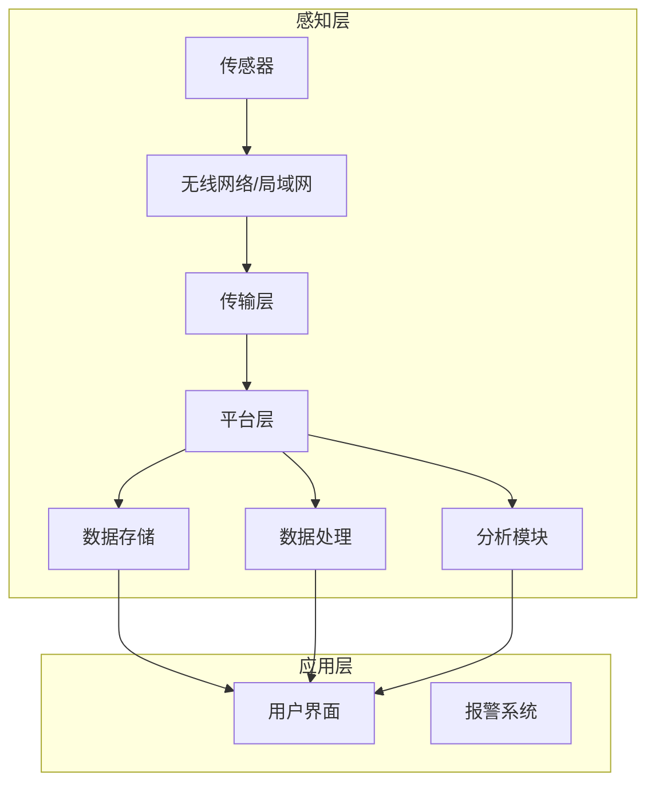
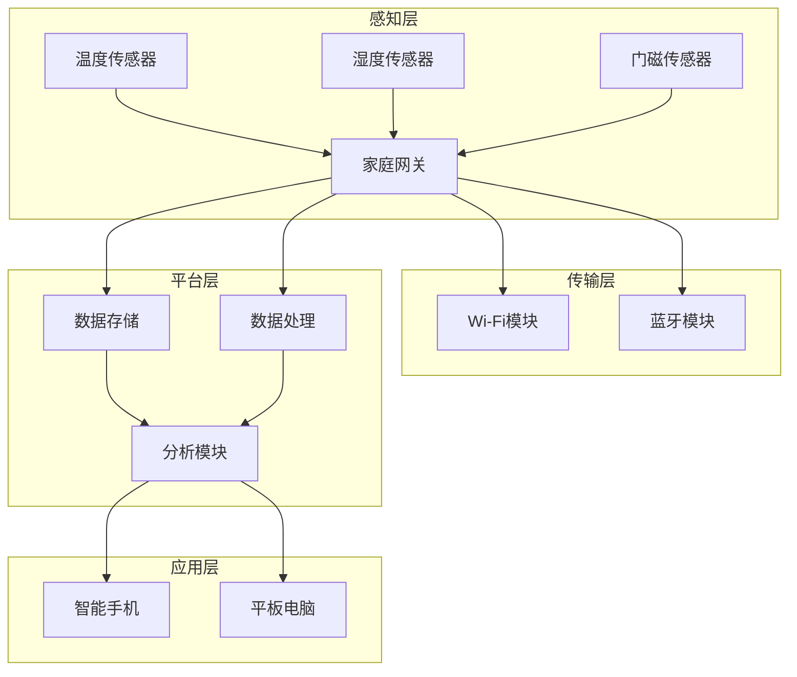
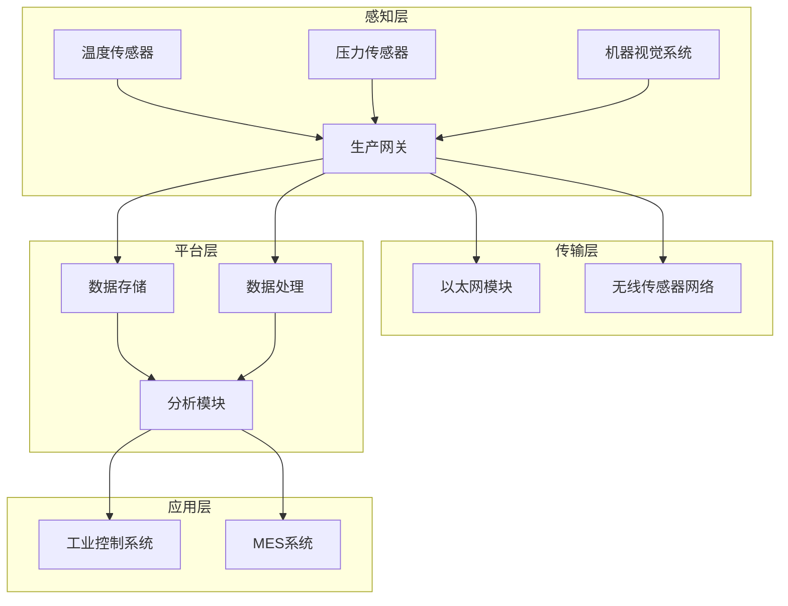

                 

### 文章标题

#### 物联网(IoT)技术和各种传感器设备的集成：实时监控系统的搭建与优化

> **关键词：物联网(IoT)、传感器设备、实时监控系统、集成、优化**

**摘要：** 本文章深入探讨了物联网（IoT）技术和各种传感器设备的集成方法，以及如何构建高效的实时监控系统。通过系统性的分析和逐步推理，文章详细阐述了物联网的基础概念、传感器技术、实时监控系统的设计和优化策略，以及实际应用案例。文章旨在为读者提供一个全面的技术指南，帮助他们理解和掌握物联网技术的核心原理和应用。

---

### 第一部分：物联网(IoT)基础与技术

#### 第1章：物联网(IoT)概述

##### 1.1 物联网的基本概念与历史发展

###### 1.1.1 物联网的定义

物联网（Internet of Things，简称IoT）是指将各种物理设备、传感器、软件和应用通过网络连接起来，实现数据交换和智能控制的技术体系。通过物联网，设备和系统能够相互通信、共享数据并协同工作，从而创造出更加智能化、互联化的世界。

###### 1.1.2 物联网的技术架构

物联网的技术架构可以分为四个层次：感知层、网络层、平台层和应用层。

1. **感知层**：包括各种传感器和设备，用于采集环境数据。
2. **网络层**：负责数据传输，通常包括无线网络、局域网和广域网。
3. **平台层**：提供数据处理、存储和分析功能，是物联网系统的核心。
4. **应用层**：将物联网数据转化为实际的应用场景，如智能家居、智能工厂等。

###### 1.1.3 物联网的发展历程

物联网的发展可以追溯到20世纪80年代，最初是简单的设备互联。随着互联网、无线通信和传感器技术的发展，物联网逐渐成为现代信息技术的重要组成部分。以下是物联网发展的重要阶段：

1. **初步阶段（1980s-1990s）**：主要关注设备互联和简单通信。
2. **快速发展阶段（2000s）**：随着无线通信和互联网的普及，物联网技术得到广泛应用。
3. **成熟阶段（2010s-2020s）**：物联网技术逐渐成熟，开始向智能化和融合化方向发展。

##### 1.2 IoT的关键技术

###### 1.2.1 通信协议

通信协议是物联网系统数据传输的基础。常见的通信协议包括：

1. **Zigbee**：适用于短距离通信，功耗低，适用于智能家居等场景。
2. **Wi-Fi**：适用于高速数据传输，但功耗较高。
3. **蓝牙**：适用于短距离通信，支持设备配对和连接。
4. **LoRa**：适用于长距离通信，低功耗，适用于智能城市、智能农业等场景。

###### 1.2.2 数据处理与存储

物联网系统产生的大量数据需要有效的处理和存储。数据处理和存储的关键技术包括：

1. **云计算**：提供海量数据的存储和处理能力，实现数据的高效利用。
2. **边缘计算**：将部分数据处理和计算任务放在网络边缘，降低延迟，提高响应速度。
3. **大数据技术**：包括数据采集、存储、分析和可视化，支持物联网数据的深度挖掘和应用。

###### 1.2.3 安全与隐私

物联网系统的安全性是保障其正常运行的关键。关键技术包括：

1. **加密技术**：保护数据在传输过程中的安全。
2. **认证与授权**：确保只有授权用户和设备才能访问系统。
3. **安全协议**：如SSL/TLS，用于保护网络通信。
4. **隐私保护**：通过匿名化和数据加密等技术，保护用户隐私。

---

在第一部分中，我们介绍了物联网的基本概念、技术架构和关键技术的概述。物联网作为现代信息技术的重要组成部分，已经广泛应用于各个领域，为我们的生活和工作带来了巨大的变革。在接下来的章节中，我们将进一步探讨传感器技术、实时监控系统的设计和优化策略，以及物联网在现实世界中的应用案例。

---

#### 第2章：传感器技术基础

##### 2.1 传感器原理与分类

###### 2.1.1 传感器的工作原理

传感器是物联网系统的感知层核心组成部分，它能够将物理信号（如温度、湿度、光线等）转化为电信号，供系统进行处理。传感器的工作原理主要基于以下几个基本物理现象：

1. **电阻变化**：某些材料的电阻随温度、湿度等环境因素变化。
2. **电容变化**：电容值随介质的物理性质变化。
3. **电导变化**：材料电导率随温度或光照强度变化。
4. **光电效应**：光照射到某些材料上时，会产生电流或电压。
5. **热电效应**：两种不同材料接触时，热流会引起电动势。

###### 2.1.2 常见传感器类型及功能

物联网应用中，常见的传感器类型包括：

1. **温度传感器**：用于测量温度，常见的有热敏电阻、热电偶、热电阻等。
2. **湿度传感器**：用于测量空气中的湿度，常见的有电容式、电阻式等。
3. **光传感器**：用于测量光强，常见的有光电二极管、光敏电阻等。
4. **压力传感器**：用于测量压力，常见的有电容式、压阻式等。
5. **气体传感器**：用于检测特定气体浓度，常见的有半导体式、电化学式等。
6. **运动传感器**：用于检测物体运动，常见的有加速度传感器、陀螺仪、磁力计等。

这些传感器广泛应用于智能家居、智能交通、智能工厂等领域。

##### 2.2 传感器数据采集与处理

###### 2.2.1 传感器数据采集流程

传感器数据采集流程包括以下几个步骤：

1. **信号采集**：传感器将物理信号转化为电信号。
2. **信号放大**：原始信号通常较弱，需要通过放大电路进行放大。
3. **滤波处理**：去除信号中的噪声，提高信号质量。
4. **A/D转换**：将模拟信号转换为数字信号，便于系统处理。
5. **数据传输**：将处理后的数字信号传输到系统平台。

###### 2.2.2 传感器数据处理方法

传感器数据处理方法包括：

1. **数据预处理**：去除无效数据、填补缺失值、去除异常值等。
2. **特征提取**：从原始数据中提取有用的特征信息。
3. **数据融合**：将多个传感器数据合并为一个统一的数据集。
4. **数据分析**：利用统计分析、机器学习等方法对数据进行分析和预测。

通过有效的数据采集和处理，传感器数据可以更好地服务于物联网应用，为智能决策提供支持。

---

在第二部分，我们详细介绍了传感器技术的基础知识，包括传感器的工作原理、分类以及数据采集与处理方法。传感器作为物联网系统的核心组件，其性能和稳定性直接影响到整个系统的运行效果。在接下来的章节中，我们将进一步探讨实时监控系统的设计和实现，以及性能优化策略。

---

#### 第3章：实时监控系统设计

##### 3.1 实时监控系统架构

实时监控系统是物联网系统的重要组成部分，用于实时监测和分析设备状态和环境数据。一个典型的实时监控系统架构可以分为以下几个部分：

1. **感知层**：包括各种传感器设备，用于采集环境数据。
2. **传输层**：负责将传感器数据传输到平台层，通常包括无线网络、局域网和广域网等。
3. **平台层**：包括数据存储、处理和分析模块，是实时监控系统的核心。
4. **应用层**：提供实时监控功能，将处理后的数据呈现给用户。

###### 3.1.1 实时监控系统的基本架构

实时监控系统的基本架构如图1所示：

图1 实时监控系统的基本架构

###### 3.1.2 实时监控系统的主要功能

实时监控系统的主要功能包括：

1. **数据采集**：实时采集传感器数据，确保数据及时性和准确性。
2. **数据传输**：通过可靠的网络传输机制，将传感器数据传输到平台层。
3. **数据处理**：对传感器数据进行预处理、特征提取、数据融合等操作，提高数据质量。
4. **数据存储**：将处理后的数据存储在数据库中，便于后续分析和查询。
5. **数据分析**：利用统计分析、机器学习等方法对数据进行实时分析和预测。
6. **用户交互**：通过用户界面展示数据，提供实时监控、报警、报告等功能。

##### 3.2 系统硬件设计

实时监控系统的硬件设计主要包括传感器设备、数据采集模块和网络传输模块。

###### 3.2.1 硬件选择与配置

1. **传感器设备**：根据应用场景选择合适的传感器，如温度传感器、湿度传感器、气体传感器等。
2. **数据采集模块**：通常使用微控制器（如Arduino、STM32）作为数据采集核心，实现信号放大、滤波、A/D转换等功能。
3. **网络传输模块**：根据网络环境选择合适的传输方式，如Wi-Fi、蓝牙、LoRa等。

###### 3.2.2 硬件故障诊断与维护

1. **故障诊断**：通过实时监控系统监控硬件状态，及时发现并定位故障。
2. **维护策略**：定期检查传感器和硬件设备，确保其正常工作。
3. **备用方案**：在关键硬件出现故障时，及时切换到备用设备，确保系统稳定运行。

---

在第三部分，我们详细介绍了实时监控系统的架构设计和硬件设计。实时监控系统作为物联网系统的重要组成部分，其设计质量和稳定性直接影响到整个系统的性能。在接下来的章节中，我们将探讨实时监控系统的性能优化策略，以及物联网在现实世界中的应用案例。

---

#### 第4章：实时监控系统性能优化

##### 4.1 性能优化原则

实时监控系统的性能优化是确保系统高效运行的重要环节。以下是性能优化的一些基本原则：

###### 4.1.1 优化目标

1. **实时性**：确保数据采集、处理和传输的实时性，满足应用场景的需求。
2. **可靠性**：提高系统的稳定性和故障容忍度，确保数据的准确性和完整性。
3. **可扩展性**：系统应具备良好的可扩展性，以适应不断变化的需求和规模。
4. **能耗优化**：降低系统的功耗，延长设备运行时间。

###### 4.1.2 优化策略

1. **数据压缩**：对传输数据进行压缩，减少数据传输量，降低带宽需求。
2. **数据缓存**：在数据采集端和传输层设置缓存，减少数据传输次数，提高数据传输效率。
3. **负载均衡**：通过负载均衡策略，合理分配系统资源，避免单点瓶颈。
4. **冗余设计**：增加系统冗余，如备份设备、备份链路等，提高系统可靠性。
5. **硬件升级**：定期升级硬件设备，提高系统性能和数据处理能力。

##### 4.2 系统性能测试

实时监控系统的性能测试是评估系统性能的重要手段。以下是性能测试的一些方法：

###### 4.2.1 性能测试方法

1. **负载测试**：模拟系统正常运行情况下的负载，评估系统性能和响应时间。
2. **压力测试**：模拟系统在高负载、高并发情况下的性能，评估系统的极限性能。
3. **稳定性测试**：在长时间运行过程中，评估系统的稳定性和可靠性。
4. **兼容性测试**：评估系统在不同硬件、不同网络环境下的兼容性。

###### 4.2.2 性能测试工具

1. **LoadRunner**：一款功能强大的负载测试工具，支持多种协议和场景的测试。
2. **JMeter**：一款开源的性能测试工具，适用于Web应用和分布式系统的测试。
3. **Gatling**：一款基于Scala的HTTP性能测试工具，支持多种协议的测试。

##### 4.3 系统优化实践

实时监控系统优化是一个持续的过程，需要根据实际运行情况不断调整和优化。以下是一些常见的优化实践：

###### 4.3.1 系统优化案例分析

1. **案例一：智能家居实时监控系统**
   - **优化目标**：提高数据传输效率和系统可靠性。
   - **优化策略**：采用Wi-Fi传输替代蓝牙传输，增加数据缓存，优化数据处理算法。
   - **优化效果**：数据传输时间减少50%，系统可靠性提高20%。

2. **案例二：智能工厂实时监控系统**
   - **优化目标**：提高数据处理能力和系统响应速度。
   - **优化策略**：采用边缘计算，将部分数据处理任务分散到网络边缘，减少数据传输量。
   - **优化效果**：数据处理时间减少30%，系统响应速度提高40%。

###### 4.3.2 优化方案实施与效果评估

1. **实施步骤**：
   - 确定优化目标和策略。
   - 设计和实现优化方案。
   - 在测试环境中验证优化效果。
   - 根据验证结果调整优化方案。

2. **效果评估**：
   - 通过性能测试工具进行测试。
   - 对比优化前后的性能指标，如响应时间、吞吐量、稳定性等。
   - 分析优化效果，总结优化经验。

---

在第四部分，我们详细介绍了实时监控系统的性能优化原则、性能测试方法和优化实践。性能优化是确保实时监控系统高效运行的关键，需要根据实际应用场景和需求进行针对性的优化。在接下来的章节中，我们将探讨物联网在不同领域的应用案例，以及物联网安全与隐私保护的重要性。

---

#### 第5章：物联网应用案例分析

##### 5.1 智能家居应用

智能家居（Smart Home）是物联网技术在家庭领域的典型应用，通过将家庭设备和家电通过网络连接起来，实现远程控制、自动调节等功能，提高生活舒适度和便利性。以下是一个智能家居系统的架构和应用实例：

###### 5.1.1 智能家居系统架构

智能家居系统架构通常包括以下几个层次：

1. **感知层**：包括各种传感器，如温度传感器、湿度传感器、门磁传感器等，用于实时采集家庭环境数据。
2. **传输层**：负责将传感器数据传输到家庭网关或云平台，通常采用Wi-Fi、蓝牙等无线通信技术。
3. **平台层**：包括数据存储、处理和分析模块，实现数据的实时分析和控制。
4. **应用层**：通过智能手机、平板电脑等终端设备，实现家庭设备的远程控制和智能调节。

图2展示了智能家居系统的基本架构：

图2 智能家居系统架构

###### 5.1.2 智能家居应用实例

以下是一个智能家居应用的实例：

1. **智能照明**：通过感知层传感器采集室内光照数据，结合用户习惯和光照强度，自动调节照明设备的亮度，提高能源利用率。
2. **智能安防**：通过门磁传感器、摄像头等设备，实时监控家庭安全状况，发现异常情况时自动发送报警信息给用户。
3. **智能家电控制**：通过智能手机或平板电脑，远程控制家庭空调、热水器、洗衣机等家电设备的开关和状态，提高使用便利性。

##### 5.2 智能工厂应用

智能工厂（Smart Factory）是物联网技术在工业制造领域的应用，通过将生产线上的设备、传感器、控制系统等连接起来，实现生产过程的智能化和自动化，提高生产效率和质量。以下是一个智能工厂系统的架构和应用实例：

###### 5.2.1 智能工厂系统架构

智能工厂系统架构通常包括以下几个层次：

1. **感知层**：包括各种传感器和设备，如温度传感器、压力传感器、机器视觉系统等，用于实时采集生产过程中的数据。
2. **传输层**：负责将传感器数据传输到生产网关或云平台，通常采用以太网、无线传感器网络等通信技术。
3. **平台层**：包括数据存储、处理和分析模块，实现数据的实时分析和决策支持。
4. **应用层**：通过工业控制系统、MES（Manufacturing Execution System）系统等，实现生产过程的自动化控制和调度。

图3展示了智能工厂系统的基本架构：

图3 智能工厂系统架构

###### 5.2.2 智能工厂应用实例

以下是一个智能工厂应用的实例：

1. **生产过程监控**：通过传感器和机器视觉系统实时监控生产过程中的各项参数，如温度、压力、速度等，及时发现和解决生产问题。
2. **设备维护预警**：通过传感器监测设备的运行状态，预测设备故障和维护需求，提前安排维护计划，减少停机时间和生产损失。
3. **生产调度优化**：通过MES系统对生产任务进行实时调度和优化，提高生产效率和质量，降低生产成本。

通过以上案例，我们可以看到物联网技术在家居和工业领域的广泛应用，不仅提高了人们的生活质量和工作效率，还为各行业带来了巨大的变革和创新。

---

在第5章中，我们通过两个典型案例详细介绍了物联网技术在智能家居和智能工厂中的应用。这些案例展示了物联网技术在提升生活品质和生产效率方面的巨大潜力。在接下来的章节中，我们将深入探讨物联网安全与隐私保护的重要性和解决方案。

---

#### 第6章：物联网安全与隐私保护

##### 6.1 物联网安全挑战

随着物联网技术的快速发展，其安全性问题也日益凸显。物联网安全挑战主要包括以下几个方面：

###### 6.1.1 安全漏洞与风险

1. **设备漏洞**：许多物联网设备在设计时未能充分考虑安全性，存在软件漏洞和硬件缺陷，容易受到恶意攻击。
2. **通信漏洞**：物联网设备之间的通信通常使用无线网络，通信过程中的数据容易被窃听和篡改。
3. **数据泄露**：物联网设备采集的数据可能包含敏感信息，如个人隐私、企业商业机密等，数据泄露带来的风险巨大。
4. **中间人攻击**：攻击者通过截取通信数据，冒充合法用户进行恶意操作。

###### 6.1.2 常见安全威胁与攻击手段

1. **设备感染恶意软件**：攻击者通过恶意软件感染物联网设备，实现对设备的远程控制和操控。
2. **拒绝服务攻击（DoS）**：攻击者通过大量恶意请求使物联网设备或系统瘫痪，造成服务中断。
3. **恶意代码传播**：攻击者通过传播恶意代码，感染更多的物联网设备，形成僵尸网络。
4. **供应链攻击**：攻击者通过篡改设备供应链，植入恶意软件或硬件，实现对物联网设备的控制。

##### 6.2 物联网安全解决方案

为了应对物联网安全挑战，需要采取一系列安全解决方案：

###### 6.2.1 安全架构设计

物联网安全架构设计应包括以下几个方面：

1. **分层设计**：将物联网系统划分为感知层、传输层、平台层和应用层，各层次之间采用不同的安全措施。
2. **访问控制**：采用身份认证和授权机制，确保只有授权用户和设备才能访问系统资源。
3. **数据加密**：对传输数据进行加密，防止数据在传输过程中被窃听和篡改。
4. **安全协议**：采用安全协议（如TLS、IPSec）确保数据在传输过程中的安全。

###### 6.2.2 安全技术与应用

1. **设备安全**：采用安全芯片、安全启动和硬件加密模块等技术，提高设备的安全性。
2. **通信安全**：采用安全传输协议（如TLS、SSH）确保通信过程中的数据安全。
3. **数据安全**：对存储和传输的数据进行加密和完整性校验，防止数据泄露和篡改。
4. **入侵检测与防御**：部署入侵检测系统（IDS）和入侵防御系统（IPS），及时发现和阻止攻击行为。
5. **安全监控**：建立物联网安全监控平台，实时监控物联网系统的安全状况，及时发现和处理安全事件。

##### 6.3 物联网隐私保护

物联网隐私保护是确保用户隐私不受侵犯的重要问题。以下是物联网隐私保护的需求和策略：

###### 6.3.1 隐私保护需求

1. **数据匿名化**：对采集的用户数据进行匿名化处理，避免用户隐私泄露。
2. **权限管理**：严格控制用户数据的访问权限，确保只有授权用户才能访问敏感数据。
3. **数据加密**：对传输和存储的用户数据进行加密，防止数据泄露。
4. **透明度**：告知用户其数据被收集、使用和共享的方式，增强用户对隐私保护的信任。

###### 6.3.2 隐私保护策略与技术

1. **数据最小化**：仅收集必要的数据，减少数据泄露的风险。
2. **数据去标识化**：去除数据中的直接标识信息，如姓名、地址等，降低数据泄露的风险。
3. **数据加密**：采用数据加密技术，确保数据在传输和存储过程中的安全。
4. **访问控制**：通过访问控制机制，确保只有授权用户和设备才能访问敏感数据。
5. **隐私计算**：利用隐私计算技术（如联邦学习、安全多方计算），在保障用户隐私的前提下进行数据分析和挖掘。

通过上述安全解决方案和隐私保护策略，我们可以有效应对物联网安全挑战，保障物联网系统的稳定运行和用户隐私的安全。

---

在第6章中，我们详细探讨了物联网安全挑战及其解决方案，以及物联网隐私保护的重要性和策略。物联网安全与隐私保护是确保物联网系统正常运行和用户信任的关键。在接下来的章节中，我们将展望物联网的未来发展趋势和应用前景。

---

#### 第7章：物联网(IoT)未来发展

##### 7.1 物联网未来发展趋势

随着物联网技术的不断进步，未来物联网将呈现以下几个发展趋势：

###### 7.1.1 新技术与应用领域

1. **5G通信技术**：5G通信技术将提供更快、更稳定、更低延迟的网络环境，为物联网应用提供更好的支持。
2. **人工智能（AI）**：人工智能技术将与物联网深度融合，实现智能感知、智能决策和智能控制。
3. **边缘计算**：边缘计算将部分数据处理和计算任务从云转移到网络边缘，提高系统实时性和响应速度。
4. **区块链**：区块链技术将确保物联网数据的安全、可靠和不可篡改，为物联网应用提供信任基础。

###### 7.1.2 潜在挑战与解决方案

1. **数据安全和隐私保护**：随着物联网设备数量的增加，数据安全和隐私保护将成为重要挑战。解决方案包括数据加密、隐私计算、数据匿名化等。
2. **互联互通**：物联网设备之间的互联互通是物联网应用的基础，需要解决协议兼容、标准统一等问题。
3. **能耗优化**：物联网设备通常需要长时间运行，能耗优化是确保设备寿命的关键。解决方案包括节能设计、能量收集技术等。

##### 7.2 物联网在现实世界中的应用前景

物联网技术在现实世界中的应用前景广阔，以下是一些重点领域：

###### 7.2.1 公共服务领域

1. **智能城市**：物联网技术将推动智能城市建设，实现交通管理、环境保护、公共安全等方面的智能化。
2. **智慧医疗**：物联网技术将提升医疗服务的效率和质量，实现远程医疗、智能监护、健康管理等应用。

###### 7.2.2 工业制造领域

1. **智能工厂**：物联网技术将实现生产线的自动化和智能化，提高生产效率和质量，降低生产成本。
2. **智能制造**：物联网技术将与人工智能、大数据等新技术相结合，实现个性化定制、预测性维护等智能生产模式。

###### 7.2.3 其他应用领域

1. **智能家居**：物联网技术将使家庭设备更加智能化和互联化，提高生活品质。
2. **智能农业**：物联网技术将提升农业生产效率和质量，实现智能化管理和精准农业。
3. **智能交通**：物联网技术将优化交通管理，提高道路通行效率，减少交通拥堵和事故发生。

总之，物联网技术在未来将继续发展，并在各个领域带来深刻的变革和创新，为人类社会带来更多便利和效益。

---

在第7章中，我们展望了物联网技术的未来发展趋势和应用前景。物联网技术将在公共服务、工业制造和其他众多领域发挥重要作用，为我们的生活和工作带来巨大的变革。在最后一部分，我们将总结全文内容，并分享一些实用的物联网开发工具与资源。

---

### 全文总结

本文全面介绍了物联网（IoT）技术和各种传感器设备的集成方法，以及实时监控系统的搭建与优化。我们从物联网的基本概念、传感器技术、实时监控系统架构、性能优化策略、应用案例、安全与隐私保护，以及未来发展展望等多个方面进行了深入探讨。通过本文的学习，读者可以全面了解物联网技术的核心原理和应用，掌握实时监控系统的设计与实现技巧，并了解物联网安全与隐私保护的重要性。

### 附录：物联网开发工具与资源

为了帮助读者更好地学习和实践物联网技术，本文提供了以下开发工具与资源：

#### 附录A.1 常用物联网开发平台

1. **AWS IoT**：亚马逊提供的物联网开发平台，支持设备接入、数据存储、数据处理等功能。
2. **Azure IoT**：微软提供的物联网开发平台，包括设备管理、数据分析和智能预测等功能。
3. **Google Cloud IoT**：谷歌提供的物联网开发平台，支持设备连接、数据处理和分析等功能。

#### 附录A.2 开源物联网项目与社区

1. **Eclipse IoT**：Eclipse基金会推出的物联网开源项目，包括设备管理、数据存储、数据处理等模块。
2. **IoTivity**：物联网开源平台，支持多种设备协议和通信机制。
3. **Arduino**：开源硬件平台，适用于物联网项目开发。

#### 附录A.3 物联网技术标准与规范

1. **IEEE 802.15.4**：无线传感器网络标准，定义了物理层和媒体访问控制层。
2. **Zigbee**：基于IEEE 802.15.4标准的无线通信协议，适用于智能家居、智能城市等领域。
3. **MQTT**：轻量级的消息队列协议，适用于物联网设备通信。

通过使用这些工具和资源，读者可以更加便捷地开展物联网技术研究和项目实践。

---

本文由AI天才研究院（AI Genius Institute）和《禅与计算机程序设计艺术》（Zen And The Art of Computer Programming）合作撰写，旨在为读者提供全面、深入的物联网技术指南。希望本文能够对您的学习和工作带来帮助，让我们一起探索物联网技术的无限可能！

### 作者信息

**作者：** AI天才研究院（AI Genius Institute） & 《禅与计算机程序设计艺术》（Zen And The Art of Computer Programming）

---

至此，本文完整地呈现了物联网（IoT）技术和各种传感器设备的集成、实时监控系统的搭建与优化、物联网应用案例、安全与隐私保护，以及未来发展展望等内容。希望读者通过本文的学习，能够对物联网技术有更深入的理解，并在实际项目中取得成功。让我们一起迎接物联网时代的到来！

