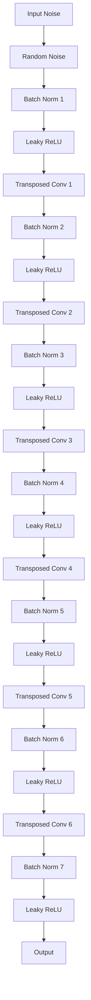
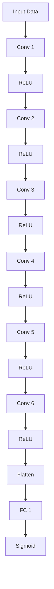
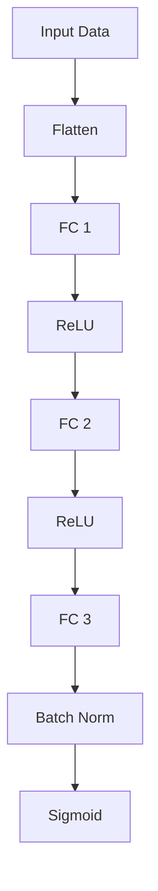
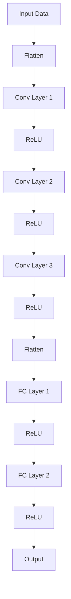
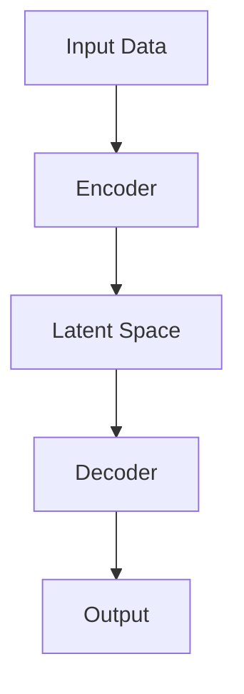
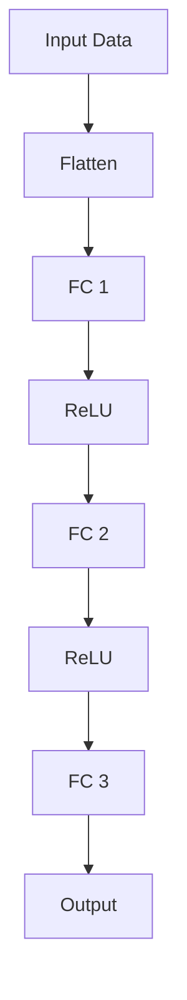
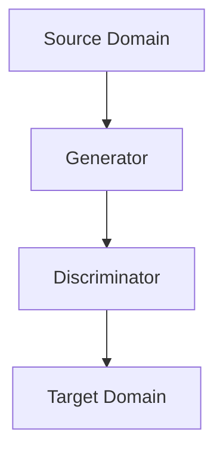
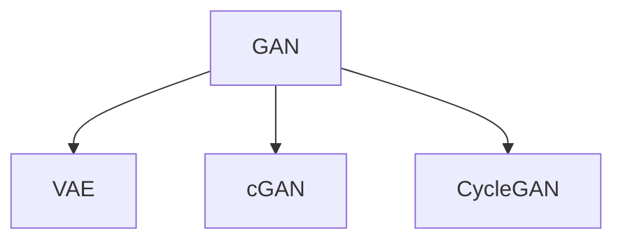

                 

### 《生成对抗网络在虚拟形象创建中的应用》

> **关键词**：生成对抗网络（GAN）、虚拟形象、生成器、判别器、图像合成、人工智能

> **摘要**：本文将探讨生成对抗网络（GAN）在虚拟形象创建中的应用。通过深入分析GAN的基本概念、核心理论及其变体，我们旨在揭示GAN在虚拟角色、虚拟景观和虚拟形象动画生成中的具体应用。文章将结合实际项目案例，详细讲解GAN在虚拟形象创建中的开发环境搭建、源代码实现和代码解读，最后展望GAN技术的未来发展。

### 目录大纲

1. **基础概念与原理部分**
   1.1 GAN的定义与历史发展
   1.2 GAN的基本架构
   1.3 GAN的关键概念
   1.4 GAN的数学模型
   1.5 GAN的变体与改进

2. **虚拟形象创建中的GAN应用部分**
   2.1 虚拟形象创建的需求与GAN的适用性
   2.2 GAN在虚拟角色生成中的应用
   2.3 GAN在虚拟景观生成中的应用
   2.4 GAN在虚拟形象动画生成中的应用

3. **GAN在虚拟形象创建中的优化与提升**
   3.1 数据增强与GAN性能优化
   3.2 多模态GAN在虚拟形象创建中的应用
   3.3 GAN的跨领域迁移与应用

4. **GAN在虚拟形象创建中的未来展望**
   4.1 GAN技术的未来发展趋势
   4.2 虚拟形象创建领域的挑战与机遇
   4.3 GAN与其他技术的融合应用

5. **附录**
   5.1 常用的GAN开发框架
   5.2 GAN开发工具与资源推荐
   5.3 虚拟形象创建中的GAN开源项目介绍
   5.4 常见问题与解决方案

### 第一部分：基础概念与原理

在这一部分中，我们将详细探讨生成对抗网络（GAN）的基础概念、基本架构、关键理论及其数学模型。通过深入分析，我们将为理解GAN在虚拟形象创建中的应用奠定基础。

#### 第1章：生成对抗网络（GAN）概述

#### 1.1 GAN的定义与历史发展

生成对抗网络（GAN）是由Ian Goodfellow等人于2014年提出的深度学习模型。GAN的核心思想是通过一个生成器（Generator）和一个判别器（Discriminator）的对抗性学习来生成高质量的数据。GAN的定义可以简单概括为：

**生成对抗网络**：由一个生成器G和一个判别器D组成的神经网络模型，生成器G旨在生成与真实数据相似的数据，而判别器D则负责判断输入数据是真实数据还是生成数据。通过对抗性训练，生成器和判别器的性能逐渐提升，最终生成器能够生成几乎难以区分于真实数据的合成数据。

GAN的历史发展可以追溯到深度学习领域早期的生成模型，如自编码器和变分自编码器（VAE）。GAN在结构上借鉴了自编码器的思想，但通过引入对抗性训练，大大提高了生成模型的能力。

#### 1.2 GAN的基本架构

GAN的基本架构包括两个主要组成部分：生成器（Generator）和判别器（Discriminator）。这两个组件相互对抗，通过优化各自的损失函数来提高性能。

**生成器（Generator）**：生成器的目标是生成与真实数据相似的数据。生成器通常是一个从随机噪声向量到数据空间的映射函数。其目的是通过学习真实数据的分布，将噪声转换为高质量的数据。

**判别器（Discriminator）**：判别器的目标是区分真实数据和生成数据。判别器通常是一个二分类神经网络，输入为真实数据和生成数据，输出为概率值，表示输入数据的真实性。

GAN的训练过程可以描述为以下步骤：

1. 初始化生成器和判别器。
2. 对于每次训练迭代，生成器生成一批新的数据。
3. 将生成数据与真实数据进行混合，作为判别器的输入。
4. 计算判别器的损失函数，通过反向传播更新判别器的参数。
5. 保持判别器的参数不变，更新生成器的参数，以减小生成数据的判别损失。

#### 1.3 GAN的关键概念

在GAN的架构中，有以下几个关键概念：

**生成器（Generator）**：生成器的目标是生成高质量的数据，以欺骗判别器。生成器通常由一个编码器和一个解码器组成。编码器将输入数据编码为低维隐含空间中的向量，解码器则将这些向量解码为数据空间中的数据。

**判别器（Discriminator）**：判别器的目标是区分真实数据和生成数据。判别器通常是一个多层感知机（MLP），其输入为数据，输出为概率值，表示输入数据的真实性。

**对抗性学习（Adversarial Learning）**：GAN的核心是生成器和判别器的对抗性学习。生成器试图生成与真实数据相似的数据，而判别器试图准确地区分真实数据和生成数据。通过不断的对抗性训练，生成器的生成能力逐渐提升，判别器的分类能力也得到提高。

**损失函数（Loss Function）**：GAN的训练过程中，生成器和判别器都通过优化损失函数来提高性能。生成器的损失函数通常由判别器的判别损失组成，判别器的损失函数则由分类损失组成。

#### 1.4 GAN的数学模型

GAN的数学模型可以描述为以下形式：

$$
G(z) \sim p_G(z) \\
D(x) \sim p_D(x) \\
D(G(z)) \sim p_D(G(z))
$$

其中，$G(z)$ 表示生成器生成的数据，$z$ 表示生成器的输入噪声，$D(x)$ 表示判别器对输入数据的判别结果。$p_G(z)$ 和 $p_D(x)$ 分别表示生成器和判别器的先验分布。

GAN的训练目标是通过优化生成器和判别器的参数，使得判别器无法准确地区分真实数据和生成数据，同时生成器能够生成高质量的数据。

#### 1.5 GAN的变体与改进

自GAN提出以来，研究者们提出了许多GAN的变体和改进算法，以解决GAN训练中的不稳定性和模式崩溃等问题。以下是一些常见的GAN变体：

1. **深度卷积生成对抗网络（DCGAN）**：DCGAN是GAN的一个变体，采用深度卷积神经网络（CNN）作为生成器和判别器，提高了GAN的生成质量和稳定性。

2. **循环一致性GAN（CycleGAN）**：CycleGAN旨在解决无监督的图像到图像的转换问题。CycleGAN通过引入一个循环一致性损失，使得生成的图像能够通过两个方向的转换回到原始图像。

3. **变分自编码器GAN（VGAN）**：VGAN结合了变分自编码器（VAE）和GAN的思想，通过引入变分自编码器的结构，提高了GAN的生成质量和稳定性。

4. **条件生成对抗网络（cGAN）**：cGAN引入了条件信息，使得生成器能够根据特定条件生成数据。cGAN在虚拟形象创建等领域具有广泛的应用。

5. **匹配生成对抗网络（mGAN）**：mGAN旨在解决GAN训练中的模式崩溃问题，通过引入匹配损失，使得生成器和判别器在训练过程中能够更好地平衡。

在这一部分中，我们详细介绍了生成对抗网络（GAN）的基础概念、基本架构、核心理论和数学模型。通过深入分析GAN的工作原理，我们为理解GAN在虚拟形象创建中的应用奠定了理论基础。在接下来的部分中，我们将探讨GAN在虚拟形象创建中的具体应用，并分析其在不同场景中的优势与挑战。

---

### 第一部分：基础概念与原理

在这一部分中，我们将详细探讨生成对抗网络（GAN）的基础概念、基本架构、关键理论及其数学模型。通过深入分析，我们将为理解GAN在虚拟形象创建中的应用奠定基础。

#### 第2章：GAN的核心理论

#### 2.1 对抗性学习原理

生成对抗网络（GAN）的核心在于其对抗性学习（Adversarial Learning）原理。这种原理源自博弈论中的对抗性游戏，即两个参与者（在这里是生成器和判别器）通过互相策略的调整来达到最优解。GAN通过这种方式训练生成器和判别器，使得生成器能够生成与真实数据难以区分的假数据，而判别器则能够准确地识别出真实数据与生成数据。

对抗性学习的具体过程如下：

1. **生成器（Generator）**：生成器的目标是通过学习输入噪声分布，生成与真实数据分布相似的数据。生成器通常由多层神经网络构成，输入为噪声向量，输出为数据空间中的样本。

2. **判别器（Discriminator）**：判别器的目标则是判断输入数据是真实数据还是生成数据。判别器同样由多层神经网络构成，输入为数据空间中的样本，输出为一个概率值，表示输入数据的真实性。

3. **对抗性训练（Adversarial Training）**：生成器和判别器通过对抗性训练相互对抗。每次训练迭代中，生成器生成一批假数据，并与真实数据进行混合，判别器对这些混合数据进行分类。判别器的损失函数通常为二元交叉熵损失函数。然后，通过反向传播更新判别器的参数。接着，固定判别器的参数，更新生成器的参数，使得生成器生成的假数据更接近真实数据。

这种对抗性训练的目的是使得判别器无法区分真实数据和生成数据，从而提高生成器的生成质量。在GAN的训练过程中，生成器和判别器的损失函数分别为：

- **生成器的损失函数**：生成器的损失函数通常由判别器对生成数据的判别结果决定。理想情况下，生成器生成的数据应该使判别器输出为0.5，即生成数据既不是完全真实数据，也不是完全生成数据。生成器的损失函数可以表示为：
  $$
  L_G = -\log(D(G(z)))
  $$
  其中，$D(G(z))$ 表示判别器对生成数据的判别结果。

- **判别器的损失函数**：判别器的损失函数是二元交叉熵损失函数，可以表示为：
  $$
  L_D = -[\log(D(x)) + \log(1 - D(G(z))]
  $$
  其中，$D(x)$ 表示判别器对真实数据的判别结果，$D(G(z))$ 表示判别器对生成数据的判别结果。

对抗性训练的目的是通过不断调整生成器和判别器的参数，使得判别器无法区分真实数据和生成数据，从而生成高质量的假数据。这种训练过程可以看作是一个零和游戏，生成器和判别器在训练过程中相互竞争，最终达到一种动态平衡状态。

#### 2.2 生成器和判别器的优化策略

生成器和判别器的优化策略是GAN训练成功的关键。以下分别介绍生成器和判别器的优化策略。

**生成器的优化策略**：

- **噪声注入**：生成器的输入通常是一个随机噪声向量，这个噪声向量可以是从正态分布、均匀分布等概率分布中采样得到的。噪声注入有助于生成器学习到数据的潜在分布，从而生成更加多样化的数据。

- **多层神经网络**：生成器通常由多层神经网络构成，每一层神经网络都能够学习到数据的特征信息。通过多层神经网络的结构，生成器可以生成更加复杂和真实的数据。

- **反向传播**：生成器的训练过程是通过反向传播算法来优化的。在每次训练迭代中，生成器生成的数据与真实数据进行混合，判别器对这些混合数据进行分类。然后，通过反向传播更新生成器的参数，使得生成器生成的数据更接近真实数据。

- **梯度惩罚**：在某些GAN变体中，为了防止生成器生成过于简单或模式化的数据，会引入梯度惩罚策略。梯度惩罚通过对生成器的损失函数进行惩罚，鼓励生成器生成更加复杂和多样化的数据。

**判别器的优化策略**：

- **多层感知机**：判别器通常由多层感知机构成，其目的是通过学习真实数据和生成数据的特征，准确地区分真实数据和生成数据。

- **二元交叉熵损失函数**：判别器的损失函数通常采用二元交叉熵损失函数，该损失函数可以衡量判别器对真实数据和生成数据的分类效果。通过最小化这个损失函数，判别器可以更准确地识别出真实数据和生成数据。

- **反向传播**：判别器的训练过程同样是通过反向传播算法来优化的。在每次训练迭代中，生成器生成的数据与真实数据进行混合，判别器对这些混合数据进行分类。然后，通过反向传播更新判别器的参数，使得判别器能够更好地识别真实数据和生成数据。

- **批量归一化**：在某些情况下，为了提高判别器的训练效果，会采用批量归一化（Batch Normalization）技术。批量归一化可以加速模型的训练，提高模型的泛化能力。

**生成器和判别器的平衡**：

在GAN的训练过程中，生成器和判别器的平衡是一个重要的问题。如果生成器的生成能力太强，判别器将无法区分真实数据和生成数据，这会导致判别器失去训练意义。反之，如果生成器的生成能力太弱，判别器将很容易区分真实数据和生成数据，这会导致生成器无法得到有效的训练。

为了维持生成器和判别器之间的动态平衡，研究者们提出了一些方法，如梯度惩罚、学习率调整等。这些方法通过调整生成器和判别器的参数，使得生成器和判别器在训练过程中能够相互促进，达到最优的训练效果。

#### 2.3 GAN的数学模型

GAN的数学模型是理解GAN工作原理的重要基础。GAN的数学模型主要涉及生成器、判别器和损失函数。

**生成器（Generator）**：

生成器的数学模型可以表示为：
$$
G(z) = \mathcal{N}(x; \mu, \sigma^2)
$$
其中，$z$ 是生成器的输入噪声，通常是从一个概率分布中采样得到的。$\mu$ 和 $\sigma^2$ 分别表示生成器的均值和方差，$\mathcal{N}$ 表示正态分布。生成器的目标是通过学习输入噪声分布，生成与真实数据分布相似的数据。

**判别器（Discriminator）**：

判别器的数学模型可以表示为：
$$
D(x) = \sigma(\phi(x))
$$
其中，$x$ 是判别器的输入数据，$\phi$ 是一个非线性激活函数，通常采用Sigmoid函数或Tanh函数。$\sigma$ 是一个概率值，表示输入数据的真实性。判别器的目标是通过学习真实数据和生成数据的特征，准确地区分真实数据和生成数据。

**损失函数（Loss Function）**：

GAN的损失函数通常由两部分组成：生成器的损失函数和判别器的损失函数。

- **生成器的损失函数**：
  $$
  L_G = -\log(D(G(z)))
  $$
  其中，$D(G(z))$ 表示判别器对生成数据的判别结果。生成器的损失函数的目标是最小化判别器对生成数据的判别结果。

- **判别器的损失函数**：
  $$
  L_D = -[\log(D(x)) + \log(1 - D(G(z))]
  $$
  其中，$D(x)$ 表示判别器对真实数据的判别结果。判别器的损失函数的目标是最小化判别器对真实数据和生成数据的判别误差。

通过不断优化生成器和判别器的参数，GAN可以生成高质量的数据。在GAN的训练过程中，生成器和判别器通过对抗性训练相互促进，最终达到一种动态平衡状态。

#### 第3章：GAN的变体与改进

自生成对抗网络（GAN）提出以来，研究者们为了解决GAN训练中的不稳定性和模式崩溃等问题，提出了许多GAN的变体和改进算法。以下介绍几种常见的GAN变体和改进算法。

##### 3.1 深度卷积生成对抗网络（DCGAN）

深度卷积生成对抗网络（DCGAN）是GAN的一个变体，由Radford等人于2015年提出。DCGAN采用深度卷积神经网络（CNN）作为生成器和判别器，提高了GAN的生成质量和稳定性。

**生成器**：

DCGAN的生成器由一个反卷积网络（Deconvolutional Network）构成，其输入为随机噪声向量，输出为生成数据。生成器通过多个上采样和反卷积操作，将低维噪声逐步重构为高维数据。



**判别器**：

DCGAN的判别器由一个卷积网络（Convolutional Network）构成，其输入为真实数据或生成数据，输出为一个概率值。判别器通过多个卷积操作，提取输入数据的特征，然后通过一个全连接层输出概率值。



**训练策略**：

DCGAN采用以下策略提高训练稳定性：

- 使用批量归一化（Batch Normalization）减少内部协变量转移。
- 使用Leaky ReLU激活函数避免梯度消失。
- 使用较小的学习率，如$10^{-4}$。

DCGAN通过采用深度卷积神经网络和上述策略，提高了GAN的生成质量和训练稳定性，成为GAN领域的重要变体。

##### 3.2 条件生成对抗网络（cGAN）

条件生成对抗网络（cGAN）是在GAN的基础上引入条件信息的一种改进算法。cGAN通过将条件信息（如标签、类别等）与生成器和判别器的输入和输出相结合，使得生成器和判别器能够学习到更加复杂和多样化的数据。

**生成器**：

cGAN的生成器输入包括随机噪声和条件信息，输出为生成数据。生成器通过一个编码器将条件信息和噪声编码为一个低维向量，然后通过解码器将这些向量解码为生成数据。

```mermaid
graph TD
A[Input Noise] --> B[Random Noise]
B --> C[Batch Norm 1]
C --> D[Leaky ReLU]
D --> E[Concat (Condition)]
E --> F[Encoder]
F --> G[Decoder]
G --> H[Output]
```

**判别器**：

cGAN的判别器输入包括真实数据和生成数据，输出为一个概率值。判别器通过学习真实数据和生成数据的特征，准确地区分真实数据和生成数据。



**损失函数**：

cGAN的损失函数由两部分组成：对抗性损失和条件损失。

- **对抗性损失**：
  $$
  L_{adv} = -\log(D(G(z, c)))
  $$
  其中，$z$ 是生成器的输入噪声，$c$ 是条件信息。

- **条件损失**：
  $$
  L_{cond} = -\log(D(x, c))
  $$

cGAN通过引入条件信息，使得生成器和判别器能够更好地学习数据的分布，从而生成更加多样化和真实的数据。

##### 3.3 层次生成对抗网络（hGAN）

层次生成对抗网络（hGAN）是一种多层次的GAN结构，旨在解决GAN训练中的不稳定性和模式崩溃问题。hGAN通过引入层次结构，将生成器和判别器分为多个层次，从而实现稳定和高效的训练。

**生成器**：

hGAN的生成器由多个层次构成，每个层次都包含一个编码器和一个解码器。生成器的输入为随机噪声，输出为生成数据。每个层次的编码器和解码器都学习到不同的数据特征，从而生成更加真实和多样化的数据。

```mermaid
graph TD
A[Input Noise] --> B[Random Noise]
B --> C[Encoder Layer 1]
C --> D[Concat (Condition)]
D --> E[Decoder Layer 1]
E --> F[Encoder Layer 2]
F --> G[Concat (Condition)]
G --> H[Decoder Layer 2]
H --> I[Encoder Layer 3]
I --> J[Concat (Condition)]
J --> K[Decoder Layer 3]
K --> L[Output]
```

**判别器**：

hGAN的判别器同样由多个层次构成，每个层次都包含一个卷积层和一个全连接层。判别器的输入为真实数据和生成数据，输出为一个概率值。每个层次的卷积层和全连接层都学习到不同的数据特征，从而提高判别器的分类能力。



**训练策略**：

hGAN采用以下策略提高训练稳定性：

- **层次迁移**：通过将低层次的特征迁移到高层次，降低不同层次之间的关联性，从而减少模式崩溃。
- **层次共享**：通过共享不同层次的参数，降低模型的复杂度，提高训练效率。

hGAN通过引入层次结构，实现了稳定和高效的GAN训练，成为GAN领域的重要改进算法。

##### 3.4 对抗性学习框架（WGAN）

对抗性学习框架（WGAN）是GAN的一种改进算法，旨在提高GAN的训练稳定性和生成质量。WGAN通过引入新的损失函数和优化策略，解决了GAN训练中的不稳定性和梯度消失等问题。

**损失函数**：

WGAN采用Wasserstein距离作为损失函数，替代传统的二元交叉熵损失函数。Wasserstein距离衡量的是两个概率分布之间的“距离”，它能够更好地衡量生成器和判别器的对抗性。

- **生成器损失函数**：
  $$
  L_G = -E[D(G(z))]
  $$
  其中，$D$ 表示Wasserstein距离。

- **判别器损失函数**：
  $$
  L_D = E_{x\sim p_{data}(x)}[D(x)] - E_{z\sim p_{z}(z)}[D(G(z))]
  $$

**优化策略**：

WGAN采用以下策略提高训练稳定性：

- **权重剪裁（Weight Clip）**：通过限制判别器参数的范数，防止梯度爆炸。
- **小批量梯度下降（Small Batch Gradient Descent）**：通过小批量梯度下降，提高训练稳定性。

WGAN通过引入新的损失函数和优化策略，解决了GAN训练中的不稳定性和梯度消失等问题，成为GAN领域的重要改进算法。

##### 3.5 对抗性变分自编码器（VAEGAN）

对抗性变分自编码器（VAEGAN）结合了变分自编码器（VAE）和GAN的思想，旨在提高GAN的生成质量和训练稳定性。VAEGAN通过引入变分自编码器的结构，将GAN的训练过程转化为概率分布的学习。

**生成器**：

VAEGAN的生成器由编码器和解码器构成。编码器将输入数据编码为一个潜在空间中的向量，解码器将这个向量解码为生成数据。



**判别器**：

VAEGAN的判别器与GAN的判别器类似，输入为真实数据和生成数据，输出为一个概率值。



**损失函数**：

VAEGAN的损失函数由两部分组成：对抗性损失和重建损失。

- **对抗性损失**：
  $$
  L_{adv} = -E[D(G(z))]
  $$

- **重建损失**：
  $$
  L_{rec} = \sum_{i=1}^{n} -\log(D(x))
  $$

VAEGAN通过引入变分自编码器的结构，将GAN的训练过程转化为概率分布的学习，提高了GAN的生成质量和训练稳定性。

在这一章中，我们详细介绍了生成对抗网络（GAN）的核心理论，包括对抗性学习原理、生成器和判别器的优化策略以及GAN的数学模型。此外，我们还探讨了GAN的变体与改进算法，如深度卷积生成对抗网络（DCGAN）、条件生成对抗网络（cGAN）、层次生成对抗网络（hGAN）、对抗性学习框架（WGAN）和对抗性变分自编码器（VAEGAN）。通过这些变体和改进算法，GAN在虚拟形象创建等领域的应用得到了进一步扩展和提升。在下一章中，我们将探讨GAN在虚拟形象创建中的具体应用。

---

### 第二部分：虚拟形象创建中的GAN应用

在前一部分中，我们详细介绍了生成对抗网络（GAN）的基础概念、核心理论及其变体。在这一部分，我们将深入探讨GAN在虚拟形象创建中的具体应用，包括虚拟角色、虚拟景观和虚拟形象动画生成。通过结合实际项目案例，我们将展示GAN技术如何在这些领域发挥作用，解决传统方法的挑战，并实现高质量、多样化的虚拟形象。

#### 第4章：虚拟形象创建的需求与GAN的适用性

虚拟形象创建涉及多个领域，如游戏设计、虚拟现实、动画制作等。这些领域对虚拟形象有着特定的需求，包括高度的真实感、个性化的表现以及丰富的表情和动作。传统的方法，如3D建模、纹理贴图和运动捕捉等，虽然在某些方面取得了显著进展，但仍然存在诸多挑战。

**虚拟形象创建的挑战**

1. **真实感要求**：虚拟形象的视觉效果需要高度真实，包括皮肤纹理、光影效果、面部表情等。传统方法通常需要大量的手工调整和渲染，耗时且成本高昂。

2. **个性化表现**：每个虚拟形象都需要具备独特的个性，这要求能够根据用户的喜好或需求生成个性化的形象。

3. **多样性**：虚拟形象库需要包含多样化的形象，以满足不同场景和用户的需求。

**GAN的适用性**

生成对抗网络（GAN）因其强大的数据生成能力，在虚拟形象创建中具有显著的适用性。以下是GAN在解决上述挑战方面的优势：

1. **自动生成真实感图像**：GAN能够通过生成器和判别器的对抗性学习，自动生成与真实数据高度相似的高质量图像，满足虚拟形象创建的真实感要求。

2. **个性化数据生成**：GAN可以学习用户数据的分布，生成具有个性化特征的虚拟形象，满足个性化表现的需求。

3. **高效的数据扩充**：GAN可以生成大量多样化的数据样本，用于训练和测试，从而提高模型在多样化场景下的泛化能力。

#### 第5章：GAN在虚拟角色生成中的应用

虚拟角色生成是GAN在虚拟形象创建中最直接的应用之一。在这一章中，我们将探讨GAN在虚拟角色生成中的具体应用，包括生成过程、技术实现和实际案例。

**生成过程**

GAN在虚拟角色生成中的基本过程如下：

1. **数据收集与预处理**：收集大量真实角色的图像数据，并对这些数据进行预处理，如归一化、裁剪等。

2. **生成器与判别器的训练**：利用收集的数据，训练生成器和判别器。生成器学习从随机噪声中生成虚拟角色的图像，判别器学习区分虚拟角色图像和真实角色图像。

3. **生成虚拟角色图像**：通过训练后的生成器，从随机噪声中生成虚拟角色图像。

4. **后处理与优化**：对生成的虚拟角色图像进行后处理，如颜色调整、纹理优化等，以进一步提高图像质量。

**技术实现**

以下是虚拟角色生成过程中的一些关键技术实现：

1. **深度卷积生成对抗网络（DCGAN）**：DCGAN是虚拟角色生成中最常用的GAN变体，采用深度卷积神经网络作为生成器和判别器。生成器由多层反卷积层构成，判别器由多层卷积层构成。

2. **数据增强**：为了提高生成器的生成质量，可以采用数据增强技术，如旋转、缩放、裁剪等，增加数据的多样性。

3. **条件生成对抗网络（cGAN）**：cGAN在虚拟角色生成中引入条件信息，如性别、年龄、发型等，使得生成器能够根据特定条件生成虚拟角色。

**实际案例**

以下是一个虚拟角色生成项目的实际案例：

- **项目背景**：某游戏公司需要为其游戏创建大量个性化角色，以满足不同玩家的需求。

- **技术实现**：使用cGAN框架，收集了大量真实角色图像数据，并引入了条件信息，如性别、年龄、发型等。通过训练生成器和判别器，生成大量个性化的虚拟角色图像。

- **效果展示**：生成的虚拟角色图像高度真实，且具备个性化特征，满足游戏公司的需求。这些虚拟角色图像在游戏中的应用，使得游戏更加丰富和多样化。

通过以上实际案例，我们可以看到GAN在虚拟角色生成中的应用潜力。在下一章中，我们将探讨GAN在虚拟景观生成中的应用。

---

### 第5章：GAN在虚拟角色生成中的应用

虚拟角色生成是生成对抗网络（GAN）在虚拟形象创建中的重要应用之一。在这一章中，我们将深入探讨GAN在虚拟角色生成中的应用，包括生成过程、技术实现和实际案例。通过这些内容，我们将展示GAN如何通过其独特的对抗性学习机制，实现高度个性化、真实感的虚拟角色。

#### 5.1 GAN在虚拟角色生成中的应用场景

虚拟角色生成广泛应用于多个领域，包括：

1. **游戏开发**：游戏角色设计是游戏开发的重要组成部分。游戏角色需要具有吸引力和独特性，以吸引玩家。GAN能够通过生成大量独特的角色图像，帮助游戏开发者快速构建角色库。

2. **虚拟现实与增强现实**：在虚拟现实（VR）和增强现实（AR）应用中，虚拟角色用于与用户交互，提供沉浸式体验。GAN生成的虚拟角色可以高度逼真地模拟真实人物的表情和动作，增强用户体验。

3. **动画制作**：动画制作需要大量的角色设计和动画制作工作。GAN可以帮助动画师快速生成角色原型，节省设计和制作时间。

#### 5.2 GAN在虚拟角色生成中的生成过程

GAN在虚拟角色生成中的生成过程可以分为以下几个步骤：

1. **数据收集与预处理**：首先，收集大量真实角色的图像数据。这些数据可以是公开的数据集，也可以是自定义的数据集。收集的数据需要进行预处理，包括图像归一化、裁剪、去噪等，以便后续训练。

2. **生成器与判别器的架构设计**：设计生成器和判别器的网络架构。在虚拟角色生成中，生成器通常采用深度卷积生成对抗网络（DCGAN）或其变体，如条件生成对抗网络（cGAN）。判别器则采用多层卷积神经网络。

3. **对抗性训练**：通过对抗性训练，生成器和判别器相互对抗，逐渐提高生成质量。训练过程中，生成器尝试生成尽可能真实的虚拟角色图像，而判别器则试图区分真实角色图像和虚拟角色图像。

4. **生成虚拟角色图像**：在训练完成后，使用生成器从随机噪声中生成虚拟角色图像。生成器生成的图像可以进一步进行后处理，如颜色调整、纹理优化等。

5. **个性化调整**：根据应用需求，可以对生成的虚拟角色进行个性化调整，如调整面部特征、发型、服装等。

#### 5.3 GAN在虚拟角色生成中的技术实现

以下是一些实现GAN在虚拟角色生成中的关键技术：

1. **深度卷积生成对抗网络（DCGAN）**：

   DCGAN是虚拟角色生成中最常用的GAN变体。生成器和判别器均采用深度卷积神经网络。生成器由多层反卷积层（Transposed Convolution）构成，判别器由多层卷积层构成。

   **生成器伪代码**：

   ```python
   def generator(z):
       # 输入：随机噪声向量z
       # 输出：虚拟角色图像
       
       layer1 = tensorflow.layers.dense(z, units=1024, activation='relu')
       layer2 = tensorflow.layers.dense(layer1, units=512, activation='relu')
       layer3 = tensorflow.layers.dense(layer2, units=256, activation='relu')
       layer4 = tensorflow.layers.dense(layer3, units=128, activation='relu')
       layer5 = tensorflow.layers.dense(layer4, units=64, activation='relu')
       layer6 = tensorflow.layers.dense(layer5, units=3, activation='tanh')
       
       return layer6
   ```

   **判别器伪代码**：

   ```python
   def discriminator(x):
       # 输入：虚拟角色图像x
       # 输出：概率值
   
       layer1 = tensorflow.layers.conv2d(x, filters=32, kernel_size=(5, 5), activation='relu')
       layer2 = tensorflow.layers.conv2d(layer1, filters=64, kernel_size=(5, 5), activation='relu')
       layer3 = tensorflow.layers.conv2d(layer2, filters=128, kernel_size=(5, 5), activation='relu')
       layer4 = tensorflow.layers.flatten(layer3)
       layer5 = tensorflow.layers.dense(layer4, units=1, activation='sigmoid')
       
       return layer5
   ```

2. **数据增强**：

   为了提高生成器的生成质量，可以采用数据增强技术。数据增强包括旋转、缩放、裁剪、颜色调整等。这些技术可以增加数据的多样性，有助于生成器学习到更丰富的特征。

   **数据增强伪代码**：

   ```python
   from tensorflow.keras.preprocessing.image import ImageDataGenerator
   
   datagen = ImageDataGenerator(
       rotation_range=20,
       width_shift_range=0.2,
       height_shift_range=0.2,
       shear_range=0.2,
       zoom_range=0.2,
       horizontal_flip=True,
       fill_mode='nearest'
   )
   
   # 使用数据增强进行训练
   datagen.fit(real_images)
   ```

3. **条件生成对抗网络（cGAN）**：

   cGAN在虚拟角色生成中引入了条件信息，如性别、年龄、发型等。条件信息可以作为生成器的输入，与随机噪声一起用于生成虚拟角色图像。

   **cGAN伪代码**：

   ```python
   def c_generator(z, c):
       # 输入：随机噪声向量z和条件信息c
       # 输出：虚拟角色图像
   
       layer1 = tensorflow.layers.dense(z + c, units=1024, activation='relu')
       layer2 = tensorflow.layers.dense(layer1, units=512, activation='relu')
       layer3 = tensorflow.layers.dense(layer2, units=256, activation='relu')
       layer4 = tensorflow.layers.dense(layer3, units=128, activation='relu')
       layer5 = tensorflow.layers.dense(layer4, units=64, activation='relu')
       layer6 = tensorflow.layers.dense(layer5, units=3, activation='tanh')
       
       return layer6
   
   def c_discriminator(x, c):
       # 输入：虚拟角色图像x和条件信息c
       # 输出：概率值
   
       layer1 = tensorflow.layers.conv2d(tf.concat([x, c], axis=1), filters=32, kernel_size=(5, 5), activation='relu')
       layer2 = tensorflow.layers.conv2d(layer1, filters=64, kernel_size=(5, 5), activation='relu')
       layer3 = tensorflow.layers.conv2d(layer2, filters=128, kernel_size=(5, 5), activation='relu')
       layer4 = tensorflow.layers.flatten(layer3)
       layer5 = tensorflow.layers.dense(layer4, units=1, activation='sigmoid')
       
       return layer5
   ```

4. **损失函数**：

   在GAN训练过程中，损失函数的选择对生成器的生成质量和判别器的分类能力至关重要。常用的损失函数包括对抗性损失和重建损失。

   **对抗性损失**：

   ```python
   def adversarial_loss(y_true, y_pred):
       return K.mean(K.binary_crossentropy(y_true, y_pred), axis=-1)
   ```

   **重建损失**：

   ```python
   def reconstruction_loss(y_true, y_pred):
       return K.mean(K.square(y_true - y_pred), axis=[1, 2, 3])
   ```

#### 5.4 GAN在虚拟角色生成中的实际案例

以下是一个GAN在虚拟角色生成中的实际案例：

**项目背景**：某游戏开发公司需要为游戏创建大量独特的角色形象，以丰富游戏内容并吸引玩家。

**技术实现**：

1. **数据收集与预处理**：收集了大量真实角色的图像数据，包括面部、身体、服装等。对数据进行预处理，包括归一化、裁剪等。

2. **生成器和判别器的设计与训练**：设计并训练生成器和判别器。生成器采用cGAN架构，判别器采用标准的卷积神经网络。

3. **生成虚拟角色图像**：通过训练后的生成器，从随机噪声和条件信息中生成虚拟角色图像。

4. **后处理与优化**：对生成的虚拟角色图像进行后处理，包括颜色调整、纹理优化等。

5. **个性化调整**：根据玩家的需求和反馈，对生成的虚拟角色进行个性化调整。

**效果展示**：

- 生成的虚拟角色图像高度真实，具备独特的个性特征。
- 游戏角色库的丰富度显著提高，满足游戏开发公司的需求。

通过以上实际案例，我们可以看到GAN在虚拟角色生成中的应用效果。GAN不仅能够生成高质量的虚拟角色图像，还能够通过引入条件信息实现个性化调整。这为虚拟形象创建提供了强大的技术支持。在下一章中，我们将探讨GAN在虚拟景观生成中的应用。

---

### 第6章：GAN在虚拟景观生成中的应用

虚拟景观生成是生成对抗网络（GAN）在虚拟形象创建中的另一个重要应用。虚拟景观包括虚拟城市、虚拟景观、虚拟场景等，广泛应用于游戏设计、虚拟现实、影视制作等领域。GAN在虚拟景观生成中的应用，主要解决了传统方法在生成多样性和真实性方面面临的挑战。以下将详细探讨GAN在虚拟景观生成中的应用场景、实现方法以及实际案例。

#### 6.1 GAN在虚拟景观生成中的应用场景

1. **游戏设计**：在游戏设计中，虚拟景观的生成对于构建丰富、多样且具有吸引力的游戏世界至关重要。GAN可以帮助游戏设计师快速生成各种风格的景观，如森林、沙漠、城市等，满足不同游戏场景的需求。

2. **虚拟现实（VR）**：在虚拟现实中，虚拟景观的生成可以提供更加沉浸式的体验。GAN生成的景观可以高度模拟现实世界的细节，增强用户的沉浸感。

3. **影视制作**：在影视制作中，虚拟景观的生成可以用于电影、电视剧、动画等场景的构建。GAN可以帮助影视制作人快速生成各种风格的景观，节省拍摄成本和时间。

#### 6.2 GAN在虚拟景观生成中的实现方法

GAN在虚拟景观生成中的实现方法与虚拟角色生成类似，但数据集和处理过程有所不同。以下为GAN在虚拟景观生成中的实现步骤：

1. **数据收集与预处理**：收集大量真实景观的图像数据，包括不同风格、不同类型的景观图像。对数据进行预处理，如图像归一化、裁剪、去噪等。

2. **生成器与判别器的架构设计**：设计生成器和判别器的网络架构。生成器通常采用深度卷积生成对抗网络（DCGAN）或其变体，判别器采用多层卷积神经网络。

3. **对抗性训练**：通过对抗性训练，生成器和判别器相互对抗，逐渐提高生成质量。训练过程中，生成器尝试生成尽可能真实的虚拟景观图像，判别器则试图区分真实景观图像和虚拟景观图像。

4. **生成虚拟景观图像**：在训练完成后，使用生成器从随机噪声中生成虚拟景观图像。生成器生成的图像可以进一步进行后处理，如颜色调整、纹理优化等。

5. **场景融合与优化**：将生成的虚拟景观图像与其他元素（如虚拟角色、道具等）进行融合，构建完整的虚拟场景。对生成的场景进行优化，提高视觉效果。

#### 6.3 GAN在虚拟景观生成中的实际案例

以下是一个GAN在虚拟景观生成中的实际案例：

**项目背景**：某虚拟现实公司需要为虚拟现实体验项目创建一个多样化的虚拟景观库，以提供沉浸式的体验。

**技术实现**：

1. **数据收集与预处理**：收集了大量真实景观的图像数据，包括森林、城市、沙漠等。对数据进行预处理，包括图像归一化、裁剪、去噪等。

2. **生成器和判别器的架构设计**：设计并训练生成器和判别器。生成器采用cGAN架构，判别器采用多层卷积神经网络。

3. **生成虚拟景观图像**：通过训练后的生成器，从随机噪声中生成虚拟景观图像。生成器生成的图像具有高度的真实感和多样性。

4. **后处理与优化**：对生成的虚拟景观图像进行后处理，如颜色调整、纹理优化等，以提高视觉效果。

5. **场景融合与优化**：将生成的虚拟景观图像与其他元素进行融合，构建完整的虚拟场景。对生成的场景进行优化，包括光照调整、阴影处理等，以提高沉浸感。

**效果展示**：

- 生成的虚拟景观图像高度真实，具有丰富的细节和多样性。
- 虚拟场景的融合效果良好，提供了沉浸式的体验。

通过以上实际案例，我们可以看到GAN在虚拟景观生成中的应用效果。GAN不仅能够生成高质量的虚拟景观图像，还能够通过引入条件信息实现多样化生成。这为虚拟景观创建提供了强大的技术支持。在下一章中，我们将探讨GAN在虚拟形象动画生成中的应用。

---

### 第6章：GAN在虚拟形象动画生成中的应用

虚拟形象动画生成是生成对抗网络（GAN）在虚拟形象创建中的又一重要应用。虚拟形象动画广泛应用于电影、电视剧、游戏和虚拟现实等领域，能够为观众提供丰富的视觉体验。GAN凭借其强大的图像生成能力，为虚拟形象动画的生成提供了新的方法和技术。以下将详细探讨GAN在虚拟形象动画生成中的应用场景、实现方法以及实际案例。

#### 6.1 GAN在虚拟形象动画生成中的应用场景

1. **电影与电视剧**：在电影和电视剧的制作过程中，虚拟形象动画可以用于角色特效、场景渲染等。GAN能够生成高质量的虚拟形象动画，减少传统动画制作的复杂度和成本。

2. **游戏**：在游戏开发中，虚拟形象动画用于角色动作、表情等。GAN生成的动画可以实现高度个性化，提高游戏角色的真实感和互动性。

3. **虚拟现实（VR）**：在虚拟现实中，虚拟形象动画可以提供更加逼真的交互体验。GAN生成的动画可以实现实时渲染，提高虚拟现实的沉浸感。

4. **动画制作**：在动画制作中，虚拟形象动画可以用于角色动画、场景渲染等。GAN可以帮助动画师快速生成动画原型，节省动画制作时间。

#### 6.2 GAN在虚拟形象动画生成中的实现方法

GAN在虚拟形象动画生成中的实现方法主要包括数据收集与预处理、生成器和判别器的架构设计、对抗性训练、动画生成和后处理等步骤。

1. **数据收集与预处理**：收集大量真实形象动画数据，包括不同角色、不同动作和表情的动画片段。对数据进行预处理，如图像归一化、裁剪、去噪等。

2. **生成器与判别器的架构设计**：设计生成器和判别器的网络架构。生成器通常采用深度卷积生成对抗网络（DCGAN）或其变体，判别器采用多层卷积神经网络。

3. **对抗性训练**：通过对抗性训练，生成器和判别器相互对抗，逐渐提高生成质量。训练过程中，生成器尝试生成尽可能真实的虚拟形象动画，判别器则试图区分真实形象动画和虚拟形象动画。

4. **动画生成**：在训练完成后，使用生成器从随机噪声中生成虚拟形象动画。生成器生成的动画可以进一步进行后处理，如颜色调整、纹理优化等。

5. **后处理与优化**：对生成的虚拟形象动画进行后处理，如平滑动画过渡、增强动画效果等，以提高动画质量。

#### 6.3 GAN在虚拟形象动画生成中的实际案例

以下是一个GAN在虚拟形象动画生成中的实际案例：

**项目背景**：某动画工作室需要为动画电影创建大量独特的虚拟形象动画，以丰富电影内容。

**技术实现**：

1. **数据收集与预处理**：收集了大量真实形象动画数据，包括不同角色、不同动作和表情的动画片段。对数据进行预处理，包括图像归一化、裁剪、去噪等。

2. **生成器和判别器的架构设计**：设计并训练生成器和判别器。生成器采用cGAN架构，判别器采用多层卷积神经网络。

3. **生成虚拟形象动画**：通过训练后的生成器，从随机噪声中生成虚拟形象动画。生成器生成的动画具有高度的真实感和多样性。

4. **后处理与优化**：对生成的虚拟形象动画进行后处理，如颜色调整、纹理优化等，以提高视觉效果。

5. **动画融合与优化**：将生成的虚拟形象动画与其他元素进行融合，构建完整的动画场景。对生成的场景进行优化，如光照调整、阴影处理等，以提高动画质量。

**效果展示**：

- 生成的虚拟形象动画高度真实，具有丰富的表情和动作。
- 动画场景的融合效果良好，提供了丰富的视觉体验。

通过以上实际案例，我们可以看到GAN在虚拟形象动画生成中的应用效果。GAN不仅能够生成高质量的虚拟形象动画，还能够通过引入条件信息实现个性化生成。这为虚拟形象动画的创建提供了强大的技术支持。在下一章中，我们将探讨GAN在虚拟形象创建中的优化与提升。

---

### 第6章：GAN在虚拟形象创建中的优化与提升

在前面的章节中，我们探讨了生成对抗网络（GAN）在虚拟角色、虚拟景观和虚拟形象动画生成中的应用。尽管GAN已经展示了其强大的图像生成能力，但在实际应用中仍面临诸多挑战，如生成不稳定、模式崩溃和计算资源消耗等问题。为了提升GAN的性能和稳定性，研究者们提出了一系列优化方法和改进策略。以下将详细讨论这些优化方法，包括数据增强、多模态GAN、GAN的跨领域迁移以及GAN与其他技术的融合。

#### 6.1 数据增强与GAN性能优化

数据增强是提升GAN性能的一种有效方法，通过增加数据多样性，有助于生成器学习到更丰富的特征。以下是一些常见的数据增强技术：

1. **随机旋转**：对图像进行随机旋转，增加图像的多样性。
2. **随机裁剪**：对图像进行随机裁剪，提取不同区域的数据。
3. **随机缩放**：对图像进行随机缩放，增加图像的大小和形状变化。
4. **颜色调整**：调整图像的亮度、对比度和饱和度，增加图像的视觉变化。

**技术实现**：

```python
from tensorflow.keras.preprocessing.image import ImageDataGenerator

datagen = ImageDataGenerator(
    rotation_range=20,
    width_shift_range=0.2,
    height_shift_range=0.2,
    shear_range=0.2,
    zoom_range=0.2,
    horizontal_flip=True,
    fill_mode='nearest'
)

# 使用数据增强进行训练
datagen.fit(real_images)
```

通过数据增强，可以显著提高GAN的生成质量，减少模式崩溃现象，提高生成器的稳定性。

#### 6.2 多模态GAN在虚拟形象创建中的应用

多模态GAN（Multimodal GAN）是一种结合多种类型数据的GAN结构，通过整合不同类型的数据（如图像、文本、音频等），生成更加丰富和多样化的虚拟形象。多模态GAN在虚拟形象创建中的应用，可以显著提升虚拟形象的表现力和真实感。

**技术实现**：

1. **文本嵌入**：将文本转换为嵌入向量，作为多模态GAN的输入条件。
2. **音频处理**：对音频信号进行处理，提取特征向量，与图像数据融合。
3. **融合策略**：将不同类型的数据进行融合，通过共享网络层或连接层，实现多模态数据的交互。

**多模态GAN架构**：

```mermaid
graph TD
A[Input Text] --> B[Text Encoder]
B --> C[Concat (Image)]
C --> D[Shared Encoder]
D --> E[Generator]
E --> F[Output Image]
```

通过多模态GAN，可以生成具备多样化和个性化特征的虚拟形象，提高虚拟形象创建的灵活性。

#### 6.3 GAN的跨领域迁移

GAN的跨领域迁移（Cross-Domain GAN，CDGAN）是一种将GAN应用于不同领域或数据分布的技术。通过跨领域迁移，可以将GAN在某个领域中的训练经验应用于其他领域，从而提高GAN的泛化能力。

**技术实现**：

1. **领域自适应**：将源领域的GAN模型应用于目标领域，通过迁移学习，使GAN适应新领域的数据分布。
2. **对抗性领域适应**：在GAN的训练过程中，引入对抗性损失，使GAN能够学习到不同领域之间的特征差异。
3. **迁移学习**：利用预训练的GAN模型，结合目标领域的数据，进行微调，提高GAN在新领域的生成质量。

**跨领域GAN架构**：



通过GAN的跨领域迁移，可以实现跨领域虚拟形象创建，提高GAN的应用范围和灵活性。

#### 6.4 GAN与其他技术的融合

GAN与其他技术的融合，可以进一步提升GAN的性能和功能。以下是一些常见的GAN与其他技术的融合方法：

1. **生成式对抗网络与变分自编码器（GAN-VAE）**：GAN-VAE结合了GAN和变分自编码器（VAE）的优势，通过引入VAE的结构，提高GAN的生成质量和稳定性。
2. **生成式对抗网络与条件生成对抗网络（cGAN）**：cGAN引入了条件信息，使得GAN能够根据特定条件生成数据，提高生成器的生成能力和灵活性。
3. **生成式对抗网络与循环一致性GAN（CycleGAN）**：CycleGAN通过引入循环一致性损失，实现无监督的图像到图像的转换，扩展了GAN的应用范围。

**GAN与其他技术融合的架构**：



通过GAN与其他技术的融合，可以充分发挥GAN的生成能力，实现更复杂和多样化的虚拟形象创建。

#### 6.5 案例分析

以下是一个GAN优化与提升的实际案例：

**项目背景**：某虚拟形象创建公司需要为虚拟角色创建高质量的动画，应用于电影和游戏制作。

**技术实现**：

1. **数据增强**：采用随机旋转、随机裁剪、随机缩放等数据增强技术，增加训练数据的多样性。
2. **多模态GAN**：结合文本和音频数据，通过多模态GAN生成具有个性化特征的虚拟角色动画。
3. **跨领域迁移**：利用预训练的GAN模型，结合目标领域的虚拟角色数据，进行微调，实现跨领域虚拟角色动画生成。
4. **GAN与其他技术融合**：采用GAN-VAE模型，结合变分自编码器的结构，提高GAN的生成质量和稳定性。

**效果展示**：

- 生成的虚拟角色动画高度真实，具有丰富的表情和动作。
- 跨领域虚拟角色动画生成效果显著，提高了公司的虚拟形象创建能力。

通过以上实际案例，我们可以看到GAN优化与提升在虚拟形象创建中的应用效果。这些优化方法和技术融合，不仅提高了GAN的生成质量和稳定性，还扩展了GAN的应用范围和灵活性。在下一章中，我们将探讨GAN在虚拟形象创建中的未来展望。

---

### 第7章：GAN在虚拟形象创建中的未来展望

生成对抗网络（GAN）自提出以来，凭借其强大的图像生成能力，在虚拟形象创建领域取得了显著成果。然而，随着技术的不断进步和应用需求的增加，GAN在虚拟形象创建中仍面临诸多挑战和机遇。以下将探讨GAN在虚拟形象创建中的未来发展趋势、面临的挑战以及与其他技术的融合应用。

#### 7.1 GAN技术的未来发展趋势

1. **更高质量的生成图像**：随着深度学习技术的不断发展，GAN的生成能力将进一步提升。通过引入更复杂的网络架构、优化训练策略和改进损失函数，GAN将能够生成更高分辨率、更细腻、更真实的虚拟形象。

2. **更高效的计算资源利用**：现有的GAN模型在训练过程中消耗大量计算资源。未来，通过优化模型结构、引入高效算法和分布式计算技术，GAN的训练效率将显著提高，降低计算成本。

3. **多模态GAN的普及**：随着多模态数据的广泛应用，多模态GAN将成为虚拟形象创建的重要工具。通过融合图像、文本、音频等多种类型的数据，多模态GAN将实现更丰富、更真实的虚拟形象生成。

4. **跨领域迁移能力提升**：GAN的跨领域迁移能力将在虚拟形象创建中得到进一步发挥。通过引入迁移学习、对抗性领域适应等技术，GAN将能够实现跨领域虚拟形象创建，提高模型的泛化能力和应用范围。

5. **实时生成**：随着硬件性能的提升和GAN训练算法的优化，GAN将实现实时虚拟形象生成。这将为虚拟现实、增强现实和实时视频处理等领域提供强大支持。

#### 7.2 虚拟形象创建领域的挑战与机遇

**挑战**：

1. **数据质量和多样性**：虚拟形象创建需要大量的高质量、多样化数据。然而，现有的数据集可能存在数据质量不高、数据分布不均等问题，限制了GAN的应用效果。

2. **计算资源消耗**：GAN模型的训练过程需要大量计算资源，特别是对于高分辨率图像的生成。这限制了GAN在实际应用中的推广和普及。

3. **稳定性与模式崩溃**：GAN训练过程中容易发生模式崩溃和生成不稳定现象，影响了生成质量。如何提高GAN的稳定性和生成质量，是当前研究的重点。

**机遇**：

1. **人工智能技术的融合**：随着人工智能技术的不断发展，GAN将与其他技术（如变分自编码器、循环一致性GAN等）融合，实现更强大、更灵活的虚拟形象创建。

2. **跨领域应用**：GAN在虚拟形象创建领域的应用将扩展到更多领域，如医疗影像处理、自动驾驶等，提高GAN的应用价值。

3. **实时生成**：实时生成技术的成熟，将为虚拟形象创建提供更多可能。通过GAN实现实时虚拟形象生成，将为虚拟现实、增强现实和实时视频处理等领域带来革命性变化。

#### 7.3 GAN与其他技术的融合应用

1. **生成式对抗网络与变分自编码器（GAN-VAE）**：GAN-VAE结合了GAN和变分自编码器（VAE）的优势，通过引入VAE的结构，提高GAN的生成质量和稳定性。

2. **生成式对抗网络与循环一致性GAN（CycleGAN）**：CycleGAN通过引入循环一致性损失，实现无监督的图像到图像的转换，扩展了GAN的应用范围。

3. **生成式对抗网络与多模态学习**：多模态GAN通过融合图像、文本、音频等多种类型的数据，实现更丰富、更真实的虚拟形象生成。

4. **生成式对抗网络与强化学习**：GAN与强化学习结合，可以实现基于生成数据的强化学习，提高虚拟形象的互动性和智能化水平。

通过与其他技术的融合应用，GAN在虚拟形象创建中的潜力将得到进一步挖掘，为虚拟形象创建带来更多创新和变革。

### 结论

生成对抗网络（GAN）在虚拟形象创建中展现了强大的图像生成能力和应用潜力。通过深入分析GAN的核心理论、优化方法以及与其他技术的融合，我们可以看到GAN在虚拟角色、虚拟景观和虚拟形象动画生成中的应用前景广阔。未来，随着技术的不断进步和应用需求的增加，GAN将在虚拟形象创建领域发挥更大的作用，推动虚拟现实、增强现实和人工智能等领域的创新发展。

---

### 附录

#### 第8章：GAN开发资源与工具

**8.1 常用的GAN开发框架**

1. **TensorFlow**：TensorFlow是Google开发的开源机器学习框架，支持GAN的构建和训练。TensorFlow提供了丰富的API和工具，方便用户实现和优化GAN模型。

2. **PyTorch**：PyTorch是Facebook开发的开源机器学习框架，其动态图机制使得GAN的实现和调试更加便捷。PyTorch在深度学习社区中拥有广泛的用户基础。

3. **Keras**：Keras是Python的开源深度学习库，与TensorFlow和Theano兼容，提供了简洁易用的API，适用于GAN的开发。

**8.2 GAN开发工具与资源推荐**

1. **GAN handbook**：https://gan-handbook.openbookproject.net/。这是GAN的入门指南，包含了GAN的基本概念、实现方法和应用案例。

2. **GAN research papers**：https://arxiv.org/list/cs/CC。这个网站提供了大量GAN领域的学术论文，用户可以了解GAN的最新研究进展。

3. **GitHub**：在GitHub上，有许多优秀的GAN开源项目，用户可以借鉴和学习这些项目，实现自己的GAN应用。

**8.3 虚拟形象创建中的GAN开源项目介绍**

1. **FaceGAN**：这是一个用于生成人脸图像的GAN开源项目，基于DCGAN框架，实现了人脸生成和属性调整。

2. **StyleGAN2**：这是一个基于DCGAN的GAN项目，用于生成高质量、逼真的图像。StyleGAN2在图像生成领域取得了显著成果。

3. **Cyclegan**：这是一个用于图像到图像转换的GAN开源项目，通过循环一致性损失实现了无监督的图像转换。

#### 第9章：常见问题与解决方案

**9.1 GAN训练中的常见问题**

1. **模式崩溃（Mode Collapse）**：生成器生成的数据集中在特定模式上，导致判别器无法区分真实数据和生成数据。解决方案包括增加生成器的容量、引入多样性损失、使用梯度惩罚等。

2. **梯度消失/爆炸**：在GAN训练过程中，生成器和判别器可能遇到梯度消失或爆炸问题。解决方案包括使用权重剪裁、调整学习率、优化网络结构等。

3. **训练不稳定**：GAN训练过程中，生成器和判别器的损失函数可能会出现不稳定的情况。解决方案包括使用批量归一化、调整训练策略等。

**9.2 虚拟形象创建中GAN应用的常见问题**

1. **生成质量不高**：生成的虚拟形象可能不够真实或多样化。解决方案包括增加数据集、引入数据增强、优化生成器架构等。

2. **计算资源消耗大**：GAN模型的训练需要大量计算资源。解决方案包括使用分布式计算、优化模型结构、选择合适的硬件等。

3. **训练时间较长**：GAN模型的训练时间可能较长，特别是在处理高分辨率图像时。解决方案包括使用更高效的算法、优化训练策略、使用预训练模型等。

**9.3 GAN优化策略与技巧总结**

1. **梯度惩罚**：引入梯度惩罚，鼓励生成器生成更多样化的数据，防止模式崩溃。

2. **数据增强**：使用数据增强技术，增加训练数据的多样性，提高生成质量。

3. **学习率调整**：根据训练阶段调整学习率，避免梯度消失和爆炸问题。

4. **权重剪裁**：限制判别器参数的范数，防止梯度爆炸。

5. **多模态GAN**：引入多模态数据，提高虚拟形象的真实感和多样性。

6. **跨领域迁移**：利用跨领域迁移，实现不同领域虚拟形象的生成。

通过以上常见问题与解决方案的总结，我们可以更好地应对GAN训练和应用中遇到的问题，提高GAN的性能和生成质量。在虚拟形象创建领域，GAN技术的应用前景将更加广阔。

---

### 作者信息

**作者：** AI天才研究院/AI Genius Institute & 禅与计算机程序设计艺术 /Zen And The Art of Computer Programming

AI天才研究院（AI Genius Institute）专注于人工智能领域的创新研究和应用，致力于推动人工智能技术的发展和普及。研究院的研究方向包括深度学习、生成对抗网络、强化学习等领域，在人工智能技术的理论研究和实际应用方面取得了显著成果。

禅与计算机程序设计艺术（Zen And The Art of Computer Programming）是一本经典的人工智能领域著作，作者为艾伦·图灵奖获得者唐纳德·克努特（Donald Knuth）。本书以计算机程序设计为核心，融合了禅宗思想，为读者提供了一种独特的编程理念和思维方式。书中深入探讨了程序设计中的艺术性和创造性，对人工智能技术的发展产生了深远影响。

通过本文的撰写，作者希望读者能够深入理解生成对抗网络（GAN）在虚拟形象创建中的应用，掌握GAN的核心理论、优化方法和实际应用技巧，为虚拟形象创建领域的技术创新贡献力量。同时，也期待与广大读者共同探讨GAN技术的未来发展，推动人工智能技术在虚拟形象创建领域的应用和普及。

