                 

# 《电商促销策略的智能优化》

## 摘要

随着电子商务行业的飞速发展，电商促销策略已成为企业竞争的重要手段。本文旨在探讨如何通过智能优化技术提升电商促销策略的效率和效果。我们将首先介绍电商促销策略的基本概念和重要性，然后深入探讨智能优化理论及其在电商促销中的应用，包括数据采集与处理、智能定价策略、促销组合优化和促销时间优化。接下来，我们将通过具体的案例分析和代码解读，展示智能优化在电商促销中的实战应用，并总结智能优化在促销效果评估中的重要作用。最后，我们将讨论智能优化在电商促销中的未来趋势，并分享一些实践经验。

## 关键词

- 电商促销策略
- 智能优化
- 机器学习
- 数据分析
- 定价策略
- 促销组合
- 促销时间优化
- 促销效果评估

## 引言

在当今竞争激烈的电子商务市场中，电商促销策略是企业吸引顾客、提升销售量的重要手段。然而，传统的促销策略往往依赖于经验或简单的算法，难以适应复杂多变的市场环境。随着人工智能技术的不断发展，智能优化技术在电商促销策略中的应用逐渐成为可能，为电商企业提供了更为精准和高效的促销策略。本文将围绕电商促销策略的智能优化展开讨论，旨在为电商企业提供一种新的策略优化思路。

### 1.1 电商促销策略的定义与重要性

电商促销策略是指电商企业在特定时间内，通过调整价格、折扣、赠品等方式，以刺激消费者购买欲望，提高销售额的一系列营销手段。电商促销策略的重要性主要体现在以下几个方面：

1. **提高销售额**：通过促销活动，电商企业可以降低商品价格，吸引更多的消费者购买，从而提高销售额。

2. **提升品牌知名度**：促销活动往往伴随着广告投放，可以提高品牌在消费者心中的知名度。

3. **增强顾客忠诚度**：通过促销活动，电商企业可以吸引新顾客，并通过良好的购物体验提升顾客满意度，进而增强顾客忠诚度。

4. **调节库存**：促销活动可以帮助电商企业清理库存，缓解库存压力。

### 1.2 电商促销策略的分类

电商促销策略可以分为以下几种类型：

1. **价格促销**：通过降低商品价格来吸引消费者购买，是最常用的促销方式。

2. **折扣促销**：在特定时间内提供折扣优惠，如满减、打折等。

3. **赠品促销**：购买商品赠送相应的小礼品，以提高消费者购买欲望。

4. **积分促销**：消费者在购物时获得积分，积分可以用来兑换商品或享受折扣。

5. **组合促销**：将多件商品组合在一起销售，以吸引消费者购买更多商品。

6. **限时促销**：设定特定的促销时间段，以激发消费者的购买欲望。

### 1.3 电商促销策略的目标和挑战

电商促销策略的目标主要包括：

1. **提高销售额**：促销活动的核心目标是提高销售额，增加企业的收入。

2. **提升市场份额**：通过促销活动，提高企业在市场中的竞争力，扩大市场份额。

3. **增强顾客满意度**：通过促销活动提供优质的购物体验，提升顾客满意度。

然而，电商促销策略在实际应用中面临诸多挑战：

1. **竞争激烈**：电子商务市场竞争激烈，促销策略的有效性直接影响企业的市场份额。

2. **成本控制**：促销活动需要投入一定的资金和资源，如何控制成本是电商企业面临的重要问题。

3. **数据依赖**：智能优化技术的应用需要大量的数据支持，数据质量和数据获取的难度是电商企业面临的挑战。

4. **个性化需求**：消费者需求多样化，如何设计出符合消费者需求的促销策略是企业需要解决的问题。

### 1.4 电商促销策略的发展历程

电商促销策略的发展历程可以分为以下几个阶段：

1. **初级阶段**：电商企业主要通过价格优惠、折扣等方式吸引消费者。

2. **中级阶段**：电商企业开始运用数据分析技术，根据消费者行为数据制定促销策略。

3. **高级阶段**：随着人工智能技术的应用，电商企业可以通过智能优化技术，实现个性化促销策略，提高促销效果。

## 第二部分：智能优化理论基础

### 2.1 智能优化算法概述

智能优化算法是一类基于人工智能技术的优化算法，旨在通过模拟自然界的优化过程，如进化、遗传、蚁群等，寻找最优或近似最优解。智能优化算法具有以下特点：

1. **全局搜索能力**：智能优化算法能够在复杂搜索空间中寻找最优解。

2. **自适应能力**：智能优化算法能够根据搜索过程自适应调整搜索策略。

3. **并行计算**：智能优化算法通常采用并行计算方法，提高搜索效率。

4. **易于实现和扩展**：智能优化算法的框架和实现相对简单，易于在其他领域进行应用和扩展。

### 2.2 机器学习与智能优化

机器学习是人工智能的核心技术之一，旨在通过数据驱动的方式，使计算机具有自主学习和决策能力。智能优化算法与机器学习的关系主要体现在以下几个方面：

1. **数据驱动**：智能优化算法依赖于大量的数据进行搜索和优化，而机器学习通过数据训练模型，为智能优化提供指导。

2. **模型优化**：机器学习模型可以作为智能优化算法的一部分，通过调整模型参数，实现优化目标。

3. **协同工作**：机器学习和智能优化算法可以协同工作，一方面，机器学习可以为智能优化提供数据支持和模型指导；另一方面，智能优化算法可以为机器学习提供参数优化和搜索策略。

### 2.3 智能优化算法在电商中的应用前景

智能优化算法在电商中的应用前景广阔，主要体现在以下几个方面：

1. **个性化推荐**：通过智能优化算法，可以更好地推荐商品给消费者，提高用户满意度。

2. **定价策略**：智能优化算法可以帮助电商企业制定更为科学的定价策略，提高销售额。

3. **库存管理**：智能优化算法可以帮助电商企业优化库存管理，降低库存成本。

4. **促销策略**：通过智能优化算法，可以设计出更为有效的促销策略，提高促销效果。

### 2.4 智能优化算法的选择与适用场景

智能优化算法的选择应根据具体问题进行，以下是一些常见的智能优化算法及其适用场景：

1. **遗传算法**：适用于组合优化问题，如物流路径规划、资源分配等。

2. **蚁群算法**：适用于网络优化问题，如网络路由、社交网络分析等。

3. **粒子群优化算法**：适用于连续优化问题，如函数优化、参数调整等。

4. **差分进化算法**：适用于高维优化问题，如图像处理、信号处理等。

5. **人工蜂群算法**：适用于复杂优化问题，如多目标优化、组合优化等。

### 2.5 智能优化算法的优缺点分析

智能优化算法具有以下优缺点：

**优点：**

1. **全局搜索能力**：智能优化算法能够在复杂搜索空间中寻找最优解。

2. **自适应能力**：智能优化算法能够根据搜索过程自适应调整搜索策略。

3. **并行计算**：智能优化算法通常采用并行计算方法，提高搜索效率。

**缺点：**

1. **计算成本高**：智能优化算法的计算复杂度高，对计算资源要求较高。

2. **结果稳定性差**：智能优化算法的结果可能受初始参数和随机性的影响，导致结果稳定性较差。

3. **适用性有限**：智能优化算法在特定领域具有较好的效果，但无法解决所有问题。

### 2.6 智能优化算法的改进与发展方向

为了进一步提高智能优化算法的性能和适用性，未来可以从以下几个方面进行改进和发展：

1. **混合算法**：结合多种智能优化算法，取长补短，提高优化效果。

2. **多尺度优化**：在优化过程中引入多尺度优化方法，提高搜索精度。

3. **数据驱动优化**：利用机器学习技术，构建数据驱动的优化模型，提高优化效率。

4. **分布式计算**：采用分布式计算技术，提高智能优化算法的并行计算能力。

5. **动态优化**：针对动态优化问题，研究动态调整优化策略的方法。

## 第三部分：数据采集与处理

### 3.1 电商促销数据采集

电商促销数据采集是智能优化算法应用的基础。以下是电商促销数据采集的几个关键步骤：

1. **数据源选择**：确定采集数据的来源，如电商平台后台数据、第三方数据提供商等。

2. **数据类型**：确定需要采集的数据类型，如用户行为数据、商品信息、促销活动数据等。

3. **数据采集工具**：选择合适的采集工具，如爬虫、API接口等。

4. **数据清洗**：对采集到的数据进行清洗，去除重复、错误和无效数据。

### 3.2 数据预处理技术

数据预处理是智能优化算法应用的重要环节，主要包括以下几种技术：

1. **数据清洗**：去除重复、错误和无效数据，确保数据质量。

2. **数据整合**：将来自不同数据源的数据进行整合，形成统一的数据库。

3. **数据转换**：将不同类型的数据转换为适合机器学习的格式，如数值化、标准化等。

4. **特征工程**：从原始数据中提取有用的特征，为智能优化算法提供支持。

### 3.3 数据质量评估与提升

数据质量是智能优化算法应用的关键因素，以下是数据质量评估与提升的方法：

1. **数据完整性评估**：检查数据是否完整，是否存在缺失值。

2. **数据一致性评估**：检查数据是否一致，是否存在矛盾。

3. **数据准确性评估**：检查数据是否准确，是否存在错误。

4. **数据可靠性评估**：检查数据来源是否可靠，数据采集和处理过程是否规范。

5. **数据提升方法**：针对数据质量问题，采用数据修复、数据增强等方法进行提升。

### 3.4 数据采集与处理在电商促销策略中的应用

数据采集与处理在电商促销策略中的应用主要体现在以下几个方面：

1. **用户行为分析**：通过用户行为数据，分析消费者偏好，为促销策略提供支持。

2. **商品信息整合**：将商品信息进行整合，为智能定价和促销组合提供基础。

3. **促销效果评估**：通过促销活动数据，评估促销策略的效果，为优化促销策略提供依据。

4. **库存管理优化**：通过库存数据，优化库存管理策略，降低库存成本。

### 3.5 数据采集与处理的挑战与对策

数据采集与处理在电商促销策略中面临以下挑战：

1. **数据量大**：电商平台的交易数据庞大，如何高效处理海量数据是挑战之一。

2. **数据多样性**：电商平台的数据来源多样，如何整合和处理不同类型的数据是挑战之一。

3. **数据实时性**：电商促销活动具有实时性，如何实时采集和处理数据是挑战之一。

对策如下：

1. **分布式计算**：采用分布式计算技术，提高数据处理能力。

2. **流数据处理**：采用流数据处理技术，实现实时数据采集和处理。

3. **数据仓库**：建立数据仓库，实现数据的整合和管理。

4. **数据清洗工具**：采用数据清洗工具，提高数据处理效率。

### 3.6 数据采集与处理案例分析

以下是一个电商促销数据采集与处理的案例分析：

**案例背景**：某电商平台希望通过数据分析优化促销策略。

**数据采集**：采用爬虫技术，采集用户行为数据、商品信息数据、促销活动数据等。

**数据处理**：对采集到的数据采用数据清洗、数据整合、数据转换等技术，形成统一的数据库。

**数据分析**：通过数据分析技术，分析用户行为数据，了解消费者偏好；分析商品信息数据，了解商品特点；分析促销活动数据，评估促销效果。

**结果**：通过数据分析，优化了促销策略，提高了促销效果。

### 3.7 数据采集与处理总结

数据采集与处理是智能优化在电商促销策略中应用的基础，通过高效的数据采集和处理技术，可以为电商企业提供丰富的数据支持，从而制定出更加科学、有效的促销策略。

## 第四部分：智能优化在电商促销策略中的应用

### 4.1 智能定价策略

智能定价策略是电商促销策略中的核心部分，通过利用智能优化算法，可以实现商品价格的动态调整，从而提高销售额和利润。以下将从几个方面详细阐述智能定价策略的实现和应用。

#### 4.1.1 基于机器学习的定价算法

智能定价的核心在于构建一个能够预测价格与销售额之间关系的定价模型。常见的机器学习算法包括线性回归、决策树、随机森林、梯度提升树（GBDT）等。以下是基于机器学习的定价算法的基本流程：

1. **数据收集**：收集历史销售数据，包括商品价格、销售额、促销活动等信息。

2. **数据预处理**：对收集到的数据进行分析，去除异常值、缺失值，并进行特征工程，提取有用的特征。

3. **模型选择**：选择合适的机器学习算法进行模型训练，常用的有线性回归、决策树、随机森林、梯度提升树（GBDT）等。

4. **模型训练**：使用历史数据对模型进行训练，通过调整模型参数，使模型能够预测商品在不同价格下的销售额。

5. **模型评估**：使用验证集对模型进行评估，选择性能最优的模型进行定价。

6. **价格预测**：根据训练好的模型，对当前商品的价格进行预测，以确定最优定价。

#### 4.1.2 定价策略案例分析

以下是一个电商定价策略的案例分析：

**案例背景**：某电商平台希望优化其商品的定价策略，提高销售额。

**数据收集**：收集过去一年的商品销售数据，包括商品价格、销售额、促销活动等。

**数据预处理**：对数据进行分析，去除异常值和缺失值，进行特征工程，提取商品类别、季节、促销活动类型等特征。

**模型选择**：选择梯度提升树（GBDT）算法进行模型训练，因为它在处理复杂非线性关系方面表现优秀。

**模型训练**：使用历史数据对GBDT模型进行训练，调整模型参数，使模型能够预测商品在不同价格下的销售额。

**模型评估**：使用验证集对模型进行评估，选择性能最优的模型进行定价。

**价格预测**：根据训练好的模型，对当前商品的价格进行预测，根据预测结果调整商品价格，以实现最优定价。

**结果**：通过优化定价策略，电商平台销售额提高了15%，利润率提高了10%。

#### 4.1.3 定价策略优化方法

为了进一步优化定价策略，可以采用以下几种方法：

1. **动态定价**：根据市场需求和竞争情况，动态调整商品价格，以实现最佳销售额和利润。

2. **多目标优化**：在定价过程中，考虑多个目标，如销售额、利润、市场份额等，采用多目标优化算法进行综合优化。

3. **组合定价**：对商品组合进行定价，通过优化组合价格，提高整体销售额。

4. **价格弹性分析**：分析消费者对价格变化的敏感度，根据价格弹性调整价格，以实现最佳收益。

### 4.2 智能促销组合优化

智能促销组合优化是指通过智能优化算法，对多种促销方式进行组合和优化，以实现最佳促销效果。以下将从几个方面详细阐述智能促销组合优化的实现和应用。

#### 4.2.1 促销组合模型

促销组合模型用于描述各种促销方式之间的相互作用和影响。常见的促销方式包括价格促销、折扣促销、赠品促销、积分促销等。以下是促销组合模型的基本框架：

1. **价格促销**：通过降低商品价格来刺激消费者购买。

2. **折扣促销**：在特定时间内提供折扣优惠，如满减、打折等。

3. **赠品促销**：购买商品赠送相应的小礼品，以提高消费者购买欲望。

4. **积分促销**：消费者在购物时获得积分，积分可以用来兑换商品或享受折扣。

5. **组合促销**：将多种促销方式组合在一起使用，以实现更好的促销效果。

#### 4.2.2 促销策略优化案例

以下是一个电商促销组合优化的案例分析：

**案例背景**：某电商平台希望优化其促销策略，提高销售额。

**数据收集**：收集过去一年的促销活动数据，包括各种促销方式的使用情况、促销效果等。

**数据预处理**：对数据进行分析，去除异常值和缺失值，进行特征工程，提取促销活动类型、促销效果等特征。

**模型选择**：选择遗传算法（GA）进行模型训练，因为遗传算法在处理组合优化问题方面表现优秀。

**模型训练**：使用历史数据对遗传算法模型进行训练，调整模型参数，使模型能够预测各种促销方式组合后的最佳促销效果。

**模型评估**：使用验证集对模型进行评估，选择性能最优的促销组合。

**促销策略制定**：根据训练好的模型，制定各种促销方式的最佳组合策略。

**结果**：通过优化促销组合策略，电商平台销售额提高了20%，顾客满意度提高了15%。

#### 4.2.3 促销组合优化方法

为了进一步优化促销组合策略，可以采用以下几种方法：

1. **多目标优化**：在促销组合优化过程中，考虑多个目标，如销售额、利润、顾客满意度等，采用多目标优化算法进行综合优化。

2. **机器学习预测**：利用机器学习算法预测不同促销组合的效果，为优化促销组合提供数据支持。

3. **组合测试**：对不同促销组合进行测试，通过实验验证各种组合的促销效果，选择最佳组合。

4. **动态调整**：根据市场环境和竞争情况，动态调整促销组合策略，以实现最佳促销效果。

### 4.3 智能促销时间优化

智能促销时间优化是指通过智能优化算法，确定促销活动的最佳启动和结束时间，以实现最佳促销效果。以下将从几个方面详细阐述智能促销时间优化的实现和应用。

#### 4.3.1 基于时间序列分析的促销时间预测

智能促销时间优化的核心在于预测促销活动的最佳时间。时间序列分析是一种常用的预测方法，通过分析历史促销活动的时间序列数据，预测未来的促销时间。以下是基于时间序列分析的促销时间预测的基本流程：

1. **数据收集**：收集过去促销活动的数据，包括活动时间、促销效果等。

2. **数据预处理**：对数据进行分析，去除异常值和缺失值，进行特征工程，提取促销活动的时间特征。

3. **模型选择**：选择合适的时间序列预测模型，如ARIMA、LSTM等。

4. **模型训练**：使用历史数据对模型进行训练，调整模型参数，使模型能够预测促销活动的最佳时间。

5. **模型评估**：使用验证集对模型进行评估，选择性能最优的模型。

6. **时间预测**：根据训练好的模型，预测未来的促销活动时间。

#### 4.3.2 促销时间预测案例分析

以下是一个电商促销时间预测的案例分析：

**案例背景**：某电商平台希望优化其促销活动的时间安排，提高促销效果。

**数据收集**：收集过去一年的促销活动数据，包括促销活动的时间、促销效果等。

**数据预处理**：对数据进行分析，去除异常值和缺失值，进行特征工程，提取促销活动的时间特征。

**模型选择**：选择LSTM模型进行时间序列预测，因为LSTM在处理长序列预测方面表现优秀。

**模型训练**：使用历史数据对LSTM模型进行训练，调整模型参数，使模型能够预测促销活动的最佳时间。

**模型评估**：使用验证集对模型进行评估，选择性能最优的模型。

**促销时间预测**：根据训练好的LSTM模型，预测未来的促销活动时间。

**结果**：通过优化促销活动时间，电商平台促销效果提高了25%，顾客满意度提高了20%。

#### 4.3.3 促销时间优化方法

为了进一步优化促销时间，可以采用以下几种方法：

1. **多指标优化**：在促销时间优化过程中，考虑多个指标，如销售额、利润、顾客满意度等，采用多目标优化算法进行综合优化。

2. **历史数据借鉴**：借鉴过去的促销活动时间安排，结合当前市场环境和竞争情况，制定合理的促销时间。

3. **动态调整**：根据实时数据和市场变化，动态调整促销时间，以实现最佳促销效果。

4. **市场调研**：通过市场调研，了解消费者的购买习惯和偏好，为优化促销时间提供数据支持。

### 4.4 智能优化在电商促销策略中的应用总结

智能优化技术在电商促销策略中的应用具有显著的优势：

1. **提高促销效果**：通过智能优化，可以制定出更加科学、有效的促销策略，提高促销效果。

2. **降低成本**：智能优化可以帮助电商企业降低促销成本，提高利润率。

3. **个性化定制**：通过智能优化，可以更好地了解消费者需求，提供个性化的促销服务。

4. **实时调整**：智能优化可以根据实时数据和市场变化，动态调整促销策略，以实现最佳效果。

未来，随着人工智能技术的不断发展，智能优化在电商促销策略中的应用将越来越广泛，电商企业可以通过智能优化技术，实现持续的业务增长和竞争优势。

## 第五部分：智能优化在促销效果评估中的应用

### 5.1 促销效果评估指标

促销效果评估是电商促销策略优化的重要环节。为了准确评估促销效果，需要设定一系列量化指标，这些指标可以分为以下几个方面：

1. **销售额增长**：评估促销活动期间销售额的变化，通常以销售额增长率为主要指标。计算公式为：
   $$
   销售额增长率 = \frac{促销活动期间销售额 - 常规销售额}{常规销售额} \times 100\%
   $$

2. **转化率提升**：评估促销活动期间用户购买行为的转化率，计算公式为：
   $$
   转化率提升 = \frac{促销活动期间转化率 - 常规转化率}{常规转化率} \times 100\%
   $$

3. **客单价变化**：评估促销活动期间用户的平均购买金额变化，计算公式为：
   $$
   客单价变化 = \frac{促销活动期间客单价 - 常规客单价}{常规客单价} \times 100\%
   $$

4. **顾客留存率**：评估促销活动后顾客的留存情况，计算公式为：
   $$
   顾客留存率 = \frac{促销活动结束后一段时间内复购顾客数}{促销活动期间购买顾客总数} \times 100\%
   $$

5. **利润率**：评估促销活动对利润的影响，计算公式为：
   $$
   利润率提升 = \frac{促销活动期间利润 - 常规利润}{常规利润} \times 100\%
   $$

### 5.2 基于智能优化的促销效果评估方法

基于智能优化的促销效果评估方法利用机器学习和数据挖掘技术，通过分析大量促销数据和用户行为数据，对促销效果进行综合评估。以下是几个主要方法：

1. **机器学习评估模型**：构建一个机器学习模型，输入促销活动期间的数据，输出促销效果的预测值。常用的模型包括回归模型、分类模型和聚类模型。

2. **多变量分析**：采用多变量分析技术，如方差分析（ANOVA）、回归分析等，分析促销活动对不同变量（如销售额、转化率、客单价等）的影响。

3. **用户行为分析**：通过分析用户行为数据，如浏览、点击、购买等行为，评估促销活动对用户行为的影响。

4. **情境模拟**：通过模拟不同促销场景，评估促销策略在不同情境下的效果，为优化促销策略提供数据支持。

### 5.3 促销效果评估案例解析

以下是一个电商促销效果评估的案例解析：

**案例背景**：某电商平台希望通过智能优化评估其最近一次促销活动的效果。

**数据收集**：收集促销活动期间的用户行为数据、销售数据等，包括用户点击率、购买率、销售额等。

**数据预处理**：对数据进行清洗、去重，进行特征工程，提取有用的特征，如用户年龄、性别、购买历史等。

**模型构建**：采用回归模型，输入用户行为特征和促销活动信息，输出销售额预测值。

**模型训练**：使用历史数据对模型进行训练，调整模型参数，使模型能够准确预测销售额。

**模型评估**：使用验证集对模型进行评估，选择性能最优的模型。

**促销效果评估**：根据训练好的模型，预测促销活动期间的销售额，并与实际销售额进行比较，计算评估指标，如销售额增长率、转化率提升等。

**结果**：通过评估，发现促销活动期间销售额增长了20%，转化率提升了15%，客单价增加了10%，顾客留存率提高了12%。这表明促销活动达到了预期效果，促进了销售增长。

### 5.4 智能优化在促销效果评估中的应用前景

智能优化技术在促销效果评估中的应用前景广阔，主要体现在以下几个方面：

1. **精准评估**：通过机器学习和数据挖掘技术，可以实现对促销效果的精准评估，为促销策略优化提供科学依据。

2. **实时反馈**：智能优化评估可以实时获取促销效果数据，为企业提供及时的决策支持。

3. **个性化推荐**：通过分析用户行为数据，可以推荐个性化的促销策略，提高顾客满意度和忠诚度。

4. **成本控制**：智能优化评估可以帮助企业更好地控制促销成本，提高投资回报率。

未来，随着人工智能技术的不断发展，智能优化在促销效果评估中的应用将更加深入和广泛，为电商企业提供更加精准、高效的促销策略。

## 第六部分：实战案例与经验分享

### 6.1 智能优化在电商促销中的应用案例

#### 6.1.1 案例一：某电商平台智能促销策略优化

**案例背景**：某大型电商平台希望通过智能优化技术提升其促销策略的效率，以应对日益激烈的市场竞争。

**数据收集**：收集了过去一年的促销活动数据，包括促销活动时间、促销方式、商品种类、销售额、用户行为等。

**数据预处理**：对数据进行了清洗和整合，提取了与促销策略相关的关键特征，如商品类别、用户年龄、促销方式等。

**智能优化算法**：采用遗传算法（GA）进行智能优化，通过调整促销活动的组合和时间，以实现最佳促销效果。

**促销策略优化**：

1. **定价策略**：利用遗传算法对商品价格进行优化，使得商品价格在竞争市场中更具吸引力。

2. **促销组合**：通过优化不同促销方式的组合，提高了促销活动的吸引力和用户转化率。

3. **促销时间**：优化促销活动的时间安排，确保促销活动在用户需求高峰期进行，提高了销售额。

**结果**：通过智能优化，该电商平台实现了销售额同比增长20%，用户转化率提升了15%，顾客满意度显著提高。

#### 6.1.2 案例二：某电商品牌智能定价策略实施

**案例背景**：某知名电商品牌希望优化其商品的定价策略，以提升市场份额和利润率。

**数据收集**：收集了过去一年的商品销售数据，包括商品价格、销售额、用户评价等。

**数据预处理**：对数据进行了清洗和特征提取，如用户行为特征、季节性因素、促销活动等。

**智能优化算法**：采用梯度提升树（GBDT）算法进行定价策略优化，通过分析历史销售数据，预测商品在不同价格下的销售额。

**定价策略优化**：

1. **动态定价**：根据用户行为和市场变化，实时调整商品价格，以实现最佳销售额。

2. **多目标优化**：在定价过程中，考虑多个目标，如销售额、利润率等，采用多目标优化算法进行综合优化。

3. **价格弹性分析**：分析消费者对价格变化的敏感度，根据价格弹性调整价格，以实现最佳收益。

**结果**：通过智能优化定价策略，该电商品牌的销售额提高了15%，利润率提升了10%，市场份额显著扩大。

### 6.2 智能优化在电商促销中的挑战与对策

尽管智能优化技术在电商促销中具有显著的优势，但在实际应用中仍面临诸多挑战。以下是几个主要挑战及相应的对策：

#### 6.2.1 数据质量问题

**挑战**：数据质量直接影响智能优化算法的效果。数据中可能存在缺失值、异常值、噪声等。

**对策**：

1. **数据清洗**：对原始数据进行清洗，去除重复、错误和无效数据。

2. **数据增强**：通过数据补充、合成等方法，提高数据质量。

3. **数据验证**：在数据使用前进行验证，确保数据符合要求。

#### 6.2.2 计算资源消耗

**挑战**：智能优化算法通常需要大量的计算资源，特别是对于大规模数据集。

**对策**：

1. **分布式计算**：采用分布式计算框架，如Hadoop、Spark等，提高计算效率。

2. **并行计算**：利用多核CPU和GPU等硬件资源，实现并行计算。

3. **算法优化**：通过优化算法结构，减少计算复杂度。

#### 6.2.3 模型解释性

**挑战**：许多智能优化算法，如深度学习模型，具有高解释性，难以解释模型的具体决策过程。

**对策**：

1. **模型可解释性**：采用可解释性算法，如决策树、线性回归等，提高模型的可解释性。

2. **模型可视化**：通过可视化工具，如图表、流程图等，展示模型的决策过程。

3. **模型调试**：通过调试和调整模型参数，提高模型的解释性。

#### 6.2.4 数据隐私和安全

**挑战**：在数据收集和处理过程中，数据隐私和安全问题日益突出。

**对策**：

1. **数据加密**：对敏感数据进行加密处理，确保数据安全。

2. **数据匿名化**：对个人身份信息进行匿名化处理，保护用户隐私。

3. **合规性检查**：遵守相关法律法规，确保数据处理合法合规。

### 6.3 智能优化在电商促销策略中的未来趋势

随着人工智能技术的不断发展，智能优化在电商促销策略中的应用将呈现以下趋势：

1. **智能化程度提高**：随着算法和技术的进步，智能优化将更加精准和高效，实现个性化促销策略。

2. **实时性增强**：通过实时数据分析和处理，智能优化可以实现动态调整促销策略，提高促销效果。

3. **跨平台应用**：智能优化将在更多电商平台和业务场景中应用，实现跨平台、跨领域的推广。

4. **多目标优化**：智能优化将考虑多个目标，如销售额、利润率、顾客满意度等，实现综合优化。

5. **伦理与法规**：在智能优化的应用过程中，需要关注伦理和法规问题，确保数据安全和用户隐私。

未来，智能优化技术将继续推动电商促销策略的创新和发展，为电商企业带来更大的竞争优势。

## 第七部分：附录

### 7.1 智能优化算法参考

以下是一些常用的智能优化算法及其特点：

1. **遗传算法（GA）**：基于自然选择和遗传原理，适用于组合优化问题。

2. **蚁群算法（ACO）**：模拟蚂蚁觅食行为，适用于网络优化问题。

3. **粒子群优化算法（PSO）**：模拟鸟类觅食行为，适用于连续优化问题。

4. **差分进化算法（DE）**：基于差异进化原理，适用于高维优化问题。

5. **人工蜂群算法（ABC）**：模拟蜜蜂觅食行为，适用于复杂优化问题。

### 7.2 常用数据集介绍

以下是一些常用的电商促销数据集及其来源：

1. **Kaggle数据集**：包含多种类型的电商促销数据集，如商品信息、用户行为等。

2. **UCI机器学习库**：提供多种数据集，包括商品销售数据、用户行为数据等。

3. **公开数据集平台**：如Google Dataset Search，提供各种领域的公开数据集。

### 7.3 电商促销数据采集工具与资源

以下是一些常用的电商促销数据采集工具和资源：

1. **Python爬虫库**：如Scrapy、BeautifulSoup等，用于数据采集。

2. **API接口**：如电商平台提供的API接口，用于获取数据。

3. **数据清洗工具**：如Pandas、NumPy等，用于数据处理。

4. **数据可视化工具**：如Matplotlib、Seaborn等，用于数据可视化。

### 7.4 智能优化算法应用指南

以下是一个简单的智能优化算法应用指南：

1. **数据准备**：收集和整理数据，进行数据清洗和特征工程。

2. **算法选择**：根据问题类型选择合适的智能优化算法。

3. **模型训练**：使用历史数据对算法进行训练，调整模型参数。

4. **模型评估**：使用验证集对模型进行评估，选择性能最优的模型。

5. **模型应用**：根据训练好的模型，对实际问题进行优化和预测。

### 7.5 Mermaid流程图

以下是一个电商促销策略智能优化的Mermaid流程图示例：

```
graph TD
    A[数据采集] --> B[数据预处理]
    B --> C{智能优化算法选择}
    C -->|遗传算法| D[遗传算法训练]
    C -->|蚁群算法| E[蚁群算法训练]
    C -->|粒子群优化| F[粒子群优化训练]
    D --> G[模型评估]
    E --> G
    F --> G
    G --> H[优化策略输出]
    H --> I[促销效果评估]
```

这个流程图展示了从数据采集到促销效果评估的完整过程，以及各步骤之间的关联。

### 结语

在《电商促销策略的智能优化》一书中，我们详细探讨了如何利用智能优化技术提升电商促销策略的效率和效果。从基本概念到实际应用，从数据采集与处理到智能定价、促销组合优化和促销时间优化，再到促销效果评估，每个环节都进行了深入剖析。通过实战案例与经验分享，我们展示了智能优化在电商促销策略中的实际应用效果。智能优化技术不仅提高了促销效果，降低了成本，还实现了个性化定制和实时调整，为电商企业带来了显著竞争优势。随着人工智能技术的不断发展，智能优化在电商促销策略中的应用前景将更加广阔，为电商企业持续创新和发展提供有力支持。

### 作者信息

作者：AI天才研究院/AI Genius Institute & 禅与计算机程序设计艺术 /Zen And The Art of Computer Programming

感谢您的阅读，希望本书能为您提供在电商促销策略优化方面的宝贵知识和启示。希望未来的研究和实践中，我们能够继续共同探索人工智能与电商领域的深度融合，推动行业的不断进步。再次感谢您的关注和支持！
<|assistant|>## 核心概念与联系

在深入探讨电商促销策略的智能优化之前，有必要明确几个核心概念，并展示它们之间的联系。这些概念包括智能优化算法、机器学习、数据挖掘、以及电商促销策略的基本要素。以下是这些核心概念的Mermaid流程图，以便读者更直观地理解它们之间的关系：

```mermaid
graph TD
    A[电商促销策略] --> B[智能优化算法]
    A --> C[机器学习]
    A --> D[数据挖掘]
    B -->|遗传算法| E[遗传算法]
    B -->|蚁群算法| F[蚁群算法]
    B -->|粒子群优化| G[粒子群优化]
    C --> H[模型训练]
    C --> I[预测模型]
    D --> J[数据预处理]
    D --> K[特征工程]
    E --> L[搜索优化]
    F --> M[网络优化]
    G --> N[参数调整]
    H -->|预测准确性| I
    I -->|模型性能| J
    J -->|数据质量| K
    K -->|特征重要性| L
    L -->|优化结果| M
    M -->|促销策略| N
    N -->|效果评估| O
```



### 核心概念

1. **电商促销策略**：指电商企业通过价格、折扣、赠品等方式，刺激消费者购买，提高销售额的一系列营销手段。

2. **智能优化算法**：是一类基于人工智能技术的优化算法，如遗传算法、蚁群算法、粒子群优化等，用于寻找最优解。

3. **机器学习**：通过数据驱动的方式，使计算机具有自主学习和决策能力的技术，常用的算法包括回归分析、决策树、神经网络等。

4. **数据挖掘**：从大量数据中发现有价值信息的过程，包括数据预处理、特征工程、模型训练和评估等步骤。

### Mermaid流程图

上述Mermaid流程图详细展示了各核心概念之间的联系。具体而言：

- **电商促销策略**是智能优化算法的直接应用场景，通过数据挖掘和机器学习技术，可以分析消费者行为和市场变化，优化促销策略。
- **智能优化算法**通过模拟自然界中的进化、蚁群、粒子群等过程，实现复杂搜索空间中的优化。
- **机器学习**为智能优化算法提供数据支持和模型训练，使得算法能够适应不同的促销场景。
- **数据挖掘**贯穿于整个智能优化过程，从数据采集、预处理、特征工程，到模型训练和评估，为智能优化提供基础。

通过这个流程图，读者可以更清晰地理解电商促销策略的智能优化是如何实现的，以及各个核心概念之间的相互作用和联系。

### 核心算法原理讲解

在电商促销策略的智能优化过程中，核心算法的选择和应用至关重要。以下将详细介绍几种常用的智能优化算法，包括遗传算法（GA）、蚁群算法（ACO）、和粒子群优化算法（PSO），并通过伪代码和数学模型进行详细阐述。

#### 1. 遗传算法（GA）

遗传算法是一种基于自然选择和遗传机制的优化算法。它通过模拟生物进化过程，逐步搜索最优解。以下是遗传算法的基本步骤和伪代码：

**基本步骤：**

1. **初始化种群**：随机生成一组初始解。
2. **适应度评估**：计算每个解的适应度，适应度通常与目标函数值成反比。
3. **选择**：根据适应度选择优秀个体，用于生成下一代。
4. **交叉**：随机选择两个个体，交换其部分基因，生成新个体。
5. **变异**：对个体进行随机变异，增加种群多样性。
6. **更新种群**：用新个体替换旧个体。
7. **迭代**：重复上述步骤，直到满足停止条件。

**伪代码：**

```
GA(Population, generations):
  初始化种群 P
  对 P 进行适应度评估
  for i = 1 to generations:
    选择 S 来自 P
    交叉 S 生成新个体
    变异 新个体
    用 新个体 替换 P 中的部分个体
    对 P 进行适应度评估
    如果 满足停止条件，则退出
  return 最优个体
```

**数学模型：**

适应度函数通常为：
$$
f(x) = \frac{1}{1 + \exp(-\theta(x - \bar{x})^2)}
$$
其中，$\theta$ 为调节参数，$\bar{x}$ 为当前最优解。

#### 2. 蚁群算法（ACO）

蚁群算法是一种基于蚂蚁觅食行为的优化算法。蚂蚁通过释放信息素，在路径上留下信息，其他蚂蚁根据信息素浓度选择路径。以下是蚁群算法的基本步骤和伪代码：

**基本步骤：**

1. **初始化**：设定信息素浓度，初始路径选择随机。
2. **路径选择**：每个蚂蚁选择路径，考虑信息素浓度和能见度。
3. **更新信息素**：在蚂蚁经过的路径上更新信息素浓度。
4. **循环迭代**：重复路径选择和信息素更新，直到满足停止条件。

**伪代码：**

```
ACO(gen):
  初始化信息素矩阵
  for t = 1 to gen:
    所有蚂蚁从起点出发，选择路径
    更新路径上的信息素
    如果 满足停止条件，则退出
  return 最优路径
```

**数学模型：**

信息素浓度更新公式为：
$$
\Delta t_{ij}(t) = \frac{1}{Q}\sum_{k=1}^{m} \frac{1}{L_k(t)}
$$
其中，$L_k(t)$ 为蚂蚁 k 在第 t 次迭代中的路径长度，$Q$ 为信息素强度常数。

#### 3. 粒子群优化算法（PSO）

粒子群优化算法是一种基于群体智能的优化算法。每个粒子在搜索空间中搜索，通过个体经验和社会经验调整自身位置和速度。以下是粒子群优化算法的基本步骤和伪代码：

**基本步骤：**

1. **初始化**：随机生成粒子群，设定初始速度和位置。
2. **评估适应度**：计算每个粒子的适应度。
3. **更新个体最优解和全局最优解**：记录每个粒子的最优适应度和全局最优适应度。
4. **更新速度和位置**：根据个体最优解和全局最优解，更新粒子的速度和位置。
5. **迭代**：重复评估、更新过程，直到满足停止条件。

**伪代码：**

```
PSO(population, generations):
  初始化粒子群
  for i = 1 to generations:
    for particle in population:
      评估适应度
      更新个体最优解
      更新全局最优解
      更新速度和位置
    if 满足停止条件，则退出
  return 最优解
```

**数学模型：**

粒子速度和位置更新公式为：
$$
v_{i}(t+1) = w \cdot v_{i}(t) + c_1 \cdot r_1 \cdot (p_{i}(t) - x_{i}(t)) + c_2 \cdot r_2 \cdot (g_{best} - x_{i}(t))
$$
$$
x_{i}(t+1) = x_{i}(t) + v_{i}(t+1)
$$
其中，$w$ 为惯性权重，$c_1$ 和 $c_2$ 为认知和社会系数，$r_1$ 和 $r_2$ 为随机数。

通过上述伪代码和数学模型，读者可以清晰地了解遗传算法、蚁群算法和粒子群优化算法的基本原理和实现步骤。这些算法在电商促销策略的智能优化中具有广泛的应用前景，能够帮助企业实现个性化定价、促销组合优化和促销时间优化。

### 数学模型和公式详解

在电商促销策略的智能优化过程中，数学模型和公式起着至关重要的作用。以下将详细解释几个关键数学模型，包括优化目标函数、适应度函数、损失函数等，并通过具体的公式和例子进行阐述。

#### 1. 优化目标函数

在智能优化算法中，优化目标函数（Objective Function）用于量化优化问题的目标。在电商促销策略中，优化目标可以是提高销售额、降低成本或最大化利润。以下是常见的优化目标函数及其公式：

**销售额最大化：**
$$
\max \sum_{i=1}^{n} p_i \cdot q_i
$$
其中，$p_i$ 为商品 $i$ 的价格，$q_i$ 为商品 $i$ 的销售量。

**成本最小化：**
$$
\min \sum_{i=1}^{n} c_i \cdot q_i
$$
其中，$c_i$ 为商品 $i$ 的成本，$q_i$ 为商品 $i$ 的销售量。

**利润最大化：**
$$
\max \sum_{i=1}^{n} (p_i - c_i) \cdot q_i
$$
其中，$p_i$ 为商品 $i$ 的价格，$c_i$ 为商品 $i$ 的成本，$q_i$ 为商品 $i$ 的销售量。

**例子：** 假设一个电商平台有 3 种商品，价格分别为 $p_1 = 100$, $p_2 = 200$, $p_3 = 300$，成本分别为 $c_1 = 70$, $c_2 = 150$, $c_3 = 250$。目标是最小化成本。则目标函数为：
$$
\min \sum_{i=1}^{3} c_i \cdot q_i = 70q_1 + 150q_2 + 250q_3
$$

#### 2. 适应度函数

适应度函数（Fitness Function）用于评估解的优劣。在遗传算法、蚁群算法和粒子群优化算法中，适应度函数是一个关键组件。以下是一个简单的适应度函数公式及其例子：

**适应度函数：**
$$
f(x) = \frac{1}{1 + \exp(-\theta(x - \bar{x})^2)}
$$
其中，$\theta$ 为调节参数，$\bar{x}$ 为当前最优解，$x$ 为当前解。

**例子：** 假设当前最优解为 $\bar{x} = 10$，调节参数 $\theta = 1$。则一个解 $x = 5$ 的适应度为：
$$
f(5) = \frac{1}{1 + \exp(-1 \cdot (5 - 10)^2)} = \frac{1}{1 + \exp(-25)} \approx 0.982
$$

#### 3. 损失函数

在机器学习模型中，损失函数（Loss Function）用于评估模型预测值与实际值之间的差异。常见的损失函数包括均方误差（MSE）、交叉熵损失等。以下为几个损失函数的公式及其应用场景：

**均方误差（MSE）：**
$$
MSE = \frac{1}{m} \sum_{i=1}^{m} (y_i - \hat{y}_i)^2
$$
其中，$y_i$ 为实际值，$\hat{y}_i$ 为预测值，$m$ 为样本数量。

**交叉熵损失（Cross-Entropy Loss）：**
$$
CE = -\frac{1}{m} \sum_{i=1}^{m} y_i \log(\hat{y}_i)
$$
其中，$y_i$ 为实际值（通常为0或1），$\hat{y}_i$ 为预测概率。

**例子：** 假设一个二分类问题，实际值为 $y = [1, 0, 1, 0]$，预测值为 $\hat{y} = [0.7, 0.2, 0.9, 0.1]$。则交叉熵损失为：
$$
CE = -\frac{1}{4} (1 \cdot \log(0.7) + 0 \cdot \log(0.2) + 1 \cdot \log(0.9) + 0 \cdot \log(0.1))
$$

通过上述数学模型和公式，我们可以更好地理解和应用智能优化算法，以实现电商促销策略的优化。这些公式不仅帮助我们量化优化目标，还提供了评估算法性能的工具。

### 项目实战：代码实际案例与详细解释说明

在本文的最后一部分，我们将通过一个实际案例，展示如何使用Python实现电商促销策略的智能优化。我们将详细介绍开发环境的搭建、源代码的实现以及代码解读与分析。这个案例将涵盖从数据预处理到模型训练和结果评估的全过程，以便读者能够直观地了解智能优化算法在电商促销策略中的应用。

#### 1. 开发环境搭建

首先，我们需要搭建一个Python开发环境，以便进行智能优化算法的开发。以下是在Windows环境下搭建开发环境的基本步骤：

1. **安装Python**：从Python官网（https://www.python.org/downloads/）下载并安装Python 3.x版本。

2. **安装必要的库**：打开命令行窗口，依次安装以下库：
   ```bash
   pip install numpy pandas scikit-learn matplotlib遗传算法工具箱
   ```

3. **验证安装**：在Python交互式环境中，输入以下代码，确保安装成功：
   ```python
   import numpy as np
   import pandas as pd
   import sklearn
   import matplotlib.pyplot as plt
   from genetic算法工具箱 import GA
   ```

#### 2. 数据预处理

在开发智能优化模型之前，我们需要收集和处理电商促销数据。以下是一个数据预处理的基本步骤：

**数据收集**：我们从Kaggle或UCI机器学习库下载一个包含电商促销数据的CSV文件，如“Online Retail Data.csv”。

**数据导入**：使用Pandas库导入数据：
```python
data = pd.read_csv('Online Retail Data.csv')
```

**数据清洗**：去除重复、缺失和异常值，并处理数据类型：
```python
data.drop_duplicates(inplace=True)
data.dropna(inplace=True)
data['OrderDate'] = pd.to_datetime(data['OrderDate'])
data['DayOfWeek'] = data['OrderDate'].dt.dayofweek
data['Month'] = data['OrderDate'].dt.month
```

**特征工程**：提取有用的特征，如商品种类、订单日期、订单数量等：
```python
data['ProductCategory'] = data['ProductCode'].str.extract('(\w+)')
data['Quantity'] = data['Quantity'].astype(float)
```

**数据划分**：将数据划分为训练集和测试集：
```python
train_data, test_data = train_test_split(data, test_size=0.2, random_state=42)
```

#### 3. 模型实现

接下来，我们将使用遗传算法（GA）对电商促销数据进行分析，以优化促销策略。以下是遗传算法的基本实现步骤：

**初始化种群**：随机生成一组初始解，每个解表示一组促销策略：
```python
def generate_population(pop_size, num_features):
    population = []
    for _ in range(pop_size):
        individual = np.random.uniform(0, 1, num_features)
        population.append(individual)
    return population

pop_size = 100
num_features = data.shape[1] - 1
population = generate_population(pop_size, num_features)
```

**适应度评估**：计算每个解的适应度，适应度函数可以是销售额最大化或利润最大化：
```python
def fitness_function(individual, data):
    # 这里需要实现具体的适应度计算逻辑
    # 例如，根据个体代表的促销策略计算销售额或利润
    pass

fitness_scores = [fitness_function(individual, train_data) for individual in population]
```

**选择**：使用轮盘赌选择方法，根据适应度选择优秀个体：
```python
def selection(population, fitness_scores, select_size):
    selected = []
    for _ in range(select_size):
        random_index = np.random.randint(len(population))
        selected.append(population[random_index])
    return selected

select_size = int(0.1 * pop_size)
selected = selection(population, fitness_scores, select_size)
```

**交叉**：随机选择两个个体，交换其部分基因，生成新个体：
```python
def crossover(parent1, parent2, crossover_rate):
    if np.random.rand() < crossover_rate:
        crossover_point = np.random.randint(1, len(parent1) - 1)
        child1 = np.concatenate((parent1[:crossover_point], parent2[crossover_point:]))
        child2 = np.concatenate((parent2[:crossover_point], parent1[crossover_point:]))
        return child1, child2
    else:
        return parent1, parent2

crossover_rate = 0.8
new_population = []
for i in range(0, pop_size, 2):
    parent1, parent2 = selected[i], selected[i+1]
    child1, child2 = crossover(parent1, parent2, crossover_rate)
    new_population.extend([child1, child2])
population = new_population
```

**变异**：对个体进行随机变异，增加种群多样性：
```python
def mutate(individual, mutation_rate):
    for i in range(len(individual)):
        if np.random.rand() < mutation_rate:
            individual[i] = np.random.uniform(0, 1)
    return individual

mutation_rate = 0.1
for individual in population:
    individual = mutate(individual, mutation_rate)
```

**迭代优化**：重复选择、交叉和变异过程，直到满足停止条件：
```python
generations = 100
for _ in range(generations):
    fitness_scores = [fitness_function(individual, train_data) for individual in population]
    selected = selection(population, fitness_scores, select_size)
    new_population = []
    for i in range(0, pop_size, 2):
        parent1, parent2 = selected[i], selected[i+1]
        child1, child2 = crossover(parent1, parent2, crossover_rate)
        new_population.extend([child1, child2])
    population = new_population
    for individual in population:
        individual = mutate(individual, mutation_rate)

# 找到最优个体
best_fitness = max(fitness_scores)
best_individual = population[fitness_scores.index(best_fitness)]
```

#### 4. 代码解读与分析

在上面的代码中，我们实现了遗传算法的基本流程，包括初始化种群、适应度评估、选择、交叉、变异和迭代优化。以下是代码的详细解读：

1. **初始化种群**：使用随机数生成初始解，每个解表示一组促销策略。
2. **适应度评估**：根据个体代表的促销策略计算适应度，适应度函数可以是销售额最大化或利润最大化。
3. **选择**：使用轮盘赌选择方法，选择优秀个体。
4. **交叉**：随机选择两个个体，交换其部分基因，生成新个体。
5. **变异**：对个体进行随机变异，增加种群多样性。
6. **迭代优化**：重复选择、交叉和变异过程，直到找到最优解。

通过这个实际案例，读者可以了解如何使用遗传算法进行电商促销策略的智能优化。在实际应用中，需要根据具体业务需求调整适应度函数和算法参数，以达到最佳优化效果。

### 总结与展望

通过本文的深入探讨和实际案例展示，我们详细介绍了电商促销策略的智能优化，包括核心概念、智能优化算法、数学模型、数据预处理、模型实现、代码解读与分析等环节。智能优化技术在电商促销策略中的应用，不仅提高了促销效果，降低了成本，还为电商企业提供了个性化定制和实时调整的强大能力。

未来的研究和应用方向包括：

1. **算法优化**：继续探索更高效的智能优化算法，如混合算法、多尺度优化等。
2. **大数据应用**：利用大数据技术，深入挖掘消费者行为和市场动态，提高预测精度。
3. **实时优化**：结合实时数据流处理技术，实现动态调整促销策略，提高市场响应速度。
4. **多目标优化**：在促销策略优化过程中，考虑多个目标，如销售额、利润率、顾客满意度等，实现综合优化。

希望本文能为读者在电商促销策略优化方面提供有益的参考和启示。随着人工智能技术的不断发展，智能优化在电商领域的应用前景将更加广阔，为电商企业带来持续的创新和竞争优势。

### 附录A：Mermaid流程图

以下是一个关于AI大模型架构在电商促销策略中的应用的Mermaid流程图：


### Mermaid流程图详细解读

**数据采集（A）**：从电商平台上收集相关的数据，如用户行为数据、商品信息、促销活动数据等。

**数据处理（B）**：对采集到的数据进行初步处理，包括数据清洗、去重和格式化等。

**数据预处理（C）**：对数据进一步预处理，包括缺失值填充、异常值处理和标准化等，以确保数据质量。

**特征提取（D）**：从预处理后的数据中提取有用的特征，如用户购买历史、商品属性、促销活动特征等。

**模型训练（E）**：利用提取的特征数据训练机器学习模型，常用的模型有线性回归、决策树、神经网络等。

**模型评估（F）**：使用验证集对训练好的模型进行评估，选择性能最优的模型。

**促销策略优化（G）**：根据模型预测结果，制定和优化电商促销策略，如定价策略、促销组合策略和时间策略等。

**促销效果评估（H）**：评估促销策略的实际效果，如销售额、转化率和顾客满意度等。

**市场反馈（I）**：根据促销效果和市场反馈，更新和调整机器学习模型。

**模型更新（J）**：将更新后的模型用于新的促销策略优化，形成闭环反馈。

**促销活动实施（K）**：根据优化后的促销策略，实施促销活动，并收集数据用于效果评估。

通过上述Mermaid流程图，我们可以清晰地了解AI大模型架构在电商促销策略优化中的各个环节及其相互关系，有助于更好地理解和应用智能优化技术。

