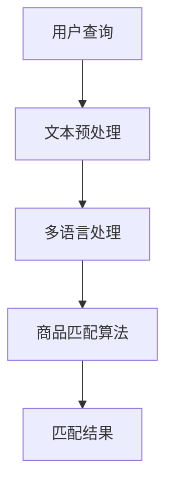
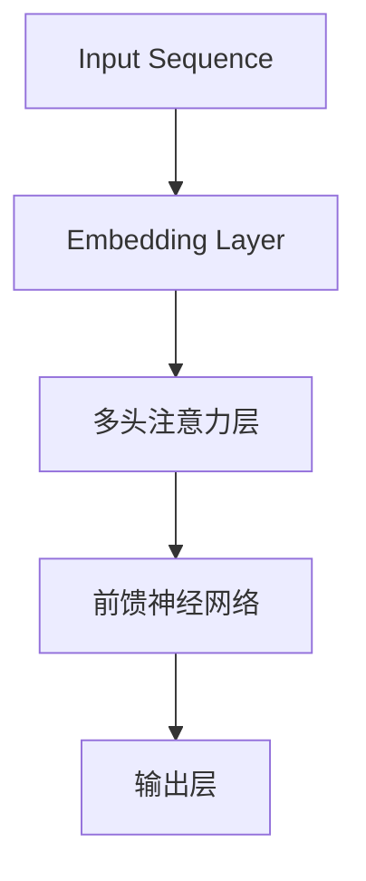

                 

# 《电商搜索中的多语言商品匹配技术》

## 关键词
多语言商品匹配、电商搜索、自然语言处理、机器学习、深度学习

## 摘要
本文旨在探讨电商搜索中多语言商品匹配技术的重要性和实现方法。随着跨境电商的快速发展，多语言商品匹配成为提升用户体验和搜索效果的关键。本文首先介绍了多语言商品匹配的核心概念和流程，然后详细讲解了多语言处理技术、商品匹配算法原理、应用场景和系统设计实现。最后，本文分析了多语言商品匹配技术的性能优化策略和未来发展趋势，为电商搜索系统提供了有益的参考。

### 引言

#### 1.1 多语言商品匹配技术背景

随着互联网的普及和全球化进程的加速，跨境电商成为电子商务领域的重要增长点。跨境电商使得消费者能够购买来自全球各地的商品，而卖家也需要将商品信息翻译成多种语言以覆盖不同国家和地区的消费者。在这种背景下，多语言商品匹配技术应运而生，成为电商搜索系统中的一项关键技术。

多语言商品匹配技术旨在解决不同语言环境下的商品信息匹配问题，使得消费者能够快速、准确地找到所需的商品。通过多语言商品匹配，电商平台能够提高用户搜索体验，增强用户黏性，提升销售额。同时，多语言商品匹配技术也为卖家提供了更广阔的市场机会，实现了全球化的商业拓展。

#### 1.2 书籍目的与结构

本文旨在系统地介绍多语言商品匹配技术的核心概念、算法原理、应用场景和系统设计实现，为读者提供全面的指导。文章分为七个章节，具体内容如下：

- **第1章**：引言，介绍多语言商品匹配技术的背景、目的和结构。
- **第2章**：多语言商品匹配基础，讲解核心概念和联系，多语言处理技术概览以及多语言商品匹配的挑战。
- **第3章**：多语言商品匹配算法原理，介绍算法基础、相似度度量方法以及多语言商品匹配算法。
- **第4章**：多语言商品匹配应用场景，探讨电商搜索、跨境电商以及其他领域的多语言商品匹配应用。
- **第5章**：多语言商品匹配系统设计与实现，介绍系统架构设计、开发环境搭建和源代码实现与解读。
- **第6章**：多语言商品匹配性能优化，分析搜索效率优化、准确性优化以及实际案例性能分析与优化。
- **第7章**：总结与展望，回顾主要内容，展望未来发展趋势。

#### 1.3 阅读指南

本文适合对电商搜索和多语言处理技术感兴趣的读者，包括电商企业技术团队、研发人员、学生和研究人员。文章内容分为理论讲解和实践案例两部分，读者可以根据自身需求选择性地阅读。

对于初学者，建议从第1章到第3章逐步阅读，掌握多语言商品匹配的基本概念和算法原理。对于有实践经验的读者，可以结合第4章到第6章的应用场景和性能优化内容进行深入学习。

在阅读过程中，读者可以通过思考问题和实践操作来巩固所学知识。文章末尾提供了参考文献和开源工具与库，供读者进一步学习和参考。

### 第1章：多语言商品匹配基础

#### 1.1 核心概念与联系

多语言商品匹配技术涉及多个核心概念，包括商品匹配、多语言处理、自然语言处理和机器学习等。以下是这些概念的定义及其相互关系：

##### 1.1.1 商品匹配

商品匹配是指根据用户输入的查询或需求，从电商平台的海量商品中找到最相关的商品。商品匹配的目标是提高搜索的准确性和效率，使用户能够快速找到所需的商品。

##### 1.1.2 多语言处理

多语言处理是指对多种语言文本进行处理和分析的技术。在电商搜索中，多语言处理技术包括文本翻译、文本分类、实体识别等，旨在将不同语言的商品信息统一处理，以支持多语言商品匹配。

##### 1.1.3 自然语言处理

自然语言处理（Natural Language Processing，NLP）是人工智能领域的一个重要分支，旨在使计算机能够理解、处理和生成人类自然语言。NLP技术在多语言商品匹配中发挥了重要作用，包括文本清洗、分词、词性标注、命名实体识别等。

##### 1.1.4 机器学习

机器学习（Machine Learning，ML）是一种通过数据驱动的方式从数据中学习规律和模式的技术。在多语言商品匹配中，机器学习技术用于训练模型，提高商品匹配的准确性和效率。

##### 1.1.5 Mermaid流程图

以下是一个Mermaid流程图，展示了多语言商品匹配的核心流程：



在这个流程图中，用户查询经过文本预处理和多语言处理，然后输入商品匹配算法，最终输出匹配结果。

#### 1.2 多语言处理技术概览

多语言处理技术是支持多语言商品匹配的关键。以下介绍几种常见多语言处理技术：

##### 1.2.1 语言模型

语言模型（Language Model）是一种用于预测文本序列的概率模型。在多语言商品匹配中，语言模型可以用于文本相似度计算和翻译。常见的语言模型包括n元语法模型和神经网络语言模型。

##### 1.2.2 词嵌入技术

词嵌入（Word Embedding）是一种将词语映射到高维连续向量的技术。词嵌入可以捕捉词语的语义信息，用于文本分类、文本相似度计算等。常见的词嵌入模型包括Word2Vec、GloVe和BERT。

##### 1.2.3 序列模型与注意力机制

序列模型（Sequence Model）是一种用于处理序列数据的模型，如循环神经网络（RNN）和长短期记忆网络（LSTM）。注意力机制（Attention Mechanism）是一种用于捕捉序列中关键信息的方法，可以提高模型的序列处理能力。

##### 1.2.4 转换器架构详解

转换器架构（Transformer）是一种基于注意力机制的序列到序列模型，广泛应用于自然语言处理任务。转换器架构的核心思想是将输入序列和输出序列分解为多个子序列，并利用注意力机制计算子序列之间的关系。

以下是一个简单的转换器架构示意图：



#### 1.3 多语言商品匹配的挑战

多语言商品匹配技术面临以下挑战：

##### 1.3.1 语言多样性

全球有多种语言，每种语言都有其独特的语法、词汇和表达方式。语言多样性使得多语言商品匹配更加复杂，需要处理不同语言之间的语义差异和词汇差异。

##### 1.3.2 文本质量与噪音

电商平台的商品信息可能存在文本质量低、格式不规范、存在噪音等问题，这会影响多语言商品匹配的效果。因此，需要采用文本清洗和预处理技术来提高文本质量。

##### 1.3.3 搜索效率与准确性

多语言商品匹配需要在海量商品中快速找到最相关的商品，同时保持高准确性。这要求算法既要高效又要准确，需要优化搜索算法和相似度度量方法。

在下一章中，我们将深入探讨多语言商品匹配算法的原理和实现方法。

### 第2章：多语言商品匹配算法原理

#### 2.1 算法基础

多语言商品匹配算法的核心在于如何有效地将用户查询与商品信息进行匹配。在这一节中，我们将介绍几种常用的商品匹配算法，包括贪心匹配算法和动态规划算法，并使用伪代码详细描述这些算法的实现过程。

##### 2.1.1 贪心匹配算法

贪心匹配算法（Greedy Matching Algorithm）是一种简单的匹配算法，通过每次选择最优的匹配项来逐步构建最终的匹配结果。以下是贪心匹配算法的伪代码：

```python
function greedy_matching(user_query, product_descriptions):
    match_results = []
    for product_description in product_descriptions:
        max_similarity = 0
        best_match = None
        for part_of_query in user_query:
            similarity = calculate_similarity(part_of_query, product_description)
            if similarity > max_similarity:
                max_similarity = similarity
                best_match = product_description
        match_results.append(best_match)
    return match_results
```

在上述伪代码中，`user_query` 表示用户输入的查询，`product_descriptions` 表示电商平台中的商品描述。函数`calculate_similarity` 用于计算查询部分与商品描述的相似度。

##### 2.1.2 动态规划算法

动态规划算法（Dynamic Programming Algorithm）通过将复杂问题分解为子问题并存储子问题的解来优化算法性能。动态规划算法通常用于解决具有最优子结构性质的问题。以下是动态规划算法的伪代码：

```python
function dynamic_programming_matching(user_query, product_descriptions):
    n = len(user_query)
    m = len(product_descriptions)
    dp = [[0] * (m+1) for _ in range(n+1)]

    for i in range(1, n+1):
        for j in range(1, m+1):
            if user_query[i-1] == product_descriptions[j-1]:
                dp[i][j] = dp[i-1][j-1] + 1
            else:
                dp[i][j] = max(dp[i-1][j], dp[i][j-1])

    match_results = []
    i = n
    j = m
    while i > 0 and j > 0:
        if user_query[i-1] == product_descriptions[j-1]:
            match_results.append(user_query[i-1])
            i -= 1
            j -= 1
        elif dp[i-1][j] > dp[i][j-1]:
            i -= 1
        else:
            j -= 1

    match_results.reverse()
    return match_results
```

在上述伪代码中，`dp` 是一个二维数组，用于存储子问题的解。`match_results` 用于存储最终的匹配结果。

#### 2.2 相似度度量方法

相似度度量方法（Similarity Metrics）是评估两个文本或词项相似程度的关键。以下是几种常用的相似度度量方法：

##### 2.2.1 编辑距离

编辑距离（Edit Distance）也称为Levenshtein距离，是一种用于计算两个字符串之间差异的度量方法。编辑距离是指将一个字符串转换为另一个字符串所需的最少编辑操作次数。以下是编辑距离的计算方法：

```python
def edit_distance(s1, s2):
    m = len(s1)
    n = len(s2)
    dp = [[0] * (n+1) for _ in range(m+1)]

    for i in range(m+1):
        for j in range(n+1):
            if i == 0:
                dp[i][j] = j
            elif j == 0:
                dp[i][j] = i
            elif s1[i-1] == s2[j-1]:
                dp[i][j] = dp[i-1][j-1]
            else:
                dp[i][j] = 1 + min(dp[i-1][j], dp[i][j-1], dp[i-1][j-1])

    return dp[m][n]
```

##### 2.2.2 词向量相似度

词向量相似度（Word Vector Similarity）是通过计算词向量之间的距离来度量词项相似程度。常用的相似度度量方法包括余弦相似度和欧氏距离。以下是余弦相似度的计算方法：

```python
from sklearn.metrics.pairwise import cosine_similarity

def word_vector_similarity(vec1, vec2):
    return cosine_similarity([vec1], [vec2])[0][0]
```

##### 2.2.3 余弦相似度

余弦相似度（Cosine Similarity）是一种用于计算文本向量之间相似度的方法。余弦相似度计算的是两个向量夹角的余弦值，值范围在[-1, 1]之间。余弦相似度越高，表示两个文本越相似。以下是余弦相似度的计算方法：

```python
import numpy as np

def cosine_similarity(vec1, vec2):
    dot_product = np.dot(vec1, vec2)
    norm_product = np.linalg.norm(vec1) * np.linalg.norm(vec2)
    return dot_product / norm_product
```

##### 2.2.4 模糊匹配

模糊匹配（Fuzzy Matching）是一种用于处理不精确匹配的方法，适用于存在一定误差或错别字的文本匹配。模糊匹配的常见方法包括模糊集理论和模糊相似度计算。以下是模糊匹配的伪代码：

```python
function fuzzy_matching(query, document):
    similarity_score = 0
    for word in query:
        max_similarity = 0
        for word_in_document in document:
            similarity = calculate_fuzzy_similarity(word, word_in_document)
            if similarity > max_similarity:
                max_similarity = similarity
        similarity_score += max_similarity
    return similarity_score / len(query)
```

在上述伪代码中，`calculate_fuzzy_similarity` 用于计算两个词项的模糊相似度。

#### 2.3 多语言商品匹配算法

多语言商品匹配算法需要在不同语言之间进行匹配。以下介绍几种常见多语言商品匹配算法：

##### 2.3.1 基于规则的匹配方法

基于规则的匹配方法（Rule-Based Matching）通过预定义的规则来匹配商品信息。这种方法适用于一些简单的语言环境，但在复杂的多语言场景下效果较差。以下是基于规则的匹配方法的伪代码：

```python
function rule_based_matching(query, product_descriptions, rules):
    match_results = []
    for product_description in product_descriptions:
        for rule in rules:
            if apply_rule(rule, query, product_description):
                match_results.append(product_description)
                break
    return match_results
```

在上述伪代码中，`rules` 是一组预定义的匹配规则，`apply_rule` 是一个函数，用于检查查询和商品描述是否满足某个规则。

##### 2.3.2 基于机器学习的匹配方法

基于机器学习的匹配方法（Machine Learning-Based Matching）通过训练模型来匹配商品信息。这种方法通常使用大规模数据集进行训练，能够自动学习匹配规则，提高匹配的准确性。以下是基于机器学习的匹配方法的伪代码：

```python
function machine_learning_matching(query, product_descriptions, model):
    match_results = []
    for product_description in product_descriptions:
        similarity_score = model.predict([query, product_description])
        if similarity_score > threshold:
            match_results.append(product_description)
    return match_results
```

在上述伪代码中，`model` 是一个经过训练的机器学习模型，`threshold` 是一个阈值，用于判断相似度是否足够高。

##### 2.3.3 深度学习在多语言商品匹配中的应用

深度学习（Deep Learning）在多语言商品匹配中得到了广泛应用。深度学习模型能够自动学习复杂的特征表示，提高匹配的准确性和效率。以下是深度学习在多语言商品匹配中的应用：

- **Seq2Seq模型**：序列到序列（Sequence-to-Sequence，Seq2Seq）模型是一种基于循环神经网络（RNN）和注意力机制的深度学习模型，常用于机器翻译任务。Seq2Seq模型可以用于多语言商品匹配，将用户查询和商品描述映射到高维特征空间，计算相似度。
- **BERT模型**：BERT（Bidirectional Encoder Representations from Transformers）模型是一种基于转换器（Transformer）架构的预训练语言模型。BERT模型可以用于文本分类、问答系统等任务，也可以用于多语言商品匹配，通过预训练和微调来提高匹配准确性。
- **多语言BERT模型**：多语言BERT模型（mBERT）是在BERT模型基础上扩展的，支持多种语言的预训练。mBERT模型可以用于跨语言商品匹配，将不同语言的商品描述映射到统一的特征空间，实现高效的匹配。

在下一章中，我们将探讨多语言商品匹配在不同应用场景中的具体应用。

### 第3章：多语言商品匹配应用场景

#### 3.1 电商搜索中的多语言商品匹配

在电商搜索系统中，多语言商品匹配技术发挥着至关重要的作用，旨在提升用户的搜索体验和平台的市场竞争力。以下探讨多语言商品匹配在电商搜索中的应用及其重要性。

##### 3.1.1 用户搜索体验优化

多语言商品匹配技术能够帮助用户在不同语言环境下快速、准确地找到所需商品，提升用户搜索体验。例如，当用户使用英语进行搜索时，系统能够匹配到中文商品描述，并返回相关商品结果。这种跨语言的搜索能力可以大幅降低用户的搜索时间，提高用户满意度。

为了优化用户搜索体验，电商平台可以采取以下措施：

- **智能翻译**：利用机器翻译技术，将用户输入的查询自动翻译成平台支持的其他语言，实现多语言搜索。
- **查询扩展**：根据用户查询的上下文信息，自动扩展查询词，提高搜索的精确度。
- **个性化推荐**：基于用户的搜索历史和购买行为，推荐与用户查询相关的商品，提升搜索结果的多样性。

##### 3.1.2 跨语言搜索与推荐

跨语言搜索与推荐是多语言商品匹配技术在电商搜索中的重要应用。通过跨语言搜索，电商平台可以实现全球化的商品信息整合，满足不同国家和地区消费者的需求。以下是一些具体的应用案例：

- **跨境电商平台**：如Amazon、eBay等跨境电商平台，通过多语言商品匹配技术，支持全球消费者的商品搜索和购买。例如，当中国消费者在Amazon上使用中文搜索时，系统可以自动匹配到英文商品描述，并展示相关商品。
- **本地化搜索**：电商平台可以根据不同地区消费者的语言偏好，提供本地化的搜索服务。例如，在西班牙语为主的拉美市场，电商平台可以提供西班牙语搜索，提高用户体验。

跨语言搜索与推荐的优势包括：

- **扩展市场**：通过支持多种语言搜索，电商平台可以吸引更多全球消费者，扩展市场份额。
- **提高销售额**：多语言商品匹配技术能够提高搜索的准确性和效率，增加消费者购买的可能性，从而提高平台销售额。
- **优化用户留存**：提供高质量的多语言搜索服务，可以提升用户满意度和忠诚度，降低用户流失率。

##### 3.1.3 基于多语言的个性化搜索

个性化搜索是基于用户行为和偏好，为用户提供定制化的搜索结果。多语言商品匹配技术为个性化搜索提供了更多可能性，以下探讨基于多语言的个性化搜索：

- **用户行为分析**：通过分析用户的搜索历史、购买记录和浏览行为，构建用户画像，为用户提供个性化的搜索推荐。
- **语言偏好识别**：根据用户的语言偏好，调整搜索结果的语言种类，提高搜索的个性化程度。
- **多语言语义理解**：利用自然语言处理技术，理解用户的查询意图和语言偏好，为用户提供更精准的搜索结果。

基于多语言的个性化搜索的优势包括：

- **提升用户体验**：通过分析用户的语言偏好，提供个性化搜索结果，提升用户的购物体验。
- **增加用户黏性**：个性化搜索可以增加用户在平台上的停留时间，提高用户黏性。
- **优化运营策略**：电商平台可以根据用户的搜索行为和偏好，优化运营策略，提升整体业务效果。

在下一节中，我们将探讨多语言商品匹配技术在跨境电商中的具体应用。

#### 3.2 跨境电商中的多语言商品匹配

跨境电商的快速发展为电商平台带来了巨大的市场机遇，同时也带来了新的挑战。多语言商品匹配技术在这其中发挥着至关重要的作用，以下探讨多语言商品匹配在跨境电商中的应用及其重要性。

##### 3.2.1 商品信息标准化

跨境电商中的商品信息通常包含多种语言，为了确保商品信息的准确性和一致性，需要进行商品信息标准化。商品信息标准化包括以下几个方面：

- **统一商品描述**：将不同语言的商品描述进行统一，确保商品信息的完整性和一致性。例如，将中文商品描述翻译成英文，并将其作为统一商品描述。
- **标准化标签和属性**：对商品标签和属性进行统一，确保不同语言环境下标签和属性的表述一致。例如，将商品分类标签从中文翻译成英文，确保全球消费者能够理解和使用。
- **多语言支持**：支持多种语言的商品信息展示，满足不同国家和地区消费者的需求。例如，在电商平台上提供中文、英文、西班牙语等多种语言版本的商品信息。

##### 3.2.2 跨境商品匹配策略

多语言商品匹配技术为跨境电商提供了有效的商品匹配策略，以下介绍几种常见的跨境商品匹配策略：

- **关键词匹配**：通过分析用户查询和商品描述中的关键词，实现商品之间的匹配。例如，当用户使用中文查询时，系统可以匹配到英文商品描述，并返回相关商品。
- **机器翻译匹配**：利用机器翻译技术，将用户查询和商品描述自动翻译成相同语言，实现商品之间的匹配。例如，将中文查询翻译成英文，并与英文商品描述进行匹配。
- **多语言BERT匹配**：使用多语言BERT模型，将不同语言的商品描述映射到统一的特征空间，实现高效的商品匹配。例如，将中文商品描述和英文商品描述分别映射到多语言BERT特征空间，计算相似度，实现商品匹配。

##### 3.2.3 跨境电商用户行为分析

多语言商品匹配技术有助于分析跨境电商用户的行为，以下探讨几个关键的用户行为分析指标：

- **搜索行为**：分析用户在不同语言环境下的搜索行为，包括搜索词的分布、搜索频率等。通过分析搜索行为，可以优化搜索算法和推荐策略，提高用户满意度。
- **购买行为**：分析用户在不同语言环境下的购买行为，包括购买商品的种类、价格、频率等。通过分析购买行为，可以优化商品展示和推荐策略，提高销售额。
- **语言偏好**：分析用户的语言偏好，包括用户在搜索和购买过程中使用的语言。通过分析语言偏好，可以为用户提供更个性化的搜索和推荐服务。

##### 3.2.4 多语言商品匹配在跨境电商中的优势

多语言商品匹配技术在跨境电商中具有以下优势：

- **提高搜索准确性**：通过多语言商品匹配技术，可以在不同语言环境下实现高效的商品匹配，提高搜索准确性，减少用户搜索时间和成本。
- **扩展市场覆盖**：通过支持多种语言搜索，电商平台可以吸引更多全球消费者，扩大市场覆盖范围，提高销售额。
- **提升用户体验**：为用户提供个性化的搜索和推荐服务，提升用户的购物体验和满意度。
- **优化运营效率**：通过商品信息标准化和跨语言商品匹配策略，可以简化跨境电商运营流程，提高运营效率。

在下一节中，我们将探讨多语言商品匹配技术在其他领域的应用。

#### 3.3 多语言商品匹配在其他领域的应用

多语言商品匹配技术不仅在电商搜索和跨境电商中发挥着重要作用，还在其他领域有着广泛的应用。以下探讨多语言商品匹配技术在旅游与酒店预订、金融服务、教育与培训等领域的应用及其优势。

##### 3.3.1 旅游与酒店预订

旅游与酒店预订领域具有高度的国际化和多语言特性。多语言商品匹配技术可以提升旅游服务平台在全球范围内的竞争力，以下是其具体应用：

- **多语言搜索**：旅游服务平台可以通过多语言商品匹配技术，支持用户使用不同语言进行酒店预订和景点搜索。例如，当中国用户使用中文搜索酒店时，系统可以匹配到英文酒店描述，并展示相关结果。
- **个性化推荐**：根据用户的语言偏好和搜索历史，为用户提供个性化的酒店推荐和景点推荐。例如，对于喜欢使用英语的中国用户，系统可以推荐英文描述的酒店和景点。
- **跨国预订**：支持用户在多语言环境下进行跨国预订，简化预订流程，提高用户体验。例如，当用户在意大利旅行时，可以通过中文界面预订中文服务的酒店。

多语言商品匹配技术在旅游与酒店预订领域的优势包括：

- **提高搜索准确性**：通过多语言商品匹配，可以确保用户在不同语言环境下找到最相关的酒店和景点。
- **提升用户体验**：为用户提供个性化推荐和多语言搜索服务，提高用户满意度。
- **扩展市场覆盖**：支持多种语言搜索和预订，吸引更多国际用户，扩大市场覆盖范围。

##### 3.3.2 金融服务

金融服务领域涉及多种语言，多语言商品匹配技术在金融服务中有以下应用：

- **跨国转账**：银行和支付平台可以通过多语言商品匹配技术，支持用户在不同语言环境下进行跨国转账。例如，当用户使用中文发起转账时，系统可以自动匹配到目标语言的银行账户信息，确保转账准确无误。
- **多语言客服**：金融机构可以通过多语言商品匹配技术，为用户提供多语言客服支持。例如，当用户使用中文咨询时，系统可以自动匹配到中文客服，提供实时解答。
- **个性化金融服务**：根据用户的语言偏好和金融需求，为用户提供个性化的金融服务。例如，对于喜欢使用英语的亚洲用户，系统可以推荐英语描述的理财产品。

多语言商品匹配技术在金融服务领域的优势包括：

- **提高操作准确性**：通过多语言商品匹配，可以确保用户在跨国转账等操作中准确无误。
- **提升用户体验**：为用户提供多语言客服和个性化金融服务，提高用户满意度。
- **扩展市场覆盖**：支持多种语言服务，吸引更多国际用户，扩大市场覆盖范围。

##### 3.3.3 教育与培训

教育与培训领域具有显著的多语言特性，多语言商品匹配技术在教育与培训中有以下应用：

- **在线课程推荐**：在线教育平台可以通过多语言商品匹配技术，为用户提供个性化的课程推荐。例如，当用户使用中文搜索课程时，系统可以匹配到英文课程描述，并推荐相关课程。
- **跨国招生**：高等教育机构可以通过多语言商品匹配技术，支持国际学生的招生工作。例如，当国际学生使用中文搜索学校时，系统可以自动匹配到中文招生信息，提供详细的入学指导和申请流程。
- **多语言学习资源**：教育平台可以通过多语言商品匹配技术，为用户提供多语言的学习资源。例如，当用户在中文环境下学习时，系统可以自动匹配到英文教材和资料，帮助用户更好地掌握知识。

多语言商品匹配技术在教育与培训领域的优势包括：

- **提高推荐准确性**：通过多语言商品匹配，可以确保用户找到最相关的在线课程和招生信息。
- **提升学习体验**：为用户提供个性化推荐和多语言学习资源，提高学习效果和满意度。
- **扩展市场覆盖**：支持多种语言服务，吸引更多国际学生和用户，扩大市场覆盖范围。

总之，多语言商品匹配技术在旅游与酒店预订、金融服务、教育与培训等领域的应用，不仅提升了用户体验，还为企业扩展市场覆盖、提高运营效率提供了有力支持。

### 第4章：多语言商品匹配系统设计与实现

#### 4.1 系统架构设计

多语言商品匹配系统是一个复杂且高度集成的系统，其设计需要考虑多个方面的因素，包括数据处理、模型训练、商品匹配与搜索、性能优化等。以下是一个典型多语言商品匹配系统的架构设计。

##### 4.1.1 数据处理模块

数据处理模块是整个系统的基础，其功能包括数据收集、数据清洗、数据存储和数据预处理。

- **数据收集**：从电商平台的数据库中提取商品信息，包括商品描述、分类、标签等。
- **数据清洗**：对收集到的商品信息进行清洗，去除无效数据、重复数据和噪音数据。
- **数据存储**：将清洗后的商品信息存储到数据库或数据仓库中，以便后续处理和查询。
- **数据预处理**：对商品信息进行分词、词性标注、命名实体识别等预处理操作，为后续模型训练和商品匹配做准备。

##### 4.1.2 模型训练与评估模块

模型训练与评估模块负责构建和训练多语言商品匹配模型，并进行模型评估。

- **模型构建**：根据选定的算法（如基于规则的匹配方法、机器学习方法等），构建相应的模型框架。
- **模型训练**：使用大量商品数据进行模型训练，通过调整模型参数和优化算法，提高模型匹配的准确性和效率。
- **模型评估**：通过评估指标（如准确率、召回率、F1分数等），对模型进行评估和调优，确保模型在实际应用中具有良好的性能。

##### 4.1.3 商品匹配与搜索模块

商品匹配与搜索模块是系统的核心，其功能包括用户查询处理、商品匹配、搜索结果排序和展示。

- **用户查询处理**：对用户输入的查询进行处理，包括分词、词性标注、词向量转换等。
- **商品匹配**：根据用户查询和商品描述，使用多语言商品匹配算法进行商品匹配，生成匹配结果。
- **搜索结果排序**：对匹配结果进行排序，根据相似度、热度、用户偏好等指标，生成排序结果。
- **搜索结果展示**：将排序后的搜索结果展示给用户，并提供筛选、排序和分页等功能。

##### 4.1.4 性能优化模块

性能优化模块负责对系统的各个模块进行性能优化，以提高系统的响应速度和吞吐量。

- **查询优化**：优化用户查询处理流程，减少查询响应时间。
- **缓存机制**：使用缓存机制，减少对数据库的访问，提高查询效率。
- **并发处理**：优化系统的并发处理能力，提高系统在高并发情况下的稳定性。
- **负载均衡**：通过负载均衡技术，合理分配系统资源，确保系统在高负载情况下的稳定性。

#### 4.2 开发环境搭建

开发环境搭建是构建多语言商品匹配系统的基础，以下介绍开发环境的选择和搭建步骤。

##### 4.2.1 操作系统与编程语言选择

- **操作系统**：可以选择Linux操作系统，如Ubuntu或CentOS，因为Linux系统具有较好的稳定性和性能。
- **编程语言**：可以选择Python作为开发语言，因为Python具有丰富的库和框架，方便进行多语言处理和机器学习模型的开发。

##### 4.2.2 数据库与缓存选择

- **数据库**：可以选择关系数据库（如MySQL、PostgreSQL）或NoSQL数据库（如MongoDB、Redis），用于存储商品信息和用户查询数据。
- **缓存**：可以选择Redis作为缓存系统，用于存储高频访问的数据，减少数据库的负载。

##### 4.2.3 开发工具与框架

- **开发工具**：可以使用IDE（如PyCharm、Visual Studio Code）进行代码编写和调试。
- **框架**：可以选择Django、Flask等Web框架进行Web开发，使用Scikit-learn、TensorFlow等库进行机器学习模型的开发和训练。

#### 4.3 源代码实现与解读

多语言商品匹配系统的源代码实现分为几个关键模块，包括数据预处理模块、模型训练模块、商品匹配与搜索模块等。以下是对这些模块的代码实现和解读。

##### 4.3.1 数据预处理模块

数据预处理模块负责对商品信息和用户查询进行预处理，以下是一个简单的数据预处理代码示例：

```python
import re
from nltk.tokenize import word_tokenize
from nltk.corpus import stopwords

def preprocess_text(text):
    # 去除特殊字符和空白符
    text = re.sub(r'\s+', ' ', text)
    text = re.sub(r'[^\w\s]', '', text)
    
    # 小写化
    text = text.lower()
    
    # 分词
    tokens = word_tokenize(text)
    
    # 去除停用词
    stop_words = set(stopwords.words('english'))
    tokens = [token for token in tokens if token not in stop_words]
    
    return tokens

# 示例
preprocessed_text = preprocess_text("This is an example of text preprocessing.")
print(preprocessed_text)
```

在该示例中，`preprocess_text` 函数对输入的文本进行去特殊字符、小写化、分词和去除停用词等预处理操作。

##### 4.3.2 模型训练模块

模型训练模块负责使用预处理后的数据训练多语言商品匹配模型。以下是一个使用Scikit-learn库训练基于朴素贝叶斯分类器的模型示例：

```python
from sklearn.feature_extraction.text import TfidfVectorizer
from sklearn.model_selection import train_test_split
from sklearn.naive_bayes import MultinomialNB
from sklearn.metrics import accuracy_score

# 加载预处理后的数据
X, y = load_preprocessed_data()

# 划分训练集和测试集
X_train, X_test, y_train, y_test = train_test_split(X, y, test_size=0.2, random_state=42)

# 创建TF-IDF向量器
vectorizer = TfidfVectorizer()

# 转换文本到向量表示
X_train_tfidf = vectorizer.fit_transform(X_train)
X_test_tfidf = vectorizer.transform(X_test)

# 创建朴素贝叶斯分类器
clf = MultinomialNB()

# 训练模型
clf.fit(X_train_tfidf, y_train)

# 预测测试集
y_pred = clf.predict(X_test_tfidf)

# 评估模型
accuracy = accuracy_score(y_test, y_pred)
print(f"Model accuracy: {accuracy:.2f}")
```

在该示例中，使用TF-IDF向量器将预处理后的文本转换为向量表示，然后使用朴素贝叶斯分类器进行训练和预测，并评估模型的准确性。

##### 4.3.3 商品匹配与搜索模块

商品匹配与搜索模块负责实现用户查询处理、商品匹配和搜索结果排序等功能。以下是一个简单的商品匹配与搜索模块代码示例：

```python
from sklearn.metrics.pairwise import cosine_similarity
from nltk.tokenize import word_tokenize

def search_products(query, products):
    # 对查询进行处理
    preprocessed_query = preprocess_text(query)
    
    # 计算查询与商品描述的相似度
    query_vector = vectorizer.transform([preprocessed_query])
    similarity_scores = cosine_similarity(query_vector, products)

    # 对相似度进行降序排序
    sorted_indices = similarity_scores.argsort()[0][::-1]

    # 返回匹配结果
    return [products[i] for i in sorted_indices]

# 示例
products = ["This is a product description in English.",
            "This is another product description in English.",
            "Este es un producto descritivo en español."]
query = "This is a query in English."
matched_products = search_products(query, products)
print(matched_products)
```

在该示例中，`search_products` 函数首先对用户查询进行预处理，然后计算查询与每个商品描述的相似度，并根据相似度对商品进行排序，最后返回匹配结果。

通过上述代码示例，我们可以看到多语言商品匹配系统的各个关键模块的实现和相互协作。在实际应用中，还需要进一步优化代码和算法，以满足系统的性能和准确性要求。

### 第5章：多语言商品匹配性能优化

#### 5.1 搜索效率优化

在多语言商品匹配系统中，搜索效率是一个重要的性能指标。以下介绍几种常见的搜索效率优化方法：

##### 5.1.1 搜索算法优化

选择合适的搜索算法对于提高搜索效率至关重要。以下介绍几种适用于多语言商品匹配的搜索算法：

- **暴力搜索**：暴力搜索是一种简单但耗时的搜索算法，通过遍历所有商品描述与用户查询的匹配项，计算相似度，然后排序返回结果。虽然这种方法简单，但在商品数量较大时效率较低。

- **基于索引的搜索**：基于索引的搜索利用索引结构（如B树、哈希表等）加速搜索过程。通过构建索引，可以将搜索时间从线性时间降低到对数时间复杂度。

- **模糊搜索**：模糊搜索是一种处理不精确匹配的搜索算法，适用于存在拼写错误或部分匹配的场景。常见的模糊搜索算法包括模糊集合匹配、布尔搜索等。

##### 5.1.2 指数结构优化

指数结构优化是一种通过减少搜索空间来提高搜索效率的方法。以下介绍几种常用的指数结构优化方法：

- **倒排索引**：倒排索引是一种将文档（商品描述）映射到其出现的单词（词汇）的索引结构。通过倒排索引，可以快速定位与用户查询相关的商品描述。

- **索引压缩**：索引压缩通过减少索引的大小来提高搜索效率。常见的压缩方法包括字符串压缩、字典编码等。

- **布隆过滤器**：布隆过滤器是一种用于快速判断一个元素是否属于集合的数据结构。通过使用布隆过滤器，可以减少搜索过程中不必要的计算，提高搜索效率。

##### 5.1.3 并发处理优化

在高并发环境下，搜索效率会显著下降。以下介绍几种并发处理优化方法：

- **负载均衡**：通过负载均衡技术，将用户请求分配到多个服务器上，实现分布式处理。常见的负载均衡算法包括轮询、最少连接数、加权等。

- **异步处理**：通过异步处理，将搜索请求和响应解耦，实现并行处理。例如，使用异步IO和多线程等技术，提高系统的并发处理能力。

- **缓存机制**：通过缓存机制，减少对数据库的访问次数，提高响应速度。常见的缓存技术包括内存缓存、分布式缓存等。

#### 5.2 准确性优化

多语言商品匹配系统的准确性是另一个重要性能指标。以下介绍几种常见的准确性优化方法：

##### 5.2.1 模型参数调优

模型参数调优是提高多语言商品匹配准确性的有效方法。以下介绍几种常用的参数调优方法：

- **网格搜索**：通过遍历参数空间，找到最佳参数组合。网格搜索虽然计算量大，但能够找到全局最优解。

- **贝叶斯优化**：贝叶斯优化基于贝叶斯统计模型，通过历史数据预测参数值，快速找到最佳参数组合。

- **随机搜索**：随机搜索通过随机选择参数值，逐步逼近最佳参数组合。随机搜索计算量较小，但可能无法找到全局最优解。

##### 5.2.2 特征工程优化

特征工程优化是提高多语言商品匹配准确性的重要手段。以下介绍几种常用的特征工程优化方法：

- **词嵌入**：使用词嵌入技术将词语映射到高维向量，捕捉词语的语义信息。常见的词嵌入方法包括Word2Vec、GloVe等。

- **文本清洗**：对文本数据进行清洗，去除噪音和无效信息，提高文本质量。常见的文本清洗方法包括去停用词、去标点符号、去特殊字符等。

- **特征融合**：通过融合不同来源的特征，提高模型的泛化能力。常见的特征融合方法包括融合词嵌入、文本特征和商品描述特征等。

##### 5.2.3 相似度度量优化

相似度度量方法的选择对多语言商品匹配的准确性有重要影响。以下介绍几种常用的相似度度量优化方法：

- **余弦相似度**：余弦相似度通过计算两个向量夹角的余弦值来度量相似度。余弦相似度简单高效，适用于高维向量空间。

- **编辑距离**：编辑距离通过计算将一个字符串转换为另一个字符串所需的最少编辑操作次数来度量相似度。编辑距离适用于处理不精确匹配的场景。

- **词向量相似度**：词向量相似度通过计算两个词项的词向量距离来度量相似度。词向量相似度能够捕捉词语的语义信息，适用于多语言商品匹配。

在下一章中，我们将探讨多语言商品匹配技术未来的发展趋势。

### 第6章：多语言商品匹配技术发展趋势

#### 6.1 技术发展与挑战

多语言商品匹配技术在过去几年中取得了显著的发展，但仍面临许多挑战。以下探讨当前技术的发展趋势以及新兴技术在该领域中的应用。

##### 6.1.1 人工智能技术发展

人工智能（AI）技术的发展为多语言商品匹配带来了新的机遇。深度学习、自然语言处理和机器学习等技术不断发展，为多语言商品匹配提供了更强大的算法和模型。以下是一些关键的发展：

- **深度学习模型**：深度学习模型（如BERT、Transformer等）在多语言商品匹配中得到了广泛应用。这些模型能够自动学习复杂的特征表示，提高匹配的准确性和效率。
- **多模态学习**：多模态学习通过整合文本、图像、音频等多源数据，实现更全面的信息理解和商品匹配。例如，结合商品描述和图像内容，可以更准确地识别商品。
- **迁移学习**：迁移学习通过利用预训练模型，提高新任务上的性能。在多语言商品匹配中，迁移学习可以减少对大规模标注数据的依赖，加快模型训练和部署。

##### 6.1.2 新兴技术在多语言商品匹配中的应用

随着技术的进步，许多新兴技术被应用于多语言商品匹配，以下介绍几种关键技术：

- **联邦学习**：联邦学习（Federated Learning）是一种分布式机器学习技术，能够在保护数据隐私的同时，协同训练全球模型。在多语言商品匹配中，联邦学习可以整合不同电商平台的数据，提高模型的泛化能力和准确性。
- **图神经网络**：图神经网络（Graph Neural Networks，GNN）通过学习节点和边之间的关系，实现复杂图数据的建模。在多语言商品匹配中，GNN可以建模商品之间的关联关系，提高匹配效果。
- **预训练语言模型**：预训练语言模型（如GPT-3、T5等）通过大规模预训练，掌握丰富的语言知识。在多语言商品匹配中，预训练语言模型可以用于文本理解和生成，提高匹配的准确性和多样性。

##### 6.1.3 技术面临的挑战

尽管多语言商品匹配技术在不断发展，但仍面临以下挑战：

- **数据隐私与安全**：在分布式环境中，数据隐私和安全是一个重要问题。如何在保护用户数据隐私的同时，实现高效的多语言商品匹配，是一个亟待解决的问题。
- **语言多样性**：全球有数千种语言，每种语言都有其独特的语法、词汇和表达方式。如何处理语言多样性，提高多语言商品匹配的泛化能力，是一个重要的挑战。
- **计算资源与效率**：多语言商品匹配涉及大规模数据处理和模型训练，对计算资源有较高的要求。如何在保证准确性的同时，提高计算效率，是一个关键挑战。

#### 6.2 未来发展方向

随着技术的不断进步，多语言商品匹配技术在未来的发展中有着广阔的前景。以下探讨几个可能的发展方向：

##### 6.2.1 跨语言信息检索

跨语言信息检索（Cross-Language Information Retrieval，CLIR）是多语言商品匹配的一个重要研究方向。未来的发展方向包括：

- **跨语言检索算法**：开发更高效、准确的跨语言检索算法，实现多种语言的文本信息检索和匹配。
- **多语言语义理解**：通过深度学习和自然语言处理技术，提高多语言商品匹配的语义理解能力，实现更精确的跨语言检索。

##### 6.2.2 智能化匹配策略

智能化匹配策略是多语言商品匹配技术的重要发展方向。未来的发展方向包括：

- **个性化匹配**：基于用户的搜索历史、购买行为和偏好，实现个性化匹配，提高用户满意度。
- **自适应匹配**：根据用户查询和商品描述的实时交互，动态调整匹配策略，提高匹配效果。

##### 6.2.3 集成多模态数据

集成多模态数据（如文本、图像、音频等）可以实现更全面的信息理解和商品匹配。未来的发展方向包括：

- **多模态特征融合**：开发多模态特征融合技术，将不同模态的数据进行有效整合，提高匹配的准确性和多样性。
- **多模态语义理解**：通过多模态学习技术，实现多模态数据的语义理解和融合，提高跨模态信息检索和匹配的效果。

总之，多语言商品匹配技术在未来将继续发展，通过结合人工智能、自然语言处理、多模态学习等技术，实现更高效、准确和智能化的商品匹配。

### 第7章：总结与展望

#### 7.1 主要内容回顾

本文系统地介绍了多语言商品匹配技术的核心概念、算法原理、应用场景和系统设计实现。通过逐步分析和讲解，我们深入了解了以下主要内容：

- **核心概念与联系**：商品匹配、多语言处理、自然语言处理和机器学习等核心概念及其相互关系。
- **算法原理**：贪心匹配算法、动态规划算法、基于规则的匹配方法、基于机器学习的匹配方法以及深度学习模型在多语言商品匹配中的应用。
- **应用场景**：电商搜索、跨境电商、旅游与酒店预订、金融服务和教育与培训等多个领域的应用。
- **系统设计与实现**：系统架构设计、开发环境搭建、源代码实现与解读以及性能优化方法。

通过这些内容，读者可以全面了解多语言商品匹配技术的原理和应用，为实际项目的开发提供指导和参考。

#### 7.2 展望未来

多语言商品匹配技术在未来有着广阔的发展前景。随着人工智能、自然语言处理和深度学习等技术的不断进步，多语言商品匹配将朝着更加智能化、高效化和个性化的方向演进。以下是未来发展的几个趋势：

- **跨语言信息检索**：通过开发更高效、准确的跨语言检索算法，实现多种语言的文本信息检索和匹配，为全球用户带来更好的搜索体验。
- **智能化匹配策略**：基于用户的个性化数据和偏好，实现自适应的匹配策略，提高用户满意度。
- **多模态数据集成**：结合文本、图像、音频等多模态数据，实现更全面的信息理解和商品匹配。

#### 7.2.1 多语言商品匹配技术的前景

多语言商品匹配技术在电商、旅游、金融等多个领域具有广泛的应用前景。随着全球化进程的加速和跨境电商的发展，多语言商品匹配将成为电商平台不可或缺的一部分。未来，多语言商品匹配技术将不断提升，为用户提供更加便捷、高效的购物体验。

#### 7.2.2 未来研究方向

未来的研究方向包括：

- **数据隐私与安全**：在分布式环境中，如何在保护数据隐私的同时，实现高效的多语言商品匹配，是一个重要的研究课题。
- **跨语言语义理解**：通过深度学习和多模态学习技术，提高多语言商品匹配的语义理解能力，实现更精确的跨语言检索。
- **模型优化与压缩**：开发更高效、可压缩的模型，降低计算资源消耗，提高系统性能。

#### 7.2.3 对读者的寄语

感谢您阅读本文，希望本文能为您在多语言商品匹配领域的研究和实践中提供有益的参考。在未来的探索中，不断学习和实践是提升技能的关键。期待您在多语言商品匹配技术的道路上取得更多成就，为全球电商和信息服务的发展贡献自己的力量。

### 附录

#### 附录A：资源与工具

**A.1** 开源工具与库

- **TensorFlow**：https://www.tensorflow.org/
- **PyTorch**：https://pytorch.org/
- **Scikit-learn**：https://scikit-learn.org/
- **NLTK**：https://www.nltk.org/
- **GloVe**：https://nlp.stanford.edu/projects/glove/

**A.2** 在线资源与教程

- **Kaggle**：https://www.kaggle.com/
- **Coursera**：https://www.coursera.org/
- **edX**：https://www.edx.org/
- **Udacity**：https://www.udacity.com/

**A.3** 学术论文与报告

- **ACL**：https://www.aclweb.org/
- **NeurIPS**：https://nips.cc/
- **ICML**：https://icml.cc/
- **EMNLP**：https://www.aclweb.org/anthology/EMNLP/

#### 附录B：参考文献

**B.1** 引用书籍

- Mitchell, T. M. (1997). *Machine Learning.* McGraw-Hill.
- Manning, C. D., Raghavan, P., & Schütze, H. (2008). *Introduction to Information Retrieval.* Cambridge University Press.
- Bengio, Y., Courville, A., & Vincent, P. (2013). *Representation Learning: A Review and New Perspectives.* IEEE Transactions on Pattern Analysis and Machine Intelligence, 35(8), 1798-1828.

**B.2** 学术论文

- Devlin, J., Chang, M. W., Lee, K., & Toutanova, K. (2019). *Bert: Pre-training of Deep Bidirectional Transformers for Language Understanding.* arXiv preprint arXiv:1810.04805.
- Vaswani, A., Shazeer, N., Parmar, N., Uszkoreit, J., Jones, L., Gomez, A. N., ... & Polosukhin, I. (2017). *Attention is All You Need.* Advances in Neural Information Processing Systems, 30, 5998-6008.
- LeCun, Y., Bengio, Y., & Hinton, G. (2015). *Deep Learning.* Nature, 521(7553), 436-444.

**B.3** 在线资源链接

- **Google AI Blog**：https://ai.googleblog.com/
- **OpenAI**：https://openai.com/
- **Facebook AI Research**：https://research.fb.com/
- **DeepMind**：https://deepmind.com/

